cola Report for Consensus Partitioning
==================

**Date**: 2019-12-03 19:47:30 CET, **cola version**: 1.3.2

----------------------------------------------------------------

<style type='text/css'>

body, td, th {
   font-family: Arial,Helvetica,sans-serif;
   background-color: white;
   font-size: 13px;
  max-width: 800px;
  margin: auto;
  margin-left:210px;
  padding: 0px 10px 0px 10px;
  border-left: 1px solid #EEEEEE;
  line-height: 150%;
}

tt, code, pre {
   font-family: 'DejaVu Sans Mono', 'Droid Sans Mono', 'Lucida Console', Consolas, Monaco, 

monospace;
}

h1 {
   font-size:2.2em;
}

h2 {
   font-size:1.8em;
}

h3 {
   font-size:1.4em;
}

h4 {
   font-size:1.0em;
}

h5 {
   font-size:0.9em;
}

h6 {
   font-size:0.8em;
}

a {
  text-decoration: none;
  color: #0366d6;
}

a:hover {
  text-decoration: underline;
}

a:visited {
   color: #0366d6;
}

pre, img {
  max-width: 100%;
}
pre {
  overflow-x: auto;
}
pre code {
   display: block; padding: 0.5em;
}

code {
  font-size: 92%;
  border: 1px solid #ccc;
}

code[class] {
  background-color: #F8F8F8;
}

table, td, th {
  border: 1px solid #ccc;
}

blockquote {
   color:#666666;
   margin:0;
   padding-left: 1em;
   border-left: 0.5em #EEE solid;
}

hr {
   height: 0px;
   border-bottom: none;
   border-top-width: thin;
   border-top-style: dotted;
   border-top-color: #999999;
}

@media print {
   * {
      background: transparent !important;
      color: black !important;
      filter:none !important;
      -ms-filter: none !important;
   }

   body {
      font-size:12pt;
      max-width:100%;
   }

   a, a:visited {
      text-decoration: underline;
   }

   hr {
      visibility: hidden;
      page-break-before: always;
   }

   pre, blockquote {
      padding-right: 1em;
      page-break-inside: avoid;
   }

   tr, img {
      page-break-inside: avoid;
   }

   img {
      max-width: 100% !important;
   }

   @page :left {
      margin: 15mm 20mm 15mm 10mm;
   }

   @page :right {
      margin: 15mm 10mm 15mm 20mm;
   }

   p, h2, h3 {
      orphans: 3; widows: 3;
   }

   h2, h3 {
      page-break-after: avoid;
   }
}
</style>


## Summary


All available functions which can be applied to this `res_list` object:


```r
res_list
```

```
#> A 'ConsensusPartitionList' object with 24 methods.
#>   On a matrix with 51776 rows and 143 columns.
#>   Top rows are extracted by 'SD, CV, MAD, ATC' methods.
#>   Subgroups are detected by 'hclust, kmeans, skmeans, pam, mclust, NMF' method.
#>   Number of partitions are tried for k = 2, 3, 4, 5, 6.
#>   Performed in total 30000 partitions by row resampling.
#> 
#> Following methods can be applied to this 'ConsensusPartitionList' object:
#>  [1] "cola_report"           "collect_classes"       "collect_plots"         "collect_stats"        
#>  [5] "colnames"              "functional_enrichment" "get_anno_col"          "get_anno"             
#>  [9] "get_classes"           "get_matrix"            "get_membership"        "get_stats"            
#> [13] "is_best_k"             "is_stable_k"           "ncol"                  "nrow"                 
#> [17] "rownames"              "show"                  "suggest_best_k"        "test_to_known_factors"
#> [21] "top_rows_heatmap"      "top_rows_overlap"     
#> 
#> You can get result for a single method by, e.g. object["SD", "hclust"] or object["SD:hclust"]
#> or a subset of methods by object[c("SD", "CV")], c("hclust", "kmeans")]
```

The call of `run_all_consensus_partition_methods()` was:


```
#> run_all_consensus_partition_methods(data = mat, mc.cores = 4, anno = anno)
```

Dimension of the input matrix:


```r
mat = get_matrix(res_list)
dim(mat)
```

```
#> [1] 51776   143
```

### Density distribution

The density distribution for each sample is visualized as in one column in the
following heatmap. The clustering is based on the distance which is the
Kolmogorov-Smirnov statistic between two distributions.


```r
library(ComplexHeatmap)
densityHeatmap(mat, top_annotation = HeatmapAnnotation(df = get_anno(res_list), 
    col = get_anno_col(res_list)), ylab = "value", cluster_columns = TRUE, show_column_names = FALSE,
    mc.cores = 4)
```


### Suggest the best k


Folowing table shows the best `k` (number of partitions) for each combination
of top-value methods and partition methods. Clicking on the method name in
the table goes to the section for a single combination of methods.

[The cola vignette](http://bioconductor.org/packages/devel/bioc/vignettes/cola/inst/doc/cola.html#toc_13)
explains the definition of the metrics used for determining the best
number of partitions.


```r
suggest_best_k(res_list)
```


|                            | The best k| 1-PAC| Mean silhouette| Concordance|   |Optional k |
|:---------------------------|----------:|-----:|---------------:|-----------:|:--|:----------|
|[ATC:kmeans](#ATC-kmeans)   |          4| 1.000|           0.950|       0.969|** |2          |
|[ATC:pam](#ATC-pam)         |          4| 0.972|           0.962|       0.983|** |2          |
|[ATC:mclust](#ATC-mclust)   |          2| 0.941|           0.950|       0.978|*  |           |
|[ATC:skmeans](#ATC-skmeans) |          5| 0.929|           0.871|       0.941|*  |2,3,4      |
|[CV:pam](#CV-pam)           |          2| 0.917|           0.935|       0.957|*  |           |
|[ATC:NMF](#ATC-NMF)         |          2| 0.914|           0.943|       0.975|*  |           |
|[CV:NMF](#CV-NMF)           |          3| 0.911|           0.910|       0.961|*  |           |
|[MAD:mclust](#MAD-mclust)   |          4| 0.848|           0.851|       0.921|   |           |
|[MAD:NMF](#MAD-NMF)         |          3| 0.825|           0.877|       0.948|   |           |
|[MAD:skmeans](#MAD-skmeans) |          3| 0.822|           0.835|       0.930|   |           |
|[CV:skmeans](#CV-skmeans)   |          3| 0.792|           0.846|       0.932|   |           |
|[SD:NMF](#SD-NMF)           |          3| 0.790|           0.846|       0.938|   |           |
|[CV:kmeans](#CV-kmeans)     |          3| 0.719|           0.852|       0.913|   |           |
|[CV:mclust](#CV-mclust)     |          2| 0.681|           0.880|       0.937|   |           |
|[ATC:hclust](#ATC-hclust)   |          3| 0.620|           0.828|       0.900|   |           |
|[SD:mclust](#SD-mclust)     |          2| 0.612|           0.776|       0.899|   |           |
|[MAD:kmeans](#MAD-kmeans)   |          2| 0.551|           0.900|       0.898|   |           |
|[SD:kmeans](#SD-kmeans)     |          2| 0.505|           0.866|       0.885|   |           |
|[SD:skmeans](#SD-skmeans)   |          2| 0.503|           0.848|       0.898|   |           |
|[MAD:pam](#MAD-pam)         |          2| 0.494|           0.811|       0.913|   |           |
|[SD:pam](#SD-pam)           |          2| 0.378|           0.843|       0.887|   |           |
|[SD:hclust](#SD-hclust)     |          3| 0.304|           0.601|       0.802|   |           |
|[CV:hclust](#CV-hclust)     |          3| 0.211|           0.491|       0.697|   |           |
|[MAD:hclust](#MAD-hclust)   |          2| 0.203|           0.699|       0.818|   |           |

\*\*: 1-PAC > 0.95, \*: 1-PAC > 0.9


### CDF of consensus matrices

Cumulative distribution function curves of consensus matrix for all methods.


```r
collect_plots(res_list, fun = plot_ecdf)
```


### Consensus heatmap

Consensus heatmaps for all methods. ([What is a consensus heatmap?](http://bioconductor.org/packages/devel/bioc/vignettes/cola/inst/doc/cola.html#toc_9))


<style type='text/css'>


.ui-helper-hidden {
	display: none;
}
.ui-helper-hidden-accessible {
	border: 0;
	clip: rect(0 0 0 0);
	height: 1px;
	margin: -1px;
	overflow: hidden;
	padding: 0;
	position: absolute;
	width: 1px;
}
.ui-helper-reset {
	margin: 0;
	padding: 0;
	border: 0;
	outline: 0;
	line-height: 1.3;
	text-decoration: none;
	font-size: 100%;
	list-style: none;
}
.ui-helper-clearfix:before,
.ui-helper-clearfix:after {
	content: "";
	display: table;
	border-collapse: collapse;
}
.ui-helper-clearfix:after {
	clear: both;
}
.ui-helper-zfix {
	width: 100%;
	height: 100%;
	top: 0;
	left: 0;
	position: absolute;
	opacity: 0;
	filter:Alpha(Opacity=0); 
}

.ui-front {
	z-index: 100;
}


.ui-state-disabled {
	cursor: default !important;
	pointer-events: none;
}


.ui-icon {
	display: inline-block;
	vertical-align: middle;
	margin-top: -.25em;
	position: relative;
	text-indent: -99999px;
	overflow: hidden;
	background-repeat: no-repeat;
}

.ui-widget-icon-block {
	left: 50%;
	margin-left: -8px;
	display: block;
}


.ui-widget-overlay {
	position: fixed;
	top: 0;
	left: 0;
	width: 100%;
	height: 100%;
}
.ui-accordion .ui-accordion-header {
	display: block;
	cursor: pointer;
	position: relative;
	margin: 2px 0 0 0;
	padding: .5em .5em .5em .7em;
	font-size: 100%;
}
.ui-accordion .ui-accordion-content {
	padding: 1em 2.2em;
	border-top: 0;
	overflow: auto;
}
.ui-autocomplete {
	position: absolute;
	top: 0;
	left: 0;
	cursor: default;
}
.ui-menu {
	list-style: none;
	padding: 0;
	margin: 0;
	display: block;
	outline: 0;
}
.ui-menu .ui-menu {
	position: absolute;
}
.ui-menu .ui-menu-item {
	margin: 0;
	cursor: pointer;
	
	list-style-image: url("data:image/gif;base64,R0lGODlhAQABAIAAAAAAAP///yH5BAEAAAAALAAAAAABAAEAAAIBRAA7");
}
.ui-menu .ui-menu-item-wrapper {
	position: relative;
	padding: 3px 1em 3px .4em;
}
.ui-menu .ui-menu-divider {
	margin: 5px 0;
	height: 0;
	font-size: 0;
	line-height: 0;
	border-width: 1px 0 0 0;
}
.ui-menu .ui-state-focus,
.ui-menu .ui-state-active {
	margin: -1px;
}


.ui-menu-icons {
	position: relative;
}
.ui-menu-icons .ui-menu-item-wrapper {
	padding-left: 2em;
}


.ui-menu .ui-icon {
	position: absolute;
	top: 0;
	bottom: 0;
	left: .2em;
	margin: auto 0;
}


.ui-menu .ui-menu-icon {
	left: auto;
	right: 0;
}
.ui-button {
	padding: .4em 1em;
	display: inline-block;
	position: relative;
	line-height: normal;
	margin-right: .1em;
	cursor: pointer;
	vertical-align: middle;
	text-align: center;
	-webkit-user-select: none;
	-moz-user-select: none;
	-ms-user-select: none;
	user-select: none;

	
	overflow: visible;
}

.ui-button,
.ui-button:link,
.ui-button:visited,
.ui-button:hover,
.ui-button:active {
	text-decoration: none;
}


.ui-button-icon-only {
	width: 2em;
	box-sizing: border-box;
	text-indent: -9999px;
	white-space: nowrap;
}


input.ui-button.ui-button-icon-only {
	text-indent: 0;
}


.ui-button-icon-only .ui-icon {
	position: absolute;
	top: 50%;
	left: 50%;
	margin-top: -8px;
	margin-left: -8px;
}

.ui-button.ui-icon-notext .ui-icon {
	padding: 0;
	width: 2.1em;
	height: 2.1em;
	text-indent: -9999px;
	white-space: nowrap;

}

input.ui-button.ui-icon-notext .ui-icon {
	width: auto;
	height: auto;
	text-indent: 0;
	white-space: normal;
	padding: .4em 1em;
}


input.ui-button::-moz-focus-inner,
button.ui-button::-moz-focus-inner {
	border: 0;
	padding: 0;
}
.ui-controlgroup {
	vertical-align: middle;
	display: inline-block;
}
.ui-controlgroup > .ui-controlgroup-item {
	float: left;
	margin-left: 0;
	margin-right: 0;
}
.ui-controlgroup > .ui-controlgroup-item:focus,
.ui-controlgroup > .ui-controlgroup-item.ui-visual-focus {
	z-index: 9999;
}
.ui-controlgroup-vertical > .ui-controlgroup-item {
	display: block;
	float: none;
	width: 100%;
	margin-top: 0;
	margin-bottom: 0;
	text-align: left;
}
.ui-controlgroup-vertical .ui-controlgroup-item {
	box-sizing: border-box;
}
.ui-controlgroup .ui-controlgroup-label {
	padding: .4em 1em;
}
.ui-controlgroup .ui-controlgroup-label span {
	font-size: 80%;
}
.ui-controlgroup-horizontal .ui-controlgroup-label + .ui-controlgroup-item {
	border-left: none;
}
.ui-controlgroup-vertical .ui-controlgroup-label + .ui-controlgroup-item {
	border-top: none;
}
.ui-controlgroup-horizontal .ui-controlgroup-label.ui-widget-content {
	border-right: none;
}
.ui-controlgroup-vertical .ui-controlgroup-label.ui-widget-content {
	border-bottom: none;
}


.ui-controlgroup-vertical .ui-spinner-input {

	
	width: 75%;
	width: calc( 100% - 2.4em );
}
.ui-controlgroup-vertical .ui-spinner .ui-spinner-up {
	border-top-style: solid;
}

.ui-checkboxradio-label .ui-icon-background {
	box-shadow: inset 1px 1px 1px #ccc;
	border-radius: .12em;
	border: none;
}
.ui-checkboxradio-radio-label .ui-icon-background {
	width: 16px;
	height: 16px;
	border-radius: 1em;
	overflow: visible;
	border: none;
}
.ui-checkboxradio-radio-label.ui-checkboxradio-checked .ui-icon,
.ui-checkboxradio-radio-label.ui-checkboxradio-checked:hover .ui-icon {
	background-image: none;
	width: 8px;
	height: 8px;
	border-width: 4px;
	border-style: solid;
}
.ui-checkboxradio-disabled {
	pointer-events: none;
}
.ui-datepicker {
	width: 17em;
	padding: .2em .2em 0;
	display: none;
}
.ui-datepicker .ui-datepicker-header {
	position: relative;
	padding: .2em 0;
}
.ui-datepicker .ui-datepicker-prev,
.ui-datepicker .ui-datepicker-next {
	position: absolute;
	top: 2px;
	width: 1.8em;
	height: 1.8em;
}
.ui-datepicker .ui-datepicker-prev-hover,
.ui-datepicker .ui-datepicker-next-hover {
	top: 1px;
}
.ui-datepicker .ui-datepicker-prev {
	left: 2px;
}
.ui-datepicker .ui-datepicker-next {
	right: 2px;
}
.ui-datepicker .ui-datepicker-prev-hover {
	left: 1px;
}
.ui-datepicker .ui-datepicker-next-hover {
	right: 1px;
}
.ui-datepicker .ui-datepicker-prev span,
.ui-datepicker .ui-datepicker-next span {
	display: block;
	position: absolute;
	left: 50%;
	margin-left: -8px;
	top: 50%;
	margin-top: -8px;
}
.ui-datepicker .ui-datepicker-title {
	margin: 0 2.3em;
	line-height: 1.8em;
	text-align: center;
}
.ui-datepicker .ui-datepicker-title select {
	font-size: 1em;
	margin: 1px 0;
}
.ui-datepicker select.ui-datepicker-month,
.ui-datepicker select.ui-datepicker-year {
	width: 45%;
}
.ui-datepicker table {
	width: 100%;
	font-size: .9em;
	border-collapse: collapse;
	margin: 0 0 .4em;
}
.ui-datepicker th {
	padding: .7em .3em;
	text-align: center;
	font-weight: bold;
	border: 0;
}
.ui-datepicker td {
	border: 0;
	padding: 1px;
}
.ui-datepicker td span,
.ui-datepicker td a {
	display: block;
	padding: .2em;
	text-align: right;
	text-decoration: none;
}
.ui-datepicker .ui-datepicker-buttonpane {
	background-image: none;
	margin: .7em 0 0 0;
	padding: 0 .2em;
	border-left: 0;
	border-right: 0;
	border-bottom: 0;
}
.ui-datepicker .ui-datepicker-buttonpane button {
	float: right;
	margin: .5em .2em .4em;
	cursor: pointer;
	padding: .2em .6em .3em .6em;
	width: auto;
	overflow: visible;
}
.ui-datepicker .ui-datepicker-buttonpane button.ui-datepicker-current {
	float: left;
}


.ui-datepicker.ui-datepicker-multi {
	width: auto;
}
.ui-datepicker-multi .ui-datepicker-group {
	float: left;
}
.ui-datepicker-multi .ui-datepicker-group table {
	width: 95%;
	margin: 0 auto .4em;
}
.ui-datepicker-multi-2 .ui-datepicker-group {
	width: 50%;
}
.ui-datepicker-multi-3 .ui-datepicker-group {
	width: 33.3%;
}
.ui-datepicker-multi-4 .ui-datepicker-group {
	width: 25%;
}
.ui-datepicker-multi .ui-datepicker-group-last .ui-datepicker-header,
.ui-datepicker-multi .ui-datepicker-group-middle .ui-datepicker-header {
	border-left-width: 0;
}
.ui-datepicker-multi .ui-datepicker-buttonpane {
	clear: left;
}
.ui-datepicker-row-break {
	clear: both;
	width: 100%;
	font-size: 0;
}


.ui-datepicker-rtl {
	direction: rtl;
}
.ui-datepicker-rtl .ui-datepicker-prev {
	right: 2px;
	left: auto;
}
.ui-datepicker-rtl .ui-datepicker-next {
	left: 2px;
	right: auto;
}
.ui-datepicker-rtl .ui-datepicker-prev:hover {
	right: 1px;
	left: auto;
}
.ui-datepicker-rtl .ui-datepicker-next:hover {
	left: 1px;
	right: auto;
}
.ui-datepicker-rtl .ui-datepicker-buttonpane {
	clear: right;
}
.ui-datepicker-rtl .ui-datepicker-buttonpane button {
	float: left;
}
.ui-datepicker-rtl .ui-datepicker-buttonpane button.ui-datepicker-current,
.ui-datepicker-rtl .ui-datepicker-group {
	float: right;
}
.ui-datepicker-rtl .ui-datepicker-group-last .ui-datepicker-header,
.ui-datepicker-rtl .ui-datepicker-group-middle .ui-datepicker-header {
	border-right-width: 0;
	border-left-width: 1px;
}


.ui-datepicker .ui-icon {
	display: block;
	text-indent: -99999px;
	overflow: hidden;
	background-repeat: no-repeat;
	left: .5em;
	top: .3em;
}
.ui-dialog {
	position: absolute;
	top: 0;
	left: 0;
	padding: .2em;
	outline: 0;
}
.ui-dialog .ui-dialog-titlebar {
	padding: .4em 1em;
	position: relative;
}
.ui-dialog .ui-dialog-title {
	float: left;
	margin: .1em 0;
	white-space: nowrap;
	width: 90%;
	overflow: hidden;
	text-overflow: ellipsis;
}
.ui-dialog .ui-dialog-titlebar-close {
	position: absolute;
	right: .3em;
	top: 50%;
	width: 20px;
	margin: -10px 0 0 0;
	padding: 1px;
	height: 20px;
}
.ui-dialog .ui-dialog-content {
	position: relative;
	border: 0;
	padding: .5em 1em;
	background: none;
	overflow: auto;
}
.ui-dialog .ui-dialog-buttonpane {
	text-align: left;
	border-width: 1px 0 0 0;
	background-image: none;
	margin-top: .5em;
	padding: .3em 1em .5em .4em;
}
.ui-dialog .ui-dialog-buttonpane .ui-dialog-buttonset {
	float: right;
}
.ui-dialog .ui-dialog-buttonpane button {
	margin: .5em .4em .5em 0;
	cursor: pointer;
}
.ui-dialog .ui-resizable-n {
	height: 2px;
	top: 0;
}
.ui-dialog .ui-resizable-e {
	width: 2px;
	right: 0;
}
.ui-dialog .ui-resizable-s {
	height: 2px;
	bottom: 0;
}
.ui-dialog .ui-resizable-w {
	width: 2px;
	left: 0;
}
.ui-dialog .ui-resizable-se,
.ui-dialog .ui-resizable-sw,
.ui-dialog .ui-resizable-ne,
.ui-dialog .ui-resizable-nw {
	width: 7px;
	height: 7px;
}
.ui-dialog .ui-resizable-se {
	right: 0;
	bottom: 0;
}
.ui-dialog .ui-resizable-sw {
	left: 0;
	bottom: 0;
}
.ui-dialog .ui-resizable-ne {
	right: 0;
	top: 0;
}
.ui-dialog .ui-resizable-nw {
	left: 0;
	top: 0;
}
.ui-draggable .ui-dialog-titlebar {
	cursor: move;
}
.ui-draggable-handle {
	-ms-touch-action: none;
	touch-action: none;
}
.ui-resizable {
	position: relative;
}
.ui-resizable-handle {
	position: absolute;
	font-size: 0.1px;
	display: block;
	-ms-touch-action: none;
	touch-action: none;
}
.ui-resizable-disabled .ui-resizable-handle,
.ui-resizable-autohide .ui-resizable-handle {
	display: none;
}
.ui-resizable-n {
	cursor: n-resize;
	height: 7px;
	width: 100%;
	top: -5px;
	left: 0;
}
.ui-resizable-s {
	cursor: s-resize;
	height: 7px;
	width: 100%;
	bottom: -5px;
	left: 0;
}
.ui-resizable-e {
	cursor: e-resize;
	width: 7px;
	right: -5px;
	top: 0;
	height: 100%;
}
.ui-resizable-w {
	cursor: w-resize;
	width: 7px;
	left: -5px;
	top: 0;
	height: 100%;
}
.ui-resizable-se {
	cursor: se-resize;
	width: 12px;
	height: 12px;
	right: 1px;
	bottom: 1px;
}
.ui-resizable-sw {
	cursor: sw-resize;
	width: 9px;
	height: 9px;
	left: -5px;
	bottom: -5px;
}
.ui-resizable-nw {
	cursor: nw-resize;
	width: 9px;
	height: 9px;
	left: -5px;
	top: -5px;
}
.ui-resizable-ne {
	cursor: ne-resize;
	width: 9px;
	height: 9px;
	right: -5px;
	top: -5px;
}
.ui-progressbar {
	height: 2em;
	text-align: left;
	overflow: hidden;
}
.ui-progressbar .ui-progressbar-value {
	margin: -1px;
	height: 100%;
}
.ui-progressbar .ui-progressbar-overlay {
	background: url("data:image/gif;base64,R0lGODlhKAAoAIABAAAAAP///yH/C05FVFNDQVBFMi4wAwEAAAAh+QQJAQABACwAAAAAKAAoAAACkYwNqXrdC52DS06a7MFZI+4FHBCKoDeWKXqymPqGqxvJrXZbMx7Ttc+w9XgU2FB3lOyQRWET2IFGiU9m1frDVpxZZc6bfHwv4c1YXP6k1Vdy292Fb6UkuvFtXpvWSzA+HycXJHUXiGYIiMg2R6W459gnWGfHNdjIqDWVqemH2ekpObkpOlppWUqZiqr6edqqWQAAIfkECQEAAQAsAAAAACgAKAAAApSMgZnGfaqcg1E2uuzDmmHUBR8Qil95hiPKqWn3aqtLsS18y7G1SzNeowWBENtQd+T1JktP05nzPTdJZlR6vUxNWWjV+vUWhWNkWFwxl9VpZRedYcflIOLafaa28XdsH/ynlcc1uPVDZxQIR0K25+cICCmoqCe5mGhZOfeYSUh5yJcJyrkZWWpaR8doJ2o4NYq62lAAACH5BAkBAAEALAAAAAAoACgAAAKVDI4Yy22ZnINRNqosw0Bv7i1gyHUkFj7oSaWlu3ovC8GxNso5fluz3qLVhBVeT/Lz7ZTHyxL5dDalQWPVOsQWtRnuwXaFTj9jVVh8pma9JjZ4zYSj5ZOyma7uuolffh+IR5aW97cHuBUXKGKXlKjn+DiHWMcYJah4N0lYCMlJOXipGRr5qdgoSTrqWSq6WFl2ypoaUAAAIfkECQEAAQAsAAAAACgAKAAAApaEb6HLgd/iO7FNWtcFWe+ufODGjRfoiJ2akShbueb0wtI50zm02pbvwfWEMWBQ1zKGlLIhskiEPm9R6vRXxV4ZzWT2yHOGpWMyorblKlNp8HmHEb/lCXjcW7bmtXP8Xt229OVWR1fod2eWqNfHuMjXCPkIGNileOiImVmCOEmoSfn3yXlJWmoHGhqp6ilYuWYpmTqKUgAAIfkECQEAAQAsAAAAACgAKAAAApiEH6kb58biQ3FNWtMFWW3eNVcojuFGfqnZqSebuS06w5V80/X02pKe8zFwP6EFWOT1lDFk8rGERh1TTNOocQ61Hm4Xm2VexUHpzjymViHrFbiELsefVrn6XKfnt2Q9G/+Xdie499XHd2g4h7ioOGhXGJboGAnXSBnoBwKYyfioubZJ2Hn0RuRZaflZOil56Zp6iioKSXpUAAAh+QQJAQABACwAAAAAKAAoAAACkoQRqRvnxuI7kU1a1UU5bd5tnSeOZXhmn5lWK3qNTWvRdQxP8qvaC+/yaYQzXO7BMvaUEmJRd3TsiMAgswmNYrSgZdYrTX6tSHGZO73ezuAw2uxuQ+BbeZfMxsexY35+/Qe4J1inV0g4x3WHuMhIl2jXOKT2Q+VU5fgoSUI52VfZyfkJGkha6jmY+aaYdirq+lQAACH5BAkBAAEALAAAAAAoACgAAAKWBIKpYe0L3YNKToqswUlvznigd4wiR4KhZrKt9Upqip61i9E3vMvxRdHlbEFiEXfk9YARYxOZZD6VQ2pUunBmtRXo1Lf8hMVVcNl8JafV38aM2/Fu5V16Bn63r6xt97j09+MXSFi4BniGFae3hzbH9+hYBzkpuUh5aZmHuanZOZgIuvbGiNeomCnaxxap2upaCZsq+1kAACH5BAkBAAEALAAAAAAoACgAAAKXjI8By5zf4kOxTVrXNVlv1X0d8IGZGKLnNpYtm8Lr9cqVeuOSvfOW79D9aDHizNhDJidFZhNydEahOaDH6nomtJjp1tutKoNWkvA6JqfRVLHU/QUfau9l2x7G54d1fl995xcIGAdXqMfBNadoYrhH+Mg2KBlpVpbluCiXmMnZ2Sh4GBqJ+ckIOqqJ6LmKSllZmsoq6wpQAAAh+QQJAQABACwAAAAAKAAoAAAClYx/oLvoxuJDkU1a1YUZbJ59nSd2ZXhWqbRa2/gF8Gu2DY3iqs7yrq+xBYEkYvFSM8aSSObE+ZgRl1BHFZNr7pRCavZ5BW2142hY3AN/zWtsmf12p9XxxFl2lpLn1rseztfXZjdIWIf2s5dItwjYKBgo9yg5pHgzJXTEeGlZuenpyPmpGQoKOWkYmSpaSnqKileI2FAAACH5BAkBAAEALAAAAAAoACgAAAKVjB+gu+jG4kORTVrVhRlsnn2dJ3ZleFaptFrb+CXmO9OozeL5VfP99HvAWhpiUdcwkpBH3825AwYdU8xTqlLGhtCosArKMpvfa1mMRae9VvWZfeB2XfPkeLmm18lUcBj+p5dnN8jXZ3YIGEhYuOUn45aoCDkp16hl5IjYJvjWKcnoGQpqyPlpOhr3aElaqrq56Bq7VAAAOw==");
	height: 100%;
	filter: alpha(opacity=25); 
	opacity: 0.25;
}
.ui-progressbar-indeterminate .ui-progressbar-value {
	background-image: none;
}
.ui-selectable {
	-ms-touch-action: none;
	touch-action: none;
}
.ui-selectable-helper {
	position: absolute;
	z-index: 100;
	border: 1px dotted black;
}
.ui-selectmenu-menu {
	padding: 0;
	margin: 0;
	position: absolute;
	top: 0;
	left: 0;
	display: none;
}
.ui-selectmenu-menu .ui-menu {
	overflow: auto;
	overflow-x: hidden;
	padding-bottom: 1px;
}
.ui-selectmenu-menu .ui-menu .ui-selectmenu-optgroup {
	font-size: 1em;
	font-weight: bold;
	line-height: 1.5;
	padding: 2px 0.4em;
	margin: 0.5em 0 0 0;
	height: auto;
	border: 0;
}
.ui-selectmenu-open {
	display: block;
}
.ui-selectmenu-text {
	display: block;
	margin-right: 20px;
	overflow: hidden;
	text-overflow: ellipsis;
}
.ui-selectmenu-button.ui-button {
	text-align: left;
	white-space: nowrap;
	width: 14em;
}
.ui-selectmenu-icon.ui-icon {
	float: right;
	margin-top: 0;
}
.ui-slider {
	position: relative;
	text-align: left;
}
.ui-slider .ui-slider-handle {
	position: absolute;
	z-index: 2;
	width: 1.2em;
	height: 1.2em;
	cursor: default;
	-ms-touch-action: none;
	touch-action: none;
}
.ui-slider .ui-slider-range {
	position: absolute;
	z-index: 1;
	font-size: .7em;
	display: block;
	border: 0;
	background-position: 0 0;
}


.ui-slider.ui-state-disabled .ui-slider-handle,
.ui-slider.ui-state-disabled .ui-slider-range {
	filter: inherit;
}

.ui-slider-horizontal {
	height: .8em;
}
.ui-slider-horizontal .ui-slider-handle {
	top: -.3em;
	margin-left: -.6em;
}
.ui-slider-horizontal .ui-slider-range {
	top: 0;
	height: 100%;
}
.ui-slider-horizontal .ui-slider-range-min {
	left: 0;
}
.ui-slider-horizontal .ui-slider-range-max {
	right: 0;
}

.ui-slider-vertical {
	width: .8em;
	height: 100px;
}
.ui-slider-vertical .ui-slider-handle {
	left: -.3em;
	margin-left: 0;
	margin-bottom: -.6em;
}
.ui-slider-vertical .ui-slider-range {
	left: 0;
	width: 100%;
}
.ui-slider-vertical .ui-slider-range-min {
	bottom: 0;
}
.ui-slider-vertical .ui-slider-range-max {
	top: 0;
}
.ui-sortable-handle {
	-ms-touch-action: none;
	touch-action: none;
}
.ui-spinner {
	position: relative;
	display: inline-block;
	overflow: hidden;
	padding: 0;
	vertical-align: middle;
}
.ui-spinner-input {
	border: none;
	background: none;
	color: inherit;
	padding: .222em 0;
	margin: .2em 0;
	vertical-align: middle;
	margin-left: .4em;
	margin-right: 2em;
}
.ui-spinner-button {
	width: 1.6em;
	height: 50%;
	font-size: .5em;
	padding: 0;
	margin: 0;
	text-align: center;
	position: absolute;
	cursor: default;
	display: block;
	overflow: hidden;
	right: 0;
}

.ui-spinner a.ui-spinner-button {
	border-top-style: none;
	border-bottom-style: none;
	border-right-style: none;
}
.ui-spinner-up {
	top: 0;
}
.ui-spinner-down {
	bottom: 0;
}
.ui-tabs {
	position: relative;
	padding: .2em;
}
.ui-tabs .ui-tabs-nav {
	margin: 0;
	padding: .2em .2em 0;
}
.ui-tabs .ui-tabs-nav li {
	list-style: none;
	float: left;
	position: relative;
	top: 0;
	margin: 1px .2em 0 0;
	border-bottom-width: 0;
	padding: 0;
	white-space: nowrap;
}
.ui-tabs .ui-tabs-nav .ui-tabs-anchor {
	float: left;
	padding: .5em 1em;
	text-decoration: none;
}
.ui-tabs .ui-tabs-nav li.ui-tabs-active {
	margin-bottom: -1px;
	padding-bottom: 1px;
}
.ui-tabs .ui-tabs-nav li.ui-tabs-active .ui-tabs-anchor,
.ui-tabs .ui-tabs-nav li.ui-state-disabled .ui-tabs-anchor,
.ui-tabs .ui-tabs-nav li.ui-tabs-loading .ui-tabs-anchor {
	cursor: text;
}
.ui-tabs-collapsible .ui-tabs-nav li.ui-tabs-active .ui-tabs-anchor {
	cursor: pointer;
}
.ui-tabs .ui-tabs-panel {
	display: block;
	border-width: 0;
	padding: 1em 1.4em;
	background: none;
}
.ui-tooltip {
	padding: 8px;
	position: absolute;
	z-index: 9999;
	max-width: 300px;
}
body .ui-tooltip {
	border-width: 2px;
}

.ui-widget {
	font-family: Arial,Helvetica,sans-serif;
	font-size: 1em;
}
.ui-widget .ui-widget {
	font-size: 1em;
}
.ui-widget input,
.ui-widget select,
.ui-widget textarea,
.ui-widget button {
	font-family: Arial,Helvetica,sans-serif;
	font-size: 1em;
}
.ui-widget.ui-widget-content {
	border: 1px solid #c5c5c5;
}
.ui-widget-content {
	border: 1px solid #dddddd;
	background: #ffffff;
	color: #333333;
}
.ui-widget-content a {
	color: #333333;
}
.ui-widget-header {
	border: 1px solid #dddddd;
	background: #e9e9e9;
	color: #333333;
	font-weight: bold;
}
.ui-widget-header a {
	color: #333333;
}


.ui-state-default,
.ui-widget-content .ui-state-default,
.ui-widget-header .ui-state-default,
.ui-button,


html .ui-button.ui-state-disabled:hover,
html .ui-button.ui-state-disabled:active {
	border: 1px solid #c5c5c5;
	background: #f6f6f6;
	font-weight: normal;
	color: #454545;
}
.ui-state-default a,
.ui-state-default a:link,
.ui-state-default a:visited,
a.ui-button,
a:link.ui-button,
a:visited.ui-button,
.ui-button {
	color: #454545;
	text-decoration: none;
}
.ui-state-hover,
.ui-widget-content .ui-state-hover,
.ui-widget-header .ui-state-hover,
.ui-state-focus,
.ui-widget-content .ui-state-focus,
.ui-widget-header .ui-state-focus,
.ui-button:hover,
.ui-button:focus {
	border: 1px solid #cccccc;
	background: #ededed;
	font-weight: normal;
	color: #2b2b2b;
}
.ui-state-hover a,
.ui-state-hover a:hover,
.ui-state-hover a:link,
.ui-state-hover a:visited,
.ui-state-focus a,
.ui-state-focus a:hover,
.ui-state-focus a:link,
.ui-state-focus a:visited,
a.ui-button:hover,
a.ui-button:focus {
	color: #2b2b2b;
	text-decoration: none;
}

.ui-visual-focus {
	box-shadow: 0 0 3px 1px rgb(94, 158, 214);
}
.ui-state-active,
.ui-widget-content .ui-state-active,
.ui-widget-header .ui-state-active,
a.ui-button:active,
.ui-button:active,
.ui-button.ui-state-active:hover {
	border: 1px solid #003eff;
	background: #007fff;
	font-weight: normal;
	color: #ffffff;
}
.ui-icon-background,
.ui-state-active .ui-icon-background {
	border: #003eff;
	background-color: #ffffff;
}
.ui-state-active a,
.ui-state-active a:link,
.ui-state-active a:visited {
	color: #ffffff;
	text-decoration: none;
}


.ui-state-highlight,
.ui-widget-content .ui-state-highlight,
.ui-widget-header .ui-state-highlight {
	border: 1px solid #dad55e;
	background: #fffa90;
	color: #777620;
}
.ui-state-checked {
	border: 1px solid #dad55e;
	background: #fffa90;
}
.ui-state-highlight a,
.ui-widget-content .ui-state-highlight a,
.ui-widget-header .ui-state-highlight a {
	color: #777620;
}
.ui-state-error,
.ui-widget-content .ui-state-error,
.ui-widget-header .ui-state-error {
	border: 1px solid #f1a899;
	background: #fddfdf;
	color: #5f3f3f;
}
.ui-state-error a,
.ui-widget-content .ui-state-error a,
.ui-widget-header .ui-state-error a {
	color: #5f3f3f;
}
.ui-state-error-text,
.ui-widget-content .ui-state-error-text,
.ui-widget-header .ui-state-error-text {
	color: #5f3f3f;
}
.ui-priority-primary,
.ui-widget-content .ui-priority-primary,
.ui-widget-header .ui-priority-primary {
	font-weight: bold;
}
.ui-priority-secondary,
.ui-widget-content .ui-priority-secondary,
.ui-widget-header .ui-priority-secondary {
	opacity: .7;
	filter:Alpha(Opacity=70); 
	font-weight: normal;
}
.ui-state-disabled,
.ui-widget-content .ui-state-disabled,
.ui-widget-header .ui-state-disabled {
	opacity: .35;
	filter:Alpha(Opacity=35); 
	background-image: none;
}
.ui-state-disabled .ui-icon {
	filter:Alpha(Opacity=35); 
}


.ui-icon {
	width: 16px;
	height: 16px;
}
.ui-icon,
.ui-widget-content .ui-icon {
	background-image: url("images/ui-icons_444444_256x240.png");
}
.ui-widget-header .ui-icon {
	background-image: url("images/ui-icons_444444_256x240.png");
}
.ui-state-hover .ui-icon,
.ui-state-focus .ui-icon,
.ui-button:hover .ui-icon,
.ui-button:focus .ui-icon {
	background-image: url("images/ui-icons_555555_256x240.png");
}
.ui-state-active .ui-icon,
.ui-button:active .ui-icon {
	background-image: url("images/ui-icons_ffffff_256x240.png");
}
.ui-state-highlight .ui-icon,
.ui-button .ui-state-highlight.ui-icon {
	background-image: url("images/ui-icons_777620_256x240.png");
}
.ui-state-error .ui-icon,
.ui-state-error-text .ui-icon {
	background-image: url("images/ui-icons_cc0000_256x240.png");
}
.ui-button .ui-icon {
	background-image: url("images/ui-icons_777777_256x240.png");
}


.ui-icon-blank { background-position: 16px 16px; }
.ui-icon-caret-1-n { background-position: 0 0; }
.ui-icon-caret-1-ne { background-position: -16px 0; }
.ui-icon-caret-1-e { background-position: -32px 0; }
.ui-icon-caret-1-se { background-position: -48px 0; }
.ui-icon-caret-1-s { background-position: -65px 0; }
.ui-icon-caret-1-sw { background-position: -80px 0; }
.ui-icon-caret-1-w { background-position: -96px 0; }
.ui-icon-caret-1-nw { background-position: -112px 0; }
.ui-icon-caret-2-n-s { background-position: -128px 0; }
.ui-icon-caret-2-e-w { background-position: -144px 0; }
.ui-icon-triangle-1-n { background-position: 0 -16px; }
.ui-icon-triangle-1-ne { background-position: -16px -16px; }
.ui-icon-triangle-1-e { background-position: -32px -16px; }
.ui-icon-triangle-1-se { background-position: -48px -16px; }
.ui-icon-triangle-1-s { background-position: -65px -16px; }
.ui-icon-triangle-1-sw { background-position: -80px -16px; }
.ui-icon-triangle-1-w { background-position: -96px -16px; }
.ui-icon-triangle-1-nw { background-position: -112px -16px; }
.ui-icon-triangle-2-n-s { background-position: -128px -16px; }
.ui-icon-triangle-2-e-w { background-position: -144px -16px; }
.ui-icon-arrow-1-n { background-position: 0 -32px; }
.ui-icon-arrow-1-ne { background-position: -16px -32px; }
.ui-icon-arrow-1-e { background-position: -32px -32px; }
.ui-icon-arrow-1-se { background-position: -48px -32px; }
.ui-icon-arrow-1-s { background-position: -65px -32px; }
.ui-icon-arrow-1-sw { background-position: -80px -32px; }
.ui-icon-arrow-1-w { background-position: -96px -32px; }
.ui-icon-arrow-1-nw { background-position: -112px -32px; }
.ui-icon-arrow-2-n-s { background-position: -128px -32px; }
.ui-icon-arrow-2-ne-sw { background-position: -144px -32px; }
.ui-icon-arrow-2-e-w { background-position: -160px -32px; }
.ui-icon-arrow-2-se-nw { background-position: -176px -32px; }
.ui-icon-arrowstop-1-n { background-position: -192px -32px; }
.ui-icon-arrowstop-1-e { background-position: -208px -32px; }
.ui-icon-arrowstop-1-s { background-position: -224px -32px; }
.ui-icon-arrowstop-1-w { background-position: -240px -32px; }
.ui-icon-arrowthick-1-n { background-position: 1px -48px; }
.ui-icon-arrowthick-1-ne { background-position: -16px -48px; }
.ui-icon-arrowthick-1-e { background-position: -32px -48px; }
.ui-icon-arrowthick-1-se { background-position: -48px -48px; }
.ui-icon-arrowthick-1-s { background-position: -64px -48px; }
.ui-icon-arrowthick-1-sw { background-position: -80px -48px; }
.ui-icon-arrowthick-1-w { background-position: -96px -48px; }
.ui-icon-arrowthick-1-nw { background-position: -112px -48px; }
.ui-icon-arrowthick-2-n-s { background-position: -128px -48px; }
.ui-icon-arrowthick-2-ne-sw { background-position: -144px -48px; }
.ui-icon-arrowthick-2-e-w { background-position: -160px -48px; }
.ui-icon-arrowthick-2-se-nw { background-position: -176px -48px; }
.ui-icon-arrowthickstop-1-n { background-position: -192px -48px; }
.ui-icon-arrowthickstop-1-e { background-position: -208px -48px; }
.ui-icon-arrowthickstop-1-s { background-position: -224px -48px; }
.ui-icon-arrowthickstop-1-w { background-position: -240px -48px; }
.ui-icon-arrowreturnthick-1-w { background-position: 0 -64px; }
.ui-icon-arrowreturnthick-1-n { background-position: -16px -64px; }
.ui-icon-arrowreturnthick-1-e { background-position: -32px -64px; }
.ui-icon-arrowreturnthick-1-s { background-position: -48px -64px; }
.ui-icon-arrowreturn-1-w { background-position: -64px -64px; }
.ui-icon-arrowreturn-1-n { background-position: -80px -64px; }
.ui-icon-arrowreturn-1-e { background-position: -96px -64px; }
.ui-icon-arrowreturn-1-s { background-position: -112px -64px; }
.ui-icon-arrowrefresh-1-w { background-position: -128px -64px; }
.ui-icon-arrowrefresh-1-n { background-position: -144px -64px; }
.ui-icon-arrowrefresh-1-e { background-position: -160px -64px; }
.ui-icon-arrowrefresh-1-s { background-position: -176px -64px; }
.ui-icon-arrow-4 { background-position: 0 -80px; }
.ui-icon-arrow-4-diag { background-position: -16px -80px; }
.ui-icon-extlink { background-position: -32px -80px; }
.ui-icon-newwin { background-position: -48px -80px; }
.ui-icon-refresh { background-position: -64px -80px; }
.ui-icon-shuffle { background-position: -80px -80px; }
.ui-icon-transfer-e-w { background-position: -96px -80px; }
.ui-icon-transferthick-e-w { background-position: -112px -80px; }
.ui-icon-folder-collapsed { background-position: 0 -96px; }
.ui-icon-folder-open { background-position: -16px -96px; }
.ui-icon-document { background-position: -32px -96px; }
.ui-icon-document-b { background-position: -48px -96px; }
.ui-icon-note { background-position: -64px -96px; }
.ui-icon-mail-closed { background-position: -80px -96px; }
.ui-icon-mail-open { background-position: -96px -96px; }
.ui-icon-suitcase { background-position: -112px -96px; }
.ui-icon-comment { background-position: -128px -96px; }
.ui-icon-person { background-position: -144px -96px; }
.ui-icon-print { background-position: -160px -96px; }
.ui-icon-trash { background-position: -176px -96px; }
.ui-icon-locked { background-position: -192px -96px; }
.ui-icon-unlocked { background-position: -208px -96px; }
.ui-icon-bookmark { background-position: -224px -96px; }
.ui-icon-tag { background-position: -240px -96px; }
.ui-icon-home { background-position: 0 -112px; }
.ui-icon-flag { background-position: -16px -112px; }
.ui-icon-calendar { background-position: -32px -112px; }
.ui-icon-cart { background-position: -48px -112px; }
.ui-icon-pencil { background-position: -64px -112px; }
.ui-icon-clock { background-position: -80px -112px; }
.ui-icon-disk { background-position: -96px -112px; }
.ui-icon-calculator { background-position: -112px -112px; }
.ui-icon-zoomin { background-position: -128px -112px; }
.ui-icon-zoomout { background-position: -144px -112px; }
.ui-icon-search { background-position: -160px -112px; }
.ui-icon-wrench { background-position: -176px -112px; }
.ui-icon-gear { background-position: -192px -112px; }
.ui-icon-heart { background-position: -208px -112px; }
.ui-icon-star { background-position: -224px -112px; }
.ui-icon-link { background-position: -240px -112px; }
.ui-icon-cancel { background-position: 0 -128px; }
.ui-icon-plus { background-position: -16px -128px; }
.ui-icon-plusthick { background-position: -32px -128px; }
.ui-icon-minus { background-position: -48px -128px; }
.ui-icon-minusthick { background-position: -64px -128px; }
.ui-icon-close { background-position: -80px -128px; }
.ui-icon-closethick { background-position: -96px -128px; }
.ui-icon-key { background-position: -112px -128px; }
.ui-icon-lightbulb { background-position: -128px -128px; }
.ui-icon-scissors { background-position: -144px -128px; }
.ui-icon-clipboard { background-position: -160px -128px; }
.ui-icon-copy { background-position: -176px -128px; }
.ui-icon-contact { background-position: -192px -128px; }
.ui-icon-image { background-position: -208px -128px; }
.ui-icon-video { background-position: -224px -128px; }
.ui-icon-script { background-position: -240px -128px; }
.ui-icon-alert { background-position: 0 -144px; }
.ui-icon-info { background-position: -16px -144px; }
.ui-icon-notice { background-position: -32px -144px; }
.ui-icon-help { background-position: -48px -144px; }
.ui-icon-check { background-position: -64px -144px; }
.ui-icon-bullet { background-position: -80px -144px; }
.ui-icon-radio-on { background-position: -96px -144px; }
.ui-icon-radio-off { background-position: -112px -144px; }
.ui-icon-pin-w { background-position: -128px -144px; }
.ui-icon-pin-s { background-position: -144px -144px; }
.ui-icon-play { background-position: 0 -160px; }
.ui-icon-pause { background-position: -16px -160px; }
.ui-icon-seek-next { background-position: -32px -160px; }
.ui-icon-seek-prev { background-position: -48px -160px; }
.ui-icon-seek-end { background-position: -64px -160px; }
.ui-icon-seek-start { background-position: -80px -160px; }

.ui-icon-seek-first { background-position: -80px -160px; }
.ui-icon-stop { background-position: -96px -160px; }
.ui-icon-eject { background-position: -112px -160px; }
.ui-icon-volume-off { background-position: -128px -160px; }
.ui-icon-volume-on { background-position: -144px -160px; }
.ui-icon-power { background-position: 0 -176px; }
.ui-icon-signal-diag { background-position: -16px -176px; }
.ui-icon-signal { background-position: -32px -176px; }
.ui-icon-battery-0 { background-position: -48px -176px; }
.ui-icon-battery-1 { background-position: -64px -176px; }
.ui-icon-battery-2 { background-position: -80px -176px; }
.ui-icon-battery-3 { background-position: -96px -176px; }
.ui-icon-circle-plus { background-position: 0 -192px; }
.ui-icon-circle-minus { background-position: -16px -192px; }
.ui-icon-circle-close { background-position: -32px -192px; }
.ui-icon-circle-triangle-e { background-position: -48px -192px; }
.ui-icon-circle-triangle-s { background-position: -64px -192px; }
.ui-icon-circle-triangle-w { background-position: -80px -192px; }
.ui-icon-circle-triangle-n { background-position: -96px -192px; }
.ui-icon-circle-arrow-e { background-position: -112px -192px; }
.ui-icon-circle-arrow-s { background-position: -128px -192px; }
.ui-icon-circle-arrow-w { background-position: -144px -192px; }
.ui-icon-circle-arrow-n { background-position: -160px -192px; }
.ui-icon-circle-zoomin { background-position: -176px -192px; }
.ui-icon-circle-zoomout { background-position: -192px -192px; }
.ui-icon-circle-check { background-position: -208px -192px; }
.ui-icon-circlesmall-plus { background-position: 0 -208px; }
.ui-icon-circlesmall-minus { background-position: -16px -208px; }
.ui-icon-circlesmall-close { background-position: -32px -208px; }
.ui-icon-squaresmall-plus { background-position: -48px -208px; }
.ui-icon-squaresmall-minus { background-position: -64px -208px; }
.ui-icon-squaresmall-close { background-position: -80px -208px; }
.ui-icon-grip-dotted-vertical { background-position: 0 -224px; }
.ui-icon-grip-dotted-horizontal { background-position: -16px -224px; }
.ui-icon-grip-solid-vertical { background-position: -32px -224px; }
.ui-icon-grip-solid-horizontal { background-position: -48px -224px; }
.ui-icon-gripsmall-diagonal-se { background-position: -64px -224px; }
.ui-icon-grip-diagonal-se { background-position: -80px -224px; }


.ui-corner-all,
.ui-corner-top,
.ui-corner-left,
.ui-corner-tl {
	border-top-left-radius: 3px;
}
.ui-corner-all,
.ui-corner-top,
.ui-corner-right,
.ui-corner-tr {
	border-top-right-radius: 3px;
}
.ui-corner-all,
.ui-corner-bottom,
.ui-corner-left,
.ui-corner-bl {
	border-bottom-left-radius: 3px;
}
.ui-corner-all,
.ui-corner-bottom,
.ui-corner-right,
.ui-corner-br {
	border-bottom-right-radius: 3px;
}


.ui-widget-overlay {
	background: #aaaaaa;
	opacity: .3;
	filter: Alpha(Opacity=30); 
}
.ui-widget-shadow {
	-webkit-box-shadow: 0px 0px 5px #666666;
	box-shadow: 0px 0px 5px #666666;
} 
</style>
<script src='js/jquery-1.12.4.js'></script>
<script src='js/jquery-ui.js'></script>

<script>
$( function() {
	$( '#tabs-collect-consensus-heatmap' ).tabs();
} );
</script>
<div id='tabs-collect-consensus-heatmap'>
<ul>
<li><a href='#tab-collect-consensus-heatmap-1'>k = 2</a></li>
<li><a href='#tab-collect-consensus-heatmap-2'>k = 3</a></li>
<li><a href='#tab-collect-consensus-heatmap-3'>k = 4</a></li>
<li><a href='#tab-collect-consensus-heatmap-4'>k = 5</a></li>
<li><a href='#tab-collect-consensus-heatmap-5'>k = 6</a></li>
</ul>
<div id='tab-collect-consensus-heatmap-1'>
<pre><code class="r">collect_plots(res_list, k = 2, fun = consensus_heatmap, mc.cores = 4)
</code></pre>

<p></p>

</div>
<div id='tab-collect-consensus-heatmap-2'>
<pre><code class="r">collect_plots(res_list, k = 3, fun = consensus_heatmap, mc.cores = 4)
</code></pre>

<p></p>

</div>
<div id='tab-collect-consensus-heatmap-3'>
<pre><code class="r">collect_plots(res_list, k = 4, fun = consensus_heatmap, mc.cores = 4)
</code></pre>

<p></p>

</div>
<div id='tab-collect-consensus-heatmap-4'>
<pre><code class="r">collect_plots(res_list, k = 5, fun = consensus_heatmap, mc.cores = 4)
</code></pre>

<p></p>

</div>
<div id='tab-collect-consensus-heatmap-5'>
<pre><code class="r">collect_plots(res_list, k = 6, fun = consensus_heatmap, mc.cores = 4)
</code></pre>

<p></p>

</div>
</div>


### Membership heatmap

Membership heatmaps for all methods. ([What is a membership heatmap?](http://bioconductor.org/packages/devel/bioc/vignettes/cola/inst/doc/cola.html#toc_12))


<script>
$( function() {
	$( '#tabs-collect-membership-heatmap' ).tabs();
} );
</script>
<div id='tabs-collect-membership-heatmap'>
<ul>
<li><a href='#tab-collect-membership-heatmap-1'>k = 2</a></li>
<li><a href='#tab-collect-membership-heatmap-2'>k = 3</a></li>
<li><a href='#tab-collect-membership-heatmap-3'>k = 4</a></li>
<li><a href='#tab-collect-membership-heatmap-4'>k = 5</a></li>
<li><a href='#tab-collect-membership-heatmap-5'>k = 6</a></li>
</ul>
<div id='tab-collect-membership-heatmap-1'>
<pre><code class="r">collect_plots(res_list, k = 2, fun = membership_heatmap, mc.cores = 4)
</code></pre>

<p></p>

</div>
<div id='tab-collect-membership-heatmap-2'>
<pre><code class="r">collect_plots(res_list, k = 3, fun = membership_heatmap, mc.cores = 4)
</code></pre>

<p></p>

</div>
<div id='tab-collect-membership-heatmap-3'>
<pre><code class="r">collect_plots(res_list, k = 4, fun = membership_heatmap, mc.cores = 4)
</code></pre>

<p></p>

</div>
<div id='tab-collect-membership-heatmap-4'>
<pre><code class="r">collect_plots(res_list, k = 5, fun = membership_heatmap, mc.cores = 4)
</code></pre>

<p></p>

</div>
<div id='tab-collect-membership-heatmap-5'>
<pre><code class="r">collect_plots(res_list, k = 6, fun = membership_heatmap, mc.cores = 4)
</code></pre>

<p></p>

</div>
</div>


### Signature heatmap

Signature heatmaps for all methods. ([What is a signature heatmap?](http://bioconductor.org/packages/devel/bioc/vignettes/cola/inst/doc/cola.html#toc_22))


Note in following heatmaps, rows are scaled.


<script>
$( function() {
	$( '#tabs-collect-get-signatures' ).tabs();
} );
</script>
<div id='tabs-collect-get-signatures'>
<ul>
<li><a href='#tab-collect-get-signatures-1'>k = 2</a></li>
<li><a href='#tab-collect-get-signatures-2'>k = 3</a></li>
<li><a href='#tab-collect-get-signatures-3'>k = 4</a></li>
<li><a href='#tab-collect-get-signatures-4'>k = 5</a></li>
<li><a href='#tab-collect-get-signatures-5'>k = 6</a></li>
</ul>
<div id='tab-collect-get-signatures-1'>
<pre><code class="r">collect_plots(res_list, k = 2, fun = get_signatures, mc.cores = 4)
</code></pre>

<p></p>

</div>
<div id='tab-collect-get-signatures-2'>
<pre><code class="r">collect_plots(res_list, k = 3, fun = get_signatures, mc.cores = 4)
</code></pre>

<p></p>

</div>
<div id='tab-collect-get-signatures-3'>
<pre><code class="r">collect_plots(res_list, k = 4, fun = get_signatures, mc.cores = 4)
</code></pre>

<p></p>

</div>
<div id='tab-collect-get-signatures-4'>
<pre><code class="r">collect_plots(res_list, k = 5, fun = get_signatures, mc.cores = 4)
</code></pre>

<p></p>

</div>
<div id='tab-collect-get-signatures-5'>
<pre><code class="r">collect_plots(res_list, k = 6, fun = get_signatures, mc.cores = 4)
</code></pre>

<p></p>

</div>
</div>


### Statistics table

The statistics used for measuring the stability of consensus partitioning.
([How are they
defined?](http://bioconductor.org/packages/devel/bioc/vignettes/cola/inst/doc/cola.html#toc_13))


<script>
$( function() {
	$( '#tabs-get-stats-from-consensus-partition-list' ).tabs();
} );
</script>
<div id='tabs-get-stats-from-consensus-partition-list'>
<ul>
<li><a href='#tab-get-stats-from-consensus-partition-list-1'>k = 2</a></li>
<li><a href='#tab-get-stats-from-consensus-partition-list-2'>k = 3</a></li>
<li><a href='#tab-get-stats-from-consensus-partition-list-3'>k = 4</a></li>
<li><a href='#tab-get-stats-from-consensus-partition-list-4'>k = 5</a></li>
<li><a href='#tab-get-stats-from-consensus-partition-list-5'>k = 6</a></li>
</ul>
<div id='tab-get-stats-from-consensus-partition-list-1'>
<pre><code class="r">get_stats(res_list, k = 2)
</code></pre>

<pre><code>#&gt;             k 1-PAC mean_silhouette concordance area_increased  Rand Jaccard
#&gt; SD:NMF      2 0.501           0.822       0.902          0.473 0.514   0.514
#&gt; CV:NMF      2 0.591           0.825       0.922          0.445 0.576   0.576
#&gt; MAD:NMF     2 0.553           0.822       0.912          0.496 0.505   0.505
#&gt; ATC:NMF     2 0.914           0.943       0.975          0.280 0.719   0.719
#&gt; SD:skmeans  2 0.503           0.848       0.898          0.498 0.498   0.498
#&gt; CV:skmeans  2 0.551           0.671       0.856          0.492 0.510   0.510
#&gt; MAD:skmeans 2 0.493           0.881       0.906          0.500 0.498   0.498
#&gt; ATC:skmeans 2 1.000           0.974       0.989          0.483 0.514   0.514
#&gt; SD:mclust   2 0.612           0.776       0.899          0.433 0.523   0.523
#&gt; CV:mclust   2 0.681           0.880       0.937          0.468 0.527   0.527
#&gt; MAD:mclust  2 0.558           0.724       0.881          0.430 0.571   0.571
#&gt; ATC:mclust  2 0.941           0.950       0.978          0.389 0.628   0.628
#&gt; SD:kmeans   2 0.505           0.866       0.885          0.442 0.556   0.556
#&gt; CV:kmeans   2 0.484           0.810       0.894          0.426 0.582   0.582
#&gt; MAD:kmeans  2 0.551           0.900       0.898          0.466 0.538   0.538
#&gt; ATC:kmeans  2 1.000           0.964       0.987          0.445 0.561   0.561
#&gt; SD:pam      2 0.378           0.843       0.887          0.459 0.534   0.534
#&gt; CV:pam      2 0.917           0.935       0.957          0.423 0.582   0.582
#&gt; MAD:pam     2 0.494           0.811       0.913          0.463 0.527   0.527
#&gt; ATC:pam     2 1.000           0.972       0.990          0.452 0.546   0.546
#&gt; SD:hclust   2 0.174           0.490       0.704          0.397 0.501   0.501
#&gt; CV:hclust   2 0.631           0.774       0.907          0.282 0.728   0.728
#&gt; MAD:hclust  2 0.203           0.699       0.818          0.441 0.502   0.502
#&gt; ATC:hclust  2 0.767           0.928       0.962          0.293 0.738   0.738
</code></pre>

</div>
<div id='tab-get-stats-from-consensus-partition-list-2'>
<pre><code class="r">get_stats(res_list, k = 3)
</code></pre>

<pre><code>#&gt;             k 1-PAC mean_silhouette concordance area_increased  Rand Jaccard
#&gt; SD:NMF      3 0.790           0.846       0.938          0.327 0.723   0.524
#&gt; CV:NMF      3 0.911           0.910       0.961          0.465 0.676   0.480
#&gt; MAD:NMF     3 0.825           0.877       0.948          0.267 0.798   0.628
#&gt; ATC:NMF     3 0.423           0.626       0.807          1.011 0.614   0.481
#&gt; SD:skmeans  3 0.691           0.812       0.914          0.324 0.767   0.567
#&gt; CV:skmeans  3 0.792           0.846       0.932          0.354 0.705   0.479
#&gt; MAD:skmeans 3 0.822           0.835       0.930          0.315 0.778   0.582
#&gt; ATC:skmeans 3 1.000           0.963       0.985          0.240 0.883   0.773
#&gt; SD:mclust   3 0.409           0.643       0.809          0.244 0.634   0.463
#&gt; CV:mclust   3 0.253           0.455       0.657          0.275 0.733   0.567
#&gt; MAD:mclust  3 0.292           0.365       0.649          0.257 0.654   0.465
#&gt; ATC:mclust  3 0.393           0.687       0.783          0.480 0.731   0.581
#&gt; SD:kmeans   3 0.573           0.715       0.859          0.402 0.732   0.554
#&gt; CV:kmeans   3 0.719           0.852       0.913          0.489 0.677   0.494
#&gt; MAD:kmeans  3 0.501           0.643       0.809          0.355 0.685   0.478
#&gt; ATC:kmeans  3 0.745           0.906       0.947          0.399 0.679   0.492
#&gt; SD:pam      3 0.693           0.809       0.914          0.414 0.762   0.576
#&gt; CV:pam      3 0.456           0.679       0.836          0.550 0.722   0.535
#&gt; MAD:pam     3 0.518           0.738       0.864          0.401 0.675   0.455
#&gt; ATC:pam     3 0.551           0.796       0.870          0.362 0.609   0.409
#&gt; SD:hclust   3 0.304           0.601       0.802          0.384 0.695   0.507
#&gt; CV:hclust   3 0.211           0.491       0.697          0.972 0.617   0.487
#&gt; MAD:hclust  3 0.362           0.694       0.836          0.273 0.909   0.821
#&gt; ATC:hclust  3 0.620           0.828       0.900          1.071 0.640   0.512
</code></pre>

</div>
<div id='tab-get-stats-from-consensus-partition-list-3'>
<pre><code class="r">get_stats(res_list, k = 4)
</code></pre>

<pre><code>#&gt;             k 1-PAC mean_silhouette concordance area_increased  Rand Jaccard
#&gt; SD:NMF      4 0.707           0.772       0.890         0.1615 0.791   0.510
#&gt; CV:NMF      4 0.517           0.624       0.795         0.1180 0.875   0.664
#&gt; MAD:NMF     4 0.777           0.819       0.915         0.1568 0.780   0.495
#&gt; ATC:NMF     4 0.328           0.584       0.749         0.0675 0.819   0.646
#&gt; SD:skmeans  4 0.698           0.740       0.835         0.1252 0.865   0.635
#&gt; CV:skmeans  4 0.740           0.727       0.854         0.1221 0.825   0.533
#&gt; MAD:skmeans 4 0.737           0.793       0.892         0.1270 0.855   0.611
#&gt; ATC:skmeans 4 0.919           0.858       0.940         0.0659 0.940   0.853
#&gt; SD:mclust   4 0.372           0.388       0.655         0.2247 0.702   0.462
#&gt; CV:mclust   4 0.455           0.607       0.771         0.1281 0.707   0.450
#&gt; MAD:mclust  4 0.848           0.851       0.921         0.3044 0.727   0.423
#&gt; ATC:mclust  4 0.345           0.511       0.664         0.1289 0.811   0.576
#&gt; SD:kmeans   4 0.516           0.380       0.642         0.1461 0.851   0.638
#&gt; CV:kmeans   4 0.567           0.520       0.757         0.1466 0.736   0.410
#&gt; MAD:kmeans  4 0.553           0.581       0.782         0.1405 0.780   0.479
#&gt; ATC:kmeans  4 1.000           0.950       0.969         0.1436 0.725   0.414
#&gt; SD:pam      4 0.704           0.817       0.899         0.1459 0.867   0.643
#&gt; CV:pam      4 0.481           0.441       0.688         0.1274 0.817   0.533
#&gt; MAD:pam     4 0.626           0.734       0.863         0.1437 0.809   0.514
#&gt; ATC:pam     4 0.972           0.962       0.983         0.1420 0.715   0.414
#&gt; SD:hclust   4 0.331           0.575       0.775         0.1131 0.943   0.868
#&gt; CV:hclust   4 0.287           0.299       0.601         0.1671 0.758   0.512
#&gt; MAD:hclust  4 0.399           0.614       0.771         0.1178 0.969   0.928
#&gt; ATC:hclust  4 0.628           0.750       0.874         0.0510 0.983   0.955
</code></pre>

</div>
<div id='tab-get-stats-from-consensus-partition-list-4'>
<pre><code class="r">get_stats(res_list, k = 5)
</code></pre>

<pre><code>#&gt;             k 1-PAC mean_silhouette concordance area_increased  Rand Jaccard
#&gt; SD:NMF      5 0.630           0.626       0.812         0.0705 0.839   0.498
#&gt; CV:NMF      5 0.513           0.501       0.702         0.0797 0.858   0.547
#&gt; MAD:NMF     5 0.659           0.609       0.815         0.0724 0.863   0.557
#&gt; ATC:NMF     5 0.339           0.422       0.693         0.1350 0.740   0.521
#&gt; SD:skmeans  5 0.785           0.752       0.871         0.0628 0.861   0.548
#&gt; CV:skmeans  5 0.644           0.582       0.771         0.0533 0.941   0.778
#&gt; MAD:skmeans 5 0.718           0.645       0.815         0.0636 0.861   0.549
#&gt; ATC:skmeans 5 0.929           0.871       0.941         0.0447 0.977   0.936
#&gt; SD:mclust   5 0.614           0.714       0.832         0.1009 0.699   0.346
#&gt; CV:mclust   5 0.444           0.639       0.757         0.0654 0.796   0.496
#&gt; MAD:mclust  5 0.659           0.720       0.842         0.0694 0.918   0.738
#&gt; ATC:mclust  5 0.422           0.454       0.727         0.0358 0.842   0.593
#&gt; SD:kmeans   5 0.651           0.749       0.823         0.0806 0.791   0.440
#&gt; CV:kmeans   5 0.621           0.516       0.688         0.0690 0.829   0.494
#&gt; MAD:kmeans  5 0.628           0.625       0.778         0.0790 0.884   0.621
#&gt; ATC:kmeans  5 0.784           0.806       0.835         0.0748 0.853   0.540
#&gt; SD:pam      5 0.718           0.802       0.904         0.0237 0.979   0.921
#&gt; CV:pam      5 0.554           0.519       0.692         0.0680 0.853   0.525
#&gt; MAD:pam     5 0.625           0.505       0.717         0.0432 0.886   0.607
#&gt; ATC:pam     5 0.733           0.463       0.761         0.0916 0.937   0.797
#&gt; SD:hclust   5 0.403           0.486       0.701         0.1254 0.869   0.675
#&gt; CV:hclust   5 0.366           0.447       0.662         0.0750 0.787   0.504
#&gt; MAD:hclust  5 0.432           0.494       0.701         0.1303 0.856   0.651
#&gt; ATC:hclust  5 0.662           0.764       0.841         0.1000 0.915   0.770
</code></pre>

</div>
<div id='tab-get-stats-from-consensus-partition-list-5'>
<pre><code class="r">get_stats(res_list, k = 6)
</code></pre>

<pre><code>#&gt;             k 1-PAC mean_silhouette concordance area_increased  Rand Jaccard
#&gt; SD:NMF      6 0.687           0.608       0.788         0.0495 0.929   0.696
#&gt; CV:NMF      6 0.602           0.494       0.707         0.0494 0.902   0.597
#&gt; MAD:NMF     6 0.722           0.646       0.813         0.0531 0.886   0.540
#&gt; ATC:NMF     6 0.420           0.450       0.698         0.0873 0.818   0.563
#&gt; SD:skmeans  6 0.793           0.698       0.850         0.0377 0.961   0.822
#&gt; CV:skmeans  6 0.655           0.577       0.728         0.0375 0.928   0.707
#&gt; MAD:skmeans 6 0.780           0.665       0.845         0.0396 0.953   0.797
#&gt; ATC:skmeans 6 0.839           0.837       0.904         0.0454 0.987   0.963
#&gt; SD:mclust   6 0.707           0.702       0.858         0.0861 0.800   0.424
#&gt; CV:mclust   6 0.472           0.471       0.660         0.0597 0.823   0.465
#&gt; MAD:mclust  6 0.765           0.756       0.883         0.0602 0.904   0.643
#&gt; ATC:mclust  6 0.505           0.398       0.700         0.1009 0.867   0.620
#&gt; SD:kmeans   6 0.684           0.606       0.769         0.0558 0.931   0.721
#&gt; CV:kmeans   6 0.670           0.612       0.760         0.0471 0.869   0.530
#&gt; MAD:kmeans  6 0.689           0.542       0.755         0.0500 0.890   0.573
#&gt; ATC:kmeans  6 0.758           0.753       0.857         0.0417 0.984   0.927
#&gt; SD:pam      6 0.713           0.728       0.839         0.0526 0.953   0.807
#&gt; CV:pam      6 0.551           0.446       0.650         0.0331 0.961   0.822
#&gt; MAD:pam     6 0.700           0.739       0.846         0.0399 0.895   0.589
#&gt; ATC:pam     6 0.825           0.797       0.892         0.0618 0.866   0.532
#&gt; SD:hclust   6 0.431           0.434       0.674         0.0676 0.938   0.806
#&gt; CV:hclust   6 0.416           0.396       0.626         0.0471 0.972   0.901
#&gt; MAD:hclust  6 0.489           0.433       0.642         0.0711 0.870   0.589
#&gt; ATC:hclust  6 0.720           0.769       0.875         0.0267 0.990   0.964
</code></pre>

</div>
</div>

Following heatmap plots the partition for each combination of methods and the
lightness correspond to the silhouette scores for samples in each method. On
top the consensus subgroup is inferred from all methods by taking the mean
silhouette scores as weight.


<script>
$( function() {
	$( '#tabs-collect-stats-from-consensus-partition-list' ).tabs();
} );
</script>
<div id='tabs-collect-stats-from-consensus-partition-list'>
<ul>
<li><a href='#tab-collect-stats-from-consensus-partition-list-1'>k = 2</a></li>
<li><a href='#tab-collect-stats-from-consensus-partition-list-2'>k = 3</a></li>
<li><a href='#tab-collect-stats-from-consensus-partition-list-3'>k = 4</a></li>
<li><a href='#tab-collect-stats-from-consensus-partition-list-4'>k = 5</a></li>
<li><a href='#tab-collect-stats-from-consensus-partition-list-5'>k = 6</a></li>
</ul>
<div id='tab-collect-stats-from-consensus-partition-list-1'>
<pre><code class="r">collect_stats(res_list, k = 2)
</code></pre>

<p></p>

</div>
<div id='tab-collect-stats-from-consensus-partition-list-2'>
<pre><code class="r">collect_stats(res_list, k = 3)
</code></pre>

<p></p>

</div>
<div id='tab-collect-stats-from-consensus-partition-list-3'>
<pre><code class="r">collect_stats(res_list, k = 4)
</code></pre>

<p></p>

</div>
<div id='tab-collect-stats-from-consensus-partition-list-4'>
<pre><code class="r">collect_stats(res_list, k = 5)
</code></pre>

<p></p>

</div>
<div id='tab-collect-stats-from-consensus-partition-list-5'>
<pre><code class="r">collect_stats(res_list, k = 6)
</code></pre>

<p></p>

</div>
</div>

### Partition from all methods


Collect partitions from all methods:


<script>
$( function() {
	$( '#tabs-collect-classes-from-consensus-partition-list' ).tabs();
} );
</script>
<div id='tabs-collect-classes-from-consensus-partition-list'>
<ul>
<li><a href='#tab-collect-classes-from-consensus-partition-list-1'>k = 2</a></li>
<li><a href='#tab-collect-classes-from-consensus-partition-list-2'>k = 3</a></li>
<li><a href='#tab-collect-classes-from-consensus-partition-list-3'>k = 4</a></li>
<li><a href='#tab-collect-classes-from-consensus-partition-list-4'>k = 5</a></li>
<li><a href='#tab-collect-classes-from-consensus-partition-list-5'>k = 6</a></li>
</ul>
<div id='tab-collect-classes-from-consensus-partition-list-1'>
<pre><code class="r">collect_classes(res_list, k = 2)
</code></pre>

<p></p>

</div>
<div id='tab-collect-classes-from-consensus-partition-list-2'>
<pre><code class="r">collect_classes(res_list, k = 3)
</code></pre>

<p></p>

</div>
<div id='tab-collect-classes-from-consensus-partition-list-3'>
<pre><code class="r">collect_classes(res_list, k = 4)
</code></pre>

<p></p>

</div>
<div id='tab-collect-classes-from-consensus-partition-list-4'>
<pre><code class="r">collect_classes(res_list, k = 5)
</code></pre>

<p></p>

</div>
<div id='tab-collect-classes-from-consensus-partition-list-5'>
<pre><code class="r">collect_classes(res_list, k = 6)
</code></pre>

<p>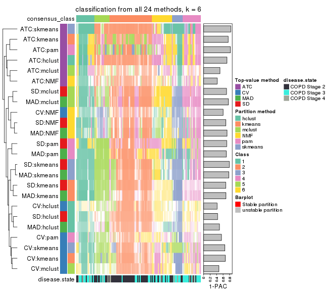</p>

</div>
</div>


### Top rows overlap


Overlap of top rows from different top-row methods:


<script>
$( function() {
	$( '#tabs-top-rows-overlap-by-euler' ).tabs();
} );
</script>
<div id='tabs-top-rows-overlap-by-euler'>
<ul>
<li><a href='#tab-top-rows-overlap-by-euler-1'>top_n = 1000</a></li>
<li><a href='#tab-top-rows-overlap-by-euler-2'>top_n = 2000</a></li>
<li><a href='#tab-top-rows-overlap-by-euler-3'>top_n = 3000</a></li>
<li><a href='#tab-top-rows-overlap-by-euler-4'>top_n = 4000</a></li>
<li><a href='#tab-top-rows-overlap-by-euler-5'>top_n = 5000</a></li>
</ul>
<div id='tab-top-rows-overlap-by-euler-1'>
<pre><code class="r">top_rows_overlap(res_list, top_n = 1000, method = &quot;euler&quot;)
</code></pre>

<p></p>

</div>
<div id='tab-top-rows-overlap-by-euler-2'>
<pre><code class="r">top_rows_overlap(res_list, top_n = 2000, method = &quot;euler&quot;)
</code></pre>

<p>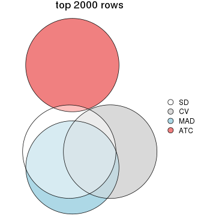</p>

</div>
<div id='tab-top-rows-overlap-by-euler-3'>
<pre><code class="r">top_rows_overlap(res_list, top_n = 3000, method = &quot;euler&quot;)
</code></pre>

<p></p>

</div>
<div id='tab-top-rows-overlap-by-euler-4'>
<pre><code class="r">top_rows_overlap(res_list, top_n = 4000, method = &quot;euler&quot;)
</code></pre>

<p></p>

</div>
<div id='tab-top-rows-overlap-by-euler-5'>
<pre><code class="r">top_rows_overlap(res_list, top_n = 5000, method = &quot;euler&quot;)
</code></pre>

<p></p>

</div>
</div>

Also visualize the correspondance of rankings between different top-row methods:


<script>
$( function() {
	$( '#tabs-top-rows-overlap-by-correspondance' ).tabs();
} );
</script>
<div id='tabs-top-rows-overlap-by-correspondance'>
<ul>
<li><a href='#tab-top-rows-overlap-by-correspondance-1'>top_n = 1000</a></li>
<li><a href='#tab-top-rows-overlap-by-correspondance-2'>top_n = 2000</a></li>
<li><a href='#tab-top-rows-overlap-by-correspondance-3'>top_n = 3000</a></li>
<li><a href='#tab-top-rows-overlap-by-correspondance-4'>top_n = 4000</a></li>
<li><a href='#tab-top-rows-overlap-by-correspondance-5'>top_n = 5000</a></li>
</ul>
<div id='tab-top-rows-overlap-by-correspondance-1'>
<pre><code class="r">top_rows_overlap(res_list, top_n = 1000, method = &quot;correspondance&quot;)
</code></pre>

<p></p>

</div>
<div id='tab-top-rows-overlap-by-correspondance-2'>
<pre><code class="r">top_rows_overlap(res_list, top_n = 2000, method = &quot;correspondance&quot;)
</code></pre>

<p></p>

</div>
<div id='tab-top-rows-overlap-by-correspondance-3'>
<pre><code class="r">top_rows_overlap(res_list, top_n = 3000, method = &quot;correspondance&quot;)
</code></pre>

<p></p>

</div>
<div id='tab-top-rows-overlap-by-correspondance-4'>
<pre><code class="r">top_rows_overlap(res_list, top_n = 4000, method = &quot;correspondance&quot;)
</code></pre>

<p></p>

</div>
<div id='tab-top-rows-overlap-by-correspondance-5'>
<pre><code class="r">top_rows_overlap(res_list, top_n = 5000, method = &quot;correspondance&quot;)
</code></pre>

<p></p>

</div>
</div>


Heatmaps of the top rows:


<script>
$( function() {
	$( '#tabs-top-rows-heatmap' ).tabs();
} );
</script>
<div id='tabs-top-rows-heatmap'>
<ul>
<li><a href='#tab-top-rows-heatmap-1'>top_n = 1000</a></li>
<li><a href='#tab-top-rows-heatmap-2'>top_n = 2000</a></li>
<li><a href='#tab-top-rows-heatmap-3'>top_n = 3000</a></li>
<li><a href='#tab-top-rows-heatmap-4'>top_n = 4000</a></li>
<li><a href='#tab-top-rows-heatmap-5'>top_n = 5000</a></li>
</ul>
<div id='tab-top-rows-heatmap-1'>
<pre><code class="r">top_rows_heatmap(res_list, top_n = 1000)
</code></pre>

<p></p>

</div>
<div id='tab-top-rows-heatmap-2'>
<pre><code class="r">top_rows_heatmap(res_list, top_n = 2000)
</code></pre>

<p></p>

</div>
<div id='tab-top-rows-heatmap-3'>
<pre><code class="r">top_rows_heatmap(res_list, top_n = 3000)
</code></pre>

<p></p>

</div>
<div id='tab-top-rows-heatmap-4'>
<pre><code class="r">top_rows_heatmap(res_list, top_n = 4000)
</code></pre>

<p></p>

</div>
<div id='tab-top-rows-heatmap-5'>
<pre><code class="r">top_rows_heatmap(res_list, top_n = 5000)
</code></pre>

<p></p>

</div>
</div>


### Test to known annotations


Test correlation between subgroups and known annotations. If the known
annotation is numeric, one-way ANOVA test is applied, and if the known
annotation is discrete, chi-squared contingency table test is applied.


<script>
$( function() {
	$( '#tabs-test-to-known-factors-from-consensus-partition-list' ).tabs();
} );
</script>
<div id='tabs-test-to-known-factors-from-consensus-partition-list'>
<ul>
<li><a href='#tab-test-to-known-factors-from-consensus-partition-list-1'>k = 2</a></li>
<li><a href='#tab-test-to-known-factors-from-consensus-partition-list-2'>k = 3</a></li>
<li><a href='#tab-test-to-known-factors-from-consensus-partition-list-3'>k = 4</a></li>
<li><a href='#tab-test-to-known-factors-from-consensus-partition-list-4'>k = 5</a></li>
<li><a href='#tab-test-to-known-factors-from-consensus-partition-list-5'>k = 6</a></li>
</ul>
<div id='tab-test-to-known-factors-from-consensus-partition-list-1'>
<pre><code class="r">test_to_known_factors(res_list, k = 2)
</code></pre>

<pre><code>#&gt;               n disease.state(p) k
#&gt; SD:NMF      133         6.11e-04 2
#&gt; CV:NMF      133         2.90e-01 2
#&gt; MAD:NMF     133         2.19e-04 2
#&gt; ATC:NMF     139         4.58e-03 2
#&gt; SD:skmeans  141         4.17e-05 2
#&gt; CV:skmeans  134         6.01e-01 2
#&gt; MAD:skmeans 143         4.87e-05 2
#&gt; ATC:skmeans 141         8.61e-04 2
#&gt; SD:mclust   121         4.87e-01 2
#&gt; CV:mclust   139         2.60e-02 2
#&gt; MAD:mclust  117         3.18e-01 2
#&gt; ATC:mclust  141         8.73e-01 2
#&gt; SD:kmeans   143         9.79e-04 2
#&gt; CV:kmeans   139         5.53e-01 2
#&gt; MAD:kmeans  142         4.74e-04 2
#&gt; ATC:kmeans  139         2.55e-03 2
#&gt; SD:pam      142         2.16e-03 2
#&gt; CV:pam      140         7.36e-01 2
#&gt; MAD:pam     134         9.38e-05 2
#&gt; ATC:pam     141         1.97e-03 2
#&gt; SD:hclust    98         1.18e-04 2
#&gt; CV:hclust   126         4.58e-01 2
#&gt; MAD:hclust  127         4.37e-04 2
#&gt; ATC:hclust  142         2.81e-03 2
</code></pre>

</div>
<div id='tab-test-to-known-factors-from-consensus-partition-list-2'>
<pre><code class="r">test_to_known_factors(res_list, k = 3)
</code></pre>

<pre><code>#&gt;               n disease.state(p) k
#&gt; SD:NMF      133         4.18e-04 3
#&gt; CV:NMF      139         3.80e-04 3
#&gt; MAD:NMF     135         2.08e-04 3
#&gt; ATC:NMF     112         1.71e-05 3
#&gt; SD:skmeans  131         2.01e-04 3
#&gt; CV:skmeans  136         2.66e-03 3
#&gt; MAD:skmeans 129         1.18e-04 3
#&gt; ATC:skmeans 142         1.42e-04 3
#&gt; SD:mclust   119         1.23e-01 3
#&gt; CV:mclust    90         1.89e-02 3
#&gt; MAD:mclust   63         1.94e-03 3
#&gt; ATC:mclust  129         3.15e-01 3
#&gt; SD:kmeans   124         1.16e-03 3
#&gt; CV:kmeans   141         6.81e-03 3
#&gt; MAD:kmeans  110         2.04e-04 3
#&gt; ATC:kmeans  140         6.25e-05 3
#&gt; SD:pam      129         4.20e-03 3
#&gt; CV:pam      120         1.09e-03 3
#&gt; MAD:pam     128         2.76e-04 3
#&gt; ATC:pam     143         1.51e-07 3
#&gt; SD:hclust   111         2.86e-03 3
#&gt; CV:hclust    89         2.43e-05 3
#&gt; MAD:hclust  126         1.35e-02 3
#&gt; ATC:hclust  138         2.21e-06 3
</code></pre>

</div>
<div id='tab-test-to-known-factors-from-consensus-partition-list-3'>
<pre><code class="r">test_to_known_factors(res_list, k = 4)
</code></pre>

<pre><code>#&gt;               n disease.state(p) k
#&gt; SD:NMF      129         9.87e-05 4
#&gt; CV:NMF      110         1.15e-04 4
#&gt; MAD:NMF     133         3.83e-05 4
#&gt; ATC:NMF     106         1.42e-03 4
#&gt; SD:skmeans  128         5.43e-06 4
#&gt; CV:skmeans  125         1.43e-05 4
#&gt; MAD:skmeans 135         6.00e-06 4
#&gt; ATC:skmeans 125         1.65e-05 4
#&gt; SD:mclust    67         6.17e-02 4
#&gt; CV:mclust   111         1.33e-01 4
#&gt; MAD:mclust  135         8.43e-04 4
#&gt; ATC:mclust   99         4.28e-02 4
#&gt; SD:kmeans    55         7.21e-02 4
#&gt; CV:kmeans    82         1.27e-02 4
#&gt; MAD:kmeans  103         6.34e-06 4
#&gt; ATC:kmeans  140         3.61e-06 4
#&gt; SD:pam      137         1.83e-05 4
#&gt; CV:pam       63         8.34e-04 4
#&gt; MAD:pam     133         2.93e-05 4
#&gt; ATC:pam     142         1.52e-05 4
#&gt; SD:hclust   111         3.30e-03 4
#&gt; CV:hclust    33         2.46e-01 4
#&gt; MAD:hclust  112         2.41e-04 4
#&gt; ATC:hclust  133         9.04e-06 4
</code></pre>

</div>
<div id='tab-test-to-known-factors-from-consensus-partition-list-4'>
<pre><code class="r">test_to_known_factors(res_list, k = 5)
</code></pre>

<pre><code>#&gt;               n disease.state(p) k
#&gt; SD:NMF      109         3.96e-05 5
#&gt; CV:NMF       83         1.68e-03 5
#&gt; MAD:NMF      96         1.17e-04 5
#&gt; ATC:NMF      64         1.96e-03 5
#&gt; SD:skmeans  129         1.87e-04 5
#&gt; CV:skmeans  103         2.14e-06 5
#&gt; MAD:skmeans 114         2.04e-05 5
#&gt; ATC:skmeans 133         2.10e-04 5
#&gt; SD:mclust   132         5.68e-04 5
#&gt; CV:mclust   119         6.12e-02 5
#&gt; MAD:mclust  130         8.54e-04 5
#&gt; ATC:mclust   80         6.82e-02 5
#&gt; SD:kmeans   133         3.10e-04 5
#&gt; CV:kmeans    89         4.87e-03 5
#&gt; MAD:kmeans  119         6.34e-05 5
#&gt; ATC:kmeans  127         1.22e-05 5
#&gt; SD:pam      137         4.24e-05 5
#&gt; CV:pam       78         3.86e-04 5
#&gt; MAD:pam      86         1.60e-05 5
#&gt; ATC:pam      79         2.33e-05 5
#&gt; SD:hclust    69         1.05e-03 5
#&gt; CV:hclust    75         8.58e-04 5
#&gt; MAD:hclust   91         9.78e-06 5
#&gt; ATC:hclust  133         8.78e-06 5
</code></pre>

</div>
<div id='tab-test-to-known-factors-from-consensus-partition-list-5'>
<pre><code class="r">test_to_known_factors(res_list, k = 6)
</code></pre>

<pre><code>#&gt;               n disease.state(p) k
#&gt; SD:NMF      105         3.09e-05 6
#&gt; CV:NMF       85         5.49e-05 6
#&gt; MAD:NMF     111         3.40e-04 6
#&gt; ATC:NMF      83         3.88e-06 6
#&gt; SD:skmeans  114         5.18e-05 6
#&gt; CV:skmeans  105         3.52e-05 6
#&gt; MAD:skmeans 114         1.08e-04 6
#&gt; ATC:skmeans 136         6.10e-05 6
#&gt; SD:mclust   121         3.29e-05 6
#&gt; CV:mclust    84         7.43e-04 6
#&gt; MAD:mclust  128         1.04e-03 6
#&gt; ATC:mclust   67         5.01e-02 6
#&gt; SD:kmeans    90         5.88e-04 6
#&gt; CV:kmeans   104         1.38e-06 6
#&gt; MAD:kmeans   79         6.33e-06 6
#&gt; ATC:kmeans  131         9.91e-06 6
#&gt; SD:pam      131         1.45e-04 6
#&gt; CV:pam       71         7.49e-04 6
#&gt; MAD:pam     127         3.22e-05 6
#&gt; ATC:pam     135         2.03e-04 6
#&gt; SD:hclust    62         2.88e-04 6
#&gt; CV:hclust    58         7.13e-03 6
#&gt; MAD:hclust   71         5.32e-04 6
#&gt; ATC:hclust  135         1.23e-05 6
</code></pre>

</div>
</div>


 
## Results for each method


---------------------------------------------------


### SD:hclust


The object with results only for a single top-value method and a single partition method 
can be extracted as:

```r
res = res_list["SD", "hclust"]
# you can also extract it by
# res = res_list["SD:hclust"]
```

A summary of `res` and all the functions that can be applied to it:

```r
res
```

```
#> A 'ConsensusPartition' object with k = 2, 3, 4, 5, 6.
#>   On a matrix with 51776 rows and 143 columns.
#>   Top rows (1000, 2000, 3000, 4000, 5000) are extracted by 'SD' method.
#>   Subgroups are detected by 'hclust' method.
#>   Performed in total 1250 partitions by row resampling.
#>   Best k for subgroups seems to be 3.
#> 
#> Following methods can be applied to this 'ConsensusPartition' object:
#>  [1] "cola_report"             "collect_classes"         "collect_plots"          
#>  [4] "collect_stats"           "colnames"                "compare_signatures"     
#>  [7] "consensus_heatmap"       "dimension_reduction"     "functional_enrichment"  
#> [10] "get_anno_col"            "get_anno"                "get_classes"            
#> [13] "get_consensus"           "get_matrix"              "get_membership"         
#> [16] "get_param"               "get_signatures"          "get_stats"              
#> [19] "is_best_k"               "is_stable_k"             "membership_heatmap"     
#> [22] "ncol"                    "nrow"                    "plot_ecdf"              
#> [25] "rownames"                "select_partition_number" "show"                   
#> [28] "suggest_best_k"          "test_to_known_factors"
```

`collect_plots()` function collects all the plots made from `res` for all `k` (number of partitions)
into one single page to provide an easy and fast comparison between different `k`.

```r
collect_plots(res)
```


The plots are:

- The first row: a plot of the ECDF (Empirical cumulative distribution
  function) curves of the consensus matrix for each `k` and the heatmap of
  predicted classes for each `k`.
- The second row: heatmaps of the consensus matrix for each `k`.
- The third row: heatmaps of the membership matrix for each `k`.
- The fouth row: heatmaps of the signatures for each `k`.

All the plots in panels can be made by individual functions and they are
plotted later in this section.

`select_partition_number()` produces several plots showing different
statistics for choosing "optimized" `k`. There are following statistics:

- ECDF curves of the consensus matrix for each `k`;
- 1-PAC. [The PAC
  score](https://en.wikipedia.org/wiki/Consensus_clustering#Over-interpretation_potential_of_consensus_clustering)
  measures the proportion of the ambiguous subgrouping.
- Mean silhouette score.
- Concordance. The mean probability of fiting the consensus class ids in all
  partitions.
- Area increased. Denote $A_k$ as the area under the ECDF curve for current
  `k`, the area increased is defined as $A_k - A_{k-1}$.
- Rand index. The percent of pairs of samples that are both in a same cluster
  or both are not in a same cluster in the partition of k and k-1.
- Jaccard index. The ratio of pairs of samples are both in a same cluster in
  the partition of k and k-1 and the pairs of samples are both in a same
  cluster in the partition k or k-1.

The detailed explanations of these statistics can be found in [the cola
vignette](http://bioconductor.org/packages/devel/bioc/vignettes/cola/inst/doc/cola.html#toc_13).

Generally speaking, lower PAC score, higher mean silhouette score or higher
concordance corresponds to better partition. Rand index and Jaccard index
measure how similar the current partition is compared to partition with `k-1`.
If they are too similar, we won't accept `k` is better than `k-1`.

```r
select_partition_number(res)
```


The numeric values for all these statistics can be obtained by `get_stats()`.

```r
get_stats(res)
```

```
#>   k 1-PAC mean_silhouette concordance area_increased  Rand Jaccard
#> 2 2 0.174           0.490       0.704         0.3966 0.501   0.501
#> 3 3 0.304           0.601       0.802         0.3838 0.695   0.507
#> 4 4 0.331           0.575       0.775         0.1131 0.943   0.868
#> 5 5 0.403           0.486       0.701         0.1254 0.869   0.675
#> 6 6 0.431           0.434       0.674         0.0676 0.938   0.806
```

`suggest_best_k()` suggests the best $k$ based on these statistics. The rules are as follows:

- All $k$ with Jaccard index larger than 0.95 are removed because the increase of
  the partition number does not provides enough extra information. If all $k$ are removed,
  the best $k$ is assigned by `NA`.
- For $k$ with 1-PAC larger than 0.9, the maximal $k$ is taken as the "best k". Other $k$ is called "optional k".
- If it does not fit the second rule. The $k$ with the highest vote of highest
  1-PAC, mean silhouette and concordance is taken as the "best k".

```r
suggest_best_k(res)
```

```
#> [1] 3
```


Following shows the table of the partitions (You need to click the **show/hide
code output** link to see it). The membership matrix (columns with name `p*`)
is inferred by
[`clue::cl_consensus()`](https://www.rdocumentation.org/link/cl_consensus?package=clue)
function with the `SE` method. Basically the value in the membership matrix
represents the probability to belong to a certain group. The finall class
label for an item is determined with the group with highest probability it
belongs to.

In `get_classes()` function, the entropy is calculated from the membership
matrix and the silhouette score is calculated from the consensus matrix.


<script>
$( function() {
	$( '#tabs-SD-hclust-get-classes' ).tabs();
} );
</script>
<div id='tabs-SD-hclust-get-classes'>
<ul>
<li><a href='#tab-SD-hclust-get-classes-1'>k = 2</a></li>
<li><a href='#tab-SD-hclust-get-classes-2'>k = 3</a></li>
<li><a href='#tab-SD-hclust-get-classes-3'>k = 4</a></li>
<li><a href='#tab-SD-hclust-get-classes-4'>k = 5</a></li>
<li><a href='#tab-SD-hclust-get-classes-5'>k = 6</a></li>
</ul>

<div id='tab-SD-hclust-get-classes-1'>
<p><a id='tab-SD-hclust-get-classes-1-a' style='color:#0366d6' href='#'>show/hide code output</a></p>
<pre><code class="r">cbind(get_classes(res, k = 2), get_membership(res, k = 2))
</code></pre>

<pre><code>#&gt;           class entropy silhouette    p1    p2
#&gt; GSM550785     1  0.1414    0.63334 0.980 0.020
#&gt; GSM550786     2  0.9993    0.33123 0.484 0.516
#&gt; GSM550788     2  0.9732    0.73712 0.404 0.596
#&gt; GSM550789     2  0.9710    0.73851 0.400 0.600
#&gt; GSM550790     1  0.1184    0.63241 0.984 0.016
#&gt; GSM550791     1  0.2603    0.63447 0.956 0.044
#&gt; GSM550792     1  0.9944   -0.46246 0.544 0.456
#&gt; GSM550796     2  0.9710    0.73851 0.400 0.600
#&gt; GSM550797     2  0.9710    0.73851 0.400 0.600
#&gt; GSM550799     2  0.6343    0.38293 0.160 0.840
#&gt; GSM550800     1  0.9988   -0.54695 0.520 0.480
#&gt; GSM550801     2  0.9710    0.73851 0.400 0.600
#&gt; GSM550804     2  0.9933    0.70170 0.452 0.548
#&gt; GSM550806     2  0.8608    0.35641 0.284 0.716
#&gt; GSM550807     2  0.9710    0.73851 0.400 0.600
#&gt; GSM550808     2  0.9522    0.73478 0.372 0.628
#&gt; GSM550809     1  0.4690    0.61667 0.900 0.100
#&gt; GSM550810     2  0.9522    0.73478 0.372 0.628
#&gt; GSM550811     1  0.5737    0.58516 0.864 0.136
#&gt; GSM550813     2  0.9909    0.71093 0.444 0.556
#&gt; GSM550814     2  0.9881    0.71892 0.436 0.564
#&gt; GSM550815     2  0.9710    0.73851 0.400 0.600
#&gt; GSM550816     2  0.9970    0.66401 0.468 0.532
#&gt; GSM550817     2  0.6343    0.29054 0.160 0.840
#&gt; GSM550818     2  0.6247    0.28676 0.156 0.844
#&gt; GSM550819     2  0.9977    0.63590 0.472 0.528
#&gt; GSM550820     1  0.4022    0.62791 0.920 0.080
#&gt; GSM550821     2  0.9686    0.65517 0.396 0.604
#&gt; GSM550822     2  0.9710    0.73851 0.400 0.600
#&gt; GSM550826     1  0.7056    0.57845 0.808 0.192
#&gt; GSM550832     2  0.9580    0.73690 0.380 0.620
#&gt; GSM550833     2  0.9732    0.73742 0.404 0.596
#&gt; GSM550835     2  0.8763    0.67727 0.296 0.704
#&gt; GSM550836     1  0.9710    0.34045 0.600 0.400
#&gt; GSM550837     2  0.9323    0.72077 0.348 0.652
#&gt; GSM550838     1  0.4690    0.61667 0.900 0.100
#&gt; GSM550841     2  0.5842    0.32745 0.140 0.860
#&gt; GSM550842     2  0.8713    0.67575 0.292 0.708
#&gt; GSM550846     1  0.9323   -0.00831 0.652 0.348
#&gt; GSM550849     1  0.7299    0.49464 0.796 0.204
#&gt; GSM550850     1  0.0938    0.63333 0.988 0.012
#&gt; GSM550851     2  0.9323    0.72077 0.348 0.652
#&gt; GSM550852     1  0.9944   -0.46246 0.544 0.456
#&gt; GSM550853     2  0.9896    0.71679 0.440 0.560
#&gt; GSM550855     2  0.9896    0.71679 0.440 0.560
#&gt; GSM550856     2  0.9909    0.71309 0.444 0.556
#&gt; GSM550861     2  0.9815    0.73070 0.420 0.580
#&gt; GSM550863     1  0.6247    0.54955 0.844 0.156
#&gt; GSM550864     2  0.9896    0.71620 0.440 0.560
#&gt; GSM550866     2  0.9909    0.71309 0.444 0.556
#&gt; GSM550867     1  0.1184    0.62818 0.984 0.016
#&gt; GSM550885     1  0.1184    0.62818 0.984 0.016
#&gt; GSM550886     2  0.9044    0.55861 0.320 0.680
#&gt; GSM550887     2  0.9710    0.73851 0.400 0.600
#&gt; GSM550889     1  0.8909    0.17157 0.692 0.308
#&gt; GSM550894     2  0.9522    0.73478 0.372 0.628
#&gt; GSM550897     1  0.4161    0.62586 0.916 0.084
#&gt; GSM550903     2  0.9850    0.72607 0.428 0.572
#&gt; GSM550905     2  0.9323    0.72119 0.348 0.652
#&gt; GSM550906     2  0.9710    0.73851 0.400 0.600
#&gt; GSM550907     2  0.7139    0.19109 0.196 0.804
#&gt; GSM550909     2  0.9850    0.71905 0.428 0.572
#&gt; GSM550911     2  0.7139    0.17010 0.196 0.804
#&gt; GSM550913     2  0.9710    0.73851 0.400 0.600
#&gt; GSM550915     1  0.6531    0.53535 0.832 0.168
#&gt; GSM550917     2  0.9933    0.70170 0.452 0.548
#&gt; GSM550919     1  0.6148    0.55934 0.848 0.152
#&gt; GSM550921     1  0.9710    0.34045 0.600 0.400
#&gt; GSM550924     2  0.9608    0.58510 0.384 0.616
#&gt; GSM550926     2  0.9896    0.71679 0.440 0.560
#&gt; GSM550927     2  0.9710    0.73851 0.400 0.600
#&gt; GSM550787     1  0.5842    0.58545 0.860 0.140
#&gt; GSM550793     1  0.7745    0.48349 0.772 0.228
#&gt; GSM550794     1  0.9944   -0.46246 0.544 0.456
#&gt; GSM550795     1  0.5059    0.60029 0.888 0.112
#&gt; GSM550798     1  0.4431    0.58200 0.908 0.092
#&gt; GSM550803     1  0.1184    0.62818 0.984 0.016
#&gt; GSM550805     1  0.4161    0.62858 0.916 0.084
#&gt; GSM550823     1  0.9209    0.04521 0.664 0.336
#&gt; GSM550824     1  0.1184    0.62818 0.984 0.016
#&gt; GSM550825     1  0.5946    0.54937 0.856 0.144
#&gt; GSM550827     1  0.9522   -0.16232 0.628 0.372
#&gt; GSM550828     1  0.3879    0.62797 0.924 0.076
#&gt; GSM550829     1  0.5946    0.54937 0.856 0.144
#&gt; GSM550830     1  0.9209    0.04521 0.664 0.336
#&gt; GSM550834     1  0.1414    0.63504 0.980 0.020
#&gt; GSM550839     2  0.8763    0.50591 0.296 0.704
#&gt; GSM550840     1  0.4022    0.63030 0.920 0.080
#&gt; GSM550843     2  0.8144    0.46008 0.252 0.748
#&gt; GSM550844     1  0.4161    0.62858 0.916 0.084
#&gt; GSM550845     2  0.9933    0.70055 0.452 0.548
#&gt; GSM550848     1  0.6148    0.55934 0.848 0.152
#&gt; GSM550854     1  0.1184    0.62818 0.984 0.016
#&gt; GSM550857     1  0.9710    0.34045 0.600 0.400
#&gt; GSM550858     1  0.3431    0.63537 0.936 0.064
#&gt; GSM550859     1  0.1184    0.62818 0.984 0.016
#&gt; GSM550862     1  0.3431    0.63537 0.936 0.064
#&gt; GSM550865     1  0.6247    0.54955 0.844 0.156
#&gt; GSM550868     1  0.9170    0.06177 0.668 0.332
#&gt; GSM550869     1  0.9754    0.32744 0.592 0.408
#&gt; GSM550870     2  0.9933    0.70055 0.452 0.548
#&gt; GSM550871     2  0.8763    0.50591 0.296 0.704
#&gt; GSM550872     1  0.6247    0.54955 0.844 0.156
#&gt; GSM550873     1  0.9944   -0.46246 0.544 0.456
#&gt; GSM550874     2  0.9896    0.71679 0.440 0.560
#&gt; GSM550876     2  0.8499    0.39393 0.276 0.724
#&gt; GSM550877     2  0.9896    0.71679 0.440 0.560
#&gt; GSM550878     2  0.7056    0.32386 0.192 0.808
#&gt; GSM550879     1  0.4022    0.62298 0.920 0.080
#&gt; GSM550882     1  0.8909    0.42111 0.692 0.308
#&gt; GSM550888     1  0.9710    0.34045 0.600 0.400
#&gt; GSM550890     1  0.9323   -0.00831 0.652 0.348
#&gt; GSM550891     1  0.9850    0.33606 0.572 0.428
#&gt; GSM550892     1  0.6148    0.55505 0.848 0.152
#&gt; GSM550893     1  0.9896   -0.40713 0.560 0.440
#&gt; GSM550895     1  0.9552   -0.15165 0.624 0.376
#&gt; GSM550896     1  0.9815   -0.33599 0.580 0.420
#&gt; GSM550898     1  0.1184    0.62818 0.984 0.016
#&gt; GSM550899     2  0.9933    0.70057 0.452 0.548
#&gt; GSM550900     1  0.9427   -0.07752 0.640 0.360
#&gt; GSM550901     1  0.6048    0.56464 0.852 0.148
#&gt; GSM550902     1  0.7745    0.48349 0.772 0.228
#&gt; GSM550904     1  0.4022    0.62791 0.920 0.080
#&gt; GSM550908     1  0.9710    0.34045 0.600 0.400
#&gt; GSM550912     2  0.9909    0.71093 0.444 0.556
#&gt; GSM550914     1  0.9323   -0.00831 0.652 0.348
#&gt; GSM550918     2  0.9933    0.70170 0.452 0.548
#&gt; GSM550922     2  0.8207    0.62714 0.256 0.744
#&gt; GSM550923     1  0.2043    0.61986 0.968 0.032
#&gt; GSM550925     1  0.4815    0.61120 0.896 0.104
#&gt; GSM550802     2  0.9993    0.61048 0.484 0.516
#&gt; GSM550812     2  0.9993    0.61048 0.484 0.516
#&gt; GSM550831     1  0.1414    0.63504 0.980 0.020
#&gt; GSM550847     1  0.1184    0.62818 0.984 0.016
#&gt; GSM550860     1  0.9933    0.23200 0.548 0.452
#&gt; GSM550875     1  0.4161    0.62858 0.916 0.084
#&gt; GSM550880     1  0.7602    0.43730 0.780 0.220
#&gt; GSM550881     1  0.9087    0.40296 0.676 0.324
#&gt; GSM550883     1  0.9087    0.40296 0.676 0.324
#&gt; GSM550884     1  0.9881   -0.38630 0.564 0.436
#&gt; GSM550910     2  0.8386    0.31440 0.268 0.732
#&gt; GSM550916     1  0.2603    0.63461 0.956 0.044
#&gt; GSM550920     2  0.9209    0.54606 0.336 0.664
</code></pre>

<script>
$('#tab-SD-hclust-get-classes-1-a').parent().next().next().hide();
$('#tab-SD-hclust-get-classes-1-a').click(function(){
  $('#tab-SD-hclust-get-classes-1-a').parent().next().next().toggle();
  return(false);
});
</script>
</div>

<div id='tab-SD-hclust-get-classes-2'>
<p><a id='tab-SD-hclust-get-classes-2-a' style='color:#0366d6' href='#'>show/hide code output</a></p>
<pre><code class="r">cbind(get_classes(res, k = 3), get_membership(res, k = 3))
</code></pre>

<pre><code>#&gt;           class entropy silhouette    p1    p2    p3
#&gt; GSM550785     1  0.2096   0.716984 0.944 0.052 0.004
#&gt; GSM550786     2  0.8233   0.483565 0.272 0.612 0.116
#&gt; GSM550788     2  0.0237   0.775810 0.004 0.996 0.000
#&gt; GSM550789     2  0.0000   0.774381 0.000 1.000 0.000
#&gt; GSM550790     1  0.0829   0.694535 0.984 0.012 0.004
#&gt; GSM550791     1  0.5656   0.694813 0.728 0.264 0.008
#&gt; GSM550792     2  0.5536   0.646544 0.236 0.752 0.012
#&gt; GSM550796     2  0.0000   0.774381 0.000 1.000 0.000
#&gt; GSM550797     2  0.0000   0.774381 0.000 1.000 0.000
#&gt; GSM550799     2  0.6442   0.122806 0.004 0.564 0.432
#&gt; GSM550800     2  0.4172   0.711270 0.156 0.840 0.004
#&gt; GSM550801     2  0.0237   0.775472 0.004 0.996 0.000
#&gt; GSM550804     2  0.2165   0.781340 0.064 0.936 0.000
#&gt; GSM550806     2  0.8384   0.163844 0.088 0.520 0.392
#&gt; GSM550807     2  0.0237   0.775472 0.004 0.996 0.000
#&gt; GSM550808     2  0.1399   0.769256 0.004 0.968 0.028
#&gt; GSM550809     1  0.4353   0.742001 0.836 0.156 0.008
#&gt; GSM550810     2  0.1399   0.769256 0.004 0.968 0.028
#&gt; GSM550811     1  0.5012   0.728534 0.788 0.204 0.008
#&gt; GSM550813     2  0.1989   0.784027 0.048 0.948 0.004
#&gt; GSM550814     2  0.2492   0.785258 0.048 0.936 0.016
#&gt; GSM550815     2  0.0000   0.774381 0.000 1.000 0.000
#&gt; GSM550816     2  0.2796   0.768443 0.092 0.908 0.000
#&gt; GSM550817     3  0.6299   0.118759 0.000 0.476 0.524
#&gt; GSM550818     3  0.6295   0.129295 0.000 0.472 0.528
#&gt; GSM550819     2  0.5036   0.715568 0.172 0.808 0.020
#&gt; GSM550820     1  0.4099   0.743606 0.852 0.140 0.008
#&gt; GSM550821     2  0.5650   0.731270 0.108 0.808 0.084
#&gt; GSM550822     2  0.0000   0.774381 0.000 1.000 0.000
#&gt; GSM550826     1  0.6853   0.687553 0.712 0.224 0.064
#&gt; GSM550832     2  0.1129   0.771857 0.004 0.976 0.020
#&gt; GSM550833     2  0.0237   0.776004 0.004 0.996 0.000
#&gt; GSM550835     2  0.3755   0.713572 0.008 0.872 0.120
#&gt; GSM550836     3  0.1411   0.661484 0.036 0.000 0.964
#&gt; GSM550837     2  0.2384   0.757813 0.008 0.936 0.056
#&gt; GSM550838     1  0.4353   0.742001 0.836 0.156 0.008
#&gt; GSM550841     2  0.6307  -0.072389 0.000 0.512 0.488
#&gt; GSM550842     2  0.3619   0.695848 0.000 0.864 0.136
#&gt; GSM550846     2  0.6274   0.046846 0.456 0.544 0.000
#&gt; GSM550849     1  0.6869   0.412360 0.560 0.424 0.016
#&gt; GSM550850     1  0.1129   0.700432 0.976 0.020 0.004
#&gt; GSM550851     2  0.2384   0.757813 0.008 0.936 0.056
#&gt; GSM550852     2  0.5493   0.650537 0.232 0.756 0.012
#&gt; GSM550853     2  0.1529   0.782889 0.040 0.960 0.000
#&gt; GSM550855     2  0.1529   0.782889 0.040 0.960 0.000
#&gt; GSM550856     2  0.2356   0.778236 0.072 0.928 0.000
#&gt; GSM550861     2  0.0892   0.779977 0.020 0.980 0.000
#&gt; GSM550863     1  0.5810   0.622085 0.664 0.336 0.000
#&gt; GSM550864     2  0.1860   0.783892 0.052 0.948 0.000
#&gt; GSM550866     2  0.2356   0.778236 0.072 0.928 0.000
#&gt; GSM550867     1  0.0237   0.681505 0.996 0.000 0.004
#&gt; GSM550885     1  0.0829   0.689420 0.984 0.012 0.004
#&gt; GSM550886     2  0.6968   0.607756 0.080 0.716 0.204
#&gt; GSM550887     2  0.0000   0.774381 0.000 1.000 0.000
#&gt; GSM550889     2  0.6126   0.332922 0.352 0.644 0.004
#&gt; GSM550894     2  0.1163   0.767562 0.000 0.972 0.028
#&gt; GSM550897     1  0.5785   0.676194 0.696 0.300 0.004
#&gt; GSM550903     2  0.1289   0.783128 0.032 0.968 0.000
#&gt; GSM550905     2  0.2384   0.758009 0.008 0.936 0.056
#&gt; GSM550906     2  0.0000   0.774381 0.000 1.000 0.000
#&gt; GSM550907     3  0.6126   0.321054 0.000 0.400 0.600
#&gt; GSM550909     2  0.4015   0.764526 0.096 0.876 0.028
#&gt; GSM550911     3  0.6062   0.355158 0.000 0.384 0.616
#&gt; GSM550913     2  0.0000   0.774381 0.000 1.000 0.000
#&gt; GSM550915     1  0.6168   0.497860 0.588 0.412 0.000
#&gt; GSM550917     2  0.2066   0.781921 0.060 0.940 0.000
#&gt; GSM550919     1  0.6062   0.559703 0.616 0.384 0.000
#&gt; GSM550921     3  0.1289   0.660733 0.032 0.000 0.968
#&gt; GSM550924     2  0.6679   0.659657 0.100 0.748 0.152
#&gt; GSM550926     2  0.1529   0.782889 0.040 0.960 0.000
#&gt; GSM550927     2  0.0000   0.774381 0.000 1.000 0.000
#&gt; GSM550787     1  0.6796   0.575303 0.632 0.344 0.024
#&gt; GSM550793     3  0.7396   0.126518 0.480 0.032 0.488
#&gt; GSM550794     2  0.5578   0.641531 0.240 0.748 0.012
#&gt; GSM550795     1  0.4978   0.733055 0.780 0.216 0.004
#&gt; GSM550798     1  0.2537   0.643351 0.920 0.000 0.080
#&gt; GSM550803     1  0.0237   0.681505 0.996 0.000 0.004
#&gt; GSM550805     1  0.5896   0.678878 0.700 0.292 0.008
#&gt; GSM550823     2  0.6081   0.379835 0.344 0.652 0.004
#&gt; GSM550824     1  0.0237   0.681505 0.996 0.000 0.004
#&gt; GSM550825     1  0.5335   0.457787 0.760 0.008 0.232
#&gt; GSM550827     2  0.6267   0.119981 0.452 0.548 0.000
#&gt; GSM550828     1  0.3816   0.747002 0.852 0.148 0.000
#&gt; GSM550829     1  0.5335   0.457787 0.760 0.008 0.232
#&gt; GSM550830     2  0.6081   0.379835 0.344 0.652 0.004
#&gt; GSM550834     1  0.2682   0.730372 0.920 0.076 0.004
#&gt; GSM550839     2  0.8042   0.503352 0.116 0.636 0.248
#&gt; GSM550840     1  0.5797   0.690848 0.712 0.280 0.008
#&gt; GSM550843     2  0.8311   0.417497 0.112 0.596 0.292
#&gt; GSM550844     1  0.5896   0.678878 0.700 0.292 0.008
#&gt; GSM550845     2  0.2165   0.780923 0.064 0.936 0.000
#&gt; GSM550848     1  0.6062   0.559703 0.616 0.384 0.000
#&gt; GSM550854     1  0.0237   0.681505 0.996 0.000 0.004
#&gt; GSM550857     3  0.1411   0.661484 0.036 0.000 0.964
#&gt; GSM550858     1  0.3030   0.735906 0.904 0.092 0.004
#&gt; GSM550859     1  0.0237   0.681505 0.996 0.000 0.004
#&gt; GSM550862     1  0.3030   0.735906 0.904 0.092 0.004
#&gt; GSM550865     1  0.5810   0.622085 0.664 0.336 0.000
#&gt; GSM550868     2  0.6489   0.046108 0.456 0.540 0.004
#&gt; GSM550869     1  0.9758   0.194944 0.412 0.356 0.232
#&gt; GSM550870     2  0.2165   0.780923 0.064 0.936 0.000
#&gt; GSM550871     2  0.8042   0.503352 0.116 0.636 0.248
#&gt; GSM550872     1  0.5785   0.627144 0.668 0.332 0.000
#&gt; GSM550873     2  0.5493   0.650537 0.232 0.756 0.012
#&gt; GSM550874     2  0.1529   0.782889 0.040 0.960 0.000
#&gt; GSM550876     2  0.7996   0.218933 0.068 0.552 0.380
#&gt; GSM550877     2  0.1529   0.782889 0.040 0.960 0.000
#&gt; GSM550878     2  0.7665  -0.000992 0.044 0.500 0.456
#&gt; GSM550879     1  0.4121   0.745594 0.832 0.168 0.000
#&gt; GSM550882     3  0.8155   0.378053 0.332 0.088 0.580
#&gt; GSM550888     3  0.1411   0.661484 0.036 0.000 0.964
#&gt; GSM550890     2  0.6274   0.046846 0.456 0.544 0.000
#&gt; GSM550891     3  0.0237   0.653374 0.004 0.000 0.996
#&gt; GSM550892     1  0.5760   0.633631 0.672 0.328 0.000
#&gt; GSM550893     2  0.4883   0.645863 0.208 0.788 0.004
#&gt; GSM550895     2  0.5690   0.511717 0.288 0.708 0.004
#&gt; GSM550896     2  0.5158   0.612256 0.232 0.764 0.004
#&gt; GSM550898     1  0.0237   0.681505 0.996 0.000 0.004
#&gt; GSM550899     2  0.2066   0.781648 0.060 0.940 0.000
#&gt; GSM550900     2  0.5929   0.446893 0.320 0.676 0.004
#&gt; GSM550901     1  0.6045   0.567540 0.620 0.380 0.000
#&gt; GSM550902     3  0.7396   0.126518 0.480 0.032 0.488
#&gt; GSM550904     1  0.4033   0.742697 0.856 0.136 0.008
#&gt; GSM550908     3  0.1411   0.661484 0.036 0.000 0.964
#&gt; GSM550912     2  0.1989   0.784027 0.048 0.948 0.004
#&gt; GSM550914     2  0.6274   0.046846 0.456 0.544 0.000
#&gt; GSM550918     2  0.2165   0.781340 0.064 0.936 0.000
#&gt; GSM550922     2  0.4465   0.660213 0.004 0.820 0.176
#&gt; GSM550923     1  0.0892   0.674005 0.980 0.000 0.020
#&gt; GSM550925     1  0.6129   0.635645 0.668 0.324 0.008
#&gt; GSM550802     2  0.5486   0.691773 0.196 0.780 0.024
#&gt; GSM550812     2  0.5536   0.688086 0.200 0.776 0.024
#&gt; GSM550831     1  0.2682   0.730372 0.920 0.076 0.004
#&gt; GSM550847     1  0.0237   0.681505 0.996 0.000 0.004
#&gt; GSM550860     2  0.9857  -0.092946 0.368 0.380 0.252
#&gt; GSM550875     1  0.5896   0.678878 0.700 0.292 0.008
#&gt; GSM550880     1  0.6111   0.506382 0.604 0.396 0.000
#&gt; GSM550881     3  0.6587   0.421866 0.352 0.016 0.632
#&gt; GSM550883     3  0.6587   0.421866 0.352 0.016 0.632
#&gt; GSM550884     2  0.6096   0.584021 0.280 0.704 0.016
#&gt; GSM550910     2  0.7169   0.043549 0.024 0.520 0.456
#&gt; GSM550916     1  0.2096   0.718637 0.944 0.052 0.004
#&gt; GSM550920     2  0.7153   0.601658 0.092 0.708 0.200
</code></pre>

<script>
$('#tab-SD-hclust-get-classes-2-a').parent().next().next().hide();
$('#tab-SD-hclust-get-classes-2-a').click(function(){
  $('#tab-SD-hclust-get-classes-2-a').parent().next().next().toggle();
  return(false);
});
</script>
</div>

<div id='tab-SD-hclust-get-classes-3'>
<p><a id='tab-SD-hclust-get-classes-3-a' style='color:#0366d6' href='#'>show/hide code output</a></p>
<pre><code class="r">cbind(get_classes(res, k = 4), get_membership(res, k = 4))
</code></pre>

<pre><code>#&gt;           class entropy silhouette    p1    p2    p3    p4
#&gt; GSM550785     1  0.3107     0.6792 0.884 0.080 0.000 0.036
#&gt; GSM550786     2  0.7768     0.3161 0.260 0.524 0.016 0.200
#&gt; GSM550788     2  0.0817     0.7425 0.000 0.976 0.000 0.024
#&gt; GSM550789     2  0.1118     0.7389 0.000 0.964 0.000 0.036
#&gt; GSM550790     1  0.2463     0.6531 0.924 0.036 0.008 0.032
#&gt; GSM550791     1  0.5623     0.6491 0.676 0.276 0.004 0.044
#&gt; GSM550792     2  0.5430     0.6386 0.204 0.732 0.008 0.056
#&gt; GSM550796     2  0.1118     0.7389 0.000 0.964 0.000 0.036
#&gt; GSM550797     2  0.1118     0.7389 0.000 0.964 0.000 0.036
#&gt; GSM550799     4  0.6775     0.5718 0.012 0.348 0.076 0.564
#&gt; GSM550800     2  0.3280     0.6951 0.124 0.860 0.000 0.016
#&gt; GSM550801     2  0.1209     0.7415 0.004 0.964 0.000 0.032
#&gt; GSM550804     2  0.1118     0.7487 0.036 0.964 0.000 0.000
#&gt; GSM550806     4  0.7279     0.5789 0.068 0.308 0.048 0.576
#&gt; GSM550807     2  0.1209     0.7415 0.004 0.964 0.000 0.032
#&gt; GSM550808     2  0.3355     0.6674 0.004 0.836 0.000 0.160
#&gt; GSM550809     1  0.4400     0.6984 0.816 0.136 0.012 0.036
#&gt; GSM550810     2  0.3355     0.6674 0.004 0.836 0.000 0.160
#&gt; GSM550811     1  0.5083     0.6886 0.760 0.188 0.012 0.040
#&gt; GSM550813     2  0.1297     0.7499 0.016 0.964 0.000 0.020
#&gt; GSM550814     2  0.2222     0.7416 0.016 0.924 0.000 0.060
#&gt; GSM550815     2  0.1118     0.7389 0.000 0.964 0.000 0.036
#&gt; GSM550816     2  0.4362     0.7167 0.088 0.816 0.000 0.096
#&gt; GSM550817     4  0.5226     0.5642 0.000 0.116 0.128 0.756
#&gt; GSM550818     4  0.5222     0.5593 0.000 0.112 0.132 0.756
#&gt; GSM550819     2  0.5370     0.6661 0.152 0.756 0.008 0.084
#&gt; GSM550820     1  0.3965     0.7009 0.840 0.120 0.008 0.032
#&gt; GSM550821     2  0.6109     0.5669 0.096 0.676 0.004 0.224
#&gt; GSM550822     2  0.1118     0.7389 0.000 0.964 0.000 0.036
#&gt; GSM550826     1  0.6422     0.6486 0.684 0.192 0.020 0.104
#&gt; GSM550832     2  0.2334     0.7210 0.004 0.908 0.000 0.088
#&gt; GSM550833     2  0.1118     0.7403 0.000 0.964 0.000 0.036
#&gt; GSM550835     2  0.4509     0.4854 0.004 0.708 0.000 0.288
#&gt; GSM550836     3  0.0817     0.6153 0.000 0.000 0.976 0.024
#&gt; GSM550837     2  0.4018     0.5899 0.004 0.772 0.000 0.224
#&gt; GSM550838     1  0.4400     0.6984 0.816 0.136 0.012 0.036
#&gt; GSM550841     4  0.5361     0.5896 0.000 0.148 0.108 0.744
#&gt; GSM550842     2  0.4564     0.4050 0.000 0.672 0.000 0.328
#&gt; GSM550846     2  0.5643     0.0614 0.428 0.548 0.000 0.024
#&gt; GSM550849     1  0.6597     0.3569 0.512 0.420 0.008 0.060
#&gt; GSM550850     1  0.2364     0.6558 0.928 0.036 0.008 0.028
#&gt; GSM550851     2  0.4018     0.5899 0.004 0.772 0.000 0.224
#&gt; GSM550852     2  0.5466     0.6402 0.200 0.732 0.008 0.060
#&gt; GSM550853     2  0.0524     0.7470 0.008 0.988 0.000 0.004
#&gt; GSM550855     2  0.0524     0.7470 0.008 0.988 0.000 0.004
#&gt; GSM550856     2  0.1398     0.7461 0.040 0.956 0.000 0.004
#&gt; GSM550861     2  0.0779     0.7450 0.004 0.980 0.000 0.016
#&gt; GSM550863     1  0.5403     0.5794 0.628 0.348 0.000 0.024
#&gt; GSM550864     2  0.0817     0.7491 0.024 0.976 0.000 0.000
#&gt; GSM550866     2  0.1398     0.7461 0.040 0.956 0.000 0.004
#&gt; GSM550867     1  0.1743     0.6142 0.940 0.000 0.004 0.056
#&gt; GSM550885     1  0.2207     0.6218 0.928 0.012 0.004 0.056
#&gt; GSM550886     2  0.6890     0.3066 0.076 0.580 0.020 0.324
#&gt; GSM550887     2  0.1118     0.7389 0.000 0.964 0.000 0.036
#&gt; GSM550889     2  0.5173     0.3564 0.320 0.660 0.000 0.020
#&gt; GSM550894     2  0.2345     0.7106 0.000 0.900 0.000 0.100
#&gt; GSM550897     1  0.5980     0.6339 0.644 0.300 0.008 0.048
#&gt; GSM550903     2  0.1059     0.7496 0.012 0.972 0.000 0.016
#&gt; GSM550905     2  0.3870     0.6112 0.004 0.788 0.000 0.208
#&gt; GSM550906     2  0.1118     0.7389 0.000 0.964 0.000 0.036
#&gt; GSM550907     4  0.4105     0.3951 0.000 0.032 0.156 0.812
#&gt; GSM550909     2  0.5986     0.5794 0.092 0.688 0.004 0.216
#&gt; GSM550911     4  0.4149     0.3688 0.000 0.028 0.168 0.804
#&gt; GSM550913     2  0.1118     0.7389 0.000 0.964 0.000 0.036
#&gt; GSM550915     1  0.5476     0.4892 0.584 0.396 0.000 0.020
#&gt; GSM550917     2  0.1022     0.7488 0.032 0.968 0.000 0.000
#&gt; GSM550919     1  0.5284     0.5500 0.616 0.368 0.000 0.016
#&gt; GSM550921     3  0.0921     0.6133 0.000 0.000 0.972 0.028
#&gt; GSM550924     2  0.6722     0.4056 0.088 0.604 0.012 0.296
#&gt; GSM550926     2  0.0524     0.7470 0.008 0.988 0.000 0.004
#&gt; GSM550927     2  0.1118     0.7389 0.000 0.964 0.000 0.036
#&gt; GSM550787     1  0.6751     0.5346 0.576 0.328 0.008 0.088
#&gt; GSM550793     3  0.7407     0.3480 0.424 0.008 0.440 0.128
#&gt; GSM550794     2  0.5539     0.6328 0.208 0.724 0.008 0.060
#&gt; GSM550795     1  0.4627     0.6981 0.772 0.196 0.004 0.028
#&gt; GSM550798     1  0.3873     0.5505 0.844 0.000 0.096 0.060
#&gt; GSM550803     1  0.2300     0.6067 0.920 0.000 0.016 0.064
#&gt; GSM550805     1  0.6031     0.6293 0.644 0.296 0.008 0.052
#&gt; GSM550823     2  0.5228     0.3929 0.312 0.664 0.000 0.024
#&gt; GSM550824     1  0.1743     0.6142 0.940 0.000 0.004 0.056
#&gt; GSM550825     1  0.5696     0.3130 0.692 0.000 0.232 0.076
#&gt; GSM550827     2  0.5535     0.1415 0.420 0.560 0.000 0.020
#&gt; GSM550828     1  0.4038     0.7053 0.828 0.136 0.004 0.032
#&gt; GSM550829     1  0.5696     0.3130 0.692 0.000 0.232 0.076
#&gt; GSM550830     2  0.5228     0.3929 0.312 0.664 0.000 0.024
#&gt; GSM550834     1  0.3013     0.6858 0.888 0.080 0.000 0.032
#&gt; GSM550839     2  0.7553     0.0799 0.096 0.508 0.032 0.364
#&gt; GSM550840     1  0.5911     0.6420 0.656 0.288 0.008 0.048
#&gt; GSM550843     2  0.8026     0.0205 0.096 0.504 0.064 0.336
#&gt; GSM550844     1  0.6031     0.6293 0.644 0.296 0.008 0.052
#&gt; GSM550845     2  0.1118     0.7482 0.036 0.964 0.000 0.000
#&gt; GSM550848     1  0.5284     0.5500 0.616 0.368 0.000 0.016
#&gt; GSM550854     1  0.1743     0.6142 0.940 0.000 0.004 0.056
#&gt; GSM550857     3  0.0817     0.6153 0.000 0.000 0.976 0.024
#&gt; GSM550858     1  0.3435     0.6944 0.864 0.100 0.000 0.036
#&gt; GSM550859     1  0.1743     0.6142 0.940 0.000 0.004 0.056
#&gt; GSM550862     1  0.3435     0.6944 0.864 0.100 0.000 0.036
#&gt; GSM550865     1  0.5403     0.5794 0.628 0.348 0.000 0.024
#&gt; GSM550868     2  0.5716     0.0778 0.420 0.552 0.000 0.028
#&gt; GSM550869     1  0.8727     0.1089 0.364 0.296 0.036 0.304
#&gt; GSM550870     2  0.1118     0.7482 0.036 0.964 0.000 0.000
#&gt; GSM550871     2  0.7553     0.0799 0.096 0.508 0.032 0.364
#&gt; GSM550872     1  0.5386     0.5837 0.632 0.344 0.000 0.024
#&gt; GSM550873     2  0.5466     0.6402 0.200 0.732 0.008 0.060
#&gt; GSM550874     2  0.0524     0.7470 0.008 0.988 0.000 0.004
#&gt; GSM550876     4  0.6989     0.5559 0.056 0.320 0.040 0.584
#&gt; GSM550877     2  0.0524     0.7470 0.008 0.988 0.000 0.004
#&gt; GSM550878     4  0.7630     0.6035 0.044 0.304 0.100 0.552
#&gt; GSM550879     1  0.3940     0.7063 0.824 0.152 0.004 0.020
#&gt; GSM550882     3  0.8357     0.3555 0.280 0.020 0.412 0.288
#&gt; GSM550888     3  0.0817     0.6153 0.000 0.000 0.976 0.024
#&gt; GSM550890     2  0.5643     0.0614 0.428 0.548 0.000 0.024
#&gt; GSM550891     3  0.3942     0.4260 0.000 0.000 0.764 0.236
#&gt; GSM550892     1  0.5368     0.5907 0.636 0.340 0.000 0.024
#&gt; GSM550893     2  0.3925     0.6526 0.176 0.808 0.000 0.016
#&gt; GSM550895     2  0.4767     0.5219 0.256 0.724 0.000 0.020
#&gt; GSM550896     2  0.4284     0.6157 0.200 0.780 0.000 0.020
#&gt; GSM550898     1  0.1743     0.6142 0.940 0.000 0.004 0.056
#&gt; GSM550899     2  0.1209     0.7494 0.032 0.964 0.000 0.004
#&gt; GSM550900     2  0.5088     0.4566 0.288 0.688 0.000 0.024
#&gt; GSM550901     1  0.5269     0.5574 0.620 0.364 0.000 0.016
#&gt; GSM550902     3  0.7407     0.3480 0.424 0.008 0.440 0.128
#&gt; GSM550904     1  0.4001     0.6984 0.840 0.116 0.008 0.036
#&gt; GSM550908     3  0.0817     0.6153 0.000 0.000 0.976 0.024
#&gt; GSM550912     2  0.1297     0.7499 0.016 0.964 0.000 0.020
#&gt; GSM550914     2  0.5643     0.0614 0.428 0.548 0.000 0.024
#&gt; GSM550918     2  0.1118     0.7487 0.036 0.964 0.000 0.000
#&gt; GSM550922     2  0.5018     0.3616 0.000 0.656 0.012 0.332
#&gt; GSM550923     1  0.2739     0.5927 0.904 0.000 0.036 0.060
#&gt; GSM550925     1  0.6120     0.5882 0.616 0.328 0.008 0.048
#&gt; GSM550802     2  0.5735     0.6403 0.180 0.724 0.008 0.088
#&gt; GSM550812     2  0.5774     0.6370 0.184 0.720 0.008 0.088
#&gt; GSM550831     1  0.3013     0.6858 0.888 0.080 0.000 0.032
#&gt; GSM550847     1  0.1661     0.6140 0.944 0.000 0.004 0.052
#&gt; GSM550860     4  0.8871    -0.0325 0.324 0.300 0.044 0.332
#&gt; GSM550875     1  0.6031     0.6293 0.644 0.296 0.008 0.052
#&gt; GSM550880     1  0.5398     0.4719 0.580 0.404 0.000 0.016
#&gt; GSM550881     3  0.6497     0.5420 0.304 0.000 0.596 0.100
#&gt; GSM550883     3  0.6497     0.5420 0.304 0.000 0.596 0.100
#&gt; GSM550884     2  0.5904     0.5837 0.244 0.684 0.008 0.064
#&gt; GSM550910     4  0.5757     0.5677 0.020 0.180 0.068 0.732
#&gt; GSM550916     1  0.3272     0.6797 0.884 0.076 0.008 0.032
#&gt; GSM550920     2  0.7131     0.2886 0.080 0.568 0.028 0.324
</code></pre>

<script>
$('#tab-SD-hclust-get-classes-3-a').parent().next().next().hide();
$('#tab-SD-hclust-get-classes-3-a').click(function(){
  $('#tab-SD-hclust-get-classes-3-a').parent().next().next().toggle();
  return(false);
});
</script>
</div>

<div id='tab-SD-hclust-get-classes-4'>
<p><a id='tab-SD-hclust-get-classes-4-a' style='color:#0366d6' href='#'>show/hide code output</a></p>
<pre><code class="r">cbind(get_classes(res, k = 5), get_membership(res, k = 5))
</code></pre>

<pre><code>#&gt;           class entropy silhouette    p1    p2    p3    p4    p5
#&gt; GSM550785     1  0.4855     0.3512 0.552 0.024 0.000 0.424 0.000
#&gt; GSM550786     2  0.7297     0.0378 0.048 0.412 0.008 0.408 0.124
#&gt; GSM550788     2  0.0794     0.7357 0.000 0.972 0.000 0.028 0.000
#&gt; GSM550789     2  0.0162     0.7344 0.000 0.996 0.000 0.004 0.000
#&gt; GSM550790     1  0.4359     0.4301 0.584 0.000 0.004 0.412 0.000
#&gt; GSM550791     4  0.6669     0.3651 0.308 0.220 0.000 0.468 0.004
#&gt; GSM550792     2  0.5190     0.3589 0.020 0.560 0.000 0.404 0.016
#&gt; GSM550796     2  0.0162     0.7344 0.000 0.996 0.000 0.004 0.000
#&gt; GSM550797     2  0.0162     0.7344 0.000 0.996 0.000 0.004 0.000
#&gt; GSM550799     5  0.5825     0.5291 0.000 0.348 0.016 0.068 0.568
#&gt; GSM550800     2  0.3534     0.5247 0.000 0.744 0.000 0.256 0.000
#&gt; GSM550801     2  0.0510     0.7359 0.000 0.984 0.000 0.016 0.000
#&gt; GSM550804     2  0.2179     0.7187 0.004 0.896 0.000 0.100 0.000
#&gt; GSM550806     5  0.6861     0.5380 0.000 0.280 0.024 0.188 0.508
#&gt; GSM550807     2  0.0510     0.7359 0.000 0.984 0.000 0.016 0.000
#&gt; GSM550808     2  0.3454     0.6630 0.000 0.836 0.000 0.064 0.100
#&gt; GSM550809     1  0.5056     0.2218 0.500 0.012 0.004 0.476 0.008
#&gt; GSM550810     2  0.3454     0.6630 0.000 0.836 0.000 0.064 0.100
#&gt; GSM550811     4  0.5494    -0.0460 0.396 0.040 0.004 0.552 0.008
#&gt; GSM550813     2  0.2361     0.7317 0.000 0.892 0.000 0.096 0.012
#&gt; GSM550814     2  0.3365     0.7236 0.000 0.836 0.000 0.120 0.044
#&gt; GSM550815     2  0.0162     0.7344 0.000 0.996 0.000 0.004 0.000
#&gt; GSM550816     2  0.4368     0.6561 0.012 0.772 0.000 0.164 0.052
#&gt; GSM550817     5  0.3093     0.6088 0.000 0.080 0.032 0.016 0.872
#&gt; GSM550818     5  0.3033     0.6051 0.000 0.076 0.032 0.016 0.876
#&gt; GSM550819     2  0.5181     0.4817 0.016 0.612 0.000 0.344 0.028
#&gt; GSM550820     4  0.4849    -0.2606 0.480 0.004 0.004 0.504 0.008
#&gt; GSM550821     2  0.5715     0.5165 0.000 0.620 0.000 0.228 0.152
#&gt; GSM550822     2  0.0162     0.7344 0.000 0.996 0.000 0.004 0.000
#&gt; GSM550826     4  0.6380     0.0558 0.328 0.048 0.008 0.564 0.052
#&gt; GSM550832     2  0.2149     0.7243 0.000 0.916 0.000 0.048 0.036
#&gt; GSM550833     2  0.0404     0.7371 0.000 0.988 0.000 0.012 0.000
#&gt; GSM550835     2  0.4822     0.4850 0.000 0.704 0.000 0.076 0.220
#&gt; GSM550836     3  0.0290     0.6658 0.000 0.000 0.992 0.000 0.008
#&gt; GSM550837     2  0.4277     0.5901 0.000 0.768 0.000 0.076 0.156
#&gt; GSM550838     1  0.5056     0.2218 0.500 0.012 0.004 0.476 0.008
#&gt; GSM550841     5  0.3544     0.6215 0.000 0.120 0.028 0.016 0.836
#&gt; GSM550842     2  0.4960     0.3977 0.000 0.668 0.000 0.064 0.268
#&gt; GSM550846     4  0.5855     0.4785 0.108 0.356 0.000 0.536 0.000
#&gt; GSM550849     4  0.5660     0.5417 0.100 0.244 0.000 0.644 0.012
#&gt; GSM550850     1  0.4375     0.4211 0.576 0.000 0.004 0.420 0.000
#&gt; GSM550851     2  0.4277     0.5901 0.000 0.768 0.000 0.076 0.156
#&gt; GSM550852     2  0.5112     0.3640 0.016 0.560 0.000 0.408 0.016
#&gt; GSM550853     2  0.1410     0.7296 0.000 0.940 0.000 0.060 0.000
#&gt; GSM550855     2  0.1410     0.7296 0.000 0.940 0.000 0.060 0.000
#&gt; GSM550856     2  0.2020     0.7156 0.000 0.900 0.000 0.100 0.000
#&gt; GSM550861     2  0.0794     0.7351 0.000 0.972 0.000 0.028 0.000
#&gt; GSM550863     4  0.5462     0.4749 0.212 0.136 0.000 0.652 0.000
#&gt; GSM550864     2  0.1704     0.7300 0.004 0.928 0.000 0.068 0.000
#&gt; GSM550866     2  0.2020     0.7156 0.000 0.900 0.000 0.100 0.000
#&gt; GSM550867     1  0.0290     0.6440 0.992 0.000 0.000 0.008 0.000
#&gt; GSM550885     1  0.0703     0.6413 0.976 0.000 0.000 0.024 0.000
#&gt; GSM550886     2  0.6481     0.2547 0.000 0.516 0.004 0.204 0.276
#&gt; GSM550887     2  0.0162     0.7344 0.000 0.996 0.000 0.004 0.000
#&gt; GSM550889     4  0.4656     0.2229 0.012 0.480 0.000 0.508 0.000
#&gt; GSM550894     2  0.2228     0.7155 0.000 0.912 0.000 0.040 0.048
#&gt; GSM550897     4  0.6241     0.4633 0.240 0.192 0.004 0.564 0.000
#&gt; GSM550903     2  0.1270     0.7367 0.000 0.948 0.000 0.052 0.000
#&gt; GSM550905     2  0.4212     0.6074 0.000 0.776 0.000 0.080 0.144
#&gt; GSM550906     2  0.0290     0.7342 0.000 0.992 0.000 0.008 0.000
#&gt; GSM550907     5  0.1818     0.4638 0.000 0.000 0.044 0.024 0.932
#&gt; GSM550909     2  0.5914     0.5329 0.016 0.644 0.000 0.176 0.164
#&gt; GSM550911     5  0.2446     0.4384 0.000 0.000 0.044 0.056 0.900
#&gt; GSM550913     2  0.0162     0.7344 0.000 0.996 0.000 0.004 0.000
#&gt; GSM550915     4  0.6510     0.4868 0.252 0.260 0.000 0.488 0.000
#&gt; GSM550917     2  0.2020     0.7200 0.000 0.900 0.000 0.100 0.000
#&gt; GSM550919     4  0.6581     0.4470 0.296 0.240 0.000 0.464 0.000
#&gt; GSM550921     3  0.0404     0.6638 0.000 0.000 0.988 0.000 0.012
#&gt; GSM550924     2  0.6648     0.3420 0.004 0.532 0.008 0.240 0.216
#&gt; GSM550926     2  0.1410     0.7296 0.000 0.940 0.000 0.060 0.000
#&gt; GSM550927     2  0.0162     0.7344 0.000 0.996 0.000 0.004 0.000
#&gt; GSM550787     4  0.6794     0.4321 0.192 0.228 0.004 0.552 0.024
#&gt; GSM550793     3  0.7557     0.3992 0.180 0.000 0.416 0.340 0.064
#&gt; GSM550794     2  0.5278     0.3479 0.024 0.552 0.000 0.408 0.016
#&gt; GSM550795     4  0.5394     0.0619 0.384 0.052 0.000 0.560 0.004
#&gt; GSM550798     1  0.3620     0.5374 0.824 0.000 0.068 0.108 0.000
#&gt; GSM550803     1  0.1502     0.6223 0.940 0.000 0.004 0.056 0.000
#&gt; GSM550805     4  0.6175     0.4674 0.228 0.192 0.004 0.576 0.000
#&gt; GSM550823     4  0.4980     0.1927 0.028 0.484 0.000 0.488 0.000
#&gt; GSM550824     1  0.0290     0.6440 0.992 0.000 0.000 0.008 0.000
#&gt; GSM550825     1  0.6297     0.3072 0.572 0.000 0.204 0.216 0.008
#&gt; GSM550827     4  0.6321     0.4181 0.160 0.376 0.000 0.464 0.000
#&gt; GSM550828     1  0.4966     0.3012 0.564 0.032 0.000 0.404 0.000
#&gt; GSM550829     1  0.6297     0.3072 0.572 0.000 0.204 0.216 0.008
#&gt; GSM550830     4  0.4980     0.1927 0.028 0.484 0.000 0.488 0.000
#&gt; GSM550834     1  0.4807     0.3397 0.532 0.020 0.000 0.448 0.000
#&gt; GSM550839     2  0.7063    -0.0308 0.000 0.408 0.012 0.288 0.292
#&gt; GSM550840     4  0.6256     0.4453 0.248 0.188 0.004 0.560 0.000
#&gt; GSM550843     2  0.7237    -0.0771 0.000 0.412 0.024 0.248 0.316
#&gt; GSM550844     4  0.6175     0.4674 0.228 0.192 0.004 0.576 0.000
#&gt; GSM550845     2  0.2124     0.7204 0.004 0.900 0.000 0.096 0.000
#&gt; GSM550848     4  0.6581     0.4470 0.296 0.240 0.000 0.464 0.000
#&gt; GSM550854     1  0.0290     0.6440 0.992 0.000 0.000 0.008 0.000
#&gt; GSM550857     3  0.0290     0.6658 0.000 0.000 0.992 0.000 0.008
#&gt; GSM550858     1  0.4526     0.4918 0.672 0.028 0.000 0.300 0.000
#&gt; GSM550859     1  0.0290     0.6440 0.992 0.000 0.000 0.008 0.000
#&gt; GSM550862     1  0.4526     0.4918 0.672 0.028 0.000 0.300 0.000
#&gt; GSM550865     4  0.5462     0.4749 0.212 0.136 0.000 0.652 0.000
#&gt; GSM550868     4  0.5894     0.4727 0.112 0.356 0.000 0.532 0.000
#&gt; GSM550869     4  0.7377     0.2874 0.048 0.156 0.020 0.540 0.236
#&gt; GSM550870     2  0.2011     0.7231 0.004 0.908 0.000 0.088 0.000
#&gt; GSM550871     2  0.7063    -0.0308 0.000 0.408 0.012 0.288 0.292
#&gt; GSM550872     4  0.5450     0.4698 0.216 0.132 0.000 0.652 0.000
#&gt; GSM550873     2  0.5112     0.3640 0.016 0.560 0.000 0.408 0.016
#&gt; GSM550874     2  0.1410     0.7296 0.000 0.940 0.000 0.060 0.000
#&gt; GSM550876     5  0.6788     0.5127 0.000 0.304 0.020 0.176 0.500
#&gt; GSM550877     2  0.1410     0.7296 0.000 0.940 0.000 0.060 0.000
#&gt; GSM550878     5  0.6468     0.5876 0.000 0.300 0.036 0.104 0.560
#&gt; GSM550879     1  0.5049     0.1742 0.488 0.032 0.000 0.480 0.000
#&gt; GSM550882     3  0.8119     0.4000 0.120 0.000 0.396 0.260 0.224
#&gt; GSM550888     3  0.0290     0.6658 0.000 0.000 0.992 0.000 0.008
#&gt; GSM550890     4  0.5855     0.4785 0.108 0.356 0.000 0.536 0.000
#&gt; GSM550891     3  0.4441     0.4444 0.000 0.000 0.720 0.044 0.236
#&gt; GSM550892     4  0.5410     0.4643 0.216 0.128 0.000 0.656 0.000
#&gt; GSM550893     2  0.3949     0.3743 0.000 0.668 0.000 0.332 0.000
#&gt; GSM550895     2  0.4522     0.0154 0.008 0.552 0.000 0.440 0.000
#&gt; GSM550896     2  0.4150     0.2337 0.000 0.612 0.000 0.388 0.000
#&gt; GSM550898     1  0.0290     0.6440 0.992 0.000 0.000 0.008 0.000
#&gt; GSM550899     2  0.1792     0.7267 0.000 0.916 0.000 0.084 0.000
#&gt; GSM550900     2  0.4902    -0.1390 0.024 0.508 0.000 0.468 0.000
#&gt; GSM550901     4  0.6592     0.4413 0.300 0.240 0.000 0.460 0.000
#&gt; GSM550902     3  0.7557     0.3992 0.180 0.000 0.416 0.340 0.064
#&gt; GSM550904     4  0.4851    -0.2738 0.488 0.004 0.004 0.496 0.008
#&gt; GSM550908     3  0.0290     0.6658 0.000 0.000 0.992 0.000 0.008
#&gt; GSM550912     2  0.2361     0.7317 0.000 0.892 0.000 0.096 0.012
#&gt; GSM550914     4  0.5855     0.4785 0.108 0.356 0.000 0.536 0.000
#&gt; GSM550918     2  0.2179     0.7187 0.004 0.896 0.000 0.100 0.000
#&gt; GSM550922     2  0.5192     0.3716 0.000 0.644 0.000 0.076 0.280
#&gt; GSM550923     1  0.2361     0.5963 0.892 0.000 0.012 0.096 0.000
#&gt; GSM550925     4  0.6178     0.4735 0.196 0.224 0.004 0.576 0.000
#&gt; GSM550802     2  0.5357     0.4305 0.020 0.580 0.000 0.372 0.028
#&gt; GSM550812     2  0.5357     0.4301 0.020 0.580 0.000 0.372 0.028
#&gt; GSM550831     1  0.4807     0.3397 0.532 0.020 0.000 0.448 0.000
#&gt; GSM550847     1  0.0609     0.6439 0.980 0.000 0.000 0.020 0.000
#&gt; GSM550860     4  0.7643     0.1406 0.040 0.176 0.028 0.500 0.256
#&gt; GSM550875     4  0.6175     0.4674 0.228 0.192 0.004 0.576 0.000
#&gt; GSM550880     4  0.6102     0.4947 0.232 0.200 0.000 0.568 0.000
#&gt; GSM550881     3  0.6768     0.5720 0.140 0.000 0.572 0.236 0.052
#&gt; GSM550883     3  0.6768     0.5720 0.140 0.000 0.572 0.236 0.052
#&gt; GSM550884     2  0.5478     0.2628 0.028 0.516 0.000 0.436 0.020
#&gt; GSM550910     5  0.4117     0.5706 0.000 0.116 0.000 0.096 0.788
#&gt; GSM550916     1  0.4449     0.3314 0.512 0.000 0.004 0.484 0.000
#&gt; GSM550920     2  0.6648     0.2356 0.000 0.504 0.008 0.220 0.268
</code></pre>

<script>
$('#tab-SD-hclust-get-classes-4-a').parent().next().next().hide();
$('#tab-SD-hclust-get-classes-4-a').click(function(){
  $('#tab-SD-hclust-get-classes-4-a').parent().next().next().toggle();
  return(false);
});
</script>
</div>

<div id='tab-SD-hclust-get-classes-5'>
<p><a id='tab-SD-hclust-get-classes-5-a' style='color:#0366d6' href='#'>show/hide code output</a></p>
<pre><code class="r">cbind(get_classes(res, k = 6), get_membership(res, k = 6))
</code></pre>

<pre><code>#&gt;           class entropy silhouette    p1    p2    p3    p4    p5    p6
#&gt; GSM550785     6  0.5611    -0.2289 0.420 0.008 0.000 0.112 0.000 0.460
#&gt; GSM550786     2  0.7286    -0.1139 0.012 0.356 0.000 0.292 0.060 0.280
#&gt; GSM550788     2  0.0820     0.7219 0.000 0.972 0.000 0.016 0.000 0.012
#&gt; GSM550789     2  0.0458     0.7170 0.000 0.984 0.000 0.016 0.000 0.000
#&gt; GSM550790     1  0.5319     0.3177 0.520 0.000 0.000 0.112 0.000 0.368
#&gt; GSM550791     6  0.7341     0.2707 0.240 0.188 0.000 0.160 0.000 0.412
#&gt; GSM550792     2  0.5756     0.3618 0.004 0.492 0.000 0.160 0.000 0.344
#&gt; GSM550796     2  0.0458     0.7170 0.000 0.984 0.000 0.016 0.000 0.000
#&gt; GSM550797     2  0.0458     0.7170 0.000 0.984 0.000 0.016 0.000 0.000
#&gt; GSM550799     5  0.6261     0.0536 0.000 0.276 0.000 0.268 0.444 0.012
#&gt; GSM550800     2  0.3558     0.5526 0.000 0.736 0.000 0.016 0.000 0.248
#&gt; GSM550801     2  0.0914     0.7208 0.000 0.968 0.000 0.016 0.000 0.016
#&gt; GSM550804     2  0.2266     0.7126 0.000 0.880 0.000 0.012 0.000 0.108
#&gt; GSM550806     4  0.6760    -0.1051 0.000 0.208 0.004 0.400 0.348 0.040
#&gt; GSM550807     2  0.0914     0.7208 0.000 0.968 0.000 0.016 0.000 0.016
#&gt; GSM550808     2  0.3837     0.6010 0.000 0.752 0.000 0.212 0.016 0.020
#&gt; GSM550809     6  0.5938     0.1588 0.280 0.000 0.000 0.260 0.000 0.460
#&gt; GSM550810     2  0.3837     0.6010 0.000 0.752 0.000 0.212 0.016 0.020
#&gt; GSM550811     6  0.6162     0.2607 0.212 0.020 0.000 0.264 0.000 0.504
#&gt; GSM550813     2  0.2554     0.7215 0.000 0.876 0.000 0.048 0.000 0.076
#&gt; GSM550814     2  0.3785     0.6891 0.000 0.788 0.000 0.120 0.004 0.088
#&gt; GSM550815     2  0.0458     0.7170 0.000 0.984 0.000 0.016 0.000 0.000
#&gt; GSM550816     2  0.4995     0.5998 0.000 0.684 0.000 0.148 0.016 0.152
#&gt; GSM550817     5  0.3072     0.6544 0.000 0.036 0.004 0.124 0.836 0.000
#&gt; GSM550818     5  0.3000     0.6538 0.000 0.032 0.004 0.124 0.840 0.000
#&gt; GSM550819     2  0.5771     0.4080 0.004 0.524 0.000 0.192 0.000 0.280
#&gt; GSM550820     6  0.5829     0.1777 0.268 0.000 0.000 0.240 0.000 0.492
#&gt; GSM550821     2  0.6287     0.3726 0.000 0.532 0.000 0.272 0.056 0.140
#&gt; GSM550822     2  0.0458     0.7170 0.000 0.984 0.000 0.016 0.000 0.000
#&gt; GSM550826     6  0.6739     0.2633 0.176 0.024 0.000 0.320 0.024 0.456
#&gt; GSM550832     2  0.2201     0.6939 0.000 0.896 0.000 0.076 0.000 0.028
#&gt; GSM550833     2  0.0790     0.7195 0.000 0.968 0.000 0.032 0.000 0.000
#&gt; GSM550835     2  0.5272     0.4241 0.000 0.624 0.000 0.256 0.104 0.016
#&gt; GSM550836     3  0.0000     0.8121 0.000 0.000 1.000 0.000 0.000 0.000
#&gt; GSM550837     2  0.4607     0.5215 0.000 0.684 0.000 0.248 0.052 0.016
#&gt; GSM550838     6  0.5938     0.1588 0.280 0.000 0.000 0.260 0.000 0.460
#&gt; GSM550841     5  0.3766     0.6339 0.000 0.068 0.004 0.144 0.784 0.000
#&gt; GSM550842     2  0.5650     0.3401 0.000 0.584 0.000 0.248 0.152 0.016
#&gt; GSM550846     6  0.4164     0.4418 0.016 0.280 0.000 0.016 0.000 0.688
#&gt; GSM550849     6  0.5888     0.4027 0.024 0.196 0.000 0.208 0.000 0.572
#&gt; GSM550850     1  0.5361     0.3071 0.512 0.000 0.000 0.116 0.000 0.372
#&gt; GSM550851     2  0.4607     0.5215 0.000 0.684 0.000 0.248 0.052 0.016
#&gt; GSM550852     2  0.5773     0.3645 0.004 0.492 0.000 0.164 0.000 0.340
#&gt; GSM550853     2  0.1500     0.7206 0.000 0.936 0.000 0.012 0.000 0.052
#&gt; GSM550855     2  0.1500     0.7206 0.000 0.936 0.000 0.012 0.000 0.052
#&gt; GSM550856     2  0.2121     0.7147 0.000 0.892 0.000 0.012 0.000 0.096
#&gt; GSM550861     2  0.0692     0.7227 0.000 0.976 0.000 0.004 0.000 0.020
#&gt; GSM550863     6  0.2683     0.4553 0.052 0.056 0.000 0.012 0.000 0.880
#&gt; GSM550864     2  0.1812     0.7209 0.000 0.912 0.000 0.008 0.000 0.080
#&gt; GSM550866     2  0.2121     0.7147 0.000 0.892 0.000 0.012 0.000 0.096
#&gt; GSM550867     1  0.1387     0.7377 0.932 0.000 0.000 0.000 0.000 0.068
#&gt; GSM550885     1  0.1714     0.7270 0.908 0.000 0.000 0.000 0.000 0.092
#&gt; GSM550886     2  0.6775    -0.0391 0.000 0.428 0.000 0.348 0.140 0.084
#&gt; GSM550887     2  0.0458     0.7170 0.000 0.984 0.000 0.016 0.000 0.000
#&gt; GSM550889     6  0.4434     0.1518 0.000 0.428 0.000 0.028 0.000 0.544
#&gt; GSM550894     2  0.2112     0.6863 0.000 0.896 0.000 0.088 0.000 0.016
#&gt; GSM550897     6  0.6909     0.4001 0.152 0.168 0.000 0.156 0.004 0.520
#&gt; GSM550903     2  0.1367     0.7261 0.000 0.944 0.000 0.012 0.000 0.044
#&gt; GSM550905     2  0.4402     0.5371 0.000 0.700 0.000 0.244 0.040 0.016
#&gt; GSM550906     2  0.0260     0.7181 0.000 0.992 0.000 0.008 0.000 0.000
#&gt; GSM550907     5  0.0820     0.5709 0.000 0.000 0.016 0.012 0.972 0.000
#&gt; GSM550909     2  0.6611     0.4125 0.004 0.548 0.000 0.212 0.112 0.124
#&gt; GSM550911     5  0.2405     0.4922 0.000 0.000 0.016 0.100 0.880 0.004
#&gt; GSM550913     2  0.0458     0.7170 0.000 0.984 0.000 0.016 0.000 0.000
#&gt; GSM550915     6  0.6275     0.4677 0.084 0.196 0.000 0.144 0.000 0.576
#&gt; GSM550917     2  0.2070     0.7178 0.000 0.896 0.000 0.012 0.000 0.092
#&gt; GSM550919     6  0.6819     0.4491 0.128 0.196 0.000 0.164 0.000 0.512
#&gt; GSM550921     3  0.0547     0.8039 0.000 0.000 0.980 0.020 0.000 0.000
#&gt; GSM550924     2  0.6782     0.0178 0.000 0.432 0.000 0.348 0.104 0.116
#&gt; GSM550926     2  0.1563     0.7205 0.000 0.932 0.000 0.012 0.000 0.056
#&gt; GSM550927     2  0.0458     0.7170 0.000 0.984 0.000 0.016 0.000 0.000
#&gt; GSM550787     6  0.7496     0.2887 0.164 0.176 0.000 0.264 0.004 0.392
#&gt; GSM550793     4  0.6711    -0.3112 0.060 0.000 0.384 0.428 0.012 0.116
#&gt; GSM550794     2  0.5771     0.3513 0.004 0.484 0.000 0.160 0.000 0.352
#&gt; GSM550795     6  0.5197     0.3114 0.172 0.012 0.000 0.164 0.000 0.652
#&gt; GSM550798     1  0.3689     0.6403 0.824 0.000 0.048 0.088 0.004 0.036
#&gt; GSM550803     1  0.1863     0.7238 0.920 0.000 0.000 0.044 0.000 0.036
#&gt; GSM550805     6  0.6908     0.3950 0.148 0.168 0.000 0.160 0.004 0.520
#&gt; GSM550823     6  0.4555     0.1601 0.004 0.420 0.000 0.028 0.000 0.548
#&gt; GSM550824     1  0.1387     0.7377 0.932 0.000 0.000 0.000 0.000 0.068
#&gt; GSM550825     1  0.6446     0.3344 0.528 0.000 0.176 0.244 0.004 0.048
#&gt; GSM550827     6  0.5796     0.3372 0.072 0.328 0.000 0.052 0.000 0.548
#&gt; GSM550828     6  0.6319     0.0830 0.324 0.024 0.000 0.196 0.000 0.456
#&gt; GSM550829     1  0.6446     0.3344 0.528 0.000 0.176 0.244 0.004 0.048
#&gt; GSM550830     6  0.4555     0.1601 0.004 0.420 0.000 0.028 0.000 0.548
#&gt; GSM550834     6  0.5619    -0.1559 0.392 0.008 0.000 0.116 0.000 0.484
#&gt; GSM550839     4  0.7367     0.1946 0.000 0.336 0.000 0.344 0.160 0.160
#&gt; GSM550840     6  0.7085     0.3756 0.160 0.164 0.000 0.180 0.004 0.492
#&gt; GSM550843     2  0.7520    -0.3049 0.000 0.344 0.000 0.276 0.224 0.156
#&gt; GSM550844     6  0.6908     0.3950 0.148 0.168 0.000 0.160 0.004 0.520
#&gt; GSM550845     2  0.2218     0.7144 0.000 0.884 0.000 0.012 0.000 0.104
#&gt; GSM550848     6  0.6819     0.4491 0.128 0.196 0.000 0.164 0.000 0.512
#&gt; GSM550854     1  0.1387     0.7377 0.932 0.000 0.000 0.000 0.000 0.068
#&gt; GSM550857     3  0.0000     0.8121 0.000 0.000 1.000 0.000 0.000 0.000
#&gt; GSM550858     1  0.5005     0.3591 0.544 0.012 0.000 0.048 0.000 0.396
#&gt; GSM550859     1  0.1387     0.7377 0.932 0.000 0.000 0.000 0.000 0.068
#&gt; GSM550862     1  0.5005     0.3591 0.544 0.012 0.000 0.048 0.000 0.396
#&gt; GSM550865     6  0.2683     0.4553 0.052 0.056 0.000 0.012 0.000 0.880
#&gt; GSM550868     6  0.4601     0.4100 0.032 0.292 0.000 0.020 0.000 0.656
#&gt; GSM550869     6  0.6926     0.0158 0.008 0.100 0.000 0.336 0.112 0.444
#&gt; GSM550870     2  0.2121     0.7164 0.000 0.892 0.000 0.012 0.000 0.096
#&gt; GSM550871     4  0.7367     0.1946 0.000 0.336 0.000 0.344 0.160 0.160
#&gt; GSM550872     6  0.2621     0.4529 0.052 0.052 0.000 0.012 0.000 0.884
#&gt; GSM550873     2  0.5773     0.3645 0.004 0.492 0.000 0.164 0.000 0.340
#&gt; GSM550874     2  0.1563     0.7205 0.000 0.932 0.000 0.012 0.000 0.056
#&gt; GSM550876     4  0.6465    -0.0866 0.000 0.228 0.000 0.412 0.336 0.024
#&gt; GSM550877     2  0.1500     0.7206 0.000 0.936 0.000 0.012 0.000 0.052
#&gt; GSM550878     5  0.6315     0.0967 0.000 0.228 0.004 0.300 0.456 0.012
#&gt; GSM550879     6  0.6151     0.1943 0.256 0.020 0.000 0.216 0.000 0.508
#&gt; GSM550882     4  0.6151    -0.2509 0.000 0.000 0.376 0.476 0.092 0.056
#&gt; GSM550888     3  0.0000     0.8121 0.000 0.000 1.000 0.000 0.000 0.000
#&gt; GSM550890     6  0.4164     0.4418 0.016 0.280 0.000 0.016 0.000 0.688
#&gt; GSM550891     3  0.5116     0.5232 0.004 0.000 0.656 0.144 0.192 0.004
#&gt; GSM550892     6  0.2736     0.4502 0.052 0.048 0.000 0.020 0.000 0.880
#&gt; GSM550893     2  0.4193     0.3711 0.000 0.624 0.000 0.024 0.000 0.352
#&gt; GSM550895     2  0.4472     0.0376 0.000 0.496 0.000 0.028 0.000 0.476
#&gt; GSM550896     2  0.4326     0.2513 0.000 0.572 0.000 0.024 0.000 0.404
#&gt; GSM550898     1  0.1387     0.7377 0.932 0.000 0.000 0.000 0.000 0.068
#&gt; GSM550899     2  0.1951     0.7214 0.000 0.908 0.000 0.016 0.000 0.076
#&gt; GSM550900     6  0.4588     0.0678 0.004 0.448 0.000 0.028 0.000 0.520
#&gt; GSM550901     6  0.6849     0.4459 0.132 0.196 0.000 0.164 0.000 0.508
#&gt; GSM550902     4  0.6711    -0.3112 0.060 0.000 0.384 0.428 0.012 0.116
#&gt; GSM550904     6  0.5870     0.1635 0.276 0.000 0.000 0.244 0.000 0.480
#&gt; GSM550908     3  0.0000     0.8121 0.000 0.000 1.000 0.000 0.000 0.000
#&gt; GSM550912     2  0.2554     0.7215 0.000 0.876 0.000 0.048 0.000 0.076
#&gt; GSM550914     6  0.4164     0.4418 0.016 0.280 0.000 0.016 0.000 0.688
#&gt; GSM550918     2  0.2266     0.7126 0.000 0.880 0.000 0.012 0.000 0.108
#&gt; GSM550922     2  0.5700     0.3117 0.000 0.568 0.000 0.252 0.168 0.012
#&gt; GSM550923     1  0.2046     0.6950 0.908 0.000 0.000 0.060 0.000 0.032
#&gt; GSM550925     6  0.7243     0.3475 0.164 0.184 0.000 0.184 0.004 0.464
#&gt; GSM550802     2  0.5898     0.3552 0.004 0.488 0.000 0.200 0.000 0.308
#&gt; GSM550812     2  0.5898     0.3525 0.004 0.488 0.000 0.200 0.000 0.308
#&gt; GSM550831     6  0.5619    -0.1559 0.392 0.008 0.000 0.116 0.000 0.484
#&gt; GSM550847     1  0.1444     0.7361 0.928 0.000 0.000 0.000 0.000 0.072
#&gt; GSM550860     6  0.7204    -0.1465 0.004 0.108 0.008 0.376 0.120 0.384
#&gt; GSM550875     6  0.6908     0.3950 0.148 0.168 0.000 0.160 0.004 0.520
#&gt; GSM550880     6  0.4294     0.4627 0.080 0.120 0.000 0.032 0.000 0.768
#&gt; GSM550881     3  0.5389     0.4289 0.032 0.000 0.552 0.368 0.004 0.044
#&gt; GSM550883     3  0.5389     0.4289 0.032 0.000 0.552 0.368 0.004 0.044
#&gt; GSM550884     2  0.5797     0.2730 0.004 0.448 0.000 0.156 0.000 0.392
#&gt; GSM550910     5  0.4811     0.5097 0.000 0.088 0.000 0.136 0.728 0.048
#&gt; GSM550916     1  0.5411     0.2240 0.472 0.000 0.000 0.116 0.000 0.412
#&gt; GSM550920     2  0.6855    -0.1051 0.000 0.408 0.000 0.360 0.140 0.092
</code></pre>

<script>
$('#tab-SD-hclust-get-classes-5-a').parent().next().next().hide();
$('#tab-SD-hclust-get-classes-5-a').click(function(){
  $('#tab-SD-hclust-get-classes-5-a').parent().next().next().toggle();
  return(false);
});
</script>
</div>
</div>

Heatmaps for the consensus matrix. It visualizes the probability of two
samples to be in a same group.


<script>
$( function() {
	$( '#tabs-SD-hclust-consensus-heatmap' ).tabs();
} );
</script>
<div id='tabs-SD-hclust-consensus-heatmap'>
<ul>
<li><a href='#tab-SD-hclust-consensus-heatmap-1'>k = 2</a></li>
<li><a href='#tab-SD-hclust-consensus-heatmap-2'>k = 3</a></li>
<li><a href='#tab-SD-hclust-consensus-heatmap-3'>k = 4</a></li>
<li><a href='#tab-SD-hclust-consensus-heatmap-4'>k = 5</a></li>
<li><a href='#tab-SD-hclust-consensus-heatmap-5'>k = 6</a></li>
</ul>
<div id='tab-SD-hclust-consensus-heatmap-1'>
<pre><code class="r">consensus_heatmap(res, k = 2)
</code></pre>

<p></p>

</div>
<div id='tab-SD-hclust-consensus-heatmap-2'>
<pre><code class="r">consensus_heatmap(res, k = 3)
</code></pre>

<p></p>

</div>
<div id='tab-SD-hclust-consensus-heatmap-3'>
<pre><code class="r">consensus_heatmap(res, k = 4)
</code></pre>

<p></p>

</div>
<div id='tab-SD-hclust-consensus-heatmap-4'>
<pre><code class="r">consensus_heatmap(res, k = 5)
</code></pre>

<p>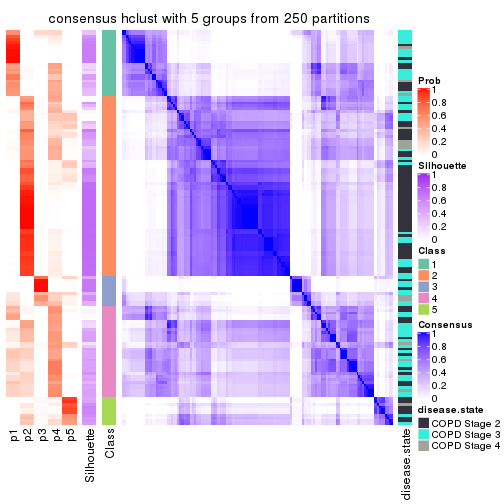</p>

</div>
<div id='tab-SD-hclust-consensus-heatmap-5'>
<pre><code class="r">consensus_heatmap(res, k = 6)
</code></pre>

<p></p>

</div>
</div>

Heatmaps for the membership of samples in all partitions to see how consistent they are:


<script>
$( function() {
	$( '#tabs-SD-hclust-membership-heatmap' ).tabs();
} );
</script>
<div id='tabs-SD-hclust-membership-heatmap'>
<ul>
<li><a href='#tab-SD-hclust-membership-heatmap-1'>k = 2</a></li>
<li><a href='#tab-SD-hclust-membership-heatmap-2'>k = 3</a></li>
<li><a href='#tab-SD-hclust-membership-heatmap-3'>k = 4</a></li>
<li><a href='#tab-SD-hclust-membership-heatmap-4'>k = 5</a></li>
<li><a href='#tab-SD-hclust-membership-heatmap-5'>k = 6</a></li>
</ul>
<div id='tab-SD-hclust-membership-heatmap-1'>
<pre><code class="r">membership_heatmap(res, k = 2)
</code></pre>

<p></p>

</div>
<div id='tab-SD-hclust-membership-heatmap-2'>
<pre><code class="r">membership_heatmap(res, k = 3)
</code></pre>

<p></p>

</div>
<div id='tab-SD-hclust-membership-heatmap-3'>
<pre><code class="r">membership_heatmap(res, k = 4)
</code></pre>

<p></p>

</div>
<div id='tab-SD-hclust-membership-heatmap-4'>
<pre><code class="r">membership_heatmap(res, k = 5)
</code></pre>

<p>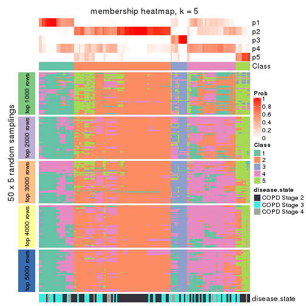</p>

</div>
<div id='tab-SD-hclust-membership-heatmap-5'>
<pre><code class="r">membership_heatmap(res, k = 6)
</code></pre>

<p></p>

</div>
</div>

As soon as we have had the classes for columns, we can look for signatures
which are significantly different between classes which can be candidate marks
for certain classes. Following are the heatmaps for signatures.


Signature heatmaps where rows are scaled:


<script>
$( function() {
	$( '#tabs-SD-hclust-get-signatures' ).tabs();
} );
</script>
<div id='tabs-SD-hclust-get-signatures'>
<ul>
<li><a href='#tab-SD-hclust-get-signatures-1'>k = 2</a></li>
<li><a href='#tab-SD-hclust-get-signatures-2'>k = 3</a></li>
<li><a href='#tab-SD-hclust-get-signatures-3'>k = 4</a></li>
<li><a href='#tab-SD-hclust-get-signatures-4'>k = 5</a></li>
<li><a href='#tab-SD-hclust-get-signatures-5'>k = 6</a></li>
</ul>
<div id='tab-SD-hclust-get-signatures-1'>
<pre><code class="r">get_signatures(res, k = 2)
</code></pre>

<p></p>

</div>
<div id='tab-SD-hclust-get-signatures-2'>
<pre><code class="r">get_signatures(res, k = 3)
</code></pre>

<p></p>

</div>
<div id='tab-SD-hclust-get-signatures-3'>
<pre><code class="r">get_signatures(res, k = 4)
</code></pre>

<p></p>

</div>
<div id='tab-SD-hclust-get-signatures-4'>
<pre><code class="r">get_signatures(res, k = 5)
</code></pre>

<p></p>

</div>
<div id='tab-SD-hclust-get-signatures-5'>
<pre><code class="r">get_signatures(res, k = 6)
</code></pre>

<p></p>

</div>
</div>


Signature heatmaps where rows are not scaled:


<script>
$( function() {
	$( '#tabs-SD-hclust-get-signatures-no-scale' ).tabs();
} );
</script>
<div id='tabs-SD-hclust-get-signatures-no-scale'>
<ul>
<li><a href='#tab-SD-hclust-get-signatures-no-scale-1'>k = 2</a></li>
<li><a href='#tab-SD-hclust-get-signatures-no-scale-2'>k = 3</a></li>
<li><a href='#tab-SD-hclust-get-signatures-no-scale-3'>k = 4</a></li>
<li><a href='#tab-SD-hclust-get-signatures-no-scale-4'>k = 5</a></li>
<li><a href='#tab-SD-hclust-get-signatures-no-scale-5'>k = 6</a></li>
</ul>
<div id='tab-SD-hclust-get-signatures-no-scale-1'>
<pre><code class="r">get_signatures(res, k = 2, scale_rows = FALSE)
</code></pre>

<p></p>

</div>
<div id='tab-SD-hclust-get-signatures-no-scale-2'>
<pre><code class="r">get_signatures(res, k = 3, scale_rows = FALSE)
</code></pre>

<p></p>

</div>
<div id='tab-SD-hclust-get-signatures-no-scale-3'>
<pre><code class="r">get_signatures(res, k = 4, scale_rows = FALSE)
</code></pre>

<p></p>

</div>
<div id='tab-SD-hclust-get-signatures-no-scale-4'>
<pre><code class="r">get_signatures(res, k = 5, scale_rows = FALSE)
</code></pre>

<p></p>

</div>
<div id='tab-SD-hclust-get-signatures-no-scale-5'>
<pre><code class="r">get_signatures(res, k = 6, scale_rows = FALSE)
</code></pre>

<p></p>

</div>
</div>


Compare the overlap of signatures from different k:

```r
compare_signatures(res)
```


`get_signature()` returns a data frame invisibly. TO get the list of signatures, the function
call should be assigned to a variable explicitly. In following code, if `plot` argument is set
to `FALSE`, no heatmap is plotted while only the differential analysis is performed.

```r
# code only for demonstration
tb = get_signature(res, k = ..., plot = FALSE)
```

An example of the output of `tb` is:

```
#>   which_row         fdr    mean_1    mean_2 scaled_mean_1 scaled_mean_2 km
#> 1        38 0.042760348  8.373488  9.131774    -0.5533452     0.5164555  1
#> 2        40 0.018707592  7.106213  8.469186    -0.6173731     0.5762149  1
#> 3        55 0.019134737 10.221463 11.207825    -0.6159697     0.5749050  1
#> 4        59 0.006059896  5.921854  7.869574    -0.6899429     0.6439467  1
#> 5        60 0.018055526  8.928898 10.211722    -0.6204761     0.5791110  1
#> 6        98 0.009384629 15.714769 14.887706     0.6635654    -0.6193277  2
...
```

The columns in `tb` are:

1. `which_row`: row indices corresponding to the input matrix.
2. `fdr`: FDR for the differential test. 
3. `mean_x`: The mean value in group x.
4. `scaled_mean_x`: The mean value in group x after rows are scaled.
5. `km`: Row groups if k-means clustering is applied to rows.


UMAP plot which shows how samples are separated.


<script>
$( function() {
	$( '#tabs-SD-hclust-dimension-reduction' ).tabs();
} );
</script>
<div id='tabs-SD-hclust-dimension-reduction'>
<ul>
<li><a href='#tab-SD-hclust-dimension-reduction-1'>k = 2</a></li>
<li><a href='#tab-SD-hclust-dimension-reduction-2'>k = 3</a></li>
<li><a href='#tab-SD-hclust-dimension-reduction-3'>k = 4</a></li>
<li><a href='#tab-SD-hclust-dimension-reduction-4'>k = 5</a></li>
<li><a href='#tab-SD-hclust-dimension-reduction-5'>k = 6</a></li>
</ul>
<div id='tab-SD-hclust-dimension-reduction-1'>
<pre><code class="r">dimension_reduction(res, k = 2, method = &quot;UMAP&quot;)
</code></pre>

<p></p>

</div>
<div id='tab-SD-hclust-dimension-reduction-2'>
<pre><code class="r">dimension_reduction(res, k = 3, method = &quot;UMAP&quot;)
</code></pre>

<p></p>

</div>
<div id='tab-SD-hclust-dimension-reduction-3'>
<pre><code class="r">dimension_reduction(res, k = 4, method = &quot;UMAP&quot;)
</code></pre>

<p></p>

</div>
<div id='tab-SD-hclust-dimension-reduction-4'>
<pre><code class="r">dimension_reduction(res, k = 5, method = &quot;UMAP&quot;)
</code></pre>

<p></p>

</div>
<div id='tab-SD-hclust-dimension-reduction-5'>
<pre><code class="r">dimension_reduction(res, k = 6, method = &quot;UMAP&quot;)
</code></pre>

<p></p>

</div>
</div>


Following heatmap shows how subgroups are split when increasing `k`:

```r
collect_classes(res)
```


Test correlation between subgroups and known annotations. If the known
annotation is numeric, one-way ANOVA test is applied, and if the known
annotation is discrete, chi-squared contingency table test is applied.

```r
test_to_known_factors(res)
```

```
#>             n disease.state(p) k
#> SD:hclust  98         0.000118 2
#> SD:hclust 111         0.002862 3
#> SD:hclust 111         0.003299 4
#> SD:hclust  69         0.001046 5
#> SD:hclust  62         0.000288 6
```


If matrix rows can be associated to genes, consider to use `GO_Enrichment(res,
...)` to perform function enrichment for the signature genes.


 

---------------------------------------------------


### SD:kmeans


The object with results only for a single top-value method and a single partition method 
can be extracted as:

```r
res = res_list["SD", "kmeans"]
# you can also extract it by
# res = res_list["SD:kmeans"]
```

A summary of `res` and all the functions that can be applied to it:

```r
res
```

```
#> A 'ConsensusPartition' object with k = 2, 3, 4, 5, 6.
#>   On a matrix with 51776 rows and 143 columns.
#>   Top rows (1000, 2000, 3000, 4000, 5000) are extracted by 'SD' method.
#>   Subgroups are detected by 'kmeans' method.
#>   Performed in total 1250 partitions by row resampling.
#>   Best k for subgroups seems to be 2.
#> 
#> Following methods can be applied to this 'ConsensusPartition' object:
#>  [1] "cola_report"             "collect_classes"         "collect_plots"          
#>  [4] "collect_stats"           "colnames"                "compare_signatures"     
#>  [7] "consensus_heatmap"       "dimension_reduction"     "functional_enrichment"  
#> [10] "get_anno_col"            "get_anno"                "get_classes"            
#> [13] "get_consensus"           "get_matrix"              "get_membership"         
#> [16] "get_param"               "get_signatures"          "get_stats"              
#> [19] "is_best_k"               "is_stable_k"             "membership_heatmap"     
#> [22] "ncol"                    "nrow"                    "plot_ecdf"              
#> [25] "rownames"                "select_partition_number" "show"                   
#> [28] "suggest_best_k"          "test_to_known_factors"
```

`collect_plots()` function collects all the plots made from `res` for all `k` (number of partitions)
into one single page to provide an easy and fast comparison between different `k`.

```r
collect_plots(res)
```


The plots are:

- The first row: a plot of the ECDF (Empirical cumulative distribution
  function) curves of the consensus matrix for each `k` and the heatmap of
  predicted classes for each `k`.
- The second row: heatmaps of the consensus matrix for each `k`.
- The third row: heatmaps of the membership matrix for each `k`.
- The fouth row: heatmaps of the signatures for each `k`.

All the plots in panels can be made by individual functions and they are
plotted later in this section.

`select_partition_number()` produces several plots showing different
statistics for choosing "optimized" `k`. There are following statistics:

- ECDF curves of the consensus matrix for each `k`;
- 1-PAC. [The PAC
  score](https://en.wikipedia.org/wiki/Consensus_clustering#Over-interpretation_potential_of_consensus_clustering)
  measures the proportion of the ambiguous subgrouping.
- Mean silhouette score.
- Concordance. The mean probability of fiting the consensus class ids in all
  partitions.
- Area increased. Denote $A_k$ as the area under the ECDF curve for current
  `k`, the area increased is defined as $A_k - A_{k-1}$.
- Rand index. The percent of pairs of samples that are both in a same cluster
  or both are not in a same cluster in the partition of k and k-1.
- Jaccard index. The ratio of pairs of samples are both in a same cluster in
  the partition of k and k-1 and the pairs of samples are both in a same
  cluster in the partition k or k-1.

The detailed explanations of these statistics can be found in [the cola
vignette](http://bioconductor.org/packages/devel/bioc/vignettes/cola/inst/doc/cola.html#toc_13).

Generally speaking, lower PAC score, higher mean silhouette score or higher
concordance corresponds to better partition. Rand index and Jaccard index
measure how similar the current partition is compared to partition with `k-1`.
If they are too similar, we won't accept `k` is better than `k-1`.

```r
select_partition_number(res)
```


The numeric values for all these statistics can be obtained by `get_stats()`.

```r
get_stats(res)
```

```
#>   k 1-PAC mean_silhouette concordance area_increased  Rand Jaccard
#> 2 2 0.505           0.866       0.885         0.4416 0.556   0.556
#> 3 3 0.573           0.715       0.859         0.4018 0.732   0.554
#> 4 4 0.516           0.380       0.642         0.1461 0.851   0.638
#> 5 5 0.651           0.749       0.823         0.0806 0.791   0.440
#> 6 6 0.684           0.606       0.769         0.0558 0.931   0.721
```

`suggest_best_k()` suggests the best $k$ based on these statistics. The rules are as follows:

- All $k$ with Jaccard index larger than 0.95 are removed because the increase of
  the partition number does not provides enough extra information. If all $k$ are removed,
  the best $k$ is assigned by `NA`.
- For $k$ with 1-PAC larger than 0.9, the maximal $k$ is taken as the "best k". Other $k$ is called "optional k".
- If it does not fit the second rule. The $k$ with the highest vote of highest
  1-PAC, mean silhouette and concordance is taken as the "best k".

```r
suggest_best_k(res)
```

```
#> [1] 2
```


Following shows the table of the partitions (You need to click the **show/hide
code output** link to see it). The membership matrix (columns with name `p*`)
is inferred by
[`clue::cl_consensus()`](https://www.rdocumentation.org/link/cl_consensus?package=clue)
function with the `SE` method. Basically the value in the membership matrix
represents the probability to belong to a certain group. The finall class
label for an item is determined with the group with highest probability it
belongs to.

In `get_classes()` function, the entropy is calculated from the membership
matrix and the silhouette score is calculated from the consensus matrix.


<script>
$( function() {
	$( '#tabs-SD-kmeans-get-classes' ).tabs();
} );
</script>
<div id='tabs-SD-kmeans-get-classes'>
<ul>
<li><a href='#tab-SD-kmeans-get-classes-1'>k = 2</a></li>
<li><a href='#tab-SD-kmeans-get-classes-2'>k = 3</a></li>
<li><a href='#tab-SD-kmeans-get-classes-3'>k = 4</a></li>
<li><a href='#tab-SD-kmeans-get-classes-4'>k = 5</a></li>
<li><a href='#tab-SD-kmeans-get-classes-5'>k = 6</a></li>
</ul>

<div id='tab-SD-kmeans-get-classes-1'>
<p><a id='tab-SD-kmeans-get-classes-1-a' style='color:#0366d6' href='#'>show/hide code output</a></p>
<pre><code class="r">cbind(get_classes(res, k = 2), get_membership(res, k = 2))
</code></pre>

<pre><code>#&gt;           class entropy silhouette    p1    p2
#&gt; GSM550785     1  0.7815      0.882 0.768 0.232
#&gt; GSM550786     2  0.7815      0.770 0.232 0.768
#&gt; GSM550788     2  0.0000      0.915 0.000 1.000
#&gt; GSM550789     2  0.0000      0.915 0.000 1.000
#&gt; GSM550790     1  0.7815      0.882 0.768 0.232
#&gt; GSM550791     1  0.7815      0.882 0.768 0.232
#&gt; GSM550792     2  0.0000      0.915 0.000 1.000
#&gt; GSM550796     2  0.0376      0.914 0.004 0.996
#&gt; GSM550797     2  0.0000      0.915 0.000 1.000
#&gt; GSM550799     2  0.7815      0.770 0.232 0.768
#&gt; GSM550800     2  0.0000      0.915 0.000 1.000
#&gt; GSM550801     2  0.0000      0.915 0.000 1.000
#&gt; GSM550804     2  0.0000      0.915 0.000 1.000
#&gt; GSM550806     2  0.7950      0.764 0.240 0.760
#&gt; GSM550807     2  0.0000      0.915 0.000 1.000
#&gt; GSM550808     2  0.5737      0.841 0.136 0.864
#&gt; GSM550809     1  0.7815      0.882 0.768 0.232
#&gt; GSM550810     2  0.0376      0.914 0.004 0.996
#&gt; GSM550811     2  0.7883      0.570 0.236 0.764
#&gt; GSM550813     2  0.0000      0.915 0.000 1.000
#&gt; GSM550814     2  0.0000      0.915 0.000 1.000
#&gt; GSM550815     2  0.0376      0.914 0.004 0.996
#&gt; GSM550816     2  0.0000      0.915 0.000 1.000
#&gt; GSM550817     2  0.7815      0.770 0.232 0.768
#&gt; GSM550818     2  0.7815      0.770 0.232 0.768
#&gt; GSM550819     2  0.0000      0.915 0.000 1.000
#&gt; GSM550820     1  0.7815      0.882 0.768 0.232
#&gt; GSM550821     2  0.6623      0.817 0.172 0.828
#&gt; GSM550822     2  0.0376      0.914 0.004 0.996
#&gt; GSM550826     1  0.0938      0.824 0.988 0.012
#&gt; GSM550832     2  0.0000      0.915 0.000 1.000
#&gt; GSM550833     2  0.0000      0.915 0.000 1.000
#&gt; GSM550835     2  0.7602      0.780 0.220 0.780
#&gt; GSM550836     1  0.0376      0.821 0.996 0.004
#&gt; GSM550837     2  0.6623      0.817 0.172 0.828
#&gt; GSM550838     1  0.5059      0.855 0.888 0.112
#&gt; GSM550841     2  0.7815      0.770 0.232 0.768
#&gt; GSM550842     2  0.6712      0.814 0.176 0.824
#&gt; GSM550846     2  0.1633      0.901 0.024 0.976
#&gt; GSM550849     2  0.0672      0.911 0.008 0.992
#&gt; GSM550850     1  0.7815      0.882 0.768 0.232
#&gt; GSM550851     2  0.6712      0.814 0.176 0.824
#&gt; GSM550852     2  0.0000      0.915 0.000 1.000
#&gt; GSM550853     2  0.0000      0.915 0.000 1.000
#&gt; GSM550855     2  0.0000      0.915 0.000 1.000
#&gt; GSM550856     2  0.0000      0.915 0.000 1.000
#&gt; GSM550861     2  0.0000      0.915 0.000 1.000
#&gt; GSM550863     2  0.1843      0.899 0.028 0.972
#&gt; GSM550864     2  0.0000      0.915 0.000 1.000
#&gt; GSM550866     2  0.0000      0.915 0.000 1.000
#&gt; GSM550867     1  0.7815      0.882 0.768 0.232
#&gt; GSM550885     1  0.7815      0.882 0.768 0.232
#&gt; GSM550886     2  0.7745      0.773 0.228 0.772
#&gt; GSM550887     2  0.0376      0.914 0.004 0.996
#&gt; GSM550889     2  0.0000      0.915 0.000 1.000
#&gt; GSM550894     2  0.0376      0.914 0.004 0.996
#&gt; GSM550897     1  0.7815      0.882 0.768 0.232
#&gt; GSM550903     2  0.0000      0.915 0.000 1.000
#&gt; GSM550905     2  0.6623      0.817 0.172 0.828
#&gt; GSM550906     2  0.0000      0.915 0.000 1.000
#&gt; GSM550907     2  0.7883      0.767 0.236 0.764
#&gt; GSM550909     2  0.1414      0.908 0.020 0.980
#&gt; GSM550911     2  0.7883      0.767 0.236 0.764
#&gt; GSM550913     2  0.0000      0.915 0.000 1.000
#&gt; GSM550915     2  0.1843      0.899 0.028 0.972
#&gt; GSM550917     2  0.0000      0.915 0.000 1.000
#&gt; GSM550919     2  0.1843      0.899 0.028 0.972
#&gt; GSM550921     1  0.0376      0.821 0.996 0.004
#&gt; GSM550924     2  0.6531      0.819 0.168 0.832
#&gt; GSM550926     2  0.0000      0.915 0.000 1.000
#&gt; GSM550927     2  0.0000      0.915 0.000 1.000
#&gt; GSM550787     2  0.7950      0.765 0.240 0.760
#&gt; GSM550793     1  0.0376      0.821 0.996 0.004
#&gt; GSM550794     2  0.0376      0.913 0.004 0.996
#&gt; GSM550795     1  0.7815      0.882 0.768 0.232
#&gt; GSM550798     1  0.0376      0.823 0.996 0.004
#&gt; GSM550803     1  0.7602      0.879 0.780 0.220
#&gt; GSM550805     2  0.4562      0.824 0.096 0.904
#&gt; GSM550823     2  0.0000      0.915 0.000 1.000
#&gt; GSM550824     1  0.7815      0.882 0.768 0.232
#&gt; GSM550825     1  0.0000      0.821 1.000 0.000
#&gt; GSM550827     2  0.1843      0.899 0.028 0.972
#&gt; GSM550828     1  0.7815      0.882 0.768 0.232
#&gt; GSM550829     1  0.0376      0.823 0.996 0.004
#&gt; GSM550830     2  0.0000      0.915 0.000 1.000
#&gt; GSM550834     1  0.7815      0.882 0.768 0.232
#&gt; GSM550839     2  0.7674      0.777 0.224 0.776
#&gt; GSM550840     1  0.7815      0.882 0.768 0.232
#&gt; GSM550843     2  0.7815      0.770 0.232 0.768
#&gt; GSM550844     1  0.7815      0.882 0.768 0.232
#&gt; GSM550845     2  0.0000      0.915 0.000 1.000
#&gt; GSM550848     2  0.1843      0.899 0.028 0.972
#&gt; GSM550854     1  0.7815      0.882 0.768 0.232
#&gt; GSM550857     1  0.0000      0.821 1.000 0.000
#&gt; GSM550858     1  0.7815      0.882 0.768 0.232
#&gt; GSM550859     1  0.7815      0.882 0.768 0.232
#&gt; GSM550862     1  0.7815      0.882 0.768 0.232
#&gt; GSM550865     2  0.1843      0.899 0.028 0.972
#&gt; GSM550868     2  0.1843      0.899 0.028 0.972
#&gt; GSM550869     2  0.5408      0.850 0.124 0.876
#&gt; GSM550870     2  0.0000      0.915 0.000 1.000
#&gt; GSM550871     2  0.7674      0.777 0.224 0.776
#&gt; GSM550872     2  0.1843      0.899 0.028 0.972
#&gt; GSM550873     2  0.0000      0.915 0.000 1.000
#&gt; GSM550874     2  0.0000      0.915 0.000 1.000
#&gt; GSM550876     2  0.7815      0.770 0.232 0.768
#&gt; GSM550877     2  0.0000      0.915 0.000 1.000
#&gt; GSM550878     2  0.7883      0.767 0.236 0.764
#&gt; GSM550879     1  0.7815      0.882 0.768 0.232
#&gt; GSM550882     1  0.1843      0.809 0.972 0.028
#&gt; GSM550888     1  0.0376      0.821 0.996 0.004
#&gt; GSM550890     2  0.1843      0.899 0.028 0.972
#&gt; GSM550891     1  0.1843      0.809 0.972 0.028
#&gt; GSM550892     1  0.7815      0.882 0.768 0.232
#&gt; GSM550893     2  0.0000      0.915 0.000 1.000
#&gt; GSM550895     2  0.0000      0.915 0.000 1.000
#&gt; GSM550896     2  0.0000      0.915 0.000 1.000
#&gt; GSM550898     1  0.7815      0.882 0.768 0.232
#&gt; GSM550899     2  0.0000      0.915 0.000 1.000
#&gt; GSM550900     2  0.1843      0.899 0.028 0.972
#&gt; GSM550901     2  0.4939      0.813 0.108 0.892
#&gt; GSM550902     1  0.0938      0.824 0.988 0.012
#&gt; GSM550904     1  0.6343      0.866 0.840 0.160
#&gt; GSM550908     1  0.0376      0.821 0.996 0.004
#&gt; GSM550912     2  0.0000      0.915 0.000 1.000
#&gt; GSM550914     2  0.1843      0.899 0.028 0.972
#&gt; GSM550918     2  0.0000      0.915 0.000 1.000
#&gt; GSM550922     2  0.7815      0.770 0.232 0.768
#&gt; GSM550923     1  0.0672      0.825 0.992 0.008
#&gt; GSM550925     1  0.8713      0.808 0.708 0.292
#&gt; GSM550802     2  0.0000      0.915 0.000 1.000
#&gt; GSM550812     2  0.0000      0.915 0.000 1.000
#&gt; GSM550831     1  0.7815      0.882 0.768 0.232
#&gt; GSM550847     1  0.7815      0.882 0.768 0.232
#&gt; GSM550860     1  0.2043      0.808 0.968 0.032
#&gt; GSM550875     1  0.7883      0.879 0.764 0.236
#&gt; GSM550880     2  0.2236      0.892 0.036 0.964
#&gt; GSM550881     1  0.1184      0.816 0.984 0.016
#&gt; GSM550883     1  0.0376      0.821 0.996 0.004
#&gt; GSM550884     2  0.0000      0.915 0.000 1.000
#&gt; GSM550910     2  0.7815      0.770 0.232 0.768
#&gt; GSM550916     1  0.7815      0.882 0.768 0.232
#&gt; GSM550920     2  0.7815      0.770 0.232 0.768
</code></pre>

<script>
$('#tab-SD-kmeans-get-classes-1-a').parent().next().next().hide();
$('#tab-SD-kmeans-get-classes-1-a').click(function(){
  $('#tab-SD-kmeans-get-classes-1-a').parent().next().next().toggle();
  return(false);
});
</script>
</div>

<div id='tab-SD-kmeans-get-classes-2'>
<p><a id='tab-SD-kmeans-get-classes-2-a' style='color:#0366d6' href='#'>show/hide code output</a></p>
<pre><code class="r">cbind(get_classes(res, k = 3), get_membership(res, k = 3))
</code></pre>

<pre><code>#&gt;           class entropy silhouette    p1    p2    p3
#&gt; GSM550785     1  0.0237     0.8874 0.996 0.004 0.000
#&gt; GSM550786     3  0.6018     0.5863 0.008 0.308 0.684
#&gt; GSM550788     2  0.1860     0.8054 0.000 0.948 0.052
#&gt; GSM550789     2  0.1964     0.8040 0.000 0.944 0.056
#&gt; GSM550790     1  0.0475     0.8868 0.992 0.004 0.004
#&gt; GSM550791     1  0.0661     0.8863 0.988 0.008 0.004
#&gt; GSM550792     2  0.6253     0.6374 0.232 0.732 0.036
#&gt; GSM550796     2  0.2878     0.7786 0.000 0.904 0.096
#&gt; GSM550797     2  0.1964     0.8040 0.000 0.944 0.056
#&gt; GSM550799     3  0.5397     0.6519 0.000 0.280 0.720
#&gt; GSM550800     2  0.0000     0.8138 0.000 1.000 0.000
#&gt; GSM550801     2  0.1860     0.8054 0.000 0.948 0.052
#&gt; GSM550804     2  0.0000     0.8138 0.000 1.000 0.000
#&gt; GSM550806     3  0.3528     0.7403 0.016 0.092 0.892
#&gt; GSM550807     2  0.1163     0.8114 0.000 0.972 0.028
#&gt; GSM550808     2  0.3573     0.7576 0.004 0.876 0.120
#&gt; GSM550809     1  0.0237     0.8866 0.996 0.000 0.004
#&gt; GSM550810     2  0.3112     0.7769 0.004 0.900 0.096
#&gt; GSM550811     1  0.6632     0.5601 0.692 0.272 0.036
#&gt; GSM550813     2  0.0000     0.8138 0.000 1.000 0.000
#&gt; GSM550814     2  0.0661     0.8132 0.004 0.988 0.008
#&gt; GSM550815     2  0.2878     0.7786 0.000 0.904 0.096
#&gt; GSM550816     2  0.1964     0.8040 0.000 0.944 0.056
#&gt; GSM550817     3  0.4796     0.6969 0.000 0.220 0.780
#&gt; GSM550818     3  0.2400     0.7563 0.004 0.064 0.932
#&gt; GSM550819     2  0.2297     0.7946 0.020 0.944 0.036
#&gt; GSM550820     1  0.0000     0.8868 1.000 0.000 0.000
#&gt; GSM550821     2  0.3851     0.7562 0.004 0.860 0.136
#&gt; GSM550822     2  0.2878     0.7786 0.000 0.904 0.096
#&gt; GSM550826     1  0.0592     0.8843 0.988 0.000 0.012
#&gt; GSM550832     2  0.2200     0.8029 0.004 0.940 0.056
#&gt; GSM550833     2  0.1964     0.8040 0.000 0.944 0.056
#&gt; GSM550835     2  0.6169     0.3829 0.004 0.636 0.360
#&gt; GSM550836     3  0.3941     0.6913 0.156 0.000 0.844
#&gt; GSM550837     2  0.3500     0.7612 0.004 0.880 0.116
#&gt; GSM550838     1  0.0237     0.8866 0.996 0.000 0.004
#&gt; GSM550841     3  0.5431     0.6472 0.000 0.284 0.716
#&gt; GSM550842     2  0.3644     0.7539 0.004 0.872 0.124
#&gt; GSM550846     2  0.6526     0.6052 0.260 0.704 0.036
#&gt; GSM550849     1  0.7245     0.3223 0.596 0.368 0.036
#&gt; GSM550850     1  0.0475     0.8868 0.992 0.004 0.004
#&gt; GSM550851     2  0.3644     0.7539 0.004 0.872 0.124
#&gt; GSM550852     2  0.1525     0.8027 0.004 0.964 0.032
#&gt; GSM550853     2  0.1163     0.8114 0.000 0.972 0.028
#&gt; GSM550855     2  0.1163     0.8114 0.000 0.972 0.028
#&gt; GSM550856     2  0.0000     0.8138 0.000 1.000 0.000
#&gt; GSM550861     2  0.1964     0.8040 0.000 0.944 0.056
#&gt; GSM550863     2  0.7476     0.1934 0.452 0.512 0.036
#&gt; GSM550864     2  0.0000     0.8138 0.000 1.000 0.000
#&gt; GSM550866     2  0.0000     0.8138 0.000 1.000 0.000
#&gt; GSM550867     1  0.2096     0.8647 0.944 0.004 0.052
#&gt; GSM550885     1  0.2096     0.8647 0.944 0.004 0.052
#&gt; GSM550886     3  0.6330     0.3991 0.004 0.396 0.600
#&gt; GSM550887     2  0.2356     0.7954 0.000 0.928 0.072
#&gt; GSM550889     2  0.6295     0.6190 0.236 0.728 0.036
#&gt; GSM550894     2  0.2200     0.8029 0.004 0.940 0.056
#&gt; GSM550897     1  0.3083     0.8435 0.916 0.060 0.024
#&gt; GSM550903     2  0.1964     0.8040 0.000 0.944 0.056
#&gt; GSM550905     2  0.3573     0.7576 0.004 0.876 0.120
#&gt; GSM550906     2  0.1964     0.8040 0.000 0.944 0.056
#&gt; GSM550907     3  0.1989     0.7546 0.004 0.048 0.948
#&gt; GSM550909     2  0.4110     0.7536 0.004 0.844 0.152
#&gt; GSM550911     3  0.1989     0.7546 0.004 0.048 0.948
#&gt; GSM550913     2  0.1964     0.8040 0.000 0.944 0.056
#&gt; GSM550915     2  0.7471     0.2063 0.448 0.516 0.036
#&gt; GSM550917     2  0.0000     0.8138 0.000 1.000 0.000
#&gt; GSM550919     2  0.7353     0.3522 0.396 0.568 0.036
#&gt; GSM550921     3  0.3551     0.7034 0.132 0.000 0.868
#&gt; GSM550924     2  0.7495     0.4974 0.084 0.668 0.248
#&gt; GSM550926     2  0.0000     0.8138 0.000 1.000 0.000
#&gt; GSM550927     2  0.1964     0.8040 0.000 0.944 0.056
#&gt; GSM550787     1  0.9502     0.2503 0.492 0.272 0.236
#&gt; GSM550793     3  0.5810     0.4917 0.336 0.000 0.664
#&gt; GSM550794     2  0.6962     0.5341 0.316 0.648 0.036
#&gt; GSM550795     1  0.0475     0.8870 0.992 0.004 0.004
#&gt; GSM550798     1  0.1860     0.8631 0.948 0.000 0.052
#&gt; GSM550803     1  0.2096     0.8647 0.944 0.004 0.052
#&gt; GSM550805     1  0.6335     0.6211 0.724 0.240 0.036
#&gt; GSM550823     2  0.4708     0.7300 0.120 0.844 0.036
#&gt; GSM550824     1  0.2096     0.8647 0.944 0.004 0.052
#&gt; GSM550825     3  0.5058     0.6073 0.244 0.000 0.756
#&gt; GSM550827     2  0.7460     0.2303 0.440 0.524 0.036
#&gt; GSM550828     1  0.0237     0.8874 0.996 0.004 0.000
#&gt; GSM550829     1  0.5058     0.5754 0.756 0.000 0.244
#&gt; GSM550830     2  0.7013     0.4934 0.324 0.640 0.036
#&gt; GSM550834     1  0.2947     0.8461 0.920 0.060 0.020
#&gt; GSM550839     3  0.6608     0.3752 0.008 0.432 0.560
#&gt; GSM550840     1  0.3083     0.8435 0.916 0.060 0.024
#&gt; GSM550843     3  0.4931     0.6998 0.004 0.212 0.784
#&gt; GSM550844     1  0.0237     0.8866 0.996 0.000 0.004
#&gt; GSM550845     2  0.0000     0.8138 0.000 1.000 0.000
#&gt; GSM550848     2  0.6852     0.5547 0.300 0.664 0.036
#&gt; GSM550854     1  0.2096     0.8647 0.944 0.004 0.052
#&gt; GSM550857     3  0.4002     0.6883 0.160 0.000 0.840
#&gt; GSM550858     1  0.0475     0.8868 0.992 0.004 0.004
#&gt; GSM550859     1  0.2096     0.8647 0.944 0.004 0.052
#&gt; GSM550862     1  0.0237     0.8874 0.996 0.004 0.000
#&gt; GSM550865     2  0.7484     0.1655 0.460 0.504 0.036
#&gt; GSM550868     2  0.7484     0.1655 0.460 0.504 0.036
#&gt; GSM550869     2  0.8801     0.4243 0.292 0.560 0.148
#&gt; GSM550870     2  0.0000     0.8138 0.000 1.000 0.000
#&gt; GSM550871     3  0.7069     0.2820 0.020 0.472 0.508
#&gt; GSM550872     1  0.7480    -0.0184 0.508 0.456 0.036
#&gt; GSM550873     2  0.1525     0.8027 0.004 0.964 0.032
#&gt; GSM550874     2  0.0000     0.8138 0.000 1.000 0.000
#&gt; GSM550876     3  0.5988     0.6411 0.008 0.304 0.688
#&gt; GSM550877     2  0.0000     0.8138 0.000 1.000 0.000
#&gt; GSM550878     3  0.1989     0.7546 0.004 0.048 0.948
#&gt; GSM550879     1  0.0475     0.8870 0.992 0.004 0.004
#&gt; GSM550882     3  0.2959     0.7166 0.100 0.000 0.900
#&gt; GSM550888     3  0.3941     0.6913 0.156 0.000 0.844
#&gt; GSM550890     2  0.7311     0.3853 0.384 0.580 0.036
#&gt; GSM550891     3  0.1964     0.7279 0.056 0.000 0.944
#&gt; GSM550892     1  0.0661     0.8863 0.988 0.008 0.004
#&gt; GSM550893     2  0.0000     0.8138 0.000 1.000 0.000
#&gt; GSM550895     2  0.3310     0.7720 0.064 0.908 0.028
#&gt; GSM550896     2  0.0000     0.8138 0.000 1.000 0.000
#&gt; GSM550898     1  0.2096     0.8647 0.944 0.004 0.052
#&gt; GSM550899     2  0.0000     0.8138 0.000 1.000 0.000
#&gt; GSM550900     2  0.7471     0.2067 0.448 0.516 0.036
#&gt; GSM550901     1  0.4413     0.7934 0.860 0.104 0.036
#&gt; GSM550902     1  0.0747     0.8832 0.984 0.000 0.016
#&gt; GSM550904     1  0.0000     0.8868 1.000 0.000 0.000
#&gt; GSM550908     3  0.3941     0.6913 0.156 0.000 0.844
#&gt; GSM550912     2  0.0892     0.8078 0.000 0.980 0.020
#&gt; GSM550914     2  0.6597     0.5981 0.268 0.696 0.036
#&gt; GSM550918     2  0.0000     0.8138 0.000 1.000 0.000
#&gt; GSM550922     3  0.6081     0.5503 0.004 0.344 0.652
#&gt; GSM550923     1  0.1860     0.8631 0.948 0.000 0.052
#&gt; GSM550925     1  0.3722     0.8198 0.888 0.088 0.024
#&gt; GSM550802     2  0.2152     0.7950 0.016 0.948 0.036
#&gt; GSM550812     2  0.5413     0.6955 0.164 0.800 0.036
#&gt; GSM550831     1  0.0237     0.8874 0.996 0.004 0.000
#&gt; GSM550847     1  0.1647     0.8733 0.960 0.004 0.036
#&gt; GSM550860     3  0.6254     0.6361 0.188 0.056 0.756
#&gt; GSM550875     1  0.3237     0.8371 0.912 0.056 0.032
#&gt; GSM550880     1  0.5689     0.7010 0.780 0.184 0.036
#&gt; GSM550881     3  0.3816     0.6946 0.148 0.000 0.852
#&gt; GSM550883     3  0.3941     0.6913 0.156 0.000 0.844
#&gt; GSM550884     2  0.5891     0.6665 0.200 0.764 0.036
#&gt; GSM550910     3  0.5443     0.6595 0.004 0.260 0.736
#&gt; GSM550916     1  0.0475     0.8868 0.992 0.004 0.004
#&gt; GSM550920     3  0.5580     0.6615 0.008 0.256 0.736
</code></pre>

<script>
$('#tab-SD-kmeans-get-classes-2-a').parent().next().next().hide();
$('#tab-SD-kmeans-get-classes-2-a').click(function(){
  $('#tab-SD-kmeans-get-classes-2-a').parent().next().next().toggle();
  return(false);
});
</script>
</div>

<div id='tab-SD-kmeans-get-classes-3'>
<p><a id='tab-SD-kmeans-get-classes-3-a' style='color:#0366d6' href='#'>show/hide code output</a></p>
<pre><code class="r">cbind(get_classes(res, k = 4), get_membership(res, k = 4))
</code></pre>

<pre><code>#&gt;           class entropy silhouette    p1    p2    p3    p4
#&gt; GSM550785     1  0.1302   7.68e-01 0.956 0.000 0.000 0.044
#&gt; GSM550786     3  0.5470   4.00e-01 0.000 0.100 0.732 0.168
#&gt; GSM550788     2  0.4053   3.85e-01 0.000 0.768 0.228 0.004
#&gt; GSM550789     2  0.4040   3.62e-01 0.000 0.752 0.248 0.000
#&gt; GSM550790     1  0.0707   7.63e-01 0.980 0.000 0.000 0.020
#&gt; GSM550791     1  0.4222   6.73e-01 0.728 0.000 0.000 0.272
#&gt; GSM550792     2  0.8054   9.31e-02 0.040 0.428 0.124 0.408
#&gt; GSM550796     2  0.4608   2.64e-01 0.000 0.692 0.304 0.004
#&gt; GSM550797     2  0.3975   3.73e-01 0.000 0.760 0.240 0.000
#&gt; GSM550799     3  0.3278   5.96e-01 0.000 0.116 0.864 0.020
#&gt; GSM550800     2  0.0524   5.22e-01 0.000 0.988 0.008 0.004
#&gt; GSM550801     2  0.3837   3.89e-01 0.000 0.776 0.224 0.000
#&gt; GSM550804     2  0.0000   5.25e-01 0.000 1.000 0.000 0.000
#&gt; GSM550806     3  0.5055   1.28e-01 0.000 0.008 0.624 0.368
#&gt; GSM550807     2  0.3751   4.11e-01 0.000 0.800 0.196 0.004
#&gt; GSM550808     3  0.4888   3.68e-01 0.000 0.412 0.588 0.000
#&gt; GSM550809     1  0.4776   6.05e-01 0.624 0.000 0.000 0.376
#&gt; GSM550810     2  0.4679   1.69e-01 0.000 0.648 0.352 0.000
#&gt; GSM550811     4  0.9172   1.09e-01 0.144 0.316 0.128 0.412
#&gt; GSM550813     2  0.0336   5.27e-01 0.000 0.992 0.000 0.008
#&gt; GSM550814     2  0.2999   4.53e-01 0.000 0.864 0.132 0.004
#&gt; GSM550815     2  0.4608   2.64e-01 0.000 0.692 0.304 0.004
#&gt; GSM550816     2  0.5279   3.74e-01 0.000 0.716 0.232 0.052
#&gt; GSM550817     3  0.3149   5.76e-01 0.000 0.088 0.880 0.032
#&gt; GSM550818     3  0.3196   4.29e-01 0.000 0.008 0.856 0.136
#&gt; GSM550819     2  0.7569   1.07e-01 0.008 0.432 0.148 0.412
#&gt; GSM550820     1  0.4746   6.13e-01 0.632 0.000 0.000 0.368
#&gt; GSM550821     3  0.6179   4.23e-01 0.000 0.320 0.608 0.072
#&gt; GSM550822     2  0.4632   2.55e-01 0.000 0.688 0.308 0.004
#&gt; GSM550826     1  0.6949   4.14e-01 0.480 0.000 0.112 0.408
#&gt; GSM550832     2  0.4164   3.48e-01 0.000 0.736 0.264 0.000
#&gt; GSM550833     2  0.4155   3.73e-01 0.000 0.756 0.240 0.004
#&gt; GSM550835     3  0.4560   5.08e-01 0.000 0.296 0.700 0.004
#&gt; GSM550836     4  0.5997   1.58e-01 0.048 0.000 0.376 0.576
#&gt; GSM550837     3  0.5060   3.61e-01 0.000 0.412 0.584 0.004
#&gt; GSM550838     1  0.5204   5.96e-01 0.612 0.000 0.012 0.376
#&gt; GSM550841     3  0.3271   6.04e-01 0.000 0.132 0.856 0.012
#&gt; GSM550842     3  0.5039   3.74e-01 0.000 0.404 0.592 0.004
#&gt; GSM550846     2  0.7837   1.27e-01 0.084 0.448 0.052 0.416
#&gt; GSM550849     4  0.9198   1.15e-01 0.144 0.312 0.132 0.412
#&gt; GSM550850     1  0.1211   7.68e-01 0.960 0.000 0.000 0.040
#&gt; GSM550851     3  0.4898   3.61e-01 0.000 0.416 0.584 0.000
#&gt; GSM550852     2  0.5339   4.13e-01 0.000 0.744 0.100 0.156
#&gt; GSM550853     2  0.3870   4.02e-01 0.000 0.788 0.208 0.004
#&gt; GSM550855     2  0.3870   4.02e-01 0.000 0.788 0.208 0.004
#&gt; GSM550856     2  0.0469   5.26e-01 0.000 0.988 0.000 0.012
#&gt; GSM550861     2  0.3975   3.73e-01 0.000 0.760 0.240 0.000
#&gt; GSM550863     2  0.7305   1.38e-01 0.132 0.460 0.004 0.404
#&gt; GSM550864     2  0.0592   5.27e-01 0.000 0.984 0.000 0.016
#&gt; GSM550866     2  0.0921   5.26e-01 0.000 0.972 0.000 0.028
#&gt; GSM550867     1  0.0000   7.57e-01 1.000 0.000 0.000 0.000
#&gt; GSM550885     1  0.0000   7.57e-01 1.000 0.000 0.000 0.000
#&gt; GSM550886     3  0.3757   6.08e-01 0.000 0.152 0.828 0.020
#&gt; GSM550887     2  0.4608   2.64e-01 0.000 0.692 0.304 0.004
#&gt; GSM550889     2  0.5580   2.70e-01 0.016 0.572 0.004 0.408
#&gt; GSM550894     2  0.4222   3.37e-01 0.000 0.728 0.272 0.000
#&gt; GSM550897     4  0.7681  -1.10e-01 0.380 0.216 0.000 0.404
#&gt; GSM550903     2  0.3975   3.73e-01 0.000 0.760 0.240 0.000
#&gt; GSM550905     3  0.4888   3.68e-01 0.000 0.412 0.588 0.000
#&gt; GSM550906     2  0.4155   3.73e-01 0.000 0.756 0.240 0.004
#&gt; GSM550907     3  0.4730   1.47e-01 0.000 0.000 0.636 0.364
#&gt; GSM550909     3  0.6731   4.35e-01 0.000 0.236 0.608 0.156
#&gt; GSM550911     3  0.4730   1.47e-01 0.000 0.000 0.636 0.364
#&gt; GSM550913     2  0.3975   3.73e-01 0.000 0.760 0.240 0.000
#&gt; GSM550915     2  0.7276   1.37e-01 0.128 0.456 0.004 0.412
#&gt; GSM550917     2  0.0000   5.25e-01 0.000 1.000 0.000 0.000
#&gt; GSM550919     2  0.7115   1.60e-01 0.112 0.476 0.004 0.408
#&gt; GSM550921     4  0.5805   1.52e-01 0.036 0.000 0.388 0.576
#&gt; GSM550924     4  0.7816   5.73e-02 0.000 0.316 0.272 0.412
#&gt; GSM550926     2  0.1004   5.25e-01 0.000 0.972 0.004 0.024
#&gt; GSM550927     2  0.4220   3.62e-01 0.000 0.748 0.248 0.004
#&gt; GSM550787     4  0.9296   1.57e-01 0.088 0.276 0.264 0.372
#&gt; GSM550793     4  0.7534   7.06e-02 0.188 0.000 0.380 0.432
#&gt; GSM550794     2  0.8270   7.45e-02 0.056 0.416 0.120 0.408
#&gt; GSM550795     1  0.4761   6.02e-01 0.628 0.000 0.000 0.372
#&gt; GSM550798     1  0.1474   7.12e-01 0.948 0.000 0.000 0.052
#&gt; GSM550803     1  0.0000   7.57e-01 1.000 0.000 0.000 0.000
#&gt; GSM550805     4  0.9303   1.51e-01 0.172 0.288 0.128 0.412
#&gt; GSM550823     2  0.7239   1.80e-01 0.020 0.480 0.084 0.416
#&gt; GSM550824     1  0.0000   7.57e-01 1.000 0.000 0.000 0.000
#&gt; GSM550825     4  0.7169   1.38e-01 0.152 0.000 0.332 0.516
#&gt; GSM550827     2  0.7235   1.46e-01 0.124 0.464 0.004 0.408
#&gt; GSM550828     1  0.1474   7.66e-01 0.948 0.000 0.000 0.052
#&gt; GSM550829     1  0.4667   5.68e-01 0.796 0.000 0.096 0.108
#&gt; GSM550830     2  0.5955   2.50e-01 0.032 0.552 0.004 0.412
#&gt; GSM550834     1  0.5004   5.69e-01 0.604 0.004 0.000 0.392
#&gt; GSM550839     3  0.6147   4.06e-01 0.000 0.224 0.664 0.112
#&gt; GSM550840     1  0.5279   5.43e-01 0.588 0.012 0.000 0.400
#&gt; GSM550843     3  0.5121   4.77e-01 0.000 0.120 0.764 0.116
#&gt; GSM550844     1  0.4776   6.06e-01 0.624 0.000 0.000 0.376
#&gt; GSM550845     2  0.1389   5.20e-01 0.000 0.952 0.000 0.048
#&gt; GSM550848     2  0.7157   1.55e-01 0.116 0.472 0.004 0.408
#&gt; GSM550854     1  0.0000   7.57e-01 1.000 0.000 0.000 0.000
#&gt; GSM550857     4  0.6150   1.59e-01 0.060 0.000 0.360 0.580
#&gt; GSM550858     1  0.1211   7.68e-01 0.960 0.000 0.000 0.040
#&gt; GSM550859     1  0.0000   7.57e-01 1.000 0.000 0.000 0.000
#&gt; GSM550862     1  0.1302   7.68e-01 0.956 0.000 0.000 0.044
#&gt; GSM550865     2  0.7305   1.38e-01 0.132 0.460 0.004 0.404
#&gt; GSM550868     2  0.7305   1.38e-01 0.132 0.460 0.004 0.404
#&gt; GSM550869     4  0.7979  -5.17e-03 0.008 0.352 0.224 0.416
#&gt; GSM550870     2  0.0000   5.25e-01 0.000 1.000 0.000 0.000
#&gt; GSM550871     3  0.7626   3.61e-05 0.000 0.304 0.464 0.232
#&gt; GSM550872     2  0.7305   1.38e-01 0.132 0.460 0.004 0.404
#&gt; GSM550873     2  0.5998   3.10e-01 0.000 0.684 0.200 0.116
#&gt; GSM550874     2  0.0779   5.26e-01 0.000 0.980 0.004 0.016
#&gt; GSM550876     3  0.5520   4.23e-01 0.000 0.244 0.696 0.060
#&gt; GSM550877     2  0.0336   5.26e-01 0.000 0.992 0.000 0.008
#&gt; GSM550878     3  0.4746   1.41e-01 0.000 0.000 0.632 0.368
#&gt; GSM550879     1  0.4730   6.09e-01 0.636 0.000 0.000 0.364
#&gt; GSM550882     4  0.5105   1.03e-01 0.004 0.000 0.432 0.564
#&gt; GSM550888     4  0.5997   1.58e-01 0.048 0.000 0.376 0.576
#&gt; GSM550890     2  0.7309   1.36e-01 0.132 0.456 0.004 0.408
#&gt; GSM550891     4  0.5080   1.18e-01 0.004 0.000 0.420 0.576
#&gt; GSM550892     1  0.4406   6.51e-01 0.700 0.000 0.000 0.300
#&gt; GSM550893     2  0.0469   5.27e-01 0.000 0.988 0.000 0.012
#&gt; GSM550895     2  0.5201   2.89e-01 0.004 0.592 0.004 0.400
#&gt; GSM550896     2  0.0336   5.26e-01 0.000 0.992 0.000 0.008
#&gt; GSM550898     1  0.0000   7.57e-01 1.000 0.000 0.000 0.000
#&gt; GSM550899     2  0.0469   5.27e-01 0.000 0.988 0.000 0.012
#&gt; GSM550900     2  0.7341   1.31e-01 0.136 0.456 0.004 0.404
#&gt; GSM550901     4  0.7665  -1.17e-01 0.384 0.212 0.000 0.404
#&gt; GSM550902     1  0.7379   3.93e-01 0.472 0.020 0.096 0.412
#&gt; GSM550904     1  0.4920   6.12e-01 0.628 0.000 0.004 0.368
#&gt; GSM550908     4  0.5936   1.56e-01 0.044 0.000 0.380 0.576
#&gt; GSM550912     2  0.1109   5.23e-01 0.000 0.968 0.004 0.028
#&gt; GSM550914     2  0.7115   1.65e-01 0.112 0.476 0.004 0.408
#&gt; GSM550918     2  0.0188   5.26e-01 0.000 0.996 0.000 0.004
#&gt; GSM550922     3  0.3123   6.07e-01 0.000 0.156 0.844 0.000
#&gt; GSM550923     1  0.0336   7.54e-01 0.992 0.000 0.000 0.008
#&gt; GSM550925     4  0.7785  -4.01e-02 0.348 0.248 0.000 0.404
#&gt; GSM550802     2  0.7070   1.82e-01 0.008 0.484 0.096 0.412
#&gt; GSM550812     2  0.7836   9.43e-02 0.020 0.428 0.144 0.408
#&gt; GSM550831     1  0.1302   7.68e-01 0.956 0.000 0.000 0.044
#&gt; GSM550847     1  0.0000   7.57e-01 1.000 0.000 0.000 0.000
#&gt; GSM550860     3  0.8639  -7.32e-03 0.052 0.224 0.460 0.264
#&gt; GSM550875     4  0.9151   1.21e-02 0.292 0.204 0.092 0.412
#&gt; GSM550880     4  0.7990   8.09e-02 0.276 0.316 0.004 0.404
#&gt; GSM550881     4  0.5805   1.52e-01 0.036 0.000 0.388 0.576
#&gt; GSM550883     4  0.5984   1.59e-01 0.048 0.000 0.372 0.580
#&gt; GSM550884     2  0.7868   8.03e-02 0.020 0.420 0.148 0.412
#&gt; GSM550910     3  0.3335   6.02e-01 0.000 0.120 0.860 0.020
#&gt; GSM550916     1  0.1211   7.68e-01 0.960 0.000 0.000 0.040
#&gt; GSM550920     3  0.4731   5.16e-01 0.000 0.160 0.780 0.060
</code></pre>

<script>
$('#tab-SD-kmeans-get-classes-3-a').parent().next().next().hide();
$('#tab-SD-kmeans-get-classes-3-a').click(function(){
  $('#tab-SD-kmeans-get-classes-3-a').parent().next().next().toggle();
  return(false);
});
</script>
</div>

<div id='tab-SD-kmeans-get-classes-4'>
<p><a id='tab-SD-kmeans-get-classes-4-a' style='color:#0366d6' href='#'>show/hide code output</a></p>
<pre><code class="r">cbind(get_classes(res, k = 5), get_membership(res, k = 5))
</code></pre>

<pre><code>#&gt;           class entropy silhouette    p1    p2    p3    p4    p5
#&gt; GSM550785     1  0.1443     0.9343 0.948 0.000 0.004 0.044 0.004
#&gt; GSM550786     5  0.2756     0.7270 0.000 0.004 0.024 0.092 0.880
#&gt; GSM550788     2  0.1901     0.8041 0.000 0.932 0.004 0.024 0.040
#&gt; GSM550789     2  0.2249     0.7923 0.000 0.896 0.000 0.008 0.096
#&gt; GSM550790     1  0.0912     0.9467 0.972 0.000 0.012 0.016 0.000
#&gt; GSM550791     4  0.5730     0.2022 0.464 0.004 0.012 0.476 0.044
#&gt; GSM550792     4  0.3839     0.7710 0.004 0.064 0.008 0.828 0.096
#&gt; GSM550796     2  0.2280     0.7757 0.000 0.880 0.000 0.000 0.120
#&gt; GSM550797     2  0.2193     0.7933 0.000 0.900 0.000 0.008 0.092
#&gt; GSM550799     5  0.2514     0.7714 0.000 0.044 0.060 0.000 0.896
#&gt; GSM550800     2  0.2206     0.7990 0.000 0.912 0.016 0.068 0.004
#&gt; GSM550801     2  0.2069     0.7994 0.000 0.912 0.000 0.012 0.076
#&gt; GSM550804     2  0.3594     0.7851 0.000 0.804 0.004 0.172 0.020
#&gt; GSM550806     5  0.3993     0.6343 0.000 0.000 0.216 0.028 0.756
#&gt; GSM550807     2  0.0955     0.8092 0.000 0.968 0.000 0.004 0.028
#&gt; GSM550808     5  0.3980     0.6487 0.000 0.284 0.000 0.008 0.708
#&gt; GSM550809     4  0.5416     0.6300 0.256 0.000 0.024 0.664 0.056
#&gt; GSM550810     2  0.2329     0.7739 0.000 0.876 0.000 0.000 0.124
#&gt; GSM550811     4  0.3971     0.7672 0.024 0.028 0.016 0.832 0.100
#&gt; GSM550813     2  0.3427     0.7804 0.000 0.796 0.000 0.192 0.012
#&gt; GSM550814     2  0.3194     0.7949 0.000 0.832 0.000 0.148 0.020
#&gt; GSM550815     2  0.2280     0.7757 0.000 0.880 0.000 0.000 0.120
#&gt; GSM550816     2  0.4559     0.7224 0.000 0.748 0.000 0.152 0.100
#&gt; GSM550817     5  0.2569     0.7690 0.000 0.040 0.068 0.000 0.892
#&gt; GSM550818     5  0.2969     0.7351 0.000 0.020 0.128 0.000 0.852
#&gt; GSM550819     4  0.3924     0.7662 0.000 0.096 0.020 0.824 0.060
#&gt; GSM550820     4  0.5567     0.6055 0.280 0.000 0.028 0.640 0.052
#&gt; GSM550821     5  0.2522     0.7575 0.000 0.108 0.000 0.012 0.880
#&gt; GSM550822     2  0.2280     0.7757 0.000 0.880 0.000 0.000 0.120
#&gt; GSM550826     4  0.5712     0.6638 0.188 0.000 0.028 0.676 0.108
#&gt; GSM550832     2  0.2233     0.7893 0.000 0.892 0.000 0.004 0.104
#&gt; GSM550833     2  0.2020     0.7904 0.000 0.900 0.000 0.000 0.100
#&gt; GSM550835     5  0.2911     0.7539 0.000 0.136 0.004 0.008 0.852
#&gt; GSM550836     3  0.1270     0.9065 0.000 0.000 0.948 0.000 0.052
#&gt; GSM550837     5  0.4415     0.4644 0.000 0.388 0.000 0.008 0.604
#&gt; GSM550838     4  0.5615     0.6273 0.256 0.000 0.028 0.652 0.064
#&gt; GSM550841     5  0.2446     0.7726 0.000 0.044 0.056 0.000 0.900
#&gt; GSM550842     5  0.3612     0.6624 0.000 0.268 0.000 0.000 0.732
#&gt; GSM550846     4  0.3952     0.7749 0.012 0.084 0.012 0.832 0.060
#&gt; GSM550849     4  0.4104     0.7587 0.024 0.028 0.008 0.812 0.128
#&gt; GSM550850     1  0.1682     0.9321 0.940 0.000 0.012 0.044 0.004
#&gt; GSM550851     5  0.4415     0.4644 0.000 0.388 0.000 0.008 0.604
#&gt; GSM550852     4  0.5509     0.3323 0.000 0.360 0.000 0.564 0.076
#&gt; GSM550853     2  0.1012     0.8078 0.000 0.968 0.000 0.012 0.020
#&gt; GSM550855     2  0.1018     0.8076 0.000 0.968 0.000 0.016 0.016
#&gt; GSM550856     2  0.3527     0.7722 0.000 0.792 0.016 0.192 0.000
#&gt; GSM550861     2  0.2249     0.7923 0.000 0.896 0.000 0.008 0.096
#&gt; GSM550863     4  0.3983     0.7728 0.048 0.104 0.020 0.824 0.004
#&gt; GSM550864     2  0.3419     0.7850 0.000 0.804 0.000 0.180 0.016
#&gt; GSM550866     2  0.3596     0.7657 0.000 0.784 0.016 0.200 0.000
#&gt; GSM550867     1  0.1082     0.9497 0.964 0.000 0.028 0.008 0.000
#&gt; GSM550885     1  0.1082     0.9497 0.964 0.000 0.028 0.008 0.000
#&gt; GSM550886     5  0.2673     0.7680 0.000 0.028 0.024 0.048 0.900
#&gt; GSM550887     2  0.2280     0.7757 0.000 0.880 0.000 0.000 0.120
#&gt; GSM550889     4  0.3984     0.7216 0.004 0.184 0.020 0.784 0.008
#&gt; GSM550894     2  0.2127     0.7872 0.000 0.892 0.000 0.000 0.108
#&gt; GSM550897     4  0.3751     0.7737 0.104 0.016 0.024 0.840 0.016
#&gt; GSM550903     2  0.2249     0.7923 0.000 0.896 0.000 0.008 0.096
#&gt; GSM550905     5  0.3388     0.7130 0.000 0.200 0.000 0.008 0.792
#&gt; GSM550906     2  0.1965     0.7921 0.000 0.904 0.000 0.000 0.096
#&gt; GSM550907     5  0.4166     0.4418 0.000 0.000 0.348 0.004 0.648
#&gt; GSM550909     5  0.3743     0.7245 0.000 0.076 0.004 0.096 0.824
#&gt; GSM550911     5  0.4166     0.4418 0.000 0.000 0.348 0.004 0.648
#&gt; GSM550913     2  0.2249     0.7923 0.000 0.896 0.000 0.008 0.096
#&gt; GSM550915     4  0.4381     0.7719 0.040 0.076 0.012 0.816 0.056
#&gt; GSM550917     2  0.3264     0.7911 0.000 0.820 0.000 0.164 0.016
#&gt; GSM550919     4  0.4319     0.7730 0.040 0.084 0.008 0.816 0.052
#&gt; GSM550921     3  0.1341     0.9050 0.000 0.000 0.944 0.000 0.056
#&gt; GSM550924     4  0.5444     0.5332 0.004 0.044 0.012 0.616 0.324
#&gt; GSM550926     2  0.3752     0.7632 0.000 0.780 0.016 0.200 0.004
#&gt; GSM550927     2  0.2020     0.7904 0.000 0.900 0.000 0.000 0.100
#&gt; GSM550787     4  0.5274     0.5250 0.020 0.012 0.020 0.652 0.296
#&gt; GSM550793     3  0.7538     0.1872 0.100 0.000 0.452 0.324 0.124
#&gt; GSM550794     4  0.3487     0.7723 0.008 0.056 0.008 0.856 0.072
#&gt; GSM550795     4  0.4926     0.6258 0.276 0.000 0.012 0.676 0.036
#&gt; GSM550798     1  0.1877     0.9163 0.924 0.000 0.064 0.012 0.000
#&gt; GSM550803     1  0.0794     0.9459 0.972 0.000 0.028 0.000 0.000
#&gt; GSM550805     4  0.3488     0.7596 0.024 0.012 0.016 0.856 0.092
#&gt; GSM550823     4  0.3387     0.7665 0.000 0.100 0.020 0.852 0.028
#&gt; GSM550824     1  0.1082     0.9497 0.964 0.000 0.028 0.008 0.000
#&gt; GSM550825     3  0.2754     0.8322 0.080 0.000 0.884 0.004 0.032
#&gt; GSM550827     4  0.4395     0.7708 0.040 0.100 0.008 0.808 0.044
#&gt; GSM550828     1  0.2037     0.9088 0.920 0.000 0.004 0.064 0.012
#&gt; GSM550829     1  0.4254     0.7520 0.768 0.000 0.188 0.024 0.020
#&gt; GSM550830     4  0.3203     0.7611 0.000 0.124 0.020 0.848 0.008
#&gt; GSM550834     4  0.4508     0.6509 0.256 0.000 0.004 0.708 0.032
#&gt; GSM550839     5  0.4344     0.6656 0.000 0.068 0.024 0.112 0.796
#&gt; GSM550840     4  0.5096     0.6536 0.264 0.012 0.024 0.684 0.016
#&gt; GSM550843     5  0.3171     0.7520 0.000 0.008 0.084 0.044 0.864
#&gt; GSM550844     4  0.5330     0.6080 0.296 0.000 0.016 0.640 0.048
#&gt; GSM550845     2  0.4061     0.7171 0.000 0.740 0.016 0.240 0.004
#&gt; GSM550848     4  0.4483     0.7708 0.040 0.096 0.008 0.804 0.052
#&gt; GSM550854     1  0.1082     0.9497 0.964 0.000 0.028 0.008 0.000
#&gt; GSM550857     3  0.1251     0.8975 0.008 0.000 0.956 0.000 0.036
#&gt; GSM550858     1  0.1116     0.9413 0.964 0.000 0.004 0.028 0.004
#&gt; GSM550859     1  0.1082     0.9497 0.964 0.000 0.028 0.008 0.000
#&gt; GSM550862     1  0.1285     0.9381 0.956 0.000 0.004 0.036 0.004
#&gt; GSM550865     4  0.3720     0.7709 0.048 0.096 0.020 0.836 0.000
#&gt; GSM550868     4  0.3678     0.7701 0.048 0.100 0.016 0.836 0.000
#&gt; GSM550869     4  0.5549     0.6585 0.020 0.048 0.028 0.704 0.200
#&gt; GSM550870     2  0.3318     0.7856 0.000 0.808 0.000 0.180 0.012
#&gt; GSM550871     4  0.6002     0.3747 0.000 0.064 0.024 0.540 0.372
#&gt; GSM550872     4  0.3720     0.7709 0.048 0.096 0.020 0.836 0.000
#&gt; GSM550873     2  0.6770     0.0846 0.000 0.384 0.000 0.340 0.276
#&gt; GSM550874     2  0.3596     0.7657 0.000 0.784 0.016 0.200 0.000
#&gt; GSM550876     5  0.4349     0.6788 0.000 0.064 0.032 0.104 0.800
#&gt; GSM550877     2  0.3527     0.7722 0.000 0.792 0.016 0.192 0.000
#&gt; GSM550878     5  0.4402     0.4326 0.000 0.000 0.352 0.012 0.636
#&gt; GSM550879     4  0.5136     0.6157 0.284 0.000 0.016 0.660 0.040
#&gt; GSM550882     3  0.2722     0.8467 0.000 0.000 0.872 0.020 0.108
#&gt; GSM550888     3  0.1270     0.9065 0.000 0.000 0.948 0.000 0.052
#&gt; GSM550890     4  0.4679     0.7709 0.044 0.092 0.012 0.796 0.056
#&gt; GSM550891     3  0.1831     0.8899 0.000 0.000 0.920 0.004 0.076
#&gt; GSM550892     4  0.4774     0.5788 0.328 0.000 0.012 0.644 0.016
#&gt; GSM550893     2  0.3752     0.7632 0.000 0.780 0.016 0.200 0.004
#&gt; GSM550895     4  0.3622     0.7347 0.000 0.172 0.016 0.804 0.008
#&gt; GSM550896     2  0.3562     0.7706 0.000 0.788 0.016 0.196 0.000
#&gt; GSM550898     1  0.1082     0.9497 0.964 0.000 0.028 0.008 0.000
#&gt; GSM550899     2  0.3419     0.7850 0.000 0.804 0.000 0.180 0.016
#&gt; GSM550900     4  0.3960     0.7679 0.040 0.104 0.020 0.828 0.008
#&gt; GSM550901     4  0.4504     0.7684 0.096 0.024 0.016 0.804 0.060
#&gt; GSM550902     4  0.5667     0.6683 0.192 0.000 0.020 0.672 0.116
#&gt; GSM550904     4  0.5646     0.6121 0.272 0.000 0.028 0.640 0.060
#&gt; GSM550908     3  0.1270     0.9065 0.000 0.000 0.948 0.000 0.052
#&gt; GSM550912     2  0.3596     0.7727 0.000 0.784 0.000 0.200 0.016
#&gt; GSM550914     4  0.4830     0.7690 0.036 0.100 0.020 0.788 0.056
#&gt; GSM550918     2  0.3670     0.7820 0.000 0.796 0.004 0.180 0.020
#&gt; GSM550922     5  0.2171     0.7755 0.000 0.064 0.024 0.000 0.912
#&gt; GSM550923     1  0.1364     0.9384 0.952 0.000 0.036 0.012 0.000
#&gt; GSM550925     4  0.3972     0.7736 0.108 0.028 0.024 0.828 0.012
#&gt; GSM550802     4  0.3735     0.7646 0.000 0.116 0.016 0.828 0.040
#&gt; GSM550812     4  0.3869     0.7698 0.000 0.084 0.012 0.824 0.080
#&gt; GSM550831     1  0.2095     0.9163 0.920 0.000 0.012 0.060 0.008
#&gt; GSM550847     1  0.0693     0.9493 0.980 0.000 0.012 0.008 0.000
#&gt; GSM550860     4  0.5492     0.5901 0.016 0.036 0.020 0.668 0.260
#&gt; GSM550875     4  0.4509     0.7473 0.080 0.012 0.020 0.800 0.088
#&gt; GSM550880     4  0.3335     0.7774 0.072 0.016 0.008 0.868 0.036
#&gt; GSM550881     3  0.1740     0.9012 0.000 0.000 0.932 0.012 0.056
#&gt; GSM550883     3  0.1197     0.9052 0.000 0.000 0.952 0.000 0.048
#&gt; GSM550884     4  0.3810     0.7687 0.000 0.076 0.012 0.828 0.084
#&gt; GSM550910     5  0.2040     0.7750 0.000 0.032 0.032 0.008 0.928
#&gt; GSM550916     1  0.1106     0.9433 0.964 0.000 0.012 0.024 0.000
#&gt; GSM550920     5  0.3114     0.7519 0.000 0.016 0.036 0.076 0.872
</code></pre>

<script>
$('#tab-SD-kmeans-get-classes-4-a').parent().next().next().hide();
$('#tab-SD-kmeans-get-classes-4-a').click(function(){
  $('#tab-SD-kmeans-get-classes-4-a').parent().next().next().toggle();
  return(false);
});
</script>
</div>

<div id='tab-SD-kmeans-get-classes-5'>
<p><a id='tab-SD-kmeans-get-classes-5-a' style='color:#0366d6' href='#'>show/hide code output</a></p>
<pre><code class="r">cbind(get_classes(res, k = 6), get_membership(res, k = 6))
</code></pre>

<pre><code>#&gt;           class entropy silhouette    p1    p2    p3    p4    p5    p6
#&gt; GSM550785     1  0.2752     0.8370 0.864 0.000 0.000 0.036 0.004 0.096
#&gt; GSM550786     5  0.2237     0.8038 0.000 0.004 0.000 0.080 0.896 0.020
#&gt; GSM550788     2  0.0790     0.8123 0.000 0.968 0.000 0.032 0.000 0.000
#&gt; GSM550789     2  0.1003     0.8042 0.000 0.964 0.000 0.020 0.016 0.000
#&gt; GSM550790     1  0.1116     0.8831 0.960 0.000 0.000 0.028 0.004 0.008
#&gt; GSM550791     6  0.6328     0.2344 0.296 0.004 0.000 0.260 0.008 0.432
#&gt; GSM550792     4  0.4961     0.1863 0.000 0.016 0.004 0.564 0.032 0.384
#&gt; GSM550796     2  0.1421     0.7933 0.000 0.944 0.000 0.028 0.028 0.000
#&gt; GSM550797     2  0.0603     0.8094 0.000 0.980 0.000 0.004 0.016 0.000
#&gt; GSM550799     5  0.2240     0.8146 0.000 0.032 0.008 0.056 0.904 0.000
#&gt; GSM550800     2  0.2266     0.7954 0.000 0.880 0.000 0.108 0.000 0.012
#&gt; GSM550801     2  0.0717     0.8101 0.000 0.976 0.000 0.008 0.016 0.000
#&gt; GSM550804     2  0.4870     0.7280 0.000 0.716 0.004 0.152 0.024 0.104
#&gt; GSM550806     5  0.3743     0.7622 0.000 0.000 0.052 0.144 0.792 0.012
#&gt; GSM550807     2  0.0520     0.8125 0.000 0.984 0.000 0.008 0.008 0.000
#&gt; GSM550808     5  0.4219     0.6161 0.000 0.320 0.000 0.032 0.648 0.000
#&gt; GSM550809     6  0.4733     0.4545 0.120 0.000 0.000 0.188 0.004 0.688
#&gt; GSM550810     2  0.1341     0.7935 0.000 0.948 0.000 0.024 0.028 0.000
#&gt; GSM550811     6  0.3240     0.3901 0.000 0.000 0.000 0.244 0.004 0.752
#&gt; GSM550813     2  0.4816     0.7306 0.000 0.720 0.004 0.156 0.024 0.096
#&gt; GSM550814     2  0.4056     0.7408 0.000 0.732 0.000 0.224 0.012 0.032
#&gt; GSM550815     2  0.1421     0.7933 0.000 0.944 0.000 0.028 0.028 0.000
#&gt; GSM550816     2  0.4106     0.7377 0.000 0.788 0.004 0.064 0.028 0.116
#&gt; GSM550817     5  0.1622     0.8071 0.000 0.028 0.016 0.016 0.940 0.000
#&gt; GSM550818     5  0.1426     0.8034 0.000 0.008 0.028 0.016 0.948 0.000
#&gt; GSM550819     4  0.3197     0.4336 0.000 0.012 0.000 0.804 0.008 0.176
#&gt; GSM550820     6  0.4742     0.4548 0.124 0.000 0.000 0.184 0.004 0.688
#&gt; GSM550821     5  0.2065     0.8134 0.000 0.052 0.004 0.032 0.912 0.000
#&gt; GSM550822     2  0.1421     0.7933 0.000 0.944 0.000 0.028 0.028 0.000
#&gt; GSM550826     6  0.4703     0.4373 0.096 0.000 0.000 0.204 0.008 0.692
#&gt; GSM550832     2  0.0777     0.8094 0.000 0.972 0.000 0.004 0.024 0.000
#&gt; GSM550833     2  0.1092     0.8028 0.000 0.960 0.000 0.020 0.020 0.000
#&gt; GSM550835     5  0.3252     0.7960 0.000 0.108 0.000 0.068 0.824 0.000
#&gt; GSM550836     3  0.0260     0.9586 0.000 0.000 0.992 0.000 0.008 0.000
#&gt; GSM550837     5  0.4417     0.4843 0.000 0.416 0.000 0.028 0.556 0.000
#&gt; GSM550838     6  0.4762     0.4526 0.120 0.000 0.000 0.192 0.004 0.684
#&gt; GSM550841     5  0.1478     0.8090 0.000 0.032 0.004 0.020 0.944 0.000
#&gt; GSM550842     5  0.4020     0.6588 0.000 0.276 0.000 0.032 0.692 0.000
#&gt; GSM550846     6  0.4422     0.2817 0.000 0.008 0.008 0.288 0.024 0.672
#&gt; GSM550849     6  0.4591     0.0537 0.000 0.000 0.004 0.452 0.028 0.516
#&gt; GSM550850     1  0.3141     0.8143 0.832 0.000 0.000 0.040 0.004 0.124
#&gt; GSM550851     5  0.4403     0.5008 0.000 0.408 0.000 0.028 0.564 0.000
#&gt; GSM550852     4  0.6532     0.1966 0.000 0.244 0.004 0.500 0.040 0.212
#&gt; GSM550853     2  0.0632     0.8126 0.000 0.976 0.000 0.024 0.000 0.000
#&gt; GSM550855     2  0.0632     0.8126 0.000 0.976 0.000 0.024 0.000 0.000
#&gt; GSM550856     2  0.4464     0.6963 0.000 0.676 0.000 0.264 0.004 0.056
#&gt; GSM550861     2  0.0603     0.8094 0.000 0.980 0.000 0.004 0.016 0.000
#&gt; GSM550863     6  0.4322    -0.1040 0.008 0.008 0.000 0.472 0.000 0.512
#&gt; GSM550864     2  0.4826     0.7306 0.000 0.720 0.004 0.152 0.024 0.100
#&gt; GSM550866     2  0.4408     0.6826 0.000 0.664 0.000 0.280 0.000 0.056
#&gt; GSM550867     1  0.0000     0.8920 1.000 0.000 0.000 0.000 0.000 0.000
#&gt; GSM550885     1  0.0000     0.8920 1.000 0.000 0.000 0.000 0.000 0.000
#&gt; GSM550886     5  0.1843     0.8072 0.000 0.004 0.000 0.080 0.912 0.004
#&gt; GSM550887     2  0.1257     0.7990 0.000 0.952 0.000 0.028 0.020 0.000
#&gt; GSM550889     4  0.3974     0.3680 0.000 0.024 0.000 0.680 0.000 0.296
#&gt; GSM550894     2  0.0692     0.8086 0.000 0.976 0.000 0.004 0.020 0.000
#&gt; GSM550897     4  0.4556     0.2020 0.020 0.000 0.000 0.516 0.008 0.456
#&gt; GSM550903     2  0.0603     0.8094 0.000 0.980 0.000 0.004 0.016 0.000
#&gt; GSM550905     5  0.3171     0.7325 0.000 0.204 0.000 0.012 0.784 0.000
#&gt; GSM550906     2  0.0692     0.8079 0.000 0.976 0.000 0.004 0.020 0.000
#&gt; GSM550907     5  0.3394     0.6612 0.000 0.000 0.200 0.024 0.776 0.000
#&gt; GSM550909     5  0.4057     0.6773 0.000 0.016 0.004 0.160 0.772 0.048
#&gt; GSM550911     5  0.3394     0.6612 0.000 0.000 0.200 0.024 0.776 0.000
#&gt; GSM550913     2  0.0603     0.8094 0.000 0.980 0.000 0.004 0.016 0.000
#&gt; GSM550915     6  0.4015     0.3388 0.004 0.016 0.008 0.184 0.020 0.768
#&gt; GSM550917     2  0.4791     0.7333 0.000 0.724 0.004 0.148 0.024 0.100
#&gt; GSM550919     6  0.4346     0.2995 0.000 0.024 0.004 0.220 0.028 0.724
#&gt; GSM550921     3  0.0260     0.9586 0.000 0.000 0.992 0.000 0.008 0.000
#&gt; GSM550924     4  0.6142     0.1924 0.000 0.016 0.004 0.520 0.200 0.260
#&gt; GSM550926     2  0.4792     0.6498 0.000 0.632 0.000 0.300 0.008 0.060
#&gt; GSM550927     2  0.1168     0.8027 0.000 0.956 0.000 0.028 0.016 0.000
#&gt; GSM550787     4  0.5452     0.2791 0.000 0.008 0.004 0.620 0.160 0.208
#&gt; GSM550793     4  0.6986    -0.0166 0.028 0.000 0.312 0.372 0.016 0.272
#&gt; GSM550794     4  0.4581     0.3520 0.000 0.016 0.004 0.672 0.032 0.276
#&gt; GSM550795     6  0.3517     0.4674 0.136 0.000 0.000 0.056 0.004 0.804
#&gt; GSM550798     1  0.0260     0.8896 0.992 0.000 0.000 0.000 0.000 0.008
#&gt; GSM550803     1  0.0260     0.8896 0.992 0.000 0.000 0.000 0.000 0.008
#&gt; GSM550805     4  0.3835     0.2469 0.000 0.000 0.000 0.668 0.012 0.320
#&gt; GSM550823     4  0.2664     0.4431 0.000 0.016 0.000 0.848 0.000 0.136
#&gt; GSM550824     1  0.0000     0.8920 1.000 0.000 0.000 0.000 0.000 0.000
#&gt; GSM550825     3  0.2996     0.8856 0.072 0.000 0.868 0.016 0.008 0.036
#&gt; GSM550827     6  0.4994     0.1296 0.004 0.024 0.004 0.320 0.028 0.620
#&gt; GSM550828     1  0.4286     0.5871 0.648 0.000 0.000 0.028 0.004 0.320
#&gt; GSM550829     1  0.5630     0.6068 0.664 0.000 0.056 0.164 0.008 0.108
#&gt; GSM550830     4  0.3871     0.3688 0.000 0.016 0.000 0.676 0.000 0.308
#&gt; GSM550834     6  0.4252     0.4481 0.120 0.000 0.000 0.120 0.008 0.752
#&gt; GSM550839     5  0.3370     0.7233 0.000 0.012 0.000 0.212 0.772 0.004
#&gt; GSM550840     4  0.5176     0.1304 0.076 0.000 0.000 0.508 0.004 0.412
#&gt; GSM550843     5  0.1913     0.8079 0.000 0.000 0.012 0.080 0.908 0.000
#&gt; GSM550844     4  0.5760    -0.1697 0.120 0.000 0.000 0.436 0.012 0.432
#&gt; GSM550845     2  0.6180     0.3010 0.000 0.448 0.000 0.328 0.012 0.212
#&gt; GSM550848     6  0.4635     0.2685 0.004 0.028 0.004 0.232 0.028 0.704
#&gt; GSM550854     1  0.0000     0.8920 1.000 0.000 0.000 0.000 0.000 0.000
#&gt; GSM550857     3  0.0405     0.9575 0.000 0.000 0.988 0.000 0.008 0.004
#&gt; GSM550858     1  0.3517     0.7631 0.780 0.000 0.000 0.028 0.004 0.188
#&gt; GSM550859     1  0.0000     0.8920 1.000 0.000 0.000 0.000 0.000 0.000
#&gt; GSM550862     1  0.4031     0.7312 0.748 0.000 0.000 0.060 0.004 0.188
#&gt; GSM550865     4  0.4419     0.2365 0.008 0.016 0.000 0.568 0.000 0.408
#&gt; GSM550868     4  0.4387     0.2584 0.008 0.016 0.000 0.584 0.000 0.392
#&gt; GSM550869     4  0.3800     0.3952 0.000 0.012 0.000 0.780 0.044 0.164
#&gt; GSM550870     2  0.4816     0.7306 0.000 0.720 0.004 0.156 0.024 0.096
#&gt; GSM550871     4  0.4582     0.3128 0.000 0.012 0.000 0.652 0.296 0.040
#&gt; GSM550872     4  0.4419     0.2365 0.008 0.016 0.000 0.568 0.000 0.408
#&gt; GSM550873     4  0.6745     0.2274 0.000 0.216 0.004 0.528 0.148 0.104
#&gt; GSM550874     2  0.4579     0.6590 0.000 0.644 0.000 0.300 0.004 0.052
#&gt; GSM550876     5  0.3087     0.7536 0.000 0.012 0.000 0.176 0.808 0.004
#&gt; GSM550877     2  0.4428     0.6956 0.000 0.676 0.000 0.268 0.004 0.052
#&gt; GSM550878     5  0.4195     0.6729 0.000 0.000 0.200 0.076 0.724 0.000
#&gt; GSM550879     6  0.3331     0.4698 0.136 0.000 0.000 0.044 0.004 0.816
#&gt; GSM550882     3  0.3779     0.8312 0.000 0.000 0.812 0.080 0.076 0.032
#&gt; GSM550888     3  0.0260     0.9586 0.000 0.000 0.992 0.000 0.008 0.000
#&gt; GSM550890     6  0.4376     0.3036 0.008 0.012 0.008 0.220 0.024 0.728
#&gt; GSM550891     3  0.0405     0.9574 0.000 0.000 0.988 0.004 0.008 0.000
#&gt; GSM550892     6  0.5551     0.1065 0.144 0.000 0.000 0.360 0.000 0.496
#&gt; GSM550893     2  0.4612     0.6488 0.000 0.636 0.000 0.308 0.004 0.052
#&gt; GSM550895     4  0.4445     0.3511 0.000 0.056 0.000 0.656 0.000 0.288
#&gt; GSM550896     2  0.4488     0.6866 0.000 0.664 0.000 0.280 0.004 0.052
#&gt; GSM550898     1  0.0000     0.8920 1.000 0.000 0.000 0.000 0.000 0.000
#&gt; GSM550899     2  0.4826     0.7306 0.000 0.720 0.004 0.152 0.024 0.100
#&gt; GSM550900     4  0.4008     0.3657 0.004 0.016 0.000 0.672 0.000 0.308
#&gt; GSM550901     6  0.3320     0.4012 0.008 0.012 0.004 0.112 0.024 0.840
#&gt; GSM550902     6  0.4684     0.3403 0.052 0.000 0.000 0.300 0.008 0.640
#&gt; GSM550904     6  0.4762     0.4526 0.120 0.000 0.000 0.192 0.004 0.684
#&gt; GSM550908     3  0.0260     0.9586 0.000 0.000 0.992 0.000 0.008 0.000
#&gt; GSM550912     2  0.5107     0.7075 0.000 0.692 0.004 0.172 0.028 0.104
#&gt; GSM550914     6  0.4596     0.2564 0.008 0.012 0.008 0.256 0.024 0.692
#&gt; GSM550918     2  0.4904     0.7261 0.000 0.712 0.004 0.156 0.024 0.104
#&gt; GSM550922     5  0.1320     0.8102 0.000 0.036 0.000 0.016 0.948 0.000
#&gt; GSM550923     1  0.0260     0.8896 0.992 0.000 0.000 0.000 0.000 0.008
#&gt; GSM550925     4  0.4525     0.2511 0.004 0.012 0.000 0.528 0.008 0.448
#&gt; GSM550802     4  0.3604     0.4127 0.000 0.012 0.000 0.760 0.012 0.216
#&gt; GSM550812     4  0.4464     0.3474 0.000 0.012 0.004 0.672 0.028 0.284
#&gt; GSM550831     1  0.3960     0.7157 0.736 0.000 0.000 0.040 0.004 0.220
#&gt; GSM550847     1  0.0000     0.8920 1.000 0.000 0.000 0.000 0.000 0.000
#&gt; GSM550860     4  0.4817     0.3505 0.000 0.008 0.000 0.684 0.112 0.196
#&gt; GSM550875     4  0.3867     0.2291 0.000 0.000 0.000 0.660 0.012 0.328
#&gt; GSM550880     6  0.3560     0.2918 0.008 0.004 0.000 0.256 0.000 0.732
#&gt; GSM550881     3  0.2113     0.9252 0.000 0.000 0.912 0.048 0.008 0.032
#&gt; GSM550883     3  0.1149     0.9499 0.000 0.000 0.960 0.008 0.008 0.024
#&gt; GSM550884     4  0.4612     0.3455 0.000 0.020 0.004 0.668 0.028 0.280
#&gt; GSM550910     5  0.0964     0.8105 0.000 0.016 0.000 0.012 0.968 0.004
#&gt; GSM550916     1  0.1442     0.8778 0.944 0.000 0.000 0.040 0.004 0.012
#&gt; GSM550920     5  0.1897     0.8063 0.000 0.004 0.000 0.084 0.908 0.004
</code></pre>

<script>
$('#tab-SD-kmeans-get-classes-5-a').parent().next().next().hide();
$('#tab-SD-kmeans-get-classes-5-a').click(function(){
  $('#tab-SD-kmeans-get-classes-5-a').parent().next().next().toggle();
  return(false);
});
</script>
</div>
</div>

Heatmaps for the consensus matrix. It visualizes the probability of two
samples to be in a same group.


<script>
$( function() {
	$( '#tabs-SD-kmeans-consensus-heatmap' ).tabs();
} );
</script>
<div id='tabs-SD-kmeans-consensus-heatmap'>
<ul>
<li><a href='#tab-SD-kmeans-consensus-heatmap-1'>k = 2</a></li>
<li><a href='#tab-SD-kmeans-consensus-heatmap-2'>k = 3</a></li>
<li><a href='#tab-SD-kmeans-consensus-heatmap-3'>k = 4</a></li>
<li><a href='#tab-SD-kmeans-consensus-heatmap-4'>k = 5</a></li>
<li><a href='#tab-SD-kmeans-consensus-heatmap-5'>k = 6</a></li>
</ul>
<div id='tab-SD-kmeans-consensus-heatmap-1'>
<pre><code class="r">consensus_heatmap(res, k = 2)
</code></pre>

<p></p>

</div>
<div id='tab-SD-kmeans-consensus-heatmap-2'>
<pre><code class="r">consensus_heatmap(res, k = 3)
</code></pre>

<p>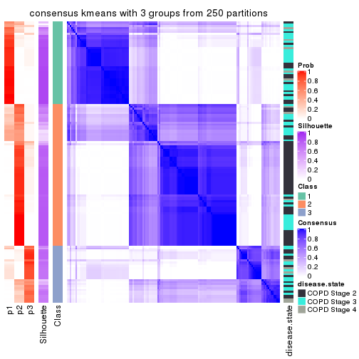</p>

</div>
<div id='tab-SD-kmeans-consensus-heatmap-3'>
<pre><code class="r">consensus_heatmap(res, k = 4)
</code></pre>

<p></p>

</div>
<div id='tab-SD-kmeans-consensus-heatmap-4'>
<pre><code class="r">consensus_heatmap(res, k = 5)
</code></pre>

<p></p>

</div>
<div id='tab-SD-kmeans-consensus-heatmap-5'>
<pre><code class="r">consensus_heatmap(res, k = 6)
</code></pre>

<p></p>

</div>
</div>

Heatmaps for the membership of samples in all partitions to see how consistent they are:


<script>
$( function() {
	$( '#tabs-SD-kmeans-membership-heatmap' ).tabs();
} );
</script>
<div id='tabs-SD-kmeans-membership-heatmap'>
<ul>
<li><a href='#tab-SD-kmeans-membership-heatmap-1'>k = 2</a></li>
<li><a href='#tab-SD-kmeans-membership-heatmap-2'>k = 3</a></li>
<li><a href='#tab-SD-kmeans-membership-heatmap-3'>k = 4</a></li>
<li><a href='#tab-SD-kmeans-membership-heatmap-4'>k = 5</a></li>
<li><a href='#tab-SD-kmeans-membership-heatmap-5'>k = 6</a></li>
</ul>
<div id='tab-SD-kmeans-membership-heatmap-1'>
<pre><code class="r">membership_heatmap(res, k = 2)
</code></pre>

<p></p>

</div>
<div id='tab-SD-kmeans-membership-heatmap-2'>
<pre><code class="r">membership_heatmap(res, k = 3)
</code></pre>

<p></p>

</div>
<div id='tab-SD-kmeans-membership-heatmap-3'>
<pre><code class="r">membership_heatmap(res, k = 4)
</code></pre>

<p></p>

</div>
<div id='tab-SD-kmeans-membership-heatmap-4'>
<pre><code class="r">membership_heatmap(res, k = 5)
</code></pre>

<p></p>

</div>
<div id='tab-SD-kmeans-membership-heatmap-5'>
<pre><code class="r">membership_heatmap(res, k = 6)
</code></pre>

<p></p>

</div>
</div>

As soon as we have had the classes for columns, we can look for signatures
which are significantly different between classes which can be candidate marks
for certain classes. Following are the heatmaps for signatures.


Signature heatmaps where rows are scaled:


<script>
$( function() {
	$( '#tabs-SD-kmeans-get-signatures' ).tabs();
} );
</script>
<div id='tabs-SD-kmeans-get-signatures'>
<ul>
<li><a href='#tab-SD-kmeans-get-signatures-1'>k = 2</a></li>
<li><a href='#tab-SD-kmeans-get-signatures-2'>k = 3</a></li>
<li><a href='#tab-SD-kmeans-get-signatures-3'>k = 4</a></li>
<li><a href='#tab-SD-kmeans-get-signatures-4'>k = 5</a></li>
<li><a href='#tab-SD-kmeans-get-signatures-5'>k = 6</a></li>
</ul>
<div id='tab-SD-kmeans-get-signatures-1'>
<pre><code class="r">get_signatures(res, k = 2)
</code></pre>

<p></p>

</div>
<div id='tab-SD-kmeans-get-signatures-2'>
<pre><code class="r">get_signatures(res, k = 3)
</code></pre>

<p></p>

</div>
<div id='tab-SD-kmeans-get-signatures-3'>
<pre><code class="r">get_signatures(res, k = 4)
</code></pre>

<p></p>

</div>
<div id='tab-SD-kmeans-get-signatures-4'>
<pre><code class="r">get_signatures(res, k = 5)
</code></pre>

<p></p>

</div>
<div id='tab-SD-kmeans-get-signatures-5'>
<pre><code class="r">get_signatures(res, k = 6)
</code></pre>

<p></p>

</div>
</div>


Signature heatmaps where rows are not scaled:


<script>
$( function() {
	$( '#tabs-SD-kmeans-get-signatures-no-scale' ).tabs();
} );
</script>
<div id='tabs-SD-kmeans-get-signatures-no-scale'>
<ul>
<li><a href='#tab-SD-kmeans-get-signatures-no-scale-1'>k = 2</a></li>
<li><a href='#tab-SD-kmeans-get-signatures-no-scale-2'>k = 3</a></li>
<li><a href='#tab-SD-kmeans-get-signatures-no-scale-3'>k = 4</a></li>
<li><a href='#tab-SD-kmeans-get-signatures-no-scale-4'>k = 5</a></li>
<li><a href='#tab-SD-kmeans-get-signatures-no-scale-5'>k = 6</a></li>
</ul>
<div id='tab-SD-kmeans-get-signatures-no-scale-1'>
<pre><code class="r">get_signatures(res, k = 2, scale_rows = FALSE)
</code></pre>

<p></p>

</div>
<div id='tab-SD-kmeans-get-signatures-no-scale-2'>
<pre><code class="r">get_signatures(res, k = 3, scale_rows = FALSE)
</code></pre>

<p></p>

</div>
<div id='tab-SD-kmeans-get-signatures-no-scale-3'>
<pre><code class="r">get_signatures(res, k = 4, scale_rows = FALSE)
</code></pre>

<p></p>

</div>
<div id='tab-SD-kmeans-get-signatures-no-scale-4'>
<pre><code class="r">get_signatures(res, k = 5, scale_rows = FALSE)
</code></pre>

<p></p>

</div>
<div id='tab-SD-kmeans-get-signatures-no-scale-5'>
<pre><code class="r">get_signatures(res, k = 6, scale_rows = FALSE)
</code></pre>

<p></p>

</div>
</div>


Compare the overlap of signatures from different k:

```r
compare_signatures(res)
```

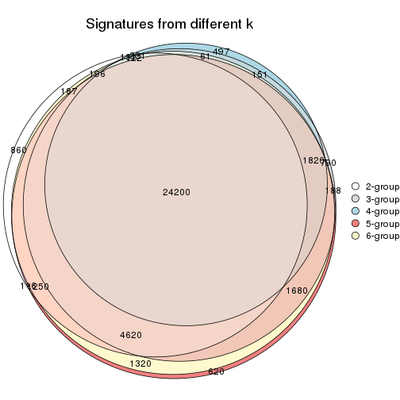

`get_signature()` returns a data frame invisibly. TO get the list of signatures, the function
call should be assigned to a variable explicitly. In following code, if `plot` argument is set
to `FALSE`, no heatmap is plotted while only the differential analysis is performed.

```r
# code only for demonstration
tb = get_signature(res, k = ..., plot = FALSE)
```

An example of the output of `tb` is:

```
#>   which_row         fdr    mean_1    mean_2 scaled_mean_1 scaled_mean_2 km
#> 1        38 0.042760348  8.373488  9.131774    -0.5533452     0.5164555  1
#> 2        40 0.018707592  7.106213  8.469186    -0.6173731     0.5762149  1
#> 3        55 0.019134737 10.221463 11.207825    -0.6159697     0.5749050  1
#> 4        59 0.006059896  5.921854  7.869574    -0.6899429     0.6439467  1
#> 5        60 0.018055526  8.928898 10.211722    -0.6204761     0.5791110  1
#> 6        98 0.009384629 15.714769 14.887706     0.6635654    -0.6193277  2
...
```

The columns in `tb` are:

1. `which_row`: row indices corresponding to the input matrix.
2. `fdr`: FDR for the differential test. 
3. `mean_x`: The mean value in group x.
4. `scaled_mean_x`: The mean value in group x after rows are scaled.
5. `km`: Row groups if k-means clustering is applied to rows.


UMAP plot which shows how samples are separated.


<script>
$( function() {
	$( '#tabs-SD-kmeans-dimension-reduction' ).tabs();
} );
</script>
<div id='tabs-SD-kmeans-dimension-reduction'>
<ul>
<li><a href='#tab-SD-kmeans-dimension-reduction-1'>k = 2</a></li>
<li><a href='#tab-SD-kmeans-dimension-reduction-2'>k = 3</a></li>
<li><a href='#tab-SD-kmeans-dimension-reduction-3'>k = 4</a></li>
<li><a href='#tab-SD-kmeans-dimension-reduction-4'>k = 5</a></li>
<li><a href='#tab-SD-kmeans-dimension-reduction-5'>k = 6</a></li>
</ul>
<div id='tab-SD-kmeans-dimension-reduction-1'>
<pre><code class="r">dimension_reduction(res, k = 2, method = &quot;UMAP&quot;)
</code></pre>

<p></p>

</div>
<div id='tab-SD-kmeans-dimension-reduction-2'>
<pre><code class="r">dimension_reduction(res, k = 3, method = &quot;UMAP&quot;)
</code></pre>

<p></p>

</div>
<div id='tab-SD-kmeans-dimension-reduction-3'>
<pre><code class="r">dimension_reduction(res, k = 4, method = &quot;UMAP&quot;)
</code></pre>

<p></p>

</div>
<div id='tab-SD-kmeans-dimension-reduction-4'>
<pre><code class="r">dimension_reduction(res, k = 5, method = &quot;UMAP&quot;)
</code></pre>

<p></p>

</div>
<div id='tab-SD-kmeans-dimension-reduction-5'>
<pre><code class="r">dimension_reduction(res, k = 6, method = &quot;UMAP&quot;)
</code></pre>

<p></p>

</div>
</div>


Following heatmap shows how subgroups are split when increasing `k`:

```r
collect_classes(res)
```


Test correlation between subgroups and known annotations. If the known
annotation is numeric, one-way ANOVA test is applied, and if the known
annotation is discrete, chi-squared contingency table test is applied.

```r
test_to_known_factors(res)
```

```
#>             n disease.state(p) k
#> SD:kmeans 143         0.000979 2
#> SD:kmeans 124         0.001159 3
#> SD:kmeans  55         0.072108 4
#> SD:kmeans 133         0.000310 5
#> SD:kmeans  90         0.000588 6
```


If matrix rows can be associated to genes, consider to use `GO_Enrichment(res,
...)` to perform function enrichment for the signature genes.


 

---------------------------------------------------


### SD:skmeans


The object with results only for a single top-value method and a single partition method 
can be extracted as:

```r
res = res_list["SD", "skmeans"]
# you can also extract it by
# res = res_list["SD:skmeans"]
```

A summary of `res` and all the functions that can be applied to it:

```r
res
```

```
#> A 'ConsensusPartition' object with k = 2, 3, 4, 5, 6.
#>   On a matrix with 51776 rows and 143 columns.
#>   Top rows (1000, 2000, 3000, 4000, 5000) are extracted by 'SD' method.
#>   Subgroups are detected by 'skmeans' method.
#>   Performed in total 1250 partitions by row resampling.
#>   Best k for subgroups seems to be 2.
#> 
#> Following methods can be applied to this 'ConsensusPartition' object:
#>  [1] "cola_report"             "collect_classes"         "collect_plots"          
#>  [4] "collect_stats"           "colnames"                "compare_signatures"     
#>  [7] "consensus_heatmap"       "dimension_reduction"     "functional_enrichment"  
#> [10] "get_anno_col"            "get_anno"                "get_classes"            
#> [13] "get_consensus"           "get_matrix"              "get_membership"         
#> [16] "get_param"               "get_signatures"          "get_stats"              
#> [19] "is_best_k"               "is_stable_k"             "membership_heatmap"     
#> [22] "ncol"                    "nrow"                    "plot_ecdf"              
#> [25] "rownames"                "select_partition_number" "show"                   
#> [28] "suggest_best_k"          "test_to_known_factors"
```

`collect_plots()` function collects all the plots made from `res` for all `k` (number of partitions)
into one single page to provide an easy and fast comparison between different `k`.

```r
collect_plots(res)
```


The plots are:

- The first row: a plot of the ECDF (Empirical cumulative distribution
  function) curves of the consensus matrix for each `k` and the heatmap of
  predicted classes for each `k`.
- The second row: heatmaps of the consensus matrix for each `k`.
- The third row: heatmaps of the membership matrix for each `k`.
- The fouth row: heatmaps of the signatures for each `k`.

All the plots in panels can be made by individual functions and they are
plotted later in this section.

`select_partition_number()` produces several plots showing different
statistics for choosing "optimized" `k`. There are following statistics:

- ECDF curves of the consensus matrix for each `k`;
- 1-PAC. [The PAC
  score](https://en.wikipedia.org/wiki/Consensus_clustering#Over-interpretation_potential_of_consensus_clustering)
  measures the proportion of the ambiguous subgrouping.
- Mean silhouette score.
- Concordance. The mean probability of fiting the consensus class ids in all
  partitions.
- Area increased. Denote $A_k$ as the area under the ECDF curve for current
  `k`, the area increased is defined as $A_k - A_{k-1}$.
- Rand index. The percent of pairs of samples that are both in a same cluster
  or both are not in a same cluster in the partition of k and k-1.
- Jaccard index. The ratio of pairs of samples are both in a same cluster in
  the partition of k and k-1 and the pairs of samples are both in a same
  cluster in the partition k or k-1.

The detailed explanations of these statistics can be found in [the cola
vignette](http://bioconductor.org/packages/devel/bioc/vignettes/cola/inst/doc/cola.html#toc_13).

Generally speaking, lower PAC score, higher mean silhouette score or higher
concordance corresponds to better partition. Rand index and Jaccard index
measure how similar the current partition is compared to partition with `k-1`.
If they are too similar, we won't accept `k` is better than `k-1`.

```r
select_partition_number(res)
```


The numeric values for all these statistics can be obtained by `get_stats()`.

```r
get_stats(res)
```

```
#>   k 1-PAC mean_silhouette concordance area_increased  Rand Jaccard
#> 2 2 0.503           0.848       0.898         0.4979 0.498   0.498
#> 3 3 0.691           0.812       0.914         0.3237 0.767   0.567
#> 4 4 0.698           0.740       0.835         0.1252 0.865   0.635
#> 5 5 0.785           0.752       0.871         0.0628 0.861   0.548
#> 6 6 0.793           0.698       0.850         0.0377 0.961   0.822
```

`suggest_best_k()` suggests the best $k$ based on these statistics. The rules are as follows:

- All $k$ with Jaccard index larger than 0.95 are removed because the increase of
  the partition number does not provides enough extra information. If all $k$ are removed,
  the best $k$ is assigned by `NA`.
- For $k$ with 1-PAC larger than 0.9, the maximal $k$ is taken as the "best k". Other $k$ is called "optional k".
- If it does not fit the second rule. The $k$ with the highest vote of highest
  1-PAC, mean silhouette and concordance is taken as the "best k".

```r
suggest_best_k(res)
```

```
#> [1] 2
```


Following shows the table of the partitions (You need to click the **show/hide
code output** link to see it). The membership matrix (columns with name `p*`)
is inferred by
[`clue::cl_consensus()`](https://www.rdocumentation.org/link/cl_consensus?package=clue)
function with the `SE` method. Basically the value in the membership matrix
represents the probability to belong to a certain group. The finall class
label for an item is determined with the group with highest probability it
belongs to.

In `get_classes()` function, the entropy is calculated from the membership
matrix and the silhouette score is calculated from the consensus matrix.


<script>
$( function() {
	$( '#tabs-SD-skmeans-get-classes' ).tabs();
} );
</script>
<div id='tabs-SD-skmeans-get-classes'>
<ul>
<li><a href='#tab-SD-skmeans-get-classes-1'>k = 2</a></li>
<li><a href='#tab-SD-skmeans-get-classes-2'>k = 3</a></li>
<li><a href='#tab-SD-skmeans-get-classes-3'>k = 4</a></li>
<li><a href='#tab-SD-skmeans-get-classes-4'>k = 5</a></li>
<li><a href='#tab-SD-skmeans-get-classes-5'>k = 6</a></li>
</ul>

<div id='tab-SD-skmeans-get-classes-1'>
<p><a id='tab-SD-skmeans-get-classes-1-a' style='color:#0366d6' href='#'>show/hide code output</a></p>
<pre><code class="r">cbind(get_classes(res, k = 2), get_membership(res, k = 2))
</code></pre>

<pre><code>#&gt;           class entropy silhouette    p1    p2
#&gt; GSM550785     1   0.000      0.863 1.000 0.000
#&gt; GSM550786     2   0.000      0.835 0.000 1.000
#&gt; GSM550788     2   0.722      0.900 0.200 0.800
#&gt; GSM550789     2   0.722      0.900 0.200 0.800
#&gt; GSM550790     1   0.000      0.863 1.000 0.000
#&gt; GSM550791     1   0.000      0.863 1.000 0.000
#&gt; GSM550792     2   0.730      0.897 0.204 0.796
#&gt; GSM550796     2   0.722      0.900 0.200 0.800
#&gt; GSM550797     2   0.722      0.900 0.200 0.800
#&gt; GSM550799     2   0.000      0.835 0.000 1.000
#&gt; GSM550800     2   0.722      0.900 0.200 0.800
#&gt; GSM550801     2   0.722      0.900 0.200 0.800
#&gt; GSM550804     2   0.722      0.900 0.200 0.800
#&gt; GSM550806     1   0.900      0.743 0.684 0.316
#&gt; GSM550807     2   0.722      0.900 0.200 0.800
#&gt; GSM550808     2   0.000      0.835 0.000 1.000
#&gt; GSM550809     1   0.722      0.848 0.800 0.200
#&gt; GSM550810     2   0.722      0.900 0.200 0.800
#&gt; GSM550811     1   0.722      0.848 0.800 0.200
#&gt; GSM550813     2   0.722      0.900 0.200 0.800
#&gt; GSM550814     2   0.722      0.900 0.200 0.800
#&gt; GSM550815     2   0.722      0.900 0.200 0.800
#&gt; GSM550816     2   0.722      0.900 0.200 0.800
#&gt; GSM550817     2   0.000      0.835 0.000 1.000
#&gt; GSM550818     2   0.000      0.835 0.000 1.000
#&gt; GSM550819     2   0.595      0.883 0.144 0.856
#&gt; GSM550820     1   0.722      0.848 0.800 0.200
#&gt; GSM550821     2   0.000      0.835 0.000 1.000
#&gt; GSM550822     2   0.722      0.900 0.200 0.800
#&gt; GSM550826     1   0.722      0.848 0.800 0.200
#&gt; GSM550832     2   0.722      0.900 0.200 0.800
#&gt; GSM550833     2   0.722      0.900 0.200 0.800
#&gt; GSM550835     2   0.000      0.835 0.000 1.000
#&gt; GSM550836     1   0.722      0.848 0.800 0.200
#&gt; GSM550837     2   0.000      0.835 0.000 1.000
#&gt; GSM550838     1   0.722      0.848 0.800 0.200
#&gt; GSM550841     2   0.000      0.835 0.000 1.000
#&gt; GSM550842     2   0.000      0.835 0.000 1.000
#&gt; GSM550846     2   0.722      0.900 0.200 0.800
#&gt; GSM550849     1   0.722      0.848 0.800 0.200
#&gt; GSM550850     1   0.000      0.863 1.000 0.000
#&gt; GSM550851     2   0.000      0.835 0.000 1.000
#&gt; GSM550852     2   0.722      0.900 0.200 0.800
#&gt; GSM550853     2   0.722      0.900 0.200 0.800
#&gt; GSM550855     2   0.722      0.900 0.200 0.800
#&gt; GSM550856     2   0.722      0.900 0.200 0.800
#&gt; GSM550861     2   0.722      0.900 0.200 0.800
#&gt; GSM550863     1   0.000      0.863 1.000 0.000
#&gt; GSM550864     2   0.722      0.900 0.200 0.800
#&gt; GSM550866     2   0.722      0.900 0.200 0.800
#&gt; GSM550867     1   0.000      0.863 1.000 0.000
#&gt; GSM550885     1   0.000      0.863 1.000 0.000
#&gt; GSM550886     2   0.000      0.835 0.000 1.000
#&gt; GSM550887     2   0.722      0.900 0.200 0.800
#&gt; GSM550889     1   0.000      0.863 1.000 0.000
#&gt; GSM550894     2   0.722      0.900 0.200 0.800
#&gt; GSM550897     1   0.000      0.863 1.000 0.000
#&gt; GSM550903     2   0.722      0.900 0.200 0.800
#&gt; GSM550905     2   0.000      0.835 0.000 1.000
#&gt; GSM550906     2   0.722      0.900 0.200 0.800
#&gt; GSM550907     2   0.000      0.835 0.000 1.000
#&gt; GSM550909     2   0.000      0.835 0.000 1.000
#&gt; GSM550911     2   0.000      0.835 0.000 1.000
#&gt; GSM550913     2   0.722      0.900 0.200 0.800
#&gt; GSM550915     1   0.430      0.775 0.912 0.088
#&gt; GSM550917     2   0.722      0.900 0.200 0.800
#&gt; GSM550919     1   0.995     -0.268 0.540 0.460
#&gt; GSM550921     1   0.722      0.848 0.800 0.200
#&gt; GSM550924     2   0.000      0.835 0.000 1.000
#&gt; GSM550926     2   0.722      0.900 0.200 0.800
#&gt; GSM550927     2   0.722      0.900 0.200 0.800
#&gt; GSM550787     1   0.722      0.848 0.800 0.200
#&gt; GSM550793     1   0.722      0.848 0.800 0.200
#&gt; GSM550794     2   0.971      0.628 0.400 0.600
#&gt; GSM550795     1   0.000      0.863 1.000 0.000
#&gt; GSM550798     1   0.722      0.848 0.800 0.200
#&gt; GSM550803     1   0.722      0.848 0.800 0.200
#&gt; GSM550805     1   0.722      0.848 0.800 0.200
#&gt; GSM550823     1   0.416      0.784 0.916 0.084
#&gt; GSM550824     1   0.000      0.863 1.000 0.000
#&gt; GSM550825     1   0.722      0.848 0.800 0.200
#&gt; GSM550827     1   0.224      0.833 0.964 0.036
#&gt; GSM550828     1   0.000      0.863 1.000 0.000
#&gt; GSM550829     1   0.722      0.848 0.800 0.200
#&gt; GSM550830     1   0.000      0.863 1.000 0.000
#&gt; GSM550834     1   0.000      0.863 1.000 0.000
#&gt; GSM550839     2   0.000      0.835 0.000 1.000
#&gt; GSM550840     1   0.000      0.863 1.000 0.000
#&gt; GSM550843     2   0.000      0.835 0.000 1.000
#&gt; GSM550844     1   0.722      0.848 0.800 0.200
#&gt; GSM550845     2   0.722      0.900 0.200 0.800
#&gt; GSM550848     2   0.814      0.852 0.252 0.748
#&gt; GSM550854     1   0.000      0.863 1.000 0.000
#&gt; GSM550857     1   0.722      0.848 0.800 0.200
#&gt; GSM550858     1   0.000      0.863 1.000 0.000
#&gt; GSM550859     1   0.000      0.863 1.000 0.000
#&gt; GSM550862     1   0.000      0.863 1.000 0.000
#&gt; GSM550865     1   0.000      0.863 1.000 0.000
#&gt; GSM550868     1   0.000      0.863 1.000 0.000
#&gt; GSM550869     1   0.722      0.848 0.800 0.200
#&gt; GSM550870     2   0.722      0.900 0.200 0.800
#&gt; GSM550871     2   0.000      0.835 0.000 1.000
#&gt; GSM550872     1   0.000      0.863 1.000 0.000
#&gt; GSM550873     2   0.000      0.835 0.000 1.000
#&gt; GSM550874     2   0.722      0.900 0.200 0.800
#&gt; GSM550876     2   0.000      0.835 0.000 1.000
#&gt; GSM550877     2   0.722      0.900 0.200 0.800
#&gt; GSM550878     2   0.000      0.835 0.000 1.000
#&gt; GSM550879     1   0.000      0.863 1.000 0.000
#&gt; GSM550882     1   0.722      0.848 0.800 0.200
#&gt; GSM550888     1   0.722      0.848 0.800 0.200
#&gt; GSM550890     1   0.980     -0.105 0.584 0.416
#&gt; GSM550891     1   0.722      0.848 0.800 0.200
#&gt; GSM550892     1   0.000      0.863 1.000 0.000
#&gt; GSM550893     2   0.722      0.900 0.200 0.800
#&gt; GSM550895     2   0.722      0.900 0.200 0.800
#&gt; GSM550896     2   0.722      0.900 0.200 0.800
#&gt; GSM550898     1   0.000      0.863 1.000 0.000
#&gt; GSM550899     2   0.722      0.900 0.200 0.800
#&gt; GSM550900     1   0.000      0.863 1.000 0.000
#&gt; GSM550901     1   0.000      0.863 1.000 0.000
#&gt; GSM550902     1   0.722      0.848 0.800 0.200
#&gt; GSM550904     1   0.722      0.848 0.800 0.200
#&gt; GSM550908     1   0.722      0.848 0.800 0.200
#&gt; GSM550912     2   0.722      0.900 0.200 0.800
#&gt; GSM550914     2   0.753      0.887 0.216 0.784
#&gt; GSM550918     2   0.722      0.900 0.200 0.800
#&gt; GSM550922     2   0.000      0.835 0.000 1.000
#&gt; GSM550923     1   0.722      0.848 0.800 0.200
#&gt; GSM550925     1   0.000      0.863 1.000 0.000
#&gt; GSM550802     2   0.722      0.900 0.200 0.800
#&gt; GSM550812     2   0.000      0.835 0.000 1.000
#&gt; GSM550831     1   0.000      0.863 1.000 0.000
#&gt; GSM550847     1   0.000      0.863 1.000 0.000
#&gt; GSM550860     1   0.722      0.848 0.800 0.200
#&gt; GSM550875     1   0.722      0.848 0.800 0.200
#&gt; GSM550880     1   0.000      0.863 1.000 0.000
#&gt; GSM550881     1   0.722      0.848 0.800 0.200
#&gt; GSM550883     1   0.722      0.848 0.800 0.200
#&gt; GSM550884     2   0.000      0.835 0.000 1.000
#&gt; GSM550910     2   0.000      0.835 0.000 1.000
#&gt; GSM550916     1   0.000      0.863 1.000 0.000
#&gt; GSM550920     2   0.000      0.835 0.000 1.000
</code></pre>

<script>
$('#tab-SD-skmeans-get-classes-1-a').parent().next().next().hide();
$('#tab-SD-skmeans-get-classes-1-a').click(function(){
  $('#tab-SD-skmeans-get-classes-1-a').parent().next().next().toggle();
  return(false);
});
</script>
</div>

<div id='tab-SD-skmeans-get-classes-2'>
<p><a id='tab-SD-skmeans-get-classes-2-a' style='color:#0366d6' href='#'>show/hide code output</a></p>
<pre><code class="r">cbind(get_classes(res, k = 3), get_membership(res, k = 3))
</code></pre>

<pre><code>#&gt;           class entropy silhouette    p1    p2    p3
#&gt; GSM550785     1  0.0000      0.876 1.000 0.000 0.000
#&gt; GSM550786     3  0.0000      0.915 0.000 0.000 1.000
#&gt; GSM550788     2  0.0000      0.913 0.000 1.000 0.000
#&gt; GSM550789     2  0.0000      0.913 0.000 1.000 0.000
#&gt; GSM550790     1  0.0000      0.876 1.000 0.000 0.000
#&gt; GSM550791     1  0.0000      0.876 1.000 0.000 0.000
#&gt; GSM550792     2  0.5138      0.635 0.252 0.748 0.000
#&gt; GSM550796     2  0.0000      0.913 0.000 1.000 0.000
#&gt; GSM550797     2  0.0000      0.913 0.000 1.000 0.000
#&gt; GSM550799     3  0.0000      0.915 0.000 0.000 1.000
#&gt; GSM550800     2  0.0000      0.913 0.000 1.000 0.000
#&gt; GSM550801     2  0.0000      0.913 0.000 1.000 0.000
#&gt; GSM550804     2  0.0000      0.913 0.000 1.000 0.000
#&gt; GSM550806     3  0.0000      0.915 0.000 0.000 1.000
#&gt; GSM550807     2  0.0000      0.913 0.000 1.000 0.000
#&gt; GSM550808     2  0.5591      0.621 0.000 0.696 0.304
#&gt; GSM550809     1  0.0000      0.876 1.000 0.000 0.000
#&gt; GSM550810     2  0.0000      0.913 0.000 1.000 0.000
#&gt; GSM550811     1  0.3116      0.777 0.892 0.000 0.108
#&gt; GSM550813     2  0.0000      0.913 0.000 1.000 0.000
#&gt; GSM550814     2  0.0000      0.913 0.000 1.000 0.000
#&gt; GSM550815     2  0.0000      0.913 0.000 1.000 0.000
#&gt; GSM550816     2  0.0000      0.913 0.000 1.000 0.000
#&gt; GSM550817     3  0.0000      0.915 0.000 0.000 1.000
#&gt; GSM550818     3  0.0000      0.915 0.000 0.000 1.000
#&gt; GSM550819     2  0.3551      0.808 0.000 0.868 0.132
#&gt; GSM550820     1  0.0000      0.876 1.000 0.000 0.000
#&gt; GSM550821     2  0.5988      0.515 0.000 0.632 0.368
#&gt; GSM550822     2  0.0000      0.913 0.000 1.000 0.000
#&gt; GSM550826     1  0.6126      0.236 0.600 0.000 0.400
#&gt; GSM550832     2  0.0000      0.913 0.000 1.000 0.000
#&gt; GSM550833     2  0.0000      0.913 0.000 1.000 0.000
#&gt; GSM550835     3  0.0747      0.903 0.000 0.016 0.984
#&gt; GSM550836     3  0.3816      0.861 0.148 0.000 0.852
#&gt; GSM550837     2  0.5859      0.559 0.000 0.656 0.344
#&gt; GSM550838     1  0.0000      0.876 1.000 0.000 0.000
#&gt; GSM550841     3  0.0000      0.915 0.000 0.000 1.000
#&gt; GSM550842     2  0.5882      0.553 0.000 0.652 0.348
#&gt; GSM550846     2  0.8825      0.376 0.336 0.532 0.132
#&gt; GSM550849     1  0.5650      0.460 0.688 0.000 0.312
#&gt; GSM550850     1  0.0000      0.876 1.000 0.000 0.000
#&gt; GSM550851     2  0.5926      0.538 0.000 0.644 0.356
#&gt; GSM550852     2  0.0000      0.913 0.000 1.000 0.000
#&gt; GSM550853     2  0.0000      0.913 0.000 1.000 0.000
#&gt; GSM550855     2  0.0000      0.913 0.000 1.000 0.000
#&gt; GSM550856     2  0.0000      0.913 0.000 1.000 0.000
#&gt; GSM550861     2  0.0000      0.913 0.000 1.000 0.000
#&gt; GSM550863     1  0.4121      0.767 0.832 0.168 0.000
#&gt; GSM550864     2  0.0000      0.913 0.000 1.000 0.000
#&gt; GSM550866     2  0.0000      0.913 0.000 1.000 0.000
#&gt; GSM550867     1  0.0000      0.876 1.000 0.000 0.000
#&gt; GSM550885     1  0.0000      0.876 1.000 0.000 0.000
#&gt; GSM550886     3  0.0000      0.915 0.000 0.000 1.000
#&gt; GSM550887     2  0.0000      0.913 0.000 1.000 0.000
#&gt; GSM550889     1  0.6140      0.413 0.596 0.404 0.000
#&gt; GSM550894     2  0.0000      0.913 0.000 1.000 0.000
#&gt; GSM550897     1  0.0000      0.876 1.000 0.000 0.000
#&gt; GSM550903     2  0.0000      0.913 0.000 1.000 0.000
#&gt; GSM550905     2  0.5882      0.553 0.000 0.652 0.348
#&gt; GSM550906     2  0.0000      0.913 0.000 1.000 0.000
#&gt; GSM550907     3  0.0000      0.915 0.000 0.000 1.000
#&gt; GSM550909     2  0.5988      0.515 0.000 0.632 0.368
#&gt; GSM550911     3  0.0000      0.915 0.000 0.000 1.000
#&gt; GSM550913     2  0.0000      0.913 0.000 1.000 0.000
#&gt; GSM550915     1  0.4062      0.771 0.836 0.164 0.000
#&gt; GSM550917     2  0.0000      0.913 0.000 1.000 0.000
#&gt; GSM550919     1  0.4399      0.745 0.812 0.188 0.000
#&gt; GSM550921     3  0.3686      0.865 0.140 0.000 0.860
#&gt; GSM550924     3  0.0000      0.915 0.000 0.000 1.000
#&gt; GSM550926     2  0.0000      0.913 0.000 1.000 0.000
#&gt; GSM550927     2  0.0000      0.913 0.000 1.000 0.000
#&gt; GSM550787     3  0.4062      0.847 0.164 0.000 0.836
#&gt; GSM550793     3  0.5016      0.760 0.240 0.000 0.760
#&gt; GSM550794     1  0.6225      0.241 0.568 0.432 0.000
#&gt; GSM550795     1  0.0000      0.876 1.000 0.000 0.000
#&gt; GSM550798     1  0.0000      0.876 1.000 0.000 0.000
#&gt; GSM550803     1  0.0000      0.876 1.000 0.000 0.000
#&gt; GSM550805     1  0.6168      0.198 0.588 0.000 0.412
#&gt; GSM550823     2  0.2066      0.863 0.060 0.940 0.000
#&gt; GSM550824     1  0.0000      0.876 1.000 0.000 0.000
#&gt; GSM550825     3  0.5016      0.760 0.240 0.000 0.760
#&gt; GSM550827     1  0.4555      0.731 0.800 0.200 0.000
#&gt; GSM550828     1  0.0000      0.876 1.000 0.000 0.000
#&gt; GSM550829     1  0.6095      0.260 0.608 0.000 0.392
#&gt; GSM550830     1  0.6026      0.476 0.624 0.376 0.000
#&gt; GSM550834     1  0.0000      0.876 1.000 0.000 0.000
#&gt; GSM550839     3  0.0000      0.915 0.000 0.000 1.000
#&gt; GSM550840     1  0.0000      0.876 1.000 0.000 0.000
#&gt; GSM550843     3  0.0000      0.915 0.000 0.000 1.000
#&gt; GSM550844     1  0.0000      0.876 1.000 0.000 0.000
#&gt; GSM550845     2  0.0000      0.913 0.000 1.000 0.000
#&gt; GSM550848     2  0.6204      0.253 0.424 0.576 0.000
#&gt; GSM550854     1  0.0000      0.876 1.000 0.000 0.000
#&gt; GSM550857     3  0.5016      0.760 0.240 0.000 0.760
#&gt; GSM550858     1  0.0000      0.876 1.000 0.000 0.000
#&gt; GSM550859     1  0.0000      0.876 1.000 0.000 0.000
#&gt; GSM550862     1  0.0000      0.876 1.000 0.000 0.000
#&gt; GSM550865     1  0.3941      0.776 0.844 0.156 0.000
#&gt; GSM550868     1  0.3941      0.776 0.844 0.156 0.000
#&gt; GSM550869     3  0.3816      0.861 0.148 0.000 0.852
#&gt; GSM550870     2  0.0000      0.913 0.000 1.000 0.000
#&gt; GSM550871     3  0.0000      0.915 0.000 0.000 1.000
#&gt; GSM550872     1  0.3941      0.776 0.844 0.156 0.000
#&gt; GSM550873     2  0.5785      0.574 0.000 0.668 0.332
#&gt; GSM550874     2  0.0000      0.913 0.000 1.000 0.000
#&gt; GSM550876     3  0.0000      0.915 0.000 0.000 1.000
#&gt; GSM550877     2  0.0000      0.913 0.000 1.000 0.000
#&gt; GSM550878     3  0.0000      0.915 0.000 0.000 1.000
#&gt; GSM550879     1  0.0000      0.876 1.000 0.000 0.000
#&gt; GSM550882     3  0.3686      0.865 0.140 0.000 0.860
#&gt; GSM550888     3  0.3816      0.861 0.148 0.000 0.852
#&gt; GSM550890     1  0.4887      0.693 0.772 0.228 0.000
#&gt; GSM550891     3  0.0000      0.915 0.000 0.000 1.000
#&gt; GSM550892     1  0.0000      0.876 1.000 0.000 0.000
#&gt; GSM550893     2  0.0000      0.913 0.000 1.000 0.000
#&gt; GSM550895     2  0.0000      0.913 0.000 1.000 0.000
#&gt; GSM550896     2  0.0000      0.913 0.000 1.000 0.000
#&gt; GSM550898     1  0.0000      0.876 1.000 0.000 0.000
#&gt; GSM550899     2  0.0000      0.913 0.000 1.000 0.000
#&gt; GSM550900     1  0.4291      0.754 0.820 0.180 0.000
#&gt; GSM550901     1  0.0000      0.876 1.000 0.000 0.000
#&gt; GSM550902     1  0.6126      0.236 0.600 0.000 0.400
#&gt; GSM550904     1  0.0000      0.876 1.000 0.000 0.000
#&gt; GSM550908     3  0.3816      0.861 0.148 0.000 0.852
#&gt; GSM550912     2  0.0000      0.913 0.000 1.000 0.000
#&gt; GSM550914     2  0.5926      0.435 0.356 0.644 0.000
#&gt; GSM550918     2  0.0000      0.913 0.000 1.000 0.000
#&gt; GSM550922     3  0.0000      0.915 0.000 0.000 1.000
#&gt; GSM550923     1  0.0000      0.876 1.000 0.000 0.000
#&gt; GSM550925     1  0.0000      0.876 1.000 0.000 0.000
#&gt; GSM550802     2  0.0000      0.913 0.000 1.000 0.000
#&gt; GSM550812     2  0.6023      0.754 0.092 0.788 0.120
#&gt; GSM550831     1  0.0000      0.876 1.000 0.000 0.000
#&gt; GSM550847     1  0.0000      0.876 1.000 0.000 0.000
#&gt; GSM550860     3  0.3816      0.861 0.148 0.000 0.852
#&gt; GSM550875     1  0.5810      0.405 0.664 0.000 0.336
#&gt; GSM550880     1  0.0000      0.876 1.000 0.000 0.000
#&gt; GSM550881     3  0.3816      0.861 0.148 0.000 0.852
#&gt; GSM550883     3  0.4291      0.832 0.180 0.000 0.820
#&gt; GSM550884     3  0.5327      0.609 0.000 0.272 0.728
#&gt; GSM550910     3  0.0000      0.915 0.000 0.000 1.000
#&gt; GSM550916     1  0.0000      0.876 1.000 0.000 0.000
#&gt; GSM550920     3  0.0000      0.915 0.000 0.000 1.000
</code></pre>

<script>
$('#tab-SD-skmeans-get-classes-2-a').parent().next().next().hide();
$('#tab-SD-skmeans-get-classes-2-a').click(function(){
  $('#tab-SD-skmeans-get-classes-2-a').parent().next().next().toggle();
  return(false);
});
</script>
</div>

<div id='tab-SD-skmeans-get-classes-3'>
<p><a id='tab-SD-skmeans-get-classes-3-a' style='color:#0366d6' href='#'>show/hide code output</a></p>
<pre><code class="r">cbind(get_classes(res, k = 4), get_membership(res, k = 4))
</code></pre>

<pre><code>#&gt;           class entropy silhouette    p1    p2    p3    p4
#&gt; GSM550785     1  0.3486      0.848 0.812 0.000 0.000 0.188
#&gt; GSM550786     3  0.0469      0.878 0.000 0.000 0.988 0.012
#&gt; GSM550788     2  0.0336      0.851 0.000 0.992 0.000 0.008
#&gt; GSM550789     2  0.0000      0.853 0.000 1.000 0.000 0.000
#&gt; GSM550790     1  0.3486      0.848 0.812 0.000 0.000 0.188
#&gt; GSM550791     1  0.3486      0.848 0.812 0.000 0.000 0.188
#&gt; GSM550792     2  0.5332      0.590 0.128 0.748 0.000 0.124
#&gt; GSM550796     2  0.0000      0.853 0.000 1.000 0.000 0.000
#&gt; GSM550797     2  0.0000      0.853 0.000 1.000 0.000 0.000
#&gt; GSM550799     3  0.0779      0.875 0.000 0.004 0.980 0.016
#&gt; GSM550800     2  0.2973      0.727 0.000 0.856 0.000 0.144
#&gt; GSM550801     2  0.0000      0.853 0.000 1.000 0.000 0.000
#&gt; GSM550804     2  0.0188      0.852 0.000 0.996 0.000 0.004
#&gt; GSM550806     3  0.2926      0.856 0.056 0.000 0.896 0.048
#&gt; GSM550807     2  0.0000      0.853 0.000 1.000 0.000 0.000
#&gt; GSM550808     2  0.4737      0.642 0.000 0.728 0.252 0.020
#&gt; GSM550809     1  0.2081      0.787 0.916 0.000 0.000 0.084
#&gt; GSM550810     2  0.1042      0.841 0.000 0.972 0.008 0.020
#&gt; GSM550811     1  0.2882      0.753 0.892 0.000 0.024 0.084
#&gt; GSM550813     2  0.0592      0.847 0.000 0.984 0.000 0.016
#&gt; GSM550814     2  0.0000      0.853 0.000 1.000 0.000 0.000
#&gt; GSM550815     2  0.0000      0.853 0.000 1.000 0.000 0.000
#&gt; GSM550816     2  0.0188      0.852 0.000 0.996 0.004 0.000
#&gt; GSM550817     3  0.0469      0.878 0.000 0.000 0.988 0.012
#&gt; GSM550818     3  0.0469      0.878 0.000 0.000 0.988 0.012
#&gt; GSM550819     4  0.5328      0.631 0.000 0.064 0.212 0.724
#&gt; GSM550820     1  0.1792      0.803 0.932 0.000 0.000 0.068
#&gt; GSM550821     2  0.5173      0.544 0.000 0.660 0.320 0.020
#&gt; GSM550822     2  0.0188      0.852 0.000 0.996 0.004 0.000
#&gt; GSM550826     1  0.3674      0.675 0.852 0.000 0.104 0.044
#&gt; GSM550832     2  0.0707      0.845 0.000 0.980 0.000 0.020
#&gt; GSM550833     2  0.0000      0.853 0.000 1.000 0.000 0.000
#&gt; GSM550835     3  0.3853      0.726 0.000 0.160 0.820 0.020
#&gt; GSM550836     3  0.4919      0.771 0.200 0.000 0.752 0.048
#&gt; GSM550837     2  0.4855      0.626 0.000 0.712 0.268 0.020
#&gt; GSM550838     1  0.1584      0.757 0.952 0.000 0.012 0.036
#&gt; GSM550841     3  0.2089      0.845 0.000 0.048 0.932 0.020
#&gt; GSM550842     2  0.4855      0.626 0.000 0.712 0.268 0.020
#&gt; GSM550846     4  0.5173      0.737 0.028 0.100 0.080 0.792
#&gt; GSM550849     1  0.1635      0.758 0.948 0.000 0.008 0.044
#&gt; GSM550850     1  0.3486      0.848 0.812 0.000 0.000 0.188
#&gt; GSM550851     2  0.4855      0.626 0.000 0.712 0.268 0.020
#&gt; GSM550852     2  0.0592      0.847 0.000 0.984 0.000 0.016
#&gt; GSM550853     2  0.0336      0.851 0.000 0.992 0.000 0.008
#&gt; GSM550855     2  0.0336      0.851 0.000 0.992 0.000 0.008
#&gt; GSM550856     2  0.4843      0.264 0.000 0.604 0.000 0.396
#&gt; GSM550861     2  0.0000      0.853 0.000 1.000 0.000 0.000
#&gt; GSM550863     4  0.2089      0.772 0.048 0.020 0.000 0.932
#&gt; GSM550864     2  0.0817      0.841 0.000 0.976 0.000 0.024
#&gt; GSM550866     2  0.4907      0.190 0.000 0.580 0.000 0.420
#&gt; GSM550867     1  0.3486      0.848 0.812 0.000 0.000 0.188
#&gt; GSM550885     1  0.3528      0.846 0.808 0.000 0.000 0.192
#&gt; GSM550886     3  0.1798      0.853 0.000 0.040 0.944 0.016
#&gt; GSM550887     2  0.0000      0.853 0.000 1.000 0.000 0.000
#&gt; GSM550889     4  0.4761      0.709 0.044 0.192 0.000 0.764
#&gt; GSM550894     2  0.0707      0.845 0.000 0.980 0.000 0.020
#&gt; GSM550897     1  0.3610      0.842 0.800 0.000 0.000 0.200
#&gt; GSM550903     2  0.0000      0.853 0.000 1.000 0.000 0.000
#&gt; GSM550905     2  0.4882      0.621 0.000 0.708 0.272 0.020
#&gt; GSM550906     2  0.0000      0.853 0.000 1.000 0.000 0.000
#&gt; GSM550907     3  0.0000      0.880 0.000 0.000 1.000 0.000
#&gt; GSM550909     2  0.5323      0.482 0.000 0.628 0.352 0.020
#&gt; GSM550911     3  0.0000      0.880 0.000 0.000 1.000 0.000
#&gt; GSM550913     2  0.0000      0.853 0.000 1.000 0.000 0.000
#&gt; GSM550915     4  0.3653      0.700 0.128 0.028 0.000 0.844
#&gt; GSM550917     2  0.0469      0.849 0.000 0.988 0.000 0.012
#&gt; GSM550919     4  0.7239      0.386 0.248 0.208 0.000 0.544
#&gt; GSM550921     3  0.4842      0.776 0.192 0.000 0.760 0.048
#&gt; GSM550924     3  0.0707      0.875 0.000 0.000 0.980 0.020
#&gt; GSM550926     2  0.4855      0.253 0.000 0.600 0.000 0.400
#&gt; GSM550927     2  0.0000      0.853 0.000 1.000 0.000 0.000
#&gt; GSM550787     3  0.5760      0.176 0.448 0.000 0.524 0.028
#&gt; GSM550793     1  0.5712      0.275 0.644 0.000 0.308 0.048
#&gt; GSM550794     4  0.4858      0.599 0.216 0.024 0.008 0.752
#&gt; GSM550795     1  0.3873      0.820 0.772 0.000 0.000 0.228
#&gt; GSM550798     1  0.1042      0.765 0.972 0.000 0.020 0.008
#&gt; GSM550803     1  0.3486      0.848 0.812 0.000 0.000 0.188
#&gt; GSM550805     1  0.2489      0.732 0.912 0.000 0.068 0.020
#&gt; GSM550823     4  0.4706      0.674 0.028 0.224 0.000 0.748
#&gt; GSM550824     1  0.3486      0.848 0.812 0.000 0.000 0.188
#&gt; GSM550825     1  0.5599      0.330 0.664 0.000 0.288 0.048
#&gt; GSM550827     4  0.2282      0.771 0.052 0.024 0.000 0.924
#&gt; GSM550828     1  0.3486      0.848 0.812 0.000 0.000 0.188
#&gt; GSM550829     1  0.2759      0.720 0.904 0.000 0.052 0.044
#&gt; GSM550830     4  0.3818      0.773 0.048 0.108 0.000 0.844
#&gt; GSM550834     1  0.3569      0.843 0.804 0.000 0.000 0.196
#&gt; GSM550839     3  0.0524      0.878 0.000 0.004 0.988 0.008
#&gt; GSM550840     1  0.3486      0.848 0.812 0.000 0.000 0.188
#&gt; GSM550843     3  0.0000      0.880 0.000 0.000 1.000 0.000
#&gt; GSM550844     1  0.3172      0.841 0.840 0.000 0.000 0.160
#&gt; GSM550845     4  0.4477      0.558 0.000 0.312 0.000 0.688
#&gt; GSM550848     4  0.3581      0.761 0.032 0.116 0.000 0.852
#&gt; GSM550854     1  0.3486      0.848 0.812 0.000 0.000 0.188
#&gt; GSM550857     1  0.5599      0.330 0.664 0.000 0.288 0.048
#&gt; GSM550858     1  0.3486      0.848 0.812 0.000 0.000 0.188
#&gt; GSM550859     1  0.3486      0.848 0.812 0.000 0.000 0.188
#&gt; GSM550862     1  0.3486      0.848 0.812 0.000 0.000 0.188
#&gt; GSM550865     4  0.1902      0.762 0.064 0.004 0.000 0.932
#&gt; GSM550868     4  0.1902      0.762 0.064 0.004 0.000 0.932
#&gt; GSM550869     3  0.3198      0.851 0.080 0.000 0.880 0.040
#&gt; GSM550870     2  0.0592      0.847 0.000 0.984 0.000 0.016
#&gt; GSM550871     3  0.0188      0.880 0.000 0.000 0.996 0.004
#&gt; GSM550872     4  0.1902      0.762 0.064 0.004 0.000 0.932
#&gt; GSM550873     2  0.4797      0.635 0.000 0.720 0.260 0.020
#&gt; GSM550874     2  0.4855      0.253 0.000 0.600 0.000 0.400
#&gt; GSM550876     3  0.0188      0.880 0.000 0.000 0.996 0.004
#&gt; GSM550877     2  0.4855      0.253 0.000 0.600 0.000 0.400
#&gt; GSM550878     3  0.0188      0.880 0.000 0.000 0.996 0.004
#&gt; GSM550879     1  0.3649      0.839 0.796 0.000 0.000 0.204
#&gt; GSM550882     3  0.3081      0.853 0.064 0.000 0.888 0.048
#&gt; GSM550888     3  0.4919      0.771 0.200 0.000 0.752 0.048
#&gt; GSM550890     4  0.2385      0.773 0.052 0.028 0.000 0.920
#&gt; GSM550891     3  0.3004      0.855 0.060 0.000 0.892 0.048
#&gt; GSM550892     1  0.4994      0.377 0.520 0.000 0.000 0.480
#&gt; GSM550893     2  0.4661      0.383 0.000 0.652 0.000 0.348
#&gt; GSM550895     4  0.4134      0.631 0.000 0.260 0.000 0.740
#&gt; GSM550896     4  0.4925      0.296 0.000 0.428 0.000 0.572
#&gt; GSM550898     1  0.3486      0.848 0.812 0.000 0.000 0.188
#&gt; GSM550899     2  0.0469      0.849 0.000 0.988 0.000 0.012
#&gt; GSM550900     4  0.2048      0.764 0.064 0.008 0.000 0.928
#&gt; GSM550901     1  0.3486      0.848 0.812 0.000 0.000 0.188
#&gt; GSM550902     1  0.4633      0.573 0.780 0.000 0.172 0.048
#&gt; GSM550904     1  0.1545      0.770 0.952 0.000 0.008 0.040
#&gt; GSM550908     3  0.4881      0.774 0.196 0.000 0.756 0.048
#&gt; GSM550912     2  0.0469      0.849 0.000 0.988 0.000 0.012
#&gt; GSM550914     4  0.2443      0.780 0.024 0.060 0.000 0.916
#&gt; GSM550918     2  0.0592      0.847 0.000 0.984 0.000 0.016
#&gt; GSM550922     3  0.2775      0.812 0.000 0.084 0.896 0.020
#&gt; GSM550923     1  0.1305      0.794 0.960 0.000 0.004 0.036
#&gt; GSM550925     1  0.3486      0.848 0.812 0.000 0.000 0.188
#&gt; GSM550802     4  0.4804      0.613 0.000 0.276 0.016 0.708
#&gt; GSM550812     4  0.5682      0.660 0.112 0.020 0.116 0.752
#&gt; GSM550831     1  0.3486      0.848 0.812 0.000 0.000 0.188
#&gt; GSM550847     1  0.3486      0.848 0.812 0.000 0.000 0.188
#&gt; GSM550860     3  0.3570      0.841 0.092 0.000 0.860 0.048
#&gt; GSM550875     1  0.2021      0.748 0.936 0.000 0.040 0.024
#&gt; GSM550880     4  0.4948     -0.157 0.440 0.000 0.000 0.560
#&gt; GSM550881     3  0.4881      0.774 0.196 0.000 0.756 0.048
#&gt; GSM550883     3  0.5997      0.521 0.376 0.000 0.576 0.048
#&gt; GSM550884     4  0.6132      0.628 0.100 0.020 0.168 0.712
#&gt; GSM550910     3  0.0469      0.878 0.000 0.000 0.988 0.012
#&gt; GSM550916     1  0.3486      0.848 0.812 0.000 0.000 0.188
#&gt; GSM550920     3  0.0469      0.878 0.000 0.000 0.988 0.012
</code></pre>

<script>
$('#tab-SD-skmeans-get-classes-3-a').parent().next().next().hide();
$('#tab-SD-skmeans-get-classes-3-a').click(function(){
  $('#tab-SD-skmeans-get-classes-3-a').parent().next().next().toggle();
  return(false);
});
</script>
</div>

<div id='tab-SD-skmeans-get-classes-4'>
<p><a id='tab-SD-skmeans-get-classes-4-a' style='color:#0366d6' href='#'>show/hide code output</a></p>
<pre><code class="r">cbind(get_classes(res, k = 5), get_membership(res, k = 5))
</code></pre>

<pre><code>#&gt;           class entropy silhouette    p1    p2    p3    p4    p5
#&gt; GSM550785     1  0.0290    0.83533 0.992 0.000 0.000 0.008 0.000
#&gt; GSM550786     5  0.0703    0.89633 0.000 0.000 0.024 0.000 0.976
#&gt; GSM550788     2  0.1408    0.90079 0.000 0.948 0.000 0.044 0.008
#&gt; GSM550789     2  0.0290    0.91229 0.000 0.992 0.000 0.000 0.008
#&gt; GSM550790     1  0.0000    0.83488 1.000 0.000 0.000 0.000 0.000
#&gt; GSM550791     1  0.0324    0.83282 0.992 0.004 0.000 0.004 0.000
#&gt; GSM550792     2  0.7495    0.35165 0.244 0.552 0.072 0.096 0.036
#&gt; GSM550796     2  0.0671    0.91140 0.000 0.980 0.000 0.004 0.016
#&gt; GSM550797     2  0.0162    0.91243 0.000 0.996 0.000 0.000 0.004
#&gt; GSM550799     5  0.0404    0.89676 0.000 0.000 0.012 0.000 0.988
#&gt; GSM550800     2  0.2929    0.80370 0.000 0.820 0.000 0.180 0.000
#&gt; GSM550801     2  0.0162    0.91243 0.000 0.996 0.000 0.000 0.004
#&gt; GSM550804     2  0.0955    0.90424 0.000 0.968 0.028 0.004 0.000
#&gt; GSM550806     3  0.3966    0.53020 0.000 0.000 0.664 0.000 0.336
#&gt; GSM550807     2  0.0162    0.91243 0.000 0.996 0.000 0.000 0.004
#&gt; GSM550808     5  0.2424    0.83042 0.000 0.132 0.000 0.000 0.868
#&gt; GSM550809     1  0.5876    0.14568 0.488 0.000 0.412 0.100 0.000
#&gt; GSM550810     2  0.1357    0.89738 0.000 0.948 0.000 0.004 0.048
#&gt; GSM550811     3  0.6638   -0.00289 0.400 0.000 0.464 0.104 0.032
#&gt; GSM550813     2  0.0609    0.90805 0.000 0.980 0.020 0.000 0.000
#&gt; GSM550814     2  0.0955    0.90791 0.000 0.968 0.000 0.004 0.028
#&gt; GSM550815     2  0.0566    0.91183 0.000 0.984 0.000 0.004 0.012
#&gt; GSM550816     2  0.1630    0.89502 0.000 0.944 0.004 0.036 0.016
#&gt; GSM550817     5  0.0703    0.89633 0.000 0.000 0.024 0.000 0.976
#&gt; GSM550818     5  0.0794    0.89481 0.000 0.000 0.028 0.000 0.972
#&gt; GSM550819     4  0.3612    0.64346 0.000 0.008 0.000 0.764 0.228
#&gt; GSM550820     1  0.3906    0.71981 0.800 0.000 0.132 0.068 0.000
#&gt; GSM550821     5  0.1792    0.86617 0.000 0.084 0.000 0.000 0.916
#&gt; GSM550822     2  0.0771    0.91050 0.000 0.976 0.000 0.004 0.020
#&gt; GSM550826     3  0.3904    0.61421 0.216 0.000 0.764 0.008 0.012
#&gt; GSM550832     2  0.0794    0.90610 0.000 0.972 0.000 0.000 0.028
#&gt; GSM550833     2  0.0566    0.91183 0.000 0.984 0.000 0.004 0.012
#&gt; GSM550835     5  0.1121    0.88734 0.000 0.044 0.000 0.000 0.956
#&gt; GSM550836     3  0.1908    0.81360 0.000 0.000 0.908 0.000 0.092
#&gt; GSM550837     5  0.2966    0.77582 0.000 0.184 0.000 0.000 0.816
#&gt; GSM550838     3  0.5556   -0.06835 0.456 0.000 0.476 0.068 0.000
#&gt; GSM550841     5  0.0671    0.89517 0.000 0.016 0.004 0.000 0.980
#&gt; GSM550842     5  0.1908    0.86054 0.000 0.092 0.000 0.000 0.908
#&gt; GSM550846     4  0.6003    0.67188 0.028 0.024 0.092 0.688 0.168
#&gt; GSM550849     1  0.5053    0.64681 0.744 0.004 0.144 0.020 0.088
#&gt; GSM550850     1  0.0000    0.83488 1.000 0.000 0.000 0.000 0.000
#&gt; GSM550851     5  0.2732    0.80320 0.000 0.160 0.000 0.000 0.840
#&gt; GSM550852     2  0.1686    0.89937 0.000 0.944 0.020 0.008 0.028
#&gt; GSM550853     2  0.1282    0.90165 0.000 0.952 0.000 0.044 0.004
#&gt; GSM550855     2  0.1041    0.90657 0.000 0.964 0.000 0.032 0.004
#&gt; GSM550856     2  0.2929    0.80365 0.000 0.820 0.000 0.180 0.000
#&gt; GSM550861     2  0.0290    0.91229 0.000 0.992 0.000 0.000 0.008
#&gt; GSM550863     4  0.1568    0.81696 0.036 0.000 0.020 0.944 0.000
#&gt; GSM550864     2  0.0703    0.90697 0.000 0.976 0.024 0.000 0.000
#&gt; GSM550866     2  0.3177    0.77564 0.000 0.792 0.000 0.208 0.000
#&gt; GSM550867     1  0.0290    0.83533 0.992 0.000 0.000 0.008 0.000
#&gt; GSM550885     1  0.0609    0.83141 0.980 0.000 0.000 0.020 0.000
#&gt; GSM550886     5  0.1117    0.89805 0.000 0.016 0.020 0.000 0.964
#&gt; GSM550887     2  0.0671    0.91140 0.000 0.980 0.000 0.004 0.016
#&gt; GSM550889     4  0.2645    0.80066 0.044 0.068 0.000 0.888 0.000
#&gt; GSM550894     2  0.0963    0.90417 0.000 0.964 0.000 0.000 0.036
#&gt; GSM550897     1  0.0404    0.83234 0.988 0.000 0.000 0.012 0.000
#&gt; GSM550903     2  0.0290    0.91229 0.000 0.992 0.000 0.000 0.008
#&gt; GSM550905     5  0.2074    0.85281 0.000 0.104 0.000 0.000 0.896
#&gt; GSM550906     2  0.0566    0.91183 0.000 0.984 0.000 0.004 0.012
#&gt; GSM550907     5  0.1121    0.88767 0.000 0.000 0.044 0.000 0.956
#&gt; GSM550909     5  0.2526    0.86377 0.000 0.080 0.012 0.012 0.896
#&gt; GSM550911     5  0.1121    0.88767 0.000 0.000 0.044 0.000 0.956
#&gt; GSM550913     2  0.0162    0.91243 0.000 0.996 0.000 0.000 0.004
#&gt; GSM550915     4  0.5940    0.53113 0.272 0.024 0.088 0.616 0.000
#&gt; GSM550917     2  0.0703    0.90697 0.000 0.976 0.024 0.000 0.000
#&gt; GSM550919     1  0.7909   -0.01616 0.396 0.300 0.088 0.216 0.000
#&gt; GSM550921     3  0.1908    0.81360 0.000 0.000 0.908 0.000 0.092
#&gt; GSM550924     5  0.1408    0.88921 0.000 0.008 0.044 0.000 0.948
#&gt; GSM550926     2  0.3336    0.75341 0.000 0.772 0.000 0.228 0.000
#&gt; GSM550927     2  0.0566    0.91183 0.000 0.984 0.000 0.004 0.012
#&gt; GSM550787     1  0.6366   -0.15134 0.440 0.000 0.396 0.000 0.164
#&gt; GSM550793     3  0.2300    0.80489 0.052 0.000 0.908 0.000 0.040
#&gt; GSM550794     1  0.6139   -0.17925 0.468 0.024 0.056 0.448 0.004
#&gt; GSM550795     1  0.4769    0.56720 0.688 0.000 0.056 0.256 0.000
#&gt; GSM550798     1  0.2929    0.69885 0.820 0.000 0.180 0.000 0.000
#&gt; GSM550803     1  0.0000    0.83488 1.000 0.000 0.000 0.000 0.000
#&gt; GSM550805     1  0.4798    0.12113 0.540 0.000 0.440 0.000 0.020
#&gt; GSM550823     4  0.2610    0.79600 0.028 0.076 0.004 0.892 0.000
#&gt; GSM550824     1  0.0290    0.83533 0.992 0.000 0.000 0.008 0.000
#&gt; GSM550825     3  0.2300    0.80530 0.052 0.000 0.908 0.000 0.040
#&gt; GSM550827     4  0.3947    0.78586 0.072 0.020 0.084 0.824 0.000
#&gt; GSM550828     1  0.0290    0.83533 0.992 0.000 0.000 0.008 0.000
#&gt; GSM550829     3  0.4425    0.30162 0.392 0.000 0.600 0.000 0.008
#&gt; GSM550830     4  0.2511    0.81132 0.080 0.028 0.000 0.892 0.000
#&gt; GSM550834     1  0.0992    0.82680 0.968 0.000 0.008 0.024 0.000
#&gt; GSM550839     5  0.1168    0.89339 0.000 0.000 0.032 0.008 0.960
#&gt; GSM550840     1  0.0000    0.83488 1.000 0.000 0.000 0.000 0.000
#&gt; GSM550843     5  0.1121    0.88767 0.000 0.000 0.044 0.000 0.956
#&gt; GSM550844     1  0.0000    0.83488 1.000 0.000 0.000 0.000 0.000
#&gt; GSM550845     2  0.4760    0.35993 0.000 0.564 0.020 0.416 0.000
#&gt; GSM550848     4  0.6957    0.57719 0.104 0.248 0.088 0.560 0.000
#&gt; GSM550854     1  0.0290    0.83533 0.992 0.000 0.000 0.008 0.000
#&gt; GSM550857     3  0.2304    0.80651 0.048 0.000 0.908 0.000 0.044
#&gt; GSM550858     1  0.0290    0.83533 0.992 0.000 0.000 0.008 0.000
#&gt; GSM550859     1  0.0290    0.83533 0.992 0.000 0.000 0.008 0.000
#&gt; GSM550862     1  0.0290    0.83533 0.992 0.000 0.000 0.008 0.000
#&gt; GSM550865     4  0.1410    0.81935 0.060 0.000 0.000 0.940 0.000
#&gt; GSM550868     4  0.1341    0.81951 0.056 0.000 0.000 0.944 0.000
#&gt; GSM550869     3  0.5456    0.66203 0.048 0.000 0.684 0.044 0.224
#&gt; GSM550870     2  0.0510    0.90919 0.000 0.984 0.016 0.000 0.000
#&gt; GSM550871     5  0.4465    0.64660 0.000 0.000 0.204 0.060 0.736
#&gt; GSM550872     4  0.1410    0.81935 0.060 0.000 0.000 0.940 0.000
#&gt; GSM550873     5  0.4691    0.51694 0.000 0.340 0.020 0.004 0.636
#&gt; GSM550874     2  0.3366    0.74851 0.000 0.768 0.000 0.232 0.000
#&gt; GSM550876     5  0.2124    0.84849 0.000 0.000 0.096 0.004 0.900
#&gt; GSM550877     2  0.3336    0.75341 0.000 0.772 0.000 0.228 0.000
#&gt; GSM550878     5  0.1908    0.85163 0.000 0.000 0.092 0.000 0.908
#&gt; GSM550879     1  0.2793    0.77264 0.876 0.000 0.036 0.088 0.000
#&gt; GSM550882     3  0.3039    0.74622 0.000 0.000 0.808 0.000 0.192
#&gt; GSM550888     3  0.1908    0.81360 0.000 0.000 0.908 0.000 0.092
#&gt; GSM550890     4  0.3653    0.79009 0.056 0.016 0.088 0.840 0.000
#&gt; GSM550891     3  0.3109    0.73771 0.000 0.000 0.800 0.000 0.200
#&gt; GSM550892     4  0.4306    0.05295 0.492 0.000 0.000 0.508 0.000
#&gt; GSM550893     2  0.3305    0.75802 0.000 0.776 0.000 0.224 0.000
#&gt; GSM550895     4  0.2179    0.78025 0.004 0.100 0.000 0.896 0.000
#&gt; GSM550896     2  0.3913    0.61135 0.000 0.676 0.000 0.324 0.000
#&gt; GSM550898     1  0.0162    0.83528 0.996 0.000 0.000 0.004 0.000
#&gt; GSM550899     2  0.0865    0.90586 0.000 0.972 0.024 0.004 0.000
#&gt; GSM550900     4  0.1965    0.80892 0.096 0.000 0.000 0.904 0.000
#&gt; GSM550901     1  0.2227    0.79643 0.916 0.004 0.048 0.032 0.000
#&gt; GSM550902     3  0.2300    0.78716 0.072 0.000 0.904 0.000 0.024
#&gt; GSM550904     1  0.5284    0.32735 0.568 0.000 0.376 0.056 0.000
#&gt; GSM550908     3  0.1908    0.81360 0.000 0.000 0.908 0.000 0.092
#&gt; GSM550912     2  0.0794    0.90565 0.000 0.972 0.028 0.000 0.000
#&gt; GSM550914     4  0.3477    0.79618 0.036 0.024 0.088 0.852 0.000
#&gt; GSM550918     2  0.0955    0.90424 0.000 0.968 0.028 0.004 0.000
#&gt; GSM550922     5  0.1041    0.89185 0.000 0.032 0.004 0.000 0.964
#&gt; GSM550923     1  0.1851    0.77766 0.912 0.000 0.088 0.000 0.000
#&gt; GSM550925     1  0.0162    0.83451 0.996 0.000 0.000 0.004 0.000
#&gt; GSM550802     4  0.2971    0.72554 0.000 0.156 0.000 0.836 0.008
#&gt; GSM550812     4  0.2605    0.79389 0.000 0.004 0.044 0.896 0.056
#&gt; GSM550831     1  0.0162    0.83528 0.996 0.000 0.000 0.004 0.000
#&gt; GSM550847     1  0.0000    0.83488 1.000 0.000 0.000 0.000 0.000
#&gt; GSM550860     3  0.2719    0.78663 0.000 0.000 0.852 0.004 0.144
#&gt; GSM550875     1  0.4538    0.11648 0.540 0.000 0.452 0.000 0.008
#&gt; GSM550880     1  0.4793    0.10263 0.544 0.000 0.020 0.436 0.000
#&gt; GSM550881     3  0.1908    0.81360 0.000 0.000 0.908 0.000 0.092
#&gt; GSM550883     3  0.2172    0.81339 0.016 0.000 0.908 0.000 0.076
#&gt; GSM550884     4  0.4177    0.71265 0.000 0.004 0.168 0.776 0.052
#&gt; GSM550910     5  0.0703    0.89633 0.000 0.000 0.024 0.000 0.976
#&gt; GSM550916     1  0.0000    0.83488 1.000 0.000 0.000 0.000 0.000
#&gt; GSM550920     5  0.0880    0.89301 0.000 0.000 0.032 0.000 0.968
</code></pre>

<script>
$('#tab-SD-skmeans-get-classes-4-a').parent().next().next().hide();
$('#tab-SD-skmeans-get-classes-4-a').click(function(){
  $('#tab-SD-skmeans-get-classes-4-a').parent().next().next().toggle();
  return(false);
});
</script>
</div>

<div id='tab-SD-skmeans-get-classes-5'>
<p><a id='tab-SD-skmeans-get-classes-5-a' style='color:#0366d6' href='#'>show/hide code output</a></p>
<pre><code class="r">cbind(get_classes(res, k = 6), get_membership(res, k = 6))
</code></pre>

<pre><code>#&gt;           class entropy silhouette    p1    p2    p3    p4    p5    p6
#&gt; GSM550785     1  0.0436     0.8319 0.988 0.000 0.004 0.004 0.000 0.004
#&gt; GSM550786     5  0.1075     0.8783 0.000 0.000 0.048 0.000 0.952 0.000
#&gt; GSM550788     2  0.3066     0.7810 0.000 0.828 0.004 0.148 0.016 0.004
#&gt; GSM550789     2  0.0405     0.8549 0.000 0.988 0.000 0.000 0.004 0.008
#&gt; GSM550790     1  0.0508     0.8295 0.984 0.000 0.004 0.000 0.000 0.012
#&gt; GSM550791     1  0.0858     0.8251 0.968 0.000 0.004 0.000 0.000 0.028
#&gt; GSM550792     6  0.5244     0.3626 0.040 0.300 0.000 0.012 0.028 0.620
#&gt; GSM550796     2  0.0982     0.8539 0.000 0.968 0.004 0.004 0.020 0.004
#&gt; GSM550797     2  0.0508     0.8546 0.000 0.984 0.000 0.000 0.004 0.012
#&gt; GSM550799     5  0.0632     0.8775 0.000 0.000 0.024 0.000 0.976 0.000
#&gt; GSM550800     2  0.3807     0.5301 0.000 0.628 0.004 0.368 0.000 0.000
#&gt; GSM550801     2  0.0363     0.8545 0.000 0.988 0.000 0.000 0.000 0.012
#&gt; GSM550804     2  0.2664     0.7413 0.000 0.816 0.000 0.000 0.000 0.184
#&gt; GSM550806     3  0.3103     0.6867 0.000 0.000 0.784 0.000 0.208 0.008
#&gt; GSM550807     2  0.0000     0.8556 0.000 1.000 0.000 0.000 0.000 0.000
#&gt; GSM550808     5  0.2489     0.7868 0.000 0.128 0.000 0.000 0.860 0.012
#&gt; GSM550809     6  0.6407     0.3200 0.304 0.000 0.272 0.016 0.000 0.408
#&gt; GSM550810     2  0.1769     0.8368 0.000 0.924 0.000 0.004 0.060 0.012
#&gt; GSM550811     6  0.5273     0.4569 0.124 0.000 0.236 0.012 0.000 0.628
#&gt; GSM550813     2  0.0865     0.8499 0.000 0.964 0.000 0.000 0.000 0.036
#&gt; GSM550814     2  0.1973     0.8465 0.000 0.924 0.004 0.036 0.028 0.008
#&gt; GSM550815     2  0.1096     0.8536 0.000 0.964 0.004 0.008 0.020 0.004
#&gt; GSM550816     2  0.2556     0.7912 0.000 0.864 0.000 0.008 0.008 0.120
#&gt; GSM550817     5  0.1007     0.8778 0.000 0.000 0.044 0.000 0.956 0.000
#&gt; GSM550818     5  0.1007     0.8778 0.000 0.000 0.044 0.000 0.956 0.000
#&gt; GSM550819     4  0.1511     0.7436 0.000 0.000 0.004 0.940 0.044 0.012
#&gt; GSM550820     1  0.5492     0.0829 0.508 0.000 0.092 0.012 0.000 0.388
#&gt; GSM550821     5  0.0508     0.8675 0.000 0.012 0.000 0.000 0.984 0.004
#&gt; GSM550822     2  0.1096     0.8536 0.000 0.964 0.004 0.008 0.020 0.004
#&gt; GSM550826     3  0.5049     0.3375 0.104 0.000 0.624 0.004 0.000 0.268
#&gt; GSM550832     2  0.1549     0.8445 0.000 0.936 0.000 0.000 0.044 0.020
#&gt; GSM550833     2  0.1204     0.8532 0.000 0.960 0.004 0.016 0.016 0.004
#&gt; GSM550835     5  0.0972     0.8701 0.000 0.028 0.008 0.000 0.964 0.000
#&gt; GSM550836     3  0.0458     0.8647 0.000 0.000 0.984 0.000 0.016 0.000
#&gt; GSM550837     5  0.3273     0.6885 0.000 0.212 0.004 0.000 0.776 0.008
#&gt; GSM550838     6  0.6395     0.2541 0.288 0.000 0.336 0.012 0.000 0.364
#&gt; GSM550841     5  0.0508     0.8752 0.000 0.004 0.012 0.000 0.984 0.000
#&gt; GSM550842     5  0.1542     0.8471 0.000 0.052 0.004 0.000 0.936 0.008
#&gt; GSM550846     6  0.1876     0.5889 0.004 0.004 0.000 0.072 0.004 0.916
#&gt; GSM550849     1  0.6131     0.4803 0.620 0.008 0.084 0.004 0.088 0.196
#&gt; GSM550850     1  0.0603     0.8295 0.980 0.000 0.004 0.000 0.000 0.016
#&gt; GSM550851     5  0.2948     0.7232 0.000 0.188 0.000 0.000 0.804 0.008
#&gt; GSM550852     2  0.2456     0.8200 0.000 0.888 0.000 0.008 0.028 0.076
#&gt; GSM550853     2  0.2333     0.8070 0.000 0.872 0.004 0.120 0.004 0.000
#&gt; GSM550855     2  0.2400     0.8082 0.000 0.872 0.004 0.116 0.008 0.000
#&gt; GSM550856     2  0.3942     0.5271 0.000 0.624 0.004 0.368 0.000 0.004
#&gt; GSM550861     2  0.0405     0.8549 0.000 0.988 0.000 0.000 0.004 0.008
#&gt; GSM550863     4  0.2848     0.6477 0.008 0.000 0.000 0.816 0.000 0.176
#&gt; GSM550864     2  0.1204     0.8434 0.000 0.944 0.000 0.000 0.000 0.056
#&gt; GSM550866     2  0.4015     0.4769 0.000 0.596 0.004 0.396 0.000 0.004
#&gt; GSM550867     1  0.0146     0.8328 0.996 0.000 0.000 0.004 0.000 0.000
#&gt; GSM550885     1  0.1152     0.8111 0.952 0.000 0.000 0.004 0.000 0.044
#&gt; GSM550886     5  0.0935     0.8788 0.000 0.004 0.032 0.000 0.964 0.000
#&gt; GSM550887     2  0.1096     0.8536 0.000 0.964 0.004 0.008 0.020 0.004
#&gt; GSM550889     4  0.0508     0.7652 0.004 0.012 0.000 0.984 0.000 0.000
#&gt; GSM550894     2  0.1528     0.8431 0.000 0.936 0.000 0.000 0.048 0.016
#&gt; GSM550897     1  0.1643     0.7963 0.924 0.000 0.000 0.068 0.000 0.008
#&gt; GSM550903     2  0.0508     0.8546 0.000 0.984 0.000 0.000 0.004 0.012
#&gt; GSM550905     5  0.1866     0.8273 0.000 0.084 0.000 0.000 0.908 0.008
#&gt; GSM550906     2  0.1007     0.8543 0.000 0.968 0.004 0.008 0.016 0.004
#&gt; GSM550907     5  0.1765     0.8556 0.000 0.000 0.096 0.000 0.904 0.000
#&gt; GSM550909     5  0.1901     0.8560 0.000 0.012 0.004 0.008 0.924 0.052
#&gt; GSM550911     5  0.1765     0.8556 0.000 0.000 0.096 0.000 0.904 0.000
#&gt; GSM550913     2  0.0260     0.8549 0.000 0.992 0.000 0.000 0.000 0.008
#&gt; GSM550915     6  0.3125     0.6065 0.056 0.016 0.000 0.076 0.000 0.852
#&gt; GSM550917     2  0.1327     0.8403 0.000 0.936 0.000 0.000 0.000 0.064
#&gt; GSM550919     6  0.3462     0.5905 0.080 0.100 0.000 0.004 0.000 0.816
#&gt; GSM550921     3  0.0458     0.8647 0.000 0.000 0.984 0.000 0.016 0.000
#&gt; GSM550924     5  0.3388     0.7778 0.000 0.004 0.036 0.000 0.804 0.156
#&gt; GSM550926     2  0.3986     0.4993 0.000 0.608 0.004 0.384 0.000 0.004
#&gt; GSM550927     2  0.1198     0.8533 0.000 0.960 0.004 0.020 0.012 0.004
#&gt; GSM550787     1  0.5994     0.2692 0.528 0.000 0.336 0.004 0.092 0.040
#&gt; GSM550793     3  0.0405     0.8594 0.008 0.000 0.988 0.000 0.004 0.000
#&gt; GSM550794     6  0.5380     0.1179 0.432 0.008 0.004 0.072 0.000 0.484
#&gt; GSM550795     1  0.5894     0.0651 0.496 0.000 0.028 0.108 0.000 0.368
#&gt; GSM550798     1  0.1957     0.7589 0.888 0.000 0.112 0.000 0.000 0.000
#&gt; GSM550803     1  0.0000     0.8324 1.000 0.000 0.000 0.000 0.000 0.000
#&gt; GSM550805     1  0.4948     0.4441 0.612 0.000 0.328 0.012 0.008 0.040
#&gt; GSM550823     4  0.0405     0.7658 0.004 0.008 0.000 0.988 0.000 0.000
#&gt; GSM550824     1  0.0146     0.8328 0.996 0.000 0.000 0.004 0.000 0.000
#&gt; GSM550825     3  0.0622     0.8607 0.012 0.000 0.980 0.000 0.008 0.000
#&gt; GSM550827     6  0.4196     0.5231 0.044 0.028 0.000 0.172 0.000 0.756
#&gt; GSM550828     1  0.0146     0.8328 0.996 0.000 0.000 0.004 0.000 0.000
#&gt; GSM550829     3  0.3872     0.2673 0.392 0.000 0.604 0.000 0.004 0.000
#&gt; GSM550830     4  0.0520     0.7659 0.008 0.008 0.000 0.984 0.000 0.000
#&gt; GSM550834     1  0.1843     0.7854 0.912 0.000 0.004 0.004 0.000 0.080
#&gt; GSM550839     5  0.2326     0.8522 0.000 0.000 0.092 0.012 0.888 0.008
#&gt; GSM550840     1  0.0951     0.8254 0.968 0.000 0.004 0.008 0.000 0.020
#&gt; GSM550843     5  0.1610     0.8624 0.000 0.000 0.084 0.000 0.916 0.000
#&gt; GSM550844     1  0.0146     0.8323 0.996 0.000 0.000 0.000 0.000 0.004
#&gt; GSM550845     2  0.4642     0.2427 0.000 0.508 0.000 0.452 0.000 0.040
#&gt; GSM550848     6  0.3431     0.6064 0.060 0.052 0.000 0.048 0.000 0.840
#&gt; GSM550854     1  0.0146     0.8328 0.996 0.000 0.000 0.004 0.000 0.000
#&gt; GSM550857     3  0.0405     0.8594 0.008 0.000 0.988 0.000 0.004 0.000
#&gt; GSM550858     1  0.0146     0.8328 0.996 0.000 0.000 0.004 0.000 0.000
#&gt; GSM550859     1  0.0146     0.8328 0.996 0.000 0.000 0.004 0.000 0.000
#&gt; GSM550862     1  0.0146     0.8328 0.996 0.000 0.000 0.004 0.000 0.000
#&gt; GSM550865     4  0.1584     0.7529 0.008 0.000 0.000 0.928 0.000 0.064
#&gt; GSM550868     4  0.1686     0.7513 0.012 0.000 0.000 0.924 0.000 0.064
#&gt; GSM550869     3  0.5511     0.5332 0.008 0.000 0.616 0.256 0.104 0.016
#&gt; GSM550870     2  0.0937     0.8486 0.000 0.960 0.000 0.000 0.000 0.040
#&gt; GSM550871     5  0.5354     0.4630 0.000 0.000 0.288 0.116 0.588 0.008
#&gt; GSM550872     4  0.1462     0.7551 0.008 0.000 0.000 0.936 0.000 0.056
#&gt; GSM550873     5  0.4853     0.3103 0.000 0.388 0.000 0.004 0.556 0.052
#&gt; GSM550874     2  0.4033     0.4607 0.000 0.588 0.004 0.404 0.004 0.000
#&gt; GSM550876     5  0.2669     0.8018 0.000 0.000 0.156 0.000 0.836 0.008
#&gt; GSM550877     2  0.4041     0.4525 0.000 0.584 0.004 0.408 0.000 0.004
#&gt; GSM550878     5  0.2668     0.7929 0.000 0.000 0.168 0.000 0.828 0.004
#&gt; GSM550879     1  0.4591     0.2555 0.592 0.000 0.016 0.020 0.000 0.372
#&gt; GSM550882     3  0.1701     0.8323 0.000 0.000 0.920 0.000 0.072 0.008
#&gt; GSM550888     3  0.0458     0.8647 0.000 0.000 0.984 0.000 0.016 0.000
#&gt; GSM550890     6  0.2765     0.5754 0.016 0.004 0.000 0.132 0.000 0.848
#&gt; GSM550891     3  0.1714     0.8197 0.000 0.000 0.908 0.000 0.092 0.000
#&gt; GSM550892     4  0.4856    -0.0889 0.468 0.000 0.000 0.476 0.000 0.056
#&gt; GSM550893     2  0.4149     0.4744 0.000 0.592 0.004 0.396 0.004 0.004
#&gt; GSM550895     4  0.0820     0.7647 0.000 0.016 0.000 0.972 0.000 0.012
#&gt; GSM550896     4  0.3996    -0.2519 0.000 0.484 0.000 0.512 0.000 0.004
#&gt; GSM550898     1  0.0146     0.8328 0.996 0.000 0.000 0.004 0.000 0.000
#&gt; GSM550899     2  0.1444     0.8369 0.000 0.928 0.000 0.000 0.000 0.072
#&gt; GSM550900     4  0.0692     0.7631 0.020 0.000 0.000 0.976 0.000 0.004
#&gt; GSM550901     1  0.3954     0.3032 0.620 0.004 0.004 0.000 0.000 0.372
#&gt; GSM550902     3  0.1951     0.7934 0.020 0.000 0.916 0.004 0.000 0.060
#&gt; GSM550904     6  0.6222     0.2047 0.372 0.000 0.236 0.008 0.000 0.384
#&gt; GSM550908     3  0.0458     0.8647 0.000 0.000 0.984 0.000 0.016 0.000
#&gt; GSM550912     2  0.1765     0.8224 0.000 0.904 0.000 0.000 0.000 0.096
#&gt; GSM550914     6  0.2755     0.5686 0.012 0.004 0.000 0.140 0.000 0.844
#&gt; GSM550918     2  0.2527     0.7612 0.000 0.832 0.000 0.000 0.000 0.168
#&gt; GSM550922     5  0.0405     0.8739 0.000 0.004 0.008 0.000 0.988 0.000
#&gt; GSM550923     1  0.1007     0.8120 0.956 0.000 0.044 0.000 0.000 0.000
#&gt; GSM550925     1  0.1232     0.8201 0.956 0.000 0.004 0.016 0.000 0.024
#&gt; GSM550802     4  0.2970     0.6950 0.000 0.072 0.004 0.860 0.004 0.060
#&gt; GSM550812     4  0.4921     0.4456 0.000 0.008 0.000 0.608 0.064 0.320
#&gt; GSM550831     1  0.0653     0.8309 0.980 0.000 0.004 0.004 0.000 0.012
#&gt; GSM550847     1  0.0000     0.8324 1.000 0.000 0.000 0.000 0.000 0.000
#&gt; GSM550860     3  0.1655     0.8445 0.000 0.000 0.932 0.008 0.052 0.008
#&gt; GSM550875     1  0.4500     0.4551 0.632 0.000 0.332 0.008 0.004 0.024
#&gt; GSM550880     1  0.5942     0.1055 0.492 0.000 0.004 0.268 0.000 0.236
#&gt; GSM550881     3  0.0632     0.8625 0.000 0.000 0.976 0.000 0.024 0.000
#&gt; GSM550883     3  0.0405     0.8623 0.004 0.000 0.988 0.000 0.008 0.000
#&gt; GSM550884     4  0.5635     0.1557 0.000 0.000 0.080 0.472 0.024 0.424
#&gt; GSM550910     5  0.0937     0.8786 0.000 0.000 0.040 0.000 0.960 0.000
#&gt; GSM550916     1  0.0692     0.8279 0.976 0.000 0.004 0.000 0.000 0.020
#&gt; GSM550920     5  0.1007     0.8781 0.000 0.000 0.044 0.000 0.956 0.000
</code></pre>

<script>
$('#tab-SD-skmeans-get-classes-5-a').parent().next().next().hide();
$('#tab-SD-skmeans-get-classes-5-a').click(function(){
  $('#tab-SD-skmeans-get-classes-5-a').parent().next().next().toggle();
  return(false);
});
</script>
</div>
</div>

Heatmaps for the consensus matrix. It visualizes the probability of two
samples to be in a same group.


<script>
$( function() {
	$( '#tabs-SD-skmeans-consensus-heatmap' ).tabs();
} );
</script>
<div id='tabs-SD-skmeans-consensus-heatmap'>
<ul>
<li><a href='#tab-SD-skmeans-consensus-heatmap-1'>k = 2</a></li>
<li><a href='#tab-SD-skmeans-consensus-heatmap-2'>k = 3</a></li>
<li><a href='#tab-SD-skmeans-consensus-heatmap-3'>k = 4</a></li>
<li><a href='#tab-SD-skmeans-consensus-heatmap-4'>k = 5</a></li>
<li><a href='#tab-SD-skmeans-consensus-heatmap-5'>k = 6</a></li>
</ul>
<div id='tab-SD-skmeans-consensus-heatmap-1'>
<pre><code class="r">consensus_heatmap(res, k = 2)
</code></pre>

<p></p>

</div>
<div id='tab-SD-skmeans-consensus-heatmap-2'>
<pre><code class="r">consensus_heatmap(res, k = 3)
</code></pre>

<p></p>

</div>
<div id='tab-SD-skmeans-consensus-heatmap-3'>
<pre><code class="r">consensus_heatmap(res, k = 4)
</code></pre>

<p></p>

</div>
<div id='tab-SD-skmeans-consensus-heatmap-4'>
<pre><code class="r">consensus_heatmap(res, k = 5)
</code></pre>

<p></p>

</div>
<div id='tab-SD-skmeans-consensus-heatmap-5'>
<pre><code class="r">consensus_heatmap(res, k = 6)
</code></pre>

<p></p>

</div>
</div>

Heatmaps for the membership of samples in all partitions to see how consistent they are:


<script>
$( function() {
	$( '#tabs-SD-skmeans-membership-heatmap' ).tabs();
} );
</script>
<div id='tabs-SD-skmeans-membership-heatmap'>
<ul>
<li><a href='#tab-SD-skmeans-membership-heatmap-1'>k = 2</a></li>
<li><a href='#tab-SD-skmeans-membership-heatmap-2'>k = 3</a></li>
<li><a href='#tab-SD-skmeans-membership-heatmap-3'>k = 4</a></li>
<li><a href='#tab-SD-skmeans-membership-heatmap-4'>k = 5</a></li>
<li><a href='#tab-SD-skmeans-membership-heatmap-5'>k = 6</a></li>
</ul>
<div id='tab-SD-skmeans-membership-heatmap-1'>
<pre><code class="r">membership_heatmap(res, k = 2)
</code></pre>

<p></p>

</div>
<div id='tab-SD-skmeans-membership-heatmap-2'>
<pre><code class="r">membership_heatmap(res, k = 3)
</code></pre>

<p></p>

</div>
<div id='tab-SD-skmeans-membership-heatmap-3'>
<pre><code class="r">membership_heatmap(res, k = 4)
</code></pre>

<p></p>

</div>
<div id='tab-SD-skmeans-membership-heatmap-4'>
<pre><code class="r">membership_heatmap(res, k = 5)
</code></pre>

<p></p>

</div>
<div id='tab-SD-skmeans-membership-heatmap-5'>
<pre><code class="r">membership_heatmap(res, k = 6)
</code></pre>

<p></p>

</div>
</div>

As soon as we have had the classes for columns, we can look for signatures
which are significantly different between classes which can be candidate marks
for certain classes. Following are the heatmaps for signatures.


Signature heatmaps where rows are scaled:


<script>
$( function() {
	$( '#tabs-SD-skmeans-get-signatures' ).tabs();
} );
</script>
<div id='tabs-SD-skmeans-get-signatures'>
<ul>
<li><a href='#tab-SD-skmeans-get-signatures-1'>k = 2</a></li>
<li><a href='#tab-SD-skmeans-get-signatures-2'>k = 3</a></li>
<li><a href='#tab-SD-skmeans-get-signatures-3'>k = 4</a></li>
<li><a href='#tab-SD-skmeans-get-signatures-4'>k = 5</a></li>
<li><a href='#tab-SD-skmeans-get-signatures-5'>k = 6</a></li>
</ul>
<div id='tab-SD-skmeans-get-signatures-1'>
<pre><code class="r">get_signatures(res, k = 2)
</code></pre>

<p></p>

</div>
<div id='tab-SD-skmeans-get-signatures-2'>
<pre><code class="r">get_signatures(res, k = 3)
</code></pre>

<p></p>

</div>
<div id='tab-SD-skmeans-get-signatures-3'>
<pre><code class="r">get_signatures(res, k = 4)
</code></pre>

<p></p>

</div>
<div id='tab-SD-skmeans-get-signatures-4'>
<pre><code class="r">get_signatures(res, k = 5)
</code></pre>

<p></p>

</div>
<div id='tab-SD-skmeans-get-signatures-5'>
<pre><code class="r">get_signatures(res, k = 6)
</code></pre>

<p></p>

</div>
</div>


Signature heatmaps where rows are not scaled:


<script>
$( function() {
	$( '#tabs-SD-skmeans-get-signatures-no-scale' ).tabs();
} );
</script>
<div id='tabs-SD-skmeans-get-signatures-no-scale'>
<ul>
<li><a href='#tab-SD-skmeans-get-signatures-no-scale-1'>k = 2</a></li>
<li><a href='#tab-SD-skmeans-get-signatures-no-scale-2'>k = 3</a></li>
<li><a href='#tab-SD-skmeans-get-signatures-no-scale-3'>k = 4</a></li>
<li><a href='#tab-SD-skmeans-get-signatures-no-scale-4'>k = 5</a></li>
<li><a href='#tab-SD-skmeans-get-signatures-no-scale-5'>k = 6</a></li>
</ul>
<div id='tab-SD-skmeans-get-signatures-no-scale-1'>
<pre><code class="r">get_signatures(res, k = 2, scale_rows = FALSE)
</code></pre>

<p></p>

</div>
<div id='tab-SD-skmeans-get-signatures-no-scale-2'>
<pre><code class="r">get_signatures(res, k = 3, scale_rows = FALSE)
</code></pre>

<p></p>

</div>
<div id='tab-SD-skmeans-get-signatures-no-scale-3'>
<pre><code class="r">get_signatures(res, k = 4, scale_rows = FALSE)
</code></pre>

<p></p>

</div>
<div id='tab-SD-skmeans-get-signatures-no-scale-4'>
<pre><code class="r">get_signatures(res, k = 5, scale_rows = FALSE)
</code></pre>

<p></p>

</div>
<div id='tab-SD-skmeans-get-signatures-no-scale-5'>
<pre><code class="r">get_signatures(res, k = 6, scale_rows = FALSE)
</code></pre>

<p></p>

</div>
</div>


Compare the overlap of signatures from different k:

```r
compare_signatures(res)
```


`get_signature()` returns a data frame invisibly. TO get the list of signatures, the function
call should be assigned to a variable explicitly. In following code, if `plot` argument is set
to `FALSE`, no heatmap is plotted while only the differential analysis is performed.

```r
# code only for demonstration
tb = get_signature(res, k = ..., plot = FALSE)
```

An example of the output of `tb` is:

```
#>   which_row         fdr    mean_1    mean_2 scaled_mean_1 scaled_mean_2 km
#> 1        38 0.042760348  8.373488  9.131774    -0.5533452     0.5164555  1
#> 2        40 0.018707592  7.106213  8.469186    -0.6173731     0.5762149  1
#> 3        55 0.019134737 10.221463 11.207825    -0.6159697     0.5749050  1
#> 4        59 0.006059896  5.921854  7.869574    -0.6899429     0.6439467  1
#> 5        60 0.018055526  8.928898 10.211722    -0.6204761     0.5791110  1
#> 6        98 0.009384629 15.714769 14.887706     0.6635654    -0.6193277  2
...
```

The columns in `tb` are:

1. `which_row`: row indices corresponding to the input matrix.
2. `fdr`: FDR for the differential test. 
3. `mean_x`: The mean value in group x.
4. `scaled_mean_x`: The mean value in group x after rows are scaled.
5. `km`: Row groups if k-means clustering is applied to rows.


UMAP plot which shows how samples are separated.


<script>
$( function() {
	$( '#tabs-SD-skmeans-dimension-reduction' ).tabs();
} );
</script>
<div id='tabs-SD-skmeans-dimension-reduction'>
<ul>
<li><a href='#tab-SD-skmeans-dimension-reduction-1'>k = 2</a></li>
<li><a href='#tab-SD-skmeans-dimension-reduction-2'>k = 3</a></li>
<li><a href='#tab-SD-skmeans-dimension-reduction-3'>k = 4</a></li>
<li><a href='#tab-SD-skmeans-dimension-reduction-4'>k = 5</a></li>
<li><a href='#tab-SD-skmeans-dimension-reduction-5'>k = 6</a></li>
</ul>
<div id='tab-SD-skmeans-dimension-reduction-1'>
<pre><code class="r">dimension_reduction(res, k = 2, method = &quot;UMAP&quot;)
</code></pre>

<p></p>

</div>
<div id='tab-SD-skmeans-dimension-reduction-2'>
<pre><code class="r">dimension_reduction(res, k = 3, method = &quot;UMAP&quot;)
</code></pre>

<p></p>

</div>
<div id='tab-SD-skmeans-dimension-reduction-3'>
<pre><code class="r">dimension_reduction(res, k = 4, method = &quot;UMAP&quot;)
</code></pre>

<p></p>

</div>
<div id='tab-SD-skmeans-dimension-reduction-4'>
<pre><code class="r">dimension_reduction(res, k = 5, method = &quot;UMAP&quot;)
</code></pre>

<p></p>

</div>
<div id='tab-SD-skmeans-dimension-reduction-5'>
<pre><code class="r">dimension_reduction(res, k = 6, method = &quot;UMAP&quot;)
</code></pre>

<p></p>

</div>
</div>


Following heatmap shows how subgroups are split when increasing `k`:

```r
collect_classes(res)
```


Test correlation between subgroups and known annotations. If the known
annotation is numeric, one-way ANOVA test is applied, and if the known
annotation is discrete, chi-squared contingency table test is applied.

```r
test_to_known_factors(res)
```

```
#>              n disease.state(p) k
#> SD:skmeans 141         4.17e-05 2
#> SD:skmeans 131         2.01e-04 3
#> SD:skmeans 128         5.43e-06 4
#> SD:skmeans 129         1.87e-04 5
#> SD:skmeans 114         5.18e-05 6
```


If matrix rows can be associated to genes, consider to use `GO_Enrichment(res,
...)` to perform function enrichment for the signature genes.


 

---------------------------------------------------


### SD:pam


The object with results only for a single top-value method and a single partition method 
can be extracted as:

```r
res = res_list["SD", "pam"]
# you can also extract it by
# res = res_list["SD:pam"]
```

A summary of `res` and all the functions that can be applied to it:

```r
res
```

```
#> A 'ConsensusPartition' object with k = 2, 3, 4, 5, 6.
#>   On a matrix with 51776 rows and 143 columns.
#>   Top rows (1000, 2000, 3000, 4000, 5000) are extracted by 'SD' method.
#>   Subgroups are detected by 'pam' method.
#>   Performed in total 1250 partitions by row resampling.
#>   Best k for subgroups seems to be 2.
#> 
#> Following methods can be applied to this 'ConsensusPartition' object:
#>  [1] "cola_report"             "collect_classes"         "collect_plots"          
#>  [4] "collect_stats"           "colnames"                "compare_signatures"     
#>  [7] "consensus_heatmap"       "dimension_reduction"     "functional_enrichment"  
#> [10] "get_anno_col"            "get_anno"                "get_classes"            
#> [13] "get_consensus"           "get_matrix"              "get_membership"         
#> [16] "get_param"               "get_signatures"          "get_stats"              
#> [19] "is_best_k"               "is_stable_k"             "membership_heatmap"     
#> [22] "ncol"                    "nrow"                    "plot_ecdf"              
#> [25] "rownames"                "select_partition_number" "show"                   
#> [28] "suggest_best_k"          "test_to_known_factors"
```

`collect_plots()` function collects all the plots made from `res` for all `k` (number of partitions)
into one single page to provide an easy and fast comparison between different `k`.

```r
collect_plots(res)
```


The plots are:

- The first row: a plot of the ECDF (Empirical cumulative distribution
  function) curves of the consensus matrix for each `k` and the heatmap of
  predicted classes for each `k`.
- The second row: heatmaps of the consensus matrix for each `k`.
- The third row: heatmaps of the membership matrix for each `k`.
- The fouth row: heatmaps of the signatures for each `k`.

All the plots in panels can be made by individual functions and they are
plotted later in this section.

`select_partition_number()` produces several plots showing different
statistics for choosing "optimized" `k`. There are following statistics:

- ECDF curves of the consensus matrix for each `k`;
- 1-PAC. [The PAC
  score](https://en.wikipedia.org/wiki/Consensus_clustering#Over-interpretation_potential_of_consensus_clustering)
  measures the proportion of the ambiguous subgrouping.
- Mean silhouette score.
- Concordance. The mean probability of fiting the consensus class ids in all
  partitions.
- Area increased. Denote $A_k$ as the area under the ECDF curve for current
  `k`, the area increased is defined as $A_k - A_{k-1}$.
- Rand index. The percent of pairs of samples that are both in a same cluster
  or both are not in a same cluster in the partition of k and k-1.
- Jaccard index. The ratio of pairs of samples are both in a same cluster in
  the partition of k and k-1 and the pairs of samples are both in a same
  cluster in the partition k or k-1.

The detailed explanations of these statistics can be found in [the cola
vignette](http://bioconductor.org/packages/devel/bioc/vignettes/cola/inst/doc/cola.html#toc_13).

Generally speaking, lower PAC score, higher mean silhouette score or higher
concordance corresponds to better partition. Rand index and Jaccard index
measure how similar the current partition is compared to partition with `k-1`.
If they are too similar, we won't accept `k` is better than `k-1`.

```r
select_partition_number(res)
```


The numeric values for all these statistics can be obtained by `get_stats()`.

```r
get_stats(res)
```

```
#>   k 1-PAC mean_silhouette concordance area_increased  Rand Jaccard
#> 2 2 0.378           0.843       0.887         0.4592 0.534   0.534
#> 3 3 0.693           0.809       0.914         0.4135 0.762   0.576
#> 4 4 0.704           0.817       0.899         0.1459 0.867   0.643
#> 5 5 0.718           0.802       0.904         0.0237 0.979   0.921
#> 6 6 0.713           0.728       0.839         0.0526 0.953   0.807
```

`suggest_best_k()` suggests the best $k$ based on these statistics. The rules are as follows:

- All $k$ with Jaccard index larger than 0.95 are removed because the increase of
  the partition number does not provides enough extra information. If all $k$ are removed,
  the best $k$ is assigned by `NA`.
- For $k$ with 1-PAC larger than 0.9, the maximal $k$ is taken as the "best k". Other $k$ is called "optional k".
- If it does not fit the second rule. The $k$ with the highest vote of highest
  1-PAC, mean silhouette and concordance is taken as the "best k".

```r
suggest_best_k(res)
```

```
#> [1] 2
```


Following shows the table of the partitions (You need to click the **show/hide
code output** link to see it). The membership matrix (columns with name `p*`)
is inferred by
[`clue::cl_consensus()`](https://www.rdocumentation.org/link/cl_consensus?package=clue)
function with the `SE` method. Basically the value in the membership matrix
represents the probability to belong to a certain group. The finall class
label for an item is determined with the group with highest probability it
belongs to.

In `get_classes()` function, the entropy is calculated from the membership
matrix and the silhouette score is calculated from the consensus matrix.


<script>
$( function() {
	$( '#tabs-SD-pam-get-classes' ).tabs();
} );
</script>
<div id='tabs-SD-pam-get-classes'>
<ul>
<li><a href='#tab-SD-pam-get-classes-1'>k = 2</a></li>
<li><a href='#tab-SD-pam-get-classes-2'>k = 3</a></li>
<li><a href='#tab-SD-pam-get-classes-3'>k = 4</a></li>
<li><a href='#tab-SD-pam-get-classes-4'>k = 5</a></li>
<li><a href='#tab-SD-pam-get-classes-5'>k = 6</a></li>
</ul>

<div id='tab-SD-pam-get-classes-1'>
<p><a id='tab-SD-pam-get-classes-1-a' style='color:#0366d6' href='#'>show/hide code output</a></p>
<pre><code class="r">cbind(get_classes(res, k = 2), get_membership(res, k = 2))
</code></pre>

<pre><code>#&gt;           class entropy silhouette    p1    p2
#&gt; GSM550785     1   0.722      0.904 0.800 0.200
#&gt; GSM550786     1   0.541      0.721 0.876 0.124
#&gt; GSM550788     2   0.000      0.891 0.000 1.000
#&gt; GSM550789     2   0.000      0.891 0.000 1.000
#&gt; GSM550790     1   0.722      0.904 0.800 0.200
#&gt; GSM550791     1   0.738      0.896 0.792 0.208
#&gt; GSM550792     2   0.615      0.779 0.152 0.848
#&gt; GSM550796     2   0.000      0.891 0.000 1.000
#&gt; GSM550797     2   0.000      0.891 0.000 1.000
#&gt; GSM550799     2   0.722      0.775 0.200 0.800
#&gt; GSM550800     2   0.000      0.891 0.000 1.000
#&gt; GSM550801     2   0.000      0.891 0.000 1.000
#&gt; GSM550804     2   0.000      0.891 0.000 1.000
#&gt; GSM550806     2   0.904      0.710 0.320 0.680
#&gt; GSM550807     2   0.000      0.891 0.000 1.000
#&gt; GSM550808     2   0.416      0.853 0.084 0.916
#&gt; GSM550809     1   0.722      0.904 0.800 0.200
#&gt; GSM550810     2   0.000      0.891 0.000 1.000
#&gt; GSM550811     1   0.904      0.749 0.680 0.320
#&gt; GSM550813     2   0.000      0.891 0.000 1.000
#&gt; GSM550814     2   0.000      0.891 0.000 1.000
#&gt; GSM550815     2   0.000      0.891 0.000 1.000
#&gt; GSM550816     2   0.000      0.891 0.000 1.000
#&gt; GSM550817     2   0.722      0.775 0.200 0.800
#&gt; GSM550818     2   0.730      0.774 0.204 0.796
#&gt; GSM550819     2   0.000      0.891 0.000 1.000
#&gt; GSM550820     1   0.722      0.904 0.800 0.200
#&gt; GSM550821     2   0.552      0.826 0.128 0.872
#&gt; GSM550822     2   0.000      0.891 0.000 1.000
#&gt; GSM550826     1   0.373      0.853 0.928 0.072
#&gt; GSM550832     2   0.000      0.891 0.000 1.000
#&gt; GSM550833     2   0.000      0.891 0.000 1.000
#&gt; GSM550835     2   0.722      0.775 0.200 0.800
#&gt; GSM550836     1   0.000      0.815 1.000 0.000
#&gt; GSM550837     2   0.722      0.775 0.200 0.800
#&gt; GSM550838     1   0.260      0.840 0.956 0.044
#&gt; GSM550841     2   0.722      0.775 0.200 0.800
#&gt; GSM550842     2   0.722      0.775 0.200 0.800
#&gt; GSM550846     2   0.000      0.891 0.000 1.000
#&gt; GSM550849     1   0.909      0.742 0.676 0.324
#&gt; GSM550850     1   0.722      0.904 0.800 0.200
#&gt; GSM550851     2   0.722      0.775 0.200 0.800
#&gt; GSM550852     2   0.000      0.891 0.000 1.000
#&gt; GSM550853     2   0.000      0.891 0.000 1.000
#&gt; GSM550855     2   0.000      0.891 0.000 1.000
#&gt; GSM550856     2   0.000      0.891 0.000 1.000
#&gt; GSM550861     2   0.000      0.891 0.000 1.000
#&gt; GSM550863     2   0.506      0.821 0.112 0.888
#&gt; GSM550864     2   0.000      0.891 0.000 1.000
#&gt; GSM550866     2   0.000      0.891 0.000 1.000
#&gt; GSM550867     1   0.722      0.904 0.800 0.200
#&gt; GSM550885     1   0.722      0.904 0.800 0.200
#&gt; GSM550886     2   0.722      0.775 0.200 0.800
#&gt; GSM550887     2   0.000      0.891 0.000 1.000
#&gt; GSM550889     2   0.788      0.646 0.236 0.764
#&gt; GSM550894     2   0.000      0.891 0.000 1.000
#&gt; GSM550897     1   0.722      0.904 0.800 0.200
#&gt; GSM550903     2   0.000      0.891 0.000 1.000
#&gt; GSM550905     2   0.529      0.831 0.120 0.880
#&gt; GSM550906     2   0.000      0.891 0.000 1.000
#&gt; GSM550907     2   0.978      0.568 0.412 0.588
#&gt; GSM550909     2   0.416      0.853 0.084 0.916
#&gt; GSM550911     2   0.722      0.775 0.200 0.800
#&gt; GSM550913     2   0.000      0.891 0.000 1.000
#&gt; GSM550915     2   0.506      0.821 0.112 0.888
#&gt; GSM550917     2   0.000      0.891 0.000 1.000
#&gt; GSM550919     2   0.552      0.807 0.128 0.872
#&gt; GSM550921     1   0.000      0.815 1.000 0.000
#&gt; GSM550924     2   0.738      0.790 0.208 0.792
#&gt; GSM550926     2   0.000      0.891 0.000 1.000
#&gt; GSM550927     2   0.000      0.891 0.000 1.000
#&gt; GSM550787     1   0.634      0.891 0.840 0.160
#&gt; GSM550793     1   0.184      0.831 0.972 0.028
#&gt; GSM550794     2   0.506      0.821 0.112 0.888
#&gt; GSM550795     1   0.722      0.904 0.800 0.200
#&gt; GSM550798     1   0.000      0.815 1.000 0.000
#&gt; GSM550803     1   0.722      0.904 0.800 0.200
#&gt; GSM550805     1   0.722      0.904 0.800 0.200
#&gt; GSM550823     2   0.506      0.821 0.112 0.888
#&gt; GSM550824     1   0.722      0.904 0.800 0.200
#&gt; GSM550825     1   0.000      0.815 1.000 0.000
#&gt; GSM550827     2   0.506      0.821 0.112 0.888
#&gt; GSM550828     1   0.722      0.904 0.800 0.200
#&gt; GSM550829     1   0.000      0.815 1.000 0.000
#&gt; GSM550830     2   0.738      0.694 0.208 0.792
#&gt; GSM550834     1   0.722      0.904 0.800 0.200
#&gt; GSM550839     2   0.722      0.775 0.200 0.800
#&gt; GSM550840     1   0.722      0.904 0.800 0.200
#&gt; GSM550843     2   0.881      0.728 0.300 0.700
#&gt; GSM550844     1   0.722      0.904 0.800 0.200
#&gt; GSM550845     2   0.000      0.891 0.000 1.000
#&gt; GSM550848     2   0.506      0.821 0.112 0.888
#&gt; GSM550854     1   0.722      0.904 0.800 0.200
#&gt; GSM550857     1   0.000      0.815 1.000 0.000
#&gt; GSM550858     1   0.722      0.904 0.800 0.200
#&gt; GSM550859     1   0.722      0.904 0.800 0.200
#&gt; GSM550862     1   0.722      0.904 0.800 0.200
#&gt; GSM550865     2   0.506      0.821 0.112 0.888
#&gt; GSM550868     2   0.541      0.811 0.124 0.876
#&gt; GSM550869     2   0.891      0.484 0.308 0.692
#&gt; GSM550870     2   0.000      0.891 0.000 1.000
#&gt; GSM550871     2   0.895      0.718 0.312 0.688
#&gt; GSM550872     2   0.529      0.815 0.120 0.880
#&gt; GSM550873     2   0.000      0.891 0.000 1.000
#&gt; GSM550874     2   0.000      0.891 0.000 1.000
#&gt; GSM550876     2   0.775      0.769 0.228 0.772
#&gt; GSM550877     2   0.000      0.891 0.000 1.000
#&gt; GSM550878     2   0.904      0.710 0.320 0.680
#&gt; GSM550879     1   0.722      0.904 0.800 0.200
#&gt; GSM550882     1   0.000      0.815 1.000 0.000
#&gt; GSM550888     1   0.000      0.815 1.000 0.000
#&gt; GSM550890     2   0.456      0.834 0.096 0.904
#&gt; GSM550891     1   0.141      0.808 0.980 0.020
#&gt; GSM550892     1   0.722      0.904 0.800 0.200
#&gt; GSM550893     2   0.000      0.891 0.000 1.000
#&gt; GSM550895     2   0.000      0.891 0.000 1.000
#&gt; GSM550896     2   0.000      0.891 0.000 1.000
#&gt; GSM550898     1   0.722      0.904 0.800 0.200
#&gt; GSM550899     2   0.000      0.891 0.000 1.000
#&gt; GSM550900     2   0.529      0.815 0.120 0.880
#&gt; GSM550901     1   0.722      0.904 0.800 0.200
#&gt; GSM550902     1   0.373      0.853 0.928 0.072
#&gt; GSM550904     1   0.722      0.904 0.800 0.200
#&gt; GSM550908     1   0.000      0.815 1.000 0.000
#&gt; GSM550912     2   0.000      0.891 0.000 1.000
#&gt; GSM550914     2   0.000      0.891 0.000 1.000
#&gt; GSM550918     2   0.000      0.891 0.000 1.000
#&gt; GSM550922     2   0.722      0.775 0.200 0.800
#&gt; GSM550923     1   0.625      0.889 0.844 0.156
#&gt; GSM550925     1   0.866      0.796 0.712 0.288
#&gt; GSM550802     2   0.000      0.891 0.000 1.000
#&gt; GSM550812     2   0.000      0.891 0.000 1.000
#&gt; GSM550831     1   0.722      0.904 0.800 0.200
#&gt; GSM550847     1   0.722      0.904 0.800 0.200
#&gt; GSM550860     2   0.987      0.539 0.432 0.568
#&gt; GSM550875     1   0.722      0.904 0.800 0.200
#&gt; GSM550880     2   0.529      0.815 0.120 0.880
#&gt; GSM550881     1   0.000      0.815 1.000 0.000
#&gt; GSM550883     1   0.000      0.815 1.000 0.000
#&gt; GSM550884     2   0.506      0.821 0.112 0.888
#&gt; GSM550910     2   0.767      0.770 0.224 0.776
#&gt; GSM550916     1   0.722      0.904 0.800 0.200
#&gt; GSM550920     2   0.971      0.594 0.400 0.600
</code></pre>

<script>
$('#tab-SD-pam-get-classes-1-a').parent().next().next().hide();
$('#tab-SD-pam-get-classes-1-a').click(function(){
  $('#tab-SD-pam-get-classes-1-a').parent().next().next().toggle();
  return(false);
});
</script>
</div>

<div id='tab-SD-pam-get-classes-2'>
<p><a id='tab-SD-pam-get-classes-2-a' style='color:#0366d6' href='#'>show/hide code output</a></p>
<pre><code class="r">cbind(get_classes(res, k = 3), get_membership(res, k = 3))
</code></pre>

<pre><code>#&gt;           class entropy silhouette    p1    p2    p3
#&gt; GSM550785     1  0.0000     0.9015 1.000 0.000 0.000
#&gt; GSM550786     3  0.0592     0.9288 0.012 0.000 0.988
#&gt; GSM550788     2  0.0000     0.8872 0.000 1.000 0.000
#&gt; GSM550789     2  0.0592     0.8829 0.000 0.988 0.012
#&gt; GSM550790     1  0.0000     0.9015 1.000 0.000 0.000
#&gt; GSM550791     1  0.1860     0.8802 0.948 0.052 0.000
#&gt; GSM550792     2  0.4452     0.7401 0.192 0.808 0.000
#&gt; GSM550796     2  0.0592     0.8829 0.000 0.988 0.012
#&gt; GSM550797     2  0.0592     0.8829 0.000 0.988 0.012
#&gt; GSM550799     3  0.0000     0.9308 0.000 0.000 1.000
#&gt; GSM550800     2  0.0000     0.8872 0.000 1.000 0.000
#&gt; GSM550801     2  0.0592     0.8829 0.000 0.988 0.012
#&gt; GSM550804     2  0.0000     0.8872 0.000 1.000 0.000
#&gt; GSM550806     3  0.0592     0.9309 0.000 0.012 0.988
#&gt; GSM550807     2  0.0000     0.8872 0.000 1.000 0.000
#&gt; GSM550808     2  0.6267     0.0554 0.000 0.548 0.452
#&gt; GSM550809     1  0.1163     0.8923 0.972 0.028 0.000
#&gt; GSM550810     2  0.0592     0.8829 0.000 0.988 0.012
#&gt; GSM550811     1  0.4062     0.7854 0.836 0.164 0.000
#&gt; GSM550813     2  0.0000     0.8872 0.000 1.000 0.000
#&gt; GSM550814     2  0.0000     0.8872 0.000 1.000 0.000
#&gt; GSM550815     2  0.0592     0.8829 0.000 0.988 0.012
#&gt; GSM550816     2  0.0592     0.8829 0.000 0.988 0.012
#&gt; GSM550817     3  0.0000     0.9308 0.000 0.000 1.000
#&gt; GSM550818     3  0.0000     0.9308 0.000 0.000 1.000
#&gt; GSM550819     3  0.5894     0.7024 0.028 0.220 0.752
#&gt; GSM550820     1  0.1031     0.8939 0.976 0.024 0.000
#&gt; GSM550821     3  0.1031     0.9218 0.000 0.024 0.976
#&gt; GSM550822     2  0.0592     0.8829 0.000 0.988 0.012
#&gt; GSM550826     1  0.4618     0.8151 0.840 0.024 0.136
#&gt; GSM550832     2  0.0000     0.8872 0.000 1.000 0.000
#&gt; GSM550833     2  0.0592     0.8829 0.000 0.988 0.012
#&gt; GSM550835     3  0.1163     0.9213 0.000 0.028 0.972
#&gt; GSM550836     3  0.0592     0.9288 0.012 0.000 0.988
#&gt; GSM550837     3  0.5497     0.6169 0.000 0.292 0.708
#&gt; GSM550838     1  0.4261     0.8161 0.848 0.012 0.140
#&gt; GSM550841     3  0.0000     0.9308 0.000 0.000 1.000
#&gt; GSM550842     3  0.4121     0.8035 0.000 0.168 0.832
#&gt; GSM550846     2  0.3415     0.8273 0.020 0.900 0.080
#&gt; GSM550849     1  0.4002     0.7896 0.840 0.160 0.000
#&gt; GSM550850     1  0.0000     0.9015 1.000 0.000 0.000
#&gt; GSM550851     3  0.0892     0.9254 0.000 0.020 0.980
#&gt; GSM550852     2  0.0000     0.8872 0.000 1.000 0.000
#&gt; GSM550853     2  0.0000     0.8872 0.000 1.000 0.000
#&gt; GSM550855     2  0.0000     0.8872 0.000 1.000 0.000
#&gt; GSM550856     2  0.0000     0.8872 0.000 1.000 0.000
#&gt; GSM550861     2  0.0000     0.8872 0.000 1.000 0.000
#&gt; GSM550863     2  0.4974     0.7030 0.236 0.764 0.000
#&gt; GSM550864     2  0.0000     0.8872 0.000 1.000 0.000
#&gt; GSM550866     2  0.0000     0.8872 0.000 1.000 0.000
#&gt; GSM550867     1  0.0000     0.9015 1.000 0.000 0.000
#&gt; GSM550885     1  0.0000     0.9015 1.000 0.000 0.000
#&gt; GSM550886     3  0.1860     0.9076 0.000 0.052 0.948
#&gt; GSM550887     2  0.0592     0.8829 0.000 0.988 0.012
#&gt; GSM550889     2  0.5650     0.5663 0.312 0.688 0.000
#&gt; GSM550894     2  0.0000     0.8872 0.000 1.000 0.000
#&gt; GSM550897     1  0.0424     0.8994 0.992 0.008 0.000
#&gt; GSM550903     2  0.0000     0.8872 0.000 1.000 0.000
#&gt; GSM550905     3  0.4887     0.7185 0.000 0.228 0.772
#&gt; GSM550906     2  0.0000     0.8872 0.000 1.000 0.000
#&gt; GSM550907     3  0.0000     0.9308 0.000 0.000 1.000
#&gt; GSM550909     3  0.5016     0.6881 0.000 0.240 0.760
#&gt; GSM550911     3  0.0000     0.9308 0.000 0.000 1.000
#&gt; GSM550913     2  0.0000     0.8872 0.000 1.000 0.000
#&gt; GSM550915     2  0.5178     0.6438 0.256 0.744 0.000
#&gt; GSM550917     2  0.0000     0.8872 0.000 1.000 0.000
#&gt; GSM550919     2  0.5905     0.4739 0.352 0.648 0.000
#&gt; GSM550921     3  0.0592     0.9288 0.012 0.000 0.988
#&gt; GSM550924     2  0.8291     0.4239 0.100 0.580 0.320
#&gt; GSM550926     2  0.0000     0.8872 0.000 1.000 0.000
#&gt; GSM550927     2  0.0000     0.8872 0.000 1.000 0.000
#&gt; GSM550787     1  0.4859     0.8225 0.840 0.044 0.116
#&gt; GSM550793     1  0.4291     0.8062 0.840 0.008 0.152
#&gt; GSM550794     2  0.4291     0.7509 0.180 0.820 0.000
#&gt; GSM550795     1  0.0000     0.9015 1.000 0.000 0.000
#&gt; GSM550798     1  0.0000     0.9015 1.000 0.000 0.000
#&gt; GSM550803     1  0.0000     0.9015 1.000 0.000 0.000
#&gt; GSM550805     1  0.4002     0.7896 0.840 0.160 0.000
#&gt; GSM550823     2  0.6045     0.4124 0.380 0.620 0.000
#&gt; GSM550824     1  0.0000     0.9015 1.000 0.000 0.000
#&gt; GSM550825     1  0.4555     0.7564 0.800 0.000 0.200
#&gt; GSM550827     2  0.5968     0.4472 0.364 0.636 0.000
#&gt; GSM550828     1  0.0000     0.9015 1.000 0.000 0.000
#&gt; GSM550829     1  0.4002     0.8003 0.840 0.000 0.160
#&gt; GSM550830     2  0.5859     0.4853 0.344 0.656 0.000
#&gt; GSM550834     1  0.0000     0.9015 1.000 0.000 0.000
#&gt; GSM550839     3  0.0592     0.9309 0.000 0.012 0.988
#&gt; GSM550840     1  0.0000     0.9015 1.000 0.000 0.000
#&gt; GSM550843     3  0.0592     0.9309 0.000 0.012 0.988
#&gt; GSM550844     1  0.0747     0.8969 0.984 0.016 0.000
#&gt; GSM550845     2  0.0000     0.8872 0.000 1.000 0.000
#&gt; GSM550848     2  0.1753     0.8623 0.048 0.952 0.000
#&gt; GSM550854     1  0.0000     0.9015 1.000 0.000 0.000
#&gt; GSM550857     1  0.6008     0.4740 0.628 0.000 0.372
#&gt; GSM550858     1  0.0000     0.9015 1.000 0.000 0.000
#&gt; GSM550859     1  0.0000     0.9015 1.000 0.000 0.000
#&gt; GSM550862     1  0.0000     0.9015 1.000 0.000 0.000
#&gt; GSM550865     1  0.6309    -0.1624 0.504 0.496 0.000
#&gt; GSM550868     2  0.6309     0.1531 0.500 0.500 0.000
#&gt; GSM550869     2  0.6483     0.2019 0.452 0.544 0.004
#&gt; GSM550870     2  0.0000     0.8872 0.000 1.000 0.000
#&gt; GSM550871     3  0.0592     0.9309 0.000 0.012 0.988
#&gt; GSM550872     2  0.6079     0.4634 0.388 0.612 0.000
#&gt; GSM550873     2  0.0000     0.8872 0.000 1.000 0.000
#&gt; GSM550874     2  0.0000     0.8872 0.000 1.000 0.000
#&gt; GSM550876     3  0.2711     0.8782 0.000 0.088 0.912
#&gt; GSM550877     2  0.0000     0.8872 0.000 1.000 0.000
#&gt; GSM550878     3  0.0592     0.9309 0.000 0.012 0.988
#&gt; GSM550879     1  0.0000     0.9015 1.000 0.000 0.000
#&gt; GSM550882     3  0.0592     0.9288 0.012 0.000 0.988
#&gt; GSM550888     3  0.0592     0.9288 0.012 0.000 0.988
#&gt; GSM550890     2  0.4346     0.7567 0.184 0.816 0.000
#&gt; GSM550891     3  0.0661     0.9304 0.008 0.004 0.988
#&gt; GSM550892     1  0.0000     0.9015 1.000 0.000 0.000
#&gt; GSM550893     2  0.0000     0.8872 0.000 1.000 0.000
#&gt; GSM550895     2  0.1031     0.8742 0.024 0.976 0.000
#&gt; GSM550896     2  0.0000     0.8872 0.000 1.000 0.000
#&gt; GSM550898     1  0.0000     0.9015 1.000 0.000 0.000
#&gt; GSM550899     2  0.0000     0.8872 0.000 1.000 0.000
#&gt; GSM550900     1  0.6307    -0.1413 0.512 0.488 0.000
#&gt; GSM550901     1  0.3941     0.7939 0.844 0.156 0.000
#&gt; GSM550902     1  0.4618     0.8151 0.840 0.024 0.136
#&gt; GSM550904     1  0.1031     0.8939 0.976 0.024 0.000
#&gt; GSM550908     3  0.0592     0.9288 0.012 0.000 0.988
#&gt; GSM550912     2  0.0000     0.8872 0.000 1.000 0.000
#&gt; GSM550914     2  0.3619     0.7907 0.136 0.864 0.000
#&gt; GSM550918     2  0.0000     0.8872 0.000 1.000 0.000
#&gt; GSM550922     3  0.0000     0.9308 0.000 0.000 1.000
#&gt; GSM550923     1  0.0000     0.9015 1.000 0.000 0.000
#&gt; GSM550925     1  0.5254     0.6275 0.736 0.264 0.000
#&gt; GSM550802     2  0.0424     0.8843 0.008 0.992 0.000
#&gt; GSM550812     2  0.6890     0.4398 0.028 0.632 0.340
#&gt; GSM550831     1  0.0000     0.9015 1.000 0.000 0.000
#&gt; GSM550847     1  0.0000     0.9015 1.000 0.000 0.000
#&gt; GSM550860     3  0.4291     0.7717 0.000 0.180 0.820
#&gt; GSM550875     1  0.2537     0.8629 0.920 0.080 0.000
#&gt; GSM550880     2  0.5178     0.6807 0.256 0.744 0.000
#&gt; GSM550881     3  0.4605     0.7068 0.204 0.000 0.796
#&gt; GSM550883     1  0.5465     0.6346 0.712 0.000 0.288
#&gt; GSM550884     2  0.6796     0.4613 0.024 0.632 0.344
#&gt; GSM550910     3  0.0000     0.9308 0.000 0.000 1.000
#&gt; GSM550916     1  0.0000     0.9015 1.000 0.000 0.000
#&gt; GSM550920     3  0.0592     0.9309 0.000 0.012 0.988
</code></pre>

<script>
$('#tab-SD-pam-get-classes-2-a').parent().next().next().hide();
$('#tab-SD-pam-get-classes-2-a').click(function(){
  $('#tab-SD-pam-get-classes-2-a').parent().next().next().toggle();
  return(false);
});
</script>
</div>

<div id='tab-SD-pam-get-classes-3'>
<p><a id='tab-SD-pam-get-classes-3-a' style='color:#0366d6' href='#'>show/hide code output</a></p>
<pre><code class="r">cbind(get_classes(res, k = 4), get_membership(res, k = 4))
</code></pre>

<pre><code>#&gt;           class entropy silhouette    p1    p2    p3    p4
#&gt; GSM550785     1  0.0000     0.8941 1.000 0.000 0.000 0.000
#&gt; GSM550786     3  0.0188     0.9278 0.004 0.000 0.996 0.000
#&gt; GSM550788     2  0.2081     0.8482 0.000 0.916 0.000 0.084
#&gt; GSM550789     2  0.0336     0.9028 0.000 0.992 0.000 0.008
#&gt; GSM550790     1  0.0000     0.8941 1.000 0.000 0.000 0.000
#&gt; GSM550791     1  0.3610     0.8206 0.800 0.000 0.000 0.200
#&gt; GSM550792     4  0.3383     0.7689 0.076 0.052 0.000 0.872
#&gt; GSM550796     2  0.0336     0.9028 0.000 0.992 0.000 0.008
#&gt; GSM550797     2  0.0336     0.9028 0.000 0.992 0.000 0.008
#&gt; GSM550799     3  0.0188     0.9286 0.000 0.004 0.996 0.000
#&gt; GSM550800     2  0.1022     0.8924 0.000 0.968 0.000 0.032
#&gt; GSM550801     2  0.0336     0.9028 0.000 0.992 0.000 0.008
#&gt; GSM550804     4  0.1940     0.8015 0.000 0.076 0.000 0.924
#&gt; GSM550806     3  0.0188     0.9286 0.000 0.000 0.996 0.004
#&gt; GSM550807     2  0.0469     0.9024 0.000 0.988 0.000 0.012
#&gt; GSM550808     2  0.3681     0.7610 0.000 0.816 0.008 0.176
#&gt; GSM550809     1  0.3610     0.8206 0.800 0.000 0.000 0.200
#&gt; GSM550810     2  0.3486     0.7557 0.000 0.812 0.000 0.188
#&gt; GSM550811     1  0.3610     0.8206 0.800 0.000 0.000 0.200
#&gt; GSM550813     4  0.0469     0.8268 0.000 0.012 0.000 0.988
#&gt; GSM550814     2  0.4522     0.6068 0.000 0.680 0.000 0.320
#&gt; GSM550815     2  0.0336     0.9028 0.000 0.992 0.000 0.008
#&gt; GSM550816     2  0.3688     0.7312 0.000 0.792 0.000 0.208
#&gt; GSM550817     3  0.0188     0.9286 0.000 0.004 0.996 0.000
#&gt; GSM550818     3  0.0188     0.9286 0.000 0.004 0.996 0.000
#&gt; GSM550819     3  0.4283     0.6696 0.000 0.004 0.740 0.256
#&gt; GSM550820     1  0.3569     0.8231 0.804 0.000 0.000 0.196
#&gt; GSM550821     3  0.3751     0.7335 0.000 0.004 0.800 0.196
#&gt; GSM550822     2  0.0336     0.9028 0.000 0.992 0.000 0.008
#&gt; GSM550826     1  0.3937     0.8239 0.800 0.000 0.012 0.188
#&gt; GSM550832     4  0.1940     0.8015 0.000 0.076 0.000 0.924
#&gt; GSM550833     2  0.0336     0.9028 0.000 0.992 0.000 0.008
#&gt; GSM550835     2  0.4277     0.6102 0.000 0.720 0.280 0.000
#&gt; GSM550836     3  0.0524     0.9251 0.004 0.008 0.988 0.000
#&gt; GSM550837     2  0.1792     0.8662 0.000 0.932 0.068 0.000
#&gt; GSM550838     1  0.4364     0.8081 0.808 0.000 0.136 0.056
#&gt; GSM550841     3  0.0188     0.9286 0.000 0.004 0.996 0.000
#&gt; GSM550842     2  0.0817     0.8924 0.000 0.976 0.024 0.000
#&gt; GSM550846     4  0.0188     0.8273 0.000 0.004 0.000 0.996
#&gt; GSM550849     1  0.3610     0.8206 0.800 0.000 0.000 0.200
#&gt; GSM550850     1  0.0000     0.8941 1.000 0.000 0.000 0.000
#&gt; GSM550851     2  0.4888     0.3353 0.000 0.588 0.412 0.000
#&gt; GSM550852     4  0.4989    -0.0434 0.000 0.472 0.000 0.528
#&gt; GSM550853     4  0.4898     0.4314 0.000 0.416 0.000 0.584
#&gt; GSM550855     4  0.4564     0.6139 0.000 0.328 0.000 0.672
#&gt; GSM550856     4  0.3649     0.7619 0.000 0.204 0.000 0.796
#&gt; GSM550861     2  0.0469     0.9024 0.000 0.988 0.000 0.012
#&gt; GSM550863     4  0.3610     0.7693 0.200 0.000 0.000 0.800
#&gt; GSM550864     2  0.3074     0.7600 0.000 0.848 0.000 0.152
#&gt; GSM550866     4  0.3649     0.7619 0.000 0.204 0.000 0.796
#&gt; GSM550867     1  0.0000     0.8941 1.000 0.000 0.000 0.000
#&gt; GSM550885     1  0.0000     0.8941 1.000 0.000 0.000 0.000
#&gt; GSM550886     3  0.2149     0.8619 0.000 0.000 0.912 0.088
#&gt; GSM550887     2  0.0336     0.9028 0.000 0.992 0.000 0.008
#&gt; GSM550889     4  0.3610     0.7693 0.200 0.000 0.000 0.800
#&gt; GSM550894     4  0.0707     0.8271 0.000 0.020 0.000 0.980
#&gt; GSM550897     1  0.0000     0.8941 1.000 0.000 0.000 0.000
#&gt; GSM550903     2  0.0707     0.9003 0.000 0.980 0.000 0.020
#&gt; GSM550905     2  0.5291     0.7295 0.000 0.740 0.080 0.180
#&gt; GSM550906     2  0.0817     0.8972 0.000 0.976 0.000 0.024
#&gt; GSM550907     3  0.0188     0.9286 0.000 0.004 0.996 0.000
#&gt; GSM550909     3  0.5627     0.6277 0.000 0.068 0.692 0.240
#&gt; GSM550911     3  0.0188     0.9286 0.000 0.004 0.996 0.000
#&gt; GSM550913     2  0.0469     0.9024 0.000 0.988 0.000 0.012
#&gt; GSM550915     4  0.0000     0.8273 0.000 0.000 0.000 1.000
#&gt; GSM550917     4  0.3400     0.7825 0.000 0.180 0.000 0.820
#&gt; GSM550919     4  0.0188     0.8272 0.004 0.000 0.000 0.996
#&gt; GSM550921     3  0.0336     0.9266 0.000 0.008 0.992 0.000
#&gt; GSM550924     4  0.1109     0.8198 0.028 0.000 0.004 0.968
#&gt; GSM550926     4  0.3649     0.7619 0.000 0.204 0.000 0.796
#&gt; GSM550927     2  0.0469     0.9024 0.000 0.988 0.000 0.012
#&gt; GSM550787     1  0.3610     0.8206 0.800 0.000 0.000 0.200
#&gt; GSM550793     1  0.4608     0.8205 0.800 0.000 0.096 0.104
#&gt; GSM550794     4  0.0188     0.8272 0.004 0.000 0.000 0.996
#&gt; GSM550795     1  0.0188     0.8923 0.996 0.000 0.000 0.004
#&gt; GSM550798     1  0.0000     0.8941 1.000 0.000 0.000 0.000
#&gt; GSM550803     1  0.0000     0.8941 1.000 0.000 0.000 0.000
#&gt; GSM550805     1  0.3610     0.8206 0.800 0.000 0.000 0.200
#&gt; GSM550823     4  0.0000     0.8273 0.000 0.000 0.000 1.000
#&gt; GSM550824     1  0.0000     0.8941 1.000 0.000 0.000 0.000
#&gt; GSM550825     1  0.3610     0.7611 0.800 0.000 0.200 0.000
#&gt; GSM550827     4  0.0188     0.8274 0.004 0.000 0.000 0.996
#&gt; GSM550828     1  0.0000     0.8941 1.000 0.000 0.000 0.000
#&gt; GSM550829     1  0.3610     0.7611 0.800 0.000 0.200 0.000
#&gt; GSM550830     4  0.4079     0.7754 0.020 0.180 0.000 0.800
#&gt; GSM550834     1  0.0469     0.8920 0.988 0.000 0.000 0.012
#&gt; GSM550839     3  0.0188     0.9286 0.000 0.000 0.996 0.004
#&gt; GSM550840     1  0.0000     0.8941 1.000 0.000 0.000 0.000
#&gt; GSM550843     3  0.0188     0.9286 0.000 0.000 0.996 0.004
#&gt; GSM550844     1  0.2760     0.8556 0.872 0.000 0.000 0.128
#&gt; GSM550845     4  0.0000     0.8273 0.000 0.000 0.000 1.000
#&gt; GSM550848     4  0.0188     0.8275 0.000 0.004 0.000 0.996
#&gt; GSM550854     1  0.0000     0.8941 1.000 0.000 0.000 0.000
#&gt; GSM550857     1  0.5055     0.4839 0.624 0.008 0.368 0.000
#&gt; GSM550858     1  0.0000     0.8941 1.000 0.000 0.000 0.000
#&gt; GSM550859     1  0.0000     0.8941 1.000 0.000 0.000 0.000
#&gt; GSM550862     1  0.0000     0.8941 1.000 0.000 0.000 0.000
#&gt; GSM550865     4  0.3610     0.7693 0.200 0.000 0.000 0.800
#&gt; GSM550868     4  0.3610     0.7693 0.200 0.000 0.000 0.800
#&gt; GSM550869     4  0.2704     0.7499 0.124 0.000 0.000 0.876
#&gt; GSM550870     4  0.2973     0.7499 0.000 0.144 0.000 0.856
#&gt; GSM550871     3  0.0188     0.9286 0.000 0.000 0.996 0.004
#&gt; GSM550872     4  0.3610     0.7693 0.200 0.000 0.000 0.800
#&gt; GSM550873     4  0.0188     0.8273 0.000 0.004 0.000 0.996
#&gt; GSM550874     4  0.3649     0.7619 0.000 0.204 0.000 0.796
#&gt; GSM550876     3  0.2868     0.8134 0.000 0.000 0.864 0.136
#&gt; GSM550877     4  0.3649     0.7619 0.000 0.204 0.000 0.796
#&gt; GSM550878     3  0.0188     0.9286 0.000 0.000 0.996 0.004
#&gt; GSM550879     1  0.0188     0.8923 0.996 0.000 0.000 0.004
#&gt; GSM550882     3  0.0188     0.9278 0.004 0.000 0.996 0.000
#&gt; GSM550888     3  0.0336     0.9266 0.000 0.008 0.992 0.000
#&gt; GSM550890     4  0.3528     0.7738 0.192 0.000 0.000 0.808
#&gt; GSM550891     3  0.0336     0.9266 0.000 0.008 0.992 0.000
#&gt; GSM550892     1  0.0188     0.8923 0.996 0.000 0.000 0.004
#&gt; GSM550893     4  0.3649     0.7619 0.000 0.204 0.000 0.796
#&gt; GSM550895     4  0.3610     0.7632 0.000 0.200 0.000 0.800
#&gt; GSM550896     4  0.3610     0.7632 0.000 0.200 0.000 0.800
#&gt; GSM550898     1  0.0000     0.8941 1.000 0.000 0.000 0.000
#&gt; GSM550899     2  0.0469     0.9024 0.000 0.988 0.000 0.012
#&gt; GSM550900     4  0.3610     0.7693 0.200 0.000 0.000 0.800
#&gt; GSM550901     1  0.3610     0.8206 0.800 0.000 0.000 0.200
#&gt; GSM550902     1  0.3610     0.8206 0.800 0.000 0.000 0.200
#&gt; GSM550904     1  0.3610     0.8206 0.800 0.000 0.000 0.200
#&gt; GSM550908     3  0.0336     0.9266 0.000 0.008 0.992 0.000
#&gt; GSM550912     4  0.0188     0.8273 0.000 0.004 0.000 0.996
#&gt; GSM550914     4  0.3610     0.7693 0.200 0.000 0.000 0.800
#&gt; GSM550918     4  0.1474     0.8129 0.000 0.052 0.000 0.948
#&gt; GSM550922     3  0.0188     0.9286 0.000 0.004 0.996 0.000
#&gt; GSM550923     1  0.0000     0.8941 1.000 0.000 0.000 0.000
#&gt; GSM550925     1  0.2973     0.7583 0.856 0.000 0.000 0.144
#&gt; GSM550802     4  0.2868     0.7438 0.000 0.136 0.000 0.864
#&gt; GSM550812     4  0.4697     0.3527 0.000 0.000 0.356 0.644
#&gt; GSM550831     1  0.0000     0.8941 1.000 0.000 0.000 0.000
#&gt; GSM550847     1  0.0000     0.8941 1.000 0.000 0.000 0.000
#&gt; GSM550860     3  0.4624     0.4614 0.000 0.000 0.660 0.340
#&gt; GSM550875     1  0.3610     0.8206 0.800 0.000 0.000 0.200
#&gt; GSM550880     4  0.3610     0.7693 0.200 0.000 0.000 0.800
#&gt; GSM550881     3  0.3649     0.7005 0.204 0.000 0.796 0.000
#&gt; GSM550883     1  0.4621     0.6428 0.708 0.008 0.284 0.000
#&gt; GSM550884     4  0.0000     0.8273 0.000 0.000 0.000 1.000
#&gt; GSM550910     3  0.0188     0.9286 0.000 0.004 0.996 0.000
#&gt; GSM550916     1  0.0000     0.8941 1.000 0.000 0.000 0.000
#&gt; GSM550920     3  0.0188     0.9286 0.000 0.000 0.996 0.004
</code></pre>

<script>
$('#tab-SD-pam-get-classes-3-a').parent().next().next().hide();
$('#tab-SD-pam-get-classes-3-a').click(function(){
  $('#tab-SD-pam-get-classes-3-a').parent().next().next().toggle();
  return(false);
});
</script>
</div>

<div id='tab-SD-pam-get-classes-4'>
<p><a id='tab-SD-pam-get-classes-4-a' style='color:#0366d6' href='#'>show/hide code output</a></p>
<pre><code class="r">cbind(get_classes(res, k = 5), get_membership(res, k = 5))
</code></pre>

<pre><code>#&gt;           class entropy silhouette    p1    p2    p3    p4    p5
#&gt; GSM550785     1  0.0000      0.884 1.000 0.000 0.000 0.000 0.000
#&gt; GSM550786     5  0.0000      0.899 0.000 0.000 0.000 0.000 1.000
#&gt; GSM550788     2  0.1608      0.834 0.000 0.928 0.000 0.072 0.000
#&gt; GSM550789     2  0.0000      0.891 0.000 1.000 0.000 0.000 0.000
#&gt; GSM550790     1  0.0000      0.884 1.000 0.000 0.000 0.000 0.000
#&gt; GSM550791     1  0.3109      0.796 0.800 0.000 0.000 0.200 0.000
#&gt; GSM550792     4  0.2914      0.753 0.076 0.052 0.000 0.872 0.000
#&gt; GSM550796     2  0.0000      0.891 0.000 1.000 0.000 0.000 0.000
#&gt; GSM550797     2  0.0000      0.891 0.000 1.000 0.000 0.000 0.000
#&gt; GSM550799     5  0.0000      0.899 0.000 0.000 0.000 0.000 1.000
#&gt; GSM550800     2  0.0609      0.880 0.000 0.980 0.000 0.020 0.000
#&gt; GSM550801     2  0.0000      0.891 0.000 1.000 0.000 0.000 0.000
#&gt; GSM550804     4  0.1671      0.793 0.000 0.076 0.000 0.924 0.000
#&gt; GSM550806     5  0.0000      0.899 0.000 0.000 0.000 0.000 1.000
#&gt; GSM550807     2  0.0000      0.891 0.000 1.000 0.000 0.000 0.000
#&gt; GSM550808     2  0.2891      0.730 0.000 0.824 0.000 0.176 0.000
#&gt; GSM550809     1  0.3109      0.796 0.800 0.000 0.000 0.200 0.000
#&gt; GSM550810     2  0.2929      0.725 0.000 0.820 0.000 0.180 0.000
#&gt; GSM550811     1  0.3109      0.796 0.800 0.000 0.000 0.200 0.000
#&gt; GSM550813     4  0.0404      0.817 0.000 0.012 0.000 0.988 0.000
#&gt; GSM550814     2  0.3876      0.605 0.000 0.684 0.000 0.316 0.000
#&gt; GSM550815     2  0.0000      0.891 0.000 1.000 0.000 0.000 0.000
#&gt; GSM550816     2  0.3109      0.698 0.000 0.800 0.000 0.200 0.000
#&gt; GSM550817     5  0.0000      0.899 0.000 0.000 0.000 0.000 1.000
#&gt; GSM550818     5  0.0000      0.899 0.000 0.000 0.000 0.000 1.000
#&gt; GSM550819     5  0.3662      0.617 0.000 0.004 0.000 0.252 0.744
#&gt; GSM550820     1  0.3074      0.799 0.804 0.000 0.000 0.196 0.000
#&gt; GSM550821     5  0.3074      0.680 0.000 0.000 0.000 0.196 0.804
#&gt; GSM550822     2  0.0000      0.891 0.000 1.000 0.000 0.000 0.000
#&gt; GSM550826     1  0.3391      0.798 0.800 0.000 0.000 0.188 0.012
#&gt; GSM550832     4  0.1671      0.793 0.000 0.076 0.000 0.924 0.000
#&gt; GSM550833     2  0.0000      0.891 0.000 1.000 0.000 0.000 0.000
#&gt; GSM550835     2  0.3636      0.621 0.000 0.728 0.000 0.000 0.272
#&gt; GSM550836     3  0.0000      0.921 0.000 0.000 1.000 0.000 0.000
#&gt; GSM550837     2  0.1410      0.853 0.000 0.940 0.000 0.000 0.060
#&gt; GSM550838     1  0.3759      0.783 0.808 0.000 0.000 0.056 0.136
#&gt; GSM550841     5  0.0000      0.899 0.000 0.000 0.000 0.000 1.000
#&gt; GSM550842     2  0.0510      0.884 0.000 0.984 0.000 0.000 0.016
#&gt; GSM550846     4  0.0162      0.817 0.000 0.004 0.000 0.996 0.000
#&gt; GSM550849     1  0.3109      0.796 0.800 0.000 0.000 0.200 0.000
#&gt; GSM550850     1  0.0000      0.884 1.000 0.000 0.000 0.000 0.000
#&gt; GSM550851     2  0.4210      0.350 0.000 0.588 0.000 0.000 0.412
#&gt; GSM550852     4  0.4300     -0.042 0.000 0.476 0.000 0.524 0.000
#&gt; GSM550853     4  0.4219      0.440 0.000 0.416 0.000 0.584 0.000
#&gt; GSM550855     4  0.3949      0.612 0.000 0.332 0.000 0.668 0.000
#&gt; GSM550856     4  0.3143      0.764 0.000 0.204 0.000 0.796 0.000
#&gt; GSM550861     2  0.0000      0.891 0.000 1.000 0.000 0.000 0.000
#&gt; GSM550863     4  0.3109      0.745 0.200 0.000 0.000 0.800 0.000
#&gt; GSM550864     2  0.2561      0.747 0.000 0.856 0.000 0.144 0.000
#&gt; GSM550866     4  0.3143      0.764 0.000 0.204 0.000 0.796 0.000
#&gt; GSM550867     1  0.0000      0.884 1.000 0.000 0.000 0.000 0.000
#&gt; GSM550885     1  0.0000      0.884 1.000 0.000 0.000 0.000 0.000
#&gt; GSM550886     5  0.1851      0.820 0.000 0.000 0.000 0.088 0.912
#&gt; GSM550887     2  0.0000      0.891 0.000 1.000 0.000 0.000 0.000
#&gt; GSM550889     4  0.3109      0.745 0.200 0.000 0.000 0.800 0.000
#&gt; GSM550894     4  0.0609      0.818 0.000 0.020 0.000 0.980 0.000
#&gt; GSM550897     1  0.0000      0.884 1.000 0.000 0.000 0.000 0.000
#&gt; GSM550903     2  0.0290      0.888 0.000 0.992 0.000 0.008 0.000
#&gt; GSM550905     2  0.4444      0.690 0.000 0.748 0.000 0.180 0.072
#&gt; GSM550906     2  0.0404      0.885 0.000 0.988 0.000 0.012 0.000
#&gt; GSM550907     5  0.0000      0.899 0.000 0.000 0.000 0.000 1.000
#&gt; GSM550909     5  0.4788      0.574 0.000 0.064 0.000 0.240 0.696
#&gt; GSM550911     5  0.0000      0.899 0.000 0.000 0.000 0.000 1.000
#&gt; GSM550913     2  0.0000      0.891 0.000 1.000 0.000 0.000 0.000
#&gt; GSM550915     4  0.0000      0.816 0.000 0.000 0.000 1.000 0.000
#&gt; GSM550917     4  0.2929      0.783 0.000 0.180 0.000 0.820 0.000
#&gt; GSM550919     4  0.0162      0.816 0.004 0.000 0.000 0.996 0.000
#&gt; GSM550921     3  0.0000      0.921 0.000 0.000 1.000 0.000 0.000
#&gt; GSM550924     4  0.0955      0.807 0.028 0.000 0.000 0.968 0.004
#&gt; GSM550926     4  0.3143      0.764 0.000 0.204 0.000 0.796 0.000
#&gt; GSM550927     2  0.0000      0.891 0.000 1.000 0.000 0.000 0.000
#&gt; GSM550787     1  0.3109      0.796 0.800 0.000 0.000 0.200 0.000
#&gt; GSM550793     1  0.3970      0.794 0.800 0.000 0.000 0.104 0.096
#&gt; GSM550794     4  0.0162      0.816 0.004 0.000 0.000 0.996 0.000
#&gt; GSM550795     1  0.0162      0.882 0.996 0.000 0.000 0.004 0.000
#&gt; GSM550798     1  0.0000      0.884 1.000 0.000 0.000 0.000 0.000
#&gt; GSM550803     1  0.0000      0.884 1.000 0.000 0.000 0.000 0.000
#&gt; GSM550805     1  0.3109      0.796 0.800 0.000 0.000 0.200 0.000
#&gt; GSM550823     4  0.0000      0.816 0.000 0.000 0.000 1.000 0.000
#&gt; GSM550824     1  0.0000      0.884 1.000 0.000 0.000 0.000 0.000
#&gt; GSM550825     1  0.3109      0.735 0.800 0.000 0.000 0.000 0.200
#&gt; GSM550827     4  0.0162      0.816 0.004 0.000 0.000 0.996 0.000
#&gt; GSM550828     1  0.0000      0.884 1.000 0.000 0.000 0.000 0.000
#&gt; GSM550829     1  0.3109      0.735 0.800 0.000 0.000 0.000 0.200
#&gt; GSM550830     4  0.3513      0.775 0.020 0.180 0.000 0.800 0.000
#&gt; GSM550834     1  0.0404      0.881 0.988 0.000 0.000 0.012 0.000
#&gt; GSM550839     5  0.0000      0.899 0.000 0.000 0.000 0.000 1.000
#&gt; GSM550840     1  0.0000      0.884 1.000 0.000 0.000 0.000 0.000
#&gt; GSM550843     5  0.0000      0.899 0.000 0.000 0.000 0.000 1.000
#&gt; GSM550844     1  0.2377      0.836 0.872 0.000 0.000 0.128 0.000
#&gt; GSM550845     4  0.0000      0.816 0.000 0.000 0.000 1.000 0.000
#&gt; GSM550848     4  0.0162      0.817 0.000 0.004 0.000 0.996 0.000
#&gt; GSM550854     1  0.0000      0.884 1.000 0.000 0.000 0.000 0.000
#&gt; GSM550857     3  0.0000      0.921 0.000 0.000 1.000 0.000 0.000
#&gt; GSM550858     1  0.0000      0.884 1.000 0.000 0.000 0.000 0.000
#&gt; GSM550859     1  0.0000      0.884 1.000 0.000 0.000 0.000 0.000
#&gt; GSM550862     1  0.0000      0.884 1.000 0.000 0.000 0.000 0.000
#&gt; GSM550865     4  0.3109      0.745 0.200 0.000 0.000 0.800 0.000
#&gt; GSM550868     4  0.3109      0.745 0.200 0.000 0.000 0.800 0.000
#&gt; GSM550869     4  0.2329      0.727 0.124 0.000 0.000 0.876 0.000
#&gt; GSM550870     4  0.2561      0.748 0.000 0.144 0.000 0.856 0.000
#&gt; GSM550871     5  0.0000      0.899 0.000 0.000 0.000 0.000 1.000
#&gt; GSM550872     4  0.3109      0.745 0.200 0.000 0.000 0.800 0.000
#&gt; GSM550873     4  0.0162      0.817 0.000 0.004 0.000 0.996 0.000
#&gt; GSM550874     4  0.3143      0.764 0.000 0.204 0.000 0.796 0.000
#&gt; GSM550876     5  0.2471      0.764 0.000 0.000 0.000 0.136 0.864
#&gt; GSM550877     4  0.3143      0.764 0.000 0.204 0.000 0.796 0.000
#&gt; GSM550878     5  0.0000      0.899 0.000 0.000 0.000 0.000 1.000
#&gt; GSM550879     1  0.0162      0.882 0.996 0.000 0.000 0.004 0.000
#&gt; GSM550882     5  0.0000      0.899 0.000 0.000 0.000 0.000 1.000
#&gt; GSM550888     3  0.0000      0.921 0.000 0.000 1.000 0.000 0.000
#&gt; GSM550890     4  0.3039      0.750 0.192 0.000 0.000 0.808 0.000
#&gt; GSM550891     3  0.0000      0.921 0.000 0.000 1.000 0.000 0.000
#&gt; GSM550892     1  0.0162      0.882 0.996 0.000 0.000 0.004 0.000
#&gt; GSM550893     4  0.3143      0.764 0.000 0.204 0.000 0.796 0.000
#&gt; GSM550895     4  0.3109      0.765 0.000 0.200 0.000 0.800 0.000
#&gt; GSM550896     4  0.3109      0.765 0.000 0.200 0.000 0.800 0.000
#&gt; GSM550898     1  0.0000      0.884 1.000 0.000 0.000 0.000 0.000
#&gt; GSM550899     2  0.0000      0.891 0.000 1.000 0.000 0.000 0.000
#&gt; GSM550900     4  0.3109      0.745 0.200 0.000 0.000 0.800 0.000
#&gt; GSM550901     1  0.3109      0.796 0.800 0.000 0.000 0.200 0.000
#&gt; GSM550902     1  0.3109      0.796 0.800 0.000 0.000 0.200 0.000
#&gt; GSM550904     1  0.3109      0.796 0.800 0.000 0.000 0.200 0.000
#&gt; GSM550908     3  0.0000      0.921 0.000 0.000 1.000 0.000 0.000
#&gt; GSM550912     4  0.0162      0.817 0.000 0.004 0.000 0.996 0.000
#&gt; GSM550914     4  0.3109      0.745 0.200 0.000 0.000 0.800 0.000
#&gt; GSM550918     4  0.1270      0.804 0.000 0.052 0.000 0.948 0.000
#&gt; GSM550922     5  0.0000      0.899 0.000 0.000 0.000 0.000 1.000
#&gt; GSM550923     1  0.0000      0.884 1.000 0.000 0.000 0.000 0.000
#&gt; GSM550925     1  0.2561      0.727 0.856 0.000 0.000 0.144 0.000
#&gt; GSM550802     4  0.2516      0.740 0.000 0.140 0.000 0.860 0.000
#&gt; GSM550812     4  0.4060      0.329 0.000 0.000 0.000 0.640 0.360
#&gt; GSM550831     1  0.0000      0.884 1.000 0.000 0.000 0.000 0.000
#&gt; GSM550847     1  0.0000      0.884 1.000 0.000 0.000 0.000 0.000
#&gt; GSM550860     5  0.3983      0.455 0.000 0.000 0.000 0.340 0.660
#&gt; GSM550875     1  0.3109      0.796 0.800 0.000 0.000 0.200 0.000
#&gt; GSM550880     4  0.3109      0.745 0.200 0.000 0.000 0.800 0.000
#&gt; GSM550881     5  0.3143      0.629 0.204 0.000 0.000 0.000 0.796
#&gt; GSM550883     3  0.3999      0.405 0.344 0.000 0.656 0.000 0.000
#&gt; GSM550884     4  0.0000      0.816 0.000 0.000 0.000 1.000 0.000
#&gt; GSM550910     5  0.0000      0.899 0.000 0.000 0.000 0.000 1.000
#&gt; GSM550916     1  0.0000      0.884 1.000 0.000 0.000 0.000 0.000
#&gt; GSM550920     5  0.0000      0.899 0.000 0.000 0.000 0.000 1.000
</code></pre>

<script>
$('#tab-SD-pam-get-classes-4-a').parent().next().next().hide();
$('#tab-SD-pam-get-classes-4-a').click(function(){
  $('#tab-SD-pam-get-classes-4-a').parent().next().next().toggle();
  return(false);
});
</script>
</div>

<div id='tab-SD-pam-get-classes-5'>
<p><a id='tab-SD-pam-get-classes-5-a' style='color:#0366d6' href='#'>show/hide code output</a></p>
<pre><code class="r">cbind(get_classes(res, k = 6), get_membership(res, k = 6))
</code></pre>

<pre><code>#&gt;           class entropy silhouette    p1    p2    p3    p4    p5    p6
#&gt; GSM550785     6  0.2969     0.6751 0.224 0.000 0.000 0.000 0.000 0.776
#&gt; GSM550786     5  0.0000     0.9024 0.000 0.000 0.000 0.000 1.000 0.000
#&gt; GSM550788     2  0.0937     0.8099 0.000 0.960 0.000 0.040 0.000 0.000
#&gt; GSM550789     2  0.0000     0.8283 0.000 1.000 0.000 0.000 0.000 0.000
#&gt; GSM550790     1  0.3684     0.7633 0.628 0.000 0.000 0.000 0.000 0.372
#&gt; GSM550791     6  0.3175     0.6406 0.000 0.000 0.000 0.256 0.000 0.744
#&gt; GSM550792     4  0.2934     0.7335 0.064 0.024 0.000 0.868 0.000 0.044
#&gt; GSM550796     2  0.0000     0.8283 0.000 1.000 0.000 0.000 0.000 0.000
#&gt; GSM550797     2  0.0000     0.8283 0.000 1.000 0.000 0.000 0.000 0.000
#&gt; GSM550799     5  0.0000     0.9024 0.000 0.000 0.000 0.000 1.000 0.000
#&gt; GSM550800     2  0.0458     0.8233 0.000 0.984 0.000 0.016 0.000 0.000
#&gt; GSM550801     2  0.2135     0.7716 0.000 0.872 0.000 0.128 0.000 0.000
#&gt; GSM550804     4  0.1152     0.7284 0.000 0.044 0.000 0.952 0.000 0.004
#&gt; GSM550806     5  0.0000     0.9024 0.000 0.000 0.000 0.000 1.000 0.000
#&gt; GSM550807     2  0.0000     0.8283 0.000 1.000 0.000 0.000 0.000 0.000
#&gt; GSM550808     2  0.2703     0.7152 0.000 0.824 0.000 0.172 0.000 0.004
#&gt; GSM550809     6  0.1267     0.7994 0.000 0.000 0.000 0.060 0.000 0.940
#&gt; GSM550810     2  0.2738     0.7114 0.000 0.820 0.000 0.176 0.000 0.004
#&gt; GSM550811     6  0.3351     0.5987 0.000 0.000 0.000 0.288 0.000 0.712
#&gt; GSM550813     4  0.0858     0.7433 0.000 0.028 0.000 0.968 0.000 0.004
#&gt; GSM550814     2  0.3652     0.5546 0.000 0.672 0.000 0.324 0.000 0.004
#&gt; GSM550815     2  0.0000     0.8283 0.000 1.000 0.000 0.000 0.000 0.000
#&gt; GSM550816     2  0.3769     0.5189 0.000 0.640 0.000 0.356 0.000 0.004
#&gt; GSM550817     5  0.0000     0.9024 0.000 0.000 0.000 0.000 1.000 0.000
#&gt; GSM550818     5  0.0000     0.9024 0.000 0.000 0.000 0.000 1.000 0.000
#&gt; GSM550819     5  0.3919     0.6274 0.016 0.004 0.000 0.244 0.728 0.008
#&gt; GSM550820     6  0.0692     0.7965 0.020 0.000 0.000 0.004 0.000 0.976
#&gt; GSM550821     5  0.3081     0.6714 0.000 0.000 0.000 0.220 0.776 0.004
#&gt; GSM550822     2  0.0000     0.8283 0.000 1.000 0.000 0.000 0.000 0.000
#&gt; GSM550826     6  0.1480     0.7934 0.000 0.000 0.000 0.020 0.040 0.940
#&gt; GSM550832     4  0.1265     0.7284 0.000 0.044 0.000 0.948 0.000 0.008
#&gt; GSM550833     2  0.0000     0.8283 0.000 1.000 0.000 0.000 0.000 0.000
#&gt; GSM550835     2  0.3101     0.6163 0.000 0.756 0.000 0.000 0.244 0.000
#&gt; GSM550836     3  0.0000     0.9169 0.000 0.000 1.000 0.000 0.000 0.000
#&gt; GSM550837     2  0.0865     0.8133 0.000 0.964 0.000 0.000 0.036 0.000
#&gt; GSM550838     6  0.1563     0.7835 0.000 0.000 0.000 0.012 0.056 0.932
#&gt; GSM550841     5  0.0000     0.9024 0.000 0.000 0.000 0.000 1.000 0.000
#&gt; GSM550842     2  0.0458     0.8222 0.000 0.984 0.000 0.000 0.016 0.000
#&gt; GSM550846     4  0.2432     0.7323 0.000 0.016 0.000 0.892 0.072 0.020
#&gt; GSM550849     6  0.3351     0.5987 0.000 0.000 0.000 0.288 0.000 0.712
#&gt; GSM550850     6  0.1267     0.7795 0.060 0.000 0.000 0.000 0.000 0.940
#&gt; GSM550851     2  0.3955     0.3682 0.000 0.608 0.000 0.008 0.384 0.000
#&gt; GSM550852     4  0.3975     0.1245 0.000 0.392 0.000 0.600 0.000 0.008
#&gt; GSM550853     2  0.3756     0.0791 0.000 0.600 0.000 0.400 0.000 0.000
#&gt; GSM550855     2  0.3868    -0.2724 0.000 0.508 0.000 0.492 0.000 0.000
#&gt; GSM550856     4  0.3944     0.4411 0.000 0.428 0.000 0.568 0.000 0.004
#&gt; GSM550861     2  0.0000     0.8283 0.000 1.000 0.000 0.000 0.000 0.000
#&gt; GSM550863     4  0.4543     0.6453 0.384 0.000 0.000 0.576 0.000 0.040
#&gt; GSM550864     2  0.3198     0.6394 0.000 0.740 0.000 0.260 0.000 0.000
#&gt; GSM550866     4  0.4703     0.5071 0.052 0.380 0.000 0.568 0.000 0.000
#&gt; GSM550867     1  0.2697     0.8916 0.812 0.000 0.000 0.000 0.000 0.188
#&gt; GSM550885     1  0.2631     0.8741 0.820 0.000 0.000 0.000 0.000 0.180
#&gt; GSM550886     5  0.1588     0.8377 0.000 0.000 0.000 0.072 0.924 0.004
#&gt; GSM550887     2  0.0000     0.8283 0.000 1.000 0.000 0.000 0.000 0.000
#&gt; GSM550889     4  0.4543     0.6453 0.384 0.000 0.000 0.576 0.000 0.040
#&gt; GSM550894     4  0.2053     0.7243 0.000 0.108 0.000 0.888 0.000 0.004
#&gt; GSM550897     6  0.2848     0.7091 0.176 0.000 0.000 0.008 0.000 0.816
#&gt; GSM550903     2  0.2416     0.7583 0.000 0.844 0.000 0.156 0.000 0.000
#&gt; GSM550905     2  0.3695     0.6939 0.000 0.776 0.000 0.176 0.044 0.004
#&gt; GSM550906     2  0.0146     0.8273 0.000 0.996 0.000 0.004 0.000 0.000
#&gt; GSM550907     5  0.0000     0.9024 0.000 0.000 0.000 0.000 1.000 0.000
#&gt; GSM550909     5  0.4569     0.4836 0.000 0.036 0.000 0.332 0.624 0.008
#&gt; GSM550911     5  0.0000     0.9024 0.000 0.000 0.000 0.000 1.000 0.000
#&gt; GSM550913     2  0.2003     0.7771 0.000 0.884 0.000 0.116 0.000 0.000
#&gt; GSM550915     4  0.0547     0.7433 0.000 0.000 0.000 0.980 0.000 0.020
#&gt; GSM550917     4  0.2454     0.6955 0.000 0.160 0.000 0.840 0.000 0.000
#&gt; GSM550919     4  0.1334     0.7505 0.020 0.000 0.000 0.948 0.000 0.032
#&gt; GSM550921     3  0.0000     0.9169 0.000 0.000 1.000 0.000 0.000 0.000
#&gt; GSM550924     4  0.0972     0.7374 0.000 0.000 0.000 0.964 0.008 0.028
#&gt; GSM550926     4  0.3833     0.5950 0.016 0.272 0.000 0.708 0.000 0.004
#&gt; GSM550927     2  0.0000     0.8283 0.000 1.000 0.000 0.000 0.000 0.000
#&gt; GSM550787     6  0.1204     0.8011 0.000 0.000 0.000 0.056 0.000 0.944
#&gt; GSM550793     6  0.1480     0.8011 0.000 0.000 0.000 0.040 0.020 0.940
#&gt; GSM550794     4  0.2373     0.7458 0.084 0.004 0.000 0.888 0.000 0.024
#&gt; GSM550795     6  0.3807     0.4807 0.368 0.000 0.000 0.004 0.000 0.628
#&gt; GSM550798     1  0.3684     0.7633 0.628 0.000 0.000 0.000 0.000 0.372
#&gt; GSM550803     1  0.3409     0.8304 0.700 0.000 0.000 0.000 0.000 0.300
#&gt; GSM550805     6  0.1204     0.8011 0.000 0.000 0.000 0.056 0.000 0.944
#&gt; GSM550823     4  0.3776     0.7311 0.188 0.000 0.000 0.760 0.000 0.052
#&gt; GSM550824     1  0.2730     0.8927 0.808 0.000 0.000 0.000 0.000 0.192
#&gt; GSM550825     6  0.3101     0.6024 0.000 0.000 0.000 0.000 0.244 0.756
#&gt; GSM550827     4  0.3408     0.7399 0.152 0.000 0.000 0.800 0.000 0.048
#&gt; GSM550828     6  0.2793     0.6797 0.200 0.000 0.000 0.000 0.000 0.800
#&gt; GSM550829     6  0.1408     0.7857 0.036 0.000 0.000 0.000 0.020 0.944
#&gt; GSM550830     4  0.6333     0.6772 0.188 0.132 0.000 0.576 0.000 0.104
#&gt; GSM550834     6  0.0547     0.7932 0.020 0.000 0.000 0.000 0.000 0.980
#&gt; GSM550839     5  0.0000     0.9024 0.000 0.000 0.000 0.000 1.000 0.000
#&gt; GSM550840     6  0.1176     0.7996 0.024 0.000 0.000 0.020 0.000 0.956
#&gt; GSM550843     5  0.0000     0.9024 0.000 0.000 0.000 0.000 1.000 0.000
#&gt; GSM550844     6  0.1421     0.7985 0.028 0.000 0.000 0.028 0.000 0.944
#&gt; GSM550845     4  0.1858     0.7476 0.092 0.004 0.000 0.904 0.000 0.000
#&gt; GSM550848     4  0.1718     0.7508 0.016 0.008 0.000 0.932 0.000 0.044
#&gt; GSM550854     1  0.2697     0.8916 0.812 0.000 0.000 0.000 0.000 0.188
#&gt; GSM550857     3  0.0000     0.9169 0.000 0.000 1.000 0.000 0.000 0.000
#&gt; GSM550858     6  0.2941     0.6766 0.220 0.000 0.000 0.000 0.000 0.780
#&gt; GSM550859     1  0.2730     0.8927 0.808 0.000 0.000 0.000 0.000 0.192
#&gt; GSM550862     6  0.2969     0.6750 0.224 0.000 0.000 0.000 0.000 0.776
#&gt; GSM550865     4  0.4543     0.6453 0.384 0.000 0.000 0.576 0.000 0.040
#&gt; GSM550868     4  0.4543     0.6453 0.384 0.000 0.000 0.576 0.000 0.040
#&gt; GSM550869     4  0.4410     0.6623 0.120 0.000 0.000 0.716 0.000 0.164
#&gt; GSM550870     4  0.1858     0.6939 0.000 0.092 0.000 0.904 0.000 0.004
#&gt; GSM550871     5  0.0291     0.8975 0.004 0.000 0.000 0.004 0.992 0.000
#&gt; GSM550872     4  0.4543     0.6453 0.384 0.000 0.000 0.576 0.000 0.040
#&gt; GSM550873     4  0.0405     0.7397 0.000 0.004 0.000 0.988 0.000 0.008
#&gt; GSM550874     4  0.3817     0.4351 0.000 0.432 0.000 0.568 0.000 0.000
#&gt; GSM550876     5  0.2446     0.7757 0.012 0.000 0.000 0.124 0.864 0.000
#&gt; GSM550877     4  0.4002     0.4703 0.008 0.404 0.000 0.588 0.000 0.000
#&gt; GSM550878     5  0.0000     0.9024 0.000 0.000 0.000 0.000 1.000 0.000
#&gt; GSM550879     6  0.2969     0.6610 0.224 0.000 0.000 0.000 0.000 0.776
#&gt; GSM550882     5  0.0000     0.9024 0.000 0.000 0.000 0.000 1.000 0.000
#&gt; GSM550888     3  0.0000     0.9169 0.000 0.000 1.000 0.000 0.000 0.000
#&gt; GSM550890     4  0.4606     0.6659 0.344 0.000 0.000 0.604 0.000 0.052
#&gt; GSM550891     3  0.0000     0.9169 0.000 0.000 1.000 0.000 0.000 0.000
#&gt; GSM550892     6  0.3911     0.4780 0.368 0.000 0.000 0.008 0.000 0.624
#&gt; GSM550893     4  0.4107     0.5868 0.028 0.280 0.000 0.688 0.000 0.004
#&gt; GSM550895     4  0.6028     0.6519 0.188 0.196 0.000 0.576 0.000 0.040
#&gt; GSM550896     4  0.5738     0.6545 0.144 0.200 0.000 0.616 0.000 0.040
#&gt; GSM550898     1  0.2730     0.8927 0.808 0.000 0.000 0.000 0.000 0.192
#&gt; GSM550899     2  0.2562     0.7459 0.000 0.828 0.000 0.172 0.000 0.000
#&gt; GSM550900     4  0.4543     0.6453 0.384 0.000 0.000 0.576 0.000 0.040
#&gt; GSM550901     6  0.1141     0.8009 0.000 0.000 0.000 0.052 0.000 0.948
#&gt; GSM550902     6  0.2883     0.6867 0.000 0.000 0.000 0.212 0.000 0.788
#&gt; GSM550904     6  0.1267     0.7993 0.000 0.000 0.000 0.060 0.000 0.940
#&gt; GSM550908     3  0.0000     0.9169 0.000 0.000 1.000 0.000 0.000 0.000
#&gt; GSM550912     4  0.0405     0.7397 0.000 0.004 0.000 0.988 0.000 0.008
#&gt; GSM550914     4  0.4619     0.6608 0.348 0.000 0.000 0.600 0.000 0.052
#&gt; GSM550918     4  0.1168     0.7367 0.000 0.028 0.000 0.956 0.000 0.016
#&gt; GSM550922     5  0.0000     0.9024 0.000 0.000 0.000 0.000 1.000 0.000
#&gt; GSM550923     1  0.3684     0.7633 0.628 0.000 0.000 0.000 0.000 0.372
#&gt; GSM550925     6  0.2398     0.7028 0.020 0.000 0.000 0.104 0.000 0.876
#&gt; GSM550802     4  0.3481     0.6024 0.012 0.228 0.000 0.756 0.000 0.004
#&gt; GSM550812     4  0.5354     0.4744 0.132 0.000 0.000 0.604 0.256 0.008
#&gt; GSM550831     6  0.1556     0.7800 0.080 0.000 0.000 0.000 0.000 0.920
#&gt; GSM550847     1  0.2697     0.8916 0.812 0.000 0.000 0.000 0.000 0.188
#&gt; GSM550860     5  0.3629     0.5743 0.016 0.000 0.000 0.260 0.724 0.000
#&gt; GSM550875     6  0.1267     0.8014 0.000 0.000 0.000 0.060 0.000 0.940
#&gt; GSM550880     4  0.4737     0.6511 0.372 0.000 0.000 0.572 0.000 0.056
#&gt; GSM550881     5  0.2823     0.6540 0.000 0.000 0.000 0.000 0.796 0.204
#&gt; GSM550883     3  0.3592     0.3721 0.000 0.000 0.656 0.000 0.000 0.344
#&gt; GSM550884     4  0.2320     0.7414 0.132 0.000 0.000 0.864 0.000 0.004
#&gt; GSM550910     5  0.0000     0.9024 0.000 0.000 0.000 0.000 1.000 0.000
#&gt; GSM550916     6  0.1714     0.7561 0.092 0.000 0.000 0.000 0.000 0.908
#&gt; GSM550920     5  0.0000     0.9024 0.000 0.000 0.000 0.000 1.000 0.000
</code></pre>

<script>
$('#tab-SD-pam-get-classes-5-a').parent().next().next().hide();
$('#tab-SD-pam-get-classes-5-a').click(function(){
  $('#tab-SD-pam-get-classes-5-a').parent().next().next().toggle();
  return(false);
});
</script>
</div>
</div>

Heatmaps for the consensus matrix. It visualizes the probability of two
samples to be in a same group.


<script>
$( function() {
	$( '#tabs-SD-pam-consensus-heatmap' ).tabs();
} );
</script>
<div id='tabs-SD-pam-consensus-heatmap'>
<ul>
<li><a href='#tab-SD-pam-consensus-heatmap-1'>k = 2</a></li>
<li><a href='#tab-SD-pam-consensus-heatmap-2'>k = 3</a></li>
<li><a href='#tab-SD-pam-consensus-heatmap-3'>k = 4</a></li>
<li><a href='#tab-SD-pam-consensus-heatmap-4'>k = 5</a></li>
<li><a href='#tab-SD-pam-consensus-heatmap-5'>k = 6</a></li>
</ul>
<div id='tab-SD-pam-consensus-heatmap-1'>
<pre><code class="r">consensus_heatmap(res, k = 2)
</code></pre>

<p></p>

</div>
<div id='tab-SD-pam-consensus-heatmap-2'>
<pre><code class="r">consensus_heatmap(res, k = 3)
</code></pre>

<p>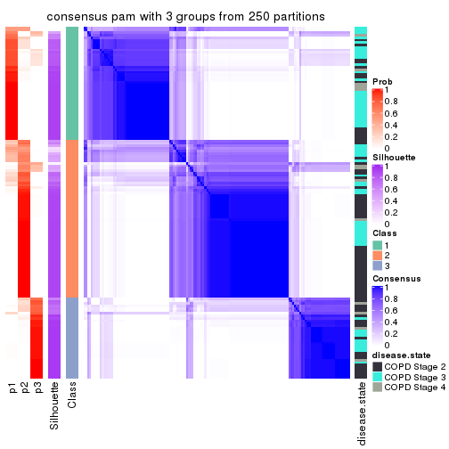</p>

</div>
<div id='tab-SD-pam-consensus-heatmap-3'>
<pre><code class="r">consensus_heatmap(res, k = 4)
</code></pre>

<p></p>

</div>
<div id='tab-SD-pam-consensus-heatmap-4'>
<pre><code class="r">consensus_heatmap(res, k = 5)
</code></pre>

<p></p>

</div>
<div id='tab-SD-pam-consensus-heatmap-5'>
<pre><code class="r">consensus_heatmap(res, k = 6)
</code></pre>

<p></p>

</div>
</div>

Heatmaps for the membership of samples in all partitions to see how consistent they are:


<script>
$( function() {
	$( '#tabs-SD-pam-membership-heatmap' ).tabs();
} );
</script>
<div id='tabs-SD-pam-membership-heatmap'>
<ul>
<li><a href='#tab-SD-pam-membership-heatmap-1'>k = 2</a></li>
<li><a href='#tab-SD-pam-membership-heatmap-2'>k = 3</a></li>
<li><a href='#tab-SD-pam-membership-heatmap-3'>k = 4</a></li>
<li><a href='#tab-SD-pam-membership-heatmap-4'>k = 5</a></li>
<li><a href='#tab-SD-pam-membership-heatmap-5'>k = 6</a></li>
</ul>
<div id='tab-SD-pam-membership-heatmap-1'>
<pre><code class="r">membership_heatmap(res, k = 2)
</code></pre>

<p></p>

</div>
<div id='tab-SD-pam-membership-heatmap-2'>
<pre><code class="r">membership_heatmap(res, k = 3)
</code></pre>

<p></p>

</div>
<div id='tab-SD-pam-membership-heatmap-3'>
<pre><code class="r">membership_heatmap(res, k = 4)
</code></pre>

<p></p>

</div>
<div id='tab-SD-pam-membership-heatmap-4'>
<pre><code class="r">membership_heatmap(res, k = 5)
</code></pre>

<p></p>

</div>
<div id='tab-SD-pam-membership-heatmap-5'>
<pre><code class="r">membership_heatmap(res, k = 6)
</code></pre>

<p></p>

</div>
</div>

As soon as we have had the classes for columns, we can look for signatures
which are significantly different between classes which can be candidate marks
for certain classes. Following are the heatmaps for signatures.


Signature heatmaps where rows are scaled:


<script>
$( function() {
	$( '#tabs-SD-pam-get-signatures' ).tabs();
} );
</script>
<div id='tabs-SD-pam-get-signatures'>
<ul>
<li><a href='#tab-SD-pam-get-signatures-1'>k = 2</a></li>
<li><a href='#tab-SD-pam-get-signatures-2'>k = 3</a></li>
<li><a href='#tab-SD-pam-get-signatures-3'>k = 4</a></li>
<li><a href='#tab-SD-pam-get-signatures-4'>k = 5</a></li>
<li><a href='#tab-SD-pam-get-signatures-5'>k = 6</a></li>
</ul>
<div id='tab-SD-pam-get-signatures-1'>
<pre><code class="r">get_signatures(res, k = 2)
</code></pre>

<p></p>

</div>
<div id='tab-SD-pam-get-signatures-2'>
<pre><code class="r">get_signatures(res, k = 3)
</code></pre>

<p></p>

</div>
<div id='tab-SD-pam-get-signatures-3'>
<pre><code class="r">get_signatures(res, k = 4)
</code></pre>

<p></p>

</div>
<div id='tab-SD-pam-get-signatures-4'>
<pre><code class="r">get_signatures(res, k = 5)
</code></pre>

<p></p>

</div>
<div id='tab-SD-pam-get-signatures-5'>
<pre><code class="r">get_signatures(res, k = 6)
</code></pre>

<p></p>

</div>
</div>


Signature heatmaps where rows are not scaled:


<script>
$( function() {
	$( '#tabs-SD-pam-get-signatures-no-scale' ).tabs();
} );
</script>
<div id='tabs-SD-pam-get-signatures-no-scale'>
<ul>
<li><a href='#tab-SD-pam-get-signatures-no-scale-1'>k = 2</a></li>
<li><a href='#tab-SD-pam-get-signatures-no-scale-2'>k = 3</a></li>
<li><a href='#tab-SD-pam-get-signatures-no-scale-3'>k = 4</a></li>
<li><a href='#tab-SD-pam-get-signatures-no-scale-4'>k = 5</a></li>
<li><a href='#tab-SD-pam-get-signatures-no-scale-5'>k = 6</a></li>
</ul>
<div id='tab-SD-pam-get-signatures-no-scale-1'>
<pre><code class="r">get_signatures(res, k = 2, scale_rows = FALSE)
</code></pre>

<p></p>

</div>
<div id='tab-SD-pam-get-signatures-no-scale-2'>
<pre><code class="r">get_signatures(res, k = 3, scale_rows = FALSE)
</code></pre>

<p></p>

</div>
<div id='tab-SD-pam-get-signatures-no-scale-3'>
<pre><code class="r">get_signatures(res, k = 4, scale_rows = FALSE)
</code></pre>

<p></p>

</div>
<div id='tab-SD-pam-get-signatures-no-scale-4'>
<pre><code class="r">get_signatures(res, k = 5, scale_rows = FALSE)
</code></pre>

<p></p>

</div>
<div id='tab-SD-pam-get-signatures-no-scale-5'>
<pre><code class="r">get_signatures(res, k = 6, scale_rows = FALSE)
</code></pre>

<p></p>

</div>
</div>


Compare the overlap of signatures from different k:

```r
compare_signatures(res)
```


`get_signature()` returns a data frame invisibly. TO get the list of signatures, the function
call should be assigned to a variable explicitly. In following code, if `plot` argument is set
to `FALSE`, no heatmap is plotted while only the differential analysis is performed.

```r
# code only for demonstration
tb = get_signature(res, k = ..., plot = FALSE)
```

An example of the output of `tb` is:

```
#>   which_row         fdr    mean_1    mean_2 scaled_mean_1 scaled_mean_2 km
#> 1        38 0.042760348  8.373488  9.131774    -0.5533452     0.5164555  1
#> 2        40 0.018707592  7.106213  8.469186    -0.6173731     0.5762149  1
#> 3        55 0.019134737 10.221463 11.207825    -0.6159697     0.5749050  1
#> 4        59 0.006059896  5.921854  7.869574    -0.6899429     0.6439467  1
#> 5        60 0.018055526  8.928898 10.211722    -0.6204761     0.5791110  1
#> 6        98 0.009384629 15.714769 14.887706     0.6635654    -0.6193277  2
...
```

The columns in `tb` are:

1. `which_row`: row indices corresponding to the input matrix.
2. `fdr`: FDR for the differential test. 
3. `mean_x`: The mean value in group x.
4. `scaled_mean_x`: The mean value in group x after rows are scaled.
5. `km`: Row groups if k-means clustering is applied to rows.


UMAP plot which shows how samples are separated.


<script>
$( function() {
	$( '#tabs-SD-pam-dimension-reduction' ).tabs();
} );
</script>
<div id='tabs-SD-pam-dimension-reduction'>
<ul>
<li><a href='#tab-SD-pam-dimension-reduction-1'>k = 2</a></li>
<li><a href='#tab-SD-pam-dimension-reduction-2'>k = 3</a></li>
<li><a href='#tab-SD-pam-dimension-reduction-3'>k = 4</a></li>
<li><a href='#tab-SD-pam-dimension-reduction-4'>k = 5</a></li>
<li><a href='#tab-SD-pam-dimension-reduction-5'>k = 6</a></li>
</ul>
<div id='tab-SD-pam-dimension-reduction-1'>
<pre><code class="r">dimension_reduction(res, k = 2, method = &quot;UMAP&quot;)
</code></pre>

<p></p>

</div>
<div id='tab-SD-pam-dimension-reduction-2'>
<pre><code class="r">dimension_reduction(res, k = 3, method = &quot;UMAP&quot;)
</code></pre>

<p></p>

</div>
<div id='tab-SD-pam-dimension-reduction-3'>
<pre><code class="r">dimension_reduction(res, k = 4, method = &quot;UMAP&quot;)
</code></pre>

<p></p>

</div>
<div id='tab-SD-pam-dimension-reduction-4'>
<pre><code class="r">dimension_reduction(res, k = 5, method = &quot;UMAP&quot;)
</code></pre>

<p></p>

</div>
<div id='tab-SD-pam-dimension-reduction-5'>
<pre><code class="r">dimension_reduction(res, k = 6, method = &quot;UMAP&quot;)
</code></pre>

<p></p>

</div>
</div>


Following heatmap shows how subgroups are split when increasing `k`:

```r
collect_classes(res)
```


Test correlation between subgroups and known annotations. If the known
annotation is numeric, one-way ANOVA test is applied, and if the known
annotation is discrete, chi-squared contingency table test is applied.

```r
test_to_known_factors(res)
```

```
#>          n disease.state(p) k
#> SD:pam 142         2.16e-03 2
#> SD:pam 129         4.20e-03 3
#> SD:pam 137         1.83e-05 4
#> SD:pam 137         4.24e-05 5
#> SD:pam 131         1.45e-04 6
```


If matrix rows can be associated to genes, consider to use `GO_Enrichment(res,
...)` to perform function enrichment for the signature genes.


 

---------------------------------------------------


### SD:mclust


The object with results only for a single top-value method and a single partition method 
can be extracted as:

```r
res = res_list["SD", "mclust"]
# you can also extract it by
# res = res_list["SD:mclust"]
```

A summary of `res` and all the functions that can be applied to it:

```r
res
```

```
#> A 'ConsensusPartition' object with k = 2, 3, 4, 5, 6.
#>   On a matrix with 51776 rows and 143 columns.
#>   Top rows (1000, 2000, 3000, 4000, 5000) are extracted by 'SD' method.
#>   Subgroups are detected by 'mclust' method.
#>   Performed in total 1250 partitions by row resampling.
#>   Best k for subgroups seems to be 2.
#> 
#> Following methods can be applied to this 'ConsensusPartition' object:
#>  [1] "cola_report"             "collect_classes"         "collect_plots"          
#>  [4] "collect_stats"           "colnames"                "compare_signatures"     
#>  [7] "consensus_heatmap"       "dimension_reduction"     "functional_enrichment"  
#> [10] "get_anno_col"            "get_anno"                "get_classes"            
#> [13] "get_consensus"           "get_matrix"              "get_membership"         
#> [16] "get_param"               "get_signatures"          "get_stats"              
#> [19] "is_best_k"               "is_stable_k"             "membership_heatmap"     
#> [22] "ncol"                    "nrow"                    "plot_ecdf"              
#> [25] "rownames"                "select_partition_number" "show"                   
#> [28] "suggest_best_k"          "test_to_known_factors"
```

`collect_plots()` function collects all the plots made from `res` for all `k` (number of partitions)
into one single page to provide an easy and fast comparison between different `k`.

```r
collect_plots(res)
```


The plots are:

- The first row: a plot of the ECDF (Empirical cumulative distribution
  function) curves of the consensus matrix for each `k` and the heatmap of
  predicted classes for each `k`.
- The second row: heatmaps of the consensus matrix for each `k`.
- The third row: heatmaps of the membership matrix for each `k`.
- The fouth row: heatmaps of the signatures for each `k`.

All the plots in panels can be made by individual functions and they are
plotted later in this section.

`select_partition_number()` produces several plots showing different
statistics for choosing "optimized" `k`. There are following statistics:

- ECDF curves of the consensus matrix for each `k`;
- 1-PAC. [The PAC
  score](https://en.wikipedia.org/wiki/Consensus_clustering#Over-interpretation_potential_of_consensus_clustering)
  measures the proportion of the ambiguous subgrouping.
- Mean silhouette score.
- Concordance. The mean probability of fiting the consensus class ids in all
  partitions.
- Area increased. Denote $A_k$ as the area under the ECDF curve for current
  `k`, the area increased is defined as $A_k - A_{k-1}$.
- Rand index. The percent of pairs of samples that are both in a same cluster
  or both are not in a same cluster in the partition of k and k-1.
- Jaccard index. The ratio of pairs of samples are both in a same cluster in
  the partition of k and k-1 and the pairs of samples are both in a same
  cluster in the partition k or k-1.

The detailed explanations of these statistics can be found in [the cola
vignette](http://bioconductor.org/packages/devel/bioc/vignettes/cola/inst/doc/cola.html#toc_13).

Generally speaking, lower PAC score, higher mean silhouette score or higher
concordance corresponds to better partition. Rand index and Jaccard index
measure how similar the current partition is compared to partition with `k-1`.
If they are too similar, we won't accept `k` is better than `k-1`.

```r
select_partition_number(res)
```


The numeric values for all these statistics can be obtained by `get_stats()`.

```r
get_stats(res)
```

```
#>   k 1-PAC mean_silhouette concordance area_increased  Rand Jaccard
#> 2 2 0.612           0.776       0.899         0.4328 0.523   0.523
#> 3 3 0.409           0.643       0.809         0.2443 0.634   0.463
#> 4 4 0.372           0.388       0.655         0.2247 0.702   0.462
#> 5 5 0.614           0.714       0.832         0.1009 0.699   0.346
#> 6 6 0.707           0.702       0.858         0.0861 0.800   0.424
```

`suggest_best_k()` suggests the best $k$ based on these statistics. The rules are as follows:

- All $k$ with Jaccard index larger than 0.95 are removed because the increase of
  the partition number does not provides enough extra information. If all $k$ are removed,
  the best $k$ is assigned by `NA`.
- For $k$ with 1-PAC larger than 0.9, the maximal $k$ is taken as the "best k". Other $k$ is called "optional k".
- If it does not fit the second rule. The $k$ with the highest vote of highest
  1-PAC, mean silhouette and concordance is taken as the "best k".

```r
suggest_best_k(res)
```

```
#> [1] 2
```


Following shows the table of the partitions (You need to click the **show/hide
code output** link to see it). The membership matrix (columns with name `p*`)
is inferred by
[`clue::cl_consensus()`](https://www.rdocumentation.org/link/cl_consensus?package=clue)
function with the `SE` method. Basically the value in the membership matrix
represents the probability to belong to a certain group. The finall class
label for an item is determined with the group with highest probability it
belongs to.

In `get_classes()` function, the entropy is calculated from the membership
matrix and the silhouette score is calculated from the consensus matrix.


<script>
$( function() {
	$( '#tabs-SD-mclust-get-classes' ).tabs();
} );
</script>
<div id='tabs-SD-mclust-get-classes'>
<ul>
<li><a href='#tab-SD-mclust-get-classes-1'>k = 2</a></li>
<li><a href='#tab-SD-mclust-get-classes-2'>k = 3</a></li>
<li><a href='#tab-SD-mclust-get-classes-3'>k = 4</a></li>
<li><a href='#tab-SD-mclust-get-classes-4'>k = 5</a></li>
<li><a href='#tab-SD-mclust-get-classes-5'>k = 6</a></li>
</ul>

<div id='tab-SD-mclust-get-classes-1'>
<p><a id='tab-SD-mclust-get-classes-1-a' style='color:#0366d6' href='#'>show/hide code output</a></p>
<pre><code class="r">cbind(get_classes(res, k = 2), get_membership(res, k = 2))
</code></pre>

<pre><code>#&gt;           class entropy silhouette    p1    p2
#&gt; GSM550785     2  0.0938     0.9306 0.012 0.988
#&gt; GSM550786     1  0.6247     0.7320 0.844 0.156
#&gt; GSM550788     2  0.0938     0.9306 0.012 0.988
#&gt; GSM550789     2  0.0000     0.9282 0.000 1.000
#&gt; GSM550790     2  0.0938     0.9306 0.012 0.988
#&gt; GSM550791     2  0.3733     0.8736 0.072 0.928
#&gt; GSM550792     2  0.7299     0.6860 0.204 0.796
#&gt; GSM550796     2  0.0000     0.9282 0.000 1.000
#&gt; GSM550797     2  0.0000     0.9282 0.000 1.000
#&gt; GSM550799     1  0.0000     0.7890 1.000 0.000
#&gt; GSM550800     2  0.0000     0.9282 0.000 1.000
#&gt; GSM550801     2  0.0000     0.9282 0.000 1.000
#&gt; GSM550804     2  0.0000     0.9282 0.000 1.000
#&gt; GSM550806     1  0.0000     0.7890 1.000 0.000
#&gt; GSM550807     2  0.0000     0.9282 0.000 1.000
#&gt; GSM550808     1  0.8909     0.6270 0.692 0.308
#&gt; GSM550809     1  0.9850     0.4750 0.572 0.428
#&gt; GSM550810     2  0.9393     0.2774 0.356 0.644
#&gt; GSM550811     1  0.9881     0.4563 0.564 0.436
#&gt; GSM550813     2  0.0000     0.9282 0.000 1.000
#&gt; GSM550814     2  0.9358     0.2879 0.352 0.648
#&gt; GSM550815     2  0.0000     0.9282 0.000 1.000
#&gt; GSM550816     2  0.0938     0.9306 0.012 0.988
#&gt; GSM550817     1  0.0000     0.7890 1.000 0.000
#&gt; GSM550818     1  0.0000     0.7890 1.000 0.000
#&gt; GSM550819     2  0.9993    -0.2248 0.484 0.516
#&gt; GSM550820     1  0.9850     0.4750 0.572 0.428
#&gt; GSM550821     1  0.9635     0.5361 0.612 0.388
#&gt; GSM550822     2  0.0000     0.9282 0.000 1.000
#&gt; GSM550826     1  0.9833     0.4833 0.576 0.424
#&gt; GSM550832     2  0.6887     0.7057 0.184 0.816
#&gt; GSM550833     2  0.0000     0.9282 0.000 1.000
#&gt; GSM550835     1  0.1184     0.7871 0.984 0.016
#&gt; GSM550836     1  0.0000     0.7890 1.000 0.000
#&gt; GSM550837     1  0.7139     0.7150 0.804 0.196
#&gt; GSM550838     1  0.9833     0.4833 0.576 0.424
#&gt; GSM550841     1  0.0000     0.7890 1.000 0.000
#&gt; GSM550842     1  0.1414     0.7856 0.980 0.020
#&gt; GSM550846     1  0.9933     0.4157 0.548 0.452
#&gt; GSM550849     1  0.9977     0.3557 0.528 0.472
#&gt; GSM550850     2  0.3114     0.8908 0.056 0.944
#&gt; GSM550851     1  0.7745     0.6917 0.772 0.228
#&gt; GSM550852     2  0.6712     0.7191 0.176 0.824
#&gt; GSM550853     2  0.0000     0.9282 0.000 1.000
#&gt; GSM550855     2  0.0000     0.9282 0.000 1.000
#&gt; GSM550856     2  0.0000     0.9282 0.000 1.000
#&gt; GSM550861     2  0.0000     0.9282 0.000 1.000
#&gt; GSM550863     2  0.0938     0.9306 0.012 0.988
#&gt; GSM550864     2  0.0000     0.9282 0.000 1.000
#&gt; GSM550866     2  0.0000     0.9282 0.000 1.000
#&gt; GSM550867     2  0.0938     0.9306 0.012 0.988
#&gt; GSM550885     2  0.0938     0.9306 0.012 0.988
#&gt; GSM550886     1  0.0376     0.7889 0.996 0.004
#&gt; GSM550887     2  0.0000     0.9282 0.000 1.000
#&gt; GSM550889     2  0.0938     0.9306 0.012 0.988
#&gt; GSM550894     2  0.9087     0.3793 0.324 0.676
#&gt; GSM550897     2  0.0938     0.9306 0.012 0.988
#&gt; GSM550903     2  0.0000     0.9282 0.000 1.000
#&gt; GSM550905     1  0.5946     0.7384 0.856 0.144
#&gt; GSM550906     2  0.0000     0.9282 0.000 1.000
#&gt; GSM550907     1  0.0000     0.7890 1.000 0.000
#&gt; GSM550909     1  0.9635     0.5360 0.612 0.388
#&gt; GSM550911     1  0.0000     0.7890 1.000 0.000
#&gt; GSM550913     2  0.0000     0.9282 0.000 1.000
#&gt; GSM550915     2  0.0938     0.9306 0.012 0.988
#&gt; GSM550917     2  0.0000     0.9282 0.000 1.000
#&gt; GSM550919     2  0.0938     0.9306 0.012 0.988
#&gt; GSM550921     1  0.0000     0.7890 1.000 0.000
#&gt; GSM550924     1  0.9833     0.4833 0.576 0.424
#&gt; GSM550926     2  0.0000     0.9282 0.000 1.000
#&gt; GSM550927     2  0.0000     0.9282 0.000 1.000
#&gt; GSM550787     1  0.9815     0.4900 0.580 0.420
#&gt; GSM550793     1  0.0938     0.7881 0.988 0.012
#&gt; GSM550794     2  0.7139     0.7002 0.196 0.804
#&gt; GSM550795     2  0.0938     0.9306 0.012 0.988
#&gt; GSM550798     1  0.9775     0.5006 0.588 0.412
#&gt; GSM550803     2  0.8144     0.5896 0.252 0.748
#&gt; GSM550805     1  0.9909     0.4359 0.556 0.444
#&gt; GSM550823     2  0.6623     0.7399 0.172 0.828
#&gt; GSM550824     2  0.0938     0.9306 0.012 0.988
#&gt; GSM550825     1  0.0000     0.7890 1.000 0.000
#&gt; GSM550827     2  0.0938     0.9306 0.012 0.988
#&gt; GSM550828     2  0.0938     0.9306 0.012 0.988
#&gt; GSM550829     1  0.9775     0.5006 0.588 0.412
#&gt; GSM550830     2  0.0938     0.9306 0.012 0.988
#&gt; GSM550834     2  0.0938     0.9306 0.012 0.988
#&gt; GSM550839     1  0.0938     0.7881 0.988 0.012
#&gt; GSM550840     2  0.0938     0.9306 0.012 0.988
#&gt; GSM550843     1  0.0000     0.7890 1.000 0.000
#&gt; GSM550844     2  0.9129     0.3946 0.328 0.672
#&gt; GSM550845     2  0.0000     0.9282 0.000 1.000
#&gt; GSM550848     2  0.0938     0.9306 0.012 0.988
#&gt; GSM550854     2  0.0938     0.9306 0.012 0.988
#&gt; GSM550857     1  0.0000     0.7890 1.000 0.000
#&gt; GSM550858     2  0.0938     0.9306 0.012 0.988
#&gt; GSM550859     2  0.0938     0.9306 0.012 0.988
#&gt; GSM550862     2  0.0938     0.9306 0.012 0.988
#&gt; GSM550865     2  0.0938     0.9306 0.012 0.988
#&gt; GSM550868     2  0.0938     0.9306 0.012 0.988
#&gt; GSM550869     1  0.9635     0.5360 0.612 0.388
#&gt; GSM550870     2  0.0000     0.9282 0.000 1.000
#&gt; GSM550871     1  0.1633     0.7849 0.976 0.024
#&gt; GSM550872     2  0.0938     0.9306 0.012 0.988
#&gt; GSM550873     2  0.9996    -0.2740 0.488 0.512
#&gt; GSM550874     2  0.0376     0.9290 0.004 0.996
#&gt; GSM550876     1  0.0000     0.7890 1.000 0.000
#&gt; GSM550877     2  0.0000     0.9282 0.000 1.000
#&gt; GSM550878     1  0.0000     0.7890 1.000 0.000
#&gt; GSM550879     2  0.0938     0.9306 0.012 0.988
#&gt; GSM550882     1  0.0000     0.7890 1.000 0.000
#&gt; GSM550888     1  0.0000     0.7890 1.000 0.000
#&gt; GSM550890     2  0.0938     0.9306 0.012 0.988
#&gt; GSM550891     1  0.0000     0.7890 1.000 0.000
#&gt; GSM550892     2  0.0938     0.9306 0.012 0.988
#&gt; GSM550893     2  0.0938     0.9306 0.012 0.988
#&gt; GSM550895     2  0.0938     0.9306 0.012 0.988
#&gt; GSM550896     2  0.0938     0.9306 0.012 0.988
#&gt; GSM550898     2  0.0938     0.9306 0.012 0.988
#&gt; GSM550899     2  0.0000     0.9282 0.000 1.000
#&gt; GSM550900     2  0.0938     0.9306 0.012 0.988
#&gt; GSM550901     2  0.0938     0.9306 0.012 0.988
#&gt; GSM550902     1  0.9833     0.4833 0.576 0.424
#&gt; GSM550904     1  0.9833     0.4833 0.576 0.424
#&gt; GSM550908     1  0.0000     0.7890 1.000 0.000
#&gt; GSM550912     2  0.0000     0.9282 0.000 1.000
#&gt; GSM550914     2  0.0938     0.9306 0.012 0.988
#&gt; GSM550918     2  0.0000     0.9282 0.000 1.000
#&gt; GSM550922     1  0.0000     0.7890 1.000 0.000
#&gt; GSM550923     1  0.9833     0.4833 0.576 0.424
#&gt; GSM550925     2  0.0938     0.9306 0.012 0.988
#&gt; GSM550802     2  0.5946     0.7690 0.144 0.856
#&gt; GSM550812     2  0.9775     0.0891 0.412 0.588
#&gt; GSM550831     2  0.1184     0.9280 0.016 0.984
#&gt; GSM550847     2  0.0938     0.9306 0.012 0.988
#&gt; GSM550860     1  0.0938     0.7881 0.988 0.012
#&gt; GSM550875     1  0.9866     0.4657 0.568 0.432
#&gt; GSM550880     2  0.0938     0.9306 0.012 0.988
#&gt; GSM550881     1  0.0000     0.7890 1.000 0.000
#&gt; GSM550883     1  0.0000     0.7890 1.000 0.000
#&gt; GSM550884     1  1.0000     0.2756 0.504 0.496
#&gt; GSM550910     1  0.0376     0.7889 0.996 0.004
#&gt; GSM550916     2  0.3733     0.8736 0.072 0.928
#&gt; GSM550920     1  0.0000     0.7890 1.000 0.000
</code></pre>

<script>
$('#tab-SD-mclust-get-classes-1-a').parent().next().next().hide();
$('#tab-SD-mclust-get-classes-1-a').click(function(){
  $('#tab-SD-mclust-get-classes-1-a').parent().next().next().toggle();
  return(false);
});
</script>
</div>

<div id='tab-SD-mclust-get-classes-2'>
<p><a id='tab-SD-mclust-get-classes-2-a' style='color:#0366d6' href='#'>show/hide code output</a></p>
<pre><code class="r">cbind(get_classes(res, k = 3), get_membership(res, k = 3))
</code></pre>

<pre><code>#&gt;           class entropy silhouette    p1    p2    p3
#&gt; GSM550785     1  0.3879     0.7228 0.848 0.152 0.000
#&gt; GSM550786     2  0.6208     0.6710 0.076 0.772 0.152
#&gt; GSM550788     2  0.2356     0.7828 0.072 0.928 0.000
#&gt; GSM550789     2  0.1643     0.7908 0.044 0.956 0.000
#&gt; GSM550790     1  0.3879     0.7228 0.848 0.152 0.000
#&gt; GSM550791     2  0.7145    -0.1623 0.440 0.536 0.024
#&gt; GSM550792     2  0.4288     0.7547 0.068 0.872 0.060
#&gt; GSM550796     2  0.0892     0.7942 0.020 0.980 0.000
#&gt; GSM550797     2  0.1860     0.7893 0.052 0.948 0.000
#&gt; GSM550799     3  0.0237     0.8526 0.000 0.004 0.996
#&gt; GSM550800     2  0.1964     0.7856 0.056 0.944 0.000
#&gt; GSM550801     2  0.1289     0.7919 0.032 0.968 0.000
#&gt; GSM550804     2  0.1753     0.7898 0.048 0.952 0.000
#&gt; GSM550806     3  0.1643     0.8253 0.044 0.000 0.956
#&gt; GSM550807     2  0.1643     0.7889 0.044 0.956 0.000
#&gt; GSM550808     2  0.5174     0.7303 0.076 0.832 0.092
#&gt; GSM550809     1  0.8391     0.2943 0.484 0.432 0.084
#&gt; GSM550810     2  0.3623     0.7700 0.032 0.896 0.072
#&gt; GSM550811     2  0.8337    -0.1907 0.444 0.476 0.080
#&gt; GSM550813     2  0.1163     0.7906 0.028 0.972 0.000
#&gt; GSM550814     2  0.3764     0.7723 0.040 0.892 0.068
#&gt; GSM550815     2  0.0892     0.7938 0.020 0.980 0.000
#&gt; GSM550816     2  0.4842     0.5420 0.224 0.776 0.000
#&gt; GSM550817     3  0.2187     0.8425 0.024 0.028 0.948
#&gt; GSM550818     3  0.3042     0.8285 0.040 0.040 0.920
#&gt; GSM550819     2  0.4379     0.7657 0.060 0.868 0.072
#&gt; GSM550820     1  0.8054     0.5229 0.580 0.340 0.080
#&gt; GSM550821     2  0.5174     0.7303 0.076 0.832 0.092
#&gt; GSM550822     2  0.1620     0.7944 0.024 0.964 0.012
#&gt; GSM550826     2  0.8464    -0.2107 0.448 0.464 0.088
#&gt; GSM550832     2  0.4288     0.7547 0.068 0.872 0.060
#&gt; GSM550833     2  0.0592     0.7948 0.012 0.988 0.000
#&gt; GSM550835     3  0.7610     0.2358 0.044 0.420 0.536
#&gt; GSM550836     3  0.0424     0.8520 0.008 0.000 0.992
#&gt; GSM550837     2  0.5036     0.7274 0.048 0.832 0.120
#&gt; GSM550838     1  0.8454     0.2829 0.480 0.432 0.088
#&gt; GSM550841     3  0.3155     0.8271 0.044 0.040 0.916
#&gt; GSM550842     2  0.7610     0.2214 0.048 0.564 0.388
#&gt; GSM550846     2  0.8288    -0.0369 0.408 0.512 0.080
#&gt; GSM550849     2  0.5010     0.7411 0.084 0.840 0.076
#&gt; GSM550850     1  0.6647     0.5491 0.592 0.396 0.012
#&gt; GSM550851     2  0.5253     0.7275 0.076 0.828 0.096
#&gt; GSM550852     2  0.3791     0.7652 0.048 0.892 0.060
#&gt; GSM550853     2  0.1964     0.7868 0.056 0.944 0.000
#&gt; GSM550855     2  0.1964     0.7868 0.056 0.944 0.000
#&gt; GSM550856     2  0.2448     0.7829 0.076 0.924 0.000
#&gt; GSM550861     2  0.0424     0.7934 0.008 0.992 0.000
#&gt; GSM550863     2  0.2878     0.7654 0.096 0.904 0.000
#&gt; GSM550864     2  0.2261     0.7898 0.068 0.932 0.000
#&gt; GSM550866     2  0.2356     0.7834 0.072 0.928 0.000
#&gt; GSM550867     1  0.3816     0.7202 0.852 0.148 0.000
#&gt; GSM550885     1  0.4002     0.7213 0.840 0.160 0.000
#&gt; GSM550886     3  0.7851     0.2498 0.056 0.412 0.532
#&gt; GSM550887     2  0.1411     0.7958 0.036 0.964 0.000
#&gt; GSM550889     2  0.2356     0.7828 0.072 0.928 0.000
#&gt; GSM550894     2  0.3572     0.7687 0.040 0.900 0.060
#&gt; GSM550897     2  0.2537     0.7839 0.080 0.920 0.000
#&gt; GSM550903     2  0.1289     0.7922 0.032 0.968 0.000
#&gt; GSM550905     2  0.5174     0.7303 0.076 0.832 0.092
#&gt; GSM550906     2  0.1289     0.7915 0.032 0.968 0.000
#&gt; GSM550907     3  0.1774     0.8460 0.016 0.024 0.960
#&gt; GSM550909     2  0.5174     0.7303 0.076 0.832 0.092
#&gt; GSM550911     3  0.0848     0.8517 0.008 0.008 0.984
#&gt; GSM550913     2  0.1989     0.7892 0.048 0.948 0.004
#&gt; GSM550915     2  0.6225    -0.1448 0.432 0.568 0.000
#&gt; GSM550917     2  0.1643     0.7905 0.044 0.956 0.000
#&gt; GSM550919     2  0.6225    -0.1448 0.432 0.568 0.000
#&gt; GSM550921     3  0.0424     0.8520 0.008 0.000 0.992
#&gt; GSM550924     2  0.4914     0.7380 0.068 0.844 0.088
#&gt; GSM550926     2  0.2356     0.7828 0.072 0.928 0.000
#&gt; GSM550927     2  0.1289     0.7914 0.032 0.968 0.000
#&gt; GSM550787     2  0.5815     0.7376 0.096 0.800 0.104
#&gt; GSM550793     3  0.7395     0.2017 0.040 0.380 0.580
#&gt; GSM550794     2  0.4658     0.7696 0.076 0.856 0.068
#&gt; GSM550795     1  0.6280     0.4768 0.540 0.460 0.000
#&gt; GSM550798     1  0.8694     0.5599 0.580 0.268 0.152
#&gt; GSM550803     1  0.4768     0.6012 0.848 0.052 0.100
#&gt; GSM550805     2  0.5603     0.7379 0.060 0.804 0.136
#&gt; GSM550823     2  0.3690     0.7844 0.100 0.884 0.016
#&gt; GSM550824     1  0.3879     0.7228 0.848 0.152 0.000
#&gt; GSM550825     3  0.0592     0.8500 0.012 0.000 0.988
#&gt; GSM550827     2  0.4002     0.6717 0.160 0.840 0.000
#&gt; GSM550828     1  0.4062     0.7195 0.836 0.164 0.000
#&gt; GSM550829     1  0.9465     0.4202 0.472 0.332 0.196
#&gt; GSM550830     2  0.2356     0.7828 0.072 0.928 0.000
#&gt; GSM550834     2  0.6260    -0.2405 0.448 0.552 0.000
#&gt; GSM550839     2  0.6984     0.5348 0.040 0.656 0.304
#&gt; GSM550840     2  0.2537     0.7839 0.080 0.920 0.000
#&gt; GSM550843     3  0.2031     0.8438 0.016 0.032 0.952
#&gt; GSM550844     2  0.8190    -0.1153 0.432 0.496 0.072
#&gt; GSM550845     2  0.1964     0.7883 0.056 0.944 0.000
#&gt; GSM550848     2  0.6432    -0.1461 0.428 0.568 0.004
#&gt; GSM550854     1  0.3551     0.7135 0.868 0.132 0.000
#&gt; GSM550857     3  0.1289     0.8477 0.032 0.000 0.968
#&gt; GSM550858     1  0.3619     0.7159 0.864 0.136 0.000
#&gt; GSM550859     1  0.3816     0.7202 0.852 0.148 0.000
#&gt; GSM550862     1  0.5138     0.6948 0.748 0.252 0.000
#&gt; GSM550865     2  0.2537     0.7820 0.080 0.920 0.000
#&gt; GSM550868     2  0.2878     0.7736 0.096 0.904 0.000
#&gt; GSM550869     2  0.5892     0.7342 0.100 0.796 0.104
#&gt; GSM550870     2  0.1163     0.7916 0.028 0.972 0.000
#&gt; GSM550871     2  0.5875     0.7192 0.056 0.784 0.160
#&gt; GSM550872     2  0.3551     0.7454 0.132 0.868 0.000
#&gt; GSM550873     2  0.4477     0.7503 0.068 0.864 0.068
#&gt; GSM550874     2  0.2356     0.7828 0.072 0.928 0.000
#&gt; GSM550876     3  0.2200     0.8376 0.056 0.004 0.940
#&gt; GSM550877     2  0.2066     0.7851 0.060 0.940 0.000
#&gt; GSM550878     3  0.0237     0.8521 0.004 0.000 0.996
#&gt; GSM550879     1  0.6180     0.5306 0.584 0.416 0.000
#&gt; GSM550882     3  0.1643     0.8253 0.044 0.000 0.956
#&gt; GSM550888     3  0.0424     0.8520 0.008 0.000 0.992
#&gt; GSM550890     2  0.6225    -0.1467 0.432 0.568 0.000
#&gt; GSM550891     3  0.0424     0.8520 0.008 0.000 0.992
#&gt; GSM550892     2  0.5785     0.4014 0.332 0.668 0.000
#&gt; GSM550893     2  0.3038     0.7830 0.104 0.896 0.000
#&gt; GSM550895     2  0.2165     0.7845 0.064 0.936 0.000
#&gt; GSM550896     2  0.2796     0.7862 0.092 0.908 0.000
#&gt; GSM550898     1  0.3551     0.7135 0.868 0.132 0.000
#&gt; GSM550899     2  0.2066     0.7876 0.060 0.940 0.000
#&gt; GSM550900     2  0.2448     0.7835 0.076 0.924 0.000
#&gt; GSM550901     2  0.6267    -0.1991 0.452 0.548 0.000
#&gt; GSM550902     2  0.4887     0.7368 0.060 0.844 0.096
#&gt; GSM550904     1  0.8295     0.4317 0.532 0.384 0.084
#&gt; GSM550908     3  0.0892     0.8510 0.020 0.000 0.980
#&gt; GSM550912     2  0.1031     0.7939 0.024 0.976 0.000
#&gt; GSM550914     2  0.5678     0.2810 0.316 0.684 0.000
#&gt; GSM550918     2  0.1753     0.7889 0.048 0.952 0.000
#&gt; GSM550922     3  0.4565     0.7907 0.076 0.064 0.860
#&gt; GSM550923     1  0.8520     0.5592 0.588 0.280 0.132
#&gt; GSM550925     2  0.2448     0.7835 0.076 0.924 0.000
#&gt; GSM550802     2  0.3148     0.7889 0.036 0.916 0.048
#&gt; GSM550812     2  0.3764     0.7645 0.040 0.892 0.068
#&gt; GSM550831     1  0.6973     0.5359 0.564 0.416 0.020
#&gt; GSM550847     1  0.3551     0.7135 0.868 0.132 0.000
#&gt; GSM550860     3  0.8425     0.1820 0.096 0.364 0.540
#&gt; GSM550875     2  0.5538     0.7400 0.060 0.808 0.132
#&gt; GSM550880     2  0.6244    -0.1585 0.440 0.560 0.000
#&gt; GSM550881     3  0.0424     0.8520 0.008 0.000 0.992
#&gt; GSM550883     3  0.0424     0.8520 0.008 0.000 0.992
#&gt; GSM550884     2  0.4558     0.7452 0.044 0.856 0.100
#&gt; GSM550910     3  0.4290     0.8007 0.064 0.064 0.872
#&gt; GSM550916     2  0.4978     0.6190 0.216 0.780 0.004
#&gt; GSM550920     3  0.7248     0.5528 0.068 0.256 0.676
</code></pre>

<script>
$('#tab-SD-mclust-get-classes-2-a').parent().next().next().hide();
$('#tab-SD-mclust-get-classes-2-a').click(function(){
  $('#tab-SD-mclust-get-classes-2-a').parent().next().next().toggle();
  return(false);
});
</script>
</div>

<div id='tab-SD-mclust-get-classes-3'>
<p><a id='tab-SD-mclust-get-classes-3-a' style='color:#0366d6' href='#'>show/hide code output</a></p>
<pre><code class="r">cbind(get_classes(res, k = 4), get_membership(res, k = 4))
</code></pre>

<pre><code>#&gt;           class entropy silhouette    p1    p2    p3    p4
#&gt; GSM550785     1  0.7453     0.5121 0.484 0.192 0.000 0.324
#&gt; GSM550786     3  0.6206     0.3021 0.280 0.088 0.632 0.000
#&gt; GSM550788     2  0.0188     0.6152 0.004 0.996 0.000 0.000
#&gt; GSM550789     2  0.6806     0.6052 0.336 0.560 0.004 0.100
#&gt; GSM550790     1  0.7453     0.5121 0.484 0.192 0.000 0.324
#&gt; GSM550791     1  0.7110     0.5036 0.608 0.176 0.012 0.204
#&gt; GSM550792     1  0.6270    -0.3895 0.536 0.404 0.060 0.000
#&gt; GSM550796     2  0.7290     0.5867 0.348 0.536 0.024 0.092
#&gt; GSM550797     2  0.6770     0.6057 0.340 0.560 0.004 0.096
#&gt; GSM550799     3  0.3636     0.2125 0.008 0.000 0.820 0.172
#&gt; GSM550800     2  0.0188     0.6153 0.004 0.996 0.000 0.000
#&gt; GSM550801     2  0.6770     0.6057 0.340 0.560 0.004 0.096
#&gt; GSM550804     2  0.5689     0.5593 0.412 0.564 0.004 0.020
#&gt; GSM550806     3  0.4661     0.1153 0.008 0.004 0.724 0.264
#&gt; GSM550807     2  0.6666     0.6068 0.340 0.568 0.004 0.088
#&gt; GSM550808     1  0.7591    -0.3400 0.432 0.368 0.200 0.000
#&gt; GSM550809     1  0.4361     0.4737 0.772 0.000 0.020 0.208
#&gt; GSM550810     1  0.7909    -0.3743 0.428 0.388 0.168 0.016
#&gt; GSM550811     1  0.5912     0.4109 0.732 0.100 0.020 0.148
#&gt; GSM550813     2  0.6545     0.6206 0.300 0.604 0.004 0.092
#&gt; GSM550814     2  0.7684     0.3765 0.408 0.420 0.164 0.008
#&gt; GSM550815     2  0.6733     0.6000 0.344 0.560 0.004 0.092
#&gt; GSM550816     2  0.5655     0.5320 0.432 0.548 0.012 0.008
#&gt; GSM550817     3  0.0592     0.4639 0.016 0.000 0.984 0.000
#&gt; GSM550818     3  0.0469     0.4638 0.012 0.000 0.988 0.000
#&gt; GSM550819     1  0.7476    -0.4096 0.432 0.424 0.136 0.008
#&gt; GSM550820     1  0.4507     0.4705 0.756 0.000 0.020 0.224
#&gt; GSM550821     1  0.7591    -0.3390 0.432 0.368 0.200 0.000
#&gt; GSM550822     2  0.8932     0.4310 0.344 0.412 0.152 0.092
#&gt; GSM550826     1  0.4630     0.4667 0.768 0.000 0.036 0.196
#&gt; GSM550832     1  0.7704    -0.3761 0.432 0.392 0.168 0.008
#&gt; GSM550833     2  0.7393     0.5922 0.328 0.548 0.032 0.092
#&gt; GSM550835     3  0.4163     0.4814 0.076 0.096 0.828 0.000
#&gt; GSM550836     4  0.4941     0.9924 0.000 0.000 0.436 0.564
#&gt; GSM550837     1  0.7650    -0.3337 0.424 0.364 0.212 0.000
#&gt; GSM550838     1  0.4638     0.4601 0.776 0.000 0.044 0.180
#&gt; GSM550841     3  0.0921     0.4738 0.028 0.000 0.972 0.000
#&gt; GSM550842     3  0.5527     0.3312 0.168 0.104 0.728 0.000
#&gt; GSM550846     1  0.4173     0.1099 0.804 0.172 0.020 0.004
#&gt; GSM550849     1  0.5414    -0.3467 0.604 0.376 0.020 0.000
#&gt; GSM550850     1  0.7617     0.5191 0.516 0.196 0.008 0.280
#&gt; GSM550851     1  0.7660    -0.3278 0.428 0.356 0.216 0.000
#&gt; GSM550852     1  0.7655    -0.3905 0.428 0.404 0.160 0.008
#&gt; GSM550853     2  0.4012     0.6412 0.204 0.788 0.004 0.004
#&gt; GSM550855     2  0.4053     0.6405 0.228 0.768 0.004 0.000
#&gt; GSM550856     2  0.2311     0.6335 0.076 0.916 0.004 0.004
#&gt; GSM550861     2  0.6704     0.6034 0.336 0.568 0.004 0.092
#&gt; GSM550863     2  0.6650     0.4711 0.272 0.612 0.004 0.112
#&gt; GSM550864     2  0.6654     0.6026 0.352 0.560 0.004 0.084
#&gt; GSM550866     2  0.1082     0.6203 0.020 0.972 0.004 0.004
#&gt; GSM550867     1  0.7453     0.5121 0.484 0.192 0.000 0.324
#&gt; GSM550885     1  0.7386     0.5144 0.496 0.184 0.000 0.320
#&gt; GSM550886     3  0.4292     0.4734 0.080 0.100 0.820 0.000
#&gt; GSM550887     2  0.8368     0.4272 0.380 0.424 0.148 0.048
#&gt; GSM550889     2  0.0188     0.6152 0.004 0.996 0.000 0.000
#&gt; GSM550894     1  0.7815    -0.3727 0.424 0.396 0.168 0.012
#&gt; GSM550897     2  0.0707     0.6112 0.020 0.980 0.000 0.000
#&gt; GSM550903     2  0.6719     0.6024 0.340 0.564 0.004 0.092
#&gt; GSM550905     1  0.7613    -0.3376 0.428 0.368 0.204 0.000
#&gt; GSM550906     2  0.6753     0.6212 0.292 0.608 0.016 0.084
#&gt; GSM550907     3  0.4454    -0.3202 0.000 0.000 0.692 0.308
#&gt; GSM550909     1  0.7485    -0.3530 0.440 0.380 0.180 0.000
#&gt; GSM550911     3  0.4907    -0.7031 0.000 0.000 0.580 0.420
#&gt; GSM550913     2  0.6770     0.6057 0.340 0.560 0.004 0.096
#&gt; GSM550915     1  0.7373     0.4078 0.516 0.280 0.000 0.204
#&gt; GSM550917     2  0.6756     0.6070 0.336 0.564 0.004 0.096
#&gt; GSM550919     1  0.7133     0.3783 0.548 0.280 0.000 0.172
#&gt; GSM550921     4  0.4941     0.9924 0.000 0.000 0.436 0.564
#&gt; GSM550924     1  0.5957    -0.3330 0.588 0.364 0.048 0.000
#&gt; GSM550926     2  0.0336     0.6177 0.008 0.992 0.000 0.000
#&gt; GSM550927     2  0.6674     0.6155 0.316 0.584 0.004 0.096
#&gt; GSM550787     2  0.6057     0.4131 0.288 0.648 0.056 0.008
#&gt; GSM550793     3  0.6987     0.3975 0.124 0.096 0.684 0.096
#&gt; GSM550794     2  0.5989     0.4800 0.472 0.496 0.024 0.008
#&gt; GSM550795     1  0.7358     0.5155 0.564 0.196 0.008 0.232
#&gt; GSM550798     1  0.6858     0.2954 0.588 0.004 0.124 0.284
#&gt; GSM550803     1  0.7430     0.5064 0.540 0.120 0.020 0.320
#&gt; GSM550805     2  0.5821     0.4295 0.432 0.536 0.032 0.000
#&gt; GSM550823     2  0.1262     0.6137 0.016 0.968 0.008 0.008
#&gt; GSM550824     1  0.7441     0.5131 0.488 0.192 0.000 0.320
#&gt; GSM550825     3  0.4697     0.0139 0.008 0.000 0.696 0.296
#&gt; GSM550827     2  0.7011     0.3715 0.300 0.552 0.000 0.148
#&gt; GSM550828     1  0.7315     0.5161 0.512 0.180 0.000 0.308
#&gt; GSM550829     1  0.6910     0.2464 0.584 0.000 0.164 0.252
#&gt; GSM550830     2  0.0188     0.6152 0.004 0.996 0.000 0.000
#&gt; GSM550834     1  0.6917     0.5032 0.592 0.200 0.000 0.208
#&gt; GSM550839     3  0.6389     0.4154 0.172 0.116 0.692 0.020
#&gt; GSM550840     2  0.1302     0.6006 0.044 0.956 0.000 0.000
#&gt; GSM550843     3  0.1271     0.4609 0.012 0.012 0.968 0.008
#&gt; GSM550844     1  0.6437     0.4993 0.672 0.088 0.020 0.220
#&gt; GSM550845     2  0.3072     0.6130 0.124 0.868 0.004 0.004
#&gt; GSM550848     1  0.7085     0.3249 0.544 0.300 0.000 0.156
#&gt; GSM550854     1  0.7479     0.5104 0.480 0.196 0.000 0.324
#&gt; GSM550857     4  0.4941     0.9924 0.000 0.000 0.436 0.564
#&gt; GSM550858     1  0.7553     0.5041 0.476 0.216 0.000 0.308
#&gt; GSM550859     1  0.7453     0.5121 0.484 0.192 0.000 0.324
#&gt; GSM550862     1  0.7627     0.4871 0.472 0.256 0.000 0.272
#&gt; GSM550865     2  0.1398     0.6148 0.040 0.956 0.000 0.004
#&gt; GSM550868     2  0.2197     0.6071 0.080 0.916 0.000 0.004
#&gt; GSM550869     2  0.5708     0.4281 0.288 0.668 0.032 0.012
#&gt; GSM550870     2  0.6514     0.6241 0.284 0.616 0.004 0.096
#&gt; GSM550871     3  0.7486     0.3258 0.248 0.172 0.564 0.016
#&gt; GSM550872     2  0.1209     0.6079 0.032 0.964 0.000 0.004
#&gt; GSM550873     1  0.7701    -0.3706 0.436 0.388 0.168 0.008
#&gt; GSM550874     2  0.0336     0.6177 0.008 0.992 0.000 0.000
#&gt; GSM550876     3  0.6406     0.3538 0.024 0.116 0.696 0.164
#&gt; GSM550877     2  0.0469     0.6218 0.012 0.988 0.000 0.000
#&gt; GSM550878     3  0.4134     0.0869 0.000 0.000 0.740 0.260
#&gt; GSM550879     1  0.6958     0.5099 0.584 0.184 0.000 0.232
#&gt; GSM550882     3  0.4539     0.0925 0.008 0.000 0.720 0.272
#&gt; GSM550888     4  0.4941     0.9924 0.000 0.000 0.436 0.564
#&gt; GSM550890     1  0.6916     0.3589 0.572 0.280 0.000 0.148
#&gt; GSM550891     4  0.4967     0.9612 0.000 0.000 0.452 0.548
#&gt; GSM550892     2  0.5863     0.3273 0.180 0.700 0.000 0.120
#&gt; GSM550893     2  0.0188     0.6149 0.000 0.996 0.000 0.004
#&gt; GSM550895     2  0.0188     0.6152 0.004 0.996 0.000 0.000
#&gt; GSM550896     2  0.0992     0.6167 0.012 0.976 0.008 0.004
#&gt; GSM550898     1  0.7479     0.5104 0.480 0.196 0.000 0.324
#&gt; GSM550899     2  0.6545     0.5923 0.372 0.552 0.004 0.072
#&gt; GSM550900     2  0.0336     0.6125 0.008 0.992 0.000 0.000
#&gt; GSM550901     1  0.7036     0.4829 0.576 0.212 0.000 0.212
#&gt; GSM550902     1  0.7323     0.3835 0.628 0.148 0.040 0.184
#&gt; GSM550904     1  0.4472     0.4716 0.760 0.000 0.020 0.220
#&gt; GSM550908     4  0.4941     0.9924 0.000 0.000 0.436 0.564
#&gt; GSM550912     2  0.6937     0.4846 0.424 0.484 0.084 0.008
#&gt; GSM550914     2  0.5682     0.4728 0.456 0.520 0.000 0.024
#&gt; GSM550918     2  0.6770     0.6057 0.340 0.560 0.004 0.096
#&gt; GSM550922     3  0.1792     0.4843 0.068 0.000 0.932 0.000
#&gt; GSM550923     1  0.5769     0.4287 0.668 0.012 0.036 0.284
#&gt; GSM550925     2  0.0336     0.6170 0.008 0.992 0.000 0.000
#&gt; GSM550802     2  0.7641     0.4314 0.364 0.464 0.164 0.008
#&gt; GSM550812     1  0.6474    -0.3677 0.536 0.388 0.076 0.000
#&gt; GSM550831     1  0.7666     0.5206 0.524 0.192 0.012 0.272
#&gt; GSM550847     1  0.7518     0.5071 0.476 0.204 0.000 0.320
#&gt; GSM550860     3  0.7231     0.3762 0.100 0.140 0.664 0.096
#&gt; GSM550875     2  0.5359     0.4334 0.288 0.676 0.036 0.000
#&gt; GSM550880     1  0.7203     0.3717 0.524 0.312 0.000 0.164
#&gt; GSM550881     3  0.4567     0.0846 0.008 0.000 0.716 0.276
#&gt; GSM550883     3  0.4697     0.0139 0.008 0.000 0.696 0.296
#&gt; GSM550884     1  0.5738    -0.3905 0.540 0.432 0.028 0.000
#&gt; GSM550910     3  0.1557     0.4872 0.056 0.000 0.944 0.000
#&gt; GSM550916     2  0.4842     0.3981 0.192 0.760 0.000 0.048
#&gt; GSM550920     3  0.3308     0.4953 0.036 0.092 0.872 0.000
</code></pre>

<script>
$('#tab-SD-mclust-get-classes-3-a').parent().next().next().hide();
$('#tab-SD-mclust-get-classes-3-a').click(function(){
  $('#tab-SD-mclust-get-classes-3-a').parent().next().next().toggle();
  return(false);
});
</script>
</div>

<div id='tab-SD-mclust-get-classes-4'>
<p><a id='tab-SD-mclust-get-classes-4-a' style='color:#0366d6' href='#'>show/hide code output</a></p>
<pre><code class="r">cbind(get_classes(res, k = 5), get_membership(res, k = 5))
</code></pre>

<pre><code>#&gt;           class entropy silhouette    p1    p2    p3    p4    p5
#&gt; GSM550785     4  0.2329     0.6580 0.124 0.000 0.000 0.876 0.000
#&gt; GSM550786     5  0.4305     0.5956 0.000 0.200 0.000 0.052 0.748
#&gt; GSM550788     2  0.5244     0.6871 0.192 0.704 0.088 0.016 0.000
#&gt; GSM550789     2  0.0162     0.8173 0.000 0.996 0.004 0.000 0.000
#&gt; GSM550790     1  0.4045     0.7372 0.644 0.000 0.000 0.356 0.000
#&gt; GSM550791     4  0.0671     0.7169 0.000 0.016 0.004 0.980 0.000
#&gt; GSM550792     4  0.3774     0.6743 0.000 0.296 0.000 0.704 0.000
#&gt; GSM550796     2  0.0162     0.8173 0.000 0.996 0.000 0.004 0.000
#&gt; GSM550797     2  0.0162     0.8173 0.000 0.996 0.004 0.000 0.000
#&gt; GSM550799     5  0.3885     0.5986 0.040 0.000 0.176 0.000 0.784
#&gt; GSM550800     2  0.5211     0.6898 0.188 0.708 0.088 0.016 0.000
#&gt; GSM550801     2  0.0162     0.8173 0.000 0.996 0.004 0.000 0.000
#&gt; GSM550804     2  0.1205     0.8064 0.000 0.956 0.004 0.040 0.000
#&gt; GSM550806     5  0.3907     0.5703 0.016 0.000 0.204 0.008 0.772
#&gt; GSM550807     2  0.0000     0.8177 0.000 1.000 0.000 0.000 0.000
#&gt; GSM550808     2  0.2519     0.7601 0.000 0.884 0.000 0.016 0.100
#&gt; GSM550809     4  0.0510     0.7178 0.000 0.016 0.000 0.984 0.000
#&gt; GSM550810     2  0.0290     0.8156 0.000 0.992 0.000 0.008 0.000
#&gt; GSM550811     4  0.1270     0.7261 0.000 0.052 0.000 0.948 0.000
#&gt; GSM550813     2  0.2929     0.7531 0.180 0.820 0.000 0.000 0.000
#&gt; GSM550814     2  0.3160     0.7481 0.188 0.808 0.000 0.004 0.000
#&gt; GSM550815     2  0.0162     0.8173 0.000 0.996 0.000 0.004 0.000
#&gt; GSM550816     2  0.2286     0.7671 0.000 0.888 0.004 0.108 0.000
#&gt; GSM550817     5  0.0000     0.7059 0.000 0.000 0.000 0.000 1.000
#&gt; GSM550818     5  0.0000     0.7059 0.000 0.000 0.000 0.000 1.000
#&gt; GSM550819     2  0.3895     0.4304 0.000 0.680 0.000 0.320 0.000
#&gt; GSM550820     4  0.0510     0.7178 0.000 0.016 0.000 0.984 0.000
#&gt; GSM550821     2  0.3942     0.5913 0.000 0.748 0.000 0.020 0.232
#&gt; GSM550822     2  0.0162     0.8173 0.000 0.996 0.000 0.004 0.000
#&gt; GSM550826     4  0.0510     0.7178 0.000 0.016 0.000 0.984 0.000
#&gt; GSM550832     2  0.0162     0.8172 0.000 0.996 0.000 0.004 0.000
#&gt; GSM550833     2  0.0000     0.8177 0.000 1.000 0.000 0.000 0.000
#&gt; GSM550835     5  0.5639     0.4830 0.076 0.320 0.000 0.008 0.596
#&gt; GSM550836     3  0.1965     0.9076 0.000 0.000 0.904 0.000 0.096
#&gt; GSM550837     2  0.3353     0.6534 0.000 0.796 0.000 0.008 0.196
#&gt; GSM550838     4  0.0510     0.7178 0.000 0.016 0.000 0.984 0.000
#&gt; GSM550841     5  0.0000     0.7059 0.000 0.000 0.000 0.000 1.000
#&gt; GSM550842     2  0.3980     0.5169 0.000 0.708 0.000 0.008 0.284
#&gt; GSM550846     4  0.3452     0.6784 0.000 0.244 0.000 0.756 0.000
#&gt; GSM550849     4  0.3586     0.6867 0.000 0.264 0.000 0.736 0.000
#&gt; GSM550850     4  0.2605     0.6286 0.148 0.000 0.000 0.852 0.000
#&gt; GSM550851     2  0.3861     0.5510 0.000 0.728 0.000 0.008 0.264
#&gt; GSM550852     2  0.1671     0.7819 0.000 0.924 0.000 0.076 0.000
#&gt; GSM550853     2  0.3907     0.7408 0.180 0.788 0.016 0.016 0.000
#&gt; GSM550855     2  0.3849     0.7505 0.164 0.800 0.020 0.016 0.000
#&gt; GSM550856     2  0.4925     0.7090 0.180 0.732 0.072 0.016 0.000
#&gt; GSM550861     2  0.0162     0.8173 0.000 0.996 0.004 0.000 0.000
#&gt; GSM550863     4  0.4559     0.7559 0.152 0.100 0.000 0.748 0.000
#&gt; GSM550864     2  0.0566     0.8147 0.000 0.984 0.004 0.012 0.000
#&gt; GSM550866     2  0.5211     0.6898 0.188 0.708 0.088 0.016 0.000
#&gt; GSM550867     1  0.3143     0.9349 0.796 0.000 0.000 0.204 0.000
#&gt; GSM550885     1  0.3274     0.9276 0.780 0.000 0.000 0.220 0.000
#&gt; GSM550886     5  0.6140     0.4928 0.192 0.204 0.000 0.008 0.596
#&gt; GSM550887     2  0.0162     0.8173 0.000 0.996 0.000 0.004 0.000
#&gt; GSM550889     4  0.5335     0.7360 0.192 0.020 0.088 0.700 0.000
#&gt; GSM550894     2  0.2077     0.7991 0.084 0.908 0.000 0.008 0.000
#&gt; GSM550897     4  0.5389     0.7366 0.188 0.024 0.088 0.700 0.000
#&gt; GSM550903     2  0.0162     0.8173 0.000 0.996 0.004 0.000 0.000
#&gt; GSM550905     2  0.3789     0.6299 0.000 0.768 0.000 0.020 0.212
#&gt; GSM550906     2  0.3003     0.7478 0.188 0.812 0.000 0.000 0.000
#&gt; GSM550907     5  0.0794     0.6978 0.000 0.000 0.028 0.000 0.972
#&gt; GSM550909     2  0.4467     0.6354 0.000 0.752 0.000 0.164 0.084
#&gt; GSM550911     5  0.0880     0.6955 0.000 0.000 0.032 0.000 0.968
#&gt; GSM550913     2  0.0162     0.8173 0.000 0.996 0.004 0.000 0.000
#&gt; GSM550915     4  0.0898     0.7182 0.000 0.020 0.008 0.972 0.000
#&gt; GSM550917     2  0.0162     0.8173 0.000 0.996 0.004 0.000 0.000
#&gt; GSM550919     4  0.3421     0.7038 0.000 0.204 0.008 0.788 0.000
#&gt; GSM550921     3  0.1965     0.9076 0.000 0.000 0.904 0.000 0.096
#&gt; GSM550924     4  0.5316     0.6288 0.000 0.284 0.000 0.632 0.084
#&gt; GSM550926     2  0.5211     0.6898 0.188 0.708 0.088 0.016 0.000
#&gt; GSM550927     2  0.0000     0.8177 0.000 1.000 0.000 0.000 0.000
#&gt; GSM550787     4  0.6866     0.6640 0.192 0.012 0.072 0.612 0.112
#&gt; GSM550793     4  0.6679     0.4865 0.204 0.000 0.016 0.528 0.252
#&gt; GSM550794     4  0.4063     0.6825 0.000 0.280 0.012 0.708 0.000
#&gt; GSM550795     4  0.1469     0.7095 0.036 0.016 0.000 0.948 0.000
#&gt; GSM550798     1  0.4264     0.8905 0.744 0.000 0.000 0.212 0.044
#&gt; GSM550803     1  0.3177     0.9338 0.792 0.000 0.000 0.208 0.000
#&gt; GSM550805     4  0.5429     0.7386 0.188 0.016 0.076 0.708 0.012
#&gt; GSM550823     4  0.5335     0.7360 0.192 0.020 0.088 0.700 0.000
#&gt; GSM550824     1  0.3242     0.9304 0.784 0.000 0.000 0.216 0.000
#&gt; GSM550825     3  0.2464     0.9002 0.012 0.000 0.892 0.004 0.092
#&gt; GSM550827     4  0.3783     0.7111 0.012 0.216 0.004 0.768 0.000
#&gt; GSM550828     4  0.2233     0.6902 0.080 0.016 0.000 0.904 0.000
#&gt; GSM550829     1  0.7543     0.6163 0.492 0.000 0.180 0.240 0.088
#&gt; GSM550830     4  0.5389     0.7366 0.188 0.024 0.088 0.700 0.000
#&gt; GSM550834     4  0.0960     0.7148 0.008 0.016 0.004 0.972 0.000
#&gt; GSM550839     5  0.6598     0.4806 0.204 0.192 0.016 0.008 0.580
#&gt; GSM550840     4  0.5389     0.7366 0.188 0.024 0.088 0.700 0.000
#&gt; GSM550843     5  0.3317     0.6265 0.000 0.188 0.004 0.004 0.804
#&gt; GSM550844     4  0.2213     0.6968 0.072 0.008 0.004 0.912 0.004
#&gt; GSM550845     2  0.3586     0.7392 0.188 0.792 0.020 0.000 0.000
#&gt; GSM550848     4  0.3421     0.7038 0.000 0.204 0.008 0.788 0.000
#&gt; GSM550854     1  0.3143     0.9349 0.796 0.000 0.000 0.204 0.000
#&gt; GSM550857     3  0.1965     0.9076 0.000 0.000 0.904 0.000 0.096
#&gt; GSM550858     4  0.3983     0.1752 0.340 0.000 0.000 0.660 0.000
#&gt; GSM550859     1  0.3143     0.9349 0.796 0.000 0.000 0.204 0.000
#&gt; GSM550862     4  0.4430     0.6876 0.360 0.012 0.000 0.628 0.000
#&gt; GSM550865     4  0.5389     0.7366 0.188 0.024 0.088 0.700 0.000
#&gt; GSM550868     4  0.5369     0.7374 0.192 0.024 0.084 0.700 0.000
#&gt; GSM550869     4  0.5313     0.7379 0.192 0.012 0.080 0.708 0.008
#&gt; GSM550870     2  0.3086     0.7538 0.180 0.816 0.004 0.000 0.000
#&gt; GSM550871     4  0.7680     0.1180 0.204 0.032 0.016 0.384 0.364
#&gt; GSM550872     4  0.5389     0.7366 0.188 0.024 0.088 0.700 0.000
#&gt; GSM550873     2  0.1121     0.8042 0.000 0.956 0.000 0.044 0.000
#&gt; GSM550874     2  0.5211     0.6898 0.188 0.708 0.088 0.016 0.000
#&gt; GSM550876     5  0.6024     0.5260 0.204 0.136 0.016 0.004 0.640
#&gt; GSM550877     2  0.4686     0.7135 0.188 0.744 0.052 0.016 0.000
#&gt; GSM550878     5  0.3563     0.5666 0.012 0.000 0.208 0.000 0.780
#&gt; GSM550879     4  0.0833     0.7154 0.004 0.016 0.004 0.976 0.000
#&gt; GSM550882     3  0.4658     0.1205 0.012 0.000 0.504 0.000 0.484
#&gt; GSM550888     3  0.1965     0.9076 0.000 0.000 0.904 0.000 0.096
#&gt; GSM550890     4  0.3421     0.7038 0.000 0.204 0.008 0.788 0.000
#&gt; GSM550891     3  0.2020     0.9060 0.000 0.000 0.900 0.000 0.100
#&gt; GSM550892     4  0.4535     0.7351 0.288 0.024 0.004 0.684 0.000
#&gt; GSM550893     2  0.5244     0.6871 0.192 0.704 0.088 0.016 0.000
#&gt; GSM550895     2  0.7837     0.0399 0.188 0.392 0.088 0.332 0.000
#&gt; GSM550896     2  0.5211     0.6898 0.188 0.708 0.088 0.016 0.000
#&gt; GSM550898     1  0.3143     0.9349 0.796 0.000 0.000 0.204 0.000
#&gt; GSM550899     2  0.0771     0.8127 0.000 0.976 0.004 0.020 0.000
#&gt; GSM550900     4  0.5389     0.7366 0.188 0.024 0.088 0.700 0.000
#&gt; GSM550901     4  0.0798     0.7163 0.000 0.016 0.008 0.976 0.000
#&gt; GSM550902     4  0.2300     0.7093 0.000 0.024 0.000 0.904 0.072
#&gt; GSM550904     4  0.0510     0.7178 0.000 0.016 0.000 0.984 0.000
#&gt; GSM550908     3  0.1965     0.9076 0.000 0.000 0.904 0.000 0.096
#&gt; GSM550912     2  0.0000     0.8177 0.000 1.000 0.000 0.000 0.000
#&gt; GSM550914     4  0.3689     0.6785 0.000 0.256 0.004 0.740 0.000
#&gt; GSM550918     2  0.0162     0.8173 0.000 0.996 0.004 0.000 0.000
#&gt; GSM550922     5  0.0162     0.7064 0.000 0.000 0.000 0.004 0.996
#&gt; GSM550923     1  0.3696     0.9223 0.772 0.000 0.000 0.212 0.016
#&gt; GSM550925     4  0.5389     0.7366 0.188 0.024 0.088 0.700 0.000
#&gt; GSM550802     2  0.3878     0.6007 0.000 0.748 0.016 0.236 0.000
#&gt; GSM550812     4  0.4294     0.3411 0.000 0.468 0.000 0.532 0.000
#&gt; GSM550831     4  0.1571     0.6948 0.060 0.000 0.004 0.936 0.000
#&gt; GSM550847     1  0.3143     0.9349 0.796 0.000 0.000 0.204 0.000
#&gt; GSM550860     4  0.6679     0.4865 0.204 0.000 0.016 0.528 0.252
#&gt; GSM550875     4  0.5312     0.7384 0.188 0.016 0.084 0.708 0.004
#&gt; GSM550880     4  0.3670     0.7175 0.020 0.180 0.004 0.796 0.000
#&gt; GSM550881     3  0.3992     0.6656 0.012 0.000 0.720 0.000 0.268
#&gt; GSM550883     3  0.2361     0.9028 0.012 0.000 0.892 0.000 0.096
#&gt; GSM550884     4  0.4981     0.7380 0.188 0.108 0.000 0.704 0.000
#&gt; GSM550910     5  0.0290     0.7062 0.000 0.000 0.000 0.008 0.992
#&gt; GSM550916     4  0.5514     0.7381 0.204 0.024 0.088 0.684 0.000
#&gt; GSM550920     5  0.3509     0.6225 0.004 0.196 0.000 0.008 0.792
</code></pre>

<script>
$('#tab-SD-mclust-get-classes-4-a').parent().next().next().hide();
$('#tab-SD-mclust-get-classes-4-a').click(function(){
  $('#tab-SD-mclust-get-classes-4-a').parent().next().next().toggle();
  return(false);
});
</script>
</div>

<div id='tab-SD-mclust-get-classes-5'>
<p><a id='tab-SD-mclust-get-classes-5-a' style='color:#0366d6' href='#'>show/hide code output</a></p>
<pre><code class="r">cbind(get_classes(res, k = 6), get_membership(res, k = 6))
</code></pre>

<pre><code>#&gt;           class entropy silhouette    p1    p2    p3    p4    p5    p6
#&gt; GSM550785     1  0.4012     0.7093 0.752 0.000 0.000 0.084 0.000 0.164
#&gt; GSM550786     5  0.4389     0.4392 0.000 0.372 0.000 0.000 0.596 0.032
#&gt; GSM550788     4  0.3446     0.6249 0.000 0.308 0.000 0.692 0.000 0.000
#&gt; GSM550789     2  0.0000     0.8375 0.000 1.000 0.000 0.000 0.000 0.000
#&gt; GSM550790     1  0.1588     0.8195 0.924 0.000 0.000 0.072 0.000 0.004
#&gt; GSM550791     6  0.1908     0.9013 0.000 0.004 0.000 0.096 0.000 0.900
#&gt; GSM550792     2  0.4831     0.3470 0.000 0.548 0.000 0.060 0.000 0.392
#&gt; GSM550796     2  0.0000     0.8375 0.000 1.000 0.000 0.000 0.000 0.000
#&gt; GSM550797     2  0.0000     0.8375 0.000 1.000 0.000 0.000 0.000 0.000
#&gt; GSM550799     5  0.3782     0.2359 0.000 0.000 0.004 0.360 0.636 0.000
#&gt; GSM550800     4  0.3464     0.6164 0.000 0.312 0.000 0.688 0.000 0.000
#&gt; GSM550801     2  0.0000     0.8375 0.000 1.000 0.000 0.000 0.000 0.000
#&gt; GSM550804     2  0.0260     0.8375 0.000 0.992 0.000 0.008 0.000 0.000
#&gt; GSM550806     3  0.5309     0.2768 0.000 0.000 0.488 0.104 0.408 0.000
#&gt; GSM550807     2  0.0000     0.8375 0.000 1.000 0.000 0.000 0.000 0.000
#&gt; GSM550808     2  0.0935     0.8243 0.000 0.964 0.000 0.000 0.032 0.004
#&gt; GSM550809     6  0.0000     0.8936 0.000 0.000 0.000 0.000 0.000 1.000
#&gt; GSM550810     2  0.0000     0.8375 0.000 1.000 0.000 0.000 0.000 0.000
#&gt; GSM550811     6  0.0000     0.8936 0.000 0.000 0.000 0.000 0.000 1.000
#&gt; GSM550813     2  0.2941     0.6239 0.000 0.780 0.000 0.220 0.000 0.000
#&gt; GSM550814     2  0.3198     0.5390 0.000 0.740 0.000 0.260 0.000 0.000
#&gt; GSM550815     2  0.0146     0.8374 0.000 0.996 0.000 0.004 0.000 0.000
#&gt; GSM550816     2  0.2969     0.6582 0.000 0.776 0.000 0.000 0.000 0.224
#&gt; GSM550817     5  0.0146     0.6620 0.000 0.000 0.004 0.000 0.996 0.000
#&gt; GSM550818     5  0.0146     0.6646 0.000 0.000 0.000 0.000 0.996 0.004
#&gt; GSM550819     2  0.3862     0.6994 0.000 0.772 0.000 0.132 0.000 0.096
#&gt; GSM550820     6  0.0000     0.8936 0.000 0.000 0.000 0.000 0.000 1.000
#&gt; GSM550821     2  0.2747     0.7590 0.000 0.860 0.000 0.000 0.044 0.096
#&gt; GSM550822     2  0.0000     0.8375 0.000 1.000 0.000 0.000 0.000 0.000
#&gt; GSM550826     6  0.0000     0.8936 0.000 0.000 0.000 0.000 0.000 1.000
#&gt; GSM550832     2  0.0000     0.8375 0.000 1.000 0.000 0.000 0.000 0.000
#&gt; GSM550833     2  0.0146     0.8374 0.000 0.996 0.000 0.004 0.000 0.000
#&gt; GSM550835     2  0.5157    -0.1287 0.000 0.484 0.000 0.072 0.440 0.004
#&gt; GSM550836     3  0.0000     0.8312 0.000 0.000 1.000 0.000 0.000 0.000
#&gt; GSM550837     2  0.0405     0.8350 0.000 0.988 0.000 0.000 0.008 0.004
#&gt; GSM550838     6  0.0000     0.8936 0.000 0.000 0.000 0.000 0.000 1.000
#&gt; GSM550841     5  0.0146     0.6646 0.000 0.000 0.000 0.000 0.996 0.004
#&gt; GSM550842     2  0.3426     0.5315 0.000 0.720 0.000 0.000 0.276 0.004
#&gt; GSM550846     6  0.0405     0.8908 0.000 0.004 0.000 0.008 0.000 0.988
#&gt; GSM550849     6  0.0622     0.8850 0.000 0.008 0.000 0.012 0.000 0.980
#&gt; GSM550850     1  0.4768     0.2417 0.532 0.000 0.000 0.052 0.000 0.416
#&gt; GSM550851     2  0.2362     0.7318 0.000 0.860 0.000 0.000 0.136 0.004
#&gt; GSM550852     2  0.0508     0.8358 0.000 0.984 0.000 0.012 0.000 0.004
#&gt; GSM550853     2  0.2300     0.7340 0.000 0.856 0.000 0.144 0.000 0.000
#&gt; GSM550855     2  0.1556     0.7942 0.000 0.920 0.000 0.080 0.000 0.000
#&gt; GSM550856     2  0.3126     0.6306 0.000 0.752 0.000 0.248 0.000 0.000
#&gt; GSM550861     2  0.0000     0.8375 0.000 1.000 0.000 0.000 0.000 0.000
#&gt; GSM550863     4  0.5941    -0.0562 0.000 0.376 0.000 0.408 0.000 0.216
#&gt; GSM550864     2  0.0458     0.8361 0.000 0.984 0.000 0.016 0.000 0.000
#&gt; GSM550866     4  0.3390     0.6311 0.000 0.296 0.000 0.704 0.000 0.000
#&gt; GSM550867     1  0.0000     0.8497 1.000 0.000 0.000 0.000 0.000 0.000
#&gt; GSM550885     1  0.0000     0.8497 1.000 0.000 0.000 0.000 0.000 0.000
#&gt; GSM550886     5  0.6068     0.2907 0.000 0.332 0.000 0.228 0.436 0.004
#&gt; GSM550887     2  0.0146     0.8374 0.000 0.996 0.000 0.004 0.000 0.000
#&gt; GSM550889     4  0.0146     0.7500 0.000 0.000 0.000 0.996 0.000 0.004
#&gt; GSM550894     2  0.0632     0.8295 0.000 0.976 0.000 0.024 0.000 0.000
#&gt; GSM550897     4  0.0363     0.7465 0.000 0.000 0.000 0.988 0.000 0.012
#&gt; GSM550903     2  0.0146     0.8376 0.000 0.996 0.000 0.004 0.000 0.000
#&gt; GSM550905     2  0.1265     0.8164 0.000 0.948 0.000 0.000 0.044 0.008
#&gt; GSM550906     2  0.3578     0.3241 0.000 0.660 0.000 0.340 0.000 0.000
#&gt; GSM550907     5  0.0260     0.6591 0.000 0.000 0.008 0.000 0.992 0.000
#&gt; GSM550909     2  0.2814     0.7250 0.000 0.820 0.000 0.000 0.008 0.172
#&gt; GSM550911     5  0.0363     0.6548 0.000 0.000 0.012 0.000 0.988 0.000
#&gt; GSM550913     2  0.0000     0.8375 0.000 1.000 0.000 0.000 0.000 0.000
#&gt; GSM550915     6  0.1908     0.9013 0.000 0.004 0.000 0.096 0.000 0.900
#&gt; GSM550917     2  0.0260     0.8375 0.000 0.992 0.000 0.008 0.000 0.000
#&gt; GSM550919     6  0.2006     0.8994 0.000 0.004 0.000 0.104 0.000 0.892
#&gt; GSM550921     3  0.0000     0.8312 0.000 0.000 1.000 0.000 0.000 0.000
#&gt; GSM550924     2  0.4728     0.3657 0.000 0.556 0.000 0.052 0.000 0.392
#&gt; GSM550926     4  0.3371     0.6336 0.000 0.292 0.000 0.708 0.000 0.000
#&gt; GSM550927     2  0.0146     0.8374 0.000 0.996 0.000 0.004 0.000 0.000
#&gt; GSM550787     4  0.2020     0.7225 0.000 0.000 0.000 0.896 0.008 0.096
#&gt; GSM550793     4  0.6016     0.2955 0.000 0.000 0.252 0.472 0.004 0.272
#&gt; GSM550794     2  0.4859     0.4131 0.000 0.584 0.000 0.344 0.000 0.072
#&gt; GSM550795     6  0.2383     0.8908 0.024 0.000 0.000 0.096 0.000 0.880
#&gt; GSM550798     1  0.0146     0.8480 0.996 0.000 0.000 0.000 0.000 0.004
#&gt; GSM550803     1  0.0000     0.8497 1.000 0.000 0.000 0.000 0.000 0.000
#&gt; GSM550805     4  0.1814     0.7244 0.000 0.000 0.000 0.900 0.000 0.100
#&gt; GSM550823     4  0.0146     0.7500 0.000 0.000 0.000 0.996 0.000 0.004
#&gt; GSM550824     1  0.0000     0.8497 1.000 0.000 0.000 0.000 0.000 0.000
#&gt; GSM550825     3  0.0000     0.8312 0.000 0.000 1.000 0.000 0.000 0.000
#&gt; GSM550827     2  0.5675    -0.0133 0.000 0.444 0.000 0.156 0.000 0.400
#&gt; GSM550828     1  0.5150     0.4435 0.588 0.004 0.000 0.096 0.000 0.312
#&gt; GSM550829     1  0.4085     0.7036 0.748 0.000 0.096 0.000 0.000 0.156
#&gt; GSM550830     4  0.0146     0.7500 0.000 0.000 0.000 0.996 0.000 0.004
#&gt; GSM550834     6  0.1908     0.9013 0.000 0.004 0.000 0.096 0.000 0.900
#&gt; GSM550839     4  0.3890     0.3369 0.000 0.004 0.000 0.596 0.400 0.000
#&gt; GSM550840     4  0.0363     0.7465 0.000 0.000 0.000 0.988 0.000 0.012
#&gt; GSM550843     5  0.3565     0.5113 0.000 0.304 0.000 0.000 0.692 0.004
#&gt; GSM550844     1  0.5388     0.5376 0.584 0.000 0.000 0.188 0.000 0.228
#&gt; GSM550845     4  0.3578     0.5746 0.000 0.340 0.000 0.660 0.000 0.000
#&gt; GSM550848     6  0.2146     0.8933 0.000 0.004 0.000 0.116 0.000 0.880
#&gt; GSM550854     1  0.0000     0.8497 1.000 0.000 0.000 0.000 0.000 0.000
#&gt; GSM550857     3  0.0000     0.8312 0.000 0.000 1.000 0.000 0.000 0.000
#&gt; GSM550858     1  0.2214     0.8022 0.888 0.000 0.000 0.096 0.000 0.016
#&gt; GSM550859     1  0.0000     0.8497 1.000 0.000 0.000 0.000 0.000 0.000
#&gt; GSM550862     1  0.3420     0.6656 0.748 0.000 0.000 0.240 0.000 0.012
#&gt; GSM550865     4  0.0146     0.7500 0.000 0.000 0.000 0.996 0.000 0.004
#&gt; GSM550868     4  0.0146     0.7500 0.000 0.000 0.000 0.996 0.000 0.004
#&gt; GSM550869     4  0.1958     0.7235 0.000 0.000 0.000 0.896 0.004 0.100
#&gt; GSM550870     2  0.2793     0.6546 0.000 0.800 0.000 0.200 0.000 0.000
#&gt; GSM550871     4  0.3690     0.4962 0.000 0.000 0.000 0.684 0.308 0.008
#&gt; GSM550872     4  0.0146     0.7500 0.000 0.000 0.000 0.996 0.000 0.004
#&gt; GSM550873     2  0.2170     0.7793 0.000 0.888 0.000 0.012 0.000 0.100
#&gt; GSM550874     4  0.3464     0.6192 0.000 0.312 0.000 0.688 0.000 0.000
#&gt; GSM550876     4  0.3737     0.3580 0.000 0.000 0.000 0.608 0.392 0.000
#&gt; GSM550877     4  0.3672     0.5331 0.000 0.368 0.000 0.632 0.000 0.000
#&gt; GSM550878     3  0.3765     0.4449 0.000 0.000 0.596 0.000 0.404 0.000
#&gt; GSM550879     6  0.1908     0.9013 0.000 0.004 0.000 0.096 0.000 0.900
#&gt; GSM550882     3  0.4209     0.4654 0.000 0.000 0.596 0.020 0.384 0.000
#&gt; GSM550888     3  0.0000     0.8312 0.000 0.000 1.000 0.000 0.000 0.000
#&gt; GSM550890     6  0.1958     0.9007 0.000 0.004 0.000 0.100 0.000 0.896
#&gt; GSM550891     3  0.1957     0.7810 0.000 0.000 0.888 0.000 0.112 0.000
#&gt; GSM550892     4  0.2709     0.6691 0.132 0.000 0.000 0.848 0.000 0.020
#&gt; GSM550893     4  0.3371     0.6336 0.000 0.292 0.000 0.708 0.000 0.000
#&gt; GSM550895     4  0.0291     0.7504 0.000 0.004 0.000 0.992 0.000 0.004
#&gt; GSM550896     4  0.3409     0.6283 0.000 0.300 0.000 0.700 0.000 0.000
#&gt; GSM550898     1  0.0000     0.8497 1.000 0.000 0.000 0.000 0.000 0.000
#&gt; GSM550899     2  0.0363     0.8370 0.000 0.988 0.000 0.012 0.000 0.000
#&gt; GSM550900     4  0.0146     0.7500 0.000 0.000 0.000 0.996 0.000 0.004
#&gt; GSM550901     6  0.1908     0.9013 0.000 0.004 0.000 0.096 0.000 0.900
#&gt; GSM550902     6  0.0000     0.8936 0.000 0.000 0.000 0.000 0.000 1.000
#&gt; GSM550904     6  0.0000     0.8936 0.000 0.000 0.000 0.000 0.000 1.000
#&gt; GSM550908     3  0.0000     0.8312 0.000 0.000 1.000 0.000 0.000 0.000
#&gt; GSM550912     2  0.0603     0.8346 0.000 0.980 0.000 0.016 0.000 0.004
#&gt; GSM550914     6  0.5100     0.4945 0.000 0.284 0.000 0.116 0.000 0.600
#&gt; GSM550918     2  0.0363     0.8370 0.000 0.988 0.000 0.012 0.000 0.000
#&gt; GSM550922     5  0.0146     0.6646 0.000 0.000 0.000 0.000 0.996 0.004
#&gt; GSM550923     1  0.0146     0.8480 0.996 0.000 0.000 0.000 0.000 0.004
#&gt; GSM550925     4  0.0146     0.7500 0.000 0.000 0.000 0.996 0.000 0.004
#&gt; GSM550802     2  0.2234     0.7709 0.000 0.872 0.000 0.124 0.000 0.004
#&gt; GSM550812     2  0.4887     0.4346 0.000 0.596 0.000 0.080 0.000 0.324
#&gt; GSM550831     6  0.3518     0.7984 0.104 0.000 0.000 0.092 0.000 0.804
#&gt; GSM550847     1  0.0000     0.8497 1.000 0.000 0.000 0.000 0.000 0.000
#&gt; GSM550860     4  0.2221     0.7149 0.000 0.000 0.000 0.896 0.072 0.032
#&gt; GSM550875     4  0.1863     0.7252 0.000 0.000 0.000 0.896 0.000 0.104
#&gt; GSM550880     6  0.2048     0.8898 0.000 0.000 0.000 0.120 0.000 0.880
#&gt; GSM550881     3  0.2762     0.7176 0.000 0.000 0.804 0.000 0.196 0.000
#&gt; GSM550883     3  0.0000     0.8312 0.000 0.000 1.000 0.000 0.000 0.000
#&gt; GSM550884     4  0.4668     0.5805 0.000 0.116 0.000 0.680 0.000 0.204
#&gt; GSM550910     5  0.0146     0.6646 0.000 0.000 0.000 0.000 0.996 0.004
#&gt; GSM550916     4  0.2896     0.6514 0.160 0.000 0.000 0.824 0.000 0.016
#&gt; GSM550920     5  0.3930     0.3438 0.000 0.420 0.000 0.000 0.576 0.004
</code></pre>

<script>
$('#tab-SD-mclust-get-classes-5-a').parent().next().next().hide();
$('#tab-SD-mclust-get-classes-5-a').click(function(){
  $('#tab-SD-mclust-get-classes-5-a').parent().next().next().toggle();
  return(false);
});
</script>
</div>
</div>

Heatmaps for the consensus matrix. It visualizes the probability of two
samples to be in a same group.


<script>
$( function() {
	$( '#tabs-SD-mclust-consensus-heatmap' ).tabs();
} );
</script>
<div id='tabs-SD-mclust-consensus-heatmap'>
<ul>
<li><a href='#tab-SD-mclust-consensus-heatmap-1'>k = 2</a></li>
<li><a href='#tab-SD-mclust-consensus-heatmap-2'>k = 3</a></li>
<li><a href='#tab-SD-mclust-consensus-heatmap-3'>k = 4</a></li>
<li><a href='#tab-SD-mclust-consensus-heatmap-4'>k = 5</a></li>
<li><a href='#tab-SD-mclust-consensus-heatmap-5'>k = 6</a></li>
</ul>
<div id='tab-SD-mclust-consensus-heatmap-1'>
<pre><code class="r">consensus_heatmap(res, k = 2)
</code></pre>

<p></p>

</div>
<div id='tab-SD-mclust-consensus-heatmap-2'>
<pre><code class="r">consensus_heatmap(res, k = 3)
</code></pre>

<p></p>

</div>
<div id='tab-SD-mclust-consensus-heatmap-3'>
<pre><code class="r">consensus_heatmap(res, k = 4)
</code></pre>

<p></p>

</div>
<div id='tab-SD-mclust-consensus-heatmap-4'>
<pre><code class="r">consensus_heatmap(res, k = 5)
</code></pre>

<p></p>

</div>
<div id='tab-SD-mclust-consensus-heatmap-5'>
<pre><code class="r">consensus_heatmap(res, k = 6)
</code></pre>

<p></p>

</div>
</div>

Heatmaps for the membership of samples in all partitions to see how consistent they are:


<script>
$( function() {
	$( '#tabs-SD-mclust-membership-heatmap' ).tabs();
} );
</script>
<div id='tabs-SD-mclust-membership-heatmap'>
<ul>
<li><a href='#tab-SD-mclust-membership-heatmap-1'>k = 2</a></li>
<li><a href='#tab-SD-mclust-membership-heatmap-2'>k = 3</a></li>
<li><a href='#tab-SD-mclust-membership-heatmap-3'>k = 4</a></li>
<li><a href='#tab-SD-mclust-membership-heatmap-4'>k = 5</a></li>
<li><a href='#tab-SD-mclust-membership-heatmap-5'>k = 6</a></li>
</ul>
<div id='tab-SD-mclust-membership-heatmap-1'>
<pre><code class="r">membership_heatmap(res, k = 2)
</code></pre>

<p></p>

</div>
<div id='tab-SD-mclust-membership-heatmap-2'>
<pre><code class="r">membership_heatmap(res, k = 3)
</code></pre>

<p></p>

</div>
<div id='tab-SD-mclust-membership-heatmap-3'>
<pre><code class="r">membership_heatmap(res, k = 4)
</code></pre>

<p></p>

</div>
<div id='tab-SD-mclust-membership-heatmap-4'>
<pre><code class="r">membership_heatmap(res, k = 5)
</code></pre>

<p></p>

</div>
<div id='tab-SD-mclust-membership-heatmap-5'>
<pre><code class="r">membership_heatmap(res, k = 6)
</code></pre>

<p>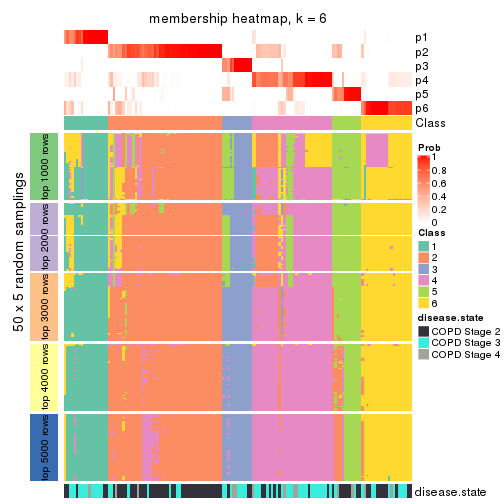</p>

</div>
</div>

As soon as we have had the classes for columns, we can look for signatures
which are significantly different between classes which can be candidate marks
for certain classes. Following are the heatmaps for signatures.


Signature heatmaps where rows are scaled:


<script>
$( function() {
	$( '#tabs-SD-mclust-get-signatures' ).tabs();
} );
</script>
<div id='tabs-SD-mclust-get-signatures'>
<ul>
<li><a href='#tab-SD-mclust-get-signatures-1'>k = 2</a></li>
<li><a href='#tab-SD-mclust-get-signatures-2'>k = 3</a></li>
<li><a href='#tab-SD-mclust-get-signatures-3'>k = 4</a></li>
<li><a href='#tab-SD-mclust-get-signatures-4'>k = 5</a></li>
<li><a href='#tab-SD-mclust-get-signatures-5'>k = 6</a></li>
</ul>
<div id='tab-SD-mclust-get-signatures-1'>
<pre><code class="r">get_signatures(res, k = 2)
</code></pre>

<p></p>

</div>
<div id='tab-SD-mclust-get-signatures-2'>
<pre><code class="r">get_signatures(res, k = 3)
</code></pre>

<p></p>

</div>
<div id='tab-SD-mclust-get-signatures-3'>
<pre><code class="r">get_signatures(res, k = 4)
</code></pre>

<p></p>

</div>
<div id='tab-SD-mclust-get-signatures-4'>
<pre><code class="r">get_signatures(res, k = 5)
</code></pre>

<p></p>

</div>
<div id='tab-SD-mclust-get-signatures-5'>
<pre><code class="r">get_signatures(res, k = 6)
</code></pre>

<p></p>

</div>
</div>


Signature heatmaps where rows are not scaled:


<script>
$( function() {
	$( '#tabs-SD-mclust-get-signatures-no-scale' ).tabs();
} );
</script>
<div id='tabs-SD-mclust-get-signatures-no-scale'>
<ul>
<li><a href='#tab-SD-mclust-get-signatures-no-scale-1'>k = 2</a></li>
<li><a href='#tab-SD-mclust-get-signatures-no-scale-2'>k = 3</a></li>
<li><a href='#tab-SD-mclust-get-signatures-no-scale-3'>k = 4</a></li>
<li><a href='#tab-SD-mclust-get-signatures-no-scale-4'>k = 5</a></li>
<li><a href='#tab-SD-mclust-get-signatures-no-scale-5'>k = 6</a></li>
</ul>
<div id='tab-SD-mclust-get-signatures-no-scale-1'>
<pre><code class="r">get_signatures(res, k = 2, scale_rows = FALSE)
</code></pre>

<p></p>

</div>
<div id='tab-SD-mclust-get-signatures-no-scale-2'>
<pre><code class="r">get_signatures(res, k = 3, scale_rows = FALSE)
</code></pre>

<p></p>

</div>
<div id='tab-SD-mclust-get-signatures-no-scale-3'>
<pre><code class="r">get_signatures(res, k = 4, scale_rows = FALSE)
</code></pre>

<p></p>

</div>
<div id='tab-SD-mclust-get-signatures-no-scale-4'>
<pre><code class="r">get_signatures(res, k = 5, scale_rows = FALSE)
</code></pre>

<p></p>

</div>
<div id='tab-SD-mclust-get-signatures-no-scale-5'>
<pre><code class="r">get_signatures(res, k = 6, scale_rows = FALSE)
</code></pre>

<p></p>

</div>
</div>


Compare the overlap of signatures from different k:

```r
compare_signatures(res)
```


`get_signature()` returns a data frame invisibly. TO get the list of signatures, the function
call should be assigned to a variable explicitly. In following code, if `plot` argument is set
to `FALSE`, no heatmap is plotted while only the differential analysis is performed.

```r
# code only for demonstration
tb = get_signature(res, k = ..., plot = FALSE)
```

An example of the output of `tb` is:

```
#>   which_row         fdr    mean_1    mean_2 scaled_mean_1 scaled_mean_2 km
#> 1        38 0.042760348  8.373488  9.131774    -0.5533452     0.5164555  1
#> 2        40 0.018707592  7.106213  8.469186    -0.6173731     0.5762149  1
#> 3        55 0.019134737 10.221463 11.207825    -0.6159697     0.5749050  1
#> 4        59 0.006059896  5.921854  7.869574    -0.6899429     0.6439467  1
#> 5        60 0.018055526  8.928898 10.211722    -0.6204761     0.5791110  1
#> 6        98 0.009384629 15.714769 14.887706     0.6635654    -0.6193277  2
...
```

The columns in `tb` are:

1. `which_row`: row indices corresponding to the input matrix.
2. `fdr`: FDR for the differential test. 
3. `mean_x`: The mean value in group x.
4. `scaled_mean_x`: The mean value in group x after rows are scaled.
5. `km`: Row groups if k-means clustering is applied to rows.


UMAP plot which shows how samples are separated.


<script>
$( function() {
	$( '#tabs-SD-mclust-dimension-reduction' ).tabs();
} );
</script>
<div id='tabs-SD-mclust-dimension-reduction'>
<ul>
<li><a href='#tab-SD-mclust-dimension-reduction-1'>k = 2</a></li>
<li><a href='#tab-SD-mclust-dimension-reduction-2'>k = 3</a></li>
<li><a href='#tab-SD-mclust-dimension-reduction-3'>k = 4</a></li>
<li><a href='#tab-SD-mclust-dimension-reduction-4'>k = 5</a></li>
<li><a href='#tab-SD-mclust-dimension-reduction-5'>k = 6</a></li>
</ul>
<div id='tab-SD-mclust-dimension-reduction-1'>
<pre><code class="r">dimension_reduction(res, k = 2, method = &quot;UMAP&quot;)
</code></pre>

<p></p>

</div>
<div id='tab-SD-mclust-dimension-reduction-2'>
<pre><code class="r">dimension_reduction(res, k = 3, method = &quot;UMAP&quot;)
</code></pre>

<p></p>

</div>
<div id='tab-SD-mclust-dimension-reduction-3'>
<pre><code class="r">dimension_reduction(res, k = 4, method = &quot;UMAP&quot;)
</code></pre>

<p></p>

</div>
<div id='tab-SD-mclust-dimension-reduction-4'>
<pre><code class="r">dimension_reduction(res, k = 5, method = &quot;UMAP&quot;)
</code></pre>

<p></p>

</div>
<div id='tab-SD-mclust-dimension-reduction-5'>
<pre><code class="r">dimension_reduction(res, k = 6, method = &quot;UMAP&quot;)
</code></pre>

<p></p>

</div>
</div>


Following heatmap shows how subgroups are split when increasing `k`:

```r
collect_classes(res)
```

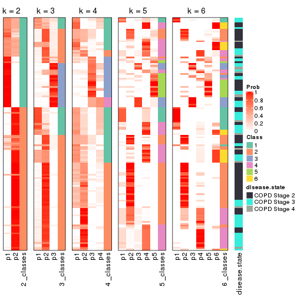


Test correlation between subgroups and known annotations. If the known
annotation is numeric, one-way ANOVA test is applied, and if the known
annotation is discrete, chi-squared contingency table test is applied.

```r
test_to_known_factors(res)
```

```
#>             n disease.state(p) k
#> SD:mclust 121         4.87e-01 2
#> SD:mclust 119         1.23e-01 3
#> SD:mclust  67         6.17e-02 4
#> SD:mclust 132         5.68e-04 5
#> SD:mclust 121         3.29e-05 6
```


If matrix rows can be associated to genes, consider to use `GO_Enrichment(res,
...)` to perform function enrichment for the signature genes.


 

---------------------------------------------------


### SD:NMF


The object with results only for a single top-value method and a single partition method 
can be extracted as:

```r
res = res_list["SD", "NMF"]
# you can also extract it by
# res = res_list["SD:NMF"]
```

A summary of `res` and all the functions that can be applied to it:

```r
res
```

```
#> A 'ConsensusPartition' object with k = 2, 3, 4, 5, 6.
#>   On a matrix with 51776 rows and 143 columns.
#>   Top rows (1000, 2000, 3000, 4000, 5000) are extracted by 'SD' method.
#>   Subgroups are detected by 'NMF' method.
#>   Performed in total 1250 partitions by row resampling.
#>   Best k for subgroups seems to be 3.
#> 
#> Following methods can be applied to this 'ConsensusPartition' object:
#>  [1] "cola_report"             "collect_classes"         "collect_plots"          
#>  [4] "collect_stats"           "colnames"                "compare_signatures"     
#>  [7] "consensus_heatmap"       "dimension_reduction"     "functional_enrichment"  
#> [10] "get_anno_col"            "get_anno"                "get_classes"            
#> [13] "get_consensus"           "get_matrix"              "get_membership"         
#> [16] "get_param"               "get_signatures"          "get_stats"              
#> [19] "is_best_k"               "is_stable_k"             "membership_heatmap"     
#> [22] "ncol"                    "nrow"                    "plot_ecdf"              
#> [25] "rownames"                "select_partition_number" "show"                   
#> [28] "suggest_best_k"          "test_to_known_factors"
```

`collect_plots()` function collects all the plots made from `res` for all `k` (number of partitions)
into one single page to provide an easy and fast comparison between different `k`.

```r
collect_plots(res)
```


The plots are:

- The first row: a plot of the ECDF (Empirical cumulative distribution
  function) curves of the consensus matrix for each `k` and the heatmap of
  predicted classes for each `k`.
- The second row: heatmaps of the consensus matrix for each `k`.
- The third row: heatmaps of the membership matrix for each `k`.
- The fouth row: heatmaps of the signatures for each `k`.

All the plots in panels can be made by individual functions and they are
plotted later in this section.

`select_partition_number()` produces several plots showing different
statistics for choosing "optimized" `k`. There are following statistics:

- ECDF curves of the consensus matrix for each `k`;
- 1-PAC. [The PAC
  score](https://en.wikipedia.org/wiki/Consensus_clustering#Over-interpretation_potential_of_consensus_clustering)
  measures the proportion of the ambiguous subgrouping.
- Mean silhouette score.
- Concordance. The mean probability of fiting the consensus class ids in all
  partitions.
- Area increased. Denote $A_k$ as the area under the ECDF curve for current
  `k`, the area increased is defined as $A_k - A_{k-1}$.
- Rand index. The percent of pairs of samples that are both in a same cluster
  or both are not in a same cluster in the partition of k and k-1.
- Jaccard index. The ratio of pairs of samples are both in a same cluster in
  the partition of k and k-1 and the pairs of samples are both in a same
  cluster in the partition k or k-1.

The detailed explanations of these statistics can be found in [the cola
vignette](http://bioconductor.org/packages/devel/bioc/vignettes/cola/inst/doc/cola.html#toc_13).

Generally speaking, lower PAC score, higher mean silhouette score or higher
concordance corresponds to better partition. Rand index and Jaccard index
measure how similar the current partition is compared to partition with `k-1`.
If they are too similar, we won't accept `k` is better than `k-1`.

```r
select_partition_number(res)
```


The numeric values for all these statistics can be obtained by `get_stats()`.

```r
get_stats(res)
```

```
#>   k 1-PAC mean_silhouette concordance area_increased  Rand Jaccard
#> 2 2 0.501           0.822       0.902         0.4729 0.514   0.514
#> 3 3 0.790           0.846       0.938         0.3273 0.723   0.524
#> 4 4 0.707           0.772       0.890         0.1615 0.791   0.510
#> 5 5 0.630           0.626       0.812         0.0705 0.839   0.498
#> 6 6 0.687           0.608       0.788         0.0495 0.929   0.696
```

`suggest_best_k()` suggests the best $k$ based on these statistics. The rules are as follows:

- All $k$ with Jaccard index larger than 0.95 are removed because the increase of
  the partition number does not provides enough extra information. If all $k$ are removed,
  the best $k$ is assigned by `NA`.
- For $k$ with 1-PAC larger than 0.9, the maximal $k$ is taken as the "best k". Other $k$ is called "optional k".
- If it does not fit the second rule. The $k$ with the highest vote of highest
  1-PAC, mean silhouette and concordance is taken as the "best k".

```r
suggest_best_k(res)
```

```
#> [1] 3
```


Following shows the table of the partitions (You need to click the **show/hide
code output** link to see it). The membership matrix (columns with name `p*`)
is inferred by
[`clue::cl_consensus()`](https://www.rdocumentation.org/link/cl_consensus?package=clue)
function with the `SE` method. Basically the value in the membership matrix
represents the probability to belong to a certain group. The finall class
label for an item is determined with the group with highest probability it
belongs to.

In `get_classes()` function, the entropy is calculated from the membership
matrix and the silhouette score is calculated from the consensus matrix.


<script>
$( function() {
	$( '#tabs-SD-NMF-get-classes' ).tabs();
} );
</script>
<div id='tabs-SD-NMF-get-classes'>
<ul>
<li><a href='#tab-SD-NMF-get-classes-1'>k = 2</a></li>
<li><a href='#tab-SD-NMF-get-classes-2'>k = 3</a></li>
<li><a href='#tab-SD-NMF-get-classes-3'>k = 4</a></li>
<li><a href='#tab-SD-NMF-get-classes-4'>k = 5</a></li>
<li><a href='#tab-SD-NMF-get-classes-5'>k = 6</a></li>
</ul>

<div id='tab-SD-NMF-get-classes-1'>
<p><a id='tab-SD-NMF-get-classes-1-a' style='color:#0366d6' href='#'>show/hide code output</a></p>
<pre><code class="r">cbind(get_classes(res, k = 2), get_membership(res, k = 2))
</code></pre>

<pre><code>#&gt;           class entropy silhouette    p1    p2
#&gt; GSM550785     1  0.7219     0.8454 0.800 0.200
#&gt; GSM550786     2  0.9795     0.4182 0.416 0.584
#&gt; GSM550788     2  0.0000     0.9206 0.000 1.000
#&gt; GSM550789     2  0.0000     0.9206 0.000 1.000
#&gt; GSM550790     1  0.7219     0.8454 0.800 0.200
#&gt; GSM550791     1  0.7299     0.8425 0.796 0.204
#&gt; GSM550792     2  0.0376     0.9178 0.004 0.996
#&gt; GSM550796     2  0.0000     0.9206 0.000 1.000
#&gt; GSM550797     2  0.0000     0.9206 0.000 1.000
#&gt; GSM550799     2  0.7219     0.7387 0.200 0.800
#&gt; GSM550800     2  0.0000     0.9206 0.000 1.000
#&gt; GSM550801     2  0.0000     0.9206 0.000 1.000
#&gt; GSM550804     2  0.0000     0.9206 0.000 1.000
#&gt; GSM550806     1  0.0000     0.8262 1.000 0.000
#&gt; GSM550807     2  0.0000     0.9206 0.000 1.000
#&gt; GSM550808     2  0.0000     0.9206 0.000 1.000
#&gt; GSM550809     1  0.0000     0.8262 1.000 0.000
#&gt; GSM550810     2  0.0000     0.9206 0.000 1.000
#&gt; GSM550811     1  0.7299     0.8425 0.796 0.204
#&gt; GSM550813     2  0.0000     0.9206 0.000 1.000
#&gt; GSM550814     2  0.0000     0.9206 0.000 1.000
#&gt; GSM550815     2  0.0000     0.9206 0.000 1.000
#&gt; GSM550816     2  0.0000     0.9206 0.000 1.000
#&gt; GSM550817     2  0.8813     0.6305 0.300 0.700
#&gt; GSM550818     2  0.9710     0.4523 0.400 0.600
#&gt; GSM550819     2  0.0000     0.9206 0.000 1.000
#&gt; GSM550820     1  0.0000     0.8262 1.000 0.000
#&gt; GSM550821     2  0.0376     0.9180 0.004 0.996
#&gt; GSM550822     2  0.0000     0.9206 0.000 1.000
#&gt; GSM550826     1  0.0000     0.8262 1.000 0.000
#&gt; GSM550832     2  0.0000     0.9206 0.000 1.000
#&gt; GSM550833     2  0.0000     0.9206 0.000 1.000
#&gt; GSM550835     2  0.7056     0.7473 0.192 0.808
#&gt; GSM550836     1  0.0000     0.8262 1.000 0.000
#&gt; GSM550837     2  0.0000     0.9206 0.000 1.000
#&gt; GSM550838     1  0.0000     0.8262 1.000 0.000
#&gt; GSM550841     2  0.7219     0.7387 0.200 0.800
#&gt; GSM550842     2  0.0000     0.9206 0.000 1.000
#&gt; GSM550846     2  0.0000     0.9206 0.000 1.000
#&gt; GSM550849     1  0.8267     0.7826 0.740 0.260
#&gt; GSM550850     1  0.7219     0.8454 0.800 0.200
#&gt; GSM550851     2  0.0672     0.9153 0.008 0.992
#&gt; GSM550852     2  0.0000     0.9206 0.000 1.000
#&gt; GSM550853     2  0.0000     0.9206 0.000 1.000
#&gt; GSM550855     2  0.0000     0.9206 0.000 1.000
#&gt; GSM550856     2  0.0000     0.9206 0.000 1.000
#&gt; GSM550861     2  0.0000     0.9206 0.000 1.000
#&gt; GSM550863     2  0.0000     0.9206 0.000 1.000
#&gt; GSM550864     2  0.0000     0.9206 0.000 1.000
#&gt; GSM550866     2  0.0000     0.9206 0.000 1.000
#&gt; GSM550867     1  0.7219     0.8454 0.800 0.200
#&gt; GSM550885     1  0.7219     0.8454 0.800 0.200
#&gt; GSM550886     2  0.7299     0.7357 0.204 0.796
#&gt; GSM550887     2  0.0000     0.9206 0.000 1.000
#&gt; GSM550889     2  0.7219     0.6619 0.200 0.800
#&gt; GSM550894     2  0.0000     0.9206 0.000 1.000
#&gt; GSM550897     1  0.7299     0.8425 0.796 0.204
#&gt; GSM550903     2  0.0000     0.9206 0.000 1.000
#&gt; GSM550905     2  0.0000     0.9206 0.000 1.000
#&gt; GSM550906     2  0.0000     0.9206 0.000 1.000
#&gt; GSM550907     1  0.9866     0.0566 0.568 0.432
#&gt; GSM550909     2  0.7056     0.7473 0.192 0.808
#&gt; GSM550911     1  0.9998    -0.1722 0.508 0.492
#&gt; GSM550913     2  0.0000     0.9206 0.000 1.000
#&gt; GSM550915     2  0.4939     0.8106 0.108 0.892
#&gt; GSM550917     2  0.0000     0.9206 0.000 1.000
#&gt; GSM550919     2  0.0000     0.9206 0.000 1.000
#&gt; GSM550921     1  0.0000     0.8262 1.000 0.000
#&gt; GSM550924     2  0.9795     0.3697 0.416 0.584
#&gt; GSM550926     2  0.0000     0.9206 0.000 1.000
#&gt; GSM550927     2  0.0000     0.9206 0.000 1.000
#&gt; GSM550787     1  0.7299     0.8427 0.796 0.204
#&gt; GSM550793     1  0.0000     0.8262 1.000 0.000
#&gt; GSM550794     2  0.1184     0.9088 0.016 0.984
#&gt; GSM550795     1  0.7219     0.8454 0.800 0.200
#&gt; GSM550798     1  0.0000     0.8262 1.000 0.000
#&gt; GSM550803     1  0.0000     0.8262 1.000 0.000
#&gt; GSM550805     1  0.7299     0.8425 0.796 0.204
#&gt; GSM550823     2  0.0000     0.9206 0.000 1.000
#&gt; GSM550824     1  0.7219     0.8454 0.800 0.200
#&gt; GSM550825     1  0.0000     0.8262 1.000 0.000
#&gt; GSM550827     2  0.0000     0.9206 0.000 1.000
#&gt; GSM550828     1  0.7219     0.8454 0.800 0.200
#&gt; GSM550829     1  0.0000     0.8262 1.000 0.000
#&gt; GSM550830     2  0.4431     0.8299 0.092 0.908
#&gt; GSM550834     1  0.7299     0.8425 0.796 0.204
#&gt; GSM550839     2  0.8144     0.6911 0.252 0.748
#&gt; GSM550840     1  0.7219     0.8454 0.800 0.200
#&gt; GSM550843     2  0.9896     0.3598 0.440 0.560
#&gt; GSM550844     1  0.7219     0.8454 0.800 0.200
#&gt; GSM550845     2  0.0000     0.9206 0.000 1.000
#&gt; GSM550848     2  0.0000     0.9206 0.000 1.000
#&gt; GSM550854     1  0.7219     0.8454 0.800 0.200
#&gt; GSM550857     1  0.0000     0.8262 1.000 0.000
#&gt; GSM550858     1  0.7219     0.8454 0.800 0.200
#&gt; GSM550859     1  0.7219     0.8454 0.800 0.200
#&gt; GSM550862     1  0.7219     0.8454 0.800 0.200
#&gt; GSM550865     2  0.6623     0.7145 0.172 0.828
#&gt; GSM550868     2  0.5294     0.7943 0.120 0.880
#&gt; GSM550869     1  0.7528     0.8309 0.784 0.216
#&gt; GSM550870     2  0.0000     0.9206 0.000 1.000
#&gt; GSM550871     2  0.9815     0.4089 0.420 0.580
#&gt; GSM550872     2  0.4431     0.8309 0.092 0.908
#&gt; GSM550873     2  0.0000     0.9206 0.000 1.000
#&gt; GSM550874     2  0.0000     0.9206 0.000 1.000
#&gt; GSM550876     2  0.8813     0.6308 0.300 0.700
#&gt; GSM550877     2  0.0000     0.9206 0.000 1.000
#&gt; GSM550878     1  0.8813     0.4505 0.700 0.300
#&gt; GSM550879     1  0.7219     0.8454 0.800 0.200
#&gt; GSM550882     1  0.0000     0.8262 1.000 0.000
#&gt; GSM550888     1  0.0000     0.8262 1.000 0.000
#&gt; GSM550890     2  0.0000     0.9206 0.000 1.000
#&gt; GSM550891     1  0.0000     0.8262 1.000 0.000
#&gt; GSM550892     1  0.7219     0.8454 0.800 0.200
#&gt; GSM550893     2  0.0000     0.9206 0.000 1.000
#&gt; GSM550895     2  0.0000     0.9206 0.000 1.000
#&gt; GSM550896     2  0.0000     0.9206 0.000 1.000
#&gt; GSM550898     1  0.7219     0.8454 0.800 0.200
#&gt; GSM550899     2  0.0000     0.9206 0.000 1.000
#&gt; GSM550900     2  0.0376     0.9178 0.004 0.996
#&gt; GSM550901     1  0.9635     0.5690 0.612 0.388
#&gt; GSM550902     1  0.0000     0.8262 1.000 0.000
#&gt; GSM550904     1  0.0000     0.8262 1.000 0.000
#&gt; GSM550908     1  0.0000     0.8262 1.000 0.000
#&gt; GSM550912     2  0.0000     0.9206 0.000 1.000
#&gt; GSM550914     2  0.0000     0.9206 0.000 1.000
#&gt; GSM550918     2  0.0000     0.9206 0.000 1.000
#&gt; GSM550922     2  0.7219     0.7387 0.200 0.800
#&gt; GSM550923     1  0.0000     0.8262 1.000 0.000
#&gt; GSM550925     1  0.8763     0.7301 0.704 0.296
#&gt; GSM550802     2  0.0000     0.9206 0.000 1.000
#&gt; GSM550812     2  0.0000     0.9206 0.000 1.000
#&gt; GSM550831     1  0.7219     0.8454 0.800 0.200
#&gt; GSM550847     1  0.7219     0.8454 0.800 0.200
#&gt; GSM550860     1  0.0000     0.8262 1.000 0.000
#&gt; GSM550875     1  0.7219     0.8454 0.800 0.200
#&gt; GSM550880     1  0.9933     0.4236 0.548 0.452
#&gt; GSM550881     1  0.0000     0.8262 1.000 0.000
#&gt; GSM550883     1  0.0000     0.8262 1.000 0.000
#&gt; GSM550884     2  0.1843     0.9029 0.028 0.972
#&gt; GSM550910     2  0.8327     0.6774 0.264 0.736
#&gt; GSM550916     1  0.7219     0.8454 0.800 0.200
#&gt; GSM550920     2  0.9909     0.3492 0.444 0.556
</code></pre>

<script>
$('#tab-SD-NMF-get-classes-1-a').parent().next().next().hide();
$('#tab-SD-NMF-get-classes-1-a').click(function(){
  $('#tab-SD-NMF-get-classes-1-a').parent().next().next().toggle();
  return(false);
});
</script>
</div>

<div id='tab-SD-NMF-get-classes-2'>
<p><a id='tab-SD-NMF-get-classes-2-a' style='color:#0366d6' href='#'>show/hide code output</a></p>
<pre><code class="r">cbind(get_classes(res, k = 3), get_membership(res, k = 3))
</code></pre>

<pre><code>#&gt;           class entropy silhouette    p1    p2    p3
#&gt; GSM550785     1  0.0000     0.9219 1.000 0.000 0.000
#&gt; GSM550786     3  0.5650     0.5280 0.000 0.312 0.688
#&gt; GSM550788     2  0.0000     0.9359 0.000 1.000 0.000
#&gt; GSM550789     2  0.0000     0.9359 0.000 1.000 0.000
#&gt; GSM550790     1  0.0000     0.9219 1.000 0.000 0.000
#&gt; GSM550791     1  0.0000     0.9219 1.000 0.000 0.000
#&gt; GSM550792     2  0.0237     0.9327 0.004 0.996 0.000
#&gt; GSM550796     2  0.0000     0.9359 0.000 1.000 0.000
#&gt; GSM550797     2  0.0000     0.9359 0.000 1.000 0.000
#&gt; GSM550799     3  0.1529     0.8848 0.000 0.040 0.960
#&gt; GSM550800     2  0.0000     0.9359 0.000 1.000 0.000
#&gt; GSM550801     2  0.0000     0.9359 0.000 1.000 0.000
#&gt; GSM550804     2  0.0000     0.9359 0.000 1.000 0.000
#&gt; GSM550806     3  0.0000     0.9079 0.000 0.000 1.000
#&gt; GSM550807     2  0.0000     0.9359 0.000 1.000 0.000
#&gt; GSM550808     2  0.0000     0.9359 0.000 1.000 0.000
#&gt; GSM550809     1  0.3340     0.8197 0.880 0.000 0.120
#&gt; GSM550810     2  0.0000     0.9359 0.000 1.000 0.000
#&gt; GSM550811     1  0.7338     0.5455 0.652 0.288 0.060
#&gt; GSM550813     2  0.0000     0.9359 0.000 1.000 0.000
#&gt; GSM550814     2  0.0000     0.9359 0.000 1.000 0.000
#&gt; GSM550815     2  0.0000     0.9359 0.000 1.000 0.000
#&gt; GSM550816     2  0.0000     0.9359 0.000 1.000 0.000
#&gt; GSM550817     3  0.0000     0.9079 0.000 0.000 1.000
#&gt; GSM550818     3  0.0000     0.9079 0.000 0.000 1.000
#&gt; GSM550819     2  0.0000     0.9359 0.000 1.000 0.000
#&gt; GSM550820     1  0.0000     0.9219 1.000 0.000 0.000
#&gt; GSM550821     2  0.0237     0.9330 0.000 0.996 0.004
#&gt; GSM550822     2  0.0000     0.9359 0.000 1.000 0.000
#&gt; GSM550826     1  0.5138     0.6515 0.748 0.000 0.252
#&gt; GSM550832     2  0.0000     0.9359 0.000 1.000 0.000
#&gt; GSM550833     2  0.0000     0.9359 0.000 1.000 0.000
#&gt; GSM550835     2  0.3686     0.8023 0.000 0.860 0.140
#&gt; GSM550836     3  0.0000     0.9079 0.000 0.000 1.000
#&gt; GSM550837     2  0.0000     0.9359 0.000 1.000 0.000
#&gt; GSM550838     1  0.4654     0.7170 0.792 0.000 0.208
#&gt; GSM550841     3  0.0237     0.9059 0.000 0.004 0.996
#&gt; GSM550842     2  0.0000     0.9359 0.000 1.000 0.000
#&gt; GSM550846     2  0.0000     0.9359 0.000 1.000 0.000
#&gt; GSM550849     2  0.6518    -0.0257 0.484 0.512 0.004
#&gt; GSM550850     1  0.0000     0.9219 1.000 0.000 0.000
#&gt; GSM550851     2  0.0000     0.9359 0.000 1.000 0.000
#&gt; GSM550852     2  0.0000     0.9359 0.000 1.000 0.000
#&gt; GSM550853     2  0.0000     0.9359 0.000 1.000 0.000
#&gt; GSM550855     2  0.0000     0.9359 0.000 1.000 0.000
#&gt; GSM550856     2  0.0000     0.9359 0.000 1.000 0.000
#&gt; GSM550861     2  0.0000     0.9359 0.000 1.000 0.000
#&gt; GSM550863     1  0.1753     0.8813 0.952 0.048 0.000
#&gt; GSM550864     2  0.0000     0.9359 0.000 1.000 0.000
#&gt; GSM550866     2  0.0000     0.9359 0.000 1.000 0.000
#&gt; GSM550867     1  0.0000     0.9219 1.000 0.000 0.000
#&gt; GSM550885     1  0.0000     0.9219 1.000 0.000 0.000
#&gt; GSM550886     2  0.5859     0.4656 0.000 0.656 0.344
#&gt; GSM550887     2  0.0000     0.9359 0.000 1.000 0.000
#&gt; GSM550889     1  0.6126     0.3902 0.600 0.400 0.000
#&gt; GSM550894     2  0.0000     0.9359 0.000 1.000 0.000
#&gt; GSM550897     1  0.0000     0.9219 1.000 0.000 0.000
#&gt; GSM550903     2  0.0000     0.9359 0.000 1.000 0.000
#&gt; GSM550905     2  0.0000     0.9359 0.000 1.000 0.000
#&gt; GSM550906     2  0.0000     0.9359 0.000 1.000 0.000
#&gt; GSM550907     3  0.0000     0.9079 0.000 0.000 1.000
#&gt; GSM550909     2  0.3752     0.7972 0.000 0.856 0.144
#&gt; GSM550911     3  0.0000     0.9079 0.000 0.000 1.000
#&gt; GSM550913     2  0.0000     0.9359 0.000 1.000 0.000
#&gt; GSM550915     1  0.0424     0.9165 0.992 0.008 0.000
#&gt; GSM550917     2  0.0000     0.9359 0.000 1.000 0.000
#&gt; GSM550919     1  0.4654     0.7109 0.792 0.208 0.000
#&gt; GSM550921     3  0.0000     0.9079 0.000 0.000 1.000
#&gt; GSM550924     2  0.4605     0.7172 0.000 0.796 0.204
#&gt; GSM550926     2  0.0000     0.9359 0.000 1.000 0.000
#&gt; GSM550927     2  0.0000     0.9359 0.000 1.000 0.000
#&gt; GSM550787     1  0.7108     0.6497 0.716 0.184 0.100
#&gt; GSM550793     3  0.6309    -0.0753 0.500 0.000 0.500
#&gt; GSM550794     2  0.5216     0.6544 0.260 0.740 0.000
#&gt; GSM550795     1  0.0000     0.9219 1.000 0.000 0.000
#&gt; GSM550798     1  0.0000     0.9219 1.000 0.000 0.000
#&gt; GSM550803     1  0.0000     0.9219 1.000 0.000 0.000
#&gt; GSM550805     1  0.0592     0.9138 0.988 0.012 0.000
#&gt; GSM550823     2  0.0424     0.9293 0.008 0.992 0.000
#&gt; GSM550824     1  0.0000     0.9219 1.000 0.000 0.000
#&gt; GSM550825     1  0.5948     0.4454 0.640 0.000 0.360
#&gt; GSM550827     1  0.1643     0.8856 0.956 0.044 0.000
#&gt; GSM550828     1  0.0000     0.9219 1.000 0.000 0.000
#&gt; GSM550829     1  0.4399     0.7419 0.812 0.000 0.188
#&gt; GSM550830     1  0.5988     0.4666 0.632 0.368 0.000
#&gt; GSM550834     1  0.0000     0.9219 1.000 0.000 0.000
#&gt; GSM550839     2  0.5706     0.5179 0.000 0.680 0.320
#&gt; GSM550840     1  0.0000     0.9219 1.000 0.000 0.000
#&gt; GSM550843     3  0.0000     0.9079 0.000 0.000 1.000
#&gt; GSM550844     1  0.0000     0.9219 1.000 0.000 0.000
#&gt; GSM550845     2  0.0000     0.9359 0.000 1.000 0.000
#&gt; GSM550848     2  0.6204     0.3019 0.424 0.576 0.000
#&gt; GSM550854     1  0.0000     0.9219 1.000 0.000 0.000
#&gt; GSM550857     3  0.0000     0.9079 0.000 0.000 1.000
#&gt; GSM550858     1  0.0000     0.9219 1.000 0.000 0.000
#&gt; GSM550859     1  0.0000     0.9219 1.000 0.000 0.000
#&gt; GSM550862     1  0.0000     0.9219 1.000 0.000 0.000
#&gt; GSM550865     1  0.0000     0.9219 1.000 0.000 0.000
#&gt; GSM550868     1  0.0000     0.9219 1.000 0.000 0.000
#&gt; GSM550869     2  0.8834     0.3164 0.316 0.544 0.140
#&gt; GSM550870     2  0.0000     0.9359 0.000 1.000 0.000
#&gt; GSM550871     2  0.5591     0.5507 0.000 0.696 0.304
#&gt; GSM550872     1  0.0000     0.9219 1.000 0.000 0.000
#&gt; GSM550873     2  0.0000     0.9359 0.000 1.000 0.000
#&gt; GSM550874     2  0.0000     0.9359 0.000 1.000 0.000
#&gt; GSM550876     3  0.6295     0.0821 0.000 0.472 0.528
#&gt; GSM550877     2  0.0000     0.9359 0.000 1.000 0.000
#&gt; GSM550878     3  0.0000     0.9079 0.000 0.000 1.000
#&gt; GSM550879     1  0.0000     0.9219 1.000 0.000 0.000
#&gt; GSM550882     3  0.0000     0.9079 0.000 0.000 1.000
#&gt; GSM550888     3  0.0000     0.9079 0.000 0.000 1.000
#&gt; GSM550890     2  0.5905     0.4841 0.352 0.648 0.000
#&gt; GSM550891     3  0.0000     0.9079 0.000 0.000 1.000
#&gt; GSM550892     1  0.0000     0.9219 1.000 0.000 0.000
#&gt; GSM550893     2  0.0000     0.9359 0.000 1.000 0.000
#&gt; GSM550895     2  0.0000     0.9359 0.000 1.000 0.000
#&gt; GSM550896     2  0.0000     0.9359 0.000 1.000 0.000
#&gt; GSM550898     1  0.0000     0.9219 1.000 0.000 0.000
#&gt; GSM550899     2  0.0000     0.9359 0.000 1.000 0.000
#&gt; GSM550900     1  0.4887     0.6593 0.772 0.228 0.000
#&gt; GSM550901     1  0.0000     0.9219 1.000 0.000 0.000
#&gt; GSM550902     1  0.4504     0.7313 0.804 0.000 0.196
#&gt; GSM550904     1  0.0237     0.9194 0.996 0.000 0.004
#&gt; GSM550908     3  0.0000     0.9079 0.000 0.000 1.000
#&gt; GSM550912     2  0.0000     0.9359 0.000 1.000 0.000
#&gt; GSM550914     2  0.3752     0.7973 0.144 0.856 0.000
#&gt; GSM550918     2  0.0000     0.9359 0.000 1.000 0.000
#&gt; GSM550922     3  0.4062     0.7692 0.000 0.164 0.836
#&gt; GSM550923     1  0.0000     0.9219 1.000 0.000 0.000
#&gt; GSM550925     1  0.0000     0.9219 1.000 0.000 0.000
#&gt; GSM550802     2  0.0000     0.9359 0.000 1.000 0.000
#&gt; GSM550812     2  0.0237     0.9329 0.000 0.996 0.004
#&gt; GSM550831     1  0.0000     0.9219 1.000 0.000 0.000
#&gt; GSM550847     1  0.0000     0.9219 1.000 0.000 0.000
#&gt; GSM550860     3  0.5465     0.5380 0.288 0.000 0.712
#&gt; GSM550875     1  0.0000     0.9219 1.000 0.000 0.000
#&gt; GSM550880     1  0.0000     0.9219 1.000 0.000 0.000
#&gt; GSM550881     3  0.0000     0.9079 0.000 0.000 1.000
#&gt; GSM550883     3  0.0000     0.9079 0.000 0.000 1.000
#&gt; GSM550884     2  0.3192     0.8328 0.000 0.888 0.112
#&gt; GSM550910     3  0.1753     0.8787 0.000 0.048 0.952
#&gt; GSM550916     1  0.0000     0.9219 1.000 0.000 0.000
#&gt; GSM550920     3  0.2796     0.8447 0.000 0.092 0.908
</code></pre>

<script>
$('#tab-SD-NMF-get-classes-2-a').parent().next().next().hide();
$('#tab-SD-NMF-get-classes-2-a').click(function(){
  $('#tab-SD-NMF-get-classes-2-a').parent().next().next().toggle();
  return(false);
});
</script>
</div>

<div id='tab-SD-NMF-get-classes-3'>
<p><a id='tab-SD-NMF-get-classes-3-a' style='color:#0366d6' href='#'>show/hide code output</a></p>
<pre><code class="r">cbind(get_classes(res, k = 4), get_membership(res, k = 4))
</code></pre>

<pre><code>#&gt;           class entropy silhouette    p1    p2    p3    p4
#&gt; GSM550785     1  0.0469     0.9059 0.988 0.000 0.000 0.012
#&gt; GSM550786     2  0.4295     0.6153 0.008 0.752 0.240 0.000
#&gt; GSM550788     4  0.2814     0.7986 0.000 0.132 0.000 0.868
#&gt; GSM550789     2  0.0469     0.8625 0.000 0.988 0.000 0.012
#&gt; GSM550790     1  0.0188     0.9069 0.996 0.000 0.000 0.004
#&gt; GSM550791     1  0.0657     0.9036 0.984 0.012 0.000 0.004
#&gt; GSM550792     2  0.2401     0.8052 0.092 0.904 0.000 0.004
#&gt; GSM550796     2  0.0707     0.8629 0.000 0.980 0.000 0.020
#&gt; GSM550797     2  0.0336     0.8619 0.000 0.992 0.000 0.008
#&gt; GSM550799     3  0.0524     0.8901 0.000 0.008 0.988 0.004
#&gt; GSM550800     4  0.2345     0.8151 0.000 0.100 0.000 0.900
#&gt; GSM550801     2  0.0817     0.8626 0.000 0.976 0.000 0.024
#&gt; GSM550804     2  0.0188     0.8581 0.004 0.996 0.000 0.000
#&gt; GSM550806     3  0.2647     0.7925 0.000 0.000 0.880 0.120
#&gt; GSM550807     2  0.1637     0.8530 0.000 0.940 0.000 0.060
#&gt; GSM550808     2  0.0188     0.8581 0.004 0.996 0.000 0.000
#&gt; GSM550809     1  0.0817     0.8958 0.976 0.024 0.000 0.000
#&gt; GSM550810     2  0.0592     0.8629 0.000 0.984 0.000 0.016
#&gt; GSM550811     1  0.4843     0.4291 0.604 0.396 0.000 0.000
#&gt; GSM550813     2  0.2408     0.8246 0.000 0.896 0.000 0.104
#&gt; GSM550814     2  0.4543     0.5272 0.000 0.676 0.000 0.324
#&gt; GSM550815     2  0.0592     0.8629 0.000 0.984 0.000 0.016
#&gt; GSM550816     2  0.0336     0.8567 0.008 0.992 0.000 0.000
#&gt; GSM550817     3  0.1474     0.8716 0.000 0.052 0.948 0.000
#&gt; GSM550818     3  0.1398     0.8779 0.004 0.040 0.956 0.000
#&gt; GSM550819     2  0.4985     0.2551 0.000 0.532 0.000 0.468
#&gt; GSM550820     1  0.0336     0.9033 0.992 0.008 0.000 0.000
#&gt; GSM550821     2  0.0376     0.8577 0.004 0.992 0.004 0.000
#&gt; GSM550822     2  0.0000     0.8595 0.000 1.000 0.000 0.000
#&gt; GSM550826     1  0.4406     0.7015 0.780 0.028 0.192 0.000
#&gt; GSM550832     2  0.0469     0.8625 0.000 0.988 0.000 0.012
#&gt; GSM550833     2  0.1867     0.8472 0.000 0.928 0.000 0.072
#&gt; GSM550835     2  0.6380     0.1678 0.000 0.500 0.436 0.064
#&gt; GSM550836     3  0.0000     0.8948 0.000 0.000 1.000 0.000
#&gt; GSM550837     2  0.1211     0.8605 0.000 0.960 0.000 0.040
#&gt; GSM550838     1  0.3708     0.7655 0.832 0.020 0.148 0.000
#&gt; GSM550841     3  0.4331     0.6033 0.000 0.288 0.712 0.000
#&gt; GSM550842     2  0.0469     0.8627 0.000 0.988 0.000 0.012
#&gt; GSM550846     2  0.0592     0.8540 0.016 0.984 0.000 0.000
#&gt; GSM550849     1  0.4500     0.5801 0.684 0.316 0.000 0.000
#&gt; GSM550850     1  0.0188     0.9069 0.996 0.000 0.000 0.004
#&gt; GSM550851     2  0.0336     0.8619 0.000 0.992 0.000 0.008
#&gt; GSM550852     2  0.0524     0.8615 0.004 0.988 0.000 0.008
#&gt; GSM550853     2  0.4697     0.4848 0.000 0.644 0.000 0.356
#&gt; GSM550855     2  0.4661     0.4900 0.000 0.652 0.000 0.348
#&gt; GSM550856     2  0.4804     0.4113 0.000 0.616 0.000 0.384
#&gt; GSM550861     2  0.1022     0.8613 0.000 0.968 0.000 0.032
#&gt; GSM550863     4  0.1545     0.8391 0.040 0.008 0.000 0.952
#&gt; GSM550864     2  0.0707     0.8630 0.000 0.980 0.000 0.020
#&gt; GSM550866     4  0.3726     0.7199 0.000 0.212 0.000 0.788
#&gt; GSM550867     1  0.0188     0.9069 0.996 0.000 0.000 0.004
#&gt; GSM550885     1  0.0336     0.9065 0.992 0.000 0.000 0.008
#&gt; GSM550886     3  0.6125     0.0529 0.000 0.436 0.516 0.048
#&gt; GSM550887     2  0.1716     0.8517 0.000 0.936 0.000 0.064
#&gt; GSM550889     4  0.0188     0.8445 0.000 0.004 0.000 0.996
#&gt; GSM550894     2  0.1792     0.8493 0.000 0.932 0.000 0.068
#&gt; GSM550897     4  0.0921     0.8378 0.028 0.000 0.000 0.972
#&gt; GSM550903     2  0.0336     0.8619 0.000 0.992 0.000 0.008
#&gt; GSM550905     2  0.0188     0.8581 0.004 0.996 0.000 0.000
#&gt; GSM550906     2  0.2868     0.7964 0.000 0.864 0.000 0.136
#&gt; GSM550907     3  0.0188     0.8941 0.000 0.004 0.996 0.000
#&gt; GSM550909     2  0.1576     0.8348 0.004 0.948 0.048 0.000
#&gt; GSM550911     3  0.0188     0.8941 0.000 0.004 0.996 0.000
#&gt; GSM550913     2  0.0707     0.8630 0.000 0.980 0.000 0.020
#&gt; GSM550915     1  0.3764     0.7218 0.784 0.216 0.000 0.000
#&gt; GSM550917     2  0.1211     0.8597 0.000 0.960 0.000 0.040
#&gt; GSM550919     1  0.4250     0.6441 0.724 0.276 0.000 0.000
#&gt; GSM550921     3  0.0000     0.8948 0.000 0.000 1.000 0.000
#&gt; GSM550924     2  0.3427     0.7652 0.028 0.860 0.112 0.000
#&gt; GSM550926     4  0.4193     0.6455 0.000 0.268 0.000 0.732
#&gt; GSM550927     2  0.1557     0.8561 0.000 0.944 0.000 0.056
#&gt; GSM550787     1  0.9671     0.0594 0.380 0.200 0.180 0.240
#&gt; GSM550793     3  0.3877     0.7819 0.048 0.000 0.840 0.112
#&gt; GSM550794     2  0.4800     0.5002 0.340 0.656 0.000 0.004
#&gt; GSM550795     1  0.1389     0.8846 0.952 0.000 0.000 0.048
#&gt; GSM550798     1  0.0336     0.9065 0.992 0.000 0.000 0.008
#&gt; GSM550803     1  0.0469     0.9059 0.988 0.000 0.000 0.012
#&gt; GSM550805     4  0.7143     0.6412 0.228 0.072 0.064 0.636
#&gt; GSM550823     4  0.0336     0.8446 0.000 0.008 0.000 0.992
#&gt; GSM550824     1  0.0188     0.9069 0.996 0.000 0.000 0.004
#&gt; GSM550825     3  0.3653     0.7844 0.128 0.000 0.844 0.028
#&gt; GSM550827     1  0.2944     0.8042 0.868 0.128 0.000 0.004
#&gt; GSM550828     1  0.0188     0.9069 0.996 0.000 0.000 0.004
#&gt; GSM550829     1  0.1489     0.8818 0.952 0.000 0.044 0.004
#&gt; GSM550830     4  0.0188     0.8449 0.000 0.004 0.000 0.996
#&gt; GSM550834     1  0.0000     0.9062 1.000 0.000 0.000 0.000
#&gt; GSM550839     4  0.5256     0.6229 0.000 0.040 0.260 0.700
#&gt; GSM550840     4  0.2469     0.7993 0.108 0.000 0.000 0.892
#&gt; GSM550843     3  0.0000     0.8948 0.000 0.000 1.000 0.000
#&gt; GSM550844     1  0.0336     0.9065 0.992 0.000 0.000 0.008
#&gt; GSM550845     4  0.4222     0.6315 0.000 0.272 0.000 0.728
#&gt; GSM550848     2  0.4981     0.0852 0.464 0.536 0.000 0.000
#&gt; GSM550854     1  0.0592     0.9046 0.984 0.000 0.000 0.016
#&gt; GSM550857     3  0.1637     0.8592 0.060 0.000 0.940 0.000
#&gt; GSM550858     1  0.0469     0.9059 0.988 0.000 0.000 0.012
#&gt; GSM550859     1  0.0469     0.9059 0.988 0.000 0.000 0.012
#&gt; GSM550862     4  0.3801     0.6863 0.220 0.000 0.000 0.780
#&gt; GSM550865     4  0.0592     0.8418 0.016 0.000 0.000 0.984
#&gt; GSM550868     4  0.0336     0.8438 0.008 0.000 0.000 0.992
#&gt; GSM550869     4  0.0336     0.8446 0.000 0.008 0.000 0.992
#&gt; GSM550870     2  0.2345     0.8277 0.000 0.900 0.000 0.100
#&gt; GSM550871     4  0.3978     0.7159 0.000 0.012 0.192 0.796
#&gt; GSM550872     4  0.0336     0.8438 0.008 0.000 0.000 0.992
#&gt; GSM550873     2  0.0657     0.8624 0.004 0.984 0.000 0.012
#&gt; GSM550874     4  0.2216     0.8246 0.000 0.092 0.000 0.908
#&gt; GSM550876     4  0.3479     0.7668 0.000 0.012 0.148 0.840
#&gt; GSM550877     4  0.2814     0.7946 0.000 0.132 0.000 0.868
#&gt; GSM550878     3  0.0000     0.8948 0.000 0.000 1.000 0.000
#&gt; GSM550879     1  0.0188     0.9069 0.996 0.000 0.000 0.004
#&gt; GSM550882     4  0.4500     0.5611 0.000 0.000 0.316 0.684
#&gt; GSM550888     3  0.0000     0.8948 0.000 0.000 1.000 0.000
#&gt; GSM550890     2  0.4830     0.3268 0.392 0.608 0.000 0.000
#&gt; GSM550891     3  0.0000     0.8948 0.000 0.000 1.000 0.000
#&gt; GSM550892     4  0.2281     0.8018 0.096 0.000 0.000 0.904
#&gt; GSM550893     4  0.2281     0.8221 0.000 0.096 0.000 0.904
#&gt; GSM550895     4  0.0336     0.8446 0.000 0.008 0.000 0.992
#&gt; GSM550896     4  0.1302     0.8387 0.000 0.044 0.000 0.956
#&gt; GSM550898     1  0.0592     0.9046 0.984 0.000 0.000 0.016
#&gt; GSM550899     2  0.0524     0.8585 0.008 0.988 0.000 0.004
#&gt; GSM550900     4  0.0188     0.8445 0.000 0.004 0.000 0.996
#&gt; GSM550901     1  0.2081     0.8522 0.916 0.084 0.000 0.000
#&gt; GSM550902     1  0.4086     0.6804 0.776 0.000 0.216 0.008
#&gt; GSM550904     1  0.0000     0.9062 1.000 0.000 0.000 0.000
#&gt; GSM550908     3  0.0000     0.8948 0.000 0.000 1.000 0.000
#&gt; GSM550912     2  0.1557     0.8548 0.000 0.944 0.000 0.056
#&gt; GSM550914     2  0.3913     0.7686 0.028 0.824 0.000 0.148
#&gt; GSM550918     2  0.0707     0.8630 0.000 0.980 0.000 0.020
#&gt; GSM550922     2  0.3907     0.6392 0.000 0.768 0.232 0.000
#&gt; GSM550923     1  0.0188     0.9069 0.996 0.000 0.000 0.004
#&gt; GSM550925     4  0.3837     0.7142 0.224 0.000 0.000 0.776
#&gt; GSM550802     2  0.4866     0.4254 0.000 0.596 0.000 0.404
#&gt; GSM550812     2  0.3798     0.7974 0.008 0.860 0.072 0.060
#&gt; GSM550831     1  0.0000     0.9062 1.000 0.000 0.000 0.000
#&gt; GSM550847     1  0.0592     0.9046 0.984 0.000 0.000 0.016
#&gt; GSM550860     4  0.0895     0.8396 0.004 0.000 0.020 0.976
#&gt; GSM550875     4  0.1389     0.8339 0.048 0.000 0.000 0.952
#&gt; GSM550880     1  0.0672     0.9028 0.984 0.008 0.000 0.008
#&gt; GSM550881     3  0.0000     0.8948 0.000 0.000 1.000 0.000
#&gt; GSM550883     3  0.0188     0.8936 0.004 0.000 0.996 0.000
#&gt; GSM550884     4  0.6783     0.5713 0.004 0.168 0.204 0.624
#&gt; GSM550910     2  0.5016     0.2883 0.004 0.600 0.396 0.000
#&gt; GSM550916     4  0.4994     0.1267 0.480 0.000 0.000 0.520
#&gt; GSM550920     3  0.4746     0.3907 0.000 0.368 0.632 0.000
</code></pre>

<script>
$('#tab-SD-NMF-get-classes-3-a').parent().next().next().hide();
$('#tab-SD-NMF-get-classes-3-a').click(function(){
  $('#tab-SD-NMF-get-classes-3-a').parent().next().next().toggle();
  return(false);
});
</script>
</div>

<div id='tab-SD-NMF-get-classes-4'>
<p><a id='tab-SD-NMF-get-classes-4-a' style='color:#0366d6' href='#'>show/hide code output</a></p>
<pre><code class="r">cbind(get_classes(res, k = 5), get_membership(res, k = 5))
</code></pre>

<pre><code>#&gt;           class entropy silhouette    p1    p2    p3    p4    p5
#&gt; GSM550785     1  0.0963     0.7882 0.964 0.000 0.000 0.000 0.036
#&gt; GSM550786     5  0.6327     0.4396 0.000 0.280 0.200 0.000 0.520
#&gt; GSM550788     2  0.4666     0.1916 0.000 0.572 0.000 0.412 0.016
#&gt; GSM550789     2  0.0000     0.8046 0.000 1.000 0.000 0.000 0.000
#&gt; GSM550790     1  0.0162     0.7935 0.996 0.000 0.000 0.000 0.004
#&gt; GSM550791     1  0.1270     0.7802 0.948 0.000 0.000 0.000 0.052
#&gt; GSM550792     2  0.4617     0.5072 0.224 0.716 0.000 0.000 0.060
#&gt; GSM550796     2  0.0510     0.8057 0.000 0.984 0.000 0.000 0.016
#&gt; GSM550797     2  0.0000     0.8046 0.000 1.000 0.000 0.000 0.000
#&gt; GSM550799     3  0.2308     0.7852 0.000 0.048 0.912 0.004 0.036
#&gt; GSM550800     4  0.3991     0.7108 0.000 0.172 0.000 0.780 0.048
#&gt; GSM550801     2  0.0324     0.8050 0.000 0.992 0.000 0.004 0.004
#&gt; GSM550804     2  0.4060     0.3480 0.000 0.640 0.000 0.000 0.360
#&gt; GSM550806     3  0.2612     0.7467 0.000 0.000 0.868 0.124 0.008
#&gt; GSM550807     2  0.0807     0.8059 0.000 0.976 0.000 0.012 0.012
#&gt; GSM550808     2  0.1792     0.7704 0.000 0.916 0.000 0.000 0.084
#&gt; GSM550809     5  0.2976     0.5726 0.132 0.004 0.012 0.000 0.852
#&gt; GSM550810     2  0.0794     0.8031 0.000 0.972 0.000 0.000 0.028
#&gt; GSM550811     5  0.4028     0.6061 0.104 0.080 0.008 0.000 0.808
#&gt; GSM550813     2  0.1997     0.7905 0.000 0.924 0.000 0.036 0.040
#&gt; GSM550814     2  0.4856     0.2446 0.000 0.584 0.000 0.388 0.028
#&gt; GSM550815     2  0.1410     0.7933 0.000 0.940 0.000 0.000 0.060
#&gt; GSM550816     5  0.4192     0.4072 0.000 0.404 0.000 0.000 0.596
#&gt; GSM550817     3  0.3578     0.7299 0.000 0.048 0.820 0.000 0.132
#&gt; GSM550818     3  0.4025     0.5563 0.000 0.008 0.700 0.000 0.292
#&gt; GSM550819     5  0.5264     0.5046 0.000 0.128 0.000 0.196 0.676
#&gt; GSM550820     5  0.4297    -0.0118 0.472 0.000 0.000 0.000 0.528
#&gt; GSM550821     5  0.4434     0.1976 0.000 0.460 0.004 0.000 0.536
#&gt; GSM550822     2  0.4045     0.3595 0.000 0.644 0.000 0.000 0.356
#&gt; GSM550826     5  0.4095     0.5006 0.220 0.000 0.024 0.004 0.752
#&gt; GSM550832     2  0.0671     0.8033 0.000 0.980 0.000 0.004 0.016
#&gt; GSM550833     2  0.0912     0.8061 0.000 0.972 0.000 0.012 0.016
#&gt; GSM550835     2  0.4265     0.6151 0.000 0.744 0.224 0.020 0.012
#&gt; GSM550836     3  0.0290     0.8172 0.000 0.000 0.992 0.000 0.008
#&gt; GSM550837     2  0.2362     0.7831 0.000 0.900 0.008 0.008 0.084
#&gt; GSM550838     5  0.3035     0.5776 0.112 0.000 0.032 0.000 0.856
#&gt; GSM550841     3  0.5808     0.4359 0.000 0.232 0.608 0.000 0.160
#&gt; GSM550842     2  0.2727     0.7461 0.000 0.868 0.016 0.000 0.116
#&gt; GSM550846     5  0.4252     0.5663 0.020 0.280 0.000 0.000 0.700
#&gt; GSM550849     1  0.3146     0.6949 0.844 0.128 0.000 0.000 0.028
#&gt; GSM550850     1  0.1124     0.7885 0.960 0.000 0.000 0.004 0.036
#&gt; GSM550851     2  0.1522     0.7965 0.000 0.944 0.012 0.000 0.044
#&gt; GSM550852     2  0.2843     0.7142 0.008 0.848 0.000 0.000 0.144
#&gt; GSM550853     2  0.5850     0.1129 0.000 0.476 0.000 0.428 0.096
#&gt; GSM550855     2  0.3053     0.6826 0.000 0.828 0.000 0.164 0.008
#&gt; GSM550856     2  0.3596     0.6324 0.000 0.776 0.000 0.212 0.012
#&gt; GSM550861     2  0.0290     0.8052 0.000 0.992 0.000 0.008 0.000
#&gt; GSM550863     5  0.3934     0.4309 0.016 0.000 0.000 0.244 0.740
#&gt; GSM550864     2  0.1740     0.8011 0.000 0.932 0.000 0.012 0.056
#&gt; GSM550866     4  0.4252     0.5265 0.000 0.340 0.000 0.652 0.008
#&gt; GSM550867     1  0.1124     0.7899 0.960 0.000 0.000 0.004 0.036
#&gt; GSM550885     1  0.3766     0.5820 0.728 0.000 0.000 0.004 0.268
#&gt; GSM550886     2  0.5402     0.3123 0.000 0.564 0.388 0.024 0.024
#&gt; GSM550887     2  0.1597     0.7987 0.000 0.940 0.000 0.012 0.048
#&gt; GSM550889     4  0.0162     0.8188 0.000 0.004 0.000 0.996 0.000
#&gt; GSM550894     2  0.1012     0.8033 0.000 0.968 0.000 0.020 0.012
#&gt; GSM550897     4  0.1981     0.8079 0.028 0.000 0.000 0.924 0.048
#&gt; GSM550903     2  0.1043     0.7976 0.000 0.960 0.000 0.000 0.040
#&gt; GSM550905     2  0.2930     0.7011 0.000 0.832 0.004 0.000 0.164
#&gt; GSM550906     2  0.1992     0.7950 0.000 0.924 0.000 0.032 0.044
#&gt; GSM550907     3  0.0510     0.8155 0.000 0.000 0.984 0.000 0.016
#&gt; GSM550909     5  0.6097     0.2263 0.000 0.420 0.124 0.000 0.456
#&gt; GSM550911     3  0.1121     0.8091 0.000 0.000 0.956 0.000 0.044
#&gt; GSM550913     2  0.0451     0.8057 0.000 0.988 0.000 0.004 0.008
#&gt; GSM550915     5  0.4593     0.6273 0.124 0.128 0.000 0.000 0.748
#&gt; GSM550917     2  0.1281     0.8005 0.000 0.956 0.000 0.012 0.032
#&gt; GSM550919     1  0.4748     0.3660 0.660 0.300 0.000 0.000 0.040
#&gt; GSM550921     3  0.0290     0.8172 0.000 0.000 0.992 0.000 0.008
#&gt; GSM550924     2  0.6184     0.2956 0.332 0.564 0.044 0.000 0.060
#&gt; GSM550926     4  0.4787     0.4591 0.000 0.364 0.000 0.608 0.028
#&gt; GSM550927     2  0.1628     0.7968 0.000 0.936 0.000 0.008 0.056
#&gt; GSM550787     1  0.6794     0.1033 0.468 0.404 0.044 0.008 0.076
#&gt; GSM550793     3  0.3867     0.7554 0.012 0.000 0.824 0.076 0.088
#&gt; GSM550794     1  0.6624     0.2253 0.532 0.196 0.004 0.008 0.260
#&gt; GSM550795     5  0.5862     0.4331 0.208 0.016 0.000 0.132 0.644
#&gt; GSM550798     1  0.0992     0.7905 0.968 0.000 0.008 0.000 0.024
#&gt; GSM550803     1  0.0290     0.7938 0.992 0.000 0.000 0.000 0.008
#&gt; GSM550805     1  0.6891     0.4347 0.600 0.136 0.020 0.204 0.040
#&gt; GSM550823     4  0.0451     0.8198 0.000 0.004 0.000 0.988 0.008
#&gt; GSM550824     1  0.0963     0.7903 0.964 0.000 0.000 0.000 0.036
#&gt; GSM550825     3  0.4250     0.5818 0.252 0.000 0.720 0.000 0.028
#&gt; GSM550827     5  0.6976     0.3999 0.304 0.280 0.000 0.008 0.408
#&gt; GSM550828     1  0.1270     0.7889 0.948 0.000 0.000 0.000 0.052
#&gt; GSM550829     1  0.2588     0.7552 0.892 0.000 0.060 0.000 0.048
#&gt; GSM550830     4  0.1012     0.8199 0.000 0.020 0.000 0.968 0.012
#&gt; GSM550834     1  0.3519     0.6729 0.776 0.008 0.000 0.000 0.216
#&gt; GSM550839     4  0.4137     0.6435 0.000 0.008 0.248 0.732 0.012
#&gt; GSM550840     1  0.4620     0.3347 0.592 0.000 0.000 0.392 0.016
#&gt; GSM550843     3  0.1197     0.8111 0.000 0.000 0.952 0.000 0.048
#&gt; GSM550844     1  0.2843     0.7327 0.848 0.000 0.000 0.008 0.144
#&gt; GSM550845     4  0.4648     0.7211 0.004 0.108 0.000 0.752 0.136
#&gt; GSM550848     1  0.6816    -0.3394 0.360 0.320 0.000 0.000 0.320
#&gt; GSM550854     1  0.1082     0.7934 0.964 0.000 0.000 0.008 0.028
#&gt; GSM550857     3  0.3888     0.7263 0.072 0.000 0.812 0.004 0.112
#&gt; GSM550858     1  0.2124     0.7666 0.900 0.000 0.000 0.004 0.096
#&gt; GSM550859     1  0.1124     0.7906 0.960 0.000 0.000 0.004 0.036
#&gt; GSM550862     4  0.2740     0.7681 0.096 0.000 0.000 0.876 0.028
#&gt; GSM550865     4  0.1478     0.8085 0.000 0.000 0.000 0.936 0.064
#&gt; GSM550868     4  0.2067     0.8134 0.012 0.028 0.000 0.928 0.032
#&gt; GSM550869     4  0.1710     0.8196 0.000 0.020 0.012 0.944 0.024
#&gt; GSM550870     2  0.2359     0.7920 0.000 0.904 0.000 0.036 0.060
#&gt; GSM550871     4  0.3742     0.7118 0.000 0.004 0.188 0.788 0.020
#&gt; GSM550872     4  0.0404     0.8175 0.000 0.000 0.000 0.988 0.012
#&gt; GSM550873     2  0.1644     0.7927 0.004 0.940 0.000 0.008 0.048
#&gt; GSM550874     4  0.2920     0.7762 0.000 0.132 0.000 0.852 0.016
#&gt; GSM550876     4  0.3828     0.6808 0.000 0.008 0.220 0.764 0.008
#&gt; GSM550877     4  0.3861     0.7553 0.000 0.068 0.000 0.804 0.128
#&gt; GSM550878     3  0.0000     0.8170 0.000 0.000 1.000 0.000 0.000
#&gt; GSM550879     5  0.4182     0.3203 0.352 0.000 0.000 0.004 0.644
#&gt; GSM550882     3  0.4617     0.1116 0.000 0.000 0.552 0.436 0.012
#&gt; GSM550888     3  0.0290     0.8172 0.000 0.000 0.992 0.000 0.008
#&gt; GSM550890     5  0.4028     0.6339 0.048 0.176 0.000 0.000 0.776
#&gt; GSM550891     3  0.0000     0.8170 0.000 0.000 1.000 0.000 0.000
#&gt; GSM550892     4  0.1168     0.8095 0.008 0.000 0.000 0.960 0.032
#&gt; GSM550893     2  0.4906    -0.0859 0.000 0.496 0.000 0.480 0.024
#&gt; GSM550895     4  0.0324     0.8192 0.000 0.004 0.000 0.992 0.004
#&gt; GSM550896     4  0.3916     0.6557 0.000 0.256 0.000 0.732 0.012
#&gt; GSM550898     1  0.0324     0.7938 0.992 0.000 0.000 0.004 0.004
#&gt; GSM550899     2  0.2020     0.7596 0.000 0.900 0.000 0.000 0.100
#&gt; GSM550900     4  0.0451     0.8198 0.000 0.008 0.000 0.988 0.004
#&gt; GSM550901     1  0.0807     0.7916 0.976 0.012 0.000 0.000 0.012
#&gt; GSM550902     5  0.4612     0.5031 0.204 0.000 0.052 0.008 0.736
#&gt; GSM550904     5  0.4449    -0.0630 0.484 0.000 0.000 0.004 0.512
#&gt; GSM550908     3  0.0290     0.8172 0.000 0.000 0.992 0.000 0.008
#&gt; GSM550912     2  0.1830     0.7923 0.004 0.932 0.000 0.012 0.052
#&gt; GSM550914     5  0.4268     0.5531 0.016 0.272 0.000 0.004 0.708
#&gt; GSM550918     2  0.1732     0.7886 0.000 0.920 0.000 0.000 0.080
#&gt; GSM550922     3  0.4392     0.3587 0.000 0.380 0.612 0.000 0.008
#&gt; GSM550923     1  0.0000     0.7937 1.000 0.000 0.000 0.000 0.000
#&gt; GSM550925     1  0.5141     0.6031 0.732 0.068 0.000 0.164 0.036
#&gt; GSM550802     5  0.6303     0.4063 0.000 0.196 0.000 0.280 0.524
#&gt; GSM550812     5  0.5358     0.5415 0.020 0.296 0.012 0.024 0.648
#&gt; GSM550831     1  0.1357     0.7816 0.948 0.000 0.000 0.004 0.048
#&gt; GSM550847     1  0.0162     0.7936 0.996 0.000 0.000 0.004 0.000
#&gt; GSM550860     4  0.1041     0.8174 0.000 0.000 0.032 0.964 0.004
#&gt; GSM550875     4  0.5841     0.2126 0.400 0.044 0.004 0.532 0.020
#&gt; GSM550880     1  0.6186     0.1014 0.500 0.044 0.000 0.048 0.408
#&gt; GSM550881     3  0.0510     0.8170 0.000 0.000 0.984 0.000 0.016
#&gt; GSM550883     3  0.2077     0.7944 0.000 0.000 0.908 0.008 0.084
#&gt; GSM550884     4  0.7163     0.4086 0.016 0.064 0.088 0.532 0.300
#&gt; GSM550910     3  0.6687     0.0341 0.000 0.248 0.420 0.000 0.332
#&gt; GSM550916     1  0.1670     0.7764 0.936 0.000 0.000 0.052 0.012
#&gt; GSM550920     2  0.4582     0.2665 0.000 0.572 0.416 0.000 0.012
</code></pre>

<script>
$('#tab-SD-NMF-get-classes-4-a').parent().next().next().hide();
$('#tab-SD-NMF-get-classes-4-a').click(function(){
  $('#tab-SD-NMF-get-classes-4-a').parent().next().next().toggle();
  return(false);
});
</script>
</div>

<div id='tab-SD-NMF-get-classes-5'>
<p><a id='tab-SD-NMF-get-classes-5-a' style='color:#0366d6' href='#'>show/hide code output</a></p>
<pre><code class="r">cbind(get_classes(res, k = 6), get_membership(res, k = 6))
</code></pre>

<pre><code>#&gt;           class entropy silhouette    p1    p2    p3    p4    p5    p6
#&gt; GSM550785     1  0.0790     0.8302 0.968 0.000 0.000 0.000 0.000 0.032
#&gt; GSM550786     6  0.5848     0.4788 0.000 0.072 0.188 0.000 0.116 0.624
#&gt; GSM550788     2  0.4844    -0.0495 0.000 0.500 0.000 0.456 0.012 0.032
#&gt; GSM550789     2  0.0603     0.7935 0.000 0.980 0.000 0.004 0.016 0.000
#&gt; GSM550790     1  0.0363     0.8286 0.988 0.000 0.000 0.000 0.000 0.012
#&gt; GSM550791     1  0.1327     0.8285 0.936 0.000 0.000 0.000 0.000 0.064
#&gt; GSM550792     2  0.6920     0.1064 0.348 0.416 0.000 0.004 0.156 0.076
#&gt; GSM550796     2  0.0547     0.7929 0.000 0.980 0.000 0.000 0.020 0.000
#&gt; GSM550797     2  0.0458     0.7936 0.000 0.984 0.000 0.000 0.016 0.000
#&gt; GSM550799     3  0.2536     0.6911 0.000 0.116 0.864 0.000 0.000 0.020
#&gt; GSM550800     4  0.4818     0.0692 0.000 0.460 0.000 0.496 0.008 0.036
#&gt; GSM550801     2  0.1059     0.7934 0.000 0.964 0.000 0.004 0.016 0.016
#&gt; GSM550804     2  0.5892     0.0584 0.004 0.460 0.000 0.000 0.356 0.180
#&gt; GSM550806     3  0.1434     0.7288 0.000 0.000 0.940 0.048 0.000 0.012
#&gt; GSM550807     2  0.1218     0.7938 0.000 0.956 0.000 0.004 0.028 0.012
#&gt; GSM550808     2  0.4644     0.0961 0.000 0.524 0.000 0.004 0.440 0.032
#&gt; GSM550809     6  0.3647     0.5525 0.000 0.000 0.000 0.000 0.360 0.640
#&gt; GSM550810     2  0.3473     0.6827 0.000 0.780 0.000 0.004 0.192 0.024
#&gt; GSM550811     6  0.3819     0.5498 0.004 0.000 0.000 0.000 0.372 0.624
#&gt; GSM550813     2  0.3198     0.7536 0.000 0.844 0.000 0.012 0.084 0.060
#&gt; GSM550814     2  0.6356     0.3959 0.000 0.540 0.000 0.236 0.164 0.060
#&gt; GSM550815     2  0.1334     0.7883 0.000 0.948 0.000 0.000 0.032 0.020
#&gt; GSM550816     5  0.2794     0.5659 0.000 0.080 0.000 0.000 0.860 0.060
#&gt; GSM550817     3  0.5034     0.3916 0.000 0.032 0.584 0.000 0.352 0.032
#&gt; GSM550818     5  0.4167     0.2726 0.000 0.000 0.368 0.000 0.612 0.020
#&gt; GSM550819     5  0.4716     0.4960 0.000 0.020 0.000 0.084 0.708 0.188
#&gt; GSM550820     6  0.5604     0.4061 0.144 0.000 0.000 0.000 0.404 0.452
#&gt; GSM550821     5  0.4689     0.5292 0.000 0.128 0.004 0.000 0.696 0.172
#&gt; GSM550822     5  0.5404     0.3770 0.000 0.312 0.000 0.000 0.548 0.140
#&gt; GSM550826     6  0.4147     0.6683 0.044 0.000 0.044 0.000 0.136 0.776
#&gt; GSM550832     2  0.1321     0.7895 0.000 0.952 0.000 0.004 0.024 0.020
#&gt; GSM550833     2  0.0777     0.7924 0.000 0.972 0.000 0.004 0.024 0.000
#&gt; GSM550835     2  0.3198     0.5562 0.000 0.740 0.260 0.000 0.000 0.000
#&gt; GSM550836     3  0.0000     0.7466 0.000 0.000 1.000 0.000 0.000 0.000
#&gt; GSM550837     2  0.2573     0.7515 0.000 0.864 0.000 0.000 0.024 0.112
#&gt; GSM550838     6  0.3742     0.5674 0.000 0.000 0.004 0.000 0.348 0.648
#&gt; GSM550841     3  0.5761     0.3133 0.000 0.080 0.536 0.000 0.344 0.040
#&gt; GSM550842     2  0.4640     0.0807 0.000 0.528 0.004 0.000 0.436 0.032
#&gt; GSM550846     5  0.3352     0.5266 0.000 0.032 0.000 0.000 0.792 0.176
#&gt; GSM550849     1  0.2825     0.7917 0.880 0.056 0.000 0.004 0.032 0.028
#&gt; GSM550850     1  0.1934     0.8115 0.916 0.000 0.000 0.000 0.044 0.040
#&gt; GSM550851     2  0.1003     0.7909 0.000 0.964 0.000 0.000 0.016 0.020
#&gt; GSM550852     2  0.5587     0.1177 0.016 0.472 0.000 0.004 0.432 0.076
#&gt; GSM550853     2  0.5958     0.0116 0.000 0.452 0.000 0.392 0.016 0.140
#&gt; GSM550855     2  0.2069     0.7694 0.000 0.908 0.000 0.068 0.020 0.004
#&gt; GSM550856     2  0.2203     0.7604 0.000 0.896 0.000 0.084 0.016 0.004
#&gt; GSM550861     2  0.0291     0.7941 0.000 0.992 0.000 0.004 0.000 0.004
#&gt; GSM550863     5  0.6004     0.0920 0.000 0.000 0.000 0.244 0.416 0.340
#&gt; GSM550864     2  0.1564     0.7904 0.000 0.936 0.000 0.000 0.024 0.040
#&gt; GSM550866     2  0.3841     0.2963 0.000 0.616 0.000 0.380 0.004 0.000
#&gt; GSM550867     1  0.1863     0.8050 0.896 0.000 0.000 0.000 0.000 0.104
#&gt; GSM550885     6  0.3756     0.2276 0.400 0.000 0.000 0.000 0.000 0.600
#&gt; GSM550886     3  0.6139     0.2103 0.000 0.380 0.492 0.012 0.056 0.060
#&gt; GSM550887     2  0.1003     0.7912 0.000 0.964 0.000 0.000 0.016 0.020
#&gt; GSM550889     4  0.0291     0.8033 0.000 0.000 0.000 0.992 0.004 0.004
#&gt; GSM550894     2  0.1599     0.7875 0.000 0.940 0.000 0.008 0.024 0.028
#&gt; GSM550897     4  0.3021     0.7914 0.044 0.020 0.000 0.860 0.000 0.076
#&gt; GSM550903     2  0.0891     0.7924 0.000 0.968 0.000 0.000 0.008 0.024
#&gt; GSM550905     2  0.3441     0.7037 0.000 0.812 0.008 0.000 0.044 0.136
#&gt; GSM550906     2  0.1065     0.7927 0.000 0.964 0.000 0.008 0.008 0.020
#&gt; GSM550907     3  0.1765     0.7278 0.000 0.000 0.924 0.000 0.052 0.024
#&gt; GSM550909     5  0.2796     0.5524 0.000 0.064 0.004 0.004 0.872 0.056
#&gt; GSM550911     3  0.2979     0.6889 0.000 0.000 0.840 0.000 0.116 0.044
#&gt; GSM550913     2  0.0291     0.7949 0.000 0.992 0.000 0.000 0.004 0.004
#&gt; GSM550915     5  0.3565     0.3998 0.004 0.004 0.000 0.000 0.716 0.276
#&gt; GSM550917     2  0.2213     0.7761 0.000 0.904 0.000 0.004 0.048 0.044
#&gt; GSM550919     1  0.6266     0.2285 0.488 0.360 0.000 0.004 0.060 0.088
#&gt; GSM550921     3  0.0000     0.7466 0.000 0.000 1.000 0.000 0.000 0.000
#&gt; GSM550924     1  0.6999     0.4752 0.592 0.120 0.112 0.004 0.088 0.084
#&gt; GSM550926     4  0.5211     0.6366 0.000 0.196 0.000 0.676 0.076 0.052
#&gt; GSM550927     2  0.1341     0.7892 0.000 0.948 0.000 0.000 0.028 0.024
#&gt; GSM550787     1  0.3465     0.7531 0.828 0.084 0.008 0.000 0.004 0.076
#&gt; GSM550793     3  0.4479     0.3970 0.000 0.000 0.600 0.024 0.008 0.368
#&gt; GSM550794     1  0.6445     0.4085 0.540 0.044 0.000 0.028 0.292 0.096
#&gt; GSM550795     6  0.5154     0.5571 0.028 0.000 0.000 0.080 0.240 0.652
#&gt; GSM550798     1  0.1141     0.8270 0.948 0.000 0.000 0.000 0.000 0.052
#&gt; GSM550803     1  0.0865     0.8296 0.964 0.000 0.000 0.000 0.000 0.036
#&gt; GSM550805     1  0.6319     0.6188 0.676 0.032 0.076 0.096 0.052 0.068
#&gt; GSM550823     4  0.0405     0.8030 0.000 0.000 0.000 0.988 0.004 0.008
#&gt; GSM550824     1  0.1204     0.8263 0.944 0.000 0.000 0.000 0.000 0.056
#&gt; GSM550825     3  0.3695     0.5042 0.272 0.000 0.712 0.000 0.000 0.016
#&gt; GSM550827     5  0.6207     0.3372 0.032 0.232 0.000 0.008 0.560 0.168
#&gt; GSM550828     1  0.1204     0.8291 0.944 0.000 0.000 0.000 0.000 0.056
#&gt; GSM550829     1  0.2501     0.7989 0.872 0.000 0.016 0.000 0.004 0.108
#&gt; GSM550830     4  0.0862     0.8052 0.000 0.016 0.000 0.972 0.004 0.008
#&gt; GSM550834     1  0.4976     0.4351 0.592 0.012 0.000 0.000 0.340 0.056
#&gt; GSM550839     4  0.4514     0.5842 0.000 0.000 0.264 0.680 0.040 0.016
#&gt; GSM550840     1  0.4794     0.5822 0.676 0.000 0.000 0.248 0.036 0.040
#&gt; GSM550843     3  0.0603     0.7428 0.000 0.000 0.980 0.000 0.004 0.016
#&gt; GSM550844     1  0.3426     0.6080 0.720 0.000 0.000 0.004 0.000 0.276
#&gt; GSM550845     4  0.6426     0.4516 0.000 0.216 0.000 0.508 0.044 0.232
#&gt; GSM550848     5  0.6052     0.3623 0.180 0.140 0.000 0.000 0.604 0.076
#&gt; GSM550854     1  0.1327     0.8242 0.936 0.000 0.000 0.000 0.000 0.064
#&gt; GSM550857     3  0.4988     0.0852 0.068 0.000 0.484 0.000 0.000 0.448
#&gt; GSM550858     1  0.2996     0.6852 0.772 0.000 0.000 0.000 0.000 0.228
#&gt; GSM550859     1  0.1765     0.8112 0.904 0.000 0.000 0.000 0.000 0.096
#&gt; GSM550862     4  0.3593     0.7288 0.132 0.000 0.000 0.800 0.004 0.064
#&gt; GSM550865     4  0.2848     0.7434 0.000 0.000 0.000 0.816 0.008 0.176
#&gt; GSM550868     4  0.3600     0.7622 0.012 0.008 0.000 0.824 0.096 0.060
#&gt; GSM550869     4  0.2789     0.7787 0.000 0.016 0.012 0.884 0.032 0.056
#&gt; GSM550870     2  0.2322     0.7827 0.000 0.896 0.000 0.008 0.024 0.072
#&gt; GSM550871     4  0.4233     0.6894 0.000 0.008 0.192 0.748 0.016 0.036
#&gt; GSM550872     4  0.1225     0.8020 0.000 0.000 0.000 0.952 0.012 0.036
#&gt; GSM550873     2  0.3900     0.7134 0.020 0.796 0.000 0.004 0.128 0.052
#&gt; GSM550874     4  0.1320     0.8064 0.000 0.036 0.000 0.948 0.000 0.016
#&gt; GSM550876     4  0.4244     0.6350 0.000 0.008 0.236 0.716 0.004 0.036
#&gt; GSM550877     4  0.3954     0.7257 0.000 0.056 0.000 0.764 0.008 0.172
#&gt; GSM550878     3  0.0146     0.7464 0.000 0.000 0.996 0.000 0.000 0.004
#&gt; GSM550879     6  0.3767     0.6609 0.088 0.000 0.000 0.000 0.132 0.780
#&gt; GSM550882     3  0.3922     0.3906 0.000 0.000 0.664 0.320 0.000 0.016
#&gt; GSM550888     3  0.0000     0.7466 0.000 0.000 1.000 0.000 0.000 0.000
#&gt; GSM550890     5  0.3766     0.4904 0.000 0.032 0.000 0.000 0.736 0.232
#&gt; GSM550891     3  0.0000     0.7466 0.000 0.000 1.000 0.000 0.000 0.000
#&gt; GSM550892     4  0.1814     0.7917 0.000 0.000 0.000 0.900 0.000 0.100
#&gt; GSM550893     4  0.4583     0.4997 0.000 0.336 0.000 0.620 0.008 0.036
#&gt; GSM550895     4  0.1194     0.8052 0.000 0.008 0.000 0.956 0.004 0.032
#&gt; GSM550896     4  0.3031     0.7728 0.000 0.100 0.000 0.852 0.016 0.032
#&gt; GSM550898     1  0.0260     0.8309 0.992 0.000 0.000 0.000 0.000 0.008
#&gt; GSM550899     2  0.2350     0.7734 0.000 0.888 0.000 0.000 0.076 0.036
#&gt; GSM550900     4  0.0777     0.8013 0.000 0.000 0.000 0.972 0.004 0.024
#&gt; GSM550901     1  0.0862     0.8304 0.972 0.008 0.000 0.000 0.004 0.016
#&gt; GSM550902     6  0.3904     0.6417 0.028 0.000 0.076 0.008 0.076 0.812
#&gt; GSM550904     5  0.4941    -0.3074 0.064 0.000 0.000 0.000 0.492 0.444
#&gt; GSM550908     3  0.0146     0.7462 0.000 0.000 0.996 0.000 0.000 0.004
#&gt; GSM550912     2  0.4124     0.7002 0.008 0.772 0.000 0.008 0.144 0.068
#&gt; GSM550914     5  0.3858     0.5134 0.000 0.044 0.000 0.000 0.740 0.216
#&gt; GSM550918     2  0.4231     0.6996 0.016 0.768 0.000 0.004 0.076 0.136
#&gt; GSM550922     3  0.4209     0.3463 0.000 0.384 0.596 0.000 0.020 0.000
#&gt; GSM550923     1  0.0000     0.8304 1.000 0.000 0.000 0.000 0.000 0.000
#&gt; GSM550925     1  0.3232     0.7825 0.860 0.044 0.000 0.036 0.008 0.052
#&gt; GSM550802     5  0.3325     0.5456 0.000 0.036 0.000 0.092 0.840 0.032
#&gt; GSM550812     5  0.1321     0.5561 0.000 0.024 0.000 0.004 0.952 0.020
#&gt; GSM550831     1  0.2843     0.7815 0.848 0.000 0.000 0.000 0.116 0.036
#&gt; GSM550847     1  0.0000     0.8304 1.000 0.000 0.000 0.000 0.000 0.000
#&gt; GSM550860     4  0.1564     0.8030 0.000 0.000 0.040 0.936 0.000 0.024
#&gt; GSM550875     4  0.5042     0.6458 0.204 0.024 0.016 0.708 0.024 0.024
#&gt; GSM550880     5  0.5777     0.4102 0.120 0.028 0.000 0.120 0.676 0.056
#&gt; GSM550881     3  0.1010     0.7376 0.000 0.000 0.960 0.000 0.004 0.036
#&gt; GSM550883     3  0.3808     0.5349 0.000 0.000 0.700 0.012 0.004 0.284
#&gt; GSM550884     5  0.6098     0.1255 0.000 0.028 0.000 0.344 0.488 0.140
#&gt; GSM550910     5  0.5732     0.4487 0.000 0.048 0.152 0.000 0.628 0.172
#&gt; GSM550916     1  0.1168     0.8260 0.956 0.000 0.000 0.016 0.000 0.028
#&gt; GSM550920     3  0.4459     0.5386 0.008 0.268 0.688 0.004 0.008 0.024
</code></pre>

<script>
$('#tab-SD-NMF-get-classes-5-a').parent().next().next().hide();
$('#tab-SD-NMF-get-classes-5-a').click(function(){
  $('#tab-SD-NMF-get-classes-5-a').parent().next().next().toggle();
  return(false);
});
</script>
</div>
</div>

Heatmaps for the consensus matrix. It visualizes the probability of two
samples to be in a same group.


<script>
$( function() {
	$( '#tabs-SD-NMF-consensus-heatmap' ).tabs();
} );
</script>
<div id='tabs-SD-NMF-consensus-heatmap'>
<ul>
<li><a href='#tab-SD-NMF-consensus-heatmap-1'>k = 2</a></li>
<li><a href='#tab-SD-NMF-consensus-heatmap-2'>k = 3</a></li>
<li><a href='#tab-SD-NMF-consensus-heatmap-3'>k = 4</a></li>
<li><a href='#tab-SD-NMF-consensus-heatmap-4'>k = 5</a></li>
<li><a href='#tab-SD-NMF-consensus-heatmap-5'>k = 6</a></li>
</ul>
<div id='tab-SD-NMF-consensus-heatmap-1'>
<pre><code class="r">consensus_heatmap(res, k = 2)
</code></pre>

<p></p>

</div>
<div id='tab-SD-NMF-consensus-heatmap-2'>
<pre><code class="r">consensus_heatmap(res, k = 3)
</code></pre>

<p></p>

</div>
<div id='tab-SD-NMF-consensus-heatmap-3'>
<pre><code class="r">consensus_heatmap(res, k = 4)
</code></pre>

<p></p>

</div>
<div id='tab-SD-NMF-consensus-heatmap-4'>
<pre><code class="r">consensus_heatmap(res, k = 5)
</code></pre>

<p></p>

</div>
<div id='tab-SD-NMF-consensus-heatmap-5'>
<pre><code class="r">consensus_heatmap(res, k = 6)
</code></pre>

<p></p>

</div>
</div>

Heatmaps for the membership of samples in all partitions to see how consistent they are:


<script>
$( function() {
	$( '#tabs-SD-NMF-membership-heatmap' ).tabs();
} );
</script>
<div id='tabs-SD-NMF-membership-heatmap'>
<ul>
<li><a href='#tab-SD-NMF-membership-heatmap-1'>k = 2</a></li>
<li><a href='#tab-SD-NMF-membership-heatmap-2'>k = 3</a></li>
<li><a href='#tab-SD-NMF-membership-heatmap-3'>k = 4</a></li>
<li><a href='#tab-SD-NMF-membership-heatmap-4'>k = 5</a></li>
<li><a href='#tab-SD-NMF-membership-heatmap-5'>k = 6</a></li>
</ul>
<div id='tab-SD-NMF-membership-heatmap-1'>
<pre><code class="r">membership_heatmap(res, k = 2)
</code></pre>

<p></p>

</div>
<div id='tab-SD-NMF-membership-heatmap-2'>
<pre><code class="r">membership_heatmap(res, k = 3)
</code></pre>

<p></p>

</div>
<div id='tab-SD-NMF-membership-heatmap-3'>
<pre><code class="r">membership_heatmap(res, k = 4)
</code></pre>

<p></p>

</div>
<div id='tab-SD-NMF-membership-heatmap-4'>
<pre><code class="r">membership_heatmap(res, k = 5)
</code></pre>

<p></p>

</div>
<div id='tab-SD-NMF-membership-heatmap-5'>
<pre><code class="r">membership_heatmap(res, k = 6)
</code></pre>

<p></p>

</div>
</div>

As soon as we have had the classes for columns, we can look for signatures
which are significantly different between classes which can be candidate marks
for certain classes. Following are the heatmaps for signatures.


Signature heatmaps where rows are scaled:


<script>
$( function() {
	$( '#tabs-SD-NMF-get-signatures' ).tabs();
} );
</script>
<div id='tabs-SD-NMF-get-signatures'>
<ul>
<li><a href='#tab-SD-NMF-get-signatures-1'>k = 2</a></li>
<li><a href='#tab-SD-NMF-get-signatures-2'>k = 3</a></li>
<li><a href='#tab-SD-NMF-get-signatures-3'>k = 4</a></li>
<li><a href='#tab-SD-NMF-get-signatures-4'>k = 5</a></li>
<li><a href='#tab-SD-NMF-get-signatures-5'>k = 6</a></li>
</ul>
<div id='tab-SD-NMF-get-signatures-1'>
<pre><code class="r">get_signatures(res, k = 2)
</code></pre>

<p></p>

</div>
<div id='tab-SD-NMF-get-signatures-2'>
<pre><code class="r">get_signatures(res, k = 3)
</code></pre>

<p></p>

</div>
<div id='tab-SD-NMF-get-signatures-3'>
<pre><code class="r">get_signatures(res, k = 4)
</code></pre>

<p></p>

</div>
<div id='tab-SD-NMF-get-signatures-4'>
<pre><code class="r">get_signatures(res, k = 5)
</code></pre>

<p></p>

</div>
<div id='tab-SD-NMF-get-signatures-5'>
<pre><code class="r">get_signatures(res, k = 6)
</code></pre>

<p></p>

</div>
</div>


Signature heatmaps where rows are not scaled:


<script>
$( function() {
	$( '#tabs-SD-NMF-get-signatures-no-scale' ).tabs();
} );
</script>
<div id='tabs-SD-NMF-get-signatures-no-scale'>
<ul>
<li><a href='#tab-SD-NMF-get-signatures-no-scale-1'>k = 2</a></li>
<li><a href='#tab-SD-NMF-get-signatures-no-scale-2'>k = 3</a></li>
<li><a href='#tab-SD-NMF-get-signatures-no-scale-3'>k = 4</a></li>
<li><a href='#tab-SD-NMF-get-signatures-no-scale-4'>k = 5</a></li>
<li><a href='#tab-SD-NMF-get-signatures-no-scale-5'>k = 6</a></li>
</ul>
<div id='tab-SD-NMF-get-signatures-no-scale-1'>
<pre><code class="r">get_signatures(res, k = 2, scale_rows = FALSE)
</code></pre>

<p></p>

</div>
<div id='tab-SD-NMF-get-signatures-no-scale-2'>
<pre><code class="r">get_signatures(res, k = 3, scale_rows = FALSE)
</code></pre>

<p></p>

</div>
<div id='tab-SD-NMF-get-signatures-no-scale-3'>
<pre><code class="r">get_signatures(res, k = 4, scale_rows = FALSE)
</code></pre>

<p></p>

</div>
<div id='tab-SD-NMF-get-signatures-no-scale-4'>
<pre><code class="r">get_signatures(res, k = 5, scale_rows = FALSE)
</code></pre>

<p></p>

</div>
<div id='tab-SD-NMF-get-signatures-no-scale-5'>
<pre><code class="r">get_signatures(res, k = 6, scale_rows = FALSE)
</code></pre>

<p></p>

</div>
</div>


Compare the overlap of signatures from different k:

```r
compare_signatures(res)
```


`get_signature()` returns a data frame invisibly. TO get the list of signatures, the function
call should be assigned to a variable explicitly. In following code, if `plot` argument is set
to `FALSE`, no heatmap is plotted while only the differential analysis is performed.

```r
# code only for demonstration
tb = get_signature(res, k = ..., plot = FALSE)
```

An example of the output of `tb` is:

```
#>   which_row         fdr    mean_1    mean_2 scaled_mean_1 scaled_mean_2 km
#> 1        38 0.042760348  8.373488  9.131774    -0.5533452     0.5164555  1
#> 2        40 0.018707592  7.106213  8.469186    -0.6173731     0.5762149  1
#> 3        55 0.019134737 10.221463 11.207825    -0.6159697     0.5749050  1
#> 4        59 0.006059896  5.921854  7.869574    -0.6899429     0.6439467  1
#> 5        60 0.018055526  8.928898 10.211722    -0.6204761     0.5791110  1
#> 6        98 0.009384629 15.714769 14.887706     0.6635654    -0.6193277  2
...
```

The columns in `tb` are:

1. `which_row`: row indices corresponding to the input matrix.
2. `fdr`: FDR for the differential test. 
3. `mean_x`: The mean value in group x.
4. `scaled_mean_x`: The mean value in group x after rows are scaled.
5. `km`: Row groups if k-means clustering is applied to rows.


UMAP plot which shows how samples are separated.


<script>
$( function() {
	$( '#tabs-SD-NMF-dimension-reduction' ).tabs();
} );
</script>
<div id='tabs-SD-NMF-dimension-reduction'>
<ul>
<li><a href='#tab-SD-NMF-dimension-reduction-1'>k = 2</a></li>
<li><a href='#tab-SD-NMF-dimension-reduction-2'>k = 3</a></li>
<li><a href='#tab-SD-NMF-dimension-reduction-3'>k = 4</a></li>
<li><a href='#tab-SD-NMF-dimension-reduction-4'>k = 5</a></li>
<li><a href='#tab-SD-NMF-dimension-reduction-5'>k = 6</a></li>
</ul>
<div id='tab-SD-NMF-dimension-reduction-1'>
<pre><code class="r">dimension_reduction(res, k = 2, method = &quot;UMAP&quot;)
</code></pre>

<p></p>

</div>
<div id='tab-SD-NMF-dimension-reduction-2'>
<pre><code class="r">dimension_reduction(res, k = 3, method = &quot;UMAP&quot;)
</code></pre>

<p></p>

</div>
<div id='tab-SD-NMF-dimension-reduction-3'>
<pre><code class="r">dimension_reduction(res, k = 4, method = &quot;UMAP&quot;)
</code></pre>

<p>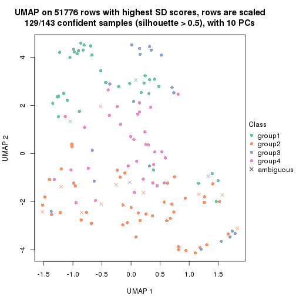</p>

</div>
<div id='tab-SD-NMF-dimension-reduction-4'>
<pre><code class="r">dimension_reduction(res, k = 5, method = &quot;UMAP&quot;)
</code></pre>

<p></p>

</div>
<div id='tab-SD-NMF-dimension-reduction-5'>
<pre><code class="r">dimension_reduction(res, k = 6, method = &quot;UMAP&quot;)
</code></pre>

<p></p>

</div>
</div>


Following heatmap shows how subgroups are split when increasing `k`:

```r
collect_classes(res)
```


Test correlation between subgroups and known annotations. If the known
annotation is numeric, one-way ANOVA test is applied, and if the known
annotation is discrete, chi-squared contingency table test is applied.

```r
test_to_known_factors(res)
```

```
#>          n disease.state(p) k
#> SD:NMF 133         6.11e-04 2
#> SD:NMF 133         4.18e-04 3
#> SD:NMF 129         9.87e-05 4
#> SD:NMF 109         3.96e-05 5
#> SD:NMF 105         3.09e-05 6
```


If matrix rows can be associated to genes, consider to use `GO_Enrichment(res,
...)` to perform function enrichment for the signature genes.


 

---------------------------------------------------


### CV:hclust


The object with results only for a single top-value method and a single partition method 
can be extracted as:

```r
res = res_list["CV", "hclust"]
# you can also extract it by
# res = res_list["CV:hclust"]
```

A summary of `res` and all the functions that can be applied to it:

```r
res
```

```
#> A 'ConsensusPartition' object with k = 2, 3, 4, 5, 6.
#>   On a matrix with 51776 rows and 143 columns.
#>   Top rows (1000, 2000, 3000, 4000, 5000) are extracted by 'CV' method.
#>   Subgroups are detected by 'hclust' method.
#>   Performed in total 1250 partitions by row resampling.
#>   Best k for subgroups seems to be 3.
#> 
#> Following methods can be applied to this 'ConsensusPartition' object:
#>  [1] "cola_report"             "collect_classes"         "collect_plots"          
#>  [4] "collect_stats"           "colnames"                "compare_signatures"     
#>  [7] "consensus_heatmap"       "dimension_reduction"     "functional_enrichment"  
#> [10] "get_anno_col"            "get_anno"                "get_classes"            
#> [13] "get_consensus"           "get_matrix"              "get_membership"         
#> [16] "get_param"               "get_signatures"          "get_stats"              
#> [19] "is_best_k"               "is_stable_k"             "membership_heatmap"     
#> [22] "ncol"                    "nrow"                    "plot_ecdf"              
#> [25] "rownames"                "select_partition_number" "show"                   
#> [28] "suggest_best_k"          "test_to_known_factors"
```

`collect_plots()` function collects all the plots made from `res` for all `k` (number of partitions)
into one single page to provide an easy and fast comparison between different `k`.

```r
collect_plots(res)
```


The plots are:

- The first row: a plot of the ECDF (Empirical cumulative distribution
  function) curves of the consensus matrix for each `k` and the heatmap of
  predicted classes for each `k`.
- The second row: heatmaps of the consensus matrix for each `k`.
- The third row: heatmaps of the membership matrix for each `k`.
- The fouth row: heatmaps of the signatures for each `k`.

All the plots in panels can be made by individual functions and they are
plotted later in this section.

`select_partition_number()` produces several plots showing different
statistics for choosing "optimized" `k`. There are following statistics:

- ECDF curves of the consensus matrix for each `k`;
- 1-PAC. [The PAC
  score](https://en.wikipedia.org/wiki/Consensus_clustering#Over-interpretation_potential_of_consensus_clustering)
  measures the proportion of the ambiguous subgrouping.
- Mean silhouette score.
- Concordance. The mean probability of fiting the consensus class ids in all
  partitions.
- Area increased. Denote $A_k$ as the area under the ECDF curve for current
  `k`, the area increased is defined as $A_k - A_{k-1}$.
- Rand index. The percent of pairs of samples that are both in a same cluster
  or both are not in a same cluster in the partition of k and k-1.
- Jaccard index. The ratio of pairs of samples are both in a same cluster in
  the partition of k and k-1 and the pairs of samples are both in a same
  cluster in the partition k or k-1.

The detailed explanations of these statistics can be found in [the cola
vignette](http://bioconductor.org/packages/devel/bioc/vignettes/cola/inst/doc/cola.html#toc_13).

Generally speaking, lower PAC score, higher mean silhouette score or higher
concordance corresponds to better partition. Rand index and Jaccard index
measure how similar the current partition is compared to partition with `k-1`.
If they are too similar, we won't accept `k` is better than `k-1`.

```r
select_partition_number(res)
```


The numeric values for all these statistics can be obtained by `get_stats()`.

```r
get_stats(res)
```

```
#>   k 1-PAC mean_silhouette concordance area_increased  Rand Jaccard
#> 2 2 0.631           0.774       0.907         0.2824 0.728   0.728
#> 3 3 0.211           0.491       0.697         0.9720 0.617   0.487
#> 4 4 0.287           0.299       0.601         0.1671 0.758   0.512
#> 5 5 0.366           0.447       0.662         0.0750 0.787   0.504
#> 6 6 0.416           0.396       0.626         0.0471 0.972   0.901
```

`suggest_best_k()` suggests the best $k$ based on these statistics. The rules are as follows:

- All $k$ with Jaccard index larger than 0.95 are removed because the increase of
  the partition number does not provides enough extra information. If all $k$ are removed,
  the best $k$ is assigned by `NA`.
- For $k$ with 1-PAC larger than 0.9, the maximal $k$ is taken as the "best k". Other $k$ is called "optional k".
- If it does not fit the second rule. The $k$ with the highest vote of highest
  1-PAC, mean silhouette and concordance is taken as the "best k".

```r
suggest_best_k(res)
```

```
#> [1] 3
```


Following shows the table of the partitions (You need to click the **show/hide
code output** link to see it). The membership matrix (columns with name `p*`)
is inferred by
[`clue::cl_consensus()`](https://www.rdocumentation.org/link/cl_consensus?package=clue)
function with the `SE` method. Basically the value in the membership matrix
represents the probability to belong to a certain group. The finall class
label for an item is determined with the group with highest probability it
belongs to.

In `get_classes()` function, the entropy is calculated from the membership
matrix and the silhouette score is calculated from the consensus matrix.


<script>
$( function() {
	$( '#tabs-CV-hclust-get-classes' ).tabs();
} );
</script>
<div id='tabs-CV-hclust-get-classes'>
<ul>
<li><a href='#tab-CV-hclust-get-classes-1'>k = 2</a></li>
<li><a href='#tab-CV-hclust-get-classes-2'>k = 3</a></li>
<li><a href='#tab-CV-hclust-get-classes-3'>k = 4</a></li>
<li><a href='#tab-CV-hclust-get-classes-4'>k = 5</a></li>
<li><a href='#tab-CV-hclust-get-classes-5'>k = 6</a></li>
</ul>

<div id='tab-CV-hclust-get-classes-1'>
<p><a id='tab-CV-hclust-get-classes-1-a' style='color:#0366d6' href='#'>show/hide code output</a></p>
<pre><code class="r">cbind(get_classes(res, k = 2), get_membership(res, k = 2))
</code></pre>

<pre><code>#&gt;           class entropy silhouette    p1    p2
#&gt; GSM550785     2  0.0000    0.91096 0.000 1.000
#&gt; GSM550786     2  0.9732    0.08719 0.404 0.596
#&gt; GSM550788     2  0.0000    0.91096 0.000 1.000
#&gt; GSM550789     2  0.0000    0.91096 0.000 1.000
#&gt; GSM550790     2  0.0000    0.91096 0.000 1.000
#&gt; GSM550791     2  0.0000    0.91096 0.000 1.000
#&gt; GSM550792     2  0.2948    0.87947 0.052 0.948
#&gt; GSM550796     2  0.0376    0.90932 0.004 0.996
#&gt; GSM550797     2  0.0000    0.91096 0.000 1.000
#&gt; GSM550799     2  0.9988   -0.24967 0.480 0.520
#&gt; GSM550800     2  0.0000    0.91096 0.000 1.000
#&gt; GSM550801     2  0.0000    0.91096 0.000 1.000
#&gt; GSM550804     2  0.0000    0.91096 0.000 1.000
#&gt; GSM550806     1  0.9323    0.66200 0.652 0.348
#&gt; GSM550807     2  0.0000    0.91096 0.000 1.000
#&gt; GSM550808     2  0.5178    0.81200 0.116 0.884
#&gt; GSM550809     2  0.0938    0.90564 0.012 0.988
#&gt; GSM550810     2  0.2778    0.88387 0.048 0.952
#&gt; GSM550811     2  0.2423    0.88841 0.040 0.960
#&gt; GSM550813     2  0.0376    0.90920 0.004 0.996
#&gt; GSM550814     2  0.1633    0.89869 0.024 0.976
#&gt; GSM550815     2  0.0000    0.91096 0.000 1.000
#&gt; GSM550816     2  0.0672    0.90765 0.008 0.992
#&gt; GSM550817     1  0.9358    0.65137 0.648 0.352
#&gt; GSM550818     1  0.9358    0.65137 0.648 0.352
#&gt; GSM550819     2  0.5519    0.79347 0.128 0.872
#&gt; GSM550820     2  0.2423    0.88966 0.040 0.960
#&gt; GSM550821     2  0.7528    0.64963 0.216 0.784
#&gt; GSM550822     2  0.0000    0.91096 0.000 1.000
#&gt; GSM550826     2  0.8327    0.55507 0.264 0.736
#&gt; GSM550832     2  0.3584    0.86602 0.068 0.932
#&gt; GSM550833     2  0.0000    0.91096 0.000 1.000
#&gt; GSM550835     2  0.9754    0.06653 0.408 0.592
#&gt; GSM550836     1  0.0000    0.73026 1.000 0.000
#&gt; GSM550837     2  0.9815    0.00925 0.420 0.580
#&gt; GSM550838     2  0.0938    0.90564 0.012 0.988
#&gt; GSM550841     1  0.9491    0.62704 0.632 0.368
#&gt; GSM550842     2  0.9286    0.32032 0.344 0.656
#&gt; GSM550846     2  0.0000    0.91096 0.000 1.000
#&gt; GSM550849     2  0.1843    0.89716 0.028 0.972
#&gt; GSM550850     2  0.0000    0.91096 0.000 1.000
#&gt; GSM550851     2  0.9522    0.22060 0.372 0.628
#&gt; GSM550852     2  0.3431    0.87043 0.064 0.936
#&gt; GSM550853     2  0.0000    0.91096 0.000 1.000
#&gt; GSM550855     2  0.0000    0.91096 0.000 1.000
#&gt; GSM550856     2  0.0000    0.91096 0.000 1.000
#&gt; GSM550861     2  0.0000    0.91096 0.000 1.000
#&gt; GSM550863     2  0.0000    0.91096 0.000 1.000
#&gt; GSM550864     2  0.0000    0.91096 0.000 1.000
#&gt; GSM550866     2  0.0000    0.91096 0.000 1.000
#&gt; GSM550867     2  0.0000    0.91096 0.000 1.000
#&gt; GSM550885     2  0.0000    0.91096 0.000 1.000
#&gt; GSM550886     2  0.9909   -0.09155 0.444 0.556
#&gt; GSM550887     2  0.0000    0.91096 0.000 1.000
#&gt; GSM550889     2  0.0000    0.91096 0.000 1.000
#&gt; GSM550894     2  0.3733    0.86218 0.072 0.928
#&gt; GSM550897     2  0.0376    0.90921 0.004 0.996
#&gt; GSM550903     2  0.0000    0.91096 0.000 1.000
#&gt; GSM550905     2  0.8661    0.49069 0.288 0.712
#&gt; GSM550906     2  0.0000    0.91096 0.000 1.000
#&gt; GSM550907     1  0.0000    0.73026 1.000 0.000
#&gt; GSM550909     2  0.4161    0.85220 0.084 0.916
#&gt; GSM550911     1  0.0000    0.73026 1.000 0.000
#&gt; GSM550913     2  0.0000    0.91096 0.000 1.000
#&gt; GSM550915     2  0.0000    0.91096 0.000 1.000
#&gt; GSM550917     2  0.0000    0.91096 0.000 1.000
#&gt; GSM550919     2  0.0000    0.91096 0.000 1.000
#&gt; GSM550921     1  0.0000    0.73026 1.000 0.000
#&gt; GSM550924     2  0.7883    0.62130 0.236 0.764
#&gt; GSM550926     2  0.0376    0.90932 0.004 0.996
#&gt; GSM550927     2  0.0000    0.91096 0.000 1.000
#&gt; GSM550787     2  0.7299    0.67574 0.204 0.796
#&gt; GSM550793     2  0.9970   -0.19887 0.468 0.532
#&gt; GSM550794     2  0.2778    0.88245 0.048 0.952
#&gt; GSM550795     2  0.0000    0.91096 0.000 1.000
#&gt; GSM550798     2  0.7056    0.69324 0.192 0.808
#&gt; GSM550803     2  0.1184    0.90362 0.016 0.984
#&gt; GSM550805     2  0.3733    0.86281 0.072 0.928
#&gt; GSM550823     2  0.0672    0.90770 0.008 0.992
#&gt; GSM550824     2  0.0000    0.91096 0.000 1.000
#&gt; GSM550825     1  0.9963    0.40873 0.536 0.464
#&gt; GSM550827     2  0.0376    0.90920 0.004 0.996
#&gt; GSM550828     2  0.0000    0.91096 0.000 1.000
#&gt; GSM550829     2  0.9996   -0.27538 0.488 0.512
#&gt; GSM550830     2  0.0000    0.91096 0.000 1.000
#&gt; GSM550834     2  0.0000    0.91096 0.000 1.000
#&gt; GSM550839     1  0.9909    0.48119 0.556 0.444
#&gt; GSM550840     2  0.0000    0.91096 0.000 1.000
#&gt; GSM550843     1  0.9358    0.65769 0.648 0.352
#&gt; GSM550844     2  0.3879    0.85898 0.076 0.924
#&gt; GSM550845     2  0.0000    0.91096 0.000 1.000
#&gt; GSM550848     2  0.0000    0.91096 0.000 1.000
#&gt; GSM550854     2  0.0000    0.91096 0.000 1.000
#&gt; GSM550857     1  0.0000    0.73026 1.000 0.000
#&gt; GSM550858     2  0.0000    0.91096 0.000 1.000
#&gt; GSM550859     2  0.0000    0.91096 0.000 1.000
#&gt; GSM550862     2  0.0000    0.91096 0.000 1.000
#&gt; GSM550865     2  0.0000    0.91096 0.000 1.000
#&gt; GSM550868     2  0.0000    0.91096 0.000 1.000
#&gt; GSM550869     2  0.5737    0.79133 0.136 0.864
#&gt; GSM550870     2  0.0000    0.91096 0.000 1.000
#&gt; GSM550871     1  0.9909    0.48119 0.556 0.444
#&gt; GSM550872     2  0.0000    0.91096 0.000 1.000
#&gt; GSM550873     2  0.4690    0.83330 0.100 0.900
#&gt; GSM550874     2  0.0000    0.91096 0.000 1.000
#&gt; GSM550876     1  0.8861    0.70289 0.696 0.304
#&gt; GSM550877     2  0.0000    0.91096 0.000 1.000
#&gt; GSM550878     1  0.8555    0.71548 0.720 0.280
#&gt; GSM550879     2  0.0000    0.91096 0.000 1.000
#&gt; GSM550882     1  0.8713    0.70793 0.708 0.292
#&gt; GSM550888     1  0.0000    0.73026 1.000 0.000
#&gt; GSM550890     2  0.0000    0.91096 0.000 1.000
#&gt; GSM550891     1  0.0000    0.73026 1.000 0.000
#&gt; GSM550892     2  0.0000    0.91096 0.000 1.000
#&gt; GSM550893     2  0.0376    0.90932 0.004 0.996
#&gt; GSM550895     2  0.0000    0.91096 0.000 1.000
#&gt; GSM550896     2  0.0000    0.91096 0.000 1.000
#&gt; GSM550898     2  0.0000    0.91096 0.000 1.000
#&gt; GSM550899     2  0.0000    0.91096 0.000 1.000
#&gt; GSM550900     2  0.0000    0.91096 0.000 1.000
#&gt; GSM550901     2  0.0000    0.91096 0.000 1.000
#&gt; GSM550902     2  0.9248    0.35215 0.340 0.660
#&gt; GSM550904     2  0.2948    0.88033 0.052 0.948
#&gt; GSM550908     1  0.0000    0.73026 1.000 0.000
#&gt; GSM550912     2  0.0376    0.90920 0.004 0.996
#&gt; GSM550914     2  0.0000    0.91096 0.000 1.000
#&gt; GSM550918     2  0.0000    0.91096 0.000 1.000
#&gt; GSM550922     1  0.9983    0.37430 0.524 0.476
#&gt; GSM550923     2  0.2778    0.88196 0.048 0.952
#&gt; GSM550925     2  0.0000    0.91096 0.000 1.000
#&gt; GSM550802     2  0.2603    0.88552 0.044 0.956
#&gt; GSM550812     2  0.2778    0.88308 0.048 0.952
#&gt; GSM550831     2  0.0000    0.91096 0.000 1.000
#&gt; GSM550847     2  0.0000    0.91096 0.000 1.000
#&gt; GSM550860     2  0.9661    0.15474 0.392 0.608
#&gt; GSM550875     2  0.3879    0.85898 0.076 0.924
#&gt; GSM550880     2  0.0000    0.91096 0.000 1.000
#&gt; GSM550881     1  0.8713    0.70810 0.708 0.292
#&gt; GSM550883     1  0.8713    0.70793 0.708 0.292
#&gt; GSM550884     2  0.4161    0.85122 0.084 0.916
#&gt; GSM550910     1  0.3431    0.73052 0.936 0.064
#&gt; GSM550916     2  0.1843    0.89641 0.028 0.972
#&gt; GSM550920     2  0.9993   -0.25964 0.484 0.516
</code></pre>

<script>
$('#tab-CV-hclust-get-classes-1-a').parent().next().next().hide();
$('#tab-CV-hclust-get-classes-1-a').click(function(){
  $('#tab-CV-hclust-get-classes-1-a').parent().next().next().toggle();
  return(false);
});
</script>
</div>

<div id='tab-CV-hclust-get-classes-2'>
<p><a id='tab-CV-hclust-get-classes-2-a' style='color:#0366d6' href='#'>show/hide code output</a></p>
<pre><code class="r">cbind(get_classes(res, k = 3), get_membership(res, k = 3))
</code></pre>

<pre><code>#&gt;           class entropy silhouette    p1    p2    p3
#&gt; GSM550785     1  0.2959     0.6726 0.900 0.100 0.000
#&gt; GSM550786     2  0.7157     0.1490 0.056 0.668 0.276
#&gt; GSM550788     2  0.4399     0.6505 0.188 0.812 0.000
#&gt; GSM550789     2  0.4399     0.6503 0.188 0.812 0.000
#&gt; GSM550790     1  0.1753     0.6584 0.952 0.048 0.000
#&gt; GSM550791     1  0.2625     0.6639 0.916 0.084 0.000
#&gt; GSM550792     1  0.7169     0.3341 0.520 0.456 0.024
#&gt; GSM550796     2  0.4178     0.6498 0.172 0.828 0.000
#&gt; GSM550797     2  0.4399     0.6503 0.188 0.812 0.000
#&gt; GSM550799     2  0.5835    -0.0545 0.000 0.660 0.340
#&gt; GSM550800     2  0.6168     0.2283 0.412 0.588 0.000
#&gt; GSM550801     2  0.4399     0.6503 0.188 0.812 0.000
#&gt; GSM550804     2  0.5905     0.4451 0.352 0.648 0.000
#&gt; GSM550806     3  0.8227     0.5427 0.080 0.384 0.536
#&gt; GSM550807     2  0.4504     0.6479 0.196 0.804 0.000
#&gt; GSM550808     2  0.4665     0.5991 0.100 0.852 0.048
#&gt; GSM550809     1  0.4575     0.6506 0.812 0.184 0.004
#&gt; GSM550810     2  0.3573     0.6244 0.120 0.876 0.004
#&gt; GSM550811     1  0.6879     0.4077 0.556 0.428 0.016
#&gt; GSM550813     2  0.5810     0.4477 0.336 0.664 0.000
#&gt; GSM550814     2  0.5982     0.3966 0.328 0.668 0.004
#&gt; GSM550815     2  0.4399     0.6503 0.188 0.812 0.000
#&gt; GSM550816     2  0.4842     0.6125 0.224 0.776 0.000
#&gt; GSM550817     3  0.6260     0.4367 0.000 0.448 0.552
#&gt; GSM550818     3  0.6252     0.4414 0.000 0.444 0.556
#&gt; GSM550819     2  0.7141     0.0804 0.368 0.600 0.032
#&gt; GSM550820     1  0.5450     0.6277 0.760 0.228 0.012
#&gt; GSM550821     2  0.6383     0.5013 0.128 0.768 0.104
#&gt; GSM550822     2  0.4399     0.6503 0.188 0.812 0.000
#&gt; GSM550826     1  0.9105     0.3042 0.500 0.348 0.152
#&gt; GSM550832     2  0.4326     0.6343 0.144 0.844 0.012
#&gt; GSM550833     2  0.4399     0.6502 0.188 0.812 0.000
#&gt; GSM550835     2  0.5919     0.1585 0.012 0.712 0.276
#&gt; GSM550836     3  0.0000     0.7265 0.000 0.000 1.000
#&gt; GSM550837     2  0.5656     0.1257 0.004 0.712 0.284
#&gt; GSM550838     1  0.4575     0.6506 0.812 0.184 0.004
#&gt; GSM550841     3  0.6308     0.4142 0.000 0.492 0.508
#&gt; GSM550842     2  0.4605     0.2956 0.000 0.796 0.204
#&gt; GSM550846     1  0.5706     0.5830 0.680 0.320 0.000
#&gt; GSM550849     1  0.6521     0.0948 0.500 0.496 0.004
#&gt; GSM550850     1  0.1860     0.6602 0.948 0.052 0.000
#&gt; GSM550851     2  0.5201     0.2399 0.004 0.760 0.236
#&gt; GSM550852     2  0.6917     0.2191 0.368 0.608 0.024
#&gt; GSM550853     2  0.4555     0.6465 0.200 0.800 0.000
#&gt; GSM550855     2  0.4605     0.6467 0.204 0.796 0.000
#&gt; GSM550856     2  0.4605     0.6467 0.204 0.796 0.000
#&gt; GSM550861     2  0.4842     0.6277 0.224 0.776 0.000
#&gt; GSM550863     1  0.5363     0.6268 0.724 0.276 0.000
#&gt; GSM550864     2  0.5138     0.6017 0.252 0.748 0.000
#&gt; GSM550866     2  0.6180     0.2258 0.416 0.584 0.000
#&gt; GSM550867     1  0.1031     0.6480 0.976 0.024 0.000
#&gt; GSM550885     1  0.1289     0.6504 0.968 0.032 0.000
#&gt; GSM550886     2  0.7084     0.0626 0.036 0.628 0.336
#&gt; GSM550887     2  0.4399     0.6503 0.188 0.812 0.000
#&gt; GSM550889     1  0.5926     0.5403 0.644 0.356 0.000
#&gt; GSM550894     2  0.4261     0.6326 0.140 0.848 0.012
#&gt; GSM550897     1  0.5254     0.6494 0.736 0.264 0.000
#&gt; GSM550903     2  0.4750     0.6348 0.216 0.784 0.000
#&gt; GSM550905     2  0.5734     0.4111 0.048 0.788 0.164
#&gt; GSM550906     2  0.4399     0.6503 0.188 0.812 0.000
#&gt; GSM550907     3  0.0592     0.7262 0.000 0.012 0.988
#&gt; GSM550909     2  0.6772     0.3991 0.304 0.664 0.032
#&gt; GSM550911     3  0.0000     0.7265 0.000 0.000 1.000
#&gt; GSM550913     2  0.4399     0.6503 0.188 0.812 0.000
#&gt; GSM550915     1  0.5706     0.5834 0.680 0.320 0.000
#&gt; GSM550917     2  0.5835     0.4644 0.340 0.660 0.000
#&gt; GSM550919     1  0.5327     0.6340 0.728 0.272 0.000
#&gt; GSM550921     3  0.0000     0.7265 0.000 0.000 1.000
#&gt; GSM550924     2  0.8386     0.4451 0.204 0.624 0.172
#&gt; GSM550926     2  0.4750     0.6394 0.216 0.784 0.000
#&gt; GSM550927     2  0.4452     0.6494 0.192 0.808 0.000
#&gt; GSM550787     1  0.7478     0.3962 0.692 0.192 0.116
#&gt; GSM550793     3  0.9909     0.2144 0.364 0.268 0.368
#&gt; GSM550794     1  0.7102     0.3901 0.556 0.420 0.024
#&gt; GSM550795     1  0.2066     0.6617 0.940 0.060 0.000
#&gt; GSM550798     1  0.6486     0.3786 0.760 0.144 0.096
#&gt; GSM550803     1  0.1289     0.6261 0.968 0.032 0.000
#&gt; GSM550805     1  0.7295     0.4720 0.584 0.380 0.036
#&gt; GSM550823     1  0.6126     0.4821 0.600 0.400 0.000
#&gt; GSM550824     1  0.1031     0.6480 0.976 0.024 0.000
#&gt; GSM550825     3  0.9264     0.3620 0.412 0.156 0.432
#&gt; GSM550827     1  0.5760     0.5788 0.672 0.328 0.000
#&gt; GSM550828     1  0.4399     0.6663 0.812 0.188 0.000
#&gt; GSM550829     1  0.9274    -0.3058 0.456 0.160 0.384
#&gt; GSM550830     1  0.6302     0.2343 0.520 0.480 0.000
#&gt; GSM550834     1  0.1860     0.6602 0.948 0.052 0.000
#&gt; GSM550839     2  0.8128    -0.3727 0.068 0.492 0.440
#&gt; GSM550840     1  0.4702     0.6625 0.788 0.212 0.000
#&gt; GSM550843     3  0.8362     0.5327 0.088 0.384 0.528
#&gt; GSM550844     1  0.7245     0.4970 0.596 0.368 0.036
#&gt; GSM550845     2  0.6192     0.2391 0.420 0.580 0.000
#&gt; GSM550848     1  0.5431     0.6231 0.716 0.284 0.000
#&gt; GSM550854     1  0.1031     0.6480 0.976 0.024 0.000
#&gt; GSM550857     3  0.0000     0.7265 0.000 0.000 1.000
#&gt; GSM550858     1  0.2796     0.6682 0.908 0.092 0.000
#&gt; GSM550859     1  0.1031     0.6480 0.976 0.024 0.000
#&gt; GSM550862     1  0.5058     0.6466 0.756 0.244 0.000
#&gt; GSM550865     1  0.5560     0.6089 0.700 0.300 0.000
#&gt; GSM550868     1  0.6126     0.4535 0.600 0.400 0.000
#&gt; GSM550869     1  0.8355     0.3249 0.508 0.408 0.084
#&gt; GSM550870     2  0.6180     0.2499 0.416 0.584 0.000
#&gt; GSM550871     2  0.8128    -0.3727 0.068 0.492 0.440
#&gt; GSM550872     1  0.5760     0.5808 0.672 0.328 0.000
#&gt; GSM550873     2  0.7306     0.2581 0.340 0.616 0.044
#&gt; GSM550874     2  0.4654     0.6426 0.208 0.792 0.000
#&gt; GSM550876     3  0.8019     0.5895 0.076 0.348 0.576
#&gt; GSM550877     2  0.4702     0.6393 0.212 0.788 0.000
#&gt; GSM550878     3  0.7637     0.6145 0.076 0.284 0.640
#&gt; GSM550879     1  0.4399     0.6674 0.812 0.188 0.000
#&gt; GSM550882     3  0.8016     0.6061 0.260 0.108 0.632
#&gt; GSM550888     3  0.0000     0.7265 0.000 0.000 1.000
#&gt; GSM550890     1  0.5733     0.5800 0.676 0.324 0.000
#&gt; GSM550891     3  0.0000     0.7265 0.000 0.000 1.000
#&gt; GSM550892     1  0.5397     0.6249 0.720 0.280 0.000
#&gt; GSM550893     1  0.6045     0.5195 0.620 0.380 0.000
#&gt; GSM550895     1  0.6111     0.4604 0.604 0.396 0.000
#&gt; GSM550896     1  0.6126     0.4535 0.600 0.400 0.000
#&gt; GSM550898     1  0.1031     0.6480 0.976 0.024 0.000
#&gt; GSM550899     2  0.5650     0.5234 0.312 0.688 0.000
#&gt; GSM550900     1  0.6008     0.5143 0.628 0.372 0.000
#&gt; GSM550901     1  0.5327     0.6340 0.728 0.272 0.000
#&gt; GSM550902     1  0.9677     0.1410 0.452 0.312 0.236
#&gt; GSM550904     1  0.6126     0.5974 0.712 0.268 0.020
#&gt; GSM550908     3  0.0000     0.7265 0.000 0.000 1.000
#&gt; GSM550912     2  0.5810     0.4489 0.336 0.664 0.000
#&gt; GSM550914     1  0.5733     0.5800 0.676 0.324 0.000
#&gt; GSM550918     2  0.5905     0.4451 0.352 0.648 0.000
#&gt; GSM550922     2  0.6962    -0.2200 0.020 0.568 0.412
#&gt; GSM550923     1  0.2955     0.5873 0.912 0.080 0.008
#&gt; GSM550925     1  0.5785     0.5728 0.668 0.332 0.000
#&gt; GSM550802     1  0.7043     0.3236 0.532 0.448 0.020
#&gt; GSM550812     1  0.6919     0.3766 0.536 0.448 0.016
#&gt; GSM550831     1  0.1860     0.6602 0.948 0.052 0.000
#&gt; GSM550847     1  0.1031     0.6480 0.976 0.024 0.000
#&gt; GSM550860     2  0.9948    -0.1465 0.352 0.364 0.284
#&gt; GSM550875     1  0.7378     0.4322 0.560 0.404 0.036
#&gt; GSM550880     1  0.3038     0.6702 0.896 0.104 0.000
#&gt; GSM550881     3  0.7745     0.6079 0.260 0.092 0.648
#&gt; GSM550883     3  0.8016     0.6061 0.260 0.108 0.632
#&gt; GSM550884     2  0.7420    -0.0368 0.420 0.544 0.036
#&gt; GSM550910     3  0.4233     0.7106 0.004 0.160 0.836
#&gt; GSM550916     1  0.2743     0.6265 0.928 0.052 0.020
#&gt; GSM550920     2  0.7379    -0.0755 0.040 0.584 0.376
</code></pre>

<script>
$('#tab-CV-hclust-get-classes-2-a').parent().next().next().hide();
$('#tab-CV-hclust-get-classes-2-a').click(function(){
  $('#tab-CV-hclust-get-classes-2-a').parent().next().next().toggle();
  return(false);
});
</script>
</div>

<div id='tab-CV-hclust-get-classes-3'>
<p><a id='tab-CV-hclust-get-classes-3-a' style='color:#0366d6' href='#'>show/hide code output</a></p>
<pre><code class="r">cbind(get_classes(res, k = 4), get_membership(res, k = 4))
</code></pre>

<pre><code>#&gt;           class entropy silhouette    p1    p2    p3    p4
#&gt; GSM550785     4  0.4382    0.25429 0.296 0.000 0.000 0.704
#&gt; GSM550786     2  0.6979    0.16856 0.268 0.620 0.040 0.072
#&gt; GSM550788     2  0.4855    0.45951 0.000 0.600 0.000 0.400
#&gt; GSM550789     2  0.4843    0.46545 0.000 0.604 0.000 0.396
#&gt; GSM550790     4  0.5320    0.04537 0.416 0.012 0.000 0.572
#&gt; GSM550791     4  0.5835    0.13060 0.372 0.040 0.000 0.588
#&gt; GSM550792     4  0.7146    0.32059 0.212 0.228 0.000 0.560
#&gt; GSM550796     2  0.5364    0.46683 0.016 0.592 0.000 0.392
#&gt; GSM550797     2  0.4843    0.46545 0.000 0.604 0.000 0.396
#&gt; GSM550799     2  0.6080    0.06763 0.292 0.644 0.056 0.008
#&gt; GSM550800     4  0.4730    0.08619 0.000 0.364 0.000 0.636
#&gt; GSM550801     2  0.4843    0.46545 0.000 0.604 0.000 0.396
#&gt; GSM550804     4  0.4855   -0.05593 0.000 0.400 0.000 0.600
#&gt; GSM550806     2  0.8877   -0.34031 0.316 0.368 0.268 0.048
#&gt; GSM550807     2  0.4877    0.45627 0.000 0.592 0.000 0.408
#&gt; GSM550808     2  0.7193    0.42785 0.140 0.580 0.012 0.268
#&gt; GSM550809     4  0.6599    0.16059 0.340 0.096 0.000 0.564
#&gt; GSM550810     2  0.6415    0.43192 0.100 0.612 0.000 0.288
#&gt; GSM550811     4  0.6948    0.34546 0.204 0.208 0.000 0.588
#&gt; GSM550813     4  0.5731   -0.10105 0.028 0.428 0.000 0.544
#&gt; GSM550814     4  0.6299   -0.03858 0.060 0.420 0.000 0.520
#&gt; GSM550815     2  0.4843    0.46545 0.000 0.604 0.000 0.396
#&gt; GSM550816     2  0.6182    0.31887 0.052 0.520 0.000 0.428
#&gt; GSM550817     2  0.7542   -0.28025 0.232 0.488 0.280 0.000
#&gt; GSM550818     2  0.7551   -0.28890 0.228 0.484 0.288 0.000
#&gt; GSM550819     4  0.6991    0.20806 0.136 0.324 0.000 0.540
#&gt; GSM550820     4  0.6725    0.09697 0.348 0.104 0.000 0.548
#&gt; GSM550821     2  0.7200    0.31793 0.228 0.552 0.000 0.220
#&gt; GSM550822     2  0.4843    0.46545 0.000 0.604 0.000 0.396
#&gt; GSM550826     1  0.8645    0.42215 0.408 0.212 0.044 0.336
#&gt; GSM550832     2  0.6391    0.45525 0.084 0.588 0.000 0.328
#&gt; GSM550833     2  0.5112    0.46476 0.008 0.608 0.000 0.384
#&gt; GSM550835     2  0.6383    0.18815 0.276 0.648 0.040 0.036
#&gt; GSM550836     3  0.0188    0.75446 0.004 0.000 0.996 0.000
#&gt; GSM550837     2  0.6301    0.18053 0.276 0.652 0.036 0.036
#&gt; GSM550838     4  0.6599    0.16059 0.340 0.096 0.000 0.564
#&gt; GSM550841     2  0.7408   -0.22953 0.276 0.512 0.212 0.000
#&gt; GSM550842     2  0.6075    0.27853 0.216 0.700 0.028 0.056
#&gt; GSM550846     4  0.1151    0.54325 0.008 0.024 0.000 0.968
#&gt; GSM550849     2  0.7919   -0.15866 0.316 0.348 0.000 0.336
#&gt; GSM550850     4  0.5244    0.13976 0.388 0.012 0.000 0.600
#&gt; GSM550851     2  0.6309    0.24760 0.232 0.680 0.036 0.052
#&gt; GSM550852     4  0.7468    0.11179 0.184 0.352 0.000 0.464
#&gt; GSM550853     2  0.4907    0.44645 0.000 0.580 0.000 0.420
#&gt; GSM550855     2  0.5080    0.44425 0.004 0.576 0.000 0.420
#&gt; GSM550856     2  0.5080    0.44425 0.004 0.576 0.000 0.420
#&gt; GSM550861     2  0.4941    0.41816 0.000 0.564 0.000 0.436
#&gt; GSM550863     4  0.1389    0.52064 0.048 0.000 0.000 0.952
#&gt; GSM550864     2  0.4992    0.35165 0.000 0.524 0.000 0.476
#&gt; GSM550866     4  0.4564    0.16292 0.000 0.328 0.000 0.672
#&gt; GSM550867     4  0.4933    0.05591 0.432 0.000 0.000 0.568
#&gt; GSM550885     4  0.4907    0.07995 0.420 0.000 0.000 0.580
#&gt; GSM550886     2  0.8873    0.22678 0.200 0.504 0.168 0.128
#&gt; GSM550887     2  0.4855    0.46331 0.000 0.600 0.000 0.400
#&gt; GSM550889     4  0.2197    0.53996 0.004 0.080 0.000 0.916
#&gt; GSM550894     2  0.6462    0.45366 0.088 0.580 0.000 0.332
#&gt; GSM550897     4  0.3674    0.50690 0.104 0.044 0.000 0.852
#&gt; GSM550903     2  0.4941    0.41844 0.000 0.564 0.000 0.436
#&gt; GSM550905     2  0.6577    0.31782 0.220 0.648 0.008 0.124
#&gt; GSM550906     2  0.4855    0.46331 0.000 0.600 0.000 0.400
#&gt; GSM550907     3  0.4188    0.72115 0.112 0.064 0.824 0.000
#&gt; GSM550909     2  0.7665    0.08810 0.216 0.424 0.000 0.360
#&gt; GSM550911     3  0.3051    0.73929 0.088 0.028 0.884 0.000
#&gt; GSM550913     2  0.4855    0.46331 0.000 0.600 0.000 0.400
#&gt; GSM550915     4  0.1004    0.54156 0.004 0.024 0.000 0.972
#&gt; GSM550917     4  0.4925   -0.12733 0.000 0.428 0.000 0.572
#&gt; GSM550919     4  0.2443    0.52120 0.060 0.024 0.000 0.916
#&gt; GSM550921     3  0.0188    0.75380 0.000 0.004 0.996 0.000
#&gt; GSM550924     2  0.8382    0.16070 0.264 0.496 0.048 0.192
#&gt; GSM550926     2  0.5244    0.42355 0.008 0.556 0.000 0.436
#&gt; GSM550927     2  0.4866    0.45969 0.000 0.596 0.000 0.404
#&gt; GSM550787     1  0.7215    0.57053 0.576 0.140 0.012 0.272
#&gt; GSM550793     1  0.9731    0.32286 0.372 0.208 0.224 0.196
#&gt; GSM550794     4  0.6915    0.36492 0.196 0.212 0.000 0.592
#&gt; GSM550795     4  0.5313    0.14743 0.376 0.016 0.000 0.608
#&gt; GSM550798     1  0.7249    0.55944 0.600 0.072 0.052 0.276
#&gt; GSM550803     1  0.5279    0.32754 0.588 0.012 0.000 0.400
#&gt; GSM550805     4  0.6915    0.31150 0.212 0.196 0.000 0.592
#&gt; GSM550823     4  0.3485    0.53471 0.028 0.116 0.000 0.856
#&gt; GSM550824     4  0.4933    0.05591 0.432 0.000 0.000 0.568
#&gt; GSM550825     1  0.8958    0.11835 0.464 0.124 0.276 0.136
#&gt; GSM550827     4  0.2830    0.53796 0.040 0.060 0.000 0.900
#&gt; GSM550828     4  0.3577    0.43739 0.156 0.012 0.000 0.832
#&gt; GSM550829     1  0.8856    0.23554 0.492 0.116 0.240 0.152
#&gt; GSM550830     4  0.3801    0.40275 0.000 0.220 0.000 0.780
#&gt; GSM550834     4  0.5244    0.13976 0.388 0.012 0.000 0.600
#&gt; GSM550839     2  0.8725   -0.13697 0.308 0.440 0.192 0.060
#&gt; GSM550840     4  0.5288    0.40106 0.200 0.068 0.000 0.732
#&gt; GSM550843     2  0.9074   -0.32522 0.328 0.352 0.256 0.064
#&gt; GSM550844     4  0.6991    0.25065 0.232 0.188 0.000 0.580
#&gt; GSM550845     4  0.4643    0.11055 0.000 0.344 0.000 0.656
#&gt; GSM550848     4  0.2214    0.52724 0.044 0.028 0.000 0.928
#&gt; GSM550854     4  0.4925    0.06652 0.428 0.000 0.000 0.572
#&gt; GSM550857     3  0.0188    0.75446 0.004 0.000 0.996 0.000
#&gt; GSM550858     4  0.4564    0.22812 0.328 0.000 0.000 0.672
#&gt; GSM550859     4  0.4933    0.05591 0.432 0.000 0.000 0.568
#&gt; GSM550862     4  0.2408    0.48740 0.104 0.000 0.000 0.896
#&gt; GSM550865     4  0.1297    0.53744 0.020 0.016 0.000 0.964
#&gt; GSM550868     4  0.2647    0.52025 0.000 0.120 0.000 0.880
#&gt; GSM550869     4  0.8315    0.00705 0.260 0.232 0.032 0.476
#&gt; GSM550870     4  0.4679    0.09486 0.000 0.352 0.000 0.648
#&gt; GSM550871     2  0.8725   -0.13697 0.308 0.440 0.192 0.060
#&gt; GSM550872     4  0.1724    0.54201 0.020 0.032 0.000 0.948
#&gt; GSM550873     4  0.7501    0.04906 0.184 0.372 0.000 0.444
#&gt; GSM550874     2  0.5408    0.43292 0.016 0.576 0.000 0.408
#&gt; GSM550876     2  0.8966   -0.39476 0.288 0.348 0.312 0.052
#&gt; GSM550877     2  0.4948    0.42453 0.000 0.560 0.000 0.440
#&gt; GSM550878     3  0.8887    0.30674 0.252 0.312 0.384 0.052
#&gt; GSM550879     4  0.3074    0.43334 0.152 0.000 0.000 0.848
#&gt; GSM550882     3  0.8526    0.32889 0.332 0.100 0.468 0.100
#&gt; GSM550888     3  0.0188    0.75446 0.004 0.000 0.996 0.000
#&gt; GSM550890     4  0.0817    0.54262 0.000 0.024 0.000 0.976
#&gt; GSM550891     3  0.0188    0.75380 0.000 0.004 0.996 0.000
#&gt; GSM550892     4  0.1118    0.52578 0.036 0.000 0.000 0.964
#&gt; GSM550893     4  0.2741    0.53789 0.012 0.096 0.000 0.892
#&gt; GSM550895     4  0.2589    0.52335 0.000 0.116 0.000 0.884
#&gt; GSM550896     4  0.2704    0.51812 0.000 0.124 0.000 0.876
#&gt; GSM550898     4  0.4933    0.05591 0.432 0.000 0.000 0.568
#&gt; GSM550899     4  0.4972   -0.22342 0.000 0.456 0.000 0.544
#&gt; GSM550900     4  0.2466    0.53895 0.004 0.096 0.000 0.900
#&gt; GSM550901     4  0.2443    0.52120 0.060 0.024 0.000 0.916
#&gt; GSM550902     1  0.9276    0.52138 0.408 0.240 0.100 0.252
#&gt; GSM550904     4  0.7019    0.06797 0.344 0.132 0.000 0.524
#&gt; GSM550908     3  0.0000    0.75421 0.000 0.000 1.000 0.000
#&gt; GSM550912     4  0.5815   -0.09719 0.032 0.428 0.000 0.540
#&gt; GSM550914     4  0.0817    0.54262 0.000 0.024 0.000 0.976
#&gt; GSM550918     4  0.4855   -0.05593 0.000 0.400 0.000 0.600
#&gt; GSM550922     2  0.7498   -0.00981 0.236 0.580 0.160 0.024
#&gt; GSM550923     1  0.5746    0.41762 0.600 0.028 0.004 0.368
#&gt; GSM550925     4  0.2443    0.54374 0.024 0.060 0.000 0.916
#&gt; GSM550802     4  0.6958    0.37150 0.184 0.232 0.000 0.584
#&gt; GSM550812     4  0.7064    0.32454 0.208 0.220 0.000 0.572
#&gt; GSM550831     4  0.5244    0.13976 0.388 0.012 0.000 0.600
#&gt; GSM550847     4  0.4933    0.06141 0.432 0.000 0.000 0.568
#&gt; GSM550860     1  0.9751    0.42926 0.304 0.248 0.148 0.300
#&gt; GSM550875     4  0.7147    0.26810 0.224 0.216 0.000 0.560
#&gt; GSM550880     4  0.4891    0.26895 0.308 0.012 0.000 0.680
#&gt; GSM550881     3  0.8423    0.35227 0.328 0.092 0.480 0.100
#&gt; GSM550883     3  0.8526    0.32889 0.332 0.100 0.468 0.100
#&gt; GSM550884     4  0.7541    0.22889 0.192 0.300 0.004 0.504
#&gt; GSM550910     3  0.6949    0.59369 0.216 0.176 0.604 0.004
#&gt; GSM550916     1  0.5815    0.31842 0.540 0.032 0.000 0.428
#&gt; GSM550920     2  0.8886    0.16939 0.216 0.492 0.184 0.108
</code></pre>

<script>
$('#tab-CV-hclust-get-classes-3-a').parent().next().next().hide();
$('#tab-CV-hclust-get-classes-3-a').click(function(){
  $('#tab-CV-hclust-get-classes-3-a').parent().next().next().toggle();
  return(false);
});
</script>
</div>

<div id='tab-CV-hclust-get-classes-4'>
<p><a id='tab-CV-hclust-get-classes-4-a' style='color:#0366d6' href='#'>show/hide code output</a></p>
<pre><code class="r">cbind(get_classes(res, k = 5), get_membership(res, k = 5))
</code></pre>

<pre><code>#&gt;           class entropy silhouette    p1    p2    p3    p4    p5
#&gt; GSM550785     1  0.3791     0.4464 0.812 0.076 0.000 0.112 0.000
#&gt; GSM550786     5  0.5615     0.6002 0.028 0.252 0.008 0.048 0.664
#&gt; GSM550788     2  0.1503     0.7383 0.020 0.952 0.000 0.008 0.020
#&gt; GSM550789     2  0.0566     0.7360 0.000 0.984 0.000 0.004 0.012
#&gt; GSM550790     1  0.4326     0.2458 0.708 0.028 0.000 0.264 0.000
#&gt; GSM550791     1  0.4527     0.3343 0.732 0.064 0.000 0.204 0.000
#&gt; GSM550792     1  0.7747     0.1966 0.376 0.332 0.000 0.228 0.064
#&gt; GSM550796     2  0.0807     0.7344 0.000 0.976 0.000 0.012 0.012
#&gt; GSM550797     2  0.0566     0.7360 0.000 0.984 0.000 0.004 0.012
#&gt; GSM550799     5  0.3282     0.6327 0.000 0.188 0.008 0.000 0.804
#&gt; GSM550800     2  0.3635     0.4912 0.248 0.748 0.000 0.004 0.000
#&gt; GSM550801     2  0.0566     0.7360 0.000 0.984 0.000 0.004 0.012
#&gt; GSM550804     2  0.3242     0.5740 0.216 0.784 0.000 0.000 0.000
#&gt; GSM550806     5  0.7497     0.4711 0.036 0.080 0.176 0.128 0.580
#&gt; GSM550807     2  0.0162     0.7396 0.000 0.996 0.000 0.004 0.000
#&gt; GSM550808     2  0.5311     0.4469 0.012 0.692 0.000 0.096 0.200
#&gt; GSM550809     1  0.6205     0.2360 0.596 0.128 0.000 0.256 0.020
#&gt; GSM550810     2  0.4745     0.5533 0.012 0.756 0.000 0.108 0.124
#&gt; GSM550811     1  0.7572     0.2626 0.408 0.316 0.000 0.224 0.052
#&gt; GSM550813     2  0.4187     0.5991 0.196 0.764 0.000 0.032 0.008
#&gt; GSM550814     2  0.5415     0.5245 0.212 0.688 0.000 0.076 0.024
#&gt; GSM550815     2  0.0404     0.7350 0.000 0.988 0.000 0.000 0.012
#&gt; GSM550816     2  0.5494     0.6267 0.124 0.724 0.000 0.080 0.072
#&gt; GSM550817     5  0.5700     0.5283 0.000 0.120 0.180 0.024 0.676
#&gt; GSM550818     5  0.5764     0.5265 0.000 0.120 0.188 0.024 0.668
#&gt; GSM550819     2  0.7920     0.0489 0.316 0.400 0.000 0.104 0.180
#&gt; GSM550820     1  0.6683     0.1762 0.536 0.148 0.000 0.288 0.028
#&gt; GSM550821     2  0.7137    -0.1051 0.064 0.468 0.000 0.116 0.352
#&gt; GSM550822     2  0.0404     0.7350 0.000 0.988 0.000 0.000 0.012
#&gt; GSM550826     1  0.8823    -0.3913 0.340 0.136 0.024 0.264 0.236
#&gt; GSM550832     2  0.4037     0.5983 0.020 0.796 0.000 0.028 0.156
#&gt; GSM550833     2  0.1612     0.7337 0.016 0.948 0.000 0.012 0.024
#&gt; GSM550835     5  0.4216     0.6240 0.000 0.260 0.008 0.012 0.720
#&gt; GSM550836     3  0.0566     0.7257 0.000 0.000 0.984 0.012 0.004
#&gt; GSM550837     5  0.3508     0.6246 0.000 0.252 0.000 0.000 0.748
#&gt; GSM550838     1  0.6205     0.2360 0.596 0.128 0.000 0.256 0.020
#&gt; GSM550841     5  0.4764     0.5624 0.000 0.112 0.080 0.036 0.772
#&gt; GSM550842     5  0.4551     0.5408 0.000 0.368 0.000 0.016 0.616
#&gt; GSM550846     1  0.4313     0.5074 0.636 0.356 0.000 0.008 0.000
#&gt; GSM550849     4  0.7288     0.1127 0.124 0.384 0.000 0.424 0.068
#&gt; GSM550850     1  0.3012     0.3733 0.852 0.024 0.000 0.124 0.000
#&gt; GSM550851     5  0.3895     0.5855 0.000 0.320 0.000 0.000 0.680
#&gt; GSM550852     2  0.7928     0.2252 0.228 0.452 0.000 0.192 0.128
#&gt; GSM550853     2  0.0404     0.7402 0.012 0.988 0.000 0.000 0.000
#&gt; GSM550855     2  0.0794     0.7402 0.028 0.972 0.000 0.000 0.000
#&gt; GSM550856     2  0.0794     0.7402 0.028 0.972 0.000 0.000 0.000
#&gt; GSM550861     2  0.1041     0.7362 0.032 0.964 0.000 0.000 0.004
#&gt; GSM550863     1  0.4161     0.5662 0.704 0.280 0.000 0.016 0.000
#&gt; GSM550864     2  0.1831     0.7172 0.076 0.920 0.000 0.000 0.004
#&gt; GSM550866     2  0.3913     0.3533 0.324 0.676 0.000 0.000 0.000
#&gt; GSM550867     1  0.2813     0.3040 0.832 0.000 0.000 0.168 0.000
#&gt; GSM550885     1  0.3053     0.3170 0.828 0.008 0.000 0.164 0.000
#&gt; GSM550886     5  0.7612     0.5006 0.016 0.348 0.128 0.060 0.448
#&gt; GSM550887     2  0.0290     0.7360 0.000 0.992 0.000 0.000 0.008
#&gt; GSM550889     1  0.4350     0.4353 0.588 0.408 0.000 0.004 0.000
#&gt; GSM550894     2  0.4037     0.5993 0.020 0.796 0.000 0.028 0.156
#&gt; GSM550897     1  0.4622     0.5770 0.684 0.276 0.000 0.040 0.000
#&gt; GSM550903     2  0.1124     0.7365 0.036 0.960 0.000 0.000 0.004
#&gt; GSM550905     5  0.6030     0.3516 0.016 0.432 0.000 0.072 0.480
#&gt; GSM550906     2  0.0290     0.7360 0.000 0.992 0.000 0.000 0.008
#&gt; GSM550907     3  0.6147     0.5239 0.000 0.000 0.544 0.168 0.288
#&gt; GSM550909     2  0.8171     0.1761 0.160 0.416 0.000 0.224 0.200
#&gt; GSM550911     3  0.5798     0.5811 0.000 0.000 0.608 0.156 0.236
#&gt; GSM550913     2  0.0290     0.7360 0.000 0.992 0.000 0.000 0.008
#&gt; GSM550915     1  0.4298     0.5121 0.640 0.352 0.000 0.008 0.000
#&gt; GSM550917     2  0.2966     0.6112 0.184 0.816 0.000 0.000 0.000
#&gt; GSM550919     1  0.4465     0.5582 0.672 0.304 0.000 0.024 0.000
#&gt; GSM550921     3  0.0579     0.7196 0.000 0.000 0.984 0.008 0.008
#&gt; GSM550924     2  0.8088    -0.3166 0.052 0.364 0.020 0.224 0.340
#&gt; GSM550926     2  0.1282     0.7365 0.044 0.952 0.000 0.004 0.000
#&gt; GSM550927     2  0.0807     0.7398 0.012 0.976 0.000 0.000 0.012
#&gt; GSM550787     4  0.6980     0.5280 0.272 0.044 0.000 0.524 0.160
#&gt; GSM550793     4  0.9311     0.2264 0.156 0.080 0.160 0.356 0.248
#&gt; GSM550794     1  0.7512     0.2237 0.392 0.348 0.000 0.212 0.048
#&gt; GSM550795     1  0.3182     0.3836 0.844 0.032 0.000 0.124 0.000
#&gt; GSM550798     4  0.6341     0.5162 0.284 0.000 0.028 0.576 0.112
#&gt; GSM550803     4  0.4397     0.4267 0.432 0.004 0.000 0.564 0.000
#&gt; GSM550805     1  0.7693     0.2727 0.424 0.288 0.000 0.220 0.068
#&gt; GSM550823     1  0.5107     0.3375 0.520 0.448 0.000 0.028 0.004
#&gt; GSM550824     1  0.2813     0.3040 0.832 0.000 0.000 0.168 0.000
#&gt; GSM550825     4  0.7688     0.1040 0.096 0.004 0.204 0.500 0.196
#&gt; GSM550827     1  0.4585     0.5122 0.628 0.352 0.000 0.020 0.000
#&gt; GSM550828     1  0.4617     0.5607 0.716 0.224 0.000 0.060 0.000
#&gt; GSM550829     4  0.7450     0.2016 0.100 0.004 0.168 0.540 0.188
#&gt; GSM550830     2  0.4517    -0.0726 0.436 0.556 0.000 0.008 0.000
#&gt; GSM550834     1  0.3012     0.3733 0.852 0.024 0.000 0.124 0.000
#&gt; GSM550839     5  0.7370     0.5911 0.032 0.144 0.112 0.112 0.600
#&gt; GSM550840     1  0.5040     0.5172 0.712 0.192 0.000 0.088 0.008
#&gt; GSM550843     5  0.7423     0.4853 0.044 0.076 0.156 0.128 0.596
#&gt; GSM550844     1  0.7698     0.2337 0.440 0.240 0.000 0.248 0.072
#&gt; GSM550845     2  0.3766     0.4832 0.268 0.728 0.000 0.004 0.000
#&gt; GSM550848     1  0.4473     0.5418 0.656 0.324 0.000 0.020 0.000
#&gt; GSM550854     1  0.2773     0.3082 0.836 0.000 0.000 0.164 0.000
#&gt; GSM550857     3  0.0566     0.7257 0.000 0.000 0.984 0.012 0.004
#&gt; GSM550858     1  0.3840     0.4321 0.808 0.076 0.000 0.116 0.000
#&gt; GSM550859     1  0.2813     0.3040 0.832 0.000 0.000 0.168 0.000
#&gt; GSM550862     1  0.4325     0.5803 0.724 0.240 0.000 0.036 0.000
#&gt; GSM550865     1  0.4323     0.5326 0.656 0.332 0.000 0.012 0.000
#&gt; GSM550868     1  0.4425     0.3470 0.544 0.452 0.000 0.004 0.000
#&gt; GSM550869     1  0.8786    -0.0790 0.320 0.228 0.016 0.280 0.156
#&gt; GSM550870     2  0.3689     0.4976 0.256 0.740 0.000 0.004 0.000
#&gt; GSM550871     5  0.7370     0.5911 0.032 0.144 0.112 0.112 0.600
#&gt; GSM550872     1  0.4235     0.5301 0.656 0.336 0.000 0.008 0.000
#&gt; GSM550873     2  0.8002     0.2386 0.224 0.448 0.000 0.164 0.164
#&gt; GSM550874     2  0.1960     0.7341 0.048 0.928 0.000 0.020 0.004
#&gt; GSM550876     5  0.7603     0.4242 0.040 0.068 0.204 0.128 0.560
#&gt; GSM550877     2  0.1043     0.7363 0.040 0.960 0.000 0.000 0.000
#&gt; GSM550878     5  0.7934     0.3218 0.040 0.068 0.280 0.124 0.488
#&gt; GSM550879     1  0.3841     0.5591 0.780 0.188 0.000 0.032 0.000
#&gt; GSM550882     3  0.7740     0.2270 0.060 0.004 0.380 0.360 0.196
#&gt; GSM550888     3  0.0566     0.7257 0.000 0.000 0.984 0.012 0.004
#&gt; GSM550890     1  0.4196     0.5073 0.640 0.356 0.000 0.004 0.000
#&gt; GSM550891     3  0.0992     0.7170 0.000 0.000 0.968 0.008 0.024
#&gt; GSM550892     1  0.4109     0.5612 0.700 0.288 0.000 0.012 0.000
#&gt; GSM550893     1  0.4610     0.3919 0.556 0.432 0.000 0.012 0.000
#&gt; GSM550895     1  0.4420     0.3542 0.548 0.448 0.000 0.004 0.000
#&gt; GSM550896     1  0.4430     0.3401 0.540 0.456 0.000 0.004 0.000
#&gt; GSM550898     1  0.2813     0.3040 0.832 0.000 0.000 0.168 0.000
#&gt; GSM550899     2  0.2848     0.6505 0.156 0.840 0.000 0.000 0.004
#&gt; GSM550900     1  0.4604     0.3968 0.560 0.428 0.000 0.012 0.000
#&gt; GSM550901     1  0.4465     0.5582 0.672 0.304 0.000 0.024 0.000
#&gt; GSM550902     4  0.9120     0.3303 0.240 0.112 0.060 0.344 0.244
#&gt; GSM550904     1  0.7127     0.1266 0.496 0.160 0.000 0.296 0.048
#&gt; GSM550908     3  0.0693     0.7255 0.000 0.000 0.980 0.012 0.008
#&gt; GSM550912     2  0.4264     0.5969 0.196 0.760 0.000 0.036 0.008
#&gt; GSM550914     1  0.4196     0.5073 0.640 0.356 0.000 0.004 0.000
#&gt; GSM550918     2  0.3242     0.5740 0.216 0.784 0.000 0.000 0.000
#&gt; GSM550922     5  0.6116     0.6364 0.012 0.200 0.096 0.032 0.660
#&gt; GSM550923     4  0.4196     0.5103 0.356 0.000 0.000 0.640 0.004
#&gt; GSM550925     1  0.4564     0.4911 0.612 0.372 0.000 0.016 0.000
#&gt; GSM550802     2  0.7491    -0.1962 0.372 0.376 0.000 0.204 0.048
#&gt; GSM550812     1  0.7692     0.2424 0.396 0.312 0.000 0.232 0.060
#&gt; GSM550831     1  0.3012     0.3733 0.852 0.024 0.000 0.124 0.000
#&gt; GSM550847     1  0.2813     0.3045 0.832 0.000 0.000 0.168 0.000
#&gt; GSM550860     5  0.9578    -0.2517 0.220 0.136 0.104 0.232 0.308
#&gt; GSM550875     1  0.7792     0.2211 0.408 0.280 0.000 0.240 0.072
#&gt; GSM550880     1  0.3593     0.4526 0.828 0.084 0.000 0.088 0.000
#&gt; GSM550881     3  0.7719     0.2526 0.060 0.004 0.392 0.352 0.192
#&gt; GSM550883     3  0.7740     0.2270 0.060 0.004 0.380 0.360 0.196
#&gt; GSM550884     2  0.8256     0.0253 0.280 0.364 0.000 0.220 0.136
#&gt; GSM550910     5  0.6602    -0.2552 0.000 0.008 0.324 0.180 0.488
#&gt; GSM550916     4  0.4731     0.4085 0.456 0.016 0.000 0.528 0.000
#&gt; GSM550920     5  0.7686     0.5419 0.020 0.296 0.136 0.064 0.484
</code></pre>

<script>
$('#tab-CV-hclust-get-classes-4-a').parent().next().next().hide();
$('#tab-CV-hclust-get-classes-4-a').click(function(){
  $('#tab-CV-hclust-get-classes-4-a').parent().next().next().toggle();
  return(false);
});
</script>
</div>

<div id='tab-CV-hclust-get-classes-5'>
<p><a id='tab-CV-hclust-get-classes-5-a' style='color:#0366d6' href='#'>show/hide code output</a></p>
<pre><code class="r">cbind(get_classes(res, k = 6), get_membership(res, k = 6))
</code></pre>

<pre><code>#&gt;           class entropy silhouette    p1    p2    p3    p4    p5    p6
#&gt; GSM550785     6  0.4253    0.37540 0.136 0.060 0.000 0.028 0.004 0.772
#&gt; GSM550786     5  0.5027    0.58333 0.056 0.200 0.000 0.020 0.700 0.024
#&gt; GSM550788     2  0.1787    0.74559 0.020 0.932 0.000 0.000 0.016 0.032
#&gt; GSM550789     2  0.0520    0.74347 0.008 0.984 0.000 0.000 0.008 0.000
#&gt; GSM550790     6  0.5172    0.10972 0.304 0.016 0.000 0.064 0.004 0.612
#&gt; GSM550791     6  0.5159    0.21737 0.256 0.040 0.000 0.048 0.004 0.652
#&gt; GSM550792     6  0.7148    0.14602 0.324 0.260 0.000 0.004 0.064 0.348
#&gt; GSM550796     2  0.0779    0.74137 0.008 0.976 0.000 0.008 0.008 0.000
#&gt; GSM550797     2  0.0520    0.74347 0.008 0.984 0.000 0.000 0.008 0.000
#&gt; GSM550799     5  0.2988    0.57200 0.000 0.152 0.000 0.024 0.824 0.000
#&gt; GSM550800     2  0.3244    0.51086 0.000 0.732 0.000 0.000 0.000 0.268
#&gt; GSM550801     2  0.0520    0.74347 0.008 0.984 0.000 0.000 0.008 0.000
#&gt; GSM550804     2  0.3050    0.58714 0.000 0.764 0.000 0.000 0.000 0.236
#&gt; GSM550806     5  0.6583    0.35088 0.036 0.052 0.108 0.160 0.624 0.020
#&gt; GSM550807     2  0.0405    0.74975 0.004 0.988 0.000 0.000 0.000 0.008
#&gt; GSM550808     2  0.5110    0.37628 0.160 0.644 0.000 0.004 0.192 0.000
#&gt; GSM550809     6  0.5608    0.08037 0.396 0.064 0.000 0.012 0.016 0.512
#&gt; GSM550810     2  0.4563    0.50313 0.176 0.708 0.000 0.004 0.112 0.000
#&gt; GSM550811     6  0.6941    0.18300 0.320 0.240 0.000 0.000 0.060 0.380
#&gt; GSM550813     2  0.4117    0.61433 0.064 0.740 0.000 0.000 0.004 0.192
#&gt; GSM550814     2  0.5214    0.53814 0.104 0.664 0.000 0.004 0.020 0.208
#&gt; GSM550815     2  0.0405    0.74268 0.004 0.988 0.000 0.000 0.008 0.000
#&gt; GSM550816     2  0.5282    0.60343 0.120 0.692 0.000 0.000 0.068 0.120
#&gt; GSM550817     5  0.5561    0.43409 0.000 0.088 0.116 0.128 0.668 0.000
#&gt; GSM550818     5  0.5637    0.43427 0.000 0.088 0.124 0.128 0.660 0.000
#&gt; GSM550819     2  0.7598    0.01322 0.136 0.364 0.000 0.012 0.176 0.312
#&gt; GSM550820     6  0.6017    0.04231 0.400 0.096 0.000 0.016 0.016 0.472
#&gt; GSM550821     2  0.6889   -0.22859 0.160 0.408 0.000 0.008 0.364 0.060
#&gt; GSM550822     2  0.0405    0.74268 0.004 0.988 0.000 0.000 0.008 0.000
#&gt; GSM550826     6  0.8486   -0.41728 0.280 0.104 0.024 0.040 0.268 0.284
#&gt; GSM550832     2  0.4018    0.56518 0.036 0.768 0.000 0.008 0.176 0.012
#&gt; GSM550833     2  0.1602    0.74086 0.016 0.944 0.000 0.004 0.020 0.016
#&gt; GSM550835     5  0.3914    0.58561 0.016 0.228 0.004 0.012 0.740 0.000
#&gt; GSM550836     3  0.0291    0.56211 0.000 0.000 0.992 0.004 0.004 0.000
#&gt; GSM550837     5  0.3287    0.57988 0.000 0.220 0.000 0.012 0.768 0.000
#&gt; GSM550838     6  0.5608    0.08037 0.396 0.064 0.000 0.012 0.016 0.512
#&gt; GSM550841     5  0.4865    0.44910 0.000 0.088 0.040 0.156 0.716 0.000
#&gt; GSM550842     5  0.4499    0.50344 0.012 0.344 0.000 0.024 0.620 0.000
#&gt; GSM550846     6  0.3922    0.47461 0.016 0.320 0.000 0.000 0.000 0.664
#&gt; GSM550849     1  0.7231    0.18166 0.508 0.220 0.000 0.128 0.112 0.032
#&gt; GSM550850     6  0.3766    0.27491 0.224 0.004 0.000 0.020 0.004 0.748
#&gt; GSM550851     5  0.3753    0.54763 0.004 0.292 0.000 0.008 0.696 0.000
#&gt; GSM550852     2  0.7378    0.17778 0.268 0.404 0.000 0.004 0.124 0.200
#&gt; GSM550853     2  0.0547    0.75107 0.000 0.980 0.000 0.000 0.000 0.020
#&gt; GSM550855     2  0.1010    0.75096 0.004 0.960 0.000 0.000 0.000 0.036
#&gt; GSM550856     2  0.1010    0.75096 0.004 0.960 0.000 0.000 0.000 0.036
#&gt; GSM550861     2  0.0790    0.74875 0.000 0.968 0.000 0.000 0.000 0.032
#&gt; GSM550863     6  0.3373    0.53358 0.008 0.248 0.000 0.000 0.000 0.744
#&gt; GSM550864     2  0.1501    0.73305 0.000 0.924 0.000 0.000 0.000 0.076
#&gt; GSM550866     2  0.3699    0.38442 0.004 0.660 0.000 0.000 0.000 0.336
#&gt; GSM550867     6  0.4094    0.20027 0.252 0.000 0.000 0.036 0.004 0.708
#&gt; GSM550885     6  0.3858    0.21535 0.248 0.000 0.000 0.024 0.004 0.724
#&gt; GSM550886     5  0.7647    0.47935 0.068 0.300 0.088 0.088 0.448 0.008
#&gt; GSM550887     2  0.0291    0.74372 0.004 0.992 0.000 0.000 0.004 0.000
#&gt; GSM550889     6  0.3934    0.39939 0.008 0.376 0.000 0.000 0.000 0.616
#&gt; GSM550894     2  0.4052    0.56787 0.040 0.768 0.000 0.008 0.172 0.012
#&gt; GSM550897     6  0.4507    0.54192 0.040 0.248 0.000 0.020 0.000 0.692
#&gt; GSM550903     2  0.0865    0.74912 0.000 0.964 0.000 0.000 0.000 0.036
#&gt; GSM550905     5  0.5982    0.40523 0.104 0.388 0.000 0.008 0.480 0.020
#&gt; GSM550906     2  0.0291    0.74372 0.004 0.992 0.000 0.000 0.004 0.000
#&gt; GSM550907     4  0.5042    0.23659 0.000 0.000 0.308 0.592 0.100 0.000
#&gt; GSM550909     2  0.7403   -0.01213 0.320 0.344 0.000 0.000 0.196 0.140
#&gt; GSM550911     4  0.5109    0.16049 0.004 0.000 0.372 0.548 0.076 0.000
#&gt; GSM550913     2  0.0146    0.74502 0.000 0.996 0.000 0.000 0.004 0.000
#&gt; GSM550915     6  0.3741    0.47894 0.008 0.320 0.000 0.000 0.000 0.672
#&gt; GSM550917     2  0.2793    0.62575 0.000 0.800 0.000 0.000 0.000 0.200
#&gt; GSM550919     6  0.3746    0.52557 0.012 0.272 0.000 0.004 0.000 0.712
#&gt; GSM550921     3  0.1531    0.52355 0.004 0.000 0.928 0.068 0.000 0.000
#&gt; GSM550924     5  0.7345    0.24514 0.288 0.288 0.004 0.036 0.360 0.024
#&gt; GSM550926     2  0.1398    0.74758 0.008 0.940 0.000 0.000 0.000 0.052
#&gt; GSM550927     2  0.0767    0.74731 0.004 0.976 0.000 0.000 0.008 0.012
#&gt; GSM550787     1  0.7824    0.31209 0.424 0.036 0.000 0.212 0.140 0.188
#&gt; GSM550793     1  0.9131   -0.00197 0.296 0.036 0.100 0.192 0.248 0.128
#&gt; GSM550794     6  0.7067    0.20351 0.304 0.268 0.000 0.004 0.056 0.368
#&gt; GSM550795     6  0.3970    0.28962 0.224 0.012 0.000 0.020 0.004 0.740
#&gt; GSM550798     1  0.7196    0.30046 0.476 0.000 0.028 0.252 0.068 0.176
#&gt; GSM550803     1  0.5896    0.41217 0.548 0.000 0.000 0.132 0.028 0.292
#&gt; GSM550805     6  0.7060    0.16647 0.332 0.208 0.000 0.004 0.068 0.388
#&gt; GSM550823     6  0.4752    0.30293 0.032 0.420 0.000 0.004 0.004 0.540
#&gt; GSM550824     6  0.4159    0.19689 0.252 0.000 0.000 0.040 0.004 0.704
#&gt; GSM550825     4  0.7972    0.18509 0.308 0.000 0.152 0.336 0.172 0.032
#&gt; GSM550827     6  0.4058    0.47836 0.016 0.320 0.000 0.004 0.000 0.660
#&gt; GSM550828     6  0.4239    0.51663 0.056 0.196 0.000 0.012 0.000 0.736
#&gt; GSM550829     4  0.7875    0.15941 0.332 0.000 0.124 0.340 0.168 0.036
#&gt; GSM550830     2  0.4089   -0.05596 0.008 0.524 0.000 0.000 0.000 0.468
#&gt; GSM550834     6  0.3766    0.27491 0.224 0.004 0.000 0.020 0.004 0.748
#&gt; GSM550839     5  0.6549    0.48993 0.036 0.104 0.064 0.132 0.640 0.024
#&gt; GSM550840     6  0.5143    0.43689 0.144 0.144 0.000 0.012 0.012 0.688
#&gt; GSM550843     5  0.6355    0.35991 0.040 0.044 0.096 0.144 0.652 0.024
#&gt; GSM550844     6  0.7035    0.12487 0.344 0.176 0.000 0.008 0.068 0.404
#&gt; GSM550845     2  0.3351    0.50616 0.000 0.712 0.000 0.000 0.000 0.288
#&gt; GSM550848     6  0.3710    0.51039 0.012 0.292 0.000 0.000 0.000 0.696
#&gt; GSM550854     6  0.4071    0.20529 0.248 0.000 0.000 0.036 0.004 0.712
#&gt; GSM550857     3  0.0405    0.56053 0.000 0.000 0.988 0.004 0.008 0.000
#&gt; GSM550858     6  0.4278    0.35319 0.188 0.060 0.000 0.008 0.004 0.740
#&gt; GSM550859     6  0.4094    0.20027 0.252 0.000 0.000 0.036 0.004 0.708
#&gt; GSM550862     6  0.3777    0.53969 0.028 0.208 0.000 0.008 0.000 0.756
#&gt; GSM550865     6  0.3547    0.49818 0.004 0.300 0.000 0.000 0.000 0.696
#&gt; GSM550868     6  0.3930    0.32084 0.004 0.420 0.000 0.000 0.000 0.576
#&gt; GSM550869     1  0.8244    0.09440 0.340 0.160 0.004 0.048 0.156 0.292
#&gt; GSM550870     2  0.3288    0.51973 0.000 0.724 0.000 0.000 0.000 0.276
#&gt; GSM550871     5  0.6549    0.48993 0.036 0.104 0.064 0.132 0.640 0.024
#&gt; GSM550872     6  0.3565    0.49688 0.004 0.304 0.000 0.000 0.000 0.692
#&gt; GSM550873     2  0.7387    0.19398 0.232 0.404 0.000 0.000 0.164 0.200
#&gt; GSM550874     2  0.2154    0.74213 0.020 0.908 0.000 0.004 0.004 0.064
#&gt; GSM550876     5  0.6630    0.28967 0.036 0.036 0.120 0.184 0.604 0.020
#&gt; GSM550877     2  0.1075    0.74820 0.000 0.952 0.000 0.000 0.000 0.048
#&gt; GSM550878     5  0.7153    0.18199 0.036 0.036 0.192 0.184 0.532 0.020
#&gt; GSM550879     6  0.3494    0.51951 0.036 0.168 0.000 0.004 0.000 0.792
#&gt; GSM550882     3  0.8212   -0.16409 0.212 0.000 0.296 0.260 0.200 0.032
#&gt; GSM550888     3  0.0291    0.56211 0.000 0.000 0.992 0.004 0.004 0.000
#&gt; GSM550890     6  0.3652    0.47327 0.004 0.324 0.000 0.000 0.000 0.672
#&gt; GSM550891     3  0.2009    0.50766 0.004 0.000 0.904 0.084 0.008 0.000
#&gt; GSM550892     6  0.3314    0.52833 0.004 0.256 0.000 0.000 0.000 0.740
#&gt; GSM550893     6  0.4168    0.35452 0.016 0.400 0.000 0.000 0.000 0.584
#&gt; GSM550895     6  0.3923    0.32866 0.004 0.416 0.000 0.000 0.000 0.580
#&gt; GSM550896     6  0.3937    0.31257 0.004 0.424 0.000 0.000 0.000 0.572
#&gt; GSM550898     6  0.4094    0.20027 0.252 0.000 0.000 0.036 0.004 0.708
#&gt; GSM550899     2  0.2491    0.66546 0.000 0.836 0.000 0.000 0.000 0.164
#&gt; GSM550900     6  0.4362    0.37166 0.020 0.392 0.000 0.004 0.000 0.584
#&gt; GSM550901     6  0.3746    0.52557 0.012 0.272 0.000 0.004 0.000 0.712
#&gt; GSM550902     1  0.8698    0.25085 0.340 0.060 0.024 0.132 0.244 0.200
#&gt; GSM550904     6  0.6330   -0.00548 0.416 0.108 0.000 0.016 0.028 0.432
#&gt; GSM550908     3  0.0508    0.55867 0.000 0.000 0.984 0.012 0.004 0.000
#&gt; GSM550912     2  0.4141    0.61604 0.068 0.740 0.000 0.000 0.004 0.188
#&gt; GSM550914     6  0.3652    0.47327 0.004 0.324 0.000 0.000 0.000 0.672
#&gt; GSM550918     2  0.3050    0.58714 0.000 0.764 0.000 0.000 0.000 0.236
#&gt; GSM550922     5  0.5670    0.56896 0.024 0.160 0.064 0.056 0.688 0.008
#&gt; GSM550923     1  0.6018    0.40669 0.564 0.000 0.000 0.188 0.032 0.216
#&gt; GSM550925     6  0.4134    0.45502 0.016 0.340 0.000 0.004 0.000 0.640
#&gt; GSM550802     6  0.7014    0.20465 0.292 0.304 0.000 0.004 0.048 0.352
#&gt; GSM550812     6  0.6977    0.16467 0.328 0.236 0.000 0.000 0.064 0.372
#&gt; GSM550831     6  0.3766    0.27491 0.224 0.004 0.000 0.020 0.004 0.748
#&gt; GSM550847     6  0.4117    0.19830 0.256 0.000 0.000 0.036 0.004 0.704
#&gt; GSM550860     5  0.9400   -0.23535 0.240 0.096 0.064 0.136 0.276 0.188
#&gt; GSM550875     6  0.7095    0.10763 0.352 0.204 0.000 0.004 0.072 0.368
#&gt; GSM550880     6  0.4236    0.37042 0.164 0.064 0.000 0.012 0.004 0.756
#&gt; GSM550881     3  0.8221   -0.16810 0.212 0.000 0.292 0.260 0.204 0.032
#&gt; GSM550883     3  0.8212   -0.16409 0.212 0.000 0.296 0.260 0.200 0.032
#&gt; GSM550884     2  0.7590   -0.03697 0.300 0.304 0.000 0.004 0.128 0.264
#&gt; GSM550910     4  0.5783    0.29205 0.020 0.008 0.108 0.572 0.292 0.000
#&gt; GSM550916     1  0.6405    0.43942 0.468 0.012 0.000 0.136 0.028 0.356
#&gt; GSM550920     5  0.7713    0.49944 0.072 0.244 0.088 0.100 0.484 0.012
</code></pre>

<script>
$('#tab-CV-hclust-get-classes-5-a').parent().next().next().hide();
$('#tab-CV-hclust-get-classes-5-a').click(function(){
  $('#tab-CV-hclust-get-classes-5-a').parent().next().next().toggle();
  return(false);
});
</script>
</div>
</div>

Heatmaps for the consensus matrix. It visualizes the probability of two
samples to be in a same group.


<script>
$( function() {
	$( '#tabs-CV-hclust-consensus-heatmap' ).tabs();
} );
</script>
<div id='tabs-CV-hclust-consensus-heatmap'>
<ul>
<li><a href='#tab-CV-hclust-consensus-heatmap-1'>k = 2</a></li>
<li><a href='#tab-CV-hclust-consensus-heatmap-2'>k = 3</a></li>
<li><a href='#tab-CV-hclust-consensus-heatmap-3'>k = 4</a></li>
<li><a href='#tab-CV-hclust-consensus-heatmap-4'>k = 5</a></li>
<li><a href='#tab-CV-hclust-consensus-heatmap-5'>k = 6</a></li>
</ul>
<div id='tab-CV-hclust-consensus-heatmap-1'>
<pre><code class="r">consensus_heatmap(res, k = 2)
</code></pre>

<p></p>

</div>
<div id='tab-CV-hclust-consensus-heatmap-2'>
<pre><code class="r">consensus_heatmap(res, k = 3)
</code></pre>

<p></p>

</div>
<div id='tab-CV-hclust-consensus-heatmap-3'>
<pre><code class="r">consensus_heatmap(res, k = 4)
</code></pre>

<p></p>

</div>
<div id='tab-CV-hclust-consensus-heatmap-4'>
<pre><code class="r">consensus_heatmap(res, k = 5)
</code></pre>

<p></p>

</div>
<div id='tab-CV-hclust-consensus-heatmap-5'>
<pre><code class="r">consensus_heatmap(res, k = 6)
</code></pre>

<p></p>

</div>
</div>

Heatmaps for the membership of samples in all partitions to see how consistent they are:


<script>
$( function() {
	$( '#tabs-CV-hclust-membership-heatmap' ).tabs();
} );
</script>
<div id='tabs-CV-hclust-membership-heatmap'>
<ul>
<li><a href='#tab-CV-hclust-membership-heatmap-1'>k = 2</a></li>
<li><a href='#tab-CV-hclust-membership-heatmap-2'>k = 3</a></li>
<li><a href='#tab-CV-hclust-membership-heatmap-3'>k = 4</a></li>
<li><a href='#tab-CV-hclust-membership-heatmap-4'>k = 5</a></li>
<li><a href='#tab-CV-hclust-membership-heatmap-5'>k = 6</a></li>
</ul>
<div id='tab-CV-hclust-membership-heatmap-1'>
<pre><code class="r">membership_heatmap(res, k = 2)
</code></pre>

<p></p>

</div>
<div id='tab-CV-hclust-membership-heatmap-2'>
<pre><code class="r">membership_heatmap(res, k = 3)
</code></pre>

<p></p>

</div>
<div id='tab-CV-hclust-membership-heatmap-3'>
<pre><code class="r">membership_heatmap(res, k = 4)
</code></pre>

<p></p>

</div>
<div id='tab-CV-hclust-membership-heatmap-4'>
<pre><code class="r">membership_heatmap(res, k = 5)
</code></pre>

<p></p>

</div>
<div id='tab-CV-hclust-membership-heatmap-5'>
<pre><code class="r">membership_heatmap(res, k = 6)
</code></pre>

<p></p>

</div>
</div>

As soon as we have had the classes for columns, we can look for signatures
which are significantly different between classes which can be candidate marks
for certain classes. Following are the heatmaps for signatures.


Signature heatmaps where rows are scaled:


<script>
$( function() {
	$( '#tabs-CV-hclust-get-signatures' ).tabs();
} );
</script>
<div id='tabs-CV-hclust-get-signatures'>
<ul>
<li><a href='#tab-CV-hclust-get-signatures-1'>k = 2</a></li>
<li><a href='#tab-CV-hclust-get-signatures-2'>k = 3</a></li>
<li><a href='#tab-CV-hclust-get-signatures-3'>k = 4</a></li>
<li><a href='#tab-CV-hclust-get-signatures-4'>k = 5</a></li>
<li><a href='#tab-CV-hclust-get-signatures-5'>k = 6</a></li>
</ul>
<div id='tab-CV-hclust-get-signatures-1'>
<pre><code class="r">get_signatures(res, k = 2)
</code></pre>

<p></p>

</div>
<div id='tab-CV-hclust-get-signatures-2'>
<pre><code class="r">get_signatures(res, k = 3)
</code></pre>

<p></p>

</div>
<div id='tab-CV-hclust-get-signatures-3'>
<pre><code class="r">get_signatures(res, k = 4)
</code></pre>

<p></p>

</div>
<div id='tab-CV-hclust-get-signatures-4'>
<pre><code class="r">get_signatures(res, k = 5)
</code></pre>

<p></p>

</div>
<div id='tab-CV-hclust-get-signatures-5'>
<pre><code class="r">get_signatures(res, k = 6)
</code></pre>

<p></p>

</div>
</div>


Signature heatmaps where rows are not scaled:


<script>
$( function() {
	$( '#tabs-CV-hclust-get-signatures-no-scale' ).tabs();
} );
</script>
<div id='tabs-CV-hclust-get-signatures-no-scale'>
<ul>
<li><a href='#tab-CV-hclust-get-signatures-no-scale-1'>k = 2</a></li>
<li><a href='#tab-CV-hclust-get-signatures-no-scale-2'>k = 3</a></li>
<li><a href='#tab-CV-hclust-get-signatures-no-scale-3'>k = 4</a></li>
<li><a href='#tab-CV-hclust-get-signatures-no-scale-4'>k = 5</a></li>
<li><a href='#tab-CV-hclust-get-signatures-no-scale-5'>k = 6</a></li>
</ul>
<div id='tab-CV-hclust-get-signatures-no-scale-1'>
<pre><code class="r">get_signatures(res, k = 2, scale_rows = FALSE)
</code></pre>

<p></p>

</div>
<div id='tab-CV-hclust-get-signatures-no-scale-2'>
<pre><code class="r">get_signatures(res, k = 3, scale_rows = FALSE)
</code></pre>

<p></p>

</div>
<div id='tab-CV-hclust-get-signatures-no-scale-3'>
<pre><code class="r">get_signatures(res, k = 4, scale_rows = FALSE)
</code></pre>

<p></p>

</div>
<div id='tab-CV-hclust-get-signatures-no-scale-4'>
<pre><code class="r">get_signatures(res, k = 5, scale_rows = FALSE)
</code></pre>

<p></p>

</div>
<div id='tab-CV-hclust-get-signatures-no-scale-5'>
<pre><code class="r">get_signatures(res, k = 6, scale_rows = FALSE)
</code></pre>

<p></p>

</div>
</div>


Compare the overlap of signatures from different k:

```r
compare_signatures(res)
```


`get_signature()` returns a data frame invisibly. TO get the list of signatures, the function
call should be assigned to a variable explicitly. In following code, if `plot` argument is set
to `FALSE`, no heatmap is plotted while only the differential analysis is performed.

```r
# code only for demonstration
tb = get_signature(res, k = ..., plot = FALSE)
```

An example of the output of `tb` is:

```
#>   which_row         fdr    mean_1    mean_2 scaled_mean_1 scaled_mean_2 km
#> 1        38 0.042760348  8.373488  9.131774    -0.5533452     0.5164555  1
#> 2        40 0.018707592  7.106213  8.469186    -0.6173731     0.5762149  1
#> 3        55 0.019134737 10.221463 11.207825    -0.6159697     0.5749050  1
#> 4        59 0.006059896  5.921854  7.869574    -0.6899429     0.6439467  1
#> 5        60 0.018055526  8.928898 10.211722    -0.6204761     0.5791110  1
#> 6        98 0.009384629 15.714769 14.887706     0.6635654    -0.6193277  2
...
```

The columns in `tb` are:

1. `which_row`: row indices corresponding to the input matrix.
2. `fdr`: FDR for the differential test. 
3. `mean_x`: The mean value in group x.
4. `scaled_mean_x`: The mean value in group x after rows are scaled.
5. `km`: Row groups if k-means clustering is applied to rows.


UMAP plot which shows how samples are separated.


<script>
$( function() {
	$( '#tabs-CV-hclust-dimension-reduction' ).tabs();
} );
</script>
<div id='tabs-CV-hclust-dimension-reduction'>
<ul>
<li><a href='#tab-CV-hclust-dimension-reduction-1'>k = 2</a></li>
<li><a href='#tab-CV-hclust-dimension-reduction-2'>k = 3</a></li>
<li><a href='#tab-CV-hclust-dimension-reduction-3'>k = 4</a></li>
<li><a href='#tab-CV-hclust-dimension-reduction-4'>k = 5</a></li>
<li><a href='#tab-CV-hclust-dimension-reduction-5'>k = 6</a></li>
</ul>
<div id='tab-CV-hclust-dimension-reduction-1'>
<pre><code class="r">dimension_reduction(res, k = 2, method = &quot;UMAP&quot;)
</code></pre>

<p></p>

</div>
<div id='tab-CV-hclust-dimension-reduction-2'>
<pre><code class="r">dimension_reduction(res, k = 3, method = &quot;UMAP&quot;)
</code></pre>

<p></p>

</div>
<div id='tab-CV-hclust-dimension-reduction-3'>
<pre><code class="r">dimension_reduction(res, k = 4, method = &quot;UMAP&quot;)
</code></pre>

<p>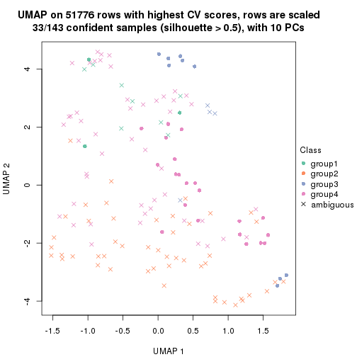</p>

</div>
<div id='tab-CV-hclust-dimension-reduction-4'>
<pre><code class="r">dimension_reduction(res, k = 5, method = &quot;UMAP&quot;)
</code></pre>

<p></p>

</div>
<div id='tab-CV-hclust-dimension-reduction-5'>
<pre><code class="r">dimension_reduction(res, k = 6, method = &quot;UMAP&quot;)
</code></pre>

<p></p>

</div>
</div>


Following heatmap shows how subgroups are split when increasing `k`:

```r
collect_classes(res)
```


Test correlation between subgroups and known annotations. If the known
annotation is numeric, one-way ANOVA test is applied, and if the known
annotation is discrete, chi-squared contingency table test is applied.

```r
test_to_known_factors(res)
```

```
#>             n disease.state(p) k
#> CV:hclust 126         4.58e-01 2
#> CV:hclust  89         2.43e-05 3
#> CV:hclust  33         2.46e-01 4
#> CV:hclust  75         8.58e-04 5
#> CV:hclust  58         7.13e-03 6
```


If matrix rows can be associated to genes, consider to use `GO_Enrichment(res,
...)` to perform function enrichment for the signature genes.


 

---------------------------------------------------


### CV:kmeans


The object with results only for a single top-value method and a single partition method 
can be extracted as:

```r
res = res_list["CV", "kmeans"]
# you can also extract it by
# res = res_list["CV:kmeans"]
```

A summary of `res` and all the functions that can be applied to it:

```r
res
```

```
#> A 'ConsensusPartition' object with k = 2, 3, 4, 5, 6.
#>   On a matrix with 51776 rows and 143 columns.
#>   Top rows (1000, 2000, 3000, 4000, 5000) are extracted by 'CV' method.
#>   Subgroups are detected by 'kmeans' method.
#>   Performed in total 1250 partitions by row resampling.
#>   Best k for subgroups seems to be 3.
#> 
#> Following methods can be applied to this 'ConsensusPartition' object:
#>  [1] "cola_report"             "collect_classes"         "collect_plots"          
#>  [4] "collect_stats"           "colnames"                "compare_signatures"     
#>  [7] "consensus_heatmap"       "dimension_reduction"     "functional_enrichment"  
#> [10] "get_anno_col"            "get_anno"                "get_classes"            
#> [13] "get_consensus"           "get_matrix"              "get_membership"         
#> [16] "get_param"               "get_signatures"          "get_stats"              
#> [19] "is_best_k"               "is_stable_k"             "membership_heatmap"     
#> [22] "ncol"                    "nrow"                    "plot_ecdf"              
#> [25] "rownames"                "select_partition_number" "show"                   
#> [28] "suggest_best_k"          "test_to_known_factors"
```

`collect_plots()` function collects all the plots made from `res` for all `k` (number of partitions)
into one single page to provide an easy and fast comparison between different `k`.

```r
collect_plots(res)
```


The plots are:

- The first row: a plot of the ECDF (Empirical cumulative distribution
  function) curves of the consensus matrix for each `k` and the heatmap of
  predicted classes for each `k`.
- The second row: heatmaps of the consensus matrix for each `k`.
- The third row: heatmaps of the membership matrix for each `k`.
- The fouth row: heatmaps of the signatures for each `k`.

All the plots in panels can be made by individual functions and they are
plotted later in this section.

`select_partition_number()` produces several plots showing different
statistics for choosing "optimized" `k`. There are following statistics:

- ECDF curves of the consensus matrix for each `k`;
- 1-PAC. [The PAC
  score](https://en.wikipedia.org/wiki/Consensus_clustering#Over-interpretation_potential_of_consensus_clustering)
  measures the proportion of the ambiguous subgrouping.
- Mean silhouette score.
- Concordance. The mean probability of fiting the consensus class ids in all
  partitions.
- Area increased. Denote $A_k$ as the area under the ECDF curve for current
  `k`, the area increased is defined as $A_k - A_{k-1}$.
- Rand index. The percent of pairs of samples that are both in a same cluster
  or both are not in a same cluster in the partition of k and k-1.
- Jaccard index. The ratio of pairs of samples are both in a same cluster in
  the partition of k and k-1 and the pairs of samples are both in a same
  cluster in the partition k or k-1.

The detailed explanations of these statistics can be found in [the cola
vignette](http://bioconductor.org/packages/devel/bioc/vignettes/cola/inst/doc/cola.html#toc_13).

Generally speaking, lower PAC score, higher mean silhouette score or higher
concordance corresponds to better partition. Rand index and Jaccard index
measure how similar the current partition is compared to partition with `k-1`.
If they are too similar, we won't accept `k` is better than `k-1`.

```r
select_partition_number(res)
```


The numeric values for all these statistics can be obtained by `get_stats()`.

```r
get_stats(res)
```

```
#>   k 1-PAC mean_silhouette concordance area_increased  Rand Jaccard
#> 2 2 0.484           0.810       0.894         0.4264 0.582   0.582
#> 3 3 0.719           0.852       0.913         0.4892 0.677   0.494
#> 4 4 0.567           0.520       0.757         0.1466 0.736   0.410
#> 5 5 0.621           0.516       0.688         0.0690 0.829   0.494
#> 6 6 0.670           0.612       0.760         0.0471 0.869   0.530
```

`suggest_best_k()` suggests the best $k$ based on these statistics. The rules are as follows:

- All $k$ with Jaccard index larger than 0.95 are removed because the increase of
  the partition number does not provides enough extra information. If all $k$ are removed,
  the best $k$ is assigned by `NA`.
- For $k$ with 1-PAC larger than 0.9, the maximal $k$ is taken as the "best k". Other $k$ is called "optional k".
- If it does not fit the second rule. The $k$ with the highest vote of highest
  1-PAC, mean silhouette and concordance is taken as the "best k".

```r
suggest_best_k(res)
```

```
#> [1] 3
```


Following shows the table of the partitions (You need to click the **show/hide
code output** link to see it). The membership matrix (columns with name `p*`)
is inferred by
[`clue::cl_consensus()`](https://www.rdocumentation.org/link/cl_consensus?package=clue)
function with the `SE` method. Basically the value in the membership matrix
represents the probability to belong to a certain group. The finall class
label for an item is determined with the group with highest probability it
belongs to.

In `get_classes()` function, the entropy is calculated from the membership
matrix and the silhouette score is calculated from the consensus matrix.


<script>
$( function() {
	$( '#tabs-CV-kmeans-get-classes' ).tabs();
} );
</script>
<div id='tabs-CV-kmeans-get-classes'>
<ul>
<li><a href='#tab-CV-kmeans-get-classes-1'>k = 2</a></li>
<li><a href='#tab-CV-kmeans-get-classes-2'>k = 3</a></li>
<li><a href='#tab-CV-kmeans-get-classes-3'>k = 4</a></li>
<li><a href='#tab-CV-kmeans-get-classes-4'>k = 5</a></li>
<li><a href='#tab-CV-kmeans-get-classes-5'>k = 6</a></li>
</ul>

<div id='tab-CV-kmeans-get-classes-1'>
<p><a id='tab-CV-kmeans-get-classes-1-a' style='color:#0366d6' href='#'>show/hide code output</a></p>
<pre><code class="r">cbind(get_classes(res, k = 2), get_membership(res, k = 2))
</code></pre>

<pre><code>#&gt;           class entropy silhouette    p1    p2
#&gt; GSM550785     2  0.7883     0.7754 0.236 0.764
#&gt; GSM550786     1  0.6438     0.8146 0.836 0.164
#&gt; GSM550788     2  0.0000     0.8842 0.000 1.000
#&gt; GSM550789     2  0.0000     0.8842 0.000 1.000
#&gt; GSM550790     2  0.8016     0.7702 0.244 0.756
#&gt; GSM550791     2  0.8016     0.7702 0.244 0.756
#&gt; GSM550792     2  0.0000     0.8842 0.000 1.000
#&gt; GSM550796     2  0.0000     0.8842 0.000 1.000
#&gt; GSM550797     2  0.0000     0.8842 0.000 1.000
#&gt; GSM550799     1  0.7056     0.8002 0.808 0.192
#&gt; GSM550800     2  0.0000     0.8842 0.000 1.000
#&gt; GSM550801     2  0.0000     0.8842 0.000 1.000
#&gt; GSM550804     2  0.0000     0.8842 0.000 1.000
#&gt; GSM550806     1  0.0938     0.8357 0.988 0.012
#&gt; GSM550807     2  0.0000     0.8842 0.000 1.000
#&gt; GSM550808     2  0.5519     0.7425 0.128 0.872
#&gt; GSM550809     2  0.8016     0.7702 0.244 0.756
#&gt; GSM550810     2  0.0000     0.8842 0.000 1.000
#&gt; GSM550811     2  0.8016     0.7702 0.244 0.756
#&gt; GSM550813     2  0.0000     0.8842 0.000 1.000
#&gt; GSM550814     2  0.0000     0.8842 0.000 1.000
#&gt; GSM550815     2  0.0000     0.8842 0.000 1.000
#&gt; GSM550816     2  0.0000     0.8842 0.000 1.000
#&gt; GSM550817     1  0.6623     0.8112 0.828 0.172
#&gt; GSM550818     1  0.2948     0.8361 0.948 0.052
#&gt; GSM550819     2  0.0000     0.8842 0.000 1.000
#&gt; GSM550820     2  0.8016     0.7702 0.244 0.756
#&gt; GSM550821     1  0.9608     0.6203 0.616 0.384
#&gt; GSM550822     2  0.0000     0.8842 0.000 1.000
#&gt; GSM550826     1  0.4815     0.7773 0.896 0.104
#&gt; GSM550832     2  0.0000     0.8842 0.000 1.000
#&gt; GSM550833     2  0.0000     0.8842 0.000 1.000
#&gt; GSM550835     1  0.8016     0.7607 0.756 0.244
#&gt; GSM550836     1  0.0000     0.8333 1.000 0.000
#&gt; GSM550837     1  0.9775     0.5722 0.588 0.412
#&gt; GSM550838     2  0.9087     0.6641 0.324 0.676
#&gt; GSM550841     1  0.7056     0.8002 0.808 0.192
#&gt; GSM550842     1  0.9393     0.6587 0.644 0.356
#&gt; GSM550846     2  0.0376     0.8835 0.004 0.996
#&gt; GSM550849     2  0.7950     0.7713 0.240 0.760
#&gt; GSM550850     2  0.8016     0.7702 0.244 0.756
#&gt; GSM550851     1  0.9580     0.6263 0.620 0.380
#&gt; GSM550852     2  0.0000     0.8842 0.000 1.000
#&gt; GSM550853     2  0.0000     0.8842 0.000 1.000
#&gt; GSM550855     2  0.0000     0.8842 0.000 1.000
#&gt; GSM550856     2  0.0000     0.8842 0.000 1.000
#&gt; GSM550861     2  0.0000     0.8842 0.000 1.000
#&gt; GSM550863     2  0.0938     0.8820 0.012 0.988
#&gt; GSM550864     2  0.0000     0.8842 0.000 1.000
#&gt; GSM550866     2  0.0000     0.8842 0.000 1.000
#&gt; GSM550867     2  0.8016     0.7702 0.244 0.756
#&gt; GSM550885     2  0.8016     0.7702 0.244 0.756
#&gt; GSM550886     1  0.7883     0.7642 0.764 0.236
#&gt; GSM550887     2  0.0000     0.8842 0.000 1.000
#&gt; GSM550889     2  0.0938     0.8820 0.012 0.988
#&gt; GSM550894     2  0.0000     0.8842 0.000 1.000
#&gt; GSM550897     2  0.7883     0.7754 0.236 0.764
#&gt; GSM550903     2  0.0000     0.8842 0.000 1.000
#&gt; GSM550905     1  0.9922     0.4976 0.552 0.448
#&gt; GSM550906     2  0.0000     0.8842 0.000 1.000
#&gt; GSM550907     1  0.0938     0.8357 0.988 0.012
#&gt; GSM550909     2  0.5737     0.7303 0.136 0.864
#&gt; GSM550911     1  0.0938     0.8357 0.988 0.012
#&gt; GSM550913     2  0.0000     0.8842 0.000 1.000
#&gt; GSM550915     2  0.0938     0.8820 0.012 0.988
#&gt; GSM550917     2  0.0000     0.8842 0.000 1.000
#&gt; GSM550919     2  0.0938     0.8820 0.012 0.988
#&gt; GSM550921     1  0.0376     0.8346 0.996 0.004
#&gt; GSM550924     2  0.9850     0.0452 0.428 0.572
#&gt; GSM550926     2  0.0000     0.8842 0.000 1.000
#&gt; GSM550927     2  0.0000     0.8842 0.000 1.000
#&gt; GSM550787     1  0.6623     0.7198 0.828 0.172
#&gt; GSM550793     1  0.0000     0.8333 1.000 0.000
#&gt; GSM550794     2  0.0000     0.8842 0.000 1.000
#&gt; GSM550795     2  0.8016     0.7702 0.244 0.756
#&gt; GSM550798     1  0.0000     0.8333 1.000 0.000
#&gt; GSM550803     2  0.8016     0.7702 0.244 0.756
#&gt; GSM550805     2  0.7950     0.7713 0.240 0.760
#&gt; GSM550823     2  0.0000     0.8842 0.000 1.000
#&gt; GSM550824     2  0.8016     0.7702 0.244 0.756
#&gt; GSM550825     1  0.0000     0.8333 1.000 0.000
#&gt; GSM550827     2  0.0938     0.8820 0.012 0.988
#&gt; GSM550828     2  0.7883     0.7754 0.236 0.764
#&gt; GSM550829     1  0.0000     0.8333 1.000 0.000
#&gt; GSM550830     2  0.0376     0.8833 0.004 0.996
#&gt; GSM550834     2  0.8016     0.7702 0.244 0.756
#&gt; GSM550839     1  0.7219     0.7979 0.800 0.200
#&gt; GSM550840     2  0.8016     0.7702 0.244 0.756
#&gt; GSM550843     1  0.6148     0.8182 0.848 0.152
#&gt; GSM550844     2  0.8016     0.7702 0.244 0.756
#&gt; GSM550845     2  0.0000     0.8842 0.000 1.000
#&gt; GSM550848     2  0.0938     0.8820 0.012 0.988
#&gt; GSM550854     2  0.8016     0.7702 0.244 0.756
#&gt; GSM550857     1  0.0000     0.8333 1.000 0.000
#&gt; GSM550858     2  0.7950     0.7729 0.240 0.760
#&gt; GSM550859     2  0.8016     0.7702 0.244 0.756
#&gt; GSM550862     2  0.7883     0.7754 0.236 0.764
#&gt; GSM550865     2  0.0938     0.8820 0.012 0.988
#&gt; GSM550868     2  0.0938     0.8820 0.012 0.988
#&gt; GSM550869     1  0.9710     0.2037 0.600 0.400
#&gt; GSM550870     2  0.0000     0.8842 0.000 1.000
#&gt; GSM550871     1  0.8016     0.7732 0.756 0.244
#&gt; GSM550872     2  0.0938     0.8820 0.012 0.988
#&gt; GSM550873     2  0.0000     0.8842 0.000 1.000
#&gt; GSM550874     2  0.0000     0.8842 0.000 1.000
#&gt; GSM550876     1  0.7056     0.8002 0.808 0.192
#&gt; GSM550877     2  0.0000     0.8842 0.000 1.000
#&gt; GSM550878     1  0.2948     0.8361 0.948 0.052
#&gt; GSM550879     2  0.7883     0.7754 0.236 0.764
#&gt; GSM550882     1  0.0672     0.8353 0.992 0.008
#&gt; GSM550888     1  0.0000     0.8333 1.000 0.000
#&gt; GSM550890     2  0.0938     0.8820 0.012 0.988
#&gt; GSM550891     1  0.0672     0.8353 0.992 0.008
#&gt; GSM550892     2  0.7602     0.7839 0.220 0.780
#&gt; GSM550893     2  0.0000     0.8842 0.000 1.000
#&gt; GSM550895     2  0.0000     0.8842 0.000 1.000
#&gt; GSM550896     2  0.0000     0.8842 0.000 1.000
#&gt; GSM550898     2  0.8016     0.7702 0.244 0.756
#&gt; GSM550899     2  0.0000     0.8842 0.000 1.000
#&gt; GSM550900     2  0.0938     0.8820 0.012 0.988
#&gt; GSM550901     2  0.5408     0.8329 0.124 0.876
#&gt; GSM550902     1  0.8081     0.5842 0.752 0.248
#&gt; GSM550904     2  0.8016     0.7702 0.244 0.756
#&gt; GSM550908     1  0.0000     0.8333 1.000 0.000
#&gt; GSM550912     2  0.0000     0.8842 0.000 1.000
#&gt; GSM550914     2  0.0938     0.8820 0.012 0.988
#&gt; GSM550918     2  0.0000     0.8842 0.000 1.000
#&gt; GSM550922     1  0.7883     0.7642 0.764 0.236
#&gt; GSM550923     1  0.9460     0.2807 0.636 0.364
#&gt; GSM550925     2  0.7453     0.7878 0.212 0.788
#&gt; GSM550802     2  0.0000     0.8842 0.000 1.000
#&gt; GSM550812     2  0.0000     0.8842 0.000 1.000
#&gt; GSM550831     2  0.8016     0.7702 0.244 0.756
#&gt; GSM550847     2  0.8016     0.7702 0.244 0.756
#&gt; GSM550860     1  0.0376     0.8346 0.996 0.004
#&gt; GSM550875     2  0.8016     0.7702 0.244 0.756
#&gt; GSM550880     2  0.7883     0.7754 0.236 0.764
#&gt; GSM550881     1  0.0376     0.8346 0.996 0.004
#&gt; GSM550883     1  0.0000     0.8333 1.000 0.000
#&gt; GSM550884     2  0.0000     0.8842 0.000 1.000
#&gt; GSM550910     1  0.6623     0.8112 0.828 0.172
#&gt; GSM550916     2  0.8016     0.7702 0.244 0.756
#&gt; GSM550920     1  0.6438     0.8146 0.836 0.164
</code></pre>

<script>
$('#tab-CV-kmeans-get-classes-1-a').parent().next().next().hide();
$('#tab-CV-kmeans-get-classes-1-a').click(function(){
  $('#tab-CV-kmeans-get-classes-1-a').parent().next().next().toggle();
  return(false);
});
</script>
</div>

<div id='tab-CV-kmeans-get-classes-2'>
<p><a id='tab-CV-kmeans-get-classes-2-a' style='color:#0366d6' href='#'>show/hide code output</a></p>
<pre><code class="r">cbind(get_classes(res, k = 3), get_membership(res, k = 3))
</code></pre>

<pre><code>#&gt;           class entropy silhouette    p1    p2    p3
#&gt; GSM550785     1  0.2448      0.925 0.924 0.076 0.000
#&gt; GSM550786     3  0.2356      0.933 0.072 0.000 0.928
#&gt; GSM550788     2  0.0000      0.881 0.000 1.000 0.000
#&gt; GSM550789     2  0.0000      0.881 0.000 1.000 0.000
#&gt; GSM550790     1  0.2165      0.925 0.936 0.064 0.000
#&gt; GSM550791     1  0.2066      0.924 0.940 0.060 0.000
#&gt; GSM550792     2  0.5098      0.756 0.248 0.752 0.000
#&gt; GSM550796     2  0.0000      0.881 0.000 1.000 0.000
#&gt; GSM550797     2  0.0000      0.881 0.000 1.000 0.000
#&gt; GSM550799     3  0.0237      0.965 0.004 0.000 0.996
#&gt; GSM550800     2  0.0000      0.881 0.000 1.000 0.000
#&gt; GSM550801     2  0.0000      0.881 0.000 1.000 0.000
#&gt; GSM550804     2  0.0000      0.881 0.000 1.000 0.000
#&gt; GSM550806     3  0.0237      0.965 0.004 0.000 0.996
#&gt; GSM550807     2  0.0000      0.881 0.000 1.000 0.000
#&gt; GSM550808     2  0.2448      0.847 0.076 0.924 0.000
#&gt; GSM550809     1  0.0000      0.895 1.000 0.000 0.000
#&gt; GSM550810     2  0.2448      0.847 0.076 0.924 0.000
#&gt; GSM550811     1  0.3038      0.835 0.896 0.104 0.000
#&gt; GSM550813     2  0.0000      0.881 0.000 1.000 0.000
#&gt; GSM550814     2  0.2165      0.853 0.064 0.936 0.000
#&gt; GSM550815     2  0.0000      0.881 0.000 1.000 0.000
#&gt; GSM550816     2  0.0000      0.881 0.000 1.000 0.000
#&gt; GSM550817     3  0.0237      0.965 0.004 0.000 0.996
#&gt; GSM550818     3  0.0237      0.965 0.004 0.000 0.996
#&gt; GSM550819     2  0.3192      0.845 0.112 0.888 0.000
#&gt; GSM550820     1  0.0237      0.898 0.996 0.004 0.000
#&gt; GSM550821     2  0.7106      0.624 0.076 0.700 0.224
#&gt; GSM550822     2  0.0000      0.881 0.000 1.000 0.000
#&gt; GSM550826     1  0.4702      0.684 0.788 0.000 0.212
#&gt; GSM550832     2  0.2165      0.853 0.064 0.936 0.000
#&gt; GSM550833     2  0.0000      0.881 0.000 1.000 0.000
#&gt; GSM550835     3  0.5319      0.830 0.072 0.104 0.824
#&gt; GSM550836     3  0.0000      0.965 0.000 0.000 1.000
#&gt; GSM550837     2  0.5331      0.779 0.076 0.824 0.100
#&gt; GSM550838     1  0.0000      0.895 1.000 0.000 0.000
#&gt; GSM550841     3  0.0237      0.965 0.004 0.000 0.996
#&gt; GSM550842     2  0.7184      0.602 0.072 0.688 0.240
#&gt; GSM550846     2  0.5560      0.640 0.300 0.700 0.000
#&gt; GSM550849     1  0.1411      0.883 0.964 0.036 0.000
#&gt; GSM550850     1  0.2066      0.924 0.940 0.060 0.000
#&gt; GSM550851     2  0.7222      0.595 0.072 0.684 0.244
#&gt; GSM550852     2  0.2356      0.849 0.072 0.928 0.000
#&gt; GSM550853     2  0.0000      0.881 0.000 1.000 0.000
#&gt; GSM550855     2  0.0000      0.881 0.000 1.000 0.000
#&gt; GSM550856     2  0.0000      0.881 0.000 1.000 0.000
#&gt; GSM550861     2  0.0000      0.881 0.000 1.000 0.000
#&gt; GSM550863     2  0.5785      0.581 0.332 0.668 0.000
#&gt; GSM550864     2  0.0000      0.881 0.000 1.000 0.000
#&gt; GSM550866     2  0.0000      0.881 0.000 1.000 0.000
#&gt; GSM550867     1  0.2448      0.925 0.924 0.076 0.000
#&gt; GSM550885     1  0.2448      0.925 0.924 0.076 0.000
#&gt; GSM550886     3  0.2400      0.936 0.064 0.004 0.932
#&gt; GSM550887     2  0.0000      0.881 0.000 1.000 0.000
#&gt; GSM550889     2  0.5291      0.672 0.268 0.732 0.000
#&gt; GSM550894     2  0.2261      0.851 0.068 0.932 0.000
#&gt; GSM550897     1  0.2448      0.925 0.924 0.076 0.000
#&gt; GSM550903     2  0.0000      0.881 0.000 1.000 0.000
#&gt; GSM550905     2  0.4565      0.809 0.076 0.860 0.064
#&gt; GSM550906     2  0.0000      0.881 0.000 1.000 0.000
#&gt; GSM550907     3  0.0000      0.965 0.000 0.000 1.000
#&gt; GSM550909     2  0.5000      0.814 0.124 0.832 0.044
#&gt; GSM550911     3  0.0000      0.965 0.000 0.000 1.000
#&gt; GSM550913     2  0.0000      0.881 0.000 1.000 0.000
#&gt; GSM550915     2  0.5591      0.627 0.304 0.696 0.000
#&gt; GSM550917     2  0.0000      0.881 0.000 1.000 0.000
#&gt; GSM550919     2  0.5465      0.649 0.288 0.712 0.000
#&gt; GSM550921     3  0.0000      0.965 0.000 0.000 1.000
#&gt; GSM550924     2  0.9281      0.480 0.276 0.520 0.204
#&gt; GSM550926     2  0.0000      0.881 0.000 1.000 0.000
#&gt; GSM550927     2  0.0000      0.881 0.000 1.000 0.000
#&gt; GSM550787     1  0.5497      0.539 0.708 0.000 0.292
#&gt; GSM550793     3  0.2356      0.933 0.072 0.000 0.928
#&gt; GSM550794     2  0.5835      0.650 0.340 0.660 0.000
#&gt; GSM550795     1  0.2165      0.925 0.936 0.064 0.000
#&gt; GSM550798     1  0.3038      0.812 0.896 0.000 0.104
#&gt; GSM550803     1  0.1289      0.913 0.968 0.032 0.000
#&gt; GSM550805     1  0.1753      0.879 0.952 0.048 0.000
#&gt; GSM550823     2  0.3412      0.832 0.124 0.876 0.000
#&gt; GSM550824     1  0.2448      0.925 0.924 0.076 0.000
#&gt; GSM550825     3  0.0000      0.965 0.000 0.000 1.000
#&gt; GSM550827     2  0.5560      0.634 0.300 0.700 0.000
#&gt; GSM550828     1  0.2448      0.925 0.924 0.076 0.000
#&gt; GSM550829     1  0.5948      0.378 0.640 0.000 0.360
#&gt; GSM550830     2  0.4399      0.760 0.188 0.812 0.000
#&gt; GSM550834     1  0.2165      0.925 0.936 0.064 0.000
#&gt; GSM550839     3  0.5319      0.830 0.072 0.104 0.824
#&gt; GSM550840     1  0.2165      0.925 0.936 0.064 0.000
#&gt; GSM550843     3  0.0237      0.965 0.004 0.000 0.996
#&gt; GSM550844     1  0.0237      0.898 0.996 0.004 0.000
#&gt; GSM550845     2  0.0000      0.881 0.000 1.000 0.000
#&gt; GSM550848     2  0.5497      0.643 0.292 0.708 0.000
#&gt; GSM550854     1  0.2448      0.925 0.924 0.076 0.000
#&gt; GSM550857     3  0.0000      0.965 0.000 0.000 1.000
#&gt; GSM550858     1  0.2448      0.925 0.924 0.076 0.000
#&gt; GSM550859     1  0.2448      0.925 0.924 0.076 0.000
#&gt; GSM550862     1  0.2448      0.925 0.924 0.076 0.000
#&gt; GSM550865     2  0.5529      0.638 0.296 0.704 0.000
#&gt; GSM550868     2  0.5706      0.602 0.320 0.680 0.000
#&gt; GSM550869     1  0.6595      0.667 0.744 0.076 0.180
#&gt; GSM550870     2  0.0000      0.881 0.000 1.000 0.000
#&gt; GSM550871     3  0.5481      0.822 0.076 0.108 0.816
#&gt; GSM550872     2  0.5926      0.532 0.356 0.644 0.000
#&gt; GSM550873     2  0.2448      0.847 0.076 0.924 0.000
#&gt; GSM550874     2  0.0000      0.881 0.000 1.000 0.000
#&gt; GSM550876     3  0.1529      0.952 0.040 0.000 0.960
#&gt; GSM550877     2  0.0000      0.881 0.000 1.000 0.000
#&gt; GSM550878     3  0.0000      0.965 0.000 0.000 1.000
#&gt; GSM550879     1  0.2448      0.925 0.924 0.076 0.000
#&gt; GSM550882     3  0.0000      0.965 0.000 0.000 1.000
#&gt; GSM550888     3  0.0000      0.965 0.000 0.000 1.000
#&gt; GSM550890     2  0.5650      0.615 0.312 0.688 0.000
#&gt; GSM550891     3  0.0000      0.965 0.000 0.000 1.000
#&gt; GSM550892     1  0.2448      0.925 0.924 0.076 0.000
#&gt; GSM550893     2  0.0000      0.881 0.000 1.000 0.000
#&gt; GSM550895     2  0.0000      0.881 0.000 1.000 0.000
#&gt; GSM550896     2  0.0000      0.881 0.000 1.000 0.000
#&gt; GSM550898     1  0.2448      0.925 0.924 0.076 0.000
#&gt; GSM550899     2  0.0000      0.881 0.000 1.000 0.000
#&gt; GSM550900     2  0.5733      0.597 0.324 0.676 0.000
#&gt; GSM550901     1  0.2448      0.925 0.924 0.076 0.000
#&gt; GSM550902     1  0.4605      0.696 0.796 0.000 0.204
#&gt; GSM550904     1  0.0000      0.895 1.000 0.000 0.000
#&gt; GSM550908     3  0.0000      0.965 0.000 0.000 1.000
#&gt; GSM550912     2  0.0000      0.881 0.000 1.000 0.000
#&gt; GSM550914     2  0.5497      0.645 0.292 0.708 0.000
#&gt; GSM550918     2  0.0000      0.881 0.000 1.000 0.000
#&gt; GSM550922     3  0.1529      0.952 0.040 0.000 0.960
#&gt; GSM550923     1  0.0000      0.895 1.000 0.000 0.000
#&gt; GSM550925     1  0.2448      0.925 0.924 0.076 0.000
#&gt; GSM550802     2  0.3686      0.834 0.140 0.860 0.000
#&gt; GSM550812     2  0.4555      0.798 0.200 0.800 0.000
#&gt; GSM550831     1  0.2066      0.924 0.940 0.060 0.000
#&gt; GSM550847     1  0.2448      0.925 0.924 0.076 0.000
#&gt; GSM550860     3  0.2356      0.933 0.072 0.000 0.928
#&gt; GSM550875     1  0.0747      0.892 0.984 0.016 0.000
#&gt; GSM550880     1  0.2448      0.925 0.924 0.076 0.000
#&gt; GSM550881     3  0.0000      0.965 0.000 0.000 1.000
#&gt; GSM550883     3  0.0000      0.965 0.000 0.000 1.000
#&gt; GSM550884     2  0.4452      0.804 0.192 0.808 0.000
#&gt; GSM550910     3  0.1289      0.956 0.032 0.000 0.968
#&gt; GSM550916     1  0.2261      0.925 0.932 0.068 0.000
#&gt; GSM550920     3  0.1643      0.950 0.044 0.000 0.956
</code></pre>

<script>
$('#tab-CV-kmeans-get-classes-2-a').parent().next().next().hide();
$('#tab-CV-kmeans-get-classes-2-a').click(function(){
  $('#tab-CV-kmeans-get-classes-2-a').parent().next().next().toggle();
  return(false);
});
</script>
</div>

<div id='tab-CV-kmeans-get-classes-3'>
<p><a id='tab-CV-kmeans-get-classes-3-a' style='color:#0366d6' href='#'>show/hide code output</a></p>
<pre><code class="r">cbind(get_classes(res, k = 4), get_membership(res, k = 4))
</code></pre>

<pre><code>#&gt;           class entropy silhouette    p1    p2    p3    p4
#&gt; GSM550785     1  0.4406    0.56831 0.700 0.000 0.000 0.300
#&gt; GSM550786     4  0.5957    0.02932 0.000 0.048 0.364 0.588
#&gt; GSM550788     2  0.0000    0.83807 0.000 1.000 0.000 0.000
#&gt; GSM550789     2  0.0000    0.83807 0.000 1.000 0.000 0.000
#&gt; GSM550790     1  0.4585    0.55739 0.668 0.000 0.000 0.332
#&gt; GSM550791     1  0.4994    0.48458 0.520 0.000 0.000 0.480
#&gt; GSM550792     4  0.7028    0.51013 0.196 0.228 0.000 0.576
#&gt; GSM550796     2  0.0000    0.83807 0.000 1.000 0.000 0.000
#&gt; GSM550797     2  0.0000    0.83807 0.000 1.000 0.000 0.000
#&gt; GSM550799     3  0.4564    0.64028 0.000 0.000 0.672 0.328
#&gt; GSM550800     2  0.0469    0.83777 0.012 0.988 0.000 0.000
#&gt; GSM550801     2  0.0000    0.83807 0.000 1.000 0.000 0.000
#&gt; GSM550804     2  0.3569    0.80146 0.196 0.804 0.000 0.000
#&gt; GSM550806     3  0.3873    0.72663 0.000 0.000 0.772 0.228
#&gt; GSM550807     2  0.0000    0.83807 0.000 1.000 0.000 0.000
#&gt; GSM550808     4  0.4898    0.43709 0.000 0.416 0.000 0.584
#&gt; GSM550809     4  0.4977   -0.28625 0.460 0.000 0.000 0.540
#&gt; GSM550810     2  0.3942    0.47504 0.000 0.764 0.000 0.236
#&gt; GSM550811     4  0.4539    0.40994 0.272 0.008 0.000 0.720
#&gt; GSM550813     2  0.2973    0.81715 0.144 0.856 0.000 0.000
#&gt; GSM550814     2  0.2256    0.79455 0.020 0.924 0.000 0.056
#&gt; GSM550815     2  0.0000    0.83807 0.000 1.000 0.000 0.000
#&gt; GSM550816     2  0.2345    0.82636 0.100 0.900 0.000 0.000
#&gt; GSM550817     3  0.4008    0.71615 0.000 0.000 0.756 0.244
#&gt; GSM550818     3  0.3907    0.72438 0.000 0.000 0.768 0.232
#&gt; GSM550819     4  0.7665    0.30978 0.304 0.240 0.000 0.456
#&gt; GSM550820     1  0.4843    0.40050 0.604 0.000 0.000 0.396
#&gt; GSM550821     4  0.6276    0.45769 0.048 0.368 0.008 0.576
#&gt; GSM550822     2  0.0000    0.83807 0.000 1.000 0.000 0.000
#&gt; GSM550826     4  0.4630    0.49252 0.196 0.000 0.036 0.768
#&gt; GSM550832     2  0.1637    0.78083 0.000 0.940 0.000 0.060
#&gt; GSM550833     2  0.0188    0.83536 0.000 0.996 0.000 0.004
#&gt; GSM550835     4  0.6964    0.32124 0.000 0.228 0.188 0.584
#&gt; GSM550836     3  0.0000    0.80632 0.000 0.000 1.000 0.000
#&gt; GSM550837     4  0.4866    0.45119 0.000 0.404 0.000 0.596
#&gt; GSM550838     4  0.4477   -0.12512 0.312 0.000 0.000 0.688
#&gt; GSM550841     3  0.4564    0.64028 0.000 0.000 0.672 0.328
#&gt; GSM550842     4  0.5846    0.37235 0.000 0.452 0.032 0.516
#&gt; GSM550846     1  0.7070    0.00518 0.516 0.348 0.000 0.136
#&gt; GSM550849     4  0.3123    0.36103 0.156 0.000 0.000 0.844
#&gt; GSM550850     1  0.4985    0.48933 0.532 0.000 0.000 0.468
#&gt; GSM550851     4  0.5827    0.39994 0.000 0.436 0.032 0.532
#&gt; GSM550852     2  0.4817    0.02521 0.000 0.612 0.000 0.388
#&gt; GSM550853     2  0.0000    0.83807 0.000 1.000 0.000 0.000
#&gt; GSM550855     2  0.0000    0.83807 0.000 1.000 0.000 0.000
#&gt; GSM550856     2  0.3486    0.80480 0.188 0.812 0.000 0.000
#&gt; GSM550861     2  0.0000    0.83807 0.000 1.000 0.000 0.000
#&gt; GSM550863     1  0.5769    0.05688 0.588 0.376 0.000 0.036
#&gt; GSM550864     2  0.3528    0.80343 0.192 0.808 0.000 0.000
#&gt; GSM550866     2  0.3528    0.80343 0.192 0.808 0.000 0.000
#&gt; GSM550867     1  0.4431    0.56802 0.696 0.000 0.000 0.304
#&gt; GSM550885     1  0.4406    0.56831 0.700 0.000 0.000 0.300
#&gt; GSM550886     4  0.6140   -0.22918 0.000 0.048 0.452 0.500
#&gt; GSM550887     2  0.0000    0.83807 0.000 1.000 0.000 0.000
#&gt; GSM550889     1  0.5935   -0.22274 0.496 0.468 0.000 0.036
#&gt; GSM550894     2  0.1716    0.77590 0.000 0.936 0.000 0.064
#&gt; GSM550897     1  0.1398    0.45816 0.956 0.004 0.000 0.040
#&gt; GSM550903     2  0.0000    0.83807 0.000 1.000 0.000 0.000
#&gt; GSM550905     4  0.4941    0.40851 0.000 0.436 0.000 0.564
#&gt; GSM550906     2  0.0000    0.83807 0.000 1.000 0.000 0.000
#&gt; GSM550907     3  0.0000    0.80632 0.000 0.000 1.000 0.000
#&gt; GSM550909     4  0.6323    0.54040 0.164 0.176 0.000 0.660
#&gt; GSM550911     3  0.0000    0.80632 0.000 0.000 1.000 0.000
#&gt; GSM550913     2  0.0000    0.83807 0.000 1.000 0.000 0.000
#&gt; GSM550915     1  0.5805    0.02698 0.576 0.388 0.000 0.036
#&gt; GSM550917     2  0.3569    0.80146 0.196 0.804 0.000 0.000
#&gt; GSM550919     1  0.5847   -0.02248 0.560 0.404 0.000 0.036
#&gt; GSM550921     3  0.0000    0.80632 0.000 0.000 1.000 0.000
#&gt; GSM550924     4  0.5979    0.51275 0.292 0.044 0.012 0.652
#&gt; GSM550926     2  0.3528    0.80329 0.192 0.808 0.000 0.000
#&gt; GSM550927     2  0.0000    0.83807 0.000 1.000 0.000 0.000
#&gt; GSM550787     4  0.4037    0.50451 0.112 0.000 0.056 0.832
#&gt; GSM550793     4  0.6189    0.06514 0.060 0.000 0.372 0.568
#&gt; GSM550794     4  0.7001    0.42428 0.316 0.140 0.000 0.544
#&gt; GSM550795     1  0.4994    0.48657 0.520 0.000 0.000 0.480
#&gt; GSM550798     4  0.5281   -0.36705 0.464 0.000 0.008 0.528
#&gt; GSM550803     1  0.4730    0.54043 0.636 0.000 0.000 0.364
#&gt; GSM550805     4  0.4040    0.48430 0.248 0.000 0.000 0.752
#&gt; GSM550823     2  0.7519    0.35046 0.312 0.480 0.000 0.208
#&gt; GSM550824     1  0.4431    0.56802 0.696 0.000 0.000 0.304
#&gt; GSM550825     3  0.0000    0.80632 0.000 0.000 1.000 0.000
#&gt; GSM550827     1  0.5781    0.04712 0.584 0.380 0.000 0.036
#&gt; GSM550828     1  0.3688    0.54857 0.792 0.000 0.000 0.208
#&gt; GSM550829     4  0.6717   -0.01110 0.332 0.000 0.108 0.560
#&gt; GSM550830     2  0.6785    0.42681 0.352 0.540 0.000 0.108
#&gt; GSM550834     1  0.4985    0.49750 0.532 0.000 0.000 0.468
#&gt; GSM550839     4  0.6307    0.08645 0.012 0.048 0.344 0.596
#&gt; GSM550840     1  0.4994    0.48657 0.520 0.000 0.000 0.480
#&gt; GSM550843     3  0.4564    0.64028 0.000 0.000 0.672 0.328
#&gt; GSM550844     1  0.4624    0.37708 0.660 0.000 0.000 0.340
#&gt; GSM550845     2  0.3908    0.78324 0.212 0.784 0.000 0.004
#&gt; GSM550848     1  0.5816    0.01509 0.572 0.392 0.000 0.036
#&gt; GSM550854     1  0.4431    0.56802 0.696 0.000 0.000 0.304
#&gt; GSM550857     3  0.0000    0.80632 0.000 0.000 1.000 0.000
#&gt; GSM550858     1  0.4406    0.56831 0.700 0.000 0.000 0.300
#&gt; GSM550859     1  0.4431    0.56802 0.696 0.000 0.000 0.304
#&gt; GSM550862     1  0.4406    0.56831 0.700 0.000 0.000 0.300
#&gt; GSM550865     1  0.5888   -0.08765 0.540 0.424 0.000 0.036
#&gt; GSM550868     1  0.5769    0.05688 0.588 0.376 0.000 0.036
#&gt; GSM550869     4  0.4436    0.52979 0.216 0.000 0.020 0.764
#&gt; GSM550870     2  0.3569    0.80146 0.196 0.804 0.000 0.000
#&gt; GSM550871     4  0.6870    0.17435 0.044 0.048 0.308 0.600
#&gt; GSM550872     1  0.6309    0.11796 0.588 0.336 0.000 0.076
#&gt; GSM550873     4  0.5476    0.44925 0.020 0.396 0.000 0.584
#&gt; GSM550874     2  0.0188    0.83812 0.004 0.996 0.000 0.000
#&gt; GSM550876     3  0.4941    0.45775 0.000 0.000 0.564 0.436
#&gt; GSM550877     2  0.3569    0.80146 0.196 0.804 0.000 0.000
#&gt; GSM550878     3  0.1302    0.79592 0.000 0.000 0.956 0.044
#&gt; GSM550879     1  0.3356    0.51595 0.824 0.000 0.000 0.176
#&gt; GSM550882     3  0.0000    0.80632 0.000 0.000 1.000 0.000
#&gt; GSM550888     3  0.0000    0.80632 0.000 0.000 1.000 0.000
#&gt; GSM550890     1  0.5805    0.02698 0.576 0.388 0.000 0.036
#&gt; GSM550891     3  0.0000    0.80632 0.000 0.000 1.000 0.000
#&gt; GSM550892     1  0.0707    0.46705 0.980 0.000 0.000 0.020
#&gt; GSM550893     2  0.4123    0.77001 0.220 0.772 0.000 0.008
#&gt; GSM550895     2  0.5432    0.59857 0.316 0.652 0.000 0.032
#&gt; GSM550896     2  0.3569    0.80146 0.196 0.804 0.000 0.000
#&gt; GSM550898     1  0.4431    0.56802 0.696 0.000 0.000 0.304
#&gt; GSM550899     2  0.3569    0.80146 0.196 0.804 0.000 0.000
#&gt; GSM550900     1  0.5713    0.09030 0.604 0.360 0.000 0.036
#&gt; GSM550901     1  0.1716    0.47193 0.936 0.000 0.000 0.064
#&gt; GSM550902     4  0.5339    0.40384 0.356 0.000 0.020 0.624
#&gt; GSM550904     1  0.4981    0.21350 0.536 0.000 0.000 0.464
#&gt; GSM550908     3  0.0000    0.80632 0.000 0.000 1.000 0.000
#&gt; GSM550912     2  0.4228    0.75605 0.232 0.760 0.000 0.008
#&gt; GSM550914     1  0.5805    0.02698 0.576 0.388 0.000 0.036
#&gt; GSM550918     2  0.3569    0.80146 0.196 0.804 0.000 0.000
#&gt; GSM550922     3  0.6137    0.33273 0.000 0.048 0.504 0.448
#&gt; GSM550923     1  0.4888    0.50081 0.588 0.000 0.000 0.412
#&gt; GSM550925     1  0.1211    0.45985 0.960 0.000 0.000 0.040
#&gt; GSM550802     4  0.7211    0.50069 0.192 0.264 0.000 0.544
#&gt; GSM550812     4  0.7137    0.44852 0.288 0.168 0.000 0.544
#&gt; GSM550831     1  0.4985    0.48933 0.532 0.000 0.000 0.468
#&gt; GSM550847     1  0.4431    0.56802 0.696 0.000 0.000 0.304
#&gt; GSM550860     4  0.5792   -0.10046 0.032 0.000 0.416 0.552
#&gt; GSM550875     4  0.4222    0.41396 0.272 0.000 0.000 0.728
#&gt; GSM550880     1  0.4804    0.54222 0.616 0.000 0.000 0.384
#&gt; GSM550881     3  0.0000    0.80632 0.000 0.000 1.000 0.000
#&gt; GSM550883     3  0.0000    0.80632 0.000 0.000 1.000 0.000
#&gt; GSM550884     4  0.7506    0.36818 0.308 0.208 0.000 0.484
#&gt; GSM550910     3  0.4866    0.52122 0.000 0.000 0.596 0.404
#&gt; GSM550916     1  0.4431    0.56802 0.696 0.000 0.000 0.304
#&gt; GSM550920     3  0.4941    0.45706 0.000 0.000 0.564 0.436
</code></pre>

<script>
$('#tab-CV-kmeans-get-classes-3-a').parent().next().next().hide();
$('#tab-CV-kmeans-get-classes-3-a').click(function(){
  $('#tab-CV-kmeans-get-classes-3-a').parent().next().next().toggle();
  return(false);
});
</script>
</div>

<div id='tab-CV-kmeans-get-classes-4'>
<p><a id='tab-CV-kmeans-get-classes-4-a' style='color:#0366d6' href='#'>show/hide code output</a></p>
<pre><code class="r">cbind(get_classes(res, k = 5), get_membership(res, k = 5))
</code></pre>

<pre><code>#&gt;           class entropy silhouette    p1    p2    p3    p4    p5
#&gt; GSM550785     1  0.0162     0.6825 0.996 0.000 0.004 0.000 0.000
#&gt; GSM550786     5  0.4651     0.5238 0.000 0.000 0.020 0.372 0.608
#&gt; GSM550788     2  0.4183     0.6367 0.000 0.668 0.324 0.008 0.000
#&gt; GSM550789     2  0.3990     0.6404 0.000 0.688 0.308 0.004 0.000
#&gt; GSM550790     1  0.1704     0.6585 0.928 0.000 0.004 0.068 0.000
#&gt; GSM550791     1  0.4540     0.4949 0.656 0.000 0.024 0.320 0.000
#&gt; GSM550792     4  0.3343     0.5991 0.004 0.068 0.012 0.864 0.052
#&gt; GSM550796     2  0.4009     0.6385 0.000 0.684 0.312 0.004 0.000
#&gt; GSM550797     2  0.3990     0.6404 0.000 0.688 0.308 0.004 0.000
#&gt; GSM550799     5  0.2411     0.5752 0.000 0.000 0.008 0.108 0.884
#&gt; GSM550800     2  0.4046     0.6459 0.000 0.696 0.296 0.008 0.000
#&gt; GSM550801     2  0.3949     0.6436 0.000 0.696 0.300 0.004 0.000
#&gt; GSM550804     2  0.1872     0.6211 0.000 0.928 0.052 0.020 0.000
#&gt; GSM550806     5  0.3476     0.4201 0.000 0.000 0.076 0.088 0.836
#&gt; GSM550807     2  0.3949     0.6436 0.000 0.696 0.300 0.004 0.000
#&gt; GSM550808     5  0.7117     0.4380 0.000 0.032 0.280 0.208 0.480
#&gt; GSM550809     4  0.4565     0.2555 0.308 0.000 0.028 0.664 0.000
#&gt; GSM550810     2  0.6397     0.5217 0.000 0.540 0.312 0.132 0.016
#&gt; GSM550811     4  0.3205     0.5898 0.052 0.004 0.020 0.876 0.048
#&gt; GSM550813     2  0.2074     0.6499 0.000 0.896 0.104 0.000 0.000
#&gt; GSM550814     2  0.5105     0.6098 0.000 0.660 0.264 0.076 0.000
#&gt; GSM550815     2  0.4009     0.6400 0.000 0.684 0.312 0.004 0.000
#&gt; GSM550816     2  0.3596     0.6495 0.000 0.776 0.212 0.012 0.000
#&gt; GSM550817     5  0.3239     0.3981 0.000 0.000 0.080 0.068 0.852
#&gt; GSM550818     5  0.3719     0.3202 0.000 0.000 0.116 0.068 0.816
#&gt; GSM550819     4  0.6136     0.2707 0.000 0.364 0.024 0.536 0.076
#&gt; GSM550820     4  0.4702     0.1027 0.432 0.000 0.016 0.552 0.000
#&gt; GSM550821     5  0.6437     0.5534 0.000 0.028 0.120 0.288 0.564
#&gt; GSM550822     2  0.4029     0.6381 0.000 0.680 0.316 0.004 0.000
#&gt; GSM550826     4  0.4775     0.3749 0.036 0.008 0.000 0.688 0.268
#&gt; GSM550832     2  0.5122     0.6027 0.000 0.628 0.312 0.060 0.000
#&gt; GSM550833     2  0.4127     0.6365 0.000 0.680 0.312 0.008 0.000
#&gt; GSM550835     5  0.6427     0.5585 0.000 0.020 0.136 0.288 0.556
#&gt; GSM550836     3  0.5059     0.9751 0.000 0.000 0.548 0.036 0.416
#&gt; GSM550837     5  0.6836     0.4798 0.000 0.024 0.280 0.184 0.512
#&gt; GSM550838     4  0.5152     0.0933 0.392 0.000 0.024 0.572 0.012
#&gt; GSM550841     5  0.1952     0.5601 0.000 0.000 0.004 0.084 0.912
#&gt; GSM550842     5  0.6651     0.4835 0.000 0.028 0.280 0.148 0.544
#&gt; GSM550846     2  0.7328     0.0602 0.096 0.428 0.080 0.392 0.004
#&gt; GSM550849     4  0.5342     0.4542 0.176 0.000 0.032 0.712 0.080
#&gt; GSM550850     1  0.4503     0.5050 0.664 0.000 0.024 0.312 0.000
#&gt; GSM550851     5  0.6803     0.4849 0.000 0.028 0.280 0.168 0.524
#&gt; GSM550852     2  0.7530     0.2739 0.000 0.388 0.292 0.280 0.040
#&gt; GSM550853     2  0.4047     0.6420 0.000 0.676 0.320 0.004 0.000
#&gt; GSM550855     2  0.3969     0.6440 0.000 0.692 0.304 0.004 0.000
#&gt; GSM550856     2  0.1331     0.6430 0.000 0.952 0.040 0.008 0.000
#&gt; GSM550861     2  0.3796     0.6445 0.000 0.700 0.300 0.000 0.000
#&gt; GSM550863     2  0.7574     0.2451 0.156 0.488 0.100 0.256 0.000
#&gt; GSM550864     2  0.0912     0.6409 0.000 0.972 0.016 0.012 0.000
#&gt; GSM550866     2  0.1211     0.6363 0.000 0.960 0.024 0.016 0.000
#&gt; GSM550867     1  0.0000     0.6833 1.000 0.000 0.000 0.000 0.000
#&gt; GSM550885     1  0.0880     0.6742 0.968 0.000 0.032 0.000 0.000
#&gt; GSM550886     5  0.4243     0.6152 0.000 0.000 0.024 0.264 0.712
#&gt; GSM550887     2  0.4029     0.6381 0.000 0.680 0.316 0.004 0.000
#&gt; GSM550889     2  0.7226     0.2835 0.128 0.528 0.088 0.256 0.000
#&gt; GSM550894     2  0.5272     0.6001 0.000 0.624 0.312 0.060 0.004
#&gt; GSM550897     1  0.8085     0.0945 0.336 0.300 0.092 0.272 0.000
#&gt; GSM550903     2  0.3816     0.6443 0.000 0.696 0.304 0.000 0.000
#&gt; GSM550905     5  0.6635     0.5554 0.000 0.032 0.148 0.260 0.560
#&gt; GSM550906     2  0.4029     0.6381 0.000 0.680 0.316 0.004 0.000
#&gt; GSM550907     3  0.4897     0.9558 0.000 0.000 0.516 0.024 0.460
#&gt; GSM550909     4  0.5103    -0.2857 0.000 0.000 0.036 0.512 0.452
#&gt; GSM550911     3  0.4894     0.9583 0.000 0.000 0.520 0.024 0.456
#&gt; GSM550913     2  0.3774     0.6452 0.000 0.704 0.296 0.000 0.000
#&gt; GSM550915     2  0.7390     0.2592 0.160 0.504 0.080 0.256 0.000
#&gt; GSM550917     2  0.0671     0.6431 0.000 0.980 0.016 0.004 0.000
#&gt; GSM550919     2  0.7161     0.2833 0.156 0.532 0.068 0.244 0.000
#&gt; GSM550921     3  0.5059     0.9751 0.000 0.000 0.548 0.036 0.416
#&gt; GSM550924     4  0.5669     0.1816 0.000 0.076 0.008 0.588 0.328
#&gt; GSM550926     2  0.1195     0.6366 0.000 0.960 0.012 0.028 0.000
#&gt; GSM550927     2  0.3796     0.6451 0.000 0.700 0.300 0.000 0.000
#&gt; GSM550787     5  0.5146     0.2831 0.008 0.016 0.004 0.480 0.492
#&gt; GSM550793     4  0.4581     0.1423 0.012 0.000 0.004 0.624 0.360
#&gt; GSM550794     4  0.3184     0.5850 0.000 0.100 0.000 0.852 0.048
#&gt; GSM550795     1  0.4747     0.4858 0.636 0.000 0.032 0.332 0.000
#&gt; GSM550798     1  0.4777     0.4670 0.708 0.000 0.012 0.240 0.040
#&gt; GSM550803     1  0.2011     0.6480 0.908 0.000 0.004 0.088 0.000
#&gt; GSM550805     4  0.3218     0.5764 0.016 0.020 0.000 0.856 0.108
#&gt; GSM550823     2  0.5096     0.1111 0.000 0.520 0.036 0.444 0.000
#&gt; GSM550824     1  0.0000     0.6833 1.000 0.000 0.000 0.000 0.000
#&gt; GSM550825     3  0.5092     0.9491 0.000 0.000 0.524 0.036 0.440
#&gt; GSM550827     2  0.7384     0.2545 0.164 0.508 0.080 0.248 0.000
#&gt; GSM550828     1  0.5097     0.4629 0.712 0.020 0.064 0.204 0.000
#&gt; GSM550829     1  0.6924    -0.1639 0.444 0.000 0.024 0.368 0.164
#&gt; GSM550830     2  0.5302     0.3142 0.008 0.608 0.048 0.336 0.000
#&gt; GSM550834     1  0.4655     0.4896 0.644 0.000 0.028 0.328 0.000
#&gt; GSM550839     5  0.4717     0.5039 0.000 0.000 0.020 0.396 0.584
#&gt; GSM550840     1  0.4671     0.4852 0.640 0.000 0.028 0.332 0.000
#&gt; GSM550843     5  0.2389     0.5818 0.000 0.000 0.004 0.116 0.880
#&gt; GSM550844     4  0.4874     0.1691 0.388 0.008 0.016 0.588 0.000
#&gt; GSM550845     2  0.2863     0.5937 0.000 0.876 0.060 0.064 0.000
#&gt; GSM550848     2  0.7169     0.2835 0.148 0.532 0.072 0.248 0.000
#&gt; GSM550854     1  0.0000     0.6833 1.000 0.000 0.000 0.000 0.000
#&gt; GSM550857     3  0.5052     0.9741 0.000 0.000 0.552 0.036 0.412
#&gt; GSM550858     1  0.1408     0.6660 0.948 0.000 0.044 0.008 0.000
#&gt; GSM550859     1  0.0000     0.6833 1.000 0.000 0.000 0.000 0.000
#&gt; GSM550862     1  0.3504     0.5954 0.840 0.004 0.064 0.092 0.000
#&gt; GSM550865     2  0.7413     0.2670 0.140 0.508 0.096 0.256 0.000
#&gt; GSM550868     2  0.7534     0.2466 0.156 0.492 0.096 0.256 0.000
#&gt; GSM550869     4  0.4029     0.4020 0.000 0.024 0.000 0.744 0.232
#&gt; GSM550870     2  0.0579     0.6402 0.000 0.984 0.008 0.008 0.000
#&gt; GSM550871     5  0.4851     0.4559 0.000 0.012 0.008 0.420 0.560
#&gt; GSM550872     2  0.7762     0.1436 0.168 0.432 0.096 0.304 0.000
#&gt; GSM550873     5  0.6902     0.4096 0.000 0.036 0.128 0.396 0.440
#&gt; GSM550874     2  0.4086     0.6459 0.000 0.704 0.284 0.012 0.000
#&gt; GSM550876     5  0.3109     0.6330 0.000 0.000 0.000 0.200 0.800
#&gt; GSM550877     2  0.1300     0.6340 0.000 0.956 0.028 0.016 0.000
#&gt; GSM550878     5  0.4774    -0.7784 0.000 0.000 0.424 0.020 0.556
#&gt; GSM550879     1  0.7249     0.2823 0.524 0.152 0.076 0.248 0.000
#&gt; GSM550882     3  0.4965     0.9413 0.000 0.000 0.520 0.028 0.452
#&gt; GSM550888     3  0.5059     0.9751 0.000 0.000 0.548 0.036 0.416
#&gt; GSM550890     2  0.7479     0.2552 0.160 0.496 0.088 0.256 0.000
#&gt; GSM550891     3  0.5059     0.9751 0.000 0.000 0.548 0.036 0.416
#&gt; GSM550892     1  0.7939     0.1604 0.400 0.264 0.088 0.248 0.000
#&gt; GSM550893     2  0.1469     0.6291 0.000 0.948 0.016 0.036 0.000
#&gt; GSM550895     2  0.4769     0.4195 0.000 0.688 0.056 0.256 0.000
#&gt; GSM550896     2  0.1300     0.6333 0.000 0.956 0.028 0.016 0.000
#&gt; GSM550898     1  0.0000     0.6833 1.000 0.000 0.000 0.000 0.000
#&gt; GSM550899     2  0.0566     0.6382 0.000 0.984 0.004 0.012 0.000
#&gt; GSM550900     2  0.7549     0.2405 0.164 0.488 0.092 0.256 0.000
#&gt; GSM550901     1  0.7673     0.1907 0.428 0.264 0.064 0.244 0.000
#&gt; GSM550902     4  0.5432     0.5273 0.116 0.012 0.012 0.716 0.144
#&gt; GSM550904     4  0.4565     0.3097 0.352 0.000 0.008 0.632 0.008
#&gt; GSM550908     3  0.5059     0.9751 0.000 0.000 0.548 0.036 0.416
#&gt; GSM550912     2  0.1386     0.6339 0.000 0.952 0.016 0.032 0.000
#&gt; GSM550914     2  0.7479     0.2552 0.160 0.496 0.088 0.256 0.000
#&gt; GSM550918     2  0.1597     0.6263 0.000 0.940 0.048 0.012 0.000
#&gt; GSM550922     5  0.3639     0.6395 0.000 0.000 0.024 0.184 0.792
#&gt; GSM550923     1  0.2522     0.6293 0.880 0.000 0.012 0.108 0.000
#&gt; GSM550925     1  0.7674     0.1701 0.412 0.288 0.060 0.240 0.000
#&gt; GSM550802     4  0.3597     0.5915 0.000 0.076 0.024 0.848 0.052
#&gt; GSM550812     4  0.3346     0.5891 0.000 0.092 0.000 0.844 0.064
#&gt; GSM550831     1  0.4584     0.5026 0.660 0.000 0.028 0.312 0.000
#&gt; GSM550847     1  0.0000     0.6833 1.000 0.000 0.000 0.000 0.000
#&gt; GSM550860     5  0.4538     0.3287 0.000 0.000 0.008 0.452 0.540
#&gt; GSM550875     4  0.3291     0.5838 0.028 0.016 0.000 0.856 0.100
#&gt; GSM550880     1  0.4527     0.5468 0.700 0.000 0.040 0.260 0.000
#&gt; GSM550881     3  0.5083     0.9582 0.000 0.000 0.532 0.036 0.432
#&gt; GSM550883     3  0.5182     0.9723 0.000 0.000 0.544 0.044 0.412
#&gt; GSM550884     4  0.6236     0.3696 0.012 0.332 0.008 0.556 0.092
#&gt; GSM550910     5  0.2561     0.6297 0.000 0.000 0.000 0.144 0.856
#&gt; GSM550916     1  0.0000     0.6833 1.000 0.000 0.000 0.000 0.000
#&gt; GSM550920     5  0.3177     0.6310 0.000 0.000 0.000 0.208 0.792
</code></pre>

<script>
$('#tab-CV-kmeans-get-classes-4-a').parent().next().next().hide();
$('#tab-CV-kmeans-get-classes-4-a').click(function(){
  $('#tab-CV-kmeans-get-classes-4-a').parent().next().next().toggle();
  return(false);
});
</script>
</div>

<div id='tab-CV-kmeans-get-classes-5'>
<p><a id='tab-CV-kmeans-get-classes-5-a' style='color:#0366d6' href='#'>show/hide code output</a></p>
<pre><code class="r">cbind(get_classes(res, k = 6), get_membership(res, k = 6))
</code></pre>

<pre><code>#&gt;           class entropy silhouette    p1    p2    p3    p4    p5    p6
#&gt; GSM550785     1  0.2178   0.817019 0.868 0.000 0.000 0.132 0.000 0.000
#&gt; GSM550786     5  0.2848   0.701781 0.000 0.000 0.008 0.004 0.828 0.160
#&gt; GSM550788     2  0.1262   0.772739 0.000 0.956 0.000 0.020 0.008 0.016
#&gt; GSM550789     2  0.0653   0.775815 0.000 0.980 0.000 0.004 0.004 0.012
#&gt; GSM550790     1  0.1492   0.744292 0.940 0.000 0.000 0.024 0.000 0.036
#&gt; GSM550791     6  0.4305   0.224616 0.436 0.000 0.000 0.020 0.000 0.544
#&gt; GSM550792     6  0.3441   0.575362 0.004 0.012 0.000 0.060 0.092 0.832
#&gt; GSM550796     2  0.0909   0.772713 0.000 0.968 0.000 0.000 0.020 0.012
#&gt; GSM550797     2  0.0653   0.775815 0.000 0.980 0.000 0.004 0.004 0.012
#&gt; GSM550799     5  0.3053   0.708219 0.000 0.000 0.144 0.004 0.828 0.024
#&gt; GSM550800     2  0.2320   0.738987 0.000 0.864 0.000 0.132 0.000 0.004
#&gt; GSM550801     2  0.0146   0.776695 0.000 0.996 0.000 0.004 0.000 0.000
#&gt; GSM550804     4  0.5669  -0.082888 0.000 0.436 0.000 0.464 0.060 0.040
#&gt; GSM550806     5  0.4053   0.639503 0.000 0.000 0.200 0.008 0.744 0.048
#&gt; GSM550807     2  0.0260   0.777156 0.000 0.992 0.000 0.008 0.000 0.000
#&gt; GSM550808     5  0.5143   0.529391 0.004 0.280 0.000 0.000 0.608 0.108
#&gt; GSM550809     6  0.4004   0.544854 0.172 0.000 0.008 0.032 0.016 0.772
#&gt; GSM550810     2  0.2988   0.692252 0.000 0.852 0.000 0.004 0.060 0.084
#&gt; GSM550811     6  0.2973   0.582032 0.016 0.000 0.000 0.040 0.084 0.860
#&gt; GSM550813     2  0.3487   0.656195 0.000 0.776 0.000 0.200 0.012 0.012
#&gt; GSM550814     2  0.3821   0.710626 0.000 0.808 0.000 0.092 0.032 0.068
#&gt; GSM550815     2  0.1180   0.774741 0.000 0.960 0.000 0.012 0.012 0.016
#&gt; GSM550816     2  0.3563   0.691785 0.000 0.808 0.000 0.132 0.048 0.012
#&gt; GSM550817     5  0.3711   0.607783 0.020 0.000 0.216 0.004 0.756 0.004
#&gt; GSM550818     5  0.4053   0.529463 0.020 0.000 0.272 0.004 0.700 0.004
#&gt; GSM550819     4  0.4927   0.420584 0.004 0.020 0.000 0.640 0.044 0.292
#&gt; GSM550820     6  0.6458   0.389257 0.280 0.000 0.008 0.188 0.028 0.496
#&gt; GSM550821     5  0.2920   0.725131 0.016 0.040 0.000 0.000 0.864 0.080
#&gt; GSM550822     2  0.1173   0.773797 0.000 0.960 0.000 0.008 0.016 0.016
#&gt; GSM550826     6  0.6110   0.199700 0.020 0.000 0.008 0.124 0.364 0.484
#&gt; GSM550832     2  0.1716   0.753666 0.000 0.932 0.000 0.004 0.028 0.036
#&gt; GSM550833     2  0.0976   0.773962 0.000 0.968 0.000 0.008 0.008 0.016
#&gt; GSM550835     5  0.3367   0.710028 0.000 0.080 0.000 0.000 0.816 0.104
#&gt; GSM550836     3  0.0260   0.924070 0.000 0.000 0.992 0.000 0.008 0.000
#&gt; GSM550837     5  0.4332   0.574058 0.000 0.276 0.000 0.000 0.672 0.052
#&gt; GSM550838     6  0.4275   0.501562 0.228 0.000 0.008 0.020 0.020 0.724
#&gt; GSM550841     5  0.3223   0.687819 0.020 0.000 0.144 0.008 0.824 0.004
#&gt; GSM550842     5  0.4086   0.593204 0.008 0.256 0.000 0.000 0.708 0.028
#&gt; GSM550846     4  0.5204   0.690583 0.016 0.036 0.000 0.696 0.068 0.184
#&gt; GSM550849     6  0.3590   0.577755 0.112 0.000 0.000 0.012 0.064 0.812
#&gt; GSM550850     6  0.4403   0.159592 0.468 0.000 0.000 0.024 0.000 0.508
#&gt; GSM550851     5  0.4310   0.581412 0.000 0.268 0.000 0.004 0.684 0.044
#&gt; GSM550852     2  0.5045   0.348578 0.004 0.624 0.000 0.008 0.072 0.292
#&gt; GSM550853     2  0.1370   0.774121 0.000 0.948 0.000 0.036 0.004 0.012
#&gt; GSM550855     2  0.0790   0.775050 0.000 0.968 0.000 0.032 0.000 0.000
#&gt; GSM550856     2  0.3699   0.553491 0.000 0.660 0.000 0.336 0.000 0.004
#&gt; GSM550861     2  0.0291   0.776694 0.000 0.992 0.000 0.000 0.004 0.004
#&gt; GSM550863     4  0.1913   0.775858 0.016 0.044 0.000 0.924 0.000 0.016
#&gt; GSM550864     2  0.5106   0.402105 0.000 0.572 0.000 0.356 0.056 0.016
#&gt; GSM550866     2  0.3975   0.366526 0.000 0.544 0.000 0.452 0.000 0.004
#&gt; GSM550867     1  0.1957   0.824596 0.888 0.000 0.000 0.112 0.000 0.000
#&gt; GSM550885     1  0.2378   0.805648 0.848 0.000 0.000 0.152 0.000 0.000
#&gt; GSM550886     5  0.2765   0.737044 0.008 0.000 0.056 0.000 0.872 0.064
#&gt; GSM550887     2  0.1262   0.772545 0.000 0.956 0.000 0.008 0.020 0.016
#&gt; GSM550889     4  0.1914   0.775034 0.008 0.056 0.000 0.920 0.000 0.016
#&gt; GSM550894     2  0.1867   0.747894 0.000 0.924 0.000 0.004 0.036 0.036
#&gt; GSM550897     4  0.1909   0.754485 0.052 0.000 0.000 0.920 0.004 0.024
#&gt; GSM550903     2  0.0665   0.776383 0.000 0.980 0.000 0.008 0.004 0.008
#&gt; GSM550905     5  0.3301   0.709446 0.004 0.100 0.000 0.000 0.828 0.068
#&gt; GSM550906     2  0.0665   0.776748 0.000 0.980 0.000 0.004 0.008 0.008
#&gt; GSM550907     3  0.2643   0.878603 0.016 0.000 0.868 0.004 0.108 0.004
#&gt; GSM550909     5  0.4303   0.351235 0.012 0.000 0.000 0.008 0.588 0.392
#&gt; GSM550911     3  0.2346   0.892045 0.016 0.000 0.892 0.004 0.084 0.004
#&gt; GSM550913     2  0.0551   0.776508 0.000 0.984 0.000 0.004 0.004 0.008
#&gt; GSM550915     4  0.4433   0.761810 0.036 0.056 0.000 0.792 0.068 0.048
#&gt; GSM550917     2  0.5172   0.473661 0.000 0.608 0.000 0.308 0.056 0.028
#&gt; GSM550919     4  0.4438   0.762500 0.040 0.056 0.000 0.792 0.068 0.044
#&gt; GSM550921     3  0.0551   0.923499 0.004 0.000 0.984 0.000 0.008 0.004
#&gt; GSM550924     5  0.5945  -0.000081 0.012 0.000 0.000 0.152 0.456 0.380
#&gt; GSM550926     2  0.3975   0.464341 0.000 0.600 0.000 0.392 0.000 0.008
#&gt; GSM550927     2  0.0748   0.777051 0.000 0.976 0.000 0.016 0.004 0.004
#&gt; GSM550787     5  0.5189   0.412349 0.040 0.000 0.000 0.032 0.564 0.364
#&gt; GSM550793     6  0.5147   0.146411 0.012 0.000 0.028 0.020 0.376 0.564
#&gt; GSM550794     6  0.5280   0.455532 0.008 0.008 0.000 0.280 0.088 0.616
#&gt; GSM550795     6  0.4521   0.200508 0.448 0.004 0.000 0.024 0.000 0.524
#&gt; GSM550798     1  0.4593   0.392172 0.708 0.000 0.012 0.020 0.032 0.228
#&gt; GSM550803     1  0.1858   0.700545 0.912 0.000 0.000 0.012 0.000 0.076
#&gt; GSM550805     6  0.4422   0.509569 0.004 0.000 0.000 0.096 0.180 0.720
#&gt; GSM550823     4  0.4822   0.516788 0.000 0.060 0.000 0.668 0.020 0.252
#&gt; GSM550824     1  0.1957   0.824596 0.888 0.000 0.000 0.112 0.000 0.000
#&gt; GSM550825     3  0.3280   0.870247 0.020 0.000 0.860 0.024 0.056 0.040
#&gt; GSM550827     4  0.4179   0.772277 0.040 0.060 0.000 0.808 0.060 0.032
#&gt; GSM550828     1  0.5126   0.262485 0.496 0.000 0.000 0.444 0.032 0.028
#&gt; GSM550829     6  0.6663   0.278122 0.384 0.000 0.024 0.020 0.160 0.412
#&gt; GSM550830     4  0.4120   0.645983 0.000 0.160 0.000 0.744 0.000 0.096
#&gt; GSM550834     6  0.4524   0.193413 0.452 0.004 0.000 0.024 0.000 0.520
#&gt; GSM550839     5  0.3109   0.695000 0.000 0.000 0.004 0.016 0.812 0.168
#&gt; GSM550840     6  0.4389   0.200911 0.448 0.000 0.000 0.024 0.000 0.528
#&gt; GSM550843     5  0.3043   0.707960 0.000 0.000 0.132 0.008 0.836 0.024
#&gt; GSM550844     6  0.6457   0.421256 0.204 0.000 0.008 0.240 0.032 0.516
#&gt; GSM550845     4  0.4047   0.087447 0.000 0.384 0.000 0.604 0.000 0.012
#&gt; GSM550848     4  0.4428   0.763652 0.036 0.060 0.000 0.792 0.068 0.044
#&gt; GSM550854     1  0.1957   0.824596 0.888 0.000 0.000 0.112 0.000 0.000
#&gt; GSM550857     3  0.0146   0.920771 0.000 0.000 0.996 0.000 0.000 0.004
#&gt; GSM550858     1  0.2823   0.763456 0.796 0.000 0.000 0.204 0.000 0.000
#&gt; GSM550859     1  0.1957   0.824596 0.888 0.000 0.000 0.112 0.000 0.000
#&gt; GSM550862     1  0.3668   0.623276 0.668 0.000 0.000 0.328 0.000 0.004
#&gt; GSM550865     4  0.1913   0.775858 0.016 0.044 0.000 0.924 0.000 0.016
#&gt; GSM550868     4  0.1793   0.777217 0.012 0.048 0.000 0.928 0.000 0.012
#&gt; GSM550869     6  0.4949   0.411118 0.004 0.000 0.000 0.104 0.248 0.644
#&gt; GSM550870     2  0.4924   0.408549 0.000 0.572 0.000 0.372 0.040 0.016
#&gt; GSM550871     5  0.3488   0.658616 0.000 0.000 0.004 0.016 0.764 0.216
#&gt; GSM550872     4  0.1962   0.771538 0.020 0.028 0.000 0.924 0.000 0.028
#&gt; GSM550873     5  0.5655   0.386942 0.000 0.120 0.000 0.012 0.524 0.344
#&gt; GSM550874     2  0.1918   0.755941 0.000 0.904 0.000 0.088 0.000 0.008
#&gt; GSM550876     5  0.2968   0.734512 0.000 0.000 0.092 0.004 0.852 0.052
#&gt; GSM550877     2  0.4152   0.393766 0.000 0.548 0.000 0.440 0.000 0.012
#&gt; GSM550878     3  0.4053   0.643314 0.004 0.000 0.700 0.004 0.272 0.020
#&gt; GSM550879     4  0.5087   0.527103 0.208 0.000 0.000 0.680 0.060 0.052
#&gt; GSM550882     3  0.2890   0.869314 0.000 0.000 0.860 0.012 0.096 0.032
#&gt; GSM550888     3  0.0260   0.924070 0.000 0.000 0.992 0.000 0.008 0.000
#&gt; GSM550890     4  0.4303   0.763278 0.032 0.052 0.000 0.800 0.068 0.048
#&gt; GSM550891     3  0.0551   0.923499 0.004 0.000 0.984 0.000 0.008 0.004
#&gt; GSM550892     4  0.3010   0.675480 0.148 0.000 0.000 0.828 0.004 0.020
#&gt; GSM550893     2  0.4083   0.331111 0.000 0.532 0.000 0.460 0.000 0.008
#&gt; GSM550895     4  0.3290   0.603100 0.000 0.208 0.000 0.776 0.000 0.016
#&gt; GSM550896     2  0.4093   0.308304 0.000 0.516 0.000 0.476 0.000 0.008
#&gt; GSM550898     1  0.1957   0.824596 0.888 0.000 0.000 0.112 0.000 0.000
#&gt; GSM550899     2  0.5467   0.338620 0.000 0.540 0.000 0.368 0.060 0.032
#&gt; GSM550900     4  0.1922   0.774655 0.012 0.040 0.000 0.924 0.000 0.024
#&gt; GSM550901     4  0.4480   0.696835 0.116 0.008 0.000 0.768 0.068 0.040
#&gt; GSM550902     6  0.6492   0.356834 0.024 0.000 0.008 0.236 0.244 0.488
#&gt; GSM550904     6  0.6565   0.456431 0.212 0.000 0.008 0.196 0.052 0.532
#&gt; GSM550908     3  0.0405   0.923727 0.000 0.000 0.988 0.000 0.008 0.004
#&gt; GSM550912     2  0.5439   0.383094 0.000 0.560 0.000 0.348 0.052 0.040
#&gt; GSM550914     4  0.4303   0.763278 0.032 0.052 0.000 0.800 0.068 0.048
#&gt; GSM550918     2  0.5654   0.211157 0.000 0.488 0.000 0.412 0.060 0.040
#&gt; GSM550922     5  0.2202   0.740187 0.008 0.004 0.072 0.000 0.904 0.012
#&gt; GSM550923     1  0.2501   0.653964 0.872 0.000 0.000 0.016 0.004 0.108
#&gt; GSM550925     4  0.4097   0.731098 0.092 0.012 0.000 0.800 0.068 0.028
#&gt; GSM550802     6  0.4099   0.567242 0.004 0.028 0.000 0.084 0.092 0.792
#&gt; GSM550812     6  0.5138   0.505860 0.000 0.012 0.000 0.232 0.112 0.644
#&gt; GSM550831     6  0.4403   0.159592 0.468 0.000 0.000 0.024 0.000 0.508
#&gt; GSM550847     1  0.1957   0.824596 0.888 0.000 0.000 0.112 0.000 0.000
#&gt; GSM550860     5  0.6209   0.434050 0.016 0.000 0.040 0.108 0.564 0.272
#&gt; GSM550875     6  0.4403   0.514750 0.004 0.000 0.000 0.100 0.172 0.724
#&gt; GSM550880     1  0.5635   0.040321 0.432 0.000 0.000 0.148 0.000 0.420
#&gt; GSM550881     3  0.2177   0.903038 0.000 0.000 0.908 0.008 0.052 0.032
#&gt; GSM550883     3  0.0858   0.916786 0.000 0.000 0.968 0.004 0.000 0.028
#&gt; GSM550884     4  0.5862   0.251548 0.004 0.012 0.000 0.524 0.136 0.324
#&gt; GSM550910     5  0.3388   0.716176 0.028 0.000 0.108 0.008 0.836 0.020
#&gt; GSM550916     1  0.1970   0.812740 0.900 0.000 0.000 0.092 0.000 0.008
#&gt; GSM550920     5  0.2554   0.739602 0.000 0.000 0.076 0.000 0.876 0.048
</code></pre>

<script>
$('#tab-CV-kmeans-get-classes-5-a').parent().next().next().hide();
$('#tab-CV-kmeans-get-classes-5-a').click(function(){
  $('#tab-CV-kmeans-get-classes-5-a').parent().next().next().toggle();
  return(false);
});
</script>
</div>
</div>

Heatmaps for the consensus matrix. It visualizes the probability of two
samples to be in a same group.


<script>
$( function() {
	$( '#tabs-CV-kmeans-consensus-heatmap' ).tabs();
} );
</script>
<div id='tabs-CV-kmeans-consensus-heatmap'>
<ul>
<li><a href='#tab-CV-kmeans-consensus-heatmap-1'>k = 2</a></li>
<li><a href='#tab-CV-kmeans-consensus-heatmap-2'>k = 3</a></li>
<li><a href='#tab-CV-kmeans-consensus-heatmap-3'>k = 4</a></li>
<li><a href='#tab-CV-kmeans-consensus-heatmap-4'>k = 5</a></li>
<li><a href='#tab-CV-kmeans-consensus-heatmap-5'>k = 6</a></li>
</ul>
<div id='tab-CV-kmeans-consensus-heatmap-1'>
<pre><code class="r">consensus_heatmap(res, k = 2)
</code></pre>

<p></p>

</div>
<div id='tab-CV-kmeans-consensus-heatmap-2'>
<pre><code class="r">consensus_heatmap(res, k = 3)
</code></pre>

<p></p>

</div>
<div id='tab-CV-kmeans-consensus-heatmap-3'>
<pre><code class="r">consensus_heatmap(res, k = 4)
</code></pre>

<p></p>

</div>
<div id='tab-CV-kmeans-consensus-heatmap-4'>
<pre><code class="r">consensus_heatmap(res, k = 5)
</code></pre>

<p></p>

</div>
<div id='tab-CV-kmeans-consensus-heatmap-5'>
<pre><code class="r">consensus_heatmap(res, k = 6)
</code></pre>

<p></p>

</div>
</div>

Heatmaps for the membership of samples in all partitions to see how consistent they are:


<script>
$( function() {
	$( '#tabs-CV-kmeans-membership-heatmap' ).tabs();
} );
</script>
<div id='tabs-CV-kmeans-membership-heatmap'>
<ul>
<li><a href='#tab-CV-kmeans-membership-heatmap-1'>k = 2</a></li>
<li><a href='#tab-CV-kmeans-membership-heatmap-2'>k = 3</a></li>
<li><a href='#tab-CV-kmeans-membership-heatmap-3'>k = 4</a></li>
<li><a href='#tab-CV-kmeans-membership-heatmap-4'>k = 5</a></li>
<li><a href='#tab-CV-kmeans-membership-heatmap-5'>k = 6</a></li>
</ul>
<div id='tab-CV-kmeans-membership-heatmap-1'>
<pre><code class="r">membership_heatmap(res, k = 2)
</code></pre>

<p></p>

</div>
<div id='tab-CV-kmeans-membership-heatmap-2'>
<pre><code class="r">membership_heatmap(res, k = 3)
</code></pre>

<p></p>

</div>
<div id='tab-CV-kmeans-membership-heatmap-3'>
<pre><code class="r">membership_heatmap(res, k = 4)
</code></pre>

<p></p>

</div>
<div id='tab-CV-kmeans-membership-heatmap-4'>
<pre><code class="r">membership_heatmap(res, k = 5)
</code></pre>

<p></p>

</div>
<div id='tab-CV-kmeans-membership-heatmap-5'>
<pre><code class="r">membership_heatmap(res, k = 6)
</code></pre>

<p></p>

</div>
</div>

As soon as we have had the classes for columns, we can look for signatures
which are significantly different between classes which can be candidate marks
for certain classes. Following are the heatmaps for signatures.


Signature heatmaps where rows are scaled:


<script>
$( function() {
	$( '#tabs-CV-kmeans-get-signatures' ).tabs();
} );
</script>
<div id='tabs-CV-kmeans-get-signatures'>
<ul>
<li><a href='#tab-CV-kmeans-get-signatures-1'>k = 2</a></li>
<li><a href='#tab-CV-kmeans-get-signatures-2'>k = 3</a></li>
<li><a href='#tab-CV-kmeans-get-signatures-3'>k = 4</a></li>
<li><a href='#tab-CV-kmeans-get-signatures-4'>k = 5</a></li>
<li><a href='#tab-CV-kmeans-get-signatures-5'>k = 6</a></li>
</ul>
<div id='tab-CV-kmeans-get-signatures-1'>
<pre><code class="r">get_signatures(res, k = 2)
</code></pre>

<p>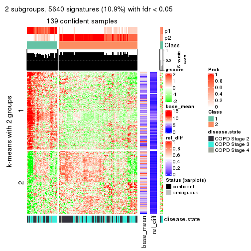</p>

</div>
<div id='tab-CV-kmeans-get-signatures-2'>
<pre><code class="r">get_signatures(res, k = 3)
</code></pre>

<p></p>

</div>
<div id='tab-CV-kmeans-get-signatures-3'>
<pre><code class="r">get_signatures(res, k = 4)
</code></pre>

<p></p>

</div>
<div id='tab-CV-kmeans-get-signatures-4'>
<pre><code class="r">get_signatures(res, k = 5)
</code></pre>

<p></p>

</div>
<div id='tab-CV-kmeans-get-signatures-5'>
<pre><code class="r">get_signatures(res, k = 6)
</code></pre>

<p></p>

</div>
</div>


Signature heatmaps where rows are not scaled:


<script>
$( function() {
	$( '#tabs-CV-kmeans-get-signatures-no-scale' ).tabs();
} );
</script>
<div id='tabs-CV-kmeans-get-signatures-no-scale'>
<ul>
<li><a href='#tab-CV-kmeans-get-signatures-no-scale-1'>k = 2</a></li>
<li><a href='#tab-CV-kmeans-get-signatures-no-scale-2'>k = 3</a></li>
<li><a href='#tab-CV-kmeans-get-signatures-no-scale-3'>k = 4</a></li>
<li><a href='#tab-CV-kmeans-get-signatures-no-scale-4'>k = 5</a></li>
<li><a href='#tab-CV-kmeans-get-signatures-no-scale-5'>k = 6</a></li>
</ul>
<div id='tab-CV-kmeans-get-signatures-no-scale-1'>
<pre><code class="r">get_signatures(res, k = 2, scale_rows = FALSE)
</code></pre>

<p></p>

</div>
<div id='tab-CV-kmeans-get-signatures-no-scale-2'>
<pre><code class="r">get_signatures(res, k = 3, scale_rows = FALSE)
</code></pre>

<p></p>

</div>
<div id='tab-CV-kmeans-get-signatures-no-scale-3'>
<pre><code class="r">get_signatures(res, k = 4, scale_rows = FALSE)
</code></pre>

<p></p>

</div>
<div id='tab-CV-kmeans-get-signatures-no-scale-4'>
<pre><code class="r">get_signatures(res, k = 5, scale_rows = FALSE)
</code></pre>

<p></p>

</div>
<div id='tab-CV-kmeans-get-signatures-no-scale-5'>
<pre><code class="r">get_signatures(res, k = 6, scale_rows = FALSE)
</code></pre>

<p></p>

</div>
</div>


Compare the overlap of signatures from different k:

```r
compare_signatures(res)
```


`get_signature()` returns a data frame invisibly. TO get the list of signatures, the function
call should be assigned to a variable explicitly. In following code, if `plot` argument is set
to `FALSE`, no heatmap is plotted while only the differential analysis is performed.

```r
# code only for demonstration
tb = get_signature(res, k = ..., plot = FALSE)
```

An example of the output of `tb` is:

```
#>   which_row         fdr    mean_1    mean_2 scaled_mean_1 scaled_mean_2 km
#> 1        38 0.042760348  8.373488  9.131774    -0.5533452     0.5164555  1
#> 2        40 0.018707592  7.106213  8.469186    -0.6173731     0.5762149  1
#> 3        55 0.019134737 10.221463 11.207825    -0.6159697     0.5749050  1
#> 4        59 0.006059896  5.921854  7.869574    -0.6899429     0.6439467  1
#> 5        60 0.018055526  8.928898 10.211722    -0.6204761     0.5791110  1
#> 6        98 0.009384629 15.714769 14.887706     0.6635654    -0.6193277  2
...
```

The columns in `tb` are:

1. `which_row`: row indices corresponding to the input matrix.
2. `fdr`: FDR for the differential test. 
3. `mean_x`: The mean value in group x.
4. `scaled_mean_x`: The mean value in group x after rows are scaled.
5. `km`: Row groups if k-means clustering is applied to rows.


UMAP plot which shows how samples are separated.


<script>
$( function() {
	$( '#tabs-CV-kmeans-dimension-reduction' ).tabs();
} );
</script>
<div id='tabs-CV-kmeans-dimension-reduction'>
<ul>
<li><a href='#tab-CV-kmeans-dimension-reduction-1'>k = 2</a></li>
<li><a href='#tab-CV-kmeans-dimension-reduction-2'>k = 3</a></li>
<li><a href='#tab-CV-kmeans-dimension-reduction-3'>k = 4</a></li>
<li><a href='#tab-CV-kmeans-dimension-reduction-4'>k = 5</a></li>
<li><a href='#tab-CV-kmeans-dimension-reduction-5'>k = 6</a></li>
</ul>
<div id='tab-CV-kmeans-dimension-reduction-1'>
<pre><code class="r">dimension_reduction(res, k = 2, method = &quot;UMAP&quot;)
</code></pre>

<p></p>

</div>
<div id='tab-CV-kmeans-dimension-reduction-2'>
<pre><code class="r">dimension_reduction(res, k = 3, method = &quot;UMAP&quot;)
</code></pre>

<p></p>

</div>
<div id='tab-CV-kmeans-dimension-reduction-3'>
<pre><code class="r">dimension_reduction(res, k = 4, method = &quot;UMAP&quot;)
</code></pre>

<p></p>

</div>
<div id='tab-CV-kmeans-dimension-reduction-4'>
<pre><code class="r">dimension_reduction(res, k = 5, method = &quot;UMAP&quot;)
</code></pre>

<p></p>

</div>
<div id='tab-CV-kmeans-dimension-reduction-5'>
<pre><code class="r">dimension_reduction(res, k = 6, method = &quot;UMAP&quot;)
</code></pre>

<p></p>

</div>
</div>


Following heatmap shows how subgroups are split when increasing `k`:

```r
collect_classes(res)
```


Test correlation between subgroups and known annotations. If the known
annotation is numeric, one-way ANOVA test is applied, and if the known
annotation is discrete, chi-squared contingency table test is applied.

```r
test_to_known_factors(res)
```

```
#>             n disease.state(p) k
#> CV:kmeans 139         5.53e-01 2
#> CV:kmeans 141         6.81e-03 3
#> CV:kmeans  82         1.27e-02 4
#> CV:kmeans  89         4.87e-03 5
#> CV:kmeans 104         1.38e-06 6
```


If matrix rows can be associated to genes, consider to use `GO_Enrichment(res,
...)` to perform function enrichment for the signature genes.


 

---------------------------------------------------


### CV:skmeans


The object with results only for a single top-value method and a single partition method 
can be extracted as:

```r
res = res_list["CV", "skmeans"]
# you can also extract it by
# res = res_list["CV:skmeans"]
```

A summary of `res` and all the functions that can be applied to it:

```r
res
```

```
#> A 'ConsensusPartition' object with k = 2, 3, 4, 5, 6.
#>   On a matrix with 51776 rows and 143 columns.
#>   Top rows (1000, 2000, 3000, 4000, 5000) are extracted by 'CV' method.
#>   Subgroups are detected by 'skmeans' method.
#>   Performed in total 1250 partitions by row resampling.
#>   Best k for subgroups seems to be 3.
#> 
#> Following methods can be applied to this 'ConsensusPartition' object:
#>  [1] "cola_report"             "collect_classes"         "collect_plots"          
#>  [4] "collect_stats"           "colnames"                "compare_signatures"     
#>  [7] "consensus_heatmap"       "dimension_reduction"     "functional_enrichment"  
#> [10] "get_anno_col"            "get_anno"                "get_classes"            
#> [13] "get_consensus"           "get_matrix"              "get_membership"         
#> [16] "get_param"               "get_signatures"          "get_stats"              
#> [19] "is_best_k"               "is_stable_k"             "membership_heatmap"     
#> [22] "ncol"                    "nrow"                    "plot_ecdf"              
#> [25] "rownames"                "select_partition_number" "show"                   
#> [28] "suggest_best_k"          "test_to_known_factors"
```

`collect_plots()` function collects all the plots made from `res` for all `k` (number of partitions)
into one single page to provide an easy and fast comparison between different `k`.

```r
collect_plots(res)
```


The plots are:

- The first row: a plot of the ECDF (Empirical cumulative distribution
  function) curves of the consensus matrix for each `k` and the heatmap of
  predicted classes for each `k`.
- The second row: heatmaps of the consensus matrix for each `k`.
- The third row: heatmaps of the membership matrix for each `k`.
- The fouth row: heatmaps of the signatures for each `k`.

All the plots in panels can be made by individual functions and they are
plotted later in this section.

`select_partition_number()` produces several plots showing different
statistics for choosing "optimized" `k`. There are following statistics:

- ECDF curves of the consensus matrix for each `k`;
- 1-PAC. [The PAC
  score](https://en.wikipedia.org/wiki/Consensus_clustering#Over-interpretation_potential_of_consensus_clustering)
  measures the proportion of the ambiguous subgrouping.
- Mean silhouette score.
- Concordance. The mean probability of fiting the consensus class ids in all
  partitions.
- Area increased. Denote $A_k$ as the area under the ECDF curve for current
  `k`, the area increased is defined as $A_k - A_{k-1}$.
- Rand index. The percent of pairs of samples that are both in a same cluster
  or both are not in a same cluster in the partition of k and k-1.
- Jaccard index. The ratio of pairs of samples are both in a same cluster in
  the partition of k and k-1 and the pairs of samples are both in a same
  cluster in the partition k or k-1.

The detailed explanations of these statistics can be found in [the cola
vignette](http://bioconductor.org/packages/devel/bioc/vignettes/cola/inst/doc/cola.html#toc_13).

Generally speaking, lower PAC score, higher mean silhouette score or higher
concordance corresponds to better partition. Rand index and Jaccard index
measure how similar the current partition is compared to partition with `k-1`.
If they are too similar, we won't accept `k` is better than `k-1`.

```r
select_partition_number(res)
```


The numeric values for all these statistics can be obtained by `get_stats()`.

```r
get_stats(res)
```

```
#>   k 1-PAC mean_silhouette concordance area_increased  Rand Jaccard
#> 2 2 0.551           0.671       0.856         0.4923 0.510   0.510
#> 3 3 0.792           0.846       0.932         0.3542 0.705   0.479
#> 4 4 0.740           0.727       0.854         0.1221 0.825   0.533
#> 5 5 0.644           0.582       0.771         0.0533 0.941   0.778
#> 6 6 0.655           0.577       0.728         0.0375 0.928   0.707
```

`suggest_best_k()` suggests the best $k$ based on these statistics. The rules are as follows:

- All $k$ with Jaccard index larger than 0.95 are removed because the increase of
  the partition number does not provides enough extra information. If all $k$ are removed,
  the best $k$ is assigned by `NA`.
- For $k$ with 1-PAC larger than 0.9, the maximal $k$ is taken as the "best k". Other $k$ is called "optional k".
- If it does not fit the second rule. The $k$ with the highest vote of highest
  1-PAC, mean silhouette and concordance is taken as the "best k".

```r
suggest_best_k(res)
```

```
#> [1] 3
```


Following shows the table of the partitions (You need to click the **show/hide
code output** link to see it). The membership matrix (columns with name `p*`)
is inferred by
[`clue::cl_consensus()`](https://www.rdocumentation.org/link/cl_consensus?package=clue)
function with the `SE` method. Basically the value in the membership matrix
represents the probability to belong to a certain group. The finall class
label for an item is determined with the group with highest probability it
belongs to.

In `get_classes()` function, the entropy is calculated from the membership
matrix and the silhouette score is calculated from the consensus matrix.


<script>
$( function() {
	$( '#tabs-CV-skmeans-get-classes' ).tabs();
} );
</script>
<div id='tabs-CV-skmeans-get-classes'>
<ul>
<li><a href='#tab-CV-skmeans-get-classes-1'>k = 2</a></li>
<li><a href='#tab-CV-skmeans-get-classes-2'>k = 3</a></li>
<li><a href='#tab-CV-skmeans-get-classes-3'>k = 4</a></li>
<li><a href='#tab-CV-skmeans-get-classes-4'>k = 5</a></li>
<li><a href='#tab-CV-skmeans-get-classes-5'>k = 6</a></li>
</ul>

<div id='tab-CV-skmeans-get-classes-1'>
<p><a id='tab-CV-skmeans-get-classes-1-a' style='color:#0366d6' href='#'>show/hide code output</a></p>
<pre><code class="r">cbind(get_classes(res, k = 2), get_membership(res, k = 2))
</code></pre>

<pre><code>#&gt;           class entropy silhouette    p1    p2
#&gt; GSM550785     2  0.0000      0.531 0.000 1.000
#&gt; GSM550786     1  0.9580      0.802 0.620 0.380
#&gt; GSM550788     2  0.9608      0.822 0.384 0.616
#&gt; GSM550789     2  0.9608      0.822 0.384 0.616
#&gt; GSM550790     2  0.0000      0.531 0.000 1.000
#&gt; GSM550791     2  0.0376      0.525 0.004 0.996
#&gt; GSM550792     1  0.9993     -0.674 0.516 0.484
#&gt; GSM550796     2  0.9608      0.822 0.384 0.616
#&gt; GSM550797     2  0.9608      0.822 0.384 0.616
#&gt; GSM550799     1  0.6887      0.681 0.816 0.184
#&gt; GSM550800     2  0.9608      0.822 0.384 0.616
#&gt; GSM550801     2  0.9608      0.822 0.384 0.616
#&gt; GSM550804     2  0.9608      0.822 0.384 0.616
#&gt; GSM550806     1  0.9608      0.802 0.616 0.384
#&gt; GSM550807     2  0.9608      0.822 0.384 0.616
#&gt; GSM550808     1  0.0000      0.501 1.000 0.000
#&gt; GSM550809     1  0.9608      0.802 0.616 0.384
#&gt; GSM550810     1  0.9686     -0.523 0.604 0.396
#&gt; GSM550811     1  0.9608      0.802 0.616 0.384
#&gt; GSM550813     2  0.9608      0.822 0.384 0.616
#&gt; GSM550814     2  0.9608      0.822 0.384 0.616
#&gt; GSM550815     2  0.9608      0.822 0.384 0.616
#&gt; GSM550816     2  0.9608      0.822 0.384 0.616
#&gt; GSM550817     1  0.9580      0.802 0.620 0.380
#&gt; GSM550818     1  0.9580      0.802 0.620 0.380
#&gt; GSM550819     1  0.9998     -0.687 0.508 0.492
#&gt; GSM550820     1  0.9608      0.802 0.616 0.384
#&gt; GSM550821     1  0.0000      0.501 1.000 0.000
#&gt; GSM550822     2  0.9608      0.822 0.384 0.616
#&gt; GSM550826     1  0.9608      0.802 0.616 0.384
#&gt; GSM550832     2  0.9963      0.736 0.464 0.536
#&gt; GSM550833     2  0.9608      0.822 0.384 0.616
#&gt; GSM550835     1  0.0376      0.506 0.996 0.004
#&gt; GSM550836     1  0.9608      0.802 0.616 0.384
#&gt; GSM550837     1  0.0000      0.501 1.000 0.000
#&gt; GSM550838     1  0.9608      0.802 0.616 0.384
#&gt; GSM550841     1  0.6887      0.681 0.816 0.184
#&gt; GSM550842     1  0.0000      0.501 1.000 0.000
#&gt; GSM550846     2  0.9608      0.822 0.384 0.616
#&gt; GSM550849     1  0.9608      0.802 0.616 0.384
#&gt; GSM550850     2  0.3733      0.391 0.072 0.928
#&gt; GSM550851     1  0.0000      0.501 1.000 0.000
#&gt; GSM550852     2  0.9608      0.822 0.384 0.616
#&gt; GSM550853     2  0.9608      0.822 0.384 0.616
#&gt; GSM550855     2  0.9608      0.822 0.384 0.616
#&gt; GSM550856     2  0.9608      0.822 0.384 0.616
#&gt; GSM550861     2  0.9608      0.822 0.384 0.616
#&gt; GSM550863     2  0.9580      0.821 0.380 0.620
#&gt; GSM550864     2  0.9608      0.822 0.384 0.616
#&gt; GSM550866     2  0.9608      0.822 0.384 0.616
#&gt; GSM550867     2  0.0000      0.531 0.000 1.000
#&gt; GSM550885     2  0.0000      0.531 0.000 1.000
#&gt; GSM550886     1  0.0672      0.510 0.992 0.008
#&gt; GSM550887     2  0.9608      0.822 0.384 0.616
#&gt; GSM550889     2  0.9580      0.821 0.380 0.620
#&gt; GSM550894     1  0.9608     -0.499 0.616 0.384
#&gt; GSM550897     2  0.0000      0.531 0.000 1.000
#&gt; GSM550903     2  0.9608      0.822 0.384 0.616
#&gt; GSM550905     1  0.0000      0.501 1.000 0.000
#&gt; GSM550906     2  0.9608      0.822 0.384 0.616
#&gt; GSM550907     1  0.9580      0.802 0.620 0.380
#&gt; GSM550909     1  0.0000      0.501 1.000 0.000
#&gt; GSM550911     1  0.9608      0.802 0.616 0.384
#&gt; GSM550913     2  0.9608      0.822 0.384 0.616
#&gt; GSM550915     2  0.9580      0.821 0.380 0.620
#&gt; GSM550917     2  0.9608      0.822 0.384 0.616
#&gt; GSM550919     2  0.9608      0.822 0.384 0.616
#&gt; GSM550921     1  0.9608      0.802 0.616 0.384
#&gt; GSM550924     1  0.9580      0.802 0.620 0.380
#&gt; GSM550926     2  0.9608      0.822 0.384 0.616
#&gt; GSM550927     2  0.9608      0.822 0.384 0.616
#&gt; GSM550787     1  0.9608      0.802 0.616 0.384
#&gt; GSM550793     1  0.9608      0.802 0.616 0.384
#&gt; GSM550794     2  0.9608      0.822 0.384 0.616
#&gt; GSM550795     2  0.0376      0.525 0.004 0.996
#&gt; GSM550798     1  0.9608      0.802 0.616 0.384
#&gt; GSM550803     2  0.9522     -0.476 0.372 0.628
#&gt; GSM550805     1  0.9608      0.802 0.616 0.384
#&gt; GSM550823     2  0.9608      0.822 0.384 0.616
#&gt; GSM550824     2  0.0000      0.531 0.000 1.000
#&gt; GSM550825     1  0.9608      0.802 0.616 0.384
#&gt; GSM550827     2  0.9608      0.822 0.384 0.616
#&gt; GSM550828     2  0.0000      0.531 0.000 1.000
#&gt; GSM550829     1  0.9608      0.802 0.616 0.384
#&gt; GSM550830     2  0.9580      0.821 0.380 0.620
#&gt; GSM550834     2  0.0000      0.531 0.000 1.000
#&gt; GSM550839     1  0.6887      0.681 0.816 0.184
#&gt; GSM550840     2  0.0000      0.531 0.000 1.000
#&gt; GSM550843     1  0.9580      0.802 0.620 0.380
#&gt; GSM550844     2  0.8909     -0.329 0.308 0.692
#&gt; GSM550845     2  0.9608      0.822 0.384 0.616
#&gt; GSM550848     2  0.9608      0.822 0.384 0.616
#&gt; GSM550854     2  0.0000      0.531 0.000 1.000
#&gt; GSM550857     1  0.9608      0.802 0.616 0.384
#&gt; GSM550858     2  0.0000      0.531 0.000 1.000
#&gt; GSM550859     2  0.0000      0.531 0.000 1.000
#&gt; GSM550862     2  0.0000      0.531 0.000 1.000
#&gt; GSM550865     2  0.9580      0.821 0.380 0.620
#&gt; GSM550868     2  0.9580      0.821 0.380 0.620
#&gt; GSM550869     1  0.9608      0.802 0.616 0.384
#&gt; GSM550870     2  0.9608      0.822 0.384 0.616
#&gt; GSM550871     1  0.6887      0.681 0.816 0.184
#&gt; GSM550872     2  0.9580      0.821 0.380 0.620
#&gt; GSM550873     1  0.0000      0.501 1.000 0.000
#&gt; GSM550874     2  0.9608      0.822 0.384 0.616
#&gt; GSM550876     1  0.6887      0.681 0.816 0.184
#&gt; GSM550877     2  0.9608      0.822 0.384 0.616
#&gt; GSM550878     1  0.9580      0.802 0.620 0.380
#&gt; GSM550879     2  0.0000      0.531 0.000 1.000
#&gt; GSM550882     1  0.9608      0.802 0.616 0.384
#&gt; GSM550888     1  0.9608      0.802 0.616 0.384
#&gt; GSM550890     2  0.9580      0.821 0.380 0.620
#&gt; GSM550891     1  0.9608      0.802 0.616 0.384
#&gt; GSM550892     2  0.0376      0.535 0.004 0.996
#&gt; GSM550893     2  0.9608      0.822 0.384 0.616
#&gt; GSM550895     2  0.9608      0.822 0.384 0.616
#&gt; GSM550896     2  0.9608      0.822 0.384 0.616
#&gt; GSM550898     2  0.0000      0.531 0.000 1.000
#&gt; GSM550899     2  0.9608      0.822 0.384 0.616
#&gt; GSM550900     2  0.9580      0.821 0.380 0.620
#&gt; GSM550901     2  0.5629      0.642 0.132 0.868
#&gt; GSM550902     1  0.9608      0.802 0.616 0.384
#&gt; GSM550904     1  0.9608      0.802 0.616 0.384
#&gt; GSM550908     1  0.9608      0.802 0.616 0.384
#&gt; GSM550912     2  0.9608      0.822 0.384 0.616
#&gt; GSM550914     2  0.9608      0.822 0.384 0.616
#&gt; GSM550918     2  0.9608      0.822 0.384 0.616
#&gt; GSM550922     1  0.0000      0.501 1.000 0.000
#&gt; GSM550923     1  0.9608      0.802 0.616 0.384
#&gt; GSM550925     2  0.1633      0.552 0.024 0.976
#&gt; GSM550802     2  0.9635      0.819 0.388 0.612
#&gt; GSM550812     1  0.6531      0.120 0.832 0.168
#&gt; GSM550831     2  0.1184      0.504 0.016 0.984
#&gt; GSM550847     2  0.0000      0.531 0.000 1.000
#&gt; GSM550860     1  0.9608      0.802 0.616 0.384
#&gt; GSM550875     1  0.9608      0.802 0.616 0.384
#&gt; GSM550880     2  0.0000      0.531 0.000 1.000
#&gt; GSM550881     1  0.9608      0.802 0.616 0.384
#&gt; GSM550883     1  0.9608      0.802 0.616 0.384
#&gt; GSM550884     1  0.1184      0.476 0.984 0.016
#&gt; GSM550910     1  0.9580      0.802 0.620 0.380
#&gt; GSM550916     2  0.0000      0.531 0.000 1.000
#&gt; GSM550920     1  0.9580      0.802 0.620 0.380
</code></pre>

<script>
$('#tab-CV-skmeans-get-classes-1-a').parent().next().next().hide();
$('#tab-CV-skmeans-get-classes-1-a').click(function(){
  $('#tab-CV-skmeans-get-classes-1-a').parent().next().next().toggle();
  return(false);
});
</script>
</div>

<div id='tab-CV-skmeans-get-classes-2'>
<p><a id='tab-CV-skmeans-get-classes-2-a' style='color:#0366d6' href='#'>show/hide code output</a></p>
<pre><code class="r">cbind(get_classes(res, k = 3), get_membership(res, k = 3))
</code></pre>

<pre><code>#&gt;           class entropy silhouette    p1    p2    p3
#&gt; GSM550785     1  0.0000     0.8782 1.000 0.000 0.000
#&gt; GSM550786     3  0.0000     0.9337 0.000 0.000 1.000
#&gt; GSM550788     2  0.0000     0.9564 0.000 1.000 0.000
#&gt; GSM550789     2  0.0000     0.9564 0.000 1.000 0.000
#&gt; GSM550790     1  0.0000     0.8782 1.000 0.000 0.000
#&gt; GSM550791     1  0.0000     0.8782 1.000 0.000 0.000
#&gt; GSM550792     2  0.6126     0.4135 0.352 0.644 0.004
#&gt; GSM550796     2  0.0000     0.9564 0.000 1.000 0.000
#&gt; GSM550797     2  0.0000     0.9564 0.000 1.000 0.000
#&gt; GSM550799     3  0.0000     0.9337 0.000 0.000 1.000
#&gt; GSM550800     2  0.0000     0.9564 0.000 1.000 0.000
#&gt; GSM550801     2  0.0000     0.9564 0.000 1.000 0.000
#&gt; GSM550804     2  0.0000     0.9564 0.000 1.000 0.000
#&gt; GSM550806     3  0.0000     0.9337 0.000 0.000 1.000
#&gt; GSM550807     2  0.0000     0.9564 0.000 1.000 0.000
#&gt; GSM550808     2  0.6307    -0.0188 0.000 0.512 0.488
#&gt; GSM550809     1  0.0000     0.8782 1.000 0.000 0.000
#&gt; GSM550810     2  0.0000     0.9564 0.000 1.000 0.000
#&gt; GSM550811     1  0.0592     0.8701 0.988 0.000 0.012
#&gt; GSM550813     2  0.0000     0.9564 0.000 1.000 0.000
#&gt; GSM550814     2  0.0000     0.9564 0.000 1.000 0.000
#&gt; GSM550815     2  0.0000     0.9564 0.000 1.000 0.000
#&gt; GSM550816     2  0.0424     0.9495 0.008 0.992 0.000
#&gt; GSM550817     3  0.0000     0.9337 0.000 0.000 1.000
#&gt; GSM550818     3  0.0000     0.9337 0.000 0.000 1.000
#&gt; GSM550819     2  0.1163     0.9309 0.000 0.972 0.028
#&gt; GSM550820     1  0.0000     0.8782 1.000 0.000 0.000
#&gt; GSM550821     3  0.0747     0.9227 0.000 0.016 0.984
#&gt; GSM550822     2  0.0000     0.9564 0.000 1.000 0.000
#&gt; GSM550826     3  0.1031     0.9174 0.024 0.000 0.976
#&gt; GSM550832     2  0.0000     0.9564 0.000 1.000 0.000
#&gt; GSM550833     2  0.0000     0.9564 0.000 1.000 0.000
#&gt; GSM550835     3  0.0000     0.9337 0.000 0.000 1.000
#&gt; GSM550836     3  0.0000     0.9337 0.000 0.000 1.000
#&gt; GSM550837     3  0.6140     0.3418 0.000 0.404 0.596
#&gt; GSM550838     1  0.4842     0.6262 0.776 0.000 0.224
#&gt; GSM550841     3  0.0000     0.9337 0.000 0.000 1.000
#&gt; GSM550842     3  0.5810     0.5057 0.000 0.336 0.664
#&gt; GSM550846     1  0.6297     0.5601 0.640 0.352 0.008
#&gt; GSM550849     3  0.5905     0.5050 0.352 0.000 0.648
#&gt; GSM550850     1  0.0000     0.8782 1.000 0.000 0.000
#&gt; GSM550851     3  0.5706     0.5382 0.000 0.320 0.680
#&gt; GSM550852     2  0.0000     0.9564 0.000 1.000 0.000
#&gt; GSM550853     2  0.0000     0.9564 0.000 1.000 0.000
#&gt; GSM550855     2  0.0000     0.9564 0.000 1.000 0.000
#&gt; GSM550856     2  0.0000     0.9564 0.000 1.000 0.000
#&gt; GSM550861     2  0.0000     0.9564 0.000 1.000 0.000
#&gt; GSM550863     1  0.5431     0.6692 0.716 0.284 0.000
#&gt; GSM550864     2  0.0000     0.9564 0.000 1.000 0.000
#&gt; GSM550866     2  0.0000     0.9564 0.000 1.000 0.000
#&gt; GSM550867     1  0.0000     0.8782 1.000 0.000 0.000
#&gt; GSM550885     1  0.0000     0.8782 1.000 0.000 0.000
#&gt; GSM550886     3  0.0000     0.9337 0.000 0.000 1.000
#&gt; GSM550887     2  0.0000     0.9564 0.000 1.000 0.000
#&gt; GSM550889     1  0.6299     0.2790 0.524 0.476 0.000
#&gt; GSM550894     2  0.0000     0.9564 0.000 1.000 0.000
#&gt; GSM550897     1  0.0000     0.8782 1.000 0.000 0.000
#&gt; GSM550903     2  0.0000     0.9564 0.000 1.000 0.000
#&gt; GSM550905     3  0.3267     0.8360 0.000 0.116 0.884
#&gt; GSM550906     2  0.0000     0.9564 0.000 1.000 0.000
#&gt; GSM550907     3  0.0000     0.9337 0.000 0.000 1.000
#&gt; GSM550909     3  0.0000     0.9337 0.000 0.000 1.000
#&gt; GSM550911     3  0.0000     0.9337 0.000 0.000 1.000
#&gt; GSM550913     2  0.0000     0.9564 0.000 1.000 0.000
#&gt; GSM550915     1  0.5254     0.6909 0.736 0.264 0.000
#&gt; GSM550917     2  0.0000     0.9564 0.000 1.000 0.000
#&gt; GSM550919     1  0.5560     0.6510 0.700 0.300 0.000
#&gt; GSM550921     3  0.0000     0.9337 0.000 0.000 1.000
#&gt; GSM550924     3  0.0000     0.9337 0.000 0.000 1.000
#&gt; GSM550926     2  0.0000     0.9564 0.000 1.000 0.000
#&gt; GSM550927     2  0.0000     0.9564 0.000 1.000 0.000
#&gt; GSM550787     3  0.0237     0.9313 0.004 0.000 0.996
#&gt; GSM550793     3  0.0237     0.9313 0.004 0.000 0.996
#&gt; GSM550794     1  0.5291     0.6654 0.732 0.268 0.000
#&gt; GSM550795     1  0.0000     0.8782 1.000 0.000 0.000
#&gt; GSM550798     1  0.5178     0.5701 0.744 0.000 0.256
#&gt; GSM550803     1  0.0000     0.8782 1.000 0.000 0.000
#&gt; GSM550805     3  0.5431     0.6259 0.284 0.000 0.716
#&gt; GSM550823     2  0.0424     0.9489 0.008 0.992 0.000
#&gt; GSM550824     1  0.0000     0.8782 1.000 0.000 0.000
#&gt; GSM550825     3  0.0000     0.9337 0.000 0.000 1.000
#&gt; GSM550827     1  0.5835     0.5889 0.660 0.340 0.000
#&gt; GSM550828     1  0.0000     0.8782 1.000 0.000 0.000
#&gt; GSM550829     3  0.4796     0.7207 0.220 0.000 0.780
#&gt; GSM550830     2  0.5650     0.4380 0.312 0.688 0.000
#&gt; GSM550834     1  0.0000     0.8782 1.000 0.000 0.000
#&gt; GSM550839     3  0.0000     0.9337 0.000 0.000 1.000
#&gt; GSM550840     1  0.0000     0.8782 1.000 0.000 0.000
#&gt; GSM550843     3  0.0000     0.9337 0.000 0.000 1.000
#&gt; GSM550844     1  0.0000     0.8782 1.000 0.000 0.000
#&gt; GSM550845     2  0.0000     0.9564 0.000 1.000 0.000
#&gt; GSM550848     1  0.5785     0.6038 0.668 0.332 0.000
#&gt; GSM550854     1  0.0000     0.8782 1.000 0.000 0.000
#&gt; GSM550857     3  0.0000     0.9337 0.000 0.000 1.000
#&gt; GSM550858     1  0.0000     0.8782 1.000 0.000 0.000
#&gt; GSM550859     1  0.0000     0.8782 1.000 0.000 0.000
#&gt; GSM550862     1  0.0000     0.8782 1.000 0.000 0.000
#&gt; GSM550865     1  0.6062     0.5119 0.616 0.384 0.000
#&gt; GSM550868     1  0.5465     0.6645 0.712 0.288 0.000
#&gt; GSM550869     3  0.0000     0.9337 0.000 0.000 1.000
#&gt; GSM550870     2  0.0000     0.9564 0.000 1.000 0.000
#&gt; GSM550871     3  0.0000     0.9337 0.000 0.000 1.000
#&gt; GSM550872     1  0.5431     0.6692 0.716 0.284 0.000
#&gt; GSM550873     2  0.6204     0.2099 0.000 0.576 0.424
#&gt; GSM550874     2  0.0000     0.9564 0.000 1.000 0.000
#&gt; GSM550876     3  0.0000     0.9337 0.000 0.000 1.000
#&gt; GSM550877     2  0.0000     0.9564 0.000 1.000 0.000
#&gt; GSM550878     3  0.0000     0.9337 0.000 0.000 1.000
#&gt; GSM550879     1  0.0000     0.8782 1.000 0.000 0.000
#&gt; GSM550882     3  0.0000     0.9337 0.000 0.000 1.000
#&gt; GSM550888     3  0.0000     0.9337 0.000 0.000 1.000
#&gt; GSM550890     1  0.5397     0.6739 0.720 0.280 0.000
#&gt; GSM550891     3  0.0000     0.9337 0.000 0.000 1.000
#&gt; GSM550892     1  0.0000     0.8782 1.000 0.000 0.000
#&gt; GSM550893     2  0.0000     0.9564 0.000 1.000 0.000
#&gt; GSM550895     2  0.0000     0.9564 0.000 1.000 0.000
#&gt; GSM550896     2  0.0000     0.9564 0.000 1.000 0.000
#&gt; GSM550898     1  0.0000     0.8782 1.000 0.000 0.000
#&gt; GSM550899     2  0.0000     0.9564 0.000 1.000 0.000
#&gt; GSM550900     1  0.5497     0.6599 0.708 0.292 0.000
#&gt; GSM550901     1  0.0000     0.8782 1.000 0.000 0.000
#&gt; GSM550902     3  0.2959     0.8530 0.100 0.000 0.900
#&gt; GSM550904     1  0.3412     0.7652 0.876 0.000 0.124
#&gt; GSM550908     3  0.0000     0.9337 0.000 0.000 1.000
#&gt; GSM550912     2  0.0000     0.9564 0.000 1.000 0.000
#&gt; GSM550914     1  0.5882     0.5742 0.652 0.348 0.000
#&gt; GSM550918     2  0.0000     0.9564 0.000 1.000 0.000
#&gt; GSM550922     3  0.0000     0.9337 0.000 0.000 1.000
#&gt; GSM550923     1  0.1031     0.8609 0.976 0.000 0.024
#&gt; GSM550925     1  0.0000     0.8782 1.000 0.000 0.000
#&gt; GSM550802     2  0.2356     0.8833 0.072 0.928 0.000
#&gt; GSM550812     2  0.3886     0.8404 0.096 0.880 0.024
#&gt; GSM550831     1  0.0000     0.8782 1.000 0.000 0.000
#&gt; GSM550847     1  0.0000     0.8782 1.000 0.000 0.000
#&gt; GSM550860     3  0.0000     0.9337 0.000 0.000 1.000
#&gt; GSM550875     3  0.6235     0.3067 0.436 0.000 0.564
#&gt; GSM550880     1  0.0000     0.8782 1.000 0.000 0.000
#&gt; GSM550881     3  0.0000     0.9337 0.000 0.000 1.000
#&gt; GSM550883     3  0.0000     0.9337 0.000 0.000 1.000
#&gt; GSM550884     3  0.4605     0.7266 0.000 0.204 0.796
#&gt; GSM550910     3  0.0000     0.9337 0.000 0.000 1.000
#&gt; GSM550916     1  0.0000     0.8782 1.000 0.000 0.000
#&gt; GSM550920     3  0.0000     0.9337 0.000 0.000 1.000
</code></pre>

<script>
$('#tab-CV-skmeans-get-classes-2-a').parent().next().next().hide();
$('#tab-CV-skmeans-get-classes-2-a').click(function(){
  $('#tab-CV-skmeans-get-classes-2-a').parent().next().next().toggle();
  return(false);
});
</script>
</div>

<div id='tab-CV-skmeans-get-classes-3'>
<p><a id='tab-CV-skmeans-get-classes-3-a' style='color:#0366d6' href='#'>show/hide code output</a></p>
<pre><code class="r">cbind(get_classes(res, k = 4), get_membership(res, k = 4))
</code></pre>

<pre><code>#&gt;           class entropy silhouette    p1    p2    p3    p4
#&gt; GSM550785     1  0.4164     0.7983 0.736 0.000 0.000 0.264
#&gt; GSM550786     3  0.0188     0.9513 0.000 0.000 0.996 0.004
#&gt; GSM550788     2  0.0000     0.8102 0.000 1.000 0.000 0.000
#&gt; GSM550789     2  0.0188     0.8105 0.000 0.996 0.000 0.004
#&gt; GSM550790     1  0.2011     0.8227 0.920 0.000 0.000 0.080
#&gt; GSM550791     1  0.1118     0.8161 0.964 0.000 0.000 0.036
#&gt; GSM550792     2  0.6242     0.2064 0.456 0.496 0.004 0.044
#&gt; GSM550796     2  0.0188     0.8105 0.000 0.996 0.000 0.004
#&gt; GSM550797     2  0.0188     0.8105 0.000 0.996 0.000 0.004
#&gt; GSM550799     3  0.0376     0.9496 0.000 0.004 0.992 0.004
#&gt; GSM550800     2  0.1867     0.7670 0.000 0.928 0.000 0.072
#&gt; GSM550801     2  0.0188     0.8105 0.000 0.996 0.000 0.004
#&gt; GSM550804     4  0.4804     0.5387 0.000 0.384 0.000 0.616
#&gt; GSM550806     3  0.0376     0.9523 0.004 0.000 0.992 0.004
#&gt; GSM550807     2  0.0188     0.8105 0.000 0.996 0.000 0.004
#&gt; GSM550808     2  0.5170     0.6299 0.020 0.756 0.192 0.032
#&gt; GSM550809     1  0.0469     0.8047 0.988 0.000 0.000 0.012
#&gt; GSM550810     2  0.1388     0.7938 0.012 0.960 0.000 0.028
#&gt; GSM550811     1  0.2002     0.7747 0.936 0.020 0.000 0.044
#&gt; GSM550813     2  0.3444     0.6001 0.000 0.816 0.000 0.184
#&gt; GSM550814     2  0.1022     0.8026 0.000 0.968 0.000 0.032
#&gt; GSM550815     2  0.0336     0.8105 0.000 0.992 0.000 0.008
#&gt; GSM550816     2  0.3356     0.6451 0.000 0.824 0.000 0.176
#&gt; GSM550817     3  0.0000     0.9524 0.000 0.000 1.000 0.000
#&gt; GSM550818     3  0.0000     0.9524 0.000 0.000 1.000 0.000
#&gt; GSM550819     4  0.4441     0.7095 0.020 0.136 0.028 0.816
#&gt; GSM550820     1  0.3528     0.8165 0.808 0.000 0.000 0.192
#&gt; GSM550821     3  0.1940     0.8894 0.000 0.076 0.924 0.000
#&gt; GSM550822     2  0.0336     0.8105 0.000 0.992 0.000 0.008
#&gt; GSM550826     3  0.2053     0.9015 0.072 0.000 0.924 0.004
#&gt; GSM550832     2  0.0707     0.8071 0.000 0.980 0.000 0.020
#&gt; GSM550833     2  0.0336     0.8084 0.000 0.992 0.000 0.008
#&gt; GSM550835     3  0.4319     0.6738 0.000 0.228 0.760 0.012
#&gt; GSM550836     3  0.0524     0.9520 0.008 0.000 0.988 0.004
#&gt; GSM550837     2  0.5348     0.4777 0.012 0.664 0.312 0.012
#&gt; GSM550838     1  0.1362     0.7883 0.964 0.004 0.020 0.012
#&gt; GSM550841     3  0.0000     0.9524 0.000 0.000 1.000 0.000
#&gt; GSM550842     2  0.5093     0.4190 0.000 0.640 0.348 0.012
#&gt; GSM550846     4  0.1674     0.7139 0.032 0.012 0.004 0.952
#&gt; GSM550849     1  0.3982     0.6927 0.824 0.012 0.152 0.012
#&gt; GSM550850     1  0.1109     0.8127 0.968 0.004 0.000 0.028
#&gt; GSM550851     2  0.5143     0.3910 0.000 0.628 0.360 0.012
#&gt; GSM550852     2  0.2483     0.7670 0.052 0.916 0.000 0.032
#&gt; GSM550853     2  0.0469     0.8096 0.000 0.988 0.000 0.012
#&gt; GSM550855     2  0.0707     0.8057 0.000 0.980 0.000 0.020
#&gt; GSM550856     2  0.4888    -0.0219 0.000 0.588 0.000 0.412
#&gt; GSM550861     2  0.0469     0.8081 0.000 0.988 0.000 0.012
#&gt; GSM550863     4  0.1256     0.7147 0.028 0.008 0.000 0.964
#&gt; GSM550864     4  0.4961     0.4316 0.000 0.448 0.000 0.552
#&gt; GSM550866     4  0.4776     0.5604 0.000 0.376 0.000 0.624
#&gt; GSM550867     1  0.4134     0.8007 0.740 0.000 0.000 0.260
#&gt; GSM550885     1  0.4193     0.7956 0.732 0.000 0.000 0.268
#&gt; GSM550886     3  0.0000     0.9524 0.000 0.000 1.000 0.000
#&gt; GSM550887     2  0.0336     0.8105 0.000 0.992 0.000 0.008
#&gt; GSM550889     4  0.2300     0.7333 0.016 0.064 0.000 0.920
#&gt; GSM550894     2  0.0469     0.8095 0.000 0.988 0.000 0.012
#&gt; GSM550897     4  0.4406     0.1976 0.300 0.000 0.000 0.700
#&gt; GSM550903     2  0.0817     0.8043 0.000 0.976 0.000 0.024
#&gt; GSM550905     3  0.5161     0.0523 0.000 0.476 0.520 0.004
#&gt; GSM550906     2  0.0336     0.8105 0.000 0.992 0.000 0.008
#&gt; GSM550907     3  0.0000     0.9524 0.000 0.000 1.000 0.000
#&gt; GSM550909     3  0.3302     0.8498 0.020 0.096 0.876 0.008
#&gt; GSM550911     3  0.0188     0.9524 0.000 0.000 0.996 0.004
#&gt; GSM550913     2  0.0469     0.8081 0.000 0.988 0.000 0.012
#&gt; GSM550915     4  0.1584     0.7115 0.036 0.012 0.000 0.952
#&gt; GSM550917     4  0.5000     0.3023 0.000 0.500 0.000 0.500
#&gt; GSM550919     4  0.1929     0.7153 0.036 0.024 0.000 0.940
#&gt; GSM550921     3  0.0524     0.9520 0.008 0.000 0.988 0.004
#&gt; GSM550924     3  0.0376     0.9519 0.004 0.000 0.992 0.004
#&gt; GSM550926     4  0.4916     0.4799 0.000 0.424 0.000 0.576
#&gt; GSM550927     2  0.1792     0.7689 0.000 0.932 0.000 0.068
#&gt; GSM550787     3  0.1824     0.9123 0.060 0.000 0.936 0.004
#&gt; GSM550793     3  0.0524     0.9520 0.008 0.000 0.988 0.004
#&gt; GSM550794     1  0.7250     0.2594 0.552 0.168 0.004 0.276
#&gt; GSM550795     1  0.0895     0.8076 0.976 0.004 0.000 0.020
#&gt; GSM550798     1  0.1867     0.7774 0.928 0.000 0.072 0.000
#&gt; GSM550803     1  0.1302     0.8174 0.956 0.000 0.000 0.044
#&gt; GSM550805     1  0.5200     0.5115 0.704 0.004 0.264 0.028
#&gt; GSM550823     4  0.3982     0.6814 0.004 0.220 0.000 0.776
#&gt; GSM550824     1  0.4134     0.8007 0.740 0.000 0.000 0.260
#&gt; GSM550825     3  0.0524     0.9520 0.008 0.000 0.988 0.004
#&gt; GSM550827     4  0.1629     0.7206 0.024 0.024 0.000 0.952
#&gt; GSM550828     1  0.4585     0.7370 0.668 0.000 0.000 0.332
#&gt; GSM550829     3  0.5028     0.3023 0.400 0.000 0.596 0.004
#&gt; GSM550830     4  0.4776     0.7033 0.060 0.164 0.000 0.776
#&gt; GSM550834     1  0.1209     0.8124 0.964 0.004 0.000 0.032
#&gt; GSM550839     3  0.0804     0.9431 0.000 0.008 0.980 0.012
#&gt; GSM550840     1  0.1109     0.8110 0.968 0.004 0.000 0.028
#&gt; GSM550843     3  0.0000     0.9524 0.000 0.000 1.000 0.000
#&gt; GSM550844     1  0.2921     0.8222 0.860 0.000 0.000 0.140
#&gt; GSM550845     4  0.4500     0.6149 0.000 0.316 0.000 0.684
#&gt; GSM550848     4  0.1629     0.7206 0.024 0.024 0.000 0.952
#&gt; GSM550854     1  0.4134     0.8007 0.740 0.000 0.000 0.260
#&gt; GSM550857     3  0.0524     0.9520 0.008 0.000 0.988 0.004
#&gt; GSM550858     1  0.4406     0.7693 0.700 0.000 0.000 0.300
#&gt; GSM550859     1  0.4134     0.8007 0.740 0.000 0.000 0.260
#&gt; GSM550862     1  0.4605     0.7374 0.664 0.000 0.000 0.336
#&gt; GSM550865     4  0.1913     0.7283 0.020 0.040 0.000 0.940
#&gt; GSM550868     4  0.1388     0.7157 0.028 0.012 0.000 0.960
#&gt; GSM550869     3  0.1151     0.9421 0.024 0.000 0.968 0.008
#&gt; GSM550870     2  0.4994    -0.2626 0.000 0.520 0.000 0.480
#&gt; GSM550871     3  0.0188     0.9513 0.000 0.000 0.996 0.004
#&gt; GSM550872     4  0.1398     0.7083 0.040 0.004 0.000 0.956
#&gt; GSM550873     2  0.5487     0.5890 0.016 0.712 0.240 0.032
#&gt; GSM550874     2  0.0469     0.8103 0.000 0.988 0.000 0.012
#&gt; GSM550876     3  0.0000     0.9524 0.000 0.000 1.000 0.000
#&gt; GSM550877     4  0.4746     0.5646 0.000 0.368 0.000 0.632
#&gt; GSM550878     3  0.0000     0.9524 0.000 0.000 1.000 0.000
#&gt; GSM550879     1  0.4697     0.7117 0.644 0.000 0.000 0.356
#&gt; GSM550882     3  0.0524     0.9520 0.008 0.000 0.988 0.004
#&gt; GSM550888     3  0.0524     0.9520 0.008 0.000 0.988 0.004
#&gt; GSM550890     4  0.1356     0.7134 0.032 0.008 0.000 0.960
#&gt; GSM550891     3  0.0524     0.9520 0.008 0.000 0.988 0.004
#&gt; GSM550892     4  0.3311     0.5164 0.172 0.000 0.000 0.828
#&gt; GSM550893     4  0.4697     0.5819 0.000 0.356 0.000 0.644
#&gt; GSM550895     4  0.4250     0.6496 0.000 0.276 0.000 0.724
#&gt; GSM550896     4  0.4624     0.5976 0.000 0.340 0.000 0.660
#&gt; GSM550898     1  0.4134     0.8007 0.740 0.000 0.000 0.260
#&gt; GSM550899     4  0.4948     0.4473 0.000 0.440 0.000 0.560
#&gt; GSM550900     4  0.1356     0.7125 0.032 0.008 0.000 0.960
#&gt; GSM550901     1  0.4977     0.5164 0.540 0.000 0.000 0.460
#&gt; GSM550902     3  0.1890     0.9144 0.056 0.000 0.936 0.008
#&gt; GSM550904     1  0.3015     0.8176 0.884 0.000 0.024 0.092
#&gt; GSM550908     3  0.0524     0.9520 0.008 0.000 0.988 0.004
#&gt; GSM550912     2  0.4992    -0.2709 0.000 0.524 0.000 0.476
#&gt; GSM550914     4  0.1388     0.7168 0.028 0.012 0.000 0.960
#&gt; GSM550918     4  0.4776     0.5554 0.000 0.376 0.000 0.624
#&gt; GSM550922     3  0.0000     0.9524 0.000 0.000 1.000 0.000
#&gt; GSM550923     1  0.1890     0.8207 0.936 0.000 0.008 0.056
#&gt; GSM550925     4  0.4500     0.1704 0.316 0.000 0.000 0.684
#&gt; GSM550802     2  0.6250     0.5315 0.268 0.644 0.004 0.084
#&gt; GSM550812     2  0.8224     0.2289 0.308 0.424 0.016 0.252
#&gt; GSM550831     1  0.1109     0.8127 0.968 0.004 0.000 0.028
#&gt; GSM550847     1  0.4134     0.8007 0.740 0.000 0.000 0.260
#&gt; GSM550860     3  0.0524     0.9520 0.008 0.000 0.988 0.004
#&gt; GSM550875     1  0.3428     0.7058 0.844 0.000 0.144 0.012
#&gt; GSM550880     1  0.3801     0.8108 0.780 0.000 0.000 0.220
#&gt; GSM550881     3  0.0524     0.9520 0.008 0.000 0.988 0.004
#&gt; GSM550883     3  0.0524     0.9520 0.008 0.000 0.988 0.004
#&gt; GSM550884     4  0.5317     0.3576 0.008 0.008 0.356 0.628
#&gt; GSM550910     3  0.0000     0.9524 0.000 0.000 1.000 0.000
#&gt; GSM550916     1  0.4134     0.8007 0.740 0.000 0.000 0.260
#&gt; GSM550920     3  0.0000     0.9524 0.000 0.000 1.000 0.000
</code></pre>

<script>
$('#tab-CV-skmeans-get-classes-3-a').parent().next().next().hide();
$('#tab-CV-skmeans-get-classes-3-a').click(function(){
  $('#tab-CV-skmeans-get-classes-3-a').parent().next().next().toggle();
  return(false);
});
</script>
</div>

<div id='tab-CV-skmeans-get-classes-4'>
<p><a id='tab-CV-skmeans-get-classes-4-a' style='color:#0366d6' href='#'>show/hide code output</a></p>
<pre><code class="r">cbind(get_classes(res, k = 5), get_membership(res, k = 5))
</code></pre>

<pre><code>#&gt;           class entropy silhouette    p1    p2    p3    p4    p5
#&gt; GSM550785     1  0.2848     0.6638 0.840 0.000 0.000 0.156 0.004
#&gt; GSM550786     3  0.3280     0.8384 0.000 0.000 0.812 0.012 0.176
#&gt; GSM550788     2  0.1818     0.7462 0.000 0.932 0.000 0.024 0.044
#&gt; GSM550789     2  0.0771     0.7499 0.000 0.976 0.000 0.004 0.020
#&gt; GSM550790     1  0.2236     0.5978 0.908 0.000 0.000 0.024 0.068
#&gt; GSM550791     1  0.4464     0.1602 0.632 0.004 0.000 0.008 0.356
#&gt; GSM550792     5  0.5470     0.6441 0.160 0.152 0.000 0.008 0.680
#&gt; GSM550796     2  0.0880     0.7487 0.000 0.968 0.000 0.000 0.032
#&gt; GSM550797     2  0.0898     0.7506 0.000 0.972 0.000 0.008 0.020
#&gt; GSM550799     3  0.3750     0.8060 0.000 0.000 0.756 0.012 0.232
#&gt; GSM550800     2  0.3488     0.6634 0.000 0.808 0.000 0.168 0.024
#&gt; GSM550801     2  0.1117     0.7500 0.000 0.964 0.000 0.016 0.020
#&gt; GSM550804     4  0.6070     0.2152 0.004 0.428 0.000 0.464 0.104
#&gt; GSM550806     3  0.1557     0.8643 0.000 0.000 0.940 0.008 0.052
#&gt; GSM550807     2  0.1168     0.7507 0.000 0.960 0.000 0.008 0.032
#&gt; GSM550808     2  0.5764     0.2147 0.000 0.508 0.052 0.016 0.424
#&gt; GSM550809     1  0.4508     0.2125 0.648 0.000 0.000 0.020 0.332
#&gt; GSM550810     2  0.3612     0.6002 0.000 0.764 0.000 0.008 0.228
#&gt; GSM550811     5  0.5051     0.4705 0.356 0.012 0.008 0.012 0.612
#&gt; GSM550813     2  0.2983     0.6878 0.000 0.864 0.000 0.096 0.040
#&gt; GSM550814     2  0.2554     0.7417 0.000 0.892 0.000 0.036 0.072
#&gt; GSM550815     2  0.1012     0.7501 0.000 0.968 0.000 0.012 0.020
#&gt; GSM550816     2  0.4782     0.5109 0.004 0.700 0.000 0.244 0.052
#&gt; GSM550817     3  0.3319     0.8410 0.000 0.000 0.820 0.020 0.160
#&gt; GSM550818     3  0.2864     0.8536 0.000 0.000 0.852 0.012 0.136
#&gt; GSM550819     4  0.4008     0.6059 0.012 0.060 0.008 0.824 0.096
#&gt; GSM550820     1  0.2927     0.6510 0.868 0.000 0.000 0.092 0.040
#&gt; GSM550821     3  0.5432     0.7474 0.000 0.084 0.692 0.024 0.200
#&gt; GSM550822     2  0.0992     0.7497 0.000 0.968 0.000 0.008 0.024
#&gt; GSM550826     3  0.3152     0.7789 0.084 0.000 0.868 0.016 0.032
#&gt; GSM550832     2  0.1942     0.7451 0.000 0.920 0.000 0.012 0.068
#&gt; GSM550833     2  0.1430     0.7472 0.000 0.944 0.000 0.004 0.052
#&gt; GSM550835     3  0.6413     0.5299 0.000 0.120 0.536 0.020 0.324
#&gt; GSM550836     3  0.0000     0.8571 0.000 0.000 1.000 0.000 0.000
#&gt; GSM550837     2  0.6662     0.1404 0.000 0.468 0.148 0.016 0.368
#&gt; GSM550838     1  0.5631    -0.0884 0.540 0.000 0.040 0.020 0.400
#&gt; GSM550841     3  0.3476     0.8330 0.000 0.000 0.804 0.020 0.176
#&gt; GSM550842     2  0.7109     0.1401 0.000 0.456 0.228 0.024 0.292
#&gt; GSM550846     4  0.5858     0.5976 0.116 0.044 0.000 0.680 0.160
#&gt; GSM550849     5  0.6276     0.4732 0.340 0.012 0.104 0.004 0.540
#&gt; GSM550850     1  0.4392     0.1107 0.612 0.000 0.000 0.008 0.380
#&gt; GSM550851     2  0.7093     0.1173 0.000 0.444 0.240 0.020 0.296
#&gt; GSM550852     2  0.4025     0.5336 0.000 0.700 0.000 0.008 0.292
#&gt; GSM550853     2  0.2054     0.7428 0.000 0.920 0.000 0.052 0.028
#&gt; GSM550855     2  0.2511     0.7259 0.000 0.892 0.000 0.080 0.028
#&gt; GSM550856     2  0.4538     0.3142 0.000 0.620 0.000 0.364 0.016
#&gt; GSM550861     2  0.0693     0.7464 0.000 0.980 0.000 0.008 0.012
#&gt; GSM550863     4  0.2199     0.6537 0.060 0.008 0.000 0.916 0.016
#&gt; GSM550864     2  0.5418     0.1548 0.000 0.568 0.000 0.364 0.068
#&gt; GSM550866     4  0.4905     0.1213 0.000 0.476 0.000 0.500 0.024
#&gt; GSM550867     1  0.2280     0.6710 0.880 0.000 0.000 0.120 0.000
#&gt; GSM550885     1  0.2813     0.6607 0.832 0.000 0.000 0.168 0.000
#&gt; GSM550886     3  0.3151     0.8482 0.000 0.000 0.836 0.020 0.144
#&gt; GSM550887     2  0.0992     0.7502 0.000 0.968 0.000 0.008 0.024
#&gt; GSM550889     4  0.3191     0.6588 0.040 0.064 0.000 0.872 0.024
#&gt; GSM550894     2  0.2046     0.7418 0.000 0.916 0.000 0.016 0.068
#&gt; GSM550897     1  0.5109     0.2356 0.504 0.000 0.000 0.460 0.036
#&gt; GSM550903     2  0.1493     0.7410 0.000 0.948 0.000 0.028 0.024
#&gt; GSM550905     3  0.7137     0.2945 0.000 0.316 0.424 0.020 0.240
#&gt; GSM550906     2  0.0912     0.7492 0.000 0.972 0.000 0.012 0.016
#&gt; GSM550907     3  0.2305     0.8617 0.000 0.000 0.896 0.012 0.092
#&gt; GSM550909     3  0.6104     0.6348 0.008 0.076 0.596 0.020 0.300
#&gt; GSM550911     3  0.1571     0.8645 0.000 0.000 0.936 0.004 0.060
#&gt; GSM550913     2  0.1216     0.7412 0.000 0.960 0.000 0.020 0.020
#&gt; GSM550915     4  0.5329     0.6009 0.144 0.024 0.000 0.716 0.116
#&gt; GSM550917     2  0.5088     0.4006 0.000 0.668 0.000 0.252 0.080
#&gt; GSM550919     4  0.6853     0.5219 0.224 0.080 0.000 0.580 0.116
#&gt; GSM550921     3  0.0000     0.8571 0.000 0.000 1.000 0.000 0.000
#&gt; GSM550924     3  0.3981     0.8306 0.024 0.004 0.816 0.028 0.128
#&gt; GSM550926     2  0.5028     0.1663 0.000 0.564 0.000 0.400 0.036
#&gt; GSM550927     2  0.2248     0.7126 0.000 0.900 0.000 0.088 0.012
#&gt; GSM550787     3  0.3854     0.7860 0.080 0.000 0.816 0.004 0.100
#&gt; GSM550793     3  0.1124     0.8443 0.004 0.000 0.960 0.000 0.036
#&gt; GSM550794     5  0.6878     0.5787 0.216 0.056 0.000 0.160 0.568
#&gt; GSM550795     1  0.4640     0.0455 0.584 0.000 0.000 0.016 0.400
#&gt; GSM550798     1  0.5295     0.3329 0.704 0.000 0.160 0.012 0.124
#&gt; GSM550803     1  0.2068     0.5544 0.904 0.000 0.000 0.004 0.092
#&gt; GSM550805     5  0.6680     0.4529 0.332 0.004 0.184 0.004 0.476
#&gt; GSM550823     4  0.4622     0.6258 0.024 0.148 0.000 0.768 0.060
#&gt; GSM550824     1  0.2280     0.6710 0.880 0.000 0.000 0.120 0.000
#&gt; GSM550825     3  0.0324     0.8552 0.000 0.000 0.992 0.004 0.004
#&gt; GSM550827     4  0.4201     0.6460 0.096 0.024 0.000 0.808 0.072
#&gt; GSM550828     1  0.3123     0.6443 0.812 0.000 0.000 0.184 0.004
#&gt; GSM550829     3  0.4929     0.3792 0.312 0.000 0.648 0.008 0.032
#&gt; GSM550830     4  0.6358     0.4888 0.060 0.144 0.000 0.640 0.156
#&gt; GSM550834     1  0.4527     0.0750 0.596 0.000 0.000 0.012 0.392
#&gt; GSM550839     3  0.4380     0.7409 0.000 0.012 0.692 0.008 0.288
#&gt; GSM550840     1  0.4707     0.0986 0.588 0.000 0.000 0.020 0.392
#&gt; GSM550843     3  0.2873     0.8546 0.000 0.000 0.856 0.016 0.128
#&gt; GSM550844     1  0.2740     0.6497 0.876 0.000 0.000 0.096 0.028
#&gt; GSM550845     4  0.4206     0.5352 0.000 0.272 0.000 0.708 0.020
#&gt; GSM550848     4  0.5897     0.6063 0.148 0.056 0.000 0.684 0.112
#&gt; GSM550854     1  0.2179     0.6702 0.888 0.000 0.000 0.112 0.000
#&gt; GSM550857     3  0.0000     0.8571 0.000 0.000 1.000 0.000 0.000
#&gt; GSM550858     1  0.2891     0.6575 0.824 0.000 0.000 0.176 0.000
#&gt; GSM550859     1  0.2280     0.6710 0.880 0.000 0.000 0.120 0.000
#&gt; GSM550862     1  0.3491     0.6220 0.768 0.000 0.000 0.228 0.004
#&gt; GSM550865     4  0.2321     0.6561 0.044 0.016 0.000 0.916 0.024
#&gt; GSM550868     4  0.2456     0.6480 0.064 0.008 0.000 0.904 0.024
#&gt; GSM550869     3  0.2452     0.8115 0.016 0.000 0.896 0.004 0.084
#&gt; GSM550870     2  0.5329     0.2615 0.000 0.596 0.000 0.336 0.068
#&gt; GSM550871     3  0.2843     0.8499 0.000 0.000 0.848 0.008 0.144
#&gt; GSM550872     4  0.3463     0.6013 0.072 0.008 0.000 0.848 0.072
#&gt; GSM550873     2  0.6010     0.2518 0.000 0.512 0.060 0.024 0.404
#&gt; GSM550874     2  0.3898     0.6779 0.000 0.804 0.000 0.116 0.080
#&gt; GSM550876     3  0.2011     0.8635 0.000 0.000 0.908 0.004 0.088
#&gt; GSM550877     4  0.4861     0.2312 0.000 0.428 0.000 0.548 0.024
#&gt; GSM550878     3  0.1956     0.8634 0.000 0.000 0.916 0.008 0.076
#&gt; GSM550879     1  0.4429     0.5736 0.712 0.004 0.000 0.256 0.028
#&gt; GSM550882     3  0.0000     0.8571 0.000 0.000 1.000 0.000 0.000
#&gt; GSM550888     3  0.0000     0.8571 0.000 0.000 1.000 0.000 0.000
#&gt; GSM550890     4  0.4498     0.6214 0.112 0.008 0.000 0.772 0.108
#&gt; GSM550891     3  0.0000     0.8571 0.000 0.000 1.000 0.000 0.000
#&gt; GSM550892     4  0.4574     0.0520 0.412 0.000 0.000 0.576 0.012
#&gt; GSM550893     4  0.4666     0.2940 0.000 0.412 0.000 0.572 0.016
#&gt; GSM550895     4  0.3935     0.6108 0.004 0.200 0.000 0.772 0.024
#&gt; GSM550896     4  0.4696     0.3869 0.000 0.360 0.000 0.616 0.024
#&gt; GSM550898     1  0.2280     0.6710 0.880 0.000 0.000 0.120 0.000
#&gt; GSM550899     2  0.5589     0.0973 0.000 0.548 0.000 0.372 0.080
#&gt; GSM550900     4  0.2673     0.6442 0.072 0.008 0.000 0.892 0.028
#&gt; GSM550901     1  0.5496     0.4702 0.628 0.004 0.000 0.280 0.088
#&gt; GSM550902     3  0.3792     0.6665 0.180 0.000 0.792 0.008 0.020
#&gt; GSM550904     1  0.4686     0.5365 0.780 0.000 0.112 0.052 0.056
#&gt; GSM550908     3  0.0000     0.8571 0.000 0.000 1.000 0.000 0.000
#&gt; GSM550912     2  0.5575     0.3052 0.000 0.612 0.000 0.280 0.108
#&gt; GSM550914     4  0.4667     0.6364 0.088 0.028 0.000 0.776 0.108
#&gt; GSM550918     4  0.6001     0.2044 0.000 0.432 0.000 0.456 0.112
#&gt; GSM550922     3  0.3513     0.8310 0.000 0.000 0.800 0.020 0.180
#&gt; GSM550923     1  0.2523     0.5992 0.908 0.000 0.024 0.028 0.040
#&gt; GSM550925     1  0.5448     0.4462 0.624 0.008 0.000 0.300 0.068
#&gt; GSM550802     5  0.6606     0.6374 0.100 0.152 0.000 0.120 0.628
#&gt; GSM550812     5  0.6573     0.5331 0.056 0.160 0.000 0.172 0.612
#&gt; GSM550831     1  0.4403     0.0998 0.608 0.000 0.000 0.008 0.384
#&gt; GSM550847     1  0.2280     0.6710 0.880 0.000 0.000 0.120 0.000
#&gt; GSM550860     3  0.0000     0.8571 0.000 0.000 1.000 0.000 0.000
#&gt; GSM550875     1  0.7065    -0.2996 0.396 0.000 0.264 0.012 0.328
#&gt; GSM550880     1  0.5190     0.4503 0.668 0.000 0.000 0.096 0.236
#&gt; GSM550881     3  0.0000     0.8571 0.000 0.000 1.000 0.000 0.000
#&gt; GSM550883     3  0.0000     0.8571 0.000 0.000 1.000 0.000 0.000
#&gt; GSM550884     4  0.6543     0.2927 0.012 0.016 0.268 0.576 0.128
#&gt; GSM550910     3  0.2969     0.8542 0.000 0.000 0.852 0.020 0.128
#&gt; GSM550916     1  0.2329     0.6704 0.876 0.000 0.000 0.124 0.000
#&gt; GSM550920     3  0.2723     0.8576 0.000 0.000 0.864 0.012 0.124
</code></pre>

<script>
$('#tab-CV-skmeans-get-classes-4-a').parent().next().next().hide();
$('#tab-CV-skmeans-get-classes-4-a').click(function(){
  $('#tab-CV-skmeans-get-classes-4-a').parent().next().next().toggle();
  return(false);
});
</script>
</div>

<div id='tab-CV-skmeans-get-classes-5'>
<p><a id='tab-CV-skmeans-get-classes-5-a' style='color:#0366d6' href='#'>show/hide code output</a></p>
<pre><code class="r">cbind(get_classes(res, k = 6), get_membership(res, k = 6))
</code></pre>

<pre><code>#&gt;           class entropy silhouette    p1    p2    p3    p4    p5    p6
#&gt; GSM550785     1  0.0976     0.7743 0.968 0.000 0.016 0.008 0.000 0.008
#&gt; GSM550786     5  0.4444     0.5748 0.000 0.000 0.316 0.008 0.644 0.032
#&gt; GSM550788     2  0.3263     0.6927 0.000 0.848 0.064 0.060 0.000 0.028
#&gt; GSM550789     2  0.1196     0.7138 0.000 0.952 0.040 0.008 0.000 0.000
#&gt; GSM550790     1  0.3314     0.4691 0.740 0.000 0.004 0.000 0.000 0.256
#&gt; GSM550791     6  0.3833     0.6124 0.344 0.000 0.008 0.000 0.000 0.648
#&gt; GSM550792     6  0.4797     0.5824 0.032 0.080 0.136 0.012 0.000 0.740
#&gt; GSM550796     2  0.1444     0.6975 0.000 0.928 0.072 0.000 0.000 0.000
#&gt; GSM550797     2  0.1151     0.7222 0.000 0.956 0.032 0.012 0.000 0.000
#&gt; GSM550799     5  0.4306     0.5744 0.000 0.000 0.308 0.004 0.656 0.032
#&gt; GSM550800     2  0.4204     0.6078 0.000 0.692 0.020 0.272 0.000 0.016
#&gt; GSM550801     2  0.1564     0.7327 0.000 0.936 0.040 0.024 0.000 0.000
#&gt; GSM550804     2  0.6951     0.1003 0.012 0.420 0.208 0.316 0.000 0.044
#&gt; GSM550806     5  0.1411     0.7613 0.000 0.000 0.060 0.004 0.936 0.000
#&gt; GSM550807     2  0.1713     0.7331 0.000 0.928 0.028 0.044 0.000 0.000
#&gt; GSM550808     3  0.5821     0.5510 0.000 0.392 0.492 0.000 0.044 0.072
#&gt; GSM550809     6  0.5455     0.5452 0.332 0.000 0.056 0.032 0.004 0.576
#&gt; GSM550810     2  0.3975     0.4122 0.000 0.716 0.244 0.000 0.000 0.040
#&gt; GSM550811     6  0.4688     0.6826 0.104 0.008 0.080 0.036 0.008 0.764
#&gt; GSM550813     2  0.3852     0.7049 0.000 0.796 0.080 0.108 0.000 0.016
#&gt; GSM550814     2  0.4909     0.6745 0.000 0.716 0.136 0.108 0.000 0.040
#&gt; GSM550815     2  0.1391     0.7142 0.000 0.944 0.040 0.016 0.000 0.000
#&gt; GSM550816     2  0.4993     0.6438 0.008 0.704 0.136 0.136 0.000 0.016
#&gt; GSM550817     5  0.3288     0.6699 0.000 0.000 0.276 0.000 0.724 0.000
#&gt; GSM550818     5  0.3076     0.6995 0.000 0.000 0.240 0.000 0.760 0.000
#&gt; GSM550819     4  0.5278     0.5361 0.032 0.044 0.172 0.708 0.004 0.040
#&gt; GSM550820     1  0.4203     0.6767 0.788 0.000 0.072 0.040 0.004 0.096
#&gt; GSM550821     5  0.5043     0.1625 0.000 0.040 0.468 0.000 0.476 0.016
#&gt; GSM550822     2  0.1719     0.7152 0.000 0.924 0.060 0.016 0.000 0.000
#&gt; GSM550826     5  0.3988     0.6629 0.040 0.000 0.076 0.020 0.816 0.048
#&gt; GSM550832     2  0.2806     0.6710 0.000 0.844 0.136 0.016 0.000 0.004
#&gt; GSM550833     2  0.2449     0.6731 0.000 0.888 0.080 0.012 0.000 0.020
#&gt; GSM550835     3  0.6488     0.2110 0.000 0.092 0.436 0.008 0.400 0.064
#&gt; GSM550836     5  0.0146     0.7585 0.000 0.000 0.000 0.004 0.996 0.000
#&gt; GSM550837     3  0.6831     0.6719 0.000 0.348 0.440 0.008 0.132 0.072
#&gt; GSM550838     6  0.5260     0.6720 0.220 0.000 0.064 0.028 0.016 0.672
#&gt; GSM550841     5  0.3695     0.5482 0.000 0.000 0.376 0.000 0.624 0.000
#&gt; GSM550842     3  0.5888     0.7093 0.000 0.320 0.508 0.000 0.160 0.012
#&gt; GSM550846     4  0.7794     0.4544 0.200 0.032 0.280 0.380 0.000 0.108
#&gt; GSM550849     6  0.6134     0.6464 0.176 0.000 0.108 0.004 0.100 0.612
#&gt; GSM550850     6  0.3446     0.6545 0.308 0.000 0.000 0.000 0.000 0.692
#&gt; GSM550851     3  0.6392     0.7055 0.000 0.340 0.448 0.000 0.180 0.032
#&gt; GSM550852     2  0.5723     0.0971 0.000 0.568 0.264 0.016 0.000 0.152
#&gt; GSM550853     2  0.2937     0.7124 0.000 0.848 0.056 0.096 0.000 0.000
#&gt; GSM550855     2  0.3001     0.7254 0.000 0.840 0.024 0.128 0.000 0.008
#&gt; GSM550856     2  0.4750     0.4758 0.000 0.608 0.040 0.340 0.000 0.012
#&gt; GSM550861     2  0.1485     0.7335 0.000 0.944 0.028 0.024 0.000 0.004
#&gt; GSM550863     4  0.4482     0.5998 0.160 0.004 0.072 0.744 0.000 0.020
#&gt; GSM550864     2  0.5726     0.4277 0.000 0.572 0.140 0.268 0.000 0.020
#&gt; GSM550866     4  0.4822    -0.1966 0.000 0.476 0.036 0.480 0.000 0.008
#&gt; GSM550867     1  0.0291     0.7741 0.992 0.000 0.000 0.004 0.000 0.004
#&gt; GSM550885     1  0.1053     0.7729 0.964 0.000 0.020 0.012 0.000 0.004
#&gt; GSM550886     5  0.3772     0.6477 0.000 0.000 0.296 0.004 0.692 0.008
#&gt; GSM550887     2  0.2145     0.7121 0.000 0.900 0.072 0.028 0.000 0.000
#&gt; GSM550889     4  0.3024     0.6097 0.128 0.016 0.000 0.840 0.000 0.016
#&gt; GSM550894     2  0.2964     0.6865 0.000 0.836 0.140 0.012 0.000 0.012
#&gt; GSM550897     1  0.4724     0.4402 0.628 0.000 0.028 0.320 0.000 0.024
#&gt; GSM550903     2  0.2772     0.7322 0.000 0.876 0.060 0.048 0.000 0.016
#&gt; GSM550905     3  0.6067     0.5773 0.000 0.208 0.512 0.000 0.264 0.016
#&gt; GSM550906     2  0.1765     0.7306 0.000 0.924 0.052 0.024 0.000 0.000
#&gt; GSM550907     5  0.2454     0.7433 0.000 0.000 0.160 0.000 0.840 0.000
#&gt; GSM550909     3  0.6401     0.0664 0.000 0.036 0.484 0.028 0.368 0.084
#&gt; GSM550911     5  0.2092     0.7546 0.000 0.000 0.124 0.000 0.876 0.000
#&gt; GSM550913     2  0.2314     0.7333 0.000 0.900 0.056 0.036 0.000 0.008
#&gt; GSM550915     4  0.7620     0.4331 0.280 0.028 0.232 0.380 0.000 0.080
#&gt; GSM550917     2  0.5979     0.4611 0.000 0.588 0.168 0.200 0.000 0.044
#&gt; GSM550919     4  0.7959     0.3660 0.316 0.056 0.236 0.316 0.000 0.076
#&gt; GSM550921     5  0.0000     0.7590 0.000 0.000 0.000 0.000 1.000 0.000
#&gt; GSM550924     5  0.5451     0.5562 0.016 0.004 0.244 0.036 0.652 0.048
#&gt; GSM550926     2  0.5541     0.3668 0.000 0.548 0.064 0.352 0.000 0.036
#&gt; GSM550927     2  0.2979     0.7271 0.000 0.848 0.032 0.112 0.000 0.008
#&gt; GSM550787     5  0.5219     0.6194 0.072 0.000 0.128 0.008 0.712 0.080
#&gt; GSM550793     5  0.1767     0.7287 0.000 0.000 0.036 0.012 0.932 0.020
#&gt; GSM550794     6  0.7157     0.4217 0.088 0.024 0.192 0.192 0.000 0.504
#&gt; GSM550795     6  0.3764     0.6871 0.256 0.000 0.012 0.008 0.000 0.724
#&gt; GSM550798     1  0.6540     0.1350 0.544 0.000 0.044 0.020 0.144 0.248
#&gt; GSM550803     1  0.3081     0.5335 0.776 0.000 0.004 0.000 0.000 0.220
#&gt; GSM550805     6  0.6181     0.5928 0.136 0.000 0.072 0.016 0.152 0.624
#&gt; GSM550823     4  0.4370     0.5693 0.036 0.068 0.044 0.796 0.000 0.056
#&gt; GSM550824     1  0.0146     0.7738 0.996 0.000 0.000 0.000 0.000 0.004
#&gt; GSM550825     5  0.1413     0.7402 0.004 0.000 0.036 0.008 0.948 0.004
#&gt; GSM550827     4  0.7231     0.5391 0.220 0.036 0.192 0.488 0.000 0.064
#&gt; GSM550828     1  0.2467     0.7488 0.896 0.000 0.036 0.048 0.000 0.020
#&gt; GSM550829     5  0.5522     0.2883 0.312 0.000 0.036 0.020 0.596 0.036
#&gt; GSM550830     4  0.5751     0.4853 0.064 0.084 0.024 0.672 0.000 0.156
#&gt; GSM550834     6  0.3288     0.6787 0.276 0.000 0.000 0.000 0.000 0.724
#&gt; GSM550839     5  0.5325     0.4548 0.000 0.016 0.304 0.008 0.604 0.068
#&gt; GSM550840     6  0.3508     0.6690 0.292 0.000 0.004 0.000 0.000 0.704
#&gt; GSM550843     5  0.2871     0.7283 0.000 0.000 0.192 0.004 0.804 0.000
#&gt; GSM550844     1  0.3278     0.7224 0.848 0.000 0.032 0.056 0.000 0.064
#&gt; GSM550845     4  0.5478     0.3354 0.000 0.276 0.100 0.600 0.000 0.024
#&gt; GSM550848     4  0.8041     0.4870 0.232 0.072 0.240 0.376 0.000 0.080
#&gt; GSM550854     1  0.0508     0.7725 0.984 0.000 0.000 0.004 0.000 0.012
#&gt; GSM550857     5  0.0806     0.7492 0.000 0.000 0.020 0.008 0.972 0.000
#&gt; GSM550858     1  0.1391     0.7678 0.944 0.000 0.016 0.040 0.000 0.000
#&gt; GSM550859     1  0.0291     0.7741 0.992 0.000 0.000 0.004 0.000 0.004
#&gt; GSM550862     1  0.2547     0.7349 0.868 0.000 0.016 0.112 0.000 0.004
#&gt; GSM550865     4  0.3706     0.6090 0.156 0.004 0.040 0.792 0.000 0.008
#&gt; GSM550868     4  0.3569     0.6119 0.152 0.004 0.016 0.804 0.000 0.024
#&gt; GSM550869     5  0.5025     0.6130 0.036 0.000 0.076 0.052 0.748 0.088
#&gt; GSM550870     2  0.5626     0.4780 0.000 0.588 0.132 0.260 0.000 0.020
#&gt; GSM550871     5  0.4053     0.6831 0.000 0.000 0.204 0.012 0.744 0.040
#&gt; GSM550872     4  0.4625     0.5565 0.144 0.000 0.032 0.736 0.000 0.088
#&gt; GSM550873     3  0.6513     0.5621 0.000 0.328 0.504 0.016 0.064 0.088
#&gt; GSM550874     2  0.4489     0.6760 0.000 0.744 0.044 0.160 0.000 0.052
#&gt; GSM550876     5  0.2738     0.7407 0.000 0.000 0.176 0.004 0.820 0.000
#&gt; GSM550877     4  0.5169    -0.0464 0.000 0.416 0.052 0.516 0.000 0.016
#&gt; GSM550878     5  0.2178     0.7502 0.000 0.000 0.132 0.000 0.868 0.000
#&gt; GSM550879     1  0.4095     0.6891 0.784 0.000 0.060 0.120 0.000 0.036
#&gt; GSM550882     5  0.0458     0.7607 0.000 0.000 0.016 0.000 0.984 0.000
#&gt; GSM550888     5  0.0405     0.7558 0.000 0.000 0.008 0.004 0.988 0.000
#&gt; GSM550890     4  0.7334     0.4937 0.228 0.016 0.236 0.436 0.000 0.084
#&gt; GSM550891     5  0.0363     0.7605 0.000 0.000 0.012 0.000 0.988 0.000
#&gt; GSM550892     1  0.4601     0.3018 0.588 0.000 0.020 0.376 0.000 0.016
#&gt; GSM550893     4  0.5011     0.0358 0.000 0.400 0.028 0.544 0.000 0.028
#&gt; GSM550895     4  0.3354     0.5549 0.020 0.128 0.000 0.824 0.000 0.028
#&gt; GSM550896     4  0.4588     0.2043 0.000 0.344 0.020 0.616 0.000 0.020
#&gt; GSM550898     1  0.0291     0.7731 0.992 0.000 0.004 0.000 0.000 0.004
#&gt; GSM550899     2  0.6283     0.3411 0.000 0.520 0.200 0.244 0.000 0.036
#&gt; GSM550900     4  0.3653     0.5937 0.132 0.000 0.016 0.804 0.000 0.048
#&gt; GSM550901     1  0.4807     0.6024 0.732 0.000 0.132 0.068 0.000 0.068
#&gt; GSM550902     5  0.5058     0.4984 0.156 0.000 0.052 0.040 0.724 0.028
#&gt; GSM550904     1  0.6131     0.5377 0.664 0.000 0.092 0.060 0.100 0.084
#&gt; GSM550908     5  0.0146     0.7585 0.000 0.000 0.000 0.004 0.996 0.000
#&gt; GSM550912     2  0.6432     0.3327 0.000 0.516 0.184 0.248 0.000 0.052
#&gt; GSM550914     4  0.7266     0.5064 0.220 0.016 0.236 0.448 0.000 0.080
#&gt; GSM550918     2  0.6848     0.1363 0.004 0.432 0.208 0.304 0.000 0.052
#&gt; GSM550922     5  0.3634     0.5767 0.000 0.000 0.356 0.000 0.644 0.000
#&gt; GSM550923     1  0.4460     0.6189 0.784 0.000 0.048 0.028 0.044 0.096
#&gt; GSM550925     1  0.4154     0.6560 0.772 0.000 0.048 0.144 0.000 0.036
#&gt; GSM550802     6  0.5752     0.4795 0.004 0.100 0.124 0.112 0.000 0.660
#&gt; GSM550812     6  0.6872     0.2949 0.000 0.092 0.224 0.204 0.000 0.480
#&gt; GSM550831     6  0.3330     0.6737 0.284 0.000 0.000 0.000 0.000 0.716
#&gt; GSM550847     1  0.0146     0.7738 0.996 0.000 0.000 0.000 0.000 0.004
#&gt; GSM550860     5  0.0692     0.7569 0.000 0.000 0.020 0.004 0.976 0.000
#&gt; GSM550875     6  0.7862     0.3864 0.224 0.000 0.080 0.052 0.260 0.384
#&gt; GSM550880     1  0.5493    -0.1716 0.496 0.000 0.032 0.056 0.000 0.416
#&gt; GSM550881     5  0.0291     0.7573 0.000 0.000 0.004 0.004 0.992 0.000
#&gt; GSM550883     5  0.0291     0.7573 0.000 0.000 0.004 0.004 0.992 0.000
#&gt; GSM550884     4  0.7308     0.2286 0.012 0.004 0.216 0.456 0.228 0.084
#&gt; GSM550910     5  0.3351     0.6682 0.000 0.000 0.288 0.000 0.712 0.000
#&gt; GSM550916     1  0.0603     0.7707 0.980 0.000 0.004 0.000 0.000 0.016
#&gt; GSM550920     5  0.3244     0.6843 0.000 0.000 0.268 0.000 0.732 0.000
</code></pre>

<script>
$('#tab-CV-skmeans-get-classes-5-a').parent().next().next().hide();
$('#tab-CV-skmeans-get-classes-5-a').click(function(){
  $('#tab-CV-skmeans-get-classes-5-a').parent().next().next().toggle();
  return(false);
});
</script>
</div>
</div>

Heatmaps for the consensus matrix. It visualizes the probability of two
samples to be in a same group.


<script>
$( function() {
	$( '#tabs-CV-skmeans-consensus-heatmap' ).tabs();
} );
</script>
<div id='tabs-CV-skmeans-consensus-heatmap'>
<ul>
<li><a href='#tab-CV-skmeans-consensus-heatmap-1'>k = 2</a></li>
<li><a href='#tab-CV-skmeans-consensus-heatmap-2'>k = 3</a></li>
<li><a href='#tab-CV-skmeans-consensus-heatmap-3'>k = 4</a></li>
<li><a href='#tab-CV-skmeans-consensus-heatmap-4'>k = 5</a></li>
<li><a href='#tab-CV-skmeans-consensus-heatmap-5'>k = 6</a></li>
</ul>
<div id='tab-CV-skmeans-consensus-heatmap-1'>
<pre><code class="r">consensus_heatmap(res, k = 2)
</code></pre>

<p></p>

</div>
<div id='tab-CV-skmeans-consensus-heatmap-2'>
<pre><code class="r">consensus_heatmap(res, k = 3)
</code></pre>

<p></p>

</div>
<div id='tab-CV-skmeans-consensus-heatmap-3'>
<pre><code class="r">consensus_heatmap(res, k = 4)
</code></pre>

<p></p>

</div>
<div id='tab-CV-skmeans-consensus-heatmap-4'>
<pre><code class="r">consensus_heatmap(res, k = 5)
</code></pre>

<p></p>

</div>
<div id='tab-CV-skmeans-consensus-heatmap-5'>
<pre><code class="r">consensus_heatmap(res, k = 6)
</code></pre>

<p></p>

</div>
</div>

Heatmaps for the membership of samples in all partitions to see how consistent they are:


<script>
$( function() {
	$( '#tabs-CV-skmeans-membership-heatmap' ).tabs();
} );
</script>
<div id='tabs-CV-skmeans-membership-heatmap'>
<ul>
<li><a href='#tab-CV-skmeans-membership-heatmap-1'>k = 2</a></li>
<li><a href='#tab-CV-skmeans-membership-heatmap-2'>k = 3</a></li>
<li><a href='#tab-CV-skmeans-membership-heatmap-3'>k = 4</a></li>
<li><a href='#tab-CV-skmeans-membership-heatmap-4'>k = 5</a></li>
<li><a href='#tab-CV-skmeans-membership-heatmap-5'>k = 6</a></li>
</ul>
<div id='tab-CV-skmeans-membership-heatmap-1'>
<pre><code class="r">membership_heatmap(res, k = 2)
</code></pre>

<p></p>

</div>
<div id='tab-CV-skmeans-membership-heatmap-2'>
<pre><code class="r">membership_heatmap(res, k = 3)
</code></pre>

<p></p>

</div>
<div id='tab-CV-skmeans-membership-heatmap-3'>
<pre><code class="r">membership_heatmap(res, k = 4)
</code></pre>

<p></p>

</div>
<div id='tab-CV-skmeans-membership-heatmap-4'>
<pre><code class="r">membership_heatmap(res, k = 5)
</code></pre>

<p></p>

</div>
<div id='tab-CV-skmeans-membership-heatmap-5'>
<pre><code class="r">membership_heatmap(res, k = 6)
</code></pre>

<p></p>

</div>
</div>

As soon as we have had the classes for columns, we can look for signatures
which are significantly different between classes which can be candidate marks
for certain classes. Following are the heatmaps for signatures.


Signature heatmaps where rows are scaled:


<script>
$( function() {
	$( '#tabs-CV-skmeans-get-signatures' ).tabs();
} );
</script>
<div id='tabs-CV-skmeans-get-signatures'>
<ul>
<li><a href='#tab-CV-skmeans-get-signatures-1'>k = 2</a></li>
<li><a href='#tab-CV-skmeans-get-signatures-2'>k = 3</a></li>
<li><a href='#tab-CV-skmeans-get-signatures-3'>k = 4</a></li>
<li><a href='#tab-CV-skmeans-get-signatures-4'>k = 5</a></li>
<li><a href='#tab-CV-skmeans-get-signatures-5'>k = 6</a></li>
</ul>
<div id='tab-CV-skmeans-get-signatures-1'>
<pre><code class="r">get_signatures(res, k = 2)
</code></pre>

<p></p>

</div>
<div id='tab-CV-skmeans-get-signatures-2'>
<pre><code class="r">get_signatures(res, k = 3)
</code></pre>

<p></p>

</div>
<div id='tab-CV-skmeans-get-signatures-3'>
<pre><code class="r">get_signatures(res, k = 4)
</code></pre>

<p></p>

</div>
<div id='tab-CV-skmeans-get-signatures-4'>
<pre><code class="r">get_signatures(res, k = 5)
</code></pre>

<p></p>

</div>
<div id='tab-CV-skmeans-get-signatures-5'>
<pre><code class="r">get_signatures(res, k = 6)
</code></pre>

<p></p>

</div>
</div>


Signature heatmaps where rows are not scaled:


<script>
$( function() {
	$( '#tabs-CV-skmeans-get-signatures-no-scale' ).tabs();
} );
</script>
<div id='tabs-CV-skmeans-get-signatures-no-scale'>
<ul>
<li><a href='#tab-CV-skmeans-get-signatures-no-scale-1'>k = 2</a></li>
<li><a href='#tab-CV-skmeans-get-signatures-no-scale-2'>k = 3</a></li>
<li><a href='#tab-CV-skmeans-get-signatures-no-scale-3'>k = 4</a></li>
<li><a href='#tab-CV-skmeans-get-signatures-no-scale-4'>k = 5</a></li>
<li><a href='#tab-CV-skmeans-get-signatures-no-scale-5'>k = 6</a></li>
</ul>
<div id='tab-CV-skmeans-get-signatures-no-scale-1'>
<pre><code class="r">get_signatures(res, k = 2, scale_rows = FALSE)
</code></pre>

<p></p>

</div>
<div id='tab-CV-skmeans-get-signatures-no-scale-2'>
<pre><code class="r">get_signatures(res, k = 3, scale_rows = FALSE)
</code></pre>

<p></p>

</div>
<div id='tab-CV-skmeans-get-signatures-no-scale-3'>
<pre><code class="r">get_signatures(res, k = 4, scale_rows = FALSE)
</code></pre>

<p></p>

</div>
<div id='tab-CV-skmeans-get-signatures-no-scale-4'>
<pre><code class="r">get_signatures(res, k = 5, scale_rows = FALSE)
</code></pre>

<p></p>

</div>
<div id='tab-CV-skmeans-get-signatures-no-scale-5'>
<pre><code class="r">get_signatures(res, k = 6, scale_rows = FALSE)
</code></pre>

<p></p>

</div>
</div>


Compare the overlap of signatures from different k:

```r
compare_signatures(res)
```


`get_signature()` returns a data frame invisibly. TO get the list of signatures, the function
call should be assigned to a variable explicitly. In following code, if `plot` argument is set
to `FALSE`, no heatmap is plotted while only the differential analysis is performed.

```r
# code only for demonstration
tb = get_signature(res, k = ..., plot = FALSE)
```

An example of the output of `tb` is:

```
#>   which_row         fdr    mean_1    mean_2 scaled_mean_1 scaled_mean_2 km
#> 1        38 0.042760348  8.373488  9.131774    -0.5533452     0.5164555  1
#> 2        40 0.018707592  7.106213  8.469186    -0.6173731     0.5762149  1
#> 3        55 0.019134737 10.221463 11.207825    -0.6159697     0.5749050  1
#> 4        59 0.006059896  5.921854  7.869574    -0.6899429     0.6439467  1
#> 5        60 0.018055526  8.928898 10.211722    -0.6204761     0.5791110  1
#> 6        98 0.009384629 15.714769 14.887706     0.6635654    -0.6193277  2
...
```

The columns in `tb` are:

1. `which_row`: row indices corresponding to the input matrix.
2. `fdr`: FDR for the differential test. 
3. `mean_x`: The mean value in group x.
4. `scaled_mean_x`: The mean value in group x after rows are scaled.
5. `km`: Row groups if k-means clustering is applied to rows.


UMAP plot which shows how samples are separated.


<script>
$( function() {
	$( '#tabs-CV-skmeans-dimension-reduction' ).tabs();
} );
</script>
<div id='tabs-CV-skmeans-dimension-reduction'>
<ul>
<li><a href='#tab-CV-skmeans-dimension-reduction-1'>k = 2</a></li>
<li><a href='#tab-CV-skmeans-dimension-reduction-2'>k = 3</a></li>
<li><a href='#tab-CV-skmeans-dimension-reduction-3'>k = 4</a></li>
<li><a href='#tab-CV-skmeans-dimension-reduction-4'>k = 5</a></li>
<li><a href='#tab-CV-skmeans-dimension-reduction-5'>k = 6</a></li>
</ul>
<div id='tab-CV-skmeans-dimension-reduction-1'>
<pre><code class="r">dimension_reduction(res, k = 2, method = &quot;UMAP&quot;)
</code></pre>

<p></p>

</div>
<div id='tab-CV-skmeans-dimension-reduction-2'>
<pre><code class="r">dimension_reduction(res, k = 3, method = &quot;UMAP&quot;)
</code></pre>

<p></p>

</div>
<div id='tab-CV-skmeans-dimension-reduction-3'>
<pre><code class="r">dimension_reduction(res, k = 4, method = &quot;UMAP&quot;)
</code></pre>

<p></p>

</div>
<div id='tab-CV-skmeans-dimension-reduction-4'>
<pre><code class="r">dimension_reduction(res, k = 5, method = &quot;UMAP&quot;)
</code></pre>

<p></p>

</div>
<div id='tab-CV-skmeans-dimension-reduction-5'>
<pre><code class="r">dimension_reduction(res, k = 6, method = &quot;UMAP&quot;)
</code></pre>

<p></p>

</div>
</div>


Following heatmap shows how subgroups are split when increasing `k`:

```r
collect_classes(res)
```


Test correlation between subgroups and known annotations. If the known
annotation is numeric, one-way ANOVA test is applied, and if the known
annotation is discrete, chi-squared contingency table test is applied.

```r
test_to_known_factors(res)
```

```
#>              n disease.state(p) k
#> CV:skmeans 134         6.01e-01 2
#> CV:skmeans 136         2.66e-03 3
#> CV:skmeans 125         1.43e-05 4
#> CV:skmeans 103         2.14e-06 5
#> CV:skmeans 105         3.52e-05 6
```


If matrix rows can be associated to genes, consider to use `GO_Enrichment(res,
...)` to perform function enrichment for the signature genes.


 

---------------------------------------------------


### CV:pam*


The object with results only for a single top-value method and a single partition method 
can be extracted as:

```r
res = res_list["CV", "pam"]
# you can also extract it by
# res = res_list["CV:pam"]
```

A summary of `res` and all the functions that can be applied to it:

```r
res
```

```
#> A 'ConsensusPartition' object with k = 2, 3, 4, 5, 6.
#>   On a matrix with 51776 rows and 143 columns.
#>   Top rows (1000, 2000, 3000, 4000, 5000) are extracted by 'CV' method.
#>   Subgroups are detected by 'pam' method.
#>   Performed in total 1250 partitions by row resampling.
#>   Best k for subgroups seems to be 2.
#> 
#> Following methods can be applied to this 'ConsensusPartition' object:
#>  [1] "cola_report"             "collect_classes"         "collect_plots"          
#>  [4] "collect_stats"           "colnames"                "compare_signatures"     
#>  [7] "consensus_heatmap"       "dimension_reduction"     "functional_enrichment"  
#> [10] "get_anno_col"            "get_anno"                "get_classes"            
#> [13] "get_consensus"           "get_matrix"              "get_membership"         
#> [16] "get_param"               "get_signatures"          "get_stats"              
#> [19] "is_best_k"               "is_stable_k"             "membership_heatmap"     
#> [22] "ncol"                    "nrow"                    "plot_ecdf"              
#> [25] "rownames"                "select_partition_number" "show"                   
#> [28] "suggest_best_k"          "test_to_known_factors"
```

`collect_plots()` function collects all the plots made from `res` for all `k` (number of partitions)
into one single page to provide an easy and fast comparison between different `k`.

```r
collect_plots(res)
```


The plots are:

- The first row: a plot of the ECDF (Empirical cumulative distribution
  function) curves of the consensus matrix for each `k` and the heatmap of
  predicted classes for each `k`.
- The second row: heatmaps of the consensus matrix for each `k`.
- The third row: heatmaps of the membership matrix for each `k`.
- The fouth row: heatmaps of the signatures for each `k`.

All the plots in panels can be made by individual functions and they are
plotted later in this section.

`select_partition_number()` produces several plots showing different
statistics for choosing "optimized" `k`. There are following statistics:

- ECDF curves of the consensus matrix for each `k`;
- 1-PAC. [The PAC
  score](https://en.wikipedia.org/wiki/Consensus_clustering#Over-interpretation_potential_of_consensus_clustering)
  measures the proportion of the ambiguous subgrouping.
- Mean silhouette score.
- Concordance. The mean probability of fiting the consensus class ids in all
  partitions.
- Area increased. Denote $A_k$ as the area under the ECDF curve for current
  `k`, the area increased is defined as $A_k - A_{k-1}$.
- Rand index. The percent of pairs of samples that are both in a same cluster
  or both are not in a same cluster in the partition of k and k-1.
- Jaccard index. The ratio of pairs of samples are both in a same cluster in
  the partition of k and k-1 and the pairs of samples are both in a same
  cluster in the partition k or k-1.

The detailed explanations of these statistics can be found in [the cola
vignette](http://bioconductor.org/packages/devel/bioc/vignettes/cola/inst/doc/cola.html#toc_13).

Generally speaking, lower PAC score, higher mean silhouette score or higher
concordance corresponds to better partition. Rand index and Jaccard index
measure how similar the current partition is compared to partition with `k-1`.
If they are too similar, we won't accept `k` is better than `k-1`.

```r
select_partition_number(res)
```


The numeric values for all these statistics can be obtained by `get_stats()`.

```r
get_stats(res)
```

```
#>   k 1-PAC mean_silhouette concordance area_increased  Rand Jaccard
#> 2 2 0.917           0.935       0.957         0.4227 0.582   0.582
#> 3 3 0.456           0.679       0.836         0.5499 0.722   0.535
#> 4 4 0.481           0.441       0.688         0.1274 0.817   0.533
#> 5 5 0.554           0.519       0.692         0.0680 0.853   0.525
#> 6 6 0.551           0.446       0.650         0.0331 0.961   0.822
```

`suggest_best_k()` suggests the best $k$ based on these statistics. The rules are as follows:

- All $k$ with Jaccard index larger than 0.95 are removed because the increase of
  the partition number does not provides enough extra information. If all $k$ are removed,
  the best $k$ is assigned by `NA`.
- For $k$ with 1-PAC larger than 0.9, the maximal $k$ is taken as the "best k". Other $k$ is called "optional k".
- If it does not fit the second rule. The $k$ with the highest vote of highest
  1-PAC, mean silhouette and concordance is taken as the "best k".

```r
suggest_best_k(res)
```

```
#> [1] 2
```


Following shows the table of the partitions (You need to click the **show/hide
code output** link to see it). The membership matrix (columns with name `p*`)
is inferred by
[`clue::cl_consensus()`](https://www.rdocumentation.org/link/cl_consensus?package=clue)
function with the `SE` method. Basically the value in the membership matrix
represents the probability to belong to a certain group. The finall class
label for an item is determined with the group with highest probability it
belongs to.

In `get_classes()` function, the entropy is calculated from the membership
matrix and the silhouette score is calculated from the consensus matrix.


<script>
$( function() {
	$( '#tabs-CV-pam-get-classes' ).tabs();
} );
</script>
<div id='tabs-CV-pam-get-classes'>
<ul>
<li><a href='#tab-CV-pam-get-classes-1'>k = 2</a></li>
<li><a href='#tab-CV-pam-get-classes-2'>k = 3</a></li>
<li><a href='#tab-CV-pam-get-classes-3'>k = 4</a></li>
<li><a href='#tab-CV-pam-get-classes-4'>k = 5</a></li>
<li><a href='#tab-CV-pam-get-classes-5'>k = 6</a></li>
</ul>

<div id='tab-CV-pam-get-classes-1'>
<p><a id='tab-CV-pam-get-classes-1-a' style='color:#0366d6' href='#'>show/hide code output</a></p>
<pre><code class="r">cbind(get_classes(res, k = 2), get_membership(res, k = 2))
</code></pre>

<pre><code>#&gt;           class entropy silhouette    p1    p2
#&gt; GSM550785     2  0.1843      0.963 0.028 0.972
#&gt; GSM550786     1  0.0672      0.950 0.992 0.008
#&gt; GSM550788     2  0.0938      0.962 0.012 0.988
#&gt; GSM550789     2  0.1414      0.960 0.020 0.980
#&gt; GSM550790     2  0.2236      0.962 0.036 0.964
#&gt; GSM550791     2  0.2948      0.960 0.052 0.948
#&gt; GSM550792     2  0.2603      0.952 0.044 0.956
#&gt; GSM550796     2  0.3584      0.928 0.068 0.932
#&gt; GSM550797     2  0.1414      0.960 0.020 0.980
#&gt; GSM550799     1  0.1414      0.947 0.980 0.020
#&gt; GSM550800     2  0.0000      0.965 0.000 1.000
#&gt; GSM550801     2  0.1184      0.960 0.016 0.984
#&gt; GSM550804     2  0.1184      0.963 0.016 0.984
#&gt; GSM550806     1  0.1843      0.952 0.972 0.028
#&gt; GSM550807     2  0.1414      0.960 0.020 0.980
#&gt; GSM550808     1  0.9522      0.462 0.628 0.372
#&gt; GSM550809     2  0.4298      0.931 0.088 0.912
#&gt; GSM550810     2  0.3114      0.944 0.056 0.944
#&gt; GSM550811     2  0.2778      0.959 0.048 0.952
#&gt; GSM550813     2  0.0000      0.965 0.000 1.000
#&gt; GSM550814     2  0.0000      0.965 0.000 1.000
#&gt; GSM550815     2  0.1184      0.960 0.016 0.984
#&gt; GSM550816     2  0.1414      0.961 0.020 0.980
#&gt; GSM550817     1  0.0672      0.950 0.992 0.008
#&gt; GSM550818     1  0.0672      0.950 0.992 0.008
#&gt; GSM550819     2  0.6801      0.805 0.180 0.820
#&gt; GSM550820     2  0.3879      0.937 0.076 0.924
#&gt; GSM550821     1  0.2043      0.945 0.968 0.032
#&gt; GSM550822     2  0.4298      0.909 0.088 0.912
#&gt; GSM550826     1  0.3584      0.924 0.932 0.068
#&gt; GSM550832     2  0.1633      0.959 0.024 0.976
#&gt; GSM550833     2  0.1414      0.960 0.020 0.980
#&gt; GSM550835     1  0.3879      0.923 0.924 0.076
#&gt; GSM550836     1  0.0000      0.949 1.000 0.000
#&gt; GSM550837     1  0.2778      0.941 0.952 0.048
#&gt; GSM550838     2  0.9608      0.432 0.384 0.616
#&gt; GSM550841     1  0.1414      0.947 0.980 0.020
#&gt; GSM550842     1  0.2423      0.944 0.960 0.040
#&gt; GSM550846     2  0.2236      0.962 0.036 0.964
#&gt; GSM550849     2  0.4815      0.925 0.104 0.896
#&gt; GSM550850     2  0.2603      0.962 0.044 0.956
#&gt; GSM550851     1  0.2236      0.944 0.964 0.036
#&gt; GSM550852     2  0.1184      0.964 0.016 0.984
#&gt; GSM550853     2  0.0672      0.963 0.008 0.992
#&gt; GSM550855     2  0.0000      0.965 0.000 1.000
#&gt; GSM550856     2  0.0000      0.965 0.000 1.000
#&gt; GSM550861     2  0.1184      0.960 0.016 0.984
#&gt; GSM550863     2  0.0672      0.966 0.008 0.992
#&gt; GSM550864     2  0.0000      0.965 0.000 1.000
#&gt; GSM550866     2  0.0000      0.965 0.000 1.000
#&gt; GSM550867     2  0.2043      0.963 0.032 0.968
#&gt; GSM550885     2  0.2043      0.963 0.032 0.968
#&gt; GSM550886     1  0.3114      0.940 0.944 0.056
#&gt; GSM550887     2  0.3431      0.932 0.064 0.936
#&gt; GSM550889     2  0.1633      0.964 0.024 0.976
#&gt; GSM550894     2  0.3584      0.928 0.068 0.932
#&gt; GSM550897     2  0.1843      0.963 0.028 0.972
#&gt; GSM550903     2  0.1414      0.961 0.020 0.980
#&gt; GSM550905     1  0.4298      0.912 0.912 0.088
#&gt; GSM550906     2  0.0000      0.965 0.000 1.000
#&gt; GSM550907     1  0.0938      0.950 0.988 0.012
#&gt; GSM550909     1  0.6801      0.815 0.820 0.180
#&gt; GSM550911     1  0.0938      0.950 0.988 0.012
#&gt; GSM550913     2  0.1184      0.960 0.016 0.984
#&gt; GSM550915     2  0.1184      0.966 0.016 0.984
#&gt; GSM550917     2  0.0000      0.965 0.000 1.000
#&gt; GSM550919     2  0.1414      0.965 0.020 0.980
#&gt; GSM550921     1  0.0000      0.949 1.000 0.000
#&gt; GSM550924     1  0.9209      0.528 0.664 0.336
#&gt; GSM550926     2  0.0000      0.965 0.000 1.000
#&gt; GSM550927     2  0.0000      0.965 0.000 1.000
#&gt; GSM550787     2  0.9491      0.457 0.368 0.632
#&gt; GSM550793     1  0.2236      0.945 0.964 0.036
#&gt; GSM550794     2  0.1184      0.966 0.016 0.984
#&gt; GSM550795     2  0.2043      0.965 0.032 0.968
#&gt; GSM550798     1  0.7815      0.708 0.768 0.232
#&gt; GSM550803     2  0.2236      0.962 0.036 0.964
#&gt; GSM550805     2  0.3274      0.948 0.060 0.940
#&gt; GSM550823     2  0.1633      0.965 0.024 0.976
#&gt; GSM550824     2  0.2236      0.962 0.036 0.964
#&gt; GSM550825     1  0.1414      0.950 0.980 0.020
#&gt; GSM550827     2  0.0938      0.966 0.012 0.988
#&gt; GSM550828     2  0.1843      0.963 0.028 0.972
#&gt; GSM550829     1  0.1184      0.950 0.984 0.016
#&gt; GSM550830     2  0.1633      0.964 0.024 0.976
#&gt; GSM550834     2  0.2423      0.962 0.040 0.960
#&gt; GSM550839     1  0.1633      0.950 0.976 0.024
#&gt; GSM550840     2  0.1843      0.964 0.028 0.972
#&gt; GSM550843     1  0.1843      0.952 0.972 0.028
#&gt; GSM550844     2  0.2043      0.963 0.032 0.968
#&gt; GSM550845     2  0.0000      0.965 0.000 1.000
#&gt; GSM550848     2  0.0672      0.966 0.008 0.992
#&gt; GSM550854     2  0.1633      0.964 0.024 0.976
#&gt; GSM550857     1  0.1184      0.950 0.984 0.016
#&gt; GSM550858     2  0.1633      0.964 0.024 0.976
#&gt; GSM550859     2  0.2043      0.963 0.032 0.968
#&gt; GSM550862     2  0.1843      0.963 0.028 0.972
#&gt; GSM550865     2  0.1184      0.965 0.016 0.984
#&gt; GSM550868     2  0.1184      0.965 0.016 0.984
#&gt; GSM550869     2  0.5842      0.856 0.140 0.860
#&gt; GSM550870     2  0.0000      0.965 0.000 1.000
#&gt; GSM550871     1  0.3274      0.940 0.940 0.060
#&gt; GSM550872     2  0.1184      0.966 0.016 0.984
#&gt; GSM550873     2  0.4939      0.892 0.108 0.892
#&gt; GSM550874     2  0.0000      0.965 0.000 1.000
#&gt; GSM550876     1  0.1843      0.952 0.972 0.028
#&gt; GSM550877     2  0.0000      0.965 0.000 1.000
#&gt; GSM550878     1  0.1843      0.952 0.972 0.028
#&gt; GSM550879     2  0.2043      0.963 0.032 0.968
#&gt; GSM550882     1  0.1843      0.952 0.972 0.028
#&gt; GSM550888     1  0.1184      0.950 0.984 0.016
#&gt; GSM550890     2  0.0672      0.966 0.008 0.992
#&gt; GSM550891     1  0.1184      0.950 0.984 0.016
#&gt; GSM550892     2  0.1633      0.964 0.024 0.976
#&gt; GSM550893     2  0.0672      0.966 0.008 0.992
#&gt; GSM550895     2  0.0000      0.965 0.000 1.000
#&gt; GSM550896     2  0.0000      0.965 0.000 1.000
#&gt; GSM550898     2  0.1843      0.963 0.028 0.972
#&gt; GSM550899     2  0.0376      0.965 0.004 0.996
#&gt; GSM550900     2  0.1843      0.963 0.028 0.972
#&gt; GSM550901     2  0.2043      0.963 0.032 0.968
#&gt; GSM550902     1  0.5737      0.857 0.864 0.136
#&gt; GSM550904     2  0.5178      0.900 0.116 0.884
#&gt; GSM550908     1  0.1184      0.950 0.984 0.016
#&gt; GSM550912     2  0.0938      0.964 0.012 0.988
#&gt; GSM550914     2  0.0000      0.965 0.000 1.000
#&gt; GSM550918     2  0.0376      0.965 0.004 0.996
#&gt; GSM550922     1  0.1414      0.947 0.980 0.020
#&gt; GSM550923     2  0.7139      0.797 0.196 0.804
#&gt; GSM550925     2  0.2043      0.963 0.032 0.968
#&gt; GSM550802     2  0.0000      0.965 0.000 1.000
#&gt; GSM550812     2  0.2043      0.960 0.032 0.968
#&gt; GSM550831     2  0.2778      0.961 0.048 0.952
#&gt; GSM550847     2  0.1843      0.963 0.028 0.972
#&gt; GSM550860     1  0.1414      0.950 0.980 0.020
#&gt; GSM550875     2  0.3114      0.951 0.056 0.944
#&gt; GSM550880     2  0.1633      0.965 0.024 0.976
#&gt; GSM550881     1  0.1414      0.950 0.980 0.020
#&gt; GSM550883     1  0.1184      0.950 0.984 0.016
#&gt; GSM550884     2  0.4298      0.919 0.088 0.912
#&gt; GSM550910     1  0.1414      0.951 0.980 0.020
#&gt; GSM550916     2  0.2043      0.963 0.032 0.968
#&gt; GSM550920     1  0.0672      0.950 0.992 0.008
</code></pre>

<script>
$('#tab-CV-pam-get-classes-1-a').parent().next().next().hide();
$('#tab-CV-pam-get-classes-1-a').click(function(){
  $('#tab-CV-pam-get-classes-1-a').parent().next().next().toggle();
  return(false);
});
</script>
</div>

<div id='tab-CV-pam-get-classes-2'>
<p><a id='tab-CV-pam-get-classes-2-a' style='color:#0366d6' href='#'>show/hide code output</a></p>
<pre><code class="r">cbind(get_classes(res, k = 3), get_membership(res, k = 3))
</code></pre>

<pre><code>#&gt;           class entropy silhouette    p1    p2    p3
#&gt; GSM550785     1  0.3267     0.7437 0.884 0.116 0.000
#&gt; GSM550786     3  0.0237     0.9120 0.004 0.000 0.996
#&gt; GSM550788     2  0.5058     0.6346 0.244 0.756 0.000
#&gt; GSM550789     2  0.0000     0.7609 0.000 1.000 0.000
#&gt; GSM550790     1  0.1289     0.7483 0.968 0.032 0.000
#&gt; GSM550791     1  0.5098     0.6038 0.752 0.248 0.000
#&gt; GSM550792     2  0.6307     0.1772 0.488 0.512 0.000
#&gt; GSM550796     2  0.1753     0.7564 0.048 0.952 0.000
#&gt; GSM550797     2  0.3941     0.7307 0.156 0.844 0.000
#&gt; GSM550799     3  0.0000     0.9132 0.000 0.000 1.000
#&gt; GSM550800     2  0.5465     0.5725 0.288 0.712 0.000
#&gt; GSM550801     2  0.2537     0.7610 0.080 0.920 0.000
#&gt; GSM550804     2  0.2165     0.7691 0.064 0.936 0.000
#&gt; GSM550806     3  0.0000     0.9132 0.000 0.000 1.000
#&gt; GSM550807     2  0.2878     0.7515 0.096 0.904 0.000
#&gt; GSM550808     2  0.8129     0.4743 0.124 0.632 0.244
#&gt; GSM550809     1  0.2383     0.7487 0.940 0.044 0.016
#&gt; GSM550810     2  0.3879     0.7132 0.152 0.848 0.000
#&gt; GSM550811     1  0.4605     0.6829 0.796 0.204 0.000
#&gt; GSM550813     2  0.2878     0.7594 0.096 0.904 0.000
#&gt; GSM550814     2  0.5254     0.6175 0.264 0.736 0.000
#&gt; GSM550815     2  0.0000     0.7609 0.000 1.000 0.000
#&gt; GSM550816     2  0.3192     0.7648 0.112 0.888 0.000
#&gt; GSM550817     3  0.0000     0.9132 0.000 0.000 1.000
#&gt; GSM550818     3  0.0000     0.9132 0.000 0.000 1.000
#&gt; GSM550819     1  0.7770     0.3038 0.560 0.056 0.384
#&gt; GSM550820     1  0.1529     0.7536 0.960 0.040 0.000
#&gt; GSM550821     3  0.1182     0.9062 0.012 0.012 0.976
#&gt; GSM550822     2  0.0892     0.7626 0.020 0.980 0.000
#&gt; GSM550826     3  0.8814     0.1311 0.404 0.116 0.480
#&gt; GSM550832     2  0.2625     0.7485 0.084 0.916 0.000
#&gt; GSM550833     2  0.5497     0.5721 0.292 0.708 0.000
#&gt; GSM550835     3  0.5004     0.8061 0.088 0.072 0.840
#&gt; GSM550836     3  0.0000     0.9132 0.000 0.000 1.000
#&gt; GSM550837     3  0.7622     0.4316 0.060 0.332 0.608
#&gt; GSM550838     1  0.5639     0.5900 0.752 0.016 0.232
#&gt; GSM550841     3  0.0000     0.9132 0.000 0.000 1.000
#&gt; GSM550842     3  0.1170     0.9048 0.008 0.016 0.976
#&gt; GSM550846     1  0.6026     0.4085 0.624 0.376 0.000
#&gt; GSM550849     1  0.5058     0.6179 0.756 0.244 0.000
#&gt; GSM550850     1  0.1860     0.7375 0.948 0.052 0.000
#&gt; GSM550851     3  0.1919     0.8944 0.024 0.020 0.956
#&gt; GSM550852     2  0.5706     0.5469 0.320 0.680 0.000
#&gt; GSM550853     2  0.0747     0.7651 0.016 0.984 0.000
#&gt; GSM550855     2  0.4842     0.6453 0.224 0.776 0.000
#&gt; GSM550856     2  0.2878     0.7666 0.096 0.904 0.000
#&gt; GSM550861     2  0.0000     0.7609 0.000 1.000 0.000
#&gt; GSM550863     1  0.6140     0.3198 0.596 0.404 0.000
#&gt; GSM550864     2  0.2537     0.7594 0.080 0.920 0.000
#&gt; GSM550866     2  0.5835     0.5207 0.340 0.660 0.000
#&gt; GSM550867     1  0.3116     0.7379 0.892 0.108 0.000
#&gt; GSM550885     1  0.4062     0.7134 0.836 0.164 0.000
#&gt; GSM550886     3  0.4277     0.7978 0.016 0.132 0.852
#&gt; GSM550887     2  0.1753     0.7614 0.048 0.952 0.000
#&gt; GSM550889     1  0.5465     0.5875 0.712 0.288 0.000
#&gt; GSM550894     2  0.2959     0.7307 0.100 0.900 0.000
#&gt; GSM550897     1  0.4178     0.7249 0.828 0.172 0.000
#&gt; GSM550903     2  0.1753     0.7654 0.048 0.952 0.000
#&gt; GSM550905     3  0.4982     0.8072 0.064 0.096 0.840
#&gt; GSM550906     2  0.2625     0.7667 0.084 0.916 0.000
#&gt; GSM550907     3  0.0000     0.9132 0.000 0.000 1.000
#&gt; GSM550909     3  0.9422     0.3046 0.216 0.284 0.500
#&gt; GSM550911     3  0.0000     0.9132 0.000 0.000 1.000
#&gt; GSM550913     2  0.0000     0.7609 0.000 1.000 0.000
#&gt; GSM550915     2  0.5733     0.4736 0.324 0.676 0.000
#&gt; GSM550917     2  0.1529     0.7642 0.040 0.960 0.000
#&gt; GSM550919     2  0.5968     0.3255 0.364 0.636 0.000
#&gt; GSM550921     3  0.0000     0.9132 0.000 0.000 1.000
#&gt; GSM550924     1  0.9641     0.2680 0.464 0.296 0.240
#&gt; GSM550926     2  0.4654     0.6795 0.208 0.792 0.000
#&gt; GSM550927     2  0.0747     0.7589 0.016 0.984 0.000
#&gt; GSM550787     1  0.6301     0.5649 0.712 0.028 0.260
#&gt; GSM550793     3  0.4453     0.7859 0.152 0.012 0.836
#&gt; GSM550794     1  0.5591     0.4602 0.696 0.304 0.000
#&gt; GSM550795     1  0.3482     0.7312 0.872 0.128 0.000
#&gt; GSM550798     1  0.6309    -0.0961 0.500 0.000 0.500
#&gt; GSM550803     1  0.0592     0.7434 0.988 0.012 0.000
#&gt; GSM550805     1  0.3682     0.7279 0.876 0.116 0.008
#&gt; GSM550823     1  0.4062     0.7197 0.836 0.164 0.000
#&gt; GSM550824     1  0.1031     0.7463 0.976 0.024 0.000
#&gt; GSM550825     3  0.2066     0.8734 0.060 0.000 0.940
#&gt; GSM550827     2  0.6308     0.0871 0.492 0.508 0.000
#&gt; GSM550828     1  0.3116     0.7392 0.892 0.108 0.000
#&gt; GSM550829     3  0.5948     0.4444 0.360 0.000 0.640
#&gt; GSM550830     1  0.5291     0.6014 0.732 0.268 0.000
#&gt; GSM550834     1  0.5363     0.5747 0.724 0.276 0.000
#&gt; GSM550839     3  0.0892     0.9066 0.020 0.000 0.980
#&gt; GSM550840     1  0.3038     0.7434 0.896 0.104 0.000
#&gt; GSM550843     3  0.0000     0.9132 0.000 0.000 1.000
#&gt; GSM550844     1  0.1860     0.7486 0.948 0.052 0.000
#&gt; GSM550845     2  0.4750     0.6705 0.216 0.784 0.000
#&gt; GSM550848     2  0.4750     0.6595 0.216 0.784 0.000
#&gt; GSM550854     1  0.3116     0.7379 0.892 0.108 0.000
#&gt; GSM550857     3  0.0000     0.9132 0.000 0.000 1.000
#&gt; GSM550858     1  0.5138     0.6479 0.748 0.252 0.000
#&gt; GSM550859     1  0.3116     0.7395 0.892 0.108 0.000
#&gt; GSM550862     1  0.2959     0.7447 0.900 0.100 0.000
#&gt; GSM550865     1  0.5465     0.5855 0.712 0.288 0.000
#&gt; GSM550868     1  0.5926     0.4206 0.644 0.356 0.000
#&gt; GSM550869     1  0.2804     0.7474 0.924 0.060 0.016
#&gt; GSM550870     2  0.4062     0.7404 0.164 0.836 0.000
#&gt; GSM550871     3  0.3359     0.8530 0.084 0.016 0.900
#&gt; GSM550872     2  0.6305     0.1690 0.484 0.516 0.000
#&gt; GSM550873     1  0.6617     0.2987 0.600 0.388 0.012
#&gt; GSM550874     2  0.5397     0.5905 0.280 0.720 0.000
#&gt; GSM550876     3  0.0000     0.9132 0.000 0.000 1.000
#&gt; GSM550877     2  0.4887     0.6596 0.228 0.772 0.000
#&gt; GSM550878     3  0.0000     0.9132 0.000 0.000 1.000
#&gt; GSM550879     1  0.4750     0.6847 0.784 0.216 0.000
#&gt; GSM550882     3  0.0000     0.9132 0.000 0.000 1.000
#&gt; GSM550888     3  0.0000     0.9132 0.000 0.000 1.000
#&gt; GSM550890     2  0.5254     0.6076 0.264 0.736 0.000
#&gt; GSM550891     3  0.0000     0.9132 0.000 0.000 1.000
#&gt; GSM550892     1  0.4796     0.6863 0.780 0.220 0.000
#&gt; GSM550893     2  0.5650     0.5673 0.312 0.688 0.000
#&gt; GSM550895     2  0.6299     0.1900 0.476 0.524 0.000
#&gt; GSM550896     2  0.5363     0.6161 0.276 0.724 0.000
#&gt; GSM550898     1  0.2537     0.7450 0.920 0.080 0.000
#&gt; GSM550899     2  0.1860     0.7624 0.052 0.948 0.000
#&gt; GSM550900     1  0.4235     0.7230 0.824 0.176 0.000
#&gt; GSM550901     1  0.5291     0.6307 0.732 0.268 0.000
#&gt; GSM550902     3  0.7029     0.2222 0.440 0.020 0.540
#&gt; GSM550904     1  0.4121     0.7053 0.832 0.168 0.000
#&gt; GSM550908     3  0.0000     0.9132 0.000 0.000 1.000
#&gt; GSM550912     2  0.2165     0.7688 0.064 0.936 0.000
#&gt; GSM550914     2  0.4346     0.6879 0.184 0.816 0.000
#&gt; GSM550918     2  0.1860     0.7585 0.052 0.948 0.000
#&gt; GSM550922     3  0.0237     0.9120 0.000 0.004 0.996
#&gt; GSM550923     1  0.2050     0.7419 0.952 0.020 0.028
#&gt; GSM550925     1  0.5098     0.6812 0.752 0.248 0.000
#&gt; GSM550802     2  0.6299     0.2147 0.476 0.524 0.000
#&gt; GSM550812     1  0.5926     0.3187 0.644 0.356 0.000
#&gt; GSM550831     1  0.2959     0.7421 0.900 0.100 0.000
#&gt; GSM550847     1  0.2796     0.7431 0.908 0.092 0.000
#&gt; GSM550860     3  0.1031     0.9048 0.024 0.000 0.976
#&gt; GSM550875     1  0.2165     0.7475 0.936 0.064 0.000
#&gt; GSM550880     1  0.6291    -0.0888 0.532 0.468 0.000
#&gt; GSM550881     3  0.0000     0.9132 0.000 0.000 1.000
#&gt; GSM550883     3  0.0000     0.9132 0.000 0.000 1.000
#&gt; GSM550884     1  0.5756     0.6613 0.764 0.208 0.028
#&gt; GSM550910     3  0.1289     0.8960 0.000 0.032 0.968
#&gt; GSM550916     1  0.1860     0.7535 0.948 0.052 0.000
#&gt; GSM550920     3  0.0237     0.9121 0.000 0.004 0.996
</code></pre>

<script>
$('#tab-CV-pam-get-classes-2-a').parent().next().next().hide();
$('#tab-CV-pam-get-classes-2-a').click(function(){
  $('#tab-CV-pam-get-classes-2-a').parent().next().next().toggle();
  return(false);
});
</script>
</div>

<div id='tab-CV-pam-get-classes-3'>
<p><a id='tab-CV-pam-get-classes-3-a' style='color:#0366d6' href='#'>show/hide code output</a></p>
<pre><code class="r">cbind(get_classes(res, k = 4), get_membership(res, k = 4))
</code></pre>

<pre><code>#&gt;           class entropy silhouette    p1    p2    p3    p4
#&gt; GSM550785     1  0.2480    0.73065 0.904 0.008 0.000 0.088
#&gt; GSM550786     3  0.0524    0.88254 0.000 0.004 0.988 0.008
#&gt; GSM550788     2  0.4086    0.45049 0.008 0.776 0.000 0.216
#&gt; GSM550789     2  0.0592    0.58219 0.000 0.984 0.000 0.016
#&gt; GSM550790     1  0.3266    0.66480 0.832 0.000 0.000 0.168
#&gt; GSM550791     4  0.7120    0.09568 0.368 0.136 0.000 0.496
#&gt; GSM550792     2  0.5781    0.08026 0.028 0.488 0.000 0.484
#&gt; GSM550796     2  0.2973    0.53946 0.000 0.856 0.000 0.144
#&gt; GSM550797     2  0.3219    0.53032 0.000 0.836 0.000 0.164
#&gt; GSM550799     3  0.0000    0.88566 0.000 0.000 1.000 0.000
#&gt; GSM550800     2  0.4194    0.46661 0.028 0.800 0.000 0.172
#&gt; GSM550801     2  0.2469    0.57618 0.000 0.892 0.000 0.108
#&gt; GSM550804     2  0.5901    0.41655 0.036 0.532 0.000 0.432
#&gt; GSM550806     3  0.0000    0.88566 0.000 0.000 1.000 0.000
#&gt; GSM550807     2  0.2198    0.56352 0.008 0.920 0.000 0.072
#&gt; GSM550808     2  0.5384    0.43075 0.000 0.728 0.076 0.196
#&gt; GSM550809     4  0.6140    0.07001 0.372 0.008 0.040 0.580
#&gt; GSM550810     2  0.3688    0.49527 0.000 0.792 0.000 0.208
#&gt; GSM550811     4  0.6223    0.16279 0.060 0.384 0.000 0.556
#&gt; GSM550813     2  0.5039    0.50473 0.004 0.592 0.000 0.404
#&gt; GSM550814     2  0.5016    0.46375 0.004 0.600 0.000 0.396
#&gt; GSM550815     2  0.0188    0.58087 0.000 0.996 0.000 0.004
#&gt; GSM550816     2  0.5510    0.44494 0.024 0.600 0.000 0.376
#&gt; GSM550817     3  0.0000    0.88566 0.000 0.000 1.000 0.000
#&gt; GSM550818     3  0.0000    0.88566 0.000 0.000 1.000 0.000
#&gt; GSM550819     4  0.6926    0.19478 0.068 0.020 0.368 0.544
#&gt; GSM550820     4  0.5292   -0.10726 0.480 0.008 0.000 0.512
#&gt; GSM550821     3  0.1256    0.87378 0.000 0.008 0.964 0.028
#&gt; GSM550822     2  0.2216    0.58306 0.000 0.908 0.000 0.092
#&gt; GSM550826     3  0.8909   -0.16312 0.332 0.052 0.364 0.252
#&gt; GSM550832     4  0.5143   -0.37340 0.004 0.456 0.000 0.540
#&gt; GSM550833     2  0.3725    0.47867 0.008 0.812 0.000 0.180
#&gt; GSM550835     3  0.7789    0.05789 0.000 0.352 0.400 0.248
#&gt; GSM550836     3  0.0000    0.88566 0.000 0.000 1.000 0.000
#&gt; GSM550837     2  0.6603    0.20786 0.000 0.572 0.328 0.100
#&gt; GSM550838     4  0.7783   -0.00517 0.332 0.004 0.216 0.448
#&gt; GSM550841     3  0.0000    0.88566 0.000 0.000 1.000 0.000
#&gt; GSM550842     3  0.3088    0.82605 0.000 0.060 0.888 0.052
#&gt; GSM550846     4  0.4415    0.26157 0.056 0.140 0.000 0.804
#&gt; GSM550849     4  0.7525    0.25238 0.232 0.276 0.000 0.492
#&gt; GSM550850     4  0.7702    0.06859 0.360 0.224 0.000 0.416
#&gt; GSM550851     3  0.4072    0.76844 0.000 0.120 0.828 0.052
#&gt; GSM550852     2  0.4522    0.41215 0.000 0.680 0.000 0.320
#&gt; GSM550853     2  0.3257    0.57472 0.004 0.844 0.000 0.152
#&gt; GSM550855     2  0.4897    0.40854 0.008 0.660 0.000 0.332
#&gt; GSM550856     2  0.4988    0.50963 0.020 0.692 0.000 0.288
#&gt; GSM550861     2  0.1389    0.58837 0.000 0.952 0.000 0.048
#&gt; GSM550863     4  0.7325    0.26049 0.264 0.208 0.000 0.528
#&gt; GSM550864     2  0.5460    0.45850 0.028 0.632 0.000 0.340
#&gt; GSM550866     2  0.6443    0.17532 0.072 0.528 0.000 0.400
#&gt; GSM550867     1  0.1637    0.73494 0.940 0.000 0.000 0.060
#&gt; GSM550885     1  0.3099    0.69798 0.876 0.020 0.000 0.104
#&gt; GSM550886     3  0.5057    0.63563 0.004 0.044 0.748 0.204
#&gt; GSM550887     2  0.1474    0.58637 0.000 0.948 0.000 0.052
#&gt; GSM550889     4  0.7017    0.34012 0.236 0.188 0.000 0.576
#&gt; GSM550894     2  0.4999    0.43403 0.000 0.508 0.000 0.492
#&gt; GSM550897     4  0.7252    0.05954 0.420 0.144 0.000 0.436
#&gt; GSM550903     2  0.4978    0.49645 0.004 0.612 0.000 0.384
#&gt; GSM550905     3  0.6435    0.53258 0.000 0.224 0.640 0.136
#&gt; GSM550906     2  0.3837    0.55183 0.000 0.776 0.000 0.224
#&gt; GSM550907     3  0.0000    0.88566 0.000 0.000 1.000 0.000
#&gt; GSM550909     4  0.7514    0.15268 0.024 0.108 0.360 0.508
#&gt; GSM550911     3  0.0000    0.88566 0.000 0.000 1.000 0.000
#&gt; GSM550913     2  0.4741    0.47894 0.004 0.668 0.000 0.328
#&gt; GSM550915     4  0.6435   -0.09601 0.072 0.396 0.000 0.532
#&gt; GSM550917     2  0.5271    0.46162 0.020 0.640 0.000 0.340
#&gt; GSM550919     4  0.7221   -0.15084 0.140 0.424 0.000 0.436
#&gt; GSM550921     3  0.0000    0.88566 0.000 0.000 1.000 0.000
#&gt; GSM550924     4  0.8360    0.24285 0.200 0.104 0.140 0.556
#&gt; GSM550926     4  0.5511    0.03413 0.028 0.352 0.000 0.620
#&gt; GSM550927     2  0.4382    0.50265 0.000 0.704 0.000 0.296
#&gt; GSM550787     4  0.7907   -0.11033 0.376 0.004 0.232 0.388
#&gt; GSM550793     3  0.6031    0.59753 0.144 0.000 0.688 0.168
#&gt; GSM550794     4  0.5998    0.34723 0.200 0.116 0.000 0.684
#&gt; GSM550795     4  0.7019    0.20812 0.132 0.344 0.000 0.524
#&gt; GSM550798     1  0.6104    0.51007 0.680 0.000 0.180 0.140
#&gt; GSM550803     1  0.2589    0.70731 0.884 0.000 0.000 0.116
#&gt; GSM550805     4  0.5614    0.15851 0.336 0.036 0.000 0.628
#&gt; GSM550823     4  0.4833    0.35834 0.228 0.032 0.000 0.740
#&gt; GSM550824     1  0.0000    0.74840 1.000 0.000 0.000 0.000
#&gt; GSM550825     3  0.2081    0.82834 0.084 0.000 0.916 0.000
#&gt; GSM550827     4  0.5803    0.23700 0.104 0.196 0.000 0.700
#&gt; GSM550828     1  0.4904    0.54058 0.744 0.040 0.000 0.216
#&gt; GSM550829     3  0.5090    0.45732 0.324 0.000 0.660 0.016
#&gt; GSM550830     4  0.6928    0.14569 0.108 0.436 0.000 0.456
#&gt; GSM550834     4  0.7151    0.16262 0.132 0.420 0.000 0.448
#&gt; GSM550839     3  0.1722    0.86136 0.000 0.008 0.944 0.048
#&gt; GSM550840     4  0.7402    0.25880 0.220 0.264 0.000 0.516
#&gt; GSM550843     3  0.0000    0.88566 0.000 0.000 1.000 0.000
#&gt; GSM550844     4  0.5132   -0.01173 0.448 0.004 0.000 0.548
#&gt; GSM550845     4  0.6532   -0.11188 0.076 0.420 0.000 0.504
#&gt; GSM550848     2  0.6595    0.21471 0.080 0.492 0.000 0.428
#&gt; GSM550854     1  0.0657    0.75180 0.984 0.004 0.000 0.012
#&gt; GSM550857     3  0.0000    0.88566 0.000 0.000 1.000 0.000
#&gt; GSM550858     1  0.4731    0.58283 0.780 0.160 0.000 0.060
#&gt; GSM550859     1  0.0592    0.74883 0.984 0.000 0.000 0.016
#&gt; GSM550862     1  0.4248    0.59542 0.768 0.012 0.000 0.220
#&gt; GSM550865     4  0.7205    0.25205 0.296 0.172 0.000 0.532
#&gt; GSM550868     4  0.7443    0.24328 0.312 0.196 0.000 0.492
#&gt; GSM550869     4  0.5250    0.19415 0.316 0.000 0.024 0.660
#&gt; GSM550870     2  0.5313    0.49600 0.016 0.608 0.000 0.376
#&gt; GSM550871     3  0.3973    0.72362 0.004 0.004 0.792 0.200
#&gt; GSM550872     4  0.7210    0.25031 0.184 0.276 0.000 0.540
#&gt; GSM550873     4  0.6272    0.33124 0.132 0.152 0.016 0.700
#&gt; GSM550874     2  0.5281    0.24878 0.008 0.528 0.000 0.464
#&gt; GSM550876     3  0.0188    0.88440 0.000 0.000 0.996 0.004
#&gt; GSM550877     4  0.6286   -0.03687 0.064 0.384 0.000 0.552
#&gt; GSM550878     3  0.0000    0.88566 0.000 0.000 1.000 0.000
#&gt; GSM550879     1  0.7015    0.21787 0.568 0.168 0.000 0.264
#&gt; GSM550882     3  0.0000    0.88566 0.000 0.000 1.000 0.000
#&gt; GSM550888     3  0.0000    0.88566 0.000 0.000 1.000 0.000
#&gt; GSM550890     4  0.6669    0.03164 0.104 0.332 0.000 0.564
#&gt; GSM550891     3  0.0000    0.88566 0.000 0.000 1.000 0.000
#&gt; GSM550892     1  0.6580    0.11867 0.504 0.080 0.000 0.416
#&gt; GSM550893     4  0.5497    0.13927 0.044 0.284 0.000 0.672
#&gt; GSM550895     4  0.6627    0.15646 0.096 0.348 0.000 0.556
#&gt; GSM550896     4  0.6659   -0.10073 0.088 0.400 0.000 0.512
#&gt; GSM550898     1  0.0336    0.75017 0.992 0.000 0.000 0.008
#&gt; GSM550899     2  0.5233    0.46961 0.020 0.648 0.000 0.332
#&gt; GSM550900     4  0.5964    0.35162 0.208 0.108 0.000 0.684
#&gt; GSM550901     1  0.7200    0.07632 0.484 0.144 0.000 0.372
#&gt; GSM550902     3  0.7366    0.08219 0.344 0.000 0.484 0.172
#&gt; GSM550904     4  0.6253    0.08400 0.396 0.060 0.000 0.544
#&gt; GSM550908     3  0.0000    0.88566 0.000 0.000 1.000 0.000
#&gt; GSM550912     2  0.5498    0.43093 0.020 0.576 0.000 0.404
#&gt; GSM550914     4  0.6817   -0.11155 0.100 0.408 0.000 0.492
#&gt; GSM550918     2  0.5543    0.43158 0.028 0.612 0.000 0.360
#&gt; GSM550922     3  0.0376    0.88362 0.000 0.004 0.992 0.004
#&gt; GSM550923     1  0.2715    0.71083 0.892 0.004 0.004 0.100
#&gt; GSM550925     4  0.7069    0.08547 0.408 0.124 0.000 0.468
#&gt; GSM550802     4  0.5155    0.00264 0.004 0.468 0.000 0.528
#&gt; GSM550812     4  0.3601    0.41340 0.084 0.056 0.000 0.860
#&gt; GSM550831     4  0.7537    0.22566 0.196 0.348 0.000 0.456
#&gt; GSM550847     1  0.0592    0.75057 0.984 0.000 0.000 0.016
#&gt; GSM550860     3  0.2174    0.85425 0.020 0.000 0.928 0.052
#&gt; GSM550875     4  0.5285    0.14611 0.352 0.004 0.012 0.632
#&gt; GSM550880     2  0.7012   -0.00361 0.124 0.504 0.000 0.372
#&gt; GSM550881     3  0.0336    0.88356 0.000 0.000 0.992 0.008
#&gt; GSM550883     3  0.0000    0.88566 0.000 0.000 1.000 0.000
#&gt; GSM550884     4  0.5644    0.37887 0.180 0.056 0.024 0.740
#&gt; GSM550910     3  0.2124    0.83817 0.000 0.008 0.924 0.068
#&gt; GSM550916     1  0.2973    0.69304 0.856 0.000 0.000 0.144
#&gt; GSM550920     3  0.0336    0.88373 0.000 0.000 0.992 0.008
</code></pre>

<script>
$('#tab-CV-pam-get-classes-3-a').parent().next().next().hide();
$('#tab-CV-pam-get-classes-3-a').click(function(){
  $('#tab-CV-pam-get-classes-3-a').parent().next().next().toggle();
  return(false);
});
</script>
</div>

<div id='tab-CV-pam-get-classes-4'>
<p><a id='tab-CV-pam-get-classes-4-a' style='color:#0366d6' href='#'>show/hide code output</a></p>
<pre><code class="r">cbind(get_classes(res, k = 5), get_membership(res, k = 5))
</code></pre>

<pre><code>#&gt;           class entropy silhouette    p1    p2    p3    p4    p5
#&gt; GSM550785     1  0.3339    0.75593 0.840 0.000 0.000 0.048 0.112
#&gt; GSM550786     3  0.0693    0.87976 0.000 0.008 0.980 0.012 0.000
#&gt; GSM550788     2  0.5076    0.57172 0.000 0.692 0.000 0.108 0.200
#&gt; GSM550789     2  0.1331    0.64971 0.000 0.952 0.000 0.008 0.040
#&gt; GSM550790     1  0.3508    0.63368 0.748 0.000 0.000 0.252 0.000
#&gt; GSM550791     4  0.6389    0.44431 0.164 0.084 0.000 0.644 0.108
#&gt; GSM550792     4  0.5068    0.17697 0.004 0.384 0.000 0.580 0.032
#&gt; GSM550796     2  0.2171    0.66507 0.000 0.912 0.000 0.064 0.024
#&gt; GSM550797     2  0.1877    0.66313 0.000 0.924 0.000 0.064 0.012
#&gt; GSM550799     3  0.0162    0.88248 0.000 0.004 0.996 0.000 0.000
#&gt; GSM550800     2  0.4599    0.55570 0.004 0.752 0.000 0.156 0.088
#&gt; GSM550801     2  0.2362    0.64245 0.000 0.900 0.000 0.024 0.076
#&gt; GSM550804     5  0.5240    0.42835 0.004 0.372 0.000 0.044 0.580
#&gt; GSM550806     3  0.0000    0.88274 0.000 0.000 1.000 0.000 0.000
#&gt; GSM550807     2  0.1981    0.65042 0.000 0.924 0.000 0.028 0.048
#&gt; GSM550808     2  0.2329    0.65312 0.000 0.876 0.000 0.124 0.000
#&gt; GSM550809     4  0.3408    0.56760 0.088 0.028 0.008 0.860 0.016
#&gt; GSM550810     2  0.2660    0.65316 0.000 0.864 0.000 0.128 0.008
#&gt; GSM550811     4  0.5101    0.25631 0.012 0.348 0.000 0.612 0.028
#&gt; GSM550813     2  0.5773   -0.09949 0.000 0.476 0.000 0.088 0.436
#&gt; GSM550814     2  0.6129    0.41871 0.004 0.548 0.000 0.136 0.312
#&gt; GSM550815     2  0.1270    0.64239 0.000 0.948 0.000 0.000 0.052
#&gt; GSM550816     5  0.6355    0.36179 0.004 0.408 0.000 0.140 0.448
#&gt; GSM550817     3  0.0000    0.88274 0.000 0.000 1.000 0.000 0.000
#&gt; GSM550818     3  0.0162    0.88287 0.000 0.000 0.996 0.004 0.000
#&gt; GSM550819     4  0.6654    0.44038 0.012 0.024 0.208 0.596 0.160
#&gt; GSM550820     4  0.5049    0.48148 0.200 0.012 0.000 0.712 0.076
#&gt; GSM550821     3  0.1836    0.86656 0.000 0.008 0.936 0.016 0.040
#&gt; GSM550822     2  0.3573    0.64463 0.000 0.812 0.000 0.036 0.152
#&gt; GSM550826     3  0.8753   -0.11088 0.112 0.028 0.348 0.276 0.236
#&gt; GSM550832     5  0.6120    0.39028 0.000 0.256 0.000 0.184 0.560
#&gt; GSM550833     2  0.2900    0.66837 0.000 0.864 0.000 0.108 0.028
#&gt; GSM550835     2  0.6354    0.28104 0.000 0.520 0.216 0.264 0.000
#&gt; GSM550836     3  0.1752    0.86357 0.004 0.004 0.936 0.052 0.004
#&gt; GSM550837     2  0.5016    0.52712 0.000 0.704 0.204 0.088 0.004
#&gt; GSM550838     4  0.5683    0.45404 0.064 0.044 0.200 0.688 0.004
#&gt; GSM550841     3  0.0000    0.88274 0.000 0.000 1.000 0.000 0.000
#&gt; GSM550842     3  0.3272    0.80268 0.000 0.100 0.856 0.032 0.012
#&gt; GSM550846     5  0.5719    0.21348 0.016 0.064 0.000 0.332 0.588
#&gt; GSM550849     4  0.6138   -0.00219 0.068 0.428 0.000 0.480 0.024
#&gt; GSM550850     4  0.5506    0.39356 0.220 0.120 0.000 0.656 0.004
#&gt; GSM550851     3  0.3759    0.72394 0.000 0.180 0.792 0.024 0.004
#&gt; GSM550852     2  0.3849    0.59043 0.000 0.752 0.000 0.232 0.016
#&gt; GSM550853     2  0.3988    0.56025 0.000 0.768 0.000 0.036 0.196
#&gt; GSM550855     2  0.5037    0.39771 0.000 0.616 0.000 0.048 0.336
#&gt; GSM550856     5  0.6036    0.14516 0.000 0.432 0.000 0.116 0.452
#&gt; GSM550861     2  0.2179    0.60489 0.000 0.888 0.000 0.000 0.112
#&gt; GSM550863     5  0.7612    0.04322 0.228 0.064 0.000 0.264 0.444
#&gt; GSM550864     5  0.4590    0.41850 0.000 0.420 0.000 0.012 0.568
#&gt; GSM550866     2  0.6868   -0.09766 0.008 0.428 0.000 0.228 0.336
#&gt; GSM550867     1  0.1251    0.80738 0.956 0.000 0.000 0.036 0.008
#&gt; GSM550885     1  0.3898    0.74432 0.804 0.000 0.000 0.080 0.116
#&gt; GSM550886     3  0.5446    0.49103 0.000 0.000 0.628 0.100 0.272
#&gt; GSM550887     2  0.2563    0.64486 0.000 0.872 0.000 0.008 0.120
#&gt; GSM550889     4  0.6143    0.12631 0.008 0.100 0.000 0.460 0.432
#&gt; GSM550894     5  0.5681    0.36079 0.000 0.268 0.000 0.124 0.608
#&gt; GSM550897     4  0.7374    0.25293 0.140 0.068 0.000 0.440 0.352
#&gt; GSM550903     5  0.4917    0.38431 0.000 0.416 0.000 0.028 0.556
#&gt; GSM550905     3  0.6842    0.21345 0.000 0.340 0.504 0.104 0.052
#&gt; GSM550906     2  0.4728    0.45435 0.000 0.700 0.000 0.060 0.240
#&gt; GSM550907     3  0.0324    0.88302 0.004 0.004 0.992 0.000 0.000
#&gt; GSM550909     4  0.7676    0.20838 0.004 0.064 0.304 0.440 0.188
#&gt; GSM550911     3  0.0162    0.88300 0.004 0.000 0.996 0.000 0.000
#&gt; GSM550913     5  0.4641    0.37534 0.000 0.456 0.000 0.012 0.532
#&gt; GSM550915     5  0.4704    0.52859 0.016 0.104 0.000 0.116 0.764
#&gt; GSM550917     5  0.4682    0.41537 0.000 0.420 0.000 0.016 0.564
#&gt; GSM550919     5  0.3542    0.55123 0.020 0.112 0.000 0.028 0.840
#&gt; GSM550921     3  0.0486    0.88262 0.004 0.004 0.988 0.000 0.004
#&gt; GSM550924     5  0.7268   -0.10221 0.040 0.028 0.088 0.400 0.444
#&gt; GSM550926     5  0.5394    0.38628 0.000 0.132 0.000 0.208 0.660
#&gt; GSM550927     5  0.4410    0.38024 0.000 0.440 0.000 0.004 0.556
#&gt; GSM550787     4  0.7479    0.43465 0.144 0.016 0.188 0.560 0.092
#&gt; GSM550793     3  0.5344    0.61218 0.060 0.032 0.696 0.212 0.000
#&gt; GSM550794     4  0.4600    0.55273 0.020 0.108 0.000 0.776 0.096
#&gt; GSM550795     4  0.4774    0.24239 0.012 0.328 0.000 0.644 0.016
#&gt; GSM550798     1  0.6084    0.50684 0.612 0.000 0.108 0.256 0.024
#&gt; GSM550803     1  0.1732    0.79327 0.920 0.000 0.000 0.080 0.000
#&gt; GSM550805     4  0.4087    0.57292 0.100 0.028 0.000 0.816 0.056
#&gt; GSM550823     4  0.4834    0.42224 0.008 0.028 0.000 0.656 0.308
#&gt; GSM550824     1  0.0162    0.81456 0.996 0.000 0.000 0.004 0.000
#&gt; GSM550825     3  0.1341    0.85851 0.056 0.000 0.944 0.000 0.000
#&gt; GSM550827     5  0.6018   -0.05675 0.008 0.088 0.000 0.424 0.480
#&gt; GSM550828     1  0.6697    0.14498 0.500 0.024 0.000 0.336 0.140
#&gt; GSM550829     3  0.3867    0.77872 0.108 0.004 0.828 0.044 0.016
#&gt; GSM550830     4  0.6599    0.41205 0.028 0.292 0.000 0.544 0.136
#&gt; GSM550834     2  0.5967    0.19880 0.068 0.500 0.000 0.416 0.016
#&gt; GSM550839     3  0.1682    0.86400 0.000 0.012 0.940 0.044 0.004
#&gt; GSM550840     4  0.4794    0.50918 0.080 0.164 0.000 0.744 0.012
#&gt; GSM550843     3  0.0000    0.88274 0.000 0.000 1.000 0.000 0.000
#&gt; GSM550844     4  0.4761    0.53770 0.168 0.000 0.000 0.728 0.104
#&gt; GSM550845     5  0.3779    0.54752 0.004 0.136 0.000 0.048 0.812
#&gt; GSM550848     5  0.4295    0.53280 0.004 0.248 0.000 0.024 0.724
#&gt; GSM550854     1  0.0566    0.81535 0.984 0.000 0.000 0.012 0.004
#&gt; GSM550857     3  0.0324    0.88286 0.000 0.004 0.992 0.000 0.004
#&gt; GSM550858     1  0.5307    0.63088 0.708 0.056 0.000 0.040 0.196
#&gt; GSM550859     1  0.0290    0.81433 0.992 0.000 0.000 0.008 0.000
#&gt; GSM550862     1  0.5740    0.50582 0.644 0.008 0.000 0.208 0.140
#&gt; GSM550865     5  0.7726   -0.04428 0.232 0.064 0.000 0.304 0.400
#&gt; GSM550868     4  0.7680    0.21427 0.164 0.092 0.000 0.448 0.296
#&gt; GSM550869     4  0.4473    0.54835 0.040 0.008 0.012 0.772 0.168
#&gt; GSM550870     5  0.5931    0.31451 0.000 0.436 0.000 0.104 0.460
#&gt; GSM550871     3  0.5103    0.58266 0.000 0.024 0.688 0.248 0.040
#&gt; GSM550872     4  0.6964    0.18534 0.092 0.064 0.000 0.456 0.388
#&gt; GSM550873     4  0.5842    0.46936 0.020 0.116 0.000 0.648 0.216
#&gt; GSM550874     2  0.6145    0.43067 0.000 0.532 0.000 0.156 0.312
#&gt; GSM550876     3  0.0290    0.88226 0.000 0.000 0.992 0.000 0.008
#&gt; GSM550877     5  0.4149    0.45654 0.004 0.080 0.000 0.124 0.792
#&gt; GSM550878     3  0.0000    0.88274 0.000 0.000 1.000 0.000 0.000
#&gt; GSM550879     5  0.7419   -0.01891 0.316 0.036 0.000 0.244 0.404
#&gt; GSM550882     3  0.0000    0.88274 0.000 0.000 1.000 0.000 0.000
#&gt; GSM550888     3  0.0486    0.88262 0.004 0.004 0.988 0.000 0.004
#&gt; GSM550890     5  0.3080    0.52661 0.008 0.060 0.000 0.060 0.872
#&gt; GSM550891     3  0.0486    0.88262 0.004 0.004 0.988 0.000 0.004
#&gt; GSM550892     5  0.6957   -0.14423 0.320 0.004 0.000 0.328 0.348
#&gt; GSM550893     5  0.5421    0.27354 0.000 0.096 0.000 0.276 0.628
#&gt; GSM550895     4  0.6403    0.17093 0.004 0.148 0.000 0.452 0.396
#&gt; GSM550896     5  0.6293    0.43225 0.004 0.240 0.000 0.200 0.556
#&gt; GSM550898     1  0.0162    0.81456 0.996 0.000 0.000 0.004 0.000
#&gt; GSM550899     5  0.4702    0.40591 0.000 0.432 0.000 0.016 0.552
#&gt; GSM550900     4  0.5070    0.46860 0.012 0.056 0.000 0.688 0.244
#&gt; GSM550901     5  0.6232    0.30855 0.176 0.028 0.000 0.172 0.624
#&gt; GSM550902     3  0.7044    0.18481 0.116 0.000 0.492 0.332 0.060
#&gt; GSM550904     4  0.5833    0.48989 0.164 0.020 0.000 0.660 0.156
#&gt; GSM550908     3  0.0486    0.88262 0.004 0.004 0.988 0.000 0.004
#&gt; GSM550912     5  0.4597    0.49132 0.000 0.260 0.000 0.044 0.696
#&gt; GSM550914     5  0.3008    0.55530 0.004 0.092 0.000 0.036 0.868
#&gt; GSM550918     5  0.4220    0.49382 0.004 0.300 0.000 0.008 0.688
#&gt; GSM550922     3  0.1471    0.87348 0.000 0.004 0.952 0.020 0.024
#&gt; GSM550923     1  0.1845    0.79968 0.928 0.000 0.000 0.056 0.016
#&gt; GSM550925     5  0.6853    0.17349 0.156 0.040 0.000 0.264 0.540
#&gt; GSM550802     2  0.5046    0.10902 0.000 0.500 0.000 0.468 0.032
#&gt; GSM550812     4  0.2953    0.56644 0.004 0.028 0.000 0.868 0.100
#&gt; GSM550831     4  0.5644    0.41332 0.136 0.200 0.000 0.656 0.008
#&gt; GSM550847     1  0.0290    0.81495 0.992 0.000 0.000 0.008 0.000
#&gt; GSM550860     3  0.4112    0.73475 0.016 0.000 0.800 0.136 0.048
#&gt; GSM550875     4  0.4781    0.56806 0.092 0.020 0.000 0.760 0.128
#&gt; GSM550880     4  0.6616    0.24827 0.036 0.332 0.000 0.524 0.108
#&gt; GSM550881     3  0.1300    0.87537 0.000 0.000 0.956 0.016 0.028
#&gt; GSM550883     3  0.1372    0.87551 0.004 0.000 0.956 0.016 0.024
#&gt; GSM550884     4  0.5495    0.30972 0.012 0.032 0.004 0.536 0.416
#&gt; GSM550910     3  0.2856    0.80941 0.000 0.008 0.872 0.016 0.104
#&gt; GSM550916     1  0.2771    0.74068 0.860 0.000 0.000 0.128 0.012
#&gt; GSM550920     3  0.1310    0.87380 0.000 0.000 0.956 0.024 0.020
</code></pre>

<script>
$('#tab-CV-pam-get-classes-4-a').parent().next().next().hide();
$('#tab-CV-pam-get-classes-4-a').click(function(){
  $('#tab-CV-pam-get-classes-4-a').parent().next().next().toggle();
  return(false);
});
</script>
</div>

<div id='tab-CV-pam-get-classes-5'>
<p><a id='tab-CV-pam-get-classes-5-a' style='color:#0366d6' href='#'>show/hide code output</a></p>
<pre><code class="r">cbind(get_classes(res, k = 6), get_membership(res, k = 6))
</code></pre>

<pre><code>#&gt;           class entropy silhouette    p1    p2    p3    p4    p5    p6
#&gt; GSM550785     1  0.3465     0.7304 0.820 0.000 0.016 0.044 0.000 0.120
#&gt; GSM550786     5  0.0665     0.6224 0.000 0.004 0.008 0.008 0.980 0.000
#&gt; GSM550788     2  0.5448     0.5513 0.000 0.668 0.056 0.124 0.000 0.152
#&gt; GSM550789     2  0.0891     0.6263 0.000 0.968 0.000 0.008 0.000 0.024
#&gt; GSM550790     1  0.3823     0.6410 0.760 0.000 0.044 0.192 0.000 0.004
#&gt; GSM550791     4  0.7029     0.3997 0.144 0.036 0.204 0.536 0.000 0.080
#&gt; GSM550792     4  0.5693     0.2088 0.000 0.320 0.080 0.560 0.000 0.040
#&gt; GSM550796     2  0.1921     0.6425 0.000 0.920 0.012 0.056 0.000 0.012
#&gt; GSM550797     2  0.1606     0.6395 0.000 0.932 0.004 0.056 0.000 0.008
#&gt; GSM550799     5  0.0622     0.6187 0.000 0.008 0.012 0.000 0.980 0.000
#&gt; GSM550800     2  0.3826     0.5689 0.000 0.784 0.004 0.124 0.000 0.088
#&gt; GSM550801     2  0.1657     0.6179 0.000 0.928 0.000 0.016 0.000 0.056
#&gt; GSM550804     6  0.4672     0.4827 0.000 0.312 0.016 0.036 0.000 0.636
#&gt; GSM550806     5  0.0964     0.6123 0.000 0.000 0.004 0.016 0.968 0.012
#&gt; GSM550807     2  0.1334     0.6270 0.000 0.948 0.000 0.020 0.000 0.032
#&gt; GSM550808     2  0.2826     0.6282 0.000 0.844 0.028 0.128 0.000 0.000
#&gt; GSM550809     4  0.4142     0.5271 0.056 0.008 0.144 0.776 0.000 0.016
#&gt; GSM550810     2  0.2959     0.6283 0.000 0.844 0.024 0.124 0.000 0.008
#&gt; GSM550811     4  0.6093     0.3189 0.000 0.256 0.144 0.556 0.000 0.044
#&gt; GSM550813     2  0.6554    -0.1771 0.000 0.408 0.108 0.080 0.000 0.404
#&gt; GSM550814     2  0.6971     0.3878 0.004 0.488 0.100 0.184 0.000 0.224
#&gt; GSM550815     2  0.0937     0.6253 0.000 0.960 0.000 0.000 0.000 0.040
#&gt; GSM550816     6  0.5991     0.4010 0.000 0.392 0.028 0.116 0.000 0.464
#&gt; GSM550817     5  0.0291     0.6165 0.000 0.004 0.004 0.000 0.992 0.000
#&gt; GSM550818     5  0.1226     0.6148 0.000 0.004 0.040 0.000 0.952 0.004
#&gt; GSM550819     4  0.5962     0.4443 0.012 0.012 0.016 0.620 0.192 0.148
#&gt; GSM550820     4  0.6273     0.4467 0.144 0.012 0.128 0.616 0.000 0.100
#&gt; GSM550821     5  0.2168     0.6165 0.000 0.004 0.016 0.036 0.916 0.028
#&gt; GSM550822     2  0.3603     0.6250 0.000 0.816 0.036 0.032 0.000 0.116
#&gt; GSM550826     5  0.8940    -0.1026 0.092 0.016 0.200 0.236 0.296 0.160
#&gt; GSM550832     6  0.7105     0.3687 0.000 0.184 0.136 0.192 0.004 0.484
#&gt; GSM550833     2  0.2174     0.6472 0.000 0.896 0.008 0.088 0.000 0.008
#&gt; GSM550835     2  0.6272     0.3257 0.000 0.524 0.036 0.208 0.232 0.000
#&gt; GSM550836     3  0.3782     0.8657 0.000 0.000 0.588 0.000 0.412 0.000
#&gt; GSM550837     2  0.4739     0.5335 0.000 0.700 0.016 0.088 0.196 0.000
#&gt; GSM550838     4  0.6173     0.4648 0.044 0.024 0.208 0.608 0.116 0.000
#&gt; GSM550841     5  0.0146     0.6164 0.000 0.004 0.000 0.000 0.996 0.000
#&gt; GSM550842     5  0.3151     0.5440 0.000 0.088 0.024 0.024 0.856 0.008
#&gt; GSM550846     6  0.5826     0.2094 0.004 0.032 0.084 0.304 0.004 0.572
#&gt; GSM550849     4  0.6841     0.0870 0.060 0.348 0.140 0.440 0.000 0.012
#&gt; GSM550850     4  0.6166     0.3604 0.188 0.048 0.200 0.564 0.000 0.000
#&gt; GSM550851     5  0.4030     0.3674 0.000 0.196 0.020 0.032 0.752 0.000
#&gt; GSM550852     2  0.3946     0.5766 0.000 0.736 0.016 0.228 0.000 0.020
#&gt; GSM550853     2  0.4894     0.5179 0.000 0.716 0.088 0.044 0.000 0.152
#&gt; GSM550855     2  0.5974     0.3770 0.000 0.592 0.112 0.064 0.000 0.232
#&gt; GSM550856     2  0.6918    -0.1609 0.000 0.384 0.116 0.120 0.000 0.380
#&gt; GSM550861     2  0.1908     0.5826 0.000 0.900 0.004 0.000 0.000 0.096
#&gt; GSM550863     6  0.7730    -0.0101 0.188 0.060 0.072 0.256 0.000 0.424
#&gt; GSM550864     6  0.4070     0.4497 0.000 0.424 0.004 0.004 0.000 0.568
#&gt; GSM550866     2  0.7027    -0.0653 0.000 0.420 0.080 0.240 0.000 0.260
#&gt; GSM550867     1  0.1218     0.7954 0.956 0.000 0.004 0.028 0.000 0.012
#&gt; GSM550885     1  0.4381     0.7068 0.760 0.000 0.036 0.072 0.000 0.132
#&gt; GSM550886     5  0.6929     0.1069 0.000 0.000 0.196 0.124 0.492 0.188
#&gt; GSM550887     2  0.2844     0.6161 0.000 0.856 0.020 0.012 0.000 0.112
#&gt; GSM550889     4  0.6681     0.2027 0.000 0.112 0.108 0.484 0.000 0.296
#&gt; GSM550894     6  0.7163     0.3496 0.000 0.164 0.196 0.112 0.020 0.508
#&gt; GSM550897     4  0.7601     0.3123 0.112 0.076 0.096 0.476 0.000 0.240
#&gt; GSM550903     6  0.4601     0.4379 0.000 0.376 0.016 0.020 0.000 0.588
#&gt; GSM550905     5  0.7053     0.0797 0.000 0.316 0.072 0.092 0.476 0.044
#&gt; GSM550906     2  0.4908     0.3638 0.000 0.644 0.020 0.056 0.000 0.280
#&gt; GSM550907     5  0.3351    -0.1524 0.000 0.000 0.288 0.000 0.712 0.000
#&gt; GSM550909     4  0.7558     0.1741 0.000 0.052 0.072 0.416 0.312 0.148
#&gt; GSM550911     5  0.1444     0.5739 0.000 0.000 0.072 0.000 0.928 0.000
#&gt; GSM550913     6  0.4393     0.4184 0.000 0.448 0.008 0.012 0.000 0.532
#&gt; GSM550915     6  0.4272     0.5371 0.008 0.084 0.024 0.104 0.000 0.780
#&gt; GSM550917     6  0.4159     0.4636 0.000 0.396 0.000 0.016 0.000 0.588
#&gt; GSM550919     6  0.3807     0.5538 0.012 0.084 0.060 0.024 0.000 0.820
#&gt; GSM550921     3  0.3860     0.9502 0.000 0.000 0.528 0.000 0.472 0.000
#&gt; GSM550924     4  0.7703     0.0389 0.028 0.024 0.144 0.376 0.064 0.364
#&gt; GSM550926     6  0.6771     0.2885 0.000 0.136 0.124 0.232 0.000 0.508
#&gt; GSM550927     6  0.4441     0.4242 0.000 0.416 0.012 0.012 0.000 0.560
#&gt; GSM550787     4  0.7395     0.4412 0.120 0.016 0.100 0.556 0.152 0.056
#&gt; GSM550793     5  0.6145     0.2670 0.056 0.020 0.100 0.192 0.628 0.004
#&gt; GSM550794     4  0.3935     0.5333 0.016 0.080 0.020 0.812 0.000 0.072
#&gt; GSM550795     4  0.6161     0.3026 0.004 0.232 0.212 0.532 0.000 0.020
#&gt; GSM550798     1  0.6541     0.4512 0.548 0.000 0.140 0.200 0.112 0.000
#&gt; GSM550803     1  0.1858     0.7792 0.912 0.000 0.012 0.076 0.000 0.000
#&gt; GSM550805     4  0.4172     0.5482 0.084 0.024 0.048 0.804 0.000 0.040
#&gt; GSM550823     4  0.5024     0.4299 0.000 0.020 0.104 0.676 0.000 0.200
#&gt; GSM550824     1  0.0000     0.8016 1.000 0.000 0.000 0.000 0.000 0.000
#&gt; GSM550825     5  0.1890     0.5796 0.060 0.000 0.024 0.000 0.916 0.000
#&gt; GSM550827     4  0.6546     0.0940 0.004 0.096 0.076 0.428 0.000 0.396
#&gt; GSM550828     1  0.7199     0.1262 0.444 0.036 0.048 0.300 0.000 0.172
#&gt; GSM550829     5  0.4166     0.5022 0.092 0.000 0.068 0.044 0.792 0.004
#&gt; GSM550830     4  0.6029     0.3638 0.020 0.288 0.032 0.572 0.000 0.088
#&gt; GSM550834     2  0.6892     0.1063 0.056 0.428 0.156 0.348 0.000 0.012
#&gt; GSM550839     5  0.2469     0.6035 0.000 0.028 0.020 0.036 0.904 0.012
#&gt; GSM550840     4  0.5239     0.4985 0.044 0.088 0.164 0.696 0.000 0.008
#&gt; GSM550843     5  0.0146     0.6139 0.000 0.000 0.004 0.000 0.996 0.000
#&gt; GSM550844     4  0.4783     0.5161 0.148 0.000 0.052 0.728 0.000 0.072
#&gt; GSM550845     6  0.4220     0.5566 0.000 0.104 0.044 0.072 0.000 0.780
#&gt; GSM550848     6  0.4067     0.5644 0.000 0.200 0.024 0.028 0.000 0.748
#&gt; GSM550854     1  0.0436     0.8018 0.988 0.000 0.004 0.004 0.000 0.004
#&gt; GSM550857     5  0.3857    -0.8493 0.000 0.000 0.468 0.000 0.532 0.000
#&gt; GSM550858     1  0.5879     0.5874 0.656 0.068 0.052 0.040 0.000 0.184
#&gt; GSM550859     1  0.0146     0.8009 0.996 0.000 0.000 0.004 0.000 0.000
#&gt; GSM550862     1  0.5945     0.4442 0.600 0.004 0.040 0.212 0.000 0.144
#&gt; GSM550865     6  0.7923    -0.1375 0.192 0.060 0.080 0.320 0.000 0.348
#&gt; GSM550868     4  0.7500     0.2322 0.120 0.100 0.048 0.456 0.000 0.276
#&gt; GSM550869     4  0.4316     0.5334 0.036 0.008 0.056 0.792 0.008 0.100
#&gt; GSM550870     6  0.5520     0.4090 0.000 0.368 0.024 0.076 0.000 0.532
#&gt; GSM550871     5  0.4421     0.3296 0.000 0.008 0.012 0.284 0.676 0.020
#&gt; GSM550872     4  0.7307     0.2300 0.052 0.076 0.104 0.448 0.000 0.320
#&gt; GSM550873     4  0.6023     0.4621 0.020 0.068 0.108 0.656 0.004 0.144
#&gt; GSM550874     2  0.6633     0.4273 0.000 0.528 0.104 0.148 0.000 0.220
#&gt; GSM550876     5  0.1269     0.6171 0.000 0.000 0.012 0.020 0.956 0.012
#&gt; GSM550877     6  0.5784     0.4104 0.000 0.092 0.120 0.144 0.000 0.644
#&gt; GSM550878     5  0.0713     0.6118 0.000 0.000 0.028 0.000 0.972 0.000
#&gt; GSM550879     6  0.7006     0.0690 0.240 0.012 0.084 0.172 0.000 0.492
#&gt; GSM550882     5  0.1116     0.6023 0.000 0.000 0.028 0.008 0.960 0.004
#&gt; GSM550888     3  0.3866     0.9376 0.000 0.000 0.516 0.000 0.484 0.000
#&gt; GSM550890     6  0.3095     0.5059 0.000 0.020 0.052 0.072 0.000 0.856
#&gt; GSM550891     3  0.3857     0.9332 0.000 0.000 0.532 0.000 0.468 0.000
#&gt; GSM550892     4  0.7144     0.1253 0.280 0.000 0.076 0.348 0.000 0.296
#&gt; GSM550893     6  0.6906     0.1619 0.000 0.104 0.148 0.296 0.000 0.452
#&gt; GSM550895     4  0.6814     0.2418 0.000 0.144 0.104 0.480 0.000 0.272
#&gt; GSM550896     6  0.6741     0.3275 0.000 0.244 0.056 0.244 0.000 0.456
#&gt; GSM550898     1  0.0000     0.8016 1.000 0.000 0.000 0.000 0.000 0.000
#&gt; GSM550899     6  0.4351     0.4488 0.000 0.416 0.012 0.008 0.000 0.564
#&gt; GSM550900     4  0.4940     0.4792 0.008 0.056 0.056 0.724 0.000 0.156
#&gt; GSM550901     6  0.5727     0.3902 0.140 0.024 0.040 0.128 0.000 0.668
#&gt; GSM550902     5  0.6915     0.1117 0.092 0.000 0.068 0.356 0.452 0.032
#&gt; GSM550904     4  0.6718     0.4455 0.124 0.016 0.132 0.584 0.004 0.140
#&gt; GSM550908     3  0.3860     0.9502 0.000 0.000 0.528 0.000 0.472 0.000
#&gt; GSM550912     6  0.5051     0.5185 0.000 0.192 0.080 0.040 0.000 0.688
#&gt; GSM550914     6  0.2565     0.5415 0.000 0.032 0.032 0.044 0.000 0.892
#&gt; GSM550918     6  0.4082     0.5443 0.000 0.228 0.032 0.012 0.000 0.728
#&gt; GSM550922     5  0.2597     0.6045 0.000 0.008 0.088 0.020 0.880 0.004
#&gt; GSM550923     1  0.2074     0.7770 0.912 0.000 0.048 0.036 0.000 0.004
#&gt; GSM550925     6  0.7588     0.1440 0.128 0.044 0.116 0.260 0.000 0.452
#&gt; GSM550802     2  0.4413     0.1589 0.000 0.496 0.008 0.484 0.000 0.012
#&gt; GSM550812     4  0.3097     0.5479 0.000 0.012 0.064 0.852 0.000 0.072
#&gt; GSM550831     4  0.6710     0.4005 0.128 0.108 0.196 0.556 0.000 0.012
#&gt; GSM550847     1  0.0000     0.8016 1.000 0.000 0.000 0.000 0.000 0.000
#&gt; GSM550860     5  0.3850     0.4470 0.012 0.000 0.012 0.180 0.776 0.020
#&gt; GSM550875     4  0.3844     0.5475 0.084 0.004 0.028 0.812 0.000 0.072
#&gt; GSM550880     4  0.7362     0.3026 0.016 0.264 0.204 0.428 0.000 0.088
#&gt; GSM550881     5  0.3124     0.5775 0.008 0.000 0.116 0.024 0.844 0.008
#&gt; GSM550883     5  0.3053     0.5165 0.012 0.000 0.172 0.000 0.812 0.004
#&gt; GSM550884     4  0.6703     0.2901 0.008 0.028 0.196 0.488 0.008 0.272
#&gt; GSM550910     5  0.3832     0.5064 0.000 0.004 0.072 0.036 0.816 0.072
#&gt; GSM550916     1  0.2048     0.7426 0.880 0.000 0.000 0.120 0.000 0.000
#&gt; GSM550920     5  0.2554     0.5961 0.000 0.000 0.092 0.028 0.876 0.004
</code></pre>

<script>
$('#tab-CV-pam-get-classes-5-a').parent().next().next().hide();
$('#tab-CV-pam-get-classes-5-a').click(function(){
  $('#tab-CV-pam-get-classes-5-a').parent().next().next().toggle();
  return(false);
});
</script>
</div>
</div>

Heatmaps for the consensus matrix. It visualizes the probability of two
samples to be in a same group.


<script>
$( function() {
	$( '#tabs-CV-pam-consensus-heatmap' ).tabs();
} );
</script>
<div id='tabs-CV-pam-consensus-heatmap'>
<ul>
<li><a href='#tab-CV-pam-consensus-heatmap-1'>k = 2</a></li>
<li><a href='#tab-CV-pam-consensus-heatmap-2'>k = 3</a></li>
<li><a href='#tab-CV-pam-consensus-heatmap-3'>k = 4</a></li>
<li><a href='#tab-CV-pam-consensus-heatmap-4'>k = 5</a></li>
<li><a href='#tab-CV-pam-consensus-heatmap-5'>k = 6</a></li>
</ul>
<div id='tab-CV-pam-consensus-heatmap-1'>
<pre><code class="r">consensus_heatmap(res, k = 2)
</code></pre>

<p></p>

</div>
<div id='tab-CV-pam-consensus-heatmap-2'>
<pre><code class="r">consensus_heatmap(res, k = 3)
</code></pre>

<p></p>

</div>
<div id='tab-CV-pam-consensus-heatmap-3'>
<pre><code class="r">consensus_heatmap(res, k = 4)
</code></pre>

<p></p>

</div>
<div id='tab-CV-pam-consensus-heatmap-4'>
<pre><code class="r">consensus_heatmap(res, k = 5)
</code></pre>

<p>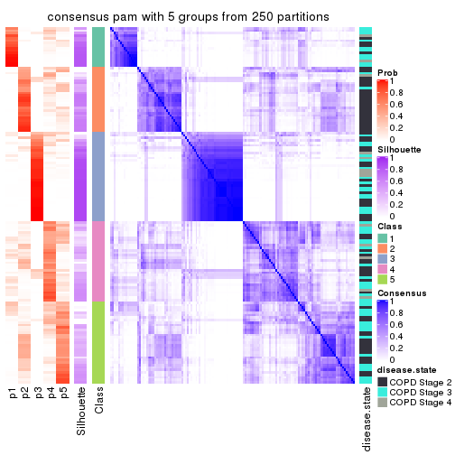</p>

</div>
<div id='tab-CV-pam-consensus-heatmap-5'>
<pre><code class="r">consensus_heatmap(res, k = 6)
</code></pre>

<p></p>

</div>
</div>

Heatmaps for the membership of samples in all partitions to see how consistent they are:


<script>
$( function() {
	$( '#tabs-CV-pam-membership-heatmap' ).tabs();
} );
</script>
<div id='tabs-CV-pam-membership-heatmap'>
<ul>
<li><a href='#tab-CV-pam-membership-heatmap-1'>k = 2</a></li>
<li><a href='#tab-CV-pam-membership-heatmap-2'>k = 3</a></li>
<li><a href='#tab-CV-pam-membership-heatmap-3'>k = 4</a></li>
<li><a href='#tab-CV-pam-membership-heatmap-4'>k = 5</a></li>
<li><a href='#tab-CV-pam-membership-heatmap-5'>k = 6</a></li>
</ul>
<div id='tab-CV-pam-membership-heatmap-1'>
<pre><code class="r">membership_heatmap(res, k = 2)
</code></pre>

<p></p>

</div>
<div id='tab-CV-pam-membership-heatmap-2'>
<pre><code class="r">membership_heatmap(res, k = 3)
</code></pre>

<p></p>

</div>
<div id='tab-CV-pam-membership-heatmap-3'>
<pre><code class="r">membership_heatmap(res, k = 4)
</code></pre>

<p></p>

</div>
<div id='tab-CV-pam-membership-heatmap-4'>
<pre><code class="r">membership_heatmap(res, k = 5)
</code></pre>

<p></p>

</div>
<div id='tab-CV-pam-membership-heatmap-5'>
<pre><code class="r">membership_heatmap(res, k = 6)
</code></pre>

<p></p>

</div>
</div>

As soon as we have had the classes for columns, we can look for signatures
which are significantly different between classes which can be candidate marks
for certain classes. Following are the heatmaps for signatures.


Signature heatmaps where rows are scaled:


<script>
$( function() {
	$( '#tabs-CV-pam-get-signatures' ).tabs();
} );
</script>
<div id='tabs-CV-pam-get-signatures'>
<ul>
<li><a href='#tab-CV-pam-get-signatures-1'>k = 2</a></li>
<li><a href='#tab-CV-pam-get-signatures-2'>k = 3</a></li>
<li><a href='#tab-CV-pam-get-signatures-3'>k = 4</a></li>
<li><a href='#tab-CV-pam-get-signatures-4'>k = 5</a></li>
<li><a href='#tab-CV-pam-get-signatures-5'>k = 6</a></li>
</ul>
<div id='tab-CV-pam-get-signatures-1'>
<pre><code class="r">get_signatures(res, k = 2)
</code></pre>

<p></p>

</div>
<div id='tab-CV-pam-get-signatures-2'>
<pre><code class="r">get_signatures(res, k = 3)
</code></pre>

<p></p>

</div>
<div id='tab-CV-pam-get-signatures-3'>
<pre><code class="r">get_signatures(res, k = 4)
</code></pre>

<p>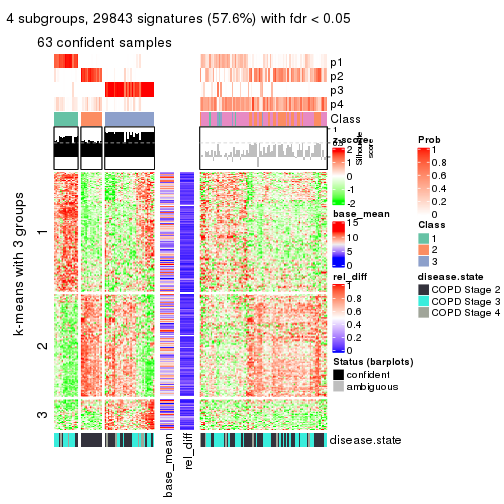</p>

</div>
<div id='tab-CV-pam-get-signatures-4'>
<pre><code class="r">get_signatures(res, k = 5)
</code></pre>

<p></p>

</div>
<div id='tab-CV-pam-get-signatures-5'>
<pre><code class="r">get_signatures(res, k = 6)
</code></pre>

<p></p>

</div>
</div>


Signature heatmaps where rows are not scaled:


<script>
$( function() {
	$( '#tabs-CV-pam-get-signatures-no-scale' ).tabs();
} );
</script>
<div id='tabs-CV-pam-get-signatures-no-scale'>
<ul>
<li><a href='#tab-CV-pam-get-signatures-no-scale-1'>k = 2</a></li>
<li><a href='#tab-CV-pam-get-signatures-no-scale-2'>k = 3</a></li>
<li><a href='#tab-CV-pam-get-signatures-no-scale-3'>k = 4</a></li>
<li><a href='#tab-CV-pam-get-signatures-no-scale-4'>k = 5</a></li>
<li><a href='#tab-CV-pam-get-signatures-no-scale-5'>k = 6</a></li>
</ul>
<div id='tab-CV-pam-get-signatures-no-scale-1'>
<pre><code class="r">get_signatures(res, k = 2, scale_rows = FALSE)
</code></pre>

<p></p>

</div>
<div id='tab-CV-pam-get-signatures-no-scale-2'>
<pre><code class="r">get_signatures(res, k = 3, scale_rows = FALSE)
</code></pre>

<p></p>

</div>
<div id='tab-CV-pam-get-signatures-no-scale-3'>
<pre><code class="r">get_signatures(res, k = 4, scale_rows = FALSE)
</code></pre>

<p></p>

</div>
<div id='tab-CV-pam-get-signatures-no-scale-4'>
<pre><code class="r">get_signatures(res, k = 5, scale_rows = FALSE)
</code></pre>

<p>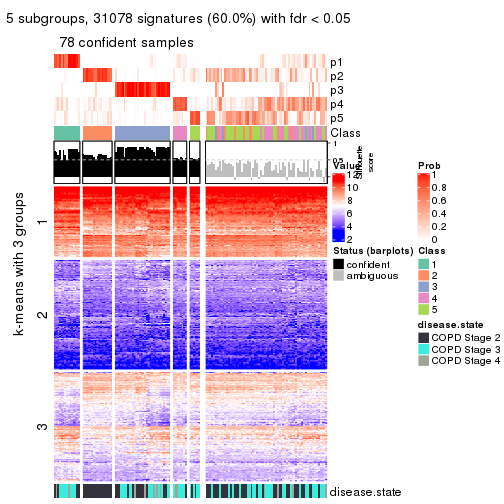</p>

</div>
<div id='tab-CV-pam-get-signatures-no-scale-5'>
<pre><code class="r">get_signatures(res, k = 6, scale_rows = FALSE)
</code></pre>

<p></p>

</div>
</div>


Compare the overlap of signatures from different k:

```r
compare_signatures(res)
```


`get_signature()` returns a data frame invisibly. TO get the list of signatures, the function
call should be assigned to a variable explicitly. In following code, if `plot` argument is set
to `FALSE`, no heatmap is plotted while only the differential analysis is performed.

```r
# code only for demonstration
tb = get_signature(res, k = ..., plot = FALSE)
```

An example of the output of `tb` is:

```
#>   which_row         fdr    mean_1    mean_2 scaled_mean_1 scaled_mean_2 km
#> 1        38 0.042760348  8.373488  9.131774    -0.5533452     0.5164555  1
#> 2        40 0.018707592  7.106213  8.469186    -0.6173731     0.5762149  1
#> 3        55 0.019134737 10.221463 11.207825    -0.6159697     0.5749050  1
#> 4        59 0.006059896  5.921854  7.869574    -0.6899429     0.6439467  1
#> 5        60 0.018055526  8.928898 10.211722    -0.6204761     0.5791110  1
#> 6        98 0.009384629 15.714769 14.887706     0.6635654    -0.6193277  2
...
```

The columns in `tb` are:

1. `which_row`: row indices corresponding to the input matrix.
2. `fdr`: FDR for the differential test. 
3. `mean_x`: The mean value in group x.
4. `scaled_mean_x`: The mean value in group x after rows are scaled.
5. `km`: Row groups if k-means clustering is applied to rows.


UMAP plot which shows how samples are separated.


<script>
$( function() {
	$( '#tabs-CV-pam-dimension-reduction' ).tabs();
} );
</script>
<div id='tabs-CV-pam-dimension-reduction'>
<ul>
<li><a href='#tab-CV-pam-dimension-reduction-1'>k = 2</a></li>
<li><a href='#tab-CV-pam-dimension-reduction-2'>k = 3</a></li>
<li><a href='#tab-CV-pam-dimension-reduction-3'>k = 4</a></li>
<li><a href='#tab-CV-pam-dimension-reduction-4'>k = 5</a></li>
<li><a href='#tab-CV-pam-dimension-reduction-5'>k = 6</a></li>
</ul>
<div id='tab-CV-pam-dimension-reduction-1'>
<pre><code class="r">dimension_reduction(res, k = 2, method = &quot;UMAP&quot;)
</code></pre>

<p>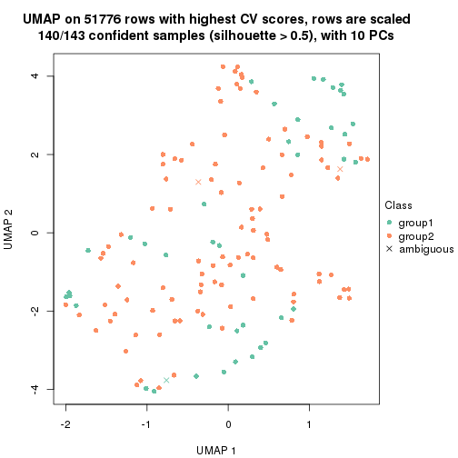</p>

</div>
<div id='tab-CV-pam-dimension-reduction-2'>
<pre><code class="r">dimension_reduction(res, k = 3, method = &quot;UMAP&quot;)
</code></pre>

<p></p>

</div>
<div id='tab-CV-pam-dimension-reduction-3'>
<pre><code class="r">dimension_reduction(res, k = 4, method = &quot;UMAP&quot;)
</code></pre>

<p></p>

</div>
<div id='tab-CV-pam-dimension-reduction-4'>
<pre><code class="r">dimension_reduction(res, k = 5, method = &quot;UMAP&quot;)
</code></pre>

<p></p>

</div>
<div id='tab-CV-pam-dimension-reduction-5'>
<pre><code class="r">dimension_reduction(res, k = 6, method = &quot;UMAP&quot;)
</code></pre>

<p></p>

</div>
</div>


Following heatmap shows how subgroups are split when increasing `k`:

```r
collect_classes(res)
```

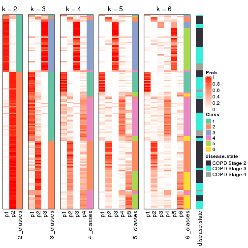


Test correlation between subgroups and known annotations. If the known
annotation is numeric, one-way ANOVA test is applied, and if the known
annotation is discrete, chi-squared contingency table test is applied.

```r
test_to_known_factors(res)
```

```
#>          n disease.state(p) k
#> CV:pam 140         0.736229 2
#> CV:pam 120         0.001094 3
#> CV:pam  63         0.000834 4
#> CV:pam  78         0.000386 5
#> CV:pam  71         0.000749 6
```


If matrix rows can be associated to genes, consider to use `GO_Enrichment(res,
...)` to perform function enrichment for the signature genes.


 

---------------------------------------------------


### CV:mclust


The object with results only for a single top-value method and a single partition method 
can be extracted as:

```r
res = res_list["CV", "mclust"]
# you can also extract it by
# res = res_list["CV:mclust"]
```

A summary of `res` and all the functions that can be applied to it:

```r
res
```

```
#> A 'ConsensusPartition' object with k = 2, 3, 4, 5, 6.
#>   On a matrix with 51776 rows and 143 columns.
#>   Top rows (1000, 2000, 3000, 4000, 5000) are extracted by 'CV' method.
#>   Subgroups are detected by 'mclust' method.
#>   Performed in total 1250 partitions by row resampling.
#>   Best k for subgroups seems to be 2.
#> 
#> Following methods can be applied to this 'ConsensusPartition' object:
#>  [1] "cola_report"             "collect_classes"         "collect_plots"          
#>  [4] "collect_stats"           "colnames"                "compare_signatures"     
#>  [7] "consensus_heatmap"       "dimension_reduction"     "functional_enrichment"  
#> [10] "get_anno_col"            "get_anno"                "get_classes"            
#> [13] "get_consensus"           "get_matrix"              "get_membership"         
#> [16] "get_param"               "get_signatures"          "get_stats"              
#> [19] "is_best_k"               "is_stable_k"             "membership_heatmap"     
#> [22] "ncol"                    "nrow"                    "plot_ecdf"              
#> [25] "rownames"                "select_partition_number" "show"                   
#> [28] "suggest_best_k"          "test_to_known_factors"
```

`collect_plots()` function collects all the plots made from `res` for all `k` (number of partitions)
into one single page to provide an easy and fast comparison between different `k`.

```r
collect_plots(res)
```


The plots are:

- The first row: a plot of the ECDF (Empirical cumulative distribution
  function) curves of the consensus matrix for each `k` and the heatmap of
  predicted classes for each `k`.
- The second row: heatmaps of the consensus matrix for each `k`.
- The third row: heatmaps of the membership matrix for each `k`.
- The fouth row: heatmaps of the signatures for each `k`.

All the plots in panels can be made by individual functions and they are
plotted later in this section.

`select_partition_number()` produces several plots showing different
statistics for choosing "optimized" `k`. There are following statistics:

- ECDF curves of the consensus matrix for each `k`;
- 1-PAC. [The PAC
  score](https://en.wikipedia.org/wiki/Consensus_clustering#Over-interpretation_potential_of_consensus_clustering)
  measures the proportion of the ambiguous subgrouping.
- Mean silhouette score.
- Concordance. The mean probability of fiting the consensus class ids in all
  partitions.
- Area increased. Denote $A_k$ as the area under the ECDF curve for current
  `k`, the area increased is defined as $A_k - A_{k-1}$.
- Rand index. The percent of pairs of samples that are both in a same cluster
  or both are not in a same cluster in the partition of k and k-1.
- Jaccard index. The ratio of pairs of samples are both in a same cluster in
  the partition of k and k-1 and the pairs of samples are both in a same
  cluster in the partition k or k-1.

The detailed explanations of these statistics can be found in [the cola
vignette](http://bioconductor.org/packages/devel/bioc/vignettes/cola/inst/doc/cola.html#toc_13).

Generally speaking, lower PAC score, higher mean silhouette score or higher
concordance corresponds to better partition. Rand index and Jaccard index
measure how similar the current partition is compared to partition with `k-1`.
If they are too similar, we won't accept `k` is better than `k-1`.

```r
select_partition_number(res)
```


The numeric values for all these statistics can be obtained by `get_stats()`.

```r
get_stats(res)
```

```
#>   k 1-PAC mean_silhouette concordance area_increased  Rand Jaccard
#> 2 2 0.681           0.880       0.937         0.4681 0.527   0.527
#> 3 3 0.253           0.455       0.657         0.2751 0.733   0.567
#> 4 4 0.455           0.607       0.771         0.1281 0.707   0.450
#> 5 5 0.444           0.639       0.757         0.0654 0.796   0.496
#> 6 6 0.472           0.471       0.660         0.0597 0.823   0.465
```

`suggest_best_k()` suggests the best $k$ based on these statistics. The rules are as follows:

- All $k$ with Jaccard index larger than 0.95 are removed because the increase of
  the partition number does not provides enough extra information. If all $k$ are removed,
  the best $k$ is assigned by `NA`.
- For $k$ with 1-PAC larger than 0.9, the maximal $k$ is taken as the "best k". Other $k$ is called "optional k".
- If it does not fit the second rule. The $k$ with the highest vote of highest
  1-PAC, mean silhouette and concordance is taken as the "best k".

```r
suggest_best_k(res)
```

```
#> [1] 2
```


Following shows the table of the partitions (You need to click the **show/hide
code output** link to see it). The membership matrix (columns with name `p*`)
is inferred by
[`clue::cl_consensus()`](https://www.rdocumentation.org/link/cl_consensus?package=clue)
function with the `SE` method. Basically the value in the membership matrix
represents the probability to belong to a certain group. The finall class
label for an item is determined with the group with highest probability it
belongs to.

In `get_classes()` function, the entropy is calculated from the membership
matrix and the silhouette score is calculated from the consensus matrix.


<script>
$( function() {
	$( '#tabs-CV-mclust-get-classes' ).tabs();
} );
</script>
<div id='tabs-CV-mclust-get-classes'>
<ul>
<li><a href='#tab-CV-mclust-get-classes-1'>k = 2</a></li>
<li><a href='#tab-CV-mclust-get-classes-2'>k = 3</a></li>
<li><a href='#tab-CV-mclust-get-classes-3'>k = 4</a></li>
<li><a href='#tab-CV-mclust-get-classes-4'>k = 5</a></li>
<li><a href='#tab-CV-mclust-get-classes-5'>k = 6</a></li>
</ul>

<div id='tab-CV-mclust-get-classes-1'>
<p><a id='tab-CV-mclust-get-classes-1-a' style='color:#0366d6' href='#'>show/hide code output</a></p>
<pre><code class="r">cbind(get_classes(res, k = 2), get_membership(res, k = 2))
</code></pre>

<pre><code>#&gt;           class entropy silhouette    p1    p2
#&gt; GSM550785     2  0.1633      0.907 0.024 0.976
#&gt; GSM550786     1  0.0672      0.941 0.992 0.008
#&gt; GSM550788     1  0.2603      0.932 0.956 0.044
#&gt; GSM550789     1  0.7139      0.783 0.804 0.196
#&gt; GSM550790     1  0.5519      0.863 0.872 0.128
#&gt; GSM550791     1  0.2236      0.940 0.964 0.036
#&gt; GSM550792     1  0.1633      0.942 0.976 0.024
#&gt; GSM550796     1  0.7056      0.786 0.808 0.192
#&gt; GSM550797     1  0.7056      0.789 0.808 0.192
#&gt; GSM550799     1  0.0672      0.941 0.992 0.008
#&gt; GSM550800     1  0.8267      0.700 0.740 0.260
#&gt; GSM550801     1  0.7219      0.779 0.800 0.200
#&gt; GSM550804     2  0.0000      0.915 0.000 1.000
#&gt; GSM550806     1  0.0672      0.941 0.992 0.008
#&gt; GSM550807     1  0.8499      0.662 0.724 0.276
#&gt; GSM550808     1  0.1184      0.944 0.984 0.016
#&gt; GSM550809     1  0.1633      0.942 0.976 0.024
#&gt; GSM550810     1  0.1633      0.942 0.976 0.024
#&gt; GSM550811     1  0.1633      0.942 0.976 0.024
#&gt; GSM550813     2  0.0938      0.916 0.012 0.988
#&gt; GSM550814     1  0.7602      0.723 0.780 0.220
#&gt; GSM550815     1  0.8763      0.637 0.704 0.296
#&gt; GSM550816     2  0.5408      0.840 0.124 0.876
#&gt; GSM550817     1  0.0000      0.942 1.000 0.000
#&gt; GSM550818     1  0.0000      0.942 1.000 0.000
#&gt; GSM550819     1  0.2423      0.939 0.960 0.040
#&gt; GSM550820     1  0.1843      0.940 0.972 0.028
#&gt; GSM550821     1  0.1633      0.943 0.976 0.024
#&gt; GSM550822     2  0.9323      0.503 0.348 0.652
#&gt; GSM550826     1  0.1633      0.943 0.976 0.024
#&gt; GSM550832     2  0.9833      0.359 0.424 0.576
#&gt; GSM550833     1  0.3274      0.922 0.940 0.060
#&gt; GSM550835     1  0.0000      0.942 1.000 0.000
#&gt; GSM550836     1  0.0000      0.942 1.000 0.000
#&gt; GSM550837     1  0.1633      0.943 0.976 0.024
#&gt; GSM550838     1  0.1633      0.943 0.976 0.024
#&gt; GSM550841     1  0.0672      0.941 0.992 0.008
#&gt; GSM550842     1  0.0000      0.942 1.000 0.000
#&gt; GSM550846     1  0.5178      0.869 0.884 0.116
#&gt; GSM550849     1  0.1184      0.944 0.984 0.016
#&gt; GSM550850     1  0.2778      0.929 0.952 0.048
#&gt; GSM550851     1  0.0938      0.942 0.988 0.012
#&gt; GSM550852     1  0.1633      0.942 0.976 0.024
#&gt; GSM550853     1  0.8386      0.687 0.732 0.268
#&gt; GSM550855     2  0.7139      0.758 0.196 0.804
#&gt; GSM550856     2  0.4562      0.865 0.096 0.904
#&gt; GSM550861     2  0.1184      0.915 0.016 0.984
#&gt; GSM550863     2  0.0000      0.915 0.000 1.000
#&gt; GSM550864     2  0.0672      0.917 0.008 0.992
#&gt; GSM550866     2  0.9522      0.469 0.372 0.628
#&gt; GSM550867     2  0.8207      0.668 0.256 0.744
#&gt; GSM550885     2  0.4431      0.861 0.092 0.908
#&gt; GSM550886     1  0.0000      0.942 1.000 0.000
#&gt; GSM550887     1  0.7453      0.753 0.788 0.212
#&gt; GSM550889     2  0.0376      0.916 0.004 0.996
#&gt; GSM550894     1  0.5842      0.836 0.860 0.140
#&gt; GSM550897     2  0.7602      0.733 0.220 0.780
#&gt; GSM550903     2  0.3584      0.882 0.068 0.932
#&gt; GSM550905     1  0.1633      0.943 0.976 0.024
#&gt; GSM550906     2  0.6887      0.782 0.184 0.816
#&gt; GSM550907     1  0.0000      0.942 1.000 0.000
#&gt; GSM550909     1  0.1184      0.944 0.984 0.016
#&gt; GSM550911     1  0.0000      0.942 1.000 0.000
#&gt; GSM550913     2  0.0938      0.916 0.012 0.988
#&gt; GSM550915     2  0.0672      0.917 0.008 0.992
#&gt; GSM550917     2  0.0672      0.917 0.008 0.992
#&gt; GSM550919     2  0.0672      0.917 0.008 0.992
#&gt; GSM550921     1  0.0000      0.942 1.000 0.000
#&gt; GSM550924     1  0.1184      0.944 0.984 0.016
#&gt; GSM550926     2  0.6247      0.815 0.156 0.844
#&gt; GSM550927     2  0.0000      0.915 0.000 1.000
#&gt; GSM550787     1  0.1633      0.943 0.976 0.024
#&gt; GSM550793     1  0.0000      0.942 1.000 0.000
#&gt; GSM550794     1  0.1633      0.942 0.976 0.024
#&gt; GSM550795     1  0.3114      0.924 0.944 0.056
#&gt; GSM550798     1  0.0672      0.941 0.992 0.008
#&gt; GSM550803     1  0.1633      0.942 0.976 0.024
#&gt; GSM550805     1  0.1184      0.944 0.984 0.016
#&gt; GSM550823     2  0.9686      0.434 0.396 0.604
#&gt; GSM550824     2  0.0672      0.917 0.008 0.992
#&gt; GSM550825     1  0.0672      0.941 0.992 0.008
#&gt; GSM550827     2  0.0672      0.917 0.008 0.992
#&gt; GSM550828     2  0.0672      0.917 0.008 0.992
#&gt; GSM550829     1  0.0672      0.941 0.992 0.008
#&gt; GSM550830     1  0.4939      0.882 0.892 0.108
#&gt; GSM550834     1  0.3274      0.922 0.940 0.060
#&gt; GSM550839     1  0.0000      0.942 1.000 0.000
#&gt; GSM550840     1  0.2778      0.929 0.952 0.048
#&gt; GSM550843     1  0.0672      0.941 0.992 0.008
#&gt; GSM550844     1  0.8763      0.561 0.704 0.296
#&gt; GSM550845     2  0.0000      0.915 0.000 1.000
#&gt; GSM550848     2  0.0672      0.917 0.008 0.992
#&gt; GSM550854     2  0.7815      0.707 0.232 0.768
#&gt; GSM550857     1  0.0672      0.941 0.992 0.008
#&gt; GSM550858     2  0.0000      0.915 0.000 1.000
#&gt; GSM550859     2  0.0672      0.917 0.008 0.992
#&gt; GSM550862     2  0.0000      0.915 0.000 1.000
#&gt; GSM550865     2  0.0000      0.915 0.000 1.000
#&gt; GSM550868     2  0.1184      0.915 0.016 0.984
#&gt; GSM550869     1  0.1184      0.944 0.984 0.016
#&gt; GSM550870     2  0.0000      0.915 0.000 1.000
#&gt; GSM550871     1  0.0000      0.942 1.000 0.000
#&gt; GSM550872     1  0.8443      0.680 0.728 0.272
#&gt; GSM550873     1  0.1184      0.944 0.984 0.016
#&gt; GSM550874     1  0.2778      0.929 0.952 0.048
#&gt; GSM550876     1  0.0000      0.942 1.000 0.000
#&gt; GSM550877     2  0.0000      0.915 0.000 1.000
#&gt; GSM550878     1  0.0000      0.942 1.000 0.000
#&gt; GSM550879     2  0.0000      0.915 0.000 1.000
#&gt; GSM550882     1  0.0672      0.941 0.992 0.008
#&gt; GSM550888     1  0.0672      0.941 0.992 0.008
#&gt; GSM550890     2  0.0000      0.915 0.000 1.000
#&gt; GSM550891     1  0.0000      0.942 1.000 0.000
#&gt; GSM550892     2  0.0000      0.915 0.000 1.000
#&gt; GSM550893     2  0.6148      0.818 0.152 0.848
#&gt; GSM550895     2  0.0672      0.917 0.008 0.992
#&gt; GSM550896     2  0.1633      0.912 0.024 0.976
#&gt; GSM550898     2  0.0672      0.917 0.008 0.992
#&gt; GSM550899     2  0.0672      0.917 0.008 0.992
#&gt; GSM550900     2  0.0672      0.917 0.008 0.992
#&gt; GSM550901     2  0.0672      0.917 0.008 0.992
#&gt; GSM550902     1  0.1633      0.943 0.976 0.024
#&gt; GSM550904     1  0.1184      0.944 0.984 0.016
#&gt; GSM550908     1  0.0672      0.941 0.992 0.008
#&gt; GSM550912     2  0.6712      0.795 0.176 0.824
#&gt; GSM550914     2  0.0000      0.915 0.000 1.000
#&gt; GSM550918     2  0.0000      0.915 0.000 1.000
#&gt; GSM550922     1  0.0000      0.942 1.000 0.000
#&gt; GSM550923     1  0.1184      0.944 0.984 0.016
#&gt; GSM550925     2  0.3114      0.894 0.056 0.944
#&gt; GSM550802     1  0.1633      0.942 0.976 0.024
#&gt; GSM550812     1  0.1633      0.942 0.976 0.024
#&gt; GSM550831     1  0.2778      0.929 0.952 0.048
#&gt; GSM550847     2  0.0672      0.917 0.008 0.992
#&gt; GSM550860     1  0.0672      0.941 0.992 0.008
#&gt; GSM550875     1  0.1184      0.944 0.984 0.016
#&gt; GSM550880     1  0.8443      0.669 0.728 0.272
#&gt; GSM550881     1  0.0000      0.942 1.000 0.000
#&gt; GSM550883     1  0.0000      0.942 1.000 0.000
#&gt; GSM550884     1  0.1184      0.944 0.984 0.016
#&gt; GSM550910     1  0.0672      0.941 0.992 0.008
#&gt; GSM550916     2  0.9850      0.342 0.428 0.572
#&gt; GSM550920     1  0.0000      0.942 1.000 0.000
</code></pre>

<script>
$('#tab-CV-mclust-get-classes-1-a').parent().next().next().hide();
$('#tab-CV-mclust-get-classes-1-a').click(function(){
  $('#tab-CV-mclust-get-classes-1-a').parent().next().next().toggle();
  return(false);
});
</script>
</div>

<div id='tab-CV-mclust-get-classes-2'>
<p><a id='tab-CV-mclust-get-classes-2-a' style='color:#0366d6' href='#'>show/hide code output</a></p>
<pre><code class="r">cbind(get_classes(res, k = 3), get_membership(res, k = 3))
</code></pre>

<pre><code>#&gt;           class entropy silhouette    p1    p2    p3
#&gt; GSM550785     1  0.9501     0.8811 0.472 0.324 0.204
#&gt; GSM550786     3  0.7309     0.6890 0.124 0.168 0.708
#&gt; GSM550788     2  0.6126     0.3306 0.000 0.600 0.400
#&gt; GSM550789     2  0.6102     0.4471 0.008 0.672 0.320
#&gt; GSM550790     3  0.2261     0.6364 0.000 0.068 0.932
#&gt; GSM550791     3  0.1453     0.6549 0.008 0.024 0.968
#&gt; GSM550792     3  0.4887     0.5849 0.000 0.228 0.772
#&gt; GSM550796     2  0.6045     0.3651 0.000 0.620 0.380
#&gt; GSM550797     2  0.5956     0.4405 0.004 0.672 0.324
#&gt; GSM550799     3  0.5843     0.6957 0.252 0.016 0.732
#&gt; GSM550800     2  0.5659     0.5036 0.012 0.740 0.248
#&gt; GSM550801     2  0.5958     0.4656 0.008 0.692 0.300
#&gt; GSM550804     2  0.6168    -0.2621 0.412 0.588 0.000
#&gt; GSM550806     3  0.6398     0.6685 0.416 0.004 0.580
#&gt; GSM550807     2  0.5656     0.4972 0.008 0.728 0.264
#&gt; GSM550808     3  0.5220     0.6168 0.012 0.208 0.780
#&gt; GSM550809     3  0.0747     0.6550 0.000 0.016 0.984
#&gt; GSM550810     2  0.6745     0.2399 0.012 0.560 0.428
#&gt; GSM550811     3  0.4291     0.6348 0.000 0.180 0.820
#&gt; GSM550813     2  0.4645     0.5235 0.008 0.816 0.176
#&gt; GSM550814     2  0.7222     0.2846 0.032 0.580 0.388
#&gt; GSM550815     2  0.5461     0.5052 0.008 0.748 0.244
#&gt; GSM550816     2  0.4840     0.5179 0.016 0.816 0.168
#&gt; GSM550817     3  0.6305     0.6390 0.484 0.000 0.516
#&gt; GSM550818     3  0.6244     0.6573 0.440 0.000 0.560
#&gt; GSM550819     3  0.8955     0.4983 0.144 0.332 0.524
#&gt; GSM550820     3  0.4994     0.6778 0.160 0.024 0.816
#&gt; GSM550821     3  0.8670     0.6922 0.240 0.168 0.592
#&gt; GSM550822     2  0.5455     0.5302 0.020 0.776 0.204
#&gt; GSM550826     3  0.8532     0.6938 0.224 0.168 0.608
#&gt; GSM550832     2  0.7770     0.3693 0.080 0.628 0.292
#&gt; GSM550833     2  0.6111     0.3415 0.000 0.604 0.396
#&gt; GSM550835     3  0.5932     0.6741 0.056 0.164 0.780
#&gt; GSM550836     3  0.5138     0.6929 0.252 0.000 0.748
#&gt; GSM550837     3  0.5412     0.6595 0.032 0.172 0.796
#&gt; GSM550838     3  0.1337     0.6642 0.016 0.012 0.972
#&gt; GSM550841     3  0.6625     0.6582 0.440 0.008 0.552
#&gt; GSM550842     3  0.6544     0.6826 0.084 0.164 0.752
#&gt; GSM550846     3  0.8470     0.4662 0.104 0.344 0.552
#&gt; GSM550849     3  0.4121     0.6436 0.000 0.168 0.832
#&gt; GSM550850     3  0.1411     0.6484 0.000 0.036 0.964
#&gt; GSM550851     3  0.6138     0.6718 0.060 0.172 0.768
#&gt; GSM550852     2  0.6252     0.2389 0.000 0.556 0.444
#&gt; GSM550853     2  0.5722     0.4624 0.004 0.704 0.292
#&gt; GSM550855     2  0.4551     0.4996 0.020 0.840 0.140
#&gt; GSM550856     2  0.2866     0.4320 0.008 0.916 0.076
#&gt; GSM550861     2  0.4589     0.5217 0.008 0.820 0.172
#&gt; GSM550863     2  0.6244    -0.3071 0.440 0.560 0.000
#&gt; GSM550864     2  0.6451    -0.2094 0.384 0.608 0.008
#&gt; GSM550866     2  0.4784     0.5237 0.004 0.796 0.200
#&gt; GSM550867     3  0.9647    -0.4586 0.264 0.268 0.468
#&gt; GSM550885     1  0.9613     0.8444 0.464 0.308 0.228
#&gt; GSM550886     3  0.8843     0.6871 0.276 0.160 0.564
#&gt; GSM550887     2  0.7214     0.3784 0.044 0.632 0.324
#&gt; GSM550889     2  0.6421    -0.2764 0.424 0.572 0.004
#&gt; GSM550894     2  0.8097     0.1704 0.072 0.540 0.388
#&gt; GSM550897     3  0.9120     0.4865 0.156 0.340 0.504
#&gt; GSM550903     2  0.5277     0.5283 0.024 0.796 0.180
#&gt; GSM550905     3  0.7097     0.6829 0.108 0.172 0.720
#&gt; GSM550906     2  0.6049     0.5196 0.040 0.756 0.204
#&gt; GSM550907     3  0.6305     0.6390 0.484 0.000 0.516
#&gt; GSM550909     3  0.7027     0.6795 0.104 0.172 0.724
#&gt; GSM550911     3  0.6305     0.6390 0.484 0.000 0.516
#&gt; GSM550913     2  0.6341    -0.0812 0.312 0.672 0.016
#&gt; GSM550915     2  0.6410    -0.2830 0.420 0.576 0.004
#&gt; GSM550917     2  0.6617    -0.2113 0.388 0.600 0.012
#&gt; GSM550919     2  0.6587    -0.2784 0.424 0.568 0.008
#&gt; GSM550921     3  0.6305     0.6390 0.484 0.000 0.516
#&gt; GSM550924     3  0.8532     0.6907 0.224 0.168 0.608
#&gt; GSM550926     2  0.6201     0.5168 0.044 0.748 0.208
#&gt; GSM550927     2  0.6079    -0.2248 0.388 0.612 0.000
#&gt; GSM550787     3  0.6677     0.6818 0.088 0.168 0.744
#&gt; GSM550793     3  0.3112     0.6894 0.096 0.004 0.900
#&gt; GSM550794     3  0.5591     0.4708 0.000 0.304 0.696
#&gt; GSM550795     3  0.1643     0.6457 0.000 0.044 0.956
#&gt; GSM550798     3  0.2200     0.6783 0.056 0.004 0.940
#&gt; GSM550803     3  0.1031     0.6521 0.000 0.024 0.976
#&gt; GSM550805     3  0.4178     0.6407 0.000 0.172 0.828
#&gt; GSM550823     3  0.7777     0.3746 0.060 0.364 0.576
#&gt; GSM550824     1  0.9167     0.9104 0.512 0.320 0.168
#&gt; GSM550825     3  0.6520     0.6373 0.488 0.004 0.508
#&gt; GSM550827     2  0.6421    -0.2918 0.424 0.572 0.004
#&gt; GSM550828     1  0.9335     0.8667 0.456 0.376 0.168
#&gt; GSM550829     3  0.5797     0.6607 0.280 0.008 0.712
#&gt; GSM550830     3  0.5882     0.3945 0.000 0.348 0.652
#&gt; GSM550834     3  0.1753     0.6430 0.000 0.048 0.952
#&gt; GSM550839     3  0.6208     0.6781 0.068 0.164 0.768
#&gt; GSM550840     3  0.1411     0.6484 0.000 0.036 0.964
#&gt; GSM550843     3  0.7063     0.6488 0.464 0.020 0.516
#&gt; GSM550844     3  0.4551     0.6778 0.132 0.024 0.844
#&gt; GSM550845     2  0.6154    -0.2565 0.408 0.592 0.000
#&gt; GSM550848     2  0.6701    -0.2522 0.412 0.576 0.012
#&gt; GSM550854     1  0.9928     0.5952 0.372 0.276 0.352
#&gt; GSM550857     3  0.6520     0.6373 0.488 0.004 0.508
#&gt; GSM550858     1  0.9229     0.9068 0.496 0.336 0.168
#&gt; GSM550859     1  0.9167     0.9104 0.512 0.320 0.168
#&gt; GSM550862     1  0.9215     0.9085 0.500 0.332 0.168
#&gt; GSM550865     2  0.6180    -0.2709 0.416 0.584 0.000
#&gt; GSM550868     2  0.9001    -0.0920 0.280 0.548 0.172
#&gt; GSM550869     3  0.4921     0.6578 0.020 0.164 0.816
#&gt; GSM550870     2  0.3434     0.4385 0.032 0.904 0.064
#&gt; GSM550871     3  0.6848     0.6874 0.100 0.164 0.736
#&gt; GSM550872     3  0.6205     0.5081 0.008 0.336 0.656
#&gt; GSM550873     3  0.6769     0.4450 0.028 0.320 0.652
#&gt; GSM550874     2  0.6079     0.3522 0.000 0.612 0.388
#&gt; GSM550876     3  0.8848     0.6865 0.284 0.156 0.560
#&gt; GSM550877     2  0.2152     0.4087 0.016 0.948 0.036
#&gt; GSM550878     3  0.6305     0.6390 0.484 0.000 0.516
#&gt; GSM550879     2  0.9361    -0.8092 0.396 0.436 0.168
#&gt; GSM550882     3  0.6520     0.6373 0.488 0.004 0.508
#&gt; GSM550888     3  0.6520     0.6373 0.488 0.004 0.508
#&gt; GSM550890     2  0.6192    -0.2765 0.420 0.580 0.000
#&gt; GSM550891     3  0.6305     0.6390 0.484 0.000 0.516
#&gt; GSM550892     1  0.9298     0.8689 0.460 0.376 0.164
#&gt; GSM550893     2  0.6306     0.5174 0.052 0.748 0.200
#&gt; GSM550895     2  0.6754    -0.2766 0.432 0.556 0.012
#&gt; GSM550896     2  0.5253     0.1583 0.188 0.792 0.020
#&gt; GSM550898     1  0.9167     0.9104 0.512 0.320 0.168
#&gt; GSM550899     2  0.6600    -0.2034 0.384 0.604 0.012
#&gt; GSM550900     2  0.7741    -0.1740 0.376 0.568 0.056
#&gt; GSM550901     2  0.6824    -0.2553 0.408 0.576 0.016
#&gt; GSM550902     3  0.8576     0.6948 0.240 0.160 0.600
#&gt; GSM550904     3  0.5072     0.6778 0.196 0.012 0.792
#&gt; GSM550908     3  0.6520     0.6373 0.488 0.004 0.508
#&gt; GSM550912     2  0.6141     0.5040 0.032 0.736 0.232
#&gt; GSM550914     2  0.6180    -0.2709 0.416 0.584 0.000
#&gt; GSM550918     2  0.6079    -0.2220 0.388 0.612 0.000
#&gt; GSM550922     3  0.8528     0.6961 0.240 0.156 0.604
#&gt; GSM550923     3  0.4409     0.6813 0.172 0.004 0.824
#&gt; GSM550925     2  0.9581     0.1171 0.236 0.476 0.288
#&gt; GSM550802     3  0.5560     0.4752 0.000 0.300 0.700
#&gt; GSM550812     3  0.5560     0.4784 0.000 0.300 0.700
#&gt; GSM550831     3  0.1411     0.6484 0.000 0.036 0.964
#&gt; GSM550847     1  0.9299     0.9076 0.496 0.324 0.180
#&gt; GSM550860     3  0.8914     0.6861 0.280 0.164 0.556
#&gt; GSM550875     3  0.4235     0.6377 0.000 0.176 0.824
#&gt; GSM550880     3  0.5235     0.5223 0.036 0.152 0.812
#&gt; GSM550881     3  0.6305     0.6390 0.484 0.000 0.516
#&gt; GSM550883     3  0.6299     0.6414 0.476 0.000 0.524
#&gt; GSM550884     3  0.8309     0.6839 0.188 0.180 0.632
#&gt; GSM550910     3  0.8752     0.6913 0.292 0.144 0.564
#&gt; GSM550916     3  0.5932     0.6521 0.164 0.056 0.780
#&gt; GSM550920     3  0.8334     0.7035 0.248 0.136 0.616
</code></pre>

<script>
$('#tab-CV-mclust-get-classes-2-a').parent().next().next().hide();
$('#tab-CV-mclust-get-classes-2-a').click(function(){
  $('#tab-CV-mclust-get-classes-2-a').parent().next().next().toggle();
  return(false);
});
</script>
</div>

<div id='tab-CV-mclust-get-classes-3'>
<p><a id='tab-CV-mclust-get-classes-3-a' style='color:#0366d6' href='#'>show/hide code output</a></p>
<pre><code class="r">cbind(get_classes(res, k = 4), get_membership(res, k = 4))
</code></pre>

<pre><code>#&gt;           class entropy silhouette    p1    p2    p3    p4
#&gt; GSM550785     1  0.3004    0.89769 0.892 0.048 0.000 0.060
#&gt; GSM550786     2  0.3893    0.57091 0.008 0.796 0.196 0.000
#&gt; GSM550788     2  0.4372    0.57429 0.000 0.728 0.004 0.268
#&gt; GSM550789     2  0.4632    0.54155 0.000 0.688 0.004 0.308
#&gt; GSM550790     2  0.4826    0.57244 0.264 0.716 0.000 0.020
#&gt; GSM550791     2  0.4803    0.59006 0.248 0.732 0.008 0.012
#&gt; GSM550792     2  0.4011    0.61253 0.008 0.784 0.000 0.208
#&gt; GSM550796     2  0.4720    0.52933 0.000 0.672 0.004 0.324
#&gt; GSM550797     2  0.4655    0.53880 0.000 0.684 0.004 0.312
#&gt; GSM550799     3  0.5548    0.55212 0.024 0.388 0.588 0.000
#&gt; GSM550800     2  0.4741    0.53414 0.000 0.668 0.004 0.328
#&gt; GSM550801     2  0.4677    0.53472 0.000 0.680 0.004 0.316
#&gt; GSM550804     4  0.2670    0.71453 0.040 0.052 0.000 0.908
#&gt; GSM550806     3  0.1256    0.88362 0.008 0.028 0.964 0.000
#&gt; GSM550807     2  0.4655    0.53880 0.000 0.684 0.004 0.312
#&gt; GSM550808     2  0.1677    0.67268 0.000 0.948 0.040 0.012
#&gt; GSM550809     2  0.4540    0.59117 0.248 0.740 0.008 0.004
#&gt; GSM550810     2  0.4283    0.58087 0.000 0.740 0.004 0.256
#&gt; GSM550811     2  0.4226    0.67562 0.084 0.836 0.008 0.072
#&gt; GSM550813     4  0.3326    0.70526 0.008 0.132 0.004 0.856
#&gt; GSM550814     2  0.5746    0.40088 0.000 0.572 0.032 0.396
#&gt; GSM550815     2  0.4720    0.53616 0.000 0.672 0.004 0.324
#&gt; GSM550816     4  0.5433   -0.00865 0.008 0.448 0.004 0.540
#&gt; GSM550817     3  0.0817    0.88381 0.000 0.024 0.976 0.000
#&gt; GSM550818     3  0.1211    0.87773 0.000 0.040 0.960 0.000
#&gt; GSM550819     2  0.7293    0.41426 0.000 0.496 0.164 0.340
#&gt; GSM550820     2  0.8113    0.46093 0.272 0.488 0.216 0.024
#&gt; GSM550821     2  0.5723    0.45676 0.008 0.648 0.312 0.032
#&gt; GSM550822     4  0.5168   -0.19979 0.000 0.496 0.004 0.500
#&gt; GSM550826     2  0.6391    0.46603 0.056 0.636 0.288 0.020
#&gt; GSM550832     2  0.6495    0.27093 0.000 0.492 0.072 0.436
#&gt; GSM550833     2  0.4462    0.58142 0.004 0.736 0.004 0.256
#&gt; GSM550835     2  0.3495    0.60711 0.016 0.844 0.140 0.000
#&gt; GSM550836     3  0.5019    0.63479 0.044 0.200 0.752 0.004
#&gt; GSM550837     2  0.2927    0.66471 0.024 0.900 0.068 0.008
#&gt; GSM550838     2  0.3647    0.64933 0.152 0.832 0.016 0.000
#&gt; GSM550841     3  0.3196    0.83581 0.008 0.136 0.856 0.000
#&gt; GSM550842     2  0.4050    0.60675 0.000 0.808 0.168 0.024
#&gt; GSM550846     2  0.6702    0.30861 0.000 0.512 0.092 0.396
#&gt; GSM550849     2  0.2353    0.67416 0.056 0.924 0.008 0.012
#&gt; GSM550850     2  0.4647    0.57995 0.288 0.704 0.008 0.000
#&gt; GSM550851     2  0.2271    0.67045 0.008 0.928 0.052 0.012
#&gt; GSM550852     2  0.4164    0.58005 0.000 0.736 0.000 0.264
#&gt; GSM550853     2  0.4741    0.53292 0.000 0.668 0.004 0.328
#&gt; GSM550855     4  0.5457   -0.09405 0.008 0.472 0.004 0.516
#&gt; GSM550856     4  0.3737    0.71066 0.020 0.136 0.004 0.840
#&gt; GSM550861     4  0.5438   -0.01962 0.008 0.452 0.004 0.536
#&gt; GSM550863     4  0.4579    0.48897 0.200 0.032 0.000 0.768
#&gt; GSM550864     4  0.2722    0.71865 0.032 0.064 0.000 0.904
#&gt; GSM550866     4  0.3232    0.71677 0.016 0.108 0.004 0.872
#&gt; GSM550867     1  0.2742    0.88022 0.900 0.076 0.000 0.024
#&gt; GSM550885     1  0.2761    0.89559 0.904 0.048 0.000 0.048
#&gt; GSM550886     2  0.5337    0.22811 0.000 0.564 0.424 0.012
#&gt; GSM550887     2  0.5337    0.36717 0.000 0.564 0.012 0.424
#&gt; GSM550889     4  0.2871    0.67591 0.072 0.032 0.000 0.896
#&gt; GSM550894     2  0.7181    0.43125 0.000 0.512 0.152 0.336
#&gt; GSM550897     4  0.8986    0.01119 0.252 0.304 0.060 0.384
#&gt; GSM550903     4  0.3074    0.68758 0.000 0.152 0.000 0.848
#&gt; GSM550905     2  0.3544    0.67250 0.008 0.872 0.076 0.044
#&gt; GSM550906     4  0.5158   -0.12422 0.000 0.472 0.004 0.524
#&gt; GSM550907     3  0.0188    0.88500 0.000 0.004 0.996 0.000
#&gt; GSM550909     2  0.4793    0.60149 0.000 0.756 0.204 0.040
#&gt; GSM550911     3  0.0188    0.88500 0.000 0.004 0.996 0.000
#&gt; GSM550913     4  0.5578    0.45592 0.040 0.312 0.000 0.648
#&gt; GSM550915     4  0.3224    0.65099 0.120 0.016 0.000 0.864
#&gt; GSM550917     4  0.2996    0.71775 0.044 0.064 0.000 0.892
#&gt; GSM550919     4  0.3286    0.67842 0.080 0.044 0.000 0.876
#&gt; GSM550921     3  0.0712    0.88351 0.004 0.008 0.984 0.004
#&gt; GSM550924     2  0.5496    0.47253 0.000 0.652 0.312 0.036
#&gt; GSM550926     4  0.2589    0.71390 0.000 0.116 0.000 0.884
#&gt; GSM550927     4  0.5821    0.28056 0.040 0.368 0.000 0.592
#&gt; GSM550787     2  0.4889    0.63245 0.028 0.788 0.156 0.028
#&gt; GSM550793     2  0.3428    0.61903 0.012 0.844 0.144 0.000
#&gt; GSM550794     2  0.4245    0.61436 0.020 0.784 0.000 0.196
#&gt; GSM550795     2  0.4647    0.57995 0.288 0.704 0.008 0.000
#&gt; GSM550798     2  0.3634    0.65544 0.096 0.856 0.048 0.000
#&gt; GSM550803     2  0.4164    0.57784 0.264 0.736 0.000 0.000
#&gt; GSM550805     2  0.2245    0.67851 0.040 0.932 0.008 0.020
#&gt; GSM550823     2  0.6392    0.30859 0.000 0.528 0.068 0.404
#&gt; GSM550824     1  0.2411    0.90007 0.920 0.040 0.000 0.040
#&gt; GSM550825     3  0.0992    0.88351 0.012 0.008 0.976 0.004
#&gt; GSM550827     4  0.3695    0.60646 0.156 0.016 0.000 0.828
#&gt; GSM550828     1  0.4849    0.79052 0.772 0.064 0.000 0.164
#&gt; GSM550829     2  0.6265    0.40287 0.072 0.588 0.340 0.000
#&gt; GSM550830     2  0.4134    0.57859 0.000 0.740 0.000 0.260
#&gt; GSM550834     2  0.4647    0.57995 0.288 0.704 0.008 0.000
#&gt; GSM550839     2  0.2921    0.62308 0.000 0.860 0.140 0.000
#&gt; GSM550840     2  0.4540    0.59117 0.248 0.740 0.008 0.004
#&gt; GSM550843     3  0.3196    0.83016 0.008 0.136 0.856 0.000
#&gt; GSM550844     2  0.8156    0.49545 0.256 0.512 0.196 0.036
#&gt; GSM550845     4  0.2928    0.71273 0.052 0.052 0.000 0.896
#&gt; GSM550848     4  0.2593    0.68041 0.080 0.016 0.000 0.904
#&gt; GSM550854     1  0.2670    0.88180 0.904 0.072 0.000 0.024
#&gt; GSM550857     3  0.0992    0.88351 0.012 0.008 0.976 0.004
#&gt; GSM550858     1  0.3082    0.89136 0.884 0.032 0.000 0.084
#&gt; GSM550859     1  0.2411    0.90007 0.920 0.040 0.000 0.040
#&gt; GSM550862     1  0.3013    0.89388 0.888 0.032 0.000 0.080
#&gt; GSM550865     4  0.2401    0.66859 0.092 0.004 0.000 0.904
#&gt; GSM550868     4  0.5364    0.46326 0.204 0.060 0.004 0.732
#&gt; GSM550869     2  0.2807    0.67797 0.032 0.912 0.040 0.016
#&gt; GSM550870     4  0.2860    0.71332 0.008 0.100 0.004 0.888
#&gt; GSM550871     2  0.4826    0.53573 0.000 0.716 0.264 0.020
#&gt; GSM550872     2  0.5874    0.62121 0.192 0.696 0.000 0.112
#&gt; GSM550873     2  0.3745    0.66838 0.000 0.852 0.060 0.088
#&gt; GSM550874     2  0.4509    0.56072 0.000 0.708 0.004 0.288
#&gt; GSM550876     3  0.4134    0.72784 0.000 0.260 0.740 0.000
#&gt; GSM550877     4  0.2281    0.71525 0.000 0.096 0.000 0.904
#&gt; GSM550878     3  0.0188    0.88500 0.000 0.004 0.996 0.000
#&gt; GSM550879     1  0.6491    0.33844 0.496 0.060 0.004 0.440
#&gt; GSM550882     3  0.1256    0.88250 0.008 0.028 0.964 0.000
#&gt; GSM550888     3  0.0992    0.88351 0.012 0.008 0.976 0.004
#&gt; GSM550890     4  0.2799    0.64755 0.108 0.008 0.000 0.884
#&gt; GSM550891     3  0.0712    0.88351 0.004 0.008 0.984 0.004
#&gt; GSM550892     1  0.5906    0.63536 0.644 0.064 0.000 0.292
#&gt; GSM550893     4  0.2530    0.71510 0.000 0.112 0.000 0.888
#&gt; GSM550895     4  0.3323    0.71451 0.060 0.064 0.000 0.876
#&gt; GSM550896     4  0.2413    0.71861 0.020 0.064 0.000 0.916
#&gt; GSM550898     1  0.2411    0.90007 0.920 0.040 0.000 0.040
#&gt; GSM550899     4  0.2816    0.71850 0.036 0.064 0.000 0.900
#&gt; GSM550900     4  0.4728    0.43518 0.216 0.032 0.000 0.752
#&gt; GSM550901     4  0.5312    0.28762 0.268 0.040 0.000 0.692
#&gt; GSM550902     2  0.6481    0.47202 0.064 0.636 0.280 0.020
#&gt; GSM550904     2  0.7888    0.50231 0.196 0.528 0.252 0.024
#&gt; GSM550908     3  0.0992    0.88351 0.012 0.008 0.976 0.004
#&gt; GSM550912     4  0.4222    0.51736 0.000 0.272 0.000 0.728
#&gt; GSM550914     4  0.2530    0.66300 0.100 0.004 0.000 0.896
#&gt; GSM550918     4  0.2282    0.71578 0.024 0.052 0.000 0.924
#&gt; GSM550922     3  0.4040    0.74636 0.000 0.248 0.752 0.000
#&gt; GSM550923     2  0.8100    0.44365 0.264 0.464 0.256 0.016
#&gt; GSM550925     4  0.6998    0.22741 0.232 0.084 0.044 0.640
#&gt; GSM550802     2  0.3801    0.60115 0.000 0.780 0.000 0.220
#&gt; GSM550812     2  0.3486    0.62695 0.000 0.812 0.000 0.188
#&gt; GSM550831     2  0.4647    0.57995 0.288 0.704 0.008 0.000
#&gt; GSM550847     1  0.2670    0.90001 0.908 0.040 0.000 0.052
#&gt; GSM550860     2  0.5577    0.37438 0.008 0.612 0.364 0.016
#&gt; GSM550875     2  0.2660    0.66901 0.072 0.908 0.008 0.012
#&gt; GSM550880     2  0.5251    0.58262 0.252 0.712 0.008 0.028
#&gt; GSM550881     3  0.0188    0.88500 0.000 0.004 0.996 0.000
#&gt; GSM550883     3  0.0712    0.88351 0.004 0.008 0.984 0.004
#&gt; GSM550884     2  0.5520    0.56154 0.000 0.696 0.244 0.060
#&gt; GSM550910     3  0.4086    0.77186 0.008 0.216 0.776 0.000
#&gt; GSM550916     2  0.8607    0.44793 0.272 0.476 0.192 0.060
#&gt; GSM550920     3  0.4661    0.54633 0.000 0.348 0.652 0.000
</code></pre>

<script>
$('#tab-CV-mclust-get-classes-3-a').parent().next().next().hide();
$('#tab-CV-mclust-get-classes-3-a').click(function(){
  $('#tab-CV-mclust-get-classes-3-a').parent().next().next().toggle();
  return(false);
});
</script>
</div>

<div id='tab-CV-mclust-get-classes-4'>
<p><a id='tab-CV-mclust-get-classes-4-a' style='color:#0366d6' href='#'>show/hide code output</a></p>
<pre><code class="r">cbind(get_classes(res, k = 5), get_membership(res, k = 5))
</code></pre>

<pre><code>#&gt;           class entropy silhouette    p1    p2    p3    p4    p5
#&gt; GSM550785     1  0.3546    0.69364 0.840 0.024 0.000 0.024 0.112
#&gt; GSM550786     4  0.2972    0.69852 0.004 0.000 0.084 0.872 0.040
#&gt; GSM550788     4  0.4225    0.13185 0.000 0.364 0.000 0.632 0.004
#&gt; GSM550789     2  0.4967    0.42174 0.004 0.512 0.000 0.464 0.020
#&gt; GSM550790     1  0.4639    0.47689 0.636 0.008 0.000 0.344 0.012
#&gt; GSM550791     4  0.5433    0.63962 0.144 0.012 0.020 0.724 0.100
#&gt; GSM550792     4  0.3227    0.69752 0.020 0.072 0.000 0.868 0.040
#&gt; GSM550796     2  0.4219    0.54489 0.000 0.584 0.000 0.416 0.000
#&gt; GSM550797     2  0.4811    0.45248 0.000 0.528 0.000 0.452 0.020
#&gt; GSM550799     4  0.5216    0.27359 0.000 0.004 0.344 0.604 0.048
#&gt; GSM550800     2  0.5061    0.59402 0.012 0.580 0.000 0.388 0.020
#&gt; GSM550801     2  0.4651    0.61600 0.000 0.608 0.000 0.372 0.020
#&gt; GSM550804     2  0.0798    0.70373 0.016 0.976 0.000 0.000 0.008
#&gt; GSM550806     3  0.4276    0.62666 0.000 0.000 0.716 0.256 0.028
#&gt; GSM550807     2  0.4626    0.62676 0.000 0.616 0.000 0.364 0.020
#&gt; GSM550808     4  0.2193    0.70789 0.000 0.028 0.008 0.920 0.044
#&gt; GSM550809     4  0.4767    0.66041 0.128 0.020 0.020 0.780 0.052
#&gt; GSM550810     4  0.3491    0.53834 0.000 0.228 0.000 0.768 0.004
#&gt; GSM550811     4  0.3748    0.69666 0.064 0.036 0.004 0.848 0.048
#&gt; GSM550813     2  0.1282    0.75189 0.000 0.952 0.000 0.044 0.004
#&gt; GSM550814     2  0.3861    0.66422 0.000 0.712 0.000 0.284 0.004
#&gt; GSM550815     4  0.4800   -0.33454 0.012 0.476 0.000 0.508 0.004
#&gt; GSM550816     2  0.2798    0.77132 0.000 0.852 0.000 0.140 0.008
#&gt; GSM550817     3  0.4276    0.60645 0.000 0.000 0.716 0.256 0.028
#&gt; GSM550818     3  0.2230    0.79535 0.000 0.000 0.884 0.116 0.000
#&gt; GSM550819     4  0.4777    0.51412 0.004 0.316 0.012 0.656 0.012
#&gt; GSM550820     4  0.7629    0.27382 0.300 0.104 0.008 0.480 0.108
#&gt; GSM550821     4  0.5258    0.67914 0.004 0.112 0.100 0.744 0.040
#&gt; GSM550822     2  0.3652    0.74516 0.004 0.784 0.000 0.200 0.012
#&gt; GSM550826     4  0.6090    0.65117 0.064 0.096 0.136 0.692 0.012
#&gt; GSM550832     2  0.3870    0.68221 0.000 0.732 0.004 0.260 0.004
#&gt; GSM550833     4  0.3656    0.60630 0.000 0.196 0.000 0.784 0.020
#&gt; GSM550835     4  0.2798    0.70582 0.000 0.008 0.044 0.888 0.060
#&gt; GSM550836     3  0.3812    0.68848 0.000 0.000 0.812 0.096 0.092
#&gt; GSM550837     4  0.2416    0.70838 0.000 0.016 0.016 0.908 0.060
#&gt; GSM550838     4  0.4908    0.65770 0.092 0.000 0.028 0.756 0.124
#&gt; GSM550841     3  0.4898    0.47505 0.004 0.000 0.632 0.332 0.032
#&gt; GSM550842     4  0.3319    0.71151 0.000 0.040 0.052 0.868 0.040
#&gt; GSM550846     4  0.5061    0.52204 0.024 0.312 0.000 0.644 0.020
#&gt; GSM550849     4  0.3229    0.70485 0.044 0.016 0.016 0.880 0.044
#&gt; GSM550850     4  0.6209    0.57530 0.140 0.008 0.020 0.636 0.196
#&gt; GSM550851     4  0.1949    0.70667 0.000 0.012 0.016 0.932 0.040
#&gt; GSM550852     4  0.3607    0.50288 0.000 0.244 0.000 0.752 0.004
#&gt; GSM550853     2  0.4747    0.62174 0.008 0.604 0.000 0.376 0.012
#&gt; GSM550855     2  0.2690    0.76726 0.000 0.844 0.000 0.156 0.000
#&gt; GSM550856     2  0.0955    0.74172 0.004 0.968 0.000 0.028 0.000
#&gt; GSM550861     2  0.2719    0.76997 0.000 0.852 0.000 0.144 0.004
#&gt; GSM550863     5  0.5371    0.82381 0.096 0.208 0.000 0.012 0.684
#&gt; GSM550864     2  0.0451    0.70970 0.008 0.988 0.000 0.000 0.004
#&gt; GSM550866     2  0.1270    0.74909 0.000 0.948 0.000 0.052 0.000
#&gt; GSM550867     1  0.2522    0.70151 0.880 0.012 0.000 0.108 0.000
#&gt; GSM550885     1  0.2295    0.70736 0.900 0.004 0.000 0.088 0.008
#&gt; GSM550886     4  0.5929    0.51674 0.000 0.068 0.276 0.620 0.036
#&gt; GSM550887     2  0.3427    0.75271 0.000 0.796 0.000 0.192 0.012
#&gt; GSM550889     5  0.4518    0.81312 0.016 0.320 0.000 0.004 0.660
#&gt; GSM550894     2  0.4770    0.42209 0.000 0.596 0.012 0.384 0.008
#&gt; GSM550897     4  0.7974    0.39761 0.200 0.168 0.004 0.476 0.152
#&gt; GSM550903     2  0.2005    0.75703 0.004 0.924 0.000 0.056 0.016
#&gt; GSM550905     4  0.3113    0.71886 0.000 0.080 0.008 0.868 0.044
#&gt; GSM550906     2  0.3399    0.76135 0.004 0.812 0.000 0.172 0.012
#&gt; GSM550907     3  0.0000    0.85843 0.000 0.000 1.000 0.000 0.000
#&gt; GSM550909     4  0.3635    0.70576 0.000 0.132 0.036 0.824 0.008
#&gt; GSM550911     3  0.0000    0.85843 0.000 0.000 1.000 0.000 0.000
#&gt; GSM550913     2  0.3006    0.76804 0.004 0.836 0.000 0.156 0.004
#&gt; GSM550915     5  0.4329    0.86600 0.032 0.252 0.000 0.000 0.716
#&gt; GSM550917     2  0.0613    0.71469 0.008 0.984 0.000 0.004 0.004
#&gt; GSM550919     5  0.5169    0.82218 0.024 0.300 0.000 0.028 0.648
#&gt; GSM550921     3  0.0000    0.85843 0.000 0.000 1.000 0.000 0.000
#&gt; GSM550924     4  0.4857    0.68452 0.004 0.116 0.112 0.756 0.012
#&gt; GSM550926     2  0.2136    0.76604 0.000 0.904 0.000 0.088 0.008
#&gt; GSM550927     2  0.2997    0.76958 0.012 0.840 0.000 0.148 0.000
#&gt; GSM550787     4  0.3792    0.72124 0.016 0.096 0.036 0.840 0.012
#&gt; GSM550793     4  0.4191    0.70251 0.028 0.032 0.104 0.820 0.016
#&gt; GSM550794     4  0.4192    0.69907 0.028 0.132 0.000 0.800 0.040
#&gt; GSM550795     4  0.6209    0.57530 0.140 0.008 0.020 0.636 0.196
#&gt; GSM550798     4  0.5425    0.62759 0.172 0.000 0.048 0.712 0.068
#&gt; GSM550803     1  0.5343    0.38295 0.580 0.008 0.000 0.368 0.044
#&gt; GSM550805     4  0.3299    0.70870 0.044 0.032 0.008 0.876 0.040
#&gt; GSM550823     4  0.4419    0.49691 0.008 0.344 0.000 0.644 0.004
#&gt; GSM550824     1  0.0566    0.69418 0.984 0.012 0.000 0.004 0.000
#&gt; GSM550825     3  0.1074    0.85384 0.004 0.000 0.968 0.016 0.012
#&gt; GSM550827     5  0.4370    0.86373 0.040 0.236 0.000 0.000 0.724
#&gt; GSM550828     1  0.5164    0.56941 0.708 0.112 0.000 0.008 0.172
#&gt; GSM550829     4  0.5816    0.59264 0.140 0.000 0.204 0.644 0.012
#&gt; GSM550830     4  0.3718    0.64195 0.016 0.196 0.000 0.784 0.004
#&gt; GSM550834     4  0.6209    0.57530 0.140 0.008 0.020 0.636 0.196
#&gt; GSM550839     4  0.2424    0.70489 0.000 0.008 0.052 0.908 0.032
#&gt; GSM550840     4  0.5199    0.64387 0.140 0.012 0.016 0.740 0.092
#&gt; GSM550843     3  0.5083    0.39235 0.004 0.000 0.596 0.364 0.036
#&gt; GSM550844     4  0.7144    0.54661 0.180 0.108 0.008 0.588 0.116
#&gt; GSM550845     2  0.0798    0.70373 0.016 0.976 0.000 0.000 0.008
#&gt; GSM550848     5  0.3885    0.85719 0.008 0.268 0.000 0.000 0.724
#&gt; GSM550854     1  0.2470    0.70342 0.884 0.012 0.000 0.104 0.000
#&gt; GSM550857     3  0.0486    0.85650 0.004 0.000 0.988 0.004 0.004
#&gt; GSM550858     1  0.4125    0.64636 0.780 0.040 0.000 0.008 0.172
#&gt; GSM550859     1  0.0566    0.69418 0.984 0.012 0.000 0.004 0.000
#&gt; GSM550862     1  0.3918    0.66232 0.804 0.044 0.000 0.008 0.144
#&gt; GSM550865     5  0.4138    0.84792 0.016 0.276 0.000 0.000 0.708
#&gt; GSM550868     5  0.8413    0.23963 0.148 0.268 0.000 0.280 0.304
#&gt; GSM550869     4  0.3343    0.72392 0.012 0.076 0.016 0.868 0.028
#&gt; GSM550870     2  0.1281    0.74205 0.012 0.956 0.000 0.032 0.000
#&gt; GSM550871     4  0.4456    0.70952 0.000 0.080 0.088 0.796 0.036
#&gt; GSM550872     4  0.5593    0.61530 0.176 0.064 0.000 0.700 0.060
#&gt; GSM550873     4  0.3597    0.67923 0.000 0.180 0.012 0.800 0.008
#&gt; GSM550874     2  0.4434    0.47797 0.000 0.536 0.000 0.460 0.004
#&gt; GSM550876     4  0.5234    0.17239 0.000 0.004 0.436 0.524 0.036
#&gt; GSM550877     2  0.1281    0.74345 0.012 0.956 0.000 0.032 0.000
#&gt; GSM550878     3  0.0162    0.85874 0.000 0.000 0.996 0.004 0.000
#&gt; GSM550879     1  0.5874    0.46021 0.640 0.156 0.000 0.012 0.192
#&gt; GSM550882     3  0.2104    0.83296 0.000 0.000 0.916 0.060 0.024
#&gt; GSM550888     3  0.0486    0.85650 0.004 0.000 0.988 0.004 0.004
#&gt; GSM550890     5  0.4384    0.85833 0.044 0.228 0.000 0.000 0.728
#&gt; GSM550891     3  0.0000    0.85843 0.000 0.000 1.000 0.000 0.000
#&gt; GSM550892     1  0.5830    0.48602 0.652 0.144 0.000 0.016 0.188
#&gt; GSM550893     2  0.1430    0.75692 0.000 0.944 0.000 0.052 0.004
#&gt; GSM550895     2  0.0955    0.69397 0.004 0.968 0.000 0.000 0.028
#&gt; GSM550896     2  0.0324    0.71229 0.004 0.992 0.000 0.000 0.004
#&gt; GSM550898     1  0.0566    0.69418 0.984 0.012 0.000 0.004 0.000
#&gt; GSM550899     2  0.0451    0.70970 0.008 0.988 0.000 0.000 0.004
#&gt; GSM550900     5  0.5197    0.84607 0.068 0.236 0.000 0.012 0.684
#&gt; GSM550901     5  0.6011    0.76699 0.112 0.192 0.000 0.040 0.656
#&gt; GSM550902     4  0.6312    0.64447 0.088 0.096 0.136 0.672 0.008
#&gt; GSM550904     4  0.7522    0.57051 0.184 0.104 0.076 0.584 0.052
#&gt; GSM550908     3  0.0486    0.85650 0.004 0.000 0.988 0.004 0.004
#&gt; GSM550912     2  0.2707    0.77013 0.000 0.860 0.000 0.132 0.008
#&gt; GSM550914     5  0.4355    0.85611 0.044 0.224 0.000 0.000 0.732
#&gt; GSM550918     2  0.0912    0.69628 0.016 0.972 0.000 0.000 0.012
#&gt; GSM550922     4  0.5299    0.14224 0.000 0.004 0.436 0.520 0.040
#&gt; GSM550923     1  0.6163   -0.00803 0.464 0.008 0.032 0.456 0.040
#&gt; GSM550925     4  0.8414    0.20233 0.192 0.208 0.004 0.396 0.200
#&gt; GSM550802     4  0.3412    0.69156 0.012 0.088 0.000 0.852 0.048
#&gt; GSM550812     4  0.3433    0.70016 0.004 0.132 0.000 0.832 0.032
#&gt; GSM550831     4  0.6209    0.57530 0.140 0.008 0.020 0.636 0.196
#&gt; GSM550847     1  0.2653    0.71113 0.900 0.020 0.000 0.028 0.052
#&gt; GSM550860     4  0.5781    0.58577 0.012 0.060 0.232 0.668 0.028
#&gt; GSM550875     4  0.5082    0.69425 0.088 0.092 0.012 0.768 0.040
#&gt; GSM550880     4  0.4537    0.64345 0.192 0.032 0.008 0.756 0.012
#&gt; GSM550881     3  0.0324    0.85881 0.000 0.000 0.992 0.004 0.004
#&gt; GSM550883     3  0.0324    0.85881 0.000 0.000 0.992 0.004 0.004
#&gt; GSM550884     4  0.4377    0.66202 0.004 0.188 0.044 0.760 0.004
#&gt; GSM550910     4  0.5320    0.00843 0.004 0.000 0.468 0.488 0.040
#&gt; GSM550916     1  0.6992    0.46448 0.584 0.104 0.008 0.224 0.080
#&gt; GSM550920     4  0.5218    0.21028 0.000 0.004 0.424 0.536 0.036
</code></pre>

<script>
$('#tab-CV-mclust-get-classes-4-a').parent().next().next().hide();
$('#tab-CV-mclust-get-classes-4-a').click(function(){
  $('#tab-CV-mclust-get-classes-4-a').parent().next().next().toggle();
  return(false);
});
</script>
</div>

<div id='tab-CV-mclust-get-classes-5'>
<p><a id='tab-CV-mclust-get-classes-5-a' style='color:#0366d6' href='#'>show/hide code output</a></p>
<pre><code class="r">cbind(get_classes(res, k = 6), get_membership(res, k = 6))
</code></pre>

<pre><code>#&gt;           class entropy silhouette    p1    p2    p3    p4    p5    p6
#&gt; GSM550785     1  0.5403     0.6679 0.608 0.000 0.008 0.156 0.000 0.228
#&gt; GSM550786     5  0.5336     0.3581 0.000 0.168 0.000 0.000 0.588 0.244
#&gt; GSM550788     2  0.2738     0.6179 0.000 0.820 0.004 0.000 0.000 0.176
#&gt; GSM550789     2  0.2923     0.6756 0.000 0.848 0.052 0.000 0.000 0.100
#&gt; GSM550790     6  0.4724    -0.0693 0.468 0.020 0.004 0.004 0.004 0.500
#&gt; GSM550791     6  0.3009     0.6390 0.008 0.136 0.004 0.004 0.008 0.840
#&gt; GSM550792     6  0.5233     0.6357 0.000 0.212 0.000 0.084 0.040 0.664
#&gt; GSM550796     2  0.2191     0.6732 0.000 0.876 0.000 0.000 0.004 0.120
#&gt; GSM550797     2  0.3006     0.6762 0.000 0.844 0.064 0.000 0.000 0.092
#&gt; GSM550799     5  0.3461     0.2938 0.000 0.008 0.036 0.000 0.804 0.152
#&gt; GSM550800     2  0.3052     0.6842 0.000 0.852 0.064 0.008 0.000 0.076
#&gt; GSM550801     2  0.3098     0.6808 0.000 0.844 0.064 0.004 0.000 0.088
#&gt; GSM550804     2  0.6531     0.4670 0.072 0.520 0.244 0.164 0.000 0.000
#&gt; GSM550806     5  0.2278    -0.1909 0.000 0.000 0.128 0.000 0.868 0.004
#&gt; GSM550807     2  0.2956     0.6790 0.000 0.848 0.064 0.000 0.000 0.088
#&gt; GSM550808     5  0.6314     0.1267 0.000 0.296 0.008 0.000 0.376 0.320
#&gt; GSM550809     6  0.3273     0.6486 0.008 0.180 0.000 0.004 0.008 0.800
#&gt; GSM550810     2  0.3473     0.5721 0.000 0.780 0.004 0.000 0.024 0.192
#&gt; GSM550811     6  0.3328     0.6464 0.000 0.192 0.000 0.008 0.012 0.788
#&gt; GSM550813     2  0.5559     0.6060 0.044 0.664 0.188 0.092 0.000 0.012
#&gt; GSM550814     2  0.2264     0.6824 0.000 0.888 0.000 0.012 0.004 0.096
#&gt; GSM550815     2  0.2357     0.6705 0.000 0.872 0.012 0.000 0.000 0.116
#&gt; GSM550816     2  0.3948     0.7046 0.036 0.824 0.052 0.048 0.000 0.040
#&gt; GSM550817     5  0.2146    -0.1226 0.000 0.000 0.116 0.000 0.880 0.004
#&gt; GSM550818     5  0.3109    -0.3938 0.000 0.000 0.224 0.000 0.772 0.004
#&gt; GSM550819     2  0.6584    -0.2613 0.000 0.460 0.008 0.088 0.080 0.364
#&gt; GSM550820     6  0.5756     0.3722 0.272 0.032 0.004 0.072 0.012 0.608
#&gt; GSM550821     5  0.6047     0.3001 0.000 0.244 0.000 0.016 0.520 0.220
#&gt; GSM550822     2  0.1429     0.7041 0.000 0.940 0.004 0.000 0.004 0.052
#&gt; GSM550826     6  0.7029     0.4086 0.000 0.196 0.004 0.080 0.276 0.444
#&gt; GSM550832     2  0.1970     0.6859 0.000 0.900 0.000 0.008 0.000 0.092
#&gt; GSM550833     2  0.3452     0.4589 0.000 0.736 0.004 0.000 0.004 0.256
#&gt; GSM550835     5  0.6229     0.2674 0.000 0.224 0.016 0.000 0.468 0.292
#&gt; GSM550836     3  0.4573     0.8834 0.000 0.000 0.584 0.000 0.372 0.044
#&gt; GSM550837     5  0.6366     0.1752 0.000 0.292 0.012 0.000 0.396 0.300
#&gt; GSM550838     6  0.3010     0.6373 0.000 0.132 0.004 0.000 0.028 0.836
#&gt; GSM550841     5  0.1426     0.1360 0.000 0.008 0.028 0.000 0.948 0.016
#&gt; GSM550842     5  0.5826     0.3145 0.000 0.272 0.000 0.000 0.492 0.236
#&gt; GSM550846     6  0.6341     0.5561 0.000 0.316 0.004 0.132 0.044 0.504
#&gt; GSM550849     6  0.4230     0.6191 0.000 0.196 0.004 0.004 0.060 0.736
#&gt; GSM550850     6  0.2452     0.4136 0.028 0.000 0.084 0.004 0.000 0.884
#&gt; GSM550851     5  0.6167     0.2064 0.000 0.292 0.004 0.000 0.416 0.288
#&gt; GSM550852     2  0.3646     0.4091 0.000 0.700 0.000 0.004 0.004 0.292
#&gt; GSM550853     2  0.2474     0.6863 0.000 0.880 0.040 0.000 0.000 0.080
#&gt; GSM550855     2  0.1464     0.7118 0.000 0.944 0.004 0.016 0.000 0.036
#&gt; GSM550856     2  0.5605     0.6125 0.048 0.664 0.180 0.096 0.000 0.012
#&gt; GSM550861     2  0.0935     0.7120 0.000 0.964 0.004 0.000 0.000 0.032
#&gt; GSM550863     4  0.2408     0.7563 0.004 0.024 0.004 0.892 0.000 0.076
#&gt; GSM550864     2  0.6682     0.4886 0.072 0.524 0.244 0.152 0.000 0.008
#&gt; GSM550866     2  0.5516     0.6487 0.044 0.696 0.104 0.128 0.000 0.028
#&gt; GSM550867     1  0.2288     0.7730 0.876 0.000 0.004 0.004 0.000 0.116
#&gt; GSM550885     1  0.2633     0.7769 0.864 0.000 0.004 0.020 0.000 0.112
#&gt; GSM550886     5  0.4548     0.4749 0.000 0.156 0.008 0.000 0.720 0.116
#&gt; GSM550887     2  0.1285     0.7051 0.000 0.944 0.004 0.000 0.000 0.052
#&gt; GSM550889     4  0.3099     0.6943 0.004 0.120 0.004 0.840 0.000 0.032
#&gt; GSM550894     2  0.4132     0.5424 0.000 0.756 0.000 0.004 0.104 0.136
#&gt; GSM550897     6  0.7027     0.2873 0.060 0.144 0.008 0.376 0.008 0.404
#&gt; GSM550903     2  0.4774     0.6155 0.048 0.708 0.196 0.048 0.000 0.000
#&gt; GSM550905     5  0.6044     0.1980 0.000 0.308 0.000 0.000 0.416 0.276
#&gt; GSM550906     2  0.0858     0.7099 0.000 0.968 0.004 0.000 0.000 0.028
#&gt; GSM550907     5  0.3833    -0.8007 0.000 0.000 0.444 0.000 0.556 0.000
#&gt; GSM550909     5  0.6967    -0.0529 0.000 0.232 0.000 0.064 0.376 0.328
#&gt; GSM550911     5  0.3823    -0.7912 0.000 0.000 0.436 0.000 0.564 0.000
#&gt; GSM550913     2  0.0862     0.7142 0.000 0.972 0.004 0.016 0.000 0.008
#&gt; GSM550915     4  0.0767     0.7730 0.000 0.012 0.004 0.976 0.000 0.008
#&gt; GSM550917     2  0.6534     0.5104 0.072 0.544 0.244 0.132 0.000 0.008
#&gt; GSM550919     4  0.2322     0.7641 0.000 0.036 0.004 0.896 0.000 0.064
#&gt; GSM550921     3  0.3782     0.9543 0.000 0.000 0.588 0.000 0.412 0.000
#&gt; GSM550924     6  0.7137     0.3543 0.000 0.204 0.004 0.084 0.292 0.416
#&gt; GSM550926     2  0.4824     0.6668 0.052 0.756 0.076 0.096 0.000 0.020
#&gt; GSM550927     2  0.0260     0.7116 0.000 0.992 0.008 0.000 0.000 0.000
#&gt; GSM550787     6  0.7025     0.4018 0.000 0.200 0.004 0.080 0.268 0.448
#&gt; GSM550793     5  0.4699    -0.0324 0.000 0.028 0.008 0.000 0.496 0.468
#&gt; GSM550794     6  0.4907     0.6455 0.000 0.204 0.000 0.084 0.024 0.688
#&gt; GSM550795     6  0.2290     0.4257 0.020 0.000 0.084 0.004 0.000 0.892
#&gt; GSM550798     6  0.5503     0.4959 0.124 0.028 0.004 0.004 0.180 0.660
#&gt; GSM550803     6  0.4786     0.0625 0.424 0.020 0.004 0.004 0.008 0.540
#&gt; GSM550805     6  0.5496     0.6243 0.000 0.200 0.000 0.084 0.064 0.652
#&gt; GSM550823     6  0.5613     0.5160 0.000 0.368 0.000 0.092 0.020 0.520
#&gt; GSM550824     1  0.1501     0.7719 0.924 0.000 0.000 0.000 0.000 0.076
#&gt; GSM550825     3  0.4702     0.8701 0.000 0.000 0.496 0.000 0.460 0.044
#&gt; GSM550827     4  0.0767     0.7730 0.000 0.012 0.004 0.976 0.000 0.008
#&gt; GSM550828     1  0.5881     0.5522 0.504 0.000 0.004 0.276 0.000 0.216
#&gt; GSM550829     6  0.5747     0.2475 0.096 0.024 0.000 0.000 0.384 0.496
#&gt; GSM550830     6  0.5278     0.6032 0.004 0.284 0.000 0.096 0.008 0.608
#&gt; GSM550834     6  0.2290     0.4257 0.020 0.000 0.084 0.004 0.000 0.892
#&gt; GSM550839     5  0.5925     0.3053 0.000 0.168 0.016 0.000 0.528 0.288
#&gt; GSM550840     6  0.3611     0.6419 0.020 0.148 0.012 0.004 0.008 0.808
#&gt; GSM550843     5  0.0820     0.1848 0.000 0.016 0.000 0.000 0.972 0.012
#&gt; GSM550844     6  0.6043     0.4991 0.172 0.044 0.004 0.140 0.012 0.628
#&gt; GSM550845     2  0.6505     0.4748 0.072 0.524 0.244 0.160 0.000 0.000
#&gt; GSM550848     4  0.0767     0.7730 0.000 0.012 0.004 0.976 0.000 0.008
#&gt; GSM550854     1  0.2243     0.7736 0.880 0.000 0.004 0.004 0.000 0.112
#&gt; GSM550857     3  0.3797     0.9564 0.000 0.000 0.580 0.000 0.420 0.000
#&gt; GSM550858     1  0.5758     0.6261 0.552 0.000 0.008 0.236 0.000 0.204
#&gt; GSM550859     1  0.1444     0.7707 0.928 0.000 0.000 0.000 0.000 0.072
#&gt; GSM550862     1  0.5437     0.6728 0.608 0.000 0.008 0.180 0.000 0.204
#&gt; GSM550865     4  0.1621     0.7600 0.004 0.048 0.004 0.936 0.000 0.008
#&gt; GSM550868     4  0.6252     0.2190 0.040 0.132 0.000 0.520 0.004 0.304
#&gt; GSM550869     6  0.6292     0.5722 0.000 0.200 0.004 0.080 0.132 0.584
#&gt; GSM550870     2  0.5724     0.5997 0.056 0.648 0.188 0.100 0.000 0.008
#&gt; GSM550871     5  0.6270     0.2242 0.000 0.176 0.000 0.036 0.512 0.276
#&gt; GSM550872     6  0.6256     0.6152 0.024 0.208 0.004 0.196 0.008 0.560
#&gt; GSM550873     2  0.6740    -0.0714 0.000 0.456 0.000 0.056 0.236 0.252
#&gt; GSM550874     2  0.2700     0.6437 0.000 0.836 0.004 0.004 0.000 0.156
#&gt; GSM550876     5  0.3109     0.3930 0.000 0.068 0.008 0.000 0.848 0.076
#&gt; GSM550877     2  0.5505     0.5834 0.056 0.648 0.204 0.092 0.000 0.000
#&gt; GSM550878     5  0.3765    -0.7540 0.000 0.000 0.404 0.000 0.596 0.000
#&gt; GSM550879     4  0.6331    -0.3016 0.344 0.004 0.008 0.408 0.000 0.236
#&gt; GSM550882     5  0.2883    -0.4243 0.000 0.000 0.212 0.000 0.788 0.000
#&gt; GSM550888     3  0.3797     0.9564 0.000 0.000 0.580 0.000 0.420 0.000
#&gt; GSM550890     4  0.0551     0.7674 0.000 0.008 0.004 0.984 0.000 0.004
#&gt; GSM550891     3  0.3782     0.9543 0.000 0.000 0.588 0.000 0.412 0.000
#&gt; GSM550892     1  0.6176     0.3053 0.392 0.000 0.008 0.380 0.000 0.220
#&gt; GSM550893     2  0.5172     0.6467 0.056 0.720 0.108 0.104 0.000 0.012
#&gt; GSM550895     2  0.6446     0.5117 0.056 0.556 0.212 0.168 0.000 0.008
#&gt; GSM550896     2  0.6463     0.5183 0.068 0.556 0.232 0.136 0.000 0.008
#&gt; GSM550898     1  0.1444     0.7707 0.928 0.000 0.000 0.000 0.000 0.072
#&gt; GSM550899     2  0.6761     0.4746 0.072 0.512 0.244 0.164 0.000 0.008
#&gt; GSM550900     4  0.2136     0.7664 0.012 0.016 0.000 0.908 0.000 0.064
#&gt; GSM550901     4  0.2205     0.7457 0.004 0.008 0.000 0.896 0.004 0.088
#&gt; GSM550902     6  0.6774     0.5182 0.000 0.176 0.004 0.084 0.224 0.512
#&gt; GSM550904     6  0.5811     0.4836 0.228 0.040 0.000 0.024 0.076 0.632
#&gt; GSM550908     3  0.3797     0.9564 0.000 0.000 0.580 0.000 0.420 0.000
#&gt; GSM550912     2  0.4687     0.6761 0.048 0.768 0.048 0.104 0.000 0.032
#&gt; GSM550914     4  0.0653     0.7664 0.004 0.012 0.004 0.980 0.000 0.000
#&gt; GSM550918     2  0.6673     0.4304 0.072 0.496 0.244 0.188 0.000 0.000
#&gt; GSM550922     5  0.3621     0.4413 0.000 0.124 0.008 0.000 0.804 0.064
#&gt; GSM550923     6  0.5031     0.2644 0.352 0.028 0.000 0.000 0.036 0.584
#&gt; GSM550925     4  0.6530     0.0947 0.100 0.064 0.004 0.480 0.004 0.348
#&gt; GSM550802     6  0.4755     0.5597 0.000 0.304 0.000 0.008 0.056 0.632
#&gt; GSM550812     6  0.5597     0.6141 0.000 0.216 0.000 0.084 0.064 0.636
#&gt; GSM550831     6  0.2373     0.4200 0.024 0.000 0.084 0.004 0.000 0.888
#&gt; GSM550847     1  0.2420     0.7727 0.884 0.000 0.000 0.040 0.000 0.076
#&gt; GSM550860     5  0.6476     0.0952 0.000 0.116 0.004 0.064 0.496 0.320
#&gt; GSM550875     6  0.4823     0.6514 0.000 0.192 0.000 0.084 0.024 0.700
#&gt; GSM550880     6  0.5368     0.6571 0.036 0.192 0.000 0.092 0.008 0.672
#&gt; GSM550881     5  0.4410    -0.7816 0.000 0.000 0.412 0.000 0.560 0.028
#&gt; GSM550883     3  0.3843     0.9327 0.000 0.000 0.548 0.000 0.452 0.000
#&gt; GSM550884     6  0.6779     0.5311 0.000 0.220 0.004 0.084 0.180 0.512
#&gt; GSM550910     5  0.2129     0.3203 0.000 0.040 0.000 0.000 0.904 0.056
#&gt; GSM550916     6  0.5794    -0.1230 0.432 0.028 0.004 0.064 0.004 0.468
#&gt; GSM550920     5  0.3646     0.4443 0.000 0.116 0.008 0.000 0.804 0.072
</code></pre>

<script>
$('#tab-CV-mclust-get-classes-5-a').parent().next().next().hide();
$('#tab-CV-mclust-get-classes-5-a').click(function(){
  $('#tab-CV-mclust-get-classes-5-a').parent().next().next().toggle();
  return(false);
});
</script>
</div>
</div>

Heatmaps for the consensus matrix. It visualizes the probability of two
samples to be in a same group.


<script>
$( function() {
	$( '#tabs-CV-mclust-consensus-heatmap' ).tabs();
} );
</script>
<div id='tabs-CV-mclust-consensus-heatmap'>
<ul>
<li><a href='#tab-CV-mclust-consensus-heatmap-1'>k = 2</a></li>
<li><a href='#tab-CV-mclust-consensus-heatmap-2'>k = 3</a></li>
<li><a href='#tab-CV-mclust-consensus-heatmap-3'>k = 4</a></li>
<li><a href='#tab-CV-mclust-consensus-heatmap-4'>k = 5</a></li>
<li><a href='#tab-CV-mclust-consensus-heatmap-5'>k = 6</a></li>
</ul>
<div id='tab-CV-mclust-consensus-heatmap-1'>
<pre><code class="r">consensus_heatmap(res, k = 2)
</code></pre>

<p></p>

</div>
<div id='tab-CV-mclust-consensus-heatmap-2'>
<pre><code class="r">consensus_heatmap(res, k = 3)
</code></pre>

<p></p>

</div>
<div id='tab-CV-mclust-consensus-heatmap-3'>
<pre><code class="r">consensus_heatmap(res, k = 4)
</code></pre>

<p></p>

</div>
<div id='tab-CV-mclust-consensus-heatmap-4'>
<pre><code class="r">consensus_heatmap(res, k = 5)
</code></pre>

<p>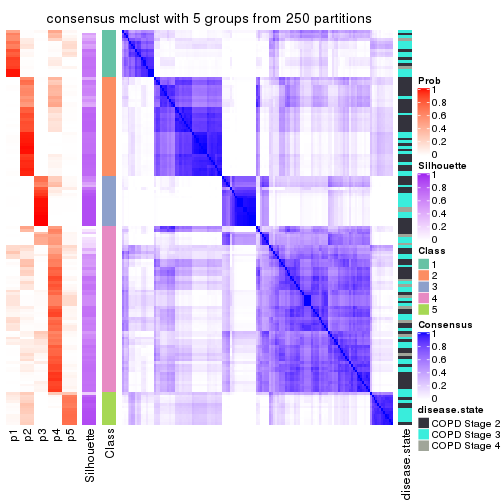</p>

</div>
<div id='tab-CV-mclust-consensus-heatmap-5'>
<pre><code class="r">consensus_heatmap(res, k = 6)
</code></pre>

<p></p>

</div>
</div>

Heatmaps for the membership of samples in all partitions to see how consistent they are:


<script>
$( function() {
	$( '#tabs-CV-mclust-membership-heatmap' ).tabs();
} );
</script>
<div id='tabs-CV-mclust-membership-heatmap'>
<ul>
<li><a href='#tab-CV-mclust-membership-heatmap-1'>k = 2</a></li>
<li><a href='#tab-CV-mclust-membership-heatmap-2'>k = 3</a></li>
<li><a href='#tab-CV-mclust-membership-heatmap-3'>k = 4</a></li>
<li><a href='#tab-CV-mclust-membership-heatmap-4'>k = 5</a></li>
<li><a href='#tab-CV-mclust-membership-heatmap-5'>k = 6</a></li>
</ul>
<div id='tab-CV-mclust-membership-heatmap-1'>
<pre><code class="r">membership_heatmap(res, k = 2)
</code></pre>

<p></p>

</div>
<div id='tab-CV-mclust-membership-heatmap-2'>
<pre><code class="r">membership_heatmap(res, k = 3)
</code></pre>

<p></p>

</div>
<div id='tab-CV-mclust-membership-heatmap-3'>
<pre><code class="r">membership_heatmap(res, k = 4)
</code></pre>

<p></p>

</div>
<div id='tab-CV-mclust-membership-heatmap-4'>
<pre><code class="r">membership_heatmap(res, k = 5)
</code></pre>

<p></p>

</div>
<div id='tab-CV-mclust-membership-heatmap-5'>
<pre><code class="r">membership_heatmap(res, k = 6)
</code></pre>

<p></p>

</div>
</div>

As soon as we have had the classes for columns, we can look for signatures
which are significantly different between classes which can be candidate marks
for certain classes. Following are the heatmaps for signatures.


Signature heatmaps where rows are scaled:


<script>
$( function() {
	$( '#tabs-CV-mclust-get-signatures' ).tabs();
} );
</script>
<div id='tabs-CV-mclust-get-signatures'>
<ul>
<li><a href='#tab-CV-mclust-get-signatures-1'>k = 2</a></li>
<li><a href='#tab-CV-mclust-get-signatures-2'>k = 3</a></li>
<li><a href='#tab-CV-mclust-get-signatures-3'>k = 4</a></li>
<li><a href='#tab-CV-mclust-get-signatures-4'>k = 5</a></li>
<li><a href='#tab-CV-mclust-get-signatures-5'>k = 6</a></li>
</ul>
<div id='tab-CV-mclust-get-signatures-1'>
<pre><code class="r">get_signatures(res, k = 2)
</code></pre>

<p></p>

</div>
<div id='tab-CV-mclust-get-signatures-2'>
<pre><code class="r">get_signatures(res, k = 3)
</code></pre>

<p></p>

</div>
<div id='tab-CV-mclust-get-signatures-3'>
<pre><code class="r">get_signatures(res, k = 4)
</code></pre>

<p></p>

</div>
<div id='tab-CV-mclust-get-signatures-4'>
<pre><code class="r">get_signatures(res, k = 5)
</code></pre>

<p></p>

</div>
<div id='tab-CV-mclust-get-signatures-5'>
<pre><code class="r">get_signatures(res, k = 6)
</code></pre>

<p></p>

</div>
</div>


Signature heatmaps where rows are not scaled:


<script>
$( function() {
	$( '#tabs-CV-mclust-get-signatures-no-scale' ).tabs();
} );
</script>
<div id='tabs-CV-mclust-get-signatures-no-scale'>
<ul>
<li><a href='#tab-CV-mclust-get-signatures-no-scale-1'>k = 2</a></li>
<li><a href='#tab-CV-mclust-get-signatures-no-scale-2'>k = 3</a></li>
<li><a href='#tab-CV-mclust-get-signatures-no-scale-3'>k = 4</a></li>
<li><a href='#tab-CV-mclust-get-signatures-no-scale-4'>k = 5</a></li>
<li><a href='#tab-CV-mclust-get-signatures-no-scale-5'>k = 6</a></li>
</ul>
<div id='tab-CV-mclust-get-signatures-no-scale-1'>
<pre><code class="r">get_signatures(res, k = 2, scale_rows = FALSE)
</code></pre>

<p></p>

</div>
<div id='tab-CV-mclust-get-signatures-no-scale-2'>
<pre><code class="r">get_signatures(res, k = 3, scale_rows = FALSE)
</code></pre>

<p></p>

</div>
<div id='tab-CV-mclust-get-signatures-no-scale-3'>
<pre><code class="r">get_signatures(res, k = 4, scale_rows = FALSE)
</code></pre>

<p></p>

</div>
<div id='tab-CV-mclust-get-signatures-no-scale-4'>
<pre><code class="r">get_signatures(res, k = 5, scale_rows = FALSE)
</code></pre>

<p>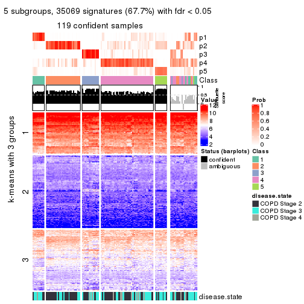</p>

</div>
<div id='tab-CV-mclust-get-signatures-no-scale-5'>
<pre><code class="r">get_signatures(res, k = 6, scale_rows = FALSE)
</code></pre>

<p></p>

</div>
</div>


Compare the overlap of signatures from different k:

```r
compare_signatures(res)
```


`get_signature()` returns a data frame invisibly. TO get the list of signatures, the function
call should be assigned to a variable explicitly. In following code, if `plot` argument is set
to `FALSE`, no heatmap is plotted while only the differential analysis is performed.

```r
# code only for demonstration
tb = get_signature(res, k = ..., plot = FALSE)
```

An example of the output of `tb` is:

```
#>   which_row         fdr    mean_1    mean_2 scaled_mean_1 scaled_mean_2 km
#> 1        38 0.042760348  8.373488  9.131774    -0.5533452     0.5164555  1
#> 2        40 0.018707592  7.106213  8.469186    -0.6173731     0.5762149  1
#> 3        55 0.019134737 10.221463 11.207825    -0.6159697     0.5749050  1
#> 4        59 0.006059896  5.921854  7.869574    -0.6899429     0.6439467  1
#> 5        60 0.018055526  8.928898 10.211722    -0.6204761     0.5791110  1
#> 6        98 0.009384629 15.714769 14.887706     0.6635654    -0.6193277  2
...
```

The columns in `tb` are:

1. `which_row`: row indices corresponding to the input matrix.
2. `fdr`: FDR for the differential test. 
3. `mean_x`: The mean value in group x.
4. `scaled_mean_x`: The mean value in group x after rows are scaled.
5. `km`: Row groups if k-means clustering is applied to rows.


UMAP plot which shows how samples are separated.


<script>
$( function() {
	$( '#tabs-CV-mclust-dimension-reduction' ).tabs();
} );
</script>
<div id='tabs-CV-mclust-dimension-reduction'>
<ul>
<li><a href='#tab-CV-mclust-dimension-reduction-1'>k = 2</a></li>
<li><a href='#tab-CV-mclust-dimension-reduction-2'>k = 3</a></li>
<li><a href='#tab-CV-mclust-dimension-reduction-3'>k = 4</a></li>
<li><a href='#tab-CV-mclust-dimension-reduction-4'>k = 5</a></li>
<li><a href='#tab-CV-mclust-dimension-reduction-5'>k = 6</a></li>
</ul>
<div id='tab-CV-mclust-dimension-reduction-1'>
<pre><code class="r">dimension_reduction(res, k = 2, method = &quot;UMAP&quot;)
</code></pre>

<p></p>

</div>
<div id='tab-CV-mclust-dimension-reduction-2'>
<pre><code class="r">dimension_reduction(res, k = 3, method = &quot;UMAP&quot;)
</code></pre>

<p></p>

</div>
<div id='tab-CV-mclust-dimension-reduction-3'>
<pre><code class="r">dimension_reduction(res, k = 4, method = &quot;UMAP&quot;)
</code></pre>

<p></p>

</div>
<div id='tab-CV-mclust-dimension-reduction-4'>
<pre><code class="r">dimension_reduction(res, k = 5, method = &quot;UMAP&quot;)
</code></pre>

<p></p>

</div>
<div id='tab-CV-mclust-dimension-reduction-5'>
<pre><code class="r">dimension_reduction(res, k = 6, method = &quot;UMAP&quot;)
</code></pre>

<p></p>

</div>
</div>


Following heatmap shows how subgroups are split when increasing `k`:

```r
collect_classes(res)
```


Test correlation between subgroups and known annotations. If the known
annotation is numeric, one-way ANOVA test is applied, and if the known
annotation is discrete, chi-squared contingency table test is applied.

```r
test_to_known_factors(res)
```

```
#>             n disease.state(p) k
#> CV:mclust 139         0.026000 2
#> CV:mclust  90         0.018854 3
#> CV:mclust 111         0.133308 4
#> CV:mclust 119         0.061234 5
#> CV:mclust  84         0.000743 6
```


If matrix rows can be associated to genes, consider to use `GO_Enrichment(res,
...)` to perform function enrichment for the signature genes.


 

---------------------------------------------------


### CV:NMF*


The object with results only for a single top-value method and a single partition method 
can be extracted as:

```r
res = res_list["CV", "NMF"]
# you can also extract it by
# res = res_list["CV:NMF"]
```

A summary of `res` and all the functions that can be applied to it:

```r
res
```

```
#> A 'ConsensusPartition' object with k = 2, 3, 4, 5, 6.
#>   On a matrix with 51776 rows and 143 columns.
#>   Top rows (1000, 2000, 3000, 4000, 5000) are extracted by 'CV' method.
#>   Subgroups are detected by 'NMF' method.
#>   Performed in total 1250 partitions by row resampling.
#>   Best k for subgroups seems to be 3.
#> 
#> Following methods can be applied to this 'ConsensusPartition' object:
#>  [1] "cola_report"             "collect_classes"         "collect_plots"          
#>  [4] "collect_stats"           "colnames"                "compare_signatures"     
#>  [7] "consensus_heatmap"       "dimension_reduction"     "functional_enrichment"  
#> [10] "get_anno_col"            "get_anno"                "get_classes"            
#> [13] "get_consensus"           "get_matrix"              "get_membership"         
#> [16] "get_param"               "get_signatures"          "get_stats"              
#> [19] "is_best_k"               "is_stable_k"             "membership_heatmap"     
#> [22] "ncol"                    "nrow"                    "plot_ecdf"              
#> [25] "rownames"                "select_partition_number" "show"                   
#> [28] "suggest_best_k"          "test_to_known_factors"
```

`collect_plots()` function collects all the plots made from `res` for all `k` (number of partitions)
into one single page to provide an easy and fast comparison between different `k`.

```r
collect_plots(res)
```

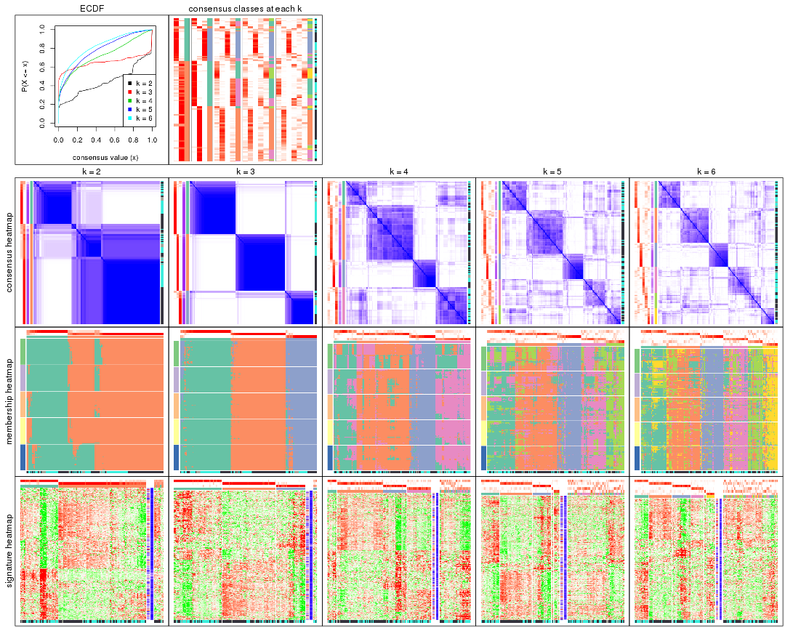

The plots are:

- The first row: a plot of the ECDF (Empirical cumulative distribution
  function) curves of the consensus matrix for each `k` and the heatmap of
  predicted classes for each `k`.
- The second row: heatmaps of the consensus matrix for each `k`.
- The third row: heatmaps of the membership matrix for each `k`.
- The fouth row: heatmaps of the signatures for each `k`.

All the plots in panels can be made by individual functions and they are
plotted later in this section.

`select_partition_number()` produces several plots showing different
statistics for choosing "optimized" `k`. There are following statistics:

- ECDF curves of the consensus matrix for each `k`;
- 1-PAC. [The PAC
  score](https://en.wikipedia.org/wiki/Consensus_clustering#Over-interpretation_potential_of_consensus_clustering)
  measures the proportion of the ambiguous subgrouping.
- Mean silhouette score.
- Concordance. The mean probability of fiting the consensus class ids in all
  partitions.
- Area increased. Denote $A_k$ as the area under the ECDF curve for current
  `k`, the area increased is defined as $A_k - A_{k-1}$.
- Rand index. The percent of pairs of samples that are both in a same cluster
  or both are not in a same cluster in the partition of k and k-1.
- Jaccard index. The ratio of pairs of samples are both in a same cluster in
  the partition of k and k-1 and the pairs of samples are both in a same
  cluster in the partition k or k-1.

The detailed explanations of these statistics can be found in [the cola
vignette](http://bioconductor.org/packages/devel/bioc/vignettes/cola/inst/doc/cola.html#toc_13).

Generally speaking, lower PAC score, higher mean silhouette score or higher
concordance corresponds to better partition. Rand index and Jaccard index
measure how similar the current partition is compared to partition with `k-1`.
If they are too similar, we won't accept `k` is better than `k-1`.

```r
select_partition_number(res)
```


The numeric values for all these statistics can be obtained by `get_stats()`.

```r
get_stats(res)
```

```
#>   k 1-PAC mean_silhouette concordance area_increased  Rand Jaccard
#> 2 2 0.591           0.825       0.922         0.4449 0.576   0.576
#> 3 3 0.911           0.910       0.961         0.4645 0.676   0.480
#> 4 4 0.517           0.624       0.795         0.1180 0.875   0.664
#> 5 5 0.513           0.501       0.702         0.0797 0.858   0.547
#> 6 6 0.602           0.494       0.707         0.0494 0.902   0.597
```

`suggest_best_k()` suggests the best $k$ based on these statistics. The rules are as follows:

- All $k$ with Jaccard index larger than 0.95 are removed because the increase of
  the partition number does not provides enough extra information. If all $k$ are removed,
  the best $k$ is assigned by `NA`.
- For $k$ with 1-PAC larger than 0.9, the maximal $k$ is taken as the "best k". Other $k$ is called "optional k".
- If it does not fit the second rule. The $k$ with the highest vote of highest
  1-PAC, mean silhouette and concordance is taken as the "best k".

```r
suggest_best_k(res)
```

```
#> [1] 3
```


Following shows the table of the partitions (You need to click the **show/hide
code output** link to see it). The membership matrix (columns with name `p*`)
is inferred by
[`clue::cl_consensus()`](https://www.rdocumentation.org/link/cl_consensus?package=clue)
function with the `SE` method. Basically the value in the membership matrix
represents the probability to belong to a certain group. The finall class
label for an item is determined with the group with highest probability it
belongs to.

In `get_classes()` function, the entropy is calculated from the membership
matrix and the silhouette score is calculated from the consensus matrix.


<script>
$( function() {
	$( '#tabs-CV-NMF-get-classes' ).tabs();
} );
</script>
<div id='tabs-CV-NMF-get-classes'>
<ul>
<li><a href='#tab-CV-NMF-get-classes-1'>k = 2</a></li>
<li><a href='#tab-CV-NMF-get-classes-2'>k = 3</a></li>
<li><a href='#tab-CV-NMF-get-classes-3'>k = 4</a></li>
<li><a href='#tab-CV-NMF-get-classes-4'>k = 5</a></li>
<li><a href='#tab-CV-NMF-get-classes-5'>k = 6</a></li>
</ul>

<div id='tab-CV-NMF-get-classes-1'>
<p><a id='tab-CV-NMF-get-classes-1-a' style='color:#0366d6' href='#'>show/hide code output</a></p>
<pre><code class="r">cbind(get_classes(res, k = 2), get_membership(res, k = 2))
</code></pre>

<pre><code>#&gt;           class entropy silhouette    p1    p2
#&gt; GSM550785     2  0.3879     0.8645 0.076 0.924
#&gt; GSM550786     1  0.0000     0.9272 1.000 0.000
#&gt; GSM550788     2  0.0000     0.9028 0.000 1.000
#&gt; GSM550789     2  0.0000     0.9028 0.000 1.000
#&gt; GSM550790     2  0.7299     0.7713 0.204 0.796
#&gt; GSM550791     2  0.7139     0.7786 0.196 0.804
#&gt; GSM550792     2  0.0000     0.9028 0.000 1.000
#&gt; GSM550796     2  0.0000     0.9028 0.000 1.000
#&gt; GSM550797     2  0.0000     0.9028 0.000 1.000
#&gt; GSM550799     1  0.0376     0.9252 0.996 0.004
#&gt; GSM550800     2  0.0000     0.9028 0.000 1.000
#&gt; GSM550801     2  0.0000     0.9028 0.000 1.000
#&gt; GSM550804     2  0.0000     0.9028 0.000 1.000
#&gt; GSM550806     1  0.0000     0.9272 1.000 0.000
#&gt; GSM550807     2  0.0000     0.9028 0.000 1.000
#&gt; GSM550808     2  0.9795     0.2085 0.416 0.584
#&gt; GSM550809     2  0.8267     0.7062 0.260 0.740
#&gt; GSM550810     2  0.0000     0.9028 0.000 1.000
#&gt; GSM550811     2  0.9850     0.3796 0.428 0.572
#&gt; GSM550813     2  0.0000     0.9028 0.000 1.000
#&gt; GSM550814     2  0.0000     0.9028 0.000 1.000
#&gt; GSM550815     2  0.0000     0.9028 0.000 1.000
#&gt; GSM550816     2  0.0000     0.9028 0.000 1.000
#&gt; GSM550817     1  0.0000     0.9272 1.000 0.000
#&gt; GSM550818     1  0.0000     0.9272 1.000 0.000
#&gt; GSM550819     2  0.0376     0.9006 0.004 0.996
#&gt; GSM550820     2  0.9323     0.5663 0.348 0.652
#&gt; GSM550821     1  0.9922     0.2674 0.552 0.448
#&gt; GSM550822     2  0.0000     0.9028 0.000 1.000
#&gt; GSM550826     1  0.0000     0.9272 1.000 0.000
#&gt; GSM550832     2  0.0000     0.9028 0.000 1.000
#&gt; GSM550833     2  0.0000     0.9028 0.000 1.000
#&gt; GSM550835     1  0.6801     0.7564 0.820 0.180
#&gt; GSM550836     1  0.0000     0.9272 1.000 0.000
#&gt; GSM550837     2  0.9608     0.3088 0.384 0.616
#&gt; GSM550838     1  0.0000     0.9272 1.000 0.000
#&gt; GSM550841     1  0.1184     0.9183 0.984 0.016
#&gt; GSM550842     2  0.9944     0.0623 0.456 0.544
#&gt; GSM550846     2  0.0000     0.9028 0.000 1.000
#&gt; GSM550849     2  0.6247     0.8114 0.156 0.844
#&gt; GSM550850     2  0.7299     0.7713 0.204 0.796
#&gt; GSM550851     2  0.9815     0.1949 0.420 0.580
#&gt; GSM550852     2  0.0000     0.9028 0.000 1.000
#&gt; GSM550853     2  0.0000     0.9028 0.000 1.000
#&gt; GSM550855     2  0.0000     0.9028 0.000 1.000
#&gt; GSM550856     2  0.0000     0.9028 0.000 1.000
#&gt; GSM550861     2  0.0000     0.9028 0.000 1.000
#&gt; GSM550863     2  0.0000     0.9028 0.000 1.000
#&gt; GSM550864     2  0.0000     0.9028 0.000 1.000
#&gt; GSM550866     2  0.0000     0.9028 0.000 1.000
#&gt; GSM550867     2  0.7299     0.7713 0.204 0.796
#&gt; GSM550885     2  0.7299     0.7713 0.204 0.796
#&gt; GSM550886     1  0.5629     0.8138 0.868 0.132
#&gt; GSM550887     2  0.0000     0.9028 0.000 1.000
#&gt; GSM550889     2  0.0000     0.9028 0.000 1.000
#&gt; GSM550894     2  0.0000     0.9028 0.000 1.000
#&gt; GSM550897     2  0.5178     0.8400 0.116 0.884
#&gt; GSM550903     2  0.0000     0.9028 0.000 1.000
#&gt; GSM550905     1  0.9970     0.2039 0.532 0.468
#&gt; GSM550906     2  0.0000     0.9028 0.000 1.000
#&gt; GSM550907     1  0.0000     0.9272 1.000 0.000
#&gt; GSM550909     2  0.9954     0.0460 0.460 0.540
#&gt; GSM550911     1  0.0000     0.9272 1.000 0.000
#&gt; GSM550913     2  0.0000     0.9028 0.000 1.000
#&gt; GSM550915     2  0.0000     0.9028 0.000 1.000
#&gt; GSM550917     2  0.0000     0.9028 0.000 1.000
#&gt; GSM550919     2  0.0000     0.9028 0.000 1.000
#&gt; GSM550921     1  0.0000     0.9272 1.000 0.000
#&gt; GSM550924     1  0.6531     0.7503 0.832 0.168
#&gt; GSM550926     2  0.0000     0.9028 0.000 1.000
#&gt; GSM550927     2  0.0000     0.9028 0.000 1.000
#&gt; GSM550787     1  0.7528     0.6749 0.784 0.216
#&gt; GSM550793     1  0.0000     0.9272 1.000 0.000
#&gt; GSM550794     2  0.0000     0.9028 0.000 1.000
#&gt; GSM550795     2  0.7299     0.7713 0.204 0.796
#&gt; GSM550798     1  0.0000     0.9272 1.000 0.000
#&gt; GSM550803     2  0.9044     0.6076 0.320 0.680
#&gt; GSM550805     1  0.9954    -0.0118 0.540 0.460
#&gt; GSM550823     2  0.0000     0.9028 0.000 1.000
#&gt; GSM550824     2  0.7299     0.7713 0.204 0.796
#&gt; GSM550825     1  0.0000     0.9272 1.000 0.000
#&gt; GSM550827     2  0.0000     0.9028 0.000 1.000
#&gt; GSM550828     2  0.4562     0.8526 0.096 0.904
#&gt; GSM550829     1  0.0000     0.9272 1.000 0.000
#&gt; GSM550830     2  0.0000     0.9028 0.000 1.000
#&gt; GSM550834     2  0.6343     0.8085 0.160 0.840
#&gt; GSM550839     1  0.3584     0.8770 0.932 0.068
#&gt; GSM550840     2  0.5294     0.8374 0.120 0.880
#&gt; GSM550843     1  0.0000     0.9272 1.000 0.000
#&gt; GSM550844     2  0.7299     0.7713 0.204 0.796
#&gt; GSM550845     2  0.0000     0.9028 0.000 1.000
#&gt; GSM550848     2  0.0000     0.9028 0.000 1.000
#&gt; GSM550854     2  0.7299     0.7713 0.204 0.796
#&gt; GSM550857     1  0.0000     0.9272 1.000 0.000
#&gt; GSM550858     2  0.7219     0.7750 0.200 0.800
#&gt; GSM550859     2  0.7299     0.7713 0.204 0.796
#&gt; GSM550862     2  0.7056     0.7823 0.192 0.808
#&gt; GSM550865     2  0.0000     0.9028 0.000 1.000
#&gt; GSM550868     2  0.0000     0.9028 0.000 1.000
#&gt; GSM550869     1  0.8608     0.5424 0.716 0.284
#&gt; GSM550870     2  0.0000     0.9028 0.000 1.000
#&gt; GSM550871     1  0.2603     0.8973 0.956 0.044
#&gt; GSM550872     2  0.0000     0.9028 0.000 1.000
#&gt; GSM550873     2  0.6148     0.7706 0.152 0.848
#&gt; GSM550874     2  0.0000     0.9028 0.000 1.000
#&gt; GSM550876     1  0.0938     0.9208 0.988 0.012
#&gt; GSM550877     2  0.0000     0.9028 0.000 1.000
#&gt; GSM550878     1  0.0000     0.9272 1.000 0.000
#&gt; GSM550879     2  0.6801     0.7925 0.180 0.820
#&gt; GSM550882     1  0.0000     0.9272 1.000 0.000
#&gt; GSM550888     1  0.0000     0.9272 1.000 0.000
#&gt; GSM550890     2  0.0000     0.9028 0.000 1.000
#&gt; GSM550891     1  0.0000     0.9272 1.000 0.000
#&gt; GSM550892     2  0.1184     0.8959 0.016 0.984
#&gt; GSM550893     2  0.0000     0.9028 0.000 1.000
#&gt; GSM550895     2  0.0000     0.9028 0.000 1.000
#&gt; GSM550896     2  0.0000     0.9028 0.000 1.000
#&gt; GSM550898     2  0.7299     0.7713 0.204 0.796
#&gt; GSM550899     2  0.0000     0.9028 0.000 1.000
#&gt; GSM550900     2  0.0000     0.9028 0.000 1.000
#&gt; GSM550901     2  0.0000     0.9028 0.000 1.000
#&gt; GSM550902     1  0.0000     0.9272 1.000 0.000
#&gt; GSM550904     1  0.0672     0.9224 0.992 0.008
#&gt; GSM550908     1  0.0000     0.9272 1.000 0.000
#&gt; GSM550912     2  0.0000     0.9028 0.000 1.000
#&gt; GSM550914     2  0.0000     0.9028 0.000 1.000
#&gt; GSM550918     2  0.0000     0.9028 0.000 1.000
#&gt; GSM550922     1  0.6247     0.7865 0.844 0.156
#&gt; GSM550923     1  0.0000     0.9272 1.000 0.000
#&gt; GSM550925     2  0.0376     0.9011 0.004 0.996
#&gt; GSM550802     2  0.0000     0.9028 0.000 1.000
#&gt; GSM550812     2  0.3879     0.8494 0.076 0.924
#&gt; GSM550831     2  0.7299     0.7713 0.204 0.796
#&gt; GSM550847     2  0.7299     0.7713 0.204 0.796
#&gt; GSM550860     1  0.0000     0.9272 1.000 0.000
#&gt; GSM550875     2  0.9754     0.4315 0.408 0.592
#&gt; GSM550880     2  0.0672     0.8995 0.008 0.992
#&gt; GSM550881     1  0.0000     0.9272 1.000 0.000
#&gt; GSM550883     1  0.0000     0.9272 1.000 0.000
#&gt; GSM550884     2  0.6343     0.7606 0.160 0.840
#&gt; GSM550910     1  0.0672     0.9232 0.992 0.008
#&gt; GSM550916     2  0.7299     0.7713 0.204 0.796
#&gt; GSM550920     1  0.0000     0.9272 1.000 0.000
</code></pre>

<script>
$('#tab-CV-NMF-get-classes-1-a').parent().next().next().hide();
$('#tab-CV-NMF-get-classes-1-a').click(function(){
  $('#tab-CV-NMF-get-classes-1-a').parent().next().next().toggle();
  return(false);
});
</script>
</div>

<div id='tab-CV-NMF-get-classes-2'>
<p><a id='tab-CV-NMF-get-classes-2-a' style='color:#0366d6' href='#'>show/hide code output</a></p>
<pre><code class="r">cbind(get_classes(res, k = 3), get_membership(res, k = 3))
</code></pre>

<pre><code>#&gt;           class entropy silhouette    p1    p2    p3
#&gt; GSM550785     1  0.0000    0.94940 1.000 0.000 0.000
#&gt; GSM550786     3  0.0000    0.92489 0.000 0.000 1.000
#&gt; GSM550788     2  0.0000    0.98277 0.000 1.000 0.000
#&gt; GSM550789     2  0.0000    0.98277 0.000 1.000 0.000
#&gt; GSM550790     1  0.0000    0.94940 1.000 0.000 0.000
#&gt; GSM550791     1  0.0000    0.94940 1.000 0.000 0.000
#&gt; GSM550792     2  0.0892    0.96446 0.020 0.980 0.000
#&gt; GSM550796     2  0.0000    0.98277 0.000 1.000 0.000
#&gt; GSM550797     2  0.0000    0.98277 0.000 1.000 0.000
#&gt; GSM550799     3  0.0000    0.92489 0.000 0.000 1.000
#&gt; GSM550800     2  0.0000    0.98277 0.000 1.000 0.000
#&gt; GSM550801     2  0.0000    0.98277 0.000 1.000 0.000
#&gt; GSM550804     2  0.0000    0.98277 0.000 1.000 0.000
#&gt; GSM550806     3  0.0000    0.92489 0.000 0.000 1.000
#&gt; GSM550807     2  0.0000    0.98277 0.000 1.000 0.000
#&gt; GSM550808     2  0.0000    0.98277 0.000 1.000 0.000
#&gt; GSM550809     1  0.0000    0.94940 1.000 0.000 0.000
#&gt; GSM550810     2  0.0000    0.98277 0.000 1.000 0.000
#&gt; GSM550811     1  0.7133    0.64534 0.712 0.096 0.192
#&gt; GSM550813     2  0.0000    0.98277 0.000 1.000 0.000
#&gt; GSM550814     2  0.0000    0.98277 0.000 1.000 0.000
#&gt; GSM550815     2  0.0000    0.98277 0.000 1.000 0.000
#&gt; GSM550816     2  0.0000    0.98277 0.000 1.000 0.000
#&gt; GSM550817     3  0.0000    0.92489 0.000 0.000 1.000
#&gt; GSM550818     3  0.0000    0.92489 0.000 0.000 1.000
#&gt; GSM550819     2  0.0237    0.97961 0.000 0.996 0.004
#&gt; GSM550820     1  0.0000    0.94940 1.000 0.000 0.000
#&gt; GSM550821     2  0.1031    0.96179 0.000 0.976 0.024
#&gt; GSM550822     2  0.0000    0.98277 0.000 1.000 0.000
#&gt; GSM550826     1  0.6309   -0.00132 0.500 0.000 0.500
#&gt; GSM550832     2  0.0000    0.98277 0.000 1.000 0.000
#&gt; GSM550833     2  0.0000    0.98277 0.000 1.000 0.000
#&gt; GSM550835     3  0.5760    0.55366 0.000 0.328 0.672
#&gt; GSM550836     3  0.0000    0.92489 0.000 0.000 1.000
#&gt; GSM550837     2  0.0000    0.98277 0.000 1.000 0.000
#&gt; GSM550838     1  0.0000    0.94940 1.000 0.000 0.000
#&gt; GSM550841     3  0.0000    0.92489 0.000 0.000 1.000
#&gt; GSM550842     2  0.0000    0.98277 0.000 1.000 0.000
#&gt; GSM550846     2  0.4452    0.75535 0.192 0.808 0.000
#&gt; GSM550849     1  0.1860    0.90850 0.948 0.052 0.000
#&gt; GSM550850     1  0.0000    0.94940 1.000 0.000 0.000
#&gt; GSM550851     2  0.0000    0.98277 0.000 1.000 0.000
#&gt; GSM550852     2  0.0000    0.98277 0.000 1.000 0.000
#&gt; GSM550853     2  0.0000    0.98277 0.000 1.000 0.000
#&gt; GSM550855     2  0.0000    0.98277 0.000 1.000 0.000
#&gt; GSM550856     2  0.0000    0.98277 0.000 1.000 0.000
#&gt; GSM550861     2  0.0000    0.98277 0.000 1.000 0.000
#&gt; GSM550863     1  0.0000    0.94940 1.000 0.000 0.000
#&gt; GSM550864     2  0.0000    0.98277 0.000 1.000 0.000
#&gt; GSM550866     2  0.0237    0.97947 0.004 0.996 0.000
#&gt; GSM550867     1  0.0000    0.94940 1.000 0.000 0.000
#&gt; GSM550885     1  0.0000    0.94940 1.000 0.000 0.000
#&gt; GSM550886     3  0.4842    0.72377 0.000 0.224 0.776
#&gt; GSM550887     2  0.0000    0.98277 0.000 1.000 0.000
#&gt; GSM550889     1  0.2165    0.89719 0.936 0.064 0.000
#&gt; GSM550894     2  0.0000    0.98277 0.000 1.000 0.000
#&gt; GSM550897     1  0.0000    0.94940 1.000 0.000 0.000
#&gt; GSM550903     2  0.0000    0.98277 0.000 1.000 0.000
#&gt; GSM550905     2  0.0000    0.98277 0.000 1.000 0.000
#&gt; GSM550906     2  0.0000    0.98277 0.000 1.000 0.000
#&gt; GSM550907     3  0.0000    0.92489 0.000 0.000 1.000
#&gt; GSM550909     2  0.4002    0.79135 0.000 0.840 0.160
#&gt; GSM550911     3  0.0000    0.92489 0.000 0.000 1.000
#&gt; GSM550913     2  0.0000    0.98277 0.000 1.000 0.000
#&gt; GSM550915     1  0.0237    0.94681 0.996 0.004 0.000
#&gt; GSM550917     2  0.0000    0.98277 0.000 1.000 0.000
#&gt; GSM550919     1  0.2537    0.88069 0.920 0.080 0.000
#&gt; GSM550921     3  0.0000    0.92489 0.000 0.000 1.000
#&gt; GSM550924     3  0.5650    0.58663 0.000 0.312 0.688
#&gt; GSM550926     2  0.0000    0.98277 0.000 1.000 0.000
#&gt; GSM550927     2  0.0000    0.98277 0.000 1.000 0.000
#&gt; GSM550787     3  0.8188    0.31721 0.372 0.080 0.548
#&gt; GSM550793     3  0.0747    0.91349 0.016 0.000 0.984
#&gt; GSM550794     2  0.5465    0.59923 0.288 0.712 0.000
#&gt; GSM550795     1  0.0000    0.94940 1.000 0.000 0.000
#&gt; GSM550798     1  0.0237    0.94686 0.996 0.000 0.004
#&gt; GSM550803     1  0.0000    0.94940 1.000 0.000 0.000
#&gt; GSM550805     1  0.4994    0.76860 0.816 0.024 0.160
#&gt; GSM550823     2  0.1964    0.92642 0.056 0.944 0.000
#&gt; GSM550824     1  0.0000    0.94940 1.000 0.000 0.000
#&gt; GSM550825     3  0.2796    0.84713 0.092 0.000 0.908
#&gt; GSM550827     1  0.1031    0.93160 0.976 0.024 0.000
#&gt; GSM550828     1  0.0000    0.94940 1.000 0.000 0.000
#&gt; GSM550829     1  0.5968    0.42112 0.636 0.000 0.364
#&gt; GSM550830     1  0.5650    0.56095 0.688 0.312 0.000
#&gt; GSM550834     1  0.0000    0.94940 1.000 0.000 0.000
#&gt; GSM550839     3  0.4062    0.79372 0.000 0.164 0.836
#&gt; GSM550840     1  0.0000    0.94940 1.000 0.000 0.000
#&gt; GSM550843     3  0.0000    0.92489 0.000 0.000 1.000
#&gt; GSM550844     1  0.0000    0.94940 1.000 0.000 0.000
#&gt; GSM550845     2  0.0000    0.98277 0.000 1.000 0.000
#&gt; GSM550848     1  0.1529    0.91915 0.960 0.040 0.000
#&gt; GSM550854     1  0.0000    0.94940 1.000 0.000 0.000
#&gt; GSM550857     3  0.0000    0.92489 0.000 0.000 1.000
#&gt; GSM550858     1  0.0000    0.94940 1.000 0.000 0.000
#&gt; GSM550859     1  0.0000    0.94940 1.000 0.000 0.000
#&gt; GSM550862     1  0.0000    0.94940 1.000 0.000 0.000
#&gt; GSM550865     1  0.1031    0.93260 0.976 0.024 0.000
#&gt; GSM550868     1  0.0000    0.94940 1.000 0.000 0.000
#&gt; GSM550869     3  0.9046    0.34622 0.332 0.152 0.516
#&gt; GSM550870     2  0.0000    0.98277 0.000 1.000 0.000
#&gt; GSM550871     3  0.5254    0.66775 0.000 0.264 0.736
#&gt; GSM550872     1  0.0000    0.94940 1.000 0.000 0.000
#&gt; GSM550873     2  0.0000    0.98277 0.000 1.000 0.000
#&gt; GSM550874     2  0.0000    0.98277 0.000 1.000 0.000
#&gt; GSM550876     3  0.0000    0.92489 0.000 0.000 1.000
#&gt; GSM550877     2  0.0000    0.98277 0.000 1.000 0.000
#&gt; GSM550878     3  0.0000    0.92489 0.000 0.000 1.000
#&gt; GSM550879     1  0.0000    0.94940 1.000 0.000 0.000
#&gt; GSM550882     3  0.0000    0.92489 0.000 0.000 1.000
#&gt; GSM550888     3  0.0000    0.92489 0.000 0.000 1.000
#&gt; GSM550890     1  0.0000    0.94940 1.000 0.000 0.000
#&gt; GSM550891     3  0.0000    0.92489 0.000 0.000 1.000
#&gt; GSM550892     1  0.0000    0.94940 1.000 0.000 0.000
#&gt; GSM550893     2  0.0000    0.98277 0.000 1.000 0.000
#&gt; GSM550895     2  0.0747    0.96868 0.016 0.984 0.000
#&gt; GSM550896     2  0.0000    0.98277 0.000 1.000 0.000
#&gt; GSM550898     1  0.0000    0.94940 1.000 0.000 0.000
#&gt; GSM550899     2  0.0000    0.98277 0.000 1.000 0.000
#&gt; GSM550900     1  0.0237    0.94681 0.996 0.004 0.000
#&gt; GSM550901     1  0.0000    0.94940 1.000 0.000 0.000
#&gt; GSM550902     1  0.5678    0.53294 0.684 0.000 0.316
#&gt; GSM550904     1  0.0000    0.94940 1.000 0.000 0.000
#&gt; GSM550908     3  0.0000    0.92489 0.000 0.000 1.000
#&gt; GSM550912     2  0.0000    0.98277 0.000 1.000 0.000
#&gt; GSM550914     1  0.3619    0.80814 0.864 0.136 0.000
#&gt; GSM550918     2  0.0000    0.98277 0.000 1.000 0.000
#&gt; GSM550922     3  0.0000    0.92489 0.000 0.000 1.000
#&gt; GSM550923     1  0.0000    0.94940 1.000 0.000 0.000
#&gt; GSM550925     1  0.0000    0.94940 1.000 0.000 0.000
#&gt; GSM550802     2  0.0000    0.98277 0.000 1.000 0.000
#&gt; GSM550812     2  0.1031    0.96184 0.000 0.976 0.024
#&gt; GSM550831     1  0.0000    0.94940 1.000 0.000 0.000
#&gt; GSM550847     1  0.0000    0.94940 1.000 0.000 0.000
#&gt; GSM550860     3  0.0000    0.92489 0.000 0.000 1.000
#&gt; GSM550875     1  0.0424    0.94411 0.992 0.000 0.008
#&gt; GSM550880     1  0.0000    0.94940 1.000 0.000 0.000
#&gt; GSM550881     3  0.0000    0.92489 0.000 0.000 1.000
#&gt; GSM550883     3  0.0000    0.92489 0.000 0.000 1.000
#&gt; GSM550884     2  0.2200    0.92589 0.004 0.940 0.056
#&gt; GSM550910     3  0.0237    0.92254 0.000 0.004 0.996
#&gt; GSM550916     1  0.0000    0.94940 1.000 0.000 0.000
#&gt; GSM550920     3  0.0000    0.92489 0.000 0.000 1.000
</code></pre>

<script>
$('#tab-CV-NMF-get-classes-2-a').parent().next().next().hide();
$('#tab-CV-NMF-get-classes-2-a').click(function(){
  $('#tab-CV-NMF-get-classes-2-a').parent().next().next().toggle();
  return(false);
});
</script>
</div>

<div id='tab-CV-NMF-get-classes-3'>
<p><a id='tab-CV-NMF-get-classes-3-a' style='color:#0366d6' href='#'>show/hide code output</a></p>
<pre><code class="r">cbind(get_classes(res, k = 4), get_membership(res, k = 4))
</code></pre>

<pre><code>#&gt;           class entropy silhouette    p1    p2    p3    p4
#&gt; GSM550785     4  0.4431     0.4941 0.304 0.000 0.000 0.696
#&gt; GSM550786     3  0.4054     0.7649 0.000 0.016 0.796 0.188
#&gt; GSM550788     2  0.4770     0.6025 0.288 0.700 0.000 0.012
#&gt; GSM550789     2  0.3726     0.6823 0.212 0.788 0.000 0.000
#&gt; GSM550790     1  0.4356     0.3333 0.708 0.000 0.000 0.292
#&gt; GSM550791     1  0.4382     0.4647 0.704 0.000 0.000 0.296
#&gt; GSM550792     1  0.3668     0.5249 0.808 0.188 0.000 0.004
#&gt; GSM550796     2  0.0707     0.7933 0.020 0.980 0.000 0.000
#&gt; GSM550797     2  0.4250     0.6173 0.276 0.724 0.000 0.000
#&gt; GSM550799     3  0.4648     0.8013 0.088 0.020 0.820 0.072
#&gt; GSM550800     2  0.6546     0.6521 0.172 0.636 0.000 0.192
#&gt; GSM550801     2  0.1792     0.7846 0.068 0.932 0.000 0.000
#&gt; GSM550804     2  0.4356     0.7037 0.000 0.708 0.000 0.292
#&gt; GSM550806     3  0.1389     0.8747 0.000 0.000 0.952 0.048
#&gt; GSM550807     2  0.2647     0.7609 0.120 0.880 0.000 0.000
#&gt; GSM550808     2  0.4222     0.6157 0.272 0.728 0.000 0.000
#&gt; GSM550809     1  0.3873     0.4464 0.772 0.000 0.000 0.228
#&gt; GSM550810     2  0.1474     0.7871 0.052 0.948 0.000 0.000
#&gt; GSM550811     1  0.2081     0.5897 0.916 0.084 0.000 0.000
#&gt; GSM550813     2  0.2805     0.7782 0.100 0.888 0.000 0.012
#&gt; GSM550814     2  0.1174     0.7980 0.012 0.968 0.000 0.020
#&gt; GSM550815     2  0.3243     0.7766 0.036 0.876 0.000 0.088
#&gt; GSM550816     2  0.2888     0.7714 0.124 0.872 0.000 0.004
#&gt; GSM550817     3  0.0000     0.8859 0.000 0.000 1.000 0.000
#&gt; GSM550818     3  0.0000     0.8859 0.000 0.000 1.000 0.000
#&gt; GSM550819     2  0.4866     0.5862 0.000 0.596 0.000 0.404
#&gt; GSM550820     4  0.4454     0.6117 0.308 0.000 0.000 0.692
#&gt; GSM550821     2  0.4222     0.7175 0.000 0.728 0.000 0.272
#&gt; GSM550822     2  0.2401     0.7811 0.004 0.904 0.000 0.092
#&gt; GSM550826     4  0.3436     0.5837 0.036 0.008 0.080 0.876
#&gt; GSM550832     2  0.1042     0.7977 0.008 0.972 0.000 0.020
#&gt; GSM550833     2  0.4679     0.4922 0.352 0.648 0.000 0.000
#&gt; GSM550835     2  0.7466     0.1797 0.388 0.436 0.176 0.000
#&gt; GSM550836     3  0.2345     0.8302 0.100 0.000 0.900 0.000
#&gt; GSM550837     2  0.6943     0.4476 0.348 0.540 0.004 0.108
#&gt; GSM550838     1  0.4328     0.4947 0.748 0.000 0.008 0.244
#&gt; GSM550841     3  0.2198     0.8599 0.000 0.008 0.920 0.072
#&gt; GSM550842     2  0.0657     0.7946 0.012 0.984 0.004 0.000
#&gt; GSM550846     2  0.6928     0.2728 0.116 0.512 0.000 0.372
#&gt; GSM550849     1  0.2266     0.5911 0.912 0.084 0.000 0.004
#&gt; GSM550850     1  0.1389     0.6062 0.952 0.000 0.000 0.048
#&gt; GSM550851     2  0.4239     0.7633 0.032 0.812 0.004 0.152
#&gt; GSM550852     2  0.4008     0.7097 0.244 0.756 0.000 0.000
#&gt; GSM550853     2  0.4423     0.7560 0.040 0.792 0.000 0.168
#&gt; GSM550855     2  0.0657     0.7949 0.012 0.984 0.000 0.004
#&gt; GSM550856     2  0.2266     0.7878 0.084 0.912 0.000 0.004
#&gt; GSM550861     2  0.0376     0.7958 0.004 0.992 0.000 0.004
#&gt; GSM550863     4  0.1109     0.6324 0.028 0.004 0.000 0.968
#&gt; GSM550864     2  0.1722     0.7992 0.008 0.944 0.000 0.048
#&gt; GSM550866     2  0.1929     0.8017 0.024 0.940 0.000 0.036
#&gt; GSM550867     1  0.4925    -0.0715 0.572 0.000 0.000 0.428
#&gt; GSM550885     4  0.4713     0.4075 0.360 0.000 0.000 0.640
#&gt; GSM550886     3  0.5371     0.4152 0.000 0.364 0.616 0.020
#&gt; GSM550887     2  0.2216     0.7806 0.000 0.908 0.000 0.092
#&gt; GSM550889     4  0.5142     0.6283 0.192 0.064 0.000 0.744
#&gt; GSM550894     2  0.1211     0.7969 0.000 0.960 0.000 0.040
#&gt; GSM550897     4  0.0592     0.6317 0.016 0.000 0.000 0.984
#&gt; GSM550903     2  0.3649     0.7460 0.000 0.796 0.000 0.204
#&gt; GSM550905     2  0.3479     0.7675 0.012 0.840 0.000 0.148
#&gt; GSM550906     2  0.2469     0.7800 0.000 0.892 0.000 0.108
#&gt; GSM550907     3  0.0000     0.8859 0.000 0.000 1.000 0.000
#&gt; GSM550909     2  0.3840     0.7639 0.116 0.848 0.012 0.024
#&gt; GSM550911     3  0.0000     0.8859 0.000 0.000 1.000 0.000
#&gt; GSM550913     2  0.0592     0.7967 0.000 0.984 0.000 0.016
#&gt; GSM550915     4  0.4635     0.6232 0.124 0.080 0.000 0.796
#&gt; GSM550917     2  0.3037     0.7836 0.076 0.888 0.000 0.036
#&gt; GSM550919     4  0.5067     0.5942 0.116 0.116 0.000 0.768
#&gt; GSM550921     3  0.0000     0.8859 0.000 0.000 1.000 0.000
#&gt; GSM550924     4  0.8639     0.3033 0.112 0.228 0.140 0.520
#&gt; GSM550926     2  0.4030     0.7639 0.072 0.836 0.000 0.092
#&gt; GSM550927     2  0.2469     0.7808 0.000 0.892 0.000 0.108
#&gt; GSM550787     4  0.7416     0.3024 0.060 0.112 0.200 0.628
#&gt; GSM550793     3  0.1792     0.8518 0.068 0.000 0.932 0.000
#&gt; GSM550794     2  0.6317     0.4948 0.280 0.624 0.000 0.096
#&gt; GSM550795     1  0.0469     0.6112 0.988 0.000 0.000 0.012
#&gt; GSM550798     1  0.5143     0.1028 0.540 0.000 0.004 0.456
#&gt; GSM550803     1  0.4804     0.1076 0.616 0.000 0.000 0.384
#&gt; GSM550805     1  0.4667     0.5778 0.796 0.096 0.000 0.108
#&gt; GSM550823     2  0.7020     0.2303 0.124 0.500 0.000 0.376
#&gt; GSM550824     4  0.4907     0.4586 0.420 0.000 0.000 0.580
#&gt; GSM550825     4  0.5143     0.1200 0.004 0.000 0.456 0.540
#&gt; GSM550827     4  0.4888     0.6131 0.124 0.096 0.000 0.780
#&gt; GSM550828     4  0.4134     0.6453 0.260 0.000 0.000 0.740
#&gt; GSM550829     4  0.6613     0.4086 0.172 0.000 0.200 0.628
#&gt; GSM550830     1  0.6238     0.4768 0.652 0.236 0.000 0.112
#&gt; GSM550834     1  0.0000     0.6088 1.000 0.000 0.000 0.000
#&gt; GSM550839     1  0.7884    -0.0318 0.360 0.284 0.356 0.000
#&gt; GSM550840     1  0.1118     0.6105 0.964 0.000 0.000 0.036
#&gt; GSM550843     3  0.2149     0.8547 0.000 0.000 0.912 0.088
#&gt; GSM550844     4  0.4277     0.6340 0.280 0.000 0.000 0.720
#&gt; GSM550845     2  0.4730     0.6343 0.000 0.636 0.000 0.364
#&gt; GSM550848     4  0.4700     0.6210 0.124 0.084 0.000 0.792
#&gt; GSM550854     1  0.4985    -0.1789 0.532 0.000 0.000 0.468
#&gt; GSM550857     3  0.1389     0.8714 0.000 0.000 0.952 0.048
#&gt; GSM550858     4  0.4008     0.5621 0.244 0.000 0.000 0.756
#&gt; GSM550859     4  0.4866     0.4893 0.404 0.000 0.000 0.596
#&gt; GSM550862     4  0.3444     0.6296 0.184 0.000 0.000 0.816
#&gt; GSM550865     4  0.0657     0.6223 0.004 0.012 0.000 0.984
#&gt; GSM550868     4  0.5712     0.5397 0.308 0.048 0.000 0.644
#&gt; GSM550869     1  0.9552     0.2352 0.388 0.236 0.140 0.236
#&gt; GSM550870     2  0.3649     0.7445 0.000 0.796 0.000 0.204
#&gt; GSM550871     3  0.6575     0.2981 0.092 0.348 0.560 0.000
#&gt; GSM550872     1  0.5288     0.2309 0.520 0.008 0.000 0.472
#&gt; GSM550873     2  0.2799     0.7744 0.108 0.884 0.000 0.008
#&gt; GSM550874     2  0.4356     0.6515 0.292 0.708 0.000 0.000
#&gt; GSM550876     3  0.2973     0.8238 0.000 0.096 0.884 0.020
#&gt; GSM550877     2  0.4277     0.7102 0.000 0.720 0.000 0.280
#&gt; GSM550878     3  0.0000     0.8859 0.000 0.000 1.000 0.000
#&gt; GSM550879     4  0.2011     0.6388 0.080 0.000 0.000 0.920
#&gt; GSM550882     3  0.0000     0.8859 0.000 0.000 1.000 0.000
#&gt; GSM550888     3  0.1302     0.8733 0.000 0.000 0.956 0.044
#&gt; GSM550890     4  0.0921     0.6117 0.000 0.028 0.000 0.972
#&gt; GSM550891     3  0.0000     0.8859 0.000 0.000 1.000 0.000
#&gt; GSM550892     4  0.1637     0.6487 0.060 0.000 0.000 0.940
#&gt; GSM550893     2  0.3958     0.7624 0.052 0.836 0.000 0.112
#&gt; GSM550895     2  0.5018     0.7266 0.144 0.768 0.000 0.088
#&gt; GSM550896     2  0.3176     0.7827 0.084 0.880 0.000 0.036
#&gt; GSM550898     4  0.4776     0.5300 0.376 0.000 0.000 0.624
#&gt; GSM550899     2  0.3308     0.7823 0.036 0.872 0.000 0.092
#&gt; GSM550900     4  0.4728     0.6547 0.216 0.032 0.000 0.752
#&gt; GSM550901     4  0.3972     0.6577 0.204 0.008 0.000 0.788
#&gt; GSM550902     4  0.0844     0.6272 0.004 0.004 0.012 0.980
#&gt; GSM550904     4  0.4155     0.6516 0.240 0.004 0.000 0.756
#&gt; GSM550908     3  0.0000     0.8859 0.000 0.000 1.000 0.000
#&gt; GSM550912     2  0.4245     0.7502 0.116 0.820 0.000 0.064
#&gt; GSM550914     4  0.1302     0.5992 0.000 0.044 0.000 0.956
#&gt; GSM550918     2  0.4746     0.6313 0.000 0.632 0.000 0.368
#&gt; GSM550922     3  0.2773     0.8091 0.000 0.116 0.880 0.004
#&gt; GSM550923     4  0.4925     0.4482 0.428 0.000 0.000 0.572
#&gt; GSM550925     4  0.4595     0.6466 0.176 0.044 0.000 0.780
#&gt; GSM550802     1  0.4800     0.1894 0.656 0.340 0.000 0.004
#&gt; GSM550812     2  0.4295     0.7052 0.240 0.752 0.000 0.008
#&gt; GSM550831     1  0.0817     0.6113 0.976 0.000 0.000 0.024
#&gt; GSM550847     4  0.4898     0.4678 0.416 0.000 0.000 0.584
#&gt; GSM550860     3  0.4454     0.6520 0.000 0.000 0.692 0.308
#&gt; GSM550875     1  0.6454     0.1231 0.544 0.076 0.000 0.380
#&gt; GSM550880     1  0.3024     0.5435 0.852 0.000 0.000 0.148
#&gt; GSM550881     3  0.0188     0.8851 0.000 0.000 0.996 0.004
#&gt; GSM550883     3  0.0000     0.8859 0.000 0.000 1.000 0.000
#&gt; GSM550884     4  0.7122     0.1862 0.116 0.384 0.004 0.496
#&gt; GSM550910     3  0.6780     0.5633 0.000 0.164 0.604 0.232
#&gt; GSM550916     4  0.4193     0.6405 0.268 0.000 0.000 0.732
#&gt; GSM550920     3  0.0657     0.8818 0.000 0.012 0.984 0.004
</code></pre>

<script>
$('#tab-CV-NMF-get-classes-3-a').parent().next().next().hide();
$('#tab-CV-NMF-get-classes-3-a').click(function(){
  $('#tab-CV-NMF-get-classes-3-a').parent().next().next().toggle();
  return(false);
});
</script>
</div>

<div id='tab-CV-NMF-get-classes-4'>
<p><a id='tab-CV-NMF-get-classes-4-a' style='color:#0366d6' href='#'>show/hide code output</a></p>
<pre><code class="r">cbind(get_classes(res, k = 5), get_membership(res, k = 5))
</code></pre>

<pre><code>#&gt;           class entropy silhouette    p1    p2    p3    p4    p5
#&gt; GSM550785     1  0.5599     0.5330 0.620 0.000 0.000 0.260 0.120
#&gt; GSM550786     3  0.5990     0.4574 0.004 0.148 0.592 0.256 0.000
#&gt; GSM550788     5  0.6763    -0.2308 0.000 0.280 0.000 0.324 0.396
#&gt; GSM550789     2  0.3016     0.6809 0.000 0.848 0.000 0.020 0.132
#&gt; GSM550790     5  0.4557     0.0640 0.476 0.000 0.000 0.008 0.516
#&gt; GSM550791     5  0.6663     0.2201 0.244 0.012 0.000 0.224 0.520
#&gt; GSM550792     5  0.6079     0.4158 0.196 0.208 0.000 0.004 0.592
#&gt; GSM550796     2  0.1082     0.7063 0.000 0.964 0.000 0.028 0.008
#&gt; GSM550797     2  0.3280     0.6741 0.004 0.824 0.000 0.012 0.160
#&gt; GSM550799     3  0.5541     0.6050 0.000 0.024 0.696 0.132 0.148
#&gt; GSM550800     4  0.6452     0.3018 0.000 0.232 0.000 0.500 0.268
#&gt; GSM550801     2  0.2359     0.7030 0.000 0.904 0.000 0.036 0.060
#&gt; GSM550804     2  0.5396     0.5286 0.080 0.636 0.000 0.280 0.004
#&gt; GSM550806     3  0.1121     0.8055 0.000 0.000 0.956 0.044 0.000
#&gt; GSM550807     2  0.3875     0.6508 0.000 0.792 0.000 0.048 0.160
#&gt; GSM550808     2  0.3246     0.6619 0.000 0.808 0.000 0.008 0.184
#&gt; GSM550809     5  0.4924     0.1650 0.420 0.000 0.000 0.028 0.552
#&gt; GSM550810     2  0.2046     0.7055 0.000 0.916 0.000 0.016 0.068
#&gt; GSM550811     5  0.4943     0.5305 0.200 0.076 0.000 0.008 0.716
#&gt; GSM550813     2  0.5439     0.6352 0.136 0.716 0.000 0.112 0.036
#&gt; GSM550814     2  0.4338     0.6086 0.036 0.760 0.000 0.192 0.012
#&gt; GSM550815     2  0.3521     0.6716 0.000 0.820 0.000 0.140 0.040
#&gt; GSM550816     2  0.4437     0.6699 0.148 0.780 0.000 0.044 0.028
#&gt; GSM550817     3  0.1173     0.8085 0.004 0.020 0.964 0.012 0.000
#&gt; GSM550818     3  0.1372     0.8053 0.004 0.024 0.956 0.016 0.000
#&gt; GSM550819     4  0.5030     0.3170 0.072 0.236 0.004 0.688 0.000
#&gt; GSM550820     1  0.3072     0.6216 0.872 0.004 0.004 0.040 0.080
#&gt; GSM550821     2  0.5389     0.5578 0.056 0.656 0.012 0.272 0.004
#&gt; GSM550822     2  0.3218     0.6798 0.024 0.844 0.000 0.128 0.004
#&gt; GSM550826     1  0.6097     0.5005 0.596 0.052 0.016 0.312 0.024
#&gt; GSM550832     2  0.3076     0.7031 0.088 0.868 0.000 0.036 0.008
#&gt; GSM550833     2  0.5264     0.3494 0.000 0.556 0.000 0.052 0.392
#&gt; GSM550835     5  0.7734     0.1213 0.000 0.260 0.252 0.068 0.420
#&gt; GSM550836     3  0.3074     0.6682 0.000 0.000 0.804 0.000 0.196
#&gt; GSM550837     2  0.6507     0.2202 0.000 0.432 0.000 0.192 0.376
#&gt; GSM550838     5  0.5791     0.3542 0.196 0.000 0.000 0.188 0.616
#&gt; GSM550841     3  0.5389     0.5240 0.004 0.260 0.648 0.088 0.000
#&gt; GSM550842     2  0.0740     0.7106 0.008 0.980 0.000 0.008 0.004
#&gt; GSM550846     2  0.6422     0.2198 0.428 0.468 0.004 0.068 0.032
#&gt; GSM550849     5  0.5203     0.4678 0.264 0.072 0.000 0.004 0.660
#&gt; GSM550850     5  0.2674     0.5651 0.140 0.000 0.000 0.004 0.856
#&gt; GSM550851     2  0.3759     0.6458 0.000 0.764 0.000 0.220 0.016
#&gt; GSM550852     2  0.5798     0.6098 0.088 0.684 0.000 0.052 0.176
#&gt; GSM550853     2  0.6288     0.2327 0.000 0.472 0.000 0.372 0.156
#&gt; GSM550855     2  0.4100     0.6325 0.008 0.792 0.000 0.148 0.052
#&gt; GSM550856     2  0.5683     0.5847 0.064 0.700 0.000 0.160 0.076
#&gt; GSM550861     2  0.1743     0.7121 0.028 0.940 0.000 0.028 0.004
#&gt; GSM550863     4  0.3209     0.4281 0.180 0.000 0.000 0.812 0.008
#&gt; GSM550864     2  0.1525     0.7111 0.036 0.948 0.000 0.012 0.004
#&gt; GSM550866     4  0.6170     0.3037 0.004 0.384 0.000 0.492 0.120
#&gt; GSM550867     1  0.4551     0.2888 0.616 0.000 0.000 0.016 0.368
#&gt; GSM550885     1  0.5687     0.5273 0.628 0.000 0.000 0.208 0.164
#&gt; GSM550886     3  0.6047     0.1611 0.080 0.376 0.528 0.016 0.000
#&gt; GSM550887     2  0.3171     0.6735 0.000 0.816 0.000 0.176 0.008
#&gt; GSM550889     4  0.5816     0.5005 0.160 0.012 0.000 0.648 0.180
#&gt; GSM550894     2  0.3120     0.7015 0.084 0.864 0.000 0.048 0.004
#&gt; GSM550897     4  0.3280     0.4515 0.184 0.004 0.000 0.808 0.004
#&gt; GSM550903     2  0.4178     0.6181 0.028 0.748 0.000 0.220 0.004
#&gt; GSM550905     2  0.5003     0.5992 0.036 0.700 0.012 0.244 0.008
#&gt; GSM550906     2  0.3750     0.6463 0.000 0.756 0.000 0.232 0.012
#&gt; GSM550907     3  0.0324     0.8140 0.004 0.000 0.992 0.004 0.000
#&gt; GSM550909     2  0.5524     0.6189 0.200 0.704 0.016 0.052 0.028
#&gt; GSM550911     3  0.0290     0.8139 0.000 0.000 0.992 0.008 0.000
#&gt; GSM550913     2  0.1757     0.7098 0.048 0.936 0.000 0.012 0.004
#&gt; GSM550915     1  0.4697     0.5256 0.764 0.152 0.000 0.052 0.032
#&gt; GSM550917     2  0.4141     0.6736 0.152 0.788 0.000 0.052 0.008
#&gt; GSM550919     1  0.4271     0.5222 0.768 0.180 0.000 0.044 0.008
#&gt; GSM550921     3  0.0000     0.8132 0.000 0.000 1.000 0.000 0.000
#&gt; GSM550924     1  0.6348     0.2688 0.580 0.304 0.064 0.048 0.004
#&gt; GSM550926     2  0.6442     0.0525 0.156 0.460 0.000 0.380 0.004
#&gt; GSM550927     2  0.3264     0.6751 0.020 0.836 0.000 0.140 0.004
#&gt; GSM550787     4  0.7816     0.0163 0.188 0.048 0.336 0.412 0.016
#&gt; GSM550793     3  0.1911     0.7882 0.028 0.000 0.932 0.004 0.036
#&gt; GSM550794     2  0.7417     0.3214 0.248 0.476 0.000 0.056 0.220
#&gt; GSM550795     5  0.1124     0.5672 0.036 0.000 0.000 0.004 0.960
#&gt; GSM550798     5  0.6361    -0.1128 0.424 0.000 0.004 0.140 0.432
#&gt; GSM550803     1  0.4815     0.0633 0.524 0.000 0.000 0.020 0.456
#&gt; GSM550805     5  0.6766     0.3566 0.188 0.068 0.004 0.132 0.608
#&gt; GSM550823     4  0.6475     0.4993 0.192 0.096 0.000 0.628 0.084
#&gt; GSM550824     1  0.3531     0.6025 0.816 0.000 0.000 0.036 0.148
#&gt; GSM550825     3  0.5949     0.3906 0.172 0.000 0.588 0.240 0.000
#&gt; GSM550827     1  0.4985     0.4857 0.744 0.124 0.000 0.112 0.020
#&gt; GSM550828     1  0.1582     0.6390 0.944 0.000 0.000 0.028 0.028
#&gt; GSM550829     1  0.5538     0.5738 0.688 0.000 0.024 0.188 0.100
#&gt; GSM550830     4  0.6539     0.2707 0.080 0.040 0.000 0.460 0.420
#&gt; GSM550834     5  0.1410     0.5803 0.060 0.000 0.000 0.000 0.940
#&gt; GSM550839     5  0.7660    -0.0771 0.000 0.052 0.344 0.244 0.360
#&gt; GSM550840     5  0.2291     0.5358 0.036 0.000 0.000 0.056 0.908
#&gt; GSM550843     3  0.1732     0.7846 0.000 0.000 0.920 0.080 0.000
#&gt; GSM550844     1  0.3827     0.6006 0.816 0.004 0.000 0.112 0.068
#&gt; GSM550845     4  0.3639     0.5145 0.044 0.144 0.000 0.812 0.000
#&gt; GSM550848     1  0.4513     0.4999 0.744 0.200 0.000 0.048 0.008
#&gt; GSM550854     1  0.4747     0.3300 0.620 0.000 0.000 0.028 0.352
#&gt; GSM550857     3  0.2208     0.7715 0.020 0.000 0.908 0.072 0.000
#&gt; GSM550858     1  0.5158     0.5541 0.656 0.000 0.000 0.264 0.080
#&gt; GSM550859     1  0.3452     0.6020 0.820 0.000 0.000 0.032 0.148
#&gt; GSM550862     4  0.5237    -0.2224 0.468 0.000 0.000 0.488 0.044
#&gt; GSM550865     4  0.2722     0.4956 0.120 0.004 0.000 0.868 0.008
#&gt; GSM550868     4  0.6604     0.4432 0.276 0.036 0.000 0.560 0.128
#&gt; GSM550869     4  0.7599     0.4162 0.144 0.028 0.064 0.540 0.224
#&gt; GSM550870     2  0.4341     0.5324 0.000 0.628 0.000 0.364 0.008
#&gt; GSM550871     4  0.7839     0.4154 0.048 0.096 0.228 0.536 0.092
#&gt; GSM550872     4  0.4977     0.4179 0.052 0.008 0.000 0.684 0.256
#&gt; GSM550873     2  0.4643     0.6695 0.144 0.768 0.000 0.064 0.024
#&gt; GSM550874     4  0.6901     0.2227 0.004 0.268 0.000 0.364 0.364
#&gt; GSM550876     3  0.5184     0.0692 0.004 0.032 0.508 0.456 0.000
#&gt; GSM550877     4  0.3519     0.4435 0.008 0.216 0.000 0.776 0.000
#&gt; GSM550878     3  0.0162     0.8128 0.000 0.000 0.996 0.004 0.000
#&gt; GSM550879     1  0.4284     0.5887 0.736 0.000 0.000 0.224 0.040
#&gt; GSM550882     3  0.3395     0.5943 0.000 0.000 0.764 0.236 0.000
#&gt; GSM550888     3  0.0290     0.8139 0.000 0.000 0.992 0.008 0.000
#&gt; GSM550890     1  0.5640     0.4671 0.592 0.104 0.000 0.304 0.000
#&gt; GSM550891     3  0.0000     0.8132 0.000 0.000 1.000 0.000 0.000
#&gt; GSM550892     4  0.4109     0.3481 0.288 0.000 0.000 0.700 0.012
#&gt; GSM550893     4  0.6038     0.3662 0.120 0.328 0.000 0.548 0.004
#&gt; GSM550895     4  0.6941     0.4836 0.144 0.140 0.000 0.596 0.120
#&gt; GSM550896     4  0.6618     0.3103 0.112 0.344 0.000 0.512 0.032
#&gt; GSM550898     1  0.3339     0.6107 0.836 0.000 0.000 0.040 0.124
#&gt; GSM550899     2  0.3648     0.6770 0.156 0.812 0.000 0.024 0.008
#&gt; GSM550900     4  0.5878     0.4841 0.244 0.012 0.000 0.624 0.120
#&gt; GSM550901     1  0.2703     0.6156 0.896 0.060 0.000 0.024 0.020
#&gt; GSM550902     1  0.4791     0.4566 0.616 0.008 0.016 0.360 0.000
#&gt; GSM550904     1  0.1818     0.6333 0.932 0.000 0.000 0.044 0.024
#&gt; GSM550908     3  0.0162     0.8141 0.000 0.000 0.996 0.004 0.000
#&gt; GSM550912     2  0.4610     0.6496 0.176 0.752 0.000 0.060 0.012
#&gt; GSM550914     1  0.6366     0.2360 0.440 0.164 0.000 0.396 0.000
#&gt; GSM550918     2  0.5828     0.4944 0.128 0.608 0.000 0.260 0.004
#&gt; GSM550922     2  0.5144     0.1216 0.024 0.520 0.448 0.008 0.000
#&gt; GSM550923     1  0.3284     0.5972 0.828 0.000 0.000 0.024 0.148
#&gt; GSM550925     1  0.4660     0.5148 0.752 0.044 0.000 0.180 0.024
#&gt; GSM550802     5  0.4059     0.3871 0.008 0.072 0.000 0.116 0.804
#&gt; GSM550812     2  0.7595     0.3616 0.160 0.472 0.000 0.092 0.276
#&gt; GSM550831     5  0.2020     0.5795 0.100 0.000 0.000 0.000 0.900
#&gt; GSM550847     1  0.3970     0.5890 0.788 0.000 0.000 0.056 0.156
#&gt; GSM550860     4  0.3496     0.4933 0.040 0.000 0.124 0.832 0.004
#&gt; GSM550875     4  0.7231     0.2873 0.196 0.028 0.004 0.456 0.316
#&gt; GSM550880     5  0.4423     0.4311 0.296 0.012 0.000 0.008 0.684
#&gt; GSM550881     3  0.0324     0.8137 0.004 0.000 0.992 0.004 0.000
#&gt; GSM550883     3  0.0162     0.8128 0.000 0.000 0.996 0.004 0.000
#&gt; GSM550884     4  0.6902     0.2993 0.404 0.136 0.000 0.428 0.032
#&gt; GSM550910     3  0.7835     0.1077 0.056 0.300 0.384 0.256 0.004
#&gt; GSM550916     1  0.3692     0.6010 0.812 0.000 0.000 0.136 0.052
#&gt; GSM550920     3  0.1200     0.8051 0.008 0.016 0.964 0.012 0.000
</code></pre>

<script>
$('#tab-CV-NMF-get-classes-4-a').parent().next().next().hide();
$('#tab-CV-NMF-get-classes-4-a').click(function(){
  $('#tab-CV-NMF-get-classes-4-a').parent().next().next().toggle();
  return(false);
});
</script>
</div>

<div id='tab-CV-NMF-get-classes-5'>
<p><a id='tab-CV-NMF-get-classes-5-a' style='color:#0366d6' href='#'>show/hide code output</a></p>
<pre><code class="r">cbind(get_classes(res, k = 6), get_membership(res, k = 6))
</code></pre>

<pre><code>#&gt;           class entropy silhouette    p1    p2    p3    p4    p5    p6
#&gt; GSM550785     1  0.4674     0.5486 0.684 0.000 0.000 0.008 0.228 0.080
#&gt; GSM550786     3  0.6010     0.2686 0.004 0.108 0.544 0.016 0.316 0.012
#&gt; GSM550788     4  0.6222     0.2244 0.000 0.268 0.000 0.476 0.016 0.240
#&gt; GSM550789     2  0.2313     0.6689 0.000 0.884 0.000 0.004 0.012 0.100
#&gt; GSM550790     1  0.3620     0.4533 0.648 0.000 0.000 0.000 0.000 0.352
#&gt; GSM550791     6  0.5948    -0.0979 0.392 0.004 0.000 0.008 0.144 0.452
#&gt; GSM550792     6  0.6549     0.2200 0.172 0.372 0.004 0.008 0.020 0.424
#&gt; GSM550796     2  0.1390     0.6726 0.000 0.948 0.000 0.032 0.016 0.004
#&gt; GSM550797     2  0.2489     0.6617 0.000 0.860 0.000 0.000 0.012 0.128
#&gt; GSM550799     3  0.4280     0.7106 0.000 0.032 0.792 0.020 0.096 0.060
#&gt; GSM550800     4  0.6756     0.4022 0.000 0.152 0.000 0.524 0.188 0.136
#&gt; GSM550801     2  0.1462     0.6763 0.000 0.936 0.000 0.008 0.000 0.056
#&gt; GSM550804     5  0.4362     0.1221 0.020 0.392 0.000 0.004 0.584 0.000
#&gt; GSM550806     3  0.0993     0.8131 0.000 0.000 0.964 0.012 0.024 0.000
#&gt; GSM550807     2  0.2972     0.6641 0.000 0.852 0.000 0.024 0.016 0.108
#&gt; GSM550808     2  0.4002     0.5614 0.000 0.704 0.000 0.000 0.036 0.260
#&gt; GSM550809     6  0.5571     0.4104 0.140 0.004 0.000 0.004 0.284 0.568
#&gt; GSM550810     2  0.2340     0.6756 0.000 0.896 0.000 0.004 0.044 0.056
#&gt; GSM550811     6  0.3641     0.6523 0.048 0.048 0.008 0.004 0.052 0.840
#&gt; GSM550813     2  0.5506     0.5816 0.116 0.708 0.000 0.080 0.056 0.040
#&gt; GSM550814     2  0.5741     0.4835 0.060 0.624 0.000 0.252 0.040 0.024
#&gt; GSM550815     2  0.4438     0.5793 0.000 0.720 0.000 0.020 0.208 0.052
#&gt; GSM550816     2  0.5617     0.1641 0.032 0.500 0.000 0.008 0.412 0.048
#&gt; GSM550817     3  0.2196     0.7835 0.000 0.004 0.884 0.004 0.108 0.000
#&gt; GSM550818     3  0.1843     0.7994 0.000 0.004 0.912 0.004 0.080 0.000
#&gt; GSM550819     5  0.4341     0.2316 0.016 0.024 0.000 0.284 0.676 0.000
#&gt; GSM550820     1  0.5386     0.4902 0.600 0.012 0.000 0.004 0.288 0.096
#&gt; GSM550821     5  0.3968     0.3241 0.008 0.280 0.004 0.004 0.700 0.004
#&gt; GSM550822     2  0.4377     0.2277 0.000 0.540 0.000 0.024 0.436 0.000
#&gt; GSM550826     5  0.4141     0.3794 0.228 0.004 0.016 0.004 0.732 0.016
#&gt; GSM550832     2  0.3525     0.6406 0.076 0.836 0.000 0.032 0.052 0.004
#&gt; GSM550833     2  0.5117     0.1731 0.000 0.508 0.000 0.032 0.028 0.432
#&gt; GSM550835     6  0.6823     0.2074 0.000 0.288 0.212 0.032 0.016 0.452
#&gt; GSM550836     3  0.3409     0.5559 0.000 0.000 0.700 0.000 0.000 0.300
#&gt; GSM550837     2  0.6410     0.1441 0.000 0.448 0.004 0.036 0.144 0.368
#&gt; GSM550838     6  0.4867     0.5098 0.080 0.004 0.004 0.004 0.232 0.676
#&gt; GSM550841     5  0.5877     0.1134 0.000 0.172 0.380 0.004 0.444 0.000
#&gt; GSM550842     2  0.3421     0.6302 0.004 0.804 0.004 0.028 0.160 0.000
#&gt; GSM550846     5  0.6458     0.3626 0.172 0.132 0.000 0.040 0.604 0.052
#&gt; GSM550849     6  0.3708     0.5699 0.172 0.032 0.000 0.008 0.004 0.784
#&gt; GSM550850     6  0.1958     0.6342 0.100 0.000 0.000 0.000 0.004 0.896
#&gt; GSM550851     2  0.3616     0.6092 0.000 0.780 0.000 0.024 0.184 0.012
#&gt; GSM550852     2  0.4829     0.6169 0.020 0.744 0.000 0.064 0.036 0.136
#&gt; GSM550853     2  0.7092     0.2293 0.000 0.416 0.000 0.216 0.276 0.092
#&gt; GSM550855     2  0.5165     0.5621 0.040 0.676 0.000 0.228 0.040 0.016
#&gt; GSM550856     2  0.5821     0.5030 0.060 0.620 0.000 0.248 0.020 0.052
#&gt; GSM550861     2  0.1312     0.6744 0.012 0.956 0.000 0.008 0.020 0.004
#&gt; GSM550863     5  0.4869    -0.2501 0.040 0.000 0.000 0.448 0.504 0.008
#&gt; GSM550864     2  0.2846     0.6539 0.016 0.856 0.000 0.008 0.116 0.004
#&gt; GSM550866     4  0.3086     0.6398 0.000 0.076 0.000 0.856 0.020 0.048
#&gt; GSM550867     1  0.3833     0.5513 0.708 0.000 0.000 0.004 0.016 0.272
#&gt; GSM550885     1  0.5828     0.4235 0.512 0.000 0.000 0.012 0.328 0.148
#&gt; GSM550886     3  0.6752     0.3444 0.072 0.252 0.556 0.040 0.076 0.004
#&gt; GSM550887     2  0.3694     0.5743 0.000 0.740 0.000 0.028 0.232 0.000
#&gt; GSM550889     4  0.2151     0.6466 0.048 0.000 0.000 0.912 0.016 0.024
#&gt; GSM550894     2  0.4147     0.6290 0.068 0.800 0.000 0.052 0.072 0.008
#&gt; GSM550897     4  0.4764     0.5228 0.108 0.000 0.000 0.660 0.232 0.000
#&gt; GSM550903     2  0.3627     0.5711 0.004 0.752 0.000 0.020 0.224 0.000
#&gt; GSM550905     5  0.4225    -0.1415 0.000 0.480 0.000 0.008 0.508 0.004
#&gt; GSM550906     2  0.4095     0.5715 0.000 0.724 0.000 0.060 0.216 0.000
#&gt; GSM550907     3  0.1349     0.8112 0.000 0.000 0.940 0.004 0.056 0.000
#&gt; GSM550909     5  0.7549     0.0783 0.104 0.308 0.020 0.040 0.456 0.072
#&gt; GSM550911     3  0.1858     0.7954 0.000 0.000 0.904 0.004 0.092 0.000
#&gt; GSM550913     2  0.1261     0.6737 0.008 0.956 0.000 0.004 0.028 0.004
#&gt; GSM550915     5  0.5727     0.0880 0.396 0.076 0.000 0.008 0.500 0.020
#&gt; GSM550917     2  0.4533     0.5938 0.128 0.756 0.000 0.036 0.076 0.004
#&gt; GSM550919     1  0.4963     0.4937 0.716 0.128 0.000 0.024 0.124 0.008
#&gt; GSM550921     3  0.0260     0.8151 0.000 0.000 0.992 0.000 0.008 0.000
#&gt; GSM550924     1  0.6637     0.3802 0.608 0.132 0.072 0.040 0.144 0.004
#&gt; GSM550926     4  0.7033     0.1615 0.120 0.356 0.000 0.424 0.084 0.016
#&gt; GSM550927     2  0.4544     0.2539 0.000 0.548 0.000 0.036 0.416 0.000
#&gt; GSM550787     1  0.6620     0.3117 0.532 0.064 0.028 0.028 0.316 0.032
#&gt; GSM550793     3  0.1338     0.8120 0.008 0.000 0.952 0.004 0.004 0.032
#&gt; GSM550794     1  0.7815    -0.0745 0.364 0.308 0.000 0.080 0.048 0.200
#&gt; GSM550795     6  0.1518     0.6597 0.024 0.000 0.000 0.024 0.008 0.944
#&gt; GSM550798     1  0.5632     0.3574 0.536 0.000 0.008 0.008 0.100 0.348
#&gt; GSM550803     1  0.4034     0.4329 0.624 0.000 0.000 0.004 0.008 0.364
#&gt; GSM550805     6  0.8021     0.1641 0.324 0.180 0.016 0.108 0.024 0.348
#&gt; GSM550823     4  0.2594     0.6522 0.072 0.020 0.000 0.888 0.008 0.012
#&gt; GSM550824     1  0.3072     0.6454 0.836 0.000 0.000 0.004 0.036 0.124
#&gt; GSM550825     3  0.5497     0.4647 0.204 0.000 0.628 0.024 0.144 0.000
#&gt; GSM550827     1  0.7166     0.2449 0.508 0.132 0.000 0.104 0.228 0.028
#&gt; GSM550828     1  0.2881     0.6585 0.872 0.012 0.000 0.004 0.064 0.048
#&gt; GSM550829     1  0.5245     0.5653 0.688 0.000 0.052 0.008 0.188 0.064
#&gt; GSM550830     4  0.3569     0.6061 0.020 0.020 0.000 0.812 0.008 0.140
#&gt; GSM550834     6  0.1138     0.6600 0.024 0.000 0.000 0.012 0.004 0.960
#&gt; GSM550839     3  0.7054    -0.1691 0.000 0.036 0.332 0.328 0.012 0.292
#&gt; GSM550840     6  0.2888     0.6420 0.068 0.000 0.000 0.068 0.004 0.860
#&gt; GSM550843     3  0.1327     0.8003 0.000 0.000 0.936 0.000 0.064 0.000
#&gt; GSM550844     1  0.2848     0.6254 0.880 0.024 0.000 0.064 0.016 0.016
#&gt; GSM550845     4  0.5024     0.4697 0.020 0.044 0.000 0.616 0.316 0.004
#&gt; GSM550848     1  0.5378     0.4359 0.672 0.112 0.000 0.024 0.180 0.012
#&gt; GSM550854     1  0.3970     0.5572 0.712 0.000 0.000 0.012 0.016 0.260
#&gt; GSM550857     3  0.2689     0.7654 0.036 0.000 0.876 0.004 0.080 0.004
#&gt; GSM550858     1  0.4901     0.4666 0.632 0.000 0.000 0.024 0.300 0.044
#&gt; GSM550859     1  0.2968     0.6559 0.852 0.000 0.000 0.004 0.052 0.092
#&gt; GSM550862     4  0.6302     0.2264 0.284 0.000 0.000 0.428 0.276 0.012
#&gt; GSM550865     4  0.3710     0.5220 0.012 0.000 0.000 0.696 0.292 0.000
#&gt; GSM550868     4  0.5116     0.5963 0.160 0.048 0.000 0.712 0.012 0.068
#&gt; GSM550869     4  0.4364     0.6373 0.056 0.028 0.016 0.796 0.012 0.092
#&gt; GSM550870     2  0.4787     0.4788 0.000 0.624 0.000 0.056 0.312 0.008
#&gt; GSM550871     4  0.5180     0.5344 0.024 0.048 0.248 0.664 0.004 0.012
#&gt; GSM550872     4  0.4303     0.6033 0.028 0.000 0.000 0.764 0.128 0.080
#&gt; GSM550873     2  0.4402     0.6308 0.108 0.784 0.000 0.040 0.040 0.028
#&gt; GSM550874     4  0.5422     0.4206 0.000 0.164 0.000 0.592 0.004 0.240
#&gt; GSM550876     4  0.4603     0.3419 0.012 0.008 0.364 0.604 0.004 0.008
#&gt; GSM550877     4  0.4842     0.4350 0.008 0.040 0.000 0.592 0.356 0.004
#&gt; GSM550878     3  0.0146     0.8148 0.000 0.000 0.996 0.000 0.004 0.000
#&gt; GSM550879     5  0.4642    -0.1231 0.452 0.000 0.000 0.012 0.516 0.020
#&gt; GSM550882     3  0.3426     0.5140 0.000 0.000 0.720 0.276 0.000 0.004
#&gt; GSM550888     3  0.0508     0.8160 0.000 0.000 0.984 0.004 0.012 0.000
#&gt; GSM550890     5  0.2946     0.5077 0.120 0.024 0.000 0.004 0.848 0.004
#&gt; GSM550891     3  0.0405     0.8154 0.000 0.000 0.988 0.004 0.008 0.000
#&gt; GSM550892     4  0.4736     0.4684 0.072 0.000 0.000 0.620 0.308 0.000
#&gt; GSM550893     4  0.5984     0.4979 0.128 0.224 0.000 0.600 0.040 0.008
#&gt; GSM550895     4  0.1931     0.6539 0.028 0.040 0.000 0.924 0.004 0.004
#&gt; GSM550896     4  0.5469     0.5348 0.100 0.204 0.000 0.656 0.032 0.008
#&gt; GSM550898     1  0.2114     0.6565 0.904 0.000 0.000 0.008 0.012 0.076
#&gt; GSM550899     2  0.5958     0.4156 0.124 0.600 0.000 0.032 0.232 0.012
#&gt; GSM550900     4  0.2015     0.6496 0.056 0.000 0.000 0.916 0.012 0.016
#&gt; GSM550901     1  0.2529     0.6422 0.892 0.028 0.000 0.004 0.064 0.012
#&gt; GSM550902     5  0.4364     0.4109 0.216 0.000 0.016 0.040 0.724 0.004
#&gt; GSM550904     1  0.4586     0.5100 0.704 0.016 0.000 0.020 0.236 0.024
#&gt; GSM550908     3  0.0363     0.8161 0.000 0.000 0.988 0.000 0.012 0.000
#&gt; GSM550912     2  0.5776     0.5303 0.136 0.668 0.000 0.056 0.120 0.020
#&gt; GSM550914     5  0.2743     0.5363 0.060 0.032 0.000 0.028 0.880 0.000
#&gt; GSM550918     2  0.5302     0.1975 0.068 0.520 0.000 0.008 0.400 0.004
#&gt; GSM550922     3  0.4349     0.5275 0.000 0.264 0.684 0.004 0.048 0.000
#&gt; GSM550923     1  0.2302     0.6477 0.872 0.000 0.000 0.000 0.008 0.120
#&gt; GSM550925     1  0.3387     0.5994 0.852 0.056 0.000 0.048 0.032 0.012
#&gt; GSM550802     6  0.4606     0.4884 0.004 0.056 0.000 0.204 0.020 0.716
#&gt; GSM550812     6  0.8529     0.1154 0.132 0.228 0.000 0.128 0.160 0.352
#&gt; GSM550831     6  0.1230     0.6591 0.028 0.000 0.000 0.008 0.008 0.956
#&gt; GSM550847     1  0.2425     0.6519 0.880 0.000 0.000 0.012 0.008 0.100
#&gt; GSM550860     4  0.4572     0.5832 0.024 0.000 0.076 0.728 0.172 0.000
#&gt; GSM550875     4  0.7207     0.2642 0.316 0.064 0.004 0.440 0.020 0.156
#&gt; GSM550880     6  0.4413     0.6216 0.104 0.020 0.000 0.020 0.080 0.776
#&gt; GSM550881     3  0.0653     0.8167 0.004 0.000 0.980 0.000 0.012 0.004
#&gt; GSM550883     3  0.0291     0.8154 0.000 0.000 0.992 0.000 0.004 0.004
#&gt; GSM550884     4  0.7902     0.3383 0.236 0.096 0.036 0.452 0.160 0.020
#&gt; GSM550910     5  0.4617     0.4808 0.004 0.104 0.176 0.004 0.712 0.000
#&gt; GSM550916     1  0.1952     0.6449 0.920 0.000 0.000 0.052 0.012 0.016
#&gt; GSM550920     3  0.2244     0.7798 0.008 0.072 0.904 0.004 0.008 0.004
</code></pre>

<script>
$('#tab-CV-NMF-get-classes-5-a').parent().next().next().hide();
$('#tab-CV-NMF-get-classes-5-a').click(function(){
  $('#tab-CV-NMF-get-classes-5-a').parent().next().next().toggle();
  return(false);
});
</script>
</div>
</div>

Heatmaps for the consensus matrix. It visualizes the probability of two
samples to be in a same group.


<script>
$( function() {
	$( '#tabs-CV-NMF-consensus-heatmap' ).tabs();
} );
</script>
<div id='tabs-CV-NMF-consensus-heatmap'>
<ul>
<li><a href='#tab-CV-NMF-consensus-heatmap-1'>k = 2</a></li>
<li><a href='#tab-CV-NMF-consensus-heatmap-2'>k = 3</a></li>
<li><a href='#tab-CV-NMF-consensus-heatmap-3'>k = 4</a></li>
<li><a href='#tab-CV-NMF-consensus-heatmap-4'>k = 5</a></li>
<li><a href='#tab-CV-NMF-consensus-heatmap-5'>k = 6</a></li>
</ul>
<div id='tab-CV-NMF-consensus-heatmap-1'>
<pre><code class="r">consensus_heatmap(res, k = 2)
</code></pre>

<p></p>

</div>
<div id='tab-CV-NMF-consensus-heatmap-2'>
<pre><code class="r">consensus_heatmap(res, k = 3)
</code></pre>

<p></p>

</div>
<div id='tab-CV-NMF-consensus-heatmap-3'>
<pre><code class="r">consensus_heatmap(res, k = 4)
</code></pre>

<p></p>

</div>
<div id='tab-CV-NMF-consensus-heatmap-4'>
<pre><code class="r">consensus_heatmap(res, k = 5)
</code></pre>

<p></p>

</div>
<div id='tab-CV-NMF-consensus-heatmap-5'>
<pre><code class="r">consensus_heatmap(res, k = 6)
</code></pre>

<p></p>

</div>
</div>

Heatmaps for the membership of samples in all partitions to see how consistent they are:


<script>
$( function() {
	$( '#tabs-CV-NMF-membership-heatmap' ).tabs();
} );
</script>
<div id='tabs-CV-NMF-membership-heatmap'>
<ul>
<li><a href='#tab-CV-NMF-membership-heatmap-1'>k = 2</a></li>
<li><a href='#tab-CV-NMF-membership-heatmap-2'>k = 3</a></li>
<li><a href='#tab-CV-NMF-membership-heatmap-3'>k = 4</a></li>
<li><a href='#tab-CV-NMF-membership-heatmap-4'>k = 5</a></li>
<li><a href='#tab-CV-NMF-membership-heatmap-5'>k = 6</a></li>
</ul>
<div id='tab-CV-NMF-membership-heatmap-1'>
<pre><code class="r">membership_heatmap(res, k = 2)
</code></pre>

<p></p>

</div>
<div id='tab-CV-NMF-membership-heatmap-2'>
<pre><code class="r">membership_heatmap(res, k = 3)
</code></pre>

<p></p>

</div>
<div id='tab-CV-NMF-membership-heatmap-3'>
<pre><code class="r">membership_heatmap(res, k = 4)
</code></pre>

<p></p>

</div>
<div id='tab-CV-NMF-membership-heatmap-4'>
<pre><code class="r">membership_heatmap(res, k = 5)
</code></pre>

<p></p>

</div>
<div id='tab-CV-NMF-membership-heatmap-5'>
<pre><code class="r">membership_heatmap(res, k = 6)
</code></pre>

<p></p>

</div>
</div>

As soon as we have had the classes for columns, we can look for signatures
which are significantly different between classes which can be candidate marks
for certain classes. Following are the heatmaps for signatures.


Signature heatmaps where rows are scaled:


<script>
$( function() {
	$( '#tabs-CV-NMF-get-signatures' ).tabs();
} );
</script>
<div id='tabs-CV-NMF-get-signatures'>
<ul>
<li><a href='#tab-CV-NMF-get-signatures-1'>k = 2</a></li>
<li><a href='#tab-CV-NMF-get-signatures-2'>k = 3</a></li>
<li><a href='#tab-CV-NMF-get-signatures-3'>k = 4</a></li>
<li><a href='#tab-CV-NMF-get-signatures-4'>k = 5</a></li>
<li><a href='#tab-CV-NMF-get-signatures-5'>k = 6</a></li>
</ul>
<div id='tab-CV-NMF-get-signatures-1'>
<pre><code class="r">get_signatures(res, k = 2)
</code></pre>

<p></p>

</div>
<div id='tab-CV-NMF-get-signatures-2'>
<pre><code class="r">get_signatures(res, k = 3)
</code></pre>

<p></p>

</div>
<div id='tab-CV-NMF-get-signatures-3'>
<pre><code class="r">get_signatures(res, k = 4)
</code></pre>

<p></p>

</div>
<div id='tab-CV-NMF-get-signatures-4'>
<pre><code class="r">get_signatures(res, k = 5)
</code></pre>

<p></p>

</div>
<div id='tab-CV-NMF-get-signatures-5'>
<pre><code class="r">get_signatures(res, k = 6)
</code></pre>

<p></p>

</div>
</div>


Signature heatmaps where rows are not scaled:


<script>
$( function() {
	$( '#tabs-CV-NMF-get-signatures-no-scale' ).tabs();
} );
</script>
<div id='tabs-CV-NMF-get-signatures-no-scale'>
<ul>
<li><a href='#tab-CV-NMF-get-signatures-no-scale-1'>k = 2</a></li>
<li><a href='#tab-CV-NMF-get-signatures-no-scale-2'>k = 3</a></li>
<li><a href='#tab-CV-NMF-get-signatures-no-scale-3'>k = 4</a></li>
<li><a href='#tab-CV-NMF-get-signatures-no-scale-4'>k = 5</a></li>
<li><a href='#tab-CV-NMF-get-signatures-no-scale-5'>k = 6</a></li>
</ul>
<div id='tab-CV-NMF-get-signatures-no-scale-1'>
<pre><code class="r">get_signatures(res, k = 2, scale_rows = FALSE)
</code></pre>

<p></p>

</div>
<div id='tab-CV-NMF-get-signatures-no-scale-2'>
<pre><code class="r">get_signatures(res, k = 3, scale_rows = FALSE)
</code></pre>

<p></p>

</div>
<div id='tab-CV-NMF-get-signatures-no-scale-3'>
<pre><code class="r">get_signatures(res, k = 4, scale_rows = FALSE)
</code></pre>

<p></p>

</div>
<div id='tab-CV-NMF-get-signatures-no-scale-4'>
<pre><code class="r">get_signatures(res, k = 5, scale_rows = FALSE)
</code></pre>

<p></p>

</div>
<div id='tab-CV-NMF-get-signatures-no-scale-5'>
<pre><code class="r">get_signatures(res, k = 6, scale_rows = FALSE)
</code></pre>

<p></p>

</div>
</div>


Compare the overlap of signatures from different k:

```r
compare_signatures(res)
```


`get_signature()` returns a data frame invisibly. TO get the list of signatures, the function
call should be assigned to a variable explicitly. In following code, if `plot` argument is set
to `FALSE`, no heatmap is plotted while only the differential analysis is performed.

```r
# code only for demonstration
tb = get_signature(res, k = ..., plot = FALSE)
```

An example of the output of `tb` is:

```
#>   which_row         fdr    mean_1    mean_2 scaled_mean_1 scaled_mean_2 km
#> 1        38 0.042760348  8.373488  9.131774    -0.5533452     0.5164555  1
#> 2        40 0.018707592  7.106213  8.469186    -0.6173731     0.5762149  1
#> 3        55 0.019134737 10.221463 11.207825    -0.6159697     0.5749050  1
#> 4        59 0.006059896  5.921854  7.869574    -0.6899429     0.6439467  1
#> 5        60 0.018055526  8.928898 10.211722    -0.6204761     0.5791110  1
#> 6        98 0.009384629 15.714769 14.887706     0.6635654    -0.6193277  2
...
```

The columns in `tb` are:

1. `which_row`: row indices corresponding to the input matrix.
2. `fdr`: FDR for the differential test. 
3. `mean_x`: The mean value in group x.
4. `scaled_mean_x`: The mean value in group x after rows are scaled.
5. `km`: Row groups if k-means clustering is applied to rows.


UMAP plot which shows how samples are separated.


<script>
$( function() {
	$( '#tabs-CV-NMF-dimension-reduction' ).tabs();
} );
</script>
<div id='tabs-CV-NMF-dimension-reduction'>
<ul>
<li><a href='#tab-CV-NMF-dimension-reduction-1'>k = 2</a></li>
<li><a href='#tab-CV-NMF-dimension-reduction-2'>k = 3</a></li>
<li><a href='#tab-CV-NMF-dimension-reduction-3'>k = 4</a></li>
<li><a href='#tab-CV-NMF-dimension-reduction-4'>k = 5</a></li>
<li><a href='#tab-CV-NMF-dimension-reduction-5'>k = 6</a></li>
</ul>
<div id='tab-CV-NMF-dimension-reduction-1'>
<pre><code class="r">dimension_reduction(res, k = 2, method = &quot;UMAP&quot;)
</code></pre>

<p></p>

</div>
<div id='tab-CV-NMF-dimension-reduction-2'>
<pre><code class="r">dimension_reduction(res, k = 3, method = &quot;UMAP&quot;)
</code></pre>

<p></p>

</div>
<div id='tab-CV-NMF-dimension-reduction-3'>
<pre><code class="r">dimension_reduction(res, k = 4, method = &quot;UMAP&quot;)
</code></pre>

<p></p>

</div>
<div id='tab-CV-NMF-dimension-reduction-4'>
<pre><code class="r">dimension_reduction(res, k = 5, method = &quot;UMAP&quot;)
</code></pre>

<p></p>

</div>
<div id='tab-CV-NMF-dimension-reduction-5'>
<pre><code class="r">dimension_reduction(res, k = 6, method = &quot;UMAP&quot;)
</code></pre>

<p></p>

</div>
</div>


Following heatmap shows how subgroups are split when increasing `k`:

```r
collect_classes(res)
```


Test correlation between subgroups and known annotations. If the known
annotation is numeric, one-way ANOVA test is applied, and if the known
annotation is discrete, chi-squared contingency table test is applied.

```r
test_to_known_factors(res)
```

```
#>          n disease.state(p) k
#> CV:NMF 133         2.90e-01 2
#> CV:NMF 139         3.80e-04 3
#> CV:NMF 110         1.15e-04 4
#> CV:NMF  83         1.68e-03 5
#> CV:NMF  85         5.49e-05 6
```


If matrix rows can be associated to genes, consider to use `GO_Enrichment(res,
...)` to perform function enrichment for the signature genes.


 

---------------------------------------------------


### MAD:hclust


The object with results only for a single top-value method and a single partition method 
can be extracted as:

```r
res = res_list["MAD", "hclust"]
# you can also extract it by
# res = res_list["MAD:hclust"]
```

A summary of `res` and all the functions that can be applied to it:

```r
res
```

```
#> A 'ConsensusPartition' object with k = 2, 3, 4, 5, 6.
#>   On a matrix with 51776 rows and 143 columns.
#>   Top rows (1000, 2000, 3000, 4000, 5000) are extracted by 'MAD' method.
#>   Subgroups are detected by 'hclust' method.
#>   Performed in total 1250 partitions by row resampling.
#>   Best k for subgroups seems to be 2.
#> 
#> Following methods can be applied to this 'ConsensusPartition' object:
#>  [1] "cola_report"             "collect_classes"         "collect_plots"          
#>  [4] "collect_stats"           "colnames"                "compare_signatures"     
#>  [7] "consensus_heatmap"       "dimension_reduction"     "functional_enrichment"  
#> [10] "get_anno_col"            "get_anno"                "get_classes"            
#> [13] "get_consensus"           "get_matrix"              "get_membership"         
#> [16] "get_param"               "get_signatures"          "get_stats"              
#> [19] "is_best_k"               "is_stable_k"             "membership_heatmap"     
#> [22] "ncol"                    "nrow"                    "plot_ecdf"              
#> [25] "rownames"                "select_partition_number" "show"                   
#> [28] "suggest_best_k"          "test_to_known_factors"
```

`collect_plots()` function collects all the plots made from `res` for all `k` (number of partitions)
into one single page to provide an easy and fast comparison between different `k`.

```r
collect_plots(res)
```


The plots are:

- The first row: a plot of the ECDF (Empirical cumulative distribution
  function) curves of the consensus matrix for each `k` and the heatmap of
  predicted classes for each `k`.
- The second row: heatmaps of the consensus matrix for each `k`.
- The third row: heatmaps of the membership matrix for each `k`.
- The fouth row: heatmaps of the signatures for each `k`.

All the plots in panels can be made by individual functions and they are
plotted later in this section.

`select_partition_number()` produces several plots showing different
statistics for choosing "optimized" `k`. There are following statistics:

- ECDF curves of the consensus matrix for each `k`;
- 1-PAC. [The PAC
  score](https://en.wikipedia.org/wiki/Consensus_clustering#Over-interpretation_potential_of_consensus_clustering)
  measures the proportion of the ambiguous subgrouping.
- Mean silhouette score.
- Concordance. The mean probability of fiting the consensus class ids in all
  partitions.
- Area increased. Denote $A_k$ as the area under the ECDF curve for current
  `k`, the area increased is defined as $A_k - A_{k-1}$.
- Rand index. The percent of pairs of samples that are both in a same cluster
  or both are not in a same cluster in the partition of k and k-1.
- Jaccard index. The ratio of pairs of samples are both in a same cluster in
  the partition of k and k-1 and the pairs of samples are both in a same
  cluster in the partition k or k-1.

The detailed explanations of these statistics can be found in [the cola
vignette](http://bioconductor.org/packages/devel/bioc/vignettes/cola/inst/doc/cola.html#toc_13).

Generally speaking, lower PAC score, higher mean silhouette score or higher
concordance corresponds to better partition. Rand index and Jaccard index
measure how similar the current partition is compared to partition with `k-1`.
If they are too similar, we won't accept `k` is better than `k-1`.

```r
select_partition_number(res)
```


The numeric values for all these statistics can be obtained by `get_stats()`.

```r
get_stats(res)
```

```
#>   k 1-PAC mean_silhouette concordance area_increased  Rand Jaccard
#> 2 2 0.203           0.699       0.818         0.4410 0.502   0.502
#> 3 3 0.362           0.694       0.836         0.2730 0.909   0.821
#> 4 4 0.399           0.614       0.771         0.1178 0.969   0.928
#> 5 5 0.432           0.494       0.701         0.1303 0.856   0.651
#> 6 6 0.489           0.433       0.642         0.0711 0.870   0.589
```

`suggest_best_k()` suggests the best $k$ based on these statistics. The rules are as follows:

- All $k$ with Jaccard index larger than 0.95 are removed because the increase of
  the partition number does not provides enough extra information. If all $k$ are removed,
  the best $k$ is assigned by `NA`.
- For $k$ with 1-PAC larger than 0.9, the maximal $k$ is taken as the "best k". Other $k$ is called "optional k".
- If it does not fit the second rule. The $k$ with the highest vote of highest
  1-PAC, mean silhouette and concordance is taken as the "best k".

```r
suggest_best_k(res)
```

```
#> [1] 2
```


Following shows the table of the partitions (You need to click the **show/hide
code output** link to see it). The membership matrix (columns with name `p*`)
is inferred by
[`clue::cl_consensus()`](https://www.rdocumentation.org/link/cl_consensus?package=clue)
function with the `SE` method. Basically the value in the membership matrix
represents the probability to belong to a certain group. The finall class
label for an item is determined with the group with highest probability it
belongs to.

In `get_classes()` function, the entropy is calculated from the membership
matrix and the silhouette score is calculated from the consensus matrix.


<script>
$( function() {
	$( '#tabs-MAD-hclust-get-classes' ).tabs();
} );
</script>
<div id='tabs-MAD-hclust-get-classes'>
<ul>
<li><a href='#tab-MAD-hclust-get-classes-1'>k = 2</a></li>
<li><a href='#tab-MAD-hclust-get-classes-2'>k = 3</a></li>
<li><a href='#tab-MAD-hclust-get-classes-3'>k = 4</a></li>
<li><a href='#tab-MAD-hclust-get-classes-4'>k = 5</a></li>
<li><a href='#tab-MAD-hclust-get-classes-5'>k = 6</a></li>
</ul>

<div id='tab-MAD-hclust-get-classes-1'>
<p><a id='tab-MAD-hclust-get-classes-1-a' style='color:#0366d6' href='#'>show/hide code output</a></p>
<pre><code class="r">cbind(get_classes(res, k = 2), get_membership(res, k = 2))
</code></pre>

<pre><code>#&gt;           class entropy silhouette    p1    p2
#&gt; GSM550785     1  0.7950    0.78191 0.760 0.240
#&gt; GSM550786     2  0.8327    0.67383 0.264 0.736
#&gt; GSM550788     2  0.0000    0.83215 0.000 1.000
#&gt; GSM550789     2  0.0000    0.83215 0.000 1.000
#&gt; GSM550790     1  0.7950    0.78191 0.760 0.240
#&gt; GSM550791     1  0.8207    0.77480 0.744 0.256
#&gt; GSM550792     2  0.5178    0.80020 0.116 0.884
#&gt; GSM550796     2  0.0000    0.83215 0.000 1.000
#&gt; GSM550797     2  0.0000    0.83215 0.000 1.000
#&gt; GSM550799     2  0.8861    0.57859 0.304 0.696
#&gt; GSM550800     2  0.5408    0.79121 0.124 0.876
#&gt; GSM550801     2  0.0938    0.83724 0.012 0.988
#&gt; GSM550804     2  0.2423    0.83827 0.040 0.960
#&gt; GSM550806     2  0.9988    0.28132 0.480 0.520
#&gt; GSM550807     2  0.0938    0.83724 0.012 0.988
#&gt; GSM550808     2  0.0376    0.83144 0.004 0.996
#&gt; GSM550809     1  0.7602    0.78598 0.780 0.220
#&gt; GSM550810     2  0.0376    0.83144 0.004 0.996
#&gt; GSM550811     1  0.7674    0.78559 0.776 0.224
#&gt; GSM550813     2  0.1843    0.83927 0.028 0.972
#&gt; GSM550814     2  0.2948    0.83697 0.052 0.948
#&gt; GSM550815     2  0.0000    0.83215 0.000 1.000
#&gt; GSM550816     2  0.2423    0.83777 0.040 0.960
#&gt; GSM550817     1  0.9323    0.29557 0.652 0.348
#&gt; GSM550818     1  0.9323    0.29557 0.652 0.348
#&gt; GSM550819     2  0.5946    0.77853 0.144 0.856
#&gt; GSM550820     1  0.7674    0.78603 0.776 0.224
#&gt; GSM550821     2  0.3431    0.83532 0.064 0.936
#&gt; GSM550822     2  0.0000    0.83215 0.000 1.000
#&gt; GSM550826     1  0.7674    0.78594 0.776 0.224
#&gt; GSM550832     2  0.0376    0.83144 0.004 0.996
#&gt; GSM550833     2  0.0000    0.83215 0.000 1.000
#&gt; GSM550835     2  0.4690    0.78841 0.100 0.900
#&gt; GSM550836     1  0.0000    0.67749 1.000 0.000
#&gt; GSM550837     2  0.4562    0.79189 0.096 0.904
#&gt; GSM550838     1  0.7602    0.78598 0.780 0.220
#&gt; GSM550841     1  0.9988   -0.08107 0.520 0.480
#&gt; GSM550842     2  0.3274    0.79640 0.060 0.940
#&gt; GSM550846     2  0.7528    0.67269 0.216 0.784
#&gt; GSM550849     2  0.9815   -0.00986 0.420 0.580
#&gt; GSM550850     1  0.8016    0.78019 0.756 0.244
#&gt; GSM550851     2  0.4298    0.79531 0.088 0.912
#&gt; GSM550852     2  0.5178    0.80020 0.116 0.884
#&gt; GSM550853     2  0.1633    0.83891 0.024 0.976
#&gt; GSM550855     2  0.1633    0.83891 0.024 0.976
#&gt; GSM550856     2  0.2603    0.83814 0.044 0.956
#&gt; GSM550861     2  0.0938    0.83660 0.012 0.988
#&gt; GSM550863     1  0.9933    0.48909 0.548 0.452
#&gt; GSM550864     2  0.1843    0.83927 0.028 0.972
#&gt; GSM550866     2  0.2603    0.83826 0.044 0.956
#&gt; GSM550867     1  0.7219    0.78473 0.800 0.200
#&gt; GSM550885     1  0.7219    0.78473 0.800 0.200
#&gt; GSM550886     2  0.8327    0.67308 0.264 0.736
#&gt; GSM550887     2  0.0000    0.83215 0.000 1.000
#&gt; GSM550889     2  0.7950    0.62667 0.240 0.760
#&gt; GSM550894     2  0.0376    0.83144 0.004 0.996
#&gt; GSM550897     1  0.8608    0.75043 0.716 0.284
#&gt; GSM550903     2  0.1843    0.83927 0.028 0.972
#&gt; GSM550905     2  0.4022    0.80565 0.080 0.920
#&gt; GSM550906     2  0.0000    0.83215 0.000 1.000
#&gt; GSM550907     1  0.9170    0.32969 0.668 0.332
#&gt; GSM550909     2  0.3114    0.83501 0.056 0.944
#&gt; GSM550911     1  0.8813    0.39850 0.700 0.300
#&gt; GSM550913     2  0.0000    0.83215 0.000 1.000
#&gt; GSM550915     1  0.9933    0.49874 0.548 0.452
#&gt; GSM550917     2  0.2423    0.83827 0.040 0.960
#&gt; GSM550919     1  0.9795    0.58396 0.584 0.416
#&gt; GSM550921     1  0.0000    0.67749 1.000 0.000
#&gt; GSM550924     2  0.8267    0.69087 0.260 0.740
#&gt; GSM550926     2  0.1633    0.83891 0.024 0.976
#&gt; GSM550927     2  0.0000    0.83215 0.000 1.000
#&gt; GSM550787     1  0.9933    0.47519 0.548 0.452
#&gt; GSM550793     1  0.3733    0.73167 0.928 0.072
#&gt; GSM550794     2  0.5294    0.79775 0.120 0.880
#&gt; GSM550795     1  0.8016    0.77906 0.756 0.244
#&gt; GSM550798     1  0.5294    0.75756 0.880 0.120
#&gt; GSM550803     1  0.7056    0.78382 0.808 0.192
#&gt; GSM550805     1  0.9129    0.71116 0.672 0.328
#&gt; GSM550823     2  0.8081    0.61652 0.248 0.752
#&gt; GSM550824     1  0.7219    0.78473 0.800 0.200
#&gt; GSM550825     1  0.4431    0.74340 0.908 0.092
#&gt; GSM550827     2  0.8016    0.62649 0.244 0.756
#&gt; GSM550828     1  0.7950    0.77952 0.760 0.240
#&gt; GSM550829     1  0.4431    0.74340 0.908 0.092
#&gt; GSM550830     2  0.8081    0.61652 0.248 0.752
#&gt; GSM550834     1  0.7745    0.78497 0.772 0.228
#&gt; GSM550839     2  0.9358    0.57152 0.352 0.648
#&gt; GSM550840     1  0.9087    0.71455 0.676 0.324
#&gt; GSM550843     2  0.9580    0.53419 0.380 0.620
#&gt; GSM550844     1  0.9129    0.71116 0.672 0.328
#&gt; GSM550845     2  0.2423    0.83827 0.040 0.960
#&gt; GSM550848     1  0.9815    0.57620 0.580 0.420
#&gt; GSM550854     1  0.7219    0.78473 0.800 0.200
#&gt; GSM550857     1  0.0000    0.67749 1.000 0.000
#&gt; GSM550858     1  0.7883    0.78125 0.764 0.236
#&gt; GSM550859     1  0.7219    0.78473 0.800 0.200
#&gt; GSM550862     1  0.7883    0.78125 0.764 0.236
#&gt; GSM550865     1  0.9896    0.51945 0.560 0.440
#&gt; GSM550868     2  0.8327    0.57868 0.264 0.736
#&gt; GSM550869     2  0.9988    0.21977 0.480 0.520
#&gt; GSM550870     2  0.2423    0.83827 0.040 0.960
#&gt; GSM550871     2  0.9323    0.57686 0.348 0.652
#&gt; GSM550872     1  0.9922    0.49935 0.552 0.448
#&gt; GSM550873     2  0.5178    0.80020 0.116 0.884
#&gt; GSM550874     2  0.1633    0.83891 0.024 0.976
#&gt; GSM550876     2  0.9850    0.40257 0.428 0.572
#&gt; GSM550877     2  0.1633    0.83891 0.024 0.976
#&gt; GSM550878     2  0.9922    0.36822 0.448 0.552
#&gt; GSM550879     1  0.7883    0.78046 0.764 0.236
#&gt; GSM550882     1  0.5737    0.68122 0.864 0.136
#&gt; GSM550888     1  0.0000    0.67749 1.000 0.000
#&gt; GSM550890     2  0.7528    0.67269 0.216 0.784
#&gt; GSM550891     1  0.2236    0.68423 0.964 0.036
#&gt; GSM550892     1  0.9815    0.56160 0.580 0.420
#&gt; GSM550893     2  0.7815    0.64188 0.232 0.768
#&gt; GSM550895     2  0.7219    0.69728 0.200 0.800
#&gt; GSM550896     2  0.6438    0.74724 0.164 0.836
#&gt; GSM550898     1  0.7219    0.78473 0.800 0.200
#&gt; GSM550899     2  0.1843    0.83927 0.028 0.972
#&gt; GSM550900     2  0.7950    0.63245 0.240 0.760
#&gt; GSM550901     1  0.9795    0.58396 0.584 0.416
#&gt; GSM550902     1  0.3733    0.73167 0.928 0.072
#&gt; GSM550904     1  0.7745    0.78503 0.772 0.228
#&gt; GSM550908     1  0.0000    0.67749 1.000 0.000
#&gt; GSM550912     2  0.1843    0.83927 0.028 0.972
#&gt; GSM550914     2  0.7528    0.67269 0.216 0.784
#&gt; GSM550918     2  0.2423    0.83827 0.040 0.960
#&gt; GSM550922     2  0.8909    0.57432 0.308 0.692
#&gt; GSM550923     1  0.5737    0.76490 0.864 0.136
#&gt; GSM550925     1  0.9795    0.56398 0.584 0.416
#&gt; GSM550802     2  0.5629    0.78735 0.132 0.868
#&gt; GSM550812     2  0.5629    0.78735 0.132 0.868
#&gt; GSM550831     1  0.7745    0.78497 0.772 0.228
#&gt; GSM550847     1  0.7219    0.78473 0.800 0.200
#&gt; GSM550860     1  1.0000   -0.21579 0.500 0.500
#&gt; GSM550875     1  0.9129    0.71116 0.672 0.328
#&gt; GSM550880     1  0.9866    0.53847 0.568 0.432
#&gt; GSM550881     1  0.3431    0.72648 0.936 0.064
#&gt; GSM550883     1  0.3431    0.72648 0.936 0.064
#&gt; GSM550884     2  0.5737    0.78446 0.136 0.864
#&gt; GSM550910     1  0.9833    0.24735 0.576 0.424
#&gt; GSM550916     1  0.9686    0.59853 0.604 0.396
#&gt; GSM550920     2  0.8267    0.69087 0.260 0.740
</code></pre>

<script>
$('#tab-MAD-hclust-get-classes-1-a').parent().next().next().hide();
$('#tab-MAD-hclust-get-classes-1-a').click(function(){
  $('#tab-MAD-hclust-get-classes-1-a').parent().next().next().toggle();
  return(false);
});
</script>
</div>

<div id='tab-MAD-hclust-get-classes-2'>
<p><a id='tab-MAD-hclust-get-classes-2-a' style='color:#0366d6' href='#'>show/hide code output</a></p>
<pre><code class="r">cbind(get_classes(res, k = 3), get_membership(res, k = 3))
</code></pre>

<pre><code>#&gt;           class entropy silhouette    p1    p2    p3
#&gt; GSM550785     1  0.1529     0.8085 0.960 0.040 0.000
#&gt; GSM550786     2  0.7493     0.6517 0.136 0.696 0.168
#&gt; GSM550788     2  0.0000     0.8048 0.000 1.000 0.000
#&gt; GSM550789     2  0.0000     0.8048 0.000 1.000 0.000
#&gt; GSM550790     1  0.1529     0.8085 0.960 0.040 0.000
#&gt; GSM550791     1  0.4399     0.7627 0.812 0.188 0.000
#&gt; GSM550792     2  0.4589     0.7688 0.172 0.820 0.008
#&gt; GSM550796     2  0.0000     0.8048 0.000 1.000 0.000
#&gt; GSM550797     2  0.0000     0.8048 0.000 1.000 0.000
#&gt; GSM550799     2  0.5760     0.4568 0.000 0.672 0.328
#&gt; GSM550800     2  0.3412     0.7884 0.124 0.876 0.000
#&gt; GSM550801     2  0.1163     0.8132 0.028 0.972 0.000
#&gt; GSM550804     2  0.2066     0.8132 0.060 0.940 0.000
#&gt; GSM550806     2  0.8925     0.2517 0.132 0.504 0.364
#&gt; GSM550807     2  0.1163     0.8132 0.028 0.972 0.000
#&gt; GSM550808     2  0.0237     0.8046 0.000 0.996 0.004
#&gt; GSM550809     1  0.2804     0.8115 0.924 0.060 0.016
#&gt; GSM550810     2  0.0237     0.8046 0.000 0.996 0.004
#&gt; GSM550811     1  0.2902     0.8112 0.920 0.064 0.016
#&gt; GSM550813     2  0.1529     0.8147 0.040 0.960 0.000
#&gt; GSM550814     2  0.2313     0.8129 0.032 0.944 0.024
#&gt; GSM550815     2  0.0000     0.8048 0.000 1.000 0.000
#&gt; GSM550816     2  0.3112     0.8026 0.096 0.900 0.004
#&gt; GSM550817     3  0.5706     0.5450 0.000 0.320 0.680
#&gt; GSM550818     3  0.5706     0.5450 0.000 0.320 0.680
#&gt; GSM550819     2  0.6067     0.7135 0.236 0.736 0.028
#&gt; GSM550820     1  0.2902     0.8127 0.920 0.064 0.016
#&gt; GSM550821     2  0.3805     0.8007 0.092 0.884 0.024
#&gt; GSM550822     2  0.0000     0.8048 0.000 1.000 0.000
#&gt; GSM550826     1  0.3183     0.8104 0.908 0.076 0.016
#&gt; GSM550832     2  0.0237     0.8046 0.000 0.996 0.004
#&gt; GSM550833     2  0.0237     0.8037 0.000 0.996 0.004
#&gt; GSM550835     2  0.3116     0.7566 0.000 0.892 0.108
#&gt; GSM550836     3  0.1411     0.7152 0.036 0.000 0.964
#&gt; GSM550837     2  0.3038     0.7603 0.000 0.896 0.104
#&gt; GSM550838     1  0.2804     0.8115 0.924 0.060 0.016
#&gt; GSM550841     3  0.6274     0.2169 0.000 0.456 0.544
#&gt; GSM550842     2  0.2165     0.7860 0.000 0.936 0.064
#&gt; GSM550846     2  0.6026     0.4899 0.376 0.624 0.000
#&gt; GSM550849     2  0.6816     0.0434 0.472 0.516 0.012
#&gt; GSM550850     1  0.1643     0.8094 0.956 0.044 0.000
#&gt; GSM550851     2  0.2796     0.7679 0.000 0.908 0.092
#&gt; GSM550852     2  0.4589     0.7688 0.172 0.820 0.008
#&gt; GSM550853     2  0.1031     0.8127 0.024 0.976 0.000
#&gt; GSM550855     2  0.1031     0.8127 0.024 0.976 0.000
#&gt; GSM550856     2  0.1753     0.8150 0.048 0.952 0.000
#&gt; GSM550861     2  0.0592     0.8097 0.012 0.988 0.000
#&gt; GSM550863     1  0.5560     0.6255 0.700 0.300 0.000
#&gt; GSM550864     2  0.1289     0.8143 0.032 0.968 0.000
#&gt; GSM550866     2  0.1753     0.8151 0.048 0.952 0.000
#&gt; GSM550867     1  0.0000     0.7884 1.000 0.000 0.000
#&gt; GSM550885     1  0.0000     0.7884 1.000 0.000 0.000
#&gt; GSM550886     2  0.6756     0.6270 0.056 0.712 0.232
#&gt; GSM550887     2  0.0000     0.8048 0.000 1.000 0.000
#&gt; GSM550889     2  0.5138     0.6590 0.252 0.748 0.000
#&gt; GSM550894     2  0.0237     0.8046 0.000 0.996 0.004
#&gt; GSM550897     1  0.4733     0.7582 0.800 0.196 0.004
#&gt; GSM550903     2  0.1163     0.8135 0.028 0.972 0.000
#&gt; GSM550905     2  0.2625     0.7735 0.000 0.916 0.084
#&gt; GSM550906     2  0.0000     0.8048 0.000 1.000 0.000
#&gt; GSM550907     3  0.5591     0.5674 0.000 0.304 0.696
#&gt; GSM550909     2  0.4443     0.7880 0.084 0.864 0.052
#&gt; GSM550911     3  0.5254     0.6143 0.000 0.264 0.736
#&gt; GSM550913     2  0.0000     0.8048 0.000 1.000 0.000
#&gt; GSM550915     1  0.5968     0.5216 0.636 0.364 0.000
#&gt; GSM550917     2  0.1964     0.8136 0.056 0.944 0.000
#&gt; GSM550919     1  0.5760     0.6078 0.672 0.328 0.000
#&gt; GSM550921     3  0.1411     0.7152 0.036 0.000 0.964
#&gt; GSM550924     2  0.7180     0.6603 0.096 0.708 0.196
#&gt; GSM550926     2  0.1163     0.8136 0.028 0.972 0.000
#&gt; GSM550927     2  0.0000     0.8048 0.000 1.000 0.000
#&gt; GSM550787     1  0.6899     0.4764 0.612 0.364 0.024
#&gt; GSM550793     3  0.5859     0.4935 0.344 0.000 0.656
#&gt; GSM550794     2  0.4645     0.7664 0.176 0.816 0.008
#&gt; GSM550795     1  0.2945     0.8077 0.908 0.088 0.004
#&gt; GSM550798     1  0.2537     0.7421 0.920 0.000 0.080
#&gt; GSM550803     1  0.0424     0.7871 0.992 0.000 0.008
#&gt; GSM550805     1  0.5578     0.7216 0.748 0.240 0.012
#&gt; GSM550823     2  0.5882     0.5275 0.348 0.652 0.000
#&gt; GSM550824     1  0.0000     0.7884 1.000 0.000 0.000
#&gt; GSM550825     1  0.4291     0.6384 0.820 0.000 0.180
#&gt; GSM550827     2  0.5882     0.5285 0.348 0.652 0.000
#&gt; GSM550828     1  0.1753     0.8123 0.952 0.048 0.000
#&gt; GSM550829     1  0.4291     0.6384 0.820 0.000 0.180
#&gt; GSM550830     2  0.5882     0.5275 0.348 0.652 0.000
#&gt; GSM550834     1  0.1163     0.8053 0.972 0.028 0.000
#&gt; GSM550839     2  0.8079     0.5458 0.112 0.628 0.260
#&gt; GSM550840     1  0.5378     0.7262 0.756 0.236 0.008
#&gt; GSM550843     2  0.8160     0.5047 0.104 0.608 0.288
#&gt; GSM550844     1  0.5578     0.7216 0.748 0.240 0.012
#&gt; GSM550845     2  0.2066     0.8132 0.060 0.940 0.000
#&gt; GSM550848     1  0.5785     0.6001 0.668 0.332 0.000
#&gt; GSM550854     1  0.0000     0.7884 1.000 0.000 0.000
#&gt; GSM550857     3  0.1411     0.7152 0.036 0.000 0.964
#&gt; GSM550858     1  0.1529     0.8112 0.960 0.040 0.000
#&gt; GSM550859     1  0.0000     0.7884 1.000 0.000 0.000
#&gt; GSM550862     1  0.1529     0.8112 0.960 0.040 0.000
#&gt; GSM550865     1  0.5465     0.6488 0.712 0.288 0.000
#&gt; GSM550868     2  0.6192     0.3718 0.420 0.580 0.000
#&gt; GSM550869     2  0.9431     0.3240 0.220 0.500 0.280
#&gt; GSM550870     2  0.2066     0.8132 0.060 0.940 0.000
#&gt; GSM550871     2  0.8047     0.5535 0.112 0.632 0.256
#&gt; GSM550872     1  0.5529     0.6338 0.704 0.296 0.000
#&gt; GSM550873     2  0.4589     0.7688 0.172 0.820 0.008
#&gt; GSM550874     2  0.1163     0.8136 0.028 0.972 0.000
#&gt; GSM550876     2  0.8486     0.3411 0.104 0.548 0.348
#&gt; GSM550877     2  0.1031     0.8127 0.024 0.976 0.000
#&gt; GSM550878     2  0.8295     0.2665 0.084 0.532 0.384
#&gt; GSM550879     1  0.1643     0.8116 0.956 0.044 0.000
#&gt; GSM550882     3  0.7372     0.6314 0.168 0.128 0.704
#&gt; GSM550888     3  0.1411     0.7152 0.036 0.000 0.964
#&gt; GSM550890     2  0.6026     0.4899 0.376 0.624 0.000
#&gt; GSM550891     3  0.0000     0.7082 0.000 0.000 1.000
#&gt; GSM550892     1  0.5291     0.6778 0.732 0.268 0.000
#&gt; GSM550893     2  0.4974     0.6795 0.236 0.764 0.000
#&gt; GSM550895     2  0.4702     0.7137 0.212 0.788 0.000
#&gt; GSM550896     2  0.4235     0.7540 0.176 0.824 0.000
#&gt; GSM550898     1  0.0000     0.7884 1.000 0.000 0.000
#&gt; GSM550899     2  0.1163     0.8135 0.028 0.972 0.000
#&gt; GSM550900     2  0.5810     0.5496 0.336 0.664 0.000
#&gt; GSM550901     1  0.5760     0.6078 0.672 0.328 0.000
#&gt; GSM550902     3  0.5859     0.4935 0.344 0.000 0.656
#&gt; GSM550904     1  0.2998     0.8121 0.916 0.068 0.016
#&gt; GSM550908     3  0.1411     0.7152 0.036 0.000 0.964
#&gt; GSM550912     2  0.1529     0.8147 0.040 0.960 0.000
#&gt; GSM550914     2  0.6026     0.4899 0.376 0.624 0.000
#&gt; GSM550918     2  0.2066     0.8132 0.060 0.940 0.000
#&gt; GSM550922     2  0.5733     0.4614 0.000 0.676 0.324
#&gt; GSM550923     1  0.2165     0.7561 0.936 0.000 0.064
#&gt; GSM550925     1  0.6129     0.5907 0.668 0.324 0.008
#&gt; GSM550802     2  0.5402     0.7604 0.180 0.792 0.028
#&gt; GSM550812     2  0.5402     0.7604 0.180 0.792 0.028
#&gt; GSM550831     1  0.1163     0.8053 0.972 0.028 0.000
#&gt; GSM550847     1  0.0000     0.7884 1.000 0.000 0.000
#&gt; GSM550860     2  0.9488     0.2613 0.208 0.480 0.312
#&gt; GSM550875     1  0.5578     0.7216 0.748 0.240 0.012
#&gt; GSM550880     1  0.5397     0.6620 0.720 0.280 0.000
#&gt; GSM550881     3  0.5760     0.5206 0.328 0.000 0.672
#&gt; GSM550883     3  0.5760     0.5206 0.328 0.000 0.672
#&gt; GSM550884     2  0.5012     0.7512 0.204 0.788 0.008
#&gt; GSM550910     3  0.6467     0.4066 0.008 0.388 0.604
#&gt; GSM550916     1  0.5247     0.7075 0.768 0.224 0.008
#&gt; GSM550920     2  0.7180     0.6603 0.096 0.708 0.196
</code></pre>

<script>
$('#tab-MAD-hclust-get-classes-2-a').parent().next().next().hide();
$('#tab-MAD-hclust-get-classes-2-a').click(function(){
  $('#tab-MAD-hclust-get-classes-2-a').parent().next().next().toggle();
  return(false);
});
</script>
</div>

<div id='tab-MAD-hclust-get-classes-3'>
<p><a id='tab-MAD-hclust-get-classes-3-a' style='color:#0366d6' href='#'>show/hide code output</a></p>
<pre><code class="r">cbind(get_classes(res, k = 4), get_membership(res, k = 4))
</code></pre>

<pre><code>#&gt;           class entropy silhouette    p1    p2    p3    p4
#&gt; GSM550785     1  0.2360     0.7922 0.924 0.052 0.020 0.004
#&gt; GSM550786     2  0.7577     0.3743 0.120 0.556 0.032 0.292
#&gt; GSM550788     2  0.1732     0.7264 0.004 0.948 0.008 0.040
#&gt; GSM550789     2  0.1890     0.7165 0.000 0.936 0.008 0.056
#&gt; GSM550790     1  0.2360     0.7922 0.924 0.052 0.020 0.004
#&gt; GSM550791     1  0.5051     0.7517 0.776 0.164 0.040 0.020
#&gt; GSM550792     2  0.5579     0.6555 0.140 0.760 0.028 0.072
#&gt; GSM550796     2  0.1890     0.7165 0.000 0.936 0.008 0.056
#&gt; GSM550797     2  0.1890     0.7165 0.000 0.936 0.008 0.056
#&gt; GSM550799     2  0.5604     0.0153 0.000 0.504 0.020 0.476
#&gt; GSM550800     2  0.4010     0.6838 0.100 0.848 0.016 0.036
#&gt; GSM550801     2  0.2484     0.7316 0.024 0.924 0.012 0.040
#&gt; GSM550804     2  0.1892     0.7312 0.036 0.944 0.016 0.004
#&gt; GSM550806     4  0.8301     0.1548 0.096 0.404 0.076 0.424
#&gt; GSM550807     2  0.2484     0.7316 0.024 0.924 0.012 0.040
#&gt; GSM550808     2  0.2593     0.7071 0.000 0.892 0.004 0.104
#&gt; GSM550809     1  0.2990     0.7920 0.900 0.036 0.056 0.008
#&gt; GSM550810     2  0.2593     0.7071 0.000 0.892 0.004 0.104
#&gt; GSM550811     1  0.3082     0.7924 0.896 0.040 0.056 0.008
#&gt; GSM550813     2  0.0927     0.7346 0.016 0.976 0.000 0.008
#&gt; GSM550814     2  0.1576     0.7292 0.004 0.948 0.000 0.048
#&gt; GSM550815     2  0.1890     0.7165 0.000 0.936 0.008 0.056
#&gt; GSM550816     2  0.5164     0.6932 0.096 0.788 0.020 0.096
#&gt; GSM550817     4  0.3342     0.4715 0.000 0.032 0.100 0.868
#&gt; GSM550818     4  0.3342     0.4715 0.000 0.032 0.100 0.868
#&gt; GSM550819     2  0.6577     0.5747 0.216 0.660 0.016 0.108
#&gt; GSM550820     1  0.3000     0.7949 0.900 0.040 0.052 0.008
#&gt; GSM550821     2  0.5384     0.6843 0.088 0.772 0.020 0.120
#&gt; GSM550822     2  0.1743     0.7163 0.000 0.940 0.004 0.056
#&gt; GSM550826     1  0.3536     0.7921 0.880 0.052 0.048 0.020
#&gt; GSM550832     2  0.2053     0.7144 0.000 0.924 0.004 0.072
#&gt; GSM550833     2  0.1940     0.7164 0.000 0.924 0.000 0.076
#&gt; GSM550835     2  0.4283     0.5734 0.000 0.740 0.004 0.256
#&gt; GSM550836     3  0.2675     0.7143 0.008 0.000 0.892 0.100
#&gt; GSM550837     2  0.4134     0.5752 0.000 0.740 0.000 0.260
#&gt; GSM550838     1  0.2990     0.7920 0.900 0.036 0.056 0.008
#&gt; GSM550841     4  0.4874     0.4919 0.000 0.180 0.056 0.764
#&gt; GSM550842     2  0.3583     0.6579 0.000 0.816 0.004 0.180
#&gt; GSM550846     2  0.7333     0.3660 0.356 0.536 0.060 0.048
#&gt; GSM550849     2  0.7270    -0.0405 0.444 0.460 0.040 0.056
#&gt; GSM550850     1  0.2505     0.7920 0.920 0.052 0.020 0.008
#&gt; GSM550851     2  0.4040     0.5902 0.000 0.752 0.000 0.248
#&gt; GSM550852     2  0.5579     0.6555 0.140 0.760 0.028 0.072
#&gt; GSM550853     2  0.0564     0.7313 0.004 0.988 0.004 0.004
#&gt; GSM550855     2  0.0712     0.7319 0.008 0.984 0.004 0.004
#&gt; GSM550856     2  0.1639     0.7323 0.036 0.952 0.008 0.004
#&gt; GSM550861     2  0.1635     0.7218 0.000 0.948 0.008 0.044
#&gt; GSM550863     1  0.6402     0.6558 0.680 0.224 0.056 0.040
#&gt; GSM550864     2  0.1394     0.7332 0.008 0.964 0.012 0.016
#&gt; GSM550866     2  0.1639     0.7325 0.036 0.952 0.008 0.004
#&gt; GSM550867     1  0.0921     0.7721 0.972 0.000 0.028 0.000
#&gt; GSM550885     1  0.0921     0.7721 0.972 0.000 0.028 0.000
#&gt; GSM550886     2  0.6441     0.3287 0.036 0.580 0.024 0.360
#&gt; GSM550887     2  0.1890     0.7165 0.000 0.936 0.008 0.056
#&gt; GSM550889     2  0.6503     0.5315 0.236 0.668 0.044 0.052
#&gt; GSM550894     2  0.2053     0.7144 0.000 0.924 0.004 0.072
#&gt; GSM550897     1  0.4917     0.7424 0.776 0.176 0.024 0.024
#&gt; GSM550903     2  0.1362     0.7313 0.004 0.964 0.012 0.020
#&gt; GSM550905     2  0.3975     0.5996 0.000 0.760 0.000 0.240
#&gt; GSM550906     2  0.1807     0.7177 0.000 0.940 0.008 0.052
#&gt; GSM550907     4  0.3047     0.4339 0.000 0.012 0.116 0.872
#&gt; GSM550909     2  0.6027     0.6260 0.084 0.708 0.016 0.192
#&gt; GSM550911     4  0.2921     0.3558 0.000 0.000 0.140 0.860
#&gt; GSM550913     2  0.1890     0.7165 0.000 0.936 0.008 0.056
#&gt; GSM550915     1  0.6256     0.5667 0.636 0.300 0.040 0.024
#&gt; GSM550917     2  0.1796     0.7316 0.032 0.948 0.016 0.004
#&gt; GSM550919     1  0.5770     0.6336 0.672 0.280 0.032 0.016
#&gt; GSM550921     3  0.2675     0.7143 0.008 0.000 0.892 0.100
#&gt; GSM550924     2  0.6859     0.3791 0.060 0.596 0.032 0.312
#&gt; GSM550926     2  0.0844     0.7328 0.012 0.980 0.004 0.004
#&gt; GSM550927     2  0.1890     0.7165 0.000 0.936 0.008 0.056
#&gt; GSM550787     1  0.6860     0.4836 0.580 0.332 0.028 0.060
#&gt; GSM550793     3  0.5801     0.6466 0.280 0.004 0.664 0.052
#&gt; GSM550794     2  0.5627     0.6526 0.144 0.756 0.028 0.072
#&gt; GSM550795     1  0.3170     0.7925 0.892 0.056 0.044 0.008
#&gt; GSM550798     1  0.3142     0.7059 0.860 0.000 0.132 0.008
#&gt; GSM550803     1  0.1661     0.7640 0.944 0.000 0.052 0.004
#&gt; GSM550805     1  0.5717     0.7032 0.716 0.220 0.032 0.032
#&gt; GSM550823     2  0.7157     0.4035 0.324 0.572 0.052 0.052
#&gt; GSM550824     1  0.0921     0.7721 0.972 0.000 0.028 0.000
#&gt; GSM550825     1  0.4507     0.5819 0.756 0.000 0.224 0.020
#&gt; GSM550827     2  0.6032     0.4846 0.328 0.624 0.032 0.016
#&gt; GSM550828     1  0.1878     0.7979 0.944 0.040 0.008 0.008
#&gt; GSM550829     1  0.4507     0.5819 0.756 0.000 0.224 0.020
#&gt; GSM550830     2  0.7157     0.4035 0.324 0.572 0.052 0.052
#&gt; GSM550834     1  0.1892     0.7917 0.944 0.036 0.016 0.004
#&gt; GSM550839     2  0.7363     0.2532 0.076 0.548 0.040 0.336
#&gt; GSM550840     1  0.5591     0.7075 0.724 0.216 0.032 0.028
#&gt; GSM550843     2  0.7622     0.2162 0.072 0.540 0.060 0.328
#&gt; GSM550844     1  0.5717     0.7032 0.716 0.220 0.032 0.032
#&gt; GSM550845     2  0.1892     0.7312 0.036 0.944 0.016 0.004
#&gt; GSM550848     1  0.5795     0.6263 0.668 0.284 0.032 0.016
#&gt; GSM550854     1  0.0921     0.7721 0.972 0.000 0.028 0.000
#&gt; GSM550857     3  0.2675     0.7143 0.008 0.000 0.892 0.100
#&gt; GSM550858     1  0.2010     0.7970 0.940 0.040 0.012 0.008
#&gt; GSM550859     1  0.0921     0.7721 0.972 0.000 0.028 0.000
#&gt; GSM550862     1  0.2010     0.7970 0.940 0.040 0.012 0.008
#&gt; GSM550865     1  0.6303     0.6698 0.692 0.212 0.056 0.040
#&gt; GSM550868     2  0.7304     0.2297 0.400 0.500 0.052 0.048
#&gt; GSM550869     2  0.8724    -0.0656 0.180 0.416 0.060 0.344
#&gt; GSM550870     2  0.1892     0.7312 0.036 0.944 0.016 0.004
#&gt; GSM550871     2  0.7286     0.2625 0.076 0.552 0.036 0.336
#&gt; GSM550872     1  0.6370     0.6607 0.684 0.220 0.056 0.040
#&gt; GSM550873     2  0.5579     0.6555 0.140 0.760 0.028 0.072
#&gt; GSM550874     2  0.0844     0.7328 0.012 0.980 0.004 0.004
#&gt; GSM550876     4  0.7588     0.0993 0.060 0.440 0.056 0.444
#&gt; GSM550877     2  0.0564     0.7313 0.004 0.988 0.004 0.004
#&gt; GSM550878     4  0.7507     0.1671 0.044 0.428 0.068 0.460
#&gt; GSM550879     1  0.1543     0.7969 0.956 0.032 0.004 0.008
#&gt; GSM550882     3  0.8496     0.3577 0.128 0.100 0.524 0.248
#&gt; GSM550888     3  0.2675     0.7143 0.008 0.000 0.892 0.100
#&gt; GSM550890     2  0.7333     0.3660 0.356 0.536 0.060 0.048
#&gt; GSM550891     3  0.4431     0.5058 0.000 0.000 0.696 0.304
#&gt; GSM550892     1  0.6085     0.6873 0.716 0.188 0.056 0.040
#&gt; GSM550893     2  0.6297     0.5516 0.220 0.688 0.040 0.052
#&gt; GSM550895     2  0.6170     0.5736 0.196 0.708 0.048 0.048
#&gt; GSM550896     2  0.5805     0.6120 0.160 0.744 0.048 0.048
#&gt; GSM550898     1  0.0921     0.7721 0.972 0.000 0.028 0.000
#&gt; GSM550899     2  0.1631     0.7338 0.008 0.956 0.016 0.020
#&gt; GSM550900     2  0.7105     0.4281 0.312 0.584 0.052 0.052
#&gt; GSM550901     1  0.5770     0.6336 0.672 0.280 0.032 0.016
#&gt; GSM550902     3  0.5801     0.6466 0.280 0.004 0.664 0.052
#&gt; GSM550904     1  0.3170     0.7941 0.892 0.044 0.056 0.008
#&gt; GSM550908     3  0.2675     0.7143 0.008 0.000 0.892 0.100
#&gt; GSM550912     2  0.0927     0.7346 0.016 0.976 0.000 0.008
#&gt; GSM550914     2  0.7333     0.3660 0.356 0.536 0.060 0.048
#&gt; GSM550918     2  0.1892     0.7312 0.036 0.944 0.016 0.004
#&gt; GSM550922     2  0.5888     0.1373 0.000 0.540 0.036 0.424
#&gt; GSM550923     1  0.2918     0.7214 0.876 0.000 0.116 0.008
#&gt; GSM550925     1  0.6418     0.5910 0.632 0.296 0.036 0.036
#&gt; GSM550802     2  0.6221     0.6222 0.156 0.708 0.020 0.116
#&gt; GSM550812     2  0.6221     0.6222 0.156 0.708 0.020 0.116
#&gt; GSM550831     1  0.1892     0.7917 0.944 0.036 0.016 0.004
#&gt; GSM550847     1  0.1022     0.7711 0.968 0.000 0.032 0.000
#&gt; GSM550860     2  0.8733    -0.1677 0.168 0.388 0.064 0.380
#&gt; GSM550875     1  0.5717     0.7032 0.716 0.220 0.032 0.032
#&gt; GSM550880     1  0.6233     0.6772 0.700 0.204 0.056 0.040
#&gt; GSM550881     3  0.5796     0.6590 0.268 0.004 0.672 0.056
#&gt; GSM550883     3  0.5796     0.6590 0.268 0.004 0.672 0.056
#&gt; GSM550884     2  0.5850     0.6392 0.176 0.728 0.020 0.076
#&gt; GSM550910     4  0.4036     0.4755 0.000 0.076 0.088 0.836
#&gt; GSM550916     1  0.5230     0.6880 0.736 0.220 0.028 0.016
#&gt; GSM550920     2  0.6859     0.3791 0.060 0.596 0.032 0.312
</code></pre>

<script>
$('#tab-MAD-hclust-get-classes-3-a').parent().next().next().hide();
$('#tab-MAD-hclust-get-classes-3-a').click(function(){
  $('#tab-MAD-hclust-get-classes-3-a').parent().next().next().toggle();
  return(false);
});
</script>
</div>

<div id='tab-MAD-hclust-get-classes-4'>
<p><a id='tab-MAD-hclust-get-classes-4-a' style='color:#0366d6' href='#'>show/hide code output</a></p>
<pre><code class="r">cbind(get_classes(res, k = 5), get_membership(res, k = 5))
</code></pre>

<pre><code>#&gt;           class entropy silhouette    p1    p2    p3    p4    p5
#&gt; GSM550785     1  0.3730   6.12e-01 0.712 0.000 0.000 0.288 0.000
#&gt; GSM550786     2  0.7484   2.24e-01 0.064 0.476 0.000 0.216 0.244
#&gt; GSM550788     2  0.2280   6.95e-01 0.000 0.880 0.000 0.120 0.000
#&gt; GSM550789     2  0.0609   6.90e-01 0.000 0.980 0.000 0.020 0.000
#&gt; GSM550790     1  0.3707   6.13e-01 0.716 0.000 0.000 0.284 0.000
#&gt; GSM550791     1  0.5786   4.32e-01 0.532 0.072 0.000 0.388 0.008
#&gt; GSM550792     2  0.6017   3.55e-01 0.032 0.528 0.000 0.388 0.052
#&gt; GSM550796     2  0.0703   6.86e-01 0.000 0.976 0.000 0.024 0.000
#&gt; GSM550797     2  0.0609   6.90e-01 0.000 0.980 0.000 0.020 0.000
#&gt; GSM550799     2  0.6415  -1.10e-01 0.000 0.424 0.004 0.148 0.424
#&gt; GSM550800     2  0.4210   3.21e-01 0.000 0.588 0.000 0.412 0.000
#&gt; GSM550801     2  0.2286   6.98e-01 0.004 0.888 0.000 0.108 0.000
#&gt; GSM550804     2  0.3582   6.40e-01 0.008 0.768 0.000 0.224 0.000
#&gt; GSM550806     5  0.7886   2.38e-01 0.008 0.196 0.064 0.352 0.380
#&gt; GSM550807     2  0.2338   6.98e-01 0.004 0.884 0.000 0.112 0.000
#&gt; GSM550808     2  0.2300   6.84e-01 0.000 0.908 0.000 0.052 0.040
#&gt; GSM550809     1  0.3527   7.04e-01 0.792 0.000 0.016 0.192 0.000
#&gt; GSM550810     2  0.2228   6.84e-01 0.000 0.912 0.000 0.048 0.040
#&gt; GSM550811     1  0.3851   7.01e-01 0.768 0.004 0.016 0.212 0.000
#&gt; GSM550813     2  0.3086   6.80e-01 0.004 0.816 0.000 0.180 0.000
#&gt; GSM550814     2  0.3574   6.94e-01 0.000 0.804 0.000 0.168 0.028
#&gt; GSM550815     2  0.0703   6.86e-01 0.000 0.976 0.000 0.024 0.000
#&gt; GSM550816     2  0.5398   5.82e-01 0.028 0.676 0.000 0.240 0.056
#&gt; GSM550817     5  0.1485   5.90e-01 0.000 0.032 0.020 0.000 0.948
#&gt; GSM550818     5  0.1485   5.90e-01 0.000 0.032 0.020 0.000 0.948
#&gt; GSM550819     2  0.7094   1.38e-01 0.080 0.428 0.004 0.416 0.072
#&gt; GSM550820     1  0.3759   7.04e-01 0.764 0.000 0.016 0.220 0.000
#&gt; GSM550821     2  0.5554   5.80e-01 0.024 0.672 0.000 0.224 0.080
#&gt; GSM550822     2  0.0703   6.87e-01 0.000 0.976 0.000 0.024 0.000
#&gt; GSM550826     1  0.4423   6.95e-01 0.752 0.016 0.016 0.208 0.008
#&gt; GSM550832     2  0.1310   6.98e-01 0.000 0.956 0.000 0.024 0.020
#&gt; GSM550833     2  0.1965   7.00e-01 0.000 0.924 0.000 0.052 0.024
#&gt; GSM550835     2  0.5104   5.43e-01 0.000 0.692 0.000 0.116 0.192
#&gt; GSM550836     3  0.0404   7.39e-01 0.000 0.000 0.988 0.000 0.012
#&gt; GSM550837     2  0.5072   5.45e-01 0.000 0.696 0.000 0.116 0.188
#&gt; GSM550838     1  0.3527   7.04e-01 0.792 0.000 0.016 0.192 0.000
#&gt; GSM550841     5  0.4196   5.53e-01 0.000 0.176 0.012 0.036 0.776
#&gt; GSM550842     2  0.3216   6.53e-01 0.000 0.848 0.000 0.044 0.108
#&gt; GSM550846     4  0.6012   4.37e-01 0.132 0.332 0.000 0.536 0.000
#&gt; GSM550849     4  0.6673   4.26e-01 0.196 0.228 0.000 0.552 0.024
#&gt; GSM550850     1  0.3730   6.14e-01 0.712 0.000 0.000 0.288 0.000
#&gt; GSM550851     2  0.4971   5.61e-01 0.000 0.708 0.000 0.116 0.176
#&gt; GSM550852     2  0.6017   3.55e-01 0.032 0.528 0.000 0.388 0.052
#&gt; GSM550853     2  0.2605   6.91e-01 0.000 0.852 0.000 0.148 0.000
#&gt; GSM550855     2  0.2732   6.87e-01 0.000 0.840 0.000 0.160 0.000
#&gt; GSM550856     2  0.3366   6.58e-01 0.004 0.784 0.000 0.212 0.000
#&gt; GSM550861     2  0.0963   7.02e-01 0.000 0.964 0.000 0.036 0.000
#&gt; GSM550863     4  0.4760  -5.82e-03 0.416 0.020 0.000 0.564 0.000
#&gt; GSM550864     2  0.2561   6.93e-01 0.000 0.856 0.000 0.144 0.000
#&gt; GSM550866     2  0.3366   6.55e-01 0.004 0.784 0.000 0.212 0.000
#&gt; GSM550867     1  0.0162   7.13e-01 0.996 0.000 0.000 0.004 0.000
#&gt; GSM550885     1  0.0162   7.13e-01 0.996 0.000 0.000 0.004 0.000
#&gt; GSM550886     2  0.7075   1.57e-01 0.004 0.440 0.012 0.232 0.312
#&gt; GSM550887     2  0.0703   6.86e-01 0.000 0.976 0.000 0.024 0.000
#&gt; GSM550889     4  0.4046   4.19e-01 0.008 0.296 0.000 0.696 0.000
#&gt; GSM550894     2  0.1310   6.98e-01 0.000 0.956 0.000 0.024 0.020
#&gt; GSM550897     1  0.5533   4.70e-01 0.540 0.060 0.000 0.396 0.004
#&gt; GSM550903     2  0.2127   7.01e-01 0.000 0.892 0.000 0.108 0.000
#&gt; GSM550905     2  0.4936   5.68e-01 0.000 0.712 0.000 0.116 0.172
#&gt; GSM550906     2  0.0609   6.94e-01 0.000 0.980 0.000 0.020 0.000
#&gt; GSM550907     5  0.1195   5.67e-01 0.000 0.012 0.028 0.000 0.960
#&gt; GSM550909     2  0.6160   5.42e-01 0.028 0.632 0.000 0.184 0.156
#&gt; GSM550911     5  0.1493   5.14e-01 0.000 0.000 0.028 0.024 0.948
#&gt; GSM550913     2  0.0703   6.86e-01 0.000 0.976 0.000 0.024 0.000
#&gt; GSM550915     1  0.6399   1.83e-01 0.492 0.192 0.000 0.316 0.000
#&gt; GSM550917     2  0.3398   6.50e-01 0.004 0.780 0.000 0.216 0.000
#&gt; GSM550919     1  0.6148   2.96e-01 0.536 0.160 0.000 0.304 0.000
#&gt; GSM550921     3  0.0404   7.39e-01 0.000 0.000 0.988 0.000 0.012
#&gt; GSM550924     2  0.7250   1.76e-01 0.004 0.416 0.016 0.288 0.276
#&gt; GSM550926     2  0.2890   6.86e-01 0.004 0.836 0.000 0.160 0.000
#&gt; GSM550927     2  0.0703   6.86e-01 0.000 0.976 0.000 0.024 0.000
#&gt; GSM550787     4  0.6018   1.41e-01 0.272 0.088 0.000 0.612 0.028
#&gt; GSM550793     3  0.5565   6.73e-01 0.244 0.000 0.652 0.092 0.012
#&gt; GSM550794     2  0.6032   3.46e-01 0.032 0.520 0.000 0.396 0.052
#&gt; GSM550795     1  0.3352   6.88e-01 0.800 0.004 0.004 0.192 0.000
#&gt; GSM550798     1  0.3234   6.53e-01 0.852 0.000 0.064 0.084 0.000
#&gt; GSM550803     1  0.1557   7.03e-01 0.940 0.000 0.008 0.052 0.000
#&gt; GSM550805     1  0.5901   3.38e-01 0.476 0.064 0.008 0.448 0.004
#&gt; GSM550823     4  0.5032   5.20e-01 0.092 0.220 0.000 0.688 0.000
#&gt; GSM550824     1  0.0162   7.13e-01 0.996 0.000 0.000 0.004 0.000
#&gt; GSM550825     1  0.5099   5.29e-01 0.708 0.000 0.168 0.120 0.004
#&gt; GSM550827     4  0.6472   2.25e-01 0.184 0.384 0.000 0.432 0.000
#&gt; GSM550828     1  0.2424   7.17e-01 0.868 0.000 0.000 0.132 0.000
#&gt; GSM550829     1  0.5099   5.29e-01 0.708 0.000 0.168 0.120 0.004
#&gt; GSM550830     4  0.5032   5.20e-01 0.092 0.220 0.000 0.688 0.000
#&gt; GSM550834     1  0.3177   6.87e-01 0.792 0.000 0.000 0.208 0.000
#&gt; GSM550839     4  0.7530  -1.16e-01 0.000 0.328 0.036 0.344 0.292
#&gt; GSM550840     1  0.5652   3.46e-01 0.468 0.064 0.000 0.464 0.004
#&gt; GSM550843     2  0.7690  -4.83e-02 0.000 0.328 0.048 0.324 0.300
#&gt; GSM550844     1  0.5901   3.38e-01 0.476 0.064 0.008 0.448 0.004
#&gt; GSM550845     2  0.3582   6.40e-01 0.008 0.768 0.000 0.224 0.000
#&gt; GSM550848     1  0.6162   2.85e-01 0.532 0.160 0.000 0.308 0.000
#&gt; GSM550854     1  0.0162   7.13e-01 0.996 0.000 0.000 0.004 0.000
#&gt; GSM550857     3  0.0404   7.39e-01 0.000 0.000 0.988 0.000 0.012
#&gt; GSM550858     1  0.3109   6.91e-01 0.800 0.000 0.000 0.200 0.000
#&gt; GSM550859     1  0.0162   7.13e-01 0.996 0.000 0.000 0.004 0.000
#&gt; GSM550862     1  0.3109   6.91e-01 0.800 0.000 0.000 0.200 0.000
#&gt; GSM550865     4  0.4510  -6.03e-02 0.432 0.008 0.000 0.560 0.000
#&gt; GSM550868     4  0.5379   5.24e-01 0.168 0.164 0.000 0.668 0.000
#&gt; GSM550869     4  0.8224  -1.26e-01 0.048 0.172 0.052 0.436 0.292
#&gt; GSM550870     2  0.3551   6.43e-01 0.008 0.772 0.000 0.220 0.000
#&gt; GSM550871     4  0.7525  -1.06e-01 0.000 0.328 0.036 0.348 0.288
#&gt; GSM550872     4  0.4689  -2.83e-02 0.424 0.016 0.000 0.560 0.000
#&gt; GSM550873     2  0.6017   3.55e-01 0.032 0.528 0.000 0.388 0.052
#&gt; GSM550874     2  0.2890   6.86e-01 0.004 0.836 0.000 0.160 0.000
#&gt; GSM550876     5  0.7587   2.53e-01 0.000 0.244 0.048 0.316 0.392
#&gt; GSM550877     2  0.2605   6.91e-01 0.000 0.852 0.000 0.148 0.000
#&gt; GSM550878     5  0.7558   3.03e-01 0.000 0.244 0.052 0.276 0.428
#&gt; GSM550879     1  0.2377   7.18e-01 0.872 0.000 0.000 0.128 0.000
#&gt; GSM550882     3  0.7447   3.97e-01 0.064 0.012 0.536 0.180 0.208
#&gt; GSM550888     3  0.0404   7.39e-01 0.000 0.000 0.988 0.000 0.012
#&gt; GSM550890     4  0.6012   4.37e-01 0.132 0.332 0.000 0.536 0.000
#&gt; GSM550891     3  0.4540   4.35e-01 0.000 0.000 0.656 0.024 0.320
#&gt; GSM550892     4  0.4559  -1.86e-01 0.480 0.008 0.000 0.512 0.000
#&gt; GSM550893     4  0.4084   3.69e-01 0.004 0.328 0.000 0.668 0.000
#&gt; GSM550895     4  0.4298   3.29e-01 0.008 0.352 0.000 0.640 0.000
#&gt; GSM550896     4  0.4341   1.98e-01 0.004 0.404 0.000 0.592 0.000
#&gt; GSM550898     1  0.0162   7.13e-01 0.996 0.000 0.000 0.004 0.000
#&gt; GSM550899     2  0.2561   6.94e-01 0.000 0.856 0.000 0.144 0.000
#&gt; GSM550900     4  0.4879   5.09e-01 0.076 0.228 0.000 0.696 0.000
#&gt; GSM550901     1  0.6148   2.96e-01 0.536 0.160 0.000 0.304 0.000
#&gt; GSM550902     3  0.5565   6.73e-01 0.244 0.000 0.652 0.092 0.012
#&gt; GSM550904     1  0.3759   6.99e-01 0.764 0.000 0.016 0.220 0.000
#&gt; GSM550908     3  0.0404   7.39e-01 0.000 0.000 0.988 0.000 0.012
#&gt; GSM550912     2  0.3086   6.80e-01 0.004 0.816 0.000 0.180 0.000
#&gt; GSM550914     4  0.6012   4.37e-01 0.132 0.332 0.000 0.536 0.000
#&gt; GSM550918     2  0.3612   6.37e-01 0.008 0.764 0.000 0.228 0.000
#&gt; GSM550922     2  0.6247   7.03e-02 0.000 0.488 0.012 0.104 0.396
#&gt; GSM550923     1  0.3019   6.63e-01 0.864 0.000 0.048 0.088 0.000
#&gt; GSM550925     4  0.5418  -7.29e-05 0.320 0.068 0.000 0.608 0.004
#&gt; GSM550802     2  0.6578   3.05e-01 0.040 0.480 0.004 0.404 0.072
#&gt; GSM550812     2  0.6586   2.89e-01 0.040 0.472 0.004 0.412 0.072
#&gt; GSM550831     1  0.3177   6.87e-01 0.792 0.000 0.000 0.208 0.000
#&gt; GSM550847     1  0.0000   7.13e-01 1.000 0.000 0.000 0.000 0.000
#&gt; GSM550860     4  0.8269  -2.09e-01 0.048 0.152 0.060 0.416 0.324
#&gt; GSM550875     1  0.5901   3.38e-01 0.476 0.064 0.008 0.448 0.004
#&gt; GSM550880     4  0.4723  -1.03e-01 0.448 0.016 0.000 0.536 0.000
#&gt; GSM550881     3  0.5439   6.86e-01 0.232 0.000 0.668 0.088 0.012
#&gt; GSM550883     3  0.5439   6.86e-01 0.232 0.000 0.668 0.088 0.012
#&gt; GSM550884     2  0.6425   3.09e-01 0.052 0.504 0.004 0.392 0.048
#&gt; GSM550910     5  0.2260   5.84e-01 0.000 0.064 0.000 0.028 0.908
#&gt; GSM550916     4  0.4415  -2.44e-01 0.444 0.004 0.000 0.552 0.000
#&gt; GSM550920     2  0.7250   1.76e-01 0.004 0.416 0.016 0.288 0.276
</code></pre>

<script>
$('#tab-MAD-hclust-get-classes-4-a').parent().next().next().hide();
$('#tab-MAD-hclust-get-classes-4-a').click(function(){
  $('#tab-MAD-hclust-get-classes-4-a').parent().next().next().toggle();
  return(false);
});
</script>
</div>

<div id='tab-MAD-hclust-get-classes-5'>
<p><a id='tab-MAD-hclust-get-classes-5-a' style='color:#0366d6' href='#'>show/hide code output</a></p>
<pre><code class="r">cbind(get_classes(res, k = 6), get_membership(res, k = 6))
</code></pre>

<pre><code>#&gt;           class entropy silhouette    p1    p2    p3    p4    p5    p6
#&gt; GSM550785     1  0.5003    0.32745 0.588 0.000 0.000 0.092 0.000 0.320
#&gt; GSM550786     4  0.6940    0.26761 0.036 0.312 0.000 0.480 0.120 0.052
#&gt; GSM550788     2  0.2631    0.66208 0.000 0.840 0.000 0.152 0.000 0.008
#&gt; GSM550789     2  0.0260    0.68375 0.000 0.992 0.000 0.008 0.000 0.000
#&gt; GSM550790     1  0.4975    0.33232 0.596 0.000 0.000 0.092 0.000 0.312
#&gt; GSM550791     1  0.6573   -0.02732 0.404 0.036 0.000 0.204 0.000 0.356
#&gt; GSM550792     4  0.5710    0.15004 0.012 0.372 0.000 0.496 0.000 0.120
#&gt; GSM550796     2  0.0260    0.67739 0.000 0.992 0.000 0.008 0.000 0.000
#&gt; GSM550797     2  0.0260    0.68375 0.000 0.992 0.000 0.008 0.000 0.000
#&gt; GSM550799     4  0.6260    0.18610 0.000 0.264 0.000 0.444 0.280 0.012
#&gt; GSM550800     2  0.5723    0.16816 0.000 0.508 0.000 0.292 0.000 0.200
#&gt; GSM550801     2  0.2662    0.68070 0.000 0.856 0.000 0.120 0.000 0.024
#&gt; GSM550804     2  0.4312    0.57774 0.000 0.676 0.000 0.272 0.000 0.052
#&gt; GSM550806     4  0.6209    0.15366 0.000 0.044 0.036 0.604 0.228 0.088
#&gt; GSM550807     2  0.2784    0.67781 0.000 0.848 0.000 0.124 0.000 0.028
#&gt; GSM550808     2  0.2678    0.62899 0.000 0.860 0.000 0.116 0.020 0.004
#&gt; GSM550809     1  0.4728    0.52889 0.660 0.000 0.000 0.080 0.004 0.256
#&gt; GSM550810     2  0.2633    0.63130 0.000 0.864 0.000 0.112 0.020 0.004
#&gt; GSM550811     1  0.4810    0.51952 0.624 0.000 0.000 0.084 0.000 0.292
#&gt; GSM550813     2  0.3998    0.63585 0.000 0.712 0.000 0.248 0.000 0.040
#&gt; GSM550814     2  0.3936    0.63046 0.000 0.700 0.000 0.276 0.004 0.020
#&gt; GSM550815     2  0.0260    0.67739 0.000 0.992 0.000 0.008 0.000 0.000
#&gt; GSM550816     2  0.5535    0.20307 0.004 0.520 0.000 0.384 0.016 0.076
#&gt; GSM550817     5  0.1524    0.87828 0.000 0.008 0.000 0.060 0.932 0.000
#&gt; GSM550818     5  0.1524    0.87828 0.000 0.008 0.000 0.060 0.932 0.000
#&gt; GSM550819     4  0.5995    0.35884 0.052 0.284 0.000 0.568 0.004 0.092
#&gt; GSM550820     1  0.4871    0.51729 0.616 0.000 0.000 0.088 0.000 0.296
#&gt; GSM550821     2  0.5636    0.17617 0.000 0.512 0.000 0.384 0.032 0.072
#&gt; GSM550822     2  0.0458    0.67806 0.000 0.984 0.000 0.016 0.000 0.000
#&gt; GSM550826     1  0.5202    0.51238 0.616 0.004 0.000 0.104 0.004 0.272
#&gt; GSM550832     2  0.1956    0.67978 0.000 0.908 0.000 0.080 0.008 0.004
#&gt; GSM550833     2  0.2755    0.66996 0.000 0.844 0.000 0.140 0.012 0.004
#&gt; GSM550835     2  0.5097    0.24843 0.000 0.544 0.000 0.384 0.064 0.008
#&gt; GSM550836     3  0.0000    0.72352 0.000 0.000 1.000 0.000 0.000 0.000
#&gt; GSM550837     2  0.5049    0.25326 0.000 0.548 0.000 0.384 0.060 0.008
#&gt; GSM550838     1  0.4728    0.52889 0.660 0.000 0.000 0.080 0.004 0.256
#&gt; GSM550841     5  0.4356    0.69546 0.000 0.140 0.000 0.136 0.724 0.000
#&gt; GSM550842     2  0.3530    0.54884 0.000 0.792 0.000 0.152 0.056 0.000
#&gt; GSM550846     6  0.7194    0.08955 0.092 0.320 0.000 0.228 0.000 0.360
#&gt; GSM550849     4  0.6581   -0.04092 0.088 0.112 0.000 0.472 0.000 0.328
#&gt; GSM550850     1  0.4989    0.32958 0.592 0.000 0.000 0.092 0.000 0.316
#&gt; GSM550851     2  0.4990    0.26851 0.000 0.556 0.000 0.380 0.056 0.008
#&gt; GSM550852     4  0.5710    0.15004 0.012 0.372 0.000 0.496 0.000 0.120
#&gt; GSM550853     2  0.3261    0.66150 0.000 0.780 0.000 0.204 0.000 0.016
#&gt; GSM550855     2  0.3403    0.65591 0.000 0.768 0.000 0.212 0.000 0.020
#&gt; GSM550856     2  0.4085    0.60357 0.000 0.704 0.000 0.252 0.000 0.044
#&gt; GSM550861     2  0.1267    0.69688 0.000 0.940 0.000 0.060 0.000 0.000
#&gt; GSM550863     6  0.6246    0.29436 0.352 0.008 0.000 0.248 0.000 0.392
#&gt; GSM550864     2  0.3315    0.67028 0.000 0.780 0.000 0.200 0.000 0.020
#&gt; GSM550866     2  0.4061    0.60344 0.000 0.708 0.000 0.248 0.000 0.044
#&gt; GSM550867     1  0.0146    0.59599 0.996 0.000 0.000 0.000 0.004 0.000
#&gt; GSM550885     1  0.0405    0.59606 0.988 0.000 0.000 0.000 0.004 0.008
#&gt; GSM550886     4  0.5989    0.31924 0.000 0.272 0.000 0.524 0.188 0.016
#&gt; GSM550887     2  0.0458    0.67814 0.000 0.984 0.000 0.016 0.000 0.000
#&gt; GSM550889     4  0.5928    0.16052 0.000 0.220 0.000 0.436 0.000 0.344
#&gt; GSM550894     2  0.1956    0.67978 0.000 0.908 0.000 0.080 0.008 0.004
#&gt; GSM550897     6  0.6244    0.11548 0.340 0.028 0.000 0.164 0.000 0.468
#&gt; GSM550903     2  0.2805    0.68767 0.000 0.828 0.000 0.160 0.000 0.012
#&gt; GSM550905     2  0.4990    0.27110 0.000 0.556 0.000 0.380 0.056 0.008
#&gt; GSM550906     2  0.0790    0.68918 0.000 0.968 0.000 0.032 0.000 0.000
#&gt; GSM550907     5  0.1340    0.86298 0.000 0.000 0.008 0.040 0.948 0.004
#&gt; GSM550909     2  0.6385    0.10947 0.004 0.484 0.000 0.344 0.116 0.052
#&gt; GSM550911     5  0.1010    0.80934 0.000 0.000 0.000 0.004 0.960 0.036
#&gt; GSM550913     2  0.0260    0.67739 0.000 0.992 0.000 0.008 0.000 0.000
#&gt; GSM550915     1  0.7324    0.00167 0.404 0.144 0.000 0.192 0.000 0.260
#&gt; GSM550917     2  0.4190    0.59507 0.000 0.692 0.000 0.260 0.000 0.048
#&gt; GSM550919     1  0.7123    0.08358 0.436 0.116 0.000 0.188 0.000 0.260
#&gt; GSM550921     3  0.0146    0.72184 0.000 0.000 0.996 0.000 0.000 0.004
#&gt; GSM550924     4  0.5939    0.36578 0.000 0.240 0.004 0.584 0.140 0.032
#&gt; GSM550926     2  0.3432    0.65465 0.000 0.764 0.000 0.216 0.000 0.020
#&gt; GSM550927     2  0.0363    0.67996 0.000 0.988 0.000 0.012 0.000 0.000
#&gt; GSM550787     6  0.5991    0.33378 0.100 0.036 0.000 0.328 0.004 0.532
#&gt; GSM550793     3  0.5985    0.66253 0.168 0.000 0.604 0.044 0.004 0.180
#&gt; GSM550794     4  0.5735    0.16047 0.012 0.368 0.000 0.496 0.000 0.124
#&gt; GSM550795     1  0.4616    0.51643 0.704 0.004 0.000 0.088 0.004 0.200
#&gt; GSM550798     1  0.4023    0.51933 0.748 0.000 0.040 0.012 0.000 0.200
#&gt; GSM550803     1  0.2482    0.56556 0.848 0.000 0.000 0.004 0.000 0.148
#&gt; GSM550805     6  0.6636    0.29035 0.288 0.028 0.004 0.248 0.000 0.432
#&gt; GSM550823     4  0.6715    0.04726 0.068 0.156 0.000 0.428 0.000 0.348
#&gt; GSM550824     1  0.0146    0.59599 0.996 0.000 0.000 0.000 0.004 0.000
#&gt; GSM550825     1  0.5831    0.37813 0.556 0.000 0.136 0.024 0.000 0.284
#&gt; GSM550827     4  0.7346    0.21082 0.148 0.284 0.000 0.388 0.000 0.180
#&gt; GSM550828     1  0.3612    0.56745 0.764 0.000 0.000 0.036 0.000 0.200
#&gt; GSM550829     1  0.5831    0.37813 0.556 0.000 0.136 0.024 0.000 0.284
#&gt; GSM550830     4  0.6715    0.04726 0.068 0.156 0.000 0.428 0.000 0.348
#&gt; GSM550834     1  0.4427    0.45983 0.660 0.000 0.000 0.056 0.000 0.284
#&gt; GSM550839     4  0.5974    0.41229 0.000 0.172 0.012 0.616 0.164 0.036
#&gt; GSM550840     6  0.6455    0.27192 0.288 0.028 0.000 0.232 0.000 0.452
#&gt; GSM550843     4  0.6176    0.39754 0.000 0.172 0.020 0.584 0.200 0.024
#&gt; GSM550844     6  0.6636    0.29035 0.288 0.028 0.004 0.248 0.000 0.432
#&gt; GSM550845     2  0.4332    0.57275 0.000 0.672 0.000 0.276 0.000 0.052
#&gt; GSM550848     1  0.7130    0.07400 0.436 0.116 0.000 0.192 0.000 0.256
#&gt; GSM550854     1  0.0146    0.59599 0.996 0.000 0.000 0.000 0.004 0.000
#&gt; GSM550857     3  0.0000    0.72352 0.000 0.000 1.000 0.000 0.000 0.000
#&gt; GSM550858     1  0.4452    0.43025 0.636 0.000 0.000 0.048 0.000 0.316
#&gt; GSM550859     1  0.0146    0.59599 0.996 0.000 0.000 0.000 0.004 0.000
#&gt; GSM550862     1  0.4452    0.43025 0.636 0.000 0.000 0.048 0.000 0.316
#&gt; GSM550865     6  0.6125    0.28025 0.364 0.004 0.000 0.236 0.000 0.396
#&gt; GSM550868     4  0.6909   -0.12913 0.128 0.108 0.000 0.400 0.000 0.364
#&gt; GSM550869     4  0.6375    0.21201 0.024 0.028 0.024 0.624 0.156 0.144
#&gt; GSM550870     2  0.4254    0.58180 0.000 0.680 0.000 0.272 0.000 0.048
#&gt; GSM550871     4  0.5944    0.41643 0.000 0.172 0.012 0.620 0.160 0.036
#&gt; GSM550872     6  0.6146    0.28788 0.360 0.004 0.000 0.244 0.000 0.392
#&gt; GSM550873     4  0.5710    0.15004 0.012 0.372 0.000 0.496 0.000 0.120
#&gt; GSM550874     2  0.3432    0.65465 0.000 0.764 0.000 0.216 0.000 0.020
#&gt; GSM550876     4  0.6056    0.20405 0.000 0.080 0.020 0.608 0.236 0.056
#&gt; GSM550877     2  0.3261    0.66150 0.000 0.780 0.000 0.204 0.000 0.016
#&gt; GSM550878     4  0.6014    0.15390 0.000 0.080 0.024 0.588 0.272 0.036
#&gt; GSM550879     1  0.3551    0.56891 0.772 0.000 0.000 0.036 0.000 0.192
#&gt; GSM550882     3  0.7100    0.38447 0.012 0.004 0.512 0.220 0.136 0.116
#&gt; GSM550888     3  0.0000    0.72352 0.000 0.000 1.000 0.000 0.000 0.000
#&gt; GSM550890     6  0.7194    0.08955 0.092 0.320 0.000 0.228 0.000 0.360
#&gt; GSM550891     3  0.5174    0.33354 0.000 0.000 0.600 0.032 0.320 0.048
#&gt; GSM550892     6  0.6042    0.19524 0.392 0.004 0.000 0.208 0.000 0.396
#&gt; GSM550893     4  0.6023    0.19015 0.000 0.252 0.000 0.412 0.000 0.336
#&gt; GSM550895     4  0.6050    0.21698 0.000 0.276 0.000 0.412 0.000 0.312
#&gt; GSM550896     4  0.6093    0.22339 0.000 0.328 0.000 0.384 0.000 0.288
#&gt; GSM550898     1  0.0146    0.59599 0.996 0.000 0.000 0.000 0.004 0.000
#&gt; GSM550899     2  0.3364    0.67192 0.000 0.780 0.000 0.196 0.000 0.024
#&gt; GSM550900     4  0.6629    0.06830 0.056 0.164 0.000 0.432 0.000 0.348
#&gt; GSM550901     1  0.7123    0.08358 0.436 0.116 0.000 0.188 0.000 0.260
#&gt; GSM550902     3  0.5985    0.66253 0.168 0.000 0.604 0.044 0.004 0.180
#&gt; GSM550904     1  0.4819    0.51751 0.628 0.000 0.000 0.088 0.000 0.284
#&gt; GSM550908     3  0.0000    0.72352 0.000 0.000 1.000 0.000 0.000 0.000
#&gt; GSM550912     2  0.3998    0.63585 0.000 0.712 0.000 0.248 0.000 0.040
#&gt; GSM550914     6  0.7194    0.08955 0.092 0.320 0.000 0.228 0.000 0.360
#&gt; GSM550918     2  0.4388    0.56826 0.000 0.668 0.000 0.276 0.000 0.056
#&gt; GSM550922     2  0.6223   -0.12628 0.000 0.380 0.000 0.300 0.316 0.004
#&gt; GSM550923     1  0.3799    0.52372 0.756 0.000 0.024 0.012 0.000 0.208
#&gt; GSM550925     6  0.5867    0.34917 0.132 0.028 0.000 0.284 0.000 0.556
#&gt; GSM550802     4  0.5237    0.29908 0.016 0.308 0.000 0.604 0.004 0.068
#&gt; GSM550812     4  0.5206    0.31473 0.016 0.300 0.000 0.612 0.004 0.068
#&gt; GSM550831     1  0.4427    0.45983 0.660 0.000 0.000 0.056 0.000 0.284
#&gt; GSM550847     1  0.0405    0.59622 0.988 0.000 0.000 0.000 0.004 0.008
#&gt; GSM550860     4  0.6176    0.15765 0.020 0.012 0.032 0.628 0.176 0.132
#&gt; GSM550875     6  0.6636    0.29035 0.288 0.028 0.004 0.248 0.000 0.432
#&gt; GSM550880     6  0.6188    0.24740 0.380 0.008 0.000 0.224 0.000 0.388
#&gt; GSM550881     3  0.5865    0.67218 0.152 0.000 0.620 0.044 0.004 0.180
#&gt; GSM550883     3  0.5865    0.67218 0.152 0.000 0.620 0.044 0.004 0.180
#&gt; GSM550884     4  0.6010    0.19089 0.028 0.360 0.000 0.500 0.004 0.108
#&gt; GSM550910     5  0.3161    0.81667 0.000 0.028 0.000 0.136 0.828 0.008
#&gt; GSM550916     6  0.5760    0.24127 0.268 0.000 0.000 0.224 0.000 0.508
#&gt; GSM550920     4  0.5939    0.36578 0.000 0.240 0.004 0.584 0.140 0.032
</code></pre>

<script>
$('#tab-MAD-hclust-get-classes-5-a').parent().next().next().hide();
$('#tab-MAD-hclust-get-classes-5-a').click(function(){
  $('#tab-MAD-hclust-get-classes-5-a').parent().next().next().toggle();
  return(false);
});
</script>
</div>
</div>

Heatmaps for the consensus matrix. It visualizes the probability of two
samples to be in a same group.


<script>
$( function() {
	$( '#tabs-MAD-hclust-consensus-heatmap' ).tabs();
} );
</script>
<div id='tabs-MAD-hclust-consensus-heatmap'>
<ul>
<li><a href='#tab-MAD-hclust-consensus-heatmap-1'>k = 2</a></li>
<li><a href='#tab-MAD-hclust-consensus-heatmap-2'>k = 3</a></li>
<li><a href='#tab-MAD-hclust-consensus-heatmap-3'>k = 4</a></li>
<li><a href='#tab-MAD-hclust-consensus-heatmap-4'>k = 5</a></li>
<li><a href='#tab-MAD-hclust-consensus-heatmap-5'>k = 6</a></li>
</ul>
<div id='tab-MAD-hclust-consensus-heatmap-1'>
<pre><code class="r">consensus_heatmap(res, k = 2)
</code></pre>

<p></p>

</div>
<div id='tab-MAD-hclust-consensus-heatmap-2'>
<pre><code class="r">consensus_heatmap(res, k = 3)
</code></pre>

<p></p>

</div>
<div id='tab-MAD-hclust-consensus-heatmap-3'>
<pre><code class="r">consensus_heatmap(res, k = 4)
</code></pre>

<p></p>

</div>
<div id='tab-MAD-hclust-consensus-heatmap-4'>
<pre><code class="r">consensus_heatmap(res, k = 5)
</code></pre>

<p></p>

</div>
<div id='tab-MAD-hclust-consensus-heatmap-5'>
<pre><code class="r">consensus_heatmap(res, k = 6)
</code></pre>

<p></p>

</div>
</div>

Heatmaps for the membership of samples in all partitions to see how consistent they are:


<script>
$( function() {
	$( '#tabs-MAD-hclust-membership-heatmap' ).tabs();
} );
</script>
<div id='tabs-MAD-hclust-membership-heatmap'>
<ul>
<li><a href='#tab-MAD-hclust-membership-heatmap-1'>k = 2</a></li>
<li><a href='#tab-MAD-hclust-membership-heatmap-2'>k = 3</a></li>
<li><a href='#tab-MAD-hclust-membership-heatmap-3'>k = 4</a></li>
<li><a href='#tab-MAD-hclust-membership-heatmap-4'>k = 5</a></li>
<li><a href='#tab-MAD-hclust-membership-heatmap-5'>k = 6</a></li>
</ul>
<div id='tab-MAD-hclust-membership-heatmap-1'>
<pre><code class="r">membership_heatmap(res, k = 2)
</code></pre>

<p>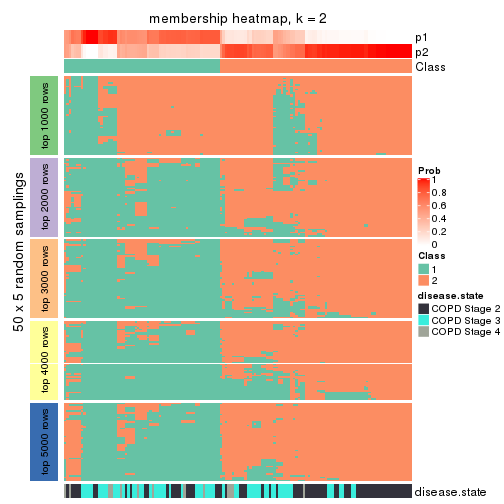</p>

</div>
<div id='tab-MAD-hclust-membership-heatmap-2'>
<pre><code class="r">membership_heatmap(res, k = 3)
</code></pre>

<p></p>

</div>
<div id='tab-MAD-hclust-membership-heatmap-3'>
<pre><code class="r">membership_heatmap(res, k = 4)
</code></pre>

<p></p>

</div>
<div id='tab-MAD-hclust-membership-heatmap-4'>
<pre><code class="r">membership_heatmap(res, k = 5)
</code></pre>

<p></p>

</div>
<div id='tab-MAD-hclust-membership-heatmap-5'>
<pre><code class="r">membership_heatmap(res, k = 6)
</code></pre>

<p></p>

</div>
</div>

As soon as we have had the classes for columns, we can look for signatures
which are significantly different between classes which can be candidate marks
for certain classes. Following are the heatmaps for signatures.


Signature heatmaps where rows are scaled:


<script>
$( function() {
	$( '#tabs-MAD-hclust-get-signatures' ).tabs();
} );
</script>
<div id='tabs-MAD-hclust-get-signatures'>
<ul>
<li><a href='#tab-MAD-hclust-get-signatures-1'>k = 2</a></li>
<li><a href='#tab-MAD-hclust-get-signatures-2'>k = 3</a></li>
<li><a href='#tab-MAD-hclust-get-signatures-3'>k = 4</a></li>
<li><a href='#tab-MAD-hclust-get-signatures-4'>k = 5</a></li>
<li><a href='#tab-MAD-hclust-get-signatures-5'>k = 6</a></li>
</ul>
<div id='tab-MAD-hclust-get-signatures-1'>
<pre><code class="r">get_signatures(res, k = 2)
</code></pre>

<p></p>

</div>
<div id='tab-MAD-hclust-get-signatures-2'>
<pre><code class="r">get_signatures(res, k = 3)
</code></pre>

<p></p>

</div>
<div id='tab-MAD-hclust-get-signatures-3'>
<pre><code class="r">get_signatures(res, k = 4)
</code></pre>

<p></p>

</div>
<div id='tab-MAD-hclust-get-signatures-4'>
<pre><code class="r">get_signatures(res, k = 5)
</code></pre>

<p></p>

</div>
<div id='tab-MAD-hclust-get-signatures-5'>
<pre><code class="r">get_signatures(res, k = 6)
</code></pre>

<p></p>

</div>
</div>


Signature heatmaps where rows are not scaled:


<script>
$( function() {
	$( '#tabs-MAD-hclust-get-signatures-no-scale' ).tabs();
} );
</script>
<div id='tabs-MAD-hclust-get-signatures-no-scale'>
<ul>
<li><a href='#tab-MAD-hclust-get-signatures-no-scale-1'>k = 2</a></li>
<li><a href='#tab-MAD-hclust-get-signatures-no-scale-2'>k = 3</a></li>
<li><a href='#tab-MAD-hclust-get-signatures-no-scale-3'>k = 4</a></li>
<li><a href='#tab-MAD-hclust-get-signatures-no-scale-4'>k = 5</a></li>
<li><a href='#tab-MAD-hclust-get-signatures-no-scale-5'>k = 6</a></li>
</ul>
<div id='tab-MAD-hclust-get-signatures-no-scale-1'>
<pre><code class="r">get_signatures(res, k = 2, scale_rows = FALSE)
</code></pre>

<p></p>

</div>
<div id='tab-MAD-hclust-get-signatures-no-scale-2'>
<pre><code class="r">get_signatures(res, k = 3, scale_rows = FALSE)
</code></pre>

<p></p>

</div>
<div id='tab-MAD-hclust-get-signatures-no-scale-3'>
<pre><code class="r">get_signatures(res, k = 4, scale_rows = FALSE)
</code></pre>

<p></p>

</div>
<div id='tab-MAD-hclust-get-signatures-no-scale-4'>
<pre><code class="r">get_signatures(res, k = 5, scale_rows = FALSE)
</code></pre>

<p></p>

</div>
<div id='tab-MAD-hclust-get-signatures-no-scale-5'>
<pre><code class="r">get_signatures(res, k = 6, scale_rows = FALSE)
</code></pre>

<p></p>

</div>
</div>


Compare the overlap of signatures from different k:

```r
compare_signatures(res)
```

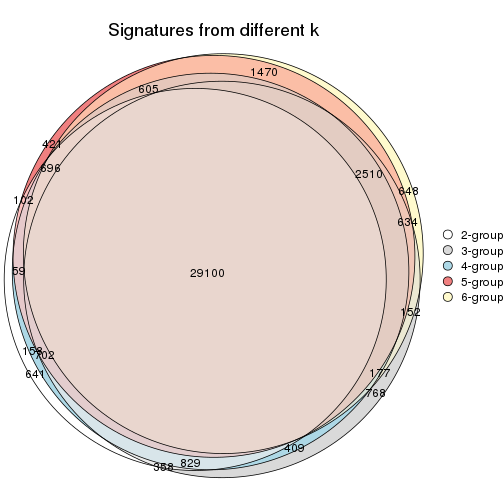

`get_signature()` returns a data frame invisibly. TO get the list of signatures, the function
call should be assigned to a variable explicitly. In following code, if `plot` argument is set
to `FALSE`, no heatmap is plotted while only the differential analysis is performed.

```r
# code only for demonstration
tb = get_signature(res, k = ..., plot = FALSE)
```

An example of the output of `tb` is:

```
#>   which_row         fdr    mean_1    mean_2 scaled_mean_1 scaled_mean_2 km
#> 1        38 0.042760348  8.373488  9.131774    -0.5533452     0.5164555  1
#> 2        40 0.018707592  7.106213  8.469186    -0.6173731     0.5762149  1
#> 3        55 0.019134737 10.221463 11.207825    -0.6159697     0.5749050  1
#> 4        59 0.006059896  5.921854  7.869574    -0.6899429     0.6439467  1
#> 5        60 0.018055526  8.928898 10.211722    -0.6204761     0.5791110  1
#> 6        98 0.009384629 15.714769 14.887706     0.6635654    -0.6193277  2
...
```

The columns in `tb` are:

1. `which_row`: row indices corresponding to the input matrix.
2. `fdr`: FDR for the differential test. 
3. `mean_x`: The mean value in group x.
4. `scaled_mean_x`: The mean value in group x after rows are scaled.
5. `km`: Row groups if k-means clustering is applied to rows.


UMAP plot which shows how samples are separated.


<script>
$( function() {
	$( '#tabs-MAD-hclust-dimension-reduction' ).tabs();
} );
</script>
<div id='tabs-MAD-hclust-dimension-reduction'>
<ul>
<li><a href='#tab-MAD-hclust-dimension-reduction-1'>k = 2</a></li>
<li><a href='#tab-MAD-hclust-dimension-reduction-2'>k = 3</a></li>
<li><a href='#tab-MAD-hclust-dimension-reduction-3'>k = 4</a></li>
<li><a href='#tab-MAD-hclust-dimension-reduction-4'>k = 5</a></li>
<li><a href='#tab-MAD-hclust-dimension-reduction-5'>k = 6</a></li>
</ul>
<div id='tab-MAD-hclust-dimension-reduction-1'>
<pre><code class="r">dimension_reduction(res, k = 2, method = &quot;UMAP&quot;)
</code></pre>

<p></p>

</div>
<div id='tab-MAD-hclust-dimension-reduction-2'>
<pre><code class="r">dimension_reduction(res, k = 3, method = &quot;UMAP&quot;)
</code></pre>

<p></p>

</div>
<div id='tab-MAD-hclust-dimension-reduction-3'>
<pre><code class="r">dimension_reduction(res, k = 4, method = &quot;UMAP&quot;)
</code></pre>

<p></p>

</div>
<div id='tab-MAD-hclust-dimension-reduction-4'>
<pre><code class="r">dimension_reduction(res, k = 5, method = &quot;UMAP&quot;)
</code></pre>

<p></p>

</div>
<div id='tab-MAD-hclust-dimension-reduction-5'>
<pre><code class="r">dimension_reduction(res, k = 6, method = &quot;UMAP&quot;)
</code></pre>

<p></p>

</div>
</div>


Following heatmap shows how subgroups are split when increasing `k`:

```r
collect_classes(res)
```


Test correlation between subgroups and known annotations. If the known
annotation is numeric, one-way ANOVA test is applied, and if the known
annotation is discrete, chi-squared contingency table test is applied.

```r
test_to_known_factors(res)
```

```
#>              n disease.state(p) k
#> MAD:hclust 127         4.37e-04 2
#> MAD:hclust 126         1.35e-02 3
#> MAD:hclust 112         2.41e-04 4
#> MAD:hclust  91         9.78e-06 5
#> MAD:hclust  71         5.32e-04 6
```


If matrix rows can be associated to genes, consider to use `GO_Enrichment(res,
...)` to perform function enrichment for the signature genes.


 

---------------------------------------------------


### MAD:kmeans


The object with results only for a single top-value method and a single partition method 
can be extracted as:

```r
res = res_list["MAD", "kmeans"]
# you can also extract it by
# res = res_list["MAD:kmeans"]
```

A summary of `res` and all the functions that can be applied to it:

```r
res
```

```
#> A 'ConsensusPartition' object with k = 2, 3, 4, 5, 6.
#>   On a matrix with 51776 rows and 143 columns.
#>   Top rows (1000, 2000, 3000, 4000, 5000) are extracted by 'MAD' method.
#>   Subgroups are detected by 'kmeans' method.
#>   Performed in total 1250 partitions by row resampling.
#>   Best k for subgroups seems to be 2.
#> 
#> Following methods can be applied to this 'ConsensusPartition' object:
#>  [1] "cola_report"             "collect_classes"         "collect_plots"          
#>  [4] "collect_stats"           "colnames"                "compare_signatures"     
#>  [7] "consensus_heatmap"       "dimension_reduction"     "functional_enrichment"  
#> [10] "get_anno_col"            "get_anno"                "get_classes"            
#> [13] "get_consensus"           "get_matrix"              "get_membership"         
#> [16] "get_param"               "get_signatures"          "get_stats"              
#> [19] "is_best_k"               "is_stable_k"             "membership_heatmap"     
#> [22] "ncol"                    "nrow"                    "plot_ecdf"              
#> [25] "rownames"                "select_partition_number" "show"                   
#> [28] "suggest_best_k"          "test_to_known_factors"
```

`collect_plots()` function collects all the plots made from `res` for all `k` (number of partitions)
into one single page to provide an easy and fast comparison between different `k`.

```r
collect_plots(res)
```


The plots are:

- The first row: a plot of the ECDF (Empirical cumulative distribution
  function) curves of the consensus matrix for each `k` and the heatmap of
  predicted classes for each `k`.
- The second row: heatmaps of the consensus matrix for each `k`.
- The third row: heatmaps of the membership matrix for each `k`.
- The fouth row: heatmaps of the signatures for each `k`.

All the plots in panels can be made by individual functions and they are
plotted later in this section.

`select_partition_number()` produces several plots showing different
statistics for choosing "optimized" `k`. There are following statistics:

- ECDF curves of the consensus matrix for each `k`;
- 1-PAC. [The PAC
  score](https://en.wikipedia.org/wiki/Consensus_clustering#Over-interpretation_potential_of_consensus_clustering)
  measures the proportion of the ambiguous subgrouping.
- Mean silhouette score.
- Concordance. The mean probability of fiting the consensus class ids in all
  partitions.
- Area increased. Denote $A_k$ as the area under the ECDF curve for current
  `k`, the area increased is defined as $A_k - A_{k-1}$.
- Rand index. The percent of pairs of samples that are both in a same cluster
  or both are not in a same cluster in the partition of k and k-1.
- Jaccard index. The ratio of pairs of samples are both in a same cluster in
  the partition of k and k-1 and the pairs of samples are both in a same
  cluster in the partition k or k-1.

The detailed explanations of these statistics can be found in [the cola
vignette](http://bioconductor.org/packages/devel/bioc/vignettes/cola/inst/doc/cola.html#toc_13).

Generally speaking, lower PAC score, higher mean silhouette score or higher
concordance corresponds to better partition. Rand index and Jaccard index
measure how similar the current partition is compared to partition with `k-1`.
If they are too similar, we won't accept `k` is better than `k-1`.

```r
select_partition_number(res)
```


The numeric values for all these statistics can be obtained by `get_stats()`.

```r
get_stats(res)
```

```
#>   k 1-PAC mean_silhouette concordance area_increased  Rand Jaccard
#> 2 2 0.551           0.900       0.898          0.466 0.538   0.538
#> 3 3 0.501           0.643       0.809          0.355 0.685   0.478
#> 4 4 0.553           0.581       0.782          0.141 0.780   0.479
#> 5 5 0.628           0.625       0.778          0.079 0.884   0.621
#> 6 6 0.689           0.542       0.755          0.050 0.890   0.573
```

`suggest_best_k()` suggests the best $k$ based on these statistics. The rules are as follows:

- All $k$ with Jaccard index larger than 0.95 are removed because the increase of
  the partition number does not provides enough extra information. If all $k$ are removed,
  the best $k$ is assigned by `NA`.
- For $k$ with 1-PAC larger than 0.9, the maximal $k$ is taken as the "best k". Other $k$ is called "optional k".
- If it does not fit the second rule. The $k$ with the highest vote of highest
  1-PAC, mean silhouette and concordance is taken as the "best k".

```r
suggest_best_k(res)
```

```
#> [1] 2
```


Following shows the table of the partitions (You need to click the **show/hide
code output** link to see it). The membership matrix (columns with name `p*`)
is inferred by
[`clue::cl_consensus()`](https://www.rdocumentation.org/link/cl_consensus?package=clue)
function with the `SE` method. Basically the value in the membership matrix
represents the probability to belong to a certain group. The finall class
label for an item is determined with the group with highest probability it
belongs to.

In `get_classes()` function, the entropy is calculated from the membership
matrix and the silhouette score is calculated from the consensus matrix.


<script>
$( function() {
	$( '#tabs-MAD-kmeans-get-classes' ).tabs();
} );
</script>
<div id='tabs-MAD-kmeans-get-classes'>
<ul>
<li><a href='#tab-MAD-kmeans-get-classes-1'>k = 2</a></li>
<li><a href='#tab-MAD-kmeans-get-classes-2'>k = 3</a></li>
<li><a href='#tab-MAD-kmeans-get-classes-3'>k = 4</a></li>
<li><a href='#tab-MAD-kmeans-get-classes-4'>k = 5</a></li>
<li><a href='#tab-MAD-kmeans-get-classes-5'>k = 6</a></li>
</ul>

<div id='tab-MAD-kmeans-get-classes-1'>
<p><a id='tab-MAD-kmeans-get-classes-1-a' style='color:#0366d6' href='#'>show/hide code output</a></p>
<pre><code class="r">cbind(get_classes(res, k = 2), get_membership(res, k = 2))
</code></pre>

<pre><code>#&gt;           class entropy silhouette    p1    p2
#&gt; GSM550785     1  0.5059      0.935 0.888 0.112
#&gt; GSM550786     2  0.6887      0.854 0.184 0.816
#&gt; GSM550788     2  0.0376      0.927 0.004 0.996
#&gt; GSM550789     2  0.0000      0.928 0.000 1.000
#&gt; GSM550790     1  0.5059      0.935 0.888 0.112
#&gt; GSM550791     1  0.5059      0.935 0.888 0.112
#&gt; GSM550792     2  0.3431      0.906 0.064 0.936
#&gt; GSM550796     2  0.0376      0.927 0.004 0.996
#&gt; GSM550797     2  0.0000      0.928 0.000 1.000
#&gt; GSM550799     2  0.5737      0.875 0.136 0.864
#&gt; GSM550800     2  0.0000      0.928 0.000 1.000
#&gt; GSM550801     2  0.0000      0.928 0.000 1.000
#&gt; GSM550804     2  0.0000      0.928 0.000 1.000
#&gt; GSM550806     2  0.8207      0.788 0.256 0.744
#&gt; GSM550807     2  0.0000      0.928 0.000 1.000
#&gt; GSM550808     2  0.4431      0.893 0.092 0.908
#&gt; GSM550809     1  0.4562      0.934 0.904 0.096
#&gt; GSM550810     2  0.0376      0.927 0.004 0.996
#&gt; GSM550811     1  0.5408      0.927 0.876 0.124
#&gt; GSM550813     2  0.0000      0.928 0.000 1.000
#&gt; GSM550814     2  0.0376      0.927 0.004 0.996
#&gt; GSM550815     2  0.0376      0.927 0.004 0.996
#&gt; GSM550816     2  0.0000      0.928 0.000 1.000
#&gt; GSM550817     2  0.6887      0.854 0.184 0.816
#&gt; GSM550818     2  0.6887      0.854 0.184 0.816
#&gt; GSM550819     2  0.1184      0.924 0.016 0.984
#&gt; GSM550820     1  0.4562      0.934 0.904 0.096
#&gt; GSM550821     2  0.4815      0.891 0.104 0.896
#&gt; GSM550822     2  0.0376      0.927 0.004 0.996
#&gt; GSM550826     1  0.0376      0.909 0.996 0.004
#&gt; GSM550832     2  0.0376      0.927 0.004 0.996
#&gt; GSM550833     2  0.0000      0.928 0.000 1.000
#&gt; GSM550835     2  0.5294      0.879 0.120 0.880
#&gt; GSM550836     1  0.0000      0.907 1.000 0.000
#&gt; GSM550837     2  0.4431      0.893 0.092 0.908
#&gt; GSM550838     1  0.0376      0.909 0.996 0.004
#&gt; GSM550841     2  0.6247      0.867 0.156 0.844
#&gt; GSM550842     2  0.4431      0.893 0.092 0.908
#&gt; GSM550846     2  0.2948      0.908 0.052 0.948
#&gt; GSM550849     2  0.4431      0.890 0.092 0.908
#&gt; GSM550850     1  0.5059      0.935 0.888 0.112
#&gt; GSM550851     2  0.4431      0.893 0.092 0.908
#&gt; GSM550852     2  0.0000      0.928 0.000 1.000
#&gt; GSM550853     2  0.0000      0.928 0.000 1.000
#&gt; GSM550855     2  0.0000      0.928 0.000 1.000
#&gt; GSM550856     2  0.0000      0.928 0.000 1.000
#&gt; GSM550861     2  0.0000      0.928 0.000 1.000
#&gt; GSM550863     2  0.5178      0.853 0.116 0.884
#&gt; GSM550864     2  0.0000      0.928 0.000 1.000
#&gt; GSM550866     2  0.0000      0.928 0.000 1.000
#&gt; GSM550867     1  0.5059      0.935 0.888 0.112
#&gt; GSM550885     1  0.5059      0.935 0.888 0.112
#&gt; GSM550886     2  0.6887      0.854 0.184 0.816
#&gt; GSM550887     2  0.0376      0.927 0.004 0.996
#&gt; GSM550889     2  0.4298      0.874 0.088 0.912
#&gt; GSM550894     2  0.0376      0.927 0.004 0.996
#&gt; GSM550897     1  0.5178      0.933 0.884 0.116
#&gt; GSM550903     2  0.0000      0.928 0.000 1.000
#&gt; GSM550905     2  0.4431      0.893 0.092 0.908
#&gt; GSM550906     2  0.0376      0.927 0.004 0.996
#&gt; GSM550907     2  0.6887      0.854 0.184 0.816
#&gt; GSM550909     2  0.5519      0.886 0.128 0.872
#&gt; GSM550911     2  0.6887      0.854 0.184 0.816
#&gt; GSM550913     2  0.0000      0.928 0.000 1.000
#&gt; GSM550915     2  0.3879      0.884 0.076 0.924
#&gt; GSM550917     2  0.0000      0.928 0.000 1.000
#&gt; GSM550919     2  0.2423      0.909 0.040 0.960
#&gt; GSM550921     1  0.0000      0.907 1.000 0.000
#&gt; GSM550924     2  0.6531      0.865 0.168 0.832
#&gt; GSM550926     2  0.0000      0.928 0.000 1.000
#&gt; GSM550927     2  0.0000      0.928 0.000 1.000
#&gt; GSM550787     2  0.7453      0.833 0.212 0.788
#&gt; GSM550793     1  0.0000      0.907 1.000 0.000
#&gt; GSM550794     2  0.4022      0.898 0.080 0.920
#&gt; GSM550795     1  0.5059      0.935 0.888 0.112
#&gt; GSM550798     1  0.0376      0.909 0.996 0.004
#&gt; GSM550803     1  0.4562      0.933 0.904 0.096
#&gt; GSM550805     1  0.5408      0.926 0.876 0.124
#&gt; GSM550823     2  0.1633      0.922 0.024 0.976
#&gt; GSM550824     1  0.5059      0.935 0.888 0.112
#&gt; GSM550825     1  0.0000      0.907 1.000 0.000
#&gt; GSM550827     2  0.4298      0.879 0.088 0.912
#&gt; GSM550828     1  0.5059      0.935 0.888 0.112
#&gt; GSM550829     1  0.0376      0.909 0.996 0.004
#&gt; GSM550830     2  0.5178      0.851 0.116 0.884
#&gt; GSM550834     1  0.5408      0.926 0.876 0.124
#&gt; GSM550839     2  0.6887      0.854 0.184 0.816
#&gt; GSM550840     1  0.5059      0.935 0.888 0.112
#&gt; GSM550843     2  0.6887      0.854 0.184 0.816
#&gt; GSM550844     1  0.5059      0.935 0.888 0.112
#&gt; GSM550845     2  0.0000      0.928 0.000 1.000
#&gt; GSM550848     2  0.2236      0.911 0.036 0.964
#&gt; GSM550854     1  0.5059      0.935 0.888 0.112
#&gt; GSM550857     1  0.0000      0.907 1.000 0.000
#&gt; GSM550858     1  0.5294      0.930 0.880 0.120
#&gt; GSM550859     1  0.5059      0.935 0.888 0.112
#&gt; GSM550862     1  0.5059      0.935 0.888 0.112
#&gt; GSM550865     2  0.6973      0.761 0.188 0.812
#&gt; GSM550868     2  0.6973      0.761 0.188 0.812
#&gt; GSM550869     2  0.8499      0.755 0.276 0.724
#&gt; GSM550870     2  0.0000      0.928 0.000 1.000
#&gt; GSM550871     2  0.6887      0.854 0.184 0.816
#&gt; GSM550872     2  0.6973      0.761 0.188 0.812
#&gt; GSM550873     2  0.0672      0.927 0.008 0.992
#&gt; GSM550874     2  0.0000      0.928 0.000 1.000
#&gt; GSM550876     2  0.6887      0.854 0.184 0.816
#&gt; GSM550877     2  0.0000      0.928 0.000 1.000
#&gt; GSM550878     2  0.6887      0.854 0.184 0.816
#&gt; GSM550879     1  0.5059      0.935 0.888 0.112
#&gt; GSM550882     1  0.2236      0.888 0.964 0.036
#&gt; GSM550888     1  0.0000      0.907 1.000 0.000
#&gt; GSM550890     2  0.4298      0.879 0.088 0.912
#&gt; GSM550891     1  0.2603      0.883 0.956 0.044
#&gt; GSM550892     1  0.5294      0.930 0.880 0.120
#&gt; GSM550893     2  0.0000      0.928 0.000 1.000
#&gt; GSM550895     2  0.0000      0.928 0.000 1.000
#&gt; GSM550896     2  0.0000      0.928 0.000 1.000
#&gt; GSM550898     1  0.5059      0.935 0.888 0.112
#&gt; GSM550899     2  0.0000      0.928 0.000 1.000
#&gt; GSM550900     2  0.4562      0.874 0.096 0.904
#&gt; GSM550901     1  0.6531      0.883 0.832 0.168
#&gt; GSM550902     1  0.0376      0.909 0.996 0.004
#&gt; GSM550904     1  0.0376      0.909 0.996 0.004
#&gt; GSM550908     1  0.0000      0.907 1.000 0.000
#&gt; GSM550912     2  0.0000      0.928 0.000 1.000
#&gt; GSM550914     2  0.2236      0.911 0.036 0.964
#&gt; GSM550918     2  0.0000      0.928 0.000 1.000
#&gt; GSM550922     2  0.5737      0.875 0.136 0.864
#&gt; GSM550923     1  0.0376      0.909 0.996 0.004
#&gt; GSM550925     1  0.6531      0.883 0.832 0.168
#&gt; GSM550802     2  0.0376      0.927 0.004 0.996
#&gt; GSM550812     2  0.3431      0.906 0.064 0.936
#&gt; GSM550831     1  0.5059      0.935 0.888 0.112
#&gt; GSM550847     1  0.5059      0.935 0.888 0.112
#&gt; GSM550860     1  0.2236      0.888 0.964 0.036
#&gt; GSM550875     1  0.4161      0.932 0.916 0.084
#&gt; GSM550880     1  0.9933      0.328 0.548 0.452
#&gt; GSM550881     1  0.0000      0.907 1.000 0.000
#&gt; GSM550883     1  0.0000      0.907 1.000 0.000
#&gt; GSM550884     2  0.4022      0.900 0.080 0.920
#&gt; GSM550910     2  0.6887      0.854 0.184 0.816
#&gt; GSM550916     1  0.5059      0.935 0.888 0.112
#&gt; GSM550920     2  0.6887      0.854 0.184 0.816
</code></pre>

<script>
$('#tab-MAD-kmeans-get-classes-1-a').parent().next().next().hide();
$('#tab-MAD-kmeans-get-classes-1-a').click(function(){
  $('#tab-MAD-kmeans-get-classes-1-a').parent().next().next().toggle();
  return(false);
});
</script>
</div>

<div id='tab-MAD-kmeans-get-classes-2'>
<p><a id='tab-MAD-kmeans-get-classes-2-a' style='color:#0366d6' href='#'>show/hide code output</a></p>
<pre><code class="r">cbind(get_classes(res, k = 3), get_membership(res, k = 3))
</code></pre>

<pre><code>#&gt;           class entropy silhouette    p1    p2    p3
#&gt; GSM550785     1  0.0000   0.792265 1.000 0.000 0.000
#&gt; GSM550786     3  0.5529   0.556501 0.000 0.296 0.704
#&gt; GSM550788     2  0.2261   0.792350 0.000 0.932 0.068
#&gt; GSM550789     2  0.3482   0.776403 0.000 0.872 0.128
#&gt; GSM550790     1  0.0000   0.792265 1.000 0.000 0.000
#&gt; GSM550791     1  0.0000   0.792265 1.000 0.000 0.000
#&gt; GSM550792     2  0.7492   0.297908 0.340 0.608 0.052
#&gt; GSM550796     2  0.4346   0.736530 0.000 0.816 0.184
#&gt; GSM550797     2  0.3340   0.780013 0.000 0.880 0.120
#&gt; GSM550799     3  0.5591   0.495568 0.000 0.304 0.696
#&gt; GSM550800     2  0.0237   0.793942 0.000 0.996 0.004
#&gt; GSM550801     2  0.3116   0.783821 0.000 0.892 0.108
#&gt; GSM550804     2  0.0424   0.794658 0.000 0.992 0.008
#&gt; GSM550806     3  0.4731   0.656078 0.032 0.128 0.840
#&gt; GSM550807     2  0.2165   0.792751 0.000 0.936 0.064
#&gt; GSM550808     2  0.4654   0.714524 0.000 0.792 0.208
#&gt; GSM550809     1  0.1031   0.785970 0.976 0.000 0.024
#&gt; GSM550810     2  0.4346   0.736530 0.000 0.816 0.184
#&gt; GSM550811     1  0.3791   0.740104 0.892 0.060 0.048
#&gt; GSM550813     2  0.0237   0.792237 0.000 0.996 0.004
#&gt; GSM550814     2  0.0424   0.793870 0.000 0.992 0.008
#&gt; GSM550815     2  0.4346   0.736530 0.000 0.816 0.184
#&gt; GSM550816     2  0.3412   0.778644 0.000 0.876 0.124
#&gt; GSM550817     3  0.4842   0.582883 0.000 0.224 0.776
#&gt; GSM550818     3  0.3686   0.643876 0.000 0.140 0.860
#&gt; GSM550819     2  0.5138   0.657691 0.120 0.828 0.052
#&gt; GSM550820     1  0.1031   0.785970 0.976 0.000 0.024
#&gt; GSM550821     2  0.5098   0.693944 0.000 0.752 0.248
#&gt; GSM550822     2  0.4346   0.736530 0.000 0.816 0.184
#&gt; GSM550826     1  0.3340   0.679239 0.880 0.000 0.120
#&gt; GSM550832     2  0.3412   0.778742 0.000 0.876 0.124
#&gt; GSM550833     2  0.3412   0.778742 0.000 0.876 0.124
#&gt; GSM550835     2  0.6308   0.087583 0.000 0.508 0.492
#&gt; GSM550836     3  0.5216   0.575423 0.260 0.000 0.740
#&gt; GSM550837     2  0.4654   0.714524 0.000 0.792 0.208
#&gt; GSM550838     1  0.1031   0.785970 0.976 0.000 0.024
#&gt; GSM550841     3  0.5591   0.495568 0.000 0.304 0.696
#&gt; GSM550842     2  0.4654   0.714524 0.000 0.792 0.208
#&gt; GSM550846     2  0.7327   0.373314 0.312 0.636 0.052
#&gt; GSM550849     1  0.8195   0.251673 0.492 0.436 0.072
#&gt; GSM550850     1  0.0000   0.792265 1.000 0.000 0.000
#&gt; GSM550851     2  0.4654   0.714524 0.000 0.792 0.208
#&gt; GSM550852     2  0.1643   0.769872 0.000 0.956 0.044
#&gt; GSM550853     2  0.2261   0.792350 0.000 0.932 0.068
#&gt; GSM550855     2  0.1964   0.793207 0.000 0.944 0.056
#&gt; GSM550856     2  0.0000   0.793598 0.000 1.000 0.000
#&gt; GSM550861     2  0.3412   0.778742 0.000 0.876 0.124
#&gt; GSM550863     1  0.7757   0.372224 0.540 0.408 0.052
#&gt; GSM550864     2  0.0000   0.793598 0.000 1.000 0.000
#&gt; GSM550866     2  0.0829   0.786915 0.012 0.984 0.004
#&gt; GSM550867     1  0.1411   0.780522 0.964 0.000 0.036
#&gt; GSM550885     1  0.1411   0.780522 0.964 0.000 0.036
#&gt; GSM550886     3  0.5810   0.404690 0.000 0.336 0.664
#&gt; GSM550887     2  0.4346   0.736530 0.000 0.816 0.184
#&gt; GSM550889     2  0.6781   0.497455 0.244 0.704 0.052
#&gt; GSM550894     2  0.4178   0.746463 0.000 0.828 0.172
#&gt; GSM550897     1  0.1453   0.781461 0.968 0.024 0.008
#&gt; GSM550903     2  0.3412   0.778742 0.000 0.876 0.124
#&gt; GSM550905     2  0.4654   0.714524 0.000 0.792 0.208
#&gt; GSM550906     2  0.3412   0.778742 0.000 0.876 0.124
#&gt; GSM550907     3  0.1529   0.670859 0.000 0.040 0.960
#&gt; GSM550909     2  0.5497   0.651198 0.000 0.708 0.292
#&gt; GSM550911     3  0.1529   0.670859 0.000 0.040 0.960
#&gt; GSM550913     2  0.3412   0.778742 0.000 0.876 0.124
#&gt; GSM550915     1  0.7671   0.377367 0.544 0.408 0.048
#&gt; GSM550917     2  0.0592   0.794627 0.000 0.988 0.012
#&gt; GSM550919     1  0.7708   0.339610 0.528 0.424 0.048
#&gt; GSM550921     3  0.4974   0.592182 0.236 0.000 0.764
#&gt; GSM550924     2  0.8135  -0.227657 0.068 0.484 0.448
#&gt; GSM550926     2  0.1031   0.782602 0.000 0.976 0.024
#&gt; GSM550927     2  0.3482   0.776403 0.000 0.872 0.128
#&gt; GSM550787     3  0.9059   0.306591 0.136 0.408 0.456
#&gt; GSM550793     3  0.6062   0.433663 0.384 0.000 0.616
#&gt; GSM550794     2  0.7589   0.236871 0.360 0.588 0.052
#&gt; GSM550795     1  0.0000   0.792265 1.000 0.000 0.000
#&gt; GSM550798     1  0.1411   0.780522 0.964 0.000 0.036
#&gt; GSM550803     1  0.1411   0.780522 0.964 0.000 0.036
#&gt; GSM550805     1  0.5835   0.664750 0.784 0.164 0.052
#&gt; GSM550823     2  0.7065   0.449424 0.276 0.672 0.052
#&gt; GSM550824     1  0.1411   0.780522 0.964 0.000 0.036
#&gt; GSM550825     3  0.5859   0.484621 0.344 0.000 0.656
#&gt; GSM550827     1  0.7699   0.349084 0.532 0.420 0.048
#&gt; GSM550828     1  0.0000   0.792265 1.000 0.000 0.000
#&gt; GSM550829     1  0.4931   0.482725 0.768 0.000 0.232
#&gt; GSM550830     1  0.7832   0.263247 0.496 0.452 0.052
#&gt; GSM550834     1  0.1015   0.786786 0.980 0.012 0.008
#&gt; GSM550839     3  0.6260   0.355563 0.000 0.448 0.552
#&gt; GSM550840     1  0.3921   0.735557 0.884 0.080 0.036
#&gt; GSM550843     3  0.4750   0.631395 0.000 0.216 0.784
#&gt; GSM550844     1  0.0000   0.792265 1.000 0.000 0.000
#&gt; GSM550845     2  0.0237   0.792237 0.000 0.996 0.004
#&gt; GSM550848     2  0.7708  -0.000823 0.424 0.528 0.048
#&gt; GSM550854     1  0.1411   0.780522 0.964 0.000 0.036
#&gt; GSM550857     3  0.5859   0.484621 0.344 0.000 0.656
#&gt; GSM550858     1  0.0000   0.792265 1.000 0.000 0.000
#&gt; GSM550859     1  0.1411   0.780522 0.964 0.000 0.036
#&gt; GSM550862     1  0.0000   0.792265 1.000 0.000 0.000
#&gt; GSM550865     1  0.7757   0.372224 0.540 0.408 0.052
#&gt; GSM550868     1  0.7757   0.372224 0.540 0.408 0.052
#&gt; GSM550869     3  0.9623   0.348060 0.216 0.336 0.448
#&gt; GSM550870     2  0.0000   0.793598 0.000 1.000 0.000
#&gt; GSM550871     3  0.7394   0.278184 0.032 0.472 0.496
#&gt; GSM550872     1  0.7757   0.372224 0.540 0.408 0.052
#&gt; GSM550873     2  0.1753   0.767658 0.000 0.952 0.048
#&gt; GSM550874     2  0.0237   0.792237 0.000 0.996 0.004
#&gt; GSM550876     3  0.5968   0.522004 0.000 0.364 0.636
#&gt; GSM550877     2  0.0000   0.793598 0.000 1.000 0.000
#&gt; GSM550878     3  0.2625   0.676789 0.000 0.084 0.916
#&gt; GSM550879     1  0.0000   0.792265 1.000 0.000 0.000
#&gt; GSM550882     3  0.5119   0.625504 0.160 0.028 0.812
#&gt; GSM550888     3  0.5216   0.575423 0.260 0.000 0.740
#&gt; GSM550890     1  0.7819   0.287036 0.508 0.440 0.052
#&gt; GSM550891     3  0.3272   0.654824 0.104 0.004 0.892
#&gt; GSM550892     1  0.0000   0.792265 1.000 0.000 0.000
#&gt; GSM550893     2  0.0747   0.786982 0.000 0.984 0.016
#&gt; GSM550895     2  0.3375   0.734637 0.044 0.908 0.048
#&gt; GSM550896     2  0.0000   0.793598 0.000 1.000 0.000
#&gt; GSM550898     1  0.1411   0.780522 0.964 0.000 0.036
#&gt; GSM550899     2  0.0000   0.793598 0.000 1.000 0.000
#&gt; GSM550900     1  0.7785   0.342775 0.528 0.420 0.052
#&gt; GSM550901     1  0.5905   0.656020 0.772 0.184 0.044
#&gt; GSM550902     1  0.1964   0.760605 0.944 0.000 0.056
#&gt; GSM550904     1  0.1031   0.785970 0.976 0.000 0.024
#&gt; GSM550908     3  0.5216   0.575423 0.260 0.000 0.740
#&gt; GSM550912     2  0.1529   0.772323 0.000 0.960 0.040
#&gt; GSM550914     2  0.7181   0.397564 0.304 0.648 0.048
#&gt; GSM550918     2  0.0000   0.793598 0.000 1.000 0.000
#&gt; GSM550922     3  0.5650   0.481525 0.000 0.312 0.688
#&gt; GSM550923     1  0.1411   0.780522 0.964 0.000 0.036
#&gt; GSM550925     1  0.5905   0.656020 0.772 0.184 0.044
#&gt; GSM550802     2  0.4443   0.697182 0.084 0.864 0.052
#&gt; GSM550812     2  0.6742   0.512687 0.240 0.708 0.052
#&gt; GSM550831     1  0.0000   0.792265 1.000 0.000 0.000
#&gt; GSM550847     1  0.1163   0.784393 0.972 0.000 0.028
#&gt; GSM550860     3  0.6856   0.609828 0.132 0.128 0.740
#&gt; GSM550875     1  0.2663   0.761911 0.932 0.024 0.044
#&gt; GSM550880     1  0.6258   0.639460 0.752 0.196 0.052
#&gt; GSM550881     3  0.5216   0.575423 0.260 0.000 0.740
#&gt; GSM550883     3  0.5733   0.511049 0.324 0.000 0.676
#&gt; GSM550884     2  0.7065   0.457330 0.276 0.672 0.052
#&gt; GSM550910     3  0.5098   0.558505 0.000 0.248 0.752
#&gt; GSM550916     1  0.0000   0.792265 1.000 0.000 0.000
#&gt; GSM550920     3  0.5497   0.561485 0.000 0.292 0.708
</code></pre>

<script>
$('#tab-MAD-kmeans-get-classes-2-a').parent().next().next().hide();
$('#tab-MAD-kmeans-get-classes-2-a').click(function(){
  $('#tab-MAD-kmeans-get-classes-2-a').parent().next().next().toggle();
  return(false);
});
</script>
</div>

<div id='tab-MAD-kmeans-get-classes-3'>
<p><a id='tab-MAD-kmeans-get-classes-3-a' style='color:#0366d6' href='#'>show/hide code output</a></p>
<pre><code class="r">cbind(get_classes(res, k = 4), get_membership(res, k = 4))
</code></pre>

<pre><code>#&gt;           class entropy silhouette    p1    p2    p3    p4
#&gt; GSM550785     1  0.1557     0.8523 0.944 0.000 0.000 0.056
#&gt; GSM550786     4  0.7052    -0.1591 0.000 0.128 0.372 0.500
#&gt; GSM550788     2  0.1902     0.6726 0.000 0.932 0.004 0.064
#&gt; GSM550789     2  0.0336     0.6853 0.000 0.992 0.000 0.008
#&gt; GSM550790     1  0.1389     0.8515 0.952 0.000 0.000 0.048
#&gt; GSM550791     1  0.3610     0.8084 0.800 0.000 0.000 0.200
#&gt; GSM550792     4  0.3810     0.7260 0.092 0.060 0.000 0.848
#&gt; GSM550796     2  0.0188     0.6800 0.000 0.996 0.004 0.000
#&gt; GSM550797     2  0.0336     0.6853 0.000 0.992 0.000 0.008
#&gt; GSM550799     2  0.7775    -0.2855 0.000 0.384 0.376 0.240
#&gt; GSM550800     2  0.4837     0.4323 0.000 0.648 0.004 0.348
#&gt; GSM550801     2  0.0469     0.6855 0.000 0.988 0.000 0.012
#&gt; GSM550804     2  0.4624     0.4401 0.000 0.660 0.000 0.340
#&gt; GSM550806     3  0.3486     0.7274 0.000 0.000 0.812 0.188
#&gt; GSM550807     2  0.1389     0.6768 0.000 0.952 0.000 0.048
#&gt; GSM550808     2  0.3831     0.5341 0.000 0.792 0.004 0.204
#&gt; GSM550809     1  0.3448     0.8179 0.828 0.000 0.004 0.168
#&gt; GSM550810     2  0.0376     0.6772 0.000 0.992 0.004 0.004
#&gt; GSM550811     4  0.4103     0.5643 0.256 0.000 0.000 0.744
#&gt; GSM550813     2  0.4679     0.4247 0.000 0.648 0.000 0.352
#&gt; GSM550814     2  0.4837     0.4602 0.000 0.648 0.004 0.348
#&gt; GSM550815     2  0.0188     0.6800 0.000 0.996 0.004 0.000
#&gt; GSM550816     2  0.2654     0.6398 0.000 0.888 0.004 0.108
#&gt; GSM550817     3  0.7772     0.2648 0.000 0.368 0.392 0.240
#&gt; GSM550818     3  0.7521     0.4241 0.000 0.292 0.488 0.220
#&gt; GSM550819     4  0.2982     0.7090 0.032 0.068 0.004 0.896
#&gt; GSM550820     1  0.3208     0.8278 0.848 0.000 0.004 0.148
#&gt; GSM550821     2  0.5898     0.3599 0.000 0.628 0.056 0.316
#&gt; GSM550822     2  0.0188     0.6800 0.000 0.996 0.004 0.000
#&gt; GSM550826     1  0.4194     0.7741 0.764 0.000 0.008 0.228
#&gt; GSM550832     2  0.0336     0.6853 0.000 0.992 0.000 0.008
#&gt; GSM550833     2  0.0336     0.6853 0.000 0.992 0.000 0.008
#&gt; GSM550835     2  0.6797     0.2382 0.000 0.600 0.160 0.240
#&gt; GSM550836     3  0.2011     0.7857 0.080 0.000 0.920 0.000
#&gt; GSM550837     2  0.3831     0.5341 0.000 0.792 0.004 0.204
#&gt; GSM550838     1  0.3448     0.8179 0.828 0.000 0.004 0.168
#&gt; GSM550841     2  0.7774    -0.2783 0.000 0.388 0.372 0.240
#&gt; GSM550842     2  0.4214     0.5216 0.000 0.780 0.016 0.204
#&gt; GSM550846     4  0.4756     0.7187 0.144 0.072 0.000 0.784
#&gt; GSM550849     4  0.2401     0.7011 0.092 0.004 0.000 0.904
#&gt; GSM550850     1  0.1474     0.8525 0.948 0.000 0.000 0.052
#&gt; GSM550851     2  0.3831     0.5341 0.000 0.792 0.004 0.204
#&gt; GSM550852     4  0.4643     0.2913 0.000 0.344 0.000 0.656
#&gt; GSM550853     2  0.1637     0.6743 0.000 0.940 0.000 0.060
#&gt; GSM550855     2  0.1792     0.6708 0.000 0.932 0.000 0.068
#&gt; GSM550856     2  0.5070     0.3170 0.000 0.580 0.004 0.416
#&gt; GSM550861     2  0.0336     0.6853 0.000 0.992 0.000 0.008
#&gt; GSM550863     4  0.5212     0.6900 0.192 0.068 0.000 0.740
#&gt; GSM550864     2  0.4697     0.4183 0.000 0.644 0.000 0.356
#&gt; GSM550866     2  0.5080     0.3077 0.000 0.576 0.004 0.420
#&gt; GSM550867     1  0.0188     0.8356 0.996 0.000 0.004 0.000
#&gt; GSM550885     1  0.0376     0.8366 0.992 0.000 0.004 0.004
#&gt; GSM550886     2  0.7789    -0.2444 0.000 0.400 0.352 0.248
#&gt; GSM550887     2  0.0188     0.6800 0.000 0.996 0.004 0.000
#&gt; GSM550889     4  0.5458     0.5860 0.052 0.232 0.004 0.712
#&gt; GSM550894     2  0.0000     0.6813 0.000 1.000 0.000 0.000
#&gt; GSM550897     1  0.4978     0.5164 0.612 0.000 0.004 0.384
#&gt; GSM550903     2  0.0336     0.6853 0.000 0.992 0.000 0.008
#&gt; GSM550905     2  0.4468     0.4918 0.000 0.752 0.016 0.232
#&gt; GSM550906     2  0.0336     0.6853 0.000 0.992 0.000 0.008
#&gt; GSM550907     3  0.4452     0.7300 0.000 0.048 0.796 0.156
#&gt; GSM550909     2  0.6549     0.2097 0.000 0.488 0.076 0.436
#&gt; GSM550911     3  0.4452     0.7300 0.000 0.048 0.796 0.156
#&gt; GSM550913     2  0.0336     0.6853 0.000 0.992 0.000 0.008
#&gt; GSM550915     4  0.5392     0.6862 0.204 0.072 0.000 0.724
#&gt; GSM550917     2  0.4543     0.4583 0.000 0.676 0.000 0.324
#&gt; GSM550919     4  0.5392     0.6862 0.204 0.072 0.000 0.724
#&gt; GSM550921     3  0.1474     0.7905 0.052 0.000 0.948 0.000
#&gt; GSM550924     4  0.1722     0.6440 0.008 0.000 0.048 0.944
#&gt; GSM550926     2  0.5163     0.1393 0.000 0.516 0.004 0.480
#&gt; GSM550927     2  0.0336     0.6853 0.000 0.992 0.000 0.008
#&gt; GSM550787     4  0.3109     0.6116 0.016 0.004 0.100 0.880
#&gt; GSM550793     3  0.4546     0.6141 0.256 0.000 0.732 0.012
#&gt; GSM550794     4  0.3542     0.7249 0.076 0.060 0.000 0.864
#&gt; GSM550795     1  0.3726     0.7894 0.788 0.000 0.000 0.212
#&gt; GSM550798     1  0.2402     0.7606 0.912 0.000 0.076 0.012
#&gt; GSM550803     1  0.0376     0.8347 0.992 0.000 0.004 0.004
#&gt; GSM550805     4  0.3448     0.6739 0.168 0.000 0.004 0.828
#&gt; GSM550823     4  0.3979     0.7124 0.056 0.096 0.004 0.844
#&gt; GSM550824     1  0.0188     0.8356 0.996 0.000 0.004 0.000
#&gt; GSM550825     3  0.3907     0.6558 0.232 0.000 0.768 0.000
#&gt; GSM550827     4  0.5429     0.6821 0.208 0.072 0.000 0.720
#&gt; GSM550828     1  0.1474     0.8531 0.948 0.000 0.000 0.052
#&gt; GSM550829     1  0.4284     0.5683 0.764 0.000 0.224 0.012
#&gt; GSM550830     4  0.5555     0.7028 0.140 0.116 0.004 0.740
#&gt; GSM550834     1  0.4331     0.6962 0.712 0.000 0.000 0.288
#&gt; GSM550839     4  0.5022     0.3461 0.000 0.028 0.264 0.708
#&gt; GSM550840     1  0.4800     0.5812 0.656 0.000 0.004 0.340
#&gt; GSM550843     4  0.6840    -0.2402 0.000 0.100 0.432 0.468
#&gt; GSM550844     1  0.3123     0.8292 0.844 0.000 0.000 0.156
#&gt; GSM550845     4  0.4999    -0.0998 0.000 0.492 0.000 0.508
#&gt; GSM550848     4  0.5473     0.6932 0.192 0.084 0.000 0.724
#&gt; GSM550854     1  0.0188     0.8356 0.996 0.000 0.004 0.000
#&gt; GSM550857     3  0.3024     0.7373 0.148 0.000 0.852 0.000
#&gt; GSM550858     1  0.1474     0.8531 0.948 0.000 0.000 0.052
#&gt; GSM550859     1  0.0188     0.8356 0.996 0.000 0.004 0.000
#&gt; GSM550862     1  0.1474     0.8531 0.948 0.000 0.000 0.052
#&gt; GSM550865     4  0.5352     0.6926 0.188 0.068 0.004 0.740
#&gt; GSM550868     4  0.5352     0.6926 0.188 0.068 0.004 0.740
#&gt; GSM550869     4  0.1124     0.6747 0.012 0.004 0.012 0.972
#&gt; GSM550870     2  0.4643     0.4364 0.000 0.656 0.000 0.344
#&gt; GSM550871     4  0.3791     0.4885 0.000 0.004 0.200 0.796
#&gt; GSM550872     4  0.5352     0.6926 0.188 0.068 0.004 0.740
#&gt; GSM550873     4  0.4661     0.1579 0.000 0.348 0.000 0.652
#&gt; GSM550874     2  0.5070     0.3170 0.000 0.580 0.004 0.416
#&gt; GSM550876     4  0.5649     0.0498 0.000 0.028 0.392 0.580
#&gt; GSM550877     2  0.5060     0.3255 0.000 0.584 0.004 0.412
#&gt; GSM550878     3  0.3625     0.7397 0.000 0.012 0.828 0.160
#&gt; GSM550879     1  0.3528     0.8055 0.808 0.000 0.000 0.192
#&gt; GSM550882     3  0.0336     0.7836 0.000 0.000 0.992 0.008
#&gt; GSM550888     3  0.2011     0.7857 0.080 0.000 0.920 0.000
#&gt; GSM550890     4  0.5356     0.6888 0.200 0.072 0.000 0.728
#&gt; GSM550891     3  0.0188     0.7836 0.000 0.000 0.996 0.004
#&gt; GSM550892     1  0.3569     0.7970 0.804 0.000 0.000 0.196
#&gt; GSM550893     2  0.5070     0.3170 0.000 0.580 0.004 0.416
#&gt; GSM550895     4  0.4456     0.5115 0.000 0.280 0.004 0.716
#&gt; GSM550896     2  0.5039     0.3415 0.000 0.592 0.004 0.404
#&gt; GSM550898     1  0.0188     0.8356 0.996 0.000 0.004 0.000
#&gt; GSM550899     2  0.4643     0.4346 0.000 0.656 0.000 0.344
#&gt; GSM550900     4  0.5312     0.6958 0.184 0.068 0.004 0.744
#&gt; GSM550901     1  0.4985     0.2548 0.532 0.000 0.000 0.468
#&gt; GSM550902     1  0.4175     0.7968 0.784 0.000 0.016 0.200
#&gt; GSM550904     1  0.3448     0.8179 0.828 0.000 0.004 0.168
#&gt; GSM550908     3  0.1792     0.7898 0.068 0.000 0.932 0.000
#&gt; GSM550912     2  0.4961     0.2217 0.000 0.552 0.000 0.448
#&gt; GSM550914     4  0.5380     0.7054 0.136 0.120 0.000 0.744
#&gt; GSM550918     2  0.4624     0.4401 0.000 0.660 0.000 0.340
#&gt; GSM550922     2  0.7756    -0.2297 0.000 0.412 0.348 0.240
#&gt; GSM550923     1  0.0657     0.8333 0.984 0.000 0.004 0.012
#&gt; GSM550925     4  0.4699     0.5405 0.320 0.000 0.004 0.676
#&gt; GSM550802     4  0.3198     0.7074 0.032 0.080 0.004 0.884
#&gt; GSM550812     4  0.2983     0.7126 0.040 0.068 0.000 0.892
#&gt; GSM550831     1  0.1474     0.8531 0.948 0.000 0.000 0.052
#&gt; GSM550847     1  0.0592     0.8417 0.984 0.000 0.000 0.016
#&gt; GSM550860     4  0.4690     0.3713 0.012 0.000 0.276 0.712
#&gt; GSM550875     1  0.5168     0.3113 0.504 0.000 0.004 0.492
#&gt; GSM550880     4  0.4277     0.5730 0.280 0.000 0.000 0.720
#&gt; GSM550881     3  0.1792     0.7898 0.068 0.000 0.932 0.000
#&gt; GSM550883     3  0.2704     0.7577 0.124 0.000 0.876 0.000
#&gt; GSM550884     4  0.2983     0.7126 0.040 0.068 0.000 0.892
#&gt; GSM550910     3  0.7811     0.2542 0.000 0.368 0.380 0.252
#&gt; GSM550916     1  0.1557     0.8523 0.944 0.000 0.000 0.056
#&gt; GSM550920     4  0.7226    -0.2050 0.000 0.144 0.388 0.468
</code></pre>

<script>
$('#tab-MAD-kmeans-get-classes-3-a').parent().next().next().hide();
$('#tab-MAD-kmeans-get-classes-3-a').click(function(){
  $('#tab-MAD-kmeans-get-classes-3-a').parent().next().next().toggle();
  return(false);
});
</script>
</div>

<div id='tab-MAD-kmeans-get-classes-4'>
<p><a id='tab-MAD-kmeans-get-classes-4-a' style='color:#0366d6' href='#'>show/hide code output</a></p>
<pre><code class="r">cbind(get_classes(res, k = 5), get_membership(res, k = 5))
</code></pre>

<pre><code>#&gt;           class entropy silhouette    p1    p2    p3    p4    p5
#&gt; GSM550785     1  0.1153    0.79991 0.964 0.000 0.004 0.008 0.024
#&gt; GSM550786     5  0.3688    0.66871 0.000 0.020 0.124 0.028 0.828
#&gt; GSM550788     2  0.2891    0.67602 0.000 0.824 0.000 0.176 0.000
#&gt; GSM550789     2  0.0162    0.71639 0.000 0.996 0.000 0.004 0.000
#&gt; GSM550790     1  0.1106    0.79962 0.964 0.000 0.012 0.000 0.024
#&gt; GSM550791     1  0.6083    0.62043 0.608 0.004 0.004 0.176 0.208
#&gt; GSM550792     4  0.4370    0.70873 0.012 0.004 0.004 0.700 0.280
#&gt; GSM550796     2  0.0162    0.71651 0.000 0.996 0.000 0.004 0.000
#&gt; GSM550797     2  0.0162    0.71639 0.000 0.996 0.000 0.004 0.000
#&gt; GSM550799     5  0.5354    0.72010 0.000 0.208 0.128 0.000 0.664
#&gt; GSM550800     2  0.3707    0.60536 0.000 0.716 0.000 0.284 0.000
#&gt; GSM550801     2  0.0324    0.71654 0.000 0.992 0.000 0.004 0.004
#&gt; GSM550804     2  0.5555    0.54846 0.000 0.644 0.000 0.204 0.152
#&gt; GSM550806     5  0.5228    0.53208 0.000 0.000 0.356 0.056 0.588
#&gt; GSM550807     2  0.0566    0.71838 0.000 0.984 0.000 0.012 0.004
#&gt; GSM550808     2  0.4300   -0.30951 0.000 0.524 0.000 0.000 0.476
#&gt; GSM550809     1  0.5987    0.63816 0.620 0.000 0.012 0.224 0.144
#&gt; GSM550810     2  0.0000    0.71653 0.000 1.000 0.000 0.000 0.000
#&gt; GSM550811     4  0.4964    0.68483 0.032 0.004 0.004 0.648 0.312
#&gt; GSM550813     2  0.5733    0.49661 0.000 0.608 0.000 0.256 0.136
#&gt; GSM550814     2  0.5016    0.49519 0.000 0.608 0.000 0.348 0.044
#&gt; GSM550815     2  0.0290    0.71616 0.000 0.992 0.000 0.008 0.000
#&gt; GSM550816     2  0.4630    0.58316 0.000 0.744 0.000 0.116 0.140
#&gt; GSM550817     5  0.5392    0.72045 0.000 0.192 0.144 0.000 0.664
#&gt; GSM550818     5  0.4901    0.71067 0.000 0.096 0.196 0.000 0.708
#&gt; GSM550819     4  0.1041    0.73175 0.000 0.004 0.000 0.964 0.032
#&gt; GSM550820     1  0.5605    0.68459 0.672 0.000 0.012 0.172 0.144
#&gt; GSM550821     5  0.3883    0.67852 0.000 0.216 0.004 0.016 0.764
#&gt; GSM550822     2  0.0290    0.71616 0.000 0.992 0.000 0.008 0.000
#&gt; GSM550826     1  0.6567    0.58144 0.560 0.000 0.020 0.228 0.192
#&gt; GSM550832     2  0.0162    0.71639 0.000 0.996 0.000 0.004 0.000
#&gt; GSM550833     2  0.0290    0.71616 0.000 0.992 0.000 0.008 0.000
#&gt; GSM550835     5  0.5221    0.53600 0.000 0.400 0.048 0.000 0.552
#&gt; GSM550836     3  0.0510    0.94404 0.016 0.000 0.984 0.000 0.000
#&gt; GSM550837     2  0.4114   -0.01295 0.000 0.624 0.000 0.000 0.376
#&gt; GSM550838     1  0.6082    0.63755 0.616 0.000 0.016 0.224 0.144
#&gt; GSM550841     5  0.5354    0.72010 0.000 0.208 0.128 0.000 0.664
#&gt; GSM550842     2  0.4302   -0.31936 0.000 0.520 0.000 0.000 0.480
#&gt; GSM550846     4  0.4788    0.69837 0.024 0.004 0.004 0.660 0.308
#&gt; GSM550849     4  0.4783    0.68080 0.016 0.004 0.004 0.628 0.348
#&gt; GSM550850     1  0.1153    0.79991 0.964 0.000 0.004 0.008 0.024
#&gt; GSM550851     2  0.4150   -0.05391 0.000 0.612 0.000 0.000 0.388
#&gt; GSM550852     4  0.5477    0.62627 0.000 0.132 0.000 0.648 0.220
#&gt; GSM550853     2  0.1908    0.70583 0.000 0.908 0.000 0.092 0.000
#&gt; GSM550855     2  0.2074    0.70340 0.000 0.896 0.000 0.104 0.000
#&gt; GSM550856     2  0.4632    0.38573 0.000 0.540 0.000 0.448 0.012
#&gt; GSM550861     2  0.0162    0.71639 0.000 0.996 0.000 0.004 0.000
#&gt; GSM550863     4  0.2054    0.73978 0.028 0.000 0.000 0.920 0.052
#&gt; GSM550864     2  0.5762    0.49969 0.000 0.608 0.000 0.248 0.144
#&gt; GSM550866     2  0.4650    0.34153 0.000 0.520 0.000 0.468 0.012
#&gt; GSM550867     1  0.0794    0.79951 0.972 0.000 0.028 0.000 0.000
#&gt; GSM550885     1  0.0794    0.79951 0.972 0.000 0.028 0.000 0.000
#&gt; GSM550886     5  0.5176    0.73452 0.000 0.152 0.120 0.012 0.716
#&gt; GSM550887     2  0.0290    0.71616 0.000 0.992 0.000 0.008 0.000
#&gt; GSM550889     4  0.2189    0.67808 0.012 0.084 0.000 0.904 0.000
#&gt; GSM550894     2  0.0000    0.71653 0.000 1.000 0.000 0.000 0.000
#&gt; GSM550897     4  0.5018    0.45397 0.252 0.000 0.004 0.680 0.064
#&gt; GSM550903     2  0.0162    0.71639 0.000 0.996 0.000 0.004 0.000
#&gt; GSM550905     5  0.4126    0.55325 0.000 0.380 0.000 0.000 0.620
#&gt; GSM550906     2  0.0162    0.71651 0.000 0.996 0.000 0.004 0.000
#&gt; GSM550907     5  0.4415    0.51580 0.000 0.008 0.388 0.000 0.604
#&gt; GSM550909     5  0.4696    0.65818 0.000 0.184 0.008 0.068 0.740
#&gt; GSM550911     5  0.4403    0.52227 0.000 0.008 0.384 0.000 0.608
#&gt; GSM550913     2  0.0162    0.71639 0.000 0.996 0.000 0.004 0.000
#&gt; GSM550915     4  0.5320    0.68090 0.052 0.004 0.004 0.624 0.316
#&gt; GSM550917     2  0.4096    0.66269 0.000 0.784 0.000 0.072 0.144
#&gt; GSM550919     4  0.5411    0.68283 0.044 0.012 0.004 0.624 0.316
#&gt; GSM550921     3  0.0794    0.92254 0.000 0.000 0.972 0.000 0.028
#&gt; GSM550924     5  0.4321   -0.29059 0.000 0.000 0.004 0.396 0.600
#&gt; GSM550926     4  0.4760   -0.10152 0.000 0.416 0.000 0.564 0.020
#&gt; GSM550927     2  0.0290    0.71616 0.000 0.992 0.000 0.008 0.000
#&gt; GSM550787     4  0.5545    0.45501 0.016 0.000 0.052 0.600 0.332
#&gt; GSM550793     3  0.3688    0.79742 0.124 0.000 0.828 0.020 0.028
#&gt; GSM550794     4  0.3889    0.72240 0.004 0.004 0.004 0.748 0.240
#&gt; GSM550795     1  0.5927    0.58535 0.592 0.000 0.004 0.272 0.132
#&gt; GSM550798     1  0.1341    0.78207 0.944 0.000 0.056 0.000 0.000
#&gt; GSM550803     1  0.0794    0.79951 0.972 0.000 0.028 0.000 0.000
#&gt; GSM550805     4  0.4003    0.72283 0.036 0.000 0.004 0.780 0.180
#&gt; GSM550823     4  0.0854    0.72773 0.012 0.008 0.000 0.976 0.004
#&gt; GSM550824     1  0.0794    0.79951 0.972 0.000 0.028 0.000 0.000
#&gt; GSM550825     3  0.2020    0.87128 0.100 0.000 0.900 0.000 0.000
#&gt; GSM550827     4  0.4888    0.70838 0.048 0.004 0.000 0.676 0.272
#&gt; GSM550828     1  0.0486    0.80492 0.988 0.000 0.004 0.004 0.004
#&gt; GSM550829     1  0.3424    0.62004 0.760 0.000 0.240 0.000 0.000
#&gt; GSM550830     4  0.0807    0.72773 0.012 0.012 0.000 0.976 0.000
#&gt; GSM550834     1  0.6536    0.33499 0.480 0.000 0.004 0.332 0.184
#&gt; GSM550839     5  0.5492    0.40090 0.000 0.000 0.068 0.396 0.536
#&gt; GSM550840     4  0.5363    0.23990 0.372 0.000 0.004 0.572 0.052
#&gt; GSM550843     5  0.5364    0.69540 0.000 0.040 0.188 0.064 0.708
#&gt; GSM550844     1  0.4455    0.71648 0.744 0.000 0.000 0.188 0.068
#&gt; GSM550845     4  0.5113   -0.00375 0.000 0.380 0.000 0.576 0.044
#&gt; GSM550848     4  0.5243    0.69968 0.048 0.008 0.004 0.652 0.288
#&gt; GSM550854     1  0.0955    0.79917 0.968 0.000 0.028 0.004 0.000
#&gt; GSM550857     3  0.1043    0.92719 0.040 0.000 0.960 0.000 0.000
#&gt; GSM550858     1  0.0162    0.80402 0.996 0.000 0.000 0.004 0.000
#&gt; GSM550859     1  0.0955    0.79917 0.968 0.000 0.028 0.004 0.000
#&gt; GSM550862     1  0.0510    0.80390 0.984 0.000 0.000 0.016 0.000
#&gt; GSM550865     4  0.1626    0.73240 0.044 0.000 0.000 0.940 0.016
#&gt; GSM550868     4  0.1701    0.73157 0.048 0.000 0.000 0.936 0.016
#&gt; GSM550869     4  0.2929    0.67431 0.008 0.000 0.000 0.840 0.152
#&gt; GSM550870     2  0.5644    0.52881 0.000 0.628 0.000 0.228 0.144
#&gt; GSM550871     4  0.4495    0.52663 0.000 0.000 0.064 0.736 0.200
#&gt; GSM550872     4  0.1701    0.73157 0.048 0.000 0.000 0.936 0.016
#&gt; GSM550873     4  0.6387    0.32351 0.000 0.168 0.000 0.440 0.392
#&gt; GSM550874     4  0.4659   -0.30863 0.000 0.492 0.000 0.496 0.012
#&gt; GSM550876     5  0.5470    0.55715 0.000 0.000 0.092 0.296 0.612
#&gt; GSM550877     2  0.4644    0.36310 0.000 0.528 0.000 0.460 0.012
#&gt; GSM550878     5  0.4161    0.50816 0.000 0.000 0.392 0.000 0.608
#&gt; GSM550879     1  0.5748    0.66298 0.652 0.000 0.012 0.200 0.136
#&gt; GSM550882     3  0.1386    0.91452 0.000 0.000 0.952 0.016 0.032
#&gt; GSM550888     3  0.0510    0.94404 0.016 0.000 0.984 0.000 0.000
#&gt; GSM550890     4  0.5060    0.69891 0.044 0.004 0.004 0.660 0.288
#&gt; GSM550891     3  0.1121    0.90682 0.000 0.000 0.956 0.000 0.044
#&gt; GSM550892     1  0.4354    0.66605 0.712 0.000 0.000 0.256 0.032
#&gt; GSM550893     2  0.4659    0.28393 0.000 0.496 0.000 0.492 0.012
#&gt; GSM550895     4  0.2068    0.67232 0.004 0.092 0.000 0.904 0.000
#&gt; GSM550896     2  0.4622    0.41018 0.000 0.548 0.000 0.440 0.012
#&gt; GSM550898     1  0.0955    0.79917 0.968 0.000 0.028 0.004 0.000
#&gt; GSM550899     2  0.5693    0.51605 0.000 0.620 0.000 0.236 0.144
#&gt; GSM550900     4  0.1043    0.72944 0.040 0.000 0.000 0.960 0.000
#&gt; GSM550901     4  0.6656    0.48205 0.180 0.004 0.004 0.480 0.332
#&gt; GSM550902     1  0.6568    0.55601 0.556 0.000 0.028 0.276 0.140
#&gt; GSM550904     1  0.5890    0.66240 0.644 0.000 0.016 0.196 0.144
#&gt; GSM550908     3  0.0671    0.94376 0.016 0.000 0.980 0.000 0.004
#&gt; GSM550912     2  0.6254    0.21606 0.000 0.480 0.000 0.368 0.152
#&gt; GSM550914     4  0.4661    0.71413 0.032 0.004 0.004 0.704 0.256
#&gt; GSM550918     2  0.5555    0.54846 0.000 0.644 0.000 0.204 0.152
#&gt; GSM550922     5  0.5295    0.71479 0.000 0.224 0.112 0.000 0.664
#&gt; GSM550923     1  0.0880    0.79799 0.968 0.000 0.032 0.000 0.000
#&gt; GSM550925     4  0.4219    0.71073 0.112 0.004 0.004 0.796 0.084
#&gt; GSM550802     4  0.1124    0.73347 0.000 0.004 0.000 0.960 0.036
#&gt; GSM550812     4  0.2732    0.73425 0.000 0.000 0.000 0.840 0.160
#&gt; GSM550831     1  0.1717    0.79722 0.936 0.000 0.004 0.008 0.052
#&gt; GSM550847     1  0.0671    0.80095 0.980 0.000 0.016 0.004 0.000
#&gt; GSM550860     4  0.4427    0.60777 0.008 0.000 0.088 0.776 0.128
#&gt; GSM550875     4  0.5272    0.50409 0.212 0.000 0.004 0.680 0.104
#&gt; GSM550880     4  0.4801    0.68913 0.084 0.000 0.004 0.728 0.184
#&gt; GSM550881     3  0.0798    0.94256 0.016 0.000 0.976 0.000 0.008
#&gt; GSM550883     3  0.0510    0.94404 0.016 0.000 0.984 0.000 0.000
#&gt; GSM550884     4  0.3074    0.72857 0.000 0.000 0.000 0.804 0.196
#&gt; GSM550910     5  0.5084    0.73250 0.000 0.144 0.140 0.004 0.712
#&gt; GSM550916     1  0.1507    0.79694 0.952 0.000 0.012 0.012 0.024
#&gt; GSM550920     5  0.4614    0.69907 0.000 0.048 0.136 0.040 0.776
</code></pre>

<script>
$('#tab-MAD-kmeans-get-classes-4-a').parent().next().next().hide();
$('#tab-MAD-kmeans-get-classes-4-a').click(function(){
  $('#tab-MAD-kmeans-get-classes-4-a').parent().next().next().toggle();
  return(false);
});
</script>
</div>

<div id='tab-MAD-kmeans-get-classes-5'>
<p><a id='tab-MAD-kmeans-get-classes-5-a' style='color:#0366d6' href='#'>show/hide code output</a></p>
<pre><code class="r">cbind(get_classes(res, k = 6), get_membership(res, k = 6))
</code></pre>

<pre><code>#&gt;           class entropy silhouette    p1    p2    p3    p4    p5    p6
#&gt; GSM550785     1  0.3874     0.9116 0.636 0.000 0.000 0.000 0.008 0.356
#&gt; GSM550786     5  0.2483     0.7445 0.020 0.004 0.004 0.016 0.900 0.056
#&gt; GSM550788     2  0.2871     0.6197 0.004 0.804 0.000 0.192 0.000 0.000
#&gt; GSM550789     2  0.0146     0.7546 0.004 0.996 0.000 0.000 0.000 0.000
#&gt; GSM550790     1  0.3804     0.8988 0.656 0.000 0.000 0.000 0.008 0.336
#&gt; GSM550791     6  0.4964     0.3922 0.224 0.008 0.004 0.040 0.032 0.692
#&gt; GSM550792     6  0.7419     0.2352 0.256 0.004 0.008 0.308 0.072 0.352
#&gt; GSM550796     2  0.0508     0.7538 0.004 0.984 0.000 0.012 0.000 0.000
#&gt; GSM550797     2  0.0146     0.7546 0.004 0.996 0.000 0.000 0.000 0.000
#&gt; GSM550799     5  0.1829     0.7616 0.012 0.064 0.004 0.000 0.920 0.000
#&gt; GSM550800     2  0.3955     0.1912 0.004 0.560 0.000 0.436 0.000 0.000
#&gt; GSM550801     2  0.0260     0.7543 0.000 0.992 0.000 0.008 0.000 0.000
#&gt; GSM550804     2  0.6789     0.4128 0.224 0.544 0.008 0.160 0.040 0.024
#&gt; GSM550806     5  0.5767     0.5348 0.052 0.000 0.124 0.204 0.620 0.000
#&gt; GSM550807     2  0.1082     0.7440 0.004 0.956 0.000 0.040 0.000 0.000
#&gt; GSM550808     2  0.4098    -0.2385 0.008 0.496 0.000 0.000 0.496 0.000
#&gt; GSM550809     6  0.1693     0.4044 0.020 0.000 0.004 0.044 0.000 0.932
#&gt; GSM550810     2  0.0291     0.7535 0.004 0.992 0.000 0.000 0.004 0.000
#&gt; GSM550811     6  0.5698     0.4623 0.228 0.000 0.004 0.144 0.020 0.604
#&gt; GSM550813     2  0.6237     0.4444 0.184 0.584 0.008 0.184 0.036 0.004
#&gt; GSM550814     2  0.4782     0.2167 0.008 0.544 0.000 0.416 0.028 0.004
#&gt; GSM550815     2  0.0508     0.7538 0.004 0.984 0.000 0.012 0.000 0.000
#&gt; GSM550816     2  0.6760     0.4366 0.164 0.588 0.008 0.056 0.036 0.148
#&gt; GSM550817     5  0.2173     0.7578 0.028 0.064 0.004 0.000 0.904 0.000
#&gt; GSM550818     5  0.2038     0.7567 0.028 0.032 0.020 0.000 0.920 0.000
#&gt; GSM550819     4  0.2206     0.5693 0.008 0.000 0.000 0.904 0.024 0.064
#&gt; GSM550820     6  0.1826     0.3571 0.052 0.000 0.004 0.020 0.000 0.924
#&gt; GSM550821     5  0.2251     0.7598 0.016 0.052 0.008 0.008 0.912 0.004
#&gt; GSM550822     2  0.0653     0.7528 0.004 0.980 0.000 0.012 0.004 0.000
#&gt; GSM550826     6  0.1692     0.4350 0.000 0.000 0.012 0.048 0.008 0.932
#&gt; GSM550832     2  0.0000     0.7550 0.000 1.000 0.000 0.000 0.000 0.000
#&gt; GSM550833     2  0.0508     0.7538 0.004 0.984 0.000 0.012 0.000 0.000
#&gt; GSM550835     5  0.4185     0.5197 0.020 0.332 0.000 0.004 0.644 0.000
#&gt; GSM550836     3  0.0458     0.9404 0.000 0.000 0.984 0.000 0.016 0.000
#&gt; GSM550837     2  0.3993     0.0505 0.008 0.592 0.000 0.000 0.400 0.000
#&gt; GSM550838     6  0.1737     0.4027 0.020 0.000 0.008 0.040 0.000 0.932
#&gt; GSM550841     5  0.2094     0.7578 0.024 0.064 0.004 0.000 0.908 0.000
#&gt; GSM550842     5  0.3966     0.3179 0.004 0.444 0.000 0.000 0.552 0.000
#&gt; GSM550846     6  0.6748     0.3788 0.236 0.000 0.012 0.256 0.032 0.464
#&gt; GSM550849     6  0.6977     0.3679 0.300 0.000 0.004 0.160 0.088 0.448
#&gt; GSM550850     1  0.4089     0.8808 0.632 0.000 0.000 0.004 0.012 0.352
#&gt; GSM550851     2  0.4032    -0.0141 0.008 0.572 0.000 0.000 0.420 0.000
#&gt; GSM550852     4  0.8614     0.0135 0.232 0.204 0.008 0.316 0.060 0.180
#&gt; GSM550853     2  0.1958     0.7100 0.004 0.896 0.000 0.100 0.000 0.000
#&gt; GSM550855     2  0.1908     0.7129 0.004 0.900 0.000 0.096 0.000 0.000
#&gt; GSM550856     4  0.4161     0.0702 0.012 0.448 0.000 0.540 0.000 0.000
#&gt; GSM550861     2  0.0000     0.7550 0.000 1.000 0.000 0.000 0.000 0.000
#&gt; GSM550863     4  0.3782     0.4327 0.036 0.000 0.000 0.740 0.000 0.224
#&gt; GSM550864     2  0.6335     0.4286 0.200 0.568 0.008 0.184 0.036 0.004
#&gt; GSM550866     4  0.4152     0.0951 0.012 0.440 0.000 0.548 0.000 0.000
#&gt; GSM550867     1  0.4211     0.9419 0.616 0.000 0.016 0.000 0.004 0.364
#&gt; GSM550885     1  0.4245     0.9367 0.604 0.000 0.016 0.000 0.004 0.376
#&gt; GSM550886     5  0.2076     0.7623 0.020 0.040 0.004 0.016 0.920 0.000
#&gt; GSM550887     2  0.0508     0.7538 0.004 0.984 0.000 0.012 0.000 0.000
#&gt; GSM550889     4  0.1844     0.5815 0.028 0.024 0.000 0.932 0.004 0.012
#&gt; GSM550894     2  0.0000     0.7550 0.000 1.000 0.000 0.000 0.000 0.000
#&gt; GSM550897     4  0.5524     0.3000 0.112 0.000 0.004 0.616 0.020 0.248
#&gt; GSM550903     2  0.0291     0.7537 0.004 0.992 0.000 0.000 0.004 0.000
#&gt; GSM550905     5  0.3023     0.6808 0.004 0.212 0.000 0.000 0.784 0.000
#&gt; GSM550906     2  0.0363     0.7538 0.000 0.988 0.000 0.012 0.000 0.000
#&gt; GSM550907     5  0.3447     0.6761 0.036 0.000 0.136 0.008 0.816 0.004
#&gt; GSM550909     5  0.4500     0.6922 0.048 0.036 0.008 0.024 0.788 0.096
#&gt; GSM550911     5  0.3447     0.6761 0.036 0.000 0.136 0.008 0.816 0.004
#&gt; GSM550913     2  0.0146     0.7546 0.004 0.996 0.000 0.000 0.000 0.000
#&gt; GSM550915     6  0.6803     0.4081 0.244 0.004 0.012 0.228 0.032 0.480
#&gt; GSM550917     2  0.5588     0.5424 0.180 0.664 0.008 0.108 0.036 0.004
#&gt; GSM550919     6  0.6997     0.4065 0.248 0.012 0.008 0.220 0.040 0.472
#&gt; GSM550921     3  0.0632     0.9376 0.000 0.000 0.976 0.000 0.024 0.000
#&gt; GSM550924     5  0.7240     0.0475 0.272 0.000 0.004 0.108 0.424 0.192
#&gt; GSM550926     4  0.4341     0.2696 0.024 0.356 0.004 0.616 0.000 0.000
#&gt; GSM550927     2  0.0508     0.7538 0.004 0.984 0.000 0.012 0.000 0.000
#&gt; GSM550787     4  0.6796     0.3354 0.152 0.000 0.004 0.500 0.256 0.088
#&gt; GSM550793     3  0.5030     0.6479 0.036 0.000 0.676 0.044 0.008 0.236
#&gt; GSM550794     4  0.6780     0.1247 0.244 0.000 0.004 0.492 0.068 0.192
#&gt; GSM550795     6  0.2680     0.4397 0.032 0.000 0.000 0.108 0.000 0.860
#&gt; GSM550798     1  0.4553     0.9170 0.580 0.000 0.032 0.000 0.004 0.384
#&gt; GSM550803     1  0.4211     0.9419 0.616 0.000 0.016 0.000 0.004 0.364
#&gt; GSM550805     4  0.6433     0.3166 0.148 0.000 0.004 0.552 0.068 0.228
#&gt; GSM550823     4  0.1890     0.5751 0.024 0.000 0.000 0.924 0.008 0.044
#&gt; GSM550824     1  0.4211     0.9419 0.616 0.000 0.016 0.000 0.004 0.364
#&gt; GSM550825     3  0.2557     0.8816 0.032 0.000 0.892 0.008 0.008 0.060
#&gt; GSM550827     6  0.6919     0.3126 0.244 0.000 0.008 0.304 0.040 0.404
#&gt; GSM550828     1  0.3782     0.9137 0.588 0.000 0.000 0.000 0.000 0.412
#&gt; GSM550829     6  0.6205    -0.6058 0.340 0.000 0.228 0.004 0.004 0.424
#&gt; GSM550830     4  0.1777     0.5744 0.024 0.000 0.000 0.928 0.004 0.044
#&gt; GSM550834     6  0.4216     0.4462 0.084 0.000 0.000 0.148 0.012 0.756
#&gt; GSM550839     5  0.4919     0.1866 0.044 0.000 0.000 0.440 0.508 0.008
#&gt; GSM550840     4  0.6238     0.1570 0.224 0.000 0.004 0.516 0.020 0.236
#&gt; GSM550843     5  0.1999     0.7578 0.020 0.016 0.016 0.020 0.928 0.000
#&gt; GSM550844     6  0.5389    -0.1561 0.220 0.000 0.004 0.132 0.012 0.632
#&gt; GSM550845     4  0.5839     0.2389 0.132 0.312 0.004 0.540 0.004 0.008
#&gt; GSM550848     6  0.7200     0.3561 0.244 0.012 0.008 0.268 0.044 0.424
#&gt; GSM550854     1  0.4211     0.9419 0.616 0.000 0.016 0.000 0.004 0.364
#&gt; GSM550857     3  0.0622     0.9372 0.000 0.000 0.980 0.000 0.008 0.012
#&gt; GSM550858     1  0.3695     0.9353 0.624 0.000 0.000 0.000 0.000 0.376
#&gt; GSM550859     1  0.4211     0.9419 0.616 0.000 0.016 0.000 0.004 0.364
#&gt; GSM550862     1  0.4037     0.9254 0.608 0.000 0.000 0.012 0.000 0.380
#&gt; GSM550865     4  0.2747     0.5442 0.028 0.000 0.000 0.860 0.004 0.108
#&gt; GSM550868     4  0.2605     0.5437 0.028 0.000 0.000 0.864 0.000 0.108
#&gt; GSM550869     4  0.4424     0.5236 0.080 0.000 0.004 0.776 0.076 0.064
#&gt; GSM550870     2  0.6184     0.4542 0.180 0.592 0.008 0.180 0.036 0.004
#&gt; GSM550871     4  0.4811     0.4031 0.044 0.000 0.000 0.672 0.252 0.032
#&gt; GSM550872     4  0.2747     0.5442 0.028 0.000 0.000 0.860 0.004 0.108
#&gt; GSM550873     5  0.8721    -0.1074 0.236 0.192 0.008 0.224 0.276 0.064
#&gt; GSM550874     4  0.4047     0.2307 0.012 0.384 0.000 0.604 0.000 0.000
#&gt; GSM550876     5  0.4563     0.4090 0.048 0.000 0.000 0.348 0.604 0.000
#&gt; GSM550877     4  0.4157     0.0815 0.012 0.444 0.000 0.544 0.000 0.000
#&gt; GSM550878     5  0.3178     0.6901 0.028 0.000 0.128 0.012 0.832 0.000
#&gt; GSM550879     6  0.2136     0.3725 0.048 0.000 0.000 0.048 0.000 0.904
#&gt; GSM550882     3  0.2966     0.8862 0.044 0.000 0.876 0.036 0.036 0.008
#&gt; GSM550888     3  0.0458     0.9404 0.000 0.000 0.984 0.000 0.016 0.000
#&gt; GSM550890     6  0.6790     0.3774 0.244 0.000 0.012 0.260 0.032 0.452
#&gt; GSM550891     3  0.1526     0.9242 0.008 0.000 0.944 0.008 0.036 0.004
#&gt; GSM550892     6  0.6094    -0.0994 0.248 0.000 0.000 0.308 0.004 0.440
#&gt; GSM550893     4  0.4110     0.2549 0.016 0.376 0.000 0.608 0.000 0.000
#&gt; GSM550895     4  0.1578     0.5801 0.012 0.028 0.000 0.944 0.004 0.012
#&gt; GSM550896     4  0.4157     0.0797 0.012 0.444 0.000 0.544 0.000 0.000
#&gt; GSM550898     1  0.4211     0.9419 0.616 0.000 0.016 0.000 0.004 0.364
#&gt; GSM550899     2  0.6495     0.4353 0.208 0.564 0.008 0.172 0.036 0.012
#&gt; GSM550900     4  0.1719     0.5734 0.032 0.000 0.000 0.932 0.004 0.032
#&gt; GSM550901     6  0.6241     0.4747 0.292 0.012 0.000 0.100 0.048 0.548
#&gt; GSM550902     6  0.2806     0.4533 0.028 0.000 0.012 0.084 0.004 0.872
#&gt; GSM550904     6  0.1434     0.3980 0.024 0.000 0.008 0.020 0.000 0.948
#&gt; GSM550908     3  0.0458     0.9404 0.000 0.000 0.984 0.000 0.016 0.000
#&gt; GSM550912     2  0.7156     0.3141 0.228 0.488 0.008 0.208 0.036 0.032
#&gt; GSM550914     6  0.6905     0.2939 0.240 0.000 0.012 0.320 0.032 0.396
#&gt; GSM550918     2  0.6622     0.4352 0.212 0.560 0.008 0.164 0.036 0.020
#&gt; GSM550922     5  0.2094     0.7578 0.024 0.064 0.004 0.000 0.908 0.000
#&gt; GSM550923     1  0.4323     0.9320 0.600 0.000 0.020 0.000 0.004 0.376
#&gt; GSM550925     4  0.5282     0.4462 0.192 0.000 0.004 0.672 0.032 0.100
#&gt; GSM550802     4  0.3206     0.5539 0.052 0.000 0.004 0.856 0.024 0.064
#&gt; GSM550812     4  0.5463     0.3443 0.096 0.000 0.004 0.648 0.036 0.216
#&gt; GSM550831     1  0.4303     0.7341 0.524 0.000 0.000 0.004 0.012 0.460
#&gt; GSM550847     1  0.4127     0.9406 0.620 0.000 0.012 0.000 0.004 0.364
#&gt; GSM550860     4  0.5173     0.4993 0.068 0.000 0.020 0.724 0.128 0.060
#&gt; GSM550875     4  0.6233     0.2793 0.104 0.000 0.004 0.552 0.064 0.276
#&gt; GSM550880     4  0.5968    -0.1308 0.140 0.000 0.000 0.432 0.016 0.412
#&gt; GSM550881     3  0.1180     0.9373 0.004 0.000 0.960 0.004 0.024 0.008
#&gt; GSM550883     3  0.0820     0.9382 0.000 0.000 0.972 0.000 0.012 0.016
#&gt; GSM550884     4  0.5914     0.2640 0.132 0.000 0.008 0.600 0.032 0.228
#&gt; GSM550910     5  0.1788     0.7608 0.028 0.040 0.004 0.000 0.928 0.000
#&gt; GSM550916     1  0.4214     0.8868 0.656 0.000 0.004 0.012 0.008 0.320
#&gt; GSM550920     5  0.1816     0.7541 0.028 0.012 0.004 0.016 0.936 0.004
</code></pre>

<script>
$('#tab-MAD-kmeans-get-classes-5-a').parent().next().next().hide();
$('#tab-MAD-kmeans-get-classes-5-a').click(function(){
  $('#tab-MAD-kmeans-get-classes-5-a').parent().next().next().toggle();
  return(false);
});
</script>
</div>
</div>

Heatmaps for the consensus matrix. It visualizes the probability of two
samples to be in a same group.


<script>
$( function() {
	$( '#tabs-MAD-kmeans-consensus-heatmap' ).tabs();
} );
</script>
<div id='tabs-MAD-kmeans-consensus-heatmap'>
<ul>
<li><a href='#tab-MAD-kmeans-consensus-heatmap-1'>k = 2</a></li>
<li><a href='#tab-MAD-kmeans-consensus-heatmap-2'>k = 3</a></li>
<li><a href='#tab-MAD-kmeans-consensus-heatmap-3'>k = 4</a></li>
<li><a href='#tab-MAD-kmeans-consensus-heatmap-4'>k = 5</a></li>
<li><a href='#tab-MAD-kmeans-consensus-heatmap-5'>k = 6</a></li>
</ul>
<div id='tab-MAD-kmeans-consensus-heatmap-1'>
<pre><code class="r">consensus_heatmap(res, k = 2)
</code></pre>

<p></p>

</div>
<div id='tab-MAD-kmeans-consensus-heatmap-2'>
<pre><code class="r">consensus_heatmap(res, k = 3)
</code></pre>

<p></p>

</div>
<div id='tab-MAD-kmeans-consensus-heatmap-3'>
<pre><code class="r">consensus_heatmap(res, k = 4)
</code></pre>

<p></p>

</div>
<div id='tab-MAD-kmeans-consensus-heatmap-4'>
<pre><code class="r">consensus_heatmap(res, k = 5)
</code></pre>

<p></p>

</div>
<div id='tab-MAD-kmeans-consensus-heatmap-5'>
<pre><code class="r">consensus_heatmap(res, k = 6)
</code></pre>

<p></p>

</div>
</div>

Heatmaps for the membership of samples in all partitions to see how consistent they are:


<script>
$( function() {
	$( '#tabs-MAD-kmeans-membership-heatmap' ).tabs();
} );
</script>
<div id='tabs-MAD-kmeans-membership-heatmap'>
<ul>
<li><a href='#tab-MAD-kmeans-membership-heatmap-1'>k = 2</a></li>
<li><a href='#tab-MAD-kmeans-membership-heatmap-2'>k = 3</a></li>
<li><a href='#tab-MAD-kmeans-membership-heatmap-3'>k = 4</a></li>
<li><a href='#tab-MAD-kmeans-membership-heatmap-4'>k = 5</a></li>
<li><a href='#tab-MAD-kmeans-membership-heatmap-5'>k = 6</a></li>
</ul>
<div id='tab-MAD-kmeans-membership-heatmap-1'>
<pre><code class="r">membership_heatmap(res, k = 2)
</code></pre>

<p></p>

</div>
<div id='tab-MAD-kmeans-membership-heatmap-2'>
<pre><code class="r">membership_heatmap(res, k = 3)
</code></pre>

<p></p>

</div>
<div id='tab-MAD-kmeans-membership-heatmap-3'>
<pre><code class="r">membership_heatmap(res, k = 4)
</code></pre>

<p></p>

</div>
<div id='tab-MAD-kmeans-membership-heatmap-4'>
<pre><code class="r">membership_heatmap(res, k = 5)
</code></pre>

<p></p>

</div>
<div id='tab-MAD-kmeans-membership-heatmap-5'>
<pre><code class="r">membership_heatmap(res, k = 6)
</code></pre>

<p></p>

</div>
</div>

As soon as we have had the classes for columns, we can look for signatures
which are significantly different between classes which can be candidate marks
for certain classes. Following are the heatmaps for signatures.


Signature heatmaps where rows are scaled:


<script>
$( function() {
	$( '#tabs-MAD-kmeans-get-signatures' ).tabs();
} );
</script>
<div id='tabs-MAD-kmeans-get-signatures'>
<ul>
<li><a href='#tab-MAD-kmeans-get-signatures-1'>k = 2</a></li>
<li><a href='#tab-MAD-kmeans-get-signatures-2'>k = 3</a></li>
<li><a href='#tab-MAD-kmeans-get-signatures-3'>k = 4</a></li>
<li><a href='#tab-MAD-kmeans-get-signatures-4'>k = 5</a></li>
<li><a href='#tab-MAD-kmeans-get-signatures-5'>k = 6</a></li>
</ul>
<div id='tab-MAD-kmeans-get-signatures-1'>
<pre><code class="r">get_signatures(res, k = 2)
</code></pre>

<p></p>

</div>
<div id='tab-MAD-kmeans-get-signatures-2'>
<pre><code class="r">get_signatures(res, k = 3)
</code></pre>

<p></p>

</div>
<div id='tab-MAD-kmeans-get-signatures-3'>
<pre><code class="r">get_signatures(res, k = 4)
</code></pre>

<p></p>

</div>
<div id='tab-MAD-kmeans-get-signatures-4'>
<pre><code class="r">get_signatures(res, k = 5)
</code></pre>

<p></p>

</div>
<div id='tab-MAD-kmeans-get-signatures-5'>
<pre><code class="r">get_signatures(res, k = 6)
</code></pre>

<p>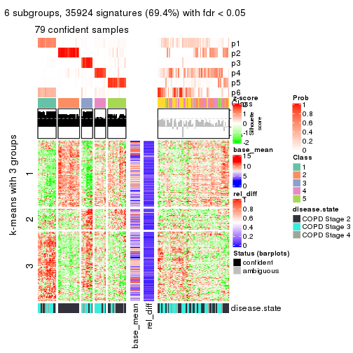</p>

</div>
</div>


Signature heatmaps where rows are not scaled:


<script>
$( function() {
	$( '#tabs-MAD-kmeans-get-signatures-no-scale' ).tabs();
} );
</script>
<div id='tabs-MAD-kmeans-get-signatures-no-scale'>
<ul>
<li><a href='#tab-MAD-kmeans-get-signatures-no-scale-1'>k = 2</a></li>
<li><a href='#tab-MAD-kmeans-get-signatures-no-scale-2'>k = 3</a></li>
<li><a href='#tab-MAD-kmeans-get-signatures-no-scale-3'>k = 4</a></li>
<li><a href='#tab-MAD-kmeans-get-signatures-no-scale-4'>k = 5</a></li>
<li><a href='#tab-MAD-kmeans-get-signatures-no-scale-5'>k = 6</a></li>
</ul>
<div id='tab-MAD-kmeans-get-signatures-no-scale-1'>
<pre><code class="r">get_signatures(res, k = 2, scale_rows = FALSE)
</code></pre>

<p></p>

</div>
<div id='tab-MAD-kmeans-get-signatures-no-scale-2'>
<pre><code class="r">get_signatures(res, k = 3, scale_rows = FALSE)
</code></pre>

<p></p>

</div>
<div id='tab-MAD-kmeans-get-signatures-no-scale-3'>
<pre><code class="r">get_signatures(res, k = 4, scale_rows = FALSE)
</code></pre>

<p></p>

</div>
<div id='tab-MAD-kmeans-get-signatures-no-scale-4'>
<pre><code class="r">get_signatures(res, k = 5, scale_rows = FALSE)
</code></pre>

<p></p>

</div>
<div id='tab-MAD-kmeans-get-signatures-no-scale-5'>
<pre><code class="r">get_signatures(res, k = 6, scale_rows = FALSE)
</code></pre>

<p></p>

</div>
</div>


Compare the overlap of signatures from different k:

```r
compare_signatures(res)
```


`get_signature()` returns a data frame invisibly. TO get the list of signatures, the function
call should be assigned to a variable explicitly. In following code, if `plot` argument is set
to `FALSE`, no heatmap is plotted while only the differential analysis is performed.

```r
# code only for demonstration
tb = get_signature(res, k = ..., plot = FALSE)
```

An example of the output of `tb` is:

```
#>   which_row         fdr    mean_1    mean_2 scaled_mean_1 scaled_mean_2 km
#> 1        38 0.042760348  8.373488  9.131774    -0.5533452     0.5164555  1
#> 2        40 0.018707592  7.106213  8.469186    -0.6173731     0.5762149  1
#> 3        55 0.019134737 10.221463 11.207825    -0.6159697     0.5749050  1
#> 4        59 0.006059896  5.921854  7.869574    -0.6899429     0.6439467  1
#> 5        60 0.018055526  8.928898 10.211722    -0.6204761     0.5791110  1
#> 6        98 0.009384629 15.714769 14.887706     0.6635654    -0.6193277  2
...
```

The columns in `tb` are:

1. `which_row`: row indices corresponding to the input matrix.
2. `fdr`: FDR for the differential test. 
3. `mean_x`: The mean value in group x.
4. `scaled_mean_x`: The mean value in group x after rows are scaled.
5. `km`: Row groups if k-means clustering is applied to rows.


UMAP plot which shows how samples are separated.


<script>
$( function() {
	$( '#tabs-MAD-kmeans-dimension-reduction' ).tabs();
} );
</script>
<div id='tabs-MAD-kmeans-dimension-reduction'>
<ul>
<li><a href='#tab-MAD-kmeans-dimension-reduction-1'>k = 2</a></li>
<li><a href='#tab-MAD-kmeans-dimension-reduction-2'>k = 3</a></li>
<li><a href='#tab-MAD-kmeans-dimension-reduction-3'>k = 4</a></li>
<li><a href='#tab-MAD-kmeans-dimension-reduction-4'>k = 5</a></li>
<li><a href='#tab-MAD-kmeans-dimension-reduction-5'>k = 6</a></li>
</ul>
<div id='tab-MAD-kmeans-dimension-reduction-1'>
<pre><code class="r">dimension_reduction(res, k = 2, method = &quot;UMAP&quot;)
</code></pre>

<p></p>

</div>
<div id='tab-MAD-kmeans-dimension-reduction-2'>
<pre><code class="r">dimension_reduction(res, k = 3, method = &quot;UMAP&quot;)
</code></pre>

<p></p>

</div>
<div id='tab-MAD-kmeans-dimension-reduction-3'>
<pre><code class="r">dimension_reduction(res, k = 4, method = &quot;UMAP&quot;)
</code></pre>

<p></p>

</div>
<div id='tab-MAD-kmeans-dimension-reduction-4'>
<pre><code class="r">dimension_reduction(res, k = 5, method = &quot;UMAP&quot;)
</code></pre>

<p></p>

</div>
<div id='tab-MAD-kmeans-dimension-reduction-5'>
<pre><code class="r">dimension_reduction(res, k = 6, method = &quot;UMAP&quot;)
</code></pre>

<p></p>

</div>
</div>


Following heatmap shows how subgroups are split when increasing `k`:

```r
collect_classes(res)
```


Test correlation between subgroups and known annotations. If the known
annotation is numeric, one-way ANOVA test is applied, and if the known
annotation is discrete, chi-squared contingency table test is applied.

```r
test_to_known_factors(res)
```

```
#>              n disease.state(p) k
#> MAD:kmeans 142         4.74e-04 2
#> MAD:kmeans 110         2.04e-04 3
#> MAD:kmeans 103         6.34e-06 4
#> MAD:kmeans 119         6.34e-05 5
#> MAD:kmeans  79         6.33e-06 6
```


If matrix rows can be associated to genes, consider to use `GO_Enrichment(res,
...)` to perform function enrichment for the signature genes.


 

---------------------------------------------------


### MAD:skmeans


The object with results only for a single top-value method and a single partition method 
can be extracted as:

```r
res = res_list["MAD", "skmeans"]
# you can also extract it by
# res = res_list["MAD:skmeans"]
```

A summary of `res` and all the functions that can be applied to it:

```r
res
```

```
#> A 'ConsensusPartition' object with k = 2, 3, 4, 5, 6.
#>   On a matrix with 51776 rows and 143 columns.
#>   Top rows (1000, 2000, 3000, 4000, 5000) are extracted by 'MAD' method.
#>   Subgroups are detected by 'skmeans' method.
#>   Performed in total 1250 partitions by row resampling.
#>   Best k for subgroups seems to be 3.
#> 
#> Following methods can be applied to this 'ConsensusPartition' object:
#>  [1] "cola_report"             "collect_classes"         "collect_plots"          
#>  [4] "collect_stats"           "colnames"                "compare_signatures"     
#>  [7] "consensus_heatmap"       "dimension_reduction"     "functional_enrichment"  
#> [10] "get_anno_col"            "get_anno"                "get_classes"            
#> [13] "get_consensus"           "get_matrix"              "get_membership"         
#> [16] "get_param"               "get_signatures"          "get_stats"              
#> [19] "is_best_k"               "is_stable_k"             "membership_heatmap"     
#> [22] "ncol"                    "nrow"                    "plot_ecdf"              
#> [25] "rownames"                "select_partition_number" "show"                   
#> [28] "suggest_best_k"          "test_to_known_factors"
```

`collect_plots()` function collects all the plots made from `res` for all `k` (number of partitions)
into one single page to provide an easy and fast comparison between different `k`.

```r
collect_plots(res)
```


The plots are:

- The first row: a plot of the ECDF (Empirical cumulative distribution
  function) curves of the consensus matrix for each `k` and the heatmap of
  predicted classes for each `k`.
- The second row: heatmaps of the consensus matrix for each `k`.
- The third row: heatmaps of the membership matrix for each `k`.
- The fouth row: heatmaps of the signatures for each `k`.

All the plots in panels can be made by individual functions and they are
plotted later in this section.

`select_partition_number()` produces several plots showing different
statistics for choosing "optimized" `k`. There are following statistics:

- ECDF curves of the consensus matrix for each `k`;
- 1-PAC. [The PAC
  score](https://en.wikipedia.org/wiki/Consensus_clustering#Over-interpretation_potential_of_consensus_clustering)
  measures the proportion of the ambiguous subgrouping.
- Mean silhouette score.
- Concordance. The mean probability of fiting the consensus class ids in all
  partitions.
- Area increased. Denote $A_k$ as the area under the ECDF curve for current
  `k`, the area increased is defined as $A_k - A_{k-1}$.
- Rand index. The percent of pairs of samples that are both in a same cluster
  or both are not in a same cluster in the partition of k and k-1.
- Jaccard index. The ratio of pairs of samples are both in a same cluster in
  the partition of k and k-1 and the pairs of samples are both in a same
  cluster in the partition k or k-1.

The detailed explanations of these statistics can be found in [the cola
vignette](http://bioconductor.org/packages/devel/bioc/vignettes/cola/inst/doc/cola.html#toc_13).

Generally speaking, lower PAC score, higher mean silhouette score or higher
concordance corresponds to better partition. Rand index and Jaccard index
measure how similar the current partition is compared to partition with `k-1`.
If they are too similar, we won't accept `k` is better than `k-1`.

```r
select_partition_number(res)
```


The numeric values for all these statistics can be obtained by `get_stats()`.

```r
get_stats(res)
```

```
#>   k 1-PAC mean_silhouette concordance area_increased  Rand Jaccard
#> 2 2 0.493           0.881       0.906         0.4999 0.498   0.498
#> 3 3 0.822           0.835       0.930         0.3146 0.778   0.582
#> 4 4 0.737           0.793       0.892         0.1270 0.855   0.611
#> 5 5 0.718           0.645       0.815         0.0636 0.861   0.549
#> 6 6 0.780           0.665       0.845         0.0396 0.953   0.797
```

`suggest_best_k()` suggests the best $k$ based on these statistics. The rules are as follows:

- All $k$ with Jaccard index larger than 0.95 are removed because the increase of
  the partition number does not provides enough extra information. If all $k$ are removed,
  the best $k$ is assigned by `NA`.
- For $k$ with 1-PAC larger than 0.9, the maximal $k$ is taken as the "best k". Other $k$ is called "optional k".
- If it does not fit the second rule. The $k$ with the highest vote of highest
  1-PAC, mean silhouette and concordance is taken as the "best k".

```r
suggest_best_k(res)
```

```
#> [1] 3
```


Following shows the table of the partitions (You need to click the **show/hide
code output** link to see it). The membership matrix (columns with name `p*`)
is inferred by
[`clue::cl_consensus()`](https://www.rdocumentation.org/link/cl_consensus?package=clue)
function with the `SE` method. Basically the value in the membership matrix
represents the probability to belong to a certain group. The finall class
label for an item is determined with the group with highest probability it
belongs to.

In `get_classes()` function, the entropy is calculated from the membership
matrix and the silhouette score is calculated from the consensus matrix.


<script>
$( function() {
	$( '#tabs-MAD-skmeans-get-classes' ).tabs();
} );
</script>
<div id='tabs-MAD-skmeans-get-classes'>
<ul>
<li><a href='#tab-MAD-skmeans-get-classes-1'>k = 2</a></li>
<li><a href='#tab-MAD-skmeans-get-classes-2'>k = 3</a></li>
<li><a href='#tab-MAD-skmeans-get-classes-3'>k = 4</a></li>
<li><a href='#tab-MAD-skmeans-get-classes-4'>k = 5</a></li>
<li><a href='#tab-MAD-skmeans-get-classes-5'>k = 6</a></li>
</ul>

<div id='tab-MAD-skmeans-get-classes-1'>
<p><a id='tab-MAD-skmeans-get-classes-1-a' style='color:#0366d6' href='#'>show/hide code output</a></p>
<pre><code class="r">cbind(get_classes(res, k = 2), get_membership(res, k = 2))
</code></pre>

<pre><code>#&gt;           class entropy silhouette    p1    p2
#&gt; GSM550785     1  0.6712      0.892 0.824 0.176
#&gt; GSM550786     2  0.7139      0.850 0.196 0.804
#&gt; GSM550788     2  0.0000      0.908 0.000 1.000
#&gt; GSM550789     2  0.0000      0.908 0.000 1.000
#&gt; GSM550790     1  0.6712      0.892 0.824 0.176
#&gt; GSM550791     1  0.6712      0.892 0.824 0.176
#&gt; GSM550792     2  0.5059      0.880 0.112 0.888
#&gt; GSM550796     2  0.0000      0.908 0.000 1.000
#&gt; GSM550797     2  0.0000      0.908 0.000 1.000
#&gt; GSM550799     2  0.6712      0.858 0.176 0.824
#&gt; GSM550800     2  0.0000      0.908 0.000 1.000
#&gt; GSM550801     2  0.0000      0.908 0.000 1.000
#&gt; GSM550804     2  0.0000      0.908 0.000 1.000
#&gt; GSM550806     1  0.2423      0.849 0.960 0.040
#&gt; GSM550807     2  0.0000      0.908 0.000 1.000
#&gt; GSM550808     2  0.6712      0.858 0.176 0.824
#&gt; GSM550809     1  0.0000      0.875 1.000 0.000
#&gt; GSM550810     2  0.0000      0.908 0.000 1.000
#&gt; GSM550811     1  0.0000      0.875 1.000 0.000
#&gt; GSM550813     2  0.0000      0.908 0.000 1.000
#&gt; GSM550814     2  0.0376      0.907 0.004 0.996
#&gt; GSM550815     2  0.0000      0.908 0.000 1.000
#&gt; GSM550816     2  0.0000      0.908 0.000 1.000
#&gt; GSM550817     2  0.7139      0.850 0.196 0.804
#&gt; GSM550818     2  0.7139      0.850 0.196 0.804
#&gt; GSM550819     2  0.6712      0.859 0.176 0.824
#&gt; GSM550820     1  0.0000      0.875 1.000 0.000
#&gt; GSM550821     2  0.6712      0.858 0.176 0.824
#&gt; GSM550822     2  0.0000      0.908 0.000 1.000
#&gt; GSM550826     1  0.0000      0.875 1.000 0.000
#&gt; GSM550832     2  0.0000      0.908 0.000 1.000
#&gt; GSM550833     2  0.0000      0.908 0.000 1.000
#&gt; GSM550835     2  0.6712      0.858 0.176 0.824
#&gt; GSM550836     1  0.0000      0.875 1.000 0.000
#&gt; GSM550837     2  0.6712      0.858 0.176 0.824
#&gt; GSM550838     1  0.0000      0.875 1.000 0.000
#&gt; GSM550841     2  0.6973      0.853 0.188 0.812
#&gt; GSM550842     2  0.6712      0.858 0.176 0.824
#&gt; GSM550846     2  0.1843      0.887 0.028 0.972
#&gt; GSM550849     1  0.0000      0.875 1.000 0.000
#&gt; GSM550850     1  0.6712      0.892 0.824 0.176
#&gt; GSM550851     2  0.6712      0.858 0.176 0.824
#&gt; GSM550852     2  0.0000      0.908 0.000 1.000
#&gt; GSM550853     2  0.0000      0.908 0.000 1.000
#&gt; GSM550855     2  0.0000      0.908 0.000 1.000
#&gt; GSM550856     2  0.0000      0.908 0.000 1.000
#&gt; GSM550861     2  0.0000      0.908 0.000 1.000
#&gt; GSM550863     1  0.7139      0.881 0.804 0.196
#&gt; GSM550864     2  0.0000      0.908 0.000 1.000
#&gt; GSM550866     2  0.0000      0.908 0.000 1.000
#&gt; GSM550867     1  0.6712      0.892 0.824 0.176
#&gt; GSM550885     1  0.6712      0.892 0.824 0.176
#&gt; GSM550886     2  0.7139      0.850 0.196 0.804
#&gt; GSM550887     2  0.0000      0.908 0.000 1.000
#&gt; GSM550889     1  0.7528      0.868 0.784 0.216
#&gt; GSM550894     2  0.0000      0.908 0.000 1.000
#&gt; GSM550897     1  0.6712      0.892 0.824 0.176
#&gt; GSM550903     2  0.0000      0.908 0.000 1.000
#&gt; GSM550905     2  0.6712      0.858 0.176 0.824
#&gt; GSM550906     2  0.0000      0.908 0.000 1.000
#&gt; GSM550907     2  0.7139      0.850 0.196 0.804
#&gt; GSM550909     2  0.6712      0.858 0.176 0.824
#&gt; GSM550911     2  0.7139      0.850 0.196 0.804
#&gt; GSM550913     2  0.0000      0.908 0.000 1.000
#&gt; GSM550915     1  0.7139      0.881 0.804 0.196
#&gt; GSM550917     2  0.0000      0.908 0.000 1.000
#&gt; GSM550919     1  0.7299      0.876 0.796 0.204
#&gt; GSM550921     1  0.0000      0.875 1.000 0.000
#&gt; GSM550924     2  0.7219      0.848 0.200 0.800
#&gt; GSM550926     2  0.0000      0.908 0.000 1.000
#&gt; GSM550927     2  0.0000      0.908 0.000 1.000
#&gt; GSM550787     1  0.1184      0.866 0.984 0.016
#&gt; GSM550793     1  0.0000      0.875 1.000 0.000
#&gt; GSM550794     2  0.7056      0.686 0.192 0.808
#&gt; GSM550795     1  0.6712      0.892 0.824 0.176
#&gt; GSM550798     1  0.0000      0.875 1.000 0.000
#&gt; GSM550803     1  0.0000      0.875 1.000 0.000
#&gt; GSM550805     1  0.0000      0.875 1.000 0.000
#&gt; GSM550823     1  0.7745      0.858 0.772 0.228
#&gt; GSM550824     1  0.6712      0.892 0.824 0.176
#&gt; GSM550825     1  0.0000      0.875 1.000 0.000
#&gt; GSM550827     1  0.7139      0.881 0.804 0.196
#&gt; GSM550828     1  0.6712      0.892 0.824 0.176
#&gt; GSM550829     1  0.0000      0.875 1.000 0.000
#&gt; GSM550830     1  0.7139      0.881 0.804 0.196
#&gt; GSM550834     1  0.6712      0.892 0.824 0.176
#&gt; GSM550839     2  0.7139      0.850 0.196 0.804
#&gt; GSM550840     1  0.6712      0.892 0.824 0.176
#&gt; GSM550843     2  0.7139      0.850 0.196 0.804
#&gt; GSM550844     1  0.0000      0.875 1.000 0.000
#&gt; GSM550845     2  0.0000      0.908 0.000 1.000
#&gt; GSM550848     2  0.3114      0.861 0.056 0.944
#&gt; GSM550854     1  0.6712      0.892 0.824 0.176
#&gt; GSM550857     1  0.0000      0.875 1.000 0.000
#&gt; GSM550858     1  0.6712      0.892 0.824 0.176
#&gt; GSM550859     1  0.6712      0.892 0.824 0.176
#&gt; GSM550862     1  0.6712      0.892 0.824 0.176
#&gt; GSM550865     1  0.7139      0.881 0.804 0.196
#&gt; GSM550868     1  0.7139      0.881 0.804 0.196
#&gt; GSM550869     1  0.0376      0.873 0.996 0.004
#&gt; GSM550870     2  0.0000      0.908 0.000 1.000
#&gt; GSM550871     2  0.7139      0.850 0.196 0.804
#&gt; GSM550872     1  0.7139      0.881 0.804 0.196
#&gt; GSM550873     2  0.6712      0.858 0.176 0.824
#&gt; GSM550874     2  0.0000      0.908 0.000 1.000
#&gt; GSM550876     2  0.7139      0.850 0.196 0.804
#&gt; GSM550877     2  0.0000      0.908 0.000 1.000
#&gt; GSM550878     2  0.7139      0.850 0.196 0.804
#&gt; GSM550879     1  0.6712      0.892 0.824 0.176
#&gt; GSM550882     1  0.0376      0.873 0.996 0.004
#&gt; GSM550888     1  0.0000      0.875 1.000 0.000
#&gt; GSM550890     1  0.9044      0.735 0.680 0.320
#&gt; GSM550891     1  0.1184      0.866 0.984 0.016
#&gt; GSM550892     1  0.6712      0.892 0.824 0.176
#&gt; GSM550893     2  0.0000      0.908 0.000 1.000
#&gt; GSM550895     2  0.0000      0.908 0.000 1.000
#&gt; GSM550896     2  0.0000      0.908 0.000 1.000
#&gt; GSM550898     1  0.6712      0.892 0.824 0.176
#&gt; GSM550899     2  0.0000      0.908 0.000 1.000
#&gt; GSM550900     1  0.7139      0.881 0.804 0.196
#&gt; GSM550901     1  0.6887      0.888 0.816 0.184
#&gt; GSM550902     1  0.0000      0.875 1.000 0.000
#&gt; GSM550904     1  0.0000      0.875 1.000 0.000
#&gt; GSM550908     1  0.0000      0.875 1.000 0.000
#&gt; GSM550912     2  0.0000      0.908 0.000 1.000
#&gt; GSM550914     2  0.1843      0.887 0.028 0.972
#&gt; GSM550918     2  0.0000      0.908 0.000 1.000
#&gt; GSM550922     2  0.6712      0.858 0.176 0.824
#&gt; GSM550923     1  0.0000      0.875 1.000 0.000
#&gt; GSM550925     1  0.7056      0.884 0.808 0.192
#&gt; GSM550802     2  0.0000      0.908 0.000 1.000
#&gt; GSM550812     2  0.7219      0.848 0.200 0.800
#&gt; GSM550831     1  0.6712      0.892 0.824 0.176
#&gt; GSM550847     1  0.6712      0.892 0.824 0.176
#&gt; GSM550860     1  0.0000      0.875 1.000 0.000
#&gt; GSM550875     1  0.0000      0.875 1.000 0.000
#&gt; GSM550880     1  0.7139      0.881 0.804 0.196
#&gt; GSM550881     1  0.0000      0.875 1.000 0.000
#&gt; GSM550883     1  0.0000      0.875 1.000 0.000
#&gt; GSM550884     2  0.7219      0.848 0.200 0.800
#&gt; GSM550910     2  0.7139      0.850 0.196 0.804
#&gt; GSM550916     1  0.6712      0.892 0.824 0.176
#&gt; GSM550920     2  0.7139      0.850 0.196 0.804
</code></pre>

<script>
$('#tab-MAD-skmeans-get-classes-1-a').parent().next().next().hide();
$('#tab-MAD-skmeans-get-classes-1-a').click(function(){
  $('#tab-MAD-skmeans-get-classes-1-a').parent().next().next().toggle();
  return(false);
});
</script>
</div>

<div id='tab-MAD-skmeans-get-classes-2'>
<p><a id='tab-MAD-skmeans-get-classes-2-a' style='color:#0366d6' href='#'>show/hide code output</a></p>
<pre><code class="r">cbind(get_classes(res, k = 3), get_membership(res, k = 3))
</code></pre>

<pre><code>#&gt;           class entropy silhouette    p1    p2    p3
#&gt; GSM550785     1  0.0000    0.90222 1.000 0.000 0.000
#&gt; GSM550786     3  0.0000    0.91442 0.000 0.000 1.000
#&gt; GSM550788     2  0.0000    0.93776 0.000 1.000 0.000
#&gt; GSM550789     2  0.0000    0.93776 0.000 1.000 0.000
#&gt; GSM550790     1  0.0000    0.90222 1.000 0.000 0.000
#&gt; GSM550791     1  0.0000    0.90222 1.000 0.000 0.000
#&gt; GSM550792     2  0.6654    0.17448 0.456 0.536 0.008
#&gt; GSM550796     2  0.0000    0.93776 0.000 1.000 0.000
#&gt; GSM550797     2  0.0000    0.93776 0.000 1.000 0.000
#&gt; GSM550799     3  0.0424    0.91155 0.000 0.008 0.992
#&gt; GSM550800     2  0.0000    0.93776 0.000 1.000 0.000
#&gt; GSM550801     2  0.0000    0.93776 0.000 1.000 0.000
#&gt; GSM550804     2  0.0000    0.93776 0.000 1.000 0.000
#&gt; GSM550806     3  0.0000    0.91442 0.000 0.000 1.000
#&gt; GSM550807     2  0.0000    0.93776 0.000 1.000 0.000
#&gt; GSM550808     2  0.2261    0.89198 0.000 0.932 0.068
#&gt; GSM550809     1  0.0000    0.90222 1.000 0.000 0.000
#&gt; GSM550810     2  0.0424    0.93296 0.000 0.992 0.008
#&gt; GSM550811     1  0.3340    0.79671 0.880 0.000 0.120
#&gt; GSM550813     2  0.0000    0.93776 0.000 1.000 0.000
#&gt; GSM550814     2  0.0000    0.93776 0.000 1.000 0.000
#&gt; GSM550815     2  0.0000    0.93776 0.000 1.000 0.000
#&gt; GSM550816     2  0.0000    0.93776 0.000 1.000 0.000
#&gt; GSM550817     3  0.0000    0.91442 0.000 0.000 1.000
#&gt; GSM550818     3  0.0000    0.91442 0.000 0.000 1.000
#&gt; GSM550819     2  0.4121    0.79390 0.000 0.832 0.168
#&gt; GSM550820     1  0.0000    0.90222 1.000 0.000 0.000
#&gt; GSM550821     2  0.5327    0.64426 0.000 0.728 0.272
#&gt; GSM550822     2  0.0000    0.93776 0.000 1.000 0.000
#&gt; GSM550826     1  0.5397    0.56813 0.720 0.000 0.280
#&gt; GSM550832     2  0.0000    0.93776 0.000 1.000 0.000
#&gt; GSM550833     2  0.0000    0.93776 0.000 1.000 0.000
#&gt; GSM550835     3  0.5591    0.51044 0.000 0.304 0.696
#&gt; GSM550836     3  0.2261    0.89112 0.068 0.000 0.932
#&gt; GSM550837     2  0.2261    0.89198 0.000 0.932 0.068
#&gt; GSM550838     1  0.1860    0.86392 0.948 0.000 0.052
#&gt; GSM550841     3  0.1163    0.90084 0.000 0.028 0.972
#&gt; GSM550842     2  0.2261    0.89198 0.000 0.932 0.068
#&gt; GSM550846     2  0.7794    0.38437 0.368 0.572 0.060
#&gt; GSM550849     1  0.5706    0.49506 0.680 0.000 0.320
#&gt; GSM550850     1  0.0000    0.90222 1.000 0.000 0.000
#&gt; GSM550851     2  0.2959    0.86724 0.000 0.900 0.100
#&gt; GSM550852     2  0.0000    0.93776 0.000 1.000 0.000
#&gt; GSM550853     2  0.0000    0.93776 0.000 1.000 0.000
#&gt; GSM550855     2  0.0000    0.93776 0.000 1.000 0.000
#&gt; GSM550856     2  0.0000    0.93776 0.000 1.000 0.000
#&gt; GSM550861     2  0.0000    0.93776 0.000 1.000 0.000
#&gt; GSM550863     1  0.2066    0.86440 0.940 0.060 0.000
#&gt; GSM550864     2  0.0000    0.93776 0.000 1.000 0.000
#&gt; GSM550866     2  0.0000    0.93776 0.000 1.000 0.000
#&gt; GSM550867     1  0.0000    0.90222 1.000 0.000 0.000
#&gt; GSM550885     1  0.0000    0.90222 1.000 0.000 0.000
#&gt; GSM550886     3  0.1411    0.89572 0.000 0.036 0.964
#&gt; GSM550887     2  0.0000    0.93776 0.000 1.000 0.000
#&gt; GSM550889     1  0.6260    0.26218 0.552 0.448 0.000
#&gt; GSM550894     2  0.0000    0.93776 0.000 1.000 0.000
#&gt; GSM550897     1  0.0000    0.90222 1.000 0.000 0.000
#&gt; GSM550903     2  0.0000    0.93776 0.000 1.000 0.000
#&gt; GSM550905     2  0.2625    0.88051 0.000 0.916 0.084
#&gt; GSM550906     2  0.0000    0.93776 0.000 1.000 0.000
#&gt; GSM550907     3  0.0000    0.91442 0.000 0.000 1.000
#&gt; GSM550909     2  0.5327    0.64426 0.000 0.728 0.272
#&gt; GSM550911     3  0.0000    0.91442 0.000 0.000 1.000
#&gt; GSM550913     2  0.0000    0.93776 0.000 1.000 0.000
#&gt; GSM550915     1  0.1289    0.88443 0.968 0.032 0.000
#&gt; GSM550917     2  0.0000    0.93776 0.000 1.000 0.000
#&gt; GSM550919     1  0.2711    0.84185 0.912 0.088 0.000
#&gt; GSM550921     3  0.1411    0.90496 0.036 0.000 0.964
#&gt; GSM550924     3  0.0000    0.91442 0.000 0.000 1.000
#&gt; GSM550926     2  0.0000    0.93776 0.000 1.000 0.000
#&gt; GSM550927     2  0.0000    0.93776 0.000 1.000 0.000
#&gt; GSM550787     3  0.2165    0.89395 0.064 0.000 0.936
#&gt; GSM550793     3  0.6045    0.43139 0.380 0.000 0.620
#&gt; GSM550794     2  0.6955    0.04508 0.492 0.492 0.016
#&gt; GSM550795     1  0.0000    0.90222 1.000 0.000 0.000
#&gt; GSM550798     1  0.0000    0.90222 1.000 0.000 0.000
#&gt; GSM550803     1  0.0000    0.90222 1.000 0.000 0.000
#&gt; GSM550805     1  0.6045    0.34112 0.620 0.000 0.380
#&gt; GSM550823     1  0.6299    0.17784 0.524 0.476 0.000
#&gt; GSM550824     1  0.0000    0.90222 1.000 0.000 0.000
#&gt; GSM550825     3  0.6045    0.43139 0.380 0.000 0.620
#&gt; GSM550827     1  0.2711    0.84171 0.912 0.088 0.000
#&gt; GSM550828     1  0.0000    0.90222 1.000 0.000 0.000
#&gt; GSM550829     1  0.5465    0.55344 0.712 0.000 0.288
#&gt; GSM550830     1  0.3619    0.79430 0.864 0.136 0.000
#&gt; GSM550834     1  0.0000    0.90222 1.000 0.000 0.000
#&gt; GSM550839     3  0.0424    0.91155 0.000 0.008 0.992
#&gt; GSM550840     1  0.0000    0.90222 1.000 0.000 0.000
#&gt; GSM550843     3  0.0000    0.91442 0.000 0.000 1.000
#&gt; GSM550844     1  0.0000    0.90222 1.000 0.000 0.000
#&gt; GSM550845     2  0.0000    0.93776 0.000 1.000 0.000
#&gt; GSM550848     1  0.6305    0.00056 0.516 0.484 0.000
#&gt; GSM550854     1  0.0000    0.90222 1.000 0.000 0.000
#&gt; GSM550857     3  0.6045    0.43139 0.380 0.000 0.620
#&gt; GSM550858     1  0.0000    0.90222 1.000 0.000 0.000
#&gt; GSM550859     1  0.0000    0.90222 1.000 0.000 0.000
#&gt; GSM550862     1  0.0000    0.90222 1.000 0.000 0.000
#&gt; GSM550865     1  0.0747    0.89373 0.984 0.016 0.000
#&gt; GSM550868     1  0.2066    0.86440 0.940 0.060 0.000
#&gt; GSM550869     3  0.2165    0.89351 0.064 0.000 0.936
#&gt; GSM550870     2  0.0000    0.93776 0.000 1.000 0.000
#&gt; GSM550871     3  0.0000    0.91442 0.000 0.000 1.000
#&gt; GSM550872     1  0.1860    0.87030 0.948 0.052 0.000
#&gt; GSM550873     2  0.3267    0.84692 0.000 0.884 0.116
#&gt; GSM550874     2  0.0000    0.93776 0.000 1.000 0.000
#&gt; GSM550876     3  0.0000    0.91442 0.000 0.000 1.000
#&gt; GSM550877     2  0.0000    0.93776 0.000 1.000 0.000
#&gt; GSM550878     3  0.0000    0.91442 0.000 0.000 1.000
#&gt; GSM550879     1  0.0000    0.90222 1.000 0.000 0.000
#&gt; GSM550882     3  0.1964    0.89728 0.056 0.000 0.944
#&gt; GSM550888     3  0.2261    0.89112 0.068 0.000 0.932
#&gt; GSM550890     1  0.4062    0.76102 0.836 0.164 0.000
#&gt; GSM550891     3  0.0000    0.91442 0.000 0.000 1.000
#&gt; GSM550892     1  0.0000    0.90222 1.000 0.000 0.000
#&gt; GSM550893     2  0.0000    0.93776 0.000 1.000 0.000
#&gt; GSM550895     2  0.0000    0.93776 0.000 1.000 0.000
#&gt; GSM550896     2  0.0000    0.93776 0.000 1.000 0.000
#&gt; GSM550898     1  0.0000    0.90222 1.000 0.000 0.000
#&gt; GSM550899     2  0.0000    0.93776 0.000 1.000 0.000
#&gt; GSM550900     1  0.2066    0.86440 0.940 0.060 0.000
#&gt; GSM550901     1  0.0000    0.90222 1.000 0.000 0.000
#&gt; GSM550902     1  0.5678    0.49875 0.684 0.000 0.316
#&gt; GSM550904     1  0.0000    0.90222 1.000 0.000 0.000
#&gt; GSM550908     3  0.2261    0.89112 0.068 0.000 0.932
#&gt; GSM550912     2  0.0000    0.93776 0.000 1.000 0.000
#&gt; GSM550914     2  0.5926    0.45645 0.356 0.644 0.000
#&gt; GSM550918     2  0.0000    0.93776 0.000 1.000 0.000
#&gt; GSM550922     3  0.1411    0.89557 0.000 0.036 0.964
#&gt; GSM550923     1  0.0000    0.90222 1.000 0.000 0.000
#&gt; GSM550925     1  0.0000    0.90222 1.000 0.000 0.000
#&gt; GSM550802     2  0.0424    0.93301 0.000 0.992 0.008
#&gt; GSM550812     2  0.5939    0.68965 0.028 0.748 0.224
#&gt; GSM550831     1  0.0000    0.90222 1.000 0.000 0.000
#&gt; GSM550847     1  0.0000    0.90222 1.000 0.000 0.000
#&gt; GSM550860     3  0.2165    0.89351 0.064 0.000 0.936
#&gt; GSM550875     1  0.5785    0.46200 0.668 0.000 0.332
#&gt; GSM550880     1  0.0000    0.90222 1.000 0.000 0.000
#&gt; GSM550881     3  0.2261    0.89112 0.068 0.000 0.932
#&gt; GSM550883     3  0.5882    0.50164 0.348 0.000 0.652
#&gt; GSM550884     3  0.2878    0.85624 0.000 0.096 0.904
#&gt; GSM550910     3  0.0000    0.91442 0.000 0.000 1.000
#&gt; GSM550916     1  0.0000    0.90222 1.000 0.000 0.000
#&gt; GSM550920     3  0.0000    0.91442 0.000 0.000 1.000
</code></pre>

<script>
$('#tab-MAD-skmeans-get-classes-2-a').parent().next().next().hide();
$('#tab-MAD-skmeans-get-classes-2-a').click(function(){
  $('#tab-MAD-skmeans-get-classes-2-a').parent().next().next().toggle();
  return(false);
});
</script>
</div>

<div id='tab-MAD-skmeans-get-classes-3'>
<p><a id='tab-MAD-skmeans-get-classes-3-a' style='color:#0366d6' href='#'>show/hide code output</a></p>
<pre><code class="r">cbind(get_classes(res, k = 4), get_membership(res, k = 4))
</code></pre>

<pre><code>#&gt;           class entropy silhouette    p1    p2    p3    p4
#&gt; GSM550785     1  0.0000    0.88175 1.000 0.000 0.000 0.000
#&gt; GSM550786     3  0.0188    0.88245 0.000 0.000 0.996 0.004
#&gt; GSM550788     2  0.3172    0.75508 0.000 0.840 0.000 0.160
#&gt; GSM550789     2  0.0000    0.92354 0.000 1.000 0.000 0.000
#&gt; GSM550790     1  0.0000    0.88175 1.000 0.000 0.000 0.000
#&gt; GSM550791     1  0.0000    0.88175 1.000 0.000 0.000 0.000
#&gt; GSM550792     2  0.5664    0.57225 0.228 0.696 0.000 0.076
#&gt; GSM550796     2  0.0000    0.92354 0.000 1.000 0.000 0.000
#&gt; GSM550797     2  0.0000    0.92354 0.000 1.000 0.000 0.000
#&gt; GSM550799     3  0.1398    0.86247 0.000 0.040 0.956 0.004
#&gt; GSM550800     4  0.4907    0.44832 0.000 0.420 0.000 0.580
#&gt; GSM550801     2  0.0000    0.92354 0.000 1.000 0.000 0.000
#&gt; GSM550804     2  0.0000    0.92354 0.000 1.000 0.000 0.000
#&gt; GSM550806     3  0.0469    0.88146 0.000 0.000 0.988 0.012
#&gt; GSM550807     2  0.0000    0.92354 0.000 1.000 0.000 0.000
#&gt; GSM550808     2  0.2714    0.84147 0.000 0.884 0.112 0.004
#&gt; GSM550809     1  0.2081    0.85702 0.916 0.000 0.000 0.084
#&gt; GSM550810     2  0.0188    0.92187 0.000 0.996 0.000 0.004
#&gt; GSM550811     1  0.2216    0.85404 0.908 0.000 0.000 0.092
#&gt; GSM550813     2  0.0000    0.92354 0.000 1.000 0.000 0.000
#&gt; GSM550814     2  0.0000    0.92354 0.000 1.000 0.000 0.000
#&gt; GSM550815     2  0.0000    0.92354 0.000 1.000 0.000 0.000
#&gt; GSM550816     2  0.0000    0.92354 0.000 1.000 0.000 0.000
#&gt; GSM550817     3  0.0188    0.88245 0.000 0.000 0.996 0.004
#&gt; GSM550818     3  0.0188    0.88245 0.000 0.000 0.996 0.004
#&gt; GSM550819     4  0.2530    0.75930 0.000 0.000 0.112 0.888
#&gt; GSM550820     1  0.2011    0.85856 0.920 0.000 0.000 0.080
#&gt; GSM550821     2  0.4122    0.70442 0.000 0.760 0.236 0.004
#&gt; GSM550822     2  0.0000    0.92354 0.000 1.000 0.000 0.000
#&gt; GSM550826     1  0.4931    0.74706 0.776 0.000 0.132 0.092
#&gt; GSM550832     2  0.0188    0.92187 0.000 0.996 0.000 0.004
#&gt; GSM550833     2  0.0000    0.92354 0.000 1.000 0.000 0.000
#&gt; GSM550835     3  0.5112    0.18390 0.000 0.436 0.560 0.004
#&gt; GSM550836     3  0.4030    0.80651 0.072 0.000 0.836 0.092
#&gt; GSM550837     2  0.2654    0.84456 0.000 0.888 0.108 0.004
#&gt; GSM550838     1  0.2401    0.85166 0.904 0.000 0.004 0.092
#&gt; GSM550841     3  0.3306    0.76141 0.000 0.156 0.840 0.004
#&gt; GSM550842     2  0.2831    0.83423 0.000 0.876 0.120 0.004
#&gt; GSM550846     2  0.8754   -0.14595 0.240 0.384 0.044 0.332
#&gt; GSM550849     1  0.4958    0.79898 0.808 0.036 0.064 0.092
#&gt; GSM550850     1  0.0000    0.88175 1.000 0.000 0.000 0.000
#&gt; GSM550851     2  0.2714    0.84141 0.000 0.884 0.112 0.004
#&gt; GSM550852     2  0.0188    0.92187 0.000 0.996 0.000 0.004
#&gt; GSM550853     2  0.2469    0.82433 0.000 0.892 0.000 0.108
#&gt; GSM550855     2  0.2408    0.82884 0.000 0.896 0.000 0.104
#&gt; GSM550856     4  0.4431    0.68414 0.000 0.304 0.000 0.696
#&gt; GSM550861     2  0.0000    0.92354 0.000 1.000 0.000 0.000
#&gt; GSM550863     4  0.2408    0.80018 0.104 0.000 0.000 0.896
#&gt; GSM550864     2  0.0188    0.92064 0.000 0.996 0.000 0.004
#&gt; GSM550866     4  0.4250    0.72000 0.000 0.276 0.000 0.724
#&gt; GSM550867     1  0.0000    0.88175 1.000 0.000 0.000 0.000
#&gt; GSM550885     1  0.0000    0.88175 1.000 0.000 0.000 0.000
#&gt; GSM550886     3  0.3157    0.77556 0.000 0.144 0.852 0.004
#&gt; GSM550887     2  0.0000    0.92354 0.000 1.000 0.000 0.000
#&gt; GSM550889     4  0.2480    0.81635 0.008 0.088 0.000 0.904
#&gt; GSM550894     2  0.0188    0.92187 0.000 0.996 0.000 0.004
#&gt; GSM550897     1  0.2081    0.83301 0.916 0.000 0.000 0.084
#&gt; GSM550903     2  0.0000    0.92354 0.000 1.000 0.000 0.000
#&gt; GSM550905     2  0.3105    0.81476 0.000 0.856 0.140 0.004
#&gt; GSM550906     2  0.0000    0.92354 0.000 1.000 0.000 0.000
#&gt; GSM550907     3  0.0000    0.88281 0.000 0.000 1.000 0.000
#&gt; GSM550909     2  0.4655    0.57126 0.000 0.684 0.312 0.004
#&gt; GSM550911     3  0.0000    0.88281 0.000 0.000 1.000 0.000
#&gt; GSM550913     2  0.0000    0.92354 0.000 1.000 0.000 0.000
#&gt; GSM550915     1  0.3791    0.66883 0.796 0.004 0.000 0.200
#&gt; GSM550917     2  0.0000    0.92354 0.000 1.000 0.000 0.000
#&gt; GSM550919     1  0.3037    0.79438 0.888 0.076 0.000 0.036
#&gt; GSM550921     3  0.2546    0.84561 0.008 0.000 0.900 0.092
#&gt; GSM550924     3  0.0376    0.88148 0.000 0.004 0.992 0.004
#&gt; GSM550926     4  0.4277    0.71601 0.000 0.280 0.000 0.720
#&gt; GSM550927     2  0.0000    0.92354 0.000 1.000 0.000 0.000
#&gt; GSM550787     3  0.2300    0.85812 0.064 0.000 0.920 0.016
#&gt; GSM550793     1  0.6737    0.16103 0.488 0.000 0.420 0.092
#&gt; GSM550794     4  0.4564    0.56392 0.328 0.000 0.000 0.672
#&gt; GSM550795     1  0.0336    0.87881 0.992 0.000 0.000 0.008
#&gt; GSM550798     1  0.2401    0.85166 0.904 0.000 0.004 0.092
#&gt; GSM550803     1  0.0000    0.88175 1.000 0.000 0.000 0.000
#&gt; GSM550805     1  0.5705    0.65258 0.704 0.000 0.204 0.092
#&gt; GSM550823     4  0.2480    0.81635 0.008 0.088 0.000 0.904
#&gt; GSM550824     1  0.0000    0.88175 1.000 0.000 0.000 0.000
#&gt; GSM550825     1  0.6737    0.16103 0.488 0.000 0.420 0.092
#&gt; GSM550827     4  0.4697    0.50555 0.356 0.000 0.000 0.644
#&gt; GSM550828     1  0.0000    0.88175 1.000 0.000 0.000 0.000
#&gt; GSM550829     1  0.4931    0.74706 0.776 0.000 0.132 0.092
#&gt; GSM550830     4  0.2670    0.81056 0.072 0.024 0.000 0.904
#&gt; GSM550834     1  0.0000    0.88175 1.000 0.000 0.000 0.000
#&gt; GSM550839     3  0.2530    0.81314 0.000 0.000 0.888 0.112
#&gt; GSM550840     1  0.0000    0.88175 1.000 0.000 0.000 0.000
#&gt; GSM550843     3  0.0000    0.88281 0.000 0.000 1.000 0.000
#&gt; GSM550844     1  0.1637    0.86557 0.940 0.000 0.000 0.060
#&gt; GSM550845     4  0.3569    0.77960 0.000 0.196 0.000 0.804
#&gt; GSM550848     1  0.7795   -0.15434 0.420 0.268 0.000 0.312
#&gt; GSM550854     1  0.0000    0.88175 1.000 0.000 0.000 0.000
#&gt; GSM550857     1  0.6737    0.16103 0.488 0.000 0.420 0.092
#&gt; GSM550858     1  0.0000    0.88175 1.000 0.000 0.000 0.000
#&gt; GSM550859     1  0.0000    0.88175 1.000 0.000 0.000 0.000
#&gt; GSM550862     1  0.0000    0.88175 1.000 0.000 0.000 0.000
#&gt; GSM550865     4  0.2281    0.80309 0.096 0.000 0.000 0.904
#&gt; GSM550868     4  0.2281    0.80309 0.096 0.000 0.000 0.904
#&gt; GSM550869     3  0.2813    0.85267 0.024 0.000 0.896 0.080
#&gt; GSM550870     2  0.0000    0.92354 0.000 1.000 0.000 0.000
#&gt; GSM550871     3  0.3074    0.78027 0.000 0.000 0.848 0.152
#&gt; GSM550872     4  0.2281    0.80309 0.096 0.000 0.000 0.904
#&gt; GSM550873     2  0.2466    0.85352 0.000 0.900 0.096 0.004
#&gt; GSM550874     4  0.4304    0.71152 0.000 0.284 0.000 0.716
#&gt; GSM550876     3  0.0000    0.88281 0.000 0.000 1.000 0.000
#&gt; GSM550877     4  0.4304    0.71152 0.000 0.284 0.000 0.716
#&gt; GSM550878     3  0.0000    0.88281 0.000 0.000 1.000 0.000
#&gt; GSM550879     1  0.0000    0.88175 1.000 0.000 0.000 0.000
#&gt; GSM550882     3  0.1629    0.87257 0.024 0.000 0.952 0.024
#&gt; GSM550888     3  0.4030    0.80651 0.072 0.000 0.836 0.092
#&gt; GSM550890     4  0.4193    0.65045 0.268 0.000 0.000 0.732
#&gt; GSM550891     3  0.0592    0.88067 0.000 0.000 0.984 0.016
#&gt; GSM550892     1  0.2760    0.79136 0.872 0.000 0.000 0.128
#&gt; GSM550893     4  0.4356    0.70168 0.000 0.292 0.000 0.708
#&gt; GSM550895     4  0.2281    0.81471 0.000 0.096 0.000 0.904
#&gt; GSM550896     4  0.3801    0.76471 0.000 0.220 0.000 0.780
#&gt; GSM550898     1  0.0000    0.88175 1.000 0.000 0.000 0.000
#&gt; GSM550899     2  0.0000    0.92354 0.000 1.000 0.000 0.000
#&gt; GSM550900     4  0.2281    0.80309 0.096 0.000 0.000 0.904
#&gt; GSM550901     1  0.0000    0.88175 1.000 0.000 0.000 0.000
#&gt; GSM550902     1  0.5265    0.71638 0.748 0.000 0.160 0.092
#&gt; GSM550904     1  0.2149    0.85531 0.912 0.000 0.000 0.088
#&gt; GSM550908     3  0.3959    0.80960 0.068 0.000 0.840 0.092
#&gt; GSM550912     2  0.0000    0.92354 0.000 1.000 0.000 0.000
#&gt; GSM550914     4  0.3577    0.77250 0.156 0.012 0.000 0.832
#&gt; GSM550918     2  0.0000    0.92354 0.000 1.000 0.000 0.000
#&gt; GSM550922     3  0.4509    0.56068 0.000 0.288 0.708 0.004
#&gt; GSM550923     1  0.2011    0.85856 0.920 0.000 0.000 0.080
#&gt; GSM550925     1  0.0336    0.87887 0.992 0.000 0.000 0.008
#&gt; GSM550802     4  0.2408    0.81446 0.000 0.104 0.000 0.896
#&gt; GSM550812     4  0.1545    0.77841 0.008 0.000 0.040 0.952
#&gt; GSM550831     1  0.0000    0.88175 1.000 0.000 0.000 0.000
#&gt; GSM550847     1  0.0000    0.88175 1.000 0.000 0.000 0.000
#&gt; GSM550860     3  0.2699    0.85853 0.028 0.000 0.904 0.068
#&gt; GSM550875     1  0.5265    0.71370 0.748 0.000 0.160 0.092
#&gt; GSM550880     1  0.2704    0.79562 0.876 0.000 0.000 0.124
#&gt; GSM550881     3  0.3959    0.80960 0.068 0.000 0.840 0.092
#&gt; GSM550883     3  0.6745    0.00917 0.428 0.000 0.480 0.092
#&gt; GSM550884     4  0.3400    0.63209 0.000 0.000 0.180 0.820
#&gt; GSM550910     3  0.0188    0.88245 0.000 0.000 0.996 0.004
#&gt; GSM550916     1  0.0000    0.88175 1.000 0.000 0.000 0.000
#&gt; GSM550920     3  0.0188    0.88245 0.000 0.000 0.996 0.004
</code></pre>

<script>
$('#tab-MAD-skmeans-get-classes-3-a').parent().next().next().hide();
$('#tab-MAD-skmeans-get-classes-3-a').click(function(){
  $('#tab-MAD-skmeans-get-classes-3-a').parent().next().next().toggle();
  return(false);
});
</script>
</div>

<div id='tab-MAD-skmeans-get-classes-4'>
<p><a id='tab-MAD-skmeans-get-classes-4-a' style='color:#0366d6' href='#'>show/hide code output</a></p>
<pre><code class="r">cbind(get_classes(res, k = 5), get_membership(res, k = 5))
</code></pre>

<pre><code>#&gt;           class entropy silhouette    p1    p2    p3    p4    p5
#&gt; GSM550785     1  0.0000     0.8166 1.000 0.000 0.000 0.000 0.000
#&gt; GSM550786     5  0.2891     0.7671 0.000 0.000 0.176 0.000 0.824
#&gt; GSM550788     2  0.3242     0.6845 0.000 0.784 0.000 0.216 0.000
#&gt; GSM550789     2  0.0000     0.8184 0.000 1.000 0.000 0.000 0.000
#&gt; GSM550790     1  0.0000     0.8166 1.000 0.000 0.000 0.000 0.000
#&gt; GSM550791     1  0.0290     0.8151 0.992 0.008 0.000 0.000 0.000
#&gt; GSM550792     2  0.8290     0.0903 0.288 0.400 0.064 0.028 0.220
#&gt; GSM550796     2  0.0693     0.8171 0.000 0.980 0.000 0.008 0.012
#&gt; GSM550797     2  0.0000     0.8184 0.000 1.000 0.000 0.000 0.000
#&gt; GSM550799     5  0.3327     0.7771 0.000 0.028 0.144 0.000 0.828
#&gt; GSM550800     2  0.4161     0.4439 0.000 0.608 0.000 0.392 0.000
#&gt; GSM550801     2  0.0162     0.8181 0.000 0.996 0.000 0.000 0.004
#&gt; GSM550804     2  0.2409     0.7801 0.000 0.900 0.032 0.000 0.068
#&gt; GSM550806     3  0.3395     0.5274 0.000 0.000 0.764 0.000 0.236
#&gt; GSM550807     2  0.0451     0.8187 0.000 0.988 0.000 0.008 0.004
#&gt; GSM550808     5  0.4171     0.4453 0.000 0.396 0.000 0.000 0.604
#&gt; GSM550809     1  0.6328     0.3893 0.560 0.000 0.316 0.032 0.092
#&gt; GSM550810     2  0.1124     0.8078 0.000 0.960 0.000 0.004 0.036
#&gt; GSM550811     1  0.7053     0.2275 0.456 0.000 0.352 0.036 0.156
#&gt; GSM550813     2  0.0671     0.8152 0.000 0.980 0.004 0.000 0.016
#&gt; GSM550814     2  0.0798     0.8169 0.000 0.976 0.000 0.016 0.008
#&gt; GSM550815     2  0.0807     0.8170 0.000 0.976 0.000 0.012 0.012
#&gt; GSM550816     2  0.2416     0.7920 0.000 0.908 0.016 0.016 0.060
#&gt; GSM550817     5  0.3123     0.7742 0.000 0.012 0.160 0.000 0.828
#&gt; GSM550818     5  0.2852     0.7685 0.000 0.000 0.172 0.000 0.828
#&gt; GSM550819     4  0.2074     0.7708 0.000 0.000 0.000 0.896 0.104
#&gt; GSM550820     1  0.4801     0.7003 0.768 0.000 0.108 0.032 0.092
#&gt; GSM550821     5  0.3734     0.7414 0.000 0.128 0.060 0.000 0.812
#&gt; GSM550822     2  0.0807     0.8170 0.000 0.976 0.000 0.012 0.012
#&gt; GSM550826     3  0.5997     0.0991 0.404 0.000 0.500 0.008 0.088
#&gt; GSM550832     2  0.0162     0.8180 0.000 0.996 0.000 0.000 0.004
#&gt; GSM550833     2  0.0807     0.8170 0.000 0.976 0.000 0.012 0.012
#&gt; GSM550835     5  0.5137     0.6668 0.000 0.228 0.096 0.000 0.676
#&gt; GSM550836     3  0.1740     0.7575 0.056 0.000 0.932 0.000 0.012
#&gt; GSM550837     2  0.4305    -0.1776 0.000 0.512 0.000 0.000 0.488
#&gt; GSM550838     1  0.6415     0.3237 0.532 0.000 0.344 0.032 0.092
#&gt; GSM550841     5  0.3507     0.7747 0.000 0.052 0.120 0.000 0.828
#&gt; GSM550842     5  0.3774     0.6141 0.000 0.296 0.000 0.000 0.704
#&gt; GSM550846     5  0.7971    -0.2538 0.072 0.068 0.068 0.348 0.444
#&gt; GSM550849     1  0.6006     0.5702 0.668 0.024 0.144 0.008 0.156
#&gt; GSM550850     1  0.0000     0.8166 1.000 0.000 0.000 0.000 0.000
#&gt; GSM550851     5  0.4305     0.2088 0.000 0.488 0.000 0.000 0.512
#&gt; GSM550852     2  0.1644     0.8044 0.000 0.940 0.008 0.004 0.048
#&gt; GSM550853     2  0.2891     0.7235 0.000 0.824 0.000 0.176 0.000
#&gt; GSM550855     2  0.2852     0.7261 0.000 0.828 0.000 0.172 0.000
#&gt; GSM550856     2  0.4268     0.3422 0.000 0.556 0.000 0.444 0.000
#&gt; GSM550861     2  0.0000     0.8184 0.000 1.000 0.000 0.000 0.000
#&gt; GSM550863     4  0.2362     0.7916 0.024 0.000 0.000 0.900 0.076
#&gt; GSM550864     2  0.1597     0.8022 0.000 0.940 0.012 0.000 0.048
#&gt; GSM550866     2  0.4287     0.3067 0.000 0.540 0.000 0.460 0.000
#&gt; GSM550867     1  0.0290     0.8172 0.992 0.000 0.008 0.000 0.000
#&gt; GSM550885     1  0.2364     0.7864 0.908 0.000 0.008 0.020 0.064
#&gt; GSM550886     5  0.3366     0.7774 0.000 0.032 0.140 0.000 0.828
#&gt; GSM550887     2  0.0807     0.8170 0.000 0.976 0.000 0.012 0.012
#&gt; GSM550889     4  0.1082     0.8193 0.008 0.028 0.000 0.964 0.000
#&gt; GSM550894     2  0.0404     0.8172 0.000 0.988 0.000 0.000 0.012
#&gt; GSM550897     1  0.1444     0.8030 0.948 0.000 0.012 0.040 0.000
#&gt; GSM550903     2  0.0000     0.8184 0.000 1.000 0.000 0.000 0.000
#&gt; GSM550905     5  0.3966     0.5561 0.000 0.336 0.000 0.000 0.664
#&gt; GSM550906     2  0.0579     0.8179 0.000 0.984 0.000 0.008 0.008
#&gt; GSM550907     5  0.3336     0.7286 0.000 0.000 0.228 0.000 0.772
#&gt; GSM550909     5  0.3323     0.7508 0.000 0.100 0.056 0.000 0.844
#&gt; GSM550911     5  0.3366     0.7245 0.000 0.000 0.232 0.000 0.768
#&gt; GSM550913     2  0.0000     0.8184 0.000 1.000 0.000 0.000 0.000
#&gt; GSM550915     1  0.7772     0.4211 0.536 0.032 0.072 0.188 0.172
#&gt; GSM550917     2  0.1774     0.7987 0.000 0.932 0.016 0.000 0.052
#&gt; GSM550919     1  0.6548     0.6101 0.664 0.048 0.068 0.052 0.168
#&gt; GSM550921     3  0.1671     0.7123 0.000 0.000 0.924 0.000 0.076
#&gt; GSM550924     5  0.2921     0.7473 0.004 0.004 0.148 0.000 0.844
#&gt; GSM550926     2  0.4297     0.2791 0.000 0.528 0.000 0.472 0.000
#&gt; GSM550927     2  0.0807     0.8170 0.000 0.976 0.000 0.012 0.012
#&gt; GSM550787     3  0.6483     0.4334 0.296 0.000 0.508 0.004 0.192
#&gt; GSM550793     3  0.2127     0.7542 0.108 0.000 0.892 0.000 0.000
#&gt; GSM550794     1  0.7465    -0.1878 0.412 0.016 0.060 0.408 0.104
#&gt; GSM550795     1  0.5467     0.6637 0.712 0.000 0.040 0.156 0.092
#&gt; GSM550798     1  0.2329     0.7434 0.876 0.000 0.124 0.000 0.000
#&gt; GSM550803     1  0.0290     0.8172 0.992 0.000 0.008 0.000 0.000
#&gt; GSM550805     1  0.4262     0.0622 0.560 0.000 0.440 0.000 0.000
#&gt; GSM550823     4  0.1179     0.8226 0.016 0.016 0.004 0.964 0.000
#&gt; GSM550824     1  0.0290     0.8172 0.992 0.000 0.008 0.000 0.000
#&gt; GSM550825     3  0.2280     0.7509 0.120 0.000 0.880 0.000 0.000
#&gt; GSM550827     4  0.7891     0.4099 0.236 0.028 0.068 0.500 0.168
#&gt; GSM550828     1  0.0290     0.8172 0.992 0.000 0.008 0.000 0.000
#&gt; GSM550829     3  0.4302     0.0834 0.480 0.000 0.520 0.000 0.000
#&gt; GSM550830     4  0.1082     0.8234 0.028 0.008 0.000 0.964 0.000
#&gt; GSM550834     1  0.0451     0.8149 0.988 0.000 0.008 0.000 0.004
#&gt; GSM550839     5  0.5646     0.6142 0.000 0.000 0.212 0.156 0.632
#&gt; GSM550840     1  0.0404     0.8145 0.988 0.000 0.000 0.012 0.000
#&gt; GSM550843     5  0.3039     0.7579 0.000 0.000 0.192 0.000 0.808
#&gt; GSM550844     1  0.0609     0.8131 0.980 0.000 0.020 0.000 0.000
#&gt; GSM550845     2  0.4596     0.1803 0.000 0.500 0.004 0.492 0.004
#&gt; GSM550848     1  0.9382    -0.0220 0.332 0.228 0.068 0.204 0.168
#&gt; GSM550854     1  0.0290     0.8172 0.992 0.000 0.008 0.000 0.000
#&gt; GSM550857     3  0.2127     0.7542 0.108 0.000 0.892 0.000 0.000
#&gt; GSM550858     1  0.0290     0.8172 0.992 0.000 0.008 0.000 0.000
#&gt; GSM550859     1  0.0290     0.8172 0.992 0.000 0.008 0.000 0.000
#&gt; GSM550862     1  0.0693     0.8154 0.980 0.000 0.008 0.012 0.000
#&gt; GSM550865     4  0.0794     0.8266 0.028 0.000 0.000 0.972 0.000
#&gt; GSM550868     4  0.0794     0.8266 0.028 0.000 0.000 0.972 0.000
#&gt; GSM550869     3  0.5462     0.5766 0.028 0.000 0.704 0.164 0.104
#&gt; GSM550870     2  0.0833     0.8151 0.000 0.976 0.004 0.004 0.016
#&gt; GSM550871     3  0.6744    -0.0959 0.000 0.000 0.400 0.268 0.332
#&gt; GSM550872     4  0.0794     0.8266 0.028 0.000 0.000 0.972 0.000
#&gt; GSM550873     2  0.4367     0.1947 0.000 0.620 0.008 0.000 0.372
#&gt; GSM550874     2  0.4302     0.2596 0.000 0.520 0.000 0.480 0.000
#&gt; GSM550876     5  0.4763     0.5526 0.000 0.000 0.336 0.032 0.632
#&gt; GSM550877     2  0.4300     0.2697 0.000 0.524 0.000 0.476 0.000
#&gt; GSM550878     5  0.3876     0.6189 0.000 0.000 0.316 0.000 0.684
#&gt; GSM550879     1  0.3305     0.7603 0.860 0.000 0.020 0.032 0.088
#&gt; GSM550882     3  0.2389     0.6863 0.004 0.000 0.880 0.000 0.116
#&gt; GSM550888     3  0.1740     0.7575 0.056 0.000 0.932 0.000 0.012
#&gt; GSM550890     4  0.7005     0.5896 0.128 0.020 0.068 0.612 0.172
#&gt; GSM550891     3  0.3003     0.6047 0.000 0.000 0.812 0.000 0.188
#&gt; GSM550892     1  0.4387     0.5070 0.652 0.000 0.008 0.336 0.004
#&gt; GSM550893     2  0.4302     0.2612 0.000 0.520 0.000 0.480 0.000
#&gt; GSM550895     4  0.0963     0.8145 0.000 0.036 0.000 0.964 0.000
#&gt; GSM550896     4  0.4297    -0.1858 0.000 0.472 0.000 0.528 0.000
#&gt; GSM550898     1  0.0290     0.8172 0.992 0.000 0.008 0.000 0.000
#&gt; GSM550899     2  0.1893     0.7966 0.000 0.928 0.024 0.000 0.048
#&gt; GSM550900     4  0.1197     0.8196 0.048 0.000 0.000 0.952 0.000
#&gt; GSM550901     1  0.3853     0.7271 0.836 0.008 0.068 0.012 0.076
#&gt; GSM550902     3  0.3304     0.7048 0.168 0.000 0.816 0.000 0.016
#&gt; GSM550904     1  0.6216     0.4465 0.588 0.000 0.288 0.032 0.092
#&gt; GSM550908     3  0.1800     0.7542 0.048 0.000 0.932 0.000 0.020
#&gt; GSM550912     2  0.2012     0.7923 0.000 0.920 0.020 0.000 0.060
#&gt; GSM550914     4  0.6417     0.6647 0.048 0.044 0.068 0.672 0.168
#&gt; GSM550918     2  0.2569     0.7747 0.000 0.892 0.040 0.000 0.068
#&gt; GSM550922     5  0.3569     0.7705 0.000 0.068 0.104 0.000 0.828
#&gt; GSM550923     1  0.1197     0.7986 0.952 0.000 0.048 0.000 0.000
#&gt; GSM550925     1  0.0404     0.8145 0.988 0.000 0.000 0.012 0.000
#&gt; GSM550802     4  0.1485     0.8158 0.000 0.032 0.000 0.948 0.020
#&gt; GSM550812     4  0.3152     0.7656 0.000 0.000 0.024 0.840 0.136
#&gt; GSM550831     1  0.0000     0.8166 1.000 0.000 0.000 0.000 0.000
#&gt; GSM550847     1  0.0290     0.8172 0.992 0.000 0.008 0.000 0.000
#&gt; GSM550860     3  0.2859     0.6987 0.000 0.000 0.876 0.068 0.056
#&gt; GSM550875     3  0.4201     0.3348 0.408 0.000 0.592 0.000 0.000
#&gt; GSM550880     1  0.4631     0.6429 0.728 0.000 0.024 0.224 0.024
#&gt; GSM550881     3  0.1774     0.7562 0.052 0.000 0.932 0.000 0.016
#&gt; GSM550883     3  0.1908     0.7574 0.092 0.000 0.908 0.000 0.000
#&gt; GSM550884     4  0.4680     0.6670 0.000 0.000 0.132 0.740 0.128
#&gt; GSM550910     5  0.3123     0.7742 0.000 0.012 0.160 0.000 0.828
#&gt; GSM550916     1  0.0162     0.8161 0.996 0.000 0.000 0.004 0.000
#&gt; GSM550920     5  0.2891     0.7667 0.000 0.000 0.176 0.000 0.824
</code></pre>

<script>
$('#tab-MAD-skmeans-get-classes-4-a').parent().next().next().hide();
$('#tab-MAD-skmeans-get-classes-4-a').click(function(){
  $('#tab-MAD-skmeans-get-classes-4-a').parent().next().next().toggle();
  return(false);
});
</script>
</div>

<div id='tab-MAD-skmeans-get-classes-5'>
<p><a id='tab-MAD-skmeans-get-classes-5-a' style='color:#0366d6' href='#'>show/hide code output</a></p>
<pre><code class="r">cbind(get_classes(res, k = 6), get_membership(res, k = 6))
</code></pre>

<pre><code>#&gt;           class entropy silhouette    p1    p2    p3    p4    p5    p6
#&gt; GSM550785     1  0.0146    0.80732 0.996 0.000 0.000 0.000 0.000 0.004
#&gt; GSM550786     5  0.1010    0.84167 0.000 0.000 0.036 0.000 0.960 0.004
#&gt; GSM550788     2  0.3023    0.67214 0.000 0.768 0.000 0.232 0.000 0.000
#&gt; GSM550789     2  0.0146    0.81983 0.000 0.996 0.000 0.000 0.004 0.000
#&gt; GSM550790     1  0.0260    0.80656 0.992 0.000 0.000 0.000 0.000 0.008
#&gt; GSM550791     1  0.0632    0.80254 0.976 0.000 0.000 0.000 0.000 0.024
#&gt; GSM550792     6  0.4213    0.65491 0.040 0.164 0.004 0.008 0.016 0.768
#&gt; GSM550796     2  0.0363    0.81944 0.000 0.988 0.000 0.000 0.012 0.000
#&gt; GSM550797     2  0.0000    0.81968 0.000 1.000 0.000 0.000 0.000 0.000
#&gt; GSM550799     5  0.0405    0.84446 0.000 0.008 0.004 0.000 0.988 0.000
#&gt; GSM550800     2  0.3810    0.38393 0.000 0.572 0.000 0.428 0.000 0.000
#&gt; GSM550801     2  0.0000    0.81968 0.000 1.000 0.000 0.000 0.000 0.000
#&gt; GSM550804     2  0.3351    0.59101 0.000 0.712 0.000 0.000 0.000 0.288
#&gt; GSM550806     3  0.3147    0.69874 0.000 0.000 0.816 0.008 0.160 0.016
#&gt; GSM550807     2  0.0000    0.81968 0.000 1.000 0.000 0.000 0.000 0.000
#&gt; GSM550808     5  0.3076    0.69108 0.000 0.240 0.000 0.000 0.760 0.000
#&gt; GSM550809     1  0.6226    0.04264 0.372 0.000 0.332 0.000 0.004 0.292
#&gt; GSM550810     2  0.1141    0.80480 0.000 0.948 0.000 0.000 0.052 0.000
#&gt; GSM550811     6  0.5924    0.24215 0.212 0.000 0.296 0.000 0.004 0.488
#&gt; GSM550813     2  0.1204    0.80421 0.000 0.944 0.000 0.000 0.000 0.056
#&gt; GSM550814     2  0.0891    0.81704 0.000 0.968 0.000 0.008 0.024 0.000
#&gt; GSM550815     2  0.0622    0.81935 0.000 0.980 0.000 0.008 0.012 0.000
#&gt; GSM550816     2  0.3136    0.67755 0.000 0.796 0.000 0.000 0.016 0.188
#&gt; GSM550817     5  0.0692    0.84525 0.000 0.004 0.020 0.000 0.976 0.000
#&gt; GSM550818     5  0.0790    0.84282 0.000 0.000 0.032 0.000 0.968 0.000
#&gt; GSM550819     4  0.1082    0.80598 0.000 0.000 0.000 0.956 0.040 0.004
#&gt; GSM550820     1  0.5544    0.37358 0.556 0.000 0.152 0.000 0.004 0.288
#&gt; GSM550821     5  0.0790    0.83751 0.000 0.032 0.000 0.000 0.968 0.000
#&gt; GSM550822     2  0.0622    0.81935 0.000 0.980 0.000 0.008 0.012 0.000
#&gt; GSM550826     3  0.5823    0.16277 0.216 0.000 0.520 0.000 0.004 0.260
#&gt; GSM550832     2  0.0937    0.81086 0.000 0.960 0.000 0.000 0.040 0.000
#&gt; GSM550833     2  0.0622    0.81935 0.000 0.980 0.000 0.008 0.012 0.000
#&gt; GSM550835     5  0.2527    0.76166 0.000 0.168 0.000 0.000 0.832 0.000
#&gt; GSM550836     3  0.0260    0.81872 0.000 0.000 0.992 0.000 0.008 0.000
#&gt; GSM550837     5  0.3620    0.52375 0.000 0.352 0.000 0.000 0.648 0.000
#&gt; GSM550838     1  0.6219    0.04686 0.372 0.000 0.340 0.000 0.004 0.284
#&gt; GSM550841     5  0.0363    0.84310 0.000 0.012 0.000 0.000 0.988 0.000
#&gt; GSM550842     5  0.2697    0.74383 0.000 0.188 0.000 0.000 0.812 0.000
#&gt; GSM550846     6  0.1198    0.79004 0.004 0.000 0.004 0.012 0.020 0.960
#&gt; GSM550849     1  0.7135    0.17459 0.472 0.012 0.068 0.004 0.200 0.244
#&gt; GSM550850     1  0.0260    0.80656 0.992 0.000 0.000 0.000 0.000 0.008
#&gt; GSM550851     5  0.3482    0.59492 0.000 0.316 0.000 0.000 0.684 0.000
#&gt; GSM550852     2  0.2882    0.74656 0.000 0.848 0.000 0.004 0.028 0.120
#&gt; GSM550853     2  0.2260    0.75556 0.000 0.860 0.000 0.140 0.000 0.000
#&gt; GSM550855     2  0.2300    0.75253 0.000 0.856 0.000 0.144 0.000 0.000
#&gt; GSM550856     2  0.3847    0.32729 0.000 0.544 0.000 0.456 0.000 0.000
#&gt; GSM550861     2  0.0146    0.81983 0.000 0.996 0.000 0.000 0.004 0.000
#&gt; GSM550863     4  0.3245    0.58864 0.008 0.000 0.000 0.764 0.000 0.228
#&gt; GSM550864     2  0.1714    0.78839 0.000 0.908 0.000 0.000 0.000 0.092
#&gt; GSM550866     2  0.3982    0.31338 0.000 0.536 0.000 0.460 0.000 0.004
#&gt; GSM550867     1  0.0146    0.80821 0.996 0.000 0.004 0.000 0.000 0.000
#&gt; GSM550885     1  0.2402    0.72091 0.856 0.000 0.004 0.000 0.000 0.140
#&gt; GSM550886     5  0.0806    0.84584 0.000 0.008 0.020 0.000 0.972 0.000
#&gt; GSM550887     2  0.0622    0.81935 0.000 0.980 0.000 0.008 0.012 0.000
#&gt; GSM550889     4  0.0260    0.82598 0.008 0.000 0.000 0.992 0.000 0.000
#&gt; GSM550894     2  0.0865    0.81276 0.000 0.964 0.000 0.000 0.036 0.000
#&gt; GSM550897     1  0.1151    0.79489 0.956 0.000 0.000 0.032 0.000 0.012
#&gt; GSM550903     2  0.0000    0.81968 0.000 1.000 0.000 0.000 0.000 0.000
#&gt; GSM550905     5  0.2664    0.74488 0.000 0.184 0.000 0.000 0.816 0.000
#&gt; GSM550906     2  0.0363    0.81944 0.000 0.988 0.000 0.000 0.012 0.000
#&gt; GSM550907     5  0.1910    0.80200 0.000 0.000 0.108 0.000 0.892 0.000
#&gt; GSM550909     5  0.0767    0.84204 0.000 0.012 0.004 0.000 0.976 0.008
#&gt; GSM550911     5  0.2048    0.79201 0.000 0.000 0.120 0.000 0.880 0.000
#&gt; GSM550913     2  0.0000    0.81968 0.000 1.000 0.000 0.000 0.000 0.000
#&gt; GSM550915     6  0.1155    0.79549 0.036 0.004 0.000 0.004 0.000 0.956
#&gt; GSM550917     2  0.1714    0.78761 0.000 0.908 0.000 0.000 0.000 0.092
#&gt; GSM550919     6  0.1865    0.78550 0.040 0.040 0.000 0.000 0.000 0.920
#&gt; GSM550921     3  0.0363    0.81861 0.000 0.000 0.988 0.000 0.012 0.000
#&gt; GSM550924     5  0.3086    0.73812 0.000 0.000 0.020 0.004 0.820 0.156
#&gt; GSM550926     2  0.3989    0.29476 0.000 0.528 0.000 0.468 0.000 0.004
#&gt; GSM550927     2  0.0547    0.81822 0.000 0.980 0.000 0.020 0.000 0.000
#&gt; GSM550787     1  0.6469   -0.08806 0.428 0.000 0.380 0.004 0.152 0.036
#&gt; GSM550793     3  0.0146    0.81568 0.000 0.000 0.996 0.000 0.000 0.004
#&gt; GSM550794     6  0.5413    0.41785 0.320 0.004 0.000 0.096 0.008 0.572
#&gt; GSM550795     1  0.5442    0.46730 0.620 0.000 0.068 0.036 0.004 0.272
#&gt; GSM550798     1  0.1806    0.76722 0.908 0.000 0.088 0.000 0.000 0.004
#&gt; GSM550803     1  0.0146    0.80821 0.996 0.000 0.004 0.000 0.000 0.000
#&gt; GSM550805     1  0.4617    0.37486 0.624 0.000 0.328 0.008 0.000 0.040
#&gt; GSM550823     4  0.0291    0.82411 0.004 0.000 0.000 0.992 0.000 0.004
#&gt; GSM550824     1  0.0146    0.80821 0.996 0.000 0.004 0.000 0.000 0.000
#&gt; GSM550825     3  0.0665    0.81612 0.008 0.000 0.980 0.000 0.004 0.008
#&gt; GSM550827     6  0.1515    0.79611 0.020 0.008 0.000 0.028 0.000 0.944
#&gt; GSM550828     1  0.0291    0.80776 0.992 0.000 0.004 0.000 0.000 0.004
#&gt; GSM550829     3  0.3966    0.08516 0.444 0.000 0.552 0.000 0.000 0.004
#&gt; GSM550830     4  0.0260    0.82598 0.008 0.000 0.000 0.992 0.000 0.000
#&gt; GSM550834     1  0.0935    0.79611 0.964 0.000 0.000 0.000 0.004 0.032
#&gt; GSM550839     5  0.5335    0.56691 0.000 0.000 0.140 0.208 0.636 0.016
#&gt; GSM550840     1  0.0603    0.80393 0.980 0.000 0.000 0.004 0.000 0.016
#&gt; GSM550843     5  0.1141    0.83605 0.000 0.000 0.052 0.000 0.948 0.000
#&gt; GSM550844     1  0.0520    0.80737 0.984 0.000 0.008 0.000 0.000 0.008
#&gt; GSM550845     2  0.4684    0.41158 0.000 0.576 0.000 0.372 0.000 0.052
#&gt; GSM550848     6  0.1313    0.79683 0.028 0.016 0.000 0.004 0.000 0.952
#&gt; GSM550854     1  0.0146    0.80821 0.996 0.000 0.004 0.000 0.000 0.000
#&gt; GSM550857     3  0.0146    0.81568 0.000 0.000 0.996 0.000 0.000 0.004
#&gt; GSM550858     1  0.0146    0.80821 0.996 0.000 0.004 0.000 0.000 0.000
#&gt; GSM550859     1  0.0146    0.80821 0.996 0.000 0.004 0.000 0.000 0.000
#&gt; GSM550862     1  0.0405    0.80748 0.988 0.000 0.004 0.008 0.000 0.000
#&gt; GSM550865     4  0.0993    0.82032 0.012 0.000 0.000 0.964 0.000 0.024
#&gt; GSM550868     4  0.0993    0.82080 0.012 0.000 0.000 0.964 0.000 0.024
#&gt; GSM550869     3  0.5579    0.31898 0.008 0.000 0.552 0.352 0.064 0.024
#&gt; GSM550870     2  0.1007    0.80851 0.000 0.956 0.000 0.000 0.000 0.044
#&gt; GSM550871     4  0.6363   -0.00811 0.000 0.000 0.332 0.412 0.240 0.016
#&gt; GSM550872     4  0.0909    0.82185 0.012 0.000 0.000 0.968 0.000 0.020
#&gt; GSM550873     2  0.4778   -0.06891 0.000 0.492 0.000 0.004 0.464 0.040
#&gt; GSM550874     2  0.3860    0.29040 0.000 0.528 0.000 0.472 0.000 0.000
#&gt; GSM550876     5  0.5169    0.53182 0.000 0.000 0.244 0.100 0.640 0.016
#&gt; GSM550877     2  0.3986    0.30479 0.000 0.532 0.000 0.464 0.000 0.004
#&gt; GSM550878     5  0.3076    0.65989 0.000 0.000 0.240 0.000 0.760 0.000
#&gt; GSM550879     1  0.4306    0.49445 0.656 0.000 0.032 0.000 0.004 0.308
#&gt; GSM550882     3  0.1605    0.79681 0.000 0.000 0.936 0.004 0.044 0.016
#&gt; GSM550888     3  0.0363    0.81861 0.000 0.000 0.988 0.000 0.012 0.000
#&gt; GSM550890     6  0.1074    0.79353 0.012 0.000 0.000 0.028 0.000 0.960
#&gt; GSM550891     3  0.2320    0.73798 0.000 0.000 0.864 0.000 0.132 0.004
#&gt; GSM550892     1  0.4270    0.49148 0.652 0.000 0.004 0.316 0.000 0.028
#&gt; GSM550893     2  0.3866    0.25481 0.000 0.516 0.000 0.484 0.000 0.000
#&gt; GSM550895     4  0.0405    0.82306 0.000 0.008 0.000 0.988 0.000 0.004
#&gt; GSM550896     4  0.3817   -0.07301 0.000 0.432 0.000 0.568 0.000 0.000
#&gt; GSM550898     1  0.0000    0.80775 1.000 0.000 0.000 0.000 0.000 0.000
#&gt; GSM550899     2  0.1957    0.77677 0.000 0.888 0.000 0.000 0.000 0.112
#&gt; GSM550900     4  0.0363    0.82521 0.012 0.000 0.000 0.988 0.000 0.000
#&gt; GSM550901     1  0.3998   -0.01884 0.504 0.004 0.000 0.000 0.000 0.492
#&gt; GSM550902     3  0.0717    0.80433 0.016 0.000 0.976 0.000 0.000 0.008
#&gt; GSM550904     1  0.6230    0.02445 0.372 0.000 0.300 0.000 0.004 0.324
#&gt; GSM550908     3  0.0260    0.81872 0.000 0.000 0.992 0.000 0.008 0.000
#&gt; GSM550912     2  0.2416    0.74440 0.000 0.844 0.000 0.000 0.000 0.156
#&gt; GSM550914     6  0.1155    0.78893 0.004 0.004 0.000 0.036 0.000 0.956
#&gt; GSM550918     2  0.3175    0.63894 0.000 0.744 0.000 0.000 0.000 0.256
#&gt; GSM550922     5  0.0363    0.84310 0.000 0.012 0.000 0.000 0.988 0.000
#&gt; GSM550923     1  0.0508    0.80549 0.984 0.000 0.012 0.000 0.000 0.004
#&gt; GSM550925     1  0.1059    0.79765 0.964 0.000 0.004 0.016 0.000 0.016
#&gt; GSM550802     4  0.1832    0.78866 0.000 0.032 0.000 0.928 0.008 0.032
#&gt; GSM550812     4  0.4037    0.53624 0.000 0.000 0.008 0.724 0.032 0.236
#&gt; GSM550831     1  0.0146    0.80793 0.996 0.000 0.000 0.000 0.004 0.000
#&gt; GSM550847     1  0.0000    0.80775 1.000 0.000 0.000 0.000 0.000 0.000
#&gt; GSM550860     3  0.2765    0.76555 0.000 0.000 0.876 0.064 0.044 0.016
#&gt; GSM550875     3  0.4787   -0.00562 0.476 0.000 0.484 0.012 0.000 0.028
#&gt; GSM550880     1  0.4020    0.64733 0.764 0.000 0.000 0.160 0.008 0.068
#&gt; GSM550881     3  0.0363    0.81861 0.000 0.000 0.988 0.000 0.012 0.000
#&gt; GSM550883     3  0.0146    0.81568 0.000 0.000 0.996 0.000 0.000 0.004
#&gt; GSM550884     6  0.5310    0.02286 0.000 0.000 0.040 0.456 0.032 0.472
#&gt; GSM550910     5  0.0692    0.84493 0.000 0.004 0.020 0.000 0.976 0.000
#&gt; GSM550916     1  0.0508    0.80483 0.984 0.000 0.000 0.004 0.000 0.012
#&gt; GSM550920     5  0.0632    0.84383 0.000 0.000 0.024 0.000 0.976 0.000
</code></pre>

<script>
$('#tab-MAD-skmeans-get-classes-5-a').parent().next().next().hide();
$('#tab-MAD-skmeans-get-classes-5-a').click(function(){
  $('#tab-MAD-skmeans-get-classes-5-a').parent().next().next().toggle();
  return(false);
});
</script>
</div>
</div>

Heatmaps for the consensus matrix. It visualizes the probability of two
samples to be in a same group.


<script>
$( function() {
	$( '#tabs-MAD-skmeans-consensus-heatmap' ).tabs();
} );
</script>
<div id='tabs-MAD-skmeans-consensus-heatmap'>
<ul>
<li><a href='#tab-MAD-skmeans-consensus-heatmap-1'>k = 2</a></li>
<li><a href='#tab-MAD-skmeans-consensus-heatmap-2'>k = 3</a></li>
<li><a href='#tab-MAD-skmeans-consensus-heatmap-3'>k = 4</a></li>
<li><a href='#tab-MAD-skmeans-consensus-heatmap-4'>k = 5</a></li>
<li><a href='#tab-MAD-skmeans-consensus-heatmap-5'>k = 6</a></li>
</ul>
<div id='tab-MAD-skmeans-consensus-heatmap-1'>
<pre><code class="r">consensus_heatmap(res, k = 2)
</code></pre>

<p>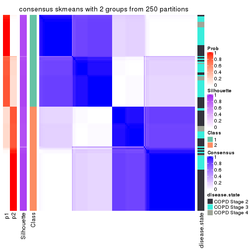</p>

</div>
<div id='tab-MAD-skmeans-consensus-heatmap-2'>
<pre><code class="r">consensus_heatmap(res, k = 3)
</code></pre>

<p></p>

</div>
<div id='tab-MAD-skmeans-consensus-heatmap-3'>
<pre><code class="r">consensus_heatmap(res, k = 4)
</code></pre>

<p></p>

</div>
<div id='tab-MAD-skmeans-consensus-heatmap-4'>
<pre><code class="r">consensus_heatmap(res, k = 5)
</code></pre>

<p></p>

</div>
<div id='tab-MAD-skmeans-consensus-heatmap-5'>
<pre><code class="r">consensus_heatmap(res, k = 6)
</code></pre>

<p></p>

</div>
</div>

Heatmaps for the membership of samples in all partitions to see how consistent they are:


<script>
$( function() {
	$( '#tabs-MAD-skmeans-membership-heatmap' ).tabs();
} );
</script>
<div id='tabs-MAD-skmeans-membership-heatmap'>
<ul>
<li><a href='#tab-MAD-skmeans-membership-heatmap-1'>k = 2</a></li>
<li><a href='#tab-MAD-skmeans-membership-heatmap-2'>k = 3</a></li>
<li><a href='#tab-MAD-skmeans-membership-heatmap-3'>k = 4</a></li>
<li><a href='#tab-MAD-skmeans-membership-heatmap-4'>k = 5</a></li>
<li><a href='#tab-MAD-skmeans-membership-heatmap-5'>k = 6</a></li>
</ul>
<div id='tab-MAD-skmeans-membership-heatmap-1'>
<pre><code class="r">membership_heatmap(res, k = 2)
</code></pre>

<p></p>

</div>
<div id='tab-MAD-skmeans-membership-heatmap-2'>
<pre><code class="r">membership_heatmap(res, k = 3)
</code></pre>

<p></p>

</div>
<div id='tab-MAD-skmeans-membership-heatmap-3'>
<pre><code class="r">membership_heatmap(res, k = 4)
</code></pre>

<p></p>

</div>
<div id='tab-MAD-skmeans-membership-heatmap-4'>
<pre><code class="r">membership_heatmap(res, k = 5)
</code></pre>

<p></p>

</div>
<div id='tab-MAD-skmeans-membership-heatmap-5'>
<pre><code class="r">membership_heatmap(res, k = 6)
</code></pre>

<p></p>

</div>
</div>

As soon as we have had the classes for columns, we can look for signatures
which are significantly different between classes which can be candidate marks
for certain classes. Following are the heatmaps for signatures.


Signature heatmaps where rows are scaled:


<script>
$( function() {
	$( '#tabs-MAD-skmeans-get-signatures' ).tabs();
} );
</script>
<div id='tabs-MAD-skmeans-get-signatures'>
<ul>
<li><a href='#tab-MAD-skmeans-get-signatures-1'>k = 2</a></li>
<li><a href='#tab-MAD-skmeans-get-signatures-2'>k = 3</a></li>
<li><a href='#tab-MAD-skmeans-get-signatures-3'>k = 4</a></li>
<li><a href='#tab-MAD-skmeans-get-signatures-4'>k = 5</a></li>
<li><a href='#tab-MAD-skmeans-get-signatures-5'>k = 6</a></li>
</ul>
<div id='tab-MAD-skmeans-get-signatures-1'>
<pre><code class="r">get_signatures(res, k = 2)
</code></pre>

<p></p>

</div>
<div id='tab-MAD-skmeans-get-signatures-2'>
<pre><code class="r">get_signatures(res, k = 3)
</code></pre>

<p></p>

</div>
<div id='tab-MAD-skmeans-get-signatures-3'>
<pre><code class="r">get_signatures(res, k = 4)
</code></pre>

<p></p>

</div>
<div id='tab-MAD-skmeans-get-signatures-4'>
<pre><code class="r">get_signatures(res, k = 5)
</code></pre>

<p></p>

</div>
<div id='tab-MAD-skmeans-get-signatures-5'>
<pre><code class="r">get_signatures(res, k = 6)
</code></pre>

<p></p>

</div>
</div>


Signature heatmaps where rows are not scaled:


<script>
$( function() {
	$( '#tabs-MAD-skmeans-get-signatures-no-scale' ).tabs();
} );
</script>
<div id='tabs-MAD-skmeans-get-signatures-no-scale'>
<ul>
<li><a href='#tab-MAD-skmeans-get-signatures-no-scale-1'>k = 2</a></li>
<li><a href='#tab-MAD-skmeans-get-signatures-no-scale-2'>k = 3</a></li>
<li><a href='#tab-MAD-skmeans-get-signatures-no-scale-3'>k = 4</a></li>
<li><a href='#tab-MAD-skmeans-get-signatures-no-scale-4'>k = 5</a></li>
<li><a href='#tab-MAD-skmeans-get-signatures-no-scale-5'>k = 6</a></li>
</ul>
<div id='tab-MAD-skmeans-get-signatures-no-scale-1'>
<pre><code class="r">get_signatures(res, k = 2, scale_rows = FALSE)
</code></pre>

<p></p>

</div>
<div id='tab-MAD-skmeans-get-signatures-no-scale-2'>
<pre><code class="r">get_signatures(res, k = 3, scale_rows = FALSE)
</code></pre>

<p></p>

</div>
<div id='tab-MAD-skmeans-get-signatures-no-scale-3'>
<pre><code class="r">get_signatures(res, k = 4, scale_rows = FALSE)
</code></pre>

<p></p>

</div>
<div id='tab-MAD-skmeans-get-signatures-no-scale-4'>
<pre><code class="r">get_signatures(res, k = 5, scale_rows = FALSE)
</code></pre>

<p></p>

</div>
<div id='tab-MAD-skmeans-get-signatures-no-scale-5'>
<pre><code class="r">get_signatures(res, k = 6, scale_rows = FALSE)
</code></pre>

<p></p>

</div>
</div>


Compare the overlap of signatures from different k:

```r
compare_signatures(res)
```


`get_signature()` returns a data frame invisibly. TO get the list of signatures, the function
call should be assigned to a variable explicitly. In following code, if `plot` argument is set
to `FALSE`, no heatmap is plotted while only the differential analysis is performed.

```r
# code only for demonstration
tb = get_signature(res, k = ..., plot = FALSE)
```

An example of the output of `tb` is:

```
#>   which_row         fdr    mean_1    mean_2 scaled_mean_1 scaled_mean_2 km
#> 1        38 0.042760348  8.373488  9.131774    -0.5533452     0.5164555  1
#> 2        40 0.018707592  7.106213  8.469186    -0.6173731     0.5762149  1
#> 3        55 0.019134737 10.221463 11.207825    -0.6159697     0.5749050  1
#> 4        59 0.006059896  5.921854  7.869574    -0.6899429     0.6439467  1
#> 5        60 0.018055526  8.928898 10.211722    -0.6204761     0.5791110  1
#> 6        98 0.009384629 15.714769 14.887706     0.6635654    -0.6193277  2
...
```

The columns in `tb` are:

1. `which_row`: row indices corresponding to the input matrix.
2. `fdr`: FDR for the differential test. 
3. `mean_x`: The mean value in group x.
4. `scaled_mean_x`: The mean value in group x after rows are scaled.
5. `km`: Row groups if k-means clustering is applied to rows.


UMAP plot which shows how samples are separated.


<script>
$( function() {
	$( '#tabs-MAD-skmeans-dimension-reduction' ).tabs();
} );
</script>
<div id='tabs-MAD-skmeans-dimension-reduction'>
<ul>
<li><a href='#tab-MAD-skmeans-dimension-reduction-1'>k = 2</a></li>
<li><a href='#tab-MAD-skmeans-dimension-reduction-2'>k = 3</a></li>
<li><a href='#tab-MAD-skmeans-dimension-reduction-3'>k = 4</a></li>
<li><a href='#tab-MAD-skmeans-dimension-reduction-4'>k = 5</a></li>
<li><a href='#tab-MAD-skmeans-dimension-reduction-5'>k = 6</a></li>
</ul>
<div id='tab-MAD-skmeans-dimension-reduction-1'>
<pre><code class="r">dimension_reduction(res, k = 2, method = &quot;UMAP&quot;)
</code></pre>

<p></p>

</div>
<div id='tab-MAD-skmeans-dimension-reduction-2'>
<pre><code class="r">dimension_reduction(res, k = 3, method = &quot;UMAP&quot;)
</code></pre>

<p></p>

</div>
<div id='tab-MAD-skmeans-dimension-reduction-3'>
<pre><code class="r">dimension_reduction(res, k = 4, method = &quot;UMAP&quot;)
</code></pre>

<p></p>

</div>
<div id='tab-MAD-skmeans-dimension-reduction-4'>
<pre><code class="r">dimension_reduction(res, k = 5, method = &quot;UMAP&quot;)
</code></pre>

<p></p>

</div>
<div id='tab-MAD-skmeans-dimension-reduction-5'>
<pre><code class="r">dimension_reduction(res, k = 6, method = &quot;UMAP&quot;)
</code></pre>

<p>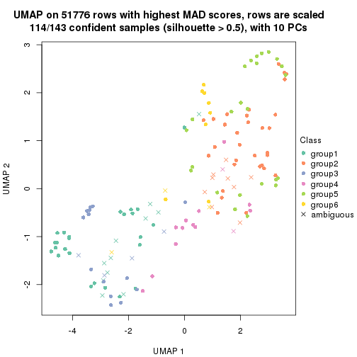</p>

</div>
</div>


Following heatmap shows how subgroups are split when increasing `k`:

```r
collect_classes(res)
```


Test correlation between subgroups and known annotations. If the known
annotation is numeric, one-way ANOVA test is applied, and if the known
annotation is discrete, chi-squared contingency table test is applied.

```r
test_to_known_factors(res)
```

```
#>               n disease.state(p) k
#> MAD:skmeans 143         4.87e-05 2
#> MAD:skmeans 129         1.18e-04 3
#> MAD:skmeans 135         6.00e-06 4
#> MAD:skmeans 114         2.04e-05 5
#> MAD:skmeans 114         1.08e-04 6
```


If matrix rows can be associated to genes, consider to use `GO_Enrichment(res,
...)` to perform function enrichment for the signature genes.


 

---------------------------------------------------


### MAD:pam


The object with results only for a single top-value method and a single partition method 
can be extracted as:

```r
res = res_list["MAD", "pam"]
# you can also extract it by
# res = res_list["MAD:pam"]
```

A summary of `res` and all the functions that can be applied to it:

```r
res
```

```
#> A 'ConsensusPartition' object with k = 2, 3, 4, 5, 6.
#>   On a matrix with 51776 rows and 143 columns.
#>   Top rows (1000, 2000, 3000, 4000, 5000) are extracted by 'MAD' method.
#>   Subgroups are detected by 'pam' method.
#>   Performed in total 1250 partitions by row resampling.
#>   Best k for subgroups seems to be 2.
#> 
#> Following methods can be applied to this 'ConsensusPartition' object:
#>  [1] "cola_report"             "collect_classes"         "collect_plots"          
#>  [4] "collect_stats"           "colnames"                "compare_signatures"     
#>  [7] "consensus_heatmap"       "dimension_reduction"     "functional_enrichment"  
#> [10] "get_anno_col"            "get_anno"                "get_classes"            
#> [13] "get_consensus"           "get_matrix"              "get_membership"         
#> [16] "get_param"               "get_signatures"          "get_stats"              
#> [19] "is_best_k"               "is_stable_k"             "membership_heatmap"     
#> [22] "ncol"                    "nrow"                    "plot_ecdf"              
#> [25] "rownames"                "select_partition_number" "show"                   
#> [28] "suggest_best_k"          "test_to_known_factors"
```

`collect_plots()` function collects all the plots made from `res` for all `k` (number of partitions)
into one single page to provide an easy and fast comparison between different `k`.

```r
collect_plots(res)
```


The plots are:

- The first row: a plot of the ECDF (Empirical cumulative distribution
  function) curves of the consensus matrix for each `k` and the heatmap of
  predicted classes for each `k`.
- The second row: heatmaps of the consensus matrix for each `k`.
- The third row: heatmaps of the membership matrix for each `k`.
- The fouth row: heatmaps of the signatures for each `k`.

All the plots in panels can be made by individual functions and they are
plotted later in this section.

`select_partition_number()` produces several plots showing different
statistics for choosing "optimized" `k`. There are following statistics:

- ECDF curves of the consensus matrix for each `k`;
- 1-PAC. [The PAC
  score](https://en.wikipedia.org/wiki/Consensus_clustering#Over-interpretation_potential_of_consensus_clustering)
  measures the proportion of the ambiguous subgrouping.
- Mean silhouette score.
- Concordance. The mean probability of fiting the consensus class ids in all
  partitions.
- Area increased. Denote $A_k$ as the area under the ECDF curve for current
  `k`, the area increased is defined as $A_k - A_{k-1}$.
- Rand index. The percent of pairs of samples that are both in a same cluster
  or both are not in a same cluster in the partition of k and k-1.
- Jaccard index. The ratio of pairs of samples are both in a same cluster in
  the partition of k and k-1 and the pairs of samples are both in a same
  cluster in the partition k or k-1.

The detailed explanations of these statistics can be found in [the cola
vignette](http://bioconductor.org/packages/devel/bioc/vignettes/cola/inst/doc/cola.html#toc_13).

Generally speaking, lower PAC score, higher mean silhouette score or higher
concordance corresponds to better partition. Rand index and Jaccard index
measure how similar the current partition is compared to partition with `k-1`.
If they are too similar, we won't accept `k` is better than `k-1`.

```r
select_partition_number(res)
```


The numeric values for all these statistics can be obtained by `get_stats()`.

```r
get_stats(res)
```

```
#>   k 1-PAC mean_silhouette concordance area_increased  Rand Jaccard
#> 2 2 0.494           0.811       0.913         0.4634 0.527   0.527
#> 3 3 0.518           0.738       0.864         0.4007 0.675   0.455
#> 4 4 0.626           0.734       0.863         0.1437 0.809   0.514
#> 5 5 0.625           0.505       0.717         0.0432 0.886   0.607
#> 6 6 0.700           0.739       0.846         0.0399 0.895   0.589
```

`suggest_best_k()` suggests the best $k$ based on these statistics. The rules are as follows:

- All $k$ with Jaccard index larger than 0.95 are removed because the increase of
  the partition number does not provides enough extra information. If all $k$ are removed,
  the best $k$ is assigned by `NA`.
- For $k$ with 1-PAC larger than 0.9, the maximal $k$ is taken as the "best k". Other $k$ is called "optional k".
- If it does not fit the second rule. The $k$ with the highest vote of highest
  1-PAC, mean silhouette and concordance is taken as the "best k".

```r
suggest_best_k(res)
```

```
#> [1] 2
```


Following shows the table of the partitions (You need to click the **show/hide
code output** link to see it). The membership matrix (columns with name `p*`)
is inferred by
[`clue::cl_consensus()`](https://www.rdocumentation.org/link/cl_consensus?package=clue)
function with the `SE` method. Basically the value in the membership matrix
represents the probability to belong to a certain group. The finall class
label for an item is determined with the group with highest probability it
belongs to.

In `get_classes()` function, the entropy is calculated from the membership
matrix and the silhouette score is calculated from the consensus matrix.


<script>
$( function() {
	$( '#tabs-MAD-pam-get-classes' ).tabs();
} );
</script>
<div id='tabs-MAD-pam-get-classes'>
<ul>
<li><a href='#tab-MAD-pam-get-classes-1'>k = 2</a></li>
<li><a href='#tab-MAD-pam-get-classes-2'>k = 3</a></li>
<li><a href='#tab-MAD-pam-get-classes-3'>k = 4</a></li>
<li><a href='#tab-MAD-pam-get-classes-4'>k = 5</a></li>
<li><a href='#tab-MAD-pam-get-classes-5'>k = 6</a></li>
</ul>

<div id='tab-MAD-pam-get-classes-1'>
<p><a id='tab-MAD-pam-get-classes-1-a' style='color:#0366d6' href='#'>show/hide code output</a></p>
<pre><code class="r">cbind(get_classes(res, k = 2), get_membership(res, k = 2))
</code></pre>

<pre><code>#&gt;           class entropy silhouette    p1    p2
#&gt; GSM550785     1  0.0000      0.877 1.000 0.000
#&gt; GSM550786     2  0.9909      0.192 0.444 0.556
#&gt; GSM550788     2  0.0000      0.908 0.000 1.000
#&gt; GSM550789     2  0.0000      0.908 0.000 1.000
#&gt; GSM550790     1  0.0000      0.877 1.000 0.000
#&gt; GSM550791     1  0.9944      0.202 0.544 0.456
#&gt; GSM550792     2  0.6887      0.757 0.184 0.816
#&gt; GSM550796     2  0.0000      0.908 0.000 1.000
#&gt; GSM550797     2  0.0000      0.908 0.000 1.000
#&gt; GSM550799     2  0.0000      0.908 0.000 1.000
#&gt; GSM550800     2  0.0000      0.908 0.000 1.000
#&gt; GSM550801     2  0.0000      0.908 0.000 1.000
#&gt; GSM550804     2  0.0000      0.908 0.000 1.000
#&gt; GSM550806     2  0.7376      0.728 0.208 0.792
#&gt; GSM550807     2  0.0000      0.908 0.000 1.000
#&gt; GSM550808     2  0.0000      0.908 0.000 1.000
#&gt; GSM550809     1  0.6148      0.834 0.848 0.152
#&gt; GSM550810     2  0.0000      0.908 0.000 1.000
#&gt; GSM550811     2  0.9933      0.161 0.452 0.548
#&gt; GSM550813     2  0.0000      0.908 0.000 1.000
#&gt; GSM550814     2  0.0000      0.908 0.000 1.000
#&gt; GSM550815     2  0.0000      0.908 0.000 1.000
#&gt; GSM550816     2  0.0000      0.908 0.000 1.000
#&gt; GSM550817     2  0.0000      0.908 0.000 1.000
#&gt; GSM550818     2  0.0000      0.908 0.000 1.000
#&gt; GSM550819     2  0.0000      0.908 0.000 1.000
#&gt; GSM550820     1  0.5178      0.851 0.884 0.116
#&gt; GSM550821     2  0.0000      0.908 0.000 1.000
#&gt; GSM550822     2  0.0000      0.908 0.000 1.000
#&gt; GSM550826     1  0.6247      0.830 0.844 0.156
#&gt; GSM550832     2  0.0000      0.908 0.000 1.000
#&gt; GSM550833     2  0.0000      0.908 0.000 1.000
#&gt; GSM550835     2  0.0000      0.908 0.000 1.000
#&gt; GSM550836     1  0.5946      0.840 0.856 0.144
#&gt; GSM550837     2  0.0000      0.908 0.000 1.000
#&gt; GSM550838     1  0.5946      0.840 0.856 0.144
#&gt; GSM550841     2  0.0000      0.908 0.000 1.000
#&gt; GSM550842     2  0.0000      0.908 0.000 1.000
#&gt; GSM550846     2  0.0938      0.901 0.012 0.988
#&gt; GSM550849     2  0.9909      0.192 0.444 0.556
#&gt; GSM550850     1  0.0000      0.877 1.000 0.000
#&gt; GSM550851     2  0.0000      0.908 0.000 1.000
#&gt; GSM550852     2  0.0000      0.908 0.000 1.000
#&gt; GSM550853     2  0.0000      0.908 0.000 1.000
#&gt; GSM550855     2  0.0000      0.908 0.000 1.000
#&gt; GSM550856     2  0.0000      0.908 0.000 1.000
#&gt; GSM550861     2  0.0000      0.908 0.000 1.000
#&gt; GSM550863     2  0.9491      0.506 0.368 0.632
#&gt; GSM550864     2  0.0000      0.908 0.000 1.000
#&gt; GSM550866     2  0.0000      0.908 0.000 1.000
#&gt; GSM550867     1  0.0000      0.877 1.000 0.000
#&gt; GSM550885     1  0.0000      0.877 1.000 0.000
#&gt; GSM550886     2  0.0000      0.908 0.000 1.000
#&gt; GSM550887     2  0.0000      0.908 0.000 1.000
#&gt; GSM550889     1  0.8555      0.584 0.720 0.280
#&gt; GSM550894     2  0.0000      0.908 0.000 1.000
#&gt; GSM550897     1  0.0000      0.877 1.000 0.000
#&gt; GSM550903     2  0.0000      0.908 0.000 1.000
#&gt; GSM550905     2  0.0000      0.908 0.000 1.000
#&gt; GSM550906     2  0.0000      0.908 0.000 1.000
#&gt; GSM550907     2  0.7453      0.728 0.212 0.788
#&gt; GSM550909     2  0.0000      0.908 0.000 1.000
#&gt; GSM550911     2  0.0000      0.908 0.000 1.000
#&gt; GSM550913     2  0.0000      0.908 0.000 1.000
#&gt; GSM550915     2  0.7376      0.728 0.208 0.792
#&gt; GSM550917     2  0.0000      0.908 0.000 1.000
#&gt; GSM550919     2  0.8016      0.679 0.244 0.756
#&gt; GSM550921     1  0.5946      0.840 0.856 0.144
#&gt; GSM550924     2  0.7376      0.728 0.208 0.792
#&gt; GSM550926     2  0.0000      0.908 0.000 1.000
#&gt; GSM550927     2  0.0000      0.908 0.000 1.000
#&gt; GSM550787     1  0.8555      0.667 0.720 0.280
#&gt; GSM550793     1  0.6148      0.834 0.848 0.152
#&gt; GSM550794     2  0.7376      0.728 0.208 0.792
#&gt; GSM550795     1  0.2603      0.863 0.956 0.044
#&gt; GSM550798     1  0.0000      0.877 1.000 0.000
#&gt; GSM550803     1  0.0000      0.877 1.000 0.000
#&gt; GSM550805     1  0.5946      0.840 0.856 0.144
#&gt; GSM550823     2  0.8861      0.575 0.304 0.696
#&gt; GSM550824     1  0.0000      0.877 1.000 0.000
#&gt; GSM550825     1  0.0000      0.877 1.000 0.000
#&gt; GSM550827     2  0.7602      0.714 0.220 0.780
#&gt; GSM550828     1  0.0000      0.877 1.000 0.000
#&gt; GSM550829     1  0.1414      0.875 0.980 0.020
#&gt; GSM550830     1  0.8016      0.678 0.756 0.244
#&gt; GSM550834     1  0.0000      0.877 1.000 0.000
#&gt; GSM550839     2  0.0000      0.908 0.000 1.000
#&gt; GSM550840     1  0.0000      0.877 1.000 0.000
#&gt; GSM550843     2  0.6531      0.774 0.168 0.832
#&gt; GSM550844     1  0.0000      0.877 1.000 0.000
#&gt; GSM550845     2  0.0000      0.908 0.000 1.000
#&gt; GSM550848     2  0.7376      0.728 0.208 0.792
#&gt; GSM550854     1  0.0000      0.877 1.000 0.000
#&gt; GSM550857     1  0.1414      0.875 0.980 0.020
#&gt; GSM550858     1  0.0000      0.877 1.000 0.000
#&gt; GSM550859     1  0.0000      0.877 1.000 0.000
#&gt; GSM550862     1  0.0000      0.877 1.000 0.000
#&gt; GSM550865     2  0.9358      0.539 0.352 0.648
#&gt; GSM550868     2  0.9996      0.155 0.488 0.512
#&gt; GSM550869     1  0.9732      0.404 0.596 0.404
#&gt; GSM550870     2  0.0000      0.908 0.000 1.000
#&gt; GSM550871     2  0.5946      0.797 0.144 0.856
#&gt; GSM550872     1  0.9998     -0.102 0.508 0.492
#&gt; GSM550873     2  0.0000      0.908 0.000 1.000
#&gt; GSM550874     2  0.0000      0.908 0.000 1.000
#&gt; GSM550876     2  0.0000      0.908 0.000 1.000
#&gt; GSM550877     2  0.0000      0.908 0.000 1.000
#&gt; GSM550878     2  0.7299      0.733 0.204 0.796
#&gt; GSM550879     1  0.0000      0.877 1.000 0.000
#&gt; GSM550882     1  0.5946      0.840 0.856 0.144
#&gt; GSM550888     1  0.5842      0.842 0.860 0.140
#&gt; GSM550890     2  0.7056      0.750 0.192 0.808
#&gt; GSM550891     1  0.9460      0.507 0.636 0.364
#&gt; GSM550892     1  0.0000      0.877 1.000 0.000
#&gt; GSM550893     2  0.0000      0.908 0.000 1.000
#&gt; GSM550895     2  0.5946      0.768 0.144 0.856
#&gt; GSM550896     2  0.0000      0.908 0.000 1.000
#&gt; GSM550898     1  0.0000      0.877 1.000 0.000
#&gt; GSM550899     2  0.0000      0.908 0.000 1.000
#&gt; GSM550900     2  0.9933      0.284 0.452 0.548
#&gt; GSM550901     1  0.5946      0.840 0.856 0.144
#&gt; GSM550902     1  0.5946      0.840 0.856 0.144
#&gt; GSM550904     1  0.5946      0.840 0.856 0.144
#&gt; GSM550908     1  0.5946      0.840 0.856 0.144
#&gt; GSM550912     2  0.0000      0.908 0.000 1.000
#&gt; GSM550914     2  0.2778      0.870 0.048 0.952
#&gt; GSM550918     2  0.0000      0.908 0.000 1.000
#&gt; GSM550922     2  0.0000      0.908 0.000 1.000
#&gt; GSM550923     1  0.0000      0.877 1.000 0.000
#&gt; GSM550925     1  0.5519      0.799 0.872 0.128
#&gt; GSM550802     2  0.0000      0.908 0.000 1.000
#&gt; GSM550812     2  0.0000      0.908 0.000 1.000
#&gt; GSM550831     1  0.0000      0.877 1.000 0.000
#&gt; GSM550847     1  0.0000      0.877 1.000 0.000
#&gt; GSM550860     1  0.9686      0.426 0.604 0.396
#&gt; GSM550875     1  0.5946      0.840 0.856 0.144
#&gt; GSM550880     2  0.9393      0.532 0.356 0.644
#&gt; GSM550881     1  0.6148      0.834 0.848 0.152
#&gt; GSM550883     1  0.5946      0.840 0.856 0.144
#&gt; GSM550884     2  0.7376      0.728 0.208 0.792
#&gt; GSM550910     2  0.3114      0.871 0.056 0.944
#&gt; GSM550916     1  0.0000      0.877 1.000 0.000
#&gt; GSM550920     2  0.7139      0.745 0.196 0.804
</code></pre>

<script>
$('#tab-MAD-pam-get-classes-1-a').parent().next().next().hide();
$('#tab-MAD-pam-get-classes-1-a').click(function(){
  $('#tab-MAD-pam-get-classes-1-a').parent().next().next().toggle();
  return(false);
});
</script>
</div>

<div id='tab-MAD-pam-get-classes-2'>
<p><a id='tab-MAD-pam-get-classes-2-a' style='color:#0366d6' href='#'>show/hide code output</a></p>
<pre><code class="r">cbind(get_classes(res, k = 3), get_membership(res, k = 3))
</code></pre>

<pre><code>#&gt;           class entropy silhouette    p1    p2    p3
#&gt; GSM550785     1  0.0000     0.8351 1.000 0.000 0.000
#&gt; GSM550786     3  0.4514     0.7361 0.156 0.012 0.832
#&gt; GSM550788     2  0.0000     0.8773 0.000 1.000 0.000
#&gt; GSM550789     2  0.3941     0.7718 0.000 0.844 0.156
#&gt; GSM550790     1  0.0000     0.8351 1.000 0.000 0.000
#&gt; GSM550791     1  0.3528     0.8110 0.892 0.092 0.016
#&gt; GSM550792     2  0.7764     0.2848 0.328 0.604 0.068
#&gt; GSM550796     2  0.3941     0.7718 0.000 0.844 0.156
#&gt; GSM550797     2  0.3941     0.7718 0.000 0.844 0.156
#&gt; GSM550799     3  0.0892     0.7807 0.000 0.020 0.980
#&gt; GSM550800     2  0.0000     0.8773 0.000 1.000 0.000
#&gt; GSM550801     2  0.3941     0.7718 0.000 0.844 0.156
#&gt; GSM550804     2  0.0892     0.8730 0.000 0.980 0.020
#&gt; GSM550806     3  0.3941     0.7913 0.000 0.156 0.844
#&gt; GSM550807     2  0.0000     0.8773 0.000 1.000 0.000
#&gt; GSM550808     2  0.5706     0.5195 0.000 0.680 0.320
#&gt; GSM550809     1  0.3183     0.8165 0.908 0.076 0.016
#&gt; GSM550810     2  0.3941     0.7718 0.000 0.844 0.156
#&gt; GSM550811     1  0.5426     0.7782 0.820 0.088 0.092
#&gt; GSM550813     2  0.0892     0.8730 0.000 0.980 0.020
#&gt; GSM550814     2  0.0892     0.8730 0.000 0.980 0.020
#&gt; GSM550815     2  0.3941     0.7718 0.000 0.844 0.156
#&gt; GSM550816     2  0.4346     0.7687 0.000 0.816 0.184
#&gt; GSM550817     3  0.0892     0.7807 0.000 0.020 0.980
#&gt; GSM550818     3  0.0000     0.7843 0.000 0.000 1.000
#&gt; GSM550819     3  0.5848     0.6908 0.012 0.268 0.720
#&gt; GSM550820     1  0.2356     0.8206 0.928 0.072 0.000
#&gt; GSM550821     3  0.2448     0.7689 0.000 0.076 0.924
#&gt; GSM550822     2  0.3941     0.7718 0.000 0.844 0.156
#&gt; GSM550826     1  0.4937     0.7546 0.824 0.028 0.148
#&gt; GSM550832     2  0.0892     0.8730 0.000 0.980 0.020
#&gt; GSM550833     2  0.3941     0.7718 0.000 0.844 0.156
#&gt; GSM550835     3  0.5178     0.5887 0.000 0.256 0.744
#&gt; GSM550836     3  0.4399     0.7059 0.188 0.000 0.812
#&gt; GSM550837     3  0.6225     0.1905 0.000 0.432 0.568
#&gt; GSM550838     1  0.4326     0.7612 0.844 0.012 0.144
#&gt; GSM550841     3  0.0592     0.7826 0.000 0.012 0.988
#&gt; GSM550842     3  0.6302     0.0267 0.000 0.480 0.520
#&gt; GSM550846     2  0.7652    -0.1088 0.044 0.512 0.444
#&gt; GSM550849     1  0.4934     0.7710 0.820 0.156 0.024
#&gt; GSM550850     1  0.0000     0.8351 1.000 0.000 0.000
#&gt; GSM550851     3  0.5138     0.5887 0.000 0.252 0.748
#&gt; GSM550852     2  0.0892     0.8730 0.000 0.980 0.020
#&gt; GSM550853     2  0.0000     0.8773 0.000 1.000 0.000
#&gt; GSM550855     2  0.0000     0.8773 0.000 1.000 0.000
#&gt; GSM550856     2  0.0000     0.8773 0.000 1.000 0.000
#&gt; GSM550861     2  0.0000     0.8773 0.000 1.000 0.000
#&gt; GSM550863     1  0.7268     0.2298 0.524 0.448 0.028
#&gt; GSM550864     2  0.0424     0.8760 0.000 0.992 0.008
#&gt; GSM550866     2  0.0000     0.8773 0.000 1.000 0.000
#&gt; GSM550867     1  0.0000     0.8351 1.000 0.000 0.000
#&gt; GSM550885     1  0.0000     0.8351 1.000 0.000 0.000
#&gt; GSM550886     3  0.3941     0.7913 0.000 0.156 0.844
#&gt; GSM550887     2  0.3941     0.7718 0.000 0.844 0.156
#&gt; GSM550889     1  0.6062     0.4715 0.616 0.384 0.000
#&gt; GSM550894     2  0.0237     0.8767 0.000 0.996 0.004
#&gt; GSM550897     1  0.0892     0.8328 0.980 0.020 0.000
#&gt; GSM550903     2  0.1964     0.8470 0.000 0.944 0.056
#&gt; GSM550905     3  0.5760     0.4783 0.000 0.328 0.672
#&gt; GSM550906     2  0.0000     0.8773 0.000 1.000 0.000
#&gt; GSM550907     3  0.0000     0.7843 0.000 0.000 1.000
#&gt; GSM550909     3  0.2959     0.7579 0.000 0.100 0.900
#&gt; GSM550911     3  0.0892     0.7807 0.000 0.020 0.980
#&gt; GSM550913     2  0.0000     0.8773 0.000 1.000 0.000
#&gt; GSM550915     1  0.7063     0.3079 0.516 0.464 0.020
#&gt; GSM550917     2  0.0892     0.8730 0.000 0.980 0.020
#&gt; GSM550919     1  0.6869     0.4190 0.560 0.424 0.016
#&gt; GSM550921     3  0.4235     0.7178 0.176 0.000 0.824
#&gt; GSM550924     3  0.8390     0.4753 0.100 0.340 0.560
#&gt; GSM550926     2  0.0892     0.8730 0.000 0.980 0.020
#&gt; GSM550927     2  0.0000     0.8773 0.000 1.000 0.000
#&gt; GSM550787     1  0.5913     0.7610 0.788 0.144 0.068
#&gt; GSM550793     1  0.5010     0.7827 0.840 0.076 0.084
#&gt; GSM550794     2  0.9528     0.1407 0.272 0.488 0.240
#&gt; GSM550795     1  0.0000     0.8351 1.000 0.000 0.000
#&gt; GSM550798     1  0.0000     0.8351 1.000 0.000 0.000
#&gt; GSM550803     1  0.0000     0.8351 1.000 0.000 0.000
#&gt; GSM550805     1  0.3272     0.8102 0.892 0.104 0.004
#&gt; GSM550823     1  0.7462     0.5182 0.600 0.352 0.048
#&gt; GSM550824     1  0.0000     0.8351 1.000 0.000 0.000
#&gt; GSM550825     1  0.4002     0.7520 0.840 0.000 0.160
#&gt; GSM550827     1  0.6881     0.4682 0.592 0.388 0.020
#&gt; GSM550828     1  0.0000     0.8351 1.000 0.000 0.000
#&gt; GSM550829     1  0.3752     0.7636 0.856 0.000 0.144
#&gt; GSM550830     1  0.5138     0.6951 0.748 0.252 0.000
#&gt; GSM550834     1  0.0424     0.8347 0.992 0.008 0.000
#&gt; GSM550839     3  0.4121     0.7878 0.000 0.168 0.832
#&gt; GSM550840     1  0.0000     0.8351 1.000 0.000 0.000
#&gt; GSM550843     3  0.3941     0.7913 0.000 0.156 0.844
#&gt; GSM550844     1  0.0000     0.8351 1.000 0.000 0.000
#&gt; GSM550845     2  0.1129     0.8715 0.004 0.976 0.020
#&gt; GSM550848     2  0.5899     0.5652 0.244 0.736 0.020
#&gt; GSM550854     1  0.0000     0.8351 1.000 0.000 0.000
#&gt; GSM550857     1  0.4555     0.7128 0.800 0.000 0.200
#&gt; GSM550858     1  0.0000     0.8351 1.000 0.000 0.000
#&gt; GSM550859     1  0.0000     0.8351 1.000 0.000 0.000
#&gt; GSM550862     1  0.0000     0.8351 1.000 0.000 0.000
#&gt; GSM550865     1  0.6126     0.6319 0.712 0.268 0.020
#&gt; GSM550868     1  0.6255     0.5952 0.684 0.300 0.016
#&gt; GSM550869     1  0.9642     0.2732 0.440 0.344 0.216
#&gt; GSM550870     2  0.0892     0.8730 0.000 0.980 0.020
#&gt; GSM550871     3  0.4121     0.7878 0.000 0.168 0.832
#&gt; GSM550872     1  0.6501     0.5652 0.664 0.316 0.020
#&gt; GSM550873     2  0.3192     0.7899 0.000 0.888 0.112
#&gt; GSM550874     2  0.0000     0.8773 0.000 1.000 0.000
#&gt; GSM550876     3  0.4235     0.7799 0.000 0.176 0.824
#&gt; GSM550877     2  0.0000     0.8773 0.000 1.000 0.000
#&gt; GSM550878     3  0.3941     0.7913 0.000 0.156 0.844
#&gt; GSM550879     1  0.0000     0.8351 1.000 0.000 0.000
#&gt; GSM550882     3  0.4235     0.7178 0.176 0.000 0.824
#&gt; GSM550888     3  0.4291     0.7141 0.180 0.000 0.820
#&gt; GSM550890     2  0.5899     0.5763 0.244 0.736 0.020
#&gt; GSM550891     3  0.4802     0.7920 0.020 0.156 0.824
#&gt; GSM550892     1  0.0000     0.8351 1.000 0.000 0.000
#&gt; GSM550893     2  0.0000     0.8773 0.000 1.000 0.000
#&gt; GSM550895     2  0.2625     0.8064 0.084 0.916 0.000
#&gt; GSM550896     2  0.0000     0.8773 0.000 1.000 0.000
#&gt; GSM550898     1  0.0000     0.8351 1.000 0.000 0.000
#&gt; GSM550899     2  0.0892     0.8730 0.000 0.980 0.020
#&gt; GSM550900     1  0.6326     0.6015 0.688 0.292 0.020
#&gt; GSM550901     1  0.3116     0.8079 0.892 0.108 0.000
#&gt; GSM550902     1  0.4925     0.7857 0.844 0.076 0.080
#&gt; GSM550904     1  0.3461     0.8141 0.900 0.076 0.024
#&gt; GSM550908     3  0.4235     0.7178 0.176 0.000 0.824
#&gt; GSM550912     2  0.0892     0.8730 0.000 0.980 0.020
#&gt; GSM550914     2  0.2297     0.8528 0.036 0.944 0.020
#&gt; GSM550918     2  0.0892     0.8730 0.000 0.980 0.020
#&gt; GSM550922     3  0.0892     0.7807 0.000 0.020 0.980
#&gt; GSM550923     1  0.0000     0.8351 1.000 0.000 0.000
#&gt; GSM550925     1  0.3879     0.7722 0.848 0.152 0.000
#&gt; GSM550802     2  0.5024     0.6160 0.004 0.776 0.220
#&gt; GSM550812     3  0.5291     0.6834 0.000 0.268 0.732
#&gt; GSM550831     1  0.0000     0.8351 1.000 0.000 0.000
#&gt; GSM550847     1  0.0000     0.8351 1.000 0.000 0.000
#&gt; GSM550860     3  0.5200     0.7830 0.020 0.184 0.796
#&gt; GSM550875     1  0.2945     0.8166 0.908 0.088 0.004
#&gt; GSM550880     1  0.6881     0.4206 0.592 0.388 0.020
#&gt; GSM550881     1  0.6079     0.3808 0.612 0.000 0.388
#&gt; GSM550883     1  0.4399     0.7252 0.812 0.000 0.188
#&gt; GSM550884     3  0.5905     0.5547 0.000 0.352 0.648
#&gt; GSM550910     3  0.4002     0.7920 0.000 0.160 0.840
#&gt; GSM550916     1  0.0000     0.8351 1.000 0.000 0.000
#&gt; GSM550920     3  0.3941     0.7913 0.000 0.156 0.844
</code></pre>

<script>
$('#tab-MAD-pam-get-classes-2-a').parent().next().next().hide();
$('#tab-MAD-pam-get-classes-2-a').click(function(){
  $('#tab-MAD-pam-get-classes-2-a').parent().next().next().toggle();
  return(false);
});
</script>
</div>

<div id='tab-MAD-pam-get-classes-3'>
<p><a id='tab-MAD-pam-get-classes-3-a' style='color:#0366d6' href='#'>show/hide code output</a></p>
<pre><code class="r">cbind(get_classes(res, k = 4), get_membership(res, k = 4))
</code></pre>

<pre><code>#&gt;           class entropy silhouette    p1    p2    p3    p4
#&gt; GSM550785     1  0.0000     0.8777 1.000 0.000 0.000 0.000
#&gt; GSM550786     3  0.3257     0.7915 0.004 0.000 0.844 0.152
#&gt; GSM550788     2  0.3400     0.6724 0.000 0.820 0.000 0.180
#&gt; GSM550789     2  0.0000     0.8301 0.000 1.000 0.000 0.000
#&gt; GSM550790     1  0.0000     0.8777 1.000 0.000 0.000 0.000
#&gt; GSM550791     1  0.4605     0.6236 0.664 0.000 0.000 0.336
#&gt; GSM550792     4  0.4300     0.6688 0.020 0.112 0.036 0.832
#&gt; GSM550796     2  0.0000     0.8301 0.000 1.000 0.000 0.000
#&gt; GSM550797     2  0.0000     0.8301 0.000 1.000 0.000 0.000
#&gt; GSM550799     3  0.0188     0.8604 0.000 0.004 0.996 0.000
#&gt; GSM550800     2  0.2589     0.7502 0.000 0.884 0.000 0.116
#&gt; GSM550801     2  0.0000     0.8301 0.000 1.000 0.000 0.000
#&gt; GSM550804     4  0.3726     0.6180 0.000 0.212 0.000 0.788
#&gt; GSM550806     3  0.0188     0.8606 0.000 0.000 0.996 0.004
#&gt; GSM550807     2  0.0188     0.8297 0.000 0.996 0.000 0.004
#&gt; GSM550808     2  0.3569     0.6848 0.000 0.804 0.000 0.196
#&gt; GSM550809     1  0.3649     0.7796 0.796 0.000 0.000 0.204
#&gt; GSM550810     2  0.3726     0.6697 0.000 0.788 0.000 0.212
#&gt; GSM550811     1  0.4624     0.6175 0.660 0.000 0.000 0.340
#&gt; GSM550813     4  0.2469     0.7156 0.000 0.108 0.000 0.892
#&gt; GSM550814     2  0.4855     0.4633 0.000 0.600 0.000 0.400
#&gt; GSM550815     2  0.0000     0.8301 0.000 1.000 0.000 0.000
#&gt; GSM550816     2  0.4624     0.5106 0.000 0.660 0.000 0.340
#&gt; GSM550817     3  0.0188     0.8604 0.000 0.004 0.996 0.000
#&gt; GSM550818     3  0.0188     0.8604 0.000 0.004 0.996 0.000
#&gt; GSM550819     3  0.4328     0.6922 0.000 0.008 0.748 0.244
#&gt; GSM550820     1  0.3266     0.8043 0.832 0.000 0.000 0.168
#&gt; GSM550821     3  0.4313     0.6786 0.000 0.004 0.736 0.260
#&gt; GSM550822     2  0.0000     0.8301 0.000 1.000 0.000 0.000
#&gt; GSM550826     1  0.4655     0.7967 0.796 0.000 0.088 0.116
#&gt; GSM550832     4  0.3726     0.6180 0.000 0.212 0.000 0.788
#&gt; GSM550833     2  0.0000     0.8301 0.000 1.000 0.000 0.000
#&gt; GSM550835     2  0.3975     0.6442 0.000 0.760 0.240 0.000
#&gt; GSM550836     3  0.2011     0.8035 0.080 0.000 0.920 0.000
#&gt; GSM550837     2  0.2011     0.7920 0.000 0.920 0.080 0.000
#&gt; GSM550838     1  0.4669     0.7939 0.796 0.000 0.100 0.104
#&gt; GSM550841     3  0.0188     0.8604 0.000 0.004 0.996 0.000
#&gt; GSM550842     2  0.1302     0.8131 0.000 0.956 0.044 0.000
#&gt; GSM550846     4  0.0592     0.7503 0.000 0.000 0.016 0.984
#&gt; GSM550849     1  0.4624     0.6175 0.660 0.000 0.000 0.340
#&gt; GSM550850     1  0.0000     0.8777 1.000 0.000 0.000 0.000
#&gt; GSM550851     2  0.7023     0.4685 0.000 0.564 0.272 0.164
#&gt; GSM550852     2  0.4817     0.4496 0.000 0.612 0.000 0.388
#&gt; GSM550853     2  0.4500     0.4128 0.000 0.684 0.000 0.316
#&gt; GSM550855     4  0.4790     0.5014 0.000 0.380 0.000 0.620
#&gt; GSM550856     4  0.4776     0.5081 0.000 0.376 0.000 0.624
#&gt; GSM550861     2  0.0188     0.8297 0.000 0.996 0.000 0.004
#&gt; GSM550863     4  0.3726     0.6809 0.212 0.000 0.000 0.788
#&gt; GSM550864     2  0.1389     0.8067 0.000 0.952 0.000 0.048
#&gt; GSM550866     4  0.4730     0.5206 0.000 0.364 0.000 0.636
#&gt; GSM550867     1  0.0000     0.8777 1.000 0.000 0.000 0.000
#&gt; GSM550885     1  0.0188     0.8760 0.996 0.000 0.000 0.004
#&gt; GSM550886     3  0.3219     0.7338 0.000 0.000 0.836 0.164
#&gt; GSM550887     2  0.0000     0.8301 0.000 1.000 0.000 0.000
#&gt; GSM550889     4  0.5090     0.5947 0.324 0.016 0.000 0.660
#&gt; GSM550894     4  0.3942     0.6435 0.000 0.236 0.000 0.764
#&gt; GSM550897     1  0.0000     0.8777 1.000 0.000 0.000 0.000
#&gt; GSM550903     2  0.2216     0.7904 0.000 0.908 0.000 0.092
#&gt; GSM550905     2  0.6650     0.5842 0.000 0.624 0.176 0.200
#&gt; GSM550906     2  0.0188     0.8297 0.000 0.996 0.000 0.004
#&gt; GSM550907     3  0.0188     0.8604 0.000 0.004 0.996 0.000
#&gt; GSM550909     3  0.6547     0.4792 0.000 0.092 0.568 0.340
#&gt; GSM550911     3  0.0188     0.8604 0.000 0.004 0.996 0.000
#&gt; GSM550913     2  0.0188     0.8297 0.000 0.996 0.000 0.004
#&gt; GSM550915     4  0.0000     0.7510 0.000 0.000 0.000 1.000
#&gt; GSM550917     4  0.3726     0.6180 0.000 0.212 0.000 0.788
#&gt; GSM550919     4  0.1302     0.7469 0.044 0.000 0.000 0.956
#&gt; GSM550921     3  0.0000     0.8603 0.000 0.000 1.000 0.000
#&gt; GSM550924     4  0.1256     0.7479 0.008 0.000 0.028 0.964
#&gt; GSM550926     4  0.4193     0.6210 0.000 0.268 0.000 0.732
#&gt; GSM550927     2  0.0188     0.8297 0.000 0.996 0.000 0.004
#&gt; GSM550787     1  0.4072     0.7364 0.748 0.000 0.000 0.252
#&gt; GSM550793     1  0.3649     0.7796 0.796 0.000 0.000 0.204
#&gt; GSM550794     4  0.1297     0.7493 0.020 0.000 0.016 0.964
#&gt; GSM550795     1  0.1302     0.8556 0.956 0.000 0.000 0.044
#&gt; GSM550798     1  0.0000     0.8777 1.000 0.000 0.000 0.000
#&gt; GSM550803     1  0.0000     0.8777 1.000 0.000 0.000 0.000
#&gt; GSM550805     1  0.3649     0.7796 0.796 0.000 0.000 0.204
#&gt; GSM550823     4  0.2011     0.7411 0.080 0.000 0.000 0.920
#&gt; GSM550824     1  0.0000     0.8777 1.000 0.000 0.000 0.000
#&gt; GSM550825     1  0.3649     0.7579 0.796 0.000 0.204 0.000
#&gt; GSM550827     4  0.0000     0.7510 0.000 0.000 0.000 1.000
#&gt; GSM550828     1  0.0000     0.8777 1.000 0.000 0.000 0.000
#&gt; GSM550829     1  0.2805     0.8327 0.888 0.000 0.100 0.012
#&gt; GSM550830     4  0.7315     0.4625 0.308 0.180 0.000 0.512
#&gt; GSM550834     1  0.0469     0.8748 0.988 0.000 0.000 0.012
#&gt; GSM550839     3  0.3123     0.7908 0.000 0.000 0.844 0.156
#&gt; GSM550840     1  0.0000     0.8777 1.000 0.000 0.000 0.000
#&gt; GSM550843     3  0.0188     0.8606 0.000 0.000 0.996 0.004
#&gt; GSM550844     1  0.0000     0.8777 1.000 0.000 0.000 0.000
#&gt; GSM550845     4  0.0000     0.7510 0.000 0.000 0.000 1.000
#&gt; GSM550848     4  0.1118     0.7457 0.000 0.036 0.000 0.964
#&gt; GSM550854     1  0.0000     0.8777 1.000 0.000 0.000 0.000
#&gt; GSM550857     1  0.3688     0.7556 0.792 0.000 0.208 0.000
#&gt; GSM550858     1  0.0000     0.8777 1.000 0.000 0.000 0.000
#&gt; GSM550859     1  0.0000     0.8777 1.000 0.000 0.000 0.000
#&gt; GSM550862     1  0.0000     0.8777 1.000 0.000 0.000 0.000
#&gt; GSM550865     4  0.3649     0.6833 0.204 0.000 0.000 0.796
#&gt; GSM550868     4  0.4454     0.6196 0.308 0.000 0.000 0.692
#&gt; GSM550869     4  0.3311     0.6855 0.172 0.000 0.000 0.828
#&gt; GSM550870     2  0.4804     0.4445 0.000 0.616 0.000 0.384
#&gt; GSM550871     3  0.3123     0.7908 0.000 0.000 0.844 0.156
#&gt; GSM550872     4  0.4564     0.5931 0.328 0.000 0.000 0.672
#&gt; GSM550873     4  0.1356     0.7464 0.000 0.008 0.032 0.960
#&gt; GSM550874     4  0.4776     0.5081 0.000 0.376 0.000 0.624
#&gt; GSM550876     3  0.4998    -0.0419 0.000 0.000 0.512 0.488
#&gt; GSM550877     4  0.4776     0.5081 0.000 0.376 0.000 0.624
#&gt; GSM550878     3  0.0188     0.8606 0.000 0.000 0.996 0.004
#&gt; GSM550879     1  0.0000     0.8777 1.000 0.000 0.000 0.000
#&gt; GSM550882     3  0.0188     0.8598 0.004 0.000 0.996 0.000
#&gt; GSM550888     3  0.0188     0.8592 0.004 0.000 0.996 0.000
#&gt; GSM550890     4  0.0188     0.7521 0.004 0.000 0.000 0.996
#&gt; GSM550891     3  0.0000     0.8603 0.000 0.000 1.000 0.000
#&gt; GSM550892     1  0.1118     0.8585 0.964 0.000 0.000 0.036
#&gt; GSM550893     4  0.4713     0.5242 0.000 0.360 0.000 0.640
#&gt; GSM550895     4  0.4624     0.5404 0.000 0.340 0.000 0.660
#&gt; GSM550896     4  0.4624     0.5404 0.000 0.340 0.000 0.660
#&gt; GSM550898     1  0.0000     0.8777 1.000 0.000 0.000 0.000
#&gt; GSM550899     2  0.2589     0.7661 0.000 0.884 0.000 0.116
#&gt; GSM550900     4  0.4356     0.6366 0.292 0.000 0.000 0.708
#&gt; GSM550901     1  0.3649     0.7796 0.796 0.000 0.000 0.204
#&gt; GSM550902     1  0.3649     0.7796 0.796 0.000 0.000 0.204
#&gt; GSM550904     1  0.3649     0.7796 0.796 0.000 0.000 0.204
#&gt; GSM550908     3  0.0000     0.8603 0.000 0.000 1.000 0.000
#&gt; GSM550912     4  0.1118     0.7447 0.000 0.036 0.000 0.964
#&gt; GSM550914     4  0.1716     0.7492 0.064 0.000 0.000 0.936
#&gt; GSM550918     4  0.3400     0.6445 0.000 0.180 0.000 0.820
#&gt; GSM550922     3  0.0469     0.8572 0.000 0.012 0.988 0.000
#&gt; GSM550923     1  0.0000     0.8777 1.000 0.000 0.000 0.000
#&gt; GSM550925     1  0.3873     0.5955 0.772 0.000 0.000 0.228
#&gt; GSM550802     4  0.3074     0.6621 0.000 0.152 0.000 0.848
#&gt; GSM550812     3  0.4830     0.5121 0.000 0.000 0.608 0.392
#&gt; GSM550831     1  0.0592     0.8703 0.984 0.000 0.000 0.016
#&gt; GSM550847     1  0.0000     0.8777 1.000 0.000 0.000 0.000
#&gt; GSM550860     3  0.6147     0.1299 0.048 0.000 0.488 0.464
#&gt; GSM550875     1  0.3649     0.7796 0.796 0.000 0.000 0.204
#&gt; GSM550880     4  0.3726     0.6807 0.212 0.000 0.000 0.788
#&gt; GSM550881     1  0.4830     0.4591 0.608 0.000 0.392 0.000
#&gt; GSM550883     1  0.3649     0.7579 0.796 0.000 0.204 0.000
#&gt; GSM550884     4  0.0592     0.7506 0.000 0.000 0.016 0.984
#&gt; GSM550910     3  0.3257     0.7920 0.000 0.004 0.844 0.152
#&gt; GSM550916     1  0.0000     0.8777 1.000 0.000 0.000 0.000
#&gt; GSM550920     3  0.0188     0.8606 0.000 0.000 0.996 0.004
</code></pre>

<script>
$('#tab-MAD-pam-get-classes-3-a').parent().next().next().hide();
$('#tab-MAD-pam-get-classes-3-a').click(function(){
  $('#tab-MAD-pam-get-classes-3-a').parent().next().next().toggle();
  return(false);
});
</script>
</div>

<div id='tab-MAD-pam-get-classes-4'>
<p><a id='tab-MAD-pam-get-classes-4-a' style='color:#0366d6' href='#'>show/hide code output</a></p>
<pre><code class="r">cbind(get_classes(res, k = 5), get_membership(res, k = 5))
</code></pre>

<pre><code>#&gt;           class entropy silhouette    p1    p2    p3    p4    p5
#&gt; GSM550785     1  0.0000    0.85332 1.000 0.000 0.000 0.000 0.000
#&gt; GSM550786     5  0.2068    0.81401 0.004 0.092 0.000 0.000 0.904
#&gt; GSM550788     3  0.6574    0.58615 0.000 0.288 0.468 0.244 0.000
#&gt; GSM550789     3  0.6315    0.66304 0.000 0.372 0.468 0.160 0.000
#&gt; GSM550790     1  0.0000    0.85332 1.000 0.000 0.000 0.000 0.000
#&gt; GSM550791     1  0.4287    0.37132 0.540 0.460 0.000 0.000 0.000
#&gt; GSM550792     2  0.4402    0.39665 0.008 0.688 0.000 0.292 0.012
#&gt; GSM550796     3  0.6315    0.66304 0.000 0.372 0.468 0.160 0.000
#&gt; GSM550797     3  0.6315    0.66304 0.000 0.372 0.468 0.160 0.000
#&gt; GSM550799     5  0.0162    0.85888 0.000 0.000 0.004 0.000 0.996
#&gt; GSM550800     3  0.6506    0.62445 0.000 0.324 0.468 0.208 0.000
#&gt; GSM550801     2  0.6330   -0.60599 0.000 0.456 0.384 0.160 0.000
#&gt; GSM550804     2  0.3636    0.41822 0.000 0.728 0.000 0.272 0.000
#&gt; GSM550806     5  0.0162    0.85911 0.000 0.000 0.000 0.004 0.996
#&gt; GSM550807     3  0.6315    0.66304 0.000 0.372 0.468 0.160 0.000
#&gt; GSM550808     2  0.4390   -0.33379 0.000 0.568 0.428 0.004 0.000
#&gt; GSM550809     1  0.3074    0.76422 0.804 0.196 0.000 0.000 0.000
#&gt; GSM550810     2  0.4219   -0.30169 0.000 0.584 0.416 0.000 0.000
#&gt; GSM550811     1  0.4307    0.28831 0.504 0.496 0.000 0.000 0.000
#&gt; GSM550813     2  0.5762    0.30653 0.000 0.548 0.100 0.352 0.000
#&gt; GSM550814     2  0.5459    0.00621 0.000 0.600 0.316 0.084 0.000
#&gt; GSM550815     3  0.6315    0.66304 0.000 0.372 0.468 0.160 0.000
#&gt; GSM550816     2  0.0609    0.39769 0.000 0.980 0.020 0.000 0.000
#&gt; GSM550817     5  0.0162    0.85888 0.000 0.000 0.004 0.000 0.996
#&gt; GSM550818     5  0.0162    0.86035 0.000 0.004 0.000 0.000 0.996
#&gt; GSM550819     5  0.5510    0.57856 0.000 0.184 0.000 0.164 0.652
#&gt; GSM550820     1  0.2848    0.79246 0.840 0.156 0.000 0.004 0.000
#&gt; GSM550821     5  0.3932    0.48993 0.000 0.328 0.000 0.000 0.672
#&gt; GSM550822     3  0.6315    0.66304 0.000 0.372 0.468 0.160 0.000
#&gt; GSM550826     1  0.3795    0.77801 0.808 0.044 0.000 0.004 0.144
#&gt; GSM550832     2  0.3636    0.41822 0.000 0.728 0.000 0.272 0.000
#&gt; GSM550833     3  0.6315    0.66304 0.000 0.372 0.468 0.160 0.000
#&gt; GSM550835     3  0.7518    0.51897 0.000 0.288 0.464 0.072 0.176
#&gt; GSM550836     3  0.4949   -0.45160 0.020 0.000 0.532 0.004 0.444
#&gt; GSM550837     3  0.6725    0.65430 0.000 0.356 0.468 0.160 0.016
#&gt; GSM550838     1  0.3461    0.76523 0.812 0.016 0.000 0.004 0.168
#&gt; GSM550841     5  0.0162    0.86035 0.000 0.004 0.000 0.000 0.996
#&gt; GSM550842     3  0.6315    0.66304 0.000 0.372 0.468 0.160 0.000
#&gt; GSM550846     2  0.5043    0.34688 0.000 0.600 0.000 0.356 0.044
#&gt; GSM550849     1  0.4307    0.28831 0.504 0.496 0.000 0.000 0.000
#&gt; GSM550850     1  0.0000    0.85332 1.000 0.000 0.000 0.000 0.000
#&gt; GSM550851     2  0.6647   -0.24704 0.000 0.444 0.304 0.000 0.252
#&gt; GSM550852     2  0.0898    0.40026 0.000 0.972 0.020 0.008 0.000
#&gt; GSM550853     3  0.6426    0.41960 0.000 0.184 0.468 0.348 0.000
#&gt; GSM550855     4  0.4824    0.02647 0.000 0.020 0.468 0.512 0.000
#&gt; GSM550856     4  0.4740    0.04001 0.000 0.016 0.468 0.516 0.000
#&gt; GSM550861     3  0.6315    0.66304 0.000 0.372 0.468 0.160 0.000
#&gt; GSM550863     4  0.3010    0.56630 0.172 0.004 0.000 0.824 0.000
#&gt; GSM550864     3  0.6517    0.60290 0.000 0.392 0.416 0.192 0.000
#&gt; GSM550866     4  0.4264    0.25392 0.000 0.004 0.376 0.620 0.000
#&gt; GSM550867     1  0.0404    0.85104 0.988 0.000 0.000 0.012 0.000
#&gt; GSM550885     1  0.0880    0.84514 0.968 0.000 0.000 0.032 0.000
#&gt; GSM550886     5  0.2843    0.73989 0.000 0.008 0.000 0.144 0.848
#&gt; GSM550887     3  0.6315    0.66304 0.000 0.372 0.468 0.160 0.000
#&gt; GSM550889     4  0.2813    0.56677 0.168 0.000 0.000 0.832 0.000
#&gt; GSM550894     3  0.6820   -0.34280 0.000 0.332 0.352 0.316 0.000
#&gt; GSM550897     1  0.0609    0.85071 0.980 0.000 0.000 0.020 0.000
#&gt; GSM550903     2  0.5932   -0.44014 0.000 0.560 0.308 0.132 0.000
#&gt; GSM550905     2  0.5725   -0.29576 0.000 0.488 0.428 0.000 0.084
#&gt; GSM550906     3  0.6315    0.66304 0.000 0.372 0.468 0.160 0.000
#&gt; GSM550907     5  0.0162    0.86035 0.000 0.004 0.000 0.000 0.996
#&gt; GSM550909     2  0.4060    0.20015 0.000 0.640 0.000 0.000 0.360
#&gt; GSM550911     5  0.0162    0.85888 0.000 0.000 0.004 0.000 0.996
#&gt; GSM550913     3  0.6349    0.63022 0.000 0.412 0.428 0.160 0.000
#&gt; GSM550915     2  0.4114    0.34676 0.000 0.624 0.000 0.376 0.000
#&gt; GSM550917     2  0.3636    0.41822 0.000 0.728 0.000 0.272 0.000
#&gt; GSM550919     2  0.4613    0.34951 0.020 0.620 0.000 0.360 0.000
#&gt; GSM550921     3  0.4437   -0.46605 0.000 0.000 0.532 0.004 0.464
#&gt; GSM550924     2  0.4511    0.36091 0.000 0.628 0.000 0.356 0.016
#&gt; GSM550926     4  0.5141    0.27017 0.000 0.236 0.092 0.672 0.000
#&gt; GSM550927     3  0.6315    0.66304 0.000 0.372 0.468 0.160 0.000
#&gt; GSM550787     1  0.4619    0.69489 0.720 0.216 0.000 0.064 0.000
#&gt; GSM550793     1  0.3606    0.78052 0.808 0.164 0.024 0.004 0.000
#&gt; GSM550794     2  0.4734    0.34388 0.000 0.604 0.000 0.372 0.024
#&gt; GSM550795     1  0.4147    0.52993 0.676 0.008 0.000 0.316 0.000
#&gt; GSM550798     1  0.1571    0.83987 0.936 0.000 0.060 0.004 0.000
#&gt; GSM550803     1  0.0000    0.85332 1.000 0.000 0.000 0.000 0.000
#&gt; GSM550805     1  0.3343    0.77667 0.812 0.172 0.000 0.016 0.000
#&gt; GSM550823     4  0.3081    0.44689 0.012 0.156 0.000 0.832 0.000
#&gt; GSM550824     1  0.0000    0.85332 1.000 0.000 0.000 0.000 0.000
#&gt; GSM550825     1  0.3845    0.78031 0.812 0.000 0.060 0.004 0.124
#&gt; GSM550827     4  0.4304   -0.13983 0.000 0.484 0.000 0.516 0.000
#&gt; GSM550828     1  0.0000    0.85332 1.000 0.000 0.000 0.000 0.000
#&gt; GSM550829     1  0.3715    0.78840 0.824 0.000 0.064 0.004 0.108
#&gt; GSM550830     4  0.2439    0.51359 0.120 0.000 0.004 0.876 0.000
#&gt; GSM550834     1  0.1205    0.84200 0.956 0.004 0.000 0.040 0.000
#&gt; GSM550839     5  0.2376    0.82983 0.000 0.044 0.000 0.052 0.904
#&gt; GSM550840     1  0.0404    0.85159 0.988 0.000 0.000 0.012 0.000
#&gt; GSM550843     5  0.0162    0.86035 0.000 0.004 0.000 0.000 0.996
#&gt; GSM550844     1  0.0162    0.85298 0.996 0.000 0.000 0.004 0.000
#&gt; GSM550845     2  0.4192    0.31252 0.000 0.596 0.000 0.404 0.000
#&gt; GSM550848     2  0.4088    0.35527 0.000 0.632 0.000 0.368 0.000
#&gt; GSM550854     1  0.0000    0.85332 1.000 0.000 0.000 0.000 0.000
#&gt; GSM550857     3  0.5390   -0.37971 0.420 0.000 0.532 0.008 0.040
#&gt; GSM550858     1  0.0000    0.85332 1.000 0.000 0.000 0.000 0.000
#&gt; GSM550859     1  0.0404    0.85104 0.988 0.000 0.000 0.012 0.000
#&gt; GSM550862     1  0.0510    0.84994 0.984 0.000 0.000 0.016 0.000
#&gt; GSM550865     4  0.3010    0.56630 0.172 0.004 0.000 0.824 0.000
#&gt; GSM550868     4  0.2891    0.56577 0.176 0.000 0.000 0.824 0.000
#&gt; GSM550869     4  0.5578    0.32235 0.180 0.176 0.000 0.644 0.000
#&gt; GSM550870     2  0.0609    0.40468 0.000 0.980 0.000 0.020 0.000
#&gt; GSM550871     5  0.3565    0.76468 0.000 0.040 0.000 0.144 0.816
#&gt; GSM550872     4  0.2891    0.56577 0.176 0.000 0.000 0.824 0.000
#&gt; GSM550873     2  0.4497    0.36559 0.000 0.632 0.000 0.352 0.016
#&gt; GSM550874     4  0.4740    0.04001 0.000 0.016 0.468 0.516 0.000
#&gt; GSM550876     5  0.4302    0.16931 0.000 0.000 0.000 0.480 0.520
#&gt; GSM550877     4  0.4511    0.25938 0.000 0.016 0.356 0.628 0.000
#&gt; GSM550878     5  0.0162    0.86035 0.000 0.004 0.000 0.000 0.996
#&gt; GSM550879     1  0.0955    0.84742 0.968 0.004 0.000 0.028 0.000
#&gt; GSM550882     5  0.0992    0.85080 0.000 0.000 0.024 0.008 0.968
#&gt; GSM550888     3  0.4580   -0.46303 0.004 0.000 0.532 0.004 0.460
#&gt; GSM550890     4  0.4118    0.22161 0.004 0.336 0.000 0.660 0.000
#&gt; GSM550891     5  0.4450    0.46554 0.000 0.000 0.488 0.004 0.508
#&gt; GSM550892     1  0.3876    0.53276 0.684 0.000 0.000 0.316 0.000
#&gt; GSM550893     4  0.3656    0.42501 0.000 0.020 0.196 0.784 0.000
#&gt; GSM550895     4  0.0290    0.53454 0.000 0.000 0.008 0.992 0.000
#&gt; GSM550896     4  0.0510    0.53278 0.000 0.000 0.016 0.984 0.000
#&gt; GSM550898     1  0.0000    0.85332 1.000 0.000 0.000 0.000 0.000
#&gt; GSM550899     2  0.4535   -0.02874 0.000 0.748 0.092 0.160 0.000
#&gt; GSM550900     4  0.2813    0.56677 0.168 0.000 0.000 0.832 0.000
#&gt; GSM550901     1  0.3003    0.76976 0.812 0.188 0.000 0.000 0.000
#&gt; GSM550902     1  0.3243    0.77407 0.812 0.180 0.004 0.004 0.000
#&gt; GSM550904     1  0.3123    0.77191 0.812 0.184 0.000 0.004 0.000
#&gt; GSM550908     3  0.4437   -0.46605 0.000 0.000 0.532 0.004 0.464
#&gt; GSM550912     2  0.4045    0.36542 0.000 0.644 0.000 0.356 0.000
#&gt; GSM550914     4  0.4967    0.32756 0.060 0.280 0.000 0.660 0.000
#&gt; GSM550918     2  0.3707    0.41341 0.000 0.716 0.000 0.284 0.000
#&gt; GSM550922     5  0.0510    0.85375 0.000 0.000 0.016 0.000 0.984
#&gt; GSM550923     1  0.0162    0.85320 0.996 0.000 0.000 0.004 0.000
#&gt; GSM550925     1  0.2813    0.70411 0.832 0.000 0.000 0.168 0.000
#&gt; GSM550802     2  0.5375    0.30276 0.000 0.604 0.076 0.320 0.000
#&gt; GSM550812     2  0.6202    0.12753 0.000 0.496 0.000 0.148 0.356
#&gt; GSM550831     1  0.1341    0.82921 0.944 0.000 0.000 0.056 0.000
#&gt; GSM550847     1  0.0000    0.85332 1.000 0.000 0.000 0.000 0.000
#&gt; GSM550860     5  0.5199    0.33080 0.036 0.004 0.000 0.412 0.548
#&gt; GSM550875     1  0.3343    0.77667 0.812 0.172 0.000 0.016 0.000
#&gt; GSM550880     4  0.3171    0.56379 0.176 0.008 0.000 0.816 0.000
#&gt; GSM550881     1  0.4800    0.45861 0.604 0.000 0.028 0.000 0.368
#&gt; GSM550883     1  0.3895    0.77726 0.796 0.000 0.164 0.008 0.032
#&gt; GSM550884     4  0.4306   -0.18774 0.000 0.492 0.000 0.508 0.000
#&gt; GSM550910     5  0.1908    0.81534 0.000 0.092 0.000 0.000 0.908
#&gt; GSM550916     1  0.0000    0.85332 1.000 0.000 0.000 0.000 0.000
#&gt; GSM550920     5  0.0162    0.86035 0.000 0.004 0.000 0.000 0.996
</code></pre>

<script>
$('#tab-MAD-pam-get-classes-4-a').parent().next().next().hide();
$('#tab-MAD-pam-get-classes-4-a').click(function(){
  $('#tab-MAD-pam-get-classes-4-a').parent().next().next().toggle();
  return(false);
});
</script>
</div>

<div id='tab-MAD-pam-get-classes-5'>
<p><a id='tab-MAD-pam-get-classes-5-a' style='color:#0366d6' href='#'>show/hide code output</a></p>
<pre><code class="r">cbind(get_classes(res, k = 6), get_membership(res, k = 6))
</code></pre>

<pre><code>#&gt;           class entropy silhouette    p1    p2    p3    p4    p5    p6
#&gt; GSM550785     1  0.1088     0.8430 0.960 0.000 0.024 0.016 0.000 0.000
#&gt; GSM550786     5  0.0937     0.8608 0.000 0.000 0.000 0.000 0.960 0.040
#&gt; GSM550788     2  0.0865     0.8397 0.000 0.964 0.000 0.000 0.000 0.036
#&gt; GSM550789     2  0.0000     0.8494 0.000 1.000 0.000 0.000 0.000 0.000
#&gt; GSM550790     1  0.2573     0.8222 0.864 0.000 0.024 0.112 0.000 0.000
#&gt; GSM550791     6  0.3986     0.0924 0.464 0.000 0.000 0.004 0.000 0.532
#&gt; GSM550792     6  0.2457     0.7445 0.000 0.036 0.000 0.084 0.000 0.880
#&gt; GSM550796     2  0.0000     0.8494 0.000 1.000 0.000 0.000 0.000 0.000
#&gt; GSM550797     2  0.0363     0.8465 0.000 0.988 0.000 0.012 0.000 0.000
#&gt; GSM550799     5  0.0000     0.8820 0.000 0.000 0.000 0.000 1.000 0.000
#&gt; GSM550800     2  0.0713     0.8428 0.000 0.972 0.000 0.000 0.000 0.028
#&gt; GSM550801     2  0.3078     0.7328 0.000 0.796 0.000 0.012 0.000 0.192
#&gt; GSM550804     6  0.1225     0.7652 0.000 0.036 0.000 0.012 0.000 0.952
#&gt; GSM550806     5  0.0000     0.8820 0.000 0.000 0.000 0.000 1.000 0.000
#&gt; GSM550807     2  0.0000     0.8494 0.000 1.000 0.000 0.000 0.000 0.000
#&gt; GSM550808     2  0.2762     0.7003 0.000 0.804 0.000 0.000 0.000 0.196
#&gt; GSM550809     1  0.3163     0.7865 0.820 0.000 0.000 0.040 0.000 0.140
#&gt; GSM550810     2  0.2883     0.6802 0.000 0.788 0.000 0.000 0.000 0.212
#&gt; GSM550811     6  0.3899     0.3923 0.364 0.000 0.000 0.008 0.000 0.628
#&gt; GSM550813     6  0.2340     0.6841 0.000 0.148 0.000 0.000 0.000 0.852
#&gt; GSM550814     2  0.3838     0.2049 0.000 0.552 0.000 0.000 0.000 0.448
#&gt; GSM550815     2  0.0000     0.8494 0.000 1.000 0.000 0.000 0.000 0.000
#&gt; GSM550816     6  0.3141     0.6931 0.000 0.200 0.000 0.012 0.000 0.788
#&gt; GSM550817     5  0.0000     0.8820 0.000 0.000 0.000 0.000 1.000 0.000
#&gt; GSM550818     5  0.0000     0.8820 0.000 0.000 0.000 0.000 1.000 0.000
#&gt; GSM550819     5  0.4791     0.6014 0.000 0.000 0.000 0.244 0.652 0.104
#&gt; GSM550820     1  0.3194     0.8069 0.840 0.000 0.012 0.044 0.000 0.104
#&gt; GSM550821     5  0.3446     0.5221 0.000 0.000 0.000 0.000 0.692 0.308
#&gt; GSM550822     2  0.0000     0.8494 0.000 1.000 0.000 0.000 0.000 0.000
#&gt; GSM550826     1  0.3783     0.7967 0.812 0.000 0.008 0.032 0.116 0.032
#&gt; GSM550832     6  0.0865     0.7659 0.000 0.036 0.000 0.000 0.000 0.964
#&gt; GSM550833     2  0.0000     0.8494 0.000 1.000 0.000 0.000 0.000 0.000
#&gt; GSM550835     2  0.2219     0.7660 0.000 0.864 0.000 0.000 0.136 0.000
#&gt; GSM550836     3  0.0865     0.9807 0.000 0.000 0.964 0.000 0.036 0.000
#&gt; GSM550837     2  0.0146     0.8482 0.000 0.996 0.000 0.000 0.004 0.000
#&gt; GSM550838     1  0.3336     0.7926 0.824 0.000 0.008 0.032 0.132 0.004
#&gt; GSM550841     5  0.0000     0.8820 0.000 0.000 0.000 0.000 1.000 0.000
#&gt; GSM550842     2  0.0000     0.8494 0.000 1.000 0.000 0.000 0.000 0.000
#&gt; GSM550846     6  0.2218     0.7251 0.000 0.000 0.000 0.012 0.104 0.884
#&gt; GSM550849     6  0.3647     0.4101 0.360 0.000 0.000 0.000 0.000 0.640
#&gt; GSM550850     1  0.0508     0.8439 0.984 0.000 0.012 0.004 0.000 0.000
#&gt; GSM550851     2  0.5186     0.5285 0.000 0.616 0.000 0.000 0.216 0.168
#&gt; GSM550852     6  0.2730     0.6989 0.000 0.192 0.000 0.000 0.000 0.808
#&gt; GSM550853     2  0.1444     0.8266 0.000 0.928 0.000 0.000 0.000 0.072
#&gt; GSM550855     2  0.1910     0.8014 0.000 0.892 0.000 0.000 0.000 0.108
#&gt; GSM550856     2  0.1910     0.8014 0.000 0.892 0.000 0.000 0.000 0.108
#&gt; GSM550861     2  0.0000     0.8494 0.000 1.000 0.000 0.000 0.000 0.000
#&gt; GSM550863     4  0.4148     0.7539 0.148 0.000 0.000 0.744 0.000 0.108
#&gt; GSM550864     2  0.2805     0.7779 0.000 0.828 0.000 0.012 0.000 0.160
#&gt; GSM550866     2  0.4953     0.3964 0.000 0.624 0.000 0.268 0.000 0.108
#&gt; GSM550867     1  0.2706     0.8185 0.852 0.000 0.024 0.124 0.000 0.000
#&gt; GSM550885     1  0.3098     0.8072 0.812 0.000 0.024 0.164 0.000 0.000
#&gt; GSM550886     5  0.1714     0.8083 0.000 0.000 0.000 0.000 0.908 0.092
#&gt; GSM550887     2  0.0000     0.8494 0.000 1.000 0.000 0.000 0.000 0.000
#&gt; GSM550889     4  0.3078     0.7561 0.056 0.000 0.000 0.836 0.000 0.108
#&gt; GSM550894     2  0.3843     0.3613 0.000 0.548 0.000 0.000 0.000 0.452
#&gt; GSM550897     1  0.1863     0.8236 0.896 0.000 0.000 0.104 0.000 0.000
#&gt; GSM550903     2  0.3690     0.6117 0.000 0.700 0.000 0.012 0.000 0.288
#&gt; GSM550905     2  0.3612     0.6848 0.000 0.764 0.000 0.000 0.036 0.200
#&gt; GSM550906     2  0.0000     0.8494 0.000 1.000 0.000 0.000 0.000 0.000
#&gt; GSM550907     5  0.0000     0.8820 0.000 0.000 0.000 0.000 1.000 0.000
#&gt; GSM550909     6  0.3794     0.6020 0.000 0.028 0.000 0.000 0.248 0.724
#&gt; GSM550911     5  0.0000     0.8820 0.000 0.000 0.000 0.000 1.000 0.000
#&gt; GSM550913     2  0.2003     0.7973 0.000 0.884 0.000 0.000 0.000 0.116
#&gt; GSM550915     6  0.1584     0.7499 0.008 0.000 0.000 0.064 0.000 0.928
#&gt; GSM550917     6  0.1225     0.7652 0.000 0.036 0.000 0.012 0.000 0.952
#&gt; GSM550919     6  0.1176     0.7597 0.020 0.000 0.000 0.024 0.000 0.956
#&gt; GSM550921     3  0.0865     0.9807 0.000 0.000 0.964 0.000 0.036 0.000
#&gt; GSM550924     6  0.0000     0.7643 0.000 0.000 0.000 0.000 0.000 1.000
#&gt; GSM550926     6  0.5520     0.2480 0.000 0.240 0.000 0.200 0.000 0.560
#&gt; GSM550927     2  0.0000     0.8494 0.000 1.000 0.000 0.000 0.000 0.000
#&gt; GSM550787     1  0.4418     0.6709 0.704 0.000 0.008 0.060 0.000 0.228
#&gt; GSM550793     1  0.3139     0.7753 0.812 0.000 0.028 0.000 0.000 0.160
#&gt; GSM550794     6  0.1829     0.7420 0.000 0.000 0.000 0.056 0.024 0.920
#&gt; GSM550795     4  0.3789     0.4284 0.416 0.000 0.000 0.584 0.000 0.000
#&gt; GSM550798     1  0.3845     0.8090 0.772 0.000 0.088 0.140 0.000 0.000
#&gt; GSM550803     1  0.2651     0.8225 0.860 0.000 0.028 0.112 0.000 0.000
#&gt; GSM550805     1  0.3372     0.7898 0.816 0.000 0.000 0.084 0.000 0.100
#&gt; GSM550823     4  0.2597     0.7210 0.000 0.000 0.000 0.824 0.000 0.176
#&gt; GSM550824     1  0.2988     0.8225 0.828 0.000 0.028 0.144 0.000 0.000
#&gt; GSM550825     1  0.3341     0.7905 0.816 0.000 0.068 0.000 0.116 0.000
#&gt; GSM550827     6  0.3244     0.5109 0.000 0.000 0.000 0.268 0.000 0.732
#&gt; GSM550828     1  0.0260     0.8433 0.992 0.000 0.000 0.008 0.000 0.000
#&gt; GSM550829     1  0.3671     0.8005 0.820 0.000 0.068 0.032 0.080 0.000
#&gt; GSM550830     4  0.3557     0.7299 0.032 0.060 0.000 0.828 0.000 0.080
#&gt; GSM550834     1  0.1444     0.8288 0.928 0.000 0.000 0.072 0.000 0.000
#&gt; GSM550839     5  0.1074     0.8681 0.000 0.000 0.000 0.028 0.960 0.012
#&gt; GSM550840     1  0.0458     0.8421 0.984 0.000 0.000 0.016 0.000 0.000
#&gt; GSM550843     5  0.0000     0.8820 0.000 0.000 0.000 0.000 1.000 0.000
#&gt; GSM550844     1  0.0260     0.8425 0.992 0.000 0.000 0.008 0.000 0.000
#&gt; GSM550845     6  0.2178     0.7021 0.000 0.000 0.000 0.132 0.000 0.868
#&gt; GSM550848     6  0.0777     0.7608 0.004 0.000 0.000 0.024 0.000 0.972
#&gt; GSM550854     1  0.2662     0.8197 0.856 0.000 0.024 0.120 0.000 0.000
#&gt; GSM550857     3  0.0692     0.9488 0.020 0.000 0.976 0.000 0.004 0.000
#&gt; GSM550858     1  0.0363     0.8424 0.988 0.000 0.000 0.012 0.000 0.000
#&gt; GSM550859     1  0.2706     0.8185 0.852 0.000 0.024 0.124 0.000 0.000
#&gt; GSM550862     1  0.0632     0.8415 0.976 0.000 0.000 0.024 0.000 0.000
#&gt; GSM550865     4  0.4148     0.7539 0.148 0.000 0.000 0.744 0.000 0.108
#&gt; GSM550868     4  0.4036     0.7583 0.136 0.000 0.000 0.756 0.000 0.108
#&gt; GSM550869     4  0.5546     0.5371 0.228 0.000 0.000 0.576 0.004 0.192
#&gt; GSM550870     6  0.2170     0.7335 0.000 0.100 0.000 0.012 0.000 0.888
#&gt; GSM550871     5  0.3314     0.7140 0.000 0.000 0.000 0.224 0.764 0.012
#&gt; GSM550872     4  0.3792     0.7622 0.112 0.000 0.000 0.780 0.000 0.108
#&gt; GSM550873     6  0.0000     0.7643 0.000 0.000 0.000 0.000 0.000 1.000
#&gt; GSM550874     2  0.1910     0.8014 0.000 0.892 0.000 0.000 0.000 0.108
#&gt; GSM550876     5  0.4875     0.5245 0.000 0.000 0.000 0.260 0.636 0.104
#&gt; GSM550877     2  0.3876     0.6805 0.000 0.772 0.000 0.120 0.000 0.108
#&gt; GSM550878     5  0.0000     0.8820 0.000 0.000 0.000 0.000 1.000 0.000
#&gt; GSM550879     1  0.1700     0.8395 0.916 0.000 0.000 0.080 0.000 0.004
#&gt; GSM550882     5  0.0692     0.8703 0.000 0.000 0.020 0.004 0.976 0.000
#&gt; GSM550888     3  0.0865     0.9807 0.000 0.000 0.964 0.000 0.036 0.000
#&gt; GSM550890     4  0.3955     0.4305 0.008 0.000 0.000 0.608 0.000 0.384
#&gt; GSM550891     3  0.1556     0.9401 0.000 0.000 0.920 0.000 0.080 0.000
#&gt; GSM550892     4  0.3789     0.4311 0.416 0.000 0.000 0.584 0.000 0.000
#&gt; GSM550893     4  0.5768     0.3147 0.000 0.316 0.000 0.488 0.000 0.196
#&gt; GSM550895     4  0.3252     0.7262 0.000 0.068 0.000 0.824 0.000 0.108
#&gt; GSM550896     4  0.3501     0.7202 0.000 0.080 0.000 0.804 0.000 0.116
#&gt; GSM550898     1  0.2662     0.8197 0.856 0.000 0.024 0.120 0.000 0.000
#&gt; GSM550899     6  0.3954     0.3989 0.000 0.352 0.000 0.012 0.000 0.636
#&gt; GSM550900     4  0.3078     0.7561 0.056 0.000 0.000 0.836 0.000 0.108
#&gt; GSM550901     1  0.3025     0.7724 0.820 0.000 0.000 0.024 0.000 0.156
#&gt; GSM550902     1  0.3275     0.7878 0.820 0.000 0.008 0.032 0.000 0.140
#&gt; GSM550904     1  0.3164     0.7885 0.824 0.000 0.004 0.032 0.000 0.140
#&gt; GSM550908     3  0.0865     0.9807 0.000 0.000 0.964 0.000 0.036 0.000
#&gt; GSM550912     6  0.0000     0.7643 0.000 0.000 0.000 0.000 0.000 1.000
#&gt; GSM550914     4  0.4445     0.4382 0.032 0.000 0.000 0.572 0.000 0.396
#&gt; GSM550918     6  0.1341     0.7650 0.000 0.028 0.000 0.024 0.000 0.948
#&gt; GSM550922     5  0.0146     0.8800 0.000 0.004 0.000 0.000 0.996 0.000
#&gt; GSM550923     1  0.3094     0.8238 0.824 0.000 0.036 0.140 0.000 0.000
#&gt; GSM550925     1  0.3159     0.7828 0.832 0.000 0.000 0.100 0.000 0.068
#&gt; GSM550802     6  0.4801     0.5625 0.000 0.196 0.000 0.136 0.000 0.668
#&gt; GSM550812     6  0.4934     0.5395 0.000 0.000 0.000 0.264 0.108 0.628
#&gt; GSM550831     1  0.2402     0.8105 0.868 0.000 0.012 0.120 0.000 0.000
#&gt; GSM550847     1  0.2662     0.8197 0.856 0.000 0.024 0.120 0.000 0.000
#&gt; GSM550860     5  0.5421     0.4043 0.012 0.000 0.000 0.312 0.572 0.104
#&gt; GSM550875     1  0.3372     0.7900 0.816 0.000 0.000 0.100 0.000 0.084
#&gt; GSM550880     4  0.4308     0.7496 0.152 0.000 0.000 0.728 0.000 0.120
#&gt; GSM550881     1  0.4230     0.4971 0.612 0.000 0.024 0.000 0.364 0.000
#&gt; GSM550883     1  0.3955     0.4786 0.608 0.000 0.384 0.000 0.008 0.000
#&gt; GSM550884     6  0.3534     0.5140 0.000 0.000 0.000 0.276 0.008 0.716
#&gt; GSM550910     5  0.0937     0.8608 0.000 0.000 0.000 0.000 0.960 0.040
#&gt; GSM550916     1  0.2311     0.8286 0.880 0.000 0.016 0.104 0.000 0.000
#&gt; GSM550920     5  0.0000     0.8820 0.000 0.000 0.000 0.000 1.000 0.000
</code></pre>

<script>
$('#tab-MAD-pam-get-classes-5-a').parent().next().next().hide();
$('#tab-MAD-pam-get-classes-5-a').click(function(){
  $('#tab-MAD-pam-get-classes-5-a').parent().next().next().toggle();
  return(false);
});
</script>
</div>
</div>

Heatmaps for the consensus matrix. It visualizes the probability of two
samples to be in a same group.


<script>
$( function() {
	$( '#tabs-MAD-pam-consensus-heatmap' ).tabs();
} );
</script>
<div id='tabs-MAD-pam-consensus-heatmap'>
<ul>
<li><a href='#tab-MAD-pam-consensus-heatmap-1'>k = 2</a></li>
<li><a href='#tab-MAD-pam-consensus-heatmap-2'>k = 3</a></li>
<li><a href='#tab-MAD-pam-consensus-heatmap-3'>k = 4</a></li>
<li><a href='#tab-MAD-pam-consensus-heatmap-4'>k = 5</a></li>
<li><a href='#tab-MAD-pam-consensus-heatmap-5'>k = 6</a></li>
</ul>
<div id='tab-MAD-pam-consensus-heatmap-1'>
<pre><code class="r">consensus_heatmap(res, k = 2)
</code></pre>

<p></p>

</div>
<div id='tab-MAD-pam-consensus-heatmap-2'>
<pre><code class="r">consensus_heatmap(res, k = 3)
</code></pre>

<p></p>

</div>
<div id='tab-MAD-pam-consensus-heatmap-3'>
<pre><code class="r">consensus_heatmap(res, k = 4)
</code></pre>

<p></p>

</div>
<div id='tab-MAD-pam-consensus-heatmap-4'>
<pre><code class="r">consensus_heatmap(res, k = 5)
</code></pre>

<p></p>

</div>
<div id='tab-MAD-pam-consensus-heatmap-5'>
<pre><code class="r">consensus_heatmap(res, k = 6)
</code></pre>

<p></p>

</div>
</div>

Heatmaps for the membership of samples in all partitions to see how consistent they are:


<script>
$( function() {
	$( '#tabs-MAD-pam-membership-heatmap' ).tabs();
} );
</script>
<div id='tabs-MAD-pam-membership-heatmap'>
<ul>
<li><a href='#tab-MAD-pam-membership-heatmap-1'>k = 2</a></li>
<li><a href='#tab-MAD-pam-membership-heatmap-2'>k = 3</a></li>
<li><a href='#tab-MAD-pam-membership-heatmap-3'>k = 4</a></li>
<li><a href='#tab-MAD-pam-membership-heatmap-4'>k = 5</a></li>
<li><a href='#tab-MAD-pam-membership-heatmap-5'>k = 6</a></li>
</ul>
<div id='tab-MAD-pam-membership-heatmap-1'>
<pre><code class="r">membership_heatmap(res, k = 2)
</code></pre>

<p></p>

</div>
<div id='tab-MAD-pam-membership-heatmap-2'>
<pre><code class="r">membership_heatmap(res, k = 3)
</code></pre>

<p></p>

</div>
<div id='tab-MAD-pam-membership-heatmap-3'>
<pre><code class="r">membership_heatmap(res, k = 4)
</code></pre>

<p></p>

</div>
<div id='tab-MAD-pam-membership-heatmap-4'>
<pre><code class="r">membership_heatmap(res, k = 5)
</code></pre>

<p></p>

</div>
<div id='tab-MAD-pam-membership-heatmap-5'>
<pre><code class="r">membership_heatmap(res, k = 6)
</code></pre>

<p></p>

</div>
</div>

As soon as we have had the classes for columns, we can look for signatures
which are significantly different between classes which can be candidate marks
for certain classes. Following are the heatmaps for signatures.


Signature heatmaps where rows are scaled:


<script>
$( function() {
	$( '#tabs-MAD-pam-get-signatures' ).tabs();
} );
</script>
<div id='tabs-MAD-pam-get-signatures'>
<ul>
<li><a href='#tab-MAD-pam-get-signatures-1'>k = 2</a></li>
<li><a href='#tab-MAD-pam-get-signatures-2'>k = 3</a></li>
<li><a href='#tab-MAD-pam-get-signatures-3'>k = 4</a></li>
<li><a href='#tab-MAD-pam-get-signatures-4'>k = 5</a></li>
<li><a href='#tab-MAD-pam-get-signatures-5'>k = 6</a></li>
</ul>
<div id='tab-MAD-pam-get-signatures-1'>
<pre><code class="r">get_signatures(res, k = 2)
</code></pre>

<p></p>

</div>
<div id='tab-MAD-pam-get-signatures-2'>
<pre><code class="r">get_signatures(res, k = 3)
</code></pre>

<p></p>

</div>
<div id='tab-MAD-pam-get-signatures-3'>
<pre><code class="r">get_signatures(res, k = 4)
</code></pre>

<p></p>

</div>
<div id='tab-MAD-pam-get-signatures-4'>
<pre><code class="r">get_signatures(res, k = 5)
</code></pre>

<p></p>

</div>
<div id='tab-MAD-pam-get-signatures-5'>
<pre><code class="r">get_signatures(res, k = 6)
</code></pre>

<p></p>

</div>
</div>


Signature heatmaps where rows are not scaled:


<script>
$( function() {
	$( '#tabs-MAD-pam-get-signatures-no-scale' ).tabs();
} );
</script>
<div id='tabs-MAD-pam-get-signatures-no-scale'>
<ul>
<li><a href='#tab-MAD-pam-get-signatures-no-scale-1'>k = 2</a></li>
<li><a href='#tab-MAD-pam-get-signatures-no-scale-2'>k = 3</a></li>
<li><a href='#tab-MAD-pam-get-signatures-no-scale-3'>k = 4</a></li>
<li><a href='#tab-MAD-pam-get-signatures-no-scale-4'>k = 5</a></li>
<li><a href='#tab-MAD-pam-get-signatures-no-scale-5'>k = 6</a></li>
</ul>
<div id='tab-MAD-pam-get-signatures-no-scale-1'>
<pre><code class="r">get_signatures(res, k = 2, scale_rows = FALSE)
</code></pre>

<p></p>

</div>
<div id='tab-MAD-pam-get-signatures-no-scale-2'>
<pre><code class="r">get_signatures(res, k = 3, scale_rows = FALSE)
</code></pre>

<p></p>

</div>
<div id='tab-MAD-pam-get-signatures-no-scale-3'>
<pre><code class="r">get_signatures(res, k = 4, scale_rows = FALSE)
</code></pre>

<p></p>

</div>
<div id='tab-MAD-pam-get-signatures-no-scale-4'>
<pre><code class="r">get_signatures(res, k = 5, scale_rows = FALSE)
</code></pre>

<p></p>

</div>
<div id='tab-MAD-pam-get-signatures-no-scale-5'>
<pre><code class="r">get_signatures(res, k = 6, scale_rows = FALSE)
</code></pre>

<p></p>

</div>
</div>


Compare the overlap of signatures from different k:

```r
compare_signatures(res)
```


`get_signature()` returns a data frame invisibly. TO get the list of signatures, the function
call should be assigned to a variable explicitly. In following code, if `plot` argument is set
to `FALSE`, no heatmap is plotted while only the differential analysis is performed.

```r
# code only for demonstration
tb = get_signature(res, k = ..., plot = FALSE)
```

An example of the output of `tb` is:

```
#>   which_row         fdr    mean_1    mean_2 scaled_mean_1 scaled_mean_2 km
#> 1        38 0.042760348  8.373488  9.131774    -0.5533452     0.5164555  1
#> 2        40 0.018707592  7.106213  8.469186    -0.6173731     0.5762149  1
#> 3        55 0.019134737 10.221463 11.207825    -0.6159697     0.5749050  1
#> 4        59 0.006059896  5.921854  7.869574    -0.6899429     0.6439467  1
#> 5        60 0.018055526  8.928898 10.211722    -0.6204761     0.5791110  1
#> 6        98 0.009384629 15.714769 14.887706     0.6635654    -0.6193277  2
...
```

The columns in `tb` are:

1. `which_row`: row indices corresponding to the input matrix.
2. `fdr`: FDR for the differential test. 
3. `mean_x`: The mean value in group x.
4. `scaled_mean_x`: The mean value in group x after rows are scaled.
5. `km`: Row groups if k-means clustering is applied to rows.


UMAP plot which shows how samples are separated.


<script>
$( function() {
	$( '#tabs-MAD-pam-dimension-reduction' ).tabs();
} );
</script>
<div id='tabs-MAD-pam-dimension-reduction'>
<ul>
<li><a href='#tab-MAD-pam-dimension-reduction-1'>k = 2</a></li>
<li><a href='#tab-MAD-pam-dimension-reduction-2'>k = 3</a></li>
<li><a href='#tab-MAD-pam-dimension-reduction-3'>k = 4</a></li>
<li><a href='#tab-MAD-pam-dimension-reduction-4'>k = 5</a></li>
<li><a href='#tab-MAD-pam-dimension-reduction-5'>k = 6</a></li>
</ul>
<div id='tab-MAD-pam-dimension-reduction-1'>
<pre><code class="r">dimension_reduction(res, k = 2, method = &quot;UMAP&quot;)
</code></pre>

<p></p>

</div>
<div id='tab-MAD-pam-dimension-reduction-2'>
<pre><code class="r">dimension_reduction(res, k = 3, method = &quot;UMAP&quot;)
</code></pre>

<p></p>

</div>
<div id='tab-MAD-pam-dimension-reduction-3'>
<pre><code class="r">dimension_reduction(res, k = 4, method = &quot;UMAP&quot;)
</code></pre>

<p></p>

</div>
<div id='tab-MAD-pam-dimension-reduction-4'>
<pre><code class="r">dimension_reduction(res, k = 5, method = &quot;UMAP&quot;)
</code></pre>

<p></p>

</div>
<div id='tab-MAD-pam-dimension-reduction-5'>
<pre><code class="r">dimension_reduction(res, k = 6, method = &quot;UMAP&quot;)
</code></pre>

<p></p>

</div>
</div>


Following heatmap shows how subgroups are split when increasing `k`:

```r
collect_classes(res)
```


Test correlation between subgroups and known annotations. If the known
annotation is numeric, one-way ANOVA test is applied, and if the known
annotation is discrete, chi-squared contingency table test is applied.

```r
test_to_known_factors(res)
```

```
#>           n disease.state(p) k
#> MAD:pam 134         9.38e-05 2
#> MAD:pam 128         2.76e-04 3
#> MAD:pam 133         2.93e-05 4
#> MAD:pam  86         1.60e-05 5
#> MAD:pam 127         3.22e-05 6
```


If matrix rows can be associated to genes, consider to use `GO_Enrichment(res,
...)` to perform function enrichment for the signature genes.


 

---------------------------------------------------


### MAD:mclust


The object with results only for a single top-value method and a single partition method 
can be extracted as:

```r
res = res_list["MAD", "mclust"]
# you can also extract it by
# res = res_list["MAD:mclust"]
```

A summary of `res` and all the functions that can be applied to it:

```r
res
```

```
#> A 'ConsensusPartition' object with k = 2, 3, 4, 5, 6.
#>   On a matrix with 51776 rows and 143 columns.
#>   Top rows (1000, 2000, 3000, 4000, 5000) are extracted by 'MAD' method.
#>   Subgroups are detected by 'mclust' method.
#>   Performed in total 1250 partitions by row resampling.
#>   Best k for subgroups seems to be 4.
#> 
#> Following methods can be applied to this 'ConsensusPartition' object:
#>  [1] "cola_report"             "collect_classes"         "collect_plots"          
#>  [4] "collect_stats"           "colnames"                "compare_signatures"     
#>  [7] "consensus_heatmap"       "dimension_reduction"     "functional_enrichment"  
#> [10] "get_anno_col"            "get_anno"                "get_classes"            
#> [13] "get_consensus"           "get_matrix"              "get_membership"         
#> [16] "get_param"               "get_signatures"          "get_stats"              
#> [19] "is_best_k"               "is_stable_k"             "membership_heatmap"     
#> [22] "ncol"                    "nrow"                    "plot_ecdf"              
#> [25] "rownames"                "select_partition_number" "show"                   
#> [28] "suggest_best_k"          "test_to_known_factors"
```

`collect_plots()` function collects all the plots made from `res` for all `k` (number of partitions)
into one single page to provide an easy and fast comparison between different `k`.

```r
collect_plots(res)
```


The plots are:

- The first row: a plot of the ECDF (Empirical cumulative distribution
  function) curves of the consensus matrix for each `k` and the heatmap of
  predicted classes for each `k`.
- The second row: heatmaps of the consensus matrix for each `k`.
- The third row: heatmaps of the membership matrix for each `k`.
- The fouth row: heatmaps of the signatures for each `k`.

All the plots in panels can be made by individual functions and they are
plotted later in this section.

`select_partition_number()` produces several plots showing different
statistics for choosing "optimized" `k`. There are following statistics:

- ECDF curves of the consensus matrix for each `k`;
- 1-PAC. [The PAC
  score](https://en.wikipedia.org/wiki/Consensus_clustering#Over-interpretation_potential_of_consensus_clustering)
  measures the proportion of the ambiguous subgrouping.
- Mean silhouette score.
- Concordance. The mean probability of fiting the consensus class ids in all
  partitions.
- Area increased. Denote $A_k$ as the area under the ECDF curve for current
  `k`, the area increased is defined as $A_k - A_{k-1}$.
- Rand index. The percent of pairs of samples that are both in a same cluster
  or both are not in a same cluster in the partition of k and k-1.
- Jaccard index. The ratio of pairs of samples are both in a same cluster in
  the partition of k and k-1 and the pairs of samples are both in a same
  cluster in the partition k or k-1.

The detailed explanations of these statistics can be found in [the cola
vignette](http://bioconductor.org/packages/devel/bioc/vignettes/cola/inst/doc/cola.html#toc_13).

Generally speaking, lower PAC score, higher mean silhouette score or higher
concordance corresponds to better partition. Rand index and Jaccard index
measure how similar the current partition is compared to partition with `k-1`.
If they are too similar, we won't accept `k` is better than `k-1`.

```r
select_partition_number(res)
```


The numeric values for all these statistics can be obtained by `get_stats()`.

```r
get_stats(res)
```

```
#>   k 1-PAC mean_silhouette concordance area_increased  Rand Jaccard
#> 2 2 0.558           0.724       0.881         0.4295 0.571   0.571
#> 3 3 0.292           0.365       0.649         0.2568 0.654   0.465
#> 4 4 0.848           0.851       0.921         0.3044 0.727   0.423
#> 5 5 0.659           0.720       0.842         0.0694 0.918   0.738
#> 6 6 0.765           0.756       0.883         0.0602 0.904   0.643
```

`suggest_best_k()` suggests the best $k$ based on these statistics. The rules are as follows:

- All $k$ with Jaccard index larger than 0.95 are removed because the increase of
  the partition number does not provides enough extra information. If all $k$ are removed,
  the best $k$ is assigned by `NA`.
- For $k$ with 1-PAC larger than 0.9, the maximal $k$ is taken as the "best k". Other $k$ is called "optional k".
- If it does not fit the second rule. The $k$ with the highest vote of highest
  1-PAC, mean silhouette and concordance is taken as the "best k".

```r
suggest_best_k(res)
```

```
#> [1] 4
```


Following shows the table of the partitions (You need to click the **show/hide
code output** link to see it). The membership matrix (columns with name `p*`)
is inferred by
[`clue::cl_consensus()`](https://www.rdocumentation.org/link/cl_consensus?package=clue)
function with the `SE` method. Basically the value in the membership matrix
represents the probability to belong to a certain group. The finall class
label for an item is determined with the group with highest probability it
belongs to.

In `get_classes()` function, the entropy is calculated from the membership
matrix and the silhouette score is calculated from the consensus matrix.


<script>
$( function() {
	$( '#tabs-MAD-mclust-get-classes' ).tabs();
} );
</script>
<div id='tabs-MAD-mclust-get-classes'>
<ul>
<li><a href='#tab-MAD-mclust-get-classes-1'>k = 2</a></li>
<li><a href='#tab-MAD-mclust-get-classes-2'>k = 3</a></li>
<li><a href='#tab-MAD-mclust-get-classes-3'>k = 4</a></li>
<li><a href='#tab-MAD-mclust-get-classes-4'>k = 5</a></li>
<li><a href='#tab-MAD-mclust-get-classes-5'>k = 6</a></li>
</ul>

<div id='tab-MAD-mclust-get-classes-1'>
<p><a id='tab-MAD-mclust-get-classes-1-a' style='color:#0366d6' href='#'>show/hide code output</a></p>
<pre><code class="r">cbind(get_classes(res, k = 2), get_membership(res, k = 2))
</code></pre>

<pre><code>#&gt;           class entropy silhouette    p1    p2
#&gt; GSM550785     2  0.2043    0.86136 0.032 0.968
#&gt; GSM550786     1  0.3584    0.82353 0.932 0.068
#&gt; GSM550788     2  0.0376    0.86410 0.004 0.996
#&gt; GSM550789     2  0.3114    0.85592 0.056 0.944
#&gt; GSM550790     2  0.2043    0.86136 0.032 0.968
#&gt; GSM550791     2  0.4690    0.83178 0.100 0.900
#&gt; GSM550792     2  0.8016    0.68191 0.244 0.756
#&gt; GSM550796     2  0.6148    0.79103 0.152 0.848
#&gt; GSM550797     2  0.2423    0.85892 0.040 0.960
#&gt; GSM550799     1  0.1633    0.84911 0.976 0.024
#&gt; GSM550800     2  0.0000    0.86289 0.000 1.000
#&gt; GSM550801     2  0.2236    0.85883 0.036 0.964
#&gt; GSM550804     2  0.2043    0.85819 0.032 0.968
#&gt; GSM550806     1  0.2043    0.84957 0.968 0.032
#&gt; GSM550807     2  0.1843    0.85982 0.028 0.972
#&gt; GSM550808     1  0.6247    0.74560 0.844 0.156
#&gt; GSM550809     2  1.0000    0.08831 0.496 0.504
#&gt; GSM550810     1  0.9944    0.08336 0.544 0.456
#&gt; GSM550811     2  0.9996    0.12153 0.488 0.512
#&gt; GSM550813     2  0.1843    0.85982 0.028 0.972
#&gt; GSM550814     2  0.9522    0.44655 0.372 0.628
#&gt; GSM550815     2  0.5408    0.81760 0.124 0.876
#&gt; GSM550816     2  0.2603    0.86077 0.044 0.956
#&gt; GSM550817     1  0.0376    0.84296 0.996 0.004
#&gt; GSM550818     1  0.0376    0.84296 0.996 0.004
#&gt; GSM550819     2  0.9710    0.32877 0.400 0.600
#&gt; GSM550820     2  0.9732    0.38229 0.404 0.596
#&gt; GSM550821     1  0.9686    0.28297 0.604 0.396
#&gt; GSM550822     2  0.7745    0.70531 0.228 0.772
#&gt; GSM550826     1  0.9993   -0.04394 0.516 0.484
#&gt; GSM550832     2  0.7453    0.73210 0.212 0.788
#&gt; GSM550833     2  0.2043    0.86064 0.032 0.968
#&gt; GSM550835     1  0.2236    0.83941 0.964 0.036
#&gt; GSM550836     1  0.2043    0.84957 0.968 0.032
#&gt; GSM550837     1  0.5178    0.78710 0.884 0.116
#&gt; GSM550838     1  1.0000   -0.08818 0.504 0.496
#&gt; GSM550841     1  0.0376    0.84296 0.996 0.004
#&gt; GSM550842     1  0.2603    0.83540 0.956 0.044
#&gt; GSM550846     2  0.9815    0.33602 0.420 0.580
#&gt; GSM550849     2  0.9954    0.22294 0.460 0.540
#&gt; GSM550850     2  0.1843    0.86231 0.028 0.972
#&gt; GSM550851     1  0.5294    0.78350 0.880 0.120
#&gt; GSM550852     2  0.7745    0.70587 0.228 0.772
#&gt; GSM550853     2  0.0000    0.86289 0.000 1.000
#&gt; GSM550855     2  0.0000    0.86289 0.000 1.000
#&gt; GSM550856     2  0.0000    0.86289 0.000 1.000
#&gt; GSM550861     2  0.2603    0.85866 0.044 0.956
#&gt; GSM550863     2  0.0376    0.86374 0.004 0.996
#&gt; GSM550864     2  0.2043    0.85819 0.032 0.968
#&gt; GSM550866     2  0.0000    0.86289 0.000 1.000
#&gt; GSM550867     2  0.2043    0.86136 0.032 0.968
#&gt; GSM550885     2  0.2043    0.86136 0.032 0.968
#&gt; GSM550886     1  0.1184    0.84454 0.984 0.016
#&gt; GSM550887     2  0.5946    0.79862 0.144 0.856
#&gt; GSM550889     2  0.0376    0.86374 0.004 0.996
#&gt; GSM550894     2  0.9393    0.49832 0.356 0.644
#&gt; GSM550897     2  0.0376    0.86374 0.004 0.996
#&gt; GSM550903     2  0.2948    0.85714 0.052 0.948
#&gt; GSM550905     1  0.6148    0.75027 0.848 0.152
#&gt; GSM550906     2  0.2948    0.85914 0.052 0.948
#&gt; GSM550907     1  0.0938    0.84614 0.988 0.012
#&gt; GSM550909     1  0.9427    0.38261 0.640 0.360
#&gt; GSM550911     1  0.2043    0.84957 0.968 0.032
#&gt; GSM550913     2  0.3114    0.85592 0.056 0.944
#&gt; GSM550915     2  0.2043    0.86116 0.032 0.968
#&gt; GSM550917     2  0.2043    0.85819 0.032 0.968
#&gt; GSM550919     2  0.2043    0.86116 0.032 0.968
#&gt; GSM550921     1  0.2043    0.84957 0.968 0.032
#&gt; GSM550924     1  1.0000   -0.10285 0.500 0.500
#&gt; GSM550926     2  0.0000    0.86289 0.000 1.000
#&gt; GSM550927     2  0.1843    0.85982 0.028 0.972
#&gt; GSM550787     2  0.9922    0.17593 0.448 0.552
#&gt; GSM550793     1  0.2423    0.84936 0.960 0.040
#&gt; GSM550794     2  0.6148    0.76061 0.152 0.848
#&gt; GSM550795     2  0.1633    0.86312 0.024 0.976
#&gt; GSM550798     1  0.9996    0.03289 0.512 0.488
#&gt; GSM550803     2  0.8499    0.58869 0.276 0.724
#&gt; GSM550805     2  0.9850    0.24313 0.428 0.572
#&gt; GSM550823     2  0.4022    0.82604 0.080 0.920
#&gt; GSM550824     2  0.2043    0.86136 0.032 0.968
#&gt; GSM550825     1  0.2043    0.84957 0.968 0.032
#&gt; GSM550827     2  0.2043    0.86116 0.032 0.968
#&gt; GSM550828     2  0.2043    0.86136 0.032 0.968
#&gt; GSM550829     1  0.9993    0.04836 0.516 0.484
#&gt; GSM550830     2  0.0376    0.86374 0.004 0.996
#&gt; GSM550834     2  0.0376    0.86374 0.004 0.996
#&gt; GSM550839     1  0.2778    0.84797 0.952 0.048
#&gt; GSM550840     2  0.0376    0.86374 0.004 0.996
#&gt; GSM550843     1  0.1633    0.84912 0.976 0.024
#&gt; GSM550844     2  0.8327    0.61673 0.264 0.736
#&gt; GSM550845     2  0.0000    0.86289 0.000 1.000
#&gt; GSM550848     2  0.2043    0.86116 0.032 0.968
#&gt; GSM550854     2  0.2043    0.86136 0.032 0.968
#&gt; GSM550857     1  0.2043    0.84957 0.968 0.032
#&gt; GSM550858     2  0.2043    0.86136 0.032 0.968
#&gt; GSM550859     2  0.2043    0.86136 0.032 0.968
#&gt; GSM550862     2  0.1843    0.86231 0.028 0.972
#&gt; GSM550865     2  0.0376    0.86374 0.004 0.996
#&gt; GSM550868     2  0.0672    0.86403 0.008 0.992
#&gt; GSM550869     1  0.9522    0.41883 0.628 0.372
#&gt; GSM550870     2  0.1843    0.85982 0.028 0.972
#&gt; GSM550871     1  0.5408    0.80416 0.876 0.124
#&gt; GSM550872     2  0.0376    0.86374 0.004 0.996
#&gt; GSM550873     2  0.9850    0.32236 0.428 0.572
#&gt; GSM550874     2  0.0000    0.86289 0.000 1.000
#&gt; GSM550876     1  0.2423    0.84942 0.960 0.040
#&gt; GSM550877     2  0.0000    0.86289 0.000 1.000
#&gt; GSM550878     1  0.2043    0.84957 0.968 0.032
#&gt; GSM550879     2  0.2778    0.86232 0.048 0.952
#&gt; GSM550882     1  0.2043    0.84957 0.968 0.032
#&gt; GSM550888     1  0.2043    0.84957 0.968 0.032
#&gt; GSM550890     2  0.2043    0.86116 0.032 0.968
#&gt; GSM550891     1  0.2043    0.84957 0.968 0.032
#&gt; GSM550892     2  0.1843    0.86231 0.028 0.972
#&gt; GSM550893     2  0.0000    0.86289 0.000 1.000
#&gt; GSM550895     2  0.0376    0.86374 0.004 0.996
#&gt; GSM550896     2  0.0000    0.86289 0.000 1.000
#&gt; GSM550898     2  0.2043    0.86136 0.032 0.968
#&gt; GSM550899     2  0.2043    0.85819 0.032 0.968
#&gt; GSM550900     2  0.0376    0.86374 0.004 0.996
#&gt; GSM550901     2  0.2043    0.86116 0.032 0.968
#&gt; GSM550902     2  1.0000   -0.00812 0.496 0.504
#&gt; GSM550904     2  0.9988    0.15210 0.480 0.520
#&gt; GSM550908     1  0.2043    0.84957 0.968 0.032
#&gt; GSM550912     2  0.2948    0.85909 0.052 0.948
#&gt; GSM550914     2  0.2043    0.86116 0.032 0.968
#&gt; GSM550918     2  0.2043    0.85819 0.032 0.968
#&gt; GSM550922     1  0.0938    0.84449 0.988 0.012
#&gt; GSM550923     2  0.9983    0.08725 0.476 0.524
#&gt; GSM550925     2  0.0376    0.86374 0.004 0.996
#&gt; GSM550802     2  0.6247    0.75332 0.156 0.844
#&gt; GSM550812     2  0.9580    0.39007 0.380 0.620
#&gt; GSM550831     2  0.1843    0.86231 0.028 0.972
#&gt; GSM550847     2  0.2043    0.86136 0.032 0.968
#&gt; GSM550860     1  0.4431    0.82660 0.908 0.092
#&gt; GSM550875     2  0.9896    0.20323 0.440 0.560
#&gt; GSM550880     2  0.0376    0.86374 0.004 0.996
#&gt; GSM550881     1  0.2043    0.84957 0.968 0.032
#&gt; GSM550883     1  0.2043    0.84957 0.968 0.032
#&gt; GSM550884     2  0.9754    0.30470 0.408 0.592
#&gt; GSM550910     1  0.0938    0.84449 0.988 0.012
#&gt; GSM550916     2  0.1633    0.86397 0.024 0.976
#&gt; GSM550920     1  0.0672    0.84421 0.992 0.008
</code></pre>

<script>
$('#tab-MAD-mclust-get-classes-1-a').parent().next().next().hide();
$('#tab-MAD-mclust-get-classes-1-a').click(function(){
  $('#tab-MAD-mclust-get-classes-1-a').parent().next().next().toggle();
  return(false);
});
</script>
</div>

<div id='tab-MAD-mclust-get-classes-2'>
<p><a id='tab-MAD-mclust-get-classes-2-a' style='color:#0366d6' href='#'>show/hide code output</a></p>
<pre><code class="r">cbind(get_classes(res, k = 3), get_membership(res, k = 3))
</code></pre>

<pre><code>#&gt;           class entropy silhouette    p1    p2    p3
#&gt; GSM550785     1  0.4452   4.21e-01 0.808 0.192 0.000
#&gt; GSM550786     2  0.8029   3.45e-01 0.172 0.656 0.172
#&gt; GSM550788     1  0.6260  -3.26e-01 0.552 0.448 0.000
#&gt; GSM550789     2  0.6291   6.20e-01 0.468 0.532 0.000
#&gt; GSM550790     1  0.4452   4.21e-01 0.808 0.192 0.000
#&gt; GSM550791     1  0.4235   3.54e-01 0.824 0.176 0.000
#&gt; GSM550792     2  0.5968   6.46e-01 0.364 0.636 0.000
#&gt; GSM550796     2  0.6192   6.47e-01 0.420 0.580 0.000
#&gt; GSM550797     2  0.6291   6.20e-01 0.468 0.532 0.000
#&gt; GSM550799     3  0.4796   7.91e-01 0.000 0.220 0.780
#&gt; GSM550800     1  0.6260  -3.26e-01 0.552 0.448 0.000
#&gt; GSM550801     2  0.6291   6.20e-01 0.468 0.532 0.000
#&gt; GSM550804     2  0.6291   6.20e-01 0.468 0.532 0.000
#&gt; GSM550806     3  0.0892   8.35e-01 0.000 0.020 0.980
#&gt; GSM550807     2  0.6308   5.70e-01 0.492 0.508 0.000
#&gt; GSM550808     2  0.4842   5.60e-01 0.224 0.776 0.000
#&gt; GSM550809     1  0.5178   3.04e-01 0.744 0.256 0.000
#&gt; GSM550810     2  0.5058   5.74e-01 0.244 0.756 0.000
#&gt; GSM550811     1  0.6204   1.33e-02 0.576 0.424 0.000
#&gt; GSM550813     2  0.6299   5.93e-01 0.476 0.524 0.000
#&gt; GSM550814     2  0.6140   6.49e-01 0.404 0.596 0.000
#&gt; GSM550815     2  0.6295   6.17e-01 0.472 0.528 0.000
#&gt; GSM550816     2  0.6295   6.16e-01 0.472 0.528 0.000
#&gt; GSM550817     3  0.6192   6.91e-01 0.000 0.420 0.580
#&gt; GSM550818     3  0.6045   7.20e-01 0.000 0.380 0.620
#&gt; GSM550819     2  0.7571   5.26e-01 0.452 0.508 0.040
#&gt; GSM550820     1  0.5016   3.15e-01 0.760 0.240 0.000
#&gt; GSM550821     2  0.4842   5.60e-01 0.224 0.776 0.000
#&gt; GSM550822     2  0.5810   6.37e-01 0.336 0.664 0.000
#&gt; GSM550826     1  0.5327   2.93e-01 0.728 0.272 0.000
#&gt; GSM550832     2  0.6026   6.50e-01 0.376 0.624 0.000
#&gt; GSM550833     2  0.6299   5.96e-01 0.476 0.524 0.000
#&gt; GSM550835     2  0.7016   3.81e-01 0.116 0.728 0.156
#&gt; GSM550836     3  0.0424   8.36e-01 0.000 0.008 0.992
#&gt; GSM550837     2  0.5247   5.61e-01 0.224 0.768 0.008
#&gt; GSM550838     1  0.5254   2.99e-01 0.736 0.264 0.000
#&gt; GSM550841     3  0.6215   6.83e-01 0.000 0.428 0.572
#&gt; GSM550842     2  0.5951   3.09e-01 0.040 0.764 0.196
#&gt; GSM550846     1  0.6225  -5.31e-05 0.568 0.432 0.000
#&gt; GSM550849     2  0.5905   5.81e-01 0.352 0.648 0.000
#&gt; GSM550850     1  0.0747   4.37e-01 0.984 0.016 0.000
#&gt; GSM550851     2  0.4842   5.60e-01 0.224 0.776 0.000
#&gt; GSM550852     2  0.6026   6.50e-01 0.376 0.624 0.000
#&gt; GSM550853     1  0.6252  -3.32e-01 0.556 0.444 0.000
#&gt; GSM550855     1  0.6260  -3.26e-01 0.552 0.448 0.000
#&gt; GSM550856     1  0.6252  -3.32e-01 0.556 0.444 0.000
#&gt; GSM550861     2  0.6291   6.20e-01 0.468 0.532 0.000
#&gt; GSM550863     1  0.5678  -3.34e-02 0.684 0.316 0.000
#&gt; GSM550864     2  0.6299   6.05e-01 0.476 0.524 0.000
#&gt; GSM550866     1  0.6260  -3.26e-01 0.552 0.448 0.000
#&gt; GSM550867     1  0.4452   4.21e-01 0.808 0.192 0.000
#&gt; GSM550885     1  0.4452   4.21e-01 0.808 0.192 0.000
#&gt; GSM550886     2  0.8196   2.68e-01 0.124 0.624 0.252
#&gt; GSM550887     2  0.6274   6.27e-01 0.456 0.544 0.000
#&gt; GSM550889     1  0.6295  -3.42e-01 0.528 0.472 0.000
#&gt; GSM550894     2  0.5926   6.52e-01 0.356 0.644 0.000
#&gt; GSM550897     1  0.5431   1.16e-01 0.716 0.284 0.000
#&gt; GSM550903     2  0.6280   6.27e-01 0.460 0.540 0.000
#&gt; GSM550905     2  0.4654   5.42e-01 0.208 0.792 0.000
#&gt; GSM550906     2  0.6302   5.86e-01 0.480 0.520 0.000
#&gt; GSM550907     3  0.4887   7.96e-01 0.000 0.228 0.772
#&gt; GSM550909     2  0.4842   5.60e-01 0.224 0.776 0.000
#&gt; GSM550911     3  0.3267   8.24e-01 0.000 0.116 0.884
#&gt; GSM550913     2  0.6291   6.20e-01 0.468 0.532 0.000
#&gt; GSM550915     1  0.4235   3.18e-01 0.824 0.176 0.000
#&gt; GSM550917     2  0.6291   6.20e-01 0.468 0.532 0.000
#&gt; GSM550919     1  0.5363   1.18e-01 0.724 0.276 0.000
#&gt; GSM550921     3  0.0424   8.36e-01 0.000 0.008 0.992
#&gt; GSM550924     2  0.5650   6.14e-01 0.312 0.688 0.000
#&gt; GSM550926     1  0.6260  -3.26e-01 0.552 0.448 0.000
#&gt; GSM550927     1  0.6291  -4.70e-01 0.532 0.468 0.000
#&gt; GSM550787     2  0.9496   4.37e-01 0.372 0.440 0.188
#&gt; GSM550793     3  0.5578   5.99e-01 0.240 0.012 0.748
#&gt; GSM550794     2  0.6521   4.97e-01 0.492 0.504 0.004
#&gt; GSM550795     1  0.0237   4.35e-01 0.996 0.004 0.000
#&gt; GSM550798     1  0.6693   3.39e-01 0.748 0.148 0.104
#&gt; GSM550803     1  0.5508   4.09e-01 0.784 0.188 0.028
#&gt; GSM550805     1  0.9172  -2.55e-01 0.488 0.356 0.156
#&gt; GSM550823     1  0.6509  -3.48e-01 0.524 0.472 0.004
#&gt; GSM550824     1  0.4452   4.21e-01 0.808 0.192 0.000
#&gt; GSM550825     3  0.0000   8.36e-01 0.000 0.000 1.000
#&gt; GSM550827     1  0.5058   1.74e-01 0.756 0.244 0.000
#&gt; GSM550828     1  0.4452   4.21e-01 0.808 0.192 0.000
#&gt; GSM550829     1  0.8052   2.72e-01 0.652 0.152 0.196
#&gt; GSM550830     1  0.6260  -3.26e-01 0.552 0.448 0.000
#&gt; GSM550834     1  0.0237   4.35e-01 0.996 0.004 0.000
#&gt; GSM550839     3  0.9465  -2.42e-02 0.184 0.372 0.444
#&gt; GSM550840     1  0.5363   1.29e-01 0.724 0.276 0.000
#&gt; GSM550843     3  0.5988   7.29e-01 0.000 0.368 0.632
#&gt; GSM550844     1  0.3692   4.15e-01 0.896 0.048 0.056
#&gt; GSM550845     1  0.6260  -3.64e-01 0.552 0.448 0.000
#&gt; GSM550848     1  0.4504   2.94e-01 0.804 0.196 0.000
#&gt; GSM550854     1  0.4399   4.20e-01 0.812 0.188 0.000
#&gt; GSM550857     3  0.0424   8.36e-01 0.000 0.008 0.992
#&gt; GSM550858     1  0.4399   4.20e-01 0.812 0.188 0.000
#&gt; GSM550859     1  0.4452   4.21e-01 0.808 0.192 0.000
#&gt; GSM550862     1  0.1753   4.40e-01 0.952 0.048 0.000
#&gt; GSM550865     1  0.5926  -9.37e-02 0.644 0.356 0.000
#&gt; GSM550868     1  0.5678   2.84e-02 0.684 0.316 0.000
#&gt; GSM550869     2  0.9544   3.98e-01 0.328 0.464 0.208
#&gt; GSM550870     2  0.6299   6.00e-01 0.476 0.524 0.000
#&gt; GSM550871     2  0.9982   2.46e-01 0.308 0.360 0.332
#&gt; GSM550872     1  0.5621   5.38e-02 0.692 0.308 0.000
#&gt; GSM550873     2  0.5835   6.41e-01 0.340 0.660 0.000
#&gt; GSM550874     1  0.6260  -3.26e-01 0.552 0.448 0.000
#&gt; GSM550876     3  0.3752   8.09e-01 0.020 0.096 0.884
#&gt; GSM550877     1  0.6260  -3.26e-01 0.552 0.448 0.000
#&gt; GSM550878     3  0.1031   8.35e-01 0.000 0.024 0.976
#&gt; GSM550879     1  0.1289   4.29e-01 0.968 0.032 0.000
#&gt; GSM550882     3  0.0892   8.35e-01 0.000 0.020 0.980
#&gt; GSM550888     3  0.0000   8.36e-01 0.000 0.000 1.000
#&gt; GSM550890     1  0.3941   3.42e-01 0.844 0.156 0.000
#&gt; GSM550891     3  0.0000   8.36e-01 0.000 0.000 1.000
#&gt; GSM550892     1  0.5254   1.89e-01 0.736 0.264 0.000
#&gt; GSM550893     1  0.6267  -3.29e-01 0.548 0.452 0.000
#&gt; GSM550895     1  0.6267  -3.29e-01 0.548 0.452 0.000
#&gt; GSM550896     1  0.6260  -3.26e-01 0.552 0.448 0.000
#&gt; GSM550898     1  0.4399   4.20e-01 0.812 0.188 0.000
#&gt; GSM550899     2  0.6299   6.11e-01 0.476 0.524 0.000
#&gt; GSM550900     1  0.5948  -1.06e-01 0.640 0.360 0.000
#&gt; GSM550901     1  0.2796   3.97e-01 0.908 0.092 0.000
#&gt; GSM550902     1  0.8264  -1.58e-01 0.488 0.436 0.076
#&gt; GSM550904     1  0.5138   3.07e-01 0.748 0.252 0.000
#&gt; GSM550908     3  0.0424   8.36e-01 0.000 0.008 0.992
#&gt; GSM550912     2  0.6168   6.49e-01 0.412 0.588 0.000
#&gt; GSM550914     1  0.5926  -1.72e-01 0.644 0.356 0.000
#&gt; GSM550918     2  0.6291   6.20e-01 0.468 0.532 0.000
#&gt; GSM550922     3  0.6225   6.79e-01 0.000 0.432 0.568
#&gt; GSM550923     1  0.6363   3.51e-01 0.768 0.136 0.096
#&gt; GSM550925     1  0.5760  -5.47e-03 0.672 0.328 0.000
#&gt; GSM550802     1  0.6476  -3.79e-01 0.548 0.448 0.004
#&gt; GSM550812     2  0.7050   6.34e-01 0.372 0.600 0.028
#&gt; GSM550831     1  0.1031   4.37e-01 0.976 0.024 0.000
#&gt; GSM550847     1  0.4399   4.20e-01 0.812 0.188 0.000
#&gt; GSM550860     3  0.7909   4.35e-01 0.240 0.112 0.648
#&gt; GSM550875     1  0.9112  -2.34e-02 0.540 0.272 0.188
#&gt; GSM550880     1  0.1411   4.22e-01 0.964 0.036 0.000
#&gt; GSM550881     3  0.0000   8.36e-01 0.000 0.000 1.000
#&gt; GSM550883     3  0.0000   8.36e-01 0.000 0.000 1.000
#&gt; GSM550884     2  0.7279   6.37e-01 0.376 0.588 0.036
#&gt; GSM550910     3  0.6260   6.59e-01 0.000 0.448 0.552
#&gt; GSM550916     1  0.5443   1.59e-01 0.736 0.260 0.004
#&gt; GSM550920     2  0.7536  -3.49e-02 0.064 0.632 0.304
</code></pre>

<script>
$('#tab-MAD-mclust-get-classes-2-a').parent().next().next().hide();
$('#tab-MAD-mclust-get-classes-2-a').click(function(){
  $('#tab-MAD-mclust-get-classes-2-a').parent().next().next().toggle();
  return(false);
});
</script>
</div>

<div id='tab-MAD-mclust-get-classes-3'>
<p><a id='tab-MAD-mclust-get-classes-3-a' style='color:#0366d6' href='#'>show/hide code output</a></p>
<pre><code class="r">cbind(get_classes(res, k = 4), get_membership(res, k = 4))
</code></pre>

<pre><code>#&gt;           class entropy silhouette    p1    p2    p3    p4
#&gt; GSM550785     1  0.0336     0.9401 0.992 0.000 0.000 0.008
#&gt; GSM550786     2  0.1721     0.9074 0.028 0.952 0.008 0.012
#&gt; GSM550788     4  0.1510     0.9260 0.028 0.016 0.000 0.956
#&gt; GSM550789     2  0.0000     0.9088 0.000 1.000 0.000 0.000
#&gt; GSM550790     1  0.0592     0.9390 0.984 0.000 0.000 0.016
#&gt; GSM550791     1  0.3123     0.8135 0.844 0.156 0.000 0.000
#&gt; GSM550792     2  0.0921     0.9101 0.028 0.972 0.000 0.000
#&gt; GSM550796     2  0.0336     0.9081 0.000 0.992 0.000 0.008
#&gt; GSM550797     2  0.0000     0.9088 0.000 1.000 0.000 0.000
#&gt; GSM550799     4  0.8008    -0.1297 0.008 0.228 0.364 0.400
#&gt; GSM550800     4  0.1510     0.9260 0.028 0.016 0.000 0.956
#&gt; GSM550801     2  0.0000     0.9088 0.000 1.000 0.000 0.000
#&gt; GSM550804     2  0.0188     0.9098 0.004 0.996 0.000 0.000
#&gt; GSM550806     3  0.4994     0.2063 0.000 0.000 0.520 0.480
#&gt; GSM550807     2  0.1151     0.9000 0.024 0.968 0.000 0.008
#&gt; GSM550808     2  0.1004     0.9111 0.024 0.972 0.000 0.004
#&gt; GSM550809     1  0.1978     0.9044 0.928 0.068 0.004 0.000
#&gt; GSM550810     2  0.0707     0.9109 0.020 0.980 0.000 0.000
#&gt; GSM550811     2  0.5321     0.1088 0.464 0.528 0.004 0.004
#&gt; GSM550813     2  0.3444     0.7454 0.000 0.816 0.000 0.184
#&gt; GSM550814     4  0.5620     0.2516 0.024 0.416 0.000 0.560
#&gt; GSM550815     2  0.0524     0.9077 0.004 0.988 0.000 0.008
#&gt; GSM550816     2  0.0707     0.9109 0.020 0.980 0.000 0.000
#&gt; GSM550817     2  0.4068     0.7865 0.008 0.816 0.160 0.016
#&gt; GSM550818     2  0.3257     0.8449 0.008 0.872 0.108 0.012
#&gt; GSM550819     2  0.5538     0.5215 0.036 0.644 0.000 0.320
#&gt; GSM550820     1  0.1474     0.9171 0.948 0.052 0.000 0.000
#&gt; GSM550821     2  0.1256     0.9104 0.028 0.964 0.000 0.008
#&gt; GSM550822     2  0.0336     0.9081 0.000 0.992 0.000 0.008
#&gt; GSM550826     1  0.3182     0.8294 0.860 0.132 0.004 0.004
#&gt; GSM550832     2  0.0707     0.9109 0.020 0.980 0.000 0.000
#&gt; GSM550833     2  0.1406     0.8961 0.024 0.960 0.000 0.016
#&gt; GSM550835     2  0.2762     0.8931 0.028 0.912 0.012 0.048
#&gt; GSM550836     3  0.0000     0.8882 0.000 0.000 1.000 0.000
#&gt; GSM550837     2  0.1443     0.9105 0.028 0.960 0.008 0.004
#&gt; GSM550838     1  0.1762     0.9125 0.944 0.048 0.004 0.004
#&gt; GSM550841     2  0.2631     0.8794 0.008 0.912 0.064 0.016
#&gt; GSM550842     2  0.1721     0.9083 0.028 0.952 0.008 0.012
#&gt; GSM550846     2  0.0921     0.9101 0.028 0.972 0.000 0.000
#&gt; GSM550849     2  0.1004     0.9105 0.024 0.972 0.000 0.004
#&gt; GSM550850     1  0.0592     0.9390 0.984 0.000 0.000 0.016
#&gt; GSM550851     2  0.1256     0.9104 0.028 0.964 0.000 0.008
#&gt; GSM550852     2  0.0707     0.9109 0.020 0.980 0.000 0.000
#&gt; GSM550853     4  0.1837     0.9211 0.028 0.028 0.000 0.944
#&gt; GSM550855     4  0.1624     0.9249 0.028 0.020 0.000 0.952
#&gt; GSM550856     4  0.1936     0.9207 0.032 0.028 0.000 0.940
#&gt; GSM550861     2  0.0000     0.9088 0.000 1.000 0.000 0.000
#&gt; GSM550863     4  0.3969     0.7819 0.180 0.016 0.000 0.804
#&gt; GSM550864     2  0.0000     0.9088 0.000 1.000 0.000 0.000
#&gt; GSM550866     4  0.1610     0.9256 0.032 0.016 0.000 0.952
#&gt; GSM550867     1  0.0336     0.9401 0.992 0.000 0.000 0.008
#&gt; GSM550885     1  0.0336     0.9401 0.992 0.000 0.000 0.008
#&gt; GSM550886     2  0.3975     0.8477 0.028 0.852 0.024 0.096
#&gt; GSM550887     2  0.0927     0.9046 0.008 0.976 0.000 0.016
#&gt; GSM550889     4  0.1510     0.9260 0.028 0.016 0.000 0.956
#&gt; GSM550894     2  0.1174     0.9104 0.020 0.968 0.000 0.012
#&gt; GSM550897     4  0.1637     0.9198 0.060 0.000 0.000 0.940
#&gt; GSM550903     2  0.0000     0.9088 0.000 1.000 0.000 0.000
#&gt; GSM550905     2  0.1256     0.9104 0.028 0.964 0.000 0.008
#&gt; GSM550906     2  0.5476     0.2709 0.020 0.584 0.000 0.396
#&gt; GSM550907     3  0.1362     0.8711 0.004 0.020 0.964 0.012
#&gt; GSM550909     2  0.1443     0.9095 0.028 0.960 0.004 0.008
#&gt; GSM550911     3  0.0592     0.8871 0.000 0.000 0.984 0.016
#&gt; GSM550913     2  0.0000     0.9088 0.000 1.000 0.000 0.000
#&gt; GSM550915     1  0.3982     0.7204 0.776 0.220 0.000 0.004
#&gt; GSM550917     2  0.0000     0.9088 0.000 1.000 0.000 0.000
#&gt; GSM550919     2  0.2654     0.8566 0.108 0.888 0.000 0.004
#&gt; GSM550921     3  0.0000     0.8882 0.000 0.000 1.000 0.000
#&gt; GSM550924     2  0.1575     0.9083 0.028 0.956 0.004 0.012
#&gt; GSM550926     4  0.1510     0.9260 0.028 0.016 0.000 0.956
#&gt; GSM550927     2  0.1929     0.8831 0.024 0.940 0.000 0.036
#&gt; GSM550787     4  0.1174     0.9061 0.020 0.000 0.012 0.968
#&gt; GSM550793     3  0.4907     0.3212 0.000 0.000 0.580 0.420
#&gt; GSM550794     2  0.2142     0.8937 0.056 0.928 0.000 0.016
#&gt; GSM550795     1  0.0592     0.9390 0.984 0.000 0.000 0.016
#&gt; GSM550798     1  0.1978     0.8988 0.928 0.000 0.068 0.004
#&gt; GSM550803     1  0.0592     0.9390 0.984 0.000 0.000 0.016
#&gt; GSM550805     4  0.1388     0.9088 0.028 0.000 0.012 0.960
#&gt; GSM550823     4  0.1388     0.9185 0.028 0.012 0.000 0.960
#&gt; GSM550824     1  0.0336     0.9401 0.992 0.000 0.000 0.008
#&gt; GSM550825     3  0.0817     0.8833 0.000 0.000 0.976 0.024
#&gt; GSM550827     2  0.4837     0.5076 0.348 0.648 0.000 0.004
#&gt; GSM550828     1  0.0336     0.9401 0.992 0.000 0.000 0.008
#&gt; GSM550829     1  0.1792     0.8966 0.932 0.000 0.068 0.000
#&gt; GSM550830     4  0.1510     0.9260 0.028 0.016 0.000 0.956
#&gt; GSM550834     1  0.0592     0.9390 0.984 0.000 0.000 0.016
#&gt; GSM550839     4  0.1975     0.8803 0.016 0.000 0.048 0.936
#&gt; GSM550840     4  0.1716     0.9189 0.064 0.000 0.000 0.936
#&gt; GSM550843     2  0.4727     0.7413 0.008 0.772 0.192 0.028
#&gt; GSM550844     1  0.0895     0.9375 0.976 0.000 0.004 0.020
#&gt; GSM550845     4  0.2965     0.8797 0.036 0.072 0.000 0.892
#&gt; GSM550848     2  0.2334     0.8743 0.088 0.908 0.000 0.004
#&gt; GSM550854     1  0.0336     0.9401 0.992 0.000 0.000 0.008
#&gt; GSM550857     3  0.0000     0.8882 0.000 0.000 1.000 0.000
#&gt; GSM550858     1  0.0336     0.9401 0.992 0.000 0.000 0.008
#&gt; GSM550859     1  0.0336     0.9401 0.992 0.000 0.000 0.008
#&gt; GSM550862     4  0.1792     0.9184 0.068 0.000 0.000 0.932
#&gt; GSM550865     4  0.1389     0.9221 0.048 0.000 0.000 0.952
#&gt; GSM550868     4  0.1743     0.9237 0.056 0.004 0.000 0.940
#&gt; GSM550869     4  0.1362     0.9083 0.020 0.004 0.012 0.964
#&gt; GSM550870     2  0.3486     0.7390 0.000 0.812 0.000 0.188
#&gt; GSM550871     4  0.1297     0.9035 0.020 0.000 0.016 0.964
#&gt; GSM550872     4  0.1389     0.9221 0.048 0.000 0.000 0.952
#&gt; GSM550873     2  0.0895     0.9110 0.020 0.976 0.000 0.004
#&gt; GSM550874     4  0.1510     0.9260 0.028 0.016 0.000 0.956
#&gt; GSM550876     4  0.1978     0.8633 0.004 0.000 0.068 0.928
#&gt; GSM550877     4  0.1510     0.9260 0.028 0.016 0.000 0.956
#&gt; GSM550878     3  0.0469     0.8871 0.000 0.000 0.988 0.012
#&gt; GSM550879     1  0.0592     0.9367 0.984 0.016 0.000 0.000
#&gt; GSM550882     3  0.4925     0.3474 0.000 0.000 0.572 0.428
#&gt; GSM550888     3  0.0817     0.8833 0.000 0.000 0.976 0.024
#&gt; GSM550890     2  0.3710     0.7671 0.192 0.804 0.000 0.004
#&gt; GSM550891     3  0.0592     0.8875 0.000 0.000 0.984 0.016
#&gt; GSM550892     4  0.1867     0.9174 0.072 0.000 0.000 0.928
#&gt; GSM550893     4  0.1510     0.9260 0.028 0.016 0.000 0.956
#&gt; GSM550895     4  0.1510     0.9260 0.028 0.016 0.000 0.956
#&gt; GSM550896     4  0.1610     0.9256 0.032 0.016 0.000 0.952
#&gt; GSM550898     1  0.0336     0.9401 0.992 0.000 0.000 0.008
#&gt; GSM550899     2  0.0000     0.9088 0.000 1.000 0.000 0.000
#&gt; GSM550900     4  0.1302     0.9226 0.044 0.000 0.000 0.956
#&gt; GSM550901     1  0.2593     0.8706 0.892 0.104 0.000 0.004
#&gt; GSM550902     1  0.2262     0.9135 0.932 0.012 0.040 0.016
#&gt; GSM550904     1  0.1576     0.9165 0.948 0.048 0.004 0.000
#&gt; GSM550908     3  0.0000     0.8882 0.000 0.000 1.000 0.000
#&gt; GSM550912     2  0.1042     0.9110 0.020 0.972 0.000 0.008
#&gt; GSM550914     2  0.1661     0.9044 0.052 0.944 0.000 0.004
#&gt; GSM550918     2  0.0000     0.9088 0.000 1.000 0.000 0.000
#&gt; GSM550922     2  0.2107     0.9021 0.020 0.940 0.024 0.016
#&gt; GSM550923     1  0.1545     0.9222 0.952 0.000 0.040 0.008
#&gt; GSM550925     4  0.1637     0.9210 0.060 0.000 0.000 0.940
#&gt; GSM550802     2  0.5102     0.6750 0.048 0.732 0.000 0.220
#&gt; GSM550812     2  0.1871     0.9084 0.024 0.948 0.016 0.012
#&gt; GSM550831     1  0.0592     0.9390 0.984 0.000 0.000 0.016
#&gt; GSM550847     1  0.0592     0.9379 0.984 0.000 0.000 0.016
#&gt; GSM550860     4  0.1635     0.8852 0.008 0.000 0.044 0.948
#&gt; GSM550875     4  0.1488     0.9097 0.032 0.000 0.012 0.956
#&gt; GSM550880     1  0.5332     0.6638 0.736 0.184 0.000 0.080
#&gt; GSM550881     3  0.0188     0.8881 0.000 0.000 0.996 0.004
#&gt; GSM550883     3  0.0000     0.8882 0.000 0.000 1.000 0.000
#&gt; GSM550884     2  0.6184     0.0638 0.028 0.496 0.012 0.464
#&gt; GSM550910     2  0.2210     0.9023 0.028 0.936 0.020 0.016
#&gt; GSM550916     4  0.1716     0.9189 0.064 0.000 0.000 0.936
#&gt; GSM550920     2  0.2643     0.8870 0.016 0.916 0.052 0.016
</code></pre>

<script>
$('#tab-MAD-mclust-get-classes-3-a').parent().next().next().hide();
$('#tab-MAD-mclust-get-classes-3-a').click(function(){
  $('#tab-MAD-mclust-get-classes-3-a').parent().next().next().toggle();
  return(false);
});
</script>
</div>

<div id='tab-MAD-mclust-get-classes-4'>
<p><a id='tab-MAD-mclust-get-classes-4-a' style='color:#0366d6' href='#'>show/hide code output</a></p>
<pre><code class="r">cbind(get_classes(res, k = 5), get_membership(res, k = 5))
</code></pre>

<pre><code>#&gt;           class entropy silhouette    p1    p2    p3    p4    p5
#&gt; GSM550785     1  0.0000      0.836 1.000 0.000 0.000 0.000 0.000
#&gt; GSM550786     5  0.5367      0.230 0.004 0.452 0.008 0.028 0.508
#&gt; GSM550788     4  0.3336      0.739 0.000 0.228 0.000 0.772 0.000
#&gt; GSM550789     2  0.0000      0.793 0.000 1.000 0.000 0.000 0.000
#&gt; GSM550790     1  0.0162      0.837 0.996 0.000 0.000 0.004 0.000
#&gt; GSM550791     1  0.6126      0.727 0.644 0.040 0.000 0.196 0.120
#&gt; GSM550792     2  0.5253      0.606 0.008 0.684 0.000 0.220 0.088
#&gt; GSM550796     2  0.0162      0.793 0.000 0.996 0.000 0.000 0.004
#&gt; GSM550797     2  0.0000      0.793 0.000 1.000 0.000 0.000 0.000
#&gt; GSM550799     5  0.5698      0.582 0.000 0.084 0.068 0.144 0.704
#&gt; GSM550800     4  0.3305      0.743 0.000 0.224 0.000 0.776 0.000
#&gt; GSM550801     2  0.0000      0.793 0.000 1.000 0.000 0.000 0.000
#&gt; GSM550804     2  0.1608      0.769 0.000 0.928 0.000 0.000 0.072
#&gt; GSM550806     3  0.4933      0.657 0.000 0.000 0.704 0.096 0.200
#&gt; GSM550807     2  0.0162      0.793 0.000 0.996 0.000 0.000 0.004
#&gt; GSM550808     2  0.1205      0.770 0.004 0.956 0.000 0.000 0.040
#&gt; GSM550809     1  0.4697      0.809 0.776 0.040 0.000 0.064 0.120
#&gt; GSM550810     2  0.0162      0.793 0.004 0.996 0.000 0.000 0.000
#&gt; GSM550811     1  0.6279      0.711 0.628 0.044 0.000 0.208 0.120
#&gt; GSM550813     2  0.1892      0.759 0.004 0.916 0.000 0.080 0.000
#&gt; GSM550814     2  0.4166      0.284 0.004 0.648 0.000 0.348 0.000
#&gt; GSM550815     2  0.0162      0.793 0.000 0.996 0.000 0.000 0.004
#&gt; GSM550816     2  0.1952      0.762 0.004 0.912 0.000 0.000 0.084
#&gt; GSM550817     5  0.2727      0.744 0.000 0.116 0.016 0.000 0.868
#&gt; GSM550818     5  0.2293      0.717 0.000 0.084 0.016 0.000 0.900
#&gt; GSM550819     2  0.4300      0.372 0.000 0.524 0.000 0.476 0.000
#&gt; GSM550820     1  0.4503      0.812 0.788 0.040 0.000 0.052 0.120
#&gt; GSM550821     2  0.1704      0.756 0.004 0.928 0.000 0.000 0.068
#&gt; GSM550822     2  0.0162      0.793 0.000 0.996 0.000 0.000 0.004
#&gt; GSM550826     1  0.5937      0.747 0.668 0.040 0.000 0.172 0.120
#&gt; GSM550832     2  0.0162      0.793 0.004 0.996 0.000 0.000 0.000
#&gt; GSM550833     2  0.0162      0.793 0.000 0.996 0.000 0.000 0.004
#&gt; GSM550835     2  0.4538      0.217 0.000 0.620 0.016 0.000 0.364
#&gt; GSM550836     3  0.0000      0.861 0.000 0.000 1.000 0.000 0.000
#&gt; GSM550837     2  0.1205      0.770 0.004 0.956 0.000 0.000 0.040
#&gt; GSM550838     1  0.4634      0.810 0.780 0.040 0.000 0.060 0.120
#&gt; GSM550841     5  0.2727      0.744 0.000 0.116 0.016 0.000 0.868
#&gt; GSM550842     2  0.4333      0.246 0.004 0.640 0.004 0.000 0.352
#&gt; GSM550846     2  0.5913      0.571 0.024 0.648 0.000 0.208 0.120
#&gt; GSM550849     2  0.5657      0.581 0.012 0.656 0.000 0.216 0.116
#&gt; GSM550850     1  0.0162      0.837 0.996 0.000 0.000 0.000 0.004
#&gt; GSM550851     2  0.3086      0.637 0.004 0.816 0.000 0.000 0.180
#&gt; GSM550852     2  0.3300      0.673 0.004 0.792 0.000 0.204 0.000
#&gt; GSM550853     4  0.3796      0.664 0.000 0.300 0.000 0.700 0.000
#&gt; GSM550855     4  0.3480      0.724 0.000 0.248 0.000 0.752 0.000
#&gt; GSM550856     4  0.3210      0.756 0.000 0.212 0.000 0.788 0.000
#&gt; GSM550861     2  0.0000      0.793 0.000 1.000 0.000 0.000 0.000
#&gt; GSM550863     4  0.2722      0.750 0.108 0.020 0.000 0.872 0.000
#&gt; GSM550864     2  0.1992      0.779 0.000 0.924 0.000 0.032 0.044
#&gt; GSM550866     4  0.3074      0.764 0.000 0.196 0.000 0.804 0.000
#&gt; GSM550867     1  0.0290      0.834 0.992 0.000 0.000 0.000 0.008
#&gt; GSM550885     1  0.0404      0.838 0.988 0.000 0.000 0.000 0.012
#&gt; GSM550886     2  0.5259      0.152 0.000 0.588 0.016 0.028 0.368
#&gt; GSM550887     2  0.0162      0.793 0.000 0.996 0.000 0.000 0.004
#&gt; GSM550889     4  0.0000      0.819 0.000 0.000 0.000 1.000 0.000
#&gt; GSM550894     2  0.0324      0.793 0.004 0.992 0.000 0.004 0.000
#&gt; GSM550897     4  0.0000      0.819 0.000 0.000 0.000 1.000 0.000
#&gt; GSM550903     2  0.0000      0.793 0.000 1.000 0.000 0.000 0.000
#&gt; GSM550905     2  0.1205      0.773 0.004 0.956 0.000 0.000 0.040
#&gt; GSM550906     2  0.3491      0.535 0.000 0.768 0.000 0.228 0.004
#&gt; GSM550907     5  0.2471      0.583 0.000 0.000 0.136 0.000 0.864
#&gt; GSM550909     2  0.1830      0.775 0.004 0.932 0.000 0.052 0.012
#&gt; GSM550911     5  0.3561      0.386 0.000 0.000 0.260 0.000 0.740
#&gt; GSM550913     2  0.0000      0.793 0.000 1.000 0.000 0.000 0.000
#&gt; GSM550915     1  0.6212      0.714 0.632 0.040 0.000 0.208 0.120
#&gt; GSM550917     2  0.0000      0.793 0.000 1.000 0.000 0.000 0.000
#&gt; GSM550919     1  0.7745      0.508 0.484 0.188 0.000 0.208 0.120
#&gt; GSM550921     3  0.0000      0.861 0.000 0.000 1.000 0.000 0.000
#&gt; GSM550924     2  0.4316      0.646 0.004 0.748 0.000 0.208 0.040
#&gt; GSM550926     4  0.3074      0.765 0.000 0.196 0.000 0.804 0.000
#&gt; GSM550927     2  0.0162      0.793 0.000 0.996 0.000 0.000 0.004
#&gt; GSM550787     4  0.0566      0.816 0.000 0.000 0.004 0.984 0.012
#&gt; GSM550793     3  0.5805      0.427 0.032 0.000 0.588 0.332 0.048
#&gt; GSM550794     2  0.3949      0.607 0.004 0.696 0.000 0.300 0.000
#&gt; GSM550795     1  0.2286      0.827 0.888 0.000 0.000 0.108 0.004
#&gt; GSM550798     1  0.0404      0.833 0.988 0.000 0.012 0.000 0.000
#&gt; GSM550803     1  0.0000      0.836 1.000 0.000 0.000 0.000 0.000
#&gt; GSM550805     4  0.0162      0.818 0.004 0.000 0.000 0.996 0.000
#&gt; GSM550823     4  0.0000      0.819 0.000 0.000 0.000 1.000 0.000
#&gt; GSM550824     1  0.0000      0.836 1.000 0.000 0.000 0.000 0.000
#&gt; GSM550825     3  0.0000      0.861 0.000 0.000 1.000 0.000 0.000
#&gt; GSM550827     2  0.7149      0.459 0.124 0.560 0.000 0.208 0.108
#&gt; GSM550828     1  0.0609      0.838 0.980 0.000 0.000 0.000 0.020
#&gt; GSM550829     1  0.3911      0.790 0.812 0.004 0.100 0.000 0.084
#&gt; GSM550830     4  0.0000      0.819 0.000 0.000 0.000 1.000 0.000
#&gt; GSM550834     1  0.4087      0.762 0.756 0.000 0.000 0.208 0.036
#&gt; GSM550839     4  0.4370      0.651 0.000 0.000 0.056 0.744 0.200
#&gt; GSM550840     4  0.0000      0.819 0.000 0.000 0.000 1.000 0.000
#&gt; GSM550843     5  0.4847      0.640 0.000 0.216 0.080 0.000 0.704
#&gt; GSM550844     1  0.2690      0.810 0.844 0.000 0.000 0.156 0.000
#&gt; GSM550845     4  0.2813      0.780 0.000 0.168 0.000 0.832 0.000
#&gt; GSM550848     2  0.7026      0.478 0.100 0.572 0.000 0.208 0.120
#&gt; GSM550854     1  0.0290      0.834 0.992 0.000 0.000 0.000 0.008
#&gt; GSM550857     3  0.0000      0.861 0.000 0.000 1.000 0.000 0.000
#&gt; GSM550858     1  0.1331      0.839 0.952 0.000 0.000 0.040 0.008
#&gt; GSM550859     1  0.0290      0.834 0.992 0.000 0.000 0.000 0.008
#&gt; GSM550862     4  0.4030      0.568 0.352 0.000 0.000 0.648 0.000
#&gt; GSM550865     4  0.0000      0.819 0.000 0.000 0.000 1.000 0.000
#&gt; GSM550868     4  0.0609      0.813 0.020 0.000 0.000 0.980 0.000
#&gt; GSM550869     4  0.0000      0.819 0.000 0.000 0.000 1.000 0.000
#&gt; GSM550870     2  0.1430      0.772 0.004 0.944 0.000 0.052 0.000
#&gt; GSM550871     4  0.2708      0.774 0.000 0.000 0.044 0.884 0.072
#&gt; GSM550872     4  0.0162      0.818 0.004 0.000 0.000 0.996 0.000
#&gt; GSM550873     2  0.1282      0.787 0.004 0.952 0.000 0.044 0.000
#&gt; GSM550874     4  0.3143      0.759 0.000 0.204 0.000 0.796 0.000
#&gt; GSM550876     4  0.4433      0.647 0.000 0.000 0.060 0.740 0.200
#&gt; GSM550877     4  0.3305      0.743 0.000 0.224 0.000 0.776 0.000
#&gt; GSM550878     3  0.3336      0.702 0.000 0.000 0.772 0.000 0.228
#&gt; GSM550879     1  0.4503      0.812 0.788 0.040 0.000 0.052 0.120
#&gt; GSM550882     3  0.4555      0.691 0.000 0.000 0.732 0.068 0.200
#&gt; GSM550888     3  0.0000      0.861 0.000 0.000 1.000 0.000 0.000
#&gt; GSM550890     2  0.8056      0.150 0.260 0.412 0.000 0.208 0.120
#&gt; GSM550891     3  0.2424      0.793 0.000 0.000 0.868 0.000 0.132
#&gt; GSM550892     4  0.3895      0.606 0.320 0.000 0.000 0.680 0.000
#&gt; GSM550893     4  0.3109      0.762 0.000 0.200 0.000 0.800 0.000
#&gt; GSM550895     4  0.0162      0.820 0.000 0.004 0.000 0.996 0.000
#&gt; GSM550896     4  0.3305      0.743 0.000 0.224 0.000 0.776 0.000
#&gt; GSM550898     1  0.0290      0.834 0.992 0.000 0.000 0.000 0.008
#&gt; GSM550899     2  0.2104      0.773 0.000 0.916 0.000 0.024 0.060
#&gt; GSM550900     4  0.0000      0.819 0.000 0.000 0.000 1.000 0.000
#&gt; GSM550901     1  0.6212      0.714 0.632 0.040 0.000 0.208 0.120
#&gt; GSM550902     1  0.5934      0.748 0.680 0.040 0.008 0.184 0.088
#&gt; GSM550904     1  0.4503      0.812 0.788 0.040 0.000 0.052 0.120
#&gt; GSM550908     3  0.0000      0.861 0.000 0.000 1.000 0.000 0.000
#&gt; GSM550912     2  0.2068      0.762 0.004 0.904 0.000 0.092 0.000
#&gt; GSM550914     2  0.5457      0.595 0.012 0.672 0.000 0.220 0.096
#&gt; GSM550918     2  0.1205      0.784 0.000 0.956 0.000 0.004 0.040
#&gt; GSM550922     5  0.2783      0.742 0.004 0.116 0.012 0.000 0.868
#&gt; GSM550923     1  0.0162      0.834 0.996 0.000 0.004 0.000 0.000
#&gt; GSM550925     4  0.0000      0.819 0.000 0.000 0.000 1.000 0.000
#&gt; GSM550802     2  0.4171      0.502 0.000 0.604 0.000 0.396 0.000
#&gt; GSM550812     2  0.3521      0.651 0.004 0.764 0.000 0.232 0.000
#&gt; GSM550831     1  0.1907      0.839 0.928 0.000 0.000 0.044 0.028
#&gt; GSM550847     1  0.0451      0.832 0.988 0.000 0.000 0.004 0.008
#&gt; GSM550860     4  0.2853      0.768 0.000 0.000 0.052 0.876 0.072
#&gt; GSM550875     4  0.0000      0.819 0.000 0.000 0.000 1.000 0.000
#&gt; GSM550880     1  0.5290      0.703 0.676 0.036 0.000 0.252 0.036
#&gt; GSM550881     3  0.1341      0.839 0.000 0.000 0.944 0.000 0.056
#&gt; GSM550883     3  0.0000      0.861 0.000 0.000 1.000 0.000 0.000
#&gt; GSM550884     4  0.4084      0.382 0.004 0.328 0.000 0.668 0.000
#&gt; GSM550910     5  0.2727      0.744 0.000 0.116 0.016 0.000 0.868
#&gt; GSM550916     4  0.3534      0.668 0.256 0.000 0.000 0.744 0.000
#&gt; GSM550920     5  0.5328      0.210 0.000 0.468 0.012 0.028 0.492
</code></pre>

<script>
$('#tab-MAD-mclust-get-classes-4-a').parent().next().next().hide();
$('#tab-MAD-mclust-get-classes-4-a').click(function(){
  $('#tab-MAD-mclust-get-classes-4-a').parent().next().next().toggle();
  return(false);
});
</script>
</div>

<div id='tab-MAD-mclust-get-classes-5'>
<p><a id='tab-MAD-mclust-get-classes-5-a' style='color:#0366d6' href='#'>show/hide code output</a></p>
<pre><code class="r">cbind(get_classes(res, k = 6), get_membership(res, k = 6))
</code></pre>

<pre><code>#&gt;           class entropy silhouette    p1    p2    p3    p4    p5    p6
#&gt; GSM550785     1  0.0632     0.8649 0.976 0.000 0.000 0.000 0.000 0.024
#&gt; GSM550786     5  0.4151     0.5555 0.000 0.044 0.000 0.000 0.692 0.264
#&gt; GSM550788     4  0.2558     0.8225 0.000 0.156 0.004 0.840 0.000 0.000
#&gt; GSM550789     2  0.0000     0.8646 0.000 1.000 0.000 0.000 0.000 0.000
#&gt; GSM550790     1  0.0865     0.8618 0.964 0.000 0.000 0.000 0.000 0.036
#&gt; GSM550791     6  0.0820     0.8773 0.012 0.016 0.000 0.000 0.000 0.972
#&gt; GSM550792     6  0.3652     0.5250 0.000 0.324 0.000 0.004 0.000 0.672
#&gt; GSM550796     2  0.0146     0.8646 0.000 0.996 0.000 0.000 0.004 0.000
#&gt; GSM550797     2  0.0146     0.8647 0.000 0.996 0.000 0.000 0.000 0.004
#&gt; GSM550799     5  0.3352     0.5593 0.000 0.008 0.008 0.208 0.776 0.000
#&gt; GSM550800     4  0.2520     0.8250 0.000 0.152 0.004 0.844 0.000 0.000
#&gt; GSM550801     2  0.0146     0.8647 0.000 0.996 0.000 0.000 0.000 0.004
#&gt; GSM550804     2  0.0363     0.8630 0.000 0.988 0.000 0.000 0.000 0.012
#&gt; GSM550806     3  0.4377     0.7139 0.008 0.000 0.736 0.100 0.156 0.000
#&gt; GSM550807     2  0.0291     0.8645 0.000 0.992 0.000 0.004 0.004 0.000
#&gt; GSM550808     2  0.1349     0.8336 0.000 0.940 0.000 0.000 0.056 0.004
#&gt; GSM550809     6  0.0914     0.8768 0.016 0.016 0.000 0.000 0.000 0.968
#&gt; GSM550810     2  0.0146     0.8645 0.000 0.996 0.000 0.000 0.000 0.004
#&gt; GSM550811     6  0.0820     0.8773 0.012 0.016 0.000 0.000 0.000 0.972
#&gt; GSM550813     2  0.1524     0.8207 0.000 0.932 0.000 0.060 0.000 0.008
#&gt; GSM550814     2  0.3742     0.3417 0.000 0.648 0.000 0.348 0.000 0.004
#&gt; GSM550815     2  0.0146     0.8646 0.000 0.996 0.000 0.000 0.004 0.000
#&gt; GSM550816     2  0.1556     0.8227 0.000 0.920 0.000 0.000 0.000 0.080
#&gt; GSM550817     5  0.0405     0.7555 0.000 0.008 0.004 0.000 0.988 0.000
#&gt; GSM550818     5  0.0405     0.7555 0.000 0.008 0.004 0.000 0.988 0.000
#&gt; GSM550819     4  0.4407    -0.1526 0.000 0.480 0.000 0.496 0.000 0.024
#&gt; GSM550820     6  0.0820     0.8746 0.016 0.012 0.000 0.000 0.000 0.972
#&gt; GSM550821     2  0.3405     0.5599 0.000 0.724 0.000 0.000 0.272 0.004
#&gt; GSM550822     2  0.0146     0.8646 0.000 0.996 0.000 0.000 0.004 0.000
#&gt; GSM550826     6  0.0914     0.8768 0.016 0.016 0.000 0.000 0.000 0.968
#&gt; GSM550832     2  0.0146     0.8645 0.000 0.996 0.000 0.000 0.000 0.004
#&gt; GSM550833     2  0.0146     0.8646 0.000 0.996 0.000 0.000 0.004 0.000
#&gt; GSM550835     2  0.4279     0.1436 0.000 0.548 0.004 0.012 0.436 0.000
#&gt; GSM550836     3  0.0291     0.8906 0.000 0.000 0.992 0.000 0.004 0.004
#&gt; GSM550837     2  0.0603     0.8552 0.000 0.980 0.004 0.000 0.016 0.000
#&gt; GSM550838     6  0.0820     0.8746 0.016 0.012 0.000 0.000 0.000 0.972
#&gt; GSM550841     5  0.0405     0.7555 0.000 0.008 0.004 0.000 0.988 0.000
#&gt; GSM550842     2  0.3890     0.2813 0.000 0.596 0.004 0.000 0.400 0.000
#&gt; GSM550846     6  0.1082     0.8686 0.000 0.040 0.000 0.004 0.000 0.956
#&gt; GSM550849     6  0.1082     0.8686 0.000 0.040 0.000 0.004 0.000 0.956
#&gt; GSM550850     1  0.3765     0.3669 0.596 0.000 0.000 0.000 0.000 0.404
#&gt; GSM550851     2  0.3807     0.3715 0.000 0.628 0.000 0.000 0.368 0.004
#&gt; GSM550852     2  0.2146     0.7774 0.000 0.880 0.000 0.004 0.000 0.116
#&gt; GSM550853     2  0.3923     0.1770 0.000 0.580 0.004 0.416 0.000 0.000
#&gt; GSM550855     4  0.3426     0.6829 0.000 0.276 0.004 0.720 0.000 0.000
#&gt; GSM550856     4  0.2668     0.8141 0.000 0.168 0.004 0.828 0.000 0.000
#&gt; GSM550861     2  0.0000     0.8646 0.000 1.000 0.000 0.000 0.000 0.000
#&gt; GSM550863     4  0.2026     0.8374 0.028 0.020 0.000 0.924 0.004 0.024
#&gt; GSM550864     2  0.0508     0.8623 0.000 0.984 0.000 0.004 0.000 0.012
#&gt; GSM550866     4  0.2482     0.8273 0.000 0.148 0.004 0.848 0.000 0.000
#&gt; GSM550867     1  0.0458     0.8650 0.984 0.000 0.000 0.000 0.000 0.016
#&gt; GSM550885     1  0.0632     0.8648 0.976 0.000 0.000 0.000 0.000 0.024
#&gt; GSM550886     5  0.4779     0.0262 0.000 0.468 0.004 0.040 0.488 0.000
#&gt; GSM550887     2  0.0146     0.8646 0.000 0.996 0.000 0.000 0.004 0.000
#&gt; GSM550889     4  0.0520     0.8532 0.008 0.000 0.000 0.984 0.000 0.008
#&gt; GSM550894     2  0.0146     0.8645 0.000 0.996 0.000 0.000 0.000 0.004
#&gt; GSM550897     4  0.0405     0.8535 0.004 0.000 0.000 0.988 0.000 0.008
#&gt; GSM550903     2  0.0146     0.8647 0.000 0.996 0.000 0.000 0.000 0.004
#&gt; GSM550905     2  0.2994     0.6734 0.000 0.788 0.000 0.000 0.208 0.004
#&gt; GSM550906     2  0.2964     0.6313 0.000 0.792 0.000 0.204 0.004 0.000
#&gt; GSM550907     5  0.0458     0.7451 0.000 0.000 0.016 0.000 0.984 0.000
#&gt; GSM550909     2  0.2778     0.7138 0.000 0.824 0.000 0.000 0.008 0.168
#&gt; GSM550911     5  0.2996     0.4495 0.000 0.000 0.228 0.000 0.772 0.000
#&gt; GSM550913     2  0.0000     0.8646 0.000 1.000 0.000 0.000 0.000 0.000
#&gt; GSM550915     6  0.0806     0.8776 0.008 0.020 0.000 0.000 0.000 0.972
#&gt; GSM550917     2  0.0146     0.8647 0.000 0.996 0.000 0.000 0.000 0.004
#&gt; GSM550919     6  0.0858     0.8751 0.000 0.028 0.000 0.004 0.000 0.968
#&gt; GSM550921     3  0.0291     0.8906 0.000 0.000 0.992 0.000 0.004 0.004
#&gt; GSM550924     6  0.3665     0.5665 0.000 0.296 0.000 0.004 0.004 0.696
#&gt; GSM550926     4  0.2482     0.8276 0.000 0.148 0.004 0.848 0.000 0.000
#&gt; GSM550927     2  0.0291     0.8645 0.000 0.992 0.000 0.004 0.004 0.000
#&gt; GSM550787     4  0.2373     0.8259 0.000 0.000 0.004 0.888 0.084 0.024
#&gt; GSM550793     3  0.4893     0.6950 0.012 0.000 0.736 0.124 0.036 0.092
#&gt; GSM550794     2  0.4173     0.5787 0.000 0.688 0.000 0.044 0.000 0.268
#&gt; GSM550795     1  0.3717     0.4379 0.616 0.000 0.000 0.000 0.000 0.384
#&gt; GSM550798     1  0.2011     0.8257 0.912 0.000 0.064 0.000 0.004 0.020
#&gt; GSM550803     1  0.0363     0.8652 0.988 0.000 0.000 0.000 0.000 0.012
#&gt; GSM550805     4  0.2504     0.7915 0.000 0.000 0.004 0.856 0.004 0.136
#&gt; GSM550823     4  0.0291     0.8537 0.004 0.000 0.000 0.992 0.000 0.004
#&gt; GSM550824     1  0.0632     0.8648 0.976 0.000 0.000 0.000 0.000 0.024
#&gt; GSM550825     3  0.0405     0.8886 0.008 0.000 0.988 0.000 0.004 0.000
#&gt; GSM550827     6  0.2994     0.6877 0.000 0.208 0.000 0.004 0.000 0.788
#&gt; GSM550828     1  0.1610     0.8340 0.916 0.000 0.000 0.000 0.000 0.084
#&gt; GSM550829     1  0.5871     0.1458 0.416 0.000 0.168 0.000 0.004 0.412
#&gt; GSM550830     4  0.0146     0.8537 0.004 0.000 0.000 0.996 0.000 0.000
#&gt; GSM550834     6  0.1007     0.8464 0.044 0.000 0.000 0.000 0.000 0.956
#&gt; GSM550839     4  0.3277     0.7704 0.008 0.000 0.024 0.812 0.156 0.000
#&gt; GSM550840     4  0.0862     0.8503 0.008 0.000 0.000 0.972 0.004 0.016
#&gt; GSM550843     5  0.2902     0.6472 0.000 0.196 0.004 0.000 0.800 0.000
#&gt; GSM550844     1  0.3221     0.7162 0.792 0.000 0.000 0.020 0.000 0.188
#&gt; GSM550845     4  0.2562     0.8123 0.000 0.172 0.000 0.828 0.000 0.000
#&gt; GSM550848     6  0.0935     0.8735 0.000 0.032 0.000 0.004 0.000 0.964
#&gt; GSM550854     1  0.0363     0.8652 0.988 0.000 0.000 0.000 0.000 0.012
#&gt; GSM550857     3  0.0291     0.8906 0.000 0.000 0.992 0.000 0.004 0.004
#&gt; GSM550858     1  0.0622     0.8632 0.980 0.000 0.000 0.000 0.008 0.012
#&gt; GSM550859     1  0.0363     0.8652 0.988 0.000 0.000 0.000 0.000 0.012
#&gt; GSM550862     1  0.3955     0.3597 0.648 0.000 0.000 0.340 0.008 0.004
#&gt; GSM550865     4  0.0291     0.8537 0.004 0.000 0.000 0.992 0.000 0.004
#&gt; GSM550868     4  0.0717     0.8514 0.016 0.000 0.000 0.976 0.008 0.000
#&gt; GSM550869     4  0.0146     0.8541 0.000 0.000 0.004 0.996 0.000 0.000
#&gt; GSM550870     2  0.0972     0.8500 0.000 0.964 0.000 0.028 0.000 0.008
#&gt; GSM550871     4  0.3073     0.7791 0.008 0.000 0.016 0.824 0.152 0.000
#&gt; GSM550872     4  0.0767     0.8519 0.012 0.000 0.000 0.976 0.004 0.008
#&gt; GSM550873     2  0.1152     0.8409 0.000 0.952 0.000 0.004 0.000 0.044
#&gt; GSM550874     4  0.2482     0.8273 0.000 0.148 0.004 0.848 0.000 0.000
#&gt; GSM550876     4  0.3239     0.7743 0.008 0.000 0.024 0.816 0.152 0.000
#&gt; GSM550877     4  0.2558     0.8225 0.000 0.156 0.004 0.840 0.000 0.000
#&gt; GSM550878     3  0.2597     0.7970 0.000 0.000 0.824 0.000 0.176 0.000
#&gt; GSM550879     6  0.0909     0.8727 0.020 0.012 0.000 0.000 0.000 0.968
#&gt; GSM550882     3  0.3196     0.8018 0.008 0.000 0.816 0.020 0.156 0.000
#&gt; GSM550888     3  0.0291     0.8906 0.000 0.000 0.992 0.000 0.004 0.004
#&gt; GSM550890     6  0.0935     0.8735 0.000 0.032 0.000 0.004 0.000 0.964
#&gt; GSM550891     3  0.2595     0.8100 0.000 0.000 0.836 0.000 0.160 0.004
#&gt; GSM550892     4  0.3323     0.7478 0.204 0.000 0.000 0.780 0.008 0.008
#&gt; GSM550893     4  0.2442     0.8293 0.000 0.144 0.004 0.852 0.000 0.000
#&gt; GSM550895     4  0.0405     0.8535 0.004 0.000 0.000 0.988 0.000 0.008
#&gt; GSM550896     4  0.2100     0.8413 0.000 0.112 0.004 0.884 0.000 0.000
#&gt; GSM550898     1  0.0363     0.8652 0.988 0.000 0.000 0.000 0.000 0.012
#&gt; GSM550899     2  0.0508     0.8623 0.000 0.984 0.000 0.004 0.000 0.012
#&gt; GSM550900     4  0.0520     0.8532 0.008 0.000 0.000 0.984 0.000 0.008
#&gt; GSM550901     6  0.0806     0.8776 0.008 0.020 0.000 0.000 0.000 0.972
#&gt; GSM550902     6  0.0964     0.8736 0.016 0.012 0.000 0.000 0.004 0.968
#&gt; GSM550904     6  0.0914     0.8768 0.016 0.016 0.000 0.000 0.000 0.968
#&gt; GSM550908     3  0.0291     0.8906 0.000 0.000 0.992 0.000 0.004 0.004
#&gt; GSM550912     2  0.0508     0.8628 0.000 0.984 0.000 0.004 0.000 0.012
#&gt; GSM550914     6  0.4072     0.1830 0.000 0.448 0.000 0.008 0.000 0.544
#&gt; GSM550918     2  0.0260     0.8638 0.000 0.992 0.000 0.000 0.000 0.008
#&gt; GSM550922     5  0.0405     0.7555 0.000 0.008 0.004 0.000 0.988 0.000
#&gt; GSM550923     1  0.0692     0.8638 0.976 0.000 0.004 0.000 0.000 0.020
#&gt; GSM550925     4  0.0146     0.8537 0.004 0.000 0.000 0.996 0.000 0.000
#&gt; GSM550802     2  0.3774     0.4188 0.000 0.592 0.000 0.408 0.000 0.000
#&gt; GSM550812     2  0.3351     0.7087 0.000 0.800 0.000 0.028 0.004 0.168
#&gt; GSM550831     6  0.3050     0.5827 0.236 0.000 0.000 0.000 0.000 0.764
#&gt; GSM550847     1  0.0622     0.8632 0.980 0.000 0.000 0.000 0.008 0.012
#&gt; GSM550860     4  0.3073     0.7792 0.008 0.000 0.016 0.824 0.152 0.000
#&gt; GSM550875     4  0.0748     0.8529 0.004 0.000 0.004 0.976 0.000 0.016
#&gt; GSM550880     6  0.4259     0.6031 0.040 0.004 0.000 0.228 0.008 0.720
#&gt; GSM550881     3  0.1387     0.8707 0.000 0.000 0.932 0.000 0.068 0.000
#&gt; GSM550883     3  0.0146     0.8902 0.000 0.000 0.996 0.000 0.004 0.000
#&gt; GSM550884     4  0.5173     0.5779 0.000 0.188 0.000 0.636 0.004 0.172
#&gt; GSM550910     5  0.0405     0.7555 0.000 0.008 0.004 0.000 0.988 0.000
#&gt; GSM550916     4  0.3418     0.7574 0.192 0.000 0.000 0.784 0.008 0.016
#&gt; GSM550920     5  0.3805     0.4781 0.000 0.328 0.004 0.004 0.664 0.000
</code></pre>

<script>
$('#tab-MAD-mclust-get-classes-5-a').parent().next().next().hide();
$('#tab-MAD-mclust-get-classes-5-a').click(function(){
  $('#tab-MAD-mclust-get-classes-5-a').parent().next().next().toggle();
  return(false);
});
</script>
</div>
</div>

Heatmaps for the consensus matrix. It visualizes the probability of two
samples to be in a same group.


<script>
$( function() {
	$( '#tabs-MAD-mclust-consensus-heatmap' ).tabs();
} );
</script>
<div id='tabs-MAD-mclust-consensus-heatmap'>
<ul>
<li><a href='#tab-MAD-mclust-consensus-heatmap-1'>k = 2</a></li>
<li><a href='#tab-MAD-mclust-consensus-heatmap-2'>k = 3</a></li>
<li><a href='#tab-MAD-mclust-consensus-heatmap-3'>k = 4</a></li>
<li><a href='#tab-MAD-mclust-consensus-heatmap-4'>k = 5</a></li>
<li><a href='#tab-MAD-mclust-consensus-heatmap-5'>k = 6</a></li>
</ul>
<div id='tab-MAD-mclust-consensus-heatmap-1'>
<pre><code class="r">consensus_heatmap(res, k = 2)
</code></pre>

<p></p>

</div>
<div id='tab-MAD-mclust-consensus-heatmap-2'>
<pre><code class="r">consensus_heatmap(res, k = 3)
</code></pre>

<p></p>

</div>
<div id='tab-MAD-mclust-consensus-heatmap-3'>
<pre><code class="r">consensus_heatmap(res, k = 4)
</code></pre>

<p></p>

</div>
<div id='tab-MAD-mclust-consensus-heatmap-4'>
<pre><code class="r">consensus_heatmap(res, k = 5)
</code></pre>

<p></p>

</div>
<div id='tab-MAD-mclust-consensus-heatmap-5'>
<pre><code class="r">consensus_heatmap(res, k = 6)
</code></pre>

<p></p>

</div>
</div>

Heatmaps for the membership of samples in all partitions to see how consistent they are:


<script>
$( function() {
	$( '#tabs-MAD-mclust-membership-heatmap' ).tabs();
} );
</script>
<div id='tabs-MAD-mclust-membership-heatmap'>
<ul>
<li><a href='#tab-MAD-mclust-membership-heatmap-1'>k = 2</a></li>
<li><a href='#tab-MAD-mclust-membership-heatmap-2'>k = 3</a></li>
<li><a href='#tab-MAD-mclust-membership-heatmap-3'>k = 4</a></li>
<li><a href='#tab-MAD-mclust-membership-heatmap-4'>k = 5</a></li>
<li><a href='#tab-MAD-mclust-membership-heatmap-5'>k = 6</a></li>
</ul>
<div id='tab-MAD-mclust-membership-heatmap-1'>
<pre><code class="r">membership_heatmap(res, k = 2)
</code></pre>

<p></p>

</div>
<div id='tab-MAD-mclust-membership-heatmap-2'>
<pre><code class="r">membership_heatmap(res, k = 3)
</code></pre>

<p></p>

</div>
<div id='tab-MAD-mclust-membership-heatmap-3'>
<pre><code class="r">membership_heatmap(res, k = 4)
</code></pre>

<p></p>

</div>
<div id='tab-MAD-mclust-membership-heatmap-4'>
<pre><code class="r">membership_heatmap(res, k = 5)
</code></pre>

<p></p>

</div>
<div id='tab-MAD-mclust-membership-heatmap-5'>
<pre><code class="r">membership_heatmap(res, k = 6)
</code></pre>

<p></p>

</div>
</div>

As soon as we have had the classes for columns, we can look for signatures
which are significantly different between classes which can be candidate marks
for certain classes. Following are the heatmaps for signatures.


Signature heatmaps where rows are scaled:


<script>
$( function() {
	$( '#tabs-MAD-mclust-get-signatures' ).tabs();
} );
</script>
<div id='tabs-MAD-mclust-get-signatures'>
<ul>
<li><a href='#tab-MAD-mclust-get-signatures-1'>k = 2</a></li>
<li><a href='#tab-MAD-mclust-get-signatures-2'>k = 3</a></li>
<li><a href='#tab-MAD-mclust-get-signatures-3'>k = 4</a></li>
<li><a href='#tab-MAD-mclust-get-signatures-4'>k = 5</a></li>
<li><a href='#tab-MAD-mclust-get-signatures-5'>k = 6</a></li>
</ul>
<div id='tab-MAD-mclust-get-signatures-1'>
<pre><code class="r">get_signatures(res, k = 2)
</code></pre>

<p></p>

</div>
<div id='tab-MAD-mclust-get-signatures-2'>
<pre><code class="r">get_signatures(res, k = 3)
</code></pre>

<p></p>

</div>
<div id='tab-MAD-mclust-get-signatures-3'>
<pre><code class="r">get_signatures(res, k = 4)
</code></pre>

<p></p>

</div>
<div id='tab-MAD-mclust-get-signatures-4'>
<pre><code class="r">get_signatures(res, k = 5)
</code></pre>

<p></p>

</div>
<div id='tab-MAD-mclust-get-signatures-5'>
<pre><code class="r">get_signatures(res, k = 6)
</code></pre>

<p></p>

</div>
</div>


Signature heatmaps where rows are not scaled:


<script>
$( function() {
	$( '#tabs-MAD-mclust-get-signatures-no-scale' ).tabs();
} );
</script>
<div id='tabs-MAD-mclust-get-signatures-no-scale'>
<ul>
<li><a href='#tab-MAD-mclust-get-signatures-no-scale-1'>k = 2</a></li>
<li><a href='#tab-MAD-mclust-get-signatures-no-scale-2'>k = 3</a></li>
<li><a href='#tab-MAD-mclust-get-signatures-no-scale-3'>k = 4</a></li>
<li><a href='#tab-MAD-mclust-get-signatures-no-scale-4'>k = 5</a></li>
<li><a href='#tab-MAD-mclust-get-signatures-no-scale-5'>k = 6</a></li>
</ul>
<div id='tab-MAD-mclust-get-signatures-no-scale-1'>
<pre><code class="r">get_signatures(res, k = 2, scale_rows = FALSE)
</code></pre>

<p></p>

</div>
<div id='tab-MAD-mclust-get-signatures-no-scale-2'>
<pre><code class="r">get_signatures(res, k = 3, scale_rows = FALSE)
</code></pre>

<p></p>

</div>
<div id='tab-MAD-mclust-get-signatures-no-scale-3'>
<pre><code class="r">get_signatures(res, k = 4, scale_rows = FALSE)
</code></pre>

<p></p>

</div>
<div id='tab-MAD-mclust-get-signatures-no-scale-4'>
<pre><code class="r">get_signatures(res, k = 5, scale_rows = FALSE)
</code></pre>

<p>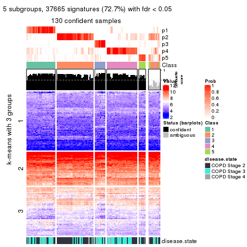</p>

</div>
<div id='tab-MAD-mclust-get-signatures-no-scale-5'>
<pre><code class="r">get_signatures(res, k = 6, scale_rows = FALSE)
</code></pre>

<p></p>

</div>
</div>


Compare the overlap of signatures from different k:

```r
compare_signatures(res)
```


`get_signature()` returns a data frame invisibly. TO get the list of signatures, the function
call should be assigned to a variable explicitly. In following code, if `plot` argument is set
to `FALSE`, no heatmap is plotted while only the differential analysis is performed.

```r
# code only for demonstration
tb = get_signature(res, k = ..., plot = FALSE)
```

An example of the output of `tb` is:

```
#>   which_row         fdr    mean_1    mean_2 scaled_mean_1 scaled_mean_2 km
#> 1        38 0.042760348  8.373488  9.131774    -0.5533452     0.5164555  1
#> 2        40 0.018707592  7.106213  8.469186    -0.6173731     0.5762149  1
#> 3        55 0.019134737 10.221463 11.207825    -0.6159697     0.5749050  1
#> 4        59 0.006059896  5.921854  7.869574    -0.6899429     0.6439467  1
#> 5        60 0.018055526  8.928898 10.211722    -0.6204761     0.5791110  1
#> 6        98 0.009384629 15.714769 14.887706     0.6635654    -0.6193277  2
...
```

The columns in `tb` are:

1. `which_row`: row indices corresponding to the input matrix.
2. `fdr`: FDR for the differential test. 
3. `mean_x`: The mean value in group x.
4. `scaled_mean_x`: The mean value in group x after rows are scaled.
5. `km`: Row groups if k-means clustering is applied to rows.


UMAP plot which shows how samples are separated.


<script>
$( function() {
	$( '#tabs-MAD-mclust-dimension-reduction' ).tabs();
} );
</script>
<div id='tabs-MAD-mclust-dimension-reduction'>
<ul>
<li><a href='#tab-MAD-mclust-dimension-reduction-1'>k = 2</a></li>
<li><a href='#tab-MAD-mclust-dimension-reduction-2'>k = 3</a></li>
<li><a href='#tab-MAD-mclust-dimension-reduction-3'>k = 4</a></li>
<li><a href='#tab-MAD-mclust-dimension-reduction-4'>k = 5</a></li>
<li><a href='#tab-MAD-mclust-dimension-reduction-5'>k = 6</a></li>
</ul>
<div id='tab-MAD-mclust-dimension-reduction-1'>
<pre><code class="r">dimension_reduction(res, k = 2, method = &quot;UMAP&quot;)
</code></pre>

<p></p>

</div>
<div id='tab-MAD-mclust-dimension-reduction-2'>
<pre><code class="r">dimension_reduction(res, k = 3, method = &quot;UMAP&quot;)
</code></pre>

<p></p>

</div>
<div id='tab-MAD-mclust-dimension-reduction-3'>
<pre><code class="r">dimension_reduction(res, k = 4, method = &quot;UMAP&quot;)
</code></pre>

<p></p>

</div>
<div id='tab-MAD-mclust-dimension-reduction-4'>
<pre><code class="r">dimension_reduction(res, k = 5, method = &quot;UMAP&quot;)
</code></pre>

<p></p>

</div>
<div id='tab-MAD-mclust-dimension-reduction-5'>
<pre><code class="r">dimension_reduction(res, k = 6, method = &quot;UMAP&quot;)
</code></pre>

<p></p>

</div>
</div>


Following heatmap shows how subgroups are split when increasing `k`:

```r
collect_classes(res)
```


Test correlation between subgroups and known annotations. If the known
annotation is numeric, one-way ANOVA test is applied, and if the known
annotation is discrete, chi-squared contingency table test is applied.

```r
test_to_known_factors(res)
```

```
#>              n disease.state(p) k
#> MAD:mclust 117         0.318243 2
#> MAD:mclust  63         0.001944 3
#> MAD:mclust 135         0.000843 4
#> MAD:mclust 130         0.000854 5
#> MAD:mclust 128         0.001035 6
```


If matrix rows can be associated to genes, consider to use `GO_Enrichment(res,
...)` to perform function enrichment for the signature genes.


 

---------------------------------------------------


### MAD:NMF


The object with results only for a single top-value method and a single partition method 
can be extracted as:

```r
res = res_list["MAD", "NMF"]
# you can also extract it by
# res = res_list["MAD:NMF"]
```

A summary of `res` and all the functions that can be applied to it:

```r
res
```

```
#> A 'ConsensusPartition' object with k = 2, 3, 4, 5, 6.
#>   On a matrix with 51776 rows and 143 columns.
#>   Top rows (1000, 2000, 3000, 4000, 5000) are extracted by 'MAD' method.
#>   Subgroups are detected by 'NMF' method.
#>   Performed in total 1250 partitions by row resampling.
#>   Best k for subgroups seems to be 3.
#> 
#> Following methods can be applied to this 'ConsensusPartition' object:
#>  [1] "cola_report"             "collect_classes"         "collect_plots"          
#>  [4] "collect_stats"           "colnames"                "compare_signatures"     
#>  [7] "consensus_heatmap"       "dimension_reduction"     "functional_enrichment"  
#> [10] "get_anno_col"            "get_anno"                "get_classes"            
#> [13] "get_consensus"           "get_matrix"              "get_membership"         
#> [16] "get_param"               "get_signatures"          "get_stats"              
#> [19] "is_best_k"               "is_stable_k"             "membership_heatmap"     
#> [22] "ncol"                    "nrow"                    "plot_ecdf"              
#> [25] "rownames"                "select_partition_number" "show"                   
#> [28] "suggest_best_k"          "test_to_known_factors"
```

`collect_plots()` function collects all the plots made from `res` for all `k` (number of partitions)
into one single page to provide an easy and fast comparison between different `k`.

```r
collect_plots(res)
```


The plots are:

- The first row: a plot of the ECDF (Empirical cumulative distribution
  function) curves of the consensus matrix for each `k` and the heatmap of
  predicted classes for each `k`.
- The second row: heatmaps of the consensus matrix for each `k`.
- The third row: heatmaps of the membership matrix for each `k`.
- The fouth row: heatmaps of the signatures for each `k`.

All the plots in panels can be made by individual functions and they are
plotted later in this section.

`select_partition_number()` produces several plots showing different
statistics for choosing "optimized" `k`. There are following statistics:

- ECDF curves of the consensus matrix for each `k`;
- 1-PAC. [The PAC
  score](https://en.wikipedia.org/wiki/Consensus_clustering#Over-interpretation_potential_of_consensus_clustering)
  measures the proportion of the ambiguous subgrouping.
- Mean silhouette score.
- Concordance. The mean probability of fiting the consensus class ids in all
  partitions.
- Area increased. Denote $A_k$ as the area under the ECDF curve for current
  `k`, the area increased is defined as $A_k - A_{k-1}$.
- Rand index. The percent of pairs of samples that are both in a same cluster
  or both are not in a same cluster in the partition of k and k-1.
- Jaccard index. The ratio of pairs of samples are both in a same cluster in
  the partition of k and k-1 and the pairs of samples are both in a same
  cluster in the partition k or k-1.

The detailed explanations of these statistics can be found in [the cola
vignette](http://bioconductor.org/packages/devel/bioc/vignettes/cola/inst/doc/cola.html#toc_13).

Generally speaking, lower PAC score, higher mean silhouette score or higher
concordance corresponds to better partition. Rand index and Jaccard index
measure how similar the current partition is compared to partition with `k-1`.
If they are too similar, we won't accept `k` is better than `k-1`.

```r
select_partition_number(res)
```

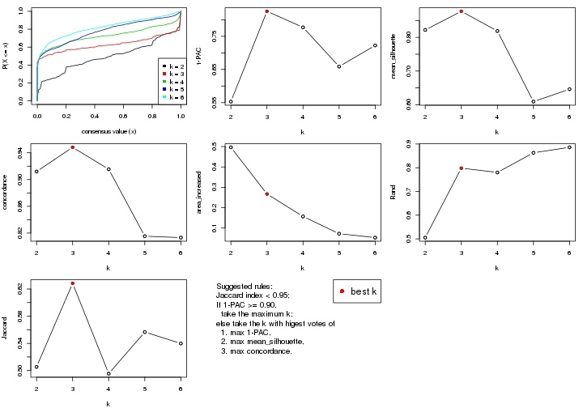

The numeric values for all these statistics can be obtained by `get_stats()`.

```r
get_stats(res)
```

```
#>   k 1-PAC mean_silhouette concordance area_increased  Rand Jaccard
#> 2 2 0.553           0.822       0.912         0.4963 0.505   0.505
#> 3 3 0.825           0.877       0.948         0.2672 0.798   0.628
#> 4 4 0.777           0.819       0.915         0.1568 0.780   0.495
#> 5 5 0.659           0.609       0.815         0.0724 0.863   0.557
#> 6 6 0.722           0.646       0.813         0.0531 0.886   0.540
```

`suggest_best_k()` suggests the best $k$ based on these statistics. The rules are as follows:

- All $k$ with Jaccard index larger than 0.95 are removed because the increase of
  the partition number does not provides enough extra information. If all $k$ are removed,
  the best $k$ is assigned by `NA`.
- For $k$ with 1-PAC larger than 0.9, the maximal $k$ is taken as the "best k". Other $k$ is called "optional k".
- If it does not fit the second rule. The $k$ with the highest vote of highest
  1-PAC, mean silhouette and concordance is taken as the "best k".

```r
suggest_best_k(res)
```

```
#> [1] 3
```


Following shows the table of the partitions (You need to click the **show/hide
code output** link to see it). The membership matrix (columns with name `p*`)
is inferred by
[`clue::cl_consensus()`](https://www.rdocumentation.org/link/cl_consensus?package=clue)
function with the `SE` method. Basically the value in the membership matrix
represents the probability to belong to a certain group. The finall class
label for an item is determined with the group with highest probability it
belongs to.

In `get_classes()` function, the entropy is calculated from the membership
matrix and the silhouette score is calculated from the consensus matrix.


<script>
$( function() {
	$( '#tabs-MAD-NMF-get-classes' ).tabs();
} );
</script>
<div id='tabs-MAD-NMF-get-classes'>
<ul>
<li><a href='#tab-MAD-NMF-get-classes-1'>k = 2</a></li>
<li><a href='#tab-MAD-NMF-get-classes-2'>k = 3</a></li>
<li><a href='#tab-MAD-NMF-get-classes-3'>k = 4</a></li>
<li><a href='#tab-MAD-NMF-get-classes-4'>k = 5</a></li>
<li><a href='#tab-MAD-NMF-get-classes-5'>k = 6</a></li>
</ul>

<div id='tab-MAD-NMF-get-classes-1'>
<p><a id='tab-MAD-NMF-get-classes-1-a' style='color:#0366d6' href='#'>show/hide code output</a></p>
<pre><code class="r">cbind(get_classes(res, k = 2), get_membership(res, k = 2))
</code></pre>

<pre><code>#&gt;           class entropy silhouette    p1    p2
#&gt; GSM550785     1  0.5737    0.84911 0.864 0.136
#&gt; GSM550786     2  0.9988    0.28465 0.480 0.520
#&gt; GSM550788     2  0.0000    0.89437 0.000 1.000
#&gt; GSM550789     2  0.0000    0.89437 0.000 1.000
#&gt; GSM550790     1  0.2423    0.90705 0.960 0.040
#&gt; GSM550791     1  0.7056    0.80385 0.808 0.192
#&gt; GSM550792     2  0.6623    0.75635 0.172 0.828
#&gt; GSM550796     2  0.0000    0.89437 0.000 1.000
#&gt; GSM550797     2  0.0000    0.89437 0.000 1.000
#&gt; GSM550799     2  0.5629    0.81762 0.132 0.868
#&gt; GSM550800     2  0.0000    0.89437 0.000 1.000
#&gt; GSM550801     2  0.0000    0.89437 0.000 1.000
#&gt; GSM550804     2  0.0000    0.89437 0.000 1.000
#&gt; GSM550806     1  0.0376    0.90932 0.996 0.004
#&gt; GSM550807     2  0.0000    0.89437 0.000 1.000
#&gt; GSM550808     2  0.0000    0.89437 0.000 1.000
#&gt; GSM550809     1  0.0000    0.90910 1.000 0.000
#&gt; GSM550810     2  0.0000    0.89437 0.000 1.000
#&gt; GSM550811     1  0.0938    0.91107 0.988 0.012
#&gt; GSM550813     2  0.0000    0.89437 0.000 1.000
#&gt; GSM550814     2  0.0000    0.89437 0.000 1.000
#&gt; GSM550815     2  0.0000    0.89437 0.000 1.000
#&gt; GSM550816     2  0.0000    0.89437 0.000 1.000
#&gt; GSM550817     2  0.7139    0.76413 0.196 0.804
#&gt; GSM550818     2  0.8144    0.71336 0.252 0.748
#&gt; GSM550819     2  0.0000    0.89437 0.000 1.000
#&gt; GSM550820     1  0.0000    0.90910 1.000 0.000
#&gt; GSM550821     2  0.0000    0.89437 0.000 1.000
#&gt; GSM550822     2  0.0000    0.89437 0.000 1.000
#&gt; GSM550826     1  0.0376    0.90932 0.996 0.004
#&gt; GSM550832     2  0.0000    0.89437 0.000 1.000
#&gt; GSM550833     2  0.0000    0.89437 0.000 1.000
#&gt; GSM550835     2  0.1633    0.88155 0.024 0.976
#&gt; GSM550836     1  0.0376    0.90932 0.996 0.004
#&gt; GSM550837     2  0.0000    0.89437 0.000 1.000
#&gt; GSM550838     1  0.0000    0.90910 1.000 0.000
#&gt; GSM550841     2  0.7056    0.76790 0.192 0.808
#&gt; GSM550842     2  0.0000    0.89437 0.000 1.000
#&gt; GSM550846     2  0.3431    0.86122 0.064 0.936
#&gt; GSM550849     1  0.6531    0.82609 0.832 0.168
#&gt; GSM550850     1  0.1633    0.91294 0.976 0.024
#&gt; GSM550851     2  0.0000    0.89437 0.000 1.000
#&gt; GSM550852     2  0.0000    0.89437 0.000 1.000
#&gt; GSM550853     2  0.0000    0.89437 0.000 1.000
#&gt; GSM550855     2  0.0000    0.89437 0.000 1.000
#&gt; GSM550856     2  0.0000    0.89437 0.000 1.000
#&gt; GSM550861     2  0.0000    0.89437 0.000 1.000
#&gt; GSM550863     1  0.9044    0.62594 0.680 0.320
#&gt; GSM550864     2  0.0000    0.89437 0.000 1.000
#&gt; GSM550866     2  0.0376    0.89198 0.004 0.996
#&gt; GSM550867     1  0.1633    0.91294 0.976 0.024
#&gt; GSM550885     1  0.1633    0.91294 0.976 0.024
#&gt; GSM550886     2  0.7139    0.76413 0.196 0.804
#&gt; GSM550887     2  0.0000    0.89437 0.000 1.000
#&gt; GSM550889     2  0.9954   -0.00922 0.460 0.540
#&gt; GSM550894     2  0.0000    0.89437 0.000 1.000
#&gt; GSM550897     1  0.7056    0.80385 0.808 0.192
#&gt; GSM550903     2  0.0000    0.89437 0.000 1.000
#&gt; GSM550905     2  0.0000    0.89437 0.000 1.000
#&gt; GSM550906     2  0.0000    0.89437 0.000 1.000
#&gt; GSM550907     2  0.9686    0.49076 0.396 0.604
#&gt; GSM550909     2  0.6801    0.77873 0.180 0.820
#&gt; GSM550911     2  0.9491    0.54606 0.368 0.632
#&gt; GSM550913     2  0.0000    0.89437 0.000 1.000
#&gt; GSM550915     1  0.9209    0.59365 0.664 0.336
#&gt; GSM550917     2  0.0000    0.89437 0.000 1.000
#&gt; GSM550919     2  0.9129    0.44907 0.328 0.672
#&gt; GSM550921     1  0.0376    0.90932 0.996 0.004
#&gt; GSM550924     2  1.0000    0.21705 0.496 0.504
#&gt; GSM550926     2  0.0000    0.89437 0.000 1.000
#&gt; GSM550927     2  0.0000    0.89437 0.000 1.000
#&gt; GSM550787     1  0.4690    0.86905 0.900 0.100
#&gt; GSM550793     1  0.0376    0.90932 0.996 0.004
#&gt; GSM550794     2  0.5629    0.79642 0.132 0.868
#&gt; GSM550795     1  0.1633    0.91294 0.976 0.024
#&gt; GSM550798     1  0.0000    0.90910 1.000 0.000
#&gt; GSM550803     1  0.0000    0.90910 1.000 0.000
#&gt; GSM550805     1  0.1843    0.91227 0.972 0.028
#&gt; GSM550823     2  0.9087    0.45559 0.324 0.676
#&gt; GSM550824     1  0.1414    0.91270 0.980 0.020
#&gt; GSM550825     1  0.0000    0.90910 1.000 0.000
#&gt; GSM550827     2  0.9608    0.30791 0.384 0.616
#&gt; GSM550828     1  0.3274    0.89733 0.940 0.060
#&gt; GSM550829     1  0.0000    0.90910 1.000 0.000
#&gt; GSM550830     1  0.9580    0.49849 0.620 0.380
#&gt; GSM550834     1  0.7139    0.79987 0.804 0.196
#&gt; GSM550839     2  0.7139    0.76413 0.196 0.804
#&gt; GSM550840     1  0.7056    0.80385 0.808 0.192
#&gt; GSM550843     2  0.9358    0.57495 0.352 0.648
#&gt; GSM550844     1  0.1633    0.91294 0.976 0.024
#&gt; GSM550845     2  0.0000    0.89437 0.000 1.000
#&gt; GSM550848     2  0.0376    0.89198 0.004 0.996
#&gt; GSM550854     1  0.1843    0.91183 0.972 0.028
#&gt; GSM550857     1  0.0376    0.90932 0.996 0.004
#&gt; GSM550858     1  0.7056    0.80385 0.808 0.192
#&gt; GSM550859     1  0.1633    0.91294 0.976 0.024
#&gt; GSM550862     1  0.4022    0.88610 0.920 0.080
#&gt; GSM550865     1  0.7219    0.79605 0.800 0.200
#&gt; GSM550868     1  0.7883    0.75302 0.764 0.236
#&gt; GSM550869     1  0.2043    0.91151 0.968 0.032
#&gt; GSM550870     2  0.0000    0.89437 0.000 1.000
#&gt; GSM550871     2  0.9286    0.59146 0.344 0.656
#&gt; GSM550872     1  0.7219    0.79605 0.800 0.200
#&gt; GSM550873     2  0.0000    0.89437 0.000 1.000
#&gt; GSM550874     2  0.0000    0.89437 0.000 1.000
#&gt; GSM550876     2  0.7056    0.76790 0.192 0.808
#&gt; GSM550877     2  0.0000    0.89437 0.000 1.000
#&gt; GSM550878     2  0.9983    0.29583 0.476 0.524
#&gt; GSM550879     1  0.1633    0.91294 0.976 0.024
#&gt; GSM550882     1  0.0376    0.90932 0.996 0.004
#&gt; GSM550888     1  0.0376    0.90932 0.996 0.004
#&gt; GSM550890     2  0.8955    0.50432 0.312 0.688
#&gt; GSM550891     1  0.0376    0.90932 0.996 0.004
#&gt; GSM550892     1  0.6343    0.83082 0.840 0.160
#&gt; GSM550893     2  0.0000    0.89437 0.000 1.000
#&gt; GSM550895     2  0.0376    0.89198 0.004 0.996
#&gt; GSM550896     2  0.0000    0.89437 0.000 1.000
#&gt; GSM550898     1  0.1633    0.91294 0.976 0.024
#&gt; GSM550899     2  0.0000    0.89437 0.000 1.000
#&gt; GSM550900     1  0.9983    0.20597 0.524 0.476
#&gt; GSM550901     1  0.7139    0.79987 0.804 0.196
#&gt; GSM550902     1  0.0376    0.90932 0.996 0.004
#&gt; GSM550904     1  0.0000    0.90910 1.000 0.000
#&gt; GSM550908     1  0.0376    0.90932 0.996 0.004
#&gt; GSM550912     2  0.0000    0.89437 0.000 1.000
#&gt; GSM550914     2  0.0376    0.89198 0.004 0.996
#&gt; GSM550918     2  0.0376    0.89198 0.004 0.996
#&gt; GSM550922     2  0.6048    0.80534 0.148 0.852
#&gt; GSM550923     1  0.0000    0.90910 1.000 0.000
#&gt; GSM550925     1  0.7139    0.79987 0.804 0.196
#&gt; GSM550802     2  0.0000    0.89437 0.000 1.000
#&gt; GSM550812     2  0.4939    0.83051 0.108 0.892
#&gt; GSM550831     1  0.1633    0.91294 0.976 0.024
#&gt; GSM550847     1  0.1633    0.91294 0.976 0.024
#&gt; GSM550860     1  0.0376    0.90932 0.996 0.004
#&gt; GSM550875     1  0.1633    0.91294 0.976 0.024
#&gt; GSM550880     1  0.7139    0.79987 0.804 0.196
#&gt; GSM550881     1  0.0376    0.90932 0.996 0.004
#&gt; GSM550883     1  0.0376    0.90932 0.996 0.004
#&gt; GSM550884     2  0.8555    0.68081 0.280 0.720
#&gt; GSM550910     2  0.7219    0.76143 0.200 0.800
#&gt; GSM550916     1  0.1633    0.91294 0.976 0.024
#&gt; GSM550920     2  0.8661    0.67209 0.288 0.712
</code></pre>

<script>
$('#tab-MAD-NMF-get-classes-1-a').parent().next().next().hide();
$('#tab-MAD-NMF-get-classes-1-a').click(function(){
  $('#tab-MAD-NMF-get-classes-1-a').parent().next().next().toggle();
  return(false);
});
</script>
</div>

<div id='tab-MAD-NMF-get-classes-2'>
<p><a id='tab-MAD-NMF-get-classes-2-a' style='color:#0366d6' href='#'>show/hide code output</a></p>
<pre><code class="r">cbind(get_classes(res, k = 3), get_membership(res, k = 3))
</code></pre>

<pre><code>#&gt;           class entropy silhouette    p1    p2    p3
#&gt; GSM550785     1  0.0000      0.928 1.000 0.000 0.000
#&gt; GSM550786     3  0.3116      0.874 0.000 0.108 0.892
#&gt; GSM550788     2  0.0000      0.945 0.000 1.000 0.000
#&gt; GSM550789     2  0.0000      0.945 0.000 1.000 0.000
#&gt; GSM550790     1  0.0000      0.928 1.000 0.000 0.000
#&gt; GSM550791     1  0.0000      0.928 1.000 0.000 0.000
#&gt; GSM550792     2  0.2165      0.888 0.064 0.936 0.000
#&gt; GSM550796     2  0.0000      0.945 0.000 1.000 0.000
#&gt; GSM550797     2  0.0000      0.945 0.000 1.000 0.000
#&gt; GSM550799     3  0.5926      0.428 0.000 0.356 0.644
#&gt; GSM550800     2  0.0000      0.945 0.000 1.000 0.000
#&gt; GSM550801     2  0.0000      0.945 0.000 1.000 0.000
#&gt; GSM550804     2  0.0000      0.945 0.000 1.000 0.000
#&gt; GSM550806     3  0.0000      0.958 0.000 0.000 1.000
#&gt; GSM550807     2  0.0000      0.945 0.000 1.000 0.000
#&gt; GSM550808     2  0.0000      0.945 0.000 1.000 0.000
#&gt; GSM550809     1  0.0424      0.923 0.992 0.000 0.008
#&gt; GSM550810     2  0.0000      0.945 0.000 1.000 0.000
#&gt; GSM550811     1  0.5092      0.759 0.804 0.020 0.176
#&gt; GSM550813     2  0.0000      0.945 0.000 1.000 0.000
#&gt; GSM550814     2  0.0000      0.945 0.000 1.000 0.000
#&gt; GSM550815     2  0.0000      0.945 0.000 1.000 0.000
#&gt; GSM550816     2  0.0000      0.945 0.000 1.000 0.000
#&gt; GSM550817     3  0.0000      0.958 0.000 0.000 1.000
#&gt; GSM550818     3  0.0000      0.958 0.000 0.000 1.000
#&gt; GSM550819     2  0.0000      0.945 0.000 1.000 0.000
#&gt; GSM550820     1  0.0000      0.928 1.000 0.000 0.000
#&gt; GSM550821     2  0.0000      0.945 0.000 1.000 0.000
#&gt; GSM550822     2  0.0000      0.945 0.000 1.000 0.000
#&gt; GSM550826     1  0.4931      0.702 0.768 0.000 0.232
#&gt; GSM550832     2  0.0000      0.945 0.000 1.000 0.000
#&gt; GSM550833     2  0.0000      0.945 0.000 1.000 0.000
#&gt; GSM550835     2  0.2356      0.886 0.000 0.928 0.072
#&gt; GSM550836     3  0.0000      0.958 0.000 0.000 1.000
#&gt; GSM550837     2  0.0000      0.945 0.000 1.000 0.000
#&gt; GSM550838     1  0.3340      0.834 0.880 0.000 0.120
#&gt; GSM550841     3  0.0424      0.954 0.000 0.008 0.992
#&gt; GSM550842     2  0.0000      0.945 0.000 1.000 0.000
#&gt; GSM550846     2  0.2165      0.890 0.064 0.936 0.000
#&gt; GSM550849     1  0.6192      0.318 0.580 0.420 0.000
#&gt; GSM550850     1  0.0000      0.928 1.000 0.000 0.000
#&gt; GSM550851     2  0.0000      0.945 0.000 1.000 0.000
#&gt; GSM550852     2  0.0000      0.945 0.000 1.000 0.000
#&gt; GSM550853     2  0.0000      0.945 0.000 1.000 0.000
#&gt; GSM550855     2  0.0000      0.945 0.000 1.000 0.000
#&gt; GSM550856     2  0.0000      0.945 0.000 1.000 0.000
#&gt; GSM550861     2  0.0000      0.945 0.000 1.000 0.000
#&gt; GSM550863     1  0.0000      0.928 1.000 0.000 0.000
#&gt; GSM550864     2  0.0000      0.945 0.000 1.000 0.000
#&gt; GSM550866     2  0.0000      0.945 0.000 1.000 0.000
#&gt; GSM550867     1  0.0000      0.928 1.000 0.000 0.000
#&gt; GSM550885     1  0.0000      0.928 1.000 0.000 0.000
#&gt; GSM550886     2  0.5835      0.497 0.000 0.660 0.340
#&gt; GSM550887     2  0.0000      0.945 0.000 1.000 0.000
#&gt; GSM550889     1  0.5363      0.631 0.724 0.276 0.000
#&gt; GSM550894     2  0.0000      0.945 0.000 1.000 0.000
#&gt; GSM550897     1  0.0000      0.928 1.000 0.000 0.000
#&gt; GSM550903     2  0.0000      0.945 0.000 1.000 0.000
#&gt; GSM550905     2  0.0000      0.945 0.000 1.000 0.000
#&gt; GSM550906     2  0.0000      0.945 0.000 1.000 0.000
#&gt; GSM550907     3  0.0000      0.958 0.000 0.000 1.000
#&gt; GSM550909     2  0.4235      0.771 0.000 0.824 0.176
#&gt; GSM550911     3  0.0000      0.958 0.000 0.000 1.000
#&gt; GSM550913     2  0.0000      0.945 0.000 1.000 0.000
#&gt; GSM550915     1  0.0000      0.928 1.000 0.000 0.000
#&gt; GSM550917     2  0.0000      0.945 0.000 1.000 0.000
#&gt; GSM550919     1  0.1163      0.909 0.972 0.028 0.000
#&gt; GSM550921     3  0.0000      0.958 0.000 0.000 1.000
#&gt; GSM550924     2  0.4504      0.745 0.000 0.804 0.196
#&gt; GSM550926     2  0.0000      0.945 0.000 1.000 0.000
#&gt; GSM550927     2  0.0000      0.945 0.000 1.000 0.000
#&gt; GSM550787     1  0.6701      0.296 0.576 0.412 0.012
#&gt; GSM550793     1  0.5968      0.469 0.636 0.000 0.364
#&gt; GSM550794     2  0.5591      0.586 0.304 0.696 0.000
#&gt; GSM550795     1  0.0000      0.928 1.000 0.000 0.000
#&gt; GSM550798     1  0.0000      0.928 1.000 0.000 0.000
#&gt; GSM550803     1  0.0000      0.928 1.000 0.000 0.000
#&gt; GSM550805     1  0.0000      0.928 1.000 0.000 0.000
#&gt; GSM550823     2  0.6260      0.116 0.448 0.552 0.000
#&gt; GSM550824     1  0.0000      0.928 1.000 0.000 0.000
#&gt; GSM550825     1  0.4931      0.705 0.768 0.000 0.232
#&gt; GSM550827     1  0.0237      0.925 0.996 0.004 0.000
#&gt; GSM550828     1  0.0000      0.928 1.000 0.000 0.000
#&gt; GSM550829     1  0.3412      0.830 0.876 0.000 0.124
#&gt; GSM550830     1  0.1411      0.902 0.964 0.036 0.000
#&gt; GSM550834     1  0.0000      0.928 1.000 0.000 0.000
#&gt; GSM550839     2  0.5560      0.579 0.000 0.700 0.300
#&gt; GSM550840     1  0.0000      0.928 1.000 0.000 0.000
#&gt; GSM550843     3  0.0000      0.958 0.000 0.000 1.000
#&gt; GSM550844     1  0.0000      0.928 1.000 0.000 0.000
#&gt; GSM550845     2  0.0000      0.945 0.000 1.000 0.000
#&gt; GSM550848     1  0.4555      0.709 0.800 0.200 0.000
#&gt; GSM550854     1  0.0000      0.928 1.000 0.000 0.000
#&gt; GSM550857     3  0.0237      0.955 0.004 0.000 0.996
#&gt; GSM550858     1  0.0000      0.928 1.000 0.000 0.000
#&gt; GSM550859     1  0.0000      0.928 1.000 0.000 0.000
#&gt; GSM550862     1  0.0000      0.928 1.000 0.000 0.000
#&gt; GSM550865     1  0.0000      0.928 1.000 0.000 0.000
#&gt; GSM550868     1  0.0000      0.928 1.000 0.000 0.000
#&gt; GSM550869     1  0.5851      0.751 0.792 0.140 0.068
#&gt; GSM550870     2  0.0000      0.945 0.000 1.000 0.000
#&gt; GSM550871     2  0.5254      0.643 0.000 0.736 0.264
#&gt; GSM550872     1  0.0000      0.928 1.000 0.000 0.000
#&gt; GSM550873     2  0.0000      0.945 0.000 1.000 0.000
#&gt; GSM550874     2  0.0000      0.945 0.000 1.000 0.000
#&gt; GSM550876     2  0.6180      0.305 0.000 0.584 0.416
#&gt; GSM550877     2  0.0000      0.945 0.000 1.000 0.000
#&gt; GSM550878     3  0.0000      0.958 0.000 0.000 1.000
#&gt; GSM550879     1  0.0000      0.928 1.000 0.000 0.000
#&gt; GSM550882     3  0.0000      0.958 0.000 0.000 1.000
#&gt; GSM550888     3  0.0000      0.958 0.000 0.000 1.000
#&gt; GSM550890     1  0.2066      0.876 0.940 0.060 0.000
#&gt; GSM550891     3  0.0000      0.958 0.000 0.000 1.000
#&gt; GSM550892     1  0.0000      0.928 1.000 0.000 0.000
#&gt; GSM550893     2  0.0000      0.945 0.000 1.000 0.000
#&gt; GSM550895     2  0.0000      0.945 0.000 1.000 0.000
#&gt; GSM550896     2  0.0000      0.945 0.000 1.000 0.000
#&gt; GSM550898     1  0.0000      0.928 1.000 0.000 0.000
#&gt; GSM550899     2  0.0000      0.945 0.000 1.000 0.000
#&gt; GSM550900     1  0.0424      0.922 0.992 0.008 0.000
#&gt; GSM550901     1  0.0000      0.928 1.000 0.000 0.000
#&gt; GSM550902     1  0.4178      0.778 0.828 0.000 0.172
#&gt; GSM550904     1  0.0000      0.928 1.000 0.000 0.000
#&gt; GSM550908     3  0.0000      0.958 0.000 0.000 1.000
#&gt; GSM550912     2  0.0000      0.945 0.000 1.000 0.000
#&gt; GSM550914     2  0.4504      0.739 0.196 0.804 0.000
#&gt; GSM550918     2  0.0000      0.945 0.000 1.000 0.000
#&gt; GSM550922     3  0.3038      0.879 0.000 0.104 0.896
#&gt; GSM550923     1  0.0000      0.928 1.000 0.000 0.000
#&gt; GSM550925     1  0.0000      0.928 1.000 0.000 0.000
#&gt; GSM550802     2  0.0000      0.945 0.000 1.000 0.000
#&gt; GSM550812     2  0.1411      0.918 0.000 0.964 0.036
#&gt; GSM550831     1  0.0000      0.928 1.000 0.000 0.000
#&gt; GSM550847     1  0.0000      0.928 1.000 0.000 0.000
#&gt; GSM550860     1  0.6305      0.140 0.516 0.000 0.484
#&gt; GSM550875     1  0.0000      0.928 1.000 0.000 0.000
#&gt; GSM550880     1  0.0000      0.928 1.000 0.000 0.000
#&gt; GSM550881     3  0.0000      0.958 0.000 0.000 1.000
#&gt; GSM550883     3  0.1643      0.920 0.044 0.000 0.956
#&gt; GSM550884     2  0.4235      0.771 0.000 0.824 0.176
#&gt; GSM550910     3  0.1411      0.936 0.000 0.036 0.964
#&gt; GSM550916     1  0.0000      0.928 1.000 0.000 0.000
#&gt; GSM550920     3  0.3192      0.870 0.000 0.112 0.888
</code></pre>

<script>
$('#tab-MAD-NMF-get-classes-2-a').parent().next().next().hide();
$('#tab-MAD-NMF-get-classes-2-a').click(function(){
  $('#tab-MAD-NMF-get-classes-2-a').parent().next().next().toggle();
  return(false);
});
</script>
</div>

<div id='tab-MAD-NMF-get-classes-3'>
<p><a id='tab-MAD-NMF-get-classes-3-a' style='color:#0366d6' href='#'>show/hide code output</a></p>
<pre><code class="r">cbind(get_classes(res, k = 4), get_membership(res, k = 4))
</code></pre>

<pre><code>#&gt;           class entropy silhouette    p1    p2    p3    p4
#&gt; GSM550785     1  0.0000      0.969 1.000 0.000 0.000 0.000
#&gt; GSM550786     2  0.4452      0.639 0.008 0.732 0.260 0.000
#&gt; GSM550788     4  0.2281      0.814 0.000 0.096 0.000 0.904
#&gt; GSM550789     2  0.0000      0.882 0.000 1.000 0.000 0.000
#&gt; GSM550790     1  0.0000      0.969 1.000 0.000 0.000 0.000
#&gt; GSM550791     1  0.0469      0.963 0.988 0.012 0.000 0.000
#&gt; GSM550792     2  0.4605      0.507 0.336 0.664 0.000 0.000
#&gt; GSM550796     2  0.0336      0.883 0.000 0.992 0.000 0.008
#&gt; GSM550797     2  0.0000      0.882 0.000 1.000 0.000 0.000
#&gt; GSM550799     3  0.1854      0.858 0.000 0.048 0.940 0.012
#&gt; GSM550800     4  0.2011      0.826 0.000 0.080 0.000 0.920
#&gt; GSM550801     2  0.0188      0.883 0.000 0.996 0.000 0.004
#&gt; GSM550804     2  0.0188      0.881 0.004 0.996 0.000 0.000
#&gt; GSM550806     3  0.4916      0.225 0.000 0.000 0.576 0.424
#&gt; GSM550807     2  0.0592      0.881 0.000 0.984 0.000 0.016
#&gt; GSM550808     2  0.0000      0.882 0.000 1.000 0.000 0.000
#&gt; GSM550809     1  0.0188      0.967 0.996 0.004 0.000 0.000
#&gt; GSM550810     2  0.0336      0.883 0.000 0.992 0.000 0.008
#&gt; GSM550811     1  0.1637      0.923 0.940 0.060 0.000 0.000
#&gt; GSM550813     2  0.1389      0.865 0.000 0.952 0.000 0.048
#&gt; GSM550814     2  0.4072      0.645 0.000 0.748 0.000 0.252
#&gt; GSM550815     2  0.0469      0.882 0.000 0.988 0.000 0.012
#&gt; GSM550816     2  0.0188      0.881 0.004 0.996 0.000 0.000
#&gt; GSM550817     3  0.0921      0.883 0.000 0.028 0.972 0.000
#&gt; GSM550818     3  0.0707      0.889 0.000 0.020 0.980 0.000
#&gt; GSM550819     4  0.4817      0.292 0.000 0.388 0.000 0.612
#&gt; GSM550820     1  0.0000      0.969 1.000 0.000 0.000 0.000
#&gt; GSM550821     2  0.0000      0.882 0.000 1.000 0.000 0.000
#&gt; GSM550822     2  0.0188      0.883 0.000 0.996 0.000 0.004
#&gt; GSM550826     1  0.0927      0.956 0.976 0.008 0.016 0.000
#&gt; GSM550832     2  0.0188      0.883 0.000 0.996 0.000 0.004
#&gt; GSM550833     2  0.1022      0.874 0.000 0.968 0.000 0.032
#&gt; GSM550835     2  0.4872      0.672 0.000 0.728 0.244 0.028
#&gt; GSM550836     3  0.0000      0.898 0.000 0.000 1.000 0.000
#&gt; GSM550837     2  0.0469      0.882 0.000 0.988 0.000 0.012
#&gt; GSM550838     1  0.0000      0.969 1.000 0.000 0.000 0.000
#&gt; GSM550841     3  0.4222      0.579 0.000 0.272 0.728 0.000
#&gt; GSM550842     2  0.0336      0.883 0.000 0.992 0.000 0.008
#&gt; GSM550846     2  0.3569      0.722 0.196 0.804 0.000 0.000
#&gt; GSM550849     1  0.3726      0.726 0.788 0.212 0.000 0.000
#&gt; GSM550850     1  0.0000      0.969 1.000 0.000 0.000 0.000
#&gt; GSM550851     2  0.0000      0.882 0.000 1.000 0.000 0.000
#&gt; GSM550852     2  0.0000      0.882 0.000 1.000 0.000 0.000
#&gt; GSM550853     2  0.4008      0.662 0.000 0.756 0.000 0.244
#&gt; GSM550855     2  0.4277      0.604 0.000 0.720 0.000 0.280
#&gt; GSM550856     2  0.4454      0.560 0.000 0.692 0.000 0.308
#&gt; GSM550861     2  0.0188      0.883 0.000 0.996 0.000 0.004
#&gt; GSM550863     4  0.1118      0.845 0.036 0.000 0.000 0.964
#&gt; GSM550864     2  0.0188      0.883 0.000 0.996 0.000 0.004
#&gt; GSM550866     4  0.3024      0.772 0.000 0.148 0.000 0.852
#&gt; GSM550867     1  0.0188      0.968 0.996 0.000 0.000 0.004
#&gt; GSM550885     1  0.0000      0.969 1.000 0.000 0.000 0.000
#&gt; GSM550886     2  0.5592      0.379 0.000 0.572 0.404 0.024
#&gt; GSM550887     2  0.0707      0.880 0.000 0.980 0.000 0.020
#&gt; GSM550889     4  0.0000      0.855 0.000 0.000 0.000 1.000
#&gt; GSM550894     2  0.0817      0.878 0.000 0.976 0.000 0.024
#&gt; GSM550897     4  0.0707      0.851 0.020 0.000 0.000 0.980
#&gt; GSM550903     2  0.0000      0.882 0.000 1.000 0.000 0.000
#&gt; GSM550905     2  0.0000      0.882 0.000 1.000 0.000 0.000
#&gt; GSM550906     2  0.1557      0.861 0.000 0.944 0.000 0.056
#&gt; GSM550907     3  0.0000      0.898 0.000 0.000 1.000 0.000
#&gt; GSM550909     2  0.1474      0.857 0.000 0.948 0.052 0.000
#&gt; GSM550911     3  0.0000      0.898 0.000 0.000 1.000 0.000
#&gt; GSM550913     2  0.0188      0.883 0.000 0.996 0.000 0.004
#&gt; GSM550915     1  0.1302      0.937 0.956 0.044 0.000 0.000
#&gt; GSM550917     2  0.0188      0.883 0.000 0.996 0.000 0.004
#&gt; GSM550919     1  0.2216      0.888 0.908 0.092 0.000 0.000
#&gt; GSM550921     3  0.0000      0.898 0.000 0.000 1.000 0.000
#&gt; GSM550924     2  0.2654      0.808 0.108 0.888 0.004 0.000
#&gt; GSM550926     4  0.4134      0.649 0.000 0.260 0.000 0.740
#&gt; GSM550927     2  0.0592      0.881 0.000 0.984 0.000 0.016
#&gt; GSM550787     2  0.8137      0.393 0.216 0.528 0.040 0.216
#&gt; GSM550793     3  0.5208      0.729 0.172 0.000 0.748 0.080
#&gt; GSM550794     2  0.4454      0.595 0.308 0.692 0.000 0.000
#&gt; GSM550795     1  0.0592      0.961 0.984 0.000 0.000 0.016
#&gt; GSM550798     1  0.0188      0.968 0.996 0.000 0.000 0.004
#&gt; GSM550803     1  0.0188      0.968 0.996 0.000 0.000 0.004
#&gt; GSM550805     4  0.5137      0.222 0.452 0.004 0.000 0.544
#&gt; GSM550823     4  0.0000      0.855 0.000 0.000 0.000 1.000
#&gt; GSM550824     1  0.0188      0.968 0.996 0.000 0.000 0.004
#&gt; GSM550825     3  0.5902      0.677 0.184 0.000 0.696 0.120
#&gt; GSM550827     1  0.0921      0.950 0.972 0.028 0.000 0.000
#&gt; GSM550828     1  0.0000      0.969 1.000 0.000 0.000 0.000
#&gt; GSM550829     1  0.0000      0.969 1.000 0.000 0.000 0.000
#&gt; GSM550830     4  0.0000      0.855 0.000 0.000 0.000 1.000
#&gt; GSM550834     1  0.0000      0.969 1.000 0.000 0.000 0.000
#&gt; GSM550839     4  0.4012      0.705 0.000 0.016 0.184 0.800
#&gt; GSM550840     4  0.1211      0.841 0.040 0.000 0.000 0.960
#&gt; GSM550843     3  0.0000      0.898 0.000 0.000 1.000 0.000
#&gt; GSM550844     1  0.0188      0.968 0.996 0.000 0.000 0.004
#&gt; GSM550845     4  0.4941      0.259 0.000 0.436 0.000 0.564
#&gt; GSM550848     1  0.3837      0.701 0.776 0.224 0.000 0.000
#&gt; GSM550854     1  0.0188      0.968 0.996 0.000 0.000 0.004
#&gt; GSM550857     3  0.4741      0.524 0.328 0.000 0.668 0.004
#&gt; GSM550858     1  0.0188      0.968 0.996 0.000 0.000 0.004
#&gt; GSM550859     1  0.0188      0.968 0.996 0.000 0.000 0.004
#&gt; GSM550862     4  0.3074      0.749 0.152 0.000 0.000 0.848
#&gt; GSM550865     4  0.0336      0.854 0.008 0.000 0.000 0.992
#&gt; GSM550868     4  0.0336      0.854 0.008 0.000 0.000 0.992
#&gt; GSM550869     4  0.0000      0.855 0.000 0.000 0.000 1.000
#&gt; GSM550870     2  0.1211      0.869 0.000 0.960 0.000 0.040
#&gt; GSM550871     4  0.2125      0.817 0.000 0.004 0.076 0.920
#&gt; GSM550872     4  0.0188      0.855 0.004 0.000 0.000 0.996
#&gt; GSM550873     2  0.0000      0.882 0.000 1.000 0.000 0.000
#&gt; GSM550874     4  0.1557      0.841 0.000 0.056 0.000 0.944
#&gt; GSM550876     4  0.0188      0.855 0.000 0.004 0.000 0.996
#&gt; GSM550877     4  0.2760      0.793 0.000 0.128 0.000 0.872
#&gt; GSM550878     3  0.0000      0.898 0.000 0.000 1.000 0.000
#&gt; GSM550879     1  0.0000      0.969 1.000 0.000 0.000 0.000
#&gt; GSM550882     4  0.3942      0.644 0.000 0.000 0.236 0.764
#&gt; GSM550888     3  0.0000      0.898 0.000 0.000 1.000 0.000
#&gt; GSM550890     1  0.2216      0.885 0.908 0.092 0.000 0.000
#&gt; GSM550891     3  0.0000      0.898 0.000 0.000 1.000 0.000
#&gt; GSM550892     4  0.1867      0.821 0.072 0.000 0.000 0.928
#&gt; GSM550893     4  0.0817      0.852 0.000 0.024 0.000 0.976
#&gt; GSM550895     4  0.0188      0.855 0.000 0.004 0.000 0.996
#&gt; GSM550896     4  0.1302      0.844 0.000 0.044 0.000 0.956
#&gt; GSM550898     1  0.0188      0.968 0.996 0.000 0.000 0.004
#&gt; GSM550899     2  0.0188      0.881 0.004 0.996 0.000 0.000
#&gt; GSM550900     4  0.0188      0.855 0.004 0.000 0.000 0.996
#&gt; GSM550901     1  0.0592      0.960 0.984 0.016 0.000 0.000
#&gt; GSM550902     1  0.1109      0.947 0.968 0.000 0.028 0.004
#&gt; GSM550904     1  0.0000      0.969 1.000 0.000 0.000 0.000
#&gt; GSM550908     3  0.0000      0.898 0.000 0.000 1.000 0.000
#&gt; GSM550912     2  0.0469      0.882 0.000 0.988 0.000 0.012
#&gt; GSM550914     2  0.2345      0.823 0.100 0.900 0.000 0.000
#&gt; GSM550918     2  0.0000      0.882 0.000 1.000 0.000 0.000
#&gt; GSM550922     2  0.3444      0.742 0.000 0.816 0.184 0.000
#&gt; GSM550923     1  0.0188      0.968 0.996 0.000 0.000 0.004
#&gt; GSM550925     4  0.3801      0.682 0.220 0.000 0.000 0.780
#&gt; GSM550802     2  0.4981      0.215 0.000 0.536 0.000 0.464
#&gt; GSM550812     2  0.5209      0.723 0.000 0.756 0.104 0.140
#&gt; GSM550831     1  0.0000      0.969 1.000 0.000 0.000 0.000
#&gt; GSM550847     1  0.0336      0.966 0.992 0.000 0.000 0.008
#&gt; GSM550860     4  0.0188      0.854 0.000 0.000 0.004 0.996
#&gt; GSM550875     4  0.0707      0.851 0.020 0.000 0.000 0.980
#&gt; GSM550880     1  0.0921      0.950 0.972 0.000 0.000 0.028
#&gt; GSM550881     3  0.0000      0.898 0.000 0.000 1.000 0.000
#&gt; GSM550883     3  0.0524      0.893 0.008 0.000 0.988 0.004
#&gt; GSM550884     4  0.6948      0.461 0.000 0.204 0.208 0.588
#&gt; GSM550910     2  0.4843      0.397 0.000 0.604 0.396 0.000
#&gt; GSM550916     4  0.3610      0.702 0.200 0.000 0.000 0.800
#&gt; GSM550920     2  0.4730      0.470 0.000 0.636 0.364 0.000
</code></pre>

<script>
$('#tab-MAD-NMF-get-classes-3-a').parent().next().next().hide();
$('#tab-MAD-NMF-get-classes-3-a').click(function(){
  $('#tab-MAD-NMF-get-classes-3-a').parent().next().next().toggle();
  return(false);
});
</script>
</div>

<div id='tab-MAD-NMF-get-classes-4'>
<p><a id='tab-MAD-NMF-get-classes-4-a' style='color:#0366d6' href='#'>show/hide code output</a></p>
<pre><code class="r">cbind(get_classes(res, k = 5), get_membership(res, k = 5))
</code></pre>

<pre><code>#&gt;           class entropy silhouette    p1    p2    p3    p4    p5
#&gt; GSM550785     1  0.0000     0.8005 1.000 0.000 0.000 0.000 0.000
#&gt; GSM550786     3  0.7009     0.2991 0.024 0.244 0.488 0.000 0.244
#&gt; GSM550788     2  0.4829    -0.0828 0.000 0.500 0.000 0.480 0.020
#&gt; GSM550789     2  0.0162     0.8328 0.000 0.996 0.000 0.000 0.004
#&gt; GSM550790     1  0.0162     0.7996 0.996 0.000 0.000 0.000 0.004
#&gt; GSM550791     1  0.0162     0.7995 0.996 0.000 0.000 0.000 0.004
#&gt; GSM550792     1  0.4654     0.2803 0.628 0.348 0.000 0.000 0.024
#&gt; GSM550796     2  0.0000     0.8333 0.000 1.000 0.000 0.000 0.000
#&gt; GSM550797     2  0.0162     0.8328 0.000 0.996 0.000 0.000 0.004
#&gt; GSM550799     3  0.3365     0.6299 0.000 0.180 0.808 0.004 0.008
#&gt; GSM550800     4  0.2813     0.7414 0.000 0.168 0.000 0.832 0.000
#&gt; GSM550801     2  0.0162     0.8337 0.000 0.996 0.000 0.000 0.004
#&gt; GSM550804     2  0.4045     0.3247 0.000 0.644 0.000 0.000 0.356
#&gt; GSM550806     3  0.3707     0.4553 0.000 0.000 0.716 0.284 0.000
#&gt; GSM550807     2  0.0324     0.8340 0.000 0.992 0.000 0.004 0.004
#&gt; GSM550808     2  0.1671     0.7892 0.000 0.924 0.000 0.000 0.076
#&gt; GSM550809     5  0.2329     0.4792 0.124 0.000 0.000 0.000 0.876
#&gt; GSM550810     2  0.0703     0.8284 0.000 0.976 0.000 0.000 0.024
#&gt; GSM550811     5  0.3551     0.3750 0.220 0.008 0.000 0.000 0.772
#&gt; GSM550813     2  0.1012     0.8289 0.000 0.968 0.000 0.012 0.020
#&gt; GSM550814     2  0.5975     0.2556 0.000 0.532 0.000 0.344 0.124
#&gt; GSM550815     2  0.0162     0.8330 0.000 0.996 0.000 0.000 0.004
#&gt; GSM550816     5  0.4235     0.3074 0.000 0.424 0.000 0.000 0.576
#&gt; GSM550817     3  0.3578     0.6696 0.000 0.048 0.820 0.000 0.132
#&gt; GSM550818     3  0.4321     0.3759 0.000 0.004 0.600 0.000 0.396
#&gt; GSM550819     5  0.6063     0.3028 0.000 0.144 0.000 0.316 0.540
#&gt; GSM550820     5  0.4307    -0.2828 0.496 0.000 0.000 0.000 0.504
#&gt; GSM550821     5  0.4268     0.2496 0.000 0.444 0.000 0.000 0.556
#&gt; GSM550822     2  0.3876     0.4105 0.000 0.684 0.000 0.000 0.316
#&gt; GSM550826     5  0.5185    -0.0361 0.384 0.000 0.048 0.000 0.568
#&gt; GSM550832     2  0.0609     0.8320 0.000 0.980 0.000 0.000 0.020
#&gt; GSM550833     2  0.0162     0.8333 0.000 0.996 0.000 0.004 0.000
#&gt; GSM550835     2  0.3579     0.5869 0.000 0.756 0.240 0.004 0.000
#&gt; GSM550836     3  0.0000     0.7434 0.000 0.000 1.000 0.000 0.000
#&gt; GSM550837     2  0.1205     0.8175 0.000 0.956 0.000 0.004 0.040
#&gt; GSM550838     5  0.2563     0.4792 0.120 0.000 0.008 0.000 0.872
#&gt; GSM550841     3  0.5475     0.3935 0.000 0.308 0.604 0.000 0.088
#&gt; GSM550842     2  0.2179     0.7531 0.000 0.888 0.000 0.000 0.112
#&gt; GSM550846     5  0.3884     0.5008 0.004 0.288 0.000 0.000 0.708
#&gt; GSM550849     1  0.2305     0.7383 0.896 0.092 0.000 0.000 0.012
#&gt; GSM550850     1  0.0671     0.7968 0.980 0.000 0.000 0.004 0.016
#&gt; GSM550851     2  0.0162     0.8328 0.000 0.996 0.000 0.000 0.004
#&gt; GSM550852     2  0.3876     0.4184 0.000 0.684 0.000 0.000 0.316
#&gt; GSM550853     2  0.4808     0.3069 0.000 0.576 0.000 0.400 0.024
#&gt; GSM550855     2  0.2813     0.6699 0.000 0.832 0.000 0.168 0.000
#&gt; GSM550856     2  0.2966     0.6547 0.000 0.816 0.000 0.184 0.000
#&gt; GSM550861     2  0.0404     0.8331 0.000 0.988 0.000 0.000 0.012
#&gt; GSM550863     5  0.3177     0.4302 0.000 0.000 0.000 0.208 0.792
#&gt; GSM550864     2  0.0510     0.8332 0.000 0.984 0.000 0.000 0.016
#&gt; GSM550866     4  0.4108     0.5790 0.000 0.308 0.000 0.684 0.008
#&gt; GSM550867     1  0.2536     0.7664 0.868 0.000 0.000 0.004 0.128
#&gt; GSM550885     1  0.4151     0.5514 0.652 0.000 0.000 0.004 0.344
#&gt; GSM550886     2  0.5557     0.1008 0.000 0.520 0.424 0.012 0.044
#&gt; GSM550887     2  0.0162     0.8333 0.000 0.996 0.000 0.004 0.000
#&gt; GSM550889     4  0.0162     0.8396 0.000 0.004 0.000 0.996 0.000
#&gt; GSM550894     2  0.0771     0.8318 0.000 0.976 0.000 0.004 0.020
#&gt; GSM550897     4  0.0865     0.8329 0.024 0.000 0.000 0.972 0.004
#&gt; GSM550903     2  0.0404     0.8336 0.000 0.988 0.000 0.000 0.012
#&gt; GSM550905     2  0.1043     0.8173 0.000 0.960 0.000 0.000 0.040
#&gt; GSM550906     2  0.0693     0.8311 0.000 0.980 0.000 0.008 0.012
#&gt; GSM550907     3  0.0510     0.7411 0.000 0.000 0.984 0.000 0.016
#&gt; GSM550909     5  0.4744     0.2981 0.000 0.408 0.020 0.000 0.572
#&gt; GSM550911     3  0.0880     0.7380 0.000 0.000 0.968 0.000 0.032
#&gt; GSM550913     2  0.0404     0.8331 0.000 0.988 0.000 0.000 0.012
#&gt; GSM550915     5  0.2504     0.5200 0.064 0.040 0.000 0.000 0.896
#&gt; GSM550917     2  0.1041     0.8267 0.004 0.964 0.000 0.000 0.032
#&gt; GSM550919     1  0.4642     0.3449 0.660 0.308 0.000 0.000 0.032
#&gt; GSM550921     3  0.0000     0.7434 0.000 0.000 1.000 0.000 0.000
#&gt; GSM550924     1  0.5946     0.4450 0.668 0.188 0.092 0.000 0.052
#&gt; GSM550926     4  0.3381     0.7278 0.000 0.176 0.000 0.808 0.016
#&gt; GSM550927     2  0.0000     0.8333 0.000 1.000 0.000 0.000 0.000
#&gt; GSM550787     2  0.5482     0.1217 0.448 0.500 0.000 0.008 0.044
#&gt; GSM550793     3  0.6569     0.3282 0.264 0.000 0.532 0.012 0.192
#&gt; GSM550794     5  0.5717     0.3114 0.368 0.092 0.000 0.000 0.540
#&gt; GSM550795     5  0.5868     0.1303 0.292 0.000 0.000 0.132 0.576
#&gt; GSM550798     1  0.0566     0.8021 0.984 0.000 0.000 0.004 0.012
#&gt; GSM550803     1  0.0566     0.8021 0.984 0.000 0.000 0.004 0.012
#&gt; GSM550805     1  0.3146     0.7134 0.844 0.000 0.000 0.128 0.028
#&gt; GSM550823     4  0.0162     0.8396 0.000 0.004 0.000 0.996 0.000
#&gt; GSM550824     1  0.1124     0.8005 0.960 0.000 0.000 0.004 0.036
#&gt; GSM550825     3  0.4387     0.3901 0.348 0.000 0.640 0.012 0.000
#&gt; GSM550827     5  0.6749     0.4089 0.304 0.288 0.000 0.000 0.408
#&gt; GSM550828     1  0.1571     0.7969 0.936 0.000 0.000 0.004 0.060
#&gt; GSM550829     1  0.1990     0.7938 0.920 0.000 0.008 0.004 0.068
#&gt; GSM550830     4  0.0000     0.8394 0.000 0.000 0.000 1.000 0.000
#&gt; GSM550834     1  0.4225     0.5180 0.632 0.000 0.000 0.004 0.364
#&gt; GSM550839     4  0.2964     0.7360 0.000 0.004 0.152 0.840 0.004
#&gt; GSM550840     4  0.4576     0.3890 0.376 0.000 0.000 0.608 0.016
#&gt; GSM550843     3  0.1205     0.7331 0.000 0.004 0.956 0.000 0.040
#&gt; GSM550844     1  0.3521     0.6818 0.764 0.000 0.000 0.004 0.232
#&gt; GSM550845     4  0.3659     0.6811 0.000 0.220 0.000 0.768 0.012
#&gt; GSM550848     5  0.6551     0.4643 0.228 0.304 0.000 0.000 0.468
#&gt; GSM550854     1  0.2233     0.7797 0.892 0.000 0.000 0.004 0.104
#&gt; GSM550857     3  0.6801     0.1104 0.316 0.000 0.432 0.004 0.248
#&gt; GSM550858     1  0.3086     0.7295 0.816 0.000 0.000 0.004 0.180
#&gt; GSM550859     1  0.2179     0.7818 0.896 0.000 0.000 0.004 0.100
#&gt; GSM550862     4  0.3596     0.6799 0.200 0.000 0.000 0.784 0.016
#&gt; GSM550865     4  0.0404     0.8384 0.000 0.000 0.000 0.988 0.012
#&gt; GSM550868     4  0.0404     0.8391 0.000 0.000 0.000 0.988 0.012
#&gt; GSM550869     4  0.0566     0.8395 0.000 0.004 0.000 0.984 0.012
#&gt; GSM550870     2  0.1012     0.8289 0.000 0.968 0.000 0.012 0.020
#&gt; GSM550871     4  0.1731     0.8192 0.000 0.004 0.060 0.932 0.004
#&gt; GSM550872     4  0.0162     0.8391 0.000 0.000 0.000 0.996 0.004
#&gt; GSM550873     2  0.0794     0.8296 0.000 0.972 0.000 0.000 0.028
#&gt; GSM550874     4  0.0671     0.8386 0.000 0.016 0.000 0.980 0.004
#&gt; GSM550876     4  0.1924     0.8168 0.000 0.004 0.064 0.924 0.008
#&gt; GSM550877     4  0.1168     0.8332 0.000 0.032 0.000 0.960 0.008
#&gt; GSM550878     3  0.0000     0.7434 0.000 0.000 1.000 0.000 0.000
#&gt; GSM550879     1  0.4341     0.4570 0.592 0.000 0.000 0.004 0.404
#&gt; GSM550882     4  0.4481     0.2909 0.000 0.000 0.416 0.576 0.008
#&gt; GSM550888     3  0.0162     0.7427 0.000 0.000 0.996 0.004 0.000
#&gt; GSM550890     5  0.3616     0.5450 0.032 0.164 0.000 0.000 0.804
#&gt; GSM550891     3  0.0000     0.7434 0.000 0.000 1.000 0.000 0.000
#&gt; GSM550892     4  0.0880     0.8290 0.000 0.000 0.000 0.968 0.032
#&gt; GSM550893     4  0.4886     0.4169 0.000 0.372 0.000 0.596 0.032
#&gt; GSM550895     4  0.0324     0.8397 0.000 0.004 0.000 0.992 0.004
#&gt; GSM550896     4  0.1408     0.8283 0.000 0.044 0.000 0.948 0.008
#&gt; GSM550898     1  0.0162     0.8010 0.996 0.000 0.000 0.004 0.000
#&gt; GSM550899     2  0.1043     0.8189 0.000 0.960 0.000 0.000 0.040
#&gt; GSM550900     4  0.0451     0.8398 0.000 0.004 0.000 0.988 0.008
#&gt; GSM550901     1  0.0566     0.7995 0.984 0.004 0.000 0.000 0.012
#&gt; GSM550902     1  0.6480     0.2392 0.444 0.000 0.160 0.004 0.392
#&gt; GSM550904     5  0.4273    -0.1680 0.448 0.000 0.000 0.000 0.552
#&gt; GSM550908     3  0.0000     0.7434 0.000 0.000 1.000 0.000 0.000
#&gt; GSM550912     2  0.0880     0.8284 0.000 0.968 0.000 0.000 0.032
#&gt; GSM550914     5  0.4182     0.4262 0.000 0.352 0.000 0.004 0.644
#&gt; GSM550918     2  0.1041     0.8267 0.004 0.964 0.000 0.000 0.032
#&gt; GSM550922     3  0.4449     0.0662 0.000 0.484 0.512 0.000 0.004
#&gt; GSM550923     1  0.0000     0.8005 1.000 0.000 0.000 0.000 0.000
#&gt; GSM550925     1  0.4756     0.6105 0.752 0.040 0.000 0.172 0.036
#&gt; GSM550802     5  0.6108     0.4166 0.000 0.188 0.000 0.248 0.564
#&gt; GSM550812     5  0.5144     0.4624 0.000 0.304 0.000 0.064 0.632
#&gt; GSM550831     1  0.1041     0.7997 0.964 0.000 0.000 0.004 0.032
#&gt; GSM550847     1  0.0162     0.8010 0.996 0.000 0.000 0.004 0.000
#&gt; GSM550860     4  0.0000     0.8394 0.000 0.000 0.000 1.000 0.000
#&gt; GSM550875     4  0.4101     0.4591 0.332 0.000 0.000 0.664 0.004
#&gt; GSM550880     1  0.6558     0.1433 0.504 0.004 0.000 0.224 0.268
#&gt; GSM550881     3  0.0000     0.7434 0.000 0.000 1.000 0.000 0.000
#&gt; GSM550883     3  0.2970     0.6647 0.000 0.000 0.828 0.004 0.168
#&gt; GSM550884     4  0.6029     0.1119 0.000 0.048 0.032 0.464 0.456
#&gt; GSM550910     3  0.6616     0.1962 0.000 0.252 0.456 0.000 0.292
#&gt; GSM550916     1  0.2233     0.7416 0.904 0.000 0.000 0.080 0.016
#&gt; GSM550920     2  0.5647     0.0785 0.016 0.516 0.424 0.000 0.044
</code></pre>

<script>
$('#tab-MAD-NMF-get-classes-4-a').parent().next().next().hide();
$('#tab-MAD-NMF-get-classes-4-a').click(function(){
  $('#tab-MAD-NMF-get-classes-4-a').parent().next().next().toggle();
  return(false);
});
</script>
</div>

<div id='tab-MAD-NMF-get-classes-5'>
<p><a id='tab-MAD-NMF-get-classes-5-a' style='color:#0366d6' href='#'>show/hide code output</a></p>
<pre><code class="r">cbind(get_classes(res, k = 6), get_membership(res, k = 6))
</code></pre>

<pre><code>#&gt;           class entropy silhouette    p1    p2    p3    p4    p5    p6
#&gt; GSM550785     1  0.0363     0.7605 0.988 0.000 0.000 0.000 0.000 0.012
#&gt; GSM550786     6  0.5679     0.5500 0.028 0.052 0.216 0.000 0.052 0.652
#&gt; GSM550788     2  0.4195     0.1598 0.000 0.548 0.000 0.440 0.004 0.008
#&gt; GSM550789     2  0.0363     0.8580 0.000 0.988 0.000 0.000 0.012 0.000
#&gt; GSM550790     1  0.0146     0.7595 0.996 0.000 0.000 0.000 0.000 0.004
#&gt; GSM550791     1  0.1007     0.7550 0.956 0.000 0.000 0.000 0.000 0.044
#&gt; GSM550792     1  0.5757     0.4518 0.620 0.216 0.000 0.000 0.104 0.060
#&gt; GSM550796     2  0.0508     0.8579 0.000 0.984 0.000 0.004 0.012 0.000
#&gt; GSM550797     2  0.0363     0.8580 0.000 0.988 0.000 0.000 0.012 0.000
#&gt; GSM550799     3  0.3371     0.5515 0.000 0.292 0.708 0.000 0.000 0.000
#&gt; GSM550800     4  0.4397     0.1202 0.000 0.452 0.000 0.528 0.012 0.008
#&gt; GSM550801     2  0.1007     0.8549 0.000 0.956 0.000 0.000 0.044 0.000
#&gt; GSM550804     5  0.3373     0.6156 0.000 0.248 0.000 0.000 0.744 0.008
#&gt; GSM550806     3  0.3343     0.6383 0.000 0.000 0.796 0.176 0.004 0.024
#&gt; GSM550807     2  0.1080     0.8577 0.000 0.960 0.000 0.004 0.032 0.004
#&gt; GSM550808     5  0.5068     0.1574 0.000 0.460 0.024 0.000 0.484 0.032
#&gt; GSM550809     6  0.2988     0.6562 0.024 0.000 0.000 0.000 0.152 0.824
#&gt; GSM550810     2  0.3499     0.7065 0.000 0.780 0.008 0.004 0.196 0.012
#&gt; GSM550811     6  0.3802     0.6203 0.044 0.000 0.000 0.000 0.208 0.748
#&gt; GSM550813     2  0.1515     0.8483 0.000 0.944 0.000 0.008 0.028 0.020
#&gt; GSM550814     2  0.5893     0.4633 0.000 0.604 0.000 0.216 0.124 0.056
#&gt; GSM550815     2  0.1036     0.8537 0.000 0.964 0.000 0.004 0.024 0.008
#&gt; GSM550816     5  0.2672     0.7058 0.000 0.052 0.000 0.000 0.868 0.080
#&gt; GSM550817     3  0.5257     0.3538 0.000 0.016 0.572 0.000 0.340 0.072
#&gt; GSM550818     5  0.4289     0.4977 0.000 0.004 0.264 0.000 0.688 0.044
#&gt; GSM550819     5  0.5254     0.5775 0.000 0.012 0.000 0.220 0.636 0.132
#&gt; GSM550820     6  0.4243     0.6787 0.164 0.000 0.000 0.000 0.104 0.732
#&gt; GSM550821     5  0.2545     0.7102 0.000 0.068 0.020 0.000 0.888 0.024
#&gt; GSM550822     5  0.4933     0.4849 0.000 0.340 0.000 0.004 0.588 0.068
#&gt; GSM550826     6  0.3316     0.7220 0.072 0.000 0.028 0.000 0.056 0.844
#&gt; GSM550832     2  0.1268     0.8502 0.004 0.952 0.000 0.000 0.036 0.008
#&gt; GSM550833     2  0.0862     0.8559 0.000 0.972 0.000 0.004 0.016 0.008
#&gt; GSM550835     2  0.2723     0.7650 0.000 0.852 0.128 0.000 0.004 0.016
#&gt; GSM550836     3  0.0713     0.7565 0.000 0.000 0.972 0.000 0.000 0.028
#&gt; GSM550837     2  0.1864     0.8389 0.000 0.924 0.000 0.004 0.040 0.032
#&gt; GSM550838     6  0.2973     0.6693 0.024 0.000 0.004 0.000 0.136 0.836
#&gt; GSM550841     3  0.5744     0.3321 0.000 0.060 0.556 0.000 0.324 0.060
#&gt; GSM550842     2  0.5463    -0.0826 0.000 0.500 0.028 0.004 0.420 0.048
#&gt; GSM550846     5  0.2798     0.6994 0.000 0.036 0.000 0.000 0.852 0.112
#&gt; GSM550849     1  0.2803     0.7226 0.876 0.028 0.000 0.000 0.064 0.032
#&gt; GSM550850     1  0.1176     0.7577 0.956 0.000 0.000 0.000 0.020 0.024
#&gt; GSM550851     2  0.0363     0.8580 0.000 0.988 0.000 0.000 0.012 0.000
#&gt; GSM550852     5  0.4393     0.4521 0.000 0.316 0.000 0.000 0.640 0.044
#&gt; GSM550853     4  0.4382     0.6049 0.000 0.248 0.000 0.700 0.024 0.028
#&gt; GSM550855     2  0.1477     0.8377 0.000 0.940 0.000 0.048 0.004 0.008
#&gt; GSM550856     2  0.1942     0.8239 0.000 0.916 0.000 0.064 0.008 0.012
#&gt; GSM550861     2  0.0146     0.8580 0.000 0.996 0.000 0.000 0.004 0.000
#&gt; GSM550863     5  0.5731     0.4330 0.000 0.000 0.000 0.260 0.516 0.224
#&gt; GSM550864     2  0.0717     0.8583 0.000 0.976 0.000 0.000 0.008 0.016
#&gt; GSM550866     2  0.3817     0.2052 0.000 0.568 0.000 0.432 0.000 0.000
#&gt; GSM550867     1  0.3864    -0.0411 0.520 0.000 0.000 0.000 0.000 0.480
#&gt; GSM550885     6  0.3175     0.5959 0.256 0.000 0.000 0.000 0.000 0.744
#&gt; GSM550886     3  0.5980     0.2779 0.004 0.376 0.504 0.008 0.084 0.024
#&gt; GSM550887     2  0.0653     0.8575 0.000 0.980 0.000 0.004 0.012 0.004
#&gt; GSM550889     4  0.0146     0.8593 0.000 0.000 0.000 0.996 0.000 0.004
#&gt; GSM550894     2  0.1204     0.8524 0.004 0.960 0.000 0.004 0.016 0.016
#&gt; GSM550897     4  0.1906     0.8409 0.036 0.008 0.000 0.924 0.000 0.032
#&gt; GSM550903     2  0.0146     0.8580 0.000 0.996 0.000 0.000 0.004 0.000
#&gt; GSM550905     2  0.1408     0.8496 0.000 0.944 0.000 0.000 0.020 0.036
#&gt; GSM550906     2  0.0260     0.8571 0.000 0.992 0.000 0.008 0.000 0.000
#&gt; GSM550907     3  0.0806     0.7537 0.000 0.000 0.972 0.000 0.020 0.008
#&gt; GSM550909     5  0.3029     0.7012 0.000 0.040 0.028 0.004 0.868 0.060
#&gt; GSM550911     3  0.1908     0.7396 0.000 0.000 0.916 0.000 0.056 0.028
#&gt; GSM550913     2  0.0260     0.8579 0.000 0.992 0.000 0.000 0.008 0.000
#&gt; GSM550915     5  0.2595     0.6621 0.000 0.004 0.000 0.000 0.836 0.160
#&gt; GSM550917     2  0.2933     0.7873 0.008 0.852 0.000 0.000 0.108 0.032
#&gt; GSM550919     1  0.6356     0.2982 0.532 0.236 0.000 0.000 0.052 0.180
#&gt; GSM550921     3  0.0713     0.7565 0.000 0.000 0.972 0.000 0.000 0.028
#&gt; GSM550924     1  0.4474     0.6191 0.764 0.012 0.032 0.000 0.136 0.056
#&gt; GSM550926     4  0.2649     0.8233 0.000 0.064 0.000 0.884 0.024 0.028
#&gt; GSM550927     2  0.0767     0.8570 0.000 0.976 0.000 0.004 0.012 0.008
#&gt; GSM550787     1  0.3139     0.6814 0.852 0.100 0.024 0.000 0.012 0.012
#&gt; GSM550793     6  0.4975     0.4148 0.040 0.000 0.336 0.008 0.012 0.604
#&gt; GSM550794     1  0.5398     0.2803 0.536 0.000 0.024 0.008 0.388 0.044
#&gt; GSM550795     6  0.3345     0.6956 0.052 0.000 0.000 0.068 0.036 0.844
#&gt; GSM550798     1  0.1531     0.7453 0.928 0.000 0.000 0.000 0.004 0.068
#&gt; GSM550803     1  0.1411     0.7491 0.936 0.000 0.000 0.000 0.004 0.060
#&gt; GSM550805     1  0.1698     0.7546 0.940 0.008 0.012 0.032 0.004 0.004
#&gt; GSM550823     4  0.0000     0.8594 0.000 0.000 0.000 1.000 0.000 0.000
#&gt; GSM550824     1  0.2668     0.6705 0.828 0.000 0.000 0.000 0.004 0.168
#&gt; GSM550825     3  0.4421     0.4194 0.328 0.000 0.636 0.008 0.000 0.028
#&gt; GSM550827     5  0.4999     0.6127 0.036 0.088 0.000 0.012 0.724 0.140
#&gt; GSM550828     1  0.2442     0.6932 0.852 0.000 0.000 0.000 0.004 0.144
#&gt; GSM550829     1  0.4234     0.3870 0.644 0.000 0.032 0.000 0.000 0.324
#&gt; GSM550830     4  0.0291     0.8589 0.000 0.000 0.000 0.992 0.004 0.004
#&gt; GSM550834     1  0.6100    -0.1056 0.364 0.000 0.000 0.000 0.284 0.352
#&gt; GSM550839     4  0.3892     0.7296 0.000 0.000 0.160 0.780 0.032 0.028
#&gt; GSM550840     1  0.4424     0.5035 0.676 0.000 0.000 0.276 0.012 0.036
#&gt; GSM550843     3  0.3190     0.6930 0.000 0.000 0.820 0.000 0.136 0.044
#&gt; GSM550844     6  0.3817     0.2734 0.432 0.000 0.000 0.000 0.000 0.568
#&gt; GSM550845     4  0.5625     0.6077 0.004 0.144 0.000 0.664 0.124 0.064
#&gt; GSM550848     5  0.3977     0.6567 0.092 0.060 0.000 0.000 0.800 0.048
#&gt; GSM550854     1  0.3446     0.4636 0.692 0.000 0.000 0.000 0.000 0.308
#&gt; GSM550857     6  0.4668     0.6379 0.116 0.000 0.204 0.000 0.000 0.680
#&gt; GSM550858     6  0.3847     0.1763 0.456 0.000 0.000 0.000 0.000 0.544
#&gt; GSM550859     1  0.3737     0.2607 0.608 0.000 0.000 0.000 0.000 0.392
#&gt; GSM550862     4  0.2726     0.7883 0.112 0.000 0.000 0.856 0.000 0.032
#&gt; GSM550865     4  0.0777     0.8595 0.000 0.000 0.000 0.972 0.004 0.024
#&gt; GSM550868     4  0.1088     0.8580 0.000 0.000 0.000 0.960 0.016 0.024
#&gt; GSM550869     4  0.1448     0.8502 0.000 0.000 0.016 0.948 0.012 0.024
#&gt; GSM550870     2  0.2017     0.8380 0.008 0.920 0.000 0.004 0.048 0.020
#&gt; GSM550871     4  0.1728     0.8396 0.000 0.000 0.064 0.924 0.004 0.008
#&gt; GSM550872     4  0.0603     0.8580 0.000 0.000 0.000 0.980 0.016 0.004
#&gt; GSM550873     2  0.4420     0.6805 0.016 0.744 0.008 0.000 0.176 0.056
#&gt; GSM550874     4  0.0520     0.8609 0.000 0.008 0.000 0.984 0.000 0.008
#&gt; GSM550876     4  0.1753     0.8315 0.000 0.000 0.084 0.912 0.000 0.004
#&gt; GSM550877     4  0.1053     0.8587 0.000 0.004 0.000 0.964 0.012 0.020
#&gt; GSM550878     3  0.0000     0.7576 0.000 0.000 1.000 0.000 0.000 0.000
#&gt; GSM550879     6  0.3134     0.6809 0.168 0.000 0.000 0.000 0.024 0.808
#&gt; GSM550882     4  0.4983     0.0196 0.000 0.000 0.460 0.484 0.008 0.048
#&gt; GSM550888     3  0.1007     0.7531 0.000 0.000 0.956 0.000 0.000 0.044
#&gt; GSM550890     5  0.2726     0.6959 0.000 0.032 0.000 0.000 0.856 0.112
#&gt; GSM550891     3  0.0547     0.7579 0.000 0.000 0.980 0.000 0.000 0.020
#&gt; GSM550892     4  0.1007     0.8554 0.000 0.000 0.000 0.956 0.000 0.044
#&gt; GSM550893     4  0.3833     0.6218 0.000 0.272 0.000 0.708 0.004 0.016
#&gt; GSM550895     4  0.0260     0.8601 0.000 0.000 0.000 0.992 0.000 0.008
#&gt; GSM550896     4  0.1524     0.8395 0.000 0.060 0.000 0.932 0.000 0.008
#&gt; GSM550898     1  0.0632     0.7592 0.976 0.000 0.000 0.000 0.000 0.024
#&gt; GSM550899     2  0.1421     0.8506 0.000 0.944 0.000 0.000 0.028 0.028
#&gt; GSM550900     4  0.1053     0.8560 0.004 0.000 0.000 0.964 0.012 0.020
#&gt; GSM550901     1  0.0914     0.7617 0.968 0.000 0.000 0.000 0.016 0.016
#&gt; GSM550902     6  0.3613     0.7068 0.096 0.000 0.096 0.004 0.000 0.804
#&gt; GSM550904     6  0.4774     0.3212 0.052 0.000 0.000 0.000 0.420 0.528
#&gt; GSM550908     3  0.1007     0.7525 0.000 0.000 0.956 0.000 0.000 0.044
#&gt; GSM550912     2  0.3390     0.7639 0.004 0.820 0.000 0.004 0.128 0.044
#&gt; GSM550914     5  0.2579     0.7024 0.000 0.040 0.000 0.000 0.872 0.088
#&gt; GSM550918     2  0.5243     0.5563 0.084 0.656 0.000 0.000 0.224 0.036
#&gt; GSM550922     2  0.4676     0.1462 0.000 0.552 0.412 0.000 0.016 0.020
#&gt; GSM550923     1  0.0458     0.7600 0.984 0.000 0.000 0.000 0.000 0.016
#&gt; GSM550925     1  0.2869     0.7203 0.880 0.024 0.000 0.052 0.008 0.036
#&gt; GSM550802     5  0.3673     0.6767 0.000 0.008 0.000 0.088 0.804 0.100
#&gt; GSM550812     5  0.2624     0.7056 0.000 0.024 0.000 0.016 0.880 0.080
#&gt; GSM550831     1  0.2740     0.7237 0.864 0.000 0.000 0.000 0.076 0.060
#&gt; GSM550847     1  0.0260     0.7602 0.992 0.000 0.000 0.000 0.000 0.008
#&gt; GSM550860     4  0.0363     0.8593 0.000 0.000 0.000 0.988 0.000 0.012
#&gt; GSM550875     4  0.3896     0.7106 0.156 0.008 0.000 0.780 0.004 0.052
#&gt; GSM550880     5  0.6750     0.3703 0.168 0.000 0.000 0.288 0.468 0.076
#&gt; GSM550881     3  0.2632     0.6613 0.000 0.000 0.832 0.000 0.004 0.164
#&gt; GSM550883     6  0.4220     0.0974 0.000 0.000 0.468 0.008 0.004 0.520
#&gt; GSM550884     5  0.5301     0.3903 0.000 0.008 0.004 0.300 0.596 0.092
#&gt; GSM550910     5  0.5563     0.3633 0.004 0.028 0.300 0.004 0.596 0.068
#&gt; GSM550916     1  0.1321     0.7487 0.952 0.000 0.000 0.024 0.004 0.020
#&gt; GSM550920     3  0.5996     0.5475 0.124 0.184 0.628 0.000 0.048 0.016
</code></pre>

<script>
$('#tab-MAD-NMF-get-classes-5-a').parent().next().next().hide();
$('#tab-MAD-NMF-get-classes-5-a').click(function(){
  $('#tab-MAD-NMF-get-classes-5-a').parent().next().next().toggle();
  return(false);
});
</script>
</div>
</div>

Heatmaps for the consensus matrix. It visualizes the probability of two
samples to be in a same group.


<script>
$( function() {
	$( '#tabs-MAD-NMF-consensus-heatmap' ).tabs();
} );
</script>
<div id='tabs-MAD-NMF-consensus-heatmap'>
<ul>
<li><a href='#tab-MAD-NMF-consensus-heatmap-1'>k = 2</a></li>
<li><a href='#tab-MAD-NMF-consensus-heatmap-2'>k = 3</a></li>
<li><a href='#tab-MAD-NMF-consensus-heatmap-3'>k = 4</a></li>
<li><a href='#tab-MAD-NMF-consensus-heatmap-4'>k = 5</a></li>
<li><a href='#tab-MAD-NMF-consensus-heatmap-5'>k = 6</a></li>
</ul>
<div id='tab-MAD-NMF-consensus-heatmap-1'>
<pre><code class="r">consensus_heatmap(res, k = 2)
</code></pre>

<p></p>

</div>
<div id='tab-MAD-NMF-consensus-heatmap-2'>
<pre><code class="r">consensus_heatmap(res, k = 3)
</code></pre>

<p></p>

</div>
<div id='tab-MAD-NMF-consensus-heatmap-3'>
<pre><code class="r">consensus_heatmap(res, k = 4)
</code></pre>

<p></p>

</div>
<div id='tab-MAD-NMF-consensus-heatmap-4'>
<pre><code class="r">consensus_heatmap(res, k = 5)
</code></pre>

<p></p>

</div>
<div id='tab-MAD-NMF-consensus-heatmap-5'>
<pre><code class="r">consensus_heatmap(res, k = 6)
</code></pre>

<p></p>

</div>
</div>

Heatmaps for the membership of samples in all partitions to see how consistent they are:


<script>
$( function() {
	$( '#tabs-MAD-NMF-membership-heatmap' ).tabs();
} );
</script>
<div id='tabs-MAD-NMF-membership-heatmap'>
<ul>
<li><a href='#tab-MAD-NMF-membership-heatmap-1'>k = 2</a></li>
<li><a href='#tab-MAD-NMF-membership-heatmap-2'>k = 3</a></li>
<li><a href='#tab-MAD-NMF-membership-heatmap-3'>k = 4</a></li>
<li><a href='#tab-MAD-NMF-membership-heatmap-4'>k = 5</a></li>
<li><a href='#tab-MAD-NMF-membership-heatmap-5'>k = 6</a></li>
</ul>
<div id='tab-MAD-NMF-membership-heatmap-1'>
<pre><code class="r">membership_heatmap(res, k = 2)
</code></pre>

<p></p>

</div>
<div id='tab-MAD-NMF-membership-heatmap-2'>
<pre><code class="r">membership_heatmap(res, k = 3)
</code></pre>

<p></p>

</div>
<div id='tab-MAD-NMF-membership-heatmap-3'>
<pre><code class="r">membership_heatmap(res, k = 4)
</code></pre>

<p></p>

</div>
<div id='tab-MAD-NMF-membership-heatmap-4'>
<pre><code class="r">membership_heatmap(res, k = 5)
</code></pre>

<p></p>

</div>
<div id='tab-MAD-NMF-membership-heatmap-5'>
<pre><code class="r">membership_heatmap(res, k = 6)
</code></pre>

<p></p>

</div>
</div>

As soon as we have had the classes for columns, we can look for signatures
which are significantly different between classes which can be candidate marks
for certain classes. Following are the heatmaps for signatures.


Signature heatmaps where rows are scaled:


<script>
$( function() {
	$( '#tabs-MAD-NMF-get-signatures' ).tabs();
} );
</script>
<div id='tabs-MAD-NMF-get-signatures'>
<ul>
<li><a href='#tab-MAD-NMF-get-signatures-1'>k = 2</a></li>
<li><a href='#tab-MAD-NMF-get-signatures-2'>k = 3</a></li>
<li><a href='#tab-MAD-NMF-get-signatures-3'>k = 4</a></li>
<li><a href='#tab-MAD-NMF-get-signatures-4'>k = 5</a></li>
<li><a href='#tab-MAD-NMF-get-signatures-5'>k = 6</a></li>
</ul>
<div id='tab-MAD-NMF-get-signatures-1'>
<pre><code class="r">get_signatures(res, k = 2)
</code></pre>

<p></p>

</div>
<div id='tab-MAD-NMF-get-signatures-2'>
<pre><code class="r">get_signatures(res, k = 3)
</code></pre>

<p></p>

</div>
<div id='tab-MAD-NMF-get-signatures-3'>
<pre><code class="r">get_signatures(res, k = 4)
</code></pre>

<p></p>

</div>
<div id='tab-MAD-NMF-get-signatures-4'>
<pre><code class="r">get_signatures(res, k = 5)
</code></pre>

<p></p>

</div>
<div id='tab-MAD-NMF-get-signatures-5'>
<pre><code class="r">get_signatures(res, k = 6)
</code></pre>

<p></p>

</div>
</div>


Signature heatmaps where rows are not scaled:


<script>
$( function() {
	$( '#tabs-MAD-NMF-get-signatures-no-scale' ).tabs();
} );
</script>
<div id='tabs-MAD-NMF-get-signatures-no-scale'>
<ul>
<li><a href='#tab-MAD-NMF-get-signatures-no-scale-1'>k = 2</a></li>
<li><a href='#tab-MAD-NMF-get-signatures-no-scale-2'>k = 3</a></li>
<li><a href='#tab-MAD-NMF-get-signatures-no-scale-3'>k = 4</a></li>
<li><a href='#tab-MAD-NMF-get-signatures-no-scale-4'>k = 5</a></li>
<li><a href='#tab-MAD-NMF-get-signatures-no-scale-5'>k = 6</a></li>
</ul>
<div id='tab-MAD-NMF-get-signatures-no-scale-1'>
<pre><code class="r">get_signatures(res, k = 2, scale_rows = FALSE)
</code></pre>

<p></p>

</div>
<div id='tab-MAD-NMF-get-signatures-no-scale-2'>
<pre><code class="r">get_signatures(res, k = 3, scale_rows = FALSE)
</code></pre>

<p></p>

</div>
<div id='tab-MAD-NMF-get-signatures-no-scale-3'>
<pre><code class="r">get_signatures(res, k = 4, scale_rows = FALSE)
</code></pre>

<p></p>

</div>
<div id='tab-MAD-NMF-get-signatures-no-scale-4'>
<pre><code class="r">get_signatures(res, k = 5, scale_rows = FALSE)
</code></pre>

<p></p>

</div>
<div id='tab-MAD-NMF-get-signatures-no-scale-5'>
<pre><code class="r">get_signatures(res, k = 6, scale_rows = FALSE)
</code></pre>

<p></p>

</div>
</div>


Compare the overlap of signatures from different k:

```r
compare_signatures(res)
```


`get_signature()` returns a data frame invisibly. TO get the list of signatures, the function
call should be assigned to a variable explicitly. In following code, if `plot` argument is set
to `FALSE`, no heatmap is plotted while only the differential analysis is performed.

```r
# code only for demonstration
tb = get_signature(res, k = ..., plot = FALSE)
```

An example of the output of `tb` is:

```
#>   which_row         fdr    mean_1    mean_2 scaled_mean_1 scaled_mean_2 km
#> 1        38 0.042760348  8.373488  9.131774    -0.5533452     0.5164555  1
#> 2        40 0.018707592  7.106213  8.469186    -0.6173731     0.5762149  1
#> 3        55 0.019134737 10.221463 11.207825    -0.6159697     0.5749050  1
#> 4        59 0.006059896  5.921854  7.869574    -0.6899429     0.6439467  1
#> 5        60 0.018055526  8.928898 10.211722    -0.6204761     0.5791110  1
#> 6        98 0.009384629 15.714769 14.887706     0.6635654    -0.6193277  2
...
```

The columns in `tb` are:

1. `which_row`: row indices corresponding to the input matrix.
2. `fdr`: FDR for the differential test. 
3. `mean_x`: The mean value in group x.
4. `scaled_mean_x`: The mean value in group x after rows are scaled.
5. `km`: Row groups if k-means clustering is applied to rows.


UMAP plot which shows how samples are separated.


<script>
$( function() {
	$( '#tabs-MAD-NMF-dimension-reduction' ).tabs();
} );
</script>
<div id='tabs-MAD-NMF-dimension-reduction'>
<ul>
<li><a href='#tab-MAD-NMF-dimension-reduction-1'>k = 2</a></li>
<li><a href='#tab-MAD-NMF-dimension-reduction-2'>k = 3</a></li>
<li><a href='#tab-MAD-NMF-dimension-reduction-3'>k = 4</a></li>
<li><a href='#tab-MAD-NMF-dimension-reduction-4'>k = 5</a></li>
<li><a href='#tab-MAD-NMF-dimension-reduction-5'>k = 6</a></li>
</ul>
<div id='tab-MAD-NMF-dimension-reduction-1'>
<pre><code class="r">dimension_reduction(res, k = 2, method = &quot;UMAP&quot;)
</code></pre>

<p></p>

</div>
<div id='tab-MAD-NMF-dimension-reduction-2'>
<pre><code class="r">dimension_reduction(res, k = 3, method = &quot;UMAP&quot;)
</code></pre>

<p></p>

</div>
<div id='tab-MAD-NMF-dimension-reduction-3'>
<pre><code class="r">dimension_reduction(res, k = 4, method = &quot;UMAP&quot;)
</code></pre>

<p></p>

</div>
<div id='tab-MAD-NMF-dimension-reduction-4'>
<pre><code class="r">dimension_reduction(res, k = 5, method = &quot;UMAP&quot;)
</code></pre>

<p></p>

</div>
<div id='tab-MAD-NMF-dimension-reduction-5'>
<pre><code class="r">dimension_reduction(res, k = 6, method = &quot;UMAP&quot;)
</code></pre>

<p></p>

</div>
</div>


Following heatmap shows how subgroups are split when increasing `k`:

```r
collect_classes(res)
```


Test correlation between subgroups and known annotations. If the known
annotation is numeric, one-way ANOVA test is applied, and if the known
annotation is discrete, chi-squared contingency table test is applied.

```r
test_to_known_factors(res)
```

```
#>           n disease.state(p) k
#> MAD:NMF 133         2.19e-04 2
#> MAD:NMF 135         2.08e-04 3
#> MAD:NMF 133         3.83e-05 4
#> MAD:NMF  96         1.17e-04 5
#> MAD:NMF 111         3.40e-04 6
```


If matrix rows can be associated to genes, consider to use `GO_Enrichment(res,
...)` to perform function enrichment for the signature genes.


 

---------------------------------------------------


### ATC:hclust


The object with results only for a single top-value method and a single partition method 
can be extracted as:

```r
res = res_list["ATC", "hclust"]
# you can also extract it by
# res = res_list["ATC:hclust"]
```

A summary of `res` and all the functions that can be applied to it:

```r
res
```

```
#> A 'ConsensusPartition' object with k = 2, 3, 4, 5, 6.
#>   On a matrix with 51776 rows and 143 columns.
#>   Top rows (1000, 2000, 3000, 4000, 5000) are extracted by 'ATC' method.
#>   Subgroups are detected by 'hclust' method.
#>   Performed in total 1250 partitions by row resampling.
#>   Best k for subgroups seems to be 3.
#> 
#> Following methods can be applied to this 'ConsensusPartition' object:
#>  [1] "cola_report"             "collect_classes"         "collect_plots"          
#>  [4] "collect_stats"           "colnames"                "compare_signatures"     
#>  [7] "consensus_heatmap"       "dimension_reduction"     "functional_enrichment"  
#> [10] "get_anno_col"            "get_anno"                "get_classes"            
#> [13] "get_consensus"           "get_matrix"              "get_membership"         
#> [16] "get_param"               "get_signatures"          "get_stats"              
#> [19] "is_best_k"               "is_stable_k"             "membership_heatmap"     
#> [22] "ncol"                    "nrow"                    "plot_ecdf"              
#> [25] "rownames"                "select_partition_number" "show"                   
#> [28] "suggest_best_k"          "test_to_known_factors"
```

`collect_plots()` function collects all the plots made from `res` for all `k` (number of partitions)
into one single page to provide an easy and fast comparison between different `k`.

```r
collect_plots(res)
```


The plots are:

- The first row: a plot of the ECDF (Empirical cumulative distribution
  function) curves of the consensus matrix for each `k` and the heatmap of
  predicted classes for each `k`.
- The second row: heatmaps of the consensus matrix for each `k`.
- The third row: heatmaps of the membership matrix for each `k`.
- The fouth row: heatmaps of the signatures for each `k`.

All the plots in panels can be made by individual functions and they are
plotted later in this section.

`select_partition_number()` produces several plots showing different
statistics for choosing "optimized" `k`. There are following statistics:

- ECDF curves of the consensus matrix for each `k`;
- 1-PAC. [The PAC
  score](https://en.wikipedia.org/wiki/Consensus_clustering#Over-interpretation_potential_of_consensus_clustering)
  measures the proportion of the ambiguous subgrouping.
- Mean silhouette score.
- Concordance. The mean probability of fiting the consensus class ids in all
  partitions.
- Area increased. Denote $A_k$ as the area under the ECDF curve for current
  `k`, the area increased is defined as $A_k - A_{k-1}$.
- Rand index. The percent of pairs of samples that are both in a same cluster
  or both are not in a same cluster in the partition of k and k-1.
- Jaccard index. The ratio of pairs of samples are both in a same cluster in
  the partition of k and k-1 and the pairs of samples are both in a same
  cluster in the partition k or k-1.

The detailed explanations of these statistics can be found in [the cola
vignette](http://bioconductor.org/packages/devel/bioc/vignettes/cola/inst/doc/cola.html#toc_13).

Generally speaking, lower PAC score, higher mean silhouette score or higher
concordance corresponds to better partition. Rand index and Jaccard index
measure how similar the current partition is compared to partition with `k-1`.
If they are too similar, we won't accept `k` is better than `k-1`.

```r
select_partition_number(res)
```

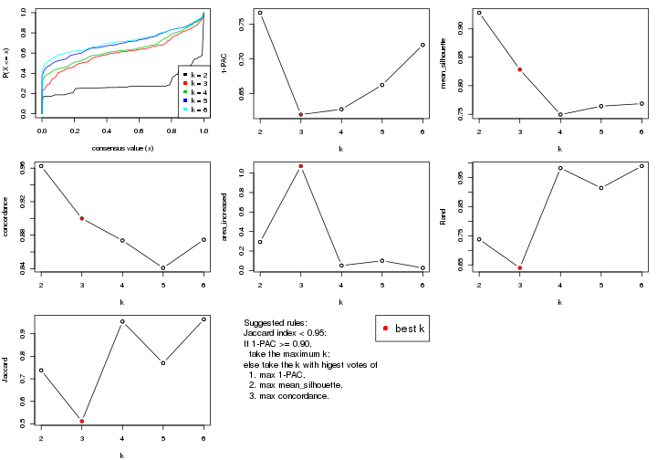

The numeric values for all these statistics can be obtained by `get_stats()`.

```r
get_stats(res)
```

```
#>   k 1-PAC mean_silhouette concordance area_increased  Rand Jaccard
#> 2 2 0.767           0.928       0.962         0.2928 0.738   0.738
#> 3 3 0.620           0.828       0.900         1.0713 0.640   0.512
#> 4 4 0.628           0.750       0.874         0.0510 0.983   0.955
#> 5 5 0.662           0.764       0.841         0.1000 0.915   0.770
#> 6 6 0.720           0.769       0.875         0.0267 0.990   0.964
```

`suggest_best_k()` suggests the best $k$ based on these statistics. The rules are as follows:

- All $k$ with Jaccard index larger than 0.95 are removed because the increase of
  the partition number does not provides enough extra information. If all $k$ are removed,
  the best $k$ is assigned by `NA`.
- For $k$ with 1-PAC larger than 0.9, the maximal $k$ is taken as the "best k". Other $k$ is called "optional k".
- If it does not fit the second rule. The $k$ with the highest vote of highest
  1-PAC, mean silhouette and concordance is taken as the "best k".

```r
suggest_best_k(res)
```

```
#> [1] 3
```


Following shows the table of the partitions (You need to click the **show/hide
code output** link to see it). The membership matrix (columns with name `p*`)
is inferred by
[`clue::cl_consensus()`](https://www.rdocumentation.org/link/cl_consensus?package=clue)
function with the `SE` method. Basically the value in the membership matrix
represents the probability to belong to a certain group. The finall class
label for an item is determined with the group with highest probability it
belongs to.

In `get_classes()` function, the entropy is calculated from the membership
matrix and the silhouette score is calculated from the consensus matrix.


<script>
$( function() {
	$( '#tabs-ATC-hclust-get-classes' ).tabs();
} );
</script>
<div id='tabs-ATC-hclust-get-classes'>
<ul>
<li><a href='#tab-ATC-hclust-get-classes-1'>k = 2</a></li>
<li><a href='#tab-ATC-hclust-get-classes-2'>k = 3</a></li>
<li><a href='#tab-ATC-hclust-get-classes-3'>k = 4</a></li>
<li><a href='#tab-ATC-hclust-get-classes-4'>k = 5</a></li>
<li><a href='#tab-ATC-hclust-get-classes-5'>k = 6</a></li>
</ul>

<div id='tab-ATC-hclust-get-classes-1'>
<p><a id='tab-ATC-hclust-get-classes-1-a' style='color:#0366d6' href='#'>show/hide code output</a></p>
<pre><code class="r">cbind(get_classes(res, k = 2), get_membership(res, k = 2))
</code></pre>

<pre><code>#&gt;           class entropy silhouette    p1    p2
#&gt; GSM550785     2  0.5737      0.860 0.136 0.864
#&gt; GSM550786     2  0.0000      0.959 0.000 1.000
#&gt; GSM550788     2  0.0000      0.959 0.000 1.000
#&gt; GSM550789     2  0.0000      0.959 0.000 1.000
#&gt; GSM550790     2  0.6801      0.818 0.180 0.820
#&gt; GSM550791     2  0.3584      0.917 0.068 0.932
#&gt; GSM550792     2  0.0376      0.957 0.004 0.996
#&gt; GSM550796     2  0.0000      0.959 0.000 1.000
#&gt; GSM550797     2  0.0000      0.959 0.000 1.000
#&gt; GSM550799     2  0.0000      0.959 0.000 1.000
#&gt; GSM550800     2  0.0000      0.959 0.000 1.000
#&gt; GSM550801     2  0.0000      0.959 0.000 1.000
#&gt; GSM550804     2  0.0000      0.959 0.000 1.000
#&gt; GSM550806     2  0.0672      0.956 0.008 0.992
#&gt; GSM550807     2  0.0000      0.959 0.000 1.000
#&gt; GSM550808     2  0.0000      0.959 0.000 1.000
#&gt; GSM550809     2  0.4022      0.909 0.080 0.920
#&gt; GSM550810     2  0.0000      0.959 0.000 1.000
#&gt; GSM550811     2  0.3733      0.914 0.072 0.928
#&gt; GSM550813     2  0.0000      0.959 0.000 1.000
#&gt; GSM550814     2  0.0000      0.959 0.000 1.000
#&gt; GSM550815     2  0.0000      0.959 0.000 1.000
#&gt; GSM550816     2  0.0000      0.959 0.000 1.000
#&gt; GSM550817     2  0.0000      0.959 0.000 1.000
#&gt; GSM550818     2  0.0000      0.959 0.000 1.000
#&gt; GSM550819     2  0.0000      0.959 0.000 1.000
#&gt; GSM550820     2  0.7139      0.798 0.196 0.804
#&gt; GSM550821     2  0.0000      0.959 0.000 1.000
#&gt; GSM550822     2  0.0000      0.959 0.000 1.000
#&gt; GSM550826     2  0.7139      0.798 0.196 0.804
#&gt; GSM550832     2  0.0000      0.959 0.000 1.000
#&gt; GSM550833     2  0.0000      0.959 0.000 1.000
#&gt; GSM550835     2  0.0000      0.959 0.000 1.000
#&gt; GSM550836     1  0.0000      0.970 1.000 0.000
#&gt; GSM550837     2  0.0000      0.959 0.000 1.000
#&gt; GSM550838     2  0.4022      0.909 0.080 0.920
#&gt; GSM550841     2  0.0000      0.959 0.000 1.000
#&gt; GSM550842     2  0.0000      0.959 0.000 1.000
#&gt; GSM550846     2  0.0376      0.957 0.004 0.996
#&gt; GSM550849     2  0.2043      0.941 0.032 0.968
#&gt; GSM550850     2  0.6343      0.838 0.160 0.840
#&gt; GSM550851     2  0.0000      0.959 0.000 1.000
#&gt; GSM550852     2  0.0000      0.959 0.000 1.000
#&gt; GSM550853     2  0.0000      0.959 0.000 1.000
#&gt; GSM550855     2  0.0000      0.959 0.000 1.000
#&gt; GSM550856     2  0.0000      0.959 0.000 1.000
#&gt; GSM550861     2  0.0000      0.959 0.000 1.000
#&gt; GSM550863     2  0.0376      0.957 0.004 0.996
#&gt; GSM550864     2  0.0000      0.959 0.000 1.000
#&gt; GSM550866     2  0.0000      0.959 0.000 1.000
#&gt; GSM550867     1  0.0000      0.970 1.000 0.000
#&gt; GSM550885     1  0.0000      0.970 1.000 0.000
#&gt; GSM550886     2  0.0000      0.959 0.000 1.000
#&gt; GSM550887     2  0.0000      0.959 0.000 1.000
#&gt; GSM550889     2  0.7376      0.783 0.208 0.792
#&gt; GSM550894     2  0.0000      0.959 0.000 1.000
#&gt; GSM550897     2  0.6343      0.838 0.160 0.840
#&gt; GSM550903     2  0.0000      0.959 0.000 1.000
#&gt; GSM550905     2  0.0000      0.959 0.000 1.000
#&gt; GSM550906     2  0.0000      0.959 0.000 1.000
#&gt; GSM550907     2  0.0000      0.959 0.000 1.000
#&gt; GSM550909     2  0.0000      0.959 0.000 1.000
#&gt; GSM550911     2  0.0000      0.959 0.000 1.000
#&gt; GSM550913     2  0.0000      0.959 0.000 1.000
#&gt; GSM550915     2  0.0376      0.957 0.004 0.996
#&gt; GSM550917     2  0.0000      0.959 0.000 1.000
#&gt; GSM550919     2  0.0672      0.956 0.008 0.992
#&gt; GSM550921     1  0.0000      0.970 1.000 0.000
#&gt; GSM550924     2  0.0672      0.956 0.008 0.992
#&gt; GSM550926     2  0.0000      0.959 0.000 1.000
#&gt; GSM550927     2  0.0000      0.959 0.000 1.000
#&gt; GSM550787     2  0.0938      0.954 0.012 0.988
#&gt; GSM550793     2  0.9970      0.206 0.468 0.532
#&gt; GSM550794     2  0.0000      0.959 0.000 1.000
#&gt; GSM550795     2  0.7299      0.788 0.204 0.796
#&gt; GSM550798     1  0.0000      0.970 1.000 0.000
#&gt; GSM550803     1  0.0000      0.970 1.000 0.000
#&gt; GSM550805     2  0.0672      0.956 0.008 0.992
#&gt; GSM550823     2  0.0672      0.956 0.008 0.992
#&gt; GSM550824     1  0.0000      0.970 1.000 0.000
#&gt; GSM550825     1  0.0000      0.970 1.000 0.000
#&gt; GSM550827     2  0.0376      0.957 0.004 0.996
#&gt; GSM550828     2  0.7219      0.793 0.200 0.800
#&gt; GSM550829     1  0.0000      0.970 1.000 0.000
#&gt; GSM550830     2  0.0672      0.956 0.008 0.992
#&gt; GSM550834     2  0.3584      0.917 0.068 0.932
#&gt; GSM550839     2  0.0000      0.959 0.000 1.000
#&gt; GSM550840     2  0.3584      0.917 0.068 0.932
#&gt; GSM550843     2  0.0000      0.959 0.000 1.000
#&gt; GSM550844     2  0.7139      0.798 0.196 0.804
#&gt; GSM550845     2  0.0000      0.959 0.000 1.000
#&gt; GSM550848     2  0.0376      0.957 0.004 0.996
#&gt; GSM550854     1  0.0000      0.970 1.000 0.000
#&gt; GSM550857     1  0.0000      0.970 1.000 0.000
#&gt; GSM550858     1  0.7056      0.761 0.808 0.192
#&gt; GSM550859     1  0.0000      0.970 1.000 0.000
#&gt; GSM550862     1  0.7056      0.761 0.808 0.192
#&gt; GSM550865     2  0.3431      0.921 0.064 0.936
#&gt; GSM550868     2  0.0376      0.957 0.004 0.996
#&gt; GSM550869     2  0.0672      0.956 0.008 0.992
#&gt; GSM550870     2  0.0000      0.959 0.000 1.000
#&gt; GSM550871     2  0.0000      0.959 0.000 1.000
#&gt; GSM550872     2  0.0000      0.959 0.000 1.000
#&gt; GSM550873     2  0.0000      0.959 0.000 1.000
#&gt; GSM550874     2  0.0000      0.959 0.000 1.000
#&gt; GSM550876     2  0.0000      0.959 0.000 1.000
#&gt; GSM550877     2  0.0000      0.959 0.000 1.000
#&gt; GSM550878     2  0.0000      0.959 0.000 1.000
#&gt; GSM550879     2  0.6343      0.838 0.160 0.840
#&gt; GSM550882     2  0.7376      0.783 0.208 0.792
#&gt; GSM550888     1  0.0000      0.970 1.000 0.000
#&gt; GSM550890     2  0.0376      0.957 0.004 0.996
#&gt; GSM550891     1  0.0000      0.970 1.000 0.000
#&gt; GSM550892     2  0.7376      0.783 0.208 0.792
#&gt; GSM550893     2  0.0000      0.959 0.000 1.000
#&gt; GSM550895     2  0.0000      0.959 0.000 1.000
#&gt; GSM550896     2  0.0000      0.959 0.000 1.000
#&gt; GSM550898     1  0.0000      0.970 1.000 0.000
#&gt; GSM550899     2  0.0000      0.959 0.000 1.000
#&gt; GSM550900     2  0.0000      0.959 0.000 1.000
#&gt; GSM550901     2  0.0672      0.956 0.008 0.992
#&gt; GSM550902     2  0.6343      0.838 0.160 0.840
#&gt; GSM550904     1  0.7139      0.754 0.804 0.196
#&gt; GSM550908     1  0.0000      0.970 1.000 0.000
#&gt; GSM550912     2  0.0000      0.959 0.000 1.000
#&gt; GSM550914     2  0.0672      0.956 0.008 0.992
#&gt; GSM550918     2  0.0000      0.959 0.000 1.000
#&gt; GSM550922     2  0.0000      0.959 0.000 1.000
#&gt; GSM550923     1  0.0000      0.970 1.000 0.000
#&gt; GSM550925     2  0.7376      0.783 0.208 0.792
#&gt; GSM550802     2  0.0000      0.959 0.000 1.000
#&gt; GSM550812     2  0.0000      0.959 0.000 1.000
#&gt; GSM550831     2  0.6343      0.838 0.160 0.840
#&gt; GSM550847     1  0.0000      0.970 1.000 0.000
#&gt; GSM550860     2  0.6048      0.850 0.148 0.852
#&gt; GSM550875     2  0.6343      0.838 0.160 0.840
#&gt; GSM550880     2  0.0672      0.956 0.008 0.992
#&gt; GSM550881     2  0.7815      0.750 0.232 0.768
#&gt; GSM550883     1  0.0000      0.970 1.000 0.000
#&gt; GSM550884     2  0.0376      0.957 0.004 0.996
#&gt; GSM550910     2  0.0000      0.959 0.000 1.000
#&gt; GSM550916     2  0.6801      0.818 0.180 0.820
#&gt; GSM550920     2  0.0376      0.957 0.004 0.996
</code></pre>

<script>
$('#tab-ATC-hclust-get-classes-1-a').parent().next().next().hide();
$('#tab-ATC-hclust-get-classes-1-a').click(function(){
  $('#tab-ATC-hclust-get-classes-1-a').parent().next().next().toggle();
  return(false);
});
</script>
</div>

<div id='tab-ATC-hclust-get-classes-2'>
<p><a id='tab-ATC-hclust-get-classes-2-a' style='color:#0366d6' href='#'>show/hide code output</a></p>
<pre><code class="r">cbind(get_classes(res, k = 3), get_membership(res, k = 3))
</code></pre>

<pre><code>#&gt;           class entropy silhouette    p1    p2    p3
#&gt; GSM550785     1  0.2356     0.8660 0.928 0.000 0.072
#&gt; GSM550786     1  0.6295    -0.0896 0.528 0.472 0.000
#&gt; GSM550788     2  0.1289     0.8630 0.032 0.968 0.000
#&gt; GSM550789     2  0.0000     0.8560 0.000 1.000 0.000
#&gt; GSM550790     1  0.3267     0.8472 0.884 0.000 0.116
#&gt; GSM550791     1  0.1919     0.8860 0.956 0.020 0.024
#&gt; GSM550792     1  0.2165     0.8882 0.936 0.064 0.000
#&gt; GSM550796     2  0.0000     0.8560 0.000 1.000 0.000
#&gt; GSM550797     2  0.0000     0.8560 0.000 1.000 0.000
#&gt; GSM550799     2  0.4931     0.7677 0.232 0.768 0.000
#&gt; GSM550800     2  0.1163     0.8630 0.028 0.972 0.000
#&gt; GSM550801     2  0.0000     0.8560 0.000 1.000 0.000
#&gt; GSM550804     2  0.1163     0.8630 0.028 0.972 0.000
#&gt; GSM550806     1  0.1964     0.8916 0.944 0.056 0.000
#&gt; GSM550807     2  0.1163     0.8630 0.028 0.972 0.000
#&gt; GSM550808     2  0.0000     0.8560 0.000 1.000 0.000
#&gt; GSM550809     1  0.0747     0.8790 0.984 0.000 0.016
#&gt; GSM550810     2  0.0000     0.8560 0.000 1.000 0.000
#&gt; GSM550811     1  0.2050     0.8856 0.952 0.020 0.028
#&gt; GSM550813     2  0.5905     0.6057 0.352 0.648 0.000
#&gt; GSM550814     2  0.4974     0.7649 0.236 0.764 0.000
#&gt; GSM550815     2  0.0000     0.8560 0.000 1.000 0.000
#&gt; GSM550816     2  0.0000     0.8560 0.000 1.000 0.000
#&gt; GSM550817     2  0.0237     0.8574 0.004 0.996 0.000
#&gt; GSM550818     2  0.1289     0.8626 0.032 0.968 0.000
#&gt; GSM550819     2  0.5058     0.7574 0.244 0.756 0.000
#&gt; GSM550820     1  0.3551     0.8365 0.868 0.000 0.132
#&gt; GSM550821     2  0.1163     0.8630 0.028 0.972 0.000
#&gt; GSM550822     2  0.0000     0.8560 0.000 1.000 0.000
#&gt; GSM550826     1  0.3551     0.8365 0.868 0.000 0.132
#&gt; GSM550832     2  0.1163     0.8630 0.028 0.972 0.000
#&gt; GSM550833     2  0.0000     0.8560 0.000 1.000 0.000
#&gt; GSM550835     2  0.4974     0.7649 0.236 0.764 0.000
#&gt; GSM550836     3  0.0000     0.9655 0.000 0.000 1.000
#&gt; GSM550837     2  0.0000     0.8560 0.000 1.000 0.000
#&gt; GSM550838     1  0.0747     0.8790 0.984 0.000 0.016
#&gt; GSM550841     2  0.0000     0.8560 0.000 1.000 0.000
#&gt; GSM550842     2  0.0000     0.8560 0.000 1.000 0.000
#&gt; GSM550846     1  0.2066     0.8903 0.940 0.060 0.000
#&gt; GSM550849     1  0.1289     0.8894 0.968 0.032 0.000
#&gt; GSM550850     1  0.2878     0.8581 0.904 0.000 0.096
#&gt; GSM550851     2  0.0000     0.8560 0.000 1.000 0.000
#&gt; GSM550852     2  0.6140     0.4858 0.404 0.596 0.000
#&gt; GSM550853     2  0.0000     0.8560 0.000 1.000 0.000
#&gt; GSM550855     2  0.1163     0.8630 0.028 0.972 0.000
#&gt; GSM550856     2  0.5016     0.7613 0.240 0.760 0.000
#&gt; GSM550861     2  0.1643     0.8628 0.044 0.956 0.000
#&gt; GSM550863     1  0.2066     0.8900 0.940 0.060 0.000
#&gt; GSM550864     2  0.5905     0.6057 0.352 0.648 0.000
#&gt; GSM550866     2  0.5905     0.6057 0.352 0.648 0.000
#&gt; GSM550867     3  0.0000     0.9655 0.000 0.000 1.000
#&gt; GSM550885     3  0.0000     0.9655 0.000 0.000 1.000
#&gt; GSM550886     2  0.4178     0.8107 0.172 0.828 0.000
#&gt; GSM550887     2  0.0000     0.8560 0.000 1.000 0.000
#&gt; GSM550889     1  0.3752     0.8267 0.856 0.000 0.144
#&gt; GSM550894     2  0.0237     0.8575 0.004 0.996 0.000
#&gt; GSM550897     1  0.2878     0.8580 0.904 0.000 0.096
#&gt; GSM550903     2  0.1643     0.8628 0.044 0.956 0.000
#&gt; GSM550905     2  0.2165     0.8599 0.064 0.936 0.000
#&gt; GSM550906     2  0.1289     0.8630 0.032 0.968 0.000
#&gt; GSM550907     2  0.3038     0.8479 0.104 0.896 0.000
#&gt; GSM550909     2  0.0000     0.8560 0.000 1.000 0.000
#&gt; GSM550911     1  0.5431     0.5469 0.716 0.284 0.000
#&gt; GSM550913     2  0.0000     0.8560 0.000 1.000 0.000
#&gt; GSM550915     1  0.2066     0.8903 0.940 0.060 0.000
#&gt; GSM550917     2  0.5016     0.7613 0.240 0.760 0.000
#&gt; GSM550919     1  0.1964     0.8916 0.944 0.056 0.000
#&gt; GSM550921     3  0.0000     0.9655 0.000 0.000 1.000
#&gt; GSM550924     1  0.1964     0.8916 0.944 0.056 0.000
#&gt; GSM550926     2  0.5016     0.7613 0.240 0.760 0.000
#&gt; GSM550927     2  0.0000     0.8560 0.000 1.000 0.000
#&gt; GSM550787     1  0.1860     0.8919 0.948 0.052 0.000
#&gt; GSM550793     1  0.6140     0.3647 0.596 0.000 0.404
#&gt; GSM550794     1  0.5621     0.5087 0.692 0.308 0.000
#&gt; GSM550795     1  0.3686     0.8300 0.860 0.000 0.140
#&gt; GSM550798     3  0.0000     0.9655 0.000 0.000 1.000
#&gt; GSM550803     3  0.0000     0.9655 0.000 0.000 1.000
#&gt; GSM550805     1  0.1964     0.8916 0.944 0.056 0.000
#&gt; GSM550823     1  0.1964     0.8916 0.944 0.056 0.000
#&gt; GSM550824     3  0.0000     0.9655 0.000 0.000 1.000
#&gt; GSM550825     3  0.0000     0.9655 0.000 0.000 1.000
#&gt; GSM550827     1  0.2066     0.8900 0.940 0.060 0.000
#&gt; GSM550828     1  0.3619     0.8339 0.864 0.000 0.136
#&gt; GSM550829     3  0.0000     0.9655 0.000 0.000 1.000
#&gt; GSM550830     1  0.1964     0.8916 0.944 0.056 0.000
#&gt; GSM550834     1  0.1919     0.8860 0.956 0.020 0.024
#&gt; GSM550839     2  0.3551     0.8349 0.132 0.868 0.000
#&gt; GSM550840     1  0.1919     0.8860 0.956 0.020 0.024
#&gt; GSM550843     2  0.5926     0.5900 0.356 0.644 0.000
#&gt; GSM550844     1  0.3551     0.8365 0.868 0.000 0.132
#&gt; GSM550845     2  0.5733     0.6490 0.324 0.676 0.000
#&gt; GSM550848     1  0.3412     0.8283 0.876 0.124 0.000
#&gt; GSM550854     3  0.0000     0.9655 0.000 0.000 1.000
#&gt; GSM550857     3  0.0000     0.9655 0.000 0.000 1.000
#&gt; GSM550858     3  0.4842     0.7225 0.224 0.000 0.776
#&gt; GSM550859     3  0.0000     0.9655 0.000 0.000 1.000
#&gt; GSM550862     3  0.4842     0.7225 0.224 0.000 0.776
#&gt; GSM550865     1  0.1781     0.8878 0.960 0.020 0.020
#&gt; GSM550868     1  0.2066     0.8900 0.940 0.060 0.000
#&gt; GSM550869     1  0.1964     0.8916 0.944 0.056 0.000
#&gt; GSM550870     2  0.5138     0.7488 0.252 0.748 0.000
#&gt; GSM550871     1  0.5138     0.6372 0.748 0.252 0.000
#&gt; GSM550872     1  0.2537     0.8797 0.920 0.080 0.000
#&gt; GSM550873     2  0.6192     0.4457 0.420 0.580 0.000
#&gt; GSM550874     2  0.5733     0.6490 0.324 0.676 0.000
#&gt; GSM550876     1  0.2711     0.8726 0.912 0.088 0.000
#&gt; GSM550877     2  0.5016     0.7613 0.240 0.760 0.000
#&gt; GSM550878     1  0.2537     0.8797 0.920 0.080 0.000
#&gt; GSM550879     1  0.2878     0.8580 0.904 0.000 0.096
#&gt; GSM550882     1  0.3752     0.8267 0.856 0.000 0.144
#&gt; GSM550888     3  0.0000     0.9655 0.000 0.000 1.000
#&gt; GSM550890     1  0.2066     0.8903 0.940 0.060 0.000
#&gt; GSM550891     3  0.0000     0.9655 0.000 0.000 1.000
#&gt; GSM550892     1  0.3752     0.8267 0.856 0.000 0.144
#&gt; GSM550893     2  0.4931     0.7677 0.232 0.768 0.000
#&gt; GSM550895     1  0.2537     0.8797 0.920 0.080 0.000
#&gt; GSM550896     2  0.0237     0.8575 0.004 0.996 0.000
#&gt; GSM550898     3  0.0000     0.9655 0.000 0.000 1.000
#&gt; GSM550899     2  0.5678     0.6674 0.316 0.684 0.000
#&gt; GSM550900     1  0.2537     0.8797 0.920 0.080 0.000
#&gt; GSM550901     1  0.1964     0.8916 0.944 0.056 0.000
#&gt; GSM550902     1  0.2878     0.8580 0.904 0.000 0.096
#&gt; GSM550904     3  0.4887     0.7149 0.228 0.000 0.772
#&gt; GSM550908     3  0.0000     0.9655 0.000 0.000 1.000
#&gt; GSM550912     2  0.6305     0.2439 0.484 0.516 0.000
#&gt; GSM550914     1  0.1964     0.8918 0.944 0.056 0.000
#&gt; GSM550918     2  0.5016     0.7613 0.240 0.760 0.000
#&gt; GSM550922     2  0.1643     0.8628 0.044 0.956 0.000
#&gt; GSM550923     3  0.0000     0.9655 0.000 0.000 1.000
#&gt; GSM550925     1  0.3752     0.8267 0.856 0.000 0.144
#&gt; GSM550802     2  0.3551     0.8349 0.132 0.868 0.000
#&gt; GSM550812     2  0.3551     0.8349 0.132 0.868 0.000
#&gt; GSM550831     1  0.2878     0.8581 0.904 0.000 0.096
#&gt; GSM550847     3  0.0000     0.9655 0.000 0.000 1.000
#&gt; GSM550860     1  0.2625     0.8627 0.916 0.000 0.084
#&gt; GSM550875     1  0.2878     0.8580 0.904 0.000 0.096
#&gt; GSM550880     1  0.1964     0.8918 0.944 0.056 0.000
#&gt; GSM550881     1  0.4121     0.8005 0.832 0.000 0.168
#&gt; GSM550883     3  0.0000     0.9655 0.000 0.000 1.000
#&gt; GSM550884     1  0.2066     0.8900 0.940 0.060 0.000
#&gt; GSM550910     2  0.3116     0.8464 0.108 0.892 0.000
#&gt; GSM550916     1  0.3267     0.8472 0.884 0.000 0.116
#&gt; GSM550920     1  0.2066     0.8903 0.940 0.060 0.000
</code></pre>

<script>
$('#tab-ATC-hclust-get-classes-2-a').parent().next().next().hide();
$('#tab-ATC-hclust-get-classes-2-a').click(function(){
  $('#tab-ATC-hclust-get-classes-2-a').parent().next().next().toggle();
  return(false);
});
</script>
</div>

<div id='tab-ATC-hclust-get-classes-3'>
<p><a id='tab-ATC-hclust-get-classes-3-a' style='color:#0366d6' href='#'>show/hide code output</a></p>
<pre><code class="r">cbind(get_classes(res, k = 4), get_membership(res, k = 4))
</code></pre>

<pre><code>#&gt;           class entropy silhouette    p1    p2    p3    p4
#&gt; GSM550785     4  0.3400     0.7898 0.000 0.000 0.180 0.820
#&gt; GSM550786     4  0.4916    -0.0536 0.000 0.424 0.000 0.576
#&gt; GSM550788     2  0.1389     0.8143 0.000 0.952 0.000 0.048
#&gt; GSM550789     2  0.0592     0.7995 0.000 0.984 0.016 0.000
#&gt; GSM550790     4  0.4123     0.7686 0.008 0.000 0.220 0.772
#&gt; GSM550791     4  0.2714     0.8085 0.000 0.004 0.112 0.884
#&gt; GSM550792     4  0.0592     0.8076 0.000 0.016 0.000 0.984
#&gt; GSM550796     2  0.0592     0.7995 0.000 0.984 0.016 0.000
#&gt; GSM550797     2  0.0592     0.7995 0.000 0.984 0.016 0.000
#&gt; GSM550799     2  0.4164     0.7114 0.000 0.736 0.000 0.264
#&gt; GSM550800     2  0.1474     0.8143 0.000 0.948 0.000 0.052
#&gt; GSM550801     2  0.0592     0.7995 0.000 0.984 0.016 0.000
#&gt; GSM550804     2  0.1474     0.8143 0.000 0.948 0.000 0.052
#&gt; GSM550806     4  0.0188     0.8133 0.000 0.004 0.000 0.996
#&gt; GSM550807     2  0.1474     0.8143 0.000 0.948 0.000 0.052
#&gt; GSM550808     2  0.0592     0.7995 0.000 0.984 0.016 0.000
#&gt; GSM550809     4  0.2760     0.8025 0.000 0.000 0.128 0.872
#&gt; GSM550810     2  0.0592     0.7995 0.000 0.984 0.016 0.000
#&gt; GSM550811     4  0.2773     0.8082 0.000 0.004 0.116 0.880
#&gt; GSM550813     2  0.4830     0.5424 0.000 0.608 0.000 0.392
#&gt; GSM550814     2  0.4193     0.7085 0.000 0.732 0.000 0.268
#&gt; GSM550815     2  0.0592     0.7995 0.000 0.984 0.016 0.000
#&gt; GSM550816     2  0.0592     0.7995 0.000 0.984 0.016 0.000
#&gt; GSM550817     2  0.0657     0.8025 0.000 0.984 0.012 0.004
#&gt; GSM550818     2  0.1767     0.8095 0.000 0.944 0.012 0.044
#&gt; GSM550819     2  0.4250     0.7009 0.000 0.724 0.000 0.276
#&gt; GSM550820     4  0.4262     0.7586 0.008 0.000 0.236 0.756
#&gt; GSM550821     2  0.1474     0.8143 0.000 0.948 0.000 0.052
#&gt; GSM550822     2  0.0592     0.7995 0.000 0.984 0.016 0.000
#&gt; GSM550826     4  0.4262     0.7586 0.008 0.000 0.236 0.756
#&gt; GSM550832     2  0.1474     0.8143 0.000 0.948 0.000 0.052
#&gt; GSM550833     2  0.0592     0.7995 0.000 0.984 0.016 0.000
#&gt; GSM550835     2  0.4193     0.7085 0.000 0.732 0.000 0.268
#&gt; GSM550836     1  0.0000     0.8986 1.000 0.000 0.000 0.000
#&gt; GSM550837     2  0.0592     0.7995 0.000 0.984 0.016 0.000
#&gt; GSM550838     4  0.2760     0.8025 0.000 0.000 0.128 0.872
#&gt; GSM550841     2  0.0592     0.7995 0.000 0.984 0.016 0.000
#&gt; GSM550842     2  0.0592     0.7995 0.000 0.984 0.016 0.000
#&gt; GSM550846     4  0.0469     0.8098 0.000 0.012 0.000 0.988
#&gt; GSM550849     4  0.1576     0.8126 0.000 0.004 0.048 0.948
#&gt; GSM550850     4  0.3688     0.7799 0.000 0.000 0.208 0.792
#&gt; GSM550851     2  0.0592     0.7995 0.000 0.984 0.016 0.000
#&gt; GSM550852     2  0.4941     0.4319 0.000 0.564 0.000 0.436
#&gt; GSM550853     2  0.0927     0.8025 0.000 0.976 0.016 0.008
#&gt; GSM550855     2  0.1474     0.8143 0.000 0.948 0.000 0.052
#&gt; GSM550856     2  0.4222     0.7050 0.000 0.728 0.000 0.272
#&gt; GSM550861     2  0.1792     0.8121 0.000 0.932 0.000 0.068
#&gt; GSM550863     4  0.0469     0.8097 0.000 0.012 0.000 0.988
#&gt; GSM550864     2  0.4830     0.5424 0.000 0.608 0.000 0.392
#&gt; GSM550866     2  0.4830     0.5424 0.000 0.608 0.000 0.392
#&gt; GSM550867     1  0.0000     0.8986 1.000 0.000 0.000 0.000
#&gt; GSM550885     1  0.0000     0.8986 1.000 0.000 0.000 0.000
#&gt; GSM550886     2  0.3569     0.7578 0.000 0.804 0.000 0.196
#&gt; GSM550887     2  0.0592     0.7995 0.000 0.984 0.016 0.000
#&gt; GSM550889     4  0.4535     0.7485 0.016 0.000 0.240 0.744
#&gt; GSM550894     2  0.1004     0.8098 0.000 0.972 0.004 0.024
#&gt; GSM550897     4  0.3649     0.7821 0.000 0.000 0.204 0.796
#&gt; GSM550903     2  0.1792     0.8121 0.000 0.932 0.000 0.068
#&gt; GSM550905     2  0.2149     0.8072 0.000 0.912 0.000 0.088
#&gt; GSM550906     2  0.1389     0.8143 0.000 0.952 0.000 0.048
#&gt; GSM550907     2  0.2868     0.7927 0.000 0.864 0.000 0.136
#&gt; GSM550909     2  0.0592     0.7995 0.000 0.984 0.016 0.000
#&gt; GSM550911     3  0.4535     0.0000 0.000 0.016 0.744 0.240
#&gt; GSM550913     2  0.0592     0.7995 0.000 0.984 0.016 0.000
#&gt; GSM550915     4  0.0469     0.8098 0.000 0.012 0.000 0.988
#&gt; GSM550917     2  0.4222     0.7050 0.000 0.728 0.000 0.272
#&gt; GSM550919     4  0.0188     0.8133 0.000 0.004 0.000 0.996
#&gt; GSM550921     1  0.0000     0.8986 1.000 0.000 0.000 0.000
#&gt; GSM550924     4  0.0188     0.8133 0.000 0.004 0.000 0.996
#&gt; GSM550926     2  0.4222     0.7050 0.000 0.728 0.000 0.272
#&gt; GSM550927     2  0.0592     0.7995 0.000 0.984 0.016 0.000
#&gt; GSM550787     4  0.0524     0.8143 0.000 0.004 0.008 0.988
#&gt; GSM550793     4  0.7480     0.2920 0.276 0.000 0.224 0.500
#&gt; GSM550794     4  0.4134     0.4200 0.000 0.260 0.000 0.740
#&gt; GSM550795     4  0.4502     0.7519 0.016 0.000 0.236 0.748
#&gt; GSM550798     1  0.0000     0.8986 1.000 0.000 0.000 0.000
#&gt; GSM550803     1  0.0000     0.8986 1.000 0.000 0.000 0.000
#&gt; GSM550805     4  0.0188     0.8133 0.000 0.004 0.000 0.996
#&gt; GSM550823     4  0.0188     0.8133 0.000 0.004 0.000 0.996
#&gt; GSM550824     1  0.0000     0.8986 1.000 0.000 0.000 0.000
#&gt; GSM550825     1  0.2704     0.8206 0.876 0.000 0.124 0.000
#&gt; GSM550827     4  0.0469     0.8097 0.000 0.012 0.000 0.988
#&gt; GSM550828     4  0.4387     0.7559 0.012 0.000 0.236 0.752
#&gt; GSM550829     1  0.2704     0.8206 0.876 0.000 0.124 0.000
#&gt; GSM550830     4  0.0188     0.8133 0.000 0.004 0.000 0.996
#&gt; GSM550834     4  0.2714     0.8085 0.000 0.004 0.112 0.884
#&gt; GSM550839     2  0.3123     0.7777 0.000 0.844 0.000 0.156
#&gt; GSM550840     4  0.2714     0.8085 0.000 0.004 0.112 0.884
#&gt; GSM550843     2  0.4843     0.5234 0.000 0.604 0.000 0.396
#&gt; GSM550844     4  0.4262     0.7586 0.008 0.000 0.236 0.756
#&gt; GSM550845     2  0.4730     0.5805 0.000 0.636 0.000 0.364
#&gt; GSM550848     4  0.1940     0.7333 0.000 0.076 0.000 0.924
#&gt; GSM550854     1  0.0000     0.8986 1.000 0.000 0.000 0.000
#&gt; GSM550857     1  0.0000     0.8986 1.000 0.000 0.000 0.000
#&gt; GSM550858     1  0.6429     0.4631 0.648 0.000 0.160 0.192
#&gt; GSM550859     1  0.0000     0.8986 1.000 0.000 0.000 0.000
#&gt; GSM550862     1  0.6429     0.4631 0.648 0.000 0.160 0.192
#&gt; GSM550865     4  0.2216     0.8141 0.000 0.000 0.092 0.908
#&gt; GSM550868     4  0.0469     0.8097 0.000 0.012 0.000 0.988
#&gt; GSM550869     4  0.0376     0.8141 0.000 0.004 0.004 0.992
#&gt; GSM550870     2  0.4356     0.6831 0.000 0.708 0.000 0.292
#&gt; GSM550871     4  0.3649     0.5325 0.000 0.204 0.000 0.796
#&gt; GSM550872     4  0.0921     0.8029 0.000 0.028 0.000 0.972
#&gt; GSM550873     2  0.4977     0.3937 0.000 0.540 0.000 0.460
#&gt; GSM550874     2  0.4730     0.5805 0.000 0.636 0.000 0.364
#&gt; GSM550876     4  0.1211     0.7907 0.000 0.040 0.000 0.960
#&gt; GSM550877     2  0.4222     0.7050 0.000 0.728 0.000 0.272
#&gt; GSM550878     4  0.1022     0.7994 0.000 0.032 0.000 0.968
#&gt; GSM550879     4  0.3649     0.7821 0.000 0.000 0.204 0.796
#&gt; GSM550882     4  0.4535     0.7485 0.016 0.000 0.240 0.744
#&gt; GSM550888     1  0.0000     0.8986 1.000 0.000 0.000 0.000
#&gt; GSM550890     4  0.0469     0.8098 0.000 0.012 0.000 0.988
#&gt; GSM550891     1  0.2081     0.8500 0.916 0.000 0.084 0.000
#&gt; GSM550892     4  0.4535     0.7485 0.016 0.000 0.240 0.744
#&gt; GSM550893     2  0.4164     0.7114 0.000 0.736 0.000 0.264
#&gt; GSM550895     4  0.1022     0.7994 0.000 0.032 0.000 0.968
#&gt; GSM550896     2  0.1109     0.8107 0.000 0.968 0.004 0.028
#&gt; GSM550898     1  0.0000     0.8986 1.000 0.000 0.000 0.000
#&gt; GSM550899     2  0.4697     0.6010 0.000 0.644 0.000 0.356
#&gt; GSM550900     4  0.1022     0.7994 0.000 0.032 0.000 0.968
#&gt; GSM550901     4  0.0188     0.8133 0.000 0.004 0.000 0.996
#&gt; GSM550902     4  0.3649     0.7821 0.000 0.000 0.204 0.796
#&gt; GSM550904     1  0.6463     0.4529 0.644 0.000 0.160 0.196
#&gt; GSM550908     1  0.0000     0.8986 1.000 0.000 0.000 0.000
#&gt; GSM550912     4  0.4989    -0.2404 0.000 0.472 0.000 0.528
#&gt; GSM550914     4  0.0657     0.8120 0.000 0.012 0.004 0.984
#&gt; GSM550918     2  0.4222     0.7050 0.000 0.728 0.000 0.272
#&gt; GSM550922     2  0.1792     0.8121 0.000 0.932 0.000 0.068
#&gt; GSM550923     1  0.0000     0.8986 1.000 0.000 0.000 0.000
#&gt; GSM550925     4  0.4535     0.7485 0.016 0.000 0.240 0.744
#&gt; GSM550802     2  0.3123     0.7777 0.000 0.844 0.000 0.156
#&gt; GSM550812     2  0.3123     0.7777 0.000 0.844 0.000 0.156
#&gt; GSM550831     4  0.3688     0.7799 0.000 0.000 0.208 0.792
#&gt; GSM550847     1  0.2704     0.8206 0.876 0.000 0.124 0.000
#&gt; GSM550860     4  0.3768     0.7865 0.008 0.000 0.184 0.808
#&gt; GSM550875     4  0.3649     0.7821 0.000 0.000 0.204 0.796
#&gt; GSM550880     4  0.0657     0.8120 0.000 0.012 0.004 0.984
#&gt; GSM550881     4  0.5123     0.7232 0.044 0.000 0.232 0.724
#&gt; GSM550883     1  0.0188     0.8966 0.996 0.000 0.004 0.000
#&gt; GSM550884     4  0.0469     0.8097 0.000 0.012 0.000 0.988
#&gt; GSM550910     2  0.2868     0.7925 0.000 0.864 0.000 0.136
#&gt; GSM550916     4  0.4123     0.7686 0.008 0.000 0.220 0.772
#&gt; GSM550920     4  0.0469     0.8098 0.000 0.012 0.000 0.988
</code></pre>

<script>
$('#tab-ATC-hclust-get-classes-3-a').parent().next().next().hide();
$('#tab-ATC-hclust-get-classes-3-a').click(function(){
  $('#tab-ATC-hclust-get-classes-3-a').parent().next().next().toggle();
  return(false);
});
</script>
</div>

<div id='tab-ATC-hclust-get-classes-4'>
<p><a id='tab-ATC-hclust-get-classes-4-a' style='color:#0366d6' href='#'>show/hide code output</a></p>
<pre><code class="r">cbind(get_classes(res, k = 5), get_membership(res, k = 5))
</code></pre>

<pre><code>#&gt;           class entropy silhouette    p1    p2    p3    p4    p5
#&gt; GSM550785     1  0.3452    0.84772 0.756 0.000 0.000 0.244 0.000
#&gt; GSM550786     4  0.4201    0.00699 0.000 0.408 0.000 0.592 0.000
#&gt; GSM550788     2  0.1478    0.84047 0.000 0.936 0.000 0.064 0.000
#&gt; GSM550789     2  0.0000    0.82260 0.000 1.000 0.000 0.000 0.000
#&gt; GSM550790     1  0.3048    0.85125 0.820 0.000 0.004 0.176 0.000
#&gt; GSM550791     1  0.4659    0.52617 0.500 0.000 0.000 0.488 0.012
#&gt; GSM550792     4  0.0324    0.88207 0.004 0.004 0.000 0.992 0.000
#&gt; GSM550796     2  0.0000    0.82260 0.000 1.000 0.000 0.000 0.000
#&gt; GSM550797     2  0.0000    0.82260 0.000 1.000 0.000 0.000 0.000
#&gt; GSM550799     2  0.3684    0.74516 0.000 0.720 0.000 0.280 0.000
#&gt; GSM550800     2  0.1544    0.84072 0.000 0.932 0.000 0.068 0.000
#&gt; GSM550801     2  0.0000    0.82260 0.000 1.000 0.000 0.000 0.000
#&gt; GSM550804     2  0.1544    0.84072 0.000 0.932 0.000 0.068 0.000
#&gt; GSM550806     4  0.0798    0.87378 0.016 0.000 0.000 0.976 0.008
#&gt; GSM550807     2  0.1544    0.84072 0.000 0.932 0.000 0.068 0.000
#&gt; GSM550808     2  0.0000    0.82260 0.000 1.000 0.000 0.000 0.000
#&gt; GSM550809     1  0.3942    0.82609 0.728 0.000 0.000 0.260 0.012
#&gt; GSM550810     2  0.0000    0.82260 0.000 1.000 0.000 0.000 0.000
#&gt; GSM550811     1  0.4658    0.53436 0.504 0.000 0.000 0.484 0.012
#&gt; GSM550813     2  0.4201    0.56233 0.000 0.592 0.000 0.408 0.000
#&gt; GSM550814     2  0.3707    0.74178 0.000 0.716 0.000 0.284 0.000
#&gt; GSM550815     2  0.0000    0.82260 0.000 1.000 0.000 0.000 0.000
#&gt; GSM550816     2  0.0000    0.82260 0.000 1.000 0.000 0.000 0.000
#&gt; GSM550817     2  0.0290    0.82568 0.000 0.992 0.000 0.008 0.000
#&gt; GSM550818     2  0.1197    0.83445 0.000 0.952 0.000 0.048 0.000
#&gt; GSM550819     2  0.3752    0.73475 0.000 0.708 0.000 0.292 0.000
#&gt; GSM550820     1  0.2690    0.84604 0.844 0.000 0.000 0.156 0.000
#&gt; GSM550821     2  0.1544    0.84072 0.000 0.932 0.000 0.068 0.000
#&gt; GSM550822     2  0.0000    0.82260 0.000 1.000 0.000 0.000 0.000
#&gt; GSM550826     1  0.2732    0.84819 0.840 0.000 0.000 0.160 0.000
#&gt; GSM550832     2  0.1544    0.84072 0.000 0.932 0.000 0.068 0.000
#&gt; GSM550833     2  0.0000    0.82260 0.000 1.000 0.000 0.000 0.000
#&gt; GSM550835     2  0.3707    0.74178 0.000 0.716 0.000 0.284 0.000
#&gt; GSM550836     3  0.0000    0.85792 0.000 0.000 1.000 0.000 0.000
#&gt; GSM550837     2  0.0000    0.82260 0.000 1.000 0.000 0.000 0.000
#&gt; GSM550838     1  0.3942    0.82609 0.728 0.000 0.000 0.260 0.012
#&gt; GSM550841     2  0.0000    0.82260 0.000 1.000 0.000 0.000 0.000
#&gt; GSM550842     2  0.0000    0.82260 0.000 1.000 0.000 0.000 0.000
#&gt; GSM550846     4  0.0162    0.88231 0.004 0.000 0.000 0.996 0.000
#&gt; GSM550849     4  0.4401    0.04343 0.328 0.000 0.000 0.656 0.016
#&gt; GSM550850     1  0.3333    0.85437 0.788 0.000 0.000 0.208 0.004
#&gt; GSM550851     2  0.0000    0.82260 0.000 1.000 0.000 0.000 0.000
#&gt; GSM550852     2  0.4278    0.44448 0.000 0.548 0.000 0.452 0.000
#&gt; GSM550853     2  0.0290    0.82595 0.000 0.992 0.000 0.008 0.000
#&gt; GSM550855     2  0.1544    0.84072 0.000 0.932 0.000 0.068 0.000
#&gt; GSM550856     2  0.3730    0.73832 0.000 0.712 0.000 0.288 0.000
#&gt; GSM550861     2  0.1792    0.84004 0.000 0.916 0.000 0.084 0.000
#&gt; GSM550863     4  0.0162    0.88258 0.004 0.000 0.000 0.996 0.000
#&gt; GSM550864     2  0.4201    0.56233 0.000 0.592 0.000 0.408 0.000
#&gt; GSM550866     2  0.4201    0.56233 0.000 0.592 0.000 0.408 0.000
#&gt; GSM550867     3  0.0000    0.85792 0.000 0.000 1.000 0.000 0.000
#&gt; GSM550885     3  0.0000    0.85792 0.000 0.000 1.000 0.000 0.000
#&gt; GSM550886     2  0.3210    0.79339 0.000 0.788 0.000 0.212 0.000
#&gt; GSM550887     2  0.0000    0.82260 0.000 1.000 0.000 0.000 0.000
#&gt; GSM550889     1  0.2763    0.84020 0.848 0.000 0.004 0.148 0.000
#&gt; GSM550894     2  0.0963    0.83447 0.000 0.964 0.000 0.036 0.000
#&gt; GSM550897     1  0.3635    0.84486 0.748 0.000 0.000 0.248 0.004
#&gt; GSM550903     2  0.1792    0.84004 0.000 0.916 0.000 0.084 0.000
#&gt; GSM550905     2  0.2074    0.83689 0.000 0.896 0.000 0.104 0.000
#&gt; GSM550906     2  0.1478    0.84047 0.000 0.936 0.000 0.064 0.000
#&gt; GSM550907     2  0.2648    0.82592 0.000 0.848 0.000 0.152 0.000
#&gt; GSM550909     2  0.0000    0.82260 0.000 1.000 0.000 0.000 0.000
#&gt; GSM550911     5  0.0162    0.00000 0.000 0.000 0.000 0.004 0.996
#&gt; GSM550913     2  0.0000    0.82260 0.000 1.000 0.000 0.000 0.000
#&gt; GSM550915     4  0.0162    0.88231 0.004 0.000 0.000 0.996 0.000
#&gt; GSM550917     2  0.3730    0.73832 0.000 0.712 0.000 0.288 0.000
#&gt; GSM550919     4  0.0798    0.87378 0.016 0.000 0.000 0.976 0.008
#&gt; GSM550921     3  0.0000    0.85792 0.000 0.000 1.000 0.000 0.000
#&gt; GSM550924     4  0.0798    0.87378 0.016 0.000 0.000 0.976 0.008
#&gt; GSM550926     2  0.3730    0.73832 0.000 0.712 0.000 0.288 0.000
#&gt; GSM550927     2  0.0000    0.82260 0.000 1.000 0.000 0.000 0.000
#&gt; GSM550787     4  0.1670    0.82453 0.052 0.000 0.000 0.936 0.012
#&gt; GSM550793     1  0.3914    0.48944 0.788 0.000 0.164 0.048 0.000
#&gt; GSM550794     4  0.3452    0.54351 0.000 0.244 0.000 0.756 0.000
#&gt; GSM550795     1  0.2806    0.84326 0.844 0.000 0.004 0.152 0.000
#&gt; GSM550798     3  0.0000    0.85792 0.000 0.000 1.000 0.000 0.000
#&gt; GSM550803     3  0.0000    0.85792 0.000 0.000 1.000 0.000 0.000
#&gt; GSM550805     4  0.0798    0.87378 0.016 0.000 0.000 0.976 0.008
#&gt; GSM550823     4  0.0798    0.87378 0.016 0.000 0.000 0.976 0.008
#&gt; GSM550824     3  0.0000    0.85792 0.000 0.000 1.000 0.000 0.000
#&gt; GSM550825     3  0.3561    0.70176 0.260 0.000 0.740 0.000 0.000
#&gt; GSM550827     4  0.0162    0.88258 0.004 0.000 0.000 0.996 0.000
#&gt; GSM550828     1  0.2848    0.84585 0.840 0.000 0.004 0.156 0.000
#&gt; GSM550829     3  0.3561    0.70176 0.260 0.000 0.740 0.000 0.000
#&gt; GSM550830     4  0.0798    0.87378 0.016 0.000 0.000 0.976 0.008
#&gt; GSM550834     1  0.4659    0.52617 0.500 0.000 0.000 0.488 0.012
#&gt; GSM550839     2  0.2852    0.81345 0.000 0.828 0.000 0.172 0.000
#&gt; GSM550840     1  0.4656    0.54276 0.508 0.000 0.000 0.480 0.012
#&gt; GSM550843     2  0.4210    0.54920 0.000 0.588 0.000 0.412 0.000
#&gt; GSM550844     1  0.2732    0.84819 0.840 0.000 0.000 0.160 0.000
#&gt; GSM550845     2  0.4126    0.61239 0.000 0.620 0.000 0.380 0.000
#&gt; GSM550848     4  0.1638    0.82316 0.004 0.064 0.000 0.932 0.000
#&gt; GSM550854     3  0.0000    0.85792 0.000 0.000 1.000 0.000 0.000
#&gt; GSM550857     3  0.0000    0.85792 0.000 0.000 1.000 0.000 0.000
#&gt; GSM550858     3  0.4821    0.40442 0.464 0.000 0.516 0.020 0.000
#&gt; GSM550859     3  0.0000    0.85792 0.000 0.000 1.000 0.000 0.000
#&gt; GSM550862     3  0.4821    0.40442 0.464 0.000 0.516 0.020 0.000
#&gt; GSM550865     1  0.4648    0.52192 0.524 0.000 0.000 0.464 0.012
#&gt; GSM550868     4  0.0162    0.88258 0.004 0.000 0.000 0.996 0.000
#&gt; GSM550869     4  0.1484    0.84084 0.048 0.000 0.000 0.944 0.008
#&gt; GSM550870     2  0.3837    0.71631 0.000 0.692 0.000 0.308 0.000
#&gt; GSM550871     4  0.3003    0.64936 0.000 0.188 0.000 0.812 0.000
#&gt; GSM550872     4  0.0960    0.87734 0.004 0.016 0.000 0.972 0.008
#&gt; GSM550873     2  0.4300    0.38877 0.000 0.524 0.000 0.476 0.000
#&gt; GSM550874     2  0.4126    0.61239 0.000 0.620 0.000 0.380 0.000
#&gt; GSM550876     4  0.0703    0.86737 0.000 0.024 0.000 0.976 0.000
#&gt; GSM550877     2  0.3730    0.73832 0.000 0.712 0.000 0.288 0.000
#&gt; GSM550878     4  0.0510    0.87435 0.000 0.016 0.000 0.984 0.000
#&gt; GSM550879     1  0.3635    0.84486 0.748 0.000 0.000 0.248 0.004
#&gt; GSM550882     1  0.2763    0.84020 0.848 0.000 0.004 0.148 0.000
#&gt; GSM550888     3  0.0000    0.85792 0.000 0.000 1.000 0.000 0.000
#&gt; GSM550890     4  0.0162    0.88231 0.004 0.000 0.000 0.996 0.000
#&gt; GSM550891     3  0.3452    0.71718 0.244 0.000 0.756 0.000 0.000
#&gt; GSM550892     1  0.2763    0.84020 0.848 0.000 0.004 0.148 0.000
#&gt; GSM550893     2  0.3684    0.74516 0.000 0.720 0.000 0.280 0.000
#&gt; GSM550895     4  0.0510    0.87435 0.000 0.016 0.000 0.984 0.000
#&gt; GSM550896     2  0.1043    0.83556 0.000 0.960 0.000 0.040 0.000
#&gt; GSM550898     3  0.0000    0.85792 0.000 0.000 1.000 0.000 0.000
#&gt; GSM550899     2  0.4101    0.62703 0.000 0.628 0.000 0.372 0.000
#&gt; GSM550900     4  0.0510    0.87435 0.000 0.016 0.000 0.984 0.000
#&gt; GSM550901     4  0.0798    0.87378 0.016 0.000 0.000 0.976 0.008
#&gt; GSM550902     1  0.3635    0.84486 0.748 0.000 0.000 0.248 0.004
#&gt; GSM550904     3  0.4897    0.39946 0.460 0.000 0.516 0.024 0.000
#&gt; GSM550908     3  0.0000    0.85792 0.000 0.000 1.000 0.000 0.000
#&gt; GSM550912     4  0.4283   -0.19238 0.000 0.456 0.000 0.544 0.000
#&gt; GSM550914     4  0.0324    0.88115 0.004 0.000 0.000 0.992 0.004
#&gt; GSM550918     2  0.3730    0.73832 0.000 0.712 0.000 0.288 0.000
#&gt; GSM550922     2  0.1792    0.84004 0.000 0.916 0.000 0.084 0.000
#&gt; GSM550923     3  0.0000    0.85792 0.000 0.000 1.000 0.000 0.000
#&gt; GSM550925     1  0.2763    0.84020 0.848 0.000 0.004 0.148 0.000
#&gt; GSM550802     2  0.2852    0.81345 0.000 0.828 0.000 0.172 0.000
#&gt; GSM550812     2  0.2852    0.81345 0.000 0.828 0.000 0.172 0.000
#&gt; GSM550831     1  0.3333    0.85437 0.788 0.000 0.000 0.208 0.004
#&gt; GSM550847     3  0.3561    0.70176 0.260 0.000 0.740 0.000 0.000
#&gt; GSM550860     1  0.3635    0.84703 0.748 0.000 0.004 0.248 0.000
#&gt; GSM550875     1  0.3635    0.84486 0.748 0.000 0.000 0.248 0.004
#&gt; GSM550880     4  0.0324    0.88115 0.004 0.000 0.000 0.992 0.004
#&gt; GSM550881     1  0.3495    0.82602 0.816 0.000 0.032 0.152 0.000
#&gt; GSM550883     3  0.0510    0.85076 0.016 0.000 0.984 0.000 0.000
#&gt; GSM550884     4  0.0162    0.88258 0.004 0.000 0.000 0.996 0.000
#&gt; GSM550910     2  0.2648    0.82583 0.000 0.848 0.000 0.152 0.000
#&gt; GSM550916     1  0.3048    0.85125 0.820 0.000 0.004 0.176 0.000
#&gt; GSM550920     4  0.0162    0.88231 0.004 0.000 0.000 0.996 0.000
</code></pre>

<script>
$('#tab-ATC-hclust-get-classes-4-a').parent().next().next().hide();
$('#tab-ATC-hclust-get-classes-4-a').click(function(){
  $('#tab-ATC-hclust-get-classes-4-a').parent().next().next().toggle();
  return(false);
});
</script>
</div>

<div id='tab-ATC-hclust-get-classes-5'>
<p><a id='tab-ATC-hclust-get-classes-5-a' style='color:#0366d6' href='#'>show/hide code output</a></p>
<pre><code class="r">cbind(get_classes(res, k = 6), get_membership(res, k = 6))
</code></pre>

<pre><code>#&gt;           class entropy silhouette    p1    p2    p3    p4 p5    p6
#&gt; GSM550785     6  0.1584     0.8161 0.000 0.000 0.008 0.064  0 0.928
#&gt; GSM550786     4  0.3774     0.0414 0.000 0.408 0.000 0.592  0 0.000
#&gt; GSM550788     2  0.1327     0.8413 0.000 0.936 0.000 0.064  0 0.000
#&gt; GSM550789     2  0.0000     0.8234 0.000 1.000 0.000 0.000  0 0.000
#&gt; GSM550790     6  0.0363     0.8195 0.000 0.000 0.012 0.000  0 0.988
#&gt; GSM550791     6  0.4118     0.5095 0.000 0.000 0.020 0.352  0 0.628
#&gt; GSM550792     4  0.0291     0.8779 0.000 0.004 0.000 0.992  0 0.004
#&gt; GSM550796     2  0.0000     0.8234 0.000 1.000 0.000 0.000  0 0.000
#&gt; GSM550797     2  0.0000     0.8234 0.000 1.000 0.000 0.000  0 0.000
#&gt; GSM550799     2  0.3309     0.7400 0.000 0.720 0.000 0.280  0 0.000
#&gt; GSM550800     2  0.1387     0.8415 0.000 0.932 0.000 0.068  0 0.000
#&gt; GSM550801     2  0.0000     0.8234 0.000 1.000 0.000 0.000  0 0.000
#&gt; GSM550804     2  0.1387     0.8415 0.000 0.932 0.000 0.068  0 0.000
#&gt; GSM550806     4  0.0820     0.8691 0.000 0.000 0.012 0.972  0 0.016
#&gt; GSM550807     2  0.1387     0.8415 0.000 0.932 0.000 0.068  0 0.000
#&gt; GSM550808     2  0.0000     0.8234 0.000 1.000 0.000 0.000  0 0.000
#&gt; GSM550809     6  0.2001     0.7989 0.000 0.000 0.048 0.040  0 0.912
#&gt; GSM550810     2  0.0000     0.8234 0.000 1.000 0.000 0.000  0 0.000
#&gt; GSM550811     6  0.4039     0.5111 0.000 0.000 0.016 0.352  0 0.632
#&gt; GSM550813     2  0.3774     0.5543 0.000 0.592 0.000 0.408  0 0.000
#&gt; GSM550814     2  0.3330     0.7370 0.000 0.716 0.000 0.284  0 0.000
#&gt; GSM550815     2  0.0000     0.8234 0.000 1.000 0.000 0.000  0 0.000
#&gt; GSM550816     2  0.0000     0.8234 0.000 1.000 0.000 0.000  0 0.000
#&gt; GSM550817     2  0.0260     0.8265 0.000 0.992 0.000 0.008  0 0.000
#&gt; GSM550818     2  0.1075     0.8353 0.000 0.952 0.000 0.048  0 0.000
#&gt; GSM550819     2  0.3371     0.7298 0.000 0.708 0.000 0.292  0 0.000
#&gt; GSM550820     6  0.0713     0.8191 0.000 0.000 0.028 0.000  0 0.972
#&gt; GSM550821     2  0.1387     0.8415 0.000 0.932 0.000 0.068  0 0.000
#&gt; GSM550822     2  0.0000     0.8234 0.000 1.000 0.000 0.000  0 0.000
#&gt; GSM550826     6  0.0858     0.8214 0.000 0.000 0.028 0.004  0 0.968
#&gt; GSM550832     2  0.1387     0.8415 0.000 0.932 0.000 0.068  0 0.000
#&gt; GSM550833     2  0.0000     0.8234 0.000 1.000 0.000 0.000  0 0.000
#&gt; GSM550835     2  0.3330     0.7370 0.000 0.716 0.000 0.284  0 0.000
#&gt; GSM550836     1  0.0000     0.9907 1.000 0.000 0.000 0.000  0 0.000
#&gt; GSM550837     2  0.0000     0.8234 0.000 1.000 0.000 0.000  0 0.000
#&gt; GSM550838     6  0.2001     0.7989 0.000 0.000 0.048 0.040  0 0.912
#&gt; GSM550841     2  0.0000     0.8234 0.000 1.000 0.000 0.000  0 0.000
#&gt; GSM550842     2  0.0000     0.8234 0.000 1.000 0.000 0.000  0 0.000
#&gt; GSM550846     4  0.0508     0.8758 0.000 0.000 0.012 0.984  0 0.004
#&gt; GSM550849     4  0.4751    -0.1420 0.000 0.000 0.048 0.500  0 0.452
#&gt; GSM550850     6  0.0806     0.8241 0.000 0.000 0.008 0.020  0 0.972
#&gt; GSM550851     2  0.0000     0.8234 0.000 1.000 0.000 0.000  0 0.000
#&gt; GSM550852     2  0.3843     0.4290 0.000 0.548 0.000 0.452  0 0.000
#&gt; GSM550853     2  0.0260     0.8267 0.000 0.992 0.000 0.008  0 0.000
#&gt; GSM550855     2  0.1387     0.8415 0.000 0.932 0.000 0.068  0 0.000
#&gt; GSM550856     2  0.3351     0.7334 0.000 0.712 0.000 0.288  0 0.000
#&gt; GSM550861     2  0.1610     0.8409 0.000 0.916 0.000 0.084  0 0.000
#&gt; GSM550863     4  0.0146     0.8777 0.000 0.000 0.000 0.996  0 0.004
#&gt; GSM550864     2  0.3774     0.5543 0.000 0.592 0.000 0.408  0 0.000
#&gt; GSM550866     2  0.3774     0.5543 0.000 0.592 0.000 0.408  0 0.000
#&gt; GSM550867     1  0.0000     0.9907 1.000 0.000 0.000 0.000  0 0.000
#&gt; GSM550885     1  0.0000     0.9907 1.000 0.000 0.000 0.000  0 0.000
#&gt; GSM550886     2  0.2883     0.7899 0.000 0.788 0.000 0.212  0 0.000
#&gt; GSM550887     2  0.0000     0.8234 0.000 1.000 0.000 0.000  0 0.000
#&gt; GSM550889     6  0.0937     0.8163 0.000 0.000 0.040 0.000  0 0.960
#&gt; GSM550894     2  0.0865     0.8353 0.000 0.964 0.000 0.036  0 0.000
#&gt; GSM550897     6  0.2412     0.8054 0.000 0.000 0.028 0.092  0 0.880
#&gt; GSM550903     2  0.1610     0.8409 0.000 0.916 0.000 0.084  0 0.000
#&gt; GSM550905     2  0.1863     0.8377 0.000 0.896 0.000 0.104  0 0.000
#&gt; GSM550906     2  0.1327     0.8413 0.000 0.936 0.000 0.064  0 0.000
#&gt; GSM550907     2  0.2378     0.8258 0.000 0.848 0.000 0.152  0 0.000
#&gt; GSM550909     2  0.0000     0.8234 0.000 1.000 0.000 0.000  0 0.000
#&gt; GSM550911     5  0.0000     0.0000 0.000 0.000 0.000 0.000  1 0.000
#&gt; GSM550913     2  0.0000     0.8234 0.000 1.000 0.000 0.000  0 0.000
#&gt; GSM550915     4  0.0508     0.8758 0.000 0.000 0.012 0.984  0 0.004
#&gt; GSM550917     2  0.3351     0.7334 0.000 0.712 0.000 0.288  0 0.000
#&gt; GSM550919     4  0.0820     0.8691 0.000 0.000 0.012 0.972  0 0.016
#&gt; GSM550921     1  0.0000     0.9907 1.000 0.000 0.000 0.000  0 0.000
#&gt; GSM550924     4  0.0820     0.8691 0.000 0.000 0.012 0.972  0 0.016
#&gt; GSM550926     2  0.3351     0.7334 0.000 0.712 0.000 0.288  0 0.000
#&gt; GSM550927     2  0.0000     0.8234 0.000 1.000 0.000 0.000  0 0.000
#&gt; GSM550787     4  0.2358     0.7747 0.000 0.000 0.016 0.876  0 0.108
#&gt; GSM550793     6  0.3690     0.4250 0.012 0.000 0.288 0.000  0 0.700
#&gt; GSM550794     4  0.3101     0.5583 0.000 0.244 0.000 0.756  0 0.000
#&gt; GSM550795     6  0.0865     0.8171 0.000 0.000 0.036 0.000  0 0.964
#&gt; GSM550798     1  0.0000     0.9907 1.000 0.000 0.000 0.000  0 0.000
#&gt; GSM550803     1  0.0000     0.9907 1.000 0.000 0.000 0.000  0 0.000
#&gt; GSM550805     4  0.0820     0.8691 0.000 0.000 0.012 0.972  0 0.016
#&gt; GSM550823     4  0.0820     0.8691 0.000 0.000 0.012 0.972  0 0.016
#&gt; GSM550824     1  0.0000     0.9907 1.000 0.000 0.000 0.000  0 0.000
#&gt; GSM550825     3  0.5254     0.6388 0.392 0.000 0.508 0.000  0 0.100
#&gt; GSM550827     4  0.0146     0.8777 0.000 0.000 0.000 0.996  0 0.004
#&gt; GSM550828     6  0.0790     0.8185 0.000 0.000 0.032 0.000  0 0.968
#&gt; GSM550829     3  0.5254     0.6388 0.392 0.000 0.508 0.000  0 0.100
#&gt; GSM550830     4  0.0820     0.8691 0.000 0.000 0.012 0.972  0 0.016
#&gt; GSM550834     6  0.4118     0.5095 0.000 0.000 0.020 0.352  0 0.628
#&gt; GSM550839     2  0.2562     0.8124 0.000 0.828 0.000 0.172  0 0.000
#&gt; GSM550840     6  0.4092     0.5192 0.000 0.000 0.020 0.344  0 0.636
#&gt; GSM550843     2  0.3782     0.5401 0.000 0.588 0.000 0.412  0 0.000
#&gt; GSM550844     6  0.0858     0.8214 0.000 0.000 0.028 0.004  0 0.968
#&gt; GSM550845     2  0.3706     0.6043 0.000 0.620 0.000 0.380  0 0.000
#&gt; GSM550848     4  0.1471     0.8216 0.000 0.064 0.000 0.932  0 0.004
#&gt; GSM550854     1  0.0000     0.9907 1.000 0.000 0.000 0.000  0 0.000
#&gt; GSM550857     1  0.0000     0.9907 1.000 0.000 0.000 0.000  0 0.000
#&gt; GSM550858     3  0.5711     0.6615 0.180 0.000 0.492 0.000  0 0.328
#&gt; GSM550859     1  0.0000     0.9907 1.000 0.000 0.000 0.000  0 0.000
#&gt; GSM550862     3  0.5711     0.6615 0.180 0.000 0.492 0.000  0 0.328
#&gt; GSM550865     6  0.3835     0.5319 0.000 0.000 0.016 0.300  0 0.684
#&gt; GSM550868     4  0.0146     0.8777 0.000 0.000 0.000 0.996  0 0.004
#&gt; GSM550869     4  0.1625     0.8309 0.000 0.000 0.012 0.928  0 0.060
#&gt; GSM550870     2  0.3446     0.7109 0.000 0.692 0.000 0.308  0 0.000
#&gt; GSM550871     4  0.2697     0.6635 0.000 0.188 0.000 0.812  0 0.000
#&gt; GSM550872     4  0.0862     0.8750 0.000 0.016 0.008 0.972  0 0.004
#&gt; GSM550873     2  0.3862     0.3716 0.000 0.524 0.000 0.476  0 0.000
#&gt; GSM550874     2  0.3706     0.6043 0.000 0.620 0.000 0.380  0 0.000
#&gt; GSM550876     4  0.0632     0.8651 0.000 0.024 0.000 0.976  0 0.000
#&gt; GSM550877     2  0.3351     0.7334 0.000 0.712 0.000 0.288  0 0.000
#&gt; GSM550878     4  0.0458     0.8715 0.000 0.016 0.000 0.984  0 0.000
#&gt; GSM550879     6  0.2412     0.8054 0.000 0.000 0.028 0.092  0 0.880
#&gt; GSM550882     6  0.0937     0.8163 0.000 0.000 0.040 0.000  0 0.960
#&gt; GSM550888     1  0.0000     0.9907 1.000 0.000 0.000 0.000  0 0.000
#&gt; GSM550890     4  0.0508     0.8758 0.000 0.000 0.012 0.984  0 0.004
#&gt; GSM550891     3  0.1564     0.1180 0.024 0.000 0.936 0.000  0 0.040
#&gt; GSM550892     6  0.0937     0.8163 0.000 0.000 0.040 0.000  0 0.960
#&gt; GSM550893     2  0.3309     0.7400 0.000 0.720 0.000 0.280  0 0.000
#&gt; GSM550895     4  0.0458     0.8715 0.000 0.016 0.000 0.984  0 0.000
#&gt; GSM550896     2  0.0937     0.8363 0.000 0.960 0.000 0.040  0 0.000
#&gt; GSM550898     1  0.0000     0.9907 1.000 0.000 0.000 0.000  0 0.000
#&gt; GSM550899     2  0.3684     0.6209 0.000 0.628 0.000 0.372  0 0.000
#&gt; GSM550900     4  0.0458     0.8715 0.000 0.016 0.000 0.984  0 0.000
#&gt; GSM550901     4  0.0820     0.8691 0.000 0.000 0.012 0.972  0 0.016
#&gt; GSM550902     6  0.2412     0.8054 0.000 0.000 0.028 0.092  0 0.880
#&gt; GSM550904     3  0.5720     0.6533 0.180 0.000 0.488 0.000  0 0.332
#&gt; GSM550908     1  0.0000     0.9907 1.000 0.000 0.000 0.000  0 0.000
#&gt; GSM550912     4  0.3847    -0.1898 0.000 0.456 0.000 0.544  0 0.000
#&gt; GSM550914     4  0.0603     0.8747 0.000 0.000 0.016 0.980  0 0.004
#&gt; GSM550918     2  0.3351     0.7334 0.000 0.712 0.000 0.288  0 0.000
#&gt; GSM550922     2  0.1610     0.8409 0.000 0.916 0.000 0.084  0 0.000
#&gt; GSM550923     1  0.0000     0.9907 1.000 0.000 0.000 0.000  0 0.000
#&gt; GSM550925     6  0.0937     0.8163 0.000 0.000 0.040 0.000  0 0.960
#&gt; GSM550802     2  0.2562     0.8124 0.000 0.828 0.000 0.172  0 0.000
#&gt; GSM550812     2  0.2562     0.8124 0.000 0.828 0.000 0.172  0 0.000
#&gt; GSM550831     6  0.0806     0.8241 0.000 0.000 0.008 0.020  0 0.972
#&gt; GSM550847     3  0.5254     0.6388 0.392 0.000 0.508 0.000  0 0.100
#&gt; GSM550860     6  0.1858     0.8126 0.000 0.000 0.012 0.076  0 0.912
#&gt; GSM550875     6  0.2412     0.8054 0.000 0.000 0.028 0.092  0 0.880
#&gt; GSM550880     4  0.0603     0.8747 0.000 0.000 0.016 0.980  0 0.004
#&gt; GSM550881     6  0.1327     0.7970 0.000 0.000 0.064 0.000  0 0.936
#&gt; GSM550883     1  0.1858     0.8534 0.904 0.000 0.092 0.000  0 0.004
#&gt; GSM550884     4  0.0146     0.8777 0.000 0.000 0.000 0.996  0 0.004
#&gt; GSM550910     2  0.2378     0.8258 0.000 0.848 0.000 0.152  0 0.000
#&gt; GSM550916     6  0.0363     0.8195 0.000 0.000 0.012 0.000  0 0.988
#&gt; GSM550920     4  0.0508     0.8758 0.000 0.000 0.012 0.984  0 0.004
</code></pre>

<script>
$('#tab-ATC-hclust-get-classes-5-a').parent().next().next().hide();
$('#tab-ATC-hclust-get-classes-5-a').click(function(){
  $('#tab-ATC-hclust-get-classes-5-a').parent().next().next().toggle();
  return(false);
});
</script>
</div>
</div>

Heatmaps for the consensus matrix. It visualizes the probability of two
samples to be in a same group.


<script>
$( function() {
	$( '#tabs-ATC-hclust-consensus-heatmap' ).tabs();
} );
</script>
<div id='tabs-ATC-hclust-consensus-heatmap'>
<ul>
<li><a href='#tab-ATC-hclust-consensus-heatmap-1'>k = 2</a></li>
<li><a href='#tab-ATC-hclust-consensus-heatmap-2'>k = 3</a></li>
<li><a href='#tab-ATC-hclust-consensus-heatmap-3'>k = 4</a></li>
<li><a href='#tab-ATC-hclust-consensus-heatmap-4'>k = 5</a></li>
<li><a href='#tab-ATC-hclust-consensus-heatmap-5'>k = 6</a></li>
</ul>
<div id='tab-ATC-hclust-consensus-heatmap-1'>
<pre><code class="r">consensus_heatmap(res, k = 2)
</code></pre>

<p></p>

</div>
<div id='tab-ATC-hclust-consensus-heatmap-2'>
<pre><code class="r">consensus_heatmap(res, k = 3)
</code></pre>

<p></p>

</div>
<div id='tab-ATC-hclust-consensus-heatmap-3'>
<pre><code class="r">consensus_heatmap(res, k = 4)
</code></pre>

<p></p>

</div>
<div id='tab-ATC-hclust-consensus-heatmap-4'>
<pre><code class="r">consensus_heatmap(res, k = 5)
</code></pre>

<p>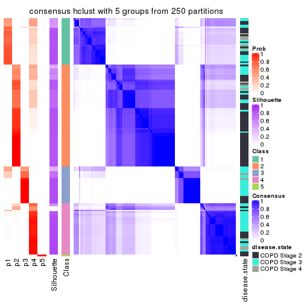</p>

</div>
<div id='tab-ATC-hclust-consensus-heatmap-5'>
<pre><code class="r">consensus_heatmap(res, k = 6)
</code></pre>

<p></p>

</div>
</div>

Heatmaps for the membership of samples in all partitions to see how consistent they are:


<script>
$( function() {
	$( '#tabs-ATC-hclust-membership-heatmap' ).tabs();
} );
</script>
<div id='tabs-ATC-hclust-membership-heatmap'>
<ul>
<li><a href='#tab-ATC-hclust-membership-heatmap-1'>k = 2</a></li>
<li><a href='#tab-ATC-hclust-membership-heatmap-2'>k = 3</a></li>
<li><a href='#tab-ATC-hclust-membership-heatmap-3'>k = 4</a></li>
<li><a href='#tab-ATC-hclust-membership-heatmap-4'>k = 5</a></li>
<li><a href='#tab-ATC-hclust-membership-heatmap-5'>k = 6</a></li>
</ul>
<div id='tab-ATC-hclust-membership-heatmap-1'>
<pre><code class="r">membership_heatmap(res, k = 2)
</code></pre>

<p></p>

</div>
<div id='tab-ATC-hclust-membership-heatmap-2'>
<pre><code class="r">membership_heatmap(res, k = 3)
</code></pre>

<p></p>

</div>
<div id='tab-ATC-hclust-membership-heatmap-3'>
<pre><code class="r">membership_heatmap(res, k = 4)
</code></pre>

<p></p>

</div>
<div id='tab-ATC-hclust-membership-heatmap-4'>
<pre><code class="r">membership_heatmap(res, k = 5)
</code></pre>

<p></p>

</div>
<div id='tab-ATC-hclust-membership-heatmap-5'>
<pre><code class="r">membership_heatmap(res, k = 6)
</code></pre>

<p></p>

</div>
</div>

As soon as we have had the classes for columns, we can look for signatures
which are significantly different between classes which can be candidate marks
for certain classes. Following are the heatmaps for signatures.


Signature heatmaps where rows are scaled:


<script>
$( function() {
	$( '#tabs-ATC-hclust-get-signatures' ).tabs();
} );
</script>
<div id='tabs-ATC-hclust-get-signatures'>
<ul>
<li><a href='#tab-ATC-hclust-get-signatures-1'>k = 2</a></li>
<li><a href='#tab-ATC-hclust-get-signatures-2'>k = 3</a></li>
<li><a href='#tab-ATC-hclust-get-signatures-3'>k = 4</a></li>
<li><a href='#tab-ATC-hclust-get-signatures-4'>k = 5</a></li>
<li><a href='#tab-ATC-hclust-get-signatures-5'>k = 6</a></li>
</ul>
<div id='tab-ATC-hclust-get-signatures-1'>
<pre><code class="r">get_signatures(res, k = 2)
</code></pre>

<p></p>

</div>
<div id='tab-ATC-hclust-get-signatures-2'>
<pre><code class="r">get_signatures(res, k = 3)
</code></pre>

<p></p>

</div>
<div id='tab-ATC-hclust-get-signatures-3'>
<pre><code class="r">get_signatures(res, k = 4)
</code></pre>

<p></p>

</div>
<div id='tab-ATC-hclust-get-signatures-4'>
<pre><code class="r">get_signatures(res, k = 5)
</code></pre>

<p></p>

</div>
<div id='tab-ATC-hclust-get-signatures-5'>
<pre><code class="r">get_signatures(res, k = 6)
</code></pre>

<p></p>

</div>
</div>


Signature heatmaps where rows are not scaled:


<script>
$( function() {
	$( '#tabs-ATC-hclust-get-signatures-no-scale' ).tabs();
} );
</script>
<div id='tabs-ATC-hclust-get-signatures-no-scale'>
<ul>
<li><a href='#tab-ATC-hclust-get-signatures-no-scale-1'>k = 2</a></li>
<li><a href='#tab-ATC-hclust-get-signatures-no-scale-2'>k = 3</a></li>
<li><a href='#tab-ATC-hclust-get-signatures-no-scale-3'>k = 4</a></li>
<li><a href='#tab-ATC-hclust-get-signatures-no-scale-4'>k = 5</a></li>
<li><a href='#tab-ATC-hclust-get-signatures-no-scale-5'>k = 6</a></li>
</ul>
<div id='tab-ATC-hclust-get-signatures-no-scale-1'>
<pre><code class="r">get_signatures(res, k = 2, scale_rows = FALSE)
</code></pre>

<p></p>

</div>
<div id='tab-ATC-hclust-get-signatures-no-scale-2'>
<pre><code class="r">get_signatures(res, k = 3, scale_rows = FALSE)
</code></pre>

<p></p>

</div>
<div id='tab-ATC-hclust-get-signatures-no-scale-3'>
<pre><code class="r">get_signatures(res, k = 4, scale_rows = FALSE)
</code></pre>

<p></p>

</div>
<div id='tab-ATC-hclust-get-signatures-no-scale-4'>
<pre><code class="r">get_signatures(res, k = 5, scale_rows = FALSE)
</code></pre>

<p></p>

</div>
<div id='tab-ATC-hclust-get-signatures-no-scale-5'>
<pre><code class="r">get_signatures(res, k = 6, scale_rows = FALSE)
</code></pre>

<p></p>

</div>
</div>


Compare the overlap of signatures from different k:

```r
compare_signatures(res)
```


`get_signature()` returns a data frame invisibly. TO get the list of signatures, the function
call should be assigned to a variable explicitly. In following code, if `plot` argument is set
to `FALSE`, no heatmap is plotted while only the differential analysis is performed.

```r
# code only for demonstration
tb = get_signature(res, k = ..., plot = FALSE)
```

An example of the output of `tb` is:

```
#>   which_row         fdr    mean_1    mean_2 scaled_mean_1 scaled_mean_2 km
#> 1        38 0.042760348  8.373488  9.131774    -0.5533452     0.5164555  1
#> 2        40 0.018707592  7.106213  8.469186    -0.6173731     0.5762149  1
#> 3        55 0.019134737 10.221463 11.207825    -0.6159697     0.5749050  1
#> 4        59 0.006059896  5.921854  7.869574    -0.6899429     0.6439467  1
#> 5        60 0.018055526  8.928898 10.211722    -0.6204761     0.5791110  1
#> 6        98 0.009384629 15.714769 14.887706     0.6635654    -0.6193277  2
...
```

The columns in `tb` are:

1. `which_row`: row indices corresponding to the input matrix.
2. `fdr`: FDR for the differential test. 
3. `mean_x`: The mean value in group x.
4. `scaled_mean_x`: The mean value in group x after rows are scaled.
5. `km`: Row groups if k-means clustering is applied to rows.


UMAP plot which shows how samples are separated.


<script>
$( function() {
	$( '#tabs-ATC-hclust-dimension-reduction' ).tabs();
} );
</script>
<div id='tabs-ATC-hclust-dimension-reduction'>
<ul>
<li><a href='#tab-ATC-hclust-dimension-reduction-1'>k = 2</a></li>
<li><a href='#tab-ATC-hclust-dimension-reduction-2'>k = 3</a></li>
<li><a href='#tab-ATC-hclust-dimension-reduction-3'>k = 4</a></li>
<li><a href='#tab-ATC-hclust-dimension-reduction-4'>k = 5</a></li>
<li><a href='#tab-ATC-hclust-dimension-reduction-5'>k = 6</a></li>
</ul>
<div id='tab-ATC-hclust-dimension-reduction-1'>
<pre><code class="r">dimension_reduction(res, k = 2, method = &quot;UMAP&quot;)
</code></pre>

<p></p>

</div>
<div id='tab-ATC-hclust-dimension-reduction-2'>
<pre><code class="r">dimension_reduction(res, k = 3, method = &quot;UMAP&quot;)
</code></pre>

<p></p>

</div>
<div id='tab-ATC-hclust-dimension-reduction-3'>
<pre><code class="r">dimension_reduction(res, k = 4, method = &quot;UMAP&quot;)
</code></pre>

<p>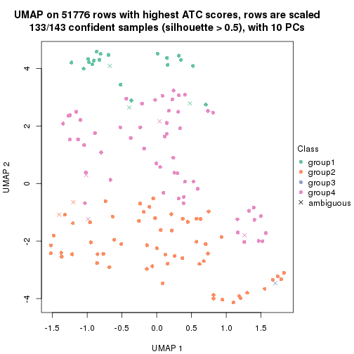</p>

</div>
<div id='tab-ATC-hclust-dimension-reduction-4'>
<pre><code class="r">dimension_reduction(res, k = 5, method = &quot;UMAP&quot;)
</code></pre>

<p></p>

</div>
<div id='tab-ATC-hclust-dimension-reduction-5'>
<pre><code class="r">dimension_reduction(res, k = 6, method = &quot;UMAP&quot;)
</code></pre>

<p></p>

</div>
</div>


Following heatmap shows how subgroups are split when increasing `k`:

```r
collect_classes(res)
```


Test correlation between subgroups and known annotations. If the known
annotation is numeric, one-way ANOVA test is applied, and if the known
annotation is discrete, chi-squared contingency table test is applied.

```r
test_to_known_factors(res)
```

```
#>              n disease.state(p) k
#> ATC:hclust 142         2.81e-03 2
#> ATC:hclust 138         2.21e-06 3
#> ATC:hclust 133         9.04e-06 4
#> ATC:hclust 133         8.78e-06 5
#> ATC:hclust 135         1.23e-05 6
```


If matrix rows can be associated to genes, consider to use `GO_Enrichment(res,
...)` to perform function enrichment for the signature genes.


 

---------------------------------------------------


### ATC:kmeans**


The object with results only for a single top-value method and a single partition method 
can be extracted as:

```r
res = res_list["ATC", "kmeans"]
# you can also extract it by
# res = res_list["ATC:kmeans"]
```

A summary of `res` and all the functions that can be applied to it:

```r
res
```

```
#> A 'ConsensusPartition' object with k = 2, 3, 4, 5, 6.
#>   On a matrix with 51776 rows and 143 columns.
#>   Top rows (1000, 2000, 3000, 4000, 5000) are extracted by 'ATC' method.
#>   Subgroups are detected by 'kmeans' method.
#>   Performed in total 1250 partitions by row resampling.
#>   Best k for subgroups seems to be 4.
#> 
#> Following methods can be applied to this 'ConsensusPartition' object:
#>  [1] "cola_report"             "collect_classes"         "collect_plots"          
#>  [4] "collect_stats"           "colnames"                "compare_signatures"     
#>  [7] "consensus_heatmap"       "dimension_reduction"     "functional_enrichment"  
#> [10] "get_anno_col"            "get_anno"                "get_classes"            
#> [13] "get_consensus"           "get_matrix"              "get_membership"         
#> [16] "get_param"               "get_signatures"          "get_stats"              
#> [19] "is_best_k"               "is_stable_k"             "membership_heatmap"     
#> [22] "ncol"                    "nrow"                    "plot_ecdf"              
#> [25] "rownames"                "select_partition_number" "show"                   
#> [28] "suggest_best_k"          "test_to_known_factors"
```

`collect_plots()` function collects all the plots made from `res` for all `k` (number of partitions)
into one single page to provide an easy and fast comparison between different `k`.

```r
collect_plots(res)
```


The plots are:

- The first row: a plot of the ECDF (Empirical cumulative distribution
  function) curves of the consensus matrix for each `k` and the heatmap of
  predicted classes for each `k`.
- The second row: heatmaps of the consensus matrix for each `k`.
- The third row: heatmaps of the membership matrix for each `k`.
- The fouth row: heatmaps of the signatures for each `k`.

All the plots in panels can be made by individual functions and they are
plotted later in this section.

`select_partition_number()` produces several plots showing different
statistics for choosing "optimized" `k`. There are following statistics:

- ECDF curves of the consensus matrix for each `k`;
- 1-PAC. [The PAC
  score](https://en.wikipedia.org/wiki/Consensus_clustering#Over-interpretation_potential_of_consensus_clustering)
  measures the proportion of the ambiguous subgrouping.
- Mean silhouette score.
- Concordance. The mean probability of fiting the consensus class ids in all
  partitions.
- Area increased. Denote $A_k$ as the area under the ECDF curve for current
  `k`, the area increased is defined as $A_k - A_{k-1}$.
- Rand index. The percent of pairs of samples that are both in a same cluster
  or both are not in a same cluster in the partition of k and k-1.
- Jaccard index. The ratio of pairs of samples are both in a same cluster in
  the partition of k and k-1 and the pairs of samples are both in a same
  cluster in the partition k or k-1.

The detailed explanations of these statistics can be found in [the cola
vignette](http://bioconductor.org/packages/devel/bioc/vignettes/cola/inst/doc/cola.html#toc_13).

Generally speaking, lower PAC score, higher mean silhouette score or higher
concordance corresponds to better partition. Rand index and Jaccard index
measure how similar the current partition is compared to partition with `k-1`.
If they are too similar, we won't accept `k` is better than `k-1`.

```r
select_partition_number(res)
```


The numeric values for all these statistics can be obtained by `get_stats()`.

```r
get_stats(res)
```

```
#>   k 1-PAC mean_silhouette concordance area_increased  Rand Jaccard
#> 2 2 1.000           0.964       0.987         0.4452 0.561   0.561
#> 3 3 0.745           0.906       0.947         0.3991 0.679   0.492
#> 4 4 1.000           0.950       0.969         0.1436 0.725   0.414
#> 5 5 0.784           0.806       0.835         0.0748 0.853   0.540
#> 6 6 0.758           0.753       0.857         0.0417 0.984   0.927
```

`suggest_best_k()` suggests the best $k$ based on these statistics. The rules are as follows:

- All $k$ with Jaccard index larger than 0.95 are removed because the increase of
  the partition number does not provides enough extra information. If all $k$ are removed,
  the best $k$ is assigned by `NA`.
- For $k$ with 1-PAC larger than 0.9, the maximal $k$ is taken as the "best k". Other $k$ is called "optional k".
- If it does not fit the second rule. The $k$ with the highest vote of highest
  1-PAC, mean silhouette and concordance is taken as the "best k".

```r
suggest_best_k(res)
```

```
#> [1] 4
#> attr(,"optional")
#> [1] 2
```

There is also optional best $k$ = 2 that is worth to check.

Following shows the table of the partitions (You need to click the **show/hide
code output** link to see it). The membership matrix (columns with name `p*`)
is inferred by
[`clue::cl_consensus()`](https://www.rdocumentation.org/link/cl_consensus?package=clue)
function with the `SE` method. Basically the value in the membership matrix
represents the probability to belong to a certain group. The finall class
label for an item is determined with the group with highest probability it
belongs to.

In `get_classes()` function, the entropy is calculated from the membership
matrix and the silhouette score is calculated from the consensus matrix.


<script>
$( function() {
	$( '#tabs-ATC-kmeans-get-classes' ).tabs();
} );
</script>
<div id='tabs-ATC-kmeans-get-classes'>
<ul>
<li><a href='#tab-ATC-kmeans-get-classes-1'>k = 2</a></li>
<li><a href='#tab-ATC-kmeans-get-classes-2'>k = 3</a></li>
<li><a href='#tab-ATC-kmeans-get-classes-3'>k = 4</a></li>
<li><a href='#tab-ATC-kmeans-get-classes-4'>k = 5</a></li>
<li><a href='#tab-ATC-kmeans-get-classes-5'>k = 6</a></li>
</ul>

<div id='tab-ATC-kmeans-get-classes-1'>
<p><a id='tab-ATC-kmeans-get-classes-1-a' style='color:#0366d6' href='#'>show/hide code output</a></p>
<pre><code class="r">cbind(get_classes(res, k = 2), get_membership(res, k = 2))
</code></pre>

<pre><code>#&gt;           class entropy silhouette    p1    p2
#&gt; GSM550785     1   0.000      0.991 1.000 0.000
#&gt; GSM550786     2   0.000      0.984 0.000 1.000
#&gt; GSM550788     2   0.000      0.984 0.000 1.000
#&gt; GSM550789     2   0.000      0.984 0.000 1.000
#&gt; GSM550790     1   0.000      0.991 1.000 0.000
#&gt; GSM550791     1   0.971      0.312 0.600 0.400
#&gt; GSM550792     2   0.000      0.984 0.000 1.000
#&gt; GSM550796     2   0.000      0.984 0.000 1.000
#&gt; GSM550797     2   0.000      0.984 0.000 1.000
#&gt; GSM550799     2   0.000      0.984 0.000 1.000
#&gt; GSM550800     2   0.000      0.984 0.000 1.000
#&gt; GSM550801     2   0.000      0.984 0.000 1.000
#&gt; GSM550804     2   0.000      0.984 0.000 1.000
#&gt; GSM550806     2   0.000      0.984 0.000 1.000
#&gt; GSM550807     2   0.000      0.984 0.000 1.000
#&gt; GSM550808     2   0.000      0.984 0.000 1.000
#&gt; GSM550809     1   0.000      0.991 1.000 0.000
#&gt; GSM550810     2   0.000      0.984 0.000 1.000
#&gt; GSM550811     2   0.961      0.378 0.384 0.616
#&gt; GSM550813     2   0.000      0.984 0.000 1.000
#&gt; GSM550814     2   0.000      0.984 0.000 1.000
#&gt; GSM550815     2   0.000      0.984 0.000 1.000
#&gt; GSM550816     2   0.000      0.984 0.000 1.000
#&gt; GSM550817     2   0.000      0.984 0.000 1.000
#&gt; GSM550818     2   0.000      0.984 0.000 1.000
#&gt; GSM550819     2   0.000      0.984 0.000 1.000
#&gt; GSM550820     1   0.000      0.991 1.000 0.000
#&gt; GSM550821     2   0.000      0.984 0.000 1.000
#&gt; GSM550822     2   0.000      0.984 0.000 1.000
#&gt; GSM550826     1   0.000      0.991 1.000 0.000
#&gt; GSM550832     2   0.000      0.984 0.000 1.000
#&gt; GSM550833     2   0.000      0.984 0.000 1.000
#&gt; GSM550835     2   0.000      0.984 0.000 1.000
#&gt; GSM550836     1   0.000      0.991 1.000 0.000
#&gt; GSM550837     2   0.000      0.984 0.000 1.000
#&gt; GSM550838     1   0.000      0.991 1.000 0.000
#&gt; GSM550841     2   0.000      0.984 0.000 1.000
#&gt; GSM550842     2   0.000      0.984 0.000 1.000
#&gt; GSM550846     2   0.000      0.984 0.000 1.000
#&gt; GSM550849     2   0.000      0.984 0.000 1.000
#&gt; GSM550850     1   0.000      0.991 1.000 0.000
#&gt; GSM550851     2   0.000      0.984 0.000 1.000
#&gt; GSM550852     2   0.000      0.984 0.000 1.000
#&gt; GSM550853     2   0.000      0.984 0.000 1.000
#&gt; GSM550855     2   0.000      0.984 0.000 1.000
#&gt; GSM550856     2   0.000      0.984 0.000 1.000
#&gt; GSM550861     2   0.000      0.984 0.000 1.000
#&gt; GSM550863     2   0.000      0.984 0.000 1.000
#&gt; GSM550864     2   0.000      0.984 0.000 1.000
#&gt; GSM550866     2   0.000      0.984 0.000 1.000
#&gt; GSM550867     1   0.000      0.991 1.000 0.000
#&gt; GSM550885     1   0.000      0.991 1.000 0.000
#&gt; GSM550886     2   0.000      0.984 0.000 1.000
#&gt; GSM550887     2   0.000      0.984 0.000 1.000
#&gt; GSM550889     1   0.000      0.991 1.000 0.000
#&gt; GSM550894     2   0.000      0.984 0.000 1.000
#&gt; GSM550897     1   0.000      0.991 1.000 0.000
#&gt; GSM550903     2   0.000      0.984 0.000 1.000
#&gt; GSM550905     2   0.000      0.984 0.000 1.000
#&gt; GSM550906     2   0.000      0.984 0.000 1.000
#&gt; GSM550907     2   0.000      0.984 0.000 1.000
#&gt; GSM550909     2   0.000      0.984 0.000 1.000
#&gt; GSM550911     2   0.000      0.984 0.000 1.000
#&gt; GSM550913     2   0.000      0.984 0.000 1.000
#&gt; GSM550915     2   0.000      0.984 0.000 1.000
#&gt; GSM550917     2   0.000      0.984 0.000 1.000
#&gt; GSM550919     2   0.000      0.984 0.000 1.000
#&gt; GSM550921     1   0.000      0.991 1.000 0.000
#&gt; GSM550924     2   0.000      0.984 0.000 1.000
#&gt; GSM550926     2   0.000      0.984 0.000 1.000
#&gt; GSM550927     2   0.000      0.984 0.000 1.000
#&gt; GSM550787     2   0.000      0.984 0.000 1.000
#&gt; GSM550793     1   0.000      0.991 1.000 0.000
#&gt; GSM550794     2   0.000      0.984 0.000 1.000
#&gt; GSM550795     1   0.000      0.991 1.000 0.000
#&gt; GSM550798     1   0.000      0.991 1.000 0.000
#&gt; GSM550803     1   0.000      0.991 1.000 0.000
#&gt; GSM550805     2   0.000      0.984 0.000 1.000
#&gt; GSM550823     2   0.000      0.984 0.000 1.000
#&gt; GSM550824     1   0.000      0.991 1.000 0.000
#&gt; GSM550825     1   0.000      0.991 1.000 0.000
#&gt; GSM550827     2   0.000      0.984 0.000 1.000
#&gt; GSM550828     1   0.000      0.991 1.000 0.000
#&gt; GSM550829     1   0.000      0.991 1.000 0.000
#&gt; GSM550830     2   0.000      0.984 0.000 1.000
#&gt; GSM550834     2   0.988      0.231 0.436 0.564
#&gt; GSM550839     2   0.000      0.984 0.000 1.000
#&gt; GSM550840     2   0.993      0.180 0.452 0.548
#&gt; GSM550843     2   0.000      0.984 0.000 1.000
#&gt; GSM550844     1   0.000      0.991 1.000 0.000
#&gt; GSM550845     2   0.000      0.984 0.000 1.000
#&gt; GSM550848     2   0.000      0.984 0.000 1.000
#&gt; GSM550854     1   0.000      0.991 1.000 0.000
#&gt; GSM550857     1   0.000      0.991 1.000 0.000
#&gt; GSM550858     1   0.000      0.991 1.000 0.000
#&gt; GSM550859     1   0.000      0.991 1.000 0.000
#&gt; GSM550862     1   0.000      0.991 1.000 0.000
#&gt; GSM550865     2   0.781      0.693 0.232 0.768
#&gt; GSM550868     2   0.000      0.984 0.000 1.000
#&gt; GSM550869     2   0.000      0.984 0.000 1.000
#&gt; GSM550870     2   0.000      0.984 0.000 1.000
#&gt; GSM550871     2   0.000      0.984 0.000 1.000
#&gt; GSM550872     2   0.000      0.984 0.000 1.000
#&gt; GSM550873     2   0.000      0.984 0.000 1.000
#&gt; GSM550874     2   0.000      0.984 0.000 1.000
#&gt; GSM550876     2   0.000      0.984 0.000 1.000
#&gt; GSM550877     2   0.000      0.984 0.000 1.000
#&gt; GSM550878     2   0.000      0.984 0.000 1.000
#&gt; GSM550879     1   0.000      0.991 1.000 0.000
#&gt; GSM550882     1   0.000      0.991 1.000 0.000
#&gt; GSM550888     1   0.000      0.991 1.000 0.000
#&gt; GSM550890     2   0.000      0.984 0.000 1.000
#&gt; GSM550891     1   0.000      0.991 1.000 0.000
#&gt; GSM550892     1   0.000      0.991 1.000 0.000
#&gt; GSM550893     2   0.000      0.984 0.000 1.000
#&gt; GSM550895     2   0.000      0.984 0.000 1.000
#&gt; GSM550896     2   0.000      0.984 0.000 1.000
#&gt; GSM550898     1   0.000      0.991 1.000 0.000
#&gt; GSM550899     2   0.000      0.984 0.000 1.000
#&gt; GSM550900     2   0.000      0.984 0.000 1.000
#&gt; GSM550901     2   0.000      0.984 0.000 1.000
#&gt; GSM550902     1   0.000      0.991 1.000 0.000
#&gt; GSM550904     1   0.000      0.991 1.000 0.000
#&gt; GSM550908     1   0.000      0.991 1.000 0.000
#&gt; GSM550912     2   0.000      0.984 0.000 1.000
#&gt; GSM550914     2   0.000      0.984 0.000 1.000
#&gt; GSM550918     2   0.000      0.984 0.000 1.000
#&gt; GSM550922     2   0.000      0.984 0.000 1.000
#&gt; GSM550923     1   0.000      0.991 1.000 0.000
#&gt; GSM550925     1   0.000      0.991 1.000 0.000
#&gt; GSM550802     2   0.000      0.984 0.000 1.000
#&gt; GSM550812     2   0.000      0.984 0.000 1.000
#&gt; GSM550831     1   0.000      0.991 1.000 0.000
#&gt; GSM550847     1   0.000      0.991 1.000 0.000
#&gt; GSM550860     1   0.000      0.991 1.000 0.000
#&gt; GSM550875     1   0.000      0.991 1.000 0.000
#&gt; GSM550880     2   0.000      0.984 0.000 1.000
#&gt; GSM550881     1   0.000      0.991 1.000 0.000
#&gt; GSM550883     1   0.000      0.991 1.000 0.000
#&gt; GSM550884     2   0.000      0.984 0.000 1.000
#&gt; GSM550910     2   0.000      0.984 0.000 1.000
#&gt; GSM550916     1   0.000      0.991 1.000 0.000
#&gt; GSM550920     2   0.000      0.984 0.000 1.000
</code></pre>

<script>
$('#tab-ATC-kmeans-get-classes-1-a').parent().next().next().hide();
$('#tab-ATC-kmeans-get-classes-1-a').click(function(){
  $('#tab-ATC-kmeans-get-classes-1-a').parent().next().next().toggle();
  return(false);
});
</script>
</div>

<div id='tab-ATC-kmeans-get-classes-2'>
<p><a id='tab-ATC-kmeans-get-classes-2-a' style='color:#0366d6' href='#'>show/hide code output</a></p>
<pre><code class="r">cbind(get_classes(res, k = 3), get_membership(res, k = 3))
</code></pre>

<pre><code>#&gt;           class entropy silhouette    p1    p2    p3
#&gt; GSM550785     1  0.3619      0.860 0.864 0.000 0.136
#&gt; GSM550786     2  0.3482      0.905 0.128 0.872 0.000
#&gt; GSM550788     2  0.0000      0.954 0.000 1.000 0.000
#&gt; GSM550789     2  0.0000      0.954 0.000 1.000 0.000
#&gt; GSM550790     1  0.6299      0.207 0.524 0.000 0.476
#&gt; GSM550791     1  0.0424      0.906 0.992 0.000 0.008
#&gt; GSM550792     1  0.2796      0.829 0.908 0.092 0.000
#&gt; GSM550796     2  0.0000      0.954 0.000 1.000 0.000
#&gt; GSM550797     2  0.0000      0.954 0.000 1.000 0.000
#&gt; GSM550799     2  0.0592      0.952 0.012 0.988 0.000
#&gt; GSM550800     2  0.0000      0.954 0.000 1.000 0.000
#&gt; GSM550801     2  0.0000      0.954 0.000 1.000 0.000
#&gt; GSM550804     2  0.0000      0.954 0.000 1.000 0.000
#&gt; GSM550806     1  0.0424      0.906 0.992 0.008 0.000
#&gt; GSM550807     2  0.0000      0.954 0.000 1.000 0.000
#&gt; GSM550808     2  0.0000      0.954 0.000 1.000 0.000
#&gt; GSM550809     1  0.3619      0.860 0.864 0.000 0.136
#&gt; GSM550810     2  0.0000      0.954 0.000 1.000 0.000
#&gt; GSM550811     1  0.0424      0.906 0.992 0.000 0.008
#&gt; GSM550813     2  0.3482      0.905 0.128 0.872 0.000
#&gt; GSM550814     2  0.2878      0.921 0.096 0.904 0.000
#&gt; GSM550815     2  0.0000      0.954 0.000 1.000 0.000
#&gt; GSM550816     2  0.0000      0.954 0.000 1.000 0.000
#&gt; GSM550817     2  0.0000      0.954 0.000 1.000 0.000
#&gt; GSM550818     2  0.3482      0.905 0.128 0.872 0.000
#&gt; GSM550819     2  0.2959      0.919 0.100 0.900 0.000
#&gt; GSM550820     1  0.3619      0.860 0.864 0.000 0.136
#&gt; GSM550821     2  0.0000      0.954 0.000 1.000 0.000
#&gt; GSM550822     2  0.0000      0.954 0.000 1.000 0.000
#&gt; GSM550826     1  0.3619      0.860 0.864 0.000 0.136
#&gt; GSM550832     2  0.0000      0.954 0.000 1.000 0.000
#&gt; GSM550833     2  0.0000      0.954 0.000 1.000 0.000
#&gt; GSM550835     2  0.1411      0.945 0.036 0.964 0.000
#&gt; GSM550836     3  0.0000      0.970 0.000 0.000 1.000
#&gt; GSM550837     2  0.0000      0.954 0.000 1.000 0.000
#&gt; GSM550838     1  0.3619      0.860 0.864 0.000 0.136
#&gt; GSM550841     2  0.0000      0.954 0.000 1.000 0.000
#&gt; GSM550842     2  0.0000      0.954 0.000 1.000 0.000
#&gt; GSM550846     1  0.0747      0.902 0.984 0.016 0.000
#&gt; GSM550849     1  0.0424      0.906 0.992 0.008 0.000
#&gt; GSM550850     1  0.3619      0.860 0.864 0.000 0.136
#&gt; GSM550851     2  0.0000      0.954 0.000 1.000 0.000
#&gt; GSM550852     2  0.0000      0.954 0.000 1.000 0.000
#&gt; GSM550853     2  0.0000      0.954 0.000 1.000 0.000
#&gt; GSM550855     2  0.0000      0.954 0.000 1.000 0.000
#&gt; GSM550856     2  0.1031      0.948 0.024 0.976 0.000
#&gt; GSM550861     2  0.0000      0.954 0.000 1.000 0.000
#&gt; GSM550863     1  0.1529      0.883 0.960 0.040 0.000
#&gt; GSM550864     2  0.3482      0.905 0.128 0.872 0.000
#&gt; GSM550866     2  0.3482      0.905 0.128 0.872 0.000
#&gt; GSM550867     3  0.0000      0.970 0.000 0.000 1.000
#&gt; GSM550885     3  0.0000      0.970 0.000 0.000 1.000
#&gt; GSM550886     2  0.0424      0.952 0.008 0.992 0.000
#&gt; GSM550887     2  0.0000      0.954 0.000 1.000 0.000
#&gt; GSM550889     1  0.3619      0.860 0.864 0.000 0.136
#&gt; GSM550894     2  0.0000      0.954 0.000 1.000 0.000
#&gt; GSM550897     1  0.3038      0.875 0.896 0.000 0.104
#&gt; GSM550903     2  0.0000      0.954 0.000 1.000 0.000
#&gt; GSM550905     2  0.0000      0.954 0.000 1.000 0.000
#&gt; GSM550906     2  0.0000      0.954 0.000 1.000 0.000
#&gt; GSM550907     2  0.2878      0.921 0.096 0.904 0.000
#&gt; GSM550909     2  0.0000      0.954 0.000 1.000 0.000
#&gt; GSM550911     1  0.1643      0.876 0.956 0.044 0.000
#&gt; GSM550913     2  0.0000      0.954 0.000 1.000 0.000
#&gt; GSM550915     1  0.0424      0.906 0.992 0.008 0.000
#&gt; GSM550917     2  0.0000      0.954 0.000 1.000 0.000
#&gt; GSM550919     1  0.0424      0.906 0.992 0.008 0.000
#&gt; GSM550921     3  0.0000      0.970 0.000 0.000 1.000
#&gt; GSM550924     1  0.0424      0.906 0.992 0.008 0.000
#&gt; GSM550926     2  0.3482      0.905 0.128 0.872 0.000
#&gt; GSM550927     2  0.0000      0.954 0.000 1.000 0.000
#&gt; GSM550787     1  0.0424      0.906 0.992 0.008 0.000
#&gt; GSM550793     3  0.2625      0.890 0.084 0.000 0.916
#&gt; GSM550794     2  0.3482      0.905 0.128 0.872 0.000
#&gt; GSM550795     1  0.3619      0.860 0.864 0.000 0.136
#&gt; GSM550798     3  0.0000      0.970 0.000 0.000 1.000
#&gt; GSM550803     3  0.0000      0.970 0.000 0.000 1.000
#&gt; GSM550805     1  0.0424      0.906 0.992 0.008 0.000
#&gt; GSM550823     1  0.0424      0.906 0.992 0.008 0.000
#&gt; GSM550824     3  0.0000      0.970 0.000 0.000 1.000
#&gt; GSM550825     3  0.0000      0.970 0.000 0.000 1.000
#&gt; GSM550827     1  0.1529      0.883 0.960 0.040 0.000
#&gt; GSM550828     1  0.3619      0.860 0.864 0.000 0.136
#&gt; GSM550829     3  0.0000      0.970 0.000 0.000 1.000
#&gt; GSM550830     1  0.0424      0.906 0.992 0.008 0.000
#&gt; GSM550834     1  0.0424      0.906 0.992 0.000 0.008
#&gt; GSM550839     2  0.0000      0.954 0.000 1.000 0.000
#&gt; GSM550840     1  0.0424      0.906 0.992 0.000 0.008
#&gt; GSM550843     2  0.3482      0.905 0.128 0.872 0.000
#&gt; GSM550844     1  0.3619      0.860 0.864 0.000 0.136
#&gt; GSM550845     2  0.3482      0.905 0.128 0.872 0.000
#&gt; GSM550848     2  0.3482      0.905 0.128 0.872 0.000
#&gt; GSM550854     3  0.0000      0.970 0.000 0.000 1.000
#&gt; GSM550857     3  0.0000      0.970 0.000 0.000 1.000
#&gt; GSM550858     3  0.6079      0.266 0.388 0.000 0.612
#&gt; GSM550859     3  0.0000      0.970 0.000 0.000 1.000
#&gt; GSM550862     1  0.6225      0.344 0.568 0.000 0.432
#&gt; GSM550865     1  0.0475      0.906 0.992 0.004 0.004
#&gt; GSM550868     1  0.0424      0.906 0.992 0.008 0.000
#&gt; GSM550869     1  0.0424      0.906 0.992 0.008 0.000
#&gt; GSM550870     2  0.3482      0.905 0.128 0.872 0.000
#&gt; GSM550871     1  0.4887      0.640 0.772 0.228 0.000
#&gt; GSM550872     1  0.0424      0.906 0.992 0.008 0.000
#&gt; GSM550873     2  0.3412      0.907 0.124 0.876 0.000
#&gt; GSM550874     2  0.3482      0.905 0.128 0.872 0.000
#&gt; GSM550876     2  0.3482      0.905 0.128 0.872 0.000
#&gt; GSM550877     2  0.1289      0.946 0.032 0.968 0.000
#&gt; GSM550878     1  0.0747      0.902 0.984 0.016 0.000
#&gt; GSM550879     1  0.3038      0.875 0.896 0.000 0.104
#&gt; GSM550882     1  0.3619      0.860 0.864 0.000 0.136
#&gt; GSM550888     3  0.0000      0.970 0.000 0.000 1.000
#&gt; GSM550890     1  0.0424      0.906 0.992 0.008 0.000
#&gt; GSM550891     3  0.0000      0.970 0.000 0.000 1.000
#&gt; GSM550892     1  0.3619      0.860 0.864 0.000 0.136
#&gt; GSM550893     2  0.3482      0.905 0.128 0.872 0.000
#&gt; GSM550895     2  0.3482      0.905 0.128 0.872 0.000
#&gt; GSM550896     2  0.0000      0.954 0.000 1.000 0.000
#&gt; GSM550898     3  0.0000      0.970 0.000 0.000 1.000
#&gt; GSM550899     2  0.3482      0.905 0.128 0.872 0.000
#&gt; GSM550900     1  0.2796      0.829 0.908 0.092 0.000
#&gt; GSM550901     1  0.0424      0.906 0.992 0.008 0.000
#&gt; GSM550902     1  0.0592      0.905 0.988 0.000 0.012
#&gt; GSM550904     3  0.2625      0.890 0.084 0.000 0.916
#&gt; GSM550908     3  0.0000      0.970 0.000 0.000 1.000
#&gt; GSM550912     2  0.3482      0.905 0.128 0.872 0.000
#&gt; GSM550914     1  0.0424      0.906 0.992 0.008 0.000
#&gt; GSM550918     2  0.2878      0.921 0.096 0.904 0.000
#&gt; GSM550922     2  0.0000      0.954 0.000 1.000 0.000
#&gt; GSM550923     3  0.0000      0.970 0.000 0.000 1.000
#&gt; GSM550925     1  0.3619      0.860 0.864 0.000 0.136
#&gt; GSM550802     2  0.0237      0.953 0.004 0.996 0.000
#&gt; GSM550812     2  0.0000      0.954 0.000 1.000 0.000
#&gt; GSM550831     1  0.3619      0.860 0.864 0.000 0.136
#&gt; GSM550847     3  0.0000      0.970 0.000 0.000 1.000
#&gt; GSM550860     1  0.3038      0.875 0.896 0.000 0.104
#&gt; GSM550875     1  0.0424      0.906 0.992 0.000 0.008
#&gt; GSM550880     1  0.0424      0.906 0.992 0.008 0.000
#&gt; GSM550881     1  0.3619      0.860 0.864 0.000 0.136
#&gt; GSM550883     3  0.0000      0.970 0.000 0.000 1.000
#&gt; GSM550884     1  0.0424      0.906 0.992 0.008 0.000
#&gt; GSM550910     2  0.1860      0.939 0.052 0.948 0.000
#&gt; GSM550916     1  0.3619      0.860 0.864 0.000 0.136
#&gt; GSM550920     1  0.2796      0.829 0.908 0.092 0.000
</code></pre>

<script>
$('#tab-ATC-kmeans-get-classes-2-a').parent().next().next().hide();
$('#tab-ATC-kmeans-get-classes-2-a').click(function(){
  $('#tab-ATC-kmeans-get-classes-2-a').parent().next().next().toggle();
  return(false);
});
</script>
</div>

<div id='tab-ATC-kmeans-get-classes-3'>
<p><a id='tab-ATC-kmeans-get-classes-3-a' style='color:#0366d6' href='#'>show/hide code output</a></p>
<pre><code class="r">cbind(get_classes(res, k = 4), get_membership(res, k = 4))
</code></pre>

<pre><code>#&gt;           class entropy silhouette    p1    p2    p3    p4
#&gt; GSM550785     1  0.0000    0.99373 1.000 0.000 0.000 0.000
#&gt; GSM550786     4  0.1118    0.96429 0.000 0.036 0.000 0.964
#&gt; GSM550788     2  0.0469    0.96392 0.000 0.988 0.000 0.012
#&gt; GSM550789     2  0.0469    0.96392 0.000 0.988 0.000 0.012
#&gt; GSM550790     1  0.0592    0.97973 0.984 0.000 0.016 0.000
#&gt; GSM550791     1  0.0000    0.99373 1.000 0.000 0.000 0.000
#&gt; GSM550792     4  0.1209    0.95993 0.032 0.004 0.000 0.964
#&gt; GSM550796     2  0.0469    0.96392 0.000 0.988 0.000 0.012
#&gt; GSM550797     2  0.0469    0.96392 0.000 0.988 0.000 0.012
#&gt; GSM550799     4  0.1118    0.96429 0.000 0.036 0.000 0.964
#&gt; GSM550800     2  0.0469    0.96392 0.000 0.988 0.000 0.012
#&gt; GSM550801     2  0.0469    0.96392 0.000 0.988 0.000 0.012
#&gt; GSM550804     2  0.0469    0.96392 0.000 0.988 0.000 0.012
#&gt; GSM550806     4  0.1389    0.95348 0.048 0.000 0.000 0.952
#&gt; GSM550807     2  0.0469    0.96392 0.000 0.988 0.000 0.012
#&gt; GSM550808     2  0.0469    0.96392 0.000 0.988 0.000 0.012
#&gt; GSM550809     1  0.0188    0.99125 0.996 0.000 0.000 0.004
#&gt; GSM550810     2  0.0469    0.96392 0.000 0.988 0.000 0.012
#&gt; GSM550811     1  0.0000    0.99373 1.000 0.000 0.000 0.000
#&gt; GSM550813     4  0.1118    0.96429 0.000 0.036 0.000 0.964
#&gt; GSM550814     4  0.1118    0.96429 0.000 0.036 0.000 0.964
#&gt; GSM550815     2  0.0469    0.96392 0.000 0.988 0.000 0.012
#&gt; GSM550816     2  0.0469    0.96392 0.000 0.988 0.000 0.012
#&gt; GSM550817     2  0.0469    0.96392 0.000 0.988 0.000 0.012
#&gt; GSM550818     4  0.1118    0.96429 0.000 0.036 0.000 0.964
#&gt; GSM550819     4  0.1118    0.96429 0.000 0.036 0.000 0.964
#&gt; GSM550820     1  0.0000    0.99373 1.000 0.000 0.000 0.000
#&gt; GSM550821     2  0.0469    0.96392 0.000 0.988 0.000 0.012
#&gt; GSM550822     2  0.0469    0.96392 0.000 0.988 0.000 0.012
#&gt; GSM550826     1  0.0000    0.99373 1.000 0.000 0.000 0.000
#&gt; GSM550832     2  0.0469    0.96392 0.000 0.988 0.000 0.012
#&gt; GSM550833     2  0.0469    0.96392 0.000 0.988 0.000 0.012
#&gt; GSM550835     4  0.1118    0.96429 0.000 0.036 0.000 0.964
#&gt; GSM550836     3  0.0000    0.99305 0.000 0.000 1.000 0.000
#&gt; GSM550837     2  0.0469    0.96392 0.000 0.988 0.000 0.012
#&gt; GSM550838     1  0.0188    0.99125 0.996 0.000 0.000 0.004
#&gt; GSM550841     2  0.0469    0.96392 0.000 0.988 0.000 0.012
#&gt; GSM550842     2  0.0469    0.96392 0.000 0.988 0.000 0.012
#&gt; GSM550846     4  0.1118    0.95878 0.036 0.000 0.000 0.964
#&gt; GSM550849     4  0.1389    0.95348 0.048 0.000 0.000 0.952
#&gt; GSM550850     1  0.0000    0.99373 1.000 0.000 0.000 0.000
#&gt; GSM550851     2  0.0469    0.96392 0.000 0.988 0.000 0.012
#&gt; GSM550852     4  0.2216    0.91360 0.000 0.092 0.000 0.908
#&gt; GSM550853     2  0.0469    0.96392 0.000 0.988 0.000 0.012
#&gt; GSM550855     2  0.0469    0.96392 0.000 0.988 0.000 0.012
#&gt; GSM550856     4  0.1118    0.96429 0.000 0.036 0.000 0.964
#&gt; GSM550861     2  0.0469    0.96392 0.000 0.988 0.000 0.012
#&gt; GSM550863     4  0.1118    0.95878 0.036 0.000 0.000 0.964
#&gt; GSM550864     4  0.1118    0.96429 0.000 0.036 0.000 0.964
#&gt; GSM550866     4  0.1118    0.96429 0.000 0.036 0.000 0.964
#&gt; GSM550867     3  0.0000    0.99305 0.000 0.000 1.000 0.000
#&gt; GSM550885     3  0.0000    0.99305 0.000 0.000 1.000 0.000
#&gt; GSM550886     4  0.1118    0.96429 0.000 0.036 0.000 0.964
#&gt; GSM550887     2  0.0469    0.96392 0.000 0.988 0.000 0.012
#&gt; GSM550889     1  0.0000    0.99373 1.000 0.000 0.000 0.000
#&gt; GSM550894     2  0.0469    0.96392 0.000 0.988 0.000 0.012
#&gt; GSM550897     1  0.0000    0.99373 1.000 0.000 0.000 0.000
#&gt; GSM550903     2  0.0469    0.96392 0.000 0.988 0.000 0.012
#&gt; GSM550905     2  0.4999    0.00215 0.000 0.508 0.000 0.492
#&gt; GSM550906     2  0.0469    0.96392 0.000 0.988 0.000 0.012
#&gt; GSM550907     4  0.1118    0.96429 0.000 0.036 0.000 0.964
#&gt; GSM550909     2  0.0469    0.96392 0.000 0.988 0.000 0.012
#&gt; GSM550911     4  0.0469    0.94696 0.000 0.012 0.000 0.988
#&gt; GSM550913     2  0.0469    0.96392 0.000 0.988 0.000 0.012
#&gt; GSM550915     4  0.1389    0.95348 0.048 0.000 0.000 0.952
#&gt; GSM550917     2  0.4999    0.00215 0.000 0.508 0.000 0.492
#&gt; GSM550919     4  0.1389    0.95348 0.048 0.000 0.000 0.952
#&gt; GSM550921     3  0.0000    0.99305 0.000 0.000 1.000 0.000
#&gt; GSM550924     4  0.1389    0.95348 0.048 0.000 0.000 0.952
#&gt; GSM550926     4  0.1118    0.96429 0.000 0.036 0.000 0.964
#&gt; GSM550927     2  0.0469    0.96392 0.000 0.988 0.000 0.012
#&gt; GSM550787     4  0.1389    0.95348 0.048 0.000 0.000 0.952
#&gt; GSM550793     1  0.1022    0.96224 0.968 0.000 0.032 0.000
#&gt; GSM550794     4  0.1118    0.96429 0.000 0.036 0.000 0.964
#&gt; GSM550795     1  0.0000    0.99373 1.000 0.000 0.000 0.000
#&gt; GSM550798     3  0.0000    0.99305 0.000 0.000 1.000 0.000
#&gt; GSM550803     3  0.0000    0.99305 0.000 0.000 1.000 0.000
#&gt; GSM550805     4  0.1389    0.95348 0.048 0.000 0.000 0.952
#&gt; GSM550823     4  0.1389    0.95348 0.048 0.000 0.000 0.952
#&gt; GSM550824     3  0.0000    0.99305 0.000 0.000 1.000 0.000
#&gt; GSM550825     3  0.0592    0.97920 0.016 0.000 0.984 0.000
#&gt; GSM550827     4  0.1118    0.95878 0.036 0.000 0.000 0.964
#&gt; GSM550828     1  0.0000    0.99373 1.000 0.000 0.000 0.000
#&gt; GSM550829     3  0.0000    0.99305 0.000 0.000 1.000 0.000
#&gt; GSM550830     4  0.1389    0.95348 0.048 0.000 0.000 0.952
#&gt; GSM550834     1  0.1211    0.94409 0.960 0.000 0.000 0.040
#&gt; GSM550839     2  0.0469    0.96392 0.000 0.988 0.000 0.012
#&gt; GSM550840     1  0.0000    0.99373 1.000 0.000 0.000 0.000
#&gt; GSM550843     4  0.1118    0.96429 0.000 0.036 0.000 0.964
#&gt; GSM550844     1  0.0000    0.99373 1.000 0.000 0.000 0.000
#&gt; GSM550845     4  0.1118    0.96429 0.000 0.036 0.000 0.964
#&gt; GSM550848     4  0.1118    0.96429 0.000 0.036 0.000 0.964
#&gt; GSM550854     3  0.0000    0.99305 0.000 0.000 1.000 0.000
#&gt; GSM550857     3  0.0000    0.99305 0.000 0.000 1.000 0.000
#&gt; GSM550858     1  0.0707    0.97566 0.980 0.000 0.020 0.000
#&gt; GSM550859     3  0.0000    0.99305 0.000 0.000 1.000 0.000
#&gt; GSM550862     1  0.0188    0.99074 0.996 0.000 0.004 0.000
#&gt; GSM550865     1  0.0000    0.99373 1.000 0.000 0.000 0.000
#&gt; GSM550868     4  0.1389    0.95348 0.048 0.000 0.000 0.952
#&gt; GSM550869     4  0.1389    0.95348 0.048 0.000 0.000 0.952
#&gt; GSM550870     4  0.1118    0.96429 0.000 0.036 0.000 0.964
#&gt; GSM550871     4  0.1297    0.96263 0.016 0.020 0.000 0.964
#&gt; GSM550872     4  0.1389    0.95348 0.048 0.000 0.000 0.952
#&gt; GSM550873     4  0.1118    0.96429 0.000 0.036 0.000 0.964
#&gt; GSM550874     4  0.1118    0.96429 0.000 0.036 0.000 0.964
#&gt; GSM550876     4  0.1118    0.96429 0.000 0.036 0.000 0.964
#&gt; GSM550877     4  0.1118    0.96429 0.000 0.036 0.000 0.964
#&gt; GSM550878     4  0.1118    0.95878 0.036 0.000 0.000 0.964
#&gt; GSM550879     1  0.0000    0.99373 1.000 0.000 0.000 0.000
#&gt; GSM550882     1  0.0000    0.99373 1.000 0.000 0.000 0.000
#&gt; GSM550888     3  0.0000    0.99305 0.000 0.000 1.000 0.000
#&gt; GSM550890     4  0.1389    0.95348 0.048 0.000 0.000 0.952
#&gt; GSM550891     3  0.2469    0.87939 0.108 0.000 0.892 0.000
#&gt; GSM550892     1  0.0000    0.99373 1.000 0.000 0.000 0.000
#&gt; GSM550893     4  0.1118    0.96429 0.000 0.036 0.000 0.964
#&gt; GSM550895     4  0.1118    0.96429 0.000 0.036 0.000 0.964
#&gt; GSM550896     2  0.0469    0.96392 0.000 0.988 0.000 0.012
#&gt; GSM550898     3  0.0000    0.99305 0.000 0.000 1.000 0.000
#&gt; GSM550899     4  0.1118    0.96429 0.000 0.036 0.000 0.964
#&gt; GSM550900     4  0.1209    0.95993 0.032 0.004 0.000 0.964
#&gt; GSM550901     4  0.1389    0.95348 0.048 0.000 0.000 0.952
#&gt; GSM550902     1  0.0000    0.99373 1.000 0.000 0.000 0.000
#&gt; GSM550904     1  0.1022    0.96224 0.968 0.000 0.032 0.000
#&gt; GSM550908     3  0.0000    0.99305 0.000 0.000 1.000 0.000
#&gt; GSM550912     4  0.1118    0.96429 0.000 0.036 0.000 0.964
#&gt; GSM550914     4  0.1389    0.95348 0.048 0.000 0.000 0.952
#&gt; GSM550918     4  0.1118    0.96429 0.000 0.036 0.000 0.964
#&gt; GSM550922     2  0.0469    0.96392 0.000 0.988 0.000 0.012
#&gt; GSM550923     3  0.0000    0.99305 0.000 0.000 1.000 0.000
#&gt; GSM550925     1  0.0000    0.99373 1.000 0.000 0.000 0.000
#&gt; GSM550802     4  0.1940    0.93008 0.000 0.076 0.000 0.924
#&gt; GSM550812     4  0.4998    0.03883 0.000 0.488 0.000 0.512
#&gt; GSM550831     1  0.0000    0.99373 1.000 0.000 0.000 0.000
#&gt; GSM550847     3  0.0000    0.99305 0.000 0.000 1.000 0.000
#&gt; GSM550860     1  0.0000    0.99373 1.000 0.000 0.000 0.000
#&gt; GSM550875     1  0.0000    0.99373 1.000 0.000 0.000 0.000
#&gt; GSM550880     4  0.1474    0.95077 0.052 0.000 0.000 0.948
#&gt; GSM550881     1  0.0000    0.99373 1.000 0.000 0.000 0.000
#&gt; GSM550883     3  0.0000    0.99305 0.000 0.000 1.000 0.000
#&gt; GSM550884     4  0.1389    0.95348 0.048 0.000 0.000 0.952
#&gt; GSM550910     4  0.1118    0.96429 0.000 0.036 0.000 0.964
#&gt; GSM550916     1  0.0000    0.99373 1.000 0.000 0.000 0.000
#&gt; GSM550920     4  0.1209    0.95993 0.032 0.004 0.000 0.964
</code></pre>

<script>
$('#tab-ATC-kmeans-get-classes-3-a').parent().next().next().hide();
$('#tab-ATC-kmeans-get-classes-3-a').click(function(){
  $('#tab-ATC-kmeans-get-classes-3-a').parent().next().next().toggle();
  return(false);
});
</script>
</div>

<div id='tab-ATC-kmeans-get-classes-4'>
<p><a id='tab-ATC-kmeans-get-classes-4-a' style='color:#0366d6' href='#'>show/hide code output</a></p>
<pre><code class="r">cbind(get_classes(res, k = 5), get_membership(res, k = 5))
</code></pre>

<pre><code>#&gt;           class entropy silhouette    p1    p2    p3    p4    p5
#&gt; GSM550785     1  0.0510      0.906 0.984 0.016 0.000 0.000 0.000
#&gt; GSM550786     2  0.4219      0.681 0.000 0.584 0.000 0.416 0.000
#&gt; GSM550788     2  0.4227      0.433 0.000 0.580 0.000 0.000 0.420
#&gt; GSM550789     5  0.0000      0.998 0.000 0.000 0.000 0.000 1.000
#&gt; GSM550790     1  0.2127      0.865 0.892 0.108 0.000 0.000 0.000
#&gt; GSM550791     1  0.4333      0.728 0.752 0.060 0.000 0.188 0.000
#&gt; GSM550792     4  0.0290      0.929 0.000 0.008 0.000 0.992 0.000
#&gt; GSM550796     5  0.0000      0.998 0.000 0.000 0.000 0.000 1.000
#&gt; GSM550797     5  0.0000      0.998 0.000 0.000 0.000 0.000 1.000
#&gt; GSM550799     2  0.4201      0.687 0.000 0.592 0.000 0.408 0.000
#&gt; GSM550800     2  0.4227      0.433 0.000 0.580 0.000 0.000 0.420
#&gt; GSM550801     5  0.0000      0.998 0.000 0.000 0.000 0.000 1.000
#&gt; GSM550804     2  0.4227      0.433 0.000 0.580 0.000 0.000 0.420
#&gt; GSM550806     4  0.0609      0.920 0.000 0.020 0.000 0.980 0.000
#&gt; GSM550807     2  0.4227      0.433 0.000 0.580 0.000 0.000 0.420
#&gt; GSM550808     5  0.0000      0.998 0.000 0.000 0.000 0.000 1.000
#&gt; GSM550809     1  0.1732      0.887 0.920 0.080 0.000 0.000 0.000
#&gt; GSM550810     5  0.0000      0.998 0.000 0.000 0.000 0.000 1.000
#&gt; GSM550811     1  0.5285      0.491 0.584 0.060 0.000 0.356 0.000
#&gt; GSM550813     2  0.4273      0.625 0.000 0.552 0.000 0.448 0.000
#&gt; GSM550814     2  0.4210      0.686 0.000 0.588 0.000 0.412 0.000
#&gt; GSM550815     5  0.0000      0.998 0.000 0.000 0.000 0.000 1.000
#&gt; GSM550816     5  0.0000      0.998 0.000 0.000 0.000 0.000 1.000
#&gt; GSM550817     5  0.0794      0.972 0.000 0.028 0.000 0.000 0.972
#&gt; GSM550818     2  0.4150      0.682 0.000 0.612 0.000 0.388 0.000
#&gt; GSM550819     2  0.4192      0.687 0.000 0.596 0.000 0.404 0.000
#&gt; GSM550820     1  0.0703      0.906 0.976 0.024 0.000 0.000 0.000
#&gt; GSM550821     2  0.4227      0.433 0.000 0.580 0.000 0.000 0.420
#&gt; GSM550822     5  0.0000      0.998 0.000 0.000 0.000 0.000 1.000
#&gt; GSM550826     1  0.0510      0.906 0.984 0.016 0.000 0.000 0.000
#&gt; GSM550832     2  0.4227      0.433 0.000 0.580 0.000 0.000 0.420
#&gt; GSM550833     5  0.0000      0.998 0.000 0.000 0.000 0.000 1.000
#&gt; GSM550835     2  0.4210      0.686 0.000 0.588 0.000 0.412 0.000
#&gt; GSM550836     3  0.0000      0.942 0.000 0.000 1.000 0.000 0.000
#&gt; GSM550837     5  0.0000      0.998 0.000 0.000 0.000 0.000 1.000
#&gt; GSM550838     1  0.1043      0.903 0.960 0.040 0.000 0.000 0.000
#&gt; GSM550841     5  0.0000      0.998 0.000 0.000 0.000 0.000 1.000
#&gt; GSM550842     5  0.0000      0.998 0.000 0.000 0.000 0.000 1.000
#&gt; GSM550846     4  0.0290      0.926 0.000 0.008 0.000 0.992 0.000
#&gt; GSM550849     4  0.1892      0.858 0.004 0.080 0.000 0.916 0.000
#&gt; GSM550850     1  0.1732      0.888 0.920 0.080 0.000 0.000 0.000
#&gt; GSM550851     5  0.0000      0.998 0.000 0.000 0.000 0.000 1.000
#&gt; GSM550852     2  0.4824      0.691 0.000 0.596 0.000 0.376 0.028
#&gt; GSM550853     5  0.0000      0.998 0.000 0.000 0.000 0.000 1.000
#&gt; GSM550855     2  0.4249      0.408 0.000 0.568 0.000 0.000 0.432
#&gt; GSM550856     2  0.4210      0.686 0.000 0.588 0.000 0.412 0.000
#&gt; GSM550861     2  0.4227      0.433 0.000 0.580 0.000 0.000 0.420
#&gt; GSM550863     4  0.0290      0.929 0.000 0.008 0.000 0.992 0.000
#&gt; GSM550864     2  0.4305      0.537 0.000 0.512 0.000 0.488 0.000
#&gt; GSM550866     4  0.4302     -0.480 0.000 0.480 0.000 0.520 0.000
#&gt; GSM550867     3  0.0000      0.942 0.000 0.000 1.000 0.000 0.000
#&gt; GSM550885     3  0.0000      0.942 0.000 0.000 1.000 0.000 0.000
#&gt; GSM550886     2  0.4210      0.686 0.000 0.588 0.000 0.412 0.000
#&gt; GSM550887     5  0.0000      0.998 0.000 0.000 0.000 0.000 1.000
#&gt; GSM550889     1  0.0609      0.905 0.980 0.020 0.000 0.000 0.000
#&gt; GSM550894     5  0.0162      0.994 0.000 0.004 0.000 0.000 0.996
#&gt; GSM550897     1  0.0000      0.907 1.000 0.000 0.000 0.000 0.000
#&gt; GSM550903     2  0.4227      0.433 0.000 0.580 0.000 0.000 0.420
#&gt; GSM550905     2  0.5908      0.674 0.000 0.588 0.000 0.256 0.156
#&gt; GSM550906     2  0.4227      0.433 0.000 0.580 0.000 0.000 0.420
#&gt; GSM550907     2  0.4138      0.686 0.000 0.616 0.000 0.384 0.000
#&gt; GSM550909     5  0.0000      0.998 0.000 0.000 0.000 0.000 1.000
#&gt; GSM550911     4  0.3752      0.613 0.000 0.292 0.000 0.708 0.000
#&gt; GSM550913     5  0.0000      0.998 0.000 0.000 0.000 0.000 1.000
#&gt; GSM550915     4  0.0794      0.915 0.000 0.028 0.000 0.972 0.000
#&gt; GSM550917     2  0.5908      0.674 0.000 0.588 0.000 0.256 0.156
#&gt; GSM550919     4  0.0000      0.928 0.000 0.000 0.000 1.000 0.000
#&gt; GSM550921     3  0.0000      0.942 0.000 0.000 1.000 0.000 0.000
#&gt; GSM550924     4  0.0000      0.928 0.000 0.000 0.000 1.000 0.000
#&gt; GSM550926     2  0.4210      0.686 0.000 0.588 0.000 0.412 0.000
#&gt; GSM550927     5  0.0000      0.998 0.000 0.000 0.000 0.000 1.000
#&gt; GSM550787     4  0.0703      0.917 0.000 0.024 0.000 0.976 0.000
#&gt; GSM550793     1  0.2074      0.866 0.896 0.104 0.000 0.000 0.000
#&gt; GSM550794     4  0.1671      0.848 0.000 0.076 0.000 0.924 0.000
#&gt; GSM550795     1  0.0609      0.906 0.980 0.020 0.000 0.000 0.000
#&gt; GSM550798     3  0.0000      0.942 0.000 0.000 1.000 0.000 0.000
#&gt; GSM550803     3  0.0000      0.942 0.000 0.000 1.000 0.000 0.000
#&gt; GSM550805     4  0.0703      0.917 0.000 0.024 0.000 0.976 0.000
#&gt; GSM550823     4  0.0290      0.929 0.000 0.008 0.000 0.992 0.000
#&gt; GSM550824     3  0.0000      0.942 0.000 0.000 1.000 0.000 0.000
#&gt; GSM550825     3  0.5382      0.604 0.252 0.104 0.644 0.000 0.000
#&gt; GSM550827     4  0.0290      0.929 0.000 0.008 0.000 0.992 0.000
#&gt; GSM550828     1  0.0510      0.906 0.984 0.016 0.000 0.000 0.000
#&gt; GSM550829     3  0.4901      0.708 0.184 0.104 0.712 0.000 0.000
#&gt; GSM550830     4  0.0290      0.929 0.000 0.008 0.000 0.992 0.000
#&gt; GSM550834     1  0.5252      0.559 0.616 0.068 0.000 0.316 0.000
#&gt; GSM550839     2  0.4436      0.458 0.000 0.596 0.000 0.008 0.396
#&gt; GSM550840     1  0.4850      0.682 0.700 0.076 0.000 0.224 0.000
#&gt; GSM550843     2  0.4210      0.686 0.000 0.588 0.000 0.412 0.000
#&gt; GSM550844     1  0.0162      0.907 0.996 0.004 0.000 0.000 0.000
#&gt; GSM550845     2  0.4210      0.686 0.000 0.588 0.000 0.412 0.000
#&gt; GSM550848     4  0.0290      0.929 0.000 0.008 0.000 0.992 0.000
#&gt; GSM550854     3  0.0000      0.942 0.000 0.000 1.000 0.000 0.000
#&gt; GSM550857     3  0.0000      0.942 0.000 0.000 1.000 0.000 0.000
#&gt; GSM550858     1  0.2074      0.866 0.896 0.104 0.000 0.000 0.000
#&gt; GSM550859     3  0.0000      0.942 0.000 0.000 1.000 0.000 0.000
#&gt; GSM550862     1  0.2074      0.866 0.896 0.104 0.000 0.000 0.000
#&gt; GSM550865     1  0.4851      0.524 0.624 0.036 0.000 0.340 0.000
#&gt; GSM550868     4  0.0290      0.929 0.000 0.008 0.000 0.992 0.000
#&gt; GSM550869     4  0.0794      0.915 0.000 0.028 0.000 0.972 0.000
#&gt; GSM550870     2  0.4210      0.686 0.000 0.588 0.000 0.412 0.000
#&gt; GSM550871     4  0.0290      0.929 0.000 0.008 0.000 0.992 0.000
#&gt; GSM550872     4  0.0290      0.929 0.000 0.008 0.000 0.992 0.000
#&gt; GSM550873     2  0.4210      0.686 0.000 0.588 0.000 0.412 0.000
#&gt; GSM550874     2  0.4210      0.686 0.000 0.588 0.000 0.412 0.000
#&gt; GSM550876     4  0.1608      0.854 0.000 0.072 0.000 0.928 0.000
#&gt; GSM550877     2  0.4210      0.686 0.000 0.588 0.000 0.412 0.000
#&gt; GSM550878     4  0.0290      0.929 0.000 0.008 0.000 0.992 0.000
#&gt; GSM550879     1  0.0510      0.906 0.984 0.016 0.000 0.000 0.000
#&gt; GSM550882     1  0.0609      0.905 0.980 0.020 0.000 0.000 0.000
#&gt; GSM550888     3  0.0000      0.942 0.000 0.000 1.000 0.000 0.000
#&gt; GSM550890     4  0.0290      0.926 0.000 0.008 0.000 0.992 0.000
#&gt; GSM550891     3  0.5788      0.494 0.300 0.120 0.580 0.000 0.000
#&gt; GSM550892     1  0.0404      0.906 0.988 0.012 0.000 0.000 0.000
#&gt; GSM550893     2  0.4210      0.686 0.000 0.588 0.000 0.412 0.000
#&gt; GSM550895     4  0.2732      0.685 0.000 0.160 0.000 0.840 0.000
#&gt; GSM550896     2  0.4227      0.433 0.000 0.580 0.000 0.000 0.420
#&gt; GSM550898     3  0.0000      0.942 0.000 0.000 1.000 0.000 0.000
#&gt; GSM550899     2  0.4210      0.686 0.000 0.588 0.000 0.412 0.000
#&gt; GSM550900     4  0.0290      0.929 0.000 0.008 0.000 0.992 0.000
#&gt; GSM550901     4  0.0703      0.917 0.000 0.024 0.000 0.976 0.000
#&gt; GSM550902     1  0.0510      0.906 0.984 0.016 0.000 0.000 0.000
#&gt; GSM550904     1  0.2074      0.866 0.896 0.104 0.000 0.000 0.000
#&gt; GSM550908     3  0.0000      0.942 0.000 0.000 1.000 0.000 0.000
#&gt; GSM550912     4  0.1043      0.896 0.000 0.040 0.000 0.960 0.000
#&gt; GSM550914     4  0.0510      0.923 0.000 0.016 0.000 0.984 0.000
#&gt; GSM550918     2  0.4210      0.686 0.000 0.588 0.000 0.412 0.000
#&gt; GSM550922     2  0.4227      0.433 0.000 0.580 0.000 0.000 0.420
#&gt; GSM550923     3  0.0000      0.942 0.000 0.000 1.000 0.000 0.000
#&gt; GSM550925     1  0.0609      0.905 0.980 0.020 0.000 0.000 0.000
#&gt; GSM550802     2  0.4757      0.692 0.000 0.596 0.000 0.380 0.024
#&gt; GSM550812     2  0.5759      0.668 0.000 0.616 0.000 0.224 0.160
#&gt; GSM550831     1  0.1732      0.888 0.920 0.080 0.000 0.000 0.000
#&gt; GSM550847     3  0.1732      0.903 0.000 0.080 0.920 0.000 0.000
#&gt; GSM550860     1  0.0162      0.907 0.996 0.004 0.000 0.000 0.000
#&gt; GSM550875     1  0.0963      0.900 0.964 0.036 0.000 0.000 0.000
#&gt; GSM550880     4  0.1915      0.867 0.040 0.032 0.000 0.928 0.000
#&gt; GSM550881     1  0.0510      0.905 0.984 0.016 0.000 0.000 0.000
#&gt; GSM550883     3  0.0963      0.926 0.000 0.036 0.964 0.000 0.000
#&gt; GSM550884     4  0.0290      0.929 0.000 0.008 0.000 0.992 0.000
#&gt; GSM550910     2  0.4138      0.686 0.000 0.616 0.000 0.384 0.000
#&gt; GSM550916     1  0.0510      0.906 0.984 0.016 0.000 0.000 0.000
#&gt; GSM550920     4  0.0290      0.929 0.000 0.008 0.000 0.992 0.000
</code></pre>

<script>
$('#tab-ATC-kmeans-get-classes-4-a').parent().next().next().hide();
$('#tab-ATC-kmeans-get-classes-4-a').click(function(){
  $('#tab-ATC-kmeans-get-classes-4-a').parent().next().next().toggle();
  return(false);
});
</script>
</div>

<div id='tab-ATC-kmeans-get-classes-5'>
<p><a id='tab-ATC-kmeans-get-classes-5-a' style='color:#0366d6' href='#'>show/hide code output</a></p>
<pre><code class="r">cbind(get_classes(res, k = 6), get_membership(res, k = 6))
</code></pre>

<pre><code>#&gt;           class entropy silhouette    p1    p2    p3    p4    p5    p6
#&gt; GSM550785     6  0.0806     0.8291 0.000 0.000 0.020 0.008 0.000 0.972
#&gt; GSM550786     2  0.2778     0.7642 0.000 0.824 0.008 0.168 0.000 0.000
#&gt; GSM550788     2  0.4892     0.6755 0.000 0.660 0.176 0.000 0.164 0.000
#&gt; GSM550789     5  0.1814     0.9137 0.000 0.000 0.100 0.000 0.900 0.000
#&gt; GSM550790     6  0.2883     0.7597 0.000 0.000 0.212 0.000 0.000 0.788
#&gt; GSM550791     6  0.5098     0.4126 0.000 0.004 0.124 0.240 0.000 0.632
#&gt; GSM550792     4  0.1644     0.8066 0.000 0.076 0.004 0.920 0.000 0.000
#&gt; GSM550796     5  0.0146     0.9178 0.000 0.000 0.004 0.000 0.996 0.000
#&gt; GSM550797     5  0.2768     0.8844 0.000 0.012 0.156 0.000 0.832 0.000
#&gt; GSM550799     2  0.2536     0.8104 0.000 0.864 0.020 0.116 0.000 0.000
#&gt; GSM550800     2  0.4830     0.6813 0.000 0.668 0.172 0.000 0.160 0.000
#&gt; GSM550801     5  0.2378     0.8941 0.000 0.000 0.152 0.000 0.848 0.000
#&gt; GSM550804     2  0.4830     0.6813 0.000 0.668 0.172 0.000 0.160 0.000
#&gt; GSM550806     4  0.0993     0.7981 0.000 0.024 0.012 0.964 0.000 0.000
#&gt; GSM550807     2  0.4830     0.6813 0.000 0.668 0.172 0.000 0.160 0.000
#&gt; GSM550808     5  0.0363     0.9168 0.000 0.000 0.012 0.000 0.988 0.000
#&gt; GSM550809     6  0.3358     0.7529 0.000 0.024 0.128 0.024 0.000 0.824
#&gt; GSM550810     5  0.0146     0.9178 0.000 0.000 0.004 0.000 0.996 0.000
#&gt; GSM550811     6  0.5417    -0.1286 0.000 0.004 0.100 0.424 0.000 0.472
#&gt; GSM550813     2  0.3405     0.6197 0.000 0.724 0.004 0.272 0.000 0.000
#&gt; GSM550814     2  0.2003     0.8075 0.000 0.884 0.000 0.116 0.000 0.000
#&gt; GSM550815     5  0.0260     0.9166 0.000 0.000 0.008 0.000 0.992 0.000
#&gt; GSM550816     5  0.0547     0.9185 0.000 0.000 0.020 0.000 0.980 0.000
#&gt; GSM550817     5  0.1010     0.9177 0.000 0.004 0.036 0.000 0.960 0.000
#&gt; GSM550818     2  0.3211     0.7744 0.000 0.824 0.056 0.120 0.000 0.000
#&gt; GSM550819     2  0.2003     0.8075 0.000 0.884 0.000 0.116 0.000 0.000
#&gt; GSM550820     6  0.0806     0.8291 0.000 0.000 0.020 0.008 0.000 0.972
#&gt; GSM550821     2  0.4830     0.6813 0.000 0.668 0.172 0.000 0.160 0.000
#&gt; GSM550822     5  0.0260     0.9166 0.000 0.000 0.008 0.000 0.992 0.000
#&gt; GSM550826     6  0.0806     0.8291 0.000 0.000 0.020 0.008 0.000 0.972
#&gt; GSM550832     2  0.4830     0.6813 0.000 0.668 0.172 0.000 0.160 0.000
#&gt; GSM550833     5  0.2491     0.8883 0.000 0.000 0.164 0.000 0.836 0.000
#&gt; GSM550835     2  0.2536     0.8104 0.000 0.864 0.020 0.116 0.000 0.000
#&gt; GSM550836     1  0.0000     0.8882 1.000 0.000 0.000 0.000 0.000 0.000
#&gt; GSM550837     5  0.1957     0.9124 0.000 0.000 0.112 0.000 0.888 0.000
#&gt; GSM550838     6  0.2652     0.7914 0.000 0.020 0.104 0.008 0.000 0.868
#&gt; GSM550841     5  0.0363     0.9168 0.000 0.000 0.012 0.000 0.988 0.000
#&gt; GSM550842     5  0.0146     0.9178 0.000 0.000 0.004 0.000 0.996 0.000
#&gt; GSM550846     4  0.2230     0.7314 0.000 0.024 0.084 0.892 0.000 0.000
#&gt; GSM550849     4  0.3098     0.5223 0.000 0.040 0.120 0.836 0.000 0.004
#&gt; GSM550850     6  0.3358     0.7529 0.000 0.024 0.128 0.024 0.000 0.824
#&gt; GSM550851     5  0.2416     0.8938 0.000 0.000 0.156 0.000 0.844 0.000
#&gt; GSM550852     2  0.3141     0.8059 0.000 0.836 0.048 0.112 0.004 0.000
#&gt; GSM550853     5  0.2416     0.8938 0.000 0.000 0.156 0.000 0.844 0.000
#&gt; GSM550855     2  0.4862     0.6767 0.000 0.664 0.172 0.000 0.164 0.000
#&gt; GSM550856     2  0.2536     0.8100 0.000 0.864 0.020 0.116 0.000 0.000
#&gt; GSM550861     2  0.4830     0.6813 0.000 0.668 0.172 0.000 0.160 0.000
#&gt; GSM550863     4  0.1588     0.8095 0.000 0.072 0.004 0.924 0.000 0.000
#&gt; GSM550864     2  0.3819     0.4112 0.000 0.624 0.004 0.372 0.000 0.000
#&gt; GSM550866     2  0.3890     0.3289 0.000 0.596 0.004 0.400 0.000 0.000
#&gt; GSM550867     1  0.0000     0.8882 1.000 0.000 0.000 0.000 0.000 0.000
#&gt; GSM550885     1  0.0000     0.8882 1.000 0.000 0.000 0.000 0.000 0.000
#&gt; GSM550886     2  0.2536     0.8100 0.000 0.864 0.020 0.116 0.000 0.000
#&gt; GSM550887     5  0.0547     0.9223 0.000 0.000 0.020 0.000 0.980 0.000
#&gt; GSM550889     6  0.1858     0.8231 0.000 0.004 0.092 0.000 0.000 0.904
#&gt; GSM550894     5  0.2932     0.8693 0.000 0.016 0.164 0.000 0.820 0.000
#&gt; GSM550897     6  0.0291     0.8324 0.000 0.000 0.004 0.004 0.000 0.992
#&gt; GSM550903     2  0.4671     0.6910 0.000 0.688 0.152 0.000 0.160 0.000
#&gt; GSM550905     2  0.4613     0.7600 0.000 0.744 0.136 0.072 0.048 0.000
#&gt; GSM550906     2  0.4830     0.6813 0.000 0.668 0.172 0.000 0.160 0.000
#&gt; GSM550907     2  0.2212     0.8096 0.000 0.880 0.008 0.112 0.000 0.000
#&gt; GSM550909     5  0.1501     0.9187 0.000 0.000 0.076 0.000 0.924 0.000
#&gt; GSM550911     3  0.5182     0.0000 0.000 0.096 0.532 0.372 0.000 0.000
#&gt; GSM550913     5  0.0547     0.9223 0.000 0.000 0.020 0.000 0.980 0.000
#&gt; GSM550915     4  0.1866     0.7087 0.000 0.008 0.084 0.908 0.000 0.000
#&gt; GSM550917     2  0.4032     0.7829 0.000 0.796 0.088 0.072 0.044 0.000
#&gt; GSM550919     4  0.1196     0.8117 0.000 0.040 0.008 0.952 0.000 0.000
#&gt; GSM550921     1  0.0260     0.8844 0.992 0.000 0.008 0.000 0.000 0.000
#&gt; GSM550924     4  0.0937     0.8153 0.000 0.040 0.000 0.960 0.000 0.000
#&gt; GSM550926     2  0.2320     0.7986 0.000 0.864 0.004 0.132 0.000 0.000
#&gt; GSM550927     5  0.1957     0.9104 0.000 0.000 0.112 0.000 0.888 0.000
#&gt; GSM550787     4  0.1092     0.7881 0.000 0.020 0.020 0.960 0.000 0.000
#&gt; GSM550793     6  0.2941     0.7542 0.000 0.000 0.220 0.000 0.000 0.780
#&gt; GSM550794     4  0.3349     0.5724 0.000 0.244 0.008 0.748 0.000 0.000
#&gt; GSM550795     6  0.0547     0.8317 0.000 0.000 0.020 0.000 0.000 0.980
#&gt; GSM550798     1  0.0000     0.8882 1.000 0.000 0.000 0.000 0.000 0.000
#&gt; GSM550803     1  0.0000     0.8882 1.000 0.000 0.000 0.000 0.000 0.000
#&gt; GSM550805     4  0.1148     0.7772 0.000 0.016 0.020 0.960 0.000 0.004
#&gt; GSM550823     4  0.1007     0.8168 0.000 0.044 0.000 0.956 0.000 0.000
#&gt; GSM550824     1  0.0000     0.8882 1.000 0.000 0.000 0.000 0.000 0.000
#&gt; GSM550825     1  0.5837     0.3396 0.484 0.000 0.224 0.000 0.000 0.292
#&gt; GSM550827     4  0.1588     0.8095 0.000 0.072 0.004 0.924 0.000 0.000
#&gt; GSM550828     6  0.1501     0.8275 0.000 0.000 0.076 0.000 0.000 0.924
#&gt; GSM550829     1  0.5648     0.4262 0.536 0.000 0.224 0.000 0.000 0.240
#&gt; GSM550830     4  0.1007     0.8168 0.000 0.044 0.000 0.956 0.000 0.000
#&gt; GSM550834     6  0.5603    -0.0507 0.000 0.004 0.128 0.384 0.000 0.484
#&gt; GSM550839     2  0.3681     0.7309 0.000 0.780 0.064 0.000 0.156 0.000
#&gt; GSM550840     6  0.5732     0.3234 0.000 0.024 0.136 0.260 0.000 0.580
#&gt; GSM550843     2  0.2320     0.7986 0.000 0.864 0.004 0.132 0.000 0.000
#&gt; GSM550844     6  0.0363     0.8330 0.000 0.000 0.012 0.000 0.000 0.988
#&gt; GSM550845     2  0.2320     0.7986 0.000 0.864 0.004 0.132 0.000 0.000
#&gt; GSM550848     4  0.3109     0.6103 0.000 0.224 0.004 0.772 0.000 0.000
#&gt; GSM550854     1  0.0000     0.8882 1.000 0.000 0.000 0.000 0.000 0.000
#&gt; GSM550857     1  0.0000     0.8882 1.000 0.000 0.000 0.000 0.000 0.000
#&gt; GSM550858     6  0.2883     0.7597 0.000 0.000 0.212 0.000 0.000 0.788
#&gt; GSM550859     1  0.0000     0.8882 1.000 0.000 0.000 0.000 0.000 0.000
#&gt; GSM550862     6  0.2883     0.7597 0.000 0.000 0.212 0.000 0.000 0.788
#&gt; GSM550865     4  0.4305    -0.2616 0.000 0.000 0.020 0.544 0.000 0.436
#&gt; GSM550868     4  0.1007     0.8168 0.000 0.044 0.000 0.956 0.000 0.000
#&gt; GSM550869     4  0.1176     0.7832 0.000 0.024 0.020 0.956 0.000 0.000
#&gt; GSM550870     2  0.2191     0.8049 0.000 0.876 0.004 0.120 0.000 0.000
#&gt; GSM550871     4  0.2118     0.7742 0.000 0.104 0.008 0.888 0.000 0.000
#&gt; GSM550872     4  0.1204     0.8179 0.000 0.056 0.000 0.944 0.000 0.000
#&gt; GSM550873     2  0.2346     0.8026 0.000 0.868 0.008 0.124 0.000 0.000
#&gt; GSM550874     2  0.2346     0.8026 0.000 0.868 0.008 0.124 0.000 0.000
#&gt; GSM550876     4  0.3323     0.5790 0.000 0.240 0.008 0.752 0.000 0.000
#&gt; GSM550877     2  0.2146     0.8085 0.000 0.880 0.004 0.116 0.000 0.000
#&gt; GSM550878     4  0.1204     0.8176 0.000 0.056 0.000 0.944 0.000 0.000
#&gt; GSM550879     6  0.0891     0.8279 0.000 0.000 0.024 0.008 0.000 0.968
#&gt; GSM550882     6  0.1858     0.8231 0.000 0.004 0.092 0.000 0.000 0.904
#&gt; GSM550888     1  0.0000     0.8882 1.000 0.000 0.000 0.000 0.000 0.000
#&gt; GSM550890     4  0.2230     0.7314 0.000 0.024 0.084 0.892 0.000 0.000
#&gt; GSM550891     1  0.6699     0.1975 0.404 0.040 0.236 0.000 0.000 0.320
#&gt; GSM550892     6  0.1663     0.8252 0.000 0.000 0.088 0.000 0.000 0.912
#&gt; GSM550893     2  0.2146     0.8085 0.000 0.880 0.004 0.116 0.000 0.000
#&gt; GSM550895     4  0.3508     0.4818 0.000 0.292 0.004 0.704 0.000 0.000
#&gt; GSM550896     2  0.4862     0.6772 0.000 0.664 0.172 0.000 0.164 0.000
#&gt; GSM550898     1  0.0000     0.8882 1.000 0.000 0.000 0.000 0.000 0.000
#&gt; GSM550899     2  0.2362     0.7956 0.000 0.860 0.004 0.136 0.000 0.000
#&gt; GSM550900     4  0.1588     0.8095 0.000 0.072 0.004 0.924 0.000 0.000
#&gt; GSM550901     4  0.1003     0.7907 0.000 0.020 0.016 0.964 0.000 0.000
#&gt; GSM550902     6  0.0891     0.8279 0.000 0.000 0.024 0.008 0.000 0.968
#&gt; GSM550904     6  0.2941     0.7542 0.000 0.000 0.220 0.000 0.000 0.780
#&gt; GSM550908     1  0.0260     0.8844 0.992 0.000 0.008 0.000 0.000 0.000
#&gt; GSM550912     4  0.3265     0.5714 0.000 0.248 0.004 0.748 0.000 0.000
#&gt; GSM550914     4  0.2230     0.7314 0.000 0.024 0.084 0.892 0.000 0.000
#&gt; GSM550918     2  0.2257     0.8092 0.000 0.876 0.008 0.116 0.000 0.000
#&gt; GSM550922     2  0.4671     0.6910 0.000 0.688 0.152 0.000 0.160 0.000
#&gt; GSM550923     1  0.0000     0.8882 1.000 0.000 0.000 0.000 0.000 0.000
#&gt; GSM550925     6  0.1858     0.8231 0.000 0.004 0.092 0.000 0.000 0.904
#&gt; GSM550802     2  0.3141     0.8059 0.000 0.836 0.048 0.112 0.004 0.000
#&gt; GSM550812     2  0.3666     0.7814 0.000 0.824 0.060 0.048 0.068 0.000
#&gt; GSM550831     6  0.3358     0.7529 0.000 0.024 0.128 0.024 0.000 0.824
#&gt; GSM550847     1  0.2178     0.7972 0.868 0.000 0.132 0.000 0.000 0.000
#&gt; GSM550860     6  0.0547     0.8331 0.000 0.000 0.020 0.000 0.000 0.980
#&gt; GSM550875     6  0.1921     0.8035 0.000 0.000 0.032 0.052 0.000 0.916
#&gt; GSM550880     4  0.1542     0.6544 0.000 0.004 0.008 0.936 0.000 0.052
#&gt; GSM550881     6  0.1714     0.8239 0.000 0.000 0.092 0.000 0.000 0.908
#&gt; GSM550883     1  0.1387     0.8464 0.932 0.000 0.068 0.000 0.000 0.000
#&gt; GSM550884     4  0.1204     0.8176 0.000 0.056 0.000 0.944 0.000 0.000
#&gt; GSM550910     2  0.2212     0.8096 0.000 0.880 0.008 0.112 0.000 0.000
#&gt; GSM550916     6  0.1714     0.8239 0.000 0.000 0.092 0.000 0.000 0.908
#&gt; GSM550920     4  0.1411     0.8171 0.000 0.060 0.004 0.936 0.000 0.000
</code></pre>

<script>
$('#tab-ATC-kmeans-get-classes-5-a').parent().next().next().hide();
$('#tab-ATC-kmeans-get-classes-5-a').click(function(){
  $('#tab-ATC-kmeans-get-classes-5-a').parent().next().next().toggle();
  return(false);
});
</script>
</div>
</div>

Heatmaps for the consensus matrix. It visualizes the probability of two
samples to be in a same group.


<script>
$( function() {
	$( '#tabs-ATC-kmeans-consensus-heatmap' ).tabs();
} );
</script>
<div id='tabs-ATC-kmeans-consensus-heatmap'>
<ul>
<li><a href='#tab-ATC-kmeans-consensus-heatmap-1'>k = 2</a></li>
<li><a href='#tab-ATC-kmeans-consensus-heatmap-2'>k = 3</a></li>
<li><a href='#tab-ATC-kmeans-consensus-heatmap-3'>k = 4</a></li>
<li><a href='#tab-ATC-kmeans-consensus-heatmap-4'>k = 5</a></li>
<li><a href='#tab-ATC-kmeans-consensus-heatmap-5'>k = 6</a></li>
</ul>
<div id='tab-ATC-kmeans-consensus-heatmap-1'>
<pre><code class="r">consensus_heatmap(res, k = 2)
</code></pre>

<p></p>

</div>
<div id='tab-ATC-kmeans-consensus-heatmap-2'>
<pre><code class="r">consensus_heatmap(res, k = 3)
</code></pre>

<p></p>

</div>
<div id='tab-ATC-kmeans-consensus-heatmap-3'>
<pre><code class="r">consensus_heatmap(res, k = 4)
</code></pre>

<p>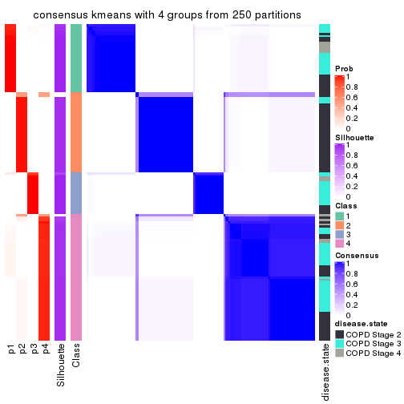</p>

</div>
<div id='tab-ATC-kmeans-consensus-heatmap-4'>
<pre><code class="r">consensus_heatmap(res, k = 5)
</code></pre>

<p></p>

</div>
<div id='tab-ATC-kmeans-consensus-heatmap-5'>
<pre><code class="r">consensus_heatmap(res, k = 6)
</code></pre>

<p></p>

</div>
</div>

Heatmaps for the membership of samples in all partitions to see how consistent they are:


<script>
$( function() {
	$( '#tabs-ATC-kmeans-membership-heatmap' ).tabs();
} );
</script>
<div id='tabs-ATC-kmeans-membership-heatmap'>
<ul>
<li><a href='#tab-ATC-kmeans-membership-heatmap-1'>k = 2</a></li>
<li><a href='#tab-ATC-kmeans-membership-heatmap-2'>k = 3</a></li>
<li><a href='#tab-ATC-kmeans-membership-heatmap-3'>k = 4</a></li>
<li><a href='#tab-ATC-kmeans-membership-heatmap-4'>k = 5</a></li>
<li><a href='#tab-ATC-kmeans-membership-heatmap-5'>k = 6</a></li>
</ul>
<div id='tab-ATC-kmeans-membership-heatmap-1'>
<pre><code class="r">membership_heatmap(res, k = 2)
</code></pre>

<p></p>

</div>
<div id='tab-ATC-kmeans-membership-heatmap-2'>
<pre><code class="r">membership_heatmap(res, k = 3)
</code></pre>

<p></p>

</div>
<div id='tab-ATC-kmeans-membership-heatmap-3'>
<pre><code class="r">membership_heatmap(res, k = 4)
</code></pre>

<p></p>

</div>
<div id='tab-ATC-kmeans-membership-heatmap-4'>
<pre><code class="r">membership_heatmap(res, k = 5)
</code></pre>

<p></p>

</div>
<div id='tab-ATC-kmeans-membership-heatmap-5'>
<pre><code class="r">membership_heatmap(res, k = 6)
</code></pre>

<p></p>

</div>
</div>

As soon as we have had the classes for columns, we can look for signatures
which are significantly different between classes which can be candidate marks
for certain classes. Following are the heatmaps for signatures.


Signature heatmaps where rows are scaled:


<script>
$( function() {
	$( '#tabs-ATC-kmeans-get-signatures' ).tabs();
} );
</script>
<div id='tabs-ATC-kmeans-get-signatures'>
<ul>
<li><a href='#tab-ATC-kmeans-get-signatures-1'>k = 2</a></li>
<li><a href='#tab-ATC-kmeans-get-signatures-2'>k = 3</a></li>
<li><a href='#tab-ATC-kmeans-get-signatures-3'>k = 4</a></li>
<li><a href='#tab-ATC-kmeans-get-signatures-4'>k = 5</a></li>
<li><a href='#tab-ATC-kmeans-get-signatures-5'>k = 6</a></li>
</ul>
<div id='tab-ATC-kmeans-get-signatures-1'>
<pre><code class="r">get_signatures(res, k = 2)
</code></pre>

<p></p>

</div>
<div id='tab-ATC-kmeans-get-signatures-2'>
<pre><code class="r">get_signatures(res, k = 3)
</code></pre>

<p></p>

</div>
<div id='tab-ATC-kmeans-get-signatures-3'>
<pre><code class="r">get_signatures(res, k = 4)
</code></pre>

<p></p>

</div>
<div id='tab-ATC-kmeans-get-signatures-4'>
<pre><code class="r">get_signatures(res, k = 5)
</code></pre>

<p></p>

</div>
<div id='tab-ATC-kmeans-get-signatures-5'>
<pre><code class="r">get_signatures(res, k = 6)
</code></pre>

<p></p>

</div>
</div>


Signature heatmaps where rows are not scaled:


<script>
$( function() {
	$( '#tabs-ATC-kmeans-get-signatures-no-scale' ).tabs();
} );
</script>
<div id='tabs-ATC-kmeans-get-signatures-no-scale'>
<ul>
<li><a href='#tab-ATC-kmeans-get-signatures-no-scale-1'>k = 2</a></li>
<li><a href='#tab-ATC-kmeans-get-signatures-no-scale-2'>k = 3</a></li>
<li><a href='#tab-ATC-kmeans-get-signatures-no-scale-3'>k = 4</a></li>
<li><a href='#tab-ATC-kmeans-get-signatures-no-scale-4'>k = 5</a></li>
<li><a href='#tab-ATC-kmeans-get-signatures-no-scale-5'>k = 6</a></li>
</ul>
<div id='tab-ATC-kmeans-get-signatures-no-scale-1'>
<pre><code class="r">get_signatures(res, k = 2, scale_rows = FALSE)
</code></pre>

<p>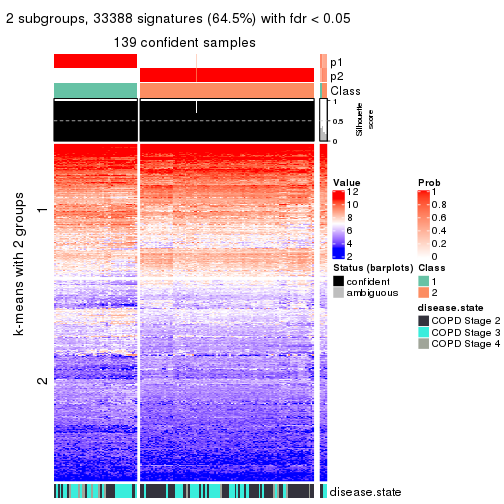</p>

</div>
<div id='tab-ATC-kmeans-get-signatures-no-scale-2'>
<pre><code class="r">get_signatures(res, k = 3, scale_rows = FALSE)
</code></pre>

<p></p>

</div>
<div id='tab-ATC-kmeans-get-signatures-no-scale-3'>
<pre><code class="r">get_signatures(res, k = 4, scale_rows = FALSE)
</code></pre>

<p></p>

</div>
<div id='tab-ATC-kmeans-get-signatures-no-scale-4'>
<pre><code class="r">get_signatures(res, k = 5, scale_rows = FALSE)
</code></pre>

<p></p>

</div>
<div id='tab-ATC-kmeans-get-signatures-no-scale-5'>
<pre><code class="r">get_signatures(res, k = 6, scale_rows = FALSE)
</code></pre>

<p></p>

</div>
</div>


Compare the overlap of signatures from different k:

```r
compare_signatures(res)
```


`get_signature()` returns a data frame invisibly. TO get the list of signatures, the function
call should be assigned to a variable explicitly. In following code, if `plot` argument is set
to `FALSE`, no heatmap is plotted while only the differential analysis is performed.

```r
# code only for demonstration
tb = get_signature(res, k = ..., plot = FALSE)
```

An example of the output of `tb` is:

```
#>   which_row         fdr    mean_1    mean_2 scaled_mean_1 scaled_mean_2 km
#> 1        38 0.042760348  8.373488  9.131774    -0.5533452     0.5164555  1
#> 2        40 0.018707592  7.106213  8.469186    -0.6173731     0.5762149  1
#> 3        55 0.019134737 10.221463 11.207825    -0.6159697     0.5749050  1
#> 4        59 0.006059896  5.921854  7.869574    -0.6899429     0.6439467  1
#> 5        60 0.018055526  8.928898 10.211722    -0.6204761     0.5791110  1
#> 6        98 0.009384629 15.714769 14.887706     0.6635654    -0.6193277  2
...
```

The columns in `tb` are:

1. `which_row`: row indices corresponding to the input matrix.
2. `fdr`: FDR for the differential test. 
3. `mean_x`: The mean value in group x.
4. `scaled_mean_x`: The mean value in group x after rows are scaled.
5. `km`: Row groups if k-means clustering is applied to rows.


UMAP plot which shows how samples are separated.


<script>
$( function() {
	$( '#tabs-ATC-kmeans-dimension-reduction' ).tabs();
} );
</script>
<div id='tabs-ATC-kmeans-dimension-reduction'>
<ul>
<li><a href='#tab-ATC-kmeans-dimension-reduction-1'>k = 2</a></li>
<li><a href='#tab-ATC-kmeans-dimension-reduction-2'>k = 3</a></li>
<li><a href='#tab-ATC-kmeans-dimension-reduction-3'>k = 4</a></li>
<li><a href='#tab-ATC-kmeans-dimension-reduction-4'>k = 5</a></li>
<li><a href='#tab-ATC-kmeans-dimension-reduction-5'>k = 6</a></li>
</ul>
<div id='tab-ATC-kmeans-dimension-reduction-1'>
<pre><code class="r">dimension_reduction(res, k = 2, method = &quot;UMAP&quot;)
</code></pre>

<p></p>

</div>
<div id='tab-ATC-kmeans-dimension-reduction-2'>
<pre><code class="r">dimension_reduction(res, k = 3, method = &quot;UMAP&quot;)
</code></pre>

<p></p>

</div>
<div id='tab-ATC-kmeans-dimension-reduction-3'>
<pre><code class="r">dimension_reduction(res, k = 4, method = &quot;UMAP&quot;)
</code></pre>

<p></p>

</div>
<div id='tab-ATC-kmeans-dimension-reduction-4'>
<pre><code class="r">dimension_reduction(res, k = 5, method = &quot;UMAP&quot;)
</code></pre>

<p></p>

</div>
<div id='tab-ATC-kmeans-dimension-reduction-5'>
<pre><code class="r">dimension_reduction(res, k = 6, method = &quot;UMAP&quot;)
</code></pre>

<p></p>

</div>
</div>


Following heatmap shows how subgroups are split when increasing `k`:

```r
collect_classes(res)
```


Test correlation between subgroups and known annotations. If the known
annotation is numeric, one-way ANOVA test is applied, and if the known
annotation is discrete, chi-squared contingency table test is applied.

```r
test_to_known_factors(res)
```

```
#>              n disease.state(p) k
#> ATC:kmeans 139         2.55e-03 2
#> ATC:kmeans 140         6.25e-05 3
#> ATC:kmeans 140         3.61e-06 4
#> ATC:kmeans 127         1.22e-05 5
#> ATC:kmeans 131         9.91e-06 6
```


If matrix rows can be associated to genes, consider to use `GO_Enrichment(res,
...)` to perform function enrichment for the signature genes.


 

---------------------------------------------------


### ATC:skmeans*


The object with results only for a single top-value method and a single partition method 
can be extracted as:

```r
res = res_list["ATC", "skmeans"]
# you can also extract it by
# res = res_list["ATC:skmeans"]
```

A summary of `res` and all the functions that can be applied to it:

```r
res
```

```
#> A 'ConsensusPartition' object with k = 2, 3, 4, 5, 6.
#>   On a matrix with 51776 rows and 143 columns.
#>   Top rows (1000, 2000, 3000, 4000, 5000) are extracted by 'ATC' method.
#>   Subgroups are detected by 'skmeans' method.
#>   Performed in total 1250 partitions by row resampling.
#>   Best k for subgroups seems to be 5.
#> 
#> Following methods can be applied to this 'ConsensusPartition' object:
#>  [1] "cola_report"             "collect_classes"         "collect_plots"          
#>  [4] "collect_stats"           "colnames"                "compare_signatures"     
#>  [7] "consensus_heatmap"       "dimension_reduction"     "functional_enrichment"  
#> [10] "get_anno_col"            "get_anno"                "get_classes"            
#> [13] "get_consensus"           "get_matrix"              "get_membership"         
#> [16] "get_param"               "get_signatures"          "get_stats"              
#> [19] "is_best_k"               "is_stable_k"             "membership_heatmap"     
#> [22] "ncol"                    "nrow"                    "plot_ecdf"              
#> [25] "rownames"                "select_partition_number" "show"                   
#> [28] "suggest_best_k"          "test_to_known_factors"
```

`collect_plots()` function collects all the plots made from `res` for all `k` (number of partitions)
into one single page to provide an easy and fast comparison between different `k`.

```r
collect_plots(res)
```


The plots are:

- The first row: a plot of the ECDF (Empirical cumulative distribution
  function) curves of the consensus matrix for each `k` and the heatmap of
  predicted classes for each `k`.
- The second row: heatmaps of the consensus matrix for each `k`.
- The third row: heatmaps of the membership matrix for each `k`.
- The fouth row: heatmaps of the signatures for each `k`.

All the plots in panels can be made by individual functions and they are
plotted later in this section.

`select_partition_number()` produces several plots showing different
statistics for choosing "optimized" `k`. There are following statistics:

- ECDF curves of the consensus matrix for each `k`;
- 1-PAC. [The PAC
  score](https://en.wikipedia.org/wiki/Consensus_clustering#Over-interpretation_potential_of_consensus_clustering)
  measures the proportion of the ambiguous subgrouping.
- Mean silhouette score.
- Concordance. The mean probability of fiting the consensus class ids in all
  partitions.
- Area increased. Denote $A_k$ as the area under the ECDF curve for current
  `k`, the area increased is defined as $A_k - A_{k-1}$.
- Rand index. The percent of pairs of samples that are both in a same cluster
  or both are not in a same cluster in the partition of k and k-1.
- Jaccard index. The ratio of pairs of samples are both in a same cluster in
  the partition of k and k-1 and the pairs of samples are both in a same
  cluster in the partition k or k-1.

The detailed explanations of these statistics can be found in [the cola
vignette](http://bioconductor.org/packages/devel/bioc/vignettes/cola/inst/doc/cola.html#toc_13).

Generally speaking, lower PAC score, higher mean silhouette score or higher
concordance corresponds to better partition. Rand index and Jaccard index
measure how similar the current partition is compared to partition with `k-1`.
If they are too similar, we won't accept `k` is better than `k-1`.

```r
select_partition_number(res)
```


The numeric values for all these statistics can be obtained by `get_stats()`.

```r
get_stats(res)
```

```
#>   k 1-PAC mean_silhouette concordance area_increased  Rand Jaccard
#> 2 2 1.000           0.974       0.989         0.4835 0.514   0.514
#> 3 3 1.000           0.963       0.985         0.2400 0.883   0.773
#> 4 4 0.919           0.858       0.940         0.0659 0.940   0.853
#> 5 5 0.929           0.871       0.941         0.0447 0.977   0.936
#> 6 6 0.839           0.837       0.904         0.0454 0.987   0.963
```

`suggest_best_k()` suggests the best $k$ based on these statistics. The rules are as follows:

- All $k$ with Jaccard index larger than 0.95 are removed because the increase of
  the partition number does not provides enough extra information. If all $k$ are removed,
  the best $k$ is assigned by `NA`.
- For $k$ with 1-PAC larger than 0.9, the maximal $k$ is taken as the "best k". Other $k$ is called "optional k".
- If it does not fit the second rule. The $k$ with the highest vote of highest
  1-PAC, mean silhouette and concordance is taken as the "best k".

```r
suggest_best_k(res)
```

```
#> [1] 5
#> attr(,"optional")
#> [1] 2 3 4
```

There is also optional best $k$ = 2 3 4 that is worth to check.

Following shows the table of the partitions (You need to click the **show/hide
code output** link to see it). The membership matrix (columns with name `p*`)
is inferred by
[`clue::cl_consensus()`](https://www.rdocumentation.org/link/cl_consensus?package=clue)
function with the `SE` method. Basically the value in the membership matrix
represents the probability to belong to a certain group. The finall class
label for an item is determined with the group with highest probability it
belongs to.

In `get_classes()` function, the entropy is calculated from the membership
matrix and the silhouette score is calculated from the consensus matrix.


<script>
$( function() {
	$( '#tabs-ATC-skmeans-get-classes' ).tabs();
} );
</script>
<div id='tabs-ATC-skmeans-get-classes'>
<ul>
<li><a href='#tab-ATC-skmeans-get-classes-1'>k = 2</a></li>
<li><a href='#tab-ATC-skmeans-get-classes-2'>k = 3</a></li>
<li><a href='#tab-ATC-skmeans-get-classes-3'>k = 4</a></li>
<li><a href='#tab-ATC-skmeans-get-classes-4'>k = 5</a></li>
<li><a href='#tab-ATC-skmeans-get-classes-5'>k = 6</a></li>
</ul>

<div id='tab-ATC-skmeans-get-classes-1'>
<p><a id='tab-ATC-skmeans-get-classes-1-a' style='color:#0366d6' href='#'>show/hide code output</a></p>
<pre><code class="r">cbind(get_classes(res, k = 2), get_membership(res, k = 2))
</code></pre>

<pre><code>#&gt;           class entropy silhouette    p1    p2
#&gt; GSM550785     1   0.000      0.979 1.000 0.000
#&gt; GSM550786     2   0.000      0.996 0.000 1.000
#&gt; GSM550788     2   0.000      0.996 0.000 1.000
#&gt; GSM550789     2   0.000      0.996 0.000 1.000
#&gt; GSM550790     1   0.000      0.979 1.000 0.000
#&gt; GSM550791     1   0.000      0.979 1.000 0.000
#&gt; GSM550792     2   0.000      0.996 0.000 1.000
#&gt; GSM550796     2   0.000      0.996 0.000 1.000
#&gt; GSM550797     2   0.000      0.996 0.000 1.000
#&gt; GSM550799     2   0.000      0.996 0.000 1.000
#&gt; GSM550800     2   0.000      0.996 0.000 1.000
#&gt; GSM550801     2   0.000      0.996 0.000 1.000
#&gt; GSM550804     2   0.000      0.996 0.000 1.000
#&gt; GSM550806     1   0.000      0.979 1.000 0.000
#&gt; GSM550807     2   0.000      0.996 0.000 1.000
#&gt; GSM550808     2   0.000      0.996 0.000 1.000
#&gt; GSM550809     1   0.000      0.979 1.000 0.000
#&gt; GSM550810     2   0.000      0.996 0.000 1.000
#&gt; GSM550811     1   0.000      0.979 1.000 0.000
#&gt; GSM550813     2   0.000      0.996 0.000 1.000
#&gt; GSM550814     2   0.000      0.996 0.000 1.000
#&gt; GSM550815     2   0.000      0.996 0.000 1.000
#&gt; GSM550816     2   0.000      0.996 0.000 1.000
#&gt; GSM550817     2   0.000      0.996 0.000 1.000
#&gt; GSM550818     2   0.000      0.996 0.000 1.000
#&gt; GSM550819     2   0.000      0.996 0.000 1.000
#&gt; GSM550820     1   0.000      0.979 1.000 0.000
#&gt; GSM550821     2   0.000      0.996 0.000 1.000
#&gt; GSM550822     2   0.000      0.996 0.000 1.000
#&gt; GSM550826     1   0.000      0.979 1.000 0.000
#&gt; GSM550832     2   0.000      0.996 0.000 1.000
#&gt; GSM550833     2   0.000      0.996 0.000 1.000
#&gt; GSM550835     2   0.000      0.996 0.000 1.000
#&gt; GSM550836     1   0.000      0.979 1.000 0.000
#&gt; GSM550837     2   0.000      0.996 0.000 1.000
#&gt; GSM550838     1   0.000      0.979 1.000 0.000
#&gt; GSM550841     2   0.000      0.996 0.000 1.000
#&gt; GSM550842     2   0.000      0.996 0.000 1.000
#&gt; GSM550846     2   0.000      0.996 0.000 1.000
#&gt; GSM550849     1   0.714      0.758 0.804 0.196
#&gt; GSM550850     1   0.000      0.979 1.000 0.000
#&gt; GSM550851     2   0.000      0.996 0.000 1.000
#&gt; GSM550852     2   0.000      0.996 0.000 1.000
#&gt; GSM550853     2   0.000      0.996 0.000 1.000
#&gt; GSM550855     2   0.000      0.996 0.000 1.000
#&gt; GSM550856     2   0.000      0.996 0.000 1.000
#&gt; GSM550861     2   0.000      0.996 0.000 1.000
#&gt; GSM550863     2   0.000      0.996 0.000 1.000
#&gt; GSM550864     2   0.000      0.996 0.000 1.000
#&gt; GSM550866     2   0.000      0.996 0.000 1.000
#&gt; GSM550867     1   0.000      0.979 1.000 0.000
#&gt; GSM550885     1   0.000      0.979 1.000 0.000
#&gt; GSM550886     2   0.000      0.996 0.000 1.000
#&gt; GSM550887     2   0.000      0.996 0.000 1.000
#&gt; GSM550889     1   0.000      0.979 1.000 0.000
#&gt; GSM550894     2   0.000      0.996 0.000 1.000
#&gt; GSM550897     1   0.000      0.979 1.000 0.000
#&gt; GSM550903     2   0.000      0.996 0.000 1.000
#&gt; GSM550905     2   0.000      0.996 0.000 1.000
#&gt; GSM550906     2   0.000      0.996 0.000 1.000
#&gt; GSM550907     2   0.000      0.996 0.000 1.000
#&gt; GSM550909     2   0.000      0.996 0.000 1.000
#&gt; GSM550911     2   0.000      0.996 0.000 1.000
#&gt; GSM550913     2   0.000      0.996 0.000 1.000
#&gt; GSM550915     1   0.946      0.450 0.636 0.364
#&gt; GSM550917     2   0.000      0.996 0.000 1.000
#&gt; GSM550919     2   0.000      0.996 0.000 1.000
#&gt; GSM550921     1   0.000      0.979 1.000 0.000
#&gt; GSM550924     2   0.000      0.996 0.000 1.000
#&gt; GSM550926     2   0.000      0.996 0.000 1.000
#&gt; GSM550927     2   0.000      0.996 0.000 1.000
#&gt; GSM550787     1   0.000      0.979 1.000 0.000
#&gt; GSM550793     1   0.000      0.979 1.000 0.000
#&gt; GSM550794     2   0.000      0.996 0.000 1.000
#&gt; GSM550795     1   0.000      0.979 1.000 0.000
#&gt; GSM550798     1   0.000      0.979 1.000 0.000
#&gt; GSM550803     1   0.000      0.979 1.000 0.000
#&gt; GSM550805     1   0.000      0.979 1.000 0.000
#&gt; GSM550823     2   0.000      0.996 0.000 1.000
#&gt; GSM550824     1   0.000      0.979 1.000 0.000
#&gt; GSM550825     1   0.000      0.979 1.000 0.000
#&gt; GSM550827     2   0.000      0.996 0.000 1.000
#&gt; GSM550828     1   0.000      0.979 1.000 0.000
#&gt; GSM550829     1   0.000      0.979 1.000 0.000
#&gt; GSM550830     2   0.000      0.996 0.000 1.000
#&gt; GSM550834     1   0.000      0.979 1.000 0.000
#&gt; GSM550839     2   0.000      0.996 0.000 1.000
#&gt; GSM550840     1   0.000      0.979 1.000 0.000
#&gt; GSM550843     2   0.000      0.996 0.000 1.000
#&gt; GSM550844     1   0.000      0.979 1.000 0.000
#&gt; GSM550845     2   0.000      0.996 0.000 1.000
#&gt; GSM550848     2   0.000      0.996 0.000 1.000
#&gt; GSM550854     1   0.000      0.979 1.000 0.000
#&gt; GSM550857     1   0.000      0.979 1.000 0.000
#&gt; GSM550858     1   0.000      0.979 1.000 0.000
#&gt; GSM550859     1   0.000      0.979 1.000 0.000
#&gt; GSM550862     1   0.000      0.979 1.000 0.000
#&gt; GSM550865     1   0.000      0.979 1.000 0.000
#&gt; GSM550868     2   0.000      0.996 0.000 1.000
#&gt; GSM550869     1   0.781      0.704 0.768 0.232
#&gt; GSM550870     2   0.000      0.996 0.000 1.000
#&gt; GSM550871     2   0.000      0.996 0.000 1.000
#&gt; GSM550872     2   0.000      0.996 0.000 1.000
#&gt; GSM550873     2   0.000      0.996 0.000 1.000
#&gt; GSM550874     2   0.000      0.996 0.000 1.000
#&gt; GSM550876     2   0.000      0.996 0.000 1.000
#&gt; GSM550877     2   0.000      0.996 0.000 1.000
#&gt; GSM550878     2   0.000      0.996 0.000 1.000
#&gt; GSM550879     1   0.000      0.979 1.000 0.000
#&gt; GSM550882     1   0.000      0.979 1.000 0.000
#&gt; GSM550888     1   0.000      0.979 1.000 0.000
#&gt; GSM550890     2   0.000      0.996 0.000 1.000
#&gt; GSM550891     1   0.000      0.979 1.000 0.000
#&gt; GSM550892     1   0.000      0.979 1.000 0.000
#&gt; GSM550893     2   0.000      0.996 0.000 1.000
#&gt; GSM550895     2   0.000      0.996 0.000 1.000
#&gt; GSM550896     2   0.000      0.996 0.000 1.000
#&gt; GSM550898     1   0.000      0.979 1.000 0.000
#&gt; GSM550899     2   0.000      0.996 0.000 1.000
#&gt; GSM550900     2   0.000      0.996 0.000 1.000
#&gt; GSM550901     1   0.978      0.327 0.588 0.412
#&gt; GSM550902     1   0.000      0.979 1.000 0.000
#&gt; GSM550904     1   0.000      0.979 1.000 0.000
#&gt; GSM550908     1   0.000      0.979 1.000 0.000
#&gt; GSM550912     2   0.000      0.996 0.000 1.000
#&gt; GSM550914     2   0.881      0.561 0.300 0.700
#&gt; GSM550918     2   0.000      0.996 0.000 1.000
#&gt; GSM550922     2   0.000      0.996 0.000 1.000
#&gt; GSM550923     1   0.000      0.979 1.000 0.000
#&gt; GSM550925     1   0.000      0.979 1.000 0.000
#&gt; GSM550802     2   0.000      0.996 0.000 1.000
#&gt; GSM550812     2   0.000      0.996 0.000 1.000
#&gt; GSM550831     1   0.000      0.979 1.000 0.000
#&gt; GSM550847     1   0.000      0.979 1.000 0.000
#&gt; GSM550860     1   0.000      0.979 1.000 0.000
#&gt; GSM550875     1   0.000      0.979 1.000 0.000
#&gt; GSM550880     1   0.000      0.979 1.000 0.000
#&gt; GSM550881     1   0.000      0.979 1.000 0.000
#&gt; GSM550883     1   0.000      0.979 1.000 0.000
#&gt; GSM550884     2   0.000      0.996 0.000 1.000
#&gt; GSM550910     2   0.000      0.996 0.000 1.000
#&gt; GSM550916     1   0.000      0.979 1.000 0.000
#&gt; GSM550920     2   0.000      0.996 0.000 1.000
</code></pre>

<script>
$('#tab-ATC-skmeans-get-classes-1-a').parent().next().next().hide();
$('#tab-ATC-skmeans-get-classes-1-a').click(function(){
  $('#tab-ATC-skmeans-get-classes-1-a').parent().next().next().toggle();
  return(false);
});
</script>
</div>

<div id='tab-ATC-skmeans-get-classes-2'>
<p><a id='tab-ATC-skmeans-get-classes-2-a' style='color:#0366d6' href='#'>show/hide code output</a></p>
<pre><code class="r">cbind(get_classes(res, k = 3), get_membership(res, k = 3))
</code></pre>

<pre><code>#&gt;           class entropy silhouette    p1    p2    p3
#&gt; GSM550785     1  0.0000     0.9780 1.000 0.000 0.000
#&gt; GSM550786     2  0.0000     0.9891 0.000 1.000 0.000
#&gt; GSM550788     2  0.0000     0.9891 0.000 1.000 0.000
#&gt; GSM550789     2  0.0000     0.9891 0.000 1.000 0.000
#&gt; GSM550790     1  0.0000     0.9780 1.000 0.000 0.000
#&gt; GSM550791     1  0.0000     0.9780 1.000 0.000 0.000
#&gt; GSM550792     2  0.2878     0.8909 0.000 0.904 0.096
#&gt; GSM550796     2  0.0000     0.9891 0.000 1.000 0.000
#&gt; GSM550797     2  0.0000     0.9891 0.000 1.000 0.000
#&gt; GSM550799     2  0.0000     0.9891 0.000 1.000 0.000
#&gt; GSM550800     2  0.0000     0.9891 0.000 1.000 0.000
#&gt; GSM550801     2  0.0000     0.9891 0.000 1.000 0.000
#&gt; GSM550804     2  0.0000     0.9891 0.000 1.000 0.000
#&gt; GSM550806     1  0.0000     0.9780 1.000 0.000 0.000
#&gt; GSM550807     2  0.0000     0.9891 0.000 1.000 0.000
#&gt; GSM550808     2  0.0000     0.9891 0.000 1.000 0.000
#&gt; GSM550809     1  0.0000     0.9780 1.000 0.000 0.000
#&gt; GSM550810     2  0.0000     0.9891 0.000 1.000 0.000
#&gt; GSM550811     1  0.0000     0.9780 1.000 0.000 0.000
#&gt; GSM550813     2  0.0000     0.9891 0.000 1.000 0.000
#&gt; GSM550814     2  0.0000     0.9891 0.000 1.000 0.000
#&gt; GSM550815     2  0.0000     0.9891 0.000 1.000 0.000
#&gt; GSM550816     2  0.0000     0.9891 0.000 1.000 0.000
#&gt; GSM550817     2  0.0000     0.9891 0.000 1.000 0.000
#&gt; GSM550818     2  0.0000     0.9891 0.000 1.000 0.000
#&gt; GSM550819     2  0.0000     0.9891 0.000 1.000 0.000
#&gt; GSM550820     1  0.0000     0.9780 1.000 0.000 0.000
#&gt; GSM550821     2  0.0000     0.9891 0.000 1.000 0.000
#&gt; GSM550822     2  0.0000     0.9891 0.000 1.000 0.000
#&gt; GSM550826     1  0.0000     0.9780 1.000 0.000 0.000
#&gt; GSM550832     2  0.0000     0.9891 0.000 1.000 0.000
#&gt; GSM550833     2  0.0000     0.9891 0.000 1.000 0.000
#&gt; GSM550835     2  0.0000     0.9891 0.000 1.000 0.000
#&gt; GSM550836     1  0.0000     0.9780 1.000 0.000 0.000
#&gt; GSM550837     2  0.0000     0.9891 0.000 1.000 0.000
#&gt; GSM550838     1  0.0000     0.9780 1.000 0.000 0.000
#&gt; GSM550841     2  0.0000     0.9891 0.000 1.000 0.000
#&gt; GSM550842     2  0.0000     0.9891 0.000 1.000 0.000
#&gt; GSM550846     3  0.0000     0.9760 0.000 0.000 1.000
#&gt; GSM550849     1  0.4931     0.6460 0.768 0.232 0.000
#&gt; GSM550850     1  0.0000     0.9780 1.000 0.000 0.000
#&gt; GSM550851     2  0.0000     0.9891 0.000 1.000 0.000
#&gt; GSM550852     2  0.0000     0.9891 0.000 1.000 0.000
#&gt; GSM550853     2  0.0000     0.9891 0.000 1.000 0.000
#&gt; GSM550855     2  0.0000     0.9891 0.000 1.000 0.000
#&gt; GSM550856     2  0.0000     0.9891 0.000 1.000 0.000
#&gt; GSM550861     2  0.0000     0.9891 0.000 1.000 0.000
#&gt; GSM550863     3  0.1031     0.9584 0.000 0.024 0.976
#&gt; GSM550864     2  0.0000     0.9891 0.000 1.000 0.000
#&gt; GSM550866     2  0.0000     0.9891 0.000 1.000 0.000
#&gt; GSM550867     1  0.0000     0.9780 1.000 0.000 0.000
#&gt; GSM550885     1  0.0000     0.9780 1.000 0.000 0.000
#&gt; GSM550886     2  0.0000     0.9891 0.000 1.000 0.000
#&gt; GSM550887     2  0.0000     0.9891 0.000 1.000 0.000
#&gt; GSM550889     1  0.0000     0.9780 1.000 0.000 0.000
#&gt; GSM550894     2  0.0000     0.9891 0.000 1.000 0.000
#&gt; GSM550897     1  0.0000     0.9780 1.000 0.000 0.000
#&gt; GSM550903     2  0.0000     0.9891 0.000 1.000 0.000
#&gt; GSM550905     2  0.0000     0.9891 0.000 1.000 0.000
#&gt; GSM550906     2  0.0000     0.9891 0.000 1.000 0.000
#&gt; GSM550907     2  0.0000     0.9891 0.000 1.000 0.000
#&gt; GSM550909     2  0.0000     0.9891 0.000 1.000 0.000
#&gt; GSM550911     2  0.0000     0.9891 0.000 1.000 0.000
#&gt; GSM550913     2  0.0000     0.9891 0.000 1.000 0.000
#&gt; GSM550915     3  0.0000     0.9760 0.000 0.000 1.000
#&gt; GSM550917     2  0.0000     0.9891 0.000 1.000 0.000
#&gt; GSM550919     3  0.0000     0.9760 0.000 0.000 1.000
#&gt; GSM550921     1  0.0000     0.9780 1.000 0.000 0.000
#&gt; GSM550924     3  0.0000     0.9760 0.000 0.000 1.000
#&gt; GSM550926     2  0.0000     0.9891 0.000 1.000 0.000
#&gt; GSM550927     2  0.0000     0.9891 0.000 1.000 0.000
#&gt; GSM550787     1  0.0892     0.9541 0.980 0.020 0.000
#&gt; GSM550793     1  0.0000     0.9780 1.000 0.000 0.000
#&gt; GSM550794     2  0.0000     0.9891 0.000 1.000 0.000
#&gt; GSM550795     1  0.0000     0.9780 1.000 0.000 0.000
#&gt; GSM550798     1  0.0000     0.9780 1.000 0.000 0.000
#&gt; GSM550803     1  0.0000     0.9780 1.000 0.000 0.000
#&gt; GSM550805     1  0.0000     0.9780 1.000 0.000 0.000
#&gt; GSM550823     2  0.5138     0.6665 0.000 0.748 0.252
#&gt; GSM550824     1  0.0000     0.9780 1.000 0.000 0.000
#&gt; GSM550825     1  0.0000     0.9780 1.000 0.000 0.000
#&gt; GSM550827     3  0.5216     0.6429 0.000 0.260 0.740
#&gt; GSM550828     1  0.0000     0.9780 1.000 0.000 0.000
#&gt; GSM550829     1  0.0000     0.9780 1.000 0.000 0.000
#&gt; GSM550830     3  0.0000     0.9760 0.000 0.000 1.000
#&gt; GSM550834     1  0.0000     0.9780 1.000 0.000 0.000
#&gt; GSM550839     2  0.0000     0.9891 0.000 1.000 0.000
#&gt; GSM550840     1  0.0000     0.9780 1.000 0.000 0.000
#&gt; GSM550843     2  0.0000     0.9891 0.000 1.000 0.000
#&gt; GSM550844     1  0.0000     0.9780 1.000 0.000 0.000
#&gt; GSM550845     2  0.0000     0.9891 0.000 1.000 0.000
#&gt; GSM550848     2  0.4002     0.8112 0.000 0.840 0.160
#&gt; GSM550854     1  0.0000     0.9780 1.000 0.000 0.000
#&gt; GSM550857     1  0.0000     0.9780 1.000 0.000 0.000
#&gt; GSM550858     1  0.0000     0.9780 1.000 0.000 0.000
#&gt; GSM550859     1  0.0000     0.9780 1.000 0.000 0.000
#&gt; GSM550862     1  0.0000     0.9780 1.000 0.000 0.000
#&gt; GSM550865     1  0.0000     0.9780 1.000 0.000 0.000
#&gt; GSM550868     3  0.0000     0.9760 0.000 0.000 1.000
#&gt; GSM550869     1  0.5178     0.6061 0.744 0.256 0.000
#&gt; GSM550870     2  0.0000     0.9891 0.000 1.000 0.000
#&gt; GSM550871     2  0.4796     0.7228 0.000 0.780 0.220
#&gt; GSM550872     3  0.0000     0.9760 0.000 0.000 1.000
#&gt; GSM550873     2  0.0000     0.9891 0.000 1.000 0.000
#&gt; GSM550874     2  0.0000     0.9891 0.000 1.000 0.000
#&gt; GSM550876     2  0.0424     0.9816 0.000 0.992 0.008
#&gt; GSM550877     2  0.0000     0.9891 0.000 1.000 0.000
#&gt; GSM550878     3  0.0892     0.9632 0.000 0.020 0.980
#&gt; GSM550879     1  0.0000     0.9780 1.000 0.000 0.000
#&gt; GSM550882     1  0.0000     0.9780 1.000 0.000 0.000
#&gt; GSM550888     1  0.0000     0.9780 1.000 0.000 0.000
#&gt; GSM550890     3  0.0000     0.9760 0.000 0.000 1.000
#&gt; GSM550891     1  0.0000     0.9780 1.000 0.000 0.000
#&gt; GSM550892     1  0.0000     0.9780 1.000 0.000 0.000
#&gt; GSM550893     2  0.0000     0.9891 0.000 1.000 0.000
#&gt; GSM550895     3  0.0000     0.9760 0.000 0.000 1.000
#&gt; GSM550896     2  0.0000     0.9891 0.000 1.000 0.000
#&gt; GSM550898     1  0.0000     0.9780 1.000 0.000 0.000
#&gt; GSM550899     2  0.0000     0.9891 0.000 1.000 0.000
#&gt; GSM550900     3  0.0000     0.9760 0.000 0.000 1.000
#&gt; GSM550901     1  0.9457     0.0573 0.468 0.192 0.340
#&gt; GSM550902     1  0.0000     0.9780 1.000 0.000 0.000
#&gt; GSM550904     1  0.0000     0.9780 1.000 0.000 0.000
#&gt; GSM550908     1  0.0000     0.9780 1.000 0.000 0.000
#&gt; GSM550912     2  0.0000     0.9891 0.000 1.000 0.000
#&gt; GSM550914     3  0.0000     0.9760 0.000 0.000 1.000
#&gt; GSM550918     2  0.0000     0.9891 0.000 1.000 0.000
#&gt; GSM550922     2  0.0000     0.9891 0.000 1.000 0.000
#&gt; GSM550923     1  0.0000     0.9780 1.000 0.000 0.000
#&gt; GSM550925     1  0.0000     0.9780 1.000 0.000 0.000
#&gt; GSM550802     2  0.0000     0.9891 0.000 1.000 0.000
#&gt; GSM550812     2  0.0000     0.9891 0.000 1.000 0.000
#&gt; GSM550831     1  0.0000     0.9780 1.000 0.000 0.000
#&gt; GSM550847     1  0.0000     0.9780 1.000 0.000 0.000
#&gt; GSM550860     1  0.0000     0.9780 1.000 0.000 0.000
#&gt; GSM550875     1  0.0000     0.9780 1.000 0.000 0.000
#&gt; GSM550880     3  0.1031     0.9564 0.024 0.000 0.976
#&gt; GSM550881     1  0.0000     0.9780 1.000 0.000 0.000
#&gt; GSM550883     1  0.0000     0.9780 1.000 0.000 0.000
#&gt; GSM550884     3  0.0000     0.9760 0.000 0.000 1.000
#&gt; GSM550910     2  0.0000     0.9891 0.000 1.000 0.000
#&gt; GSM550916     1  0.0000     0.9780 1.000 0.000 0.000
#&gt; GSM550920     3  0.0747     0.9661 0.000 0.016 0.984
</code></pre>

<script>
$('#tab-ATC-skmeans-get-classes-2-a').parent().next().next().hide();
$('#tab-ATC-skmeans-get-classes-2-a').click(function(){
  $('#tab-ATC-skmeans-get-classes-2-a').parent().next().next().toggle();
  return(false);
});
</script>
</div>

<div id='tab-ATC-skmeans-get-classes-3'>
<p><a id='tab-ATC-skmeans-get-classes-3-a' style='color:#0366d6' href='#'>show/hide code output</a></p>
<pre><code class="r">cbind(get_classes(res, k = 4), get_membership(res, k = 4))
</code></pre>

<pre><code>#&gt;           class entropy silhouette    p1    p2    p3    p4
#&gt; GSM550785     1  0.0000    0.97126 1.000 0.000 0.000 0.000
#&gt; GSM550786     2  0.0000    0.98720 0.000 1.000 0.000 0.000
#&gt; GSM550788     2  0.0000    0.98720 0.000 1.000 0.000 0.000
#&gt; GSM550789     2  0.0000    0.98720 0.000 1.000 0.000 0.000
#&gt; GSM550790     1  0.0000    0.97126 1.000 0.000 0.000 0.000
#&gt; GSM550791     1  0.2345    0.88170 0.900 0.000 0.100 0.000
#&gt; GSM550792     4  0.4888    0.25029 0.000 0.412 0.000 0.588
#&gt; GSM550796     2  0.0000    0.98720 0.000 1.000 0.000 0.000
#&gt; GSM550797     2  0.0000    0.98720 0.000 1.000 0.000 0.000
#&gt; GSM550799     2  0.0000    0.98720 0.000 1.000 0.000 0.000
#&gt; GSM550800     2  0.0000    0.98720 0.000 1.000 0.000 0.000
#&gt; GSM550801     2  0.0000    0.98720 0.000 1.000 0.000 0.000
#&gt; GSM550804     2  0.0000    0.98720 0.000 1.000 0.000 0.000
#&gt; GSM550806     4  0.7827   -0.00949 0.276 0.000 0.316 0.408
#&gt; GSM550807     2  0.0000    0.98720 0.000 1.000 0.000 0.000
#&gt; GSM550808     2  0.0000    0.98720 0.000 1.000 0.000 0.000
#&gt; GSM550809     1  0.1792    0.91238 0.932 0.000 0.068 0.000
#&gt; GSM550810     2  0.0000    0.98720 0.000 1.000 0.000 0.000
#&gt; GSM550811     1  0.0000    0.97126 1.000 0.000 0.000 0.000
#&gt; GSM550813     2  0.0000    0.98720 0.000 1.000 0.000 0.000
#&gt; GSM550814     2  0.0000    0.98720 0.000 1.000 0.000 0.000
#&gt; GSM550815     2  0.0000    0.98720 0.000 1.000 0.000 0.000
#&gt; GSM550816     2  0.0000    0.98720 0.000 1.000 0.000 0.000
#&gt; GSM550817     2  0.0000    0.98720 0.000 1.000 0.000 0.000
#&gt; GSM550818     2  0.1118    0.95158 0.000 0.964 0.036 0.000
#&gt; GSM550819     2  0.0000    0.98720 0.000 1.000 0.000 0.000
#&gt; GSM550820     1  0.0000    0.97126 1.000 0.000 0.000 0.000
#&gt; GSM550821     2  0.0000    0.98720 0.000 1.000 0.000 0.000
#&gt; GSM550822     2  0.0000    0.98720 0.000 1.000 0.000 0.000
#&gt; GSM550826     1  0.0000    0.97126 1.000 0.000 0.000 0.000
#&gt; GSM550832     2  0.0000    0.98720 0.000 1.000 0.000 0.000
#&gt; GSM550833     2  0.0000    0.98720 0.000 1.000 0.000 0.000
#&gt; GSM550835     2  0.0000    0.98720 0.000 1.000 0.000 0.000
#&gt; GSM550836     1  0.0000    0.97126 1.000 0.000 0.000 0.000
#&gt; GSM550837     2  0.0000    0.98720 0.000 1.000 0.000 0.000
#&gt; GSM550838     1  0.0000    0.97126 1.000 0.000 0.000 0.000
#&gt; GSM550841     2  0.0000    0.98720 0.000 1.000 0.000 0.000
#&gt; GSM550842     2  0.0000    0.98720 0.000 1.000 0.000 0.000
#&gt; GSM550846     3  0.4500    0.42661 0.000 0.000 0.684 0.316
#&gt; GSM550849     3  0.6633    0.12781 0.416 0.084 0.500 0.000
#&gt; GSM550850     1  0.2345    0.88161 0.900 0.000 0.100 0.000
#&gt; GSM550851     2  0.0000    0.98720 0.000 1.000 0.000 0.000
#&gt; GSM550852     2  0.0000    0.98720 0.000 1.000 0.000 0.000
#&gt; GSM550853     2  0.0000    0.98720 0.000 1.000 0.000 0.000
#&gt; GSM550855     2  0.0000    0.98720 0.000 1.000 0.000 0.000
#&gt; GSM550856     2  0.0000    0.98720 0.000 1.000 0.000 0.000
#&gt; GSM550861     2  0.0000    0.98720 0.000 1.000 0.000 0.000
#&gt; GSM550863     4  0.1004    0.63785 0.000 0.024 0.004 0.972
#&gt; GSM550864     2  0.0336    0.97933 0.000 0.992 0.000 0.008
#&gt; GSM550866     2  0.0000    0.98720 0.000 1.000 0.000 0.000
#&gt; GSM550867     1  0.0000    0.97126 1.000 0.000 0.000 0.000
#&gt; GSM550885     1  0.0000    0.97126 1.000 0.000 0.000 0.000
#&gt; GSM550886     2  0.0000    0.98720 0.000 1.000 0.000 0.000
#&gt; GSM550887     2  0.0000    0.98720 0.000 1.000 0.000 0.000
#&gt; GSM550889     1  0.0000    0.97126 1.000 0.000 0.000 0.000
#&gt; GSM550894     2  0.0000    0.98720 0.000 1.000 0.000 0.000
#&gt; GSM550897     1  0.0000    0.97126 1.000 0.000 0.000 0.000
#&gt; GSM550903     2  0.0000    0.98720 0.000 1.000 0.000 0.000
#&gt; GSM550905     2  0.0000    0.98720 0.000 1.000 0.000 0.000
#&gt; GSM550906     2  0.0000    0.98720 0.000 1.000 0.000 0.000
#&gt; GSM550907     2  0.0000    0.98720 0.000 1.000 0.000 0.000
#&gt; GSM550909     2  0.0000    0.98720 0.000 1.000 0.000 0.000
#&gt; GSM550911     3  0.4331    0.15669 0.000 0.288 0.712 0.000
#&gt; GSM550913     2  0.0000    0.98720 0.000 1.000 0.000 0.000
#&gt; GSM550915     3  0.4655    0.42730 0.004 0.000 0.684 0.312
#&gt; GSM550917     2  0.0000    0.98720 0.000 1.000 0.000 0.000
#&gt; GSM550919     3  0.4855    0.27957 0.000 0.000 0.600 0.400
#&gt; GSM550921     1  0.0000    0.97126 1.000 0.000 0.000 0.000
#&gt; GSM550924     4  0.5279    0.11137 0.000 0.012 0.400 0.588
#&gt; GSM550926     2  0.0000    0.98720 0.000 1.000 0.000 0.000
#&gt; GSM550927     2  0.0000    0.98720 0.000 1.000 0.000 0.000
#&gt; GSM550787     1  0.4925    0.29293 0.572 0.000 0.428 0.000
#&gt; GSM550793     1  0.0000    0.97126 1.000 0.000 0.000 0.000
#&gt; GSM550794     2  0.0000    0.98720 0.000 1.000 0.000 0.000
#&gt; GSM550795     1  0.0000    0.97126 1.000 0.000 0.000 0.000
#&gt; GSM550798     1  0.0000    0.97126 1.000 0.000 0.000 0.000
#&gt; GSM550803     1  0.0000    0.97126 1.000 0.000 0.000 0.000
#&gt; GSM550805     1  0.4500    0.55990 0.684 0.000 0.316 0.000
#&gt; GSM550823     4  0.5383    0.51846 0.000 0.128 0.128 0.744
#&gt; GSM550824     1  0.0000    0.97126 1.000 0.000 0.000 0.000
#&gt; GSM550825     1  0.0000    0.97126 1.000 0.000 0.000 0.000
#&gt; GSM550827     4  0.3870    0.48293 0.000 0.208 0.004 0.788
#&gt; GSM550828     1  0.0000    0.97126 1.000 0.000 0.000 0.000
#&gt; GSM550829     1  0.0000    0.97126 1.000 0.000 0.000 0.000
#&gt; GSM550830     4  0.2589    0.58864 0.000 0.000 0.116 0.884
#&gt; GSM550834     1  0.2408    0.87773 0.896 0.000 0.104 0.000
#&gt; GSM550839     2  0.0000    0.98720 0.000 1.000 0.000 0.000
#&gt; GSM550840     1  0.3123    0.81622 0.844 0.000 0.156 0.000
#&gt; GSM550843     2  0.0000    0.98720 0.000 1.000 0.000 0.000
#&gt; GSM550844     1  0.0000    0.97126 1.000 0.000 0.000 0.000
#&gt; GSM550845     2  0.4406    0.52464 0.000 0.700 0.000 0.300
#&gt; GSM550848     2  0.1489    0.93579 0.000 0.952 0.004 0.044
#&gt; GSM550854     1  0.0000    0.97126 1.000 0.000 0.000 0.000
#&gt; GSM550857     1  0.0000    0.97126 1.000 0.000 0.000 0.000
#&gt; GSM550858     1  0.0000    0.97126 1.000 0.000 0.000 0.000
#&gt; GSM550859     1  0.0000    0.97126 1.000 0.000 0.000 0.000
#&gt; GSM550862     1  0.0000    0.97126 1.000 0.000 0.000 0.000
#&gt; GSM550865     1  0.0000    0.97126 1.000 0.000 0.000 0.000
#&gt; GSM550868     4  0.0188    0.63799 0.000 0.000 0.004 0.996
#&gt; GSM550869     3  0.6416    0.09961 0.428 0.056 0.512 0.004
#&gt; GSM550870     2  0.0000    0.98720 0.000 1.000 0.000 0.000
#&gt; GSM550871     4  0.4008    0.44651 0.000 0.244 0.000 0.756
#&gt; GSM550872     4  0.0000    0.63875 0.000 0.000 0.000 1.000
#&gt; GSM550873     2  0.0000    0.98720 0.000 1.000 0.000 0.000
#&gt; GSM550874     2  0.0000    0.98720 0.000 1.000 0.000 0.000
#&gt; GSM550876     2  0.4889    0.35957 0.000 0.636 0.004 0.360
#&gt; GSM550877     2  0.0000    0.98720 0.000 1.000 0.000 0.000
#&gt; GSM550878     4  0.2892    0.59745 0.000 0.068 0.036 0.896
#&gt; GSM550879     1  0.0000    0.97126 1.000 0.000 0.000 0.000
#&gt; GSM550882     1  0.0000    0.97126 1.000 0.000 0.000 0.000
#&gt; GSM550888     1  0.0000    0.97126 1.000 0.000 0.000 0.000
#&gt; GSM550890     3  0.4500    0.42661 0.000 0.000 0.684 0.316
#&gt; GSM550891     1  0.0000    0.97126 1.000 0.000 0.000 0.000
#&gt; GSM550892     1  0.0000    0.97126 1.000 0.000 0.000 0.000
#&gt; GSM550893     2  0.0000    0.98720 0.000 1.000 0.000 0.000
#&gt; GSM550895     4  0.0000    0.63875 0.000 0.000 0.000 1.000
#&gt; GSM550896     2  0.0000    0.98720 0.000 1.000 0.000 0.000
#&gt; GSM550898     1  0.0000    0.97126 1.000 0.000 0.000 0.000
#&gt; GSM550899     2  0.0000    0.98720 0.000 1.000 0.000 0.000
#&gt; GSM550900     4  0.0000    0.63875 0.000 0.000 0.000 1.000
#&gt; GSM550901     3  0.2074    0.38527 0.016 0.012 0.940 0.032
#&gt; GSM550902     1  0.0000    0.97126 1.000 0.000 0.000 0.000
#&gt; GSM550904     1  0.0000    0.97126 1.000 0.000 0.000 0.000
#&gt; GSM550908     1  0.0000    0.97126 1.000 0.000 0.000 0.000
#&gt; GSM550912     2  0.0000    0.98720 0.000 1.000 0.000 0.000
#&gt; GSM550914     3  0.4500    0.42661 0.000 0.000 0.684 0.316
#&gt; GSM550918     2  0.0000    0.98720 0.000 1.000 0.000 0.000
#&gt; GSM550922     2  0.0000    0.98720 0.000 1.000 0.000 0.000
#&gt; GSM550923     1  0.0000    0.97126 1.000 0.000 0.000 0.000
#&gt; GSM550925     1  0.0000    0.97126 1.000 0.000 0.000 0.000
#&gt; GSM550802     2  0.0000    0.98720 0.000 1.000 0.000 0.000
#&gt; GSM550812     2  0.0000    0.98720 0.000 1.000 0.000 0.000
#&gt; GSM550831     1  0.2216    0.88946 0.908 0.000 0.092 0.000
#&gt; GSM550847     1  0.0000    0.97126 1.000 0.000 0.000 0.000
#&gt; GSM550860     1  0.0000    0.97126 1.000 0.000 0.000 0.000
#&gt; GSM550875     1  0.0000    0.97126 1.000 0.000 0.000 0.000
#&gt; GSM550880     4  0.5784    0.03867 0.032 0.000 0.412 0.556
#&gt; GSM550881     1  0.0000    0.97126 1.000 0.000 0.000 0.000
#&gt; GSM550883     1  0.0000    0.97126 1.000 0.000 0.000 0.000
#&gt; GSM550884     4  0.0188    0.63799 0.000 0.000 0.004 0.996
#&gt; GSM550910     2  0.0000    0.98720 0.000 1.000 0.000 0.000
#&gt; GSM550916     1  0.0000    0.97126 1.000 0.000 0.000 0.000
#&gt; GSM550920     4  0.5137    0.32436 0.000 0.024 0.296 0.680
</code></pre>

<script>
$('#tab-ATC-skmeans-get-classes-3-a').parent().next().next().hide();
$('#tab-ATC-skmeans-get-classes-3-a').click(function(){
  $('#tab-ATC-skmeans-get-classes-3-a').parent().next().next().toggle();
  return(false);
});
</script>
</div>

<div id='tab-ATC-skmeans-get-classes-4'>
<p><a id='tab-ATC-skmeans-get-classes-4-a' style='color:#0366d6' href='#'>show/hide code output</a></p>
<pre><code class="r">cbind(get_classes(res, k = 5), get_membership(res, k = 5))
</code></pre>

<pre><code>#&gt;           class entropy silhouette    p1    p2    p3    p4    p5
#&gt; GSM550785     1  0.0000      0.971 1.000 0.000 0.000 0.000 0.000
#&gt; GSM550786     2  0.0290      0.967 0.000 0.992 0.008 0.000 0.000
#&gt; GSM550788     2  0.0404      0.967 0.000 0.988 0.012 0.000 0.000
#&gt; GSM550789     2  0.0162      0.967 0.000 0.996 0.004 0.000 0.000
#&gt; GSM550790     1  0.0000      0.971 1.000 0.000 0.000 0.000 0.000
#&gt; GSM550791     1  0.3586      0.599 0.736 0.000 0.264 0.000 0.000
#&gt; GSM550792     4  0.3550      0.435 0.000 0.236 0.004 0.760 0.000
#&gt; GSM550796     2  0.0290      0.967 0.000 0.992 0.008 0.000 0.000
#&gt; GSM550797     2  0.0290      0.967 0.000 0.992 0.008 0.000 0.000
#&gt; GSM550799     2  0.0865      0.964 0.000 0.972 0.024 0.000 0.004
#&gt; GSM550800     2  0.0290      0.967 0.000 0.992 0.008 0.000 0.000
#&gt; GSM550801     2  0.0162      0.967 0.000 0.996 0.000 0.000 0.004
#&gt; GSM550804     2  0.0324      0.967 0.000 0.992 0.004 0.000 0.004
#&gt; GSM550806     3  0.3612      0.511 0.016 0.000 0.796 0.184 0.004
#&gt; GSM550807     2  0.0671      0.965 0.000 0.980 0.016 0.000 0.004
#&gt; GSM550808     2  0.0290      0.967 0.000 0.992 0.008 0.000 0.000
#&gt; GSM550809     1  0.2377      0.822 0.872 0.000 0.128 0.000 0.000
#&gt; GSM550810     2  0.0290      0.967 0.000 0.992 0.008 0.000 0.000
#&gt; GSM550811     1  0.0000      0.971 1.000 0.000 0.000 0.000 0.000
#&gt; GSM550813     2  0.1082      0.963 0.000 0.964 0.028 0.000 0.008
#&gt; GSM550814     2  0.1082      0.963 0.000 0.964 0.028 0.000 0.008
#&gt; GSM550815     2  0.0290      0.967 0.000 0.992 0.008 0.000 0.000
#&gt; GSM550816     2  0.0290      0.967 0.000 0.992 0.008 0.000 0.000
#&gt; GSM550817     2  0.0290      0.967 0.000 0.992 0.008 0.000 0.000
#&gt; GSM550818     2  0.2660      0.842 0.000 0.864 0.008 0.000 0.128
#&gt; GSM550819     2  0.0290      0.967 0.000 0.992 0.008 0.000 0.000
#&gt; GSM550820     1  0.0000      0.971 1.000 0.000 0.000 0.000 0.000
#&gt; GSM550821     2  0.0324      0.967 0.000 0.992 0.004 0.000 0.004
#&gt; GSM550822     2  0.0290      0.967 0.000 0.992 0.008 0.000 0.000
#&gt; GSM550826     1  0.0000      0.971 1.000 0.000 0.000 0.000 0.000
#&gt; GSM550832     2  0.1082      0.963 0.000 0.964 0.028 0.000 0.008
#&gt; GSM550833     2  0.0290      0.967 0.000 0.992 0.008 0.000 0.000
#&gt; GSM550835     2  0.1082      0.963 0.000 0.964 0.028 0.000 0.008
#&gt; GSM550836     1  0.0000      0.971 1.000 0.000 0.000 0.000 0.000
#&gt; GSM550837     2  0.0290      0.967 0.000 0.992 0.008 0.000 0.000
#&gt; GSM550838     1  0.0000      0.971 1.000 0.000 0.000 0.000 0.000
#&gt; GSM550841     2  0.0290      0.967 0.000 0.992 0.008 0.000 0.000
#&gt; GSM550842     2  0.0290      0.967 0.000 0.992 0.008 0.000 0.000
#&gt; GSM550846     5  0.1121      0.697 0.000 0.000 0.000 0.044 0.956
#&gt; GSM550849     3  0.3784      0.675 0.088 0.016 0.832 0.000 0.064
#&gt; GSM550850     1  0.3895      0.468 0.680 0.000 0.320 0.000 0.000
#&gt; GSM550851     2  0.0290      0.967 0.000 0.992 0.008 0.000 0.000
#&gt; GSM550852     2  0.0290      0.967 0.000 0.992 0.008 0.000 0.000
#&gt; GSM550853     2  0.0290      0.967 0.000 0.992 0.008 0.000 0.000
#&gt; GSM550855     2  0.0162      0.967 0.000 0.996 0.004 0.000 0.000
#&gt; GSM550856     2  0.1082      0.963 0.000 0.964 0.028 0.000 0.008
#&gt; GSM550861     2  0.1082      0.963 0.000 0.964 0.028 0.000 0.008
#&gt; GSM550863     4  0.0404      0.817 0.000 0.000 0.000 0.988 0.012
#&gt; GSM550864     2  0.1369      0.959 0.000 0.956 0.028 0.008 0.008
#&gt; GSM550866     2  0.1082      0.963 0.000 0.964 0.028 0.000 0.008
#&gt; GSM550867     1  0.0000      0.971 1.000 0.000 0.000 0.000 0.000
#&gt; GSM550885     1  0.0000      0.971 1.000 0.000 0.000 0.000 0.000
#&gt; GSM550886     2  0.1082      0.963 0.000 0.964 0.028 0.000 0.008
#&gt; GSM550887     2  0.0162      0.967 0.000 0.996 0.000 0.000 0.004
#&gt; GSM550889     1  0.0000      0.971 1.000 0.000 0.000 0.000 0.000
#&gt; GSM550894     2  0.1082      0.963 0.000 0.964 0.028 0.000 0.008
#&gt; GSM550897     1  0.0000      0.971 1.000 0.000 0.000 0.000 0.000
#&gt; GSM550903     2  0.1082      0.963 0.000 0.964 0.028 0.000 0.008
#&gt; GSM550905     2  0.1082      0.963 0.000 0.964 0.028 0.000 0.008
#&gt; GSM550906     2  0.1082      0.963 0.000 0.964 0.028 0.000 0.008
#&gt; GSM550907     2  0.0451      0.967 0.000 0.988 0.008 0.000 0.004
#&gt; GSM550909     2  0.0290      0.967 0.000 0.992 0.008 0.000 0.000
#&gt; GSM550911     3  0.5215      0.277 0.000 0.052 0.576 0.000 0.372
#&gt; GSM550913     2  0.0566      0.966 0.000 0.984 0.012 0.000 0.004
#&gt; GSM550915     5  0.1121      0.697 0.000 0.000 0.000 0.044 0.956
#&gt; GSM550917     2  0.1082      0.963 0.000 0.964 0.028 0.000 0.008
#&gt; GSM550919     5  0.4986      0.591 0.000 0.000 0.084 0.228 0.688
#&gt; GSM550921     1  0.0000      0.971 1.000 0.000 0.000 0.000 0.000
#&gt; GSM550924     5  0.6242      0.194 0.000 0.000 0.144 0.408 0.448
#&gt; GSM550926     2  0.1082      0.963 0.000 0.964 0.028 0.000 0.008
#&gt; GSM550927     2  0.0992      0.964 0.000 0.968 0.024 0.000 0.008
#&gt; GSM550787     3  0.1205      0.609 0.040 0.000 0.956 0.000 0.004
#&gt; GSM550793     1  0.0000      0.971 1.000 0.000 0.000 0.000 0.000
#&gt; GSM550794     2  0.0451      0.965 0.000 0.988 0.008 0.004 0.000
#&gt; GSM550795     1  0.0000      0.971 1.000 0.000 0.000 0.000 0.000
#&gt; GSM550798     1  0.0000      0.971 1.000 0.000 0.000 0.000 0.000
#&gt; GSM550803     1  0.0000      0.971 1.000 0.000 0.000 0.000 0.000
#&gt; GSM550805     3  0.2605      0.672 0.148 0.000 0.852 0.000 0.000
#&gt; GSM550823     4  0.1173      0.807 0.000 0.012 0.020 0.964 0.004
#&gt; GSM550824     1  0.0000      0.971 1.000 0.000 0.000 0.000 0.000
#&gt; GSM550825     1  0.0000      0.971 1.000 0.000 0.000 0.000 0.000
#&gt; GSM550827     4  0.3307      0.628 0.000 0.116 0.012 0.848 0.024
#&gt; GSM550828     1  0.0000      0.971 1.000 0.000 0.000 0.000 0.000
#&gt; GSM550829     1  0.0000      0.971 1.000 0.000 0.000 0.000 0.000
#&gt; GSM550830     4  0.0566      0.814 0.000 0.000 0.012 0.984 0.004
#&gt; GSM550834     1  0.3586      0.600 0.736 0.000 0.264 0.000 0.000
#&gt; GSM550839     2  0.0290      0.967 0.000 0.992 0.008 0.000 0.000
#&gt; GSM550840     3  0.4045      0.448 0.356 0.000 0.644 0.000 0.000
#&gt; GSM550843     2  0.0000      0.967 0.000 1.000 0.000 0.000 0.000
#&gt; GSM550844     1  0.0000      0.971 1.000 0.000 0.000 0.000 0.000
#&gt; GSM550845     2  0.4548      0.619 0.000 0.708 0.028 0.256 0.008
#&gt; GSM550848     2  0.1954      0.941 0.000 0.932 0.028 0.008 0.032
#&gt; GSM550854     1  0.0000      0.971 1.000 0.000 0.000 0.000 0.000
#&gt; GSM550857     1  0.0000      0.971 1.000 0.000 0.000 0.000 0.000
#&gt; GSM550858     1  0.0000      0.971 1.000 0.000 0.000 0.000 0.000
#&gt; GSM550859     1  0.0000      0.971 1.000 0.000 0.000 0.000 0.000
#&gt; GSM550862     1  0.0000      0.971 1.000 0.000 0.000 0.000 0.000
#&gt; GSM550865     1  0.0000      0.971 1.000 0.000 0.000 0.000 0.000
#&gt; GSM550868     4  0.0404      0.817 0.000 0.000 0.000 0.988 0.012
#&gt; GSM550869     3  0.5546      0.633 0.160 0.016 0.696 0.004 0.124
#&gt; GSM550870     2  0.1082      0.963 0.000 0.964 0.028 0.000 0.008
#&gt; GSM550871     4  0.0404      0.815 0.000 0.012 0.000 0.988 0.000
#&gt; GSM550872     4  0.0000      0.819 0.000 0.000 0.000 1.000 0.000
#&gt; GSM550873     2  0.0290      0.967 0.000 0.992 0.008 0.000 0.000
#&gt; GSM550874     2  0.0510      0.966 0.000 0.984 0.016 0.000 0.000
#&gt; GSM550876     2  0.6547     -0.136 0.000 0.452 0.100 0.420 0.028
#&gt; GSM550877     2  0.1082      0.963 0.000 0.964 0.028 0.000 0.008
#&gt; GSM550878     4  0.6315      0.406 0.000 0.048 0.152 0.636 0.164
#&gt; GSM550879     1  0.0000      0.971 1.000 0.000 0.000 0.000 0.000
#&gt; GSM550882     1  0.0000      0.971 1.000 0.000 0.000 0.000 0.000
#&gt; GSM550888     1  0.0000      0.971 1.000 0.000 0.000 0.000 0.000
#&gt; GSM550890     5  0.1121      0.697 0.000 0.000 0.000 0.044 0.956
#&gt; GSM550891     1  0.0000      0.971 1.000 0.000 0.000 0.000 0.000
#&gt; GSM550892     1  0.0000      0.971 1.000 0.000 0.000 0.000 0.000
#&gt; GSM550893     2  0.1082      0.963 0.000 0.964 0.028 0.000 0.008
#&gt; GSM550895     4  0.0000      0.819 0.000 0.000 0.000 1.000 0.000
#&gt; GSM550896     2  0.0955      0.964 0.000 0.968 0.028 0.000 0.004
#&gt; GSM550898     1  0.0000      0.971 1.000 0.000 0.000 0.000 0.000
#&gt; GSM550899     2  0.1082      0.963 0.000 0.964 0.028 0.000 0.008
#&gt; GSM550900     4  0.0000      0.819 0.000 0.000 0.000 1.000 0.000
#&gt; GSM550901     5  0.5045      0.112 0.012 0.004 0.456 0.008 0.520
#&gt; GSM550902     1  0.0000      0.971 1.000 0.000 0.000 0.000 0.000
#&gt; GSM550904     1  0.0000      0.971 1.000 0.000 0.000 0.000 0.000
#&gt; GSM550908     1  0.0000      0.971 1.000 0.000 0.000 0.000 0.000
#&gt; GSM550912     2  0.1082      0.963 0.000 0.964 0.028 0.000 0.008
#&gt; GSM550914     5  0.1121      0.697 0.000 0.000 0.000 0.044 0.956
#&gt; GSM550918     2  0.1082      0.963 0.000 0.964 0.028 0.000 0.008
#&gt; GSM550922     2  0.1082      0.963 0.000 0.964 0.028 0.000 0.008
#&gt; GSM550923     1  0.0000      0.971 1.000 0.000 0.000 0.000 0.000
#&gt; GSM550925     1  0.0000      0.971 1.000 0.000 0.000 0.000 0.000
#&gt; GSM550802     2  0.0290      0.967 0.000 0.992 0.008 0.000 0.000
#&gt; GSM550812     2  0.0290      0.967 0.000 0.992 0.008 0.000 0.000
#&gt; GSM550831     1  0.3210      0.694 0.788 0.000 0.212 0.000 0.000
#&gt; GSM550847     1  0.0000      0.971 1.000 0.000 0.000 0.000 0.000
#&gt; GSM550860     1  0.0000      0.971 1.000 0.000 0.000 0.000 0.000
#&gt; GSM550875     1  0.0000      0.971 1.000 0.000 0.000 0.000 0.000
#&gt; GSM550880     5  0.6858      0.337 0.032 0.000 0.140 0.344 0.484
#&gt; GSM550881     1  0.0000      0.971 1.000 0.000 0.000 0.000 0.000
#&gt; GSM550883     1  0.0000      0.971 1.000 0.000 0.000 0.000 0.000
#&gt; GSM550884     4  0.0510      0.815 0.000 0.000 0.000 0.984 0.016
#&gt; GSM550910     2  0.0290      0.967 0.000 0.992 0.008 0.000 0.000
#&gt; GSM550916     1  0.0000      0.971 1.000 0.000 0.000 0.000 0.000
#&gt; GSM550920     4  0.6288     -0.142 0.000 0.000 0.156 0.472 0.372
</code></pre>

<script>
$('#tab-ATC-skmeans-get-classes-4-a').parent().next().next().hide();
$('#tab-ATC-skmeans-get-classes-4-a').click(function(){
  $('#tab-ATC-skmeans-get-classes-4-a').parent().next().next().toggle();
  return(false);
});
</script>
</div>

<div id='tab-ATC-skmeans-get-classes-5'>
<p><a id='tab-ATC-skmeans-get-classes-5-a' style='color:#0366d6' href='#'>show/hide code output</a></p>
<pre><code class="r">cbind(get_classes(res, k = 6), get_membership(res, k = 6))
</code></pre>

<pre><code>#&gt;           class entropy silhouette    p1    p2    p3    p4    p5    p6
#&gt; GSM550785     1  0.0000      0.965 1.000 0.000 0.000 0.000 0.000 0.000
#&gt; GSM550786     2  0.0767      0.863 0.000 0.976 0.004 0.008 0.012 0.000
#&gt; GSM550788     2  0.0405      0.870 0.000 0.988 0.004 0.000 0.008 0.000
#&gt; GSM550789     2  0.0937      0.875 0.000 0.960 0.000 0.000 0.040 0.000
#&gt; GSM550790     1  0.0000      0.965 1.000 0.000 0.000 0.000 0.000 0.000
#&gt; GSM550791     1  0.4065      0.499 0.672 0.000 0.300 0.000 0.028 0.000
#&gt; GSM550792     4  0.2965      0.733 0.000 0.080 0.000 0.848 0.072 0.000
#&gt; GSM550796     2  0.0146      0.869 0.000 0.996 0.004 0.000 0.000 0.000
#&gt; GSM550797     2  0.0146      0.869 0.000 0.996 0.004 0.000 0.000 0.000
#&gt; GSM550799     2  0.2416      0.862 0.000 0.844 0.000 0.000 0.156 0.000
#&gt; GSM550800     2  0.0146      0.869 0.000 0.996 0.004 0.000 0.000 0.000
#&gt; GSM550801     2  0.1141      0.875 0.000 0.948 0.000 0.000 0.052 0.000
#&gt; GSM550804     2  0.1204      0.875 0.000 0.944 0.000 0.000 0.056 0.000
#&gt; GSM550806     3  0.2179      0.658 0.004 0.000 0.908 0.064 0.016 0.008
#&gt; GSM550807     2  0.2378      0.864 0.000 0.848 0.000 0.000 0.152 0.000
#&gt; GSM550808     2  0.0858      0.859 0.000 0.968 0.004 0.000 0.028 0.000
#&gt; GSM550809     1  0.3042      0.783 0.836 0.000 0.128 0.000 0.032 0.004
#&gt; GSM550810     2  0.0291      0.868 0.000 0.992 0.004 0.000 0.004 0.000
#&gt; GSM550811     1  0.0146      0.962 0.996 0.000 0.000 0.000 0.004 0.000
#&gt; GSM550813     2  0.3050      0.837 0.000 0.764 0.000 0.000 0.236 0.000
#&gt; GSM550814     2  0.2969      0.843 0.000 0.776 0.000 0.000 0.224 0.000
#&gt; GSM550815     2  0.0777      0.861 0.000 0.972 0.004 0.000 0.024 0.000
#&gt; GSM550816     2  0.0858      0.859 0.000 0.968 0.004 0.000 0.028 0.000
#&gt; GSM550817     2  0.0935      0.857 0.000 0.964 0.004 0.000 0.032 0.000
#&gt; GSM550818     2  0.3712      0.628 0.000 0.760 0.004 0.000 0.032 0.204
#&gt; GSM550819     2  0.0865      0.873 0.000 0.964 0.000 0.000 0.036 0.000
#&gt; GSM550820     1  0.0000      0.965 1.000 0.000 0.000 0.000 0.000 0.000
#&gt; GSM550821     2  0.1075      0.875 0.000 0.952 0.000 0.000 0.048 0.000
#&gt; GSM550822     2  0.0858      0.859 0.000 0.968 0.004 0.000 0.028 0.000
#&gt; GSM550826     1  0.0000      0.965 1.000 0.000 0.000 0.000 0.000 0.000
#&gt; GSM550832     2  0.2941      0.844 0.000 0.780 0.000 0.000 0.220 0.000
#&gt; GSM550833     2  0.0146      0.869 0.000 0.996 0.004 0.000 0.000 0.000
#&gt; GSM550835     2  0.2969      0.843 0.000 0.776 0.000 0.000 0.224 0.000
#&gt; GSM550836     1  0.0000      0.965 1.000 0.000 0.000 0.000 0.000 0.000
#&gt; GSM550837     2  0.0146      0.869 0.000 0.996 0.004 0.000 0.000 0.000
#&gt; GSM550838     1  0.0260      0.958 0.992 0.000 0.000 0.000 0.008 0.000
#&gt; GSM550841     2  0.0858      0.859 0.000 0.968 0.004 0.000 0.028 0.000
#&gt; GSM550842     2  0.0291      0.868 0.000 0.992 0.004 0.000 0.004 0.000
#&gt; GSM550846     6  0.0632      0.752 0.000 0.000 0.000 0.024 0.000 0.976
#&gt; GSM550849     3  0.1635      0.695 0.016 0.004 0.944 0.004 0.008 0.024
#&gt; GSM550850     1  0.4578      0.215 0.568 0.000 0.396 0.000 0.032 0.004
#&gt; GSM550851     2  0.0291      0.868 0.000 0.992 0.004 0.000 0.004 0.000
#&gt; GSM550852     2  0.0870      0.861 0.000 0.972 0.004 0.012 0.012 0.000
#&gt; GSM550853     2  0.0146      0.869 0.000 0.996 0.004 0.000 0.000 0.000
#&gt; GSM550855     2  0.0146      0.871 0.000 0.996 0.000 0.000 0.004 0.000
#&gt; GSM550856     2  0.3023      0.839 0.000 0.768 0.000 0.000 0.232 0.000
#&gt; GSM550861     2  0.3023      0.839 0.000 0.768 0.000 0.000 0.232 0.000
#&gt; GSM550863     4  0.0820      0.925 0.000 0.000 0.000 0.972 0.012 0.016
#&gt; GSM550864     2  0.3394      0.829 0.000 0.752 0.000 0.012 0.236 0.000
#&gt; GSM550866     2  0.3050      0.837 0.000 0.764 0.000 0.000 0.236 0.000
#&gt; GSM550867     1  0.0000      0.965 1.000 0.000 0.000 0.000 0.000 0.000
#&gt; GSM550885     1  0.0000      0.965 1.000 0.000 0.000 0.000 0.000 0.000
#&gt; GSM550886     2  0.3023      0.839 0.000 0.768 0.000 0.000 0.232 0.000
#&gt; GSM550887     2  0.1327      0.875 0.000 0.936 0.000 0.000 0.064 0.000
#&gt; GSM550889     1  0.0000      0.965 1.000 0.000 0.000 0.000 0.000 0.000
#&gt; GSM550894     2  0.2996      0.841 0.000 0.772 0.000 0.000 0.228 0.000
#&gt; GSM550897     1  0.0000      0.965 1.000 0.000 0.000 0.000 0.000 0.000
#&gt; GSM550903     2  0.3023      0.839 0.000 0.768 0.000 0.000 0.232 0.000
#&gt; GSM550905     2  0.3050      0.837 0.000 0.764 0.000 0.000 0.236 0.000
#&gt; GSM550906     2  0.2738      0.858 0.000 0.820 0.004 0.000 0.176 0.000
#&gt; GSM550907     2  0.1444      0.871 0.000 0.928 0.000 0.000 0.072 0.000
#&gt; GSM550909     2  0.0858      0.859 0.000 0.968 0.004 0.000 0.028 0.000
#&gt; GSM550911     6  0.6807     -0.058 0.000 0.116 0.388 0.000 0.104 0.392
#&gt; GSM550913     2  0.1663      0.873 0.000 0.912 0.000 0.000 0.088 0.000
#&gt; GSM550915     6  0.0458      0.748 0.000 0.000 0.000 0.016 0.000 0.984
#&gt; GSM550917     2  0.3050      0.837 0.000 0.764 0.000 0.000 0.236 0.000
#&gt; GSM550919     6  0.5955      0.147 0.000 0.000 0.020 0.144 0.328 0.508
#&gt; GSM550921     1  0.0000      0.965 1.000 0.000 0.000 0.000 0.000 0.000
#&gt; GSM550924     5  0.5143      0.626 0.000 0.000 0.032 0.108 0.680 0.180
#&gt; GSM550926     2  0.3050      0.837 0.000 0.764 0.000 0.000 0.236 0.000
#&gt; GSM550927     2  0.2597      0.857 0.000 0.824 0.000 0.000 0.176 0.000
#&gt; GSM550787     3  0.1503      0.698 0.016 0.000 0.944 0.000 0.032 0.008
#&gt; GSM550793     1  0.0000      0.965 1.000 0.000 0.000 0.000 0.000 0.000
#&gt; GSM550794     2  0.0964      0.860 0.000 0.968 0.004 0.016 0.012 0.000
#&gt; GSM550795     1  0.0000      0.965 1.000 0.000 0.000 0.000 0.000 0.000
#&gt; GSM550798     1  0.0000      0.965 1.000 0.000 0.000 0.000 0.000 0.000
#&gt; GSM550803     1  0.0000      0.965 1.000 0.000 0.000 0.000 0.000 0.000
#&gt; GSM550805     3  0.1749      0.710 0.036 0.000 0.932 0.000 0.024 0.008
#&gt; GSM550823     4  0.0810      0.923 0.000 0.004 0.004 0.976 0.008 0.008
#&gt; GSM550824     1  0.0000      0.965 1.000 0.000 0.000 0.000 0.000 0.000
#&gt; GSM550825     1  0.0000      0.965 1.000 0.000 0.000 0.000 0.000 0.000
#&gt; GSM550827     4  0.2903      0.797 0.000 0.036 0.000 0.864 0.084 0.016
#&gt; GSM550828     1  0.0000      0.965 1.000 0.000 0.000 0.000 0.000 0.000
#&gt; GSM550829     1  0.0000      0.965 1.000 0.000 0.000 0.000 0.000 0.000
#&gt; GSM550830     4  0.0976      0.917 0.000 0.000 0.016 0.968 0.008 0.008
#&gt; GSM550834     1  0.4338      0.475 0.660 0.000 0.300 0.000 0.036 0.004
#&gt; GSM550839     2  0.0964      0.860 0.000 0.968 0.004 0.012 0.016 0.000
#&gt; GSM550840     3  0.3852      0.511 0.224 0.000 0.740 0.000 0.032 0.004
#&gt; GSM550843     2  0.0790      0.874 0.000 0.968 0.000 0.000 0.032 0.000
#&gt; GSM550844     1  0.0000      0.965 1.000 0.000 0.000 0.000 0.000 0.000
#&gt; GSM550845     2  0.5478      0.579 0.000 0.568 0.000 0.196 0.236 0.000
#&gt; GSM550848     2  0.3987      0.813 0.000 0.728 0.000 0.012 0.236 0.024
#&gt; GSM550854     1  0.0000      0.965 1.000 0.000 0.000 0.000 0.000 0.000
#&gt; GSM550857     1  0.0000      0.965 1.000 0.000 0.000 0.000 0.000 0.000
#&gt; GSM550858     1  0.0000      0.965 1.000 0.000 0.000 0.000 0.000 0.000
#&gt; GSM550859     1  0.0000      0.965 1.000 0.000 0.000 0.000 0.000 0.000
#&gt; GSM550862     1  0.0000      0.965 1.000 0.000 0.000 0.000 0.000 0.000
#&gt; GSM550865     1  0.0000      0.965 1.000 0.000 0.000 0.000 0.000 0.000
#&gt; GSM550868     4  0.0458      0.926 0.000 0.000 0.000 0.984 0.000 0.016
#&gt; GSM550869     3  0.5526      0.560 0.152 0.008 0.692 0.008 0.076 0.064
#&gt; GSM550870     2  0.3050      0.837 0.000 0.764 0.000 0.000 0.236 0.000
#&gt; GSM550871     4  0.1074      0.904 0.000 0.028 0.000 0.960 0.012 0.000
#&gt; GSM550872     4  0.0000      0.928 0.000 0.000 0.000 1.000 0.000 0.000
#&gt; GSM550873     2  0.0870      0.861 0.000 0.972 0.004 0.012 0.012 0.000
#&gt; GSM550874     2  0.2163      0.870 0.000 0.892 0.004 0.008 0.096 0.000
#&gt; GSM550876     5  0.5522      0.349 0.000 0.260 0.024 0.112 0.604 0.000
#&gt; GSM550877     2  0.3023      0.839 0.000 0.768 0.000 0.000 0.232 0.000
#&gt; GSM550878     5  0.4303      0.618 0.000 0.020 0.028 0.148 0.772 0.032
#&gt; GSM550879     1  0.0000      0.965 1.000 0.000 0.000 0.000 0.000 0.000
#&gt; GSM550882     1  0.0000      0.965 1.000 0.000 0.000 0.000 0.000 0.000
#&gt; GSM550888     1  0.0000      0.965 1.000 0.000 0.000 0.000 0.000 0.000
#&gt; GSM550890     6  0.0632      0.752 0.000 0.000 0.000 0.024 0.000 0.976
#&gt; GSM550891     1  0.0000      0.965 1.000 0.000 0.000 0.000 0.000 0.000
#&gt; GSM550892     1  0.0000      0.965 1.000 0.000 0.000 0.000 0.000 0.000
#&gt; GSM550893     2  0.3050      0.837 0.000 0.764 0.000 0.000 0.236 0.000
#&gt; GSM550895     4  0.0405      0.929 0.000 0.000 0.000 0.988 0.008 0.004
#&gt; GSM550896     2  0.2941      0.844 0.000 0.780 0.000 0.000 0.220 0.000
#&gt; GSM550898     1  0.0000      0.965 1.000 0.000 0.000 0.000 0.000 0.000
#&gt; GSM550899     2  0.3050      0.837 0.000 0.764 0.000 0.000 0.236 0.000
#&gt; GSM550900     4  0.0146      0.928 0.000 0.000 0.000 0.996 0.004 0.000
#&gt; GSM550901     3  0.6494     -0.015 0.012 0.012 0.412 0.000 0.204 0.360
#&gt; GSM550902     1  0.0000      0.965 1.000 0.000 0.000 0.000 0.000 0.000
#&gt; GSM550904     1  0.0000      0.965 1.000 0.000 0.000 0.000 0.000 0.000
#&gt; GSM550908     1  0.0000      0.965 1.000 0.000 0.000 0.000 0.000 0.000
#&gt; GSM550912     2  0.3244      0.813 0.000 0.732 0.000 0.000 0.268 0.000
#&gt; GSM550914     6  0.0632      0.752 0.000 0.000 0.000 0.024 0.000 0.976
#&gt; GSM550918     2  0.3050      0.837 0.000 0.764 0.000 0.000 0.236 0.000
#&gt; GSM550922     2  0.3023      0.839 0.000 0.768 0.000 0.000 0.232 0.000
#&gt; GSM550923     1  0.0000      0.965 1.000 0.000 0.000 0.000 0.000 0.000
#&gt; GSM550925     1  0.0000      0.965 1.000 0.000 0.000 0.000 0.000 0.000
#&gt; GSM550802     2  0.0862      0.862 0.000 0.972 0.004 0.008 0.016 0.000
#&gt; GSM550812     2  0.1442      0.845 0.000 0.944 0.004 0.012 0.040 0.000
#&gt; GSM550831     1  0.3878      0.626 0.736 0.000 0.228 0.000 0.032 0.004
#&gt; GSM550847     1  0.0000      0.965 1.000 0.000 0.000 0.000 0.000 0.000
#&gt; GSM550860     1  0.0000      0.965 1.000 0.000 0.000 0.000 0.000 0.000
#&gt; GSM550875     1  0.0000      0.965 1.000 0.000 0.000 0.000 0.000 0.000
#&gt; GSM550880     5  0.5817      0.554 0.024 0.000 0.036 0.100 0.644 0.196
#&gt; GSM550881     1  0.0000      0.965 1.000 0.000 0.000 0.000 0.000 0.000
#&gt; GSM550883     1  0.0000      0.965 1.000 0.000 0.000 0.000 0.000 0.000
#&gt; GSM550884     4  0.0993      0.922 0.000 0.000 0.000 0.964 0.012 0.024
#&gt; GSM550910     2  0.0858      0.859 0.000 0.968 0.004 0.000 0.028 0.000
#&gt; GSM550916     1  0.0000      0.965 1.000 0.000 0.000 0.000 0.000 0.000
#&gt; GSM550920     5  0.4859      0.657 0.000 0.000 0.032 0.116 0.716 0.136
</code></pre>

<script>
$('#tab-ATC-skmeans-get-classes-5-a').parent().next().next().hide();
$('#tab-ATC-skmeans-get-classes-5-a').click(function(){
  $('#tab-ATC-skmeans-get-classes-5-a').parent().next().next().toggle();
  return(false);
});
</script>
</div>
</div>

Heatmaps for the consensus matrix. It visualizes the probability of two
samples to be in a same group.


<script>
$( function() {
	$( '#tabs-ATC-skmeans-consensus-heatmap' ).tabs();
} );
</script>
<div id='tabs-ATC-skmeans-consensus-heatmap'>
<ul>
<li><a href='#tab-ATC-skmeans-consensus-heatmap-1'>k = 2</a></li>
<li><a href='#tab-ATC-skmeans-consensus-heatmap-2'>k = 3</a></li>
<li><a href='#tab-ATC-skmeans-consensus-heatmap-3'>k = 4</a></li>
<li><a href='#tab-ATC-skmeans-consensus-heatmap-4'>k = 5</a></li>
<li><a href='#tab-ATC-skmeans-consensus-heatmap-5'>k = 6</a></li>
</ul>
<div id='tab-ATC-skmeans-consensus-heatmap-1'>
<pre><code class="r">consensus_heatmap(res, k = 2)
</code></pre>

<p></p>

</div>
<div id='tab-ATC-skmeans-consensus-heatmap-2'>
<pre><code class="r">consensus_heatmap(res, k = 3)
</code></pre>

<p></p>

</div>
<div id='tab-ATC-skmeans-consensus-heatmap-3'>
<pre><code class="r">consensus_heatmap(res, k = 4)
</code></pre>

<p></p>

</div>
<div id='tab-ATC-skmeans-consensus-heatmap-4'>
<pre><code class="r">consensus_heatmap(res, k = 5)
</code></pre>

<p></p>

</div>
<div id='tab-ATC-skmeans-consensus-heatmap-5'>
<pre><code class="r">consensus_heatmap(res, k = 6)
</code></pre>

<p></p>

</div>
</div>

Heatmaps for the membership of samples in all partitions to see how consistent they are:


<script>
$( function() {
	$( '#tabs-ATC-skmeans-membership-heatmap' ).tabs();
} );
</script>
<div id='tabs-ATC-skmeans-membership-heatmap'>
<ul>
<li><a href='#tab-ATC-skmeans-membership-heatmap-1'>k = 2</a></li>
<li><a href='#tab-ATC-skmeans-membership-heatmap-2'>k = 3</a></li>
<li><a href='#tab-ATC-skmeans-membership-heatmap-3'>k = 4</a></li>
<li><a href='#tab-ATC-skmeans-membership-heatmap-4'>k = 5</a></li>
<li><a href='#tab-ATC-skmeans-membership-heatmap-5'>k = 6</a></li>
</ul>
<div id='tab-ATC-skmeans-membership-heatmap-1'>
<pre><code class="r">membership_heatmap(res, k = 2)
</code></pre>

<p></p>

</div>
<div id='tab-ATC-skmeans-membership-heatmap-2'>
<pre><code class="r">membership_heatmap(res, k = 3)
</code></pre>

<p></p>

</div>
<div id='tab-ATC-skmeans-membership-heatmap-3'>
<pre><code class="r">membership_heatmap(res, k = 4)
</code></pre>

<p>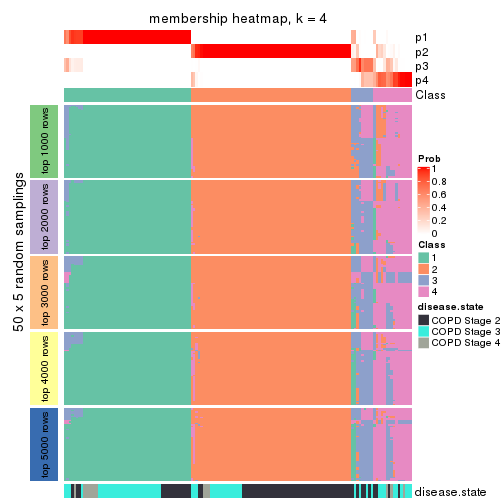</p>

</div>
<div id='tab-ATC-skmeans-membership-heatmap-4'>
<pre><code class="r">membership_heatmap(res, k = 5)
</code></pre>

<p></p>

</div>
<div id='tab-ATC-skmeans-membership-heatmap-5'>
<pre><code class="r">membership_heatmap(res, k = 6)
</code></pre>

<p></p>

</div>
</div>

As soon as we have had the classes for columns, we can look for signatures
which are significantly different between classes which can be candidate marks
for certain classes. Following are the heatmaps for signatures.


Signature heatmaps where rows are scaled:


<script>
$( function() {
	$( '#tabs-ATC-skmeans-get-signatures' ).tabs();
} );
</script>
<div id='tabs-ATC-skmeans-get-signatures'>
<ul>
<li><a href='#tab-ATC-skmeans-get-signatures-1'>k = 2</a></li>
<li><a href='#tab-ATC-skmeans-get-signatures-2'>k = 3</a></li>
<li><a href='#tab-ATC-skmeans-get-signatures-3'>k = 4</a></li>
<li><a href='#tab-ATC-skmeans-get-signatures-4'>k = 5</a></li>
<li><a href='#tab-ATC-skmeans-get-signatures-5'>k = 6</a></li>
</ul>
<div id='tab-ATC-skmeans-get-signatures-1'>
<pre><code class="r">get_signatures(res, k = 2)
</code></pre>

<p></p>

</div>
<div id='tab-ATC-skmeans-get-signatures-2'>
<pre><code class="r">get_signatures(res, k = 3)
</code></pre>

<p></p>

</div>
<div id='tab-ATC-skmeans-get-signatures-3'>
<pre><code class="r">get_signatures(res, k = 4)
</code></pre>

<p></p>

</div>
<div id='tab-ATC-skmeans-get-signatures-4'>
<pre><code class="r">get_signatures(res, k = 5)
</code></pre>

<p></p>

</div>
<div id='tab-ATC-skmeans-get-signatures-5'>
<pre><code class="r">get_signatures(res, k = 6)
</code></pre>

<p></p>

</div>
</div>


Signature heatmaps where rows are not scaled:


<script>
$( function() {
	$( '#tabs-ATC-skmeans-get-signatures-no-scale' ).tabs();
} );
</script>
<div id='tabs-ATC-skmeans-get-signatures-no-scale'>
<ul>
<li><a href='#tab-ATC-skmeans-get-signatures-no-scale-1'>k = 2</a></li>
<li><a href='#tab-ATC-skmeans-get-signatures-no-scale-2'>k = 3</a></li>
<li><a href='#tab-ATC-skmeans-get-signatures-no-scale-3'>k = 4</a></li>
<li><a href='#tab-ATC-skmeans-get-signatures-no-scale-4'>k = 5</a></li>
<li><a href='#tab-ATC-skmeans-get-signatures-no-scale-5'>k = 6</a></li>
</ul>
<div id='tab-ATC-skmeans-get-signatures-no-scale-1'>
<pre><code class="r">get_signatures(res, k = 2, scale_rows = FALSE)
</code></pre>

<p></p>

</div>
<div id='tab-ATC-skmeans-get-signatures-no-scale-2'>
<pre><code class="r">get_signatures(res, k = 3, scale_rows = FALSE)
</code></pre>

<p></p>

</div>
<div id='tab-ATC-skmeans-get-signatures-no-scale-3'>
<pre><code class="r">get_signatures(res, k = 4, scale_rows = FALSE)
</code></pre>

<p></p>

</div>
<div id='tab-ATC-skmeans-get-signatures-no-scale-4'>
<pre><code class="r">get_signatures(res, k = 5, scale_rows = FALSE)
</code></pre>

<p></p>

</div>
<div id='tab-ATC-skmeans-get-signatures-no-scale-5'>
<pre><code class="r">get_signatures(res, k = 6, scale_rows = FALSE)
</code></pre>

<p></p>

</div>
</div>


Compare the overlap of signatures from different k:

```r
compare_signatures(res)
```


`get_signature()` returns a data frame invisibly. TO get the list of signatures, the function
call should be assigned to a variable explicitly. In following code, if `plot` argument is set
to `FALSE`, no heatmap is plotted while only the differential analysis is performed.

```r
# code only for demonstration
tb = get_signature(res, k = ..., plot = FALSE)
```

An example of the output of `tb` is:

```
#>   which_row         fdr    mean_1    mean_2 scaled_mean_1 scaled_mean_2 km
#> 1        38 0.042760348  8.373488  9.131774    -0.5533452     0.5164555  1
#> 2        40 0.018707592  7.106213  8.469186    -0.6173731     0.5762149  1
#> 3        55 0.019134737 10.221463 11.207825    -0.6159697     0.5749050  1
#> 4        59 0.006059896  5.921854  7.869574    -0.6899429     0.6439467  1
#> 5        60 0.018055526  8.928898 10.211722    -0.6204761     0.5791110  1
#> 6        98 0.009384629 15.714769 14.887706     0.6635654    -0.6193277  2
...
```

The columns in `tb` are:

1. `which_row`: row indices corresponding to the input matrix.
2. `fdr`: FDR for the differential test. 
3. `mean_x`: The mean value in group x.
4. `scaled_mean_x`: The mean value in group x after rows are scaled.
5. `km`: Row groups if k-means clustering is applied to rows.


UMAP plot which shows how samples are separated.


<script>
$( function() {
	$( '#tabs-ATC-skmeans-dimension-reduction' ).tabs();
} );
</script>
<div id='tabs-ATC-skmeans-dimension-reduction'>
<ul>
<li><a href='#tab-ATC-skmeans-dimension-reduction-1'>k = 2</a></li>
<li><a href='#tab-ATC-skmeans-dimension-reduction-2'>k = 3</a></li>
<li><a href='#tab-ATC-skmeans-dimension-reduction-3'>k = 4</a></li>
<li><a href='#tab-ATC-skmeans-dimension-reduction-4'>k = 5</a></li>
<li><a href='#tab-ATC-skmeans-dimension-reduction-5'>k = 6</a></li>
</ul>
<div id='tab-ATC-skmeans-dimension-reduction-1'>
<pre><code class="r">dimension_reduction(res, k = 2, method = &quot;UMAP&quot;)
</code></pre>

<p></p>

</div>
<div id='tab-ATC-skmeans-dimension-reduction-2'>
<pre><code class="r">dimension_reduction(res, k = 3, method = &quot;UMAP&quot;)
</code></pre>

<p></p>

</div>
<div id='tab-ATC-skmeans-dimension-reduction-3'>
<pre><code class="r">dimension_reduction(res, k = 4, method = &quot;UMAP&quot;)
</code></pre>

<p></p>

</div>
<div id='tab-ATC-skmeans-dimension-reduction-4'>
<pre><code class="r">dimension_reduction(res, k = 5, method = &quot;UMAP&quot;)
</code></pre>

<p></p>

</div>
<div id='tab-ATC-skmeans-dimension-reduction-5'>
<pre><code class="r">dimension_reduction(res, k = 6, method = &quot;UMAP&quot;)
</code></pre>

<p></p>

</div>
</div>


Following heatmap shows how subgroups are split when increasing `k`:

```r
collect_classes(res)
```


Test correlation between subgroups and known annotations. If the known
annotation is numeric, one-way ANOVA test is applied, and if the known
annotation is discrete, chi-squared contingency table test is applied.

```r
test_to_known_factors(res)
```

```
#>               n disease.state(p) k
#> ATC:skmeans 141         8.61e-04 2
#> ATC:skmeans 142         1.42e-04 3
#> ATC:skmeans 125         1.65e-05 4
#> ATC:skmeans 133         2.10e-04 5
#> ATC:skmeans 136         6.10e-05 6
```


If matrix rows can be associated to genes, consider to use `GO_Enrichment(res,
...)` to perform function enrichment for the signature genes.


 

---------------------------------------------------


### ATC:pam**


The object with results only for a single top-value method and a single partition method 
can be extracted as:

```r
res = res_list["ATC", "pam"]
# you can also extract it by
# res = res_list["ATC:pam"]
```

A summary of `res` and all the functions that can be applied to it:

```r
res
```

```
#> A 'ConsensusPartition' object with k = 2, 3, 4, 5, 6.
#>   On a matrix with 51776 rows and 143 columns.
#>   Top rows (1000, 2000, 3000, 4000, 5000) are extracted by 'ATC' method.
#>   Subgroups are detected by 'pam' method.
#>   Performed in total 1250 partitions by row resampling.
#>   Best k for subgroups seems to be 4.
#> 
#> Following methods can be applied to this 'ConsensusPartition' object:
#>  [1] "cola_report"             "collect_classes"         "collect_plots"          
#>  [4] "collect_stats"           "colnames"                "compare_signatures"     
#>  [7] "consensus_heatmap"       "dimension_reduction"     "functional_enrichment"  
#> [10] "get_anno_col"            "get_anno"                "get_classes"            
#> [13] "get_consensus"           "get_matrix"              "get_membership"         
#> [16] "get_param"               "get_signatures"          "get_stats"              
#> [19] "is_best_k"               "is_stable_k"             "membership_heatmap"     
#> [22] "ncol"                    "nrow"                    "plot_ecdf"              
#> [25] "rownames"                "select_partition_number" "show"                   
#> [28] "suggest_best_k"          "test_to_known_factors"
```

`collect_plots()` function collects all the plots made from `res` for all `k` (number of partitions)
into one single page to provide an easy and fast comparison between different `k`.

```r
collect_plots(res)
```


The plots are:

- The first row: a plot of the ECDF (Empirical cumulative distribution
  function) curves of the consensus matrix for each `k` and the heatmap of
  predicted classes for each `k`.
- The second row: heatmaps of the consensus matrix for each `k`.
- The third row: heatmaps of the membership matrix for each `k`.
- The fouth row: heatmaps of the signatures for each `k`.

All the plots in panels can be made by individual functions and they are
plotted later in this section.

`select_partition_number()` produces several plots showing different
statistics for choosing "optimized" `k`. There are following statistics:

- ECDF curves of the consensus matrix for each `k`;
- 1-PAC. [The PAC
  score](https://en.wikipedia.org/wiki/Consensus_clustering#Over-interpretation_potential_of_consensus_clustering)
  measures the proportion of the ambiguous subgrouping.
- Mean silhouette score.
- Concordance. The mean probability of fiting the consensus class ids in all
  partitions.
- Area increased. Denote $A_k$ as the area under the ECDF curve for current
  `k`, the area increased is defined as $A_k - A_{k-1}$.
- Rand index. The percent of pairs of samples that are both in a same cluster
  or both are not in a same cluster in the partition of k and k-1.
- Jaccard index. The ratio of pairs of samples are both in a same cluster in
  the partition of k and k-1 and the pairs of samples are both in a same
  cluster in the partition k or k-1.

The detailed explanations of these statistics can be found in [the cola
vignette](http://bioconductor.org/packages/devel/bioc/vignettes/cola/inst/doc/cola.html#toc_13).

Generally speaking, lower PAC score, higher mean silhouette score or higher
concordance corresponds to better partition. Rand index and Jaccard index
measure how similar the current partition is compared to partition with `k-1`.
If they are too similar, we won't accept `k` is better than `k-1`.

```r
select_partition_number(res)
```


The numeric values for all these statistics can be obtained by `get_stats()`.

```r
get_stats(res)
```

```
#>   k 1-PAC mean_silhouette concordance area_increased  Rand Jaccard
#> 2 2 1.000           0.972       0.990         0.4519 0.546   0.546
#> 3 3 0.551           0.796       0.870         0.3617 0.609   0.409
#> 4 4 0.972           0.962       0.983         0.1420 0.715   0.414
#> 5 5 0.733           0.463       0.761         0.0916 0.937   0.797
#> 6 6 0.825           0.797       0.892         0.0618 0.866   0.532
```

`suggest_best_k()` suggests the best $k$ based on these statistics. The rules are as follows:

- All $k$ with Jaccard index larger than 0.95 are removed because the increase of
  the partition number does not provides enough extra information. If all $k$ are removed,
  the best $k$ is assigned by `NA`.
- For $k$ with 1-PAC larger than 0.9, the maximal $k$ is taken as the "best k". Other $k$ is called "optional k".
- If it does not fit the second rule. The $k$ with the highest vote of highest
  1-PAC, mean silhouette and concordance is taken as the "best k".

```r
suggest_best_k(res)
```

```
#> [1] 4
#> attr(,"optional")
#> [1] 2
```

There is also optional best $k$ = 2 that is worth to check.

Following shows the table of the partitions (You need to click the **show/hide
code output** link to see it). The membership matrix (columns with name `p*`)
is inferred by
[`clue::cl_consensus()`](https://www.rdocumentation.org/link/cl_consensus?package=clue)
function with the `SE` method. Basically the value in the membership matrix
represents the probability to belong to a certain group. The finall class
label for an item is determined with the group with highest probability it
belongs to.

In `get_classes()` function, the entropy is calculated from the membership
matrix and the silhouette score is calculated from the consensus matrix.


<script>
$( function() {
	$( '#tabs-ATC-pam-get-classes' ).tabs();
} );
</script>
<div id='tabs-ATC-pam-get-classes'>
<ul>
<li><a href='#tab-ATC-pam-get-classes-1'>k = 2</a></li>
<li><a href='#tab-ATC-pam-get-classes-2'>k = 3</a></li>
<li><a href='#tab-ATC-pam-get-classes-3'>k = 4</a></li>
<li><a href='#tab-ATC-pam-get-classes-4'>k = 5</a></li>
<li><a href='#tab-ATC-pam-get-classes-5'>k = 6</a></li>
</ul>

<div id='tab-ATC-pam-get-classes-1'>
<p><a id='tab-ATC-pam-get-classes-1-a' style='color:#0366d6' href='#'>show/hide code output</a></p>
<pre><code class="r">cbind(get_classes(res, k = 2), get_membership(res, k = 2))
</code></pre>

<pre><code>#&gt;           class entropy silhouette    p1    p2
#&gt; GSM550785     1  0.0000     0.9795 1.000 0.000
#&gt; GSM550786     2  0.0000     0.9945 0.000 1.000
#&gt; GSM550788     2  0.0000     0.9945 0.000 1.000
#&gt; GSM550789     2  0.0000     0.9945 0.000 1.000
#&gt; GSM550790     1  0.0000     0.9795 1.000 0.000
#&gt; GSM550791     1  0.3114     0.9267 0.944 0.056
#&gt; GSM550792     2  0.0000     0.9945 0.000 1.000
#&gt; GSM550796     2  0.0000     0.9945 0.000 1.000
#&gt; GSM550797     2  0.0000     0.9945 0.000 1.000
#&gt; GSM550799     2  0.0000     0.9945 0.000 1.000
#&gt; GSM550800     2  0.0000     0.9945 0.000 1.000
#&gt; GSM550801     2  0.0000     0.9945 0.000 1.000
#&gt; GSM550804     2  0.0000     0.9945 0.000 1.000
#&gt; GSM550806     2  0.0000     0.9945 0.000 1.000
#&gt; GSM550807     2  0.0000     0.9945 0.000 1.000
#&gt; GSM550808     2  0.0000     0.9945 0.000 1.000
#&gt; GSM550809     1  0.0000     0.9795 1.000 0.000
#&gt; GSM550810     2  0.0000     0.9945 0.000 1.000
#&gt; GSM550811     2  1.0000    -0.0302 0.496 0.504
#&gt; GSM550813     2  0.0000     0.9945 0.000 1.000
#&gt; GSM550814     2  0.0000     0.9945 0.000 1.000
#&gt; GSM550815     2  0.0000     0.9945 0.000 1.000
#&gt; GSM550816     2  0.0000     0.9945 0.000 1.000
#&gt; GSM550817     2  0.0000     0.9945 0.000 1.000
#&gt; GSM550818     2  0.0000     0.9945 0.000 1.000
#&gt; GSM550819     2  0.0000     0.9945 0.000 1.000
#&gt; GSM550820     1  0.0000     0.9795 1.000 0.000
#&gt; GSM550821     2  0.0000     0.9945 0.000 1.000
#&gt; GSM550822     2  0.0000     0.9945 0.000 1.000
#&gt; GSM550826     1  0.0000     0.9795 1.000 0.000
#&gt; GSM550832     2  0.0000     0.9945 0.000 1.000
#&gt; GSM550833     2  0.0000     0.9945 0.000 1.000
#&gt; GSM550835     2  0.0000     0.9945 0.000 1.000
#&gt; GSM550836     1  0.0000     0.9795 1.000 0.000
#&gt; GSM550837     2  0.0000     0.9945 0.000 1.000
#&gt; GSM550838     1  0.0000     0.9795 1.000 0.000
#&gt; GSM550841     2  0.0000     0.9945 0.000 1.000
#&gt; GSM550842     2  0.0000     0.9945 0.000 1.000
#&gt; GSM550846     2  0.0000     0.9945 0.000 1.000
#&gt; GSM550849     2  0.0000     0.9945 0.000 1.000
#&gt; GSM550850     1  0.0000     0.9795 1.000 0.000
#&gt; GSM550851     2  0.0000     0.9945 0.000 1.000
#&gt; GSM550852     2  0.0000     0.9945 0.000 1.000
#&gt; GSM550853     2  0.0000     0.9945 0.000 1.000
#&gt; GSM550855     2  0.0000     0.9945 0.000 1.000
#&gt; GSM550856     2  0.0000     0.9945 0.000 1.000
#&gt; GSM550861     2  0.0000     0.9945 0.000 1.000
#&gt; GSM550863     2  0.0000     0.9945 0.000 1.000
#&gt; GSM550864     2  0.0000     0.9945 0.000 1.000
#&gt; GSM550866     2  0.0000     0.9945 0.000 1.000
#&gt; GSM550867     1  0.0000     0.9795 1.000 0.000
#&gt; GSM550885     1  0.0000     0.9795 1.000 0.000
#&gt; GSM550886     2  0.0000     0.9945 0.000 1.000
#&gt; GSM550887     2  0.0000     0.9945 0.000 1.000
#&gt; GSM550889     1  0.0000     0.9795 1.000 0.000
#&gt; GSM550894     2  0.0000     0.9945 0.000 1.000
#&gt; GSM550897     1  0.0000     0.9795 1.000 0.000
#&gt; GSM550903     2  0.0000     0.9945 0.000 1.000
#&gt; GSM550905     2  0.0000     0.9945 0.000 1.000
#&gt; GSM550906     2  0.0000     0.9945 0.000 1.000
#&gt; GSM550907     2  0.0000     0.9945 0.000 1.000
#&gt; GSM550909     2  0.0000     0.9945 0.000 1.000
#&gt; GSM550911     2  0.0000     0.9945 0.000 1.000
#&gt; GSM550913     2  0.0000     0.9945 0.000 1.000
#&gt; GSM550915     2  0.0000     0.9945 0.000 1.000
#&gt; GSM550917     2  0.0000     0.9945 0.000 1.000
#&gt; GSM550919     2  0.0000     0.9945 0.000 1.000
#&gt; GSM550921     1  0.0000     0.9795 1.000 0.000
#&gt; GSM550924     2  0.0000     0.9945 0.000 1.000
#&gt; GSM550926     2  0.0000     0.9945 0.000 1.000
#&gt; GSM550927     2  0.0000     0.9945 0.000 1.000
#&gt; GSM550787     2  0.0000     0.9945 0.000 1.000
#&gt; GSM550793     1  0.0000     0.9795 1.000 0.000
#&gt; GSM550794     2  0.0000     0.9945 0.000 1.000
#&gt; GSM550795     1  0.0000     0.9795 1.000 0.000
#&gt; GSM550798     1  0.0000     0.9795 1.000 0.000
#&gt; GSM550803     1  0.0000     0.9795 1.000 0.000
#&gt; GSM550805     2  0.0000     0.9945 0.000 1.000
#&gt; GSM550823     2  0.0000     0.9945 0.000 1.000
#&gt; GSM550824     1  0.0000     0.9795 1.000 0.000
#&gt; GSM550825     1  0.0000     0.9795 1.000 0.000
#&gt; GSM550827     2  0.0000     0.9945 0.000 1.000
#&gt; GSM550828     1  0.0000     0.9795 1.000 0.000
#&gt; GSM550829     1  0.0000     0.9795 1.000 0.000
#&gt; GSM550830     2  0.0000     0.9945 0.000 1.000
#&gt; GSM550834     1  0.9170     0.5153 0.668 0.332
#&gt; GSM550839     2  0.0000     0.9945 0.000 1.000
#&gt; GSM550840     1  0.6438     0.8006 0.836 0.164
#&gt; GSM550843     2  0.0000     0.9945 0.000 1.000
#&gt; GSM550844     1  0.0000     0.9795 1.000 0.000
#&gt; GSM550845     2  0.0000     0.9945 0.000 1.000
#&gt; GSM550848     2  0.0000     0.9945 0.000 1.000
#&gt; GSM550854     1  0.0000     0.9795 1.000 0.000
#&gt; GSM550857     1  0.0000     0.9795 1.000 0.000
#&gt; GSM550858     1  0.0000     0.9795 1.000 0.000
#&gt; GSM550859     1  0.0000     0.9795 1.000 0.000
#&gt; GSM550862     1  0.0000     0.9795 1.000 0.000
#&gt; GSM550865     1  0.9833     0.2752 0.576 0.424
#&gt; GSM550868     2  0.0000     0.9945 0.000 1.000
#&gt; GSM550869     2  0.0000     0.9945 0.000 1.000
#&gt; GSM550870     2  0.0000     0.9945 0.000 1.000
#&gt; GSM550871     2  0.0000     0.9945 0.000 1.000
#&gt; GSM550872     2  0.0000     0.9945 0.000 1.000
#&gt; GSM550873     2  0.0000     0.9945 0.000 1.000
#&gt; GSM550874     2  0.0000     0.9945 0.000 1.000
#&gt; GSM550876     2  0.0000     0.9945 0.000 1.000
#&gt; GSM550877     2  0.0000     0.9945 0.000 1.000
#&gt; GSM550878     2  0.0000     0.9945 0.000 1.000
#&gt; GSM550879     1  0.0000     0.9795 1.000 0.000
#&gt; GSM550882     1  0.0000     0.9795 1.000 0.000
#&gt; GSM550888     1  0.0000     0.9795 1.000 0.000
#&gt; GSM550890     2  0.0000     0.9945 0.000 1.000
#&gt; GSM550891     1  0.0000     0.9795 1.000 0.000
#&gt; GSM550892     1  0.0000     0.9795 1.000 0.000
#&gt; GSM550893     2  0.0000     0.9945 0.000 1.000
#&gt; GSM550895     2  0.0000     0.9945 0.000 1.000
#&gt; GSM550896     2  0.0000     0.9945 0.000 1.000
#&gt; GSM550898     1  0.0000     0.9795 1.000 0.000
#&gt; GSM550899     2  0.0000     0.9945 0.000 1.000
#&gt; GSM550900     2  0.0000     0.9945 0.000 1.000
#&gt; GSM550901     2  0.0000     0.9945 0.000 1.000
#&gt; GSM550902     1  0.0000     0.9795 1.000 0.000
#&gt; GSM550904     1  0.0000     0.9795 1.000 0.000
#&gt; GSM550908     1  0.0000     0.9795 1.000 0.000
#&gt; GSM550912     2  0.0000     0.9945 0.000 1.000
#&gt; GSM550914     2  0.0000     0.9945 0.000 1.000
#&gt; GSM550918     2  0.0000     0.9945 0.000 1.000
#&gt; GSM550922     2  0.0000     0.9945 0.000 1.000
#&gt; GSM550923     1  0.0000     0.9795 1.000 0.000
#&gt; GSM550925     1  0.0000     0.9795 1.000 0.000
#&gt; GSM550802     2  0.0000     0.9945 0.000 1.000
#&gt; GSM550812     2  0.0000     0.9945 0.000 1.000
#&gt; GSM550831     1  0.0000     0.9795 1.000 0.000
#&gt; GSM550847     1  0.0000     0.9795 1.000 0.000
#&gt; GSM550860     1  0.0000     0.9795 1.000 0.000
#&gt; GSM550875     1  0.0000     0.9795 1.000 0.000
#&gt; GSM550880     2  0.0376     0.9904 0.004 0.996
#&gt; GSM550881     1  0.0000     0.9795 1.000 0.000
#&gt; GSM550883     1  0.0000     0.9795 1.000 0.000
#&gt; GSM550884     2  0.0000     0.9945 0.000 1.000
#&gt; GSM550910     2  0.0000     0.9945 0.000 1.000
#&gt; GSM550916     1  0.0000     0.9795 1.000 0.000
#&gt; GSM550920     2  0.0000     0.9945 0.000 1.000
</code></pre>

<script>
$('#tab-ATC-pam-get-classes-1-a').parent().next().next().hide();
$('#tab-ATC-pam-get-classes-1-a').click(function(){
  $('#tab-ATC-pam-get-classes-1-a').parent().next().next().toggle();
  return(false);
});
</script>
</div>

<div id='tab-ATC-pam-get-classes-2'>
<p><a id='tab-ATC-pam-get-classes-2-a' style='color:#0366d6' href='#'>show/hide code output</a></p>
<pre><code class="r">cbind(get_classes(res, k = 3), get_membership(res, k = 3))
</code></pre>

<pre><code>#&gt;           class entropy silhouette    p1    p2    p3
#&gt; GSM550785     1  0.5058      0.640 0.756 0.000 0.244
#&gt; GSM550786     1  0.4291      0.742 0.820 0.180 0.000
#&gt; GSM550788     2  0.0000      0.894 0.000 1.000 0.000
#&gt; GSM550789     2  0.0000      0.894 0.000 1.000 0.000
#&gt; GSM550790     3  0.5810      0.534 0.336 0.000 0.664
#&gt; GSM550791     1  0.4555      0.671 0.800 0.000 0.200
#&gt; GSM550792     1  0.4291      0.742 0.820 0.180 0.000
#&gt; GSM550796     2  0.0000      0.894 0.000 1.000 0.000
#&gt; GSM550797     2  0.0000      0.894 0.000 1.000 0.000
#&gt; GSM550799     2  0.4654      0.822 0.208 0.792 0.000
#&gt; GSM550800     2  0.4605      0.824 0.204 0.796 0.000
#&gt; GSM550801     2  0.0000      0.894 0.000 1.000 0.000
#&gt; GSM550804     2  0.4346      0.833 0.184 0.816 0.000
#&gt; GSM550806     1  0.0892      0.784 0.980 0.020 0.000
#&gt; GSM550807     2  0.0000      0.894 0.000 1.000 0.000
#&gt; GSM550808     2  0.0000      0.894 0.000 1.000 0.000
#&gt; GSM550809     1  0.5058      0.640 0.756 0.000 0.244
#&gt; GSM550810     2  0.0000      0.894 0.000 1.000 0.000
#&gt; GSM550811     1  0.0000      0.776 1.000 0.000 0.000
#&gt; GSM550813     1  0.4291      0.742 0.820 0.180 0.000
#&gt; GSM550814     2  0.5058      0.790 0.244 0.756 0.000
#&gt; GSM550815     2  0.0000      0.894 0.000 1.000 0.000
#&gt; GSM550816     2  0.0000      0.894 0.000 1.000 0.000
#&gt; GSM550817     2  0.4654      0.822 0.208 0.792 0.000
#&gt; GSM550818     1  0.5397      0.587 0.720 0.280 0.000
#&gt; GSM550819     2  0.5058      0.790 0.244 0.756 0.000
#&gt; GSM550820     1  0.5058      0.640 0.756 0.000 0.244
#&gt; GSM550821     2  0.0000      0.894 0.000 1.000 0.000
#&gt; GSM550822     2  0.0000      0.894 0.000 1.000 0.000
#&gt; GSM550826     1  0.5058      0.640 0.756 0.000 0.244
#&gt; GSM550832     2  0.0000      0.894 0.000 1.000 0.000
#&gt; GSM550833     2  0.0000      0.894 0.000 1.000 0.000
#&gt; GSM550835     2  0.5016      0.794 0.240 0.760 0.000
#&gt; GSM550836     3  0.0000      0.952 0.000 0.000 1.000
#&gt; GSM550837     2  0.0000      0.894 0.000 1.000 0.000
#&gt; GSM550838     1  0.5058      0.640 0.756 0.000 0.244
#&gt; GSM550841     2  0.0000      0.894 0.000 1.000 0.000
#&gt; GSM550842     2  0.0000      0.894 0.000 1.000 0.000
#&gt; GSM550846     1  0.4002      0.755 0.840 0.160 0.000
#&gt; GSM550849     1  0.1411      0.787 0.964 0.036 0.000
#&gt; GSM550850     1  0.5058      0.640 0.756 0.000 0.244
#&gt; GSM550851     2  0.0000      0.894 0.000 1.000 0.000
#&gt; GSM550852     2  0.4654      0.822 0.208 0.792 0.000
#&gt; GSM550853     2  0.0000      0.894 0.000 1.000 0.000
#&gt; GSM550855     2  0.1643      0.883 0.044 0.956 0.000
#&gt; GSM550856     2  0.5016      0.794 0.240 0.760 0.000
#&gt; GSM550861     2  0.0000      0.894 0.000 1.000 0.000
#&gt; GSM550863     1  0.4291      0.742 0.820 0.180 0.000
#&gt; GSM550864     1  0.4291      0.742 0.820 0.180 0.000
#&gt; GSM550866     1  0.4291      0.742 0.820 0.180 0.000
#&gt; GSM550867     3  0.0000      0.952 0.000 0.000 1.000
#&gt; GSM550885     3  0.0000      0.952 0.000 0.000 1.000
#&gt; GSM550886     2  0.5058      0.790 0.244 0.756 0.000
#&gt; GSM550887     2  0.0000      0.894 0.000 1.000 0.000
#&gt; GSM550889     1  0.5058      0.640 0.756 0.000 0.244
#&gt; GSM550894     2  0.0000      0.894 0.000 1.000 0.000
#&gt; GSM550897     1  0.5058      0.640 0.756 0.000 0.244
#&gt; GSM550903     2  0.0424      0.892 0.008 0.992 0.000
#&gt; GSM550905     2  0.4654      0.822 0.208 0.792 0.000
#&gt; GSM550906     2  0.0000      0.894 0.000 1.000 0.000
#&gt; GSM550907     2  0.5058      0.790 0.244 0.756 0.000
#&gt; GSM550909     2  0.0000      0.894 0.000 1.000 0.000
#&gt; GSM550911     1  0.3482      0.772 0.872 0.128 0.000
#&gt; GSM550913     2  0.0000      0.894 0.000 1.000 0.000
#&gt; GSM550915     1  0.0892      0.784 0.980 0.020 0.000
#&gt; GSM550917     2  0.4702      0.818 0.212 0.788 0.000
#&gt; GSM550919     1  0.0892      0.784 0.980 0.020 0.000
#&gt; GSM550921     3  0.0000      0.952 0.000 0.000 1.000
#&gt; GSM550924     1  0.3412      0.774 0.876 0.124 0.000
#&gt; GSM550926     1  0.4346      0.738 0.816 0.184 0.000
#&gt; GSM550927     2  0.0000      0.894 0.000 1.000 0.000
#&gt; GSM550787     1  0.0892      0.784 0.980 0.020 0.000
#&gt; GSM550793     3  0.4291      0.814 0.180 0.000 0.820
#&gt; GSM550794     1  0.4291      0.742 0.820 0.180 0.000
#&gt; GSM550795     1  0.5058      0.640 0.756 0.000 0.244
#&gt; GSM550798     3  0.0000      0.952 0.000 0.000 1.000
#&gt; GSM550803     3  0.0000      0.952 0.000 0.000 1.000
#&gt; GSM550805     1  0.0000      0.776 1.000 0.000 0.000
#&gt; GSM550823     1  0.2261      0.788 0.932 0.068 0.000
#&gt; GSM550824     3  0.0000      0.952 0.000 0.000 1.000
#&gt; GSM550825     3  0.1031      0.941 0.024 0.000 0.976
#&gt; GSM550827     1  0.3482      0.772 0.872 0.128 0.000
#&gt; GSM550828     1  0.5058      0.640 0.756 0.000 0.244
#&gt; GSM550829     3  0.0892      0.943 0.020 0.000 0.980
#&gt; GSM550830     1  0.1529      0.787 0.960 0.040 0.000
#&gt; GSM550834     1  0.4291      0.685 0.820 0.000 0.180
#&gt; GSM550839     2  0.4654      0.822 0.208 0.792 0.000
#&gt; GSM550840     1  0.4291      0.685 0.820 0.000 0.180
#&gt; GSM550843     1  0.4291      0.742 0.820 0.180 0.000
#&gt; GSM550844     1  0.5058      0.640 0.756 0.000 0.244
#&gt; GSM550845     1  0.4291      0.742 0.820 0.180 0.000
#&gt; GSM550848     1  0.4291      0.742 0.820 0.180 0.000
#&gt; GSM550854     3  0.0000      0.952 0.000 0.000 1.000
#&gt; GSM550857     3  0.0000      0.952 0.000 0.000 1.000
#&gt; GSM550858     3  0.4796      0.760 0.220 0.000 0.780
#&gt; GSM550859     3  0.0000      0.952 0.000 0.000 1.000
#&gt; GSM550862     1  0.5058      0.640 0.756 0.000 0.244
#&gt; GSM550865     1  0.1163      0.768 0.972 0.000 0.028
#&gt; GSM550868     1  0.1964      0.788 0.944 0.056 0.000
#&gt; GSM550869     1  0.0892      0.784 0.980 0.020 0.000
#&gt; GSM550870     1  0.4654      0.708 0.792 0.208 0.000
#&gt; GSM550871     1  0.4291      0.742 0.820 0.180 0.000
#&gt; GSM550872     1  0.1964      0.788 0.944 0.056 0.000
#&gt; GSM550873     1  0.5621      0.527 0.692 0.308 0.000
#&gt; GSM550874     1  0.4291      0.742 0.820 0.180 0.000
#&gt; GSM550876     1  0.4291      0.742 0.820 0.180 0.000
#&gt; GSM550877     2  0.5016      0.794 0.240 0.760 0.000
#&gt; GSM550878     1  0.2165      0.789 0.936 0.064 0.000
#&gt; GSM550879     1  0.5058      0.640 0.756 0.000 0.244
#&gt; GSM550882     1  0.5058      0.640 0.756 0.000 0.244
#&gt; GSM550888     3  0.0000      0.952 0.000 0.000 1.000
#&gt; GSM550890     1  0.4002      0.755 0.840 0.160 0.000
#&gt; GSM550891     3  0.2165      0.915 0.064 0.000 0.936
#&gt; GSM550892     1  0.5058      0.640 0.756 0.000 0.244
#&gt; GSM550893     1  0.4654      0.708 0.792 0.208 0.000
#&gt; GSM550895     1  0.4291      0.742 0.820 0.180 0.000
#&gt; GSM550896     2  0.0000      0.894 0.000 1.000 0.000
#&gt; GSM550898     3  0.0000      0.952 0.000 0.000 1.000
#&gt; GSM550899     1  0.4605      0.713 0.796 0.204 0.000
#&gt; GSM550900     1  0.4291      0.742 0.820 0.180 0.000
#&gt; GSM550901     1  0.0892      0.784 0.980 0.020 0.000
#&gt; GSM550902     1  0.5058      0.640 0.756 0.000 0.244
#&gt; GSM550904     3  0.4291      0.814 0.180 0.000 0.820
#&gt; GSM550908     3  0.0000      0.952 0.000 0.000 1.000
#&gt; GSM550912     1  0.4291      0.742 0.820 0.180 0.000
#&gt; GSM550914     1  0.0892      0.783 0.980 0.020 0.000
#&gt; GSM550918     2  0.5058      0.790 0.244 0.756 0.000
#&gt; GSM550922     2  0.0000      0.894 0.000 1.000 0.000
#&gt; GSM550923     3  0.0000      0.952 0.000 0.000 1.000
#&gt; GSM550925     1  0.5058      0.640 0.756 0.000 0.244
#&gt; GSM550802     2  0.4654      0.822 0.208 0.792 0.000
#&gt; GSM550812     2  0.4654      0.822 0.208 0.792 0.000
#&gt; GSM550831     1  0.5058      0.640 0.756 0.000 0.244
#&gt; GSM550847     3  0.0000      0.952 0.000 0.000 1.000
#&gt; GSM550860     1  0.5058      0.640 0.756 0.000 0.244
#&gt; GSM550875     1  0.5016      0.643 0.760 0.000 0.240
#&gt; GSM550880     1  0.0000      0.776 1.000 0.000 0.000
#&gt; GSM550881     1  0.5058      0.640 0.756 0.000 0.244
#&gt; GSM550883     3  0.0000      0.952 0.000 0.000 1.000
#&gt; GSM550884     1  0.2711      0.786 0.912 0.088 0.000
#&gt; GSM550910     2  0.5058      0.790 0.244 0.756 0.000
#&gt; GSM550916     1  0.5058      0.640 0.756 0.000 0.244
#&gt; GSM550920     1  0.3412      0.774 0.876 0.124 0.000
</code></pre>

<script>
$('#tab-ATC-pam-get-classes-2-a').parent().next().next().hide();
$('#tab-ATC-pam-get-classes-2-a').click(function(){
  $('#tab-ATC-pam-get-classes-2-a').parent().next().next().toggle();
  return(false);
});
</script>
</div>

<div id='tab-ATC-pam-get-classes-3'>
<p><a id='tab-ATC-pam-get-classes-3-a' style='color:#0366d6' href='#'>show/hide code output</a></p>
<pre><code class="r">cbind(get_classes(res, k = 4), get_membership(res, k = 4))
</code></pre>

<pre><code>#&gt;           class entropy silhouette    p1    p2 p3    p4
#&gt; GSM550785     1  0.0000      0.994 1.000 0.000  0 0.000
#&gt; GSM550786     4  0.0000      0.962 0.000 0.000  0 1.000
#&gt; GSM550788     2  0.0000      0.995 0.000 1.000  0 0.000
#&gt; GSM550789     2  0.0000      0.995 0.000 1.000  0 0.000
#&gt; GSM550790     1  0.0000      0.994 1.000 0.000  0 0.000
#&gt; GSM550791     1  0.0000      0.994 1.000 0.000  0 0.000
#&gt; GSM550792     4  0.0000      0.962 0.000 0.000  0 1.000
#&gt; GSM550796     2  0.0000      0.995 0.000 1.000  0 0.000
#&gt; GSM550797     2  0.0000      0.995 0.000 1.000  0 0.000
#&gt; GSM550799     4  0.3074      0.831 0.000 0.152  0 0.848
#&gt; GSM550800     4  0.3764      0.754 0.000 0.216  0 0.784
#&gt; GSM550801     2  0.0000      0.995 0.000 1.000  0 0.000
#&gt; GSM550804     4  0.4948      0.291 0.000 0.440  0 0.560
#&gt; GSM550806     4  0.0000      0.962 0.000 0.000  0 1.000
#&gt; GSM550807     2  0.0000      0.995 0.000 1.000  0 0.000
#&gt; GSM550808     2  0.0000      0.995 0.000 1.000  0 0.000
#&gt; GSM550809     1  0.0000      0.994 1.000 0.000  0 0.000
#&gt; GSM550810     2  0.0000      0.995 0.000 1.000  0 0.000
#&gt; GSM550811     1  0.0000      0.994 1.000 0.000  0 0.000
#&gt; GSM550813     4  0.0000      0.962 0.000 0.000  0 1.000
#&gt; GSM550814     4  0.0000      0.962 0.000 0.000  0 1.000
#&gt; GSM550815     2  0.0000      0.995 0.000 1.000  0 0.000
#&gt; GSM550816     2  0.0000      0.995 0.000 1.000  0 0.000
#&gt; GSM550817     4  0.4331      0.642 0.000 0.288  0 0.712
#&gt; GSM550818     4  0.0000      0.962 0.000 0.000  0 1.000
#&gt; GSM550819     4  0.0000      0.962 0.000 0.000  0 1.000
#&gt; GSM550820     1  0.0000      0.994 1.000 0.000  0 0.000
#&gt; GSM550821     2  0.0000      0.995 0.000 1.000  0 0.000
#&gt; GSM550822     2  0.0000      0.995 0.000 1.000  0 0.000
#&gt; GSM550826     1  0.0000      0.994 1.000 0.000  0 0.000
#&gt; GSM550832     2  0.0188      0.990 0.000 0.996  0 0.004
#&gt; GSM550833     2  0.0000      0.995 0.000 1.000  0 0.000
#&gt; GSM550835     4  0.0000      0.962 0.000 0.000  0 1.000
#&gt; GSM550836     3  0.0000      1.000 0.000 0.000  1 0.000
#&gt; GSM550837     2  0.0000      0.995 0.000 1.000  0 0.000
#&gt; GSM550838     1  0.0000      0.994 1.000 0.000  0 0.000
#&gt; GSM550841     2  0.0000      0.995 0.000 1.000  0 0.000
#&gt; GSM550842     2  0.0000      0.995 0.000 1.000  0 0.000
#&gt; GSM550846     4  0.0000      0.962 0.000 0.000  0 1.000
#&gt; GSM550849     4  0.0000      0.962 0.000 0.000  0 1.000
#&gt; GSM550850     1  0.0000      0.994 1.000 0.000  0 0.000
#&gt; GSM550851     2  0.0000      0.995 0.000 1.000  0 0.000
#&gt; GSM550852     4  0.3356      0.806 0.000 0.176  0 0.824
#&gt; GSM550853     2  0.0000      0.995 0.000 1.000  0 0.000
#&gt; GSM550855     2  0.1389      0.933 0.000 0.952  0 0.048
#&gt; GSM550856     4  0.0000      0.962 0.000 0.000  0 1.000
#&gt; GSM550861     2  0.0000      0.995 0.000 1.000  0 0.000
#&gt; GSM550863     4  0.0000      0.962 0.000 0.000  0 1.000
#&gt; GSM550864     4  0.0000      0.962 0.000 0.000  0 1.000
#&gt; GSM550866     4  0.0000      0.962 0.000 0.000  0 1.000
#&gt; GSM550867     3  0.0000      1.000 0.000 0.000  1 0.000
#&gt; GSM550885     3  0.0000      1.000 0.000 0.000  1 0.000
#&gt; GSM550886     4  0.0000      0.962 0.000 0.000  0 1.000
#&gt; GSM550887     2  0.0000      0.995 0.000 1.000  0 0.000
#&gt; GSM550889     1  0.0000      0.994 1.000 0.000  0 0.000
#&gt; GSM550894     2  0.0000      0.995 0.000 1.000  0 0.000
#&gt; GSM550897     1  0.0000      0.994 1.000 0.000  0 0.000
#&gt; GSM550903     2  0.0592      0.977 0.000 0.984  0 0.016
#&gt; GSM550905     4  0.3074      0.831 0.000 0.152  0 0.848
#&gt; GSM550906     2  0.0000      0.995 0.000 1.000  0 0.000
#&gt; GSM550907     4  0.0000      0.962 0.000 0.000  0 1.000
#&gt; GSM550909     2  0.0000      0.995 0.000 1.000  0 0.000
#&gt; GSM550911     4  0.0000      0.962 0.000 0.000  0 1.000
#&gt; GSM550913     2  0.0000      0.995 0.000 1.000  0 0.000
#&gt; GSM550915     4  0.0000      0.962 0.000 0.000  0 1.000
#&gt; GSM550917     4  0.2868      0.846 0.000 0.136  0 0.864
#&gt; GSM550919     4  0.0000      0.962 0.000 0.000  0 1.000
#&gt; GSM550921     3  0.0000      1.000 0.000 0.000  1 0.000
#&gt; GSM550924     4  0.0000      0.962 0.000 0.000  0 1.000
#&gt; GSM550926     4  0.0000      0.962 0.000 0.000  0 1.000
#&gt; GSM550927     2  0.0000      0.995 0.000 1.000  0 0.000
#&gt; GSM550787     4  0.0000      0.962 0.000 0.000  0 1.000
#&gt; GSM550793     1  0.0000      0.994 1.000 0.000  0 0.000
#&gt; GSM550794     4  0.0000      0.962 0.000 0.000  0 1.000
#&gt; GSM550795     1  0.0000      0.994 1.000 0.000  0 0.000
#&gt; GSM550798     3  0.0000      1.000 0.000 0.000  1 0.000
#&gt; GSM550803     3  0.0000      1.000 0.000 0.000  1 0.000
#&gt; GSM550805     4  0.0000      0.962 0.000 0.000  0 1.000
#&gt; GSM550823     4  0.0000      0.962 0.000 0.000  0 1.000
#&gt; GSM550824     3  0.0000      1.000 0.000 0.000  1 0.000
#&gt; GSM550825     1  0.0000      0.994 1.000 0.000  0 0.000
#&gt; GSM550827     4  0.0000      0.962 0.000 0.000  0 1.000
#&gt; GSM550828     1  0.0000      0.994 1.000 0.000  0 0.000
#&gt; GSM550829     1  0.0000      0.994 1.000 0.000  0 0.000
#&gt; GSM550830     4  0.0000      0.962 0.000 0.000  0 1.000
#&gt; GSM550834     1  0.3024      0.787 0.852 0.000  0 0.148
#&gt; GSM550839     4  0.3444      0.796 0.000 0.184  0 0.816
#&gt; GSM550840     1  0.0000      0.994 1.000 0.000  0 0.000
#&gt; GSM550843     4  0.0000      0.962 0.000 0.000  0 1.000
#&gt; GSM550844     1  0.0000      0.994 1.000 0.000  0 0.000
#&gt; GSM550845     4  0.0000      0.962 0.000 0.000  0 1.000
#&gt; GSM550848     4  0.0000      0.962 0.000 0.000  0 1.000
#&gt; GSM550854     3  0.0000      1.000 0.000 0.000  1 0.000
#&gt; GSM550857     3  0.0000      1.000 0.000 0.000  1 0.000
#&gt; GSM550858     1  0.0000      0.994 1.000 0.000  0 0.000
#&gt; GSM550859     3  0.0000      1.000 0.000 0.000  1 0.000
#&gt; GSM550862     1  0.0000      0.994 1.000 0.000  0 0.000
#&gt; GSM550865     1  0.0000      0.994 1.000 0.000  0 0.000
#&gt; GSM550868     4  0.0000      0.962 0.000 0.000  0 1.000
#&gt; GSM550869     4  0.0000      0.962 0.000 0.000  0 1.000
#&gt; GSM550870     4  0.0000      0.962 0.000 0.000  0 1.000
#&gt; GSM550871     4  0.0000      0.962 0.000 0.000  0 1.000
#&gt; GSM550872     4  0.0000      0.962 0.000 0.000  0 1.000
#&gt; GSM550873     4  0.0000      0.962 0.000 0.000  0 1.000
#&gt; GSM550874     4  0.0000      0.962 0.000 0.000  0 1.000
#&gt; GSM550876     4  0.0000      0.962 0.000 0.000  0 1.000
#&gt; GSM550877     4  0.0000      0.962 0.000 0.000  0 1.000
#&gt; GSM550878     4  0.0000      0.962 0.000 0.000  0 1.000
#&gt; GSM550879     1  0.0000      0.994 1.000 0.000  0 0.000
#&gt; GSM550882     1  0.0000      0.994 1.000 0.000  0 0.000
#&gt; GSM550888     3  0.0000      1.000 0.000 0.000  1 0.000
#&gt; GSM550890     4  0.0000      0.962 0.000 0.000  0 1.000
#&gt; GSM550891     1  0.0000      0.994 1.000 0.000  0 0.000
#&gt; GSM550892     1  0.0000      0.994 1.000 0.000  0 0.000
#&gt; GSM550893     4  0.0000      0.962 0.000 0.000  0 1.000
#&gt; GSM550895     4  0.0000      0.962 0.000 0.000  0 1.000
#&gt; GSM550896     2  0.0000      0.995 0.000 1.000  0 0.000
#&gt; GSM550898     3  0.0000      1.000 0.000 0.000  1 0.000
#&gt; GSM550899     4  0.0000      0.962 0.000 0.000  0 1.000
#&gt; GSM550900     4  0.0000      0.962 0.000 0.000  0 1.000
#&gt; GSM550901     4  0.0000      0.962 0.000 0.000  0 1.000
#&gt; GSM550902     1  0.0000      0.994 1.000 0.000  0 0.000
#&gt; GSM550904     1  0.0000      0.994 1.000 0.000  0 0.000
#&gt; GSM550908     3  0.0000      1.000 0.000 0.000  1 0.000
#&gt; GSM550912     4  0.0000      0.962 0.000 0.000  0 1.000
#&gt; GSM550914     4  0.0000      0.962 0.000 0.000  0 1.000
#&gt; GSM550918     4  0.0000      0.962 0.000 0.000  0 1.000
#&gt; GSM550922     2  0.1211      0.945 0.000 0.960  0 0.040
#&gt; GSM550923     3  0.0000      1.000 0.000 0.000  1 0.000
#&gt; GSM550925     1  0.0000      0.994 1.000 0.000  0 0.000
#&gt; GSM550802     4  0.3356      0.806 0.000 0.176  0 0.824
#&gt; GSM550812     4  0.3486      0.791 0.000 0.188  0 0.812
#&gt; GSM550831     1  0.0000      0.994 1.000 0.000  0 0.000
#&gt; GSM550847     3  0.0000      1.000 0.000 0.000  1 0.000
#&gt; GSM550860     1  0.0000      0.994 1.000 0.000  0 0.000
#&gt; GSM550875     1  0.0000      0.994 1.000 0.000  0 0.000
#&gt; GSM550880     4  0.1474      0.914 0.052 0.000  0 0.948
#&gt; GSM550881     1  0.0000      0.994 1.000 0.000  0 0.000
#&gt; GSM550883     3  0.0000      1.000 0.000 0.000  1 0.000
#&gt; GSM550884     4  0.0000      0.962 0.000 0.000  0 1.000
#&gt; GSM550910     4  0.0000      0.962 0.000 0.000  0 1.000
#&gt; GSM550916     1  0.0000      0.994 1.000 0.000  0 0.000
#&gt; GSM550920     4  0.0000      0.962 0.000 0.000  0 1.000
</code></pre>

<script>
$('#tab-ATC-pam-get-classes-3-a').parent().next().next().hide();
$('#tab-ATC-pam-get-classes-3-a').click(function(){
  $('#tab-ATC-pam-get-classes-3-a').parent().next().next().toggle();
  return(false);
});
</script>
</div>

<div id='tab-ATC-pam-get-classes-4'>
<p><a id='tab-ATC-pam-get-classes-4-a' style='color:#0366d6' href='#'>show/hide code output</a></p>
<pre><code class="r">cbind(get_classes(res, k = 5), get_membership(res, k = 5))
</code></pre>

<pre><code>#&gt;           class entropy silhouette    p1    p2    p3    p4    p5
#&gt; GSM550785     1  0.0000     0.8176 1.000 0.000 0.000 0.000 0.000
#&gt; GSM550786     4  0.4088    -0.2219 0.000 0.000 0.000 0.632 0.368
#&gt; GSM550788     2  0.2648     0.6826 0.000 0.848 0.000 0.000 0.152
#&gt; GSM550789     2  0.0000     0.7583 0.000 1.000 0.000 0.000 0.000
#&gt; GSM550790     1  0.3424     0.8075 0.760 0.000 0.000 0.000 0.240
#&gt; GSM550791     1  0.3707     0.5607 0.716 0.000 0.000 0.284 0.000
#&gt; GSM550792     4  0.0000     0.4871 0.000 0.000 0.000 1.000 0.000
#&gt; GSM550796     2  0.3586     0.6819 0.000 0.736 0.000 0.000 0.264
#&gt; GSM550797     2  0.0000     0.7583 0.000 1.000 0.000 0.000 0.000
#&gt; GSM550799     5  0.5795     0.7312 0.000 0.092 0.000 0.412 0.496
#&gt; GSM550800     2  0.6625    -0.3288 0.000 0.412 0.000 0.220 0.368
#&gt; GSM550801     2  0.0000     0.7583 0.000 1.000 0.000 0.000 0.000
#&gt; GSM550804     2  0.6478    -0.2251 0.000 0.444 0.000 0.188 0.368
#&gt; GSM550806     4  0.3305     0.3607 0.224 0.000 0.000 0.776 0.000
#&gt; GSM550807     2  0.4060     0.4378 0.000 0.640 0.000 0.000 0.360
#&gt; GSM550808     2  0.3586     0.6819 0.000 0.736 0.000 0.000 0.264
#&gt; GSM550809     1  0.0000     0.8176 1.000 0.000 0.000 0.000 0.000
#&gt; GSM550810     2  0.3586     0.6819 0.000 0.736 0.000 0.000 0.264
#&gt; GSM550811     1  0.4307     0.2600 0.504 0.000 0.000 0.496 0.000
#&gt; GSM550813     4  0.4304    -0.4233 0.000 0.000 0.000 0.516 0.484
#&gt; GSM550814     4  0.4307    -0.4453 0.000 0.000 0.000 0.504 0.496
#&gt; GSM550815     2  0.3586     0.6819 0.000 0.736 0.000 0.000 0.264
#&gt; GSM550816     2  0.3586     0.6819 0.000 0.736 0.000 0.000 0.264
#&gt; GSM550817     5  0.6442    -0.0881 0.000 0.300 0.000 0.208 0.492
#&gt; GSM550818     4  0.4307    -0.4453 0.000 0.000 0.000 0.504 0.496
#&gt; GSM550819     4  0.4307    -0.4453 0.000 0.000 0.000 0.504 0.496
#&gt; GSM550820     1  0.0000     0.8176 1.000 0.000 0.000 0.000 0.000
#&gt; GSM550821     2  0.3707     0.5526 0.000 0.716 0.000 0.000 0.284
#&gt; GSM550822     2  0.3586     0.6819 0.000 0.736 0.000 0.000 0.264
#&gt; GSM550826     1  0.0000     0.8176 1.000 0.000 0.000 0.000 0.000
#&gt; GSM550832     2  0.4470     0.3903 0.000 0.616 0.000 0.012 0.372
#&gt; GSM550833     2  0.0000     0.7583 0.000 1.000 0.000 0.000 0.000
#&gt; GSM550835     5  0.5635     0.7173 0.000 0.076 0.000 0.428 0.496
#&gt; GSM550836     3  0.0000     0.9726 0.000 0.000 1.000 0.000 0.000
#&gt; GSM550837     2  0.0000     0.7583 0.000 1.000 0.000 0.000 0.000
#&gt; GSM550838     1  0.0880     0.8177 0.968 0.000 0.000 0.000 0.032
#&gt; GSM550841     2  0.3586     0.6819 0.000 0.736 0.000 0.000 0.264
#&gt; GSM550842     2  0.3586     0.6819 0.000 0.736 0.000 0.000 0.264
#&gt; GSM550846     4  0.1478     0.4683 0.000 0.000 0.000 0.936 0.064
#&gt; GSM550849     4  0.3242     0.3656 0.216 0.000 0.000 0.784 0.000
#&gt; GSM550850     1  0.0000     0.8176 1.000 0.000 0.000 0.000 0.000
#&gt; GSM550851     2  0.0000     0.7583 0.000 1.000 0.000 0.000 0.000
#&gt; GSM550852     4  0.6272    -0.5388 0.000 0.152 0.000 0.468 0.380
#&gt; GSM550853     2  0.0000     0.7583 0.000 1.000 0.000 0.000 0.000
#&gt; GSM550855     2  0.4735     0.4810 0.000 0.672 0.000 0.044 0.284
#&gt; GSM550856     4  0.4307    -0.4453 0.000 0.000 0.000 0.504 0.496
#&gt; GSM550861     2  0.1270     0.7455 0.000 0.948 0.000 0.000 0.052
#&gt; GSM550863     4  0.0162     0.4868 0.000 0.000 0.000 0.996 0.004
#&gt; GSM550864     4  0.4307    -0.4453 0.000 0.000 0.000 0.504 0.496
#&gt; GSM550866     4  0.4307    -0.4453 0.000 0.000 0.000 0.504 0.496
#&gt; GSM550867     3  0.0000     0.9726 0.000 0.000 1.000 0.000 0.000
#&gt; GSM550885     3  0.0000     0.9726 0.000 0.000 1.000 0.000 0.000
#&gt; GSM550886     4  0.4562    -0.4822 0.000 0.008 0.000 0.496 0.496
#&gt; GSM550887     2  0.1671     0.7385 0.000 0.924 0.000 0.000 0.076
#&gt; GSM550889     1  0.0000     0.8176 1.000 0.000 0.000 0.000 0.000
#&gt; GSM550894     2  0.0000     0.7583 0.000 1.000 0.000 0.000 0.000
#&gt; GSM550897     1  0.0000     0.8176 1.000 0.000 0.000 0.000 0.000
#&gt; GSM550903     2  0.4269     0.5121 0.000 0.684 0.000 0.016 0.300
#&gt; GSM550905     5  0.6025     0.6945 0.000 0.120 0.000 0.384 0.496
#&gt; GSM550906     2  0.0000     0.7583 0.000 1.000 0.000 0.000 0.000
#&gt; GSM550907     4  0.4307    -0.4453 0.000 0.000 0.000 0.504 0.496
#&gt; GSM550909     2  0.0000     0.7583 0.000 1.000 0.000 0.000 0.000
#&gt; GSM550911     4  0.1544     0.4550 0.000 0.000 0.000 0.932 0.068
#&gt; GSM550913     2  0.3508     0.6865 0.000 0.748 0.000 0.000 0.252
#&gt; GSM550915     4  0.1197     0.4758 0.000 0.000 0.000 0.952 0.048
#&gt; GSM550917     5  0.5795     0.7312 0.000 0.092 0.000 0.412 0.496
#&gt; GSM550919     4  0.0000     0.4871 0.000 0.000 0.000 1.000 0.000
#&gt; GSM550921     3  0.0000     0.9726 0.000 0.000 1.000 0.000 0.000
#&gt; GSM550924     4  0.0404     0.4857 0.000 0.000 0.000 0.988 0.012
#&gt; GSM550926     4  0.4307    -0.4453 0.000 0.000 0.000 0.504 0.496
#&gt; GSM550927     2  0.0000     0.7583 0.000 1.000 0.000 0.000 0.000
#&gt; GSM550787     4  0.3336     0.3581 0.228 0.000 0.000 0.772 0.000
#&gt; GSM550793     1  0.3424     0.8075 0.760 0.000 0.000 0.000 0.240
#&gt; GSM550794     4  0.2648     0.3893 0.000 0.000 0.000 0.848 0.152
#&gt; GSM550795     1  0.3424     0.8075 0.760 0.000 0.000 0.000 0.240
#&gt; GSM550798     3  0.0000     0.9726 0.000 0.000 1.000 0.000 0.000
#&gt; GSM550803     3  0.0000     0.9726 0.000 0.000 1.000 0.000 0.000
#&gt; GSM550805     4  0.3336     0.3581 0.228 0.000 0.000 0.772 0.000
#&gt; GSM550823     4  0.0000     0.4871 0.000 0.000 0.000 1.000 0.000
#&gt; GSM550824     3  0.0000     0.9726 0.000 0.000 1.000 0.000 0.000
#&gt; GSM550825     1  0.3424     0.8075 0.760 0.000 0.000 0.000 0.240
#&gt; GSM550827     4  0.2280     0.4303 0.000 0.000 0.000 0.880 0.120
#&gt; GSM550828     1  0.3424     0.8075 0.760 0.000 0.000 0.000 0.240
#&gt; GSM550829     1  0.3424     0.8075 0.760 0.000 0.000 0.000 0.240
#&gt; GSM550830     4  0.0000     0.4871 0.000 0.000 0.000 1.000 0.000
#&gt; GSM550834     1  0.4307     0.2600 0.504 0.000 0.000 0.496 0.000
#&gt; GSM550839     2  0.6646    -0.3694 0.000 0.396 0.000 0.224 0.380
#&gt; GSM550840     1  0.4306     0.2670 0.508 0.000 0.000 0.492 0.000
#&gt; GSM550843     4  0.4307    -0.4453 0.000 0.000 0.000 0.504 0.496
#&gt; GSM550844     1  0.0162     0.8181 0.996 0.000 0.000 0.000 0.004
#&gt; GSM550845     4  0.4307    -0.4453 0.000 0.000 0.000 0.504 0.496
#&gt; GSM550848     4  0.4278    -0.3579 0.000 0.000 0.000 0.548 0.452
#&gt; GSM550854     3  0.0000     0.9726 0.000 0.000 1.000 0.000 0.000
#&gt; GSM550857     3  0.0000     0.9726 0.000 0.000 1.000 0.000 0.000
#&gt; GSM550858     1  0.3424     0.8075 0.760 0.000 0.000 0.000 0.240
#&gt; GSM550859     3  0.0000     0.9726 0.000 0.000 1.000 0.000 0.000
#&gt; GSM550862     1  0.3424     0.8075 0.760 0.000 0.000 0.000 0.240
#&gt; GSM550865     1  0.2648     0.7043 0.848 0.000 0.000 0.152 0.000
#&gt; GSM550868     4  0.0000     0.4871 0.000 0.000 0.000 1.000 0.000
#&gt; GSM550869     4  0.3177     0.3702 0.208 0.000 0.000 0.792 0.000
#&gt; GSM550870     4  0.4307    -0.4453 0.000 0.000 0.000 0.504 0.496
#&gt; GSM550871     4  0.0162     0.4868 0.000 0.000 0.000 0.996 0.004
#&gt; GSM550872     4  0.0000     0.4871 0.000 0.000 0.000 1.000 0.000
#&gt; GSM550873     4  0.4307    -0.4453 0.000 0.000 0.000 0.504 0.496
#&gt; GSM550874     4  0.4307    -0.4453 0.000 0.000 0.000 0.504 0.496
#&gt; GSM550876     4  0.3109     0.3435 0.000 0.000 0.000 0.800 0.200
#&gt; GSM550877     5  0.5635     0.7173 0.000 0.076 0.000 0.428 0.496
#&gt; GSM550878     4  0.1121     0.4773 0.000 0.000 0.000 0.956 0.044
#&gt; GSM550879     1  0.0000     0.8176 1.000 0.000 0.000 0.000 0.000
#&gt; GSM550882     1  0.3305     0.8098 0.776 0.000 0.000 0.000 0.224
#&gt; GSM550888     3  0.0000     0.9726 0.000 0.000 1.000 0.000 0.000
#&gt; GSM550890     4  0.0963     0.4800 0.000 0.000 0.000 0.964 0.036
#&gt; GSM550891     1  0.3424     0.8075 0.760 0.000 0.000 0.000 0.240
#&gt; GSM550892     1  0.3424     0.8075 0.760 0.000 0.000 0.000 0.240
#&gt; GSM550893     4  0.4307    -0.4453 0.000 0.000 0.000 0.504 0.496
#&gt; GSM550895     4  0.4192    -0.2453 0.000 0.000 0.000 0.596 0.404
#&gt; GSM550896     2  0.3707     0.5526 0.000 0.716 0.000 0.000 0.284
#&gt; GSM550898     3  0.0000     0.9726 0.000 0.000 1.000 0.000 0.000
#&gt; GSM550899     4  0.4307    -0.4453 0.000 0.000 0.000 0.504 0.496
#&gt; GSM550900     4  0.0000     0.4871 0.000 0.000 0.000 1.000 0.000
#&gt; GSM550901     4  0.2966     0.3832 0.184 0.000 0.000 0.816 0.000
#&gt; GSM550902     1  0.0000     0.8176 1.000 0.000 0.000 0.000 0.000
#&gt; GSM550904     1  0.3424     0.8075 0.760 0.000 0.000 0.000 0.240
#&gt; GSM550908     3  0.0000     0.9726 0.000 0.000 1.000 0.000 0.000
#&gt; GSM550912     4  0.3366     0.2931 0.000 0.000 0.000 0.768 0.232
#&gt; GSM550914     4  0.2286     0.4399 0.004 0.000 0.000 0.888 0.108
#&gt; GSM550918     5  0.5591     0.7051 0.000 0.072 0.000 0.432 0.496
#&gt; GSM550922     2  0.4470     0.3911 0.000 0.616 0.000 0.012 0.372
#&gt; GSM550923     3  0.0000     0.9726 0.000 0.000 1.000 0.000 0.000
#&gt; GSM550925     1  0.3177     0.8112 0.792 0.000 0.000 0.000 0.208
#&gt; GSM550802     4  0.6248    -0.5435 0.000 0.148 0.000 0.468 0.384
#&gt; GSM550812     4  0.6336    -0.5265 0.000 0.164 0.000 0.468 0.368
#&gt; GSM550831     1  0.0000     0.8176 1.000 0.000 0.000 0.000 0.000
#&gt; GSM550847     3  0.3424     0.7651 0.000 0.000 0.760 0.000 0.240
#&gt; GSM550860     1  0.1908     0.8191 0.908 0.000 0.000 0.000 0.092
#&gt; GSM550875     1  0.0000     0.8176 1.000 0.000 0.000 0.000 0.000
#&gt; GSM550880     4  0.3424     0.3490 0.240 0.000 0.000 0.760 0.000
#&gt; GSM550881     1  0.3305     0.8098 0.776 0.000 0.000 0.000 0.224
#&gt; GSM550883     3  0.3143     0.8011 0.000 0.000 0.796 0.000 0.204
#&gt; GSM550884     4  0.0000     0.4871 0.000 0.000 0.000 1.000 0.000
#&gt; GSM550910     4  0.4307    -0.4453 0.000 0.000 0.000 0.504 0.496
#&gt; GSM550916     1  0.3305     0.8098 0.776 0.000 0.000 0.000 0.224
#&gt; GSM550920     4  0.0000     0.4871 0.000 0.000 0.000 1.000 0.000
</code></pre>

<script>
$('#tab-ATC-pam-get-classes-4-a').parent().next().next().hide();
$('#tab-ATC-pam-get-classes-4-a').click(function(){
  $('#tab-ATC-pam-get-classes-4-a').parent().next().next().toggle();
  return(false);
});
</script>
</div>

<div id='tab-ATC-pam-get-classes-5'>
<p><a id='tab-ATC-pam-get-classes-5-a' style='color:#0366d6' href='#'>show/hide code output</a></p>
<pre><code class="r">cbind(get_classes(res, k = 6), get_membership(res, k = 6))
</code></pre>

<pre><code>#&gt;           class entropy silhouette    p1    p2    p3    p4    p5    p6
#&gt; GSM550785     6  0.2994     0.8556 0.000 0.000 0.004 0.208 0.000 0.788
#&gt; GSM550786     5  0.3151     0.5260 0.000 0.000 0.000 0.252 0.748 0.000
#&gt; GSM550788     2  0.1176     0.9135 0.000 0.956 0.024 0.000 0.020 0.000
#&gt; GSM550789     2  0.0713     0.9093 0.000 0.972 0.028 0.000 0.000 0.000
#&gt; GSM550790     6  0.0713     0.8613 0.000 0.000 0.028 0.000 0.000 0.972
#&gt; GSM550791     6  0.3999     0.3678 0.000 0.000 0.004 0.496 0.000 0.500
#&gt; GSM550792     4  0.2996     0.7676 0.000 0.000 0.000 0.772 0.228 0.000
#&gt; GSM550796     3  0.0790     0.9903 0.000 0.032 0.968 0.000 0.000 0.000
#&gt; GSM550797     2  0.0632     0.9115 0.000 0.976 0.024 0.000 0.000 0.000
#&gt; GSM550799     5  0.2996     0.6662 0.000 0.228 0.000 0.000 0.772 0.000
#&gt; GSM550800     2  0.0790     0.9068 0.000 0.968 0.000 0.000 0.032 0.000
#&gt; GSM550801     2  0.0632     0.9115 0.000 0.976 0.024 0.000 0.000 0.000
#&gt; GSM550804     2  0.0790     0.9068 0.000 0.968 0.000 0.000 0.032 0.000
#&gt; GSM550806     4  0.0146     0.7451 0.000 0.000 0.000 0.996 0.004 0.000
#&gt; GSM550807     2  0.0790     0.9068 0.000 0.968 0.000 0.000 0.032 0.000
#&gt; GSM550808     3  0.0790     0.9903 0.000 0.032 0.968 0.000 0.000 0.000
#&gt; GSM550809     6  0.2994     0.8556 0.000 0.000 0.004 0.208 0.000 0.788
#&gt; GSM550810     3  0.0790     0.9903 0.000 0.032 0.968 0.000 0.000 0.000
#&gt; GSM550811     4  0.0858     0.7252 0.000 0.000 0.004 0.968 0.000 0.028
#&gt; GSM550813     5  0.0000     0.8354 0.000 0.000 0.000 0.000 1.000 0.000
#&gt; GSM550814     5  0.0146     0.8349 0.000 0.004 0.000 0.000 0.996 0.000
#&gt; GSM550815     3  0.0790     0.9903 0.000 0.032 0.968 0.000 0.000 0.000
#&gt; GSM550816     3  0.0865     0.9876 0.000 0.036 0.964 0.000 0.000 0.000
#&gt; GSM550817     3  0.1649     0.9496 0.000 0.036 0.932 0.000 0.032 0.000
#&gt; GSM550818     5  0.0000     0.8354 0.000 0.000 0.000 0.000 1.000 0.000
#&gt; GSM550819     5  0.0000     0.8354 0.000 0.000 0.000 0.000 1.000 0.000
#&gt; GSM550820     6  0.2994     0.8556 0.000 0.000 0.004 0.208 0.000 0.788
#&gt; GSM550821     2  0.0632     0.9104 0.000 0.976 0.000 0.000 0.024 0.000
#&gt; GSM550822     3  0.0790     0.9903 0.000 0.032 0.968 0.000 0.000 0.000
#&gt; GSM550826     6  0.2994     0.8556 0.000 0.000 0.004 0.208 0.000 0.788
#&gt; GSM550832     2  0.3499     0.4985 0.000 0.680 0.000 0.000 0.320 0.000
#&gt; GSM550833     2  0.0632     0.9115 0.000 0.976 0.024 0.000 0.000 0.000
#&gt; GSM550835     5  0.2883     0.6807 0.000 0.212 0.000 0.000 0.788 0.000
#&gt; GSM550836     1  0.0000     0.9675 1.000 0.000 0.000 0.000 0.000 0.000
#&gt; GSM550837     2  0.0713     0.9093 0.000 0.972 0.028 0.000 0.000 0.000
#&gt; GSM550838     6  0.3543     0.8542 0.000 0.000 0.032 0.200 0.000 0.768
#&gt; GSM550841     3  0.0790     0.9903 0.000 0.032 0.968 0.000 0.000 0.000
#&gt; GSM550842     3  0.0790     0.9903 0.000 0.032 0.968 0.000 0.000 0.000
#&gt; GSM550846     5  0.3828    -0.1383 0.000 0.000 0.000 0.440 0.560 0.000
#&gt; GSM550849     4  0.0260     0.7477 0.000 0.000 0.000 0.992 0.008 0.000
#&gt; GSM550850     6  0.2994     0.8556 0.000 0.000 0.004 0.208 0.000 0.788
#&gt; GSM550851     2  0.0632     0.9115 0.000 0.976 0.024 0.000 0.000 0.000
#&gt; GSM550852     5  0.3330     0.5511 0.000 0.284 0.000 0.000 0.716 0.000
#&gt; GSM550853     2  0.0632     0.9115 0.000 0.976 0.024 0.000 0.000 0.000
#&gt; GSM550855     2  0.0632     0.9104 0.000 0.976 0.000 0.000 0.024 0.000
#&gt; GSM550856     5  0.0713     0.8298 0.000 0.028 0.000 0.000 0.972 0.000
#&gt; GSM550861     2  0.0363     0.9124 0.000 0.988 0.000 0.000 0.012 0.000
#&gt; GSM550863     4  0.3634     0.6160 0.000 0.000 0.000 0.644 0.356 0.000
#&gt; GSM550864     5  0.0000     0.8354 0.000 0.000 0.000 0.000 1.000 0.000
#&gt; GSM550866     5  0.0000     0.8354 0.000 0.000 0.000 0.000 1.000 0.000
#&gt; GSM550867     1  0.0000     0.9675 1.000 0.000 0.000 0.000 0.000 0.000
#&gt; GSM550885     1  0.0000     0.9675 1.000 0.000 0.000 0.000 0.000 0.000
#&gt; GSM550886     5  0.0865     0.8272 0.000 0.036 0.000 0.000 0.964 0.000
#&gt; GSM550887     2  0.3717     0.3459 0.000 0.616 0.384 0.000 0.000 0.000
#&gt; GSM550889     6  0.2994     0.8556 0.000 0.000 0.004 0.208 0.000 0.788
#&gt; GSM550894     2  0.0547     0.9121 0.000 0.980 0.020 0.000 0.000 0.000
#&gt; GSM550897     6  0.2994     0.8556 0.000 0.000 0.004 0.208 0.000 0.788
#&gt; GSM550903     2  0.1075     0.8962 0.000 0.952 0.000 0.000 0.048 0.000
#&gt; GSM550905     5  0.3050     0.6543 0.000 0.236 0.000 0.000 0.764 0.000
#&gt; GSM550906     2  0.0000     0.9119 0.000 1.000 0.000 0.000 0.000 0.000
#&gt; GSM550907     5  0.0000     0.8354 0.000 0.000 0.000 0.000 1.000 0.000
#&gt; GSM550909     2  0.0632     0.9115 0.000 0.976 0.024 0.000 0.000 0.000
#&gt; GSM550911     4  0.3659     0.6048 0.000 0.000 0.000 0.636 0.364 0.000
#&gt; GSM550913     3  0.1267     0.9640 0.000 0.060 0.940 0.000 0.000 0.000
#&gt; GSM550915     4  0.3756     0.5485 0.000 0.000 0.000 0.600 0.400 0.000
#&gt; GSM550917     5  0.2996     0.6662 0.000 0.228 0.000 0.000 0.772 0.000
#&gt; GSM550919     4  0.2854     0.7800 0.000 0.000 0.000 0.792 0.208 0.000
#&gt; GSM550921     1  0.0000     0.9675 1.000 0.000 0.000 0.000 0.000 0.000
#&gt; GSM550924     4  0.3428     0.6979 0.000 0.000 0.000 0.696 0.304 0.000
#&gt; GSM550926     5  0.0632     0.8310 0.000 0.024 0.000 0.000 0.976 0.000
#&gt; GSM550927     2  0.0713     0.9093 0.000 0.972 0.028 0.000 0.000 0.000
#&gt; GSM550787     4  0.0146     0.7451 0.000 0.000 0.000 0.996 0.004 0.000
#&gt; GSM550793     6  0.0713     0.8613 0.000 0.000 0.028 0.000 0.000 0.972
#&gt; GSM550794     5  0.2823     0.6207 0.000 0.000 0.000 0.204 0.796 0.000
#&gt; GSM550795     6  0.0713     0.8613 0.000 0.000 0.028 0.000 0.000 0.972
#&gt; GSM550798     1  0.0000     0.9675 1.000 0.000 0.000 0.000 0.000 0.000
#&gt; GSM550803     1  0.0000     0.9675 1.000 0.000 0.000 0.000 0.000 0.000
#&gt; GSM550805     4  0.0146     0.7451 0.000 0.000 0.000 0.996 0.004 0.000
#&gt; GSM550823     4  0.2854     0.7800 0.000 0.000 0.000 0.792 0.208 0.000
#&gt; GSM550824     1  0.0000     0.9675 1.000 0.000 0.000 0.000 0.000 0.000
#&gt; GSM550825     6  0.0713     0.8613 0.000 0.000 0.028 0.000 0.000 0.972
#&gt; GSM550827     5  0.3706     0.1050 0.000 0.000 0.000 0.380 0.620 0.000
#&gt; GSM550828     6  0.0713     0.8613 0.000 0.000 0.028 0.000 0.000 0.972
#&gt; GSM550829     6  0.0713     0.8613 0.000 0.000 0.028 0.000 0.000 0.972
#&gt; GSM550830     4  0.2854     0.7800 0.000 0.000 0.000 0.792 0.208 0.000
#&gt; GSM550834     4  0.0777     0.7277 0.000 0.000 0.004 0.972 0.000 0.024
#&gt; GSM550839     2  0.1714     0.8702 0.000 0.908 0.000 0.000 0.092 0.000
#&gt; GSM550840     4  0.0777     0.7242 0.000 0.000 0.004 0.972 0.000 0.024
#&gt; GSM550843     5  0.0000     0.8354 0.000 0.000 0.000 0.000 1.000 0.000
#&gt; GSM550844     6  0.2964     0.8564 0.000 0.000 0.004 0.204 0.000 0.792
#&gt; GSM550845     5  0.0000     0.8354 0.000 0.000 0.000 0.000 1.000 0.000
#&gt; GSM550848     5  0.0632     0.8203 0.000 0.000 0.000 0.024 0.976 0.000
#&gt; GSM550854     1  0.0000     0.9675 1.000 0.000 0.000 0.000 0.000 0.000
#&gt; GSM550857     1  0.0000     0.9675 1.000 0.000 0.000 0.000 0.000 0.000
#&gt; GSM550858     6  0.0713     0.8613 0.000 0.000 0.028 0.000 0.000 0.972
#&gt; GSM550859     1  0.0000     0.9675 1.000 0.000 0.000 0.000 0.000 0.000
#&gt; GSM550862     6  0.0713     0.8613 0.000 0.000 0.028 0.000 0.000 0.972
#&gt; GSM550865     4  0.3819    -0.0552 0.000 0.000 0.004 0.624 0.000 0.372
#&gt; GSM550868     4  0.2854     0.7800 0.000 0.000 0.000 0.792 0.208 0.000
#&gt; GSM550869     4  0.0260     0.7477 0.000 0.000 0.000 0.992 0.008 0.000
#&gt; GSM550870     5  0.0632     0.8310 0.000 0.024 0.000 0.000 0.976 0.000
#&gt; GSM550871     4  0.3634     0.6160 0.000 0.000 0.000 0.644 0.356 0.000
#&gt; GSM550872     4  0.2854     0.7800 0.000 0.000 0.000 0.792 0.208 0.000
#&gt; GSM550873     5  0.0000     0.8354 0.000 0.000 0.000 0.000 1.000 0.000
#&gt; GSM550874     5  0.0000     0.8354 0.000 0.000 0.000 0.000 1.000 0.000
#&gt; GSM550876     5  0.1714     0.7585 0.000 0.000 0.000 0.092 0.908 0.000
#&gt; GSM550877     5  0.2969     0.6718 0.000 0.224 0.000 0.000 0.776 0.000
#&gt; GSM550878     4  0.3706     0.5858 0.000 0.000 0.000 0.620 0.380 0.000
#&gt; GSM550879     6  0.2994     0.8556 0.000 0.000 0.004 0.208 0.000 0.788
#&gt; GSM550882     6  0.0146     0.8642 0.000 0.000 0.000 0.004 0.000 0.996
#&gt; GSM550888     1  0.0000     0.9675 1.000 0.000 0.000 0.000 0.000 0.000
#&gt; GSM550890     4  0.3747     0.5580 0.000 0.000 0.000 0.604 0.396 0.000
#&gt; GSM550891     6  0.0713     0.8613 0.000 0.000 0.028 0.000 0.000 0.972
#&gt; GSM550892     6  0.0713     0.8613 0.000 0.000 0.028 0.000 0.000 0.972
#&gt; GSM550893     5  0.0632     0.8310 0.000 0.024 0.000 0.000 0.976 0.000
#&gt; GSM550895     5  0.2178     0.7084 0.000 0.000 0.000 0.132 0.868 0.000
#&gt; GSM550896     2  0.0632     0.9104 0.000 0.976 0.000 0.000 0.024 0.000
#&gt; GSM550898     1  0.0000     0.9675 1.000 0.000 0.000 0.000 0.000 0.000
#&gt; GSM550899     5  0.0000     0.8354 0.000 0.000 0.000 0.000 1.000 0.000
#&gt; GSM550900     4  0.2854     0.7800 0.000 0.000 0.000 0.792 0.208 0.000
#&gt; GSM550901     4  0.0632     0.7546 0.000 0.000 0.000 0.976 0.024 0.000
#&gt; GSM550902     6  0.2994     0.8556 0.000 0.000 0.004 0.208 0.000 0.788
#&gt; GSM550904     6  0.0713     0.8613 0.000 0.000 0.028 0.000 0.000 0.972
#&gt; GSM550908     1  0.0000     0.9675 1.000 0.000 0.000 0.000 0.000 0.000
#&gt; GSM550912     5  0.0725     0.8313 0.000 0.012 0.000 0.012 0.976 0.000
#&gt; GSM550914     5  0.3869    -0.3336 0.000 0.000 0.000 0.500 0.500 0.000
#&gt; GSM550918     5  0.2912     0.6810 0.000 0.216 0.000 0.000 0.784 0.000
#&gt; GSM550922     2  0.1267     0.8875 0.000 0.940 0.000 0.000 0.060 0.000
#&gt; GSM550923     1  0.0000     0.9675 1.000 0.000 0.000 0.000 0.000 0.000
#&gt; GSM550925     6  0.0260     0.8644 0.000 0.000 0.000 0.008 0.000 0.992
#&gt; GSM550802     5  0.3266     0.5714 0.000 0.272 0.000 0.000 0.728 0.000
#&gt; GSM550812     2  0.3695     0.3723 0.000 0.624 0.000 0.000 0.376 0.000
#&gt; GSM550831     6  0.2994     0.8556 0.000 0.000 0.004 0.208 0.000 0.788
#&gt; GSM550847     1  0.3558     0.7297 0.760 0.000 0.028 0.000 0.000 0.212
#&gt; GSM550860     6  0.2146     0.8644 0.000 0.000 0.004 0.116 0.000 0.880
#&gt; GSM550875     6  0.2994     0.8556 0.000 0.000 0.004 0.208 0.000 0.788
#&gt; GSM550880     4  0.0291     0.7372 0.000 0.000 0.004 0.992 0.000 0.004
#&gt; GSM550881     6  0.0146     0.8642 0.000 0.000 0.000 0.004 0.000 0.996
#&gt; GSM550883     1  0.2823     0.7674 0.796 0.000 0.000 0.000 0.000 0.204
#&gt; GSM550884     4  0.2912     0.7764 0.000 0.000 0.000 0.784 0.216 0.000
#&gt; GSM550910     5  0.0146     0.8352 0.000 0.004 0.000 0.000 0.996 0.000
#&gt; GSM550916     6  0.0146     0.8642 0.000 0.000 0.000 0.004 0.000 0.996
#&gt; GSM550920     4  0.2883     0.7784 0.000 0.000 0.000 0.788 0.212 0.000
</code></pre>

<script>
$('#tab-ATC-pam-get-classes-5-a').parent().next().next().hide();
$('#tab-ATC-pam-get-classes-5-a').click(function(){
  $('#tab-ATC-pam-get-classes-5-a').parent().next().next().toggle();
  return(false);
});
</script>
</div>
</div>

Heatmaps for the consensus matrix. It visualizes the probability of two
samples to be in a same group.


<script>
$( function() {
	$( '#tabs-ATC-pam-consensus-heatmap' ).tabs();
} );
</script>
<div id='tabs-ATC-pam-consensus-heatmap'>
<ul>
<li><a href='#tab-ATC-pam-consensus-heatmap-1'>k = 2</a></li>
<li><a href='#tab-ATC-pam-consensus-heatmap-2'>k = 3</a></li>
<li><a href='#tab-ATC-pam-consensus-heatmap-3'>k = 4</a></li>
<li><a href='#tab-ATC-pam-consensus-heatmap-4'>k = 5</a></li>
<li><a href='#tab-ATC-pam-consensus-heatmap-5'>k = 6</a></li>
</ul>
<div id='tab-ATC-pam-consensus-heatmap-1'>
<pre><code class="r">consensus_heatmap(res, k = 2)
</code></pre>

<p></p>

</div>
<div id='tab-ATC-pam-consensus-heatmap-2'>
<pre><code class="r">consensus_heatmap(res, k = 3)
</code></pre>

<p></p>

</div>
<div id='tab-ATC-pam-consensus-heatmap-3'>
<pre><code class="r">consensus_heatmap(res, k = 4)
</code></pre>

<p></p>

</div>
<div id='tab-ATC-pam-consensus-heatmap-4'>
<pre><code class="r">consensus_heatmap(res, k = 5)
</code></pre>

<p></p>

</div>
<div id='tab-ATC-pam-consensus-heatmap-5'>
<pre><code class="r">consensus_heatmap(res, k = 6)
</code></pre>

<p>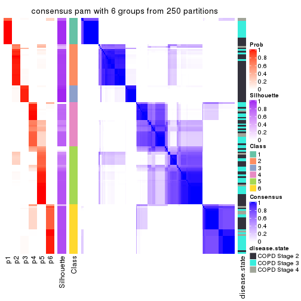</p>

</div>
</div>

Heatmaps for the membership of samples in all partitions to see how consistent they are:


<script>
$( function() {
	$( '#tabs-ATC-pam-membership-heatmap' ).tabs();
} );
</script>
<div id='tabs-ATC-pam-membership-heatmap'>
<ul>
<li><a href='#tab-ATC-pam-membership-heatmap-1'>k = 2</a></li>
<li><a href='#tab-ATC-pam-membership-heatmap-2'>k = 3</a></li>
<li><a href='#tab-ATC-pam-membership-heatmap-3'>k = 4</a></li>
<li><a href='#tab-ATC-pam-membership-heatmap-4'>k = 5</a></li>
<li><a href='#tab-ATC-pam-membership-heatmap-5'>k = 6</a></li>
</ul>
<div id='tab-ATC-pam-membership-heatmap-1'>
<pre><code class="r">membership_heatmap(res, k = 2)
</code></pre>

<p></p>

</div>
<div id='tab-ATC-pam-membership-heatmap-2'>
<pre><code class="r">membership_heatmap(res, k = 3)
</code></pre>

<p></p>

</div>
<div id='tab-ATC-pam-membership-heatmap-3'>
<pre><code class="r">membership_heatmap(res, k = 4)
</code></pre>

<p></p>

</div>
<div id='tab-ATC-pam-membership-heatmap-4'>
<pre><code class="r">membership_heatmap(res, k = 5)
</code></pre>

<p></p>

</div>
<div id='tab-ATC-pam-membership-heatmap-5'>
<pre><code class="r">membership_heatmap(res, k = 6)
</code></pre>

<p>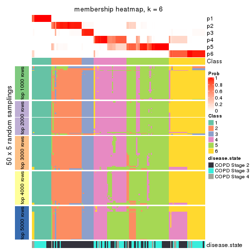</p>

</div>
</div>

As soon as we have had the classes for columns, we can look for signatures
which are significantly different between classes which can be candidate marks
for certain classes. Following are the heatmaps for signatures.


Signature heatmaps where rows are scaled:


<script>
$( function() {
	$( '#tabs-ATC-pam-get-signatures' ).tabs();
} );
</script>
<div id='tabs-ATC-pam-get-signatures'>
<ul>
<li><a href='#tab-ATC-pam-get-signatures-1'>k = 2</a></li>
<li><a href='#tab-ATC-pam-get-signatures-2'>k = 3</a></li>
<li><a href='#tab-ATC-pam-get-signatures-3'>k = 4</a></li>
<li><a href='#tab-ATC-pam-get-signatures-4'>k = 5</a></li>
<li><a href='#tab-ATC-pam-get-signatures-5'>k = 6</a></li>
</ul>
<div id='tab-ATC-pam-get-signatures-1'>
<pre><code class="r">get_signatures(res, k = 2)
</code></pre>

<p></p>

</div>
<div id='tab-ATC-pam-get-signatures-2'>
<pre><code class="r">get_signatures(res, k = 3)
</code></pre>

<p></p>

</div>
<div id='tab-ATC-pam-get-signatures-3'>
<pre><code class="r">get_signatures(res, k = 4)
</code></pre>

<p></p>

</div>
<div id='tab-ATC-pam-get-signatures-4'>
<pre><code class="r">get_signatures(res, k = 5)
</code></pre>

<p></p>

</div>
<div id='tab-ATC-pam-get-signatures-5'>
<pre><code class="r">get_signatures(res, k = 6)
</code></pre>

<p></p>

</div>
</div>


Signature heatmaps where rows are not scaled:


<script>
$( function() {
	$( '#tabs-ATC-pam-get-signatures-no-scale' ).tabs();
} );
</script>
<div id='tabs-ATC-pam-get-signatures-no-scale'>
<ul>
<li><a href='#tab-ATC-pam-get-signatures-no-scale-1'>k = 2</a></li>
<li><a href='#tab-ATC-pam-get-signatures-no-scale-2'>k = 3</a></li>
<li><a href='#tab-ATC-pam-get-signatures-no-scale-3'>k = 4</a></li>
<li><a href='#tab-ATC-pam-get-signatures-no-scale-4'>k = 5</a></li>
<li><a href='#tab-ATC-pam-get-signatures-no-scale-5'>k = 6</a></li>
</ul>
<div id='tab-ATC-pam-get-signatures-no-scale-1'>
<pre><code class="r">get_signatures(res, k = 2, scale_rows = FALSE)
</code></pre>

<p></p>

</div>
<div id='tab-ATC-pam-get-signatures-no-scale-2'>
<pre><code class="r">get_signatures(res, k = 3, scale_rows = FALSE)
</code></pre>

<p></p>

</div>
<div id='tab-ATC-pam-get-signatures-no-scale-3'>
<pre><code class="r">get_signatures(res, k = 4, scale_rows = FALSE)
</code></pre>

<p></p>

</div>
<div id='tab-ATC-pam-get-signatures-no-scale-4'>
<pre><code class="r">get_signatures(res, k = 5, scale_rows = FALSE)
</code></pre>

<p></p>

</div>
<div id='tab-ATC-pam-get-signatures-no-scale-5'>
<pre><code class="r">get_signatures(res, k = 6, scale_rows = FALSE)
</code></pre>

<p></p>

</div>
</div>


Compare the overlap of signatures from different k:

```r
compare_signatures(res)
```


`get_signature()` returns a data frame invisibly. TO get the list of signatures, the function
call should be assigned to a variable explicitly. In following code, if `plot` argument is set
to `FALSE`, no heatmap is plotted while only the differential analysis is performed.

```r
# code only for demonstration
tb = get_signature(res, k = ..., plot = FALSE)
```

An example of the output of `tb` is:

```
#>   which_row         fdr    mean_1    mean_2 scaled_mean_1 scaled_mean_2 km
#> 1        38 0.042760348  8.373488  9.131774    -0.5533452     0.5164555  1
#> 2        40 0.018707592  7.106213  8.469186    -0.6173731     0.5762149  1
#> 3        55 0.019134737 10.221463 11.207825    -0.6159697     0.5749050  1
#> 4        59 0.006059896  5.921854  7.869574    -0.6899429     0.6439467  1
#> 5        60 0.018055526  8.928898 10.211722    -0.6204761     0.5791110  1
#> 6        98 0.009384629 15.714769 14.887706     0.6635654    -0.6193277  2
...
```

The columns in `tb` are:

1. `which_row`: row indices corresponding to the input matrix.
2. `fdr`: FDR for the differential test. 
3. `mean_x`: The mean value in group x.
4. `scaled_mean_x`: The mean value in group x after rows are scaled.
5. `km`: Row groups if k-means clustering is applied to rows.


UMAP plot which shows how samples are separated.


<script>
$( function() {
	$( '#tabs-ATC-pam-dimension-reduction' ).tabs();
} );
</script>
<div id='tabs-ATC-pam-dimension-reduction'>
<ul>
<li><a href='#tab-ATC-pam-dimension-reduction-1'>k = 2</a></li>
<li><a href='#tab-ATC-pam-dimension-reduction-2'>k = 3</a></li>
<li><a href='#tab-ATC-pam-dimension-reduction-3'>k = 4</a></li>
<li><a href='#tab-ATC-pam-dimension-reduction-4'>k = 5</a></li>
<li><a href='#tab-ATC-pam-dimension-reduction-5'>k = 6</a></li>
</ul>
<div id='tab-ATC-pam-dimension-reduction-1'>
<pre><code class="r">dimension_reduction(res, k = 2, method = &quot;UMAP&quot;)
</code></pre>

<p></p>

</div>
<div id='tab-ATC-pam-dimension-reduction-2'>
<pre><code class="r">dimension_reduction(res, k = 3, method = &quot;UMAP&quot;)
</code></pre>

<p></p>

</div>
<div id='tab-ATC-pam-dimension-reduction-3'>
<pre><code class="r">dimension_reduction(res, k = 4, method = &quot;UMAP&quot;)
</code></pre>

<p></p>

</div>
<div id='tab-ATC-pam-dimension-reduction-4'>
<pre><code class="r">dimension_reduction(res, k = 5, method = &quot;UMAP&quot;)
</code></pre>

<p></p>

</div>
<div id='tab-ATC-pam-dimension-reduction-5'>
<pre><code class="r">dimension_reduction(res, k = 6, method = &quot;UMAP&quot;)
</code></pre>

<p></p>

</div>
</div>


Following heatmap shows how subgroups are split when increasing `k`:

```r
collect_classes(res)
```


Test correlation between subgroups and known annotations. If the known
annotation is numeric, one-way ANOVA test is applied, and if the known
annotation is discrete, chi-squared contingency table test is applied.

```r
test_to_known_factors(res)
```

```
#>           n disease.state(p) k
#> ATC:pam 141         1.97e-03 2
#> ATC:pam 143         1.51e-07 3
#> ATC:pam 142         1.52e-05 4
#> ATC:pam  79         2.33e-05 5
#> ATC:pam 135         2.03e-04 6
```


If matrix rows can be associated to genes, consider to use `GO_Enrichment(res,
...)` to perform function enrichment for the signature genes.


 

---------------------------------------------------


### ATC:mclust*


The object with results only for a single top-value method and a single partition method 
can be extracted as:

```r
res = res_list["ATC", "mclust"]
# you can also extract it by
# res = res_list["ATC:mclust"]
```

A summary of `res` and all the functions that can be applied to it:

```r
res
```

```
#> A 'ConsensusPartition' object with k = 2, 3, 4, 5, 6.
#>   On a matrix with 51776 rows and 143 columns.
#>   Top rows (1000, 2000, 3000, 4000, 5000) are extracted by 'ATC' method.
#>   Subgroups are detected by 'mclust' method.
#>   Performed in total 1250 partitions by row resampling.
#>   Best k for subgroups seems to be 2.
#> 
#> Following methods can be applied to this 'ConsensusPartition' object:
#>  [1] "cola_report"             "collect_classes"         "collect_plots"          
#>  [4] "collect_stats"           "colnames"                "compare_signatures"     
#>  [7] "consensus_heatmap"       "dimension_reduction"     "functional_enrichment"  
#> [10] "get_anno_col"            "get_anno"                "get_classes"            
#> [13] "get_consensus"           "get_matrix"              "get_membership"         
#> [16] "get_param"               "get_signatures"          "get_stats"              
#> [19] "is_best_k"               "is_stable_k"             "membership_heatmap"     
#> [22] "ncol"                    "nrow"                    "plot_ecdf"              
#> [25] "rownames"                "select_partition_number" "show"                   
#> [28] "suggest_best_k"          "test_to_known_factors"
```

`collect_plots()` function collects all the plots made from `res` for all `k` (number of partitions)
into one single page to provide an easy and fast comparison between different `k`.

```r
collect_plots(res)
```


The plots are:

- The first row: a plot of the ECDF (Empirical cumulative distribution
  function) curves of the consensus matrix for each `k` and the heatmap of
  predicted classes for each `k`.
- The second row: heatmaps of the consensus matrix for each `k`.
- The third row: heatmaps of the membership matrix for each `k`.
- The fouth row: heatmaps of the signatures for each `k`.

All the plots in panels can be made by individual functions and they are
plotted later in this section.

`select_partition_number()` produces several plots showing different
statistics for choosing "optimized" `k`. There are following statistics:

- ECDF curves of the consensus matrix for each `k`;
- 1-PAC. [The PAC
  score](https://en.wikipedia.org/wiki/Consensus_clustering#Over-interpretation_potential_of_consensus_clustering)
  measures the proportion of the ambiguous subgrouping.
- Mean silhouette score.
- Concordance. The mean probability of fiting the consensus class ids in all
  partitions.
- Area increased. Denote $A_k$ as the area under the ECDF curve for current
  `k`, the area increased is defined as $A_k - A_{k-1}$.
- Rand index. The percent of pairs of samples that are both in a same cluster
  or both are not in a same cluster in the partition of k and k-1.
- Jaccard index. The ratio of pairs of samples are both in a same cluster in
  the partition of k and k-1 and the pairs of samples are both in a same
  cluster in the partition k or k-1.

The detailed explanations of these statistics can be found in [the cola
vignette](http://bioconductor.org/packages/devel/bioc/vignettes/cola/inst/doc/cola.html#toc_13).

Generally speaking, lower PAC score, higher mean silhouette score or higher
concordance corresponds to better partition. Rand index and Jaccard index
measure how similar the current partition is compared to partition with `k-1`.
If they are too similar, we won't accept `k` is better than `k-1`.

```r
select_partition_number(res)
```


The numeric values for all these statistics can be obtained by `get_stats()`.

```r
get_stats(res)
```

```
#>   k 1-PAC mean_silhouette concordance area_increased  Rand Jaccard
#> 2 2 0.941           0.950       0.978         0.3894 0.628   0.628
#> 3 3 0.393           0.687       0.783         0.4802 0.731   0.581
#> 4 4 0.345           0.511       0.664         0.1289 0.811   0.576
#> 5 5 0.422           0.454       0.727         0.0358 0.842   0.593
#> 6 6 0.505           0.398       0.700         0.1009 0.867   0.620
```

`suggest_best_k()` suggests the best $k$ based on these statistics. The rules are as follows:

- All $k$ with Jaccard index larger than 0.95 are removed because the increase of
  the partition number does not provides enough extra information. If all $k$ are removed,
  the best $k$ is assigned by `NA`.
- For $k$ with 1-PAC larger than 0.9, the maximal $k$ is taken as the "best k". Other $k$ is called "optional k".
- If it does not fit the second rule. The $k$ with the highest vote of highest
  1-PAC, mean silhouette and concordance is taken as the "best k".

```r
suggest_best_k(res)
```

```
#> [1] 2
```


Following shows the table of the partitions (You need to click the **show/hide
code output** link to see it). The membership matrix (columns with name `p*`)
is inferred by
[`clue::cl_consensus()`](https://www.rdocumentation.org/link/cl_consensus?package=clue)
function with the `SE` method. Basically the value in the membership matrix
represents the probability to belong to a certain group. The finall class
label for an item is determined with the group with highest probability it
belongs to.

In `get_classes()` function, the entropy is calculated from the membership
matrix and the silhouette score is calculated from the consensus matrix.


<script>
$( function() {
	$( '#tabs-ATC-mclust-get-classes' ).tabs();
} );
</script>
<div id='tabs-ATC-mclust-get-classes'>
<ul>
<li><a href='#tab-ATC-mclust-get-classes-1'>k = 2</a></li>
<li><a href='#tab-ATC-mclust-get-classes-2'>k = 3</a></li>
<li><a href='#tab-ATC-mclust-get-classes-3'>k = 4</a></li>
<li><a href='#tab-ATC-mclust-get-classes-4'>k = 5</a></li>
<li><a href='#tab-ATC-mclust-get-classes-5'>k = 6</a></li>
</ul>

<div id='tab-ATC-mclust-get-classes-1'>
<p><a id='tab-ATC-mclust-get-classes-1-a' style='color:#0366d6' href='#'>show/hide code output</a></p>
<pre><code class="r">cbind(get_classes(res, k = 2), get_membership(res, k = 2))
</code></pre>

<pre><code>#&gt;           class entropy silhouette    p1    p2
#&gt; GSM550785     2  0.0000      0.973 0.000 1.000
#&gt; GSM550786     2  0.0000      0.973 0.000 1.000
#&gt; GSM550788     2  0.0000      0.973 0.000 1.000
#&gt; GSM550789     2  0.0000      0.973 0.000 1.000
#&gt; GSM550790     2  0.9608      0.404 0.384 0.616
#&gt; GSM550791     2  0.0376      0.970 0.004 0.996
#&gt; GSM550792     2  0.0000      0.973 0.000 1.000
#&gt; GSM550796     2  0.0000      0.973 0.000 1.000
#&gt; GSM550797     2  0.0000      0.973 0.000 1.000
#&gt; GSM550799     2  0.0000      0.973 0.000 1.000
#&gt; GSM550800     2  0.0000      0.973 0.000 1.000
#&gt; GSM550801     2  0.0000      0.973 0.000 1.000
#&gt; GSM550804     2  0.0000      0.973 0.000 1.000
#&gt; GSM550806     2  0.0000      0.973 0.000 1.000
#&gt; GSM550807     2  0.0000      0.973 0.000 1.000
#&gt; GSM550808     1  0.0000      0.989 1.000 0.000
#&gt; GSM550809     1  0.0000      0.989 1.000 0.000
#&gt; GSM550810     2  0.6973      0.773 0.188 0.812
#&gt; GSM550811     2  0.0000      0.973 0.000 1.000
#&gt; GSM550813     2  0.0000      0.973 0.000 1.000
#&gt; GSM550814     2  0.0000      0.973 0.000 1.000
#&gt; GSM550815     1  0.1633      0.967 0.976 0.024
#&gt; GSM550816     1  0.0000      0.989 1.000 0.000
#&gt; GSM550817     1  0.0000      0.989 1.000 0.000
#&gt; GSM550818     1  0.0000      0.989 1.000 0.000
#&gt; GSM550819     2  0.0000      0.973 0.000 1.000
#&gt; GSM550820     2  0.7602      0.736 0.220 0.780
#&gt; GSM550821     2  0.0000      0.973 0.000 1.000
#&gt; GSM550822     1  0.1184      0.975 0.984 0.016
#&gt; GSM550826     2  0.0000      0.973 0.000 1.000
#&gt; GSM550832     2  0.0000      0.973 0.000 1.000
#&gt; GSM550833     2  0.0000      0.973 0.000 1.000
#&gt; GSM550835     2  0.0000      0.973 0.000 1.000
#&gt; GSM550836     1  0.0000      0.989 1.000 0.000
#&gt; GSM550837     2  0.0000      0.973 0.000 1.000
#&gt; GSM550838     1  0.0000      0.989 1.000 0.000
#&gt; GSM550841     1  0.0000      0.989 1.000 0.000
#&gt; GSM550842     2  0.7219      0.756 0.200 0.800
#&gt; GSM550846     2  0.0000      0.973 0.000 1.000
#&gt; GSM550849     1  0.0000      0.989 1.000 0.000
#&gt; GSM550850     1  0.0000      0.989 1.000 0.000
#&gt; GSM550851     2  0.0000      0.973 0.000 1.000
#&gt; GSM550852     2  0.0000      0.973 0.000 1.000
#&gt; GSM550853     2  0.0000      0.973 0.000 1.000
#&gt; GSM550855     2  0.0000      0.973 0.000 1.000
#&gt; GSM550856     2  0.0000      0.973 0.000 1.000
#&gt; GSM550861     2  0.0000      0.973 0.000 1.000
#&gt; GSM550863     2  0.0000      0.973 0.000 1.000
#&gt; GSM550864     2  0.0000      0.973 0.000 1.000
#&gt; GSM550866     2  0.0000      0.973 0.000 1.000
#&gt; GSM550867     1  0.0000      0.989 1.000 0.000
#&gt; GSM550885     1  0.0000      0.989 1.000 0.000
#&gt; GSM550886     2  0.0000      0.973 0.000 1.000
#&gt; GSM550887     2  0.0000      0.973 0.000 1.000
#&gt; GSM550889     2  0.4562      0.887 0.096 0.904
#&gt; GSM550894     2  0.0000      0.973 0.000 1.000
#&gt; GSM550897     2  0.0000      0.973 0.000 1.000
#&gt; GSM550903     2  0.0000      0.973 0.000 1.000
#&gt; GSM550905     2  0.0000      0.973 0.000 1.000
#&gt; GSM550906     2  0.0000      0.973 0.000 1.000
#&gt; GSM550907     1  0.0000      0.989 1.000 0.000
#&gt; GSM550909     2  0.7139      0.762 0.196 0.804
#&gt; GSM550911     1  0.0000      0.989 1.000 0.000
#&gt; GSM550913     2  0.0000      0.973 0.000 1.000
#&gt; GSM550915     2  0.7376      0.745 0.208 0.792
#&gt; GSM550917     2  0.0000      0.973 0.000 1.000
#&gt; GSM550919     2  0.0000      0.973 0.000 1.000
#&gt; GSM550921     1  0.0000      0.989 1.000 0.000
#&gt; GSM550924     2  0.0000      0.973 0.000 1.000
#&gt; GSM550926     2  0.0000      0.973 0.000 1.000
#&gt; GSM550927     2  0.0000      0.973 0.000 1.000
#&gt; GSM550787     2  0.0000      0.973 0.000 1.000
#&gt; GSM550793     2  0.2423      0.940 0.040 0.960
#&gt; GSM550794     2  0.0000      0.973 0.000 1.000
#&gt; GSM550795     2  0.0000      0.973 0.000 1.000
#&gt; GSM550798     1  0.0000      0.989 1.000 0.000
#&gt; GSM550803     1  0.0000      0.989 1.000 0.000
#&gt; GSM550805     2  0.0000      0.973 0.000 1.000
#&gt; GSM550823     2  0.0000      0.973 0.000 1.000
#&gt; GSM550824     1  0.0000      0.989 1.000 0.000
#&gt; GSM550825     2  0.4022      0.903 0.080 0.920
#&gt; GSM550827     2  0.0000      0.973 0.000 1.000
#&gt; GSM550828     2  0.6973      0.777 0.188 0.812
#&gt; GSM550829     1  0.0376      0.986 0.996 0.004
#&gt; GSM550830     2  0.0000      0.973 0.000 1.000
#&gt; GSM550834     2  0.0000      0.973 0.000 1.000
#&gt; GSM550839     2  0.0000      0.973 0.000 1.000
#&gt; GSM550840     1  0.0000      0.989 1.000 0.000
#&gt; GSM550843     2  0.0000      0.973 0.000 1.000
#&gt; GSM550844     2  0.0000      0.973 0.000 1.000
#&gt; GSM550845     2  0.0000      0.973 0.000 1.000
#&gt; GSM550848     2  0.0000      0.973 0.000 1.000
#&gt; GSM550854     1  0.0000      0.989 1.000 0.000
#&gt; GSM550857     1  0.0000      0.989 1.000 0.000
#&gt; GSM550858     2  0.5408      0.857 0.124 0.876
#&gt; GSM550859     1  0.0000      0.989 1.000 0.000
#&gt; GSM550862     2  0.0000      0.973 0.000 1.000
#&gt; GSM550865     2  0.0000      0.973 0.000 1.000
#&gt; GSM550868     2  0.0000      0.973 0.000 1.000
#&gt; GSM550869     2  0.0000      0.973 0.000 1.000
#&gt; GSM550870     2  0.0000      0.973 0.000 1.000
#&gt; GSM550871     2  0.0000      0.973 0.000 1.000
#&gt; GSM550872     2  0.0000      0.973 0.000 1.000
#&gt; GSM550873     2  0.0000      0.973 0.000 1.000
#&gt; GSM550874     2  0.0000      0.973 0.000 1.000
#&gt; GSM550876     2  0.0000      0.973 0.000 1.000
#&gt; GSM550877     2  0.0000      0.973 0.000 1.000
#&gt; GSM550878     2  0.0000      0.973 0.000 1.000
#&gt; GSM550879     2  0.0000      0.973 0.000 1.000
#&gt; GSM550882     2  0.9323      0.490 0.348 0.652
#&gt; GSM550888     1  0.0000      0.989 1.000 0.000
#&gt; GSM550890     2  0.0000      0.973 0.000 1.000
#&gt; GSM550891     1  0.0000      0.989 1.000 0.000
#&gt; GSM550892     2  0.0000      0.973 0.000 1.000
#&gt; GSM550893     2  0.0000      0.973 0.000 1.000
#&gt; GSM550895     2  0.0000      0.973 0.000 1.000
#&gt; GSM550896     2  0.0000      0.973 0.000 1.000
#&gt; GSM550898     1  0.0000      0.989 1.000 0.000
#&gt; GSM550899     2  0.0000      0.973 0.000 1.000
#&gt; GSM550900     2  0.0000      0.973 0.000 1.000
#&gt; GSM550901     2  0.0000      0.973 0.000 1.000
#&gt; GSM550902     2  0.0000      0.973 0.000 1.000
#&gt; GSM550904     2  0.0000      0.973 0.000 1.000
#&gt; GSM550908     1  0.0000      0.989 1.000 0.000
#&gt; GSM550912     2  0.0000      0.973 0.000 1.000
#&gt; GSM550914     2  0.1184      0.960 0.016 0.984
#&gt; GSM550918     2  0.0000      0.973 0.000 1.000
#&gt; GSM550922     2  0.0000      0.973 0.000 1.000
#&gt; GSM550923     1  0.0000      0.989 1.000 0.000
#&gt; GSM550925     1  0.8661      0.580 0.712 0.288
#&gt; GSM550802     2  0.0000      0.973 0.000 1.000
#&gt; GSM550812     1  0.0000      0.989 1.000 0.000
#&gt; GSM550831     1  0.0000      0.989 1.000 0.000
#&gt; GSM550847     1  0.1843      0.963 0.972 0.028
#&gt; GSM550860     2  0.0000      0.973 0.000 1.000
#&gt; GSM550875     2  0.0000      0.973 0.000 1.000
#&gt; GSM550880     2  0.0376      0.970 0.004 0.996
#&gt; GSM550881     2  0.0000      0.973 0.000 1.000
#&gt; GSM550883     1  0.0000      0.989 1.000 0.000
#&gt; GSM550884     2  0.0000      0.973 0.000 1.000
#&gt; GSM550910     2  0.8144      0.675 0.252 0.748
#&gt; GSM550916     2  0.8499      0.638 0.276 0.724
#&gt; GSM550920     2  0.0000      0.973 0.000 1.000
</code></pre>

<script>
$('#tab-ATC-mclust-get-classes-1-a').parent().next().next().hide();
$('#tab-ATC-mclust-get-classes-1-a').click(function(){
  $('#tab-ATC-mclust-get-classes-1-a').parent().next().next().toggle();
  return(false);
});
</script>
</div>

<div id='tab-ATC-mclust-get-classes-2'>
<p><a id='tab-ATC-mclust-get-classes-2-a' style='color:#0366d6' href='#'>show/hide code output</a></p>
<pre><code class="r">cbind(get_classes(res, k = 3), get_membership(res, k = 3))
</code></pre>

<pre><code>#&gt;           class entropy silhouette    p1    p2    p3
#&gt; GSM550785     1  0.4974      0.707 0.764 0.236 0.000
#&gt; GSM550786     1  0.0000      0.718 1.000 0.000 0.000
#&gt; GSM550788     1  0.5785     -0.243 0.668 0.332 0.000
#&gt; GSM550789     2  0.6308      0.775 0.492 0.508 0.000
#&gt; GSM550790     1  0.6624      0.671 0.708 0.248 0.044
#&gt; GSM550791     1  0.4682      0.727 0.804 0.192 0.004
#&gt; GSM550792     1  0.0000      0.718 1.000 0.000 0.000
#&gt; GSM550796     1  0.0747      0.705 0.984 0.016 0.000
#&gt; GSM550797     1  0.0000      0.718 1.000 0.000 0.000
#&gt; GSM550799     1  0.6008     -0.327 0.628 0.372 0.000
#&gt; GSM550800     1  0.1031      0.697 0.976 0.024 0.000
#&gt; GSM550801     2  0.6026      0.952 0.376 0.624 0.000
#&gt; GSM550804     1  0.6291     -0.699 0.532 0.468 0.000
#&gt; GSM550806     1  0.0000      0.718 1.000 0.000 0.000
#&gt; GSM550807     2  0.6008      0.954 0.372 0.628 0.000
#&gt; GSM550808     3  0.1765      0.866 0.040 0.004 0.956
#&gt; GSM550809     3  0.0237      0.847 0.000 0.004 0.996
#&gt; GSM550810     1  0.2448      0.705 0.924 0.000 0.076
#&gt; GSM550811     1  0.4062      0.735 0.836 0.164 0.000
#&gt; GSM550813     2  0.6008      0.954 0.372 0.628 0.000
#&gt; GSM550814     2  0.6045      0.950 0.380 0.620 0.000
#&gt; GSM550815     3  0.4629      0.777 0.188 0.004 0.808
#&gt; GSM550816     3  0.1878      0.867 0.044 0.004 0.952
#&gt; GSM550817     3  0.0661      0.849 0.008 0.004 0.988
#&gt; GSM550818     3  0.2590      0.866 0.072 0.004 0.924
#&gt; GSM550819     1  0.1163      0.693 0.972 0.028 0.000
#&gt; GSM550820     1  0.6335      0.686 0.724 0.240 0.036
#&gt; GSM550821     1  0.6062     -0.441 0.616 0.384 0.000
#&gt; GSM550822     3  0.4575      0.782 0.184 0.004 0.812
#&gt; GSM550826     1  0.4974      0.707 0.764 0.236 0.000
#&gt; GSM550832     2  0.6008      0.954 0.372 0.628 0.000
#&gt; GSM550833     1  0.0424      0.712 0.992 0.008 0.000
#&gt; GSM550835     2  0.6008      0.954 0.372 0.628 0.000
#&gt; GSM550836     3  0.7333      0.839 0.136 0.156 0.708
#&gt; GSM550837     1  0.0000      0.718 1.000 0.000 0.000
#&gt; GSM550838     3  0.0000      0.848 0.000 0.000 1.000
#&gt; GSM550841     3  0.1525      0.863 0.032 0.004 0.964
#&gt; GSM550842     1  0.2537      0.703 0.920 0.000 0.080
#&gt; GSM550846     1  0.2261      0.720 0.932 0.068 0.000
#&gt; GSM550849     3  0.5174      0.832 0.076 0.092 0.832
#&gt; GSM550850     3  0.1878      0.867 0.044 0.004 0.952
#&gt; GSM550851     1  0.0000      0.718 1.000 0.000 0.000
#&gt; GSM550852     1  0.0000      0.718 1.000 0.000 0.000
#&gt; GSM550853     1  0.0000      0.718 1.000 0.000 0.000
#&gt; GSM550855     1  0.0424      0.712 0.992 0.008 0.000
#&gt; GSM550856     2  0.6008      0.954 0.372 0.628 0.000
#&gt; GSM550861     2  0.6008      0.954 0.372 0.628 0.000
#&gt; GSM550863     1  0.2959      0.595 0.900 0.100 0.000
#&gt; GSM550864     2  0.6008      0.954 0.372 0.628 0.000
#&gt; GSM550866     2  0.5988      0.950 0.368 0.632 0.000
#&gt; GSM550867     3  0.7975      0.818 0.140 0.204 0.656
#&gt; GSM550885     3  0.7739      0.829 0.136 0.188 0.676
#&gt; GSM550886     2  0.6008      0.954 0.372 0.628 0.000
#&gt; GSM550887     1  0.6168     -0.539 0.588 0.412 0.000
#&gt; GSM550889     1  0.5269      0.727 0.784 0.200 0.016
#&gt; GSM550894     2  0.6008      0.954 0.372 0.628 0.000
#&gt; GSM550897     1  0.4178      0.736 0.828 0.172 0.000
#&gt; GSM550903     2  0.6026      0.952 0.376 0.624 0.000
#&gt; GSM550905     2  0.6079      0.934 0.388 0.612 0.000
#&gt; GSM550906     2  0.6008      0.954 0.372 0.628 0.000
#&gt; GSM550907     3  0.2096      0.865 0.052 0.004 0.944
#&gt; GSM550909     1  0.2796      0.701 0.908 0.000 0.092
#&gt; GSM550911     3  0.0424      0.848 0.000 0.008 0.992
#&gt; GSM550913     2  0.6309      0.758 0.500 0.500 0.000
#&gt; GSM550915     1  0.4413      0.737 0.832 0.160 0.008
#&gt; GSM550917     2  0.6008      0.954 0.372 0.628 0.000
#&gt; GSM550919     2  0.6280      0.845 0.460 0.540 0.000
#&gt; GSM550921     3  0.4316      0.868 0.044 0.088 0.868
#&gt; GSM550924     2  0.6267      0.856 0.452 0.548 0.000
#&gt; GSM550926     2  0.6008      0.954 0.372 0.628 0.000
#&gt; GSM550927     2  0.6008      0.954 0.372 0.628 0.000
#&gt; GSM550787     1  0.0592      0.714 0.988 0.012 0.000
#&gt; GSM550793     1  0.5058      0.702 0.756 0.244 0.000
#&gt; GSM550794     1  0.0000      0.718 1.000 0.000 0.000
#&gt; GSM550795     1  0.5016      0.705 0.760 0.240 0.000
#&gt; GSM550798     3  0.7960      0.820 0.136 0.208 0.656
#&gt; GSM550803     3  0.6488      0.855 0.084 0.160 0.756
#&gt; GSM550805     1  0.3412      0.739 0.876 0.124 0.000
#&gt; GSM550823     1  0.0000      0.718 1.000 0.000 0.000
#&gt; GSM550824     3  0.7441      0.837 0.136 0.164 0.700
#&gt; GSM550825     1  0.5502      0.694 0.744 0.248 0.008
#&gt; GSM550827     2  0.6111      0.937 0.396 0.604 0.000
#&gt; GSM550828     1  0.5578      0.698 0.748 0.240 0.012
#&gt; GSM550829     3  0.9006      0.680 0.188 0.256 0.556
#&gt; GSM550830     1  0.0237      0.715 0.996 0.004 0.000
#&gt; GSM550834     1  0.4654      0.721 0.792 0.208 0.000
#&gt; GSM550839     1  0.0237      0.718 0.996 0.000 0.004
#&gt; GSM550840     3  0.1878      0.867 0.044 0.004 0.952
#&gt; GSM550843     1  0.1289      0.689 0.968 0.032 0.000
#&gt; GSM550844     1  0.4796      0.716 0.780 0.220 0.000
#&gt; GSM550845     2  0.6215      0.897 0.428 0.572 0.000
#&gt; GSM550848     2  0.6308      0.790 0.492 0.508 0.000
#&gt; GSM550854     3  0.7960      0.820 0.136 0.208 0.656
#&gt; GSM550857     3  0.7333      0.839 0.136 0.156 0.708
#&gt; GSM550858     1  0.5480      0.683 0.732 0.264 0.004
#&gt; GSM550859     3  0.7545      0.835 0.136 0.172 0.692
#&gt; GSM550862     1  0.4974      0.707 0.764 0.236 0.000
#&gt; GSM550865     1  0.0237      0.719 0.996 0.004 0.000
#&gt; GSM550868     1  0.6274     -0.670 0.544 0.456 0.000
#&gt; GSM550869     1  0.4047      0.737 0.848 0.148 0.004
#&gt; GSM550870     2  0.6008      0.954 0.372 0.628 0.000
#&gt; GSM550871     1  0.0424      0.720 0.992 0.008 0.000
#&gt; GSM550872     1  0.0424      0.720 0.992 0.008 0.000
#&gt; GSM550873     1  0.0000      0.718 1.000 0.000 0.000
#&gt; GSM550874     1  0.3192      0.575 0.888 0.112 0.000
#&gt; GSM550876     1  0.4504      0.358 0.804 0.196 0.000
#&gt; GSM550877     2  0.6008      0.954 0.372 0.628 0.000
#&gt; GSM550878     2  0.6079      0.940 0.388 0.612 0.000
#&gt; GSM550879     1  0.4504      0.726 0.804 0.196 0.000
#&gt; GSM550882     1  0.7107      0.680 0.712 0.196 0.092
#&gt; GSM550888     3  0.7221      0.840 0.136 0.148 0.716
#&gt; GSM550890     1  0.4235      0.732 0.824 0.176 0.000
#&gt; GSM550891     3  0.0424      0.848 0.000 0.008 0.992
#&gt; GSM550892     1  0.4654      0.722 0.792 0.208 0.000
#&gt; GSM550893     2  0.6215      0.885 0.428 0.572 0.000
#&gt; GSM550895     1  0.6309     -0.771 0.500 0.500 0.000
#&gt; GSM550896     2  0.6008      0.954 0.372 0.628 0.000
#&gt; GSM550898     3  0.7960      0.820 0.136 0.208 0.656
#&gt; GSM550899     2  0.6008      0.954 0.372 0.628 0.000
#&gt; GSM550900     1  0.6302     -0.732 0.520 0.480 0.000
#&gt; GSM550901     1  0.3879      0.736 0.848 0.152 0.000
#&gt; GSM550902     1  0.4555      0.725 0.800 0.200 0.000
#&gt; GSM550904     1  0.4974      0.707 0.764 0.236 0.000
#&gt; GSM550908     3  0.4527      0.868 0.052 0.088 0.860
#&gt; GSM550912     1  0.4842      0.360 0.776 0.224 0.000
#&gt; GSM550914     1  0.4645      0.735 0.816 0.176 0.008
#&gt; GSM550918     2  0.5988      0.950 0.368 0.632 0.000
#&gt; GSM550922     2  0.6045      0.949 0.380 0.620 0.000
#&gt; GSM550923     3  0.7975      0.818 0.140 0.204 0.656
#&gt; GSM550925     1  0.8587      0.550 0.604 0.176 0.220
#&gt; GSM550802     1  0.0000      0.718 1.000 0.000 0.000
#&gt; GSM550812     3  0.1525      0.863 0.032 0.004 0.964
#&gt; GSM550831     3  0.1878      0.867 0.044 0.004 0.952
#&gt; GSM550847     3  0.9612      0.466 0.332 0.216 0.452
#&gt; GSM550860     1  0.4178      0.736 0.828 0.172 0.000
#&gt; GSM550875     1  0.4121      0.734 0.832 0.168 0.000
#&gt; GSM550880     1  0.7534     -0.236 0.584 0.368 0.048
#&gt; GSM550881     1  0.4504      0.732 0.804 0.196 0.000
#&gt; GSM550883     1  0.9481     -0.259 0.432 0.184 0.384
#&gt; GSM550884     2  0.6280      0.849 0.460 0.540 0.000
#&gt; GSM550910     1  0.5741      0.656 0.776 0.036 0.188
#&gt; GSM550916     1  0.5420      0.700 0.752 0.240 0.008
#&gt; GSM550920     1  0.6307     -0.744 0.512 0.488 0.000
</code></pre>

<script>
$('#tab-ATC-mclust-get-classes-2-a').parent().next().next().hide();
$('#tab-ATC-mclust-get-classes-2-a').click(function(){
  $('#tab-ATC-mclust-get-classes-2-a').parent().next().next().toggle();
  return(false);
});
</script>
</div>

<div id='tab-ATC-mclust-get-classes-3'>
<p><a id='tab-ATC-mclust-get-classes-3-a' style='color:#0366d6' href='#'>show/hide code output</a></p>
<pre><code class="r">cbind(get_classes(res, k = 4), get_membership(res, k = 4))
</code></pre>

<pre><code>#&gt;           class entropy silhouette    p1    p2    p3    p4
#&gt; GSM550785     4  0.8989     0.6274 0.100 0.156 0.312 0.432
#&gt; GSM550786     4  0.3837     0.5208 0.000 0.224 0.000 0.776
#&gt; GSM550788     2  0.4973     0.4641 0.000 0.644 0.008 0.348
#&gt; GSM550789     2  0.5184     0.5483 0.000 0.672 0.024 0.304
#&gt; GSM550790     4  0.8898     0.5089 0.200 0.068 0.316 0.416
#&gt; GSM550791     4  0.7556     0.6407 0.004 0.188 0.312 0.496
#&gt; GSM550792     4  0.4406     0.4776 0.000 0.300 0.000 0.700
#&gt; GSM550796     4  0.5994     0.3761 0.000 0.156 0.152 0.692
#&gt; GSM550797     4  0.4839     0.4791 0.000 0.184 0.052 0.764
#&gt; GSM550799     2  0.3808     0.7153 0.000 0.812 0.012 0.176
#&gt; GSM550800     4  0.4844     0.4484 0.000 0.300 0.012 0.688
#&gt; GSM550801     2  0.2868     0.7763 0.000 0.864 0.000 0.136
#&gt; GSM550804     2  0.5112     0.3749 0.000 0.608 0.008 0.384
#&gt; GSM550806     4  0.7267     0.5770 0.004 0.260 0.180 0.556
#&gt; GSM550807     2  0.0817     0.8344 0.000 0.976 0.000 0.024
#&gt; GSM550808     3  0.7511     0.3771 0.336 0.000 0.468 0.196
#&gt; GSM550809     3  0.5604     0.1507 0.476 0.000 0.504 0.020
#&gt; GSM550810     4  0.5690     0.2111 0.000 0.096 0.196 0.708
#&gt; GSM550811     4  0.7556     0.6407 0.004 0.188 0.312 0.496
#&gt; GSM550813     2  0.0000     0.8292 0.000 1.000 0.000 0.000
#&gt; GSM550814     2  0.0817     0.8342 0.000 0.976 0.000 0.024
#&gt; GSM550815     3  0.7752     0.3695 0.328 0.004 0.456 0.212
#&gt; GSM550816     3  0.7511     0.3771 0.336 0.000 0.468 0.196
#&gt; GSM550817     3  0.6652     0.2594 0.396 0.000 0.516 0.088
#&gt; GSM550818     1  0.7972    -0.2772 0.416 0.012 0.376 0.196
#&gt; GSM550819     4  0.4917     0.4164 0.000 0.336 0.008 0.656
#&gt; GSM550820     4  0.9108     0.5321 0.184 0.092 0.324 0.400
#&gt; GSM550821     2  0.5150     0.3367 0.000 0.596 0.008 0.396
#&gt; GSM550822     3  0.7752     0.3695 0.328 0.004 0.456 0.212
#&gt; GSM550826     4  0.8901     0.6319 0.092 0.156 0.312 0.440
#&gt; GSM550832     2  0.0188     0.8291 0.000 0.996 0.000 0.004
#&gt; GSM550833     4  0.4807     0.4899 0.000 0.248 0.024 0.728
#&gt; GSM550835     2  0.0000     0.8292 0.000 1.000 0.000 0.000
#&gt; GSM550836     1  0.3521     0.5320 0.864 0.000 0.052 0.084
#&gt; GSM550837     4  0.4466     0.4908 0.000 0.180 0.036 0.784
#&gt; GSM550838     1  0.6384    -0.2469 0.496 0.000 0.440 0.064
#&gt; GSM550841     3  0.7511     0.3771 0.336 0.000 0.468 0.196
#&gt; GSM550842     4  0.5763     0.1977 0.000 0.096 0.204 0.700
#&gt; GSM550846     2  0.7922    -0.5148 0.000 0.344 0.320 0.336
#&gt; GSM550849     1  0.7777    -0.2133 0.424 0.004 0.368 0.204
#&gt; GSM550850     1  0.6884    -0.2377 0.500 0.004 0.404 0.092
#&gt; GSM550851     4  0.4332     0.5015 0.000 0.176 0.032 0.792
#&gt; GSM550852     4  0.3444     0.5245 0.000 0.184 0.000 0.816
#&gt; GSM550853     4  0.4728     0.5004 0.000 0.216 0.032 0.752
#&gt; GSM550855     4  0.4542     0.5072 0.000 0.228 0.020 0.752
#&gt; GSM550856     2  0.0000     0.8292 0.000 1.000 0.000 0.000
#&gt; GSM550861     2  0.0000     0.8292 0.000 1.000 0.000 0.000
#&gt; GSM550863     2  0.3907     0.6519 0.000 0.768 0.000 0.232
#&gt; GSM550864     2  0.0336     0.8323 0.000 0.992 0.000 0.008
#&gt; GSM550866     2  0.0000     0.8292 0.000 1.000 0.000 0.000
#&gt; GSM550867     1  0.3448     0.4801 0.828 0.000 0.004 0.168
#&gt; GSM550885     1  0.2081     0.5450 0.916 0.000 0.000 0.084
#&gt; GSM550886     2  0.0336     0.8323 0.000 0.992 0.000 0.008
#&gt; GSM550887     2  0.4718     0.5458 0.000 0.708 0.012 0.280
#&gt; GSM550889     4  0.9535     0.5774 0.128 0.208 0.332 0.332
#&gt; GSM550894     2  0.1209     0.8254 0.000 0.964 0.032 0.004
#&gt; GSM550897     4  0.9215     0.5894 0.080 0.244 0.312 0.364
#&gt; GSM550903     2  0.0188     0.8296 0.000 0.996 0.004 0.000
#&gt; GSM550905     2  0.1305     0.8234 0.000 0.960 0.036 0.004
#&gt; GSM550906     2  0.0000     0.8292 0.000 1.000 0.000 0.000
#&gt; GSM550907     1  0.8735    -0.1723 0.424 0.084 0.356 0.136
#&gt; GSM550909     4  0.6082     0.2677 0.016 0.104 0.168 0.712
#&gt; GSM550911     3  0.5657     0.1497 0.436 0.000 0.540 0.024
#&gt; GSM550913     2  0.4576     0.6135 0.000 0.728 0.012 0.260
#&gt; GSM550915     4  0.8071     0.5789 0.008 0.256 0.328 0.408
#&gt; GSM550917     2  0.0000     0.8292 0.000 1.000 0.000 0.000
#&gt; GSM550919     2  0.2011     0.8162 0.000 0.920 0.000 0.080
#&gt; GSM550921     1  0.4332     0.3943 0.792 0.000 0.176 0.032
#&gt; GSM550924     2  0.1867     0.8209 0.000 0.928 0.000 0.072
#&gt; GSM550926     2  0.0336     0.8323 0.000 0.992 0.000 0.008
#&gt; GSM550927     2  0.1356     0.8328 0.000 0.960 0.008 0.032
#&gt; GSM550787     4  0.7784     0.5735 0.000 0.292 0.280 0.428
#&gt; GSM550793     4  0.9039     0.5969 0.136 0.120 0.316 0.428
#&gt; GSM550794     4  0.4343     0.5125 0.004 0.264 0.000 0.732
#&gt; GSM550795     4  0.9041     0.6081 0.124 0.132 0.316 0.428
#&gt; GSM550798     1  0.2149     0.5448 0.912 0.000 0.000 0.088
#&gt; GSM550803     1  0.2983     0.4797 0.892 0.000 0.068 0.040
#&gt; GSM550805     4  0.7709     0.6329 0.004 0.212 0.312 0.472
#&gt; GSM550823     4  0.4955     0.5181 0.004 0.272 0.016 0.708
#&gt; GSM550824     1  0.2266     0.5446 0.912 0.000 0.004 0.084
#&gt; GSM550825     4  0.9020     0.5841 0.148 0.108 0.316 0.428
#&gt; GSM550827     2  0.1474     0.8276 0.000 0.948 0.000 0.052
#&gt; GSM550828     4  0.9065     0.5537 0.172 0.096 0.316 0.416
#&gt; GSM550829     1  0.6256     0.2761 0.616 0.044 0.016 0.324
#&gt; GSM550830     4  0.4790     0.3642 0.000 0.380 0.000 0.620
#&gt; GSM550834     4  0.7813     0.6447 0.016 0.176 0.312 0.496
#&gt; GSM550839     4  0.3721     0.5187 0.004 0.176 0.004 0.816
#&gt; GSM550840     1  0.7063    -0.2267 0.488 0.004 0.400 0.108
#&gt; GSM550843     4  0.4624     0.4141 0.000 0.340 0.000 0.660
#&gt; GSM550844     4  0.9030     0.6265 0.104 0.156 0.312 0.428
#&gt; GSM550845     2  0.2011     0.8182 0.000 0.920 0.000 0.080
#&gt; GSM550848     2  0.2281     0.8048 0.000 0.904 0.000 0.096
#&gt; GSM550854     1  0.2334     0.5440 0.908 0.000 0.004 0.088
#&gt; GSM550857     1  0.3521     0.5320 0.864 0.000 0.052 0.084
#&gt; GSM550858     4  0.8831     0.5254 0.188 0.068 0.316 0.428
#&gt; GSM550859     1  0.2081     0.5450 0.916 0.000 0.000 0.084
#&gt; GSM550862     4  0.9094     0.6155 0.120 0.144 0.312 0.424
#&gt; GSM550865     2  0.6544     0.2660 0.044 0.604 0.028 0.324
#&gt; GSM550868     2  0.3074     0.7585 0.000 0.848 0.000 0.152
#&gt; GSM550869     4  0.8138     0.5669 0.008 0.280 0.328 0.384
#&gt; GSM550870     2  0.0000     0.8292 0.000 1.000 0.000 0.000
#&gt; GSM550871     4  0.4422     0.5243 0.008 0.256 0.000 0.736
#&gt; GSM550872     4  0.4391     0.5297 0.008 0.252 0.000 0.740
#&gt; GSM550873     4  0.3975     0.5160 0.000 0.240 0.000 0.760
#&gt; GSM550874     2  0.4972     0.1250 0.000 0.544 0.000 0.456
#&gt; GSM550876     2  0.4343     0.5926 0.000 0.732 0.004 0.264
#&gt; GSM550877     2  0.0000     0.8292 0.000 1.000 0.000 0.000
#&gt; GSM550878     2  0.0921     0.8330 0.000 0.972 0.000 0.028
#&gt; GSM550879     4  0.8798     0.6385 0.068 0.184 0.312 0.436
#&gt; GSM550882     3  0.9649    -0.5901 0.148 0.208 0.344 0.300
#&gt; GSM550888     1  0.3611     0.5260 0.860 0.000 0.060 0.080
#&gt; GSM550890     4  0.7883     0.5467 0.000 0.292 0.328 0.380
#&gt; GSM550891     1  0.5392    -0.1320 0.528 0.000 0.460 0.012
#&gt; GSM550892     4  0.9050     0.6214 0.112 0.148 0.312 0.428
#&gt; GSM550893     2  0.1820     0.8241 0.000 0.944 0.036 0.020
#&gt; GSM550895     2  0.2589     0.7930 0.000 0.884 0.000 0.116
#&gt; GSM550896     2  0.0469     0.8323 0.000 0.988 0.000 0.012
#&gt; GSM550898     1  0.2149     0.5448 0.912 0.000 0.000 0.088
#&gt; GSM550899     2  0.0817     0.8320 0.000 0.976 0.000 0.024
#&gt; GSM550900     2  0.2704     0.7880 0.000 0.876 0.000 0.124
#&gt; GSM550901     4  0.7542     0.6331 0.000 0.212 0.312 0.476
#&gt; GSM550902     4  0.8391     0.6469 0.048 0.168 0.312 0.472
#&gt; GSM550904     4  0.9477     0.5919 0.128 0.196 0.312 0.364
#&gt; GSM550908     1  0.3749     0.4420 0.840 0.000 0.128 0.032
#&gt; GSM550912     2  0.3653     0.7470 0.000 0.844 0.028 0.128
#&gt; GSM550914     4  0.7748     0.5794 0.000 0.248 0.324 0.428
#&gt; GSM550918     2  0.1022     0.8254 0.000 0.968 0.032 0.000
#&gt; GSM550922     2  0.1022     0.8254 0.000 0.968 0.032 0.000
#&gt; GSM550923     1  0.2921     0.5091 0.860 0.000 0.000 0.140
#&gt; GSM550925     3  0.9914    -0.3643 0.280 0.208 0.296 0.216
#&gt; GSM550802     4  0.3583     0.5211 0.000 0.180 0.004 0.816
#&gt; GSM550812     1  0.7244    -0.3145 0.452 0.004 0.420 0.124
#&gt; GSM550831     1  0.7187    -0.1922 0.476 0.004 0.400 0.120
#&gt; GSM550847     1  0.7963     0.0484 0.496 0.020 0.196 0.288
#&gt; GSM550860     4  0.9230     0.5842 0.080 0.248 0.316 0.356
#&gt; GSM550875     4  0.8246     0.6421 0.032 0.188 0.312 0.468
#&gt; GSM550880     2  0.5556     0.6598 0.032 0.760 0.060 0.148
#&gt; GSM550881     4  0.9401     0.5966 0.108 0.216 0.316 0.360
#&gt; GSM550883     1  0.8914    -0.0515 0.464 0.128 0.124 0.284
#&gt; GSM550884     2  0.1867     0.8207 0.000 0.928 0.000 0.072
#&gt; GSM550910     4  0.7536     0.5221 0.008 0.144 0.408 0.440
#&gt; GSM550916     4  0.9511     0.5912 0.128 0.204 0.312 0.356
#&gt; GSM550920     2  0.3024     0.7608 0.000 0.852 0.000 0.148
</code></pre>

<script>
$('#tab-ATC-mclust-get-classes-3-a').parent().next().next().hide();
$('#tab-ATC-mclust-get-classes-3-a').click(function(){
  $('#tab-ATC-mclust-get-classes-3-a').parent().next().next().toggle();
  return(false);
});
</script>
</div>

<div id='tab-ATC-mclust-get-classes-4'>
<p><a id='tab-ATC-mclust-get-classes-4-a' style='color:#0366d6' href='#'>show/hide code output</a></p>
<pre><code class="r">cbind(get_classes(res, k = 5), get_membership(res, k = 5))
</code></pre>

<pre><code>#&gt;           class entropy silhouette    p1    p2    p3    p4    p5
#&gt; GSM550785     1  0.1965    0.41126 0.924 0.052 0.024 0.000 0.000
#&gt; GSM550786     1  0.6676    0.08707 0.568 0.188 0.000 0.212 0.032
#&gt; GSM550788     2  0.4786    0.62364 0.092 0.720 0.000 0.188 0.000
#&gt; GSM550789     2  0.5361    0.55602 0.088 0.668 0.000 0.236 0.008
#&gt; GSM550790     1  0.4431    0.55199 0.732 0.216 0.052 0.000 0.000
#&gt; GSM550791     1  0.3109    0.55684 0.800 0.200 0.000 0.000 0.000
#&gt; GSM550792     1  0.5295    0.06414 0.488 0.464 0.000 0.048 0.000
#&gt; GSM550796     5  0.7041    0.17133 0.056 0.128 0.000 0.312 0.504
#&gt; GSM550797     4  0.8385   -0.03687 0.276 0.148 0.000 0.328 0.248
#&gt; GSM550799     2  0.2520    0.75334 0.048 0.896 0.000 0.056 0.000
#&gt; GSM550800     2  0.5577    0.51527 0.108 0.636 0.000 0.252 0.004
#&gt; GSM550801     2  0.3239    0.71888 0.068 0.852 0.000 0.080 0.000
#&gt; GSM550804     2  0.4376    0.66195 0.092 0.764 0.000 0.144 0.000
#&gt; GSM550806     1  0.4949    0.17057 0.532 0.444 0.000 0.020 0.004
#&gt; GSM550807     2  0.0609    0.76403 0.020 0.980 0.000 0.000 0.000
#&gt; GSM550808     5  0.0404    0.51462 0.000 0.000 0.012 0.000 0.988
#&gt; GSM550809     4  0.6538   -0.21963 0.084 0.000 0.040 0.496 0.380
#&gt; GSM550810     5  0.5960    0.31753 0.028 0.068 0.000 0.316 0.588
#&gt; GSM550811     1  0.3671    0.54090 0.756 0.236 0.000 0.008 0.000
#&gt; GSM550813     2  0.0451    0.76032 0.000 0.988 0.000 0.008 0.004
#&gt; GSM550814     2  0.1153    0.76528 0.024 0.964 0.000 0.008 0.004
#&gt; GSM550815     5  0.1329    0.51917 0.004 0.000 0.008 0.032 0.956
#&gt; GSM550816     5  0.0566    0.51575 0.004 0.000 0.012 0.000 0.984
#&gt; GSM550817     5  0.3848    0.38866 0.000 0.000 0.040 0.172 0.788
#&gt; GSM550818     5  0.4311    0.45855 0.048 0.000 0.036 0.116 0.800
#&gt; GSM550819     2  0.5496    0.57455 0.160 0.668 0.000 0.168 0.004
#&gt; GSM550820     1  0.1808    0.38230 0.936 0.020 0.040 0.004 0.000
#&gt; GSM550821     2  0.4698    0.63034 0.096 0.732 0.000 0.172 0.000
#&gt; GSM550822     5  0.1492    0.51800 0.004 0.000 0.008 0.040 0.948
#&gt; GSM550826     1  0.2540    0.48306 0.888 0.088 0.024 0.000 0.000
#&gt; GSM550832     2  0.0290    0.76213 0.008 0.992 0.000 0.000 0.000
#&gt; GSM550833     2  0.6779    0.33332 0.128 0.528 0.000 0.304 0.040
#&gt; GSM550835     2  0.0290    0.76079 0.000 0.992 0.000 0.008 0.000
#&gt; GSM550836     3  0.0324    0.83748 0.004 0.000 0.992 0.004 0.000
#&gt; GSM550837     1  0.8156   -0.34796 0.360 0.148 0.000 0.328 0.164
#&gt; GSM550838     5  0.7587   -0.00113 0.256 0.000 0.044 0.348 0.352
#&gt; GSM550841     5  0.0404    0.51462 0.000 0.000 0.012 0.000 0.988
#&gt; GSM550842     5  0.5849    0.32644 0.028 0.060 0.000 0.316 0.596
#&gt; GSM550846     2  0.5604   -0.05592 0.460 0.480 0.000 0.052 0.008
#&gt; GSM550849     1  0.6712   -0.39394 0.476 0.008 0.036 0.080 0.400
#&gt; GSM550850     1  0.7228   -0.42910 0.432 0.000 0.052 0.144 0.372
#&gt; GSM550851     1  0.7988   -0.31902 0.396 0.148 0.000 0.320 0.136
#&gt; GSM550852     1  0.7761   -0.28043 0.432 0.148 0.000 0.312 0.108
#&gt; GSM550853     4  0.8341   -0.03486 0.236 0.300 0.000 0.324 0.140
#&gt; GSM550855     2  0.8064   -0.11772 0.100 0.364 0.000 0.308 0.228
#&gt; GSM550856     2  0.0000    0.76080 0.000 1.000 0.000 0.000 0.000
#&gt; GSM550861     2  0.0451    0.76012 0.000 0.988 0.004 0.008 0.000
#&gt; GSM550863     2  0.4015    0.56600 0.264 0.724 0.000 0.008 0.004
#&gt; GSM550864     2  0.0324    0.76105 0.004 0.992 0.000 0.004 0.000
#&gt; GSM550866     2  0.0324    0.76077 0.000 0.992 0.000 0.004 0.004
#&gt; GSM550867     3  0.1270    0.80771 0.052 0.000 0.948 0.000 0.000
#&gt; GSM550885     3  0.0290    0.83929 0.008 0.000 0.992 0.000 0.000
#&gt; GSM550886     2  0.0932    0.76038 0.004 0.972 0.000 0.020 0.004
#&gt; GSM550887     2  0.5394    0.59139 0.072 0.688 0.004 0.220 0.016
#&gt; GSM550889     1  0.6402    0.36016 0.532 0.360 0.064 0.040 0.004
#&gt; GSM550894     2  0.1285    0.75749 0.000 0.956 0.004 0.036 0.004
#&gt; GSM550897     1  0.5409    0.36906 0.568 0.380 0.044 0.004 0.004
#&gt; GSM550903     2  0.1041    0.75881 0.000 0.964 0.004 0.032 0.000
#&gt; GSM550905     2  0.1766    0.75822 0.012 0.940 0.004 0.040 0.004
#&gt; GSM550906     2  0.0566    0.75983 0.000 0.984 0.004 0.012 0.000
#&gt; GSM550907     5  0.7533    0.12016 0.060 0.228 0.028 0.140 0.544
#&gt; GSM550909     5  0.6373    0.30467 0.036 0.072 0.004 0.336 0.552
#&gt; GSM550911     4  0.5102   -0.22333 0.000 0.000 0.044 0.580 0.376
#&gt; GSM550913     2  0.5337    0.59973 0.068 0.692 0.004 0.220 0.016
#&gt; GSM550915     1  0.5915    0.32638 0.544 0.380 0.008 0.056 0.012
#&gt; GSM550917     2  0.0451    0.76012 0.000 0.988 0.004 0.008 0.000
#&gt; GSM550919     2  0.3289    0.67972 0.172 0.816 0.000 0.008 0.004
#&gt; GSM550921     3  0.3053    0.76186 0.008 0.000 0.872 0.044 0.076
#&gt; GSM550924     2  0.3197    0.69403 0.152 0.832 0.000 0.012 0.004
#&gt; GSM550926     2  0.0162    0.76080 0.000 0.996 0.000 0.004 0.000
#&gt; GSM550927     2  0.1652    0.75722 0.008 0.944 0.004 0.040 0.004
#&gt; GSM550787     2  0.4793    0.14227 0.436 0.544 0.000 0.020 0.000
#&gt; GSM550793     1  0.2520    0.44773 0.896 0.056 0.048 0.000 0.000
#&gt; GSM550794     1  0.5942    0.33010 0.580 0.292 0.000 0.124 0.004
#&gt; GSM550795     1  0.1399    0.39153 0.952 0.020 0.028 0.000 0.000
#&gt; GSM550798     3  0.0290    0.83929 0.008 0.000 0.992 0.000 0.000
#&gt; GSM550803     3  0.6740    0.26207 0.364 0.004 0.500 0.040 0.092
#&gt; GSM550805     1  0.4201    0.44197 0.664 0.328 0.000 0.008 0.000
#&gt; GSM550823     1  0.5341    0.32208 0.580 0.364 0.000 0.052 0.004
#&gt; GSM550824     3  0.0290    0.83929 0.008 0.000 0.992 0.000 0.000
#&gt; GSM550825     1  0.5045    0.47387 0.636 0.308 0.056 0.000 0.000
#&gt; GSM550827     2  0.2956    0.70572 0.140 0.848 0.000 0.008 0.004
#&gt; GSM550828     1  0.3134    0.51576 0.848 0.120 0.032 0.000 0.000
#&gt; GSM550829     1  0.4525   -0.07197 0.624 0.016 0.360 0.000 0.000
#&gt; GSM550830     2  0.4808    0.25729 0.400 0.576 0.000 0.024 0.000
#&gt; GSM550834     1  0.3728    0.53597 0.748 0.244 0.000 0.008 0.000
#&gt; GSM550839     1  0.7761   -0.28043 0.432 0.148 0.000 0.312 0.108
#&gt; GSM550840     1  0.7071   -0.41706 0.448 0.004 0.052 0.104 0.392
#&gt; GSM550843     2  0.5275    0.50726 0.276 0.640 0.000 0.084 0.000
#&gt; GSM550844     1  0.3944    0.55843 0.768 0.200 0.032 0.000 0.000
#&gt; GSM550845     2  0.2719    0.71289 0.144 0.852 0.000 0.004 0.000
#&gt; GSM550848     2  0.2956    0.71264 0.140 0.848 0.000 0.008 0.004
#&gt; GSM550854     3  0.1043    0.82468 0.040 0.000 0.960 0.000 0.000
#&gt; GSM550857     3  0.0324    0.83748 0.004 0.000 0.992 0.004 0.000
#&gt; GSM550858     1  0.4433    0.55615 0.740 0.200 0.060 0.000 0.000
#&gt; GSM550859     3  0.0290    0.83929 0.008 0.000 0.992 0.000 0.000
#&gt; GSM550862     1  0.5036    0.46015 0.628 0.320 0.052 0.000 0.000
#&gt; GSM550865     2  0.5133    0.27471 0.380 0.584 0.016 0.020 0.000
#&gt; GSM550868     2  0.4134    0.52574 0.284 0.704 0.000 0.008 0.004
#&gt; GSM550869     1  0.5672    0.33638 0.560 0.380 0.008 0.040 0.012
#&gt; GSM550870     2  0.0000    0.76080 0.000 1.000 0.000 0.000 0.000
#&gt; GSM550871     1  0.6224    0.29329 0.540 0.332 0.000 0.116 0.012
#&gt; GSM550872     1  0.5781    0.34666 0.596 0.292 0.000 0.108 0.004
#&gt; GSM550873     1  0.6403    0.21697 0.576 0.224 0.000 0.184 0.016
#&gt; GSM550874     2  0.4000    0.64158 0.228 0.748 0.000 0.024 0.000
#&gt; GSM550876     2  0.3690    0.63004 0.224 0.764 0.000 0.012 0.000
#&gt; GSM550877     2  0.0290    0.76079 0.000 0.992 0.000 0.008 0.000
#&gt; GSM550878     2  0.2982    0.71330 0.116 0.860 0.000 0.020 0.004
#&gt; GSM550879     1  0.4696    0.40934 0.616 0.360 0.024 0.000 0.000
#&gt; GSM550882     1  0.6746    0.35556 0.512 0.360 0.068 0.052 0.008
#&gt; GSM550888     3  0.0854    0.83138 0.004 0.000 0.976 0.012 0.008
#&gt; GSM550890     1  0.5758    0.26334 0.524 0.404 0.000 0.060 0.012
#&gt; GSM550891     3  0.6291    0.29705 0.004 0.000 0.544 0.172 0.280
#&gt; GSM550892     1  0.3863    0.55879 0.772 0.200 0.028 0.000 0.000
#&gt; GSM550893     2  0.2138    0.74650 0.024 0.924 0.004 0.044 0.004
#&gt; GSM550895     2  0.3010    0.68943 0.172 0.824 0.000 0.004 0.000
#&gt; GSM550896     2  0.0703    0.76018 0.000 0.976 0.000 0.024 0.000
#&gt; GSM550898     3  0.0290    0.83929 0.008 0.000 0.992 0.000 0.000
#&gt; GSM550899     2  0.1059    0.76436 0.020 0.968 0.000 0.008 0.004
#&gt; GSM550900     2  0.3707    0.63133 0.220 0.768 0.000 0.008 0.004
#&gt; GSM550901     1  0.3519    0.55046 0.776 0.216 0.000 0.008 0.000
#&gt; GSM550902     1  0.4106    0.52966 0.724 0.256 0.020 0.000 0.000
#&gt; GSM550904     1  0.5388    0.39832 0.580 0.360 0.056 0.000 0.004
#&gt; GSM550908     3  0.1911    0.80742 0.004 0.000 0.932 0.036 0.028
#&gt; GSM550912     2  0.3709    0.70953 0.068 0.844 0.004 0.068 0.016
#&gt; GSM550914     1  0.5802    0.32370 0.548 0.380 0.004 0.056 0.012
#&gt; GSM550918     2  0.1285    0.75763 0.000 0.956 0.004 0.036 0.004
#&gt; GSM550922     2  0.1365    0.75691 0.000 0.952 0.004 0.040 0.004
#&gt; GSM550923     3  0.0963    0.82311 0.036 0.000 0.964 0.000 0.000
#&gt; GSM550925     1  0.7332    0.34001 0.472 0.360 0.076 0.076 0.016
#&gt; GSM550802     1  0.7761   -0.28043 0.432 0.148 0.000 0.312 0.108
#&gt; GSM550812     5  0.5893    0.13916 0.352 0.004 0.012 0.068 0.564
#&gt; GSM550831     1  0.7146   -0.42481 0.440 0.000 0.052 0.132 0.376
#&gt; GSM550847     3  0.3731    0.64318 0.160 0.040 0.800 0.000 0.000
#&gt; GSM550860     1  0.5468    0.36456 0.564 0.384 0.040 0.008 0.004
#&gt; GSM550875     1  0.3706    0.51644 0.756 0.236 0.004 0.004 0.000
#&gt; GSM550880     2  0.5044    0.32577 0.352 0.608 0.000 0.036 0.004
#&gt; GSM550881     1  0.5490    0.38723 0.576 0.364 0.052 0.004 0.004
#&gt; GSM550883     3  0.6530   -0.07354 0.188 0.320 0.488 0.004 0.000
#&gt; GSM550884     2  0.3211    0.68912 0.164 0.824 0.000 0.008 0.004
#&gt; GSM550910     5  0.7888    0.10144 0.168 0.120 0.000 0.272 0.440
#&gt; GSM550916     1  0.5037    0.37895 0.584 0.376 0.040 0.000 0.000
#&gt; GSM550920     2  0.3662    0.58110 0.252 0.744 0.000 0.004 0.000
</code></pre>

<script>
$('#tab-ATC-mclust-get-classes-4-a').parent().next().next().hide();
$('#tab-ATC-mclust-get-classes-4-a').click(function(){
  $('#tab-ATC-mclust-get-classes-4-a').parent().next().next().toggle();
  return(false);
});
</script>
</div>

<div id='tab-ATC-mclust-get-classes-5'>
<p><a id='tab-ATC-mclust-get-classes-5-a' style='color:#0366d6' href='#'>show/hide code output</a></p>
<pre><code class="r">cbind(get_classes(res, k = 6), get_membership(res, k = 6))
</code></pre>

<pre><code>#&gt;           class entropy silhouette    p1    p2    p3    p4    p5    p6
#&gt; GSM550785     4  0.2294     0.5439 0.008 0.076 0.020 0.896 0.000 0.000
#&gt; GSM550786     2  0.7757     0.0293 0.000 0.328 0.220 0.240 0.208 0.004
#&gt; GSM550788     2  0.4830     0.4301 0.000 0.672 0.020 0.064 0.244 0.000
#&gt; GSM550789     2  0.5057     0.1706 0.000 0.528 0.016 0.044 0.412 0.000
#&gt; GSM550790     4  0.2340     0.5864 0.056 0.000 0.004 0.896 0.000 0.044
#&gt; GSM550791     4  0.2581     0.5097 0.000 0.000 0.128 0.856 0.000 0.016
#&gt; GSM550792     2  0.6644     0.0443 0.000 0.444 0.220 0.292 0.044 0.000
#&gt; GSM550796     5  0.3023     0.4609 0.000 0.180 0.004 0.008 0.808 0.000
#&gt; GSM550797     5  0.5852     0.3779 0.000 0.308 0.028 0.120 0.544 0.000
#&gt; GSM550799     2  0.3626     0.5139 0.000 0.800 0.020 0.032 0.148 0.000
#&gt; GSM550800     2  0.5677     0.2216 0.000 0.556 0.020 0.116 0.308 0.000
#&gt; GSM550801     2  0.2408     0.5635 0.000 0.876 0.012 0.004 0.108 0.000
#&gt; GSM550804     2  0.4267     0.4722 0.000 0.740 0.016 0.056 0.188 0.000
#&gt; GSM550806     4  0.6625    -0.4245 0.000 0.300 0.220 0.444 0.032 0.004
#&gt; GSM550807     2  0.0937     0.5834 0.000 0.960 0.000 0.000 0.040 0.000
#&gt; GSM550808     5  0.4451    -0.1347 0.000 0.000 0.072 0.000 0.680 0.248
#&gt; GSM550809     6  0.3552     0.6425 0.000 0.000 0.148 0.020 0.028 0.804
#&gt; GSM550810     5  0.1668     0.3429 0.000 0.060 0.000 0.008 0.928 0.004
#&gt; GSM550811     4  0.3607     0.3731 0.000 0.012 0.204 0.768 0.000 0.016
#&gt; GSM550813     2  0.3076     0.5299 0.000 0.760 0.240 0.000 0.000 0.000
#&gt; GSM550814     2  0.0146     0.5841 0.000 0.996 0.000 0.004 0.000 0.000
#&gt; GSM550815     5  0.4272    -0.1103 0.000 0.004 0.052 0.000 0.704 0.240
#&gt; GSM550816     5  0.4451    -0.1347 0.000 0.000 0.072 0.000 0.680 0.248
#&gt; GSM550817     6  0.5729     0.5209 0.000 0.000 0.176 0.000 0.348 0.476
#&gt; GSM550818     5  0.6528    -0.2863 0.000 0.004 0.212 0.024 0.428 0.332
#&gt; GSM550819     2  0.6913     0.2354 0.000 0.468 0.172 0.100 0.260 0.000
#&gt; GSM550820     4  0.2758     0.5763 0.036 0.000 0.012 0.872 0.000 0.080
#&gt; GSM550821     2  0.4511     0.4367 0.000 0.688 0.016 0.044 0.252 0.000
#&gt; GSM550822     5  0.4518    -0.1110 0.000 0.004 0.072 0.000 0.688 0.236
#&gt; GSM550826     4  0.0820     0.5980 0.000 0.000 0.012 0.972 0.000 0.016
#&gt; GSM550832     2  0.0146     0.5828 0.000 0.996 0.000 0.000 0.004 0.000
#&gt; GSM550833     5  0.6012     0.1172 0.000 0.408 0.020 0.136 0.436 0.000
#&gt; GSM550835     2  0.0458     0.5825 0.000 0.984 0.016 0.000 0.000 0.000
#&gt; GSM550836     1  0.0146     0.8661 0.996 0.000 0.000 0.000 0.000 0.004
#&gt; GSM550837     5  0.6268     0.3916 0.000 0.296 0.032 0.140 0.524 0.008
#&gt; GSM550838     6  0.3651     0.6603 0.040 0.000 0.060 0.052 0.012 0.836
#&gt; GSM550841     5  0.4451    -0.1347 0.000 0.000 0.072 0.000 0.680 0.248
#&gt; GSM550842     5  0.1219     0.3183 0.000 0.048 0.000 0.000 0.948 0.004
#&gt; GSM550846     3  0.7439     0.7828 0.000 0.288 0.328 0.280 0.100 0.004
#&gt; GSM550849     6  0.4828     0.6335 0.040 0.000 0.004 0.268 0.024 0.664
#&gt; GSM550850     6  0.4308     0.6723 0.040 0.000 0.004 0.208 0.016 0.732
#&gt; GSM550851     5  0.6439     0.3663 0.000 0.308 0.032 0.160 0.492 0.008
#&gt; GSM550852     5  0.6869     0.2625 0.000 0.328 0.044 0.204 0.416 0.008
#&gt; GSM550853     5  0.5968     0.2676 0.000 0.356 0.024 0.128 0.492 0.000
#&gt; GSM550855     5  0.5238     0.2243 0.000 0.380 0.020 0.056 0.544 0.000
#&gt; GSM550856     2  0.0458     0.5842 0.000 0.984 0.016 0.000 0.000 0.000
#&gt; GSM550861     2  0.0858     0.5775 0.000 0.968 0.028 0.000 0.004 0.000
#&gt; GSM550863     2  0.4670     0.4317 0.000 0.636 0.292 0.072 0.000 0.000
#&gt; GSM550864     2  0.3198     0.5159 0.000 0.740 0.260 0.000 0.000 0.000
#&gt; GSM550866     2  0.2632     0.5595 0.000 0.832 0.164 0.004 0.000 0.000
#&gt; GSM550867     1  0.1285     0.8485 0.944 0.000 0.000 0.052 0.000 0.004
#&gt; GSM550885     1  0.0146     0.8690 0.996 0.000 0.000 0.004 0.000 0.000
#&gt; GSM550886     2  0.0632     0.5766 0.000 0.976 0.024 0.000 0.000 0.000
#&gt; GSM550887     2  0.4089     0.3851 0.000 0.632 0.004 0.012 0.352 0.000
#&gt; GSM550889     4  0.6427     0.2345 0.020 0.156 0.208 0.572 0.044 0.000
#&gt; GSM550894     2  0.2474     0.5506 0.000 0.880 0.040 0.000 0.080 0.000
#&gt; GSM550897     4  0.3913     0.4745 0.012 0.156 0.056 0.776 0.000 0.000
#&gt; GSM550903     2  0.1176     0.5768 0.000 0.956 0.020 0.000 0.024 0.000
#&gt; GSM550905     2  0.2796     0.5386 0.000 0.868 0.044 0.008 0.080 0.000
#&gt; GSM550906     2  0.0891     0.5805 0.000 0.968 0.024 0.000 0.008 0.000
#&gt; GSM550907     6  0.8105     0.2145 0.000 0.084 0.220 0.076 0.252 0.368
#&gt; GSM550909     5  0.4426     0.4054 0.000 0.120 0.104 0.012 0.756 0.008
#&gt; GSM550911     6  0.3969     0.5906 0.004 0.000 0.344 0.000 0.008 0.644
#&gt; GSM550913     2  0.3942     0.3661 0.000 0.624 0.004 0.004 0.368 0.000
#&gt; GSM550915     4  0.7455    -0.7944 0.000 0.212 0.328 0.348 0.104 0.008
#&gt; GSM550917     2  0.0632     0.5774 0.000 0.976 0.024 0.000 0.000 0.000
#&gt; GSM550919     2  0.4361     0.4206 0.000 0.648 0.308 0.044 0.000 0.000
#&gt; GSM550921     1  0.3295     0.7288 0.816 0.000 0.056 0.000 0.000 0.128
#&gt; GSM550924     2  0.4083     0.4515 0.000 0.668 0.304 0.028 0.000 0.000
#&gt; GSM550926     2  0.1863     0.5744 0.000 0.896 0.104 0.000 0.000 0.000
#&gt; GSM550927     2  0.2412     0.5566 0.000 0.880 0.028 0.000 0.092 0.000
#&gt; GSM550787     2  0.6551    -0.1939 0.000 0.428 0.228 0.312 0.032 0.000
#&gt; GSM550793     4  0.1074     0.6048 0.028 0.012 0.000 0.960 0.000 0.000
#&gt; GSM550794     2  0.7329    -0.0297 0.000 0.364 0.212 0.304 0.120 0.000
#&gt; GSM550795     4  0.1074     0.5978 0.000 0.000 0.012 0.960 0.000 0.028
#&gt; GSM550798     1  0.0146     0.8690 0.996 0.000 0.000 0.004 0.000 0.000
#&gt; GSM550803     1  0.4389     0.5801 0.712 0.000 0.000 0.188 0.000 0.100
#&gt; GSM550805     4  0.5506    -0.0925 0.000 0.124 0.224 0.628 0.020 0.004
#&gt; GSM550823     4  0.7100    -0.4075 0.000 0.320 0.212 0.392 0.072 0.004
#&gt; GSM550824     1  0.0146     0.8690 0.996 0.000 0.000 0.004 0.000 0.000
#&gt; GSM550825     4  0.4010     0.5621 0.048 0.084 0.052 0.808 0.000 0.008
#&gt; GSM550827     2  0.3990     0.4817 0.000 0.688 0.284 0.028 0.000 0.000
#&gt; GSM550828     4  0.1082     0.5975 0.004 0.000 0.000 0.956 0.000 0.040
#&gt; GSM550829     4  0.4007     0.4078 0.220 0.000 0.000 0.728 0.000 0.052
#&gt; GSM550830     2  0.6342     0.1440 0.000 0.500 0.228 0.240 0.032 0.000
#&gt; GSM550834     4  0.4135     0.3784 0.008 0.012 0.200 0.748 0.000 0.032
#&gt; GSM550839     5  0.6774     0.3355 0.000 0.316 0.036 0.176 0.456 0.016
#&gt; GSM550840     6  0.4524     0.6647 0.040 0.000 0.004 0.228 0.020 0.708
#&gt; GSM550843     2  0.7102     0.1193 0.000 0.432 0.228 0.240 0.100 0.000
#&gt; GSM550844     4  0.1148     0.6058 0.016 0.020 0.004 0.960 0.000 0.000
#&gt; GSM550845     2  0.4193     0.4773 0.000 0.684 0.272 0.044 0.000 0.000
#&gt; GSM550848     2  0.3840     0.4814 0.000 0.696 0.284 0.020 0.000 0.000
#&gt; GSM550854     1  0.2706     0.7675 0.860 0.000 0.000 0.104 0.000 0.036
#&gt; GSM550857     1  0.0000     0.8674 1.000 0.000 0.000 0.000 0.000 0.000
#&gt; GSM550858     4  0.2258     0.5857 0.060 0.000 0.000 0.896 0.000 0.044
#&gt; GSM550859     1  0.0146     0.8690 0.996 0.000 0.000 0.004 0.000 0.000
#&gt; GSM550862     4  0.2937     0.5757 0.020 0.080 0.036 0.864 0.000 0.000
#&gt; GSM550865     2  0.5335    -0.1977 0.000 0.492 0.108 0.400 0.000 0.000
#&gt; GSM550868     2  0.4735     0.4258 0.000 0.628 0.296 0.076 0.000 0.000
#&gt; GSM550869     4  0.7189    -0.7196 0.000 0.188 0.332 0.392 0.080 0.008
#&gt; GSM550870     2  0.1714     0.5770 0.000 0.908 0.092 0.000 0.000 0.000
#&gt; GSM550871     2  0.7303    -0.0414 0.000 0.368 0.212 0.304 0.116 0.000
#&gt; GSM550872     2  0.7217    -0.0851 0.000 0.352 0.212 0.336 0.100 0.000
#&gt; GSM550873     2  0.7546     0.0680 0.000 0.364 0.216 0.232 0.188 0.000
#&gt; GSM550874     2  0.5917     0.3162 0.000 0.552 0.268 0.156 0.024 0.000
#&gt; GSM550876     2  0.4549     0.4670 0.000 0.676 0.264 0.048 0.012 0.000
#&gt; GSM550877     2  0.0547     0.5789 0.000 0.980 0.020 0.000 0.000 0.000
#&gt; GSM550878     2  0.4319     0.4308 0.000 0.648 0.320 0.024 0.008 0.000
#&gt; GSM550879     4  0.1297     0.6006 0.000 0.040 0.012 0.948 0.000 0.000
#&gt; GSM550882     4  0.6565     0.2143 0.024 0.156 0.220 0.556 0.044 0.000
#&gt; GSM550888     1  0.0806     0.8547 0.972 0.000 0.008 0.000 0.000 0.020
#&gt; GSM550890     3  0.7449     0.7640 0.000 0.248 0.332 0.320 0.092 0.008
#&gt; GSM550891     6  0.5654     0.1730 0.404 0.000 0.152 0.000 0.000 0.444
#&gt; GSM550892     4  0.2655     0.5967 0.020 0.060 0.036 0.884 0.000 0.000
#&gt; GSM550893     2  0.3406     0.5065 0.000 0.840 0.056 0.020 0.080 0.004
#&gt; GSM550895     2  0.4107     0.4804 0.000 0.688 0.280 0.028 0.000 0.004
#&gt; GSM550896     2  0.1003     0.5801 0.000 0.964 0.020 0.000 0.016 0.000
#&gt; GSM550898     1  0.0363     0.8677 0.988 0.000 0.000 0.012 0.000 0.000
#&gt; GSM550899     2  0.2219     0.5759 0.000 0.864 0.136 0.000 0.000 0.000
#&gt; GSM550900     2  0.4481     0.4512 0.000 0.656 0.284 0.060 0.000 0.000
#&gt; GSM550901     4  0.5262     0.1271 0.000 0.060 0.216 0.676 0.028 0.020
#&gt; GSM550902     4  0.0837     0.5947 0.000 0.004 0.020 0.972 0.000 0.004
#&gt; GSM550904     4  0.3997     0.4941 0.024 0.144 0.052 0.780 0.000 0.000
#&gt; GSM550908     1  0.2436     0.7905 0.880 0.000 0.032 0.000 0.000 0.088
#&gt; GSM550912     2  0.6337    -0.1241 0.000 0.544 0.280 0.060 0.108 0.008
#&gt; GSM550914     4  0.7391    -0.8120 0.000 0.208 0.344 0.344 0.096 0.008
#&gt; GSM550918     2  0.2074     0.5605 0.000 0.912 0.036 0.004 0.048 0.000
#&gt; GSM550922     2  0.2474     0.5509 0.000 0.884 0.032 0.004 0.080 0.000
#&gt; GSM550923     1  0.1526     0.8509 0.944 0.008 0.008 0.036 0.000 0.004
#&gt; GSM550925     4  0.7285     0.2228 0.080 0.160 0.156 0.548 0.044 0.012
#&gt; GSM550802     5  0.6794     0.2939 0.000 0.324 0.044 0.188 0.436 0.008
#&gt; GSM550812     6  0.5667     0.4726 0.040 0.000 0.012 0.036 0.424 0.488
#&gt; GSM550831     6  0.4364     0.6702 0.040 0.000 0.004 0.216 0.016 0.724
#&gt; GSM550847     1  0.3960     0.6147 0.736 0.000 0.008 0.224 0.000 0.032
#&gt; GSM550860     4  0.3913     0.4723 0.012 0.156 0.056 0.776 0.000 0.000
#&gt; GSM550875     4  0.3037     0.3476 0.000 0.176 0.016 0.808 0.000 0.000
#&gt; GSM550880     2  0.6461    -0.1575 0.000 0.500 0.268 0.196 0.028 0.008
#&gt; GSM550881     4  0.3913     0.4745 0.012 0.156 0.056 0.776 0.000 0.000
#&gt; GSM550883     1  0.5835     0.4338 0.632 0.156 0.052 0.156 0.000 0.004
#&gt; GSM550884     2  0.3969     0.4599 0.000 0.668 0.312 0.020 0.000 0.000
#&gt; GSM550910     5  0.6960     0.2779 0.000 0.104 0.196 0.088 0.560 0.052
#&gt; GSM550916     4  0.3624     0.5523 0.044 0.100 0.028 0.824 0.000 0.004
#&gt; GSM550920     2  0.4619     0.4152 0.000 0.668 0.244 0.088 0.000 0.000
</code></pre>

<script>
$('#tab-ATC-mclust-get-classes-5-a').parent().next().next().hide();
$('#tab-ATC-mclust-get-classes-5-a').click(function(){
  $('#tab-ATC-mclust-get-classes-5-a').parent().next().next().toggle();
  return(false);
});
</script>
</div>
</div>

Heatmaps for the consensus matrix. It visualizes the probability of two
samples to be in a same group.


<script>
$( function() {
	$( '#tabs-ATC-mclust-consensus-heatmap' ).tabs();
} );
</script>
<div id='tabs-ATC-mclust-consensus-heatmap'>
<ul>
<li><a href='#tab-ATC-mclust-consensus-heatmap-1'>k = 2</a></li>
<li><a href='#tab-ATC-mclust-consensus-heatmap-2'>k = 3</a></li>
<li><a href='#tab-ATC-mclust-consensus-heatmap-3'>k = 4</a></li>
<li><a href='#tab-ATC-mclust-consensus-heatmap-4'>k = 5</a></li>
<li><a href='#tab-ATC-mclust-consensus-heatmap-5'>k = 6</a></li>
</ul>
<div id='tab-ATC-mclust-consensus-heatmap-1'>
<pre><code class="r">consensus_heatmap(res, k = 2)
</code></pre>

<p></p>

</div>
<div id='tab-ATC-mclust-consensus-heatmap-2'>
<pre><code class="r">consensus_heatmap(res, k = 3)
</code></pre>

<p></p>

</div>
<div id='tab-ATC-mclust-consensus-heatmap-3'>
<pre><code class="r">consensus_heatmap(res, k = 4)
</code></pre>

<p></p>

</div>
<div id='tab-ATC-mclust-consensus-heatmap-4'>
<pre><code class="r">consensus_heatmap(res, k = 5)
</code></pre>

<p></p>

</div>
<div id='tab-ATC-mclust-consensus-heatmap-5'>
<pre><code class="r">consensus_heatmap(res, k = 6)
</code></pre>

<p></p>

</div>
</div>

Heatmaps for the membership of samples in all partitions to see how consistent they are:


<script>
$( function() {
	$( '#tabs-ATC-mclust-membership-heatmap' ).tabs();
} );
</script>
<div id='tabs-ATC-mclust-membership-heatmap'>
<ul>
<li><a href='#tab-ATC-mclust-membership-heatmap-1'>k = 2</a></li>
<li><a href='#tab-ATC-mclust-membership-heatmap-2'>k = 3</a></li>
<li><a href='#tab-ATC-mclust-membership-heatmap-3'>k = 4</a></li>
<li><a href='#tab-ATC-mclust-membership-heatmap-4'>k = 5</a></li>
<li><a href='#tab-ATC-mclust-membership-heatmap-5'>k = 6</a></li>
</ul>
<div id='tab-ATC-mclust-membership-heatmap-1'>
<pre><code class="r">membership_heatmap(res, k = 2)
</code></pre>

<p></p>

</div>
<div id='tab-ATC-mclust-membership-heatmap-2'>
<pre><code class="r">membership_heatmap(res, k = 3)
</code></pre>

<p></p>

</div>
<div id='tab-ATC-mclust-membership-heatmap-3'>
<pre><code class="r">membership_heatmap(res, k = 4)
</code></pre>

<p></p>

</div>
<div id='tab-ATC-mclust-membership-heatmap-4'>
<pre><code class="r">membership_heatmap(res, k = 5)
</code></pre>

<p></p>

</div>
<div id='tab-ATC-mclust-membership-heatmap-5'>
<pre><code class="r">membership_heatmap(res, k = 6)
</code></pre>

<p></p>

</div>
</div>

As soon as we have had the classes for columns, we can look for signatures
which are significantly different between classes which can be candidate marks
for certain classes. Following are the heatmaps for signatures.


Signature heatmaps where rows are scaled:


<script>
$( function() {
	$( '#tabs-ATC-mclust-get-signatures' ).tabs();
} );
</script>
<div id='tabs-ATC-mclust-get-signatures'>
<ul>
<li><a href='#tab-ATC-mclust-get-signatures-1'>k = 2</a></li>
<li><a href='#tab-ATC-mclust-get-signatures-2'>k = 3</a></li>
<li><a href='#tab-ATC-mclust-get-signatures-3'>k = 4</a></li>
<li><a href='#tab-ATC-mclust-get-signatures-4'>k = 5</a></li>
<li><a href='#tab-ATC-mclust-get-signatures-5'>k = 6</a></li>
</ul>
<div id='tab-ATC-mclust-get-signatures-1'>
<pre><code class="r">get_signatures(res, k = 2)
</code></pre>

<p></p>

</div>
<div id='tab-ATC-mclust-get-signatures-2'>
<pre><code class="r">get_signatures(res, k = 3)
</code></pre>

<p></p>

</div>
<div id='tab-ATC-mclust-get-signatures-3'>
<pre><code class="r">get_signatures(res, k = 4)
</code></pre>

<p></p>

</div>
<div id='tab-ATC-mclust-get-signatures-4'>
<pre><code class="r">get_signatures(res, k = 5)
</code></pre>

<p></p>

</div>
<div id='tab-ATC-mclust-get-signatures-5'>
<pre><code class="r">get_signatures(res, k = 6)
</code></pre>

<p></p>

</div>
</div>


Signature heatmaps where rows are not scaled:


<script>
$( function() {
	$( '#tabs-ATC-mclust-get-signatures-no-scale' ).tabs();
} );
</script>
<div id='tabs-ATC-mclust-get-signatures-no-scale'>
<ul>
<li><a href='#tab-ATC-mclust-get-signatures-no-scale-1'>k = 2</a></li>
<li><a href='#tab-ATC-mclust-get-signatures-no-scale-2'>k = 3</a></li>
<li><a href='#tab-ATC-mclust-get-signatures-no-scale-3'>k = 4</a></li>
<li><a href='#tab-ATC-mclust-get-signatures-no-scale-4'>k = 5</a></li>
<li><a href='#tab-ATC-mclust-get-signatures-no-scale-5'>k = 6</a></li>
</ul>
<div id='tab-ATC-mclust-get-signatures-no-scale-1'>
<pre><code class="r">get_signatures(res, k = 2, scale_rows = FALSE)
</code></pre>

<p></p>

</div>
<div id='tab-ATC-mclust-get-signatures-no-scale-2'>
<pre><code class="r">get_signatures(res, k = 3, scale_rows = FALSE)
</code></pre>

<p></p>

</div>
<div id='tab-ATC-mclust-get-signatures-no-scale-3'>
<pre><code class="r">get_signatures(res, k = 4, scale_rows = FALSE)
</code></pre>

<p></p>

</div>
<div id='tab-ATC-mclust-get-signatures-no-scale-4'>
<pre><code class="r">get_signatures(res, k = 5, scale_rows = FALSE)
</code></pre>

<p></p>

</div>
<div id='tab-ATC-mclust-get-signatures-no-scale-5'>
<pre><code class="r">get_signatures(res, k = 6, scale_rows = FALSE)
</code></pre>

<p></p>

</div>
</div>


Compare the overlap of signatures from different k:

```r
compare_signatures(res)
```


`get_signature()` returns a data frame invisibly. TO get the list of signatures, the function
call should be assigned to a variable explicitly. In following code, if `plot` argument is set
to `FALSE`, no heatmap is plotted while only the differential analysis is performed.

```r
# code only for demonstration
tb = get_signature(res, k = ..., plot = FALSE)
```

An example of the output of `tb` is:

```
#>   which_row         fdr    mean_1    mean_2 scaled_mean_1 scaled_mean_2 km
#> 1        38 0.042760348  8.373488  9.131774    -0.5533452     0.5164555  1
#> 2        40 0.018707592  7.106213  8.469186    -0.6173731     0.5762149  1
#> 3        55 0.019134737 10.221463 11.207825    -0.6159697     0.5749050  1
#> 4        59 0.006059896  5.921854  7.869574    -0.6899429     0.6439467  1
#> 5        60 0.018055526  8.928898 10.211722    -0.6204761     0.5791110  1
#> 6        98 0.009384629 15.714769 14.887706     0.6635654    -0.6193277  2
...
```

The columns in `tb` are:

1. `which_row`: row indices corresponding to the input matrix.
2. `fdr`: FDR for the differential test. 
3. `mean_x`: The mean value in group x.
4. `scaled_mean_x`: The mean value in group x after rows are scaled.
5. `km`: Row groups if k-means clustering is applied to rows.


UMAP plot which shows how samples are separated.


<script>
$( function() {
	$( '#tabs-ATC-mclust-dimension-reduction' ).tabs();
} );
</script>
<div id='tabs-ATC-mclust-dimension-reduction'>
<ul>
<li><a href='#tab-ATC-mclust-dimension-reduction-1'>k = 2</a></li>
<li><a href='#tab-ATC-mclust-dimension-reduction-2'>k = 3</a></li>
<li><a href='#tab-ATC-mclust-dimension-reduction-3'>k = 4</a></li>
<li><a href='#tab-ATC-mclust-dimension-reduction-4'>k = 5</a></li>
<li><a href='#tab-ATC-mclust-dimension-reduction-5'>k = 6</a></li>
</ul>
<div id='tab-ATC-mclust-dimension-reduction-1'>
<pre><code class="r">dimension_reduction(res, k = 2, method = &quot;UMAP&quot;)
</code></pre>

<p></p>

</div>
<div id='tab-ATC-mclust-dimension-reduction-2'>
<pre><code class="r">dimension_reduction(res, k = 3, method = &quot;UMAP&quot;)
</code></pre>

<p></p>

</div>
<div id='tab-ATC-mclust-dimension-reduction-3'>
<pre><code class="r">dimension_reduction(res, k = 4, method = &quot;UMAP&quot;)
</code></pre>

<p>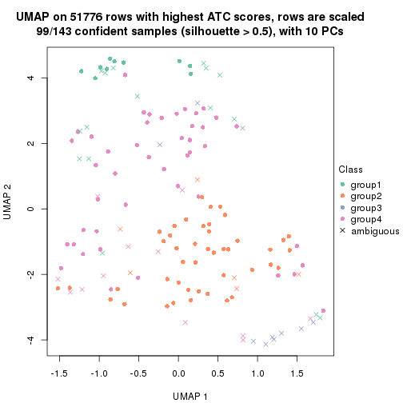</p>

</div>
<div id='tab-ATC-mclust-dimension-reduction-4'>
<pre><code class="r">dimension_reduction(res, k = 5, method = &quot;UMAP&quot;)
</code></pre>

<p></p>

</div>
<div id='tab-ATC-mclust-dimension-reduction-5'>
<pre><code class="r">dimension_reduction(res, k = 6, method = &quot;UMAP&quot;)
</code></pre>

<p></p>

</div>
</div>


Following heatmap shows how subgroups are split when increasing `k`:

```r
collect_classes(res)
```


Test correlation between subgroups and known annotations. If the known
annotation is numeric, one-way ANOVA test is applied, and if the known
annotation is discrete, chi-squared contingency table test is applied.

```r
test_to_known_factors(res)
```

```
#>              n disease.state(p) k
#> ATC:mclust 141           0.8730 2
#> ATC:mclust 129           0.3149 3
#> ATC:mclust  99           0.0428 4
#> ATC:mclust  80           0.0682 5
#> ATC:mclust  67           0.0501 6
```


If matrix rows can be associated to genes, consider to use `GO_Enrichment(res,
...)` to perform function enrichment for the signature genes.


 

---------------------------------------------------


### ATC:NMF*


The object with results only for a single top-value method and a single partition method 
can be extracted as:

```r
res = res_list["ATC", "NMF"]
# you can also extract it by
# res = res_list["ATC:NMF"]
```

A summary of `res` and all the functions that can be applied to it:

```r
res
```

```
#> A 'ConsensusPartition' object with k = 2, 3, 4, 5, 6.
#>   On a matrix with 51776 rows and 143 columns.
#>   Top rows (1000, 2000, 3000, 4000, 5000) are extracted by 'ATC' method.
#>   Subgroups are detected by 'NMF' method.
#>   Performed in total 1250 partitions by row resampling.
#>   Best k for subgroups seems to be 2.
#> 
#> Following methods can be applied to this 'ConsensusPartition' object:
#>  [1] "cola_report"             "collect_classes"         "collect_plots"          
#>  [4] "collect_stats"           "colnames"                "compare_signatures"     
#>  [7] "consensus_heatmap"       "dimension_reduction"     "functional_enrichment"  
#> [10] "get_anno_col"            "get_anno"                "get_classes"            
#> [13] "get_consensus"           "get_matrix"              "get_membership"         
#> [16] "get_param"               "get_signatures"          "get_stats"              
#> [19] "is_best_k"               "is_stable_k"             "membership_heatmap"     
#> [22] "ncol"                    "nrow"                    "plot_ecdf"              
#> [25] "rownames"                "select_partition_number" "show"                   
#> [28] "suggest_best_k"          "test_to_known_factors"
```

`collect_plots()` function collects all the plots made from `res` for all `k` (number of partitions)
into one single page to provide an easy and fast comparison between different `k`.

```r
collect_plots(res)
```


The plots are:

- The first row: a plot of the ECDF (Empirical cumulative distribution
  function) curves of the consensus matrix for each `k` and the heatmap of
  predicted classes for each `k`.
- The second row: heatmaps of the consensus matrix for each `k`.
- The third row: heatmaps of the membership matrix for each `k`.
- The fouth row: heatmaps of the signatures for each `k`.

All the plots in panels can be made by individual functions and they are
plotted later in this section.

`select_partition_number()` produces several plots showing different
statistics for choosing "optimized" `k`. There are following statistics:

- ECDF curves of the consensus matrix for each `k`;
- 1-PAC. [The PAC
  score](https://en.wikipedia.org/wiki/Consensus_clustering#Over-interpretation_potential_of_consensus_clustering)
  measures the proportion of the ambiguous subgrouping.
- Mean silhouette score.
- Concordance. The mean probability of fiting the consensus class ids in all
  partitions.
- Area increased. Denote $A_k$ as the area under the ECDF curve for current
  `k`, the area increased is defined as $A_k - A_{k-1}$.
- Rand index. The percent of pairs of samples that are both in a same cluster
  or both are not in a same cluster in the partition of k and k-1.
- Jaccard index. The ratio of pairs of samples are both in a same cluster in
  the partition of k and k-1 and the pairs of samples are both in a same
  cluster in the partition k or k-1.

The detailed explanations of these statistics can be found in [the cola
vignette](http://bioconductor.org/packages/devel/bioc/vignettes/cola/inst/doc/cola.html#toc_13).

Generally speaking, lower PAC score, higher mean silhouette score or higher
concordance corresponds to better partition. Rand index and Jaccard index
measure how similar the current partition is compared to partition with `k-1`.
If they are too similar, we won't accept `k` is better than `k-1`.

```r
select_partition_number(res)
```


The numeric values for all these statistics can be obtained by `get_stats()`.

```r
get_stats(res)
```

```
#>   k 1-PAC mean_silhouette concordance area_increased  Rand Jaccard
#> 2 2 0.914           0.943       0.975         0.2796 0.719   0.719
#> 3 3 0.423           0.626       0.807         1.0114 0.614   0.481
#> 4 4 0.328           0.584       0.749         0.0675 0.819   0.646
#> 5 5 0.339           0.422       0.693         0.1350 0.740   0.521
#> 6 6 0.420           0.450       0.698         0.0873 0.818   0.563
```

`suggest_best_k()` suggests the best $k$ based on these statistics. The rules are as follows:

- All $k$ with Jaccard index larger than 0.95 are removed because the increase of
  the partition number does not provides enough extra information. If all $k$ are removed,
  the best $k$ is assigned by `NA`.
- For $k$ with 1-PAC larger than 0.9, the maximal $k$ is taken as the "best k". Other $k$ is called "optional k".
- If it does not fit the second rule. The $k$ with the highest vote of highest
  1-PAC, mean silhouette and concordance is taken as the "best k".

```r
suggest_best_k(res)
```

```
#> [1] 2
```


Following shows the table of the partitions (You need to click the **show/hide
code output** link to see it). The membership matrix (columns with name `p*`)
is inferred by
[`clue::cl_consensus()`](https://www.rdocumentation.org/link/cl_consensus?package=clue)
function with the `SE` method. Basically the value in the membership matrix
represents the probability to belong to a certain group. The finall class
label for an item is determined with the group with highest probability it
belongs to.

In `get_classes()` function, the entropy is calculated from the membership
matrix and the silhouette score is calculated from the consensus matrix.


<script>
$( function() {
	$( '#tabs-ATC-NMF-get-classes' ).tabs();
} );
</script>
<div id='tabs-ATC-NMF-get-classes'>
<ul>
<li><a href='#tab-ATC-NMF-get-classes-1'>k = 2</a></li>
<li><a href='#tab-ATC-NMF-get-classes-2'>k = 3</a></li>
<li><a href='#tab-ATC-NMF-get-classes-3'>k = 4</a></li>
<li><a href='#tab-ATC-NMF-get-classes-4'>k = 5</a></li>
<li><a href='#tab-ATC-NMF-get-classes-5'>k = 6</a></li>
</ul>

<div id='tab-ATC-NMF-get-classes-1'>
<p><a id='tab-ATC-NMF-get-classes-1-a' style='color:#0366d6' href='#'>show/hide code output</a></p>
<pre><code class="r">cbind(get_classes(res, k = 2), get_membership(res, k = 2))
</code></pre>

<pre><code>#&gt;           class entropy silhouette    p1    p2
#&gt; GSM550785     2  0.1184      0.969 0.016 0.984
#&gt; GSM550786     2  0.0000      0.983 0.000 1.000
#&gt; GSM550788     2  0.0000      0.983 0.000 1.000
#&gt; GSM550789     2  0.0000      0.983 0.000 1.000
#&gt; GSM550790     1  0.9552      0.473 0.624 0.376
#&gt; GSM550791     2  0.0000      0.983 0.000 1.000
#&gt; GSM550792     2  0.0000      0.983 0.000 1.000
#&gt; GSM550796     2  0.0000      0.983 0.000 1.000
#&gt; GSM550797     2  0.0000      0.983 0.000 1.000
#&gt; GSM550799     2  0.0000      0.983 0.000 1.000
#&gt; GSM550800     2  0.0000      0.983 0.000 1.000
#&gt; GSM550801     2  0.0000      0.983 0.000 1.000
#&gt; GSM550804     2  0.0000      0.983 0.000 1.000
#&gt; GSM550806     2  0.0000      0.983 0.000 1.000
#&gt; GSM550807     2  0.0000      0.983 0.000 1.000
#&gt; GSM550808     2  0.0000      0.983 0.000 1.000
#&gt; GSM550809     2  0.1633      0.962 0.024 0.976
#&gt; GSM550810     2  0.0000      0.983 0.000 1.000
#&gt; GSM550811     2  0.0000      0.983 0.000 1.000
#&gt; GSM550813     2  0.0000      0.983 0.000 1.000
#&gt; GSM550814     2  0.0000      0.983 0.000 1.000
#&gt; GSM550815     2  0.0000      0.983 0.000 1.000
#&gt; GSM550816     2  0.0000      0.983 0.000 1.000
#&gt; GSM550817     2  0.0000      0.983 0.000 1.000
#&gt; GSM550818     2  0.0000      0.983 0.000 1.000
#&gt; GSM550819     2  0.0000      0.983 0.000 1.000
#&gt; GSM550820     2  0.6048      0.819 0.148 0.852
#&gt; GSM550821     2  0.0000      0.983 0.000 1.000
#&gt; GSM550822     2  0.0000      0.983 0.000 1.000
#&gt; GSM550826     2  0.0938      0.973 0.012 0.988
#&gt; GSM550832     2  0.0000      0.983 0.000 1.000
#&gt; GSM550833     2  0.0000      0.983 0.000 1.000
#&gt; GSM550835     2  0.0000      0.983 0.000 1.000
#&gt; GSM550836     1  0.0000      0.918 1.000 0.000
#&gt; GSM550837     2  0.0000      0.983 0.000 1.000
#&gt; GSM550838     2  0.6048      0.819 0.148 0.852
#&gt; GSM550841     2  0.0000      0.983 0.000 1.000
#&gt; GSM550842     2  0.0000      0.983 0.000 1.000
#&gt; GSM550846     2  0.0000      0.983 0.000 1.000
#&gt; GSM550849     2  0.0000      0.983 0.000 1.000
#&gt; GSM550850     2  0.1633      0.962 0.024 0.976
#&gt; GSM550851     2  0.0000      0.983 0.000 1.000
#&gt; GSM550852     2  0.0000      0.983 0.000 1.000
#&gt; GSM550853     2  0.0000      0.983 0.000 1.000
#&gt; GSM550855     2  0.0000      0.983 0.000 1.000
#&gt; GSM550856     2  0.0000      0.983 0.000 1.000
#&gt; GSM550861     2  0.0000      0.983 0.000 1.000
#&gt; GSM550863     2  0.0000      0.983 0.000 1.000
#&gt; GSM550864     2  0.0000      0.983 0.000 1.000
#&gt; GSM550866     2  0.0000      0.983 0.000 1.000
#&gt; GSM550867     1  0.0000      0.918 1.000 0.000
#&gt; GSM550885     1  0.0000      0.918 1.000 0.000
#&gt; GSM550886     2  0.0000      0.983 0.000 1.000
#&gt; GSM550887     2  0.0000      0.983 0.000 1.000
#&gt; GSM550889     2  0.0000      0.983 0.000 1.000
#&gt; GSM550894     2  0.0000      0.983 0.000 1.000
#&gt; GSM550897     2  0.0000      0.983 0.000 1.000
#&gt; GSM550903     2  0.0000      0.983 0.000 1.000
#&gt; GSM550905     2  0.0000      0.983 0.000 1.000
#&gt; GSM550906     2  0.0000      0.983 0.000 1.000
#&gt; GSM550907     2  0.0000      0.983 0.000 1.000
#&gt; GSM550909     2  0.0000      0.983 0.000 1.000
#&gt; GSM550911     2  0.0000      0.983 0.000 1.000
#&gt; GSM550913     2  0.0000      0.983 0.000 1.000
#&gt; GSM550915     2  0.0000      0.983 0.000 1.000
#&gt; GSM550917     2  0.0000      0.983 0.000 1.000
#&gt; GSM550919     2  0.0000      0.983 0.000 1.000
#&gt; GSM550921     1  0.0000      0.918 1.000 0.000
#&gt; GSM550924     2  0.0000      0.983 0.000 1.000
#&gt; GSM550926     2  0.0000      0.983 0.000 1.000
#&gt; GSM550927     2  0.0000      0.983 0.000 1.000
#&gt; GSM550787     2  0.0000      0.983 0.000 1.000
#&gt; GSM550793     1  0.9635      0.443 0.612 0.388
#&gt; GSM550794     2  0.0000      0.983 0.000 1.000
#&gt; GSM550795     2  0.6247      0.808 0.156 0.844
#&gt; GSM550798     1  0.0000      0.918 1.000 0.000
#&gt; GSM550803     1  0.0000      0.918 1.000 0.000
#&gt; GSM550805     2  0.0000      0.983 0.000 1.000
#&gt; GSM550823     2  0.0000      0.983 0.000 1.000
#&gt; GSM550824     1  0.0000      0.918 1.000 0.000
#&gt; GSM550825     1  0.1414      0.908 0.980 0.020
#&gt; GSM550827     2  0.0000      0.983 0.000 1.000
#&gt; GSM550828     2  0.9491      0.370 0.368 0.632
#&gt; GSM550829     1  0.0938      0.912 0.988 0.012
#&gt; GSM550830     2  0.0000      0.983 0.000 1.000
#&gt; GSM550834     2  0.0000      0.983 0.000 1.000
#&gt; GSM550839     2  0.0000      0.983 0.000 1.000
#&gt; GSM550840     2  0.0000      0.983 0.000 1.000
#&gt; GSM550843     2  0.0000      0.983 0.000 1.000
#&gt; GSM550844     2  0.5737      0.835 0.136 0.864
#&gt; GSM550845     2  0.0000      0.983 0.000 1.000
#&gt; GSM550848     2  0.0000      0.983 0.000 1.000
#&gt; GSM550854     1  0.0000      0.918 1.000 0.000
#&gt; GSM550857     1  0.0000      0.918 1.000 0.000
#&gt; GSM550858     1  0.8267      0.680 0.740 0.260
#&gt; GSM550859     1  0.0000      0.918 1.000 0.000
#&gt; GSM550862     1  0.9580      0.463 0.620 0.380
#&gt; GSM550865     2  0.0000      0.983 0.000 1.000
#&gt; GSM550868     2  0.0000      0.983 0.000 1.000
#&gt; GSM550869     2  0.0000      0.983 0.000 1.000
#&gt; GSM550870     2  0.0000      0.983 0.000 1.000
#&gt; GSM550871     2  0.0000      0.983 0.000 1.000
#&gt; GSM550872     2  0.0000      0.983 0.000 1.000
#&gt; GSM550873     2  0.0000      0.983 0.000 1.000
#&gt; GSM550874     2  0.0000      0.983 0.000 1.000
#&gt; GSM550876     2  0.0000      0.983 0.000 1.000
#&gt; GSM550877     2  0.0000      0.983 0.000 1.000
#&gt; GSM550878     2  0.0000      0.983 0.000 1.000
#&gt; GSM550879     2  0.0938      0.973 0.012 0.988
#&gt; GSM550882     2  0.2948      0.934 0.052 0.948
#&gt; GSM550888     1  0.0000      0.918 1.000 0.000
#&gt; GSM550890     2  0.0000      0.983 0.000 1.000
#&gt; GSM550891     1  0.4562      0.854 0.904 0.096
#&gt; GSM550892     2  0.6623      0.785 0.172 0.828
#&gt; GSM550893     2  0.0000      0.983 0.000 1.000
#&gt; GSM550895     2  0.0000      0.983 0.000 1.000
#&gt; GSM550896     2  0.0000      0.983 0.000 1.000
#&gt; GSM550898     1  0.0000      0.918 1.000 0.000
#&gt; GSM550899     2  0.0000      0.983 0.000 1.000
#&gt; GSM550900     2  0.0000      0.983 0.000 1.000
#&gt; GSM550901     2  0.0000      0.983 0.000 1.000
#&gt; GSM550902     2  0.0000      0.983 0.000 1.000
#&gt; GSM550904     1  0.8499      0.657 0.724 0.276
#&gt; GSM550908     1  0.0000      0.918 1.000 0.000
#&gt; GSM550912     2  0.0000      0.983 0.000 1.000
#&gt; GSM550914     2  0.0000      0.983 0.000 1.000
#&gt; GSM550918     2  0.0000      0.983 0.000 1.000
#&gt; GSM550922     2  0.0000      0.983 0.000 1.000
#&gt; GSM550923     1  0.0000      0.918 1.000 0.000
#&gt; GSM550925     2  0.5629      0.840 0.132 0.868
#&gt; GSM550802     2  0.0000      0.983 0.000 1.000
#&gt; GSM550812     2  0.0000      0.983 0.000 1.000
#&gt; GSM550831     2  0.1843      0.958 0.028 0.972
#&gt; GSM550847     1  0.0000      0.918 1.000 0.000
#&gt; GSM550860     2  0.0000      0.983 0.000 1.000
#&gt; GSM550875     2  0.0000      0.983 0.000 1.000
#&gt; GSM550880     2  0.0000      0.983 0.000 1.000
#&gt; GSM550881     2  0.7745      0.692 0.228 0.772
#&gt; GSM550883     1  0.0000      0.918 1.000 0.000
#&gt; GSM550884     2  0.0000      0.983 0.000 1.000
#&gt; GSM550910     2  0.0000      0.983 0.000 1.000
#&gt; GSM550916     2  0.6438      0.796 0.164 0.836
#&gt; GSM550920     2  0.0000      0.983 0.000 1.000
</code></pre>

<script>
$('#tab-ATC-NMF-get-classes-1-a').parent().next().next().hide();
$('#tab-ATC-NMF-get-classes-1-a').click(function(){
  $('#tab-ATC-NMF-get-classes-1-a').parent().next().next().toggle();
  return(false);
});
</script>
</div>

<div id='tab-ATC-NMF-get-classes-2'>
<p><a id='tab-ATC-NMF-get-classes-2-a' style='color:#0366d6' href='#'>show/hide code output</a></p>
<pre><code class="r">cbind(get_classes(res, k = 3), get_membership(res, k = 3))
</code></pre>

<pre><code>#&gt;           class entropy silhouette    p1    p2    p3
#&gt; GSM550785     1  0.6936     0.5339 0.672 0.044 0.284
#&gt; GSM550786     2  0.5178     0.6210 0.256 0.744 0.000
#&gt; GSM550788     2  0.6140     0.2799 0.404 0.596 0.000
#&gt; GSM550789     2  0.5678     0.5273 0.316 0.684 0.000
#&gt; GSM550790     3  0.4861     0.7370 0.180 0.012 0.808
#&gt; GSM550791     2  0.8659     0.0301 0.408 0.488 0.104
#&gt; GSM550792     1  0.5016     0.6752 0.760 0.240 0.000
#&gt; GSM550796     2  0.3192     0.7467 0.112 0.888 0.000
#&gt; GSM550797     2  0.2261     0.7578 0.068 0.932 0.000
#&gt; GSM550799     1  0.6305     0.2135 0.516 0.484 0.000
#&gt; GSM550800     2  0.5678     0.5281 0.316 0.684 0.000
#&gt; GSM550801     1  0.6291     0.2769 0.532 0.468 0.000
#&gt; GSM550804     2  0.6225     0.1637 0.432 0.568 0.000
#&gt; GSM550806     1  0.6095     0.4872 0.608 0.392 0.000
#&gt; GSM550807     1  0.6111     0.4813 0.604 0.396 0.000
#&gt; GSM550808     2  0.0424     0.7514 0.008 0.992 0.000
#&gt; GSM550809     2  0.1129     0.7349 0.004 0.976 0.020
#&gt; GSM550810     2  0.1289     0.7586 0.032 0.968 0.000
#&gt; GSM550811     1  0.6286     0.2896 0.536 0.464 0.000
#&gt; GSM550813     1  0.3619     0.7130 0.864 0.136 0.000
#&gt; GSM550814     1  0.6204     0.3979 0.576 0.424 0.000
#&gt; GSM550815     2  0.0747     0.7544 0.016 0.984 0.000
#&gt; GSM550816     2  0.0424     0.7514 0.008 0.992 0.000
#&gt; GSM550817     2  0.0237     0.7491 0.004 0.996 0.000
#&gt; GSM550818     2  0.0424     0.7514 0.008 0.992 0.000
#&gt; GSM550819     2  0.6008     0.3822 0.372 0.628 0.000
#&gt; GSM550820     3  0.8769     0.2014 0.348 0.124 0.528
#&gt; GSM550821     2  0.6026     0.3731 0.376 0.624 0.000
#&gt; GSM550822     2  0.0747     0.7544 0.016 0.984 0.000
#&gt; GSM550826     1  0.9425     0.3804 0.488 0.200 0.312
#&gt; GSM550832     1  0.5968     0.5432 0.636 0.364 0.000
#&gt; GSM550833     2  0.5497     0.5703 0.292 0.708 0.000
#&gt; GSM550835     1  0.5291     0.6549 0.732 0.268 0.000
#&gt; GSM550836     3  0.0000     0.8885 0.000 0.000 1.000
#&gt; GSM550837     2  0.3038     0.7502 0.104 0.896 0.000
#&gt; GSM550838     2  0.2590     0.6840 0.004 0.924 0.072
#&gt; GSM550841     2  0.0424     0.7514 0.008 0.992 0.000
#&gt; GSM550842     2  0.1289     0.7586 0.032 0.968 0.000
#&gt; GSM550846     2  0.6308    -0.1328 0.492 0.508 0.000
#&gt; GSM550849     2  0.0237     0.7491 0.004 0.996 0.000
#&gt; GSM550850     2  0.0983     0.7382 0.004 0.980 0.016
#&gt; GSM550851     2  0.2878     0.7526 0.096 0.904 0.000
#&gt; GSM550852     2  0.3551     0.7354 0.132 0.868 0.000
#&gt; GSM550853     2  0.4235     0.7059 0.176 0.824 0.000
#&gt; GSM550855     2  0.4062     0.7151 0.164 0.836 0.000
#&gt; GSM550856     1  0.5810     0.5856 0.664 0.336 0.000
#&gt; GSM550861     1  0.5431     0.6398 0.716 0.284 0.000
#&gt; GSM550863     1  0.4346     0.7003 0.816 0.184 0.000
#&gt; GSM550864     1  0.1753     0.7152 0.952 0.048 0.000
#&gt; GSM550866     1  0.4842     0.6834 0.776 0.224 0.000
#&gt; GSM550867     3  0.0000     0.8885 0.000 0.000 1.000
#&gt; GSM550885     3  0.0000     0.8885 0.000 0.000 1.000
#&gt; GSM550886     1  0.1031     0.7097 0.976 0.024 0.000
#&gt; GSM550887     2  0.5621     0.5437 0.308 0.692 0.000
#&gt; GSM550889     1  0.0237     0.6962 0.996 0.004 0.000
#&gt; GSM550894     1  0.6111     0.4719 0.604 0.396 0.000
#&gt; GSM550897     1  0.0237     0.7011 0.996 0.004 0.000
#&gt; GSM550903     1  0.6280     0.3056 0.540 0.460 0.000
#&gt; GSM550905     1  0.6111     0.4708 0.604 0.396 0.000
#&gt; GSM550906     1  0.6260     0.3298 0.552 0.448 0.000
#&gt; GSM550907     2  0.1163     0.7577 0.028 0.972 0.000
#&gt; GSM550909     2  0.1411     0.7590 0.036 0.964 0.000
#&gt; GSM550911     2  0.0424     0.7514 0.008 0.992 0.000
#&gt; GSM550913     2  0.5882     0.4564 0.348 0.652 0.000
#&gt; GSM550915     2  0.5098     0.6354 0.248 0.752 0.000
#&gt; GSM550917     1  0.3879     0.7092 0.848 0.152 0.000
#&gt; GSM550919     1  0.1289     0.7117 0.968 0.032 0.000
#&gt; GSM550921     3  0.0000     0.8885 0.000 0.000 1.000
#&gt; GSM550924     1  0.2537     0.7180 0.920 0.080 0.000
#&gt; GSM550926     1  0.1529     0.7136 0.960 0.040 0.000
#&gt; GSM550927     1  0.6204     0.4141 0.576 0.424 0.000
#&gt; GSM550787     1  0.5363     0.6495 0.724 0.276 0.000
#&gt; GSM550793     1  0.3030     0.6469 0.904 0.004 0.092
#&gt; GSM550794     1  0.6291     0.2768 0.532 0.468 0.000
#&gt; GSM550795     1  0.7382     0.1206 0.512 0.032 0.456
#&gt; GSM550798     3  0.0000     0.8885 0.000 0.000 1.000
#&gt; GSM550803     3  0.0237     0.8865 0.000 0.004 0.996
#&gt; GSM550805     1  0.6252     0.3572 0.556 0.444 0.000
#&gt; GSM550823     1  0.6260     0.3445 0.552 0.448 0.000
#&gt; GSM550824     3  0.0000     0.8885 0.000 0.000 1.000
#&gt; GSM550825     3  0.6267     0.4082 0.452 0.000 0.548
#&gt; GSM550827     1  0.0424     0.7026 0.992 0.008 0.000
#&gt; GSM550828     3  0.5763     0.5927 0.276 0.008 0.716
#&gt; GSM550829     3  0.0000     0.8885 0.000 0.000 1.000
#&gt; GSM550830     1  0.2165     0.7169 0.936 0.064 0.000
#&gt; GSM550834     2  0.6148     0.4170 0.356 0.640 0.004
#&gt; GSM550839     2  0.2878     0.7530 0.096 0.904 0.000
#&gt; GSM550840     2  0.0237     0.7491 0.004 0.996 0.000
#&gt; GSM550843     1  0.6225     0.3920 0.568 0.432 0.000
#&gt; GSM550844     1  0.2584     0.6885 0.928 0.008 0.064
#&gt; GSM550845     1  0.0747     0.7062 0.984 0.016 0.000
#&gt; GSM550848     1  0.5098     0.6705 0.752 0.248 0.000
#&gt; GSM550854     3  0.0000     0.8885 0.000 0.000 1.000
#&gt; GSM550857     3  0.0000     0.8885 0.000 0.000 1.000
#&gt; GSM550858     3  0.4682     0.7309 0.192 0.004 0.804
#&gt; GSM550859     3  0.0000     0.8885 0.000 0.000 1.000
#&gt; GSM550862     1  0.3532     0.6357 0.884 0.008 0.108
#&gt; GSM550865     1  0.0237     0.7008 0.996 0.004 0.000
#&gt; GSM550868     1  0.0424     0.7026 0.992 0.008 0.000
#&gt; GSM550869     2  0.5178     0.6256 0.256 0.744 0.000
#&gt; GSM550870     1  0.1643     0.7145 0.956 0.044 0.000
#&gt; GSM550871     1  0.5497     0.6398 0.708 0.292 0.000
#&gt; GSM550872     1  0.5678     0.6099 0.684 0.316 0.000
#&gt; GSM550873     2  0.6252     0.1119 0.444 0.556 0.000
#&gt; GSM550874     1  0.5905     0.5610 0.648 0.352 0.000
#&gt; GSM550876     1  0.5785     0.5899 0.668 0.332 0.000
#&gt; GSM550877     1  0.3551     0.7134 0.868 0.132 0.000
#&gt; GSM550878     1  0.1411     0.7134 0.964 0.036 0.000
#&gt; GSM550879     1  0.5167     0.6312 0.792 0.016 0.192
#&gt; GSM550882     1  0.0475     0.6941 0.992 0.004 0.004
#&gt; GSM550888     3  0.0000     0.8885 0.000 0.000 1.000
#&gt; GSM550890     1  0.6095     0.4840 0.608 0.392 0.000
#&gt; GSM550891     3  0.5378     0.6775 0.008 0.236 0.756
#&gt; GSM550892     1  0.0848     0.6989 0.984 0.008 0.008
#&gt; GSM550893     1  0.5327     0.6456 0.728 0.272 0.000
#&gt; GSM550895     1  0.0000     0.6990 1.000 0.000 0.000
#&gt; GSM550896     1  0.5098     0.6701 0.752 0.248 0.000
#&gt; GSM550898     3  0.0000     0.8885 0.000 0.000 1.000
#&gt; GSM550899     1  0.5835     0.5803 0.660 0.340 0.000
#&gt; GSM550900     1  0.2711     0.7178 0.912 0.088 0.000
#&gt; GSM550901     2  0.6244     0.1249 0.440 0.560 0.000
#&gt; GSM550902     1  0.6719     0.6791 0.744 0.160 0.096
#&gt; GSM550904     1  0.2711     0.6345 0.912 0.000 0.088
#&gt; GSM550908     3  0.0000     0.8885 0.000 0.000 1.000
#&gt; GSM550912     1  0.5968     0.5416 0.636 0.364 0.000
#&gt; GSM550914     2  0.5733     0.5201 0.324 0.676 0.000
#&gt; GSM550918     1  0.4504     0.6950 0.804 0.196 0.000
#&gt; GSM550922     1  0.5926     0.5491 0.644 0.356 0.000
#&gt; GSM550923     3  0.0000     0.8885 0.000 0.000 1.000
#&gt; GSM550925     1  0.0661     0.6915 0.988 0.004 0.008
#&gt; GSM550802     2  0.2711     0.7551 0.088 0.912 0.000
#&gt; GSM550812     2  0.0237     0.7491 0.004 0.996 0.000
#&gt; GSM550831     2  0.1399     0.7288 0.004 0.968 0.028
#&gt; GSM550847     3  0.0000     0.8885 0.000 0.000 1.000
#&gt; GSM550860     1  0.0424     0.7026 0.992 0.008 0.000
#&gt; GSM550875     1  0.1163     0.7104 0.972 0.028 0.000
#&gt; GSM550880     1  0.2796     0.7172 0.908 0.092 0.000
#&gt; GSM550881     1  0.0747     0.6889 0.984 0.000 0.016
#&gt; GSM550883     3  0.0592     0.8834 0.012 0.000 0.988
#&gt; GSM550884     1  0.0000     0.6990 1.000 0.000 0.000
#&gt; GSM550910     2  0.1753     0.7592 0.048 0.952 0.000
#&gt; GSM550916     3  0.6680     0.0506 0.484 0.008 0.508
#&gt; GSM550920     1  0.0000     0.6990 1.000 0.000 0.000
</code></pre>

<script>
$('#tab-ATC-NMF-get-classes-2-a').parent().next().next().hide();
$('#tab-ATC-NMF-get-classes-2-a').click(function(){
  $('#tab-ATC-NMF-get-classes-2-a').parent().next().next().toggle();
  return(false);
});
</script>
</div>

<div id='tab-ATC-NMF-get-classes-3'>
<p><a id='tab-ATC-NMF-get-classes-3-a' style='color:#0366d6' href='#'>show/hide code output</a></p>
<pre><code class="r">cbind(get_classes(res, k = 4), get_membership(res, k = 4))
</code></pre>

<pre><code>#&gt;           class entropy silhouette    p1    p2    p3    p4
#&gt; GSM550785     4  0.8232     0.4362 0.108 0.100 0.240 0.552
#&gt; GSM550786     2  0.5244     0.2529 0.000 0.600 0.012 0.388
#&gt; GSM550788     4  0.6534     0.5697 0.000 0.220 0.148 0.632
#&gt; GSM550789     4  0.5728     0.4212 0.000 0.364 0.036 0.600
#&gt; GSM550790     1  0.6892     0.3845 0.656 0.028 0.184 0.132
#&gt; GSM550791     4  0.8635     0.2582 0.212 0.280 0.052 0.456
#&gt; GSM550792     4  0.5476     0.6887 0.000 0.144 0.120 0.736
#&gt; GSM550796     2  0.5244     0.3756 0.000 0.600 0.012 0.388
#&gt; GSM550797     2  0.4158     0.7002 0.000 0.768 0.008 0.224
#&gt; GSM550799     4  0.6245     0.6258 0.000 0.164 0.168 0.668
#&gt; GSM550800     4  0.5050     0.3633 0.000 0.408 0.004 0.588
#&gt; GSM550801     4  0.5182     0.5629 0.000 0.288 0.028 0.684
#&gt; GSM550804     4  0.4964     0.4233 0.000 0.380 0.004 0.616
#&gt; GSM550806     4  0.5581     0.6957 0.000 0.132 0.140 0.728
#&gt; GSM550807     4  0.4872     0.6162 0.000 0.244 0.028 0.728
#&gt; GSM550808     2  0.1807     0.7043 0.000 0.940 0.008 0.052
#&gt; GSM550809     2  0.1585     0.6327 0.004 0.952 0.040 0.004
#&gt; GSM550810     2  0.4004     0.7324 0.000 0.812 0.024 0.164
#&gt; GSM550811     4  0.5628     0.3721 0.000 0.420 0.024 0.556
#&gt; GSM550813     4  0.2489     0.7099 0.000 0.020 0.068 0.912
#&gt; GSM550814     4  0.4724     0.6862 0.000 0.136 0.076 0.788
#&gt; GSM550815     2  0.3464     0.7213 0.000 0.860 0.032 0.108
#&gt; GSM550816     2  0.1557     0.7126 0.000 0.944 0.000 0.056
#&gt; GSM550817     2  0.1520     0.6714 0.000 0.956 0.024 0.020
#&gt; GSM550818     2  0.2797     0.7043 0.000 0.900 0.032 0.068
#&gt; GSM550819     4  0.5070     0.3563 0.000 0.416 0.004 0.580
#&gt; GSM550820     2  0.9594     0.1112 0.224 0.400 0.188 0.188
#&gt; GSM550821     4  0.5150     0.3966 0.000 0.396 0.008 0.596
#&gt; GSM550822     2  0.2973     0.7226 0.000 0.884 0.020 0.096
#&gt; GSM550826     4  0.9698     0.1530 0.260 0.208 0.168 0.364
#&gt; GSM550832     4  0.5122     0.6700 0.000 0.164 0.080 0.756
#&gt; GSM550833     4  0.5112     0.2860 0.000 0.436 0.004 0.560
#&gt; GSM550835     4  0.4608     0.6968 0.000 0.096 0.104 0.800
#&gt; GSM550836     1  0.0000     0.7705 1.000 0.000 0.000 0.000
#&gt; GSM550837     2  0.4391     0.6675 0.000 0.740 0.008 0.252
#&gt; GSM550838     2  0.4305     0.5077 0.044 0.816 0.136 0.004
#&gt; GSM550841     2  0.2563     0.7140 0.000 0.908 0.020 0.072
#&gt; GSM550842     2  0.3577     0.7349 0.000 0.832 0.012 0.156
#&gt; GSM550846     4  0.5869     0.4699 0.000 0.360 0.044 0.596
#&gt; GSM550849     2  0.1677     0.7043 0.000 0.948 0.012 0.040
#&gt; GSM550850     2  0.3432     0.6236 0.020 0.872 0.096 0.012
#&gt; GSM550851     2  0.4452     0.6524 0.000 0.732 0.008 0.260
#&gt; GSM550852     2  0.4248     0.6724 0.000 0.768 0.012 0.220
#&gt; GSM550853     2  0.5257     0.1776 0.000 0.548 0.008 0.444
#&gt; GSM550855     2  0.5119     0.1891 0.000 0.556 0.004 0.440
#&gt; GSM550856     4  0.4636     0.6633 0.000 0.188 0.040 0.772
#&gt; GSM550861     4  0.4840     0.6939 0.000 0.100 0.116 0.784
#&gt; GSM550863     4  0.3320     0.7136 0.000 0.068 0.056 0.876
#&gt; GSM550864     4  0.1174     0.7106 0.000 0.012 0.020 0.968
#&gt; GSM550866     4  0.3474     0.7099 0.000 0.064 0.068 0.868
#&gt; GSM550867     1  0.0707     0.7718 0.980 0.000 0.020 0.000
#&gt; GSM550885     1  0.0000     0.7705 1.000 0.000 0.000 0.000
#&gt; GSM550886     4  0.2222     0.7053 0.000 0.016 0.060 0.924
#&gt; GSM550887     4  0.6706     0.4751 0.000 0.288 0.124 0.588
#&gt; GSM550889     4  0.4049     0.6155 0.008 0.000 0.212 0.780
#&gt; GSM550894     4  0.5003     0.6892 0.000 0.084 0.148 0.768
#&gt; GSM550897     4  0.2805     0.6799 0.012 0.000 0.100 0.888
#&gt; GSM550903     4  0.5985     0.6404 0.000 0.168 0.140 0.692
#&gt; GSM550905     4  0.5576     0.6722 0.000 0.096 0.184 0.720
#&gt; GSM550906     4  0.5477     0.6719 0.000 0.092 0.180 0.728
#&gt; GSM550907     2  0.6719     0.5305 0.000 0.608 0.240 0.152
#&gt; GSM550909     2  0.3803     0.7317 0.000 0.836 0.032 0.132
#&gt; GSM550911     2  0.2706     0.6202 0.000 0.900 0.080 0.020
#&gt; GSM550913     4  0.6280     0.4956 0.000 0.304 0.084 0.612
#&gt; GSM550915     4  0.5933     0.1886 0.000 0.464 0.036 0.500
#&gt; GSM550917     4  0.2214     0.7140 0.000 0.044 0.028 0.928
#&gt; GSM550919     4  0.1256     0.7079 0.000 0.008 0.028 0.964
#&gt; GSM550921     1  0.2647     0.6231 0.880 0.000 0.120 0.000
#&gt; GSM550924     4  0.1820     0.7088 0.000 0.020 0.036 0.944
#&gt; GSM550926     4  0.1174     0.7100 0.000 0.012 0.020 0.968
#&gt; GSM550927     4  0.5662     0.6028 0.000 0.236 0.072 0.692
#&gt; GSM550787     4  0.4605     0.7123 0.000 0.072 0.132 0.796
#&gt; GSM550793     4  0.6935     0.3744 0.132 0.012 0.240 0.616
#&gt; GSM550794     4  0.6324     0.4016 0.000 0.400 0.064 0.536
#&gt; GSM550795     4  0.9471     0.1587 0.264 0.124 0.224 0.388
#&gt; GSM550798     1  0.1940     0.7475 0.924 0.000 0.076 0.000
#&gt; GSM550803     1  0.2976     0.7090 0.872 0.008 0.120 0.000
#&gt; GSM550805     4  0.6081     0.6104 0.000 0.260 0.088 0.652
#&gt; GSM550823     4  0.6369     0.4860 0.000 0.352 0.076 0.572
#&gt; GSM550824     1  0.0188     0.7715 0.996 0.000 0.004 0.000
#&gt; GSM550825     1  0.7552     0.0025 0.440 0.004 0.164 0.392
#&gt; GSM550827     4  0.2271     0.6965 0.000 0.008 0.076 0.916
#&gt; GSM550828     1  0.9283     0.0675 0.424 0.112 0.236 0.228
#&gt; GSM550829     1  0.3647     0.6711 0.832 0.016 0.152 0.000
#&gt; GSM550830     4  0.2888     0.6770 0.000 0.004 0.124 0.872
#&gt; GSM550834     2  0.5805    -0.0826 0.012 0.516 0.012 0.460
#&gt; GSM550839     2  0.3626     0.7282 0.000 0.812 0.004 0.184
#&gt; GSM550840     2  0.3485     0.6370 0.000 0.856 0.116 0.028
#&gt; GSM550843     4  0.4973     0.4889 0.000 0.348 0.008 0.644
#&gt; GSM550844     4  0.5697     0.6055 0.064 0.012 0.204 0.720
#&gt; GSM550845     4  0.2197     0.6944 0.000 0.004 0.080 0.916
#&gt; GSM550848     4  0.4224     0.7029 0.000 0.144 0.044 0.812
#&gt; GSM550854     1  0.2530     0.7232 0.888 0.000 0.112 0.000
#&gt; GSM550857     1  0.0000     0.7705 1.000 0.000 0.000 0.000
#&gt; GSM550858     1  0.5170     0.4575 0.764 0.008 0.064 0.164
#&gt; GSM550859     1  0.0188     0.7715 0.996 0.000 0.004 0.000
#&gt; GSM550862     4  0.6405     0.4692 0.132 0.004 0.204 0.660
#&gt; GSM550865     4  0.2408     0.6834 0.000 0.000 0.104 0.896
#&gt; GSM550868     4  0.2918     0.6799 0.000 0.008 0.116 0.876
#&gt; GSM550869     4  0.5950     0.2485 0.000 0.416 0.040 0.544
#&gt; GSM550870     4  0.0779     0.7086 0.000 0.004 0.016 0.980
#&gt; GSM550871     4  0.6071     0.6464 0.000 0.172 0.144 0.684
#&gt; GSM550872     4  0.6509     0.6173 0.000 0.228 0.140 0.632
#&gt; GSM550873     4  0.6261     0.2822 0.000 0.440 0.056 0.504
#&gt; GSM550874     4  0.4410     0.7061 0.000 0.128 0.064 0.808
#&gt; GSM550876     4  0.3647     0.7059 0.000 0.108 0.040 0.852
#&gt; GSM550877     4  0.2402     0.7071 0.000 0.012 0.076 0.912
#&gt; GSM550878     4  0.1940     0.7045 0.000 0.000 0.076 0.924
#&gt; GSM550879     4  0.6050     0.5996 0.176 0.012 0.104 0.708
#&gt; GSM550882     4  0.4364     0.5730 0.016 0.000 0.220 0.764
#&gt; GSM550888     1  0.0000     0.7705 1.000 0.000 0.000 0.000
#&gt; GSM550890     4  0.5050     0.6921 0.000 0.176 0.068 0.756
#&gt; GSM550891     3  0.5684     0.0000 0.252 0.032 0.696 0.020
#&gt; GSM550892     4  0.4426     0.6205 0.020 0.004 0.196 0.780
#&gt; GSM550893     4  0.4842     0.6761 0.000 0.048 0.192 0.760
#&gt; GSM550895     4  0.2149     0.6879 0.000 0.000 0.088 0.912
#&gt; GSM550896     4  0.3399     0.7137 0.000 0.092 0.040 0.868
#&gt; GSM550898     1  0.1118     0.7678 0.964 0.000 0.036 0.000
#&gt; GSM550899     4  0.5109     0.6550 0.000 0.196 0.060 0.744
#&gt; GSM550900     4  0.2198     0.6964 0.000 0.008 0.072 0.920
#&gt; GSM550901     4  0.5488     0.2373 0.000 0.452 0.016 0.532
#&gt; GSM550902     4  0.6555     0.6494 0.076 0.064 0.156 0.704
#&gt; GSM550904     4  0.5849     0.4857 0.164 0.000 0.132 0.704
#&gt; GSM550908     1  0.1389     0.7291 0.952 0.000 0.048 0.000
#&gt; GSM550912     4  0.5006     0.6933 0.000 0.104 0.124 0.772
#&gt; GSM550914     4  0.5898     0.4718 0.000 0.348 0.048 0.604
#&gt; GSM550918     4  0.3758     0.7069 0.000 0.048 0.104 0.848
#&gt; GSM550922     4  0.5719     0.6643 0.000 0.132 0.152 0.716
#&gt; GSM550923     1  0.0469     0.7678 0.988 0.000 0.012 0.000
#&gt; GSM550925     4  0.5218     0.5425 0.064 0.000 0.200 0.736
#&gt; GSM550802     2  0.3626     0.7173 0.000 0.812 0.004 0.184
#&gt; GSM550812     2  0.1356     0.6979 0.000 0.960 0.008 0.032
#&gt; GSM550831     2  0.3232     0.6333 0.028 0.888 0.072 0.012
#&gt; GSM550847     1  0.0921     0.7699 0.972 0.000 0.028 0.000
#&gt; GSM550860     4  0.2973     0.6603 0.000 0.000 0.144 0.856
#&gt; GSM550875     4  0.4644     0.6280 0.004 0.024 0.208 0.764
#&gt; GSM550880     4  0.2335     0.7082 0.000 0.020 0.060 0.920
#&gt; GSM550881     4  0.4542     0.6104 0.088 0.000 0.108 0.804
#&gt; GSM550883     1  0.2546     0.6960 0.912 0.000 0.060 0.028
#&gt; GSM550884     4  0.2149     0.6874 0.000 0.000 0.088 0.912
#&gt; GSM550910     2  0.5578     0.5482 0.000 0.648 0.040 0.312
#&gt; GSM550916     4  0.7329     0.1380 0.416 0.008 0.120 0.456
#&gt; GSM550920     4  0.1302     0.7024 0.000 0.000 0.044 0.956
</code></pre>

<script>
$('#tab-ATC-NMF-get-classes-3-a').parent().next().next().hide();
$('#tab-ATC-NMF-get-classes-3-a').click(function(){
  $('#tab-ATC-NMF-get-classes-3-a').parent().next().next().toggle();
  return(false);
});
</script>
</div>

<div id='tab-ATC-NMF-get-classes-4'>
<p><a id='tab-ATC-NMF-get-classes-4-a' style='color:#0366d6' href='#'>show/hide code output</a></p>
<pre><code class="r">cbind(get_classes(res, k = 5), get_membership(res, k = 5))
</code></pre>

<pre><code>#&gt;           class entropy silhouette    p1    p2    p3    p4    p5
#&gt; GSM550785     4  0.7932     0.4672 0.044 0.272 0.132 0.492 0.060
#&gt; GSM550786     2  0.4691     0.4106 0.000 0.684 0.008 0.028 0.280
#&gt; GSM550788     2  0.6677     0.2865 0.000 0.624 0.116 0.132 0.128
#&gt; GSM550789     2  0.2352     0.5955 0.000 0.896 0.004 0.008 0.092
#&gt; GSM550790     4  0.6389    -0.2040 0.436 0.016 0.048 0.472 0.028
#&gt; GSM550791     2  0.7727    -0.1808 0.300 0.488 0.052 0.124 0.036
#&gt; GSM550792     2  0.4532     0.4799 0.000 0.672 0.004 0.304 0.020
#&gt; GSM550796     2  0.3737     0.5049 0.000 0.764 0.008 0.004 0.224
#&gt; GSM550797     2  0.4540     0.2916 0.000 0.640 0.000 0.020 0.340
#&gt; GSM550799     2  0.6087     0.3634 0.000 0.672 0.148 0.108 0.072
#&gt; GSM550800     2  0.3388     0.5398 0.000 0.792 0.000 0.008 0.200
#&gt; GSM550801     2  0.1731     0.6014 0.000 0.932 0.004 0.004 0.060
#&gt; GSM550804     2  0.3578     0.6060 0.000 0.820 0.000 0.048 0.132
#&gt; GSM550806     4  0.5579     0.4405 0.000 0.408 0.020 0.536 0.036
#&gt; GSM550807     2  0.1341     0.6035 0.000 0.944 0.000 0.000 0.056
#&gt; GSM550808     5  0.2964     0.6597 0.000 0.152 0.004 0.004 0.840
#&gt; GSM550809     5  0.2157     0.5888 0.000 0.036 0.040 0.004 0.920
#&gt; GSM550810     2  0.4414     0.2418 0.000 0.616 0.004 0.004 0.376
#&gt; GSM550811     2  0.3710     0.6144 0.012 0.840 0.008 0.040 0.100
#&gt; GSM550813     2  0.3649     0.4914 0.000 0.808 0.040 0.152 0.000
#&gt; GSM550814     2  0.2492     0.6075 0.000 0.908 0.024 0.048 0.020
#&gt; GSM550815     5  0.4533     0.2833 0.000 0.448 0.008 0.000 0.544
#&gt; GSM550816     5  0.3087     0.6605 0.000 0.152 0.004 0.008 0.836
#&gt; GSM550817     5  0.1605     0.5874 0.000 0.040 0.012 0.004 0.944
#&gt; GSM550818     5  0.3883     0.6235 0.000 0.244 0.004 0.008 0.744
#&gt; GSM550819     2  0.4670     0.5538 0.000 0.724 0.000 0.076 0.200
#&gt; GSM550820     1  0.9333     0.0357 0.328 0.124 0.096 0.160 0.292
#&gt; GSM550821     2  0.3867     0.5951 0.000 0.804 0.004 0.048 0.144
#&gt; GSM550822     5  0.4473     0.3864 0.000 0.412 0.008 0.000 0.580
#&gt; GSM550826     2  0.8183    -0.1828 0.288 0.464 0.112 0.092 0.044
#&gt; GSM550832     2  0.1978     0.5909 0.000 0.932 0.032 0.024 0.012
#&gt; GSM550833     2  0.3053     0.5652 0.000 0.828 0.000 0.008 0.164
#&gt; GSM550835     2  0.1668     0.5901 0.000 0.940 0.032 0.028 0.000
#&gt; GSM550836     1  0.0000     0.7604 1.000 0.000 0.000 0.000 0.000
#&gt; GSM550837     2  0.4698     0.3395 0.000 0.664 0.004 0.028 0.304
#&gt; GSM550838     5  0.5475     0.4767 0.020 0.048 0.120 0.068 0.744
#&gt; GSM550841     5  0.3690     0.6559 0.000 0.224 0.012 0.000 0.764
#&gt; GSM550842     2  0.4362     0.2714 0.000 0.632 0.004 0.004 0.360
#&gt; GSM550846     2  0.5768     0.3904 0.000 0.560 0.012 0.360 0.068
#&gt; GSM550849     5  0.3631     0.6461 0.000 0.144 0.024 0.012 0.820
#&gt; GSM550850     5  0.5003     0.5307 0.028 0.044 0.084 0.060 0.784
#&gt; GSM550851     2  0.4620     0.2966 0.000 0.652 0.000 0.028 0.320
#&gt; GSM550852     5  0.6508     0.3024 0.000 0.392 0.016 0.124 0.468
#&gt; GSM550853     2  0.4181     0.4177 0.000 0.712 0.000 0.020 0.268
#&gt; GSM550855     2  0.3861     0.4332 0.000 0.712 0.000 0.004 0.284
#&gt; GSM550856     2  0.1915     0.6110 0.000 0.928 0.000 0.032 0.040
#&gt; GSM550861     2  0.1469     0.5951 0.000 0.948 0.036 0.016 0.000
#&gt; GSM550863     2  0.4430     0.4181 0.000 0.628 0.012 0.360 0.000
#&gt; GSM550864     2  0.2787     0.5868 0.000 0.856 0.004 0.136 0.004
#&gt; GSM550866     2  0.2054     0.5816 0.000 0.920 0.028 0.052 0.000
#&gt; GSM550867     1  0.1043     0.7460 0.960 0.000 0.000 0.040 0.000
#&gt; GSM550885     1  0.0000     0.7604 1.000 0.000 0.000 0.000 0.000
#&gt; GSM550886     2  0.4791     0.4128 0.000 0.616 0.008 0.360 0.016
#&gt; GSM550887     2  0.3307     0.6089 0.000 0.844 0.052 0.000 0.104
#&gt; GSM550889     4  0.6195     0.4831 0.012 0.304 0.108 0.572 0.004
#&gt; GSM550894     2  0.3242     0.6015 0.000 0.852 0.076 0.072 0.000
#&gt; GSM550897     4  0.5579     0.5156 0.040 0.348 0.024 0.588 0.000
#&gt; GSM550903     2  0.2158     0.5914 0.000 0.920 0.052 0.020 0.008
#&gt; GSM550905     2  0.4071     0.5815 0.000 0.808 0.072 0.108 0.012
#&gt; GSM550906     2  0.5233     0.3458 0.000 0.696 0.136 0.164 0.004
#&gt; GSM550907     2  0.6538     0.0955 0.000 0.508 0.108 0.028 0.356
#&gt; GSM550909     5  0.5109     0.1237 0.000 0.460 0.000 0.036 0.504
#&gt; GSM550911     5  0.2152     0.5644 0.000 0.032 0.032 0.012 0.924
#&gt; GSM550913     2  0.2928     0.6102 0.000 0.872 0.032 0.004 0.092
#&gt; GSM550915     2  0.6739     0.3681 0.000 0.540 0.032 0.276 0.152
#&gt; GSM550917     2  0.3213     0.5823 0.000 0.836 0.004 0.144 0.016
#&gt; GSM550919     2  0.4313     0.5119 0.000 0.716 0.008 0.260 0.016
#&gt; GSM550921     1  0.3774     0.3407 0.704 0.000 0.296 0.000 0.000
#&gt; GSM550924     2  0.4852     0.3919 0.000 0.596 0.008 0.380 0.016
#&gt; GSM550926     2  0.3783     0.5468 0.000 0.768 0.004 0.216 0.012
#&gt; GSM550927     2  0.2659     0.6125 0.000 0.888 0.000 0.060 0.052
#&gt; GSM550787     4  0.5267     0.4428 0.000 0.428 0.032 0.532 0.008
#&gt; GSM550793     4  0.7519     0.4401 0.088 0.216 0.108 0.560 0.028
#&gt; GSM550794     2  0.6350     0.3262 0.000 0.540 0.004 0.268 0.188
#&gt; GSM550795     1  0.8898    -0.0853 0.388 0.248 0.132 0.188 0.044
#&gt; GSM550798     1  0.0771     0.7571 0.976 0.000 0.020 0.004 0.000
#&gt; GSM550803     1  0.2859     0.7060 0.876 0.000 0.096 0.012 0.016
#&gt; GSM550805     4  0.6023     0.4195 0.000 0.428 0.036 0.492 0.044
#&gt; GSM550823     4  0.5774     0.4506 0.000 0.368 0.004 0.544 0.084
#&gt; GSM550824     1  0.0000     0.7604 1.000 0.000 0.000 0.000 0.000
#&gt; GSM550825     4  0.6706     0.1826 0.276 0.088 0.052 0.576 0.008
#&gt; GSM550827     2  0.3737     0.5472 0.000 0.764 0.008 0.224 0.004
#&gt; GSM550828     1  0.8393     0.1775 0.404 0.044 0.108 0.336 0.108
#&gt; GSM550829     1  0.3716     0.6782 0.836 0.004 0.108 0.036 0.016
#&gt; GSM550830     4  0.4810     0.4768 0.000 0.400 0.012 0.580 0.008
#&gt; GSM550834     2  0.6146     0.3122 0.104 0.620 0.004 0.024 0.248
#&gt; GSM550839     5  0.4253     0.5486 0.000 0.332 0.004 0.004 0.660
#&gt; GSM550840     5  0.6421     0.3360 0.000 0.064 0.124 0.180 0.632
#&gt; GSM550843     2  0.3420     0.6115 0.000 0.840 0.000 0.076 0.084
#&gt; GSM550844     2  0.8630    -0.3933 0.256 0.380 0.128 0.216 0.020
#&gt; GSM550845     2  0.3928     0.4926 0.000 0.700 0.004 0.296 0.000
#&gt; GSM550848     2  0.4846     0.4578 0.000 0.644 0.012 0.324 0.020
#&gt; GSM550854     1  0.3454     0.6870 0.848 0.000 0.100 0.036 0.016
#&gt; GSM550857     1  0.0000     0.7604 1.000 0.000 0.000 0.000 0.000
#&gt; GSM550858     1  0.5271     0.4883 0.728 0.152 0.040 0.080 0.000
#&gt; GSM550859     1  0.0000     0.7604 1.000 0.000 0.000 0.000 0.000
#&gt; GSM550862     4  0.6493     0.2332 0.296 0.108 0.036 0.560 0.000
#&gt; GSM550865     4  0.5140     0.3804 0.000 0.428 0.020 0.540 0.012
#&gt; GSM550868     2  0.4951     0.3206 0.000 0.556 0.012 0.420 0.012
#&gt; GSM550869     2  0.6633     0.1846 0.000 0.548 0.048 0.100 0.304
#&gt; GSM550870     2  0.2574     0.5546 0.000 0.876 0.012 0.112 0.000
#&gt; GSM550871     4  0.6550     0.4057 0.000 0.332 0.084 0.536 0.048
#&gt; GSM550872     2  0.6145     0.3466 0.000 0.564 0.048 0.336 0.052
#&gt; GSM550873     2  0.6152    -0.0626 0.000 0.536 0.012 0.348 0.104
#&gt; GSM550874     2  0.4893    -0.1310 0.000 0.580 0.016 0.396 0.008
#&gt; GSM550876     2  0.5131     0.0603 0.000 0.532 0.024 0.436 0.008
#&gt; GSM550877     2  0.3209     0.5659 0.000 0.848 0.028 0.120 0.004
#&gt; GSM550878     2  0.4477     0.4896 0.000 0.708 0.040 0.252 0.000
#&gt; GSM550879     2  0.6891     0.0865 0.200 0.448 0.008 0.340 0.004
#&gt; GSM550882     4  0.6181     0.3345 0.012 0.208 0.180 0.600 0.000
#&gt; GSM550888     1  0.0000     0.7604 1.000 0.000 0.000 0.000 0.000
#&gt; GSM550890     2  0.6451     0.2412 0.000 0.480 0.044 0.408 0.068
#&gt; GSM550891     3  0.3744     0.0000 0.100 0.012 0.840 0.036 0.012
#&gt; GSM550892     4  0.7789     0.3825 0.128 0.256 0.084 0.508 0.024
#&gt; GSM550893     2  0.6356     0.0745 0.000 0.572 0.232 0.184 0.012
#&gt; GSM550895     2  0.5087     0.2626 0.000 0.516 0.012 0.456 0.016
#&gt; GSM550896     2  0.4065     0.5314 0.000 0.720 0.000 0.264 0.016
#&gt; GSM550898     1  0.0162     0.7603 0.996 0.000 0.004 0.000 0.000
#&gt; GSM550899     2  0.1588     0.5993 0.000 0.948 0.016 0.008 0.028
#&gt; GSM550900     2  0.4645     0.3354 0.000 0.564 0.008 0.424 0.004
#&gt; GSM550901     2  0.4325     0.5383 0.000 0.736 0.000 0.044 0.220
#&gt; GSM550902     2  0.8486    -0.0928 0.192 0.396 0.080 0.296 0.036
#&gt; GSM550904     4  0.6833    -0.0326 0.408 0.144 0.008 0.428 0.012
#&gt; GSM550908     1  0.1544     0.7191 0.932 0.000 0.068 0.000 0.000
#&gt; GSM550912     2  0.3463     0.5637 0.000 0.820 0.016 0.156 0.008
#&gt; GSM550914     2  0.6992     0.3439 0.000 0.492 0.036 0.312 0.160
#&gt; GSM550918     2  0.3256     0.5723 0.000 0.832 0.004 0.148 0.016
#&gt; GSM550922     2  0.2629     0.6059 0.000 0.896 0.032 0.064 0.008
#&gt; GSM550923     1  0.1341     0.7361 0.944 0.000 0.000 0.056 0.000
#&gt; GSM550925     4  0.7596     0.2582 0.028 0.260 0.276 0.424 0.012
#&gt; GSM550802     5  0.4481     0.3681 0.000 0.416 0.000 0.008 0.576
#&gt; GSM550812     5  0.2414     0.6281 0.000 0.080 0.008 0.012 0.900
#&gt; GSM550831     5  0.4193     0.5569 0.032 0.040 0.068 0.028 0.832
#&gt; GSM550847     1  0.1059     0.7556 0.968 0.004 0.008 0.020 0.000
#&gt; GSM550860     4  0.4180     0.4922 0.000 0.220 0.036 0.744 0.000
#&gt; GSM550875     2  0.7028    -0.4365 0.008 0.420 0.128 0.416 0.028
#&gt; GSM550880     2  0.4789     0.4042 0.000 0.608 0.004 0.368 0.020
#&gt; GSM550881     4  0.7777     0.2720 0.292 0.300 0.032 0.364 0.012
#&gt; GSM550883     1  0.5609     0.3059 0.584 0.020 0.024 0.360 0.012
#&gt; GSM550884     4  0.4981    -0.0988 0.000 0.440 0.012 0.536 0.012
#&gt; GSM550910     2  0.4936     0.1678 0.000 0.564 0.012 0.012 0.412
#&gt; GSM550916     4  0.5212     0.2156 0.152 0.064 0.020 0.744 0.020
#&gt; GSM550920     2  0.3944     0.4985 0.000 0.720 0.004 0.272 0.004
</code></pre>

<script>
$('#tab-ATC-NMF-get-classes-4-a').parent().next().next().hide();
$('#tab-ATC-NMF-get-classes-4-a').click(function(){
  $('#tab-ATC-NMF-get-classes-4-a').parent().next().next().toggle();
  return(false);
});
</script>
</div>

<div id='tab-ATC-NMF-get-classes-5'>
<p><a id='tab-ATC-NMF-get-classes-5-a' style='color:#0366d6' href='#'>show/hide code output</a></p>
<pre><code class="r">cbind(get_classes(res, k = 6), get_membership(res, k = 6))
</code></pre>

<pre><code>#&gt;           class entropy silhouette    p1    p2    p3    p4    p5    p6
#&gt; GSM550785     4  0.4079     0.5657 0.020 0.032 0.020 0.824 0.040 0.064
#&gt; GSM550786     2  0.4044     0.6403 0.000 0.796 0.004 0.076 0.096 0.028
#&gt; GSM550788     2  0.7141     0.2221 0.000 0.468 0.176 0.260 0.016 0.080
#&gt; GSM550789     2  0.2024     0.6677 0.000 0.924 0.008 0.036 0.020 0.012
#&gt; GSM550790     1  0.7358    -0.0326 0.316 0.012 0.004 0.312 0.052 0.304
#&gt; GSM550791     2  0.6910     0.2968 0.224 0.528 0.012 0.176 0.020 0.040
#&gt; GSM550792     2  0.6339    -0.1828 0.000 0.448 0.000 0.224 0.020 0.308
#&gt; GSM550796     2  0.2879     0.6603 0.000 0.872 0.016 0.024 0.080 0.008
#&gt; GSM550797     2  0.4225     0.6123 0.000 0.760 0.012 0.028 0.176 0.024
#&gt; GSM550799     2  0.6528     0.3877 0.000 0.564 0.148 0.212 0.016 0.060
#&gt; GSM550800     2  0.3352     0.6645 0.000 0.840 0.000 0.060 0.076 0.024
#&gt; GSM550801     2  0.1363     0.6670 0.000 0.952 0.004 0.028 0.004 0.012
#&gt; GSM550804     2  0.2655     0.6357 0.000 0.884 0.000 0.020 0.036 0.060
#&gt; GSM550806     4  0.4144     0.6419 0.000 0.156 0.028 0.776 0.016 0.024
#&gt; GSM550807     2  0.0914     0.6627 0.000 0.968 0.000 0.016 0.000 0.016
#&gt; GSM550808     5  0.3771     0.5326 0.000 0.252 0.004 0.004 0.728 0.012
#&gt; GSM550809     5  0.1679     0.5454 0.000 0.012 0.000 0.036 0.936 0.016
#&gt; GSM550810     2  0.3825     0.5992 0.000 0.764 0.008 0.012 0.200 0.016
#&gt; GSM550811     2  0.3932     0.6259 0.036 0.824 0.000 0.032 0.056 0.052
#&gt; GSM550813     2  0.5087     0.5616 0.000 0.688 0.056 0.192 0.000 0.064
#&gt; GSM550814     2  0.2476     0.6654 0.000 0.892 0.004 0.060 0.004 0.040
#&gt; GSM550815     2  0.4329     0.3816 0.000 0.624 0.008 0.004 0.352 0.012
#&gt; GSM550816     5  0.2958     0.5746 0.000 0.160 0.000 0.008 0.824 0.008
#&gt; GSM550817     5  0.1406     0.5447 0.000 0.020 0.008 0.004 0.952 0.016
#&gt; GSM550818     5  0.3533     0.5555 0.000 0.196 0.000 0.008 0.776 0.020
#&gt; GSM550819     2  0.4785     0.5045 0.000 0.712 0.000 0.020 0.120 0.148
#&gt; GSM550820     5  0.9040    -0.1352 0.232 0.124 0.012 0.152 0.264 0.216
#&gt; GSM550821     2  0.3074     0.6283 0.000 0.856 0.000 0.016 0.060 0.068
#&gt; GSM550822     2  0.4409     0.3159 0.000 0.596 0.008 0.004 0.380 0.012
#&gt; GSM550826     2  0.7098     0.0386 0.344 0.448 0.016 0.128 0.044 0.020
#&gt; GSM550832     2  0.2822     0.6558 0.000 0.864 0.004 0.096 0.004 0.032
#&gt; GSM550833     2  0.2895     0.6610 0.000 0.876 0.004 0.044 0.052 0.024
#&gt; GSM550835     2  0.3147     0.6529 0.000 0.844 0.012 0.100 0.000 0.044
#&gt; GSM550836     1  0.0260     0.7268 0.992 0.000 0.008 0.000 0.000 0.000
#&gt; GSM550837     2  0.4708     0.6151 0.000 0.748 0.016 0.056 0.144 0.036
#&gt; GSM550838     5  0.5400     0.4203 0.004 0.060 0.020 0.228 0.664 0.024
#&gt; GSM550841     5  0.4589     0.2776 0.000 0.388 0.008 0.004 0.580 0.020
#&gt; GSM550842     2  0.3622     0.6090 0.000 0.788 0.008 0.020 0.176 0.008
#&gt; GSM550846     6  0.5420     0.4486 0.000 0.396 0.004 0.016 0.064 0.520
#&gt; GSM550849     5  0.4864     0.5321 0.000 0.124 0.012 0.084 0.740 0.040
#&gt; GSM550850     5  0.4099     0.4551 0.020 0.008 0.012 0.104 0.804 0.052
#&gt; GSM550851     2  0.4559     0.6286 0.000 0.768 0.020 0.064 0.116 0.032
#&gt; GSM550852     2  0.6832    -0.2048 0.000 0.352 0.004 0.296 0.316 0.032
#&gt; GSM550853     2  0.4173     0.6434 0.000 0.788 0.008 0.064 0.112 0.028
#&gt; GSM550855     2  0.3856     0.6461 0.000 0.796 0.004 0.052 0.132 0.016
#&gt; GSM550856     2  0.1983     0.6455 0.000 0.908 0.000 0.020 0.000 0.072
#&gt; GSM550861     2  0.2138     0.6618 0.000 0.908 0.004 0.052 0.000 0.036
#&gt; GSM550863     6  0.5253     0.5112 0.000 0.364 0.000 0.060 0.020 0.556
#&gt; GSM550864     2  0.2822     0.6314 0.000 0.852 0.000 0.040 0.000 0.108
#&gt; GSM550866     2  0.3127     0.6495 0.000 0.840 0.004 0.100 0.000 0.056
#&gt; GSM550867     1  0.1693     0.7122 0.932 0.020 0.000 0.004 0.000 0.044
#&gt; GSM550885     1  0.0000     0.7282 1.000 0.000 0.000 0.000 0.000 0.000
#&gt; GSM550886     2  0.4096    -0.1558 0.000 0.508 0.000 0.008 0.000 0.484
#&gt; GSM550887     2  0.1604     0.6667 0.000 0.944 0.024 0.016 0.008 0.008
#&gt; GSM550889     4  0.5563     0.6113 0.008 0.084 0.116 0.684 0.000 0.108
#&gt; GSM550894     2  0.3623     0.6372 0.000 0.820 0.028 0.056 0.000 0.096
#&gt; GSM550897     4  0.6565     0.5946 0.116 0.108 0.016 0.584 0.000 0.176
#&gt; GSM550903     2  0.2508     0.6628 0.000 0.892 0.012 0.068 0.004 0.024
#&gt; GSM550905     2  0.2585     0.6429 0.000 0.880 0.024 0.012 0.000 0.084
#&gt; GSM550906     2  0.6335     0.4161 0.000 0.572 0.140 0.212 0.004 0.072
#&gt; GSM550907     2  0.5652     0.4916 0.000 0.676 0.080 0.012 0.144 0.088
#&gt; GSM550909     2  0.5959     0.0763 0.000 0.432 0.004 0.008 0.412 0.144
#&gt; GSM550911     5  0.2982     0.4977 0.000 0.016 0.036 0.012 0.872 0.064
#&gt; GSM550913     2  0.1353     0.6675 0.000 0.952 0.024 0.012 0.012 0.000
#&gt; GSM550915     6  0.5605     0.4237 0.000 0.392 0.024 0.004 0.068 0.512
#&gt; GSM550917     2  0.2547     0.6290 0.000 0.868 0.004 0.016 0.000 0.112
#&gt; GSM550919     2  0.3582     0.4728 0.000 0.732 0.000 0.016 0.000 0.252
#&gt; GSM550921     1  0.4230     0.2067 0.612 0.000 0.364 0.000 0.000 0.024
#&gt; GSM550924     6  0.4912     0.4163 0.000 0.408 0.004 0.044 0.004 0.540
#&gt; GSM550926     2  0.4212     0.4349 0.000 0.688 0.000 0.048 0.000 0.264
#&gt; GSM550927     2  0.2393     0.6377 0.000 0.884 0.004 0.020 0.000 0.092
#&gt; GSM550787     4  0.5206     0.6133 0.000 0.176 0.036 0.692 0.008 0.088
#&gt; GSM550793     4  0.2741     0.6125 0.032 0.040 0.008 0.892 0.004 0.024
#&gt; GSM550794     4  0.6579     0.3108 0.000 0.208 0.000 0.540 0.108 0.144
#&gt; GSM550795     1  0.8308     0.1682 0.388 0.180 0.020 0.264 0.060 0.088
#&gt; GSM550798     1  0.0291     0.7280 0.992 0.000 0.004 0.004 0.000 0.000
#&gt; GSM550803     1  0.3218     0.6743 0.856 0.000 0.020 0.080 0.032 0.012
#&gt; GSM550805     4  0.3627     0.6631 0.000 0.152 0.000 0.796 0.012 0.040
#&gt; GSM550823     4  0.4430     0.6464 0.000 0.076 0.004 0.772 0.048 0.100
#&gt; GSM550824     1  0.0000     0.7282 1.000 0.000 0.000 0.000 0.000 0.000
#&gt; GSM550825     4  0.4648     0.5068 0.184 0.024 0.004 0.724 0.000 0.064
#&gt; GSM550827     2  0.4460     0.2850 0.000 0.644 0.000 0.052 0.000 0.304
#&gt; GSM550828     1  0.7931     0.0486 0.324 0.000 0.016 0.248 0.168 0.244
#&gt; GSM550829     1  0.2569     0.6978 0.896 0.004 0.016 0.060 0.008 0.016
#&gt; GSM550830     4  0.3757     0.6548 0.000 0.084 0.000 0.780 0.000 0.136
#&gt; GSM550834     2  0.6268     0.4683 0.164 0.620 0.000 0.080 0.116 0.020
#&gt; GSM550839     5  0.5109     0.1834 0.000 0.424 0.000 0.032 0.516 0.028
#&gt; GSM550840     5  0.4803     0.2046 0.000 0.008 0.008 0.408 0.552 0.024
#&gt; GSM550843     2  0.3179     0.6129 0.000 0.848 0.000 0.028 0.032 0.092
#&gt; GSM550844     1  0.7033     0.1042 0.440 0.168 0.016 0.328 0.008 0.040
#&gt; GSM550845     2  0.5703    -0.1973 0.000 0.472 0.000 0.168 0.000 0.360
#&gt; GSM550848     2  0.4238     0.0527 0.000 0.580 0.000 0.008 0.008 0.404
#&gt; GSM550854     1  0.2900     0.6735 0.856 0.000 0.016 0.112 0.004 0.012
#&gt; GSM550857     1  0.0146     0.7277 0.996 0.000 0.004 0.000 0.000 0.000
#&gt; GSM550858     1  0.4219     0.5641 0.764 0.060 0.012 0.156 0.000 0.008
#&gt; GSM550859     1  0.0146     0.7281 0.996 0.000 0.004 0.000 0.000 0.000
#&gt; GSM550862     6  0.6403    -0.1052 0.260 0.016 0.000 0.320 0.000 0.404
#&gt; GSM550865     4  0.4664     0.6365 0.000 0.152 0.012 0.724 0.004 0.108
#&gt; GSM550868     6  0.5068     0.5817 0.000 0.272 0.000 0.104 0.004 0.620
#&gt; GSM550869     2  0.8073     0.0393 0.000 0.404 0.072 0.232 0.184 0.108
#&gt; GSM550870     2  0.4294     0.5831 0.000 0.728 0.004 0.188 0.000 0.080
#&gt; GSM550871     4  0.5485     0.4736 0.000 0.132 0.004 0.676 0.056 0.132
#&gt; GSM550872     2  0.7067    -0.4575 0.000 0.336 0.004 0.300 0.052 0.308
#&gt; GSM550873     4  0.5652     0.3261 0.000 0.380 0.004 0.520 0.068 0.028
#&gt; GSM550874     4  0.5507     0.3209 0.000 0.376 0.044 0.532 0.000 0.048
#&gt; GSM550876     4  0.6371     0.2094 0.000 0.268 0.012 0.472 0.008 0.240
#&gt; GSM550877     2  0.4435     0.5756 0.000 0.720 0.004 0.176 0.000 0.100
#&gt; GSM550878     2  0.6870     0.0281 0.000 0.460 0.076 0.232 0.000 0.232
#&gt; GSM550879     6  0.6786     0.5054 0.252 0.304 0.004 0.016 0.012 0.412
#&gt; GSM550882     4  0.6879     0.3937 0.008 0.064 0.204 0.484 0.000 0.240
#&gt; GSM550888     1  0.0260     0.7268 0.992 0.000 0.008 0.000 0.000 0.000
#&gt; GSM550890     6  0.4743     0.4840 0.000 0.152 0.032 0.000 0.092 0.724
#&gt; GSM550891     3  0.2001     0.0000 0.032 0.000 0.924 0.012 0.004 0.028
#&gt; GSM550892     6  0.7489     0.1831 0.084 0.144 0.016 0.364 0.012 0.380
#&gt; GSM550893     2  0.7322     0.0764 0.000 0.444 0.168 0.220 0.004 0.164
#&gt; GSM550895     6  0.4631     0.5659 0.000 0.200 0.008 0.092 0.000 0.700
#&gt; GSM550896     2  0.4362     0.2893 0.000 0.628 0.004 0.020 0.004 0.344
#&gt; GSM550898     1  0.0000     0.7282 1.000 0.000 0.000 0.000 0.000 0.000
#&gt; GSM550899     2  0.2058     0.6645 0.000 0.908 0.000 0.056 0.000 0.036
#&gt; GSM550900     6  0.5403     0.5626 0.000 0.248 0.004 0.156 0.000 0.592
#&gt; GSM550901     2  0.4042     0.6121 0.004 0.792 0.000 0.024 0.112 0.068
#&gt; GSM550902     6  0.8403     0.3980 0.168 0.236 0.020 0.216 0.024 0.336
#&gt; GSM550904     6  0.5898     0.0479 0.404 0.064 0.000 0.056 0.000 0.476
#&gt; GSM550908     1  0.1444     0.6971 0.928 0.000 0.072 0.000 0.000 0.000
#&gt; GSM550912     2  0.5845     0.3870 0.000 0.588 0.024 0.148 0.004 0.236
#&gt; GSM550914     6  0.6885     0.5306 0.000 0.312 0.044 0.044 0.112 0.488
#&gt; GSM550918     2  0.2930     0.6268 0.000 0.840 0.000 0.036 0.000 0.124
#&gt; GSM550922     2  0.2252     0.6491 0.000 0.900 0.012 0.016 0.000 0.072
#&gt; GSM550923     1  0.2234     0.6769 0.872 0.000 0.000 0.004 0.000 0.124
#&gt; GSM550925     4  0.7665     0.2297 0.016 0.104 0.252 0.344 0.000 0.284
#&gt; GSM550802     5  0.5106     0.1344 0.000 0.440 0.000 0.040 0.500 0.020
#&gt; GSM550812     5  0.1710     0.5582 0.000 0.028 0.000 0.020 0.936 0.016
#&gt; GSM550831     5  0.3406     0.5005 0.016 0.008 0.016 0.044 0.856 0.060
#&gt; GSM550847     1  0.0692     0.7265 0.976 0.000 0.004 0.020 0.000 0.000
#&gt; GSM550860     4  0.4770     0.5520 0.000 0.036 0.032 0.664 0.000 0.268
#&gt; GSM550875     4  0.4916     0.6154 0.040 0.124 0.016 0.756 0.020 0.044
#&gt; GSM550880     6  0.5535     0.3553 0.000 0.424 0.008 0.088 0.004 0.476
#&gt; GSM550881     1  0.7555    -0.1382 0.372 0.168 0.024 0.100 0.000 0.336
#&gt; GSM550883     1  0.4994     0.2749 0.508 0.004 0.008 0.040 0.000 0.440
#&gt; GSM550884     6  0.4706     0.4865 0.000 0.156 0.004 0.144 0.000 0.696
#&gt; GSM550910     2  0.5559     0.4494 0.000 0.584 0.012 0.012 0.304 0.088
#&gt; GSM550916     6  0.6548    -0.2194 0.036 0.000 0.016 0.340 0.132 0.476
#&gt; GSM550920     2  0.5632    -0.0774 0.000 0.496 0.004 0.136 0.000 0.364
</code></pre>

<script>
$('#tab-ATC-NMF-get-classes-5-a').parent().next().next().hide();
$('#tab-ATC-NMF-get-classes-5-a').click(function(){
  $('#tab-ATC-NMF-get-classes-5-a').parent().next().next().toggle();
  return(false);
});
</script>
</div>
</div>

Heatmaps for the consensus matrix. It visualizes the probability of two
samples to be in a same group.


<script>
$( function() {
	$( '#tabs-ATC-NMF-consensus-heatmap' ).tabs();
} );
</script>
<div id='tabs-ATC-NMF-consensus-heatmap'>
<ul>
<li><a href='#tab-ATC-NMF-consensus-heatmap-1'>k = 2</a></li>
<li><a href='#tab-ATC-NMF-consensus-heatmap-2'>k = 3</a></li>
<li><a href='#tab-ATC-NMF-consensus-heatmap-3'>k = 4</a></li>
<li><a href='#tab-ATC-NMF-consensus-heatmap-4'>k = 5</a></li>
<li><a href='#tab-ATC-NMF-consensus-heatmap-5'>k = 6</a></li>
</ul>
<div id='tab-ATC-NMF-consensus-heatmap-1'>
<pre><code class="r">consensus_heatmap(res, k = 2)
</code></pre>

<p></p>

</div>
<div id='tab-ATC-NMF-consensus-heatmap-2'>
<pre><code class="r">consensus_heatmap(res, k = 3)
</code></pre>

<p></p>

</div>
<div id='tab-ATC-NMF-consensus-heatmap-3'>
<pre><code class="r">consensus_heatmap(res, k = 4)
</code></pre>

<p></p>

</div>
<div id='tab-ATC-NMF-consensus-heatmap-4'>
<pre><code class="r">consensus_heatmap(res, k = 5)
</code></pre>

<p></p>

</div>
<div id='tab-ATC-NMF-consensus-heatmap-5'>
<pre><code class="r">consensus_heatmap(res, k = 6)
</code></pre>

<p></p>

</div>
</div>

Heatmaps for the membership of samples in all partitions to see how consistent they are:


<script>
$( function() {
	$( '#tabs-ATC-NMF-membership-heatmap' ).tabs();
} );
</script>
<div id='tabs-ATC-NMF-membership-heatmap'>
<ul>
<li><a href='#tab-ATC-NMF-membership-heatmap-1'>k = 2</a></li>
<li><a href='#tab-ATC-NMF-membership-heatmap-2'>k = 3</a></li>
<li><a href='#tab-ATC-NMF-membership-heatmap-3'>k = 4</a></li>
<li><a href='#tab-ATC-NMF-membership-heatmap-4'>k = 5</a></li>
<li><a href='#tab-ATC-NMF-membership-heatmap-5'>k = 6</a></li>
</ul>
<div id='tab-ATC-NMF-membership-heatmap-1'>
<pre><code class="r">membership_heatmap(res, k = 2)
</code></pre>

<p></p>

</div>
<div id='tab-ATC-NMF-membership-heatmap-2'>
<pre><code class="r">membership_heatmap(res, k = 3)
</code></pre>

<p></p>

</div>
<div id='tab-ATC-NMF-membership-heatmap-3'>
<pre><code class="r">membership_heatmap(res, k = 4)
</code></pre>

<p></p>

</div>
<div id='tab-ATC-NMF-membership-heatmap-4'>
<pre><code class="r">membership_heatmap(res, k = 5)
</code></pre>

<p></p>

</div>
<div id='tab-ATC-NMF-membership-heatmap-5'>
<pre><code class="r">membership_heatmap(res, k = 6)
</code></pre>

<p></p>

</div>
</div>

As soon as we have had the classes for columns, we can look for signatures
which are significantly different between classes which can be candidate marks
for certain classes. Following are the heatmaps for signatures.


Signature heatmaps where rows are scaled:


<script>
$( function() {
	$( '#tabs-ATC-NMF-get-signatures' ).tabs();
} );
</script>
<div id='tabs-ATC-NMF-get-signatures'>
<ul>
<li><a href='#tab-ATC-NMF-get-signatures-1'>k = 2</a></li>
<li><a href='#tab-ATC-NMF-get-signatures-2'>k = 3</a></li>
<li><a href='#tab-ATC-NMF-get-signatures-3'>k = 4</a></li>
<li><a href='#tab-ATC-NMF-get-signatures-4'>k = 5</a></li>
<li><a href='#tab-ATC-NMF-get-signatures-5'>k = 6</a></li>
</ul>
<div id='tab-ATC-NMF-get-signatures-1'>
<pre><code class="r">get_signatures(res, k = 2)
</code></pre>

<p></p>

</div>
<div id='tab-ATC-NMF-get-signatures-2'>
<pre><code class="r">get_signatures(res, k = 3)
</code></pre>

<p></p>

</div>
<div id='tab-ATC-NMF-get-signatures-3'>
<pre><code class="r">get_signatures(res, k = 4)
</code></pre>

<p></p>

</div>
<div id='tab-ATC-NMF-get-signatures-4'>
<pre><code class="r">get_signatures(res, k = 5)
</code></pre>

<p></p>

</div>
<div id='tab-ATC-NMF-get-signatures-5'>
<pre><code class="r">get_signatures(res, k = 6)
</code></pre>

<p></p>

</div>
</div>


Signature heatmaps where rows are not scaled:


<script>
$( function() {
	$( '#tabs-ATC-NMF-get-signatures-no-scale' ).tabs();
} );
</script>
<div id='tabs-ATC-NMF-get-signatures-no-scale'>
<ul>
<li><a href='#tab-ATC-NMF-get-signatures-no-scale-1'>k = 2</a></li>
<li><a href='#tab-ATC-NMF-get-signatures-no-scale-2'>k = 3</a></li>
<li><a href='#tab-ATC-NMF-get-signatures-no-scale-3'>k = 4</a></li>
<li><a href='#tab-ATC-NMF-get-signatures-no-scale-4'>k = 5</a></li>
<li><a href='#tab-ATC-NMF-get-signatures-no-scale-5'>k = 6</a></li>
</ul>
<div id='tab-ATC-NMF-get-signatures-no-scale-1'>
<pre><code class="r">get_signatures(res, k = 2, scale_rows = FALSE)
</code></pre>

<p></p>

</div>
<div id='tab-ATC-NMF-get-signatures-no-scale-2'>
<pre><code class="r">get_signatures(res, k = 3, scale_rows = FALSE)
</code></pre>

<p></p>

</div>
<div id='tab-ATC-NMF-get-signatures-no-scale-3'>
<pre><code class="r">get_signatures(res, k = 4, scale_rows = FALSE)
</code></pre>

<p></p>

</div>
<div id='tab-ATC-NMF-get-signatures-no-scale-4'>
<pre><code class="r">get_signatures(res, k = 5, scale_rows = FALSE)
</code></pre>

<p></p>

</div>
<div id='tab-ATC-NMF-get-signatures-no-scale-5'>
<pre><code class="r">get_signatures(res, k = 6, scale_rows = FALSE)
</code></pre>

<p></p>

</div>
</div>


Compare the overlap of signatures from different k:

```r
compare_signatures(res)
```

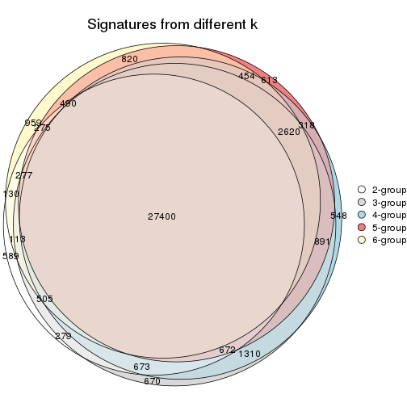

`get_signature()` returns a data frame invisibly. TO get the list of signatures, the function
call should be assigned to a variable explicitly. In following code, if `plot` argument is set
to `FALSE`, no heatmap is plotted while only the differential analysis is performed.

```r
# code only for demonstration
tb = get_signature(res, k = ..., plot = FALSE)
```

An example of the output of `tb` is:

```
#>   which_row         fdr    mean_1    mean_2 scaled_mean_1 scaled_mean_2 km
#> 1        38 0.042760348  8.373488  9.131774    -0.5533452     0.5164555  1
#> 2        40 0.018707592  7.106213  8.469186    -0.6173731     0.5762149  1
#> 3        55 0.019134737 10.221463 11.207825    -0.6159697     0.5749050  1
#> 4        59 0.006059896  5.921854  7.869574    -0.6899429     0.6439467  1
#> 5        60 0.018055526  8.928898 10.211722    -0.6204761     0.5791110  1
#> 6        98 0.009384629 15.714769 14.887706     0.6635654    -0.6193277  2
...
```

The columns in `tb` are:

1. `which_row`: row indices corresponding to the input matrix.
2. `fdr`: FDR for the differential test. 
3. `mean_x`: The mean value in group x.
4. `scaled_mean_x`: The mean value in group x after rows are scaled.
5. `km`: Row groups if k-means clustering is applied to rows.


UMAP plot which shows how samples are separated.


<script>
$( function() {
	$( '#tabs-ATC-NMF-dimension-reduction' ).tabs();
} );
</script>
<div id='tabs-ATC-NMF-dimension-reduction'>
<ul>
<li><a href='#tab-ATC-NMF-dimension-reduction-1'>k = 2</a></li>
<li><a href='#tab-ATC-NMF-dimension-reduction-2'>k = 3</a></li>
<li><a href='#tab-ATC-NMF-dimension-reduction-3'>k = 4</a></li>
<li><a href='#tab-ATC-NMF-dimension-reduction-4'>k = 5</a></li>
<li><a href='#tab-ATC-NMF-dimension-reduction-5'>k = 6</a></li>
</ul>
<div id='tab-ATC-NMF-dimension-reduction-1'>
<pre><code class="r">dimension_reduction(res, k = 2, method = &quot;UMAP&quot;)
</code></pre>

<p></p>

</div>
<div id='tab-ATC-NMF-dimension-reduction-2'>
<pre><code class="r">dimension_reduction(res, k = 3, method = &quot;UMAP&quot;)
</code></pre>

<p></p>

</div>
<div id='tab-ATC-NMF-dimension-reduction-3'>
<pre><code class="r">dimension_reduction(res, k = 4, method = &quot;UMAP&quot;)
</code></pre>

<p></p>

</div>
<div id='tab-ATC-NMF-dimension-reduction-4'>
<pre><code class="r">dimension_reduction(res, k = 5, method = &quot;UMAP&quot;)
</code></pre>

<p></p>

</div>
<div id='tab-ATC-NMF-dimension-reduction-5'>
<pre><code class="r">dimension_reduction(res, k = 6, method = &quot;UMAP&quot;)
</code></pre>

<p></p>

</div>
</div>


Following heatmap shows how subgroups are split when increasing `k`:

```r
collect_classes(res)
```


Test correlation between subgroups and known annotations. If the known
annotation is numeric, one-way ANOVA test is applied, and if the known
annotation is discrete, chi-squared contingency table test is applied.

```r
test_to_known_factors(res)
```

```
#>           n disease.state(p) k
#> ATC:NMF 139         4.58e-03 2
#> ATC:NMF 112         1.71e-05 3
#> ATC:NMF 106         1.42e-03 4
#> ATC:NMF  64         1.96e-03 5
#> ATC:NMF  83         3.88e-06 6
```


If matrix rows can be associated to genes, consider to use `GO_Enrichment(res,
...)` to perform function enrichment for the signature genes.


 

## Session info


```r
sessionInfo()
```

```
#> R version 3.6.0 (2019-04-26)
#> Platform: x86_64-pc-linux-gnu (64-bit)
#> Running under: CentOS Linux 7 (Core)
#> 
#> Matrix products: default
#> BLAS:   /usr/lib64/libblas.so.3.4.2
#> LAPACK: /usr/lib64/liblapack.so.3.4.2
#> 
#> locale:
#>  [1] LC_CTYPE=en_GB.UTF-8       LC_NUMERIC=C               LC_TIME=en_GB.UTF-8       
#>  [4] LC_COLLATE=en_GB.UTF-8     LC_MONETARY=en_GB.UTF-8    LC_MESSAGES=en_GB.UTF-8   
#>  [7] LC_PAPER=en_GB.UTF-8       LC_NAME=C                  LC_ADDRESS=C              
#> [10] LC_TELEPHONE=C             LC_MEASUREMENT=en_GB.UTF-8 LC_IDENTIFICATION=C       
#> 
#> attached base packages:
#> [1] grid      parallel  stats     graphics  grDevices utils     datasets  methods   base     
#> 
#> other attached packages:
#>  [1] genefilter_1.66.0     ComplexHeatmap_2.1.1  markdown_1.1          knitr_1.26           
#>  [5] preprocessCore_1.46.0 cola_1.3.2            GEOquery_2.52.0       Biobase_2.44.0       
#>  [9] BiocGenerics_0.30.0   GetoptLong_0.1.7     
#> 
#> loaded via a namespace (and not attached):
#>  [1] bitops_1.0-6         matrixStats_0.55.0   bit64_0.9-7          doParallel_1.0.15   
#>  [5] RColorBrewer_1.1-2   httr_1.4.1           tools_3.6.0          backports_1.1.5     
#>  [9] R6_2.4.1             DBI_1.0.0            lazyeval_0.2.2       colorspace_1.4-1    
#> [13] withr_2.1.2          tidyselect_0.2.5     gridExtra_2.3        bit_1.1-14          
#> [17] compiler_3.6.0       xml2_1.2.2           microbenchmark_1.4-7 pkgmaker_0.28       
#> [21] slam_0.1-46          scales_1.1.0         readr_1.3.1          NMF_0.23.6          
#> [25] stringr_1.4.0        digest_0.6.23        pkgconfig_2.0.3      bibtex_0.4.2        
#> [29] highr_0.8            limma_3.40.6         rlang_0.4.2          GlobalOptions_0.1.1 
#> [33] RSQLite_2.1.2        impute_1.58.0        shape_1.4.4          mclust_5.4.5        
#> [37] dendextend_1.12.0    dplyr_0.8.3          RCurl_1.95-4.12      magrittr_1.5        
#> [41] Matrix_1.2-17        Rcpp_1.0.3           munsell_0.5.0        S4Vectors_0.22.1    
#> [45] viridis_0.5.1        lifecycle_0.1.0      stringi_1.4.3        plyr_1.8.4          
#> [49] blob_1.2.0           crayon_1.3.4         lattice_0.20-38      splines_3.6.0       
#> [53] annotate_1.62.0      circlize_0.4.9       hms_0.5.2            zeallot_0.1.0       
#> [57] pillar_1.4.2         rjson_0.2.20         rngtools_1.4         reshape2_1.4.3      
#> [61] codetools_0.2-16     stats4_3.6.0         XML_3.98-1.20        glue_1.3.1          
#> [65] evaluate_0.14        png_0.1-7            vctrs_0.2.0          foreach_1.4.7       
#> [69] polyclip_1.10-0      gtable_0.3.0         purrr_0.3.3          tidyr_1.0.0         
#> [73] clue_0.3-57          assertthat_0.2.1     ggplot2_3.2.1        xfun_0.11           
#> [77] gridBase_0.4-7       eulerr_6.0.0         xtable_1.8-4         skmeans_0.2-11      
#> [81] survival_2.44-1.1    viridisLite_0.3.0    tibble_2.1.3         iterators_1.0.12    
#> [85] AnnotationDbi_1.46.1 registry_0.5-1       memoise_1.1.0        IRanges_2.18.3      
#> [89] cluster_2.1.0        brew_1.0-6
```


